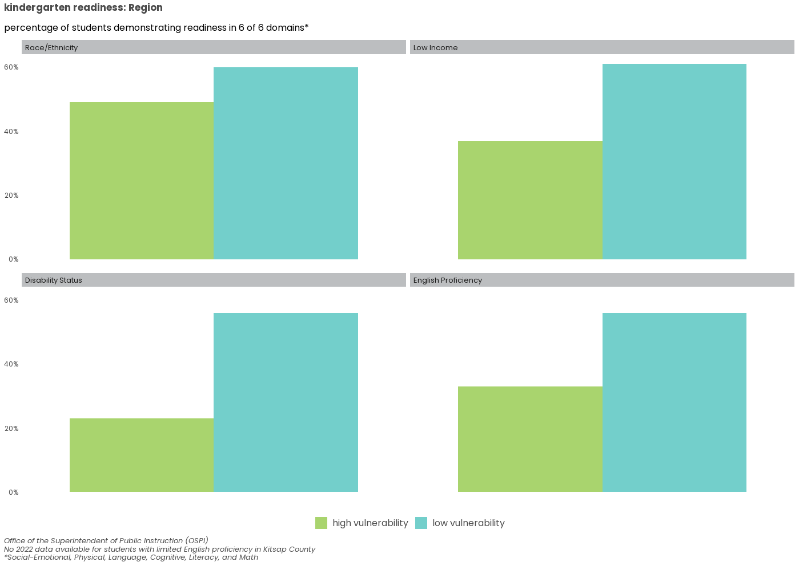
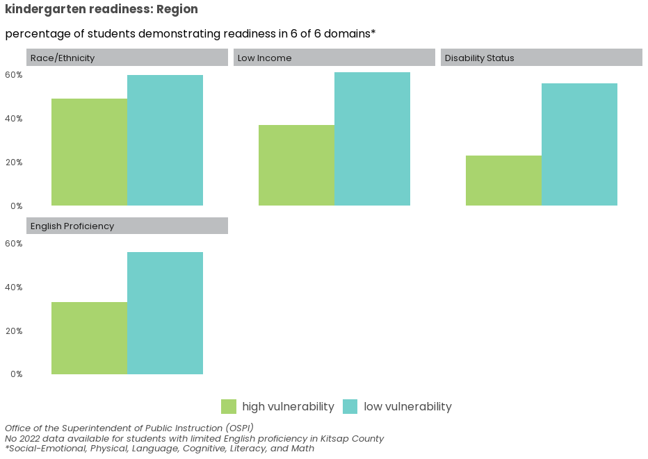
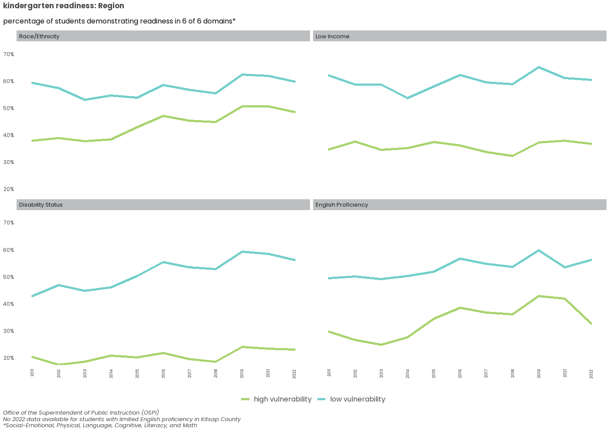

# Introduction
The data set referenced in this script is generated from the American Community Survey (ACS) and the Washington Office of Superintendent of Public Instruction [(OSPI)](https://www.k12.wa.us/data-reporting/data-portal). These data sets provide data at the **person-level**, with the ability to look at the different indicators by the six equity demographic groups of interest. 

# Access data
## PUMS and OSPI data (Elmer)
This data set was compiled from PUMS data. 

Looking at the fields in the data set
<div data-pagedtable="false">
  <script data-pagedtable-source type="application/json">
{"columns":[{"label":[""],"name":["_rn_"],"type":[""],"align":["left"]},{"label":["indicator_fact_id"],"name":[1],"type":["int"],"align":["right"]},{"label":["data_year"],"name":[2],"type":["int"],"align":["right"]},{"label":["span"],"name":[3],"type":["int"],"align":["right"]},{"label":["county"],"name":[4],"type":["chr"],"align":["left"]},{"label":["vulnerability"],"name":[5],"type":["chr"],"align":["left"]},{"label":["focus_type"],"name":[6],"type":["chr"],"align":["left"]},{"label":["focus_attribute"],"name":[7],"type":["chr"],"align":["left"]},{"label":["indicator_type"],"name":[8],"type":["chr"],"align":["left"]},{"label":["indicator_attribute"],"name":[9],"type":["chr"],"align":["left"]},{"label":["fact_type"],"name":[10],"type":["chr"],"align":["left"]},{"label":["fact_value"],"name":[11],"type":["dbl"],"align":["right"]},{"label":["margin_of_error"],"name":[12],"type":["dbl"],"align":["right"]}],"data":[{"1":"3205","2":"2021","3":"5","4":"Region","5":"high vulnerability","6":"Disability_cat","7":"With disability","8":"educational_attainment","9":"Bachelor's degree or higher","10":"share","11":"0.2553356","12":"0.01","_rn_":"1"},{"1":"3206","2":"2021","3":"5","4":"Region","5":"high vulnerability","6":"Disability_cat","7":"With disability","8":"educational_attainment","9":"Less than a Bachelor's degree","10":"share","11":"0.7446644","12":"0.01","_rn_":"2"},{"1":"3207","2":"2021","3":"5","4":"Region","5":"high vulnerability","6":"Disability_cat","7":"With disability","8":"educational_attainment","9":"Total","10":"share","11":"0.1413040","12":"0.00","_rn_":"3"},{"1":"3208","2":"2021","3":"5","4":"Region","5":"low vulnerability","6":"Disability_cat","7":"Without disability","8":"educational_attainment","9":"Bachelor's degree or higher","10":"share","11":"0.4660190","12":"0.00","_rn_":"4"},{"1":"3209","2":"2021","3":"5","4":"Region","5":"low vulnerability","6":"Disability_cat","7":"Without disability","8":"educational_attainment","9":"Less than a Bachelor's degree","10":"share","11":"0.5339810","12":"0.00","_rn_":"5"},{"1":"3210","2":"2021","3":"5","4":"Region","5":"low vulnerability","6":"Disability_cat","7":"Without disability","8":"educational_attainment","9":"Total","10":"share","11":"0.8586960","12":"0.00","_rn_":"6"}],"options":{"columns":{"min":{},"max":[10]},"rows":{"min":[10],"max":[10]},"pages":{}}}
  </script>
</div>

```
## [1] "Disability_cat" "Income_cat"     "LEP_cat"        "Older_cat"     
## [5] "POC_cat"        "Youth_cat"      "Total"
```

```
##  [1] "educational_attainment"  "healthcare_coverage"    
##  [3] "median_household_income" "household_poverty"      
##  [5] "housing_cost_burden"     "median_gross_rent"      
##  [7] "crowding"                "SNAP"                   
##  [9] "internet_access"         "Kindergarten readiness"
```

```
##  [1] 2021 2022 2019 2018 2017 2016 2015 2014 2013 2012 2011
```

# Kindergarten Readiness


## 1. Explore data
*In this section we make sure that the data set makes sense.*  


### Data fields
#### *consistent base data*

* There should be 5 geographies - the 4 counties and the Region. 
* There should be 6 equity focus categories - POC, income, disability, youth, older adult, and LEP
    + 2 sub-categories per focus group (e.g. people of color, non-people of color)

```
## [1] "King"      "Kitsap"    "Pierce"    "Snohomish" "Region"
```

```
## [1] "Income_cat"     "LEP_cat"        "Disability_cat" "POC_cat"
```
\
\

#### *indicator-specific data*
These fields will vary by indicator:

* Type of metric - this will determine how the data are visualized *(est ="percent" or "currency" or "number")*
* Number of years (5-year span) - this can vary depending on data availability
* Number of indicator-specific categories - this can vary depending on the indicator of interest, ranging from N/A (*median income*) to multiple levels (*crowding, housing cost burden*)

```
## [1] "share"
```

```
##  [1] 2022 2021 2019 2018 2017 2016 2015 2014 2013 2012 2011
```

```
## [1] "6 for 6 dimensions"
```

There are **5** geographies and **4** equity focus groups (each with **2** subgroups). There are **11** years in the data set and the indicator specific field has **1** attribute(s), which means there should be a total of **440** rows.

```
## [1] 1260
```
<span style="color: #00A7A0">There are some missing data.</span> 
\
\

#### *checking for missing data*
##### Year / geography

If we look at the data by year and geography, there should be **8** entries per year/geography.

```
##       
##        King Kitsap Pierce Region Snohomish
##   2011   24      6     24     24        18
##   2012   24      6     24     24        24
##   2013   24     15     24     24        24
##   2014   24     15     24     24        24
##   2015   24     24     24     24        24
##   2016   24     24     24     24        24
##   2017   24     24     24     24        24
##   2018   24     24     24     24        24
##   2019   24     24     24     24        24
##   2021   24     24     24     24        24
##   2022   24     24     24     24        24
```
<span style="color: #00A7A0">
Kitsap (2011-2014), Snohomish (2011), 2020
</span> 
\
\

##### Year by equity focus group

If we look at the data by year and focus group, there should be **10** entries per year/focus group.

```
##       
##        Disability_cat Income_cat LEP_cat POC_cat
##   2011             21         24      27      24
##   2012             24         27      27      24
##   2013             24         30      27      30
##   2014             24         30      27      30
##   2015             30         30      30      30
##   2016             30         30      30      30
##   2017             30         30      30      30
##   2018             30         30      30      30
##   2019             30         30      30      30
##   2021             30         30      30      30
##   2022             30         30      30      30
```
\
\

##### Year by equity focus sub-group

If we look at the data by year and focus sub-group, there should be **5** entries per year/focus sub-group.

```
##       
##        English proficient Limited English proficiency Low Income Non-Low Income
##   2011                 15                          12         12             12
##   2012                 15                          12         12             15
##   2013                 15                          12         15             15
##   2014                 15                          12         15             15
##   2015                 15                          15         15             15
##   2016                 15                          15         15             15
##   2017                 15                          15         15             15
##   2018                 15                          15         15             15
##   2019                 15                          15         15             15
##   2021                 15                          15         15             15
##   2022                 15                          15         15             15
##       
##        Non-POC POC With disability Without disability
##   2011      12  12               9                 12
##   2012      12  12              12                 12
##   2013      15  15              12                 12
##   2014      15  15              12                 12
##   2015      15  15              15                 15
##   2016      15  15              15                 15
##   2017      15  15              15                 15
##   2018      15  15              15                 15
##   2019      15  15              15                 15
##   2021      15  15              15                 15
##   2022      15  15              15                 15
```
\
\

##### Year by indicator attribute

If we look at the data by year and indicator attribute, there should be **40** entries per year/indicator attribute.

```
##       
##        6 for 6 dimensions
##   2011                 96
##   2012                102
##   2013                111
##   2014                111
##   2015                120
##   2016                120
##   2017                120
##   2018                120
##   2019                120
##   2021                120
##   2022                120
```
\
\

### Numeric data
To check for *0*s and *NULL*s

<span style="color: #00A7A0">
There are no nulls.
</span> 
\
\

To look at distribution of all data - not the most useful visual, but provides a sense of the range of values at a high level in one plot. 
\

\
This table includes a lot of information about the data set and helps to show the different levels of each field. It provides another way to check if data are available for all counties and all years, or where there may be gaps in the data set. 
<div data-pagedtable="false">
  <script data-pagedtable-source type="application/json">
{"columns":[{"label":["Variable"],"name":[1],"type":["chr"],"align":["left"]},{"label":["N"],"name":[2],"type":["chr"],"align":["left"]},{"label":["Mean"],"name":[3],"type":["chr"],"align":["left"]},{"label":["SD"],"name":[4],"type":["chr"],"align":["left"]},{"label":["Median"],"name":[5],"type":["chr"],"align":["left"]},{"label":["N"],"name":[6],"type":["chr"],"align":["left"]},{"label":["Mean"],"name":[7],"type":["chr"],"align":["left"]},{"label":["SD"],"name":[8],"type":["chr"],"align":["left"]},{"label":["Median"],"name":[9],"type":["chr"],"align":["left"]},{"label":["N"],"name":[10],"type":["chr"],"align":["left"]},{"label":["Mean"],"name":[11],"type":["chr"],"align":["left"]},{"label":["SD"],"name":[12],"type":["chr"],"align":["left"]},{"label":["Median"],"name":[13],"type":["chr"],"align":["left"]},{"label":["N"],"name":[14],"type":["chr"],"align":["left"]},{"label":["Mean"],"name":[15],"type":["chr"],"align":["left"]},{"label":["SD"],"name":[16],"type":["chr"],"align":["left"]},{"label":["Median"],"name":[17],"type":["chr"],"align":["left"]},{"label":["N"],"name":[18],"type":["chr"],"align":["left"]},{"label":["Mean"],"name":[19],"type":["chr"],"align":["left"]},{"label":["SD"],"name":[20],"type":["chr"],"align":["left"]},{"label":["Median"],"name":[21],"type":["chr"],"align":["left"]}],"data":[{"1":"county","2":"King","3":"","4":"","5":"","6":"Kitsap","7":"","8":"","9":"","10":"Pierce","11":"","12":"","13":"","14":"Region","15":"","16":"","17":"","18":"Snohomish","19":"","20":"","21":""},{"1":"vulnerability","2":"264","3":"","4":"","5":"","6":"210","7":"","8":"","9":"","10":"264","11":"","12":"","13":"","14":"264","15":"","16":"","17":"","18":"258","19":"","20":"","21":""},{"1":"... high vulnerability","2":"132","3":"50%","4":"","5":"","6":"96","7":"46%","8":"","9":"","10":"132","11":"50%","12":"","13":"","14":"132","15":"50%","16":"","17":"","18":"129","19":"50%","20":"","21":""},{"1":"... low vulnerability","2":"132","3":"50%","4":"","5":"","6":"114","7":"54%","8":"","9":"","10":"132","11":"50%","12":"","13":"","14":"132","15":"50%","16":"","17":"","18":"129","19":"50%","20":"","21":""},{"1":"focus_type","2":"264","3":"","4":"","5":"","6":"210","7":"","8":"","9":"","10":"264","11":"","12":"","13":"","14":"264","15":"","16":"","17":"","18":"258","19":"","20":"","21":""},{"1":"... Disability_cat","2":"66","3":"25%","4":"","5":"","6":"45","7":"21%","8":"","9":"","10":"66","11":"25%","12":"","13":"","14":"66","15":"25%","16":"","17":"","18":"60","19":"23%","20":"","21":""},{"1":"... Income_cat","2":"66","3":"25%","4":"","5":"","6":"57","7":"27%","8":"","9":"","10":"66","11":"25%","12":"","13":"","14":"66","15":"25%","16":"","17":"","18":"66","19":"26%","20":"","21":""},{"1":"... LEP_cat","2":"66","3":"25%","4":"","5":"","6":"54","7":"26%","8":"","9":"","10":"66","11":"25%","12":"","13":"","14":"66","15":"25%","16":"","17":"","18":"66","19":"26%","20":"","21":""},{"1":"... POC_cat","2":"66","3":"25%","4":"","5":"","6":"54","7":"26%","8":"","9":"","10":"66","11":"25%","12":"","13":"","14":"66","15":"25%","16":"","17":"","18":"66","19":"26%","20":"","21":""},{"1":"indicator_type","2":"264","3":"","4":"","5":"","6":"210","7":"","8":"","9":"","10":"264","11":"","12":"","13":"","14":"264","15":"","16":"","17":"","18":"258","19":"","20":"","21":""},{"1":"... Kindergarten readiness","2":"264","3":"100%","4":"","5":"","6":"210","7":"100%","8":"","9":"","10":"264","11":"100%","12":"","13":"","14":"264","15":"100%","16":"","17":"","18":"258","19":"100%","20":"","21":""},{"1":"indicator_attribute","2":"264","3":"","4":"","5":"","6":"210","7":"","8":"","9":"","10":"264","11":"","12":"","13":"","14":"264","15":"","16":"","17":"","18":"258","19":"","20":"","21":""},{"1":"... 6 for 6 dimensions","2":"264","3":"100%","4":"","5":"","6":"210","7":"100%","8":"","9":"","10":"264","11":"100%","12":"","13":"","14":"264","15":"100%","16":"","17":"","18":"258","19":"100%","20":"","21":""},{"1":"fact_value","2":"264","3":"0.46","4":"0.15","5":"0.48","6":"210","7":"0.42","8":"0.14","9":"0.48","10":"264","11":"0.43","12":"0.13","13":"0.47","14":"264","15":"0.45","16":"0.13","17":"0.47","18":"258","19":"0.42","20":"0.13","21":"0.46"}],"options":{"columns":{"min":{},"max":[10]},"rows":{"min":[10],"max":[10]},"pages":{}}}
  </script>
</div>


*Removing the '0' data point (Kitsap, 2022, LEP)*
<div data-pagedtable="false">
  <script data-pagedtable-source type="application/json">
{"columns":[{"label":["indicator_fact_id"],"name":[1],"type":["int"],"align":["right"]},{"label":["data_year"],"name":[2],"type":["dbl"],"align":["right"]},{"label":["span"],"name":[3],"type":["int"],"align":["right"]},{"label":["county"],"name":[4],"type":["chr"],"align":["left"]},{"label":["vulnerability"],"name":[5],"type":["chr"],"align":["left"]},{"label":["focus_type"],"name":[6],"type":["chr"],"align":["left"]},{"label":["focus_attribute"],"name":[7],"type":["chr"],"align":["left"]},{"label":["indicator_type"],"name":[8],"type":["chr"],"align":["left"]},{"label":["indicator_attribute"],"name":[9],"type":["chr"],"align":["left"]},{"label":["fact_type"],"name":[10],"type":["chr"],"align":["left"]},{"label":["fact_value"],"name":[11],"type":["dbl"],"align":["right"]},{"label":["margin_of_error"],"name":[12],"type":["dbl"],"align":["right"]},{"label":["data_year_yr"],"name":[13],"type":["chr"],"align":["left"]},{"label":["focus_type_edit"],"name":[14],"type":["chr"],"align":["left"]},{"label":["focus_attribute_ord"],"name":[15],"type":["fct"],"align":["left"]},{"label":["county_ord"],"name":[16],"type":["fct"],"align":["left"]},{"label":["focus_type_ord"],"name":[17],"type":["fct"],"align":["left"]}],"data":[{"1":"14857","2":"2022","3":"1","4":"Kitsap","5":"high vulnerability","6":"LEP_cat","7":"Limited English proficiency","8":"Kindergarten readiness","9":"6 for 6 dimensions","10":"share","11":"0","12":"0","13":"2022","14":"English Proficiency","15":"Limited English proficiency","16":"Kitsap","17":"English Proficiency"},{"1":"14857","2":"2022","3":"1","4":"Kitsap","5":"high vulnerability","6":"LEP_cat","7":"Limited English proficiency","8":"Kindergarten readiness","9":"6 for 6 dimensions","10":"share","11":"0","12":"0","13":"2022","14":"English Proficiency","15":"Limited English proficiency","16":"Kitsap","17":"English Proficiency"},{"1":"14857","2":"2022","3":"1","4":"Kitsap","5":"high vulnerability","6":"LEP_cat","7":"Limited English proficiency","8":"Kindergarten readiness","9":"6 for 6 dimensions","10":"share","11":"0","12":"0","13":"2022","14":"English Proficiency","15":"Limited English proficiency","16":"Kitsap","17":"English Proficiency"}],"options":{"columns":{"min":{},"max":[10]},"rows":{"min":[10],"max":[10]},"pages":{}}}
  </script>
</div>
\

### Data labels, shares
These charts were generated to ensure the labels across years are consistent/make sense. There had been an issue with misassigned labels because tidycensus::pums_variables, i.e. the only digital data dictionary available to associate labels with codes, exists only from 2017 forward. Most variables have had consistent codes, but in cases where the codes have shifted over time, using the 2017 lookup winds up mischaracterizing categories.
\
\
These charts also help to confirm that the shares add up to 100% - only relevant when *indicator_attribute* has more than one category. The *indicator_attribute* for median household income is NA.
\
\
*The colors of the charts may not be consistent between the years depending on missing data.* 
\


## 2. Visually explore data
### 2a. Scatter plots
*In this section we start to explore the data visually - distribution by the different dimensions within the data set. These plots are helpful to check for outliers and get a higher level understanding of the data in one visual, before slicing the data by geography and equity focus group in the following sections.* 
\
\
The following code will need to be adjusted to fit the fields specific to the data indicator. For educational attainment, we focus on those with a Bachelor's degree or higher. The following code establishes the data frame that the rest of the analysis uses. If there are fewer than 2 *indicator attributes*, this section can be skipped/commented out, but the code will need to be adjusted throughout. 
\
\

#### By *indicator_attribute*
This section isn't relevant for this specific indicator because there aren't unique indicator attributes. 

#### By Year


\

### 2b. Facets by geography
*In this section we explore trends by different groups with MOEs. These charts help to show any missing data by geography, year, or focus group/subgroup.*


\
\

## 3. Developing visuals
*In this section we further develop the draft visuals for communicating the results and supporting the narrative for the Equity Tracker webpages. These charts are slightly more refined by slicing the data by geography and equity focus group. The line charts don't include MOEs, but they help make connections between the same groups over time.* 

### Line charts by geography
#### High / low vulnerability groups


\
\

#### First/last years


\
\

#### calculated difference b/t
The 5 geographies are all included in the facets by geography, but they could be separated out to create 5 individual charts - one for each geography.


### Line charts by equity group
#### High / low vulnerability groups


\
\

#### First/last years


\
\

#### calculated difference b/t
The 6 equity focus groups are all included in the facets by geography, but they could be separated out to create 6 individual charts - one for each focus group.

\

### Cleveland dot plot
[*Resource for visual*](https://uc-r.github.io/cleveland-dot-plots)
\
The code to make this is type of visual is long - adjust to indicator as needed (*scale_x_continuous*, *labs*, *label*, etc).
\

\
\

## 4. Save files
*This section needs to be edited. Keep the code chunks commented out for now as we draft and refine the visuals.*

### PNG


### HTML


### Copy files from Y drive > website folder

\
\

## 5. Archive
*This section includes visuals that were determined to be less useful. We didn't want to lose the work, but didn't want to include it in the main workflow. Feel free to comment out if you don't want to adjust the arguments to fit the indicator of interest.*

### Line chart: all categories

### Line chart: by vulnerability

\
\

# 3 visuals
## 1. Map of most recent data


```{=html}
<style type="text/css">div.info.legend.leaflet-control br {clear: both;} html * {font-family: Poppins !important;}</style>
<div class="leaflet html-widget html-fill-item-overflow-hidden html-fill-item" id="htmlwidget-77b74e0e75c20ec19dcf" style="width:672px;height:480px;"></div>
<script type="application/json" data-for="htmlwidget-77b74e0e75c20ec19dcf">{"x":{"options":{"crs":{"crsClass":"L.CRS.EPSG3857","code":null,"proj4def":null,"projectedBounds":null,"options":{}}},"calls":[{"method":"addProviderTiles","args":["CartoDB.Positron",null,null,{"errorTileUrl":"","noWrap":false,"detectRetina":false}]},{"method":"addPolygons","args":[[[[{"lng":[-122.410123127994,-122.409522131972,-122.408467133543,-122.407322132776,-122.407032134642,-122.404122137065,-122.392221139869,-122.387213142112,-122.38072114433,-122.37558414741,-122.365020150561,-122.362999151932,-122.356625153683,-122.353420156138,-122.3532521545,-122.352220155302,-122.348420158221,-122.348019160971,-122.350881159946,-122.351019160066,-122.355868159529,-122.330354164196,-122.324807164907,-122.324705164852,-122.324436165544,-122.324165165545,-122.323694164592,-122.323142165353,-122.3223951668,-122.321950165367,-122.319797164845,-122.318725166464,-122.317241167364,-122.317155166139,-122.31697516604,-122.313178167299,-122.313179166321,-122.312207166201,-122.309125167301,-122.308824167553,-122.308621166787,-122.307807167091,-122.30679616754,-122.305731167363,-122.304676168263,-122.303363167945,-122.302811168289,-122.302722168133,-122.302542168751,-122.302472168661,-122.301983168598,-122.300683169301,-122.300104168082,-122.299994168519,-122.299954169159,-122.299883169382,-122.29876316925,-122.298489169417,-122.297203170717,-122.296719169453,-122.296382169909,-122.29457616985,-122.293760169458,-122.292795170033,-122.292207169868,-122.292029169102,-122.291928169023,-122.291911170149,-122.291913169281,-122.291908168692,-122.291857168597,-122.291898169527,-122.291900168853,-122.291823169063,-122.291764168298,-122.291764168303,-122.29178316876,-122.291784167249,-122.291804168599,-122.291855169232,-122.291865167362,-122.291873168241,-122.29189916865,-122.291898168502,-122.291891167311,-122.291867166145,-122.291859166695,-122.291858166271,-122.292321166732,-122.292265166602,-122.29190616686,-122.291794166136,-122.291720165964,-122.291706166111,-122.29170016527,-122.29169316559,-122.29176016541,-122.291793164947,-122.291841165801,-122.291941165349,-122.292068166226,-122.292240164247,-122.292440163261,-122.292068163759,-122.291823165494,-122.290171165235,-122.286537165381,-122.286537164669,-122.286541163561,-122.286541164249,-122.286544164277,-122.286566162596,-122.286565163047,-122.286576162862,-122.286594161574,-122.285792162655,-122.285230161997,-122.284178162354,-122.283850161341,-122.282335162341,-122.282156161787,-122.281315162762,-122.281332163191,-122.281393161114,-122.281436161048,-122.281441160934,-122.281446160398,-122.28154216157,-122.28155716079,-122.281608160327,-122.279035160509,-122.277666160883,-122.276620160997,-122.275736160875,-122.275652161636,-122.275028160891,-122.27488716053,-122.27484116142,-122.274347160355,-122.273605159805,-122.272492160639,-122.271315160931,-122.270700160078,-122.270478160649,-122.270344161853,-122.270281160765,-122.27017415967,-122.270132160619,-122.270159161309,-122.269916160694,-122.269798161649,-122.26969115966,-122.269622161163,-122.269617161086,-122.269593161437,-122.269612161585,-122.269675159542,-122.269699160595,-122.269665160831,-122.269674161496,-122.269664160817,-122.269919160428,-122.270233160038,-122.270832160177,-122.271033160581,-122.270943160807,-122.270758160426,-122.270682160004,-122.270583159534,-122.27054115966,-122.270507158686,-122.27044515921,-122.270425160429,-122.270407159089,-122.269979160502,-122.269391160018,-122.268586158872,-122.26815415815,-122.267953158324,-122.267675158005,-122.267423158141,-122.267150157914,-122.267116158724,-122.267080157663,-122.26693615828,-122.266894158135,-122.266850157555,-122.266802156948,-122.266980158143,-122.267364157209,-122.267866157791,-122.270190157944,-122.270236156734,-122.270267156263,-122.270306157398,-122.26924015661,-122.269240155942,-122.268976157313,-122.268847157435,-122.268584156539,-122.268058157215,-122.267903157984,-122.267029157975,-122.266982157103,-122.266861157361,-122.266367157843,-122.266069157011,-122.265105155665,-122.265061155725,-122.264717156027,-122.264524156212,-122.264413157326,-122.26436015596,-122.264308155247,-122.264242156505,-122.264201154949,-122.264182155002,-122.264182155475,-122.264192154592,-122.264210155588,-122.264258155658,-122.264311153608,-122.264358155095,-122.264442154812,-122.264467155789,-122.264697154488,-122.265049153417,-122.265513156055,-122.265638154508,-122.266100153942,-122.267843153923,-122.270180154499,-122.270428153876,-122.270714153838,-122.27197515364,-122.273088153633,-122.273174154235,-122.273444153668,-122.273870153353,-122.274369152526,-122.275591152284,-122.276757152427,-122.278638153089,-122.279751151456,-122.28071515287,-122.281162152142,-122.281263151804,-122.28214815219,-122.282765153241,-122.283251151545,-122.285637152439,-122.285761152095,-122.285842150417,-122.285936151037,-122.286025152479,-122.286157151792,-122.286318151753,-122.286423151583,-122.286568150971,-122.286719151397,-122.287018150843,-122.287226152264,-122.288250150578,-122.288987151567,-122.291489151626,-122.291566151914,-122.291714150261,-122.291813149594,-122.292696151006,-122.291818151099,-122.291822151117,-122.29183114832,-122.291828148751,-122.29098514979,-122.290798150272,-122.290424149538,-122.290063149522,-122.289880149703,-122.289710150137,-122.289654149642,-122.289591150723,-122.289572150892,-122.2888601495,-122.288927148317,-122.289002149308,-122.289748148734,-122.289797149186,-122.290037150283,-122.288663149504,-122.288774148368,-122.288885148638,-122.288944150274,-122.289076149508,-122.289172148734,-122.289385147857,-122.28944514865,-122.289640148182,-122.289653148768,-122.289681148121,-122.289754148932,-122.28978014655,-122.289900147427,-122.290984147371,-122.291487146579,-122.29169514663,-122.293142146256,-122.293417145638,-122.294208146777,-122.294432144337,-122.29462314641,-122.294695146541,-122.294952145041,-122.29512814404,-122.295263144531,-122.295390145036,-122.295641143834,-122.295857143991,-122.296043143873,-122.296072142792,-122.296113144108,-122.296226143111,-122.296277143642,-122.296356143544,-122.296413144276,-122.29665814254,-122.296900142114,-122.2971681425,-122.297219142334,-122.297046142179,-122.296795142038,-122.296241142344,-122.29614114375,-122.296028142571,-122.2954341427,-122.294777143131,-122.294221144071,-122.29425314373,-122.294258143093,-122.294258143272,-122.294277142668,-122.294301143246,-122.29433614276,-122.294402142639,-122.294353142355,-122.295502142198,-122.296725141859,-122.296724141691,-122.296730141541,-122.296744142811,-122.296732142023,-122.296709141276,-122.296701141564,-122.296842140424,-122.296820140707,-122.29680713991,-122.296769140993,-122.296722141047,-122.296794140938,-122.296842139965,-122.296790140554,-122.296787140291,-122.29678613944,-122.296797140855,-122.296779139852,-122.296776138959,-122.296815141295,-122.296812140549,-122.296768139799,-122.296807139675,-122.297242139387,-122.297509139796,-122.297320139948,-122.29722713865,-122.297181139566,-122.296708138336,-122.296642139106,-122.296315139928,-122.296163138617,-122.295967139854,-122.295764139181,-122.294675139184,-122.294247138825,-122.294136139509,-122.293812139513,-122.293195139208,-122.292635139036,-122.292602139051,-122.292339138915,-122.292336138956,-122.292342138614,-122.292717139448,-122.292850139472,-122.293085139699,-122.293411137971,-122.293497138148,-122.293697137668,-122.296112137578,-122.296250138415,-122.299038137322,-122.299392136918,-122.299854136706,-122.300406136393,-122.301465136417,-122.301890137376,-122.302673136634,-122.303593135595,-122.30373913483,-122.30413513524,-122.305922135278,-122.306851135373,-122.30704213445,-122.307421135719,-122.308465135474,-122.309553134904,-122.309695133442,-122.309986135558,-122.310554135501,-122.31057313498,-122.310811134942,-122.311014134451,-122.311084133845,-122.311321134634,-122.311414133361,-122.311518135499,-122.312076134074,-122.312200132922,-122.312298134572,-122.312498133894,-122.312819133202,-122.312325133344,-122.312106133786,-122.311934135321,-122.31174613494,-122.311371134573,-122.311543133997,-122.313258134023,-122.313421133286,-122.315095133124,-122.315550133711,-122.316250134471,-122.316489134434,-122.316519133419,-122.316785134158,-122.317092132957,-122.317348132498,-122.317917133542,-122.318092132792,-122.318205133968,-122.318226132481,-122.318232131807,-122.32328813256,-122.323292132426,-122.323297133286,-122.323291131438,-122.323836132678,-122.324189132463,-122.325515132361,-122.327311132907,-122.328169131159,-122.328550131376,-122.330064130963,-122.330258131758,-122.330274132149,-122.330571131005,-122.330955130044,-122.331138132358,-122.331167130641,-122.331445131591,-122.331771130832,-122.332000130585,-122.332106131082,-122.332523129918,-122.336727129339,-122.337506129847,-122.337522130604,-122.33791513032,-122.339900128273,-122.34011912822,-122.340433128659,-122.340735129593,-122.341422129459,-122.341595129128,-122.342863128397,-122.343858128563,-122.344136127885,-122.34462412826,-122.345411127812,-122.346684127463,-122.347957127726,-122.348002128009,-122.349231127572,-122.350640127691,-122.351720127129,-122.351763127604,-122.352894128076,-122.353389126477,-122.35402212769,-122.355152125605,-122.356097126603,-122.35649812674,-122.357844126354,-122.358213126485,-122.358542125923,-122.358549126718,-122.359166125211,-122.360480126412,-122.360521125909,-122.360527125008,-122.36111212598,-122.361836126699,-122.362605125505,-122.363211124395,-122.364555125264,-122.36590012509,-122.367265123961,-122.367680125441,-122.368647124709,-122.371385123136,-122.371301124334,-122.371257123888,-122.37125912469,-122.371248124752,-122.371137125232,-122.371089123595,-122.371065125923,-122.371005125293,-122.370985125396,-122.37096912534,-122.370873126046,-122.370845125281,-122.370862126902,-122.370847127004,-122.370699126489,-122.370515126983,-122.370450126838,-122.370449126734,-122.370379127434,-122.370389126596,-122.370434126992,-122.370459127068,-122.370525125932,-122.370535126933,-122.370546128622,-122.370581128612,-122.370679127732,-122.370904127656,-122.371398127222,-122.37203612654,-122.372242126377,-122.373106127391,-122.373785128818,-122.373908126762,-122.373957127871,-122.374044127899,-122.374118126976,-122.374263127916,-122.374835127627,-122.374905127617,-122.375009127087,-122.375053127337,-122.375193127896,-122.375297127922,-122.37563712783,-122.380113128141,-122.381795128534,-122.399222126794,-122.407643126798,-122.409243126265,-122.410123127994],"lat":[47.4767143981957,47.4578143989037,47.4545563984539,47.4510143986448,47.4504973989422,47.4453143989042,47.4326153983885,47.4282173977124,47.4225153971271,47.4179023974351,47.408715396407,47.4069383963157,47.4013333959454,47.3985153960531,47.3983753957762,47.3975153956884,47.3885153952511,47.3823153956923,47.3783093958529,47.3781153959511,47.3752653970458,47.3757843943506,47.3758943930707,47.375896393623,47.37590039365,47.3758863931228,47.3758943937333,47.3758723935045,47.3758913931978,47.3758953941935,47.3759293938495,47.375963392831,47.3759413933836,47.3759403923858,47.3759383932881,47.3760063923958,47.3760733923906,47.3760563922481,47.3760163926364,47.3759963924207,47.3759883914411,47.3759753923288,47.375959391395,47.3759433915736,47.3759273921852,47.3759073906826,47.3758993909125,47.3758983917777,47.3758943915321,47.3758923919064,47.3758803918465,47.3758483907296,47.3758523908295,47.3758533913869,47.375852390749,47.3758503907739,47.3758183913993,47.3758103920602,47.3758053908794,47.3758043910577,47.3758033906008,47.3757743901916,47.3757613907152,47.3757383909058,47.375724390116,47.376430390357,47.3768273898202,47.3768903905919,47.3782323901008,47.3811193902335,47.3818163899514,47.3819573901449,47.3825843900763,47.3826193897014,47.3827013899633,47.3830203894337,47.38358538986,47.3840593895,47.384210390118,47.3844393896769,47.384528390256,47.3846903890903,47.3847663905036,47.3865133895697,47.3875653893288,47.3912383895528,47.3917703897206,47.3918533885728,47.3920303897817,47.3921583893313,47.3928923894103,47.3931303898071,47.3934143894666,47.3935073900118,47.3936153891355,47.3937533891636,47.3946643894108,47.3953093892579,47.3960603889338,47.3975813885522,47.3984353891105,47.3995883896042,47.4009393888166,47.4009173884508,47.400918388899,47.4009623883788,47.4010253882891,47.4012603878697,47.4037303879844,47.4038043878218,47.4042583879269,47.4082373888882,47.4086093882118,47.4105093881541,47.4154753874323,47.4154803869348,47.4154843880292,47.4154933873286,47.4154963872853,47.4155113880629,47.4155103869588,47.4155203871637,47.4160563871179,47.4182853865996,47.4191743867084,47.4192583864125,47.419359387571,47.422362386522,47.4228113862441,47.424176387064,47.4259363853283,47.4268713852047,47.4275113859024,47.4268393855064,47.4267763858256,47.4272213856201,47.4271143858909,47.4271583859856,47.4275773852513,47.4281823857921,47.4290903858127,47.4299303851692,47.4303773844524,47.4305383853542,47.4306353855094,47.430681384818,47.4307823849867,47.4309263851368,47.431026384529,47.4310853855435,47.4311483846234,47.4312623843427,47.43141938444,47.4314693850728,47.431699384804,47.4320673853275,47.4323213845156,47.4325273850694,47.4327203843832,47.4328283843647,47.43289738477,47.4328913857524,47.4328843840107,47.4328883847402,47.4328913844444,47.4337993847004,47.4341553841741,47.4343113851651,47.4345113843317,47.4345973851635,47.434686384608,47.4348493840463,47.4349413851852,47.4350223850721,47.4354533846182,47.4382133841297,47.4418453840449,47.4438303842455,47.4437983841215,47.4437433841437,47.4436813833793,47.4435923835754,47.4437263839825,47.4438933833531,47.4445463835292,47.4447343840776,47.4449233841481,47.4451163839615,47.4451083832105,47.4450913846121,47.4450963843723,47.445166383826,47.4462013834082,47.4469293843471,47.4478313840699,47.4478173842615,47.4477763835073,47.4477783837315,47.4478413838505,47.4478373837396,47.4478303838055,47.447828383231,47.447818384399,47.4479443843656,47.4482493839834,47.4494933834346,47.4502443834373,47.4526423835701,47.4527543830937,47.4536543824992,47.4543323834501,47.4548023831536,47.4550893829709,47.4554133829655,47.455896382515,47.4563393830365,47.4567483830438,47.4570933839134,47.4574133822584,47.4577193827857,47.4583253833772,47.4587143824173,47.4589973834315,47.4594173826962,47.4595433836275,47.4595443829235,47.4595463827846,47.4595503826645,47.4595503835521,47.4595553832787,47.4595923834596,47.4595913839349,47.4595923838498,47.4595883831539,47.4595863842962,47.4595863836123,47.4595823829819,47.4595863833341,47.4595873841611,47.4595863839403,47.4595983836253,47.4595973844568,47.4596043841432,47.4596033843503,47.4596233845799,47.4596313840734,47.4596293845186,47.4596313839643,47.4596323852582,47.4596343844775,47.4596443843907,47.4596223852463,47.4595983852182,47.4595553855985,47.4594893851335,47.4595303853738,47.4595693849083,47.4595903853091,47.4596133858665,47.4596313849727,47.4596333856718,47.4596353858067,47.4596433847348,47.4596493849151,47.4596423867747,47.4596463854325,47.4596533856226,47.4596523856457,47.4596503855904,47.4604343864224,47.4614733857054,47.4631553853283,47.4634963852419,47.4634963857868,47.4634883858422,47.4634843847939,47.4634623855717,47.4634513847854,47.4634373849106,47.4635463855967,47.463671385463,47.4637103848913,47.4651363853559,47.4651373844958,47.465139385647,47.4651553851259,47.4652723849498,47.4662353854146,47.4666483844081,47.4669593848591,47.4672363848957,47.4674463840957,47.4681503841088,47.4687993847543,47.4702283840357,47.4706353849411,47.4720463854755,47.472114384805,47.472248385,47.4724693853736,47.4725283847412,47.4727273849022,47.47433738467,47.47507638466,47.4753913847118,47.4775133843572,47.4779803859586,47.4793593851378,47.4797513846501,47.4801113852009,47.4803033854371,47.4815473846311,47.4824143851175,47.482959385375,47.48337738501,47.4841983849064,47.48489438519,47.4855003844174,47.4855913849089,47.4857263857936,47.4860893845475,47.486245384529,47.4864913848573,47.4866363854143,47.4873193848352,47.4879583852526,47.488612385452,47.4887243847477,47.4886893846169,47.4886733844803,47.4886633848653,47.488661384515,47.4886593851847,47.4886743841224,47.4886823842717,47.4887023841954,47.4894703842441,47.4895443848393,47.4896123846679,47.4900883845783,47.4906193846238,47.4914193844361,47.4914183839298,47.4923023844643,47.492254384383,47.492282385012,47.4923853841279,47.4925583844606,47.4929463841487,47.4935403846884,47.4940133850535,47.4940643839422,47.4940603849599,47.49581938512,47.4968613841925,47.4968663845669,47.4968723843478,47.4978873847563,47.4979303840992,47.4984553845235,47.4988783837336,47.4989633845657,47.4992143832679,47.4996573841182,47.5000353835369,47.500214384387,47.5005143839704,47.5008583842575,47.5009013844845,47.5013833839559,47.5021593840161,47.5024973844217,47.5028933838253,47.5030893835121,47.5036703840217,47.5039093839015,47.5043113842314,47.5043413829417,47.5045303830217,47.5045693836452,47.5053843841469,47.5055433843968,47.5056123839548,47.5058163830177,47.5063123843095,47.506948383876,47.5070523833022,47.5078903828853,47.5079483826113,47.5083603831959,47.5092663831517,47.5094453828128,47.5097593831291,47.5100243832257,47.5100933833462,47.5101603832072,47.5109763832871,47.5110293833302,47.5120373839272,47.5121433839344,47.5121643839358,47.5122093840797,47.5121163835995,47.5122613841708,47.5121793841884,47.5125203838403,47.5125763840166,47.5129293844096,47.5129353847643,47.5129423848558,47.5129403852732,47.5129433842669,47.5136753852824,47.5144393843459,47.514538384174,47.514339384568,47.5136663854857,47.5136443850592,47.5133703844585,47.513663384722,47.5137653850262,47.5136623848851,47.5137793852576,47.5139113853809,47.5136583851042,47.5137803860567,47.5138783848309,47.5140783855126,47.5143983849367,47.5144403855077,47.5144543849493,47.5145183847077,47.5145193854367,47.5145793847816,47.5148313851534,47.5148343855819,47.5149963844708,47.5150013857581,47.5149323848168,47.5147493864055,47.5147253849812,47.5147223852851,47.5147563862044,47.514849385881,47.5149073853656,47.5150023847657,47.5150183862089,47.5150023848288,47.5149813852008,47.5153003859248,47.5153163865136,47.5147903864117,47.5141993856195,47.5138313868376,47.5138473864013,47.5138643861689,47.5138633861423,47.5139913867381,47.513988386485,47.5139933866713,47.5139913868877,47.5139933875717,47.5140233873203,47.5145333870398,47.5149383872844,47.5151153874593,47.5151433876824,47.5154133864958,47.5158003869216,47.5162073872364,47.5164123874882,47.5172263870054,47.5172463870788,47.5172513876368,47.5172503867829,47.5172523883946,47.5172633882431,47.5172713883123,47.5172343884282,47.5172143876243,47.5172703882881,47.5172753879278,47.517281388021,47.5172873884034,47.5172883887883,47.5172933883825,47.5172963895143,47.5173033887239,47.5173113884268,47.5173113883874,47.5173183889478,47.5173263885562,47.5173333886589,47.5173333895737,47.5173553895582,47.5173643898206,47.5173683890523,47.5173743893694,47.5173803902225,47.517376389912,47.517354389913,47.517347390008,47.5173413902425,47.5155223901868,47.5155223903455,47.515522390769,47.5168143899187,47.5173543903356,47.5173563901591,47.5173553902105,47.5173553910207,47.5173563902241,47.5173563898664,47.5173553912424,47.5173713909408,47.5173753908508,47.51738739093,47.5174183908717,47.5166473911956,47.5160703912593,47.5160183914744,47.5157393918545,47.5144533912639,47.5136993918168,47.5133293910741,47.5125423914951,47.5122843920535,47.5120413917538,47.5100323914929,47.5094523915335,47.5081933908753,47.5080113917873,47.5072533925736,47.5066583918615,47.5064033918138,47.5063923913389,47.5058153915189,47.5056803918833,47.5054973926103,47.5053963915568,47.5051293914336,47.5045143920575,47.5038603924288,47.5036773917084,47.503505392331,47.5032353926432,47.5027723923555,47.5021763922135,47.5020083921086,47.5013723923089,47.5008283923004,47.5006913922607,47.5005753928103,47.4999113927907,47.4996113934649,47.4992153930877,47.4976533930189,47.497491393009,47.4973143925738,47.4972423924309,47.4970263930071,47.496863392133,47.4964283931598,47.4931973938567,47.4919063938744,47.4852143965942,47.4821443968351,47.4800993974821,47.4767143981957]}]],[[{"lng":[-121.58501118279,-121.584998182369,-121.58491218285,-121.584776185395,-121.584700185981,-121.584617188066,-121.584522189173,-121.584504190763,-121.584445189493,-121.582216189029,-121.581155190125,-121.576437191085,-121.572672191674,-121.572586192556,-121.570756190936,-121.567672192297,-121.548701196495,-121.540476196501,-121.538970196028,-121.521134199377,-121.51715919983,-121.513272201141,-121.511031201286,-121.506990202238,-121.506794202608,-121.50622620258,-121.505569202829,-121.502234203085,-121.500167203602,-121.499849203062,-121.499708203273,-121.499580204152,-121.499373203184,-121.498677202829,-121.498384204711,-121.49819020395,-121.498013203042,-121.497009204546,-121.492484205225,-121.492279204205,-121.491865204189,-121.491797205224,-121.485417204698,-121.484741205527,-121.484692205857,-121.4846492057,-121.484551206086,-121.484343205399,-121.483927206391,-121.48350420562,-121.482303207109,-121.479403206246,-121.46288920937,-121.462364208687,-121.462104209586,-121.456272209943,-121.455695210368,-121.455530210535,-121.455520210345,-121.432212213572,-121.427200215244,-121.421457216305,-121.420320216636,-121.419870215755,-121.419619216517,-121.406331217876,-121.406012218938,-121.385189222817,-121.385032222642,-121.384933221906,-121.380014222307,-121.377191223378,-121.368017224435,-121.367497224207,-121.363000226587,-121.354561225925,-121.346418227784,-121.346060229212,-121.342439228748,-121.340736228259,-121.340143228682,-121.337438230172,-121.337104229869,-121.335489230011,-121.334433230449,-121.317639234303,-121.317466233828,-121.317203233583,-121.314049233517,-121.311886233604,-121.308942234558,-121.308687234104,-121.308305234482,-121.306437235101,-121.306057235348,-121.305864235468,-121.305366234657,-121.30135323526,-121.301312236519,-121.301279235727,-121.301234236366,-121.301180235631,-121.301003234692,-121.3006612364,-121.30055323592,-121.297863236385,-121.296317237819,-121.295669237647,-121.286809239377,-121.286675237953,-121.286468238053,-121.284365239065,-121.279808239243,-121.279559238812,-121.279432238998,-121.274364239354,-121.274017239089,-121.273974239808,-121.27394123988,-121.27225524131,-121.262775242045,-121.256967242135,-121.253011244836,-121.249788244862,-121.24895524505,-121.248652243999,-121.247320244647,-121.24683224466,-121.245795245628,-121.243097244736,-121.242954246646,-121.232859247261,-121.232191248094,-121.216749248957,-121.195657253556,-121.195611253882,-121.194651253741,-121.187137256056,-121.17495625612,-121.174906257712,-121.174817256339,-121.173000256731,-121.172787257257,-121.168465258556,-121.152034261172,-121.144115262296,-121.142689261593,-121.142655262388,-121.142624262267,-121.141127262604,-121.134645263854,-121.131891264682,-121.131660264803,-121.128137264997,-121.128126264587,-121.126196265044,-121.122253266225,-121.119164265417,-121.120682265401,-121.120477264988,-121.120320264581,-121.120297264079,-121.116410265342,-121.116226264237,-121.113958264715,-121.113650265408,-121.111695265866,-121.109387264977,-121.10933926336,-121.108860263657,-121.107796264065,-121.10773226523,-121.10676326502,-121.105147265005,-121.103956264506,-121.102105264695,-121.102005265942,-121.099870264908,-121.09867526451,-121.098496264399,-121.097573265485,-121.094632265798,-121.09255626606,-121.092371264484,-121.092366263805,-121.092366264335,-121.089204264814,-121.08757126467,-121.086922265097,-121.084684264537,-121.084388265879,-121.084165265967,-121.083517264691,-121.082737264617,-121.082160264248,-121.081724264002,-121.080847263619,-121.078943264683,-121.078518263253,-121.077359262915,-121.074494263057,-121.074296263682,-121.074112264019,-121.073459263188,-121.073348261653,-121.070670263355,-121.070500262059,-121.070856262961,-121.073150262075,-121.075253260729,-121.076665259981,-121.078017261175,-121.080207260297,-121.080665259354,-121.080696260586,-121.080730259552,-121.082598259743,-121.085725258429,-121.087662258301,-121.089796257457,-121.090121258659,-121.092916258437,-121.093371257833,-121.095793257699,-121.09805725805,-121.100894257117,-121.101070256272,-121.103296256902,-121.1034052568,-121.106917256102,-121.108628257283,-121.109145255557,-121.111871254811,-121.114008254279,-121.1156162544,-121.118791253371,-121.120928253621,-121.121223253527,-121.121178252949,-121.121261251171,-121.122942250499,-121.123702251181,-121.123859250783,-121.125976250585,-121.128159250561,-121.130464251033,-121.130629249723,-121.133397249441,-121.134328248018,-121.136823246636,-121.136904246983,-121.139230249092,-121.141674247011,-121.141976246253,-121.144538247764,-121.144762246404,-121.146889246891,-121.14867824529,-121.149804244298,-121.152060245781,-121.153497243733,-121.153697244207,-121.15388424364,-121.153268243148,-121.153215243151,-121.152490242778,-121.152423242263,-121.15204524291,-121.150897242562,-121.149403243756,-121.148468243114,-121.147214242973,-121.147413242295,-121.14752524315,-121.147597241152,-121.149905240836,-121.150075241429,-121.150963240227,-121.151299240353,-121.152032239552,-121.152041239392,-121.153497239413,-121.16870023678,-121.173604236173,-121.195418232183,-121.205435230695,-121.216891229063,-121.234981226065,-121.238381225456,-121.238416224957,-121.259839221048,-121.259915222141,-121.277692218272,-121.281338218597,-121.290267216955,-121.290796216971,-121.292043215891,-121.29207921594,-121.292189216771,-121.292298216812,-121.292370216658,-121.297763215058,-121.302852214614,-121.303687214242,-121.310877212984,-121.312705212067,-121.31819521208,-121.323947211919,-121.327986210344,-121.327985210764,-121.327986210587,-121.327986211766,-121.346496208593,-121.349486207595,-121.350209208364,-121.367999205531,-121.370992205129,-121.371712203061,-121.384971201607,-121.389499201405,-121.392483200276,-121.410997197802,-121.413992196314,-121.420698195325,-121.432514194734,-121.435495193539,-121.456509190546,-121.461984189005,-121.463807189474,-121.467648187562,-121.471593188568,-121.477599186329,-121.484739185058,-121.487024185835,-121.48833918316,-121.490972185106,-121.491983183256,-121.493134184888,-121.494432183319,-121.499041182398,-121.509695182011,-121.520436179128,-121.541918175693,-121.548436174524,-121.560444172414,-121.563387171544,-121.582685169674,-121.58268516883,-121.582685168801,-121.584938168812,-121.584937169357,-121.584936169371,-121.584921171745,-121.584916170604,-121.584905171539,-121.584820172766,-121.584801173662,-121.584795174189,-121.584850174516,-121.58488617515,-121.584492177978,-121.584692177493,-121.584701179635,-121.58470317979,-121.584713180668,-121.584712179391,-121.584718179708,-121.584709181563,-121.584713180341,-121.584748180644,-121.58501118279],"lat":[47.8066122895142,47.805872290368,47.800952290384,47.7931322906491,47.7887312910817,47.784163290614,47.7785312904206,47.7775202916482,47.7770492912949,47.777145290954,47.777194290752,47.7773902912354,47.7775492892725,47.7775492902971,47.7775562906825,47.7775622894985,47.7776082874655,47.777842286614,47.7778382863344,47.7778042849149,47.7778002842186,47.7778052831165,47.7778082836669,47.7778132829438,47.7778162822973,47.7778142832456,47.7778152834728,47.7778192822981,47.7778232815726,47.7778222818269,47.7778232821003,47.7778252820907,47.7778232824131,47.7778242816099,47.7778242815865,47.7778242826946,47.777825281847,47.7778262817824,47.7778852813002,47.777888281614,47.7778942808119,47.7778962803582,47.7779792805652,47.7779892802505,47.7779892809846,47.7779892807513,47.7779912798265,47.7779932800956,47.7779992807863,47.7780052802586,47.7780202796892,47.778059279677,47.7783052771858,47.7783142783046,47.7783182775753,47.7784092774049,47.7784182770075,47.7784202763803,47.7805702769157,47.7804912741987,47.7804492731674,47.7804202732748,47.7804182731028,47.7804122729789,47.7804112721309,47.7803432717112,47.7803412707952,47.7802062697542,47.7802042698827,47.7802042688142,47.7801942684322,47.780190268754,47.7801692675472,47.7801322669158,47.7800862670553,47.7800002657054,47.7799172641729,47.7799192645901,47.7799372645132,47.7799462649423,47.7799492648593,47.7799622646647,47.7799642632549,47.7799702642423,47.7799592642313,47.7797422614052,47.7797392615118,47.7797362623489,47.7796842614196,47.7796712621556,47.7796352609135,47.7796322609812,47.779628261621,47.7796062601414,47.7796002607946,47.779598260656,47.7795922607244,47.7795502598762,47.7795492595512,47.7795502600802,47.7795492599341,47.7795502601474,47.7795482599876,47.7795432598974,47.7795462599368,47.7795312594304,47.7795312591848,47.7795242591964,47.7795342582774,47.7795332586763,47.7795342585079,47.7795452579003,47.7795562577704,47.7795562571223,47.7795592574655,47.7795572576157,47.7795582566058,47.7795582570686,47.7795592568859,47.7795582567632,47.7795612559205,47.7795392545554,47.7795162552856,47.7794982548036,47.7794932545813,47.7794902539328,47.7794862544688,47.7794812545927,47.779475253822,47.7794592537187,47.7794592532655,47.7793912528943,47.7793842522736,47.7792662512731,47.7791382489417,47.7800962488743,47.7800932494069,47.7800732473118,47.7800422457669,47.7800412467739,47.7800422460455,47.7800392464093,47.7800402459529,47.7800462457014,47.78007024373,47.7800202429571,47.7800112428746,47.7800102430739,47.7800102425084,47.7800012425362,47.7799592410968,47.7799412412399,47.7799412415336,47.779934241281,47.7799282416611,47.7799252413187,47.7799262407071,47.7799272402419,47.7825982402403,47.7834902399645,47.7841752393789,47.7842722401777,47.7868382393453,47.7868662396496,47.7872012396735,47.7872782395071,47.7877522393145,47.7897162387577,47.7927632381196,47.7930302379962,47.7936272382226,47.7936612386357,47.794419237992,47.7956892375096,47.7960982377964,47.796727237965,47.7967482375847,47.7971242368002,47.797820236496,47.7979272369344,47.7984612365268,47.7993852371808,47.8007192360506,47.8028242365089,47.8045232360169,47.8051232362357,47.8059022355268,47.8066482349351,47.8069532352036,47.8077012352125,47.8088862347728,47.8097982348005,47.8107072353056,47.8117972351065,47.8143822338047,47.8160062337831,47.8167492338771,47.8183622336514,47.8188272333997,47.8200902337336,47.8228302323819,47.8232092332615,47.8235622323082,47.8247702327333,47.8249642330516,47.8266102326569,47.8280002321455,47.8301772319136,47.8304522324734,47.83116023291,47.8316352323292,47.8335512332605,47.834117233202,47.834032232601,47.8340282331998,47.8340192327635,47.8336722337739,47.8327452337319,47.8325262330374,47.8326572343796,47.8326772347184,47.8327082345647,47.832713234528,47.8326862351426,47.8312612350735,47.8309022357465,47.8308502357744,47.830127235691,47.8300962355834,47.8289682360965,47.8290852367134,47.8291202354673,47.8294542362719,47.8298832366947,47.830203237371,47.8309922373745,47.832503237305,47.8327092372164,47.8347932370036,47.8366202377077,47.8378312377047,47.8383912377884,47.8384202376832,47.838803237237,47.8389222374882,47.8388792384404,47.8389272384423,47.8397402375319,47.8430382382654,47.8433852389265,47.8433962379728,47.8429282392232,47.8430342388554,47.8430462389808,47.8432182395641,47.8432392393048,47.8434532390178,47.8437862401995,47.8439962401172,47.8447862402121,47.8453062405594,47.8460262401279,47.8467012402749,47.8492642394275,47.8510402404763,47.852391239518,47.852527238978,47.8529662402615,47.8539272396623,47.8551732392382,47.8559542394566,47.8575272398409,47.8584592391897,47.8589872385906,47.859074238811,47.8618142392493,47.8621402395443,47.8638372390884,47.8647402389672,47.8666952389625,47.8667532397657,47.8667552396837,47.8667762410067,47.8667892411573,47.8668212434702,47.8668082443009,47.8668322450881,47.8667962471826,47.8668122482499,47.8668052481023,47.8667872506224,47.866789250836,47.8667752533742,47.8667712529361,47.8667332545678,47.866767254066,47.8667662545795,47.8667622542855,47.8667562544613,47.8667602540146,47.8667662539255,47.8667712541575,47.8667622548695,47.8667552566183,47.8667592557053,47.8667412564561,47.8667492569627,47.866742257245,47.8667442582653,47.8655432586594,47.8636102582981,47.8628102585603,47.8628002600678,47.8628022606142,47.862778261057,47.8627932625965,47.8627892622659,47.862788263778,47.8627732653026,47.8627802657477,47.8627792662509,47.8627662670595,47.8627702678072,47.8627662689967,47.8627562701064,47.8627562704983,47.8627382728923,47.8627572732013,47.8627562729404,47.8627802735872,47.8628352741807,47.8629252743965,47.8630092752487,47.8630362756506,47.8630542759623,47.8630592762447,47.8630602765049,47.8630862763355,47.8631112772695,47.8631332774927,47.8632272787288,47.8633602801965,47.8633382821158,47.8633252828062,47.8633232836172,47.863312284824,47.8632852864641,47.8635762862354,47.8639672868289,47.8639642870415,47.8637432875431,47.8635532863519,47.8530402866679,47.8524572866604,47.8494042877071,47.8437392878225,47.8425162881684,47.8421212875037,47.8384542874713,47.8348622882589,47.8274752881735,47.8212392893856,47.8209532887393,47.8206382893488,47.8164212896543,47.8162332898845,47.8153122891727,47.8148302889577,47.8143432894401,47.8129962894566,47.8066122895142]}]],[[{"lng":[-122.169770153032,-122.169770151841,-122.169523152862,-122.169478152334,-122.169478152639,-122.169454153256,-122.169432153492,-122.169350154155,-122.169224153352,-122.169176153987,-122.169182154032,-122.169216155246,-122.169198153898,-122.166620154937,-122.164508154607,-122.164510156206,-122.163760155942,-122.163220156185,-122.162905155476,-122.16255115577,-122.161883155921,-122.160970155995,-122.160567156802,-122.160441157258,-122.160281156802,-122.160130156137,-122.159993156972,-122.159866156572,-122.159719156636,-122.159513156405,-122.159381156955,-122.159242156379,-122.159159156859,-122.159085157543,-122.159062157233,-122.159047157469,-122.15903815829,-122.159031157708,-122.15903315744,-122.159110158308,-122.159137158223,-122.159176158361,-122.159182157092,-122.159277158714,-122.159256158176,-122.159240156947,-122.153841158972,-122.153589160339,-122.151510159599,-122.151502159,-122.151503159376,-122.149794159924,-122.149786159959,-122.149810158448,-122.149341160107,-122.149341159795,-122.149017160654,-122.149013159067,-122.148490158951,-122.148490160415,-122.148503160917,-122.14851115997,-122.14851816047,-122.148531160885,-122.148545160537,-122.14855916096,-122.148552162547,-122.148573161935,-122.14857816183,-122.148581162285,-122.148584162034,-122.1485841619,-122.148585161336,-122.148596162496,-122.148604163149,-122.148612163446,-122.148629162873,-122.148620163413,-122.14860916308,-122.148601163154,-122.148594164364,-122.148593164717,-122.148590163181,-122.148579163441,-122.148561164093,-122.148562164927,-122.148545164379,-122.148538164931,-122.148533163284,-122.148522163253,-122.148524164965,-122.148515164088,-122.148505165213,-122.148500165212,-122.148497165432,-122.148495165146,-122.148486164731,-122.148481164904,-122.148467164734,-122.14846016402,-122.148452166034,-122.148446166092,-122.148415166433,-122.148409165513,-122.148399165784,-122.148388165721,-122.148383167088,-122.148376166322,-122.148431166814,-122.148425166961,-122.148420166477,-122.148404168302,-122.148398166502,-122.148345166869,-122.14708616678,-122.145138166687,-122.143002167295,-122.142976167672,-122.142957167745,-122.142917168673,-122.14291416879,-122.142907168544,-122.142596169357,-122.14214416796,-122.142127168944,-122.141998169781,-122.141744167456,-122.141682168398,-122.141158169021,-122.141063168363,-122.140991167778,-122.140766168195,-122.140653169038,-122.140510169179,-122.14032616974,-122.140077169539,-122.139883169682,-122.13956816894,-122.139103169127,-122.138845168307,-122.138569168981,-122.138365169313,-122.138050168,-122.137834169443,-122.137712169816,-122.137652169094,-122.137609168765,-122.136943169156,-122.135258170381,-122.135215169851,-122.134233170653,-122.132365169095,-122.130206170196,-122.129759171135,-122.129752170523,-122.129751170205,-122.129746172042,-122.12972817081,-122.129726172123,-122.129725171096,-122.129723171784,-122.129722171666,-122.129700171226,-122.129675171708,-122.129683170555,-122.129654172022,-122.129648171645,-122.129637171166,-122.129602171049,-122.129599170673,-122.129631171983,-122.129581171636,-122.1296251717,-122.129602172408,-122.12958017355,-122.129526173584,-122.129201174223,-122.129203172143,-122.129745172715,-122.129793173025,-122.129801173326,-122.129546173328,-122.129553172088,-122.12944517305,-122.129444173367,-122.129561173278,-122.129575173199,-122.129584174255,-122.129586174637,-122.12903717417,-122.126912174806,-122.126911174536,-122.126912174641,-122.126451175138,-122.126272174642,-122.126068175992,-122.125927174564,-122.125867175718,-122.125657174204,-122.125227175849,-122.124838174985,-122.124447174923,-122.123765174399,-122.122909175261,-122.122644175069,-122.122558176249,-122.122414175509,-122.122363177002,-122.121897176172,-122.121584175133,-122.121584175479,-122.121552175979,-122.121551176086,-122.120399176878,-122.120092176485,-122.119799175336,-122.119712176566,-122.119024176737,-122.119027177042,-122.119031175814,-122.118932177098,-122.118764175996,-122.118604177032,-122.118358175985,-122.118131176666,-122.117793176925,-122.117415176241,-122.116557175869,-122.116271177643,-122.115538178341,-122.114898177306,-122.113170176742,-122.112984177104,-122.112449178201,-122.112084178238,-122.11159617703,-122.111156177723,-122.110950178591,-122.110761177759,-122.110551178185,-122.110212178032,-122.109216178559,-122.108795178794,-122.108724177461,-122.108720178211,-122.106162178179,-122.106180177747,-122.105710177262,-122.103679178511,-122.103659178182,-122.103539178859,-122.103506180149,-122.103412178133,-122.101133179073,-122.101054179381,-122.101053179601,-122.101053178315,-122.100879178955,-122.098568178482,-122.09781518024,-122.097160178658,-122.095643179904,-122.09026017981,-122.088925180141,-122.086659181457,-122.084876181654,-122.082243181888,-122.081869182006,-122.079630182073,-122.079633183528,-122.07962818277,-122.079619182939,-122.079598182771,-122.079609182604,-122.079593182832,-122.079332183627,-122.07517718341,-122.074258184104,-122.074224184104,-122.074215184151,-122.07420918444,-122.074229184583,-122.074213185895,-122.074208184583,-122.074201186148,-122.074200185508,-122.074208186374,-122.074226185286,-122.068948186915,-122.068934187069,-122.068939187449,-122.068941186414,-122.068941187012,-122.068943188318,-122.068948188649,-122.068948189564,-122.06895618919,-122.068857189332,-122.068858189153,-122.063926188962,-122.063674190616,-122.063663190178,-122.061759191372,-122.058430192358,-122.058430191879,-122.058458193389,-122.058457193114,-122.058437192416,-122.058464193048,-122.058402193126,-122.055623193805,-122.05379719438,-122.050210194241,-122.047355195548,-122.047027196133,-122.043054195064,-122.042514195619,-122.039870196632,-122.038167196379,-122.037300196255,-122.037189195023,-122.035301196217,-122.027293196961,-122.026382195994,-122.021602197185,-122.021529197354,-122.015541199256,-122.011141200229,-122.010218200533,-122.004996200973,-122.004745201524,-122.004750200891,-122.004722200134,-122.004644200444,-122.004489200893,-122.002217200749,-121.994278203215,-121.99433520319,-121.99432720298,-121.994356203703,-121.994340203716,-121.9942922041,-121.994277203279,-121.994319204181,-121.994294202841,-121.994328206495,-121.994257205879,-121.992927206032,-121.990533207077,-121.99026420571,-121.988193207765,-121.987882206751,-121.983585207815,-121.980593207731,-121.978248207903,-121.976047208663,-121.972720208038,-121.972714209385,-121.972726209611,-121.972740208424,-121.97273720904,-121.972734209124,-121.972705207687,-121.972672207922,-121.972661207956,-121.972667208436,-121.972669207766,-121.972687208993,-121.972703208686,-121.972726207682,-121.972742208113,-121.972776207925,-121.972800208701,-121.972797207527,-121.972783207034,-121.972782207586,-121.972781206584,-121.972767207123,-121.972625207792,-121.972547205557,-121.968826206472,-121.962200207337,-121.962016206749,-121.961789207207,-121.961659208149,-121.961206207863,-121.959093206852,-121.953842208584,-121.951260209785,-121.951261209754,-121.951255209506,-121.9512502092,-121.951034207822,-121.951034206263,-121.951034205458,-121.951022205829,-121.950929205748,-121.950965206491,-121.950947205956,-121.95022620554,-121.94997320566,-121.949872207057,-121.949678206369,-121.94789920707,-121.943045207239,-121.942174208029,-121.940312207717,-121.929764208753,-121.925717209274,-121.918907211367,-121.918807212351,-121.908164211772,-121.908163213042,-121.908039211963,-121.908083212875,-121.90810621114,-121.90814921145,-121.908157211881,-121.908170210704,-121.908182211562,-121.908245209554,-121.90832820965,-121.908352210135,-121.908319210727,-121.908388208906,-121.908405209199,-121.908481209505,-121.908380208924,-121.908379209128,-121.908350210078,-121.908335208096,-121.908366208149,-121.908398206412,-121.90840120658,-121.908416206288,-121.905440206889,-121.89770820841,-121.896412208235,-121.892267209368,-121.89217620796,-121.891508209402,-121.89127120822,-121.888785210526,-121.888536210337,-121.888502210862,-121.888413209283,-121.886907208854,-121.885728209702,-121.883764210915,-121.881100211128,-121.879405211316,-121.878619211655,-121.876352212177,-121.875098210933,-121.874856211284,-121.873232211857,-121.867370212285,-121.866743212677,-121.865705213493,-121.861899213569,-121.858519214097,-121.852533215051,-121.852077215188,-121.848549216344,-121.844312217865,-121.844373215501,-121.844431215801,-121.84497921295,-121.844982213161,-121.845480213918,-121.84926321219,-121.855341211235,-121.864738209458,-121.865637209679,-121.867371209813,-121.870593209471,-121.871035210022,-121.876159208173,-121.87643220796,-121.876436208915,-121.876436207839,-121.87641420837,-121.87644920774,-121.876391207187,-121.876392207256,-121.876396207808,-121.876449206825,-121.8765362059,-121.87659120685,-121.87665020676,-121.876780205215,-121.876899206815,-121.878146206328,-121.878527204696,-121.879776206273,-121.880845206129,-121.881350205844,-121.882449204689,-121.883168206273,-121.883431206093,-121.883559204888,-121.883595205296,-121.88390420523,-121.884270204409,-121.885191204493,-121.88555420446,-121.886031204473,-121.886538204647,-121.886806204537,-121.88716820352,-121.887167204554,-121.887168204068,-121.887215203894,-121.887168205348,-121.887168204014,-121.887168204393,-121.887168204054,-121.887192202632,-121.887170203067,-121.887169202892,-121.890314201803,-121.892511202844,-121.897864201539,-121.897868200704,-121.897864200812,-121.897863200405,-121.89784220004,-121.897809198995,-121.897824200178,-121.897777199484,-121.898564200439,-121.900591199334,-121.903330198422,-121.908630197952,-121.908677196407,-121.908706196016,-121.908740194951,-121.908782194477,-121.90882519294,-121.908791193866,-121.908766192425,-121.908789192776,-121.908800192503,-121.908804193164,-121.90882219266,-121.917990191481,-121.919411190892,-121.919468190653,-121.919465190607,-121.919517189899,-121.919559188725,-121.920629187949,-121.92994518705,-121.931559186563,-121.931516185295,-121.94232418374,-121.95043518154,-121.95215018101,-121.952254182753,-121.952360181833,-121.952769181774,-121.9530351819,-121.953152181628,-121.953336182242,-121.953407180776,-121.954059180714,-121.954899181715,-121.955713180893,-121.956112181785,-121.957226180533,-121.957252181342,-121.958119181649,-121.959072180537,-121.960619181343,-121.96231217964,-121.966020180035,-121.97147617925,-121.97173317865,-121.971735179472,-121.971697177218,-121.971628176653,-121.971457174829,-121.971447175261,-121.971396175305,-121.971363175263,-121.971112174038,-121.971277173575,-121.973541173282,-121.973463171885,-121.973453172472,-121.972724172258,-121.972398171858,-121.972027172319,-121.971657173646,-121.970991172566,-121.970723171859,-121.970793171729,-121.970848171363,-121.970725171192,-121.970703170636,-121.970662171158,-121.970757170055,-121.970753170745,-121.970661168449,-121.970659168525,-121.970645168217,-121.971375169012,-121.971652168476,-121.974669168591,-121.975949168317,-121.979770167434,-121.98253716532,-121.986967166077,-121.988631164711,-121.992333165262,-121.995429164706,-122.004008163871,-122.004524163436,-122.00549616349,-122.007138162408,-122.007446161368,-122.007810163813,-122.008897163079,-122.009168161893,-122.00966016152,-122.009976162328,-122.010168162639,-122.01035116177,-122.010469161351,-122.010785161641,-122.011765161772,-122.012043162619,-122.012954161268,-122.013256161912,-122.014015161377,-122.0153811609,-122.019121160963,-122.019428159754,-122.022135161591,-122.02227116008,-122.023674159608,-122.026101159419,-122.026131160376,-122.027719159535,-122.029096158883,-122.030248158499,-122.031040157911,-122.032985159277,-122.033543158352,-122.03475115773,-122.035440157953,-122.035499157237,-122.045994155481,-122.046067157036,-122.048198155908,-122.048763156131,-122.048992154701,-122.049820155603,-122.050953155392,-122.05169615585,-122.053449155195,-122.054394155546,-122.056539154924,-122.057091155455,-122.057809154795,-122.05807615433,-122.058323154388,-122.061974153991,-122.062431154002,-122.069545152013,-122.071553151295,-122.071748152743,-122.071852153131,-122.071947152023,-122.072087153509,-122.073100152337,-122.074067151349,-122.074829152239,-122.075230152191,-122.075725151503,-122.076655151633,-122.077212150878,-122.077239151729,-122.077707151021,-122.078411150804,-122.078794151194,-122.079221151244,-122.080593150709,-122.081517150845,-122.0906181481,-122.096516147637,-122.099948146961,-122.110482146389,-122.110598145794,-122.110618145736,-122.110338145874,-122.110322147113,-122.109981146133,-122.109952146418,-122.10993614631,-122.109898146285,-122.109855146771,-122.109828145898,-122.109805145397,-122.109783147466,-122.109767146612,-122.109759146273,-122.109726145729,-122.10970014557,-122.10969114629,-122.109678146099,-122.10963814626,-122.10962214487,-122.109606146343,-122.109557145591,-122.109499146181,-122.109462146387,-122.109263146173,-122.109016146801,-122.10895614767,-122.108812146702,-122.108720147056,-122.108684145257,-122.108664146621,-122.108648145969,-122.108639147836,-122.108636146394,-122.108522147497,-122.108463147709,-122.108468146978,-122.108391146571,-122.108174147359,-122.108137146575,-122.108245147264,-122.108902146802,-122.109007147438,-122.109016147663,-122.109259146767,-122.109337146624,-122.109374147182,-122.109429146559,-122.109478146217,-122.109464148479,-122.109667147501,-122.110024149028,-122.110205148129,-122.11023314952,-122.110178147597,-122.110166149002,-122.110191148648,-122.110428148623,-122.11046814888,-122.110383148634,-122.110350148494,-122.110369148585,-122.110393148587,-122.110283148592,-122.110241149865,-122.11024014913,-122.110230149606,-122.110171149651,-122.10998214977,-122.109864150316,-122.109793150272,-122.109780150689,-122.109834150452,-122.110103149449,-122.110156150528,-122.110538150702,-122.110560149794,-122.110643150315,-122.110846151314,-122.110864151107,-122.110878149972,-122.110893151004,-122.111110151749,-122.111459151033,-122.111659149378,-122.111968150884,-122.112045152218,-122.112036151868,-122.111930150807,-122.111828151691,-122.11176515078,-122.111561151537,-122.111383150551,-122.111312150354,-122.111328150911,-122.111357151162,-122.111388151489,-122.111401150587,-122.111430151559,-122.113527151089,-122.113536151068,-122.113599151548,-122.113598150626,-122.113574152416,-122.113540152181,-122.113499151996,-122.113425152531,-122.113285150713,-122.113149152462,-122.112979152369,-122.112851150702,-122.11268415133,-122.11254115237,-122.112229151828,-122.111956151838,-122.111759151606,-122.111527151717,-122.111318150858,-122.110867151891,-122.110670151577,-122.110449152567,-122.110309152783,-122.110564153254,-122.11058015247,-122.110657152227,-122.110679152593,-122.110689152918,-122.110576152631,-122.11052015354,-122.110676152203,-122.110616153309,-122.110643154019,-122.110647153042,-122.110653153516,-122.111176153885,-122.112120153106,-122.11386415154,-122.117964151964,-122.11813015202,-122.121346150652,-122.121708149549,-122.122158151209,-122.123859150117,-122.124475150781,-122.12527315021,-122.125480150185,-122.125662149876,-122.125821149429,-122.126029149742,-122.126666148834,-122.126729150178,-122.126740150418,-122.126749150397,-122.126754150944,-122.126766149845,-122.126769151842,-122.126773150591,-122.126790150458,-122.126800150204,-122.126852151813,-122.126819151007,-122.126896151288,-122.126918152481,-122.126905150575,-122.126889152113,-122.126816151252,-122.126805150936,-122.12681815248,-122.126808152421,-122.12684515254,-122.126795150708,-122.126795152721,-122.126798151672,-122.126800152519,-122.126806151516,-122.126772152921,-122.126704152755,-122.126667151826,-122.126665152244,-122.126732152492,-122.12674815144,-122.126767152141,-122.126919151753,-122.126783152363,-122.12677315347,-122.126858152963,-122.126757152794,-122.126674153636,-122.126758152642,-122.126775152777,-122.126751152909,-122.126743153881,-122.126767153296,-122.126766154232,-122.12676415348,-122.129089153759,-122.129045154113,-122.129034153544,-122.128895154188,-122.129229154305,-122.129880153947,-122.130402153728,-122.130597155183,-122.130889154392,-122.131317154339,-122.131378154292,-122.131730155077,-122.132192154054,-122.132683155002,-122.132731155357,-122.132795154278,-122.132597154859,-122.132767154294,-122.132269154905,-122.13206615529,-122.131234157034,-122.131266155137,-122.131969155005,-122.132119155529,-122.132264155975,-122.13236415601,-122.132499155432,-122.132663156959,-122.132836155496,-122.132795156456,-122.135622155999,-122.137490155307,-122.138493154218,-122.142784153382,-122.146845152569,-122.147650153173,-122.148167153019,-122.151911153542,-122.153405152172,-122.153544152086,-122.153623152355,-122.153661153058,-122.15994215156,-122.161961150925,-122.162589150756,-122.164305151693,-122.164324150393,-122.164330149656,-122.164339150709,-122.1643281517,-122.164327150533,-122.164325150842,-122.164336152603,-122.16435115066,-122.164412151549,-122.16445015082,-122.164511152014,-122.16554515129,-122.165643152477,-122.165953151341,-122.165964152154,-122.165995151099,-122.166024152398,-122.166034152099,-122.166030151212,-122.166017151912,-122.165986151393,-122.165917151639,-122.165715151731,-122.165991153089,-122.166181151862,-122.166590152223,-122.166760152149,-122.166825152234,-122.167064151812,-122.167358153244,-122.167497152262,-122.168047151789,-122.168272151689,-122.168654150589,-122.169002152421,-122.16974915136,-122.169730150667,-122.169738151108,-122.169738152261,-122.169742151462,-122.169562152642,-122.169529151383,-122.169675152641,-122.169631151505,-122.169748152243,-122.169758151368,-122.169762153157,-122.169770153032],"lat":[47.5330683677428,47.5329643680742,47.53297036849,47.5320433682918,47.5318523690744,47.5311633685157,47.530156367758,47.5301323688696,47.5300843685326,47.5273573691224,47.524992368993,47.5244253684432,47.5237403688619,47.5237203679121,47.5237103683094,47.5232473691625,47.523458368282,47.523612368518,47.5237043684652,47.5237043685444,47.5236983688437,47.5231153684908,47.5228263684015,47.5227223683828,47.5225773680204,47.5224273677604,47.5222803675865,47.5221303682702,47.5219413675361,47.521641367359,47.5213983679461,47.5210913682554,47.5208683680617,47.5205853675249,47.5204613682903,47.5203543684337,47.5202513673064,47.5201413684785,47.5197053679562,47.5187213683774,47.5183973686277,47.5179313691157,47.5178563675122,47.5167123686093,47.5165243676814,47.5164383683477,47.5164073682708,47.5164063674234,47.5163953673729,47.5166483670382,47.516866367939,47.5168593673284,47.516769367279,47.5164363672254,47.5164313679246,47.5164123672266,47.516409367568,47.5163323667187,47.5163303669765,47.5161553665917,47.5149073680346,47.5143383672465,47.5133723667098,47.5124313667889,47.5111143669187,47.5100423682704,47.5098513673579,47.5087683677913,47.5086273681095,47.5085453682287,47.5063743684702,47.506264367373,47.5060013676954,47.5054433680598,47.5049313675538,47.5042733679019,47.5028673677491,47.5019593669869,47.5014713675828,47.5010793678143,47.5007893675733,47.5007163683355,47.5006033677635,47.5001513682136,47.4993033686349,47.4992003689918,47.498391368564,47.4980593683701,47.497784367812,47.4976253686797,47.4974513679648,47.4971423677483,47.4967353683618,47.4964293677471,47.496381368213,47.4963163678434,47.4959193682001,47.4956463682726,47.4951903680502,47.4945403684928,47.4942883677528,47.4938373691326,47.4924273688681,47.4920313681141,47.4916273688383,47.4911273683734,47.4907793687057,47.4902453685989,47.4902273689174,47.4900343693615,47.4898403678045,47.4888783689377,47.4885073690347,47.4884223683076,47.4884123687252,47.4883973677551,47.4883813682766,47.4873793680878,47.4866793682907,47.4851393686889,47.4850473685307,47.4847763681769,47.4847803675588,47.4847813681064,47.4848413682441,47.484796367619,47.4847203684227,47.4847023675165,47.4845763672305,47.4847313677602,47.4848493676295,47.4847913680366,47.4847573677347,47.4847153675077,47.4846763678494,47.4846493679546,47.484636368645,47.4846323672653,47.4846633673138,47.4846863681295,47.4846923674948,47.4847103680964,47.4847213672797,47.4847233675077,47.4847143677363,47.4846853678703,47.4846653680143,47.4846913675709,47.4846803674725,47.4846803667761,47.484674367441,47.4846433677284,47.4846333674213,47.4846423666026,47.4842933667439,47.4841783669799,47.4840103673235,47.4834323666969,47.4833703672141,47.483305367083,47.483230367094,47.4832033672774,47.4824273668032,47.4815323665574,47.481268367131,47.4810603671592,47.4810013675517,47.4809023665199,47.4801243663831,47.4800553662354,47.4800563663103,47.4796403667975,47.4791993671472,47.4773853675095,47.4756523668326,47.475651367033,47.4756323669042,47.4751173666429,47.4751083675794,47.4751073677027,47.4746833680538,47.4746763674572,47.4742243677407,47.4742243678463,47.4737653664245,47.4737663672747,47.4719703683588,47.4704453674044,47.4701683667639,47.4701593670226,47.470123367008,47.4688393674164,47.4687693672215,47.4687643679616,47.4687023666434,47.4687313672538,47.4686523670526,47.4686403674881,47.4687173671979,47.4686363665033,47.4685343668769,47.4685333674072,47.4684473667478,47.4685063673125,47.4682793663346,47.4683323660205,47.4682633672618,47.4682423660395,47.4680583668807,47.4686813669357,47.4685933671648,47.4673943671594,47.4673063661523,47.4672863671833,47.4672833664752,47.4673053661061,47.4672763672147,47.4672703666737,47.4670553668953,47.4668903660902,47.4669233663921,47.4669713667398,47.4670163670172,47.4670583658131,47.4670733671631,47.4670673666467,47.4670503663384,47.4670103656899,47.46700736545,47.4670083662833,47.4670283660817,47.4671653651089,47.4671743659279,47.4672093661749,47.4672433659236,47.4673083654338,47.4673773660057,47.4673953656962,47.4674033657505,47.4673983656926,47.4673663655286,47.4672903656858,47.4672913651545,47.4672933658706,47.4677013651675,47.4694263642959,47.4696803646287,47.469668365439,47.4696173645876,47.4695443643097,47.4693293651962,47.4692703645018,47.4690993641081,47.4687503643205,47.4687383642704,47.469309364338,47.4695513646672,47.4695543643404,47.469605364172,47.4696213643847,47.4696353633391,47.4696673643899,47.4697833637694,47.4697973629508,47.4698063630803,47.4698013620177,47.4697833625444,47.4697833623457,47.4697603624039,47.4696363626513,47.4693293616304,47.4691323616475,47.4689953624422,47.467972362053,47.4661383620985,47.4661493619859,47.466118361747,47.4661123616844,47.4650513613987,47.4640933619515,47.4639563616217,47.4634753618934,47.4600203618835,47.4595663622542,47.4589323612526,47.4588163630301,47.4575513615738,47.4552713624987,47.4551823609633,47.4551803617033,47.4550653614887,47.4548503618921,47.4547203612145,47.4531973614876,47.4516913621846,47.4498753622694,47.448054361959,47.4480523619995,47.44803936157,47.4479483606904,47.4479473618845,47.4443683614727,47.444343361303,47.4443313611505,47.4442993605434,47.4404433614271,47.4403583611125,47.4379053618493,47.4371483611895,47.4371163619376,47.4371043610334,47.4370713604081,47.4370753600604,47.4370573603512,47.437014360626,47.4370363600025,47.4370283599574,47.4370053593035,47.4370093594978,47.4369973588349,47.4443153589468,47.4442973588073,47.4442213577309,47.4442123576889,47.4441663567369,47.4441663568282,47.4441293567672,47.4440863564218,47.4440783560018,47.4440393557742,47.4440383553896,47.4439043549388,47.4439303547797,47.4439573548791,47.4439593556336,47.4439363558439,47.4438933541906,47.4384623543976,47.4380363544437,47.4374963549867,47.4373073547633,47.4370923544021,47.4370463544194,47.4367363545121,47.436686354108,47.4293913546718,47.4294033554808,47.4293943545792,47.4293823551552,47.429374354029,47.4293193541992,47.4293113550647,47.429259353375,47.4292263536518,47.4292003536019,47.4291743527164,47.4291323526623,47.4293143519386,47.4301193527852,47.4305973526654,47.4308283527602,47.431132352812,47.4316883525316,47.4321103518288,47.4323983530738,47.432736353284,47.4328193530701,47.4332363522103,47.4335033524313,47.4337823522932,47.4339023523125,47.434061352532,47.4341283525252,47.4343953520541,47.4355843513958,47.4356843519454,47.4358013519228,47.4360713521659,47.4410373520655,47.4436503522015,47.4435583514926,47.4433953512154,47.4433883506442,47.4433493502829,47.4433733504229,47.44333435065,47.4433293502085,47.4431493496274,47.443071349731,47.4432053502762,47.4433103487553,47.4437023499915,47.4543803488216,47.4546443488013,47.4547013494355,47.4550223495039,47.455382348808,47.4565433490147,47.4574753485737,47.4574673478765,47.457463348877,47.4574633488439,47.4574643492679,47.4574463479966,47.4573963484748,47.4573573481431,47.45736534739,47.4572573465608,47.4571853460141,47.4570483456107,47.4570463447043,47.4568883440726,47.4568333440048,47.4568313442055,47.4587133437231,47.4600583443332,47.4622943443622,47.4625323439953,47.4634603442142,47.4640253434859,47.4673263437584,47.4688793437544,47.4707113434172,47.4712123432664,47.4728023439722,47.4728043435978,47.4727923436185,47.4728343429922,47.4728633432529,47.4737773437145,47.4740553427811,47.477196342548,47.4836593432274,47.4848433426927,47.4855913429268,47.4856213421699,47.4857003408236,47.4857053414624,47.4857183407449,47.4857183413153,47.4857213405855,47.4857313411515,47.4857023405729,47.4857293400053,47.48573334047,47.4857333401249,47.4857363401335,47.4857373398625,47.4857413398555,47.4857143396729,47.4857593395809,47.4857473397136,47.4857503381656,47.4857353393218,47.4857283388422,47.4856833393899,47.4856343385158,47.485625338062,47.4856103379175,47.485526337369,47.4854533373255,47.4853273356455,47.485338336066,47.4852613364808,47.485135334976,47.4863063354173,47.487970335506,47.4996063348433,47.4996523345133,47.4996613345935,47.499717335637,47.4998163352838,47.500052336677,47.5000723368844,47.5000883365192,47.5001193374341,47.5001243374972,47.5001713382218,47.500174338563,47.500335338417,47.5003813380917,47.5011693381812,47.5017403388645,47.5049653377493,47.5051303374588,47.5060973380649,47.5076633379599,47.5075863386999,47.5075563382038,47.5075303379913,47.5074943385424,47.5074803379142,47.5074663378788,47.5074683381303,47.5074743376932,47.5074943379291,47.5074933382059,47.5077243386633,47.5075493392516,47.507504338847,47.5075043390367,47.5075133395561,47.5075323381733,47.5075723385644,47.5076223396204,47.5076303388938,47.5076093394392,47.5075793389076,47.5075493386926,47.5075533392175,47.5076893391211,47.5085843389401,47.5087673387456,47.508918338643,47.5093593392123,47.5096413384581,47.5111683382455,47.5116523390718,47.5131713393634,47.5145733382928,47.5145823391483,47.5145813391663,47.5145963402588,47.5146833406976,47.5150593395391,47.5150713395667,47.5166893397683,47.5187893399084,47.5194243395828,47.5218033394701,47.5218083399852,47.5218253398989,47.5218823398404,47.52186634043,47.5268703412823,47.5295103407974,47.5340843396364,47.5381093399192,47.5396033400685,47.5399383402301,47.5402483392696,47.5408523392539,47.5416313394751,47.5419973392749,47.5434253394543,47.5433803400646,47.5433523407247,47.5437223400949,47.5470403401802,47.5500773402345,47.5543393402287,47.5543383396357,47.5543713415218,47.554360341713,47.557930340452,47.5581023426495,47.5582333430994,47.5582563428062,47.5582673432472,47.5582723429386,47.5582563442615,47.5582673435049,47.5582783437339,47.5583063433849,47.5583193437553,47.5583123439146,47.5583023441629,47.5582803441796,47.5582513439763,47.5582453436135,47.5583043433332,47.5583043444117,47.5583003443202,47.558324344625,47.5583303442095,47.558354344722,47.5583923459099,47.5583913458759,47.55850934588,47.5657253454156,47.5672903456595,47.5715983450794,47.5718543451638,47.5729603448418,47.5737093444978,47.5801603437721,47.5801623441414,47.5801953450739,47.5839163444479,47.584413343985,47.5844663448265,47.5844803434238,47.5844893449192,47.5844913448928,47.5844793440759,47.5844673440249,47.5873743437255,47.5896263435199,47.592872343345,47.5934343430902,47.5945403434058,47.594540343504,47.5947523437603,47.6002233427404,47.6003423433913,47.6011303432863,47.601137343556,47.6011323425237,47.6011683435226,47.6011873438788,47.601259343697,47.6012603440526,47.6013053444671,47.6013223453912,47.6013593455213,47.601354345229,47.6014803461132,47.6014923472324,47.6014683466945,47.6014903474623,47.6014943477563,47.6014993469074,47.6015113468723,47.6016663468537,47.6011353472375,47.6012743476055,47.6013433473629,47.6013563471537,47.6013423474515,47.6015793480711,47.6013963483356,47.6017143471297,47.6013713477392,47.6015693476505,47.6015763476369,47.6015913477079,47.6016253475367,47.6016303486201,47.6016523479664,47.6016533484341,47.6016603493353,47.6016903486874,47.6016903490037,47.6017083498042,47.6017273498625,47.6017303497771,47.6017353499525,47.6017663499496,47.6017693497566,47.6017753502003,47.6017783497955,47.6017783497937,47.6018453520607,47.6018583514392,47.6018753507899,47.6018713520517,47.6018663516392,47.6018613516068,47.6018843519718,47.6019033519828,47.6019113521365,47.6019273522151,47.601927353085,47.601922351704,47.6019263522377,47.6019283521428,47.6019303526624,47.6019543539603,47.6019413534227,47.6020093538155,47.6020283542511,47.6020043547029,47.6020023545525,47.6019993539484,47.6020073541906,47.6020093539104,47.6020093544977,47.6020073551825,47.6019993544673,47.6019953553254,47.6020033544611,47.6020173550466,47.6020183543043,47.6020363551869,47.6020733547528,47.6021193543318,47.6021023553356,47.6021113554038,47.6021193545197,47.6022553558278,47.6023013577409,47.6023273576034,47.6024123586005,47.6024133583881,47.6024133587505,47.6015553592172,47.6015243582043,47.6008363588382,47.6008043585227,47.6007883576551,47.6007423585984,47.6007053581607,47.6006773582247,47.6006533587252,47.6006243590076,47.600602358054,47.6005903577134,47.6005643582231,47.6005393578617,47.6005293585524,47.6005143584899,47.6004753587809,47.6004613585091,47.6004453593787,47.6003933585095,47.6003573582992,47.6003263588578,47.6001903589064,47.6000503585556,47.6000373588813,47.5999893581127,47.59994835842,47.5999263584462,47.5999033586696,47.5998733586694,47.5998483581921,47.5998253576841,47.599686358011,47.5995403585201,47.5994143585856,47.5991113580803,47.598826358692,47.598761359055,47.5986473582825,47.5982303580219,47.5980703587021,47.5980573580767,47.5972203576845,47.5970203587222,47.5969233578422,47.5968033583781,47.5966943585523,47.5966383586807,47.5955833583433,47.5942103588671,47.5933793592502,47.5930023590865,47.5926933583149,47.5926263587445,47.5923833585296,47.591979358729,47.5917423592095,47.5912773587867,47.5904733586979,47.5902873590016,47.5900483585876,47.5893143596307,47.5890373587524,47.5888323590785,47.5876903595773,47.5872803587055,47.5867243591649,47.5856393590522,47.5852833593389,47.5849403595121,47.5844743591673,47.5831263588799,47.5829193595271,47.5822153590671,47.5821743591814,47.5820073598911,47.5815983592564,47.5815623599142,47.5815323588104,47.5815193598529,47.5813213600061,47.5810033590975,47.5808173595796,47.5803423599308,47.5799663598424,47.5795753603944,47.5793353599309,47.5792283595606,47.5791633593275,47.5790263598062,47.5789063600295,47.5788073596685,47.5786463589359,47.5784343598905,47.5782043597184,47.5781093593534,47.5779943591026,47.5780073596228,47.5779523607348,47.5775593596835,47.5774323599882,47.5772853601603,47.5771933606056,47.5771123605259,47.5769973596354,47.5768403598194,47.5767343604264,47.5766233605208,47.5765593604019,47.5764863597814,47.5764433600975,47.5763753596089,47.5763173600747,47.5762483602565,47.5761423596321,47.57602535931,47.5757323589938,47.5755753604264,47.5753723594173,47.5752363608212,47.5751253597815,47.5740503597277,47.5740503601954,47.5731413598299,47.5727773604635,47.5726513598386,47.5726133598688,47.5721943603514,47.5721843610386,47.5709303604262,47.5707083603888,47.5703113596541,47.5704973605924,47.5708333596797,47.5714533606207,47.572912360266,47.5729713608847,47.5741333604238,47.5742623607314,47.5744223608937,47.5744233613114,47.5744223615353,47.5744203621779,47.5744393613289,47.5744483613116,47.5744573615582,47.574460362183,47.5744573621761,47.5729333615082,47.5723323622751,47.5718253624087,47.5714093621159,47.570866362631,47.5707313613955,47.5703423621295,47.5694183625822,47.5686663620616,47.5677443616214,47.5675823620304,47.5675043627239,47.5673643614282,47.5672813616879,47.5672543615597,47.5671293627703,47.5671203618321,47.5664673620163,47.5656093620986,47.5655033619317,47.5640433624153,47.5639843617401,47.563868362031,47.5637873631475,47.5635843620845,47.5635363622041,47.5634383618169,47.5633243626153,47.5632183626648,47.563113362477,47.5630723618101,47.5630263622917,47.562807361897,47.5627753627124,47.5619653626435,47.561925362526,47.5618173620858,47.5617273621635,47.5617273627505,47.560793361746,47.5598613627736,47.5584983621903,47.5572383629042,47.557037362924,47.5562123624452,47.556207362443,47.55544536281,47.555105362588,47.5547443627742,47.5540063635821,47.553149363293,47.5524443635667,47.5522573637994,47.552112362705,47.5518333630003,47.55175936258,47.5501813628972,47.5497193629909,47.5492683640923,47.5492163637586,47.5489933637021,47.5483783631257,47.5479543639589,47.5476013636789,47.5472893635496,47.5461753633983,47.5461563634693,47.5456753635456,47.5455923637697,47.545522363892,47.5454833635863,47.5454393636245,47.5454073640774,47.5453843641253,47.5452473639367,47.5452513643625,47.5452483642149,47.5452483635909,47.5452523654573,47.5453013648569,47.5453023653412,47.5453093659743,47.5453553655881,47.5453783668613,47.5453643660585,47.5453653670994,47.5453653655173,47.5454233664484,47.5454493662305,47.5454573667602,47.5454723673517,47.5445853671597,47.544298367515,47.543886367725,47.5435803666892,47.5433893668285,47.5432483669962,47.5430643673617,47.5429113678589,47.5426653669968,47.5425883674049,47.5424283673919,47.5400093677937,47.53979036845,47.5390393676427,47.5390113680733,47.5388993675676,47.5387293671441,47.538513367722,47.5384273678209,47.538350367528,47.5382343686753,47.5380473677868,47.5376963681807,47.5377193685429,47.5377423686195,47.537812368176,47.5378463671265,47.5378633673223,47.5379233669481,47.5380293677322,47.5380903685894,47.5384073682799,47.5385533680136,47.5388373683655,47.5391663688327,47.5399763679433,47.5388963683545,47.5382643680221,47.5375913683526,47.5372633683371,47.5369993679648,47.5360993685536,47.5359973680332,47.5356293680724,47.5356293692859,47.5347533685323,47.533930368315,47.5330683677428]}]],[[{"lng":[-122.292440163261,-122.292240164247,-122.292068166226,-122.291941165349,-122.291841165801,-122.291793164947,-122.29176016541,-122.29169316559,-122.291363165864,-122.291016165577,-122.290924164625,-122.290136166114,-122.288464167385,-122.28655716598,-122.28621616725,-122.286034167372,-122.283861166612,-122.283049168445,-122.281676167822,-122.281155169071,-122.280823168057,-122.277913168553,-122.275876167962,-122.275792169063,-122.275775169109,-122.275776169085,-122.275765169152,-122.275728170436,-122.27560617037,-122.275649170745,-122.275604170434,-122.275585170011,-122.275539170019,-122.275555169759,-122.275590169978,-122.27559917069,-122.276040170252,-122.276083171672,-122.275646172049,-122.275690171745,-122.275227171188,-122.27508516993,-122.274655171524,-122.273759170991,-122.275713170879,-122.275677172076,-122.275755170845,-122.275794172126,-122.275780171257,-122.275782172721,-122.275790173239,-122.275799172183,-122.275786171328,-122.27580117326,-122.27581717276,-122.275826173502,-122.275851172136,-122.275885172628,-122.27587417324,-122.275843173136,-122.27575017415,-122.275744172882,-122.275708172846,-122.275699173423,-122.275679172681,-122.275681173414,-122.275110174051,-122.275108173865,-122.274807172949,-122.274338174046,-122.274329173766,-122.274231174524,-122.274141174103,-122.273960174012,-122.273235173956,-122.270510174912,-122.270510174946,-122.270503175005,-122.266144175818,-122.265171176421,-122.265183176586,-122.265189177685,-122.265205177674,-122.265219179944,-122.26523217896,-122.265213178395,-122.265240179614,-122.265258179528,-122.265288178934,-122.26529317858,-122.265296179155,-122.265307180254,-122.265368180256,-122.265386179449,-122.26538818099,-122.265422181091,-122.265424181306,-122.265458180232,-122.265470180925,-122.265469180887,-122.265488182145,-122.26550318156,-122.265502183005,-122.262883181574,-122.260322182457,-122.260328181473,-122.260326183216,-122.260299182097,-122.260226183019,-122.260125181046,-122.259035182742,-122.257495182516,-122.256815183401,-122.25683118346,-122.256641184978,-122.256360184184,-122.255143183087,-122.255062183117,-122.254248184054,-122.254257184226,-122.254149183299,-122.254149184425,-122.254158185729,-122.254162184581,-122.254174184962,-122.254175184653,-122.253576184522,-122.251323185511,-122.251204185238,-122.249864185053,-122.249720185155,-122.249247184297,-122.247915186462,-122.246969186878,-122.245039187025,-122.244654186199,-122.243559186165,-122.243391187439,-122.242448186794,-122.240308187926,-122.239608187428,-122.239537186361,-122.238798187025,-122.237016187132,-122.236441187431,-122.232562188349,-122.232525188058,-122.232270188065,-122.232303187511,-122.232303187425,-122.232304187633,-122.232317187378,-122.232334186777,-122.232346186115,-122.232362185052,-122.232409185085,-122.232410186275,-122.232409185715,-122.232290185965,-122.232254185321,-122.232234185717,-122.232228185654,-122.23220218412,-122.232126186047,-122.231178186177,-122.229938185363,-122.229158185178,-122.22513218604,-122.221157187154,-122.220571185671,-122.219404186792,-122.218289187011,-122.216083187364,-122.214812187178,-122.2131641885,-122.212948187723,-122.212677186838,-122.212609187782,-122.21057718859,-122.210405188616,-122.209635188373,-122.209565187932,-122.209515188526,-122.209040188691,-122.208648188497,-122.208642189622,-122.208507188233,-122.20858319001,-122.208538189684,-122.208662188521,-122.209139189604,-122.209495190198,-122.209593189084,-122.209622189231,-122.209662190575,-122.209684189341,-122.209735189966,-122.209784190919,-122.209826190302,-122.209833190505,-122.209845189926,-122.209810189334,-122.209768190005,-122.209704189852,-122.209646189888,-122.20957819018,-122.209418190674,-122.209334190005,-122.208963189906,-122.208595190896,-122.207427190674,-122.207188190486,-122.207072191748,-122.206510191062,-122.206392192271,-122.206218191557,-122.206201191217,-122.206028191859,-122.205636192329,-122.205308192436,-122.2051891927,-122.20508719175,-122.204320191647,-122.204238191997,-122.202420192608,-122.20238619178,-122.201811191561,-122.197237191957,-122.19224119258,-122.191968193877,-122.19155119401,-122.186744194571,-122.1865891956,-122.184106196128,-122.18193919595,-122.181443195655,-122.181405195722,-122.18044319605,-122.180039196435,-122.178525196547,-122.178326194966,-122.177269197014,-122.176133197649,-122.17238219735,-122.170608197471,-122.170357197258,-122.170246196973,-122.169813198016,-122.168017198051,-122.167952198068,-122.167872197705,-122.167780198659,-122.167560199031,-122.167335197224,-122.16701819849,-122.166816198268,-122.166632198102,-122.166447198183,-122.166341198103,-122.166257198194,-122.166165197893,-122.166001197644,-122.165847197617,-122.165780198817,-122.165486198893,-122.162512199125,-122.16069219961,-122.160209198152,-122.160087199107,-122.158755198551,-122.15836219942,-122.157363200106,-122.156873199828,-122.154839199732,-122.154853200549,-122.154856201315,-122.154864199796,-122.154856200605,-122.15486420078,-122.154862200347,-122.154872200389,-122.154869200019,-122.154882200679,-122.154876200977,-122.154909200863,-122.154940201143,-122.154942199943,-122.15496420125,-122.154946201451,-122.154943201929,-122.154926201051,-122.154220201327,-122.153221201152,-122.150049202218,-122.149748201909,-122.149098202391,-122.148941202814,-122.148604202123,-122.148533201513,-122.148309201785,-122.148195202034,-122.147373203049,-122.144630202507,-122.144557201838,-122.144438201976,-122.144392203284,-122.144367203581,-122.144305202999,-122.144286203515,-122.144277203009,-122.144297204948,-122.144301205466,-122.144298204606,-122.144311205135,-122.144315205343,-122.144309205256,-122.13597520586,-122.134285206742,-122.128614207214,-122.127548207897,-122.126605207995,-122.125277208227,-122.124927207621,-122.123525208172,-122.123176208197,-122.117940208791,-122.117849209371,-122.117185209393,-122.116993210272,-122.116507209337,-122.114938210133,-122.114614209493,-122.107242209603,-122.104407211109,-122.101987212139,-122.099697212095,-122.099165212104,-122.098245213123,-122.098222210944,-122.09796621215,-122.097918211514,-122.096672212108,-122.095474213043,-122.092414213633,-122.091146214249,-122.09107121388,-122.091044213084,-122.091013212713,-122.090995213031,-122.090992213373,-122.091013213876,-122.09106221324,-122.091123213812,-122.091110213202,-122.091091214675,-122.091372214107,-122.09171821635,-122.091729215294,-122.091764216302,-122.091830215199,-122.092451217261,-122.091740216473,-122.089760217715,-122.08806021786,-122.087269217058,-122.086964216575,-122.085274217799,-122.084433218221,-122.083832218377,-122.082804218829,-122.082174219835,-122.081744219562,-122.081734218106,-122.081722219263,-122.081706220654,-122.081694220221,-122.081652219677,-122.081526220586,-122.081432220248,-122.081343221852,-122.081368221231,-122.067239224018,-122.066496225194,-122.065587224366,-122.064935224846,-122.05995822455,-122.056784225962,-122.055059225845,-122.052415227129,-122.051947226537,-122.050606226123,-122.039993227411,-122.038527228322,-122.038477227833,-122.038436229086,-122.038692228094,-122.038763226853,-122.038844226449,-122.038803226234,-122.038749225193,-122.038675223998,-122.038862223826,-122.037487224609,-122.036727224099,-122.03538622373,-122.033423224244,-122.032914224859,-122.032679224833,-122.032247224332,-122.030549225158,-122.029099225463,-122.028100226183,-122.028095225576,-122.028087225226,-122.028114225312,-122.028250225007,-122.028452224863,-122.028686225074,-122.02880022436,-122.028800224694,-122.028611224834,-122.028564224259,-122.028555224818,-122.028620224312,-122.028709225308,-122.028731224492,-122.028766224692,-122.028836226295,-122.029002224954,-122.029403225579,-122.029556223975,-122.029627224319,-122.029651224885,-122.029721225534,-122.029838224725,-122.03001622474,-122.030246224519,-122.030323224733,-122.030336224858,-122.030300224944,-122.030289225102,-122.030337225229,-122.030467224409,-122.030654224666,-122.030762225485,-122.030846224583,-122.031057223968,-122.031091224341,-122.031247224392,-122.031391225245,-122.031568224092,-122.031791225213,-122.032111224697,-122.032407223595,-122.032538225025,-122.033011224094,-122.033318223893,-122.033529224942,-122.03368222365,-122.033788223566,-122.034143223204,-122.034331224256,-122.034790222666,-122.035072223753,-122.035154223891,-122.035284222187,-122.035402222845,-122.035885223026,-122.036322224636,-122.036806222268,-122.037433222799,-122.037621224006,-122.037892222519,-122.038387223287,-122.038517221782,-122.038870222201,-122.038893221656,-122.038821223083,-122.03879222067,-122.038620221636,-122.03843522103,-122.038447221602,-122.038258219623,-122.037918218928,-122.037775219183,-122.037775217897,-122.037911217798,-122.038975217913,-122.039527218609,-122.040465218904,-122.040769218313,-122.041446217947,-122.041638217508,-122.042351218102,-122.043107217871,-122.043249217784,-122.048772216983,-122.0514752165,-122.052835217289,-122.05385821722,-122.054059215521,-122.054469216024,-122.059216215822,-122.059198213904,-122.059184215396,-122.05912721548,-122.059137214609,-122.059165214774,-122.059110214933,-122.059087214889,-122.059074214262,-122.059069215155,-122.059056214607,-122.059013214804,-122.059025214656,-122.059038214923,-122.059088214457,-122.059029214286,-122.059025213471,-122.059020214218,-122.058987214125,-122.058974213744,-122.058972213933,-122.0589682122,-122.058970212338,-122.058966213379,-122.058942211528,-122.058959213075,-122.058957211489,-122.058958211506,-122.058958212503,-122.058958211519,-122.058962212255,-122.058969211144,-122.059033209492,-122.059048210065,-122.059047209722,-122.059072209361,-122.059076209548,-122.059080209997,-122.059083208995,-122.059223210279,-122.059575210065,-122.059763209369,-122.059966210608,-122.060149211076,-122.060310209589,-122.060485209538,-122.060631209061,-122.060658210601,-122.060742209875,-122.060820210153,-122.060855209916,-122.060888209356,-122.060927210026,-122.061013210126,-122.061081209054,-122.06114621038,-122.061193209497,-122.061239209709,-122.061269209934,-122.061291209858,-122.061326210841,-122.061388209336,-122.061458210453,-122.061520209771,-122.061612211068,-122.061713211101,-122.061847208477,-122.061991209318,-122.06211121023,-122.06229921089,-122.062371209274,-122.062372210513,-122.062375209783,-122.06239220918,-122.062395209864,-122.062402209352,-122.062412208307,-122.062425208483,-122.062432209265,-122.062440208515,-122.062448209393,-122.062456208338,-122.062464209463,-122.062475209043,-122.062496207336,-122.062497207477,-122.062511207377,-122.06251820837,-122.062524209491,-122.062527207752,-122.062535207665,-122.062613207729,-122.063991207163,-122.069751207034,-122.073588205984,-122.073933206857,-122.074087206717,-122.075167206022,-122.075777206291,-122.078130206183,-122.079007205263,-122.080067206041,-122.080443204794,-122.080603205503,-122.08060220442,-122.080601204863,-122.080598205544,-122.080598205104,-122.0805982046,-122.080595205242,-122.080595205498,-122.080593205294,-122.080593205591,-122.080591205386,-122.080590204867,-122.080588204225,-122.080587204842,-122.080586205561,-122.080586204924,-122.080574204077,-122.080571205396,-122.080570205392,-122.080567204437,-122.080563204454,-122.08056320546,-122.080559204353,-122.080559204765,-122.080558203948,-122.080558204784,-122.080555204547,-122.080555204582,-122.080555203995,-122.08055320411,-122.080553204987,-122.080552203331,-122.080547203313,-122.080549203263,-122.080553203989,-122.080531202442,-122.080450201955,-122.080449200879,-122.08044820287,-122.080448202007,-122.080447202477,-122.080434201789,-122.080415202612,-122.080623201865,-122.083748201313,-122.084970201056,-122.08530320061,-122.085637200105,-122.086150200582,-122.088402199962,-122.090842200784,-122.091021200816,-122.091280201461,-122.091655199472,-122.09202920036,-122.093524199729,-122.094312198111,-122.094874200435,-122.096270199899,-122.09637219821,-122.097575199145,-122.097624198733,-122.097638199378,-122.098962198943,-122.099092198701,-122.101215199173,-122.101598197654,-122.101851198861,-122.102436197977,-122.102947197599,-122.102871195658,-122.1024861967,-122.101545197218,-122.101516196978,-122.101452196585,-122.10150219519,-122.101522195273,-122.101493195987,-122.10150319621,-122.101486195243,-122.101487193944,-122.101490194358,-122.101491194711,-122.101499194012,-122.101496194327,-122.10149119378,-122.101477193363,-122.101467192864,-122.101464192532,-122.101467191981,-122.101470192158,-122.101469192013,-122.101431191003,-122.10313719152,-122.104926190792,-122.10496719095,-122.105603191275,-122.105743190104,-122.105844191696,-122.106053192033,-122.106255190109,-122.10635119131,-122.106429191778,-122.106612190549,-122.106774189872,-122.109972189326,-122.112057189834,-122.112064189366,-122.112065189813,-122.112072189156,-122.11207418882,-122.111241188482,-122.108893189404,-122.108706189986,-122.101399190428,-122.101398190907,-122.101388191007,-122.10138819007,-122.101385190761,-122.101376189123,-122.101373190926,-122.101352190274,-122.101354190026,-122.101368189337,-122.101289188133,-122.101304187588,-122.101295186284,-122.100667187084,-122.100220188875,-122.099935188791,-122.099522187803,-122.098807187369,-122.098053188216,-122.100007187293,-122.1001431874,-122.100250188581,-122.100220186982,-122.100218186568,-122.101254186898,-122.101253187445,-122.101218186222,-122.1011921845,-122.101171183867,-122.101154184756,-122.101130184259,-122.101120182952,-122.101110182521,-122.101115182498,-122.101107182821,-122.101100180839,-122.101313181096,-122.111352180451,-122.113831180311,-122.116573179095,-122.118378179398,-122.118969179221,-122.121809179094,-122.121765178192,-122.121668176712,-122.121736176796,-122.123119177855,-122.123115177624,-122.123400177082,-122.123902176112,-122.12732517726,-122.127383176386,-122.128914176907,-122.129272175896,-122.131638175351,-122.132337175811,-122.132348175722,-122.132350176183,-122.132358176151,-122.137569174989,-122.138401174686,-122.142908174197,-122.147429173312,-122.151086174072,-122.15110917261,-122.153506173286,-122.153655172228,-122.153673173488,-122.153664172632,-122.153624172626,-122.153580173676,-122.153510172958,-122.153584172422,-122.153620172278,-122.153638173474,-122.153682172472,-122.153693173214,-122.153673172786,-122.153705171728,-122.153715173779,-122.153723174179,-122.153715172741,-122.153699172021,-122.153669173818,-122.153568172797,-122.153636173292,-122.153724172876,-122.153770173752,-122.153780174503,-122.153785172412,-122.153821173265,-122.153825173116,-122.153865173837,-122.153901173636,-122.153960174471,-122.154014175302,-122.154024175047,-122.154114176129,-122.154155176275,-122.154167176541,-122.15511617577,-122.156130176613,-122.15688417578,-122.15735417552,-122.15822217547,-122.1586671737,-122.158815175383,-122.159127175296,-122.15931017575,-122.159430175924,-122.159584175767,-122.159742175676,-122.159910175995,-122.160053175493,-122.160136175213,-122.160345175586,-122.160391175698,-122.161094174758,-122.161765175008,-122.164730174828,-122.16489217459,-122.168683172998,-122.168701174458,-122.168768173515,-122.168887174806,-122.169184174977,-122.169261173336,-122.169412173785,-122.169693174092,-122.169758173729,-122.170113173001,-122.172511172765,-122.17457017355,-122.174751172099,-122.175447172889,-122.1754811742,-122.175485172476,-122.17559317489,-122.175586173243,-122.175584173805,-122.175577173328,-122.175592174373,-122.175598174104,-122.175605174202,-122.175623173991,-122.17562617421,-122.175636174712,-122.175637173902,-122.175683174448,-122.175582174454,-122.17553417458,-122.17567117497,-122.175676175565,-122.175726175339,-122.175740174623,-122.17579017512,-122.175776175616,-122.175777174515,-122.175778176208,-122.175782175853,-122.176089175937,-122.17664317616,-122.177198176489,-122.177316176313,-122.177989177001,-122.178964175856,-122.179152175731,-122.18112717494,-122.183572174861,-122.184445174188,-122.186443173551,-122.187819174419,-122.189641174267,-122.190936174009,-122.191274173442,-122.191695173505,-122.192451173445,-122.193821173207,-122.195543172852,-122.197076173899,-122.197390171619,-122.1984161716,-122.19895917169,-122.19971117293,-122.200100171777,-122.201806172785,-122.202083171796,-122.203340171894,-122.204567171151,-122.205008170488,-122.205637172778,-122.20584917241,-122.205964170032,-122.206066170215,-122.206162170868,-122.206344170827,-122.206773171257,-122.206893170916,-122.207034170312,-122.207180170448,-122.207214171377,-122.207300170178,-122.207364170271,-122.207477170972,-122.207524171092,-122.207600171066,-122.207620169941,-122.20773816992,-122.207783170536,-122.207858170855,-122.207943171362,-122.208028172059,-122.208051171093,-122.208129171418,-122.208175170158,-122.208478171421,-122.208549170503,-122.208665171074,-122.208708170761,-122.208795171223,-122.208823170681,-122.208859170632,-122.208893170162,-122.208935171579,-122.20909617104,-122.209135170615,-122.209199171173,-122.209244172371,-122.20932317099,-122.209362170377,-122.209430171308,-122.209477169815,-122.209601170984,-122.209634170168,-122.209698170407,-122.209730169784,-122.209836170619,-122.209943171678,-122.210216170458,-122.210347170897,-122.210599170927,-122.211356169389,-122.212886169927,-122.215346169193,-122.21595217067,-122.217542169725,-122.217758170434,-122.218003169438,-122.218091169063,-122.218197168985,-122.218356168908,-122.218456168765,-122.218950168988,-122.219266169134,-122.219749168431,-122.219925169113,-122.2202591678,-122.220524168775,-122.220640169618,-122.220757167456,-122.221442168042,-122.222702168207,-122.223096168576,-122.223369168158,-122.223850168837,-122.223875168228,-122.223911169184,-122.224351168236,-122.224629168201,-122.225040168978,-122.225158168418,-122.22529016758,-122.22537616889,-122.225373168814,-122.225966167175,-122.226764167859,-122.228023168827,-122.228026166454,-122.230661167329,-122.232029167432,-122.233396166776,-122.234761165914,-122.235595165952,-122.235651166482,-122.235723167321,-122.235807166809,-122.235886166398,-122.235925166393,-122.236061165892,-122.238485165102,-122.238484165309,-122.23921216536,-122.239520166381,-122.241394164819,-122.241732165887,-122.242195165312,-122.242686164716,-122.244024165354,-122.24413116498,-122.246863164924,-122.24887316571,-122.248877165195,-122.249031164462,-122.249187163652,-122.24927316428,-122.249266163995,-122.249657164497,-122.250689163388,-122.251017163877,-122.251030163413,-122.253499164138,-122.253962163614,-122.256849162922,-122.257761162378,-122.258118162909,-122.258236162822,-122.258408161936,-122.2585681637,-122.266056160883,-122.267939161104,-122.268576161393,-122.26978616039,-122.270344161853,-122.270478160649,-122.270700160078,-122.271315160931,-122.272492160639,-122.273605159805,-122.274347160355,-122.27484116142,-122.27488716053,-122.275028160891,-122.275652161636,-122.275736160875,-122.276620160997,-122.277666160883,-122.279035160509,-122.281608160327,-122.28155716079,-122.28154216157,-122.281446160398,-122.281441160934,-122.281436161048,-122.281393161114,-122.281332163191,-122.281315162762,-122.282156161787,-122.282335162341,-122.283850161341,-122.284178162354,-122.285230161997,-122.285792162655,-122.286594161574,-122.286576162862,-122.286565163047,-122.286566162596,-122.286544164277,-122.286541164249,-122.286541163561,-122.286537164669,-122.286537165381,-122.290171165235,-122.291823165494,-122.292068163759,-122.292440163261],"lat":[47.4009393888166,47.3995883896042,47.3984353891105,47.3975813885522,47.3960603889338,47.3953093892579,47.3946643894108,47.3937533891636,47.3937633886192,47.3937463894169,47.3937893887967,47.3937303889855,47.3937493890113,47.3937733889665,47.3937773891316,47.39377938963,47.3938033885511,47.3938093878955,47.3938263881338,47.3938333887342,47.393836387793,47.3938963879997,47.3938893881545,47.391727387949,47.3916823881164,47.3916153880999,47.3910323877176,47.3896333872821,47.3870453878635,47.3867553875395,47.3866793879478,47.3862493879229,47.3855933877884,47.3853263883422,47.3847203883378,47.3846093881772,47.3846063885444,47.3838393879959,47.3838423873344,47.3830583882123,47.3830523882613,47.3830693886409,47.3830613884851,47.382155387889,47.3821483878499,47.3809013875633,47.3807293882626,47.3801913887828,47.3797163879306,47.3796473888958,47.3793583883177,47.3789893877704,47.3788863889535,47.3786123880971,47.3783363882379,47.3779883886625,47.3770083881807,47.3757793891922,47.373384388345,47.3733793891748,47.3733703891778,47.3729623890138,47.3729623886417,47.372740388547,47.3725773879527,47.3721803886801,47.3721803885524,47.3718973888913,47.371897388472,47.3722443894333,47.3722363887152,47.3722203893172,47.3722513889148,47.3721823885621,47.3721813886701,47.3721643885071,47.3720843878837,47.3703413879817,47.370349387851,47.3703483879739,47.3651113879448,47.3625723873938,47.360790388344,47.3594253877925,47.3579753888416,47.3579473882971,47.3570413882281,47.3560803886881,47.354730388297,47.3544853876803,47.3543013882864,47.3537893893405,47.3512833887421,47.3506693887293,47.3506113885135,47.3491863885753,47.3490093889817,47.3475243883859,47.3470493887116,47.3465813894757,47.3461373892482,47.3454493893644,47.3452283883792,47.3452403893349,47.3452553885819,47.3451163878807,47.3449703884388,47.3449043878008,47.344858389006,47.344847387995,47.3448533887959,47.3448613876291,47.3448653878124,47.3434583878848,47.3434213883877,47.3434583882166,47.3434633880302,47.3434633878625,47.3434673877761,47.342504388539,47.3425013882748,47.3422233883155,47.3414213880501,47.3411523877661,47.3406343887391,47.3403613887676,47.3403663875144,47.3403883873602,47.3404003877687,47.3405233873715,47.3405233873168,47.340523387931,47.3404903878722,47.3404283879661,47.3402473874,47.3402113873421,47.3401313861692,47.3401233873818,47.3401433859784,47.340244386939,47.3402773863188,47.3402753869567,47.3402603863529,47.3401903867722,47.3401733866026,47.3400603858834,47.340059385897,47.3400523856744,47.3433503851184,47.3434593864889,47.3435343848186,47.3448093861603,47.3463333855109,47.3475283852535,47.3484733860128,47.3506773848327,47.3521623849344,47.3523283845328,47.3528013850472,47.3529243852576,47.3530323851527,47.3531583854399,47.3537123848844,47.3537133849167,47.3537173852595,47.3537513850147,47.3537633849956,47.3537893843836,47.3538153837602,47.3538133843571,47.3538083832365,47.3538023841591,47.353791383282,47.3537853828755,47.3538433836116,47.3538513833454,47.3538653826655,47.353868382561,47.3539783824738,47.3539873822317,47.3540713818614,47.3540793816098,47.3540853822578,47.3537023822423,47.353422383109,47.3533823825219,47.3525253815183,47.3518293815618,47.3516023828833,47.3514193826744,47.3509293823626,47.3506423828913,47.3503923831718,47.3503333827513,47.3502383824642,47.3501303826194,47.3500013831241,47.3498073828964,47.3496073821283,47.3495763830636,47.3493363829915,47.3491763824659,47.3489703825944,47.3488663824139,47.3487713823947,47.3486593831545,47.3484253824081,47.3483093818847,47.3477973829391,47.3470593826995,47.3460403822641,47.3457723825935,47.3456433831202,47.3450153828357,47.3448843820256,47.3445683814663,47.3445373831341,47.3442223830966,47.3435113835072,47.3435833821827,47.3435573827062,47.3435323816662,47.3435223831446,47.3435223830108,47.3435303823293,47.3435313818303,47.3435303825333,47.3435253809671,47.3435103819202,47.3435103813662,47.3435083809446,47.3434973801293,47.343535380507,47.3435303804729,47.343530380614,47.3435303797015,47.343530379715,47.3435193802329,47.3435143796621,47.3434973799253,47.3434953796223,47.3434953797407,47.3434973793508,47.3434763789794,47.3434333786909,47.343431378588,47.3434313787866,47.3434283780871,47.3434153789585,47.343433378276,47.3434333786128,47.3434333781944,47.3434253778775,47.3434223783025,47.3434213787566,47.3434243789621,47.3434333792328,47.343433378208,47.3434333786677,47.3434333781789,47.3434333791617,47.3434333784565,47.3434373780292,47.3434403786386,47.3434333783652,47.3434453775804,47.3434503770494,47.3434463777252,47.3434483778668,47.3434623780947,47.3434673769925,47.3434663784098,47.3434663769112,47.3434763764967,47.3430473776861,47.3427123769266,47.3425553768833,47.3422253765852,47.3418863764849,47.3415523777724,47.3414123777436,47.3412693765026,47.3409373769305,47.3407463775251,47.3403183776769,47.338643376324,47.3385503775393,47.3375873773595,47.3372863771611,47.3372253766954,47.3367693769899,47.3367613776665,47.3367583766947,47.3367493766977,47.3367483779627,47.3367473768162,47.3367453757878,47.336745377132,47.3367453762944,47.3367443768204,47.3366983768304,47.3367003764744,47.3367043763325,47.3366963774673,47.3366693755478,47.3366453763439,47.3366273759806,47.3365453765507,47.336474375502,47.3362723767571,47.3336643765401,47.3330693765468,47.332166376362,47.3304223760874,47.329859377247,47.3294943773094,47.3294863757981,47.3294623751706,47.329433374618,47.3294423749399,47.3294223748447,47.3294833749974,47.3294683745836,47.3294473744511,47.3294033734571,47.3293353733336,47.3293353734536,47.3293233735236,47.3292843740559,47.329284373501,47.3292823733407,47.3293023731597,47.329213373589,47.3291773716141,47.3291533721702,47.3291423718475,47.329168371432,47.3291623716043,47.3291583719885,47.3291163710748,47.3291163712702,47.3291303716229,47.3291273719604,47.3291253706163,47.3291073706835,47.3289393717364,47.328878370912,47.3287643706422,47.3286203715702,47.3284833698491,47.3283263706612,47.3275933713495,47.3270183717937,47.3264833710375,47.326425371274,47.3263983703576,47.3223643719524,47.3222703715216,47.3219723718972,47.321972371985,47.3148333721696,47.3147473714041,47.3147863718678,47.3147993718938,47.3148063711775,47.3148363712019,47.3148483711658,47.3148403703817,47.3148343699698,47.3148333711185,47.3148263705832,47.3148233705747,47.3130563701202,47.3112983712214,47.3076223711865,47.3071393720378,47.306653371107,47.3046463719138,47.3031833710006,47.3017703713132,47.3012873707671,47.3012663700635,47.3012603699549,47.3012573697846,47.3012553695867,47.3012373691891,47.3012403693019,47.3012413681709,47.3012433680214,47.3012403686756,47.3012433682501,47.3012793666125,47.3012873667277,47.3012823663467,47.3012803662655,47.305336367366,47.3064753669653,47.3077623668087,47.3109183668986,47.3150393659161,47.3168713661318,47.3223553651394,47.3223983658352,47.3223743652232,47.3223853653502,47.3223313645677,47.322346365554,47.3223403646683,47.3223223655218,47.3223113648389,47.3223393645093,47.3223173642545,47.3223633646489,47.3232873639058,47.3233383643295,47.3234363644878,47.3235823641197,47.3236573647314,47.323665364655,47.3236293641557,47.3235823643439,47.3235283648081,47.3228443650324,47.3227823640741,47.3228093646194,47.3232593637515,47.323350363928,47.3234313647748,47.3235323646434,47.3235893643484,47.3236263644967,47.3236993645988,47.3237623647662,47.3238533643883,47.3239353646283,47.3239633643985,47.3239563642441,47.3239033648098,47.3238133641191,47.3237313640743,47.323578364246,47.3234893651671,47.3234813649639,47.3235063656929,47.3235203649696,47.3235383647088,47.323558364849,47.3235473643379,47.3234963643699,47.3234813648919,47.3234633649066,47.3234293640123,47.3232973647443,47.3232093653217,47.3232023649928,47.3233323657111,47.3234603646829,47.3236063652068,47.3237603649062,47.323860365164,47.3240073647339,47.3241083654338,47.3245253648503,47.3250143649508,47.3250683653162,47.3250873647548,47.3251343655692,47.3254353645122,47.3257263653542,47.3259463650478,47.3261493647456,47.326241364723,47.3264233653837,47.3268773651683,47.3269323651264,47.3269443655636,47.3294663650433,47.3303813655578,47.3307963652725,47.332967365207,47.3350753645456,47.3351293649563,47.3373803647372,47.3417013635683,47.3434433636677,47.3435383644031,47.3435383648153,47.3435363644542,47.3435353646735,47.3435423648767,47.3435443647064,47.3435353648394,47.3435363643652,47.3435413648447,47.3435633651045,47.3435643645477,47.3435763660369,47.3435703654573,47.343568366181,47.3435643665577,47.3435603661741,47.3435863653977,47.3435843668471,47.3440053670833,47.3444843672375,47.344499367256,47.3445363662006,47.3451053673615,47.3467053662839,47.3473553661731,47.3477543669616,47.3479083659605,47.3483303663744,47.3487353662737,47.348789366615,47.3488473663063,47.3488513659383,47.3491143656546,47.3492533664997,47.3493933658566,47.3503513665421,47.3507593655378,47.3518043659498,47.3519243665839,47.3541953662409,47.3543723657754,47.357708365928,47.3579843654916,47.358964365923,47.3601983661631,47.3619313662889,47.362056365648,47.3629893656302,47.3632433653512,47.3641623659084,47.3646443647984,47.3649983656918,47.3655083663632,47.3658633656278,47.3661493650739,47.3664093649344,47.3664033654674,47.3663933652526,47.3663783654105,47.3663433659495,47.3663003653943,47.366247366035,47.3661753656104,47.3660993658297,47.366082365029,47.3660283661227,47.3659733653037,47.3659453662519,47.3659163651832,47.3658813656392,47.365798364993,47.3657143657138,47.3656183656305,47.3655283654581,47.3654013659797,47.3653103653609,47.3652403659708,47.365160365666,47.3650533659318,47.3649443651462,47.3648723658513,47.3647713662532,47.3646743655214,47.3645693660124,47.3644723663479,47.3644023659595,47.3643103658615,47.3663943664564,47.3664343657115,47.366527365375,47.3671083657386,47.3672053647832,47.3674413663595,47.3677743661002,47.3681993652,47.3684443649603,47.3686933649765,47.3689663658364,47.3692373661252,47.3694853658337,47.3698343649217,47.3710193644891,47.3710593655654,47.3716293656573,47.3719093651067,47.3721693649468,47.3723293657464,47.3726703653679,47.372670365401,47.3726753664376,47.3726973655406,47.3726543674138,47.3726433669549,47.3726403668811,47.3726223673572,47.3726123670218,47.3725853671958,47.3725763676724,47.3725593671109,47.3725513672549,47.3725493681134,47.3726033675634,47.3727183674339,47.3728783669371,47.3729133676208,47.372946367701,47.3731593670266,47.3731693673464,47.3733033677862,47.3733153678103,47.3733973669327,47.3735283671542,47.3736453678616,47.3737163670346,47.3737913665156,47.3738183674844,47.3747133670663,47.3749073669551,47.3750083671089,47.3752193667654,47.3755183671377,47.3755593678241,47.3758143675079,47.3758323666469,47.375900367634,47.3759353674089,47.3760143676474,47.3761813677493,47.3765443668354,47.376590367676,47.3766823675904,47.3771053670592,47.3774623672146,47.377582367982,47.3778033664641,47.379750367139,47.3846733670582,47.3847453665839,47.3847753668583,47.3847963669265,47.3848783667634,47.385580367008,47.3870003663886,47.3870003662502,47.3870003674094,47.3870033666432,47.3870043671385,47.387004366994,47.3870043676176,47.3870063677262,47.387008367772,47.3870093675431,47.3870093673289,47.3870103677347,47.3870123674871,47.3870223677349,47.3870243685176,47.3870283684312,47.3870383687059,47.3870393691027,47.3870493680868,47.3870493682787,47.3870493685782,47.3870563681382,47.3870573690511,47.3870643687688,47.3870623690691,47.3870623686709,47.3870613689437,47.3870573686848,47.3905943696923,47.3906363694343,47.3906463680454,47.391772369487,47.3942393680993,47.3978473679246,47.399256368106,47.3993613686944,47.4004903676913,47.4014863679548,47.4021253681883,47.4029913682572,47.403381368302,47.4057963676585,47.40617736835,47.4068673678782,47.4086693672383,47.4104843673499,47.4112773682567,47.4117753676591,47.4123623675116,47.4123913678493,47.4159093672599,47.415866367696,47.4158213680154,47.415820367494,47.4158183682459,47.4158103678766,47.4157963678278,47.4157523676142,47.4157383685597,47.4157503683783,47.4157713679478,47.4158463680768,47.415945368349,47.4160043681294,47.4160023683333,47.4175353680837,47.4175963676581,47.4192233688311,47.4193833690176,47.4193863680445,47.4193933678434,47.4193923680938,47.4194153673024,47.4194243668653,47.4203023672755,47.4203283672118,47.4207643670632,47.421446367828,47.4217693669952,47.4227733674574,47.4228383678516,47.4229223667495,47.4276323661815,47.4289673669068,47.4322783666413,47.4322843664446,47.4320163657489,47.431573365767,47.4313823662877,47.4313693661014,47.4316883661367,47.4338573663912,47.4338553660233,47.4338613662849,47.4359833662257,47.4361163657733,47.436150366167,47.436469367074,47.4413953658332,47.4443843654065,47.4466943655368,47.4481483657049,47.4502533658118,47.4518733653364,47.453595364993,47.453887365305,47.4553963658128,47.4589273649997,47.4589323648117,47.4589903653506,47.4590713662975,47.45915536695,47.4591593667208,47.4591783676284,47.4593243680014,47.4601003674603,47.4618553676542,47.4618553664707,47.4620183678458,47.462156366752,47.4621883672239,47.4622473669734,47.4618743672875,47.4618633680538,47.4614873677473,47.4614113673957,47.4614113688156,47.4613363680394,47.4603453684177,47.460092368913,47.45947936853,47.4595553686935,47.4595673689898,47.4596343697565,47.4596193703114,47.4595963702752,47.4590263711452,47.4590163706917,47.4590273703192,47.4588043708007,47.4587783709412,47.4587403699287,47.4587163713539,47.4586883708729,47.4586443709731,47.4586183710103,47.4585983701115,47.4584753700388,47.4584043712504,47.4581103710676,47.4574943703285,47.4573063707819,47.4571573710682,47.4570153709192,47.4569393708083,47.4568713706391,47.4567543713704,47.4566043712009,47.4563303700989,47.4559813712719,47.4558783702384,47.4557493714061,47.4545103714386,47.4543903709197,47.4532203717382,47.4523033708,47.4508293713057,47.4495223720592,47.4492243714002,47.4467073716053,47.4455253713195,47.444942371069,47.4449553709863,47.4449633715806,47.4449743720342,47.4449803717119,47.4449383720378,47.4449983716197,47.4450103723886,47.4450353720133,47.4450283716452,47.4450173721889,47.4449863725443,47.4449533720468,47.4449303718381,47.4449223717751,47.4449263728739,47.4449393718051,47.444948372687,47.444958372972,47.4449413724253,47.4449293728027,47.4449293728897,47.4449753730234,47.4449623727843,47.4448773723712,47.4447823726033,47.4450193731562,47.4449683727554,47.4449683735917,47.4449753724691,47.4449763734258,47.4449793733745,47.445006374263,47.4450383742488,47.4450403737489,47.4450523739445,47.4436623736069,47.4435473743112,47.4413973744178,47.4413553743356,47.44108437364,47.4404173742821,47.439702374207,47.4394413738691,47.4392353741985,47.4387483741765,47.4386813744331,47.4379903739011,47.4379663740544,47.4378883736537,47.4365983746699,47.4359823743737,47.4350053735589,47.4347853741214,47.4325323752141,47.4319283746312,47.431292375552,47.4307053755216,47.4305973753438,47.4305023748639,47.4302763745456,47.4302733748427,47.430268374279,47.4302643747739,47.4302633748219,47.4302593752872,47.4302523750333,47.4302513755012,47.4302403760755,47.4302263754279,47.430221375517,47.4302113758974,47.4302093758966,47.4302153762481,47.4302263759394,47.4302293761659,47.4302283756871,47.4302243764457,47.4302203766897,47.4302213765137,47.430222377043,47.4302073772734,47.4301113773507,47.4300913771976,47.4300963770635,47.4301073769004,47.4301793773867,47.4301913783485,47.4302233773045,47.4302333777876,47.4302263782171,47.4302183784279,47.4302393780459,47.4302603775313,47.4302893776746,47.4303163777294,47.4303913779324,47.4306173774407,47.430656378073,47.4306803782848,47.4306843776571,47.430681378532,47.4306723779972,47.4306433782248,47.4305733782246,47.4305323779656,47.4304423787726,47.4304043783475,47.4301913787769,47.4301563785468,47.4301243781939,47.4301103786009,47.430116378398,47.4301253787469,47.4301643789577,47.4301933778652,47.4304243790262,47.4304463781396,47.4304573783048,47.4304533781044,47.4304133782497,47.4303933774071,47.4303583779695,47.4302993786044,47.4302083785571,47.4298753781634,47.42983937789,47.4298033783202,47.4297893781824,47.429781378601,47.429786378407,47.4298103780268,47.4298493784033,47.4300563790618,47.4300893790631,47.4301323785387,47.4301503784561,47.4301853781474,47.4301993783945,47.4302053790907,47.4302083789494,47.4302133779024,47.4302203781955,47.4302183785956,47.4302323787969,47.4302253793346,47.4302303793357,47.4302333792456,47.430237379426,47.4302383792816,47.4302403790747,47.4302433794778,47.430245379447,47.4302353798011,47.4302183797095,47.4301743790828,47.430180379138,47.4301943797903,47.4301933800897,47.4301923792924,47.4301923791077,47.4302053790623,47.4302163797598,47.4302513798162,47.4302653794395,47.4302703798016,47.4302763802241,47.4302903797607,47.4302893795052,47.4302873795461,47.4302863797633,47.4302983793828,47.430321379859,47.4303433795781,47.4302613797991,47.4302643800571,47.4302683801878,47.430273380632,47.430200380309,47.4302203807087,47.4302343809871,47.4302493810661,47.4302613820832,47.4302663810811,47.4302593815723,47.4302883816841,47.4302933808425,47.4302733811241,47.4302443809809,47.4302703816872,47.4302773814902,47.430370381403,47.4303733819798,47.4303733817572,47.4303763811756,47.4303773814953,47.4303503818203,47.4303793814896,47.4303813819229,47.4304033824649,47.4304013827461,47.4303973824731,47.4302813827992,47.4302813827244,47.4303883824092,47.4303893821393,47.4304433827863,47.4304383829344,47.4305013824215,47.430521383139,47.4304083833882,47.4304353837348,47.4304203832529,47.4304743838421,47.4304833836765,47.4304873836139,47.4304883838031,47.4304913833479,47.4304913839557,47.4305813839613,47.4306013839736,47.4306093838081,47.4306233848729,47.4306353855094,47.4305383853542,47.4303773844524,47.4299303851692,47.4290903858127,47.4281823857921,47.4275773852513,47.4271583859856,47.4271143858909,47.4272213856201,47.4267763858256,47.4268393855064,47.4275113859024,47.4268713852047,47.4259363853283,47.424176387064,47.4228113862441,47.422362386522,47.419359387571,47.4192583864125,47.4191743867084,47.4182853865996,47.4160563871179,47.4155203871637,47.4155103869588,47.4155113880629,47.4154963872853,47.4154933873286,47.4154843880292,47.4154803869348,47.4154753874323,47.4105093881541,47.4086093882118,47.4082373888882,47.4042583879269,47.4038043878218,47.4037303879844,47.4012603878697,47.4010253882891,47.4009623883788,47.400918388899,47.4009173884508,47.4009393888166]}]],[[{"lng":[-122.145249046134,-122.145282047693,-122.145203047586,-122.144985047677,-122.1449750486,-122.144895048306,-122.144642047513,-122.144543049124,-122.144424048482,-122.144292047378,-122.14424704794,-122.144160048833,-122.144069048674,-122.143787047883,-122.143714047954,-122.143703049488,-122.143668047788,-122.143612049256,-122.143612048331,-122.143636048755,-122.143659048713,-122.143695049966,-122.143740048875,-122.143787048706,-122.143808048856,-122.143832049566,-122.14382904835,-122.143825048841,-122.143821048023,-122.143845049576,-122.143850047502,-122.143863049161,-122.143868049015,-122.143876048713,-122.143858049753,-122.14381104978,-122.143789050033,-122.143617049991,-122.143525048653,-122.14324905042,-122.143090049268,-122.142652050239,-122.142290050662,-122.142261049713,-122.141332050085,-122.140666050798,-122.140356049628,-122.139827050159,-122.139138050472,-122.138886050886,-122.138747051351,-122.138634050751,-122.138426051296,-122.138174051559,-122.138060050905,-122.138048051172,-122.138022052418,-122.138015051458,-122.137993051159,-122.137947051146,-122.137753051275,-122.137488051564,-122.137249051471,-122.137203052002,-122.137158051772,-122.13690405149,-122.136159051696,-122.133985052584,-122.133258053232,-122.13056305303,-122.129678053818,-122.128722052578,-122.128389053113,-122.128219053415,-122.127862054011,-122.127846054143,-122.127320053827,-122.126271052926,-122.126017054674,-122.125893053898,-122.125830054335,-122.125782053955,-122.124717054431,-122.119603054862,-122.114338055759,-122.108969056625,-122.108961056722,-122.108948056361,-122.108949057164,-122.1089500576,-122.108954055986,-122.108952055878,-122.108942057309,-122.108959057488,-122.108965056565,-122.108962058143,-122.108946057514,-122.108942056291,-122.108941056867,-122.108951056801,-122.108950057755,-122.108949057936,-122.109000056673,-122.109001057177,-122.109014057663,-122.109015058075,-122.109035058921,-122.108773059297,-122.103219059861,-122.101983058886,-122.101165060438,-122.100495060945,-122.100487059659,-122.100438060133,-122.100365058918,-122.100195059099,-122.100104059364,-122.09984405929,-122.099457060008,-122.099212060392,-122.099210059755,-122.09920806006,-122.098543060297,-122.098543060326,-122.09856006023,-122.098571060612,-122.09861106224,-122.098606062122,-122.095955062508,-122.093313063165,-122.087917063826,-122.085118063417,-122.085036062862,-122.084887065459,-122.084364064562,-122.084202063999,-122.084146064499,-122.084051064314,-122.083965064438,-122.083892063877,-122.08059406472,-122.080205065561,-122.078975064582,-122.078610064593,-122.078236065519,-122.07810906497,-122.077515064882,-122.077239066017,-122.077151066838,-122.077156065604,-122.077219066487,-122.077246065837,-122.077274065559,-122.077287064904,-122.077292065201,-122.077291065866,-122.07730306517,-122.077306065603,-122.077313065349,-122.077316064856,-122.077318064963,-122.077323064534,-122.077338063734,-122.077336063713,-122.077360064693,-122.077358064886,-122.077354063506,-122.077357063383,-122.077342064332,-122.077378063149,-122.077370064565,-122.077304063274,-122.077145062255,-122.077005061743,-122.077003062255,-122.076950060179,-122.076923061241,-122.07696106129,-122.076990061001,-122.077009060841,-122.077021061522,-122.077022060023,-122.077000060989,-122.076993061538,-122.076991061661,-122.076970061398,-122.076967061031,-122.076932059738,-122.076901060786,-122.076882059846,-122.076864060442,-122.076864059664,-122.076863061481,-122.076863060239,-122.076863059479,-122.076730061465,-122.076709060685,-122.076646059019,-122.076708059733,-122.076671059986,-122.0766620602,-122.076578058939,-122.076578059196,-122.076579059362,-122.076566059336,-122.076535059064,-122.076613059249,-122.076658058095,-122.076646058613,-122.076543057614,-122.076500059253,-122.07652505763,-122.076567058613,-122.076595058425,-122.076625059092,-122.075614058453,-122.075475059164,-122.075202058659,-122.075111059694,-122.074978058325,-122.074741058088,-122.074381058085,-122.074303059086,-122.073298058226,-122.072938058022,-122.072819059034,-122.072616058195,-122.072465059296,-122.072348059057,-122.072306059383,-122.07218005938,-122.07215505909,-122.072142058349,-122.07169505934,-122.071116059146,-122.071112059537,-122.071024058429,-122.071012058912,-122.070935056765,-122.065653058764,-122.065652057911,-122.065649058934,-122.065640057923,-122.065636058617,-122.06563105854,-122.065625057274,-122.065622057299,-122.065571058073,-122.065418056049,-122.065432057966,-122.065368056467,-122.065136055554,-122.064983057491,-122.064907056389,-122.064809057383,-122.064443057857,-122.064212056324,-122.063310057725,-122.06255405841,-122.060607056289,-122.059706057039,-122.058639057176,-122.058327058874,-122.056199058407,-122.055983057883,-122.055441057869,-122.055408058691,-122.054821057745,-122.054375058874,-122.054170057739,-122.053557058518,-122.0533530584,-122.051984058917,-122.043747060356,-122.043733060148,-122.043663058955,-122.043705059955,-122.041802058693,-122.0416720584,-122.04132606018,-122.041261059402,-122.037951059572,-122.037962060484,-122.038003059007,-122.037609057984,-122.032113059014,-122.032120057687,-122.032172058643,-122.032008058642,-122.027951060328,-122.027622059551,-122.027045059795,-122.027027060419,-122.02702605951,-122.027026059546,-122.027027059616,-122.02705405872,-122.027064058955,-122.027066058677,-122.027056056665,-122.027035057911,-122.026988057965,-122.026980058856,-122.026854057809,-122.026667058936,-122.02662705739,-122.026515057433,-122.026402057242,-122.026321059389,-122.02624105741,-122.02403905944,-122.021566059261,-122.021271059113,-122.021268058895,-122.021267058098,-122.021262058765,-122.020905058964,-122.018439059142,-122.015641060395,-122.014212060243,-122.01324306036,-122.010728059905,-122.010154060862,-122.010224059314,-122.010250060415,-122.010545058646,-122.010495057742,-122.01046405723,-122.01073705618,-122.011188055135,-122.01160905406,-122.011615054213,-122.012218052202,-122.012286051551,-122.012353051529,-122.012381051363,-122.017805050937,-122.026030049712,-122.026337048217,-122.026379048687,-122.031791047938,-122.032214047648,-122.032339046466,-122.032324047041,-122.032317047721,-122.032316048559,-122.032304047873,-122.032310047208,-122.032182047101,-122.032874046633,-122.032608046166,-122.032469046941,-122.032320047089,-122.032241046163,-122.032151046387,-122.032011047291,-122.031813047448,-122.031599047376,-122.031583046522,-122.031446046383,-122.031319046026,-122.031227046867,-122.032068047145,-122.032157045513,-122.033212045353,-122.033032046597,-122.032700046344,-122.032534046194,-122.032355046746,-122.032219045206,-122.03214504556,-122.031975046154,-122.032001045977,-122.032004046548,-122.032011046353,-122.032138045736,-122.034390044528,-122.037689044603,-122.039987044608,-122.043316044027,-122.043853044169,-122.050365043392,-122.053555042939,-122.057271042245,-122.06196204192,-122.065042040344,-122.07516603885,-122.075676039163,-122.075620038572,-122.075576041752,-122.07555904149,-122.081000039365,-122.082355039145,-122.08235503879,-122.083947039973,-122.084372039291,-122.085289038308,-122.085289038306,-122.091509037367,-122.092565038164,-122.094540038332,-122.096710037651,-122.096991037396,-122.097590037988,-122.09779103629,-122.09939903706,-122.100983036861,-122.103418036985,-122.106327035967,-122.107050035761,-122.108848036758,-122.108758036987,-122.108753036507,-122.109943036369,-122.110139036043,-122.11073003609,-122.110927035761,-122.112022036056,-122.112313035013,-122.11255303529,-122.112632036427,-122.112841035061,-122.113451035289,-122.113583036072,-122.113817036408,-122.114635035088,-122.115690035368,-122.116254035948,-122.117749033624,-122.118020034978,-122.118605034349,-122.119455034438,-122.119455034398,-122.11945503444,-122.119455033845,-122.119455033534,-122.119455034405,-122.119456034439,-122.119456035272,-122.119447033921,-122.119434033967,-122.119419035132,-122.119411035384,-122.119406035159,-122.119403035851,-122.119398035352,-122.119384035186,-122.119380035138,-122.119860035569,-122.121301035529,-122.121782034464,-122.1218550354,-122.122077034219,-122.122151035468,-122.122205035458,-122.122367036063,-122.12242203497,-122.123293035238,-122.12333403377,-122.124696034272,-122.125129034814,-122.125316034047,-122.125652035568,-122.12571603449,-122.126376033784,-122.126919033914,-122.127320034112,-122.129203033959,-122.129947032723,-122.129954033904,-122.129973034032,-122.130047033414,-122.130054034065,-122.130064034017,-122.130101034632,-122.130149034344,-122.130113034185,-122.130119034959,-122.130118034717,-122.130109034773,-122.130112034738,-122.130122034713,-122.130126034705,-122.130135036262,-122.130139035995,-122.130162036368,-122.130170035135,-122.130173035197,-122.130175034697,-122.130173035124,-122.130169036728,-122.13017103598,-122.130175036013,-122.130195036749,-122.130198035373,-122.130199036989,-122.130199035528,-122.130199037189,-122.130199035818,-122.130203036196,-122.130207034722,-122.130215035841,-122.130225036125,-122.130238036903,-122.130244037116,-122.130254036985,-122.130255037101,-122.130251035691,-122.130249037493,-122.1302450363,-122.130244036998,-122.130253036995,-122.130281036799,-122.130291036938,-122.130289036645,-122.130284036682,-122.130283036656,-122.130280037368,-122.130137037109,-122.129963038639,-122.129821040647,-122.129714041501,-122.129707040549,-122.129680042302,-122.129585041682,-122.129577042267,-122.129570041653,-122.129568041612,-122.129576041709,-122.129607043113,-122.129600042748,-122.129588041626,-122.129598043175,-122.12961504178,-122.129659042726,-122.129674042731,-122.129673042861,-122.129661042105,-122.129514044234,-122.129512044416,-122.129982044358,-122.134858042982,-122.140192042787,-122.144607041418,-122.14451904274,-122.144407041772,-122.144378041265,-122.144202041804,-122.143640043185,-122.143537042546,-122.143295041847,-122.142811042706,-122.142363042274,-122.141928042331,-122.14166204304,-122.141319042807,-122.14089604189,-122.140284042354,-122.139836042645,-122.139308043439,-122.139266043949,-122.138986044731,-122.138814042492,-122.138482044284,-122.138239042605,-122.137953044303,-122.137896043163,-122.13781604473,-122.137691044062,-122.137633044179,-122.137589044966,-122.137614045018,-122.137613044339,-122.137567045222,-122.137568044234,-122.137570044464,-122.137571045832,-122.137592045416,-122.137544045488,-122.137477045914,-122.137453044389,-122.137450044592,-122.137441044566,-122.13738504554,-122.137350045069,-122.137236045658,-122.13719104449,-122.137168045159,-122.137100045083,-122.13706004541,-122.136915045029,-122.136824045976,-122.136792045664,-122.136792046597,-122.136861044465,-122.137021045204,-122.137090046545,-122.137126046405,-122.137287046253,-122.137354045446,-122.137425045218,-122.137468045316,-122.137827045024,-122.138770045567,-122.139092045236,-122.139323045739,-122.139461046313,-122.139483046395,-122.139529045976,-122.139564045636,-122.139623046021,-122.139600045229,-122.139555046068,-122.139519046637,-122.139039046906,-122.138924047198,-122.138876046317,-122.138837046701,-122.138829046267,-122.138822047123,-122.138753046836,-122.138731046791,-122.138696045792,-122.13864004704,-122.13865304727,-122.138657046675,-122.138711046765,-122.138839047204,-122.138907046857,-122.139012047152,-122.139127047663,-122.139461047298,-122.139657047869,-122.139898048201,-122.140151047671,-122.140382047528,-122.140922047061,-122.141395047706,-122.141842047014,-122.142716047671,-122.143119047855,-122.143499046281,-122.143992047116,-122.144511047589,-122.144735046176,-122.144855047178,-122.14493504621,-122.145022047273,-122.145110046936,-122.145179047343,-122.145249046134],"lat":[47.9839513417347,47.9838173424866,47.9835383426673,47.9830323420689,47.9829693419587,47.9827613416037,47.982309342783,47.9822103420207,47.9820473427174,47.9819113424161,47.9818463426042,47.9817213424559,47.981558341889,47.9811613425527,47.9809353424983,47.9807913427878,47.9807283423736,47.9805483420373,47.9796933420542,47.9795673423065,47.9795223424345,47.9791713415952,47.9789473422104,47.9784613418268,47.9783903428287,47.9783083422986,47.9782663428206,47.9782113419836,47.9781563420606,47.9780933416401,47.9780553418067,47.9779703429305,47.9779403427005,47.9776083426989,47.9775173421569,47.9774453423379,47.9773903422304,47.9771643424479,47.9770653418324,47.9768383418536,47.9767563425376,47.9766363417849,47.9765753421527,47.9765703427102,47.9764823419024,47.97634234102,47.9762673416578,47.97610134183,47.9757363420357,47.9755373417307,47.9753833414275,47.9752743421305,47.9750383425769,47.9747033418157,47.9744783413232,47.9744153418418,47.9740743419841,47.9739823419439,47.9735063410496,47.9732533416112,47.9728293419837,47.9724493415867,47.9721063424426,47.9720693423878,47.9719963420941,47.9717073414888,47.9709643418983,47.9709883417211,47.9709833420041,47.9709673410317,47.9709653413554,47.970963340534,47.970986340278,47.9709833409754,47.9709873413495,47.9709883406836,47.9709873408961,47.9709753405322,47.970979340517,47.970957341401,47.9709323404902,47.9708853412499,47.9709533403291,47.9709403396028,47.9709063392036,47.9709543389774,47.9709003389359,47.9708113387424,47.9707393386347,47.9706853391455,47.9703843386643,47.9703093387239,47.9698583380838,47.9691853389694,47.9689863388535,47.9688103383925,47.9685363396734,47.9684543384142,47.9682813390291,47.9677463391175,47.9677163390083,47.9676173390711,47.9675463384983,47.9673273388209,47.9659073395858,47.9658443383981,47.9637223397817,47.9637183392695,47.9636943384277,47.9636743382181,47.9636723385322,47.9636643379978,47.9636413381213,47.9635863382384,47.9635653381366,47.9635713378773,47.9635753386073,47.9635763383798,47.9635693382464,47.9635663387968,47.9636123388316,47.9636573385727,47.9636543384688,47.9636113380054,47.9613313382903,47.959755338211,47.9564723385843,47.9563513387991,47.9563493376698,47.9563453375596,47.9563373368647,47.9563343372773,47.9563413366203,47.956342336674,47.956331336962,47.9563313375198,47.956327336174,47.9563293368188,47.9563453366063,47.9563793362004,47.9563423366661,47.9563383361134,47.9563253357995,47.9563253362526,47.9563273358476,47.956331336249,47.9563223369909,47.9563183358903,47.9563183360896,47.9564883364593,47.9567753360829,47.9568963366483,47.9570193358975,47.9571913362895,47.9573693352578,47.9577273362461,47.9578963358512,47.9581603355311,47.9586253361352,47.9594113356089,47.9598193358635,47.9599913358093,47.9604283360962,47.960692336019,47.9613033355643,47.9617443352743,47.9617703364887,47.9618453355944,47.9618553357288,47.9625103358994,47.9630993357248,47.9644953352038,47.9678643349172,47.9708093354947,47.9708603344537,47.9721113352628,47.9729123347079,47.9729943345231,47.9730733358241,47.9731513356263,47.9734113349503,47.9734303347717,47.9737423342768,47.9742003355259,47.9742573352259,47.9749013347562,47.9752533351701,47.9758003346785,47.9763153358226,47.9766733342384,47.9770383344929,47.9773143352177,47.9777483355389,47.9780623350464,47.9781073348922,47.9781023345936,47.9787413350203,47.9790003353178,47.9792853350564,47.979954334611,47.9801003358044,47.9817383342405,47.9823253350339,47.9830843345461,47.9833833339478,47.9841483348801,47.9841493337622,47.984584334235,47.9849713343648,47.9849693347289,47.9849703345154,47.9852963348116,47.9853353343572,47.9853613346547,47.9854063346632,47.9854173342585,47.9855213337686,47.9854673338209,47.9854473346315,47.9854193348116,47.9853783341646,47.985299333916,47.9852823335859,47.9850733340404,47.984999333377,47.9849753345579,47.9849343333912,47.9848983341758,47.9848703346549,47.9849573330757,47.9852203341867,47.9852733346795,47.9853103342187,47.9852983342938,47.9853233335677,47.9854763341349,47.9891073337546,47.989601333967,47.9927503337659,47.9927403330116,47.9927853326193,47.9929423319865,47.9936013326374,47.993821332875,47.9941923327219,47.9944823329989,47.9947033326325,47.9958873324942,47.999438332205,48.0006233318101,48.0006233323221,48.000621331939,48.0006213321433,48.0006213326672,48.0006203325695,48.0006203321424,48.000620332294,48.0006163321519,48.0006123321188,48.0006053320405,48.0006023318059,48.0005983308036,48.0005973316546,48.000589331724,48.0005893316104,48.0005843310665,48.0005843310851,48.0005843309492,48.0005733309177,48.0005633316987,48.0005333312073,48.0005243309402,48.0005453314157,48.0004263302752,48.0006693296046,48.003575329735,48.0042243296734,48.0041983300446,48.0041963286758,48.004191329937,48.0041903299076,48.0041783287102,48.0043403288686,48.0080173296034,48.0153703284165,48.0153443281528,48.015113327633,48.0134733285302,48.0134733282827,48.0134723275154,48.013347328463,48.0134203280138,48.0134193280011,48.0134943274186,48.0135433276188,48.0137103275284,48.0170843274843,48.0182063267981,48.0182653267476,48.0183503279492,48.0185293268503,48.0189413268747,48.0190143274783,48.0190243271057,48.0190383272279,48.0190423270711,48.0190513270193,48.0190603273674,48.0190603270242,48.0190593268002,48.0190443271584,48.0190283268228,48.0190263263971,48.0204213266508,48.020480327107,48.0223453263323,48.0223353261238,48.022266325319,48.0221883258103,48.0221493255609,48.0221223255579,48.0220523247615,48.0220373249527,48.023262325661,48.0237003249619,48.0289523250381,48.033337324626,48.0361983251745,48.0378293244263,48.0404713240166,48.0429573234741,48.0430063246655,48.0503593244119,48.0536323243051,48.0561213234979,48.0573493233665,48.0574813243702,48.0576503250858,48.057683325569,48.0576473251309,48.0577663261943,48.0577763253335,48.0577793256504,48.0580623252633,48.0583683263275,48.0584253261375,48.0586993262759,48.0589763262505,48.0614903256119,48.0618963259955,48.0619123253758,48.0619463253151,48.0620623254051,48.0620983249493,48.0621013256504,48.0621053251255,48.0621393250652,48.0622453256165,48.062254325823,48.0623883255036,48.0625403259817,48.0627283255426,48.0631723255203,48.0632173250973,48.0637503254006,48.0638823251996,48.064126324958,48.0642263251579,48.0643093243278,48.0643613250381,48.0643803254782,48.0644273252407,48.0646253245188,48.0646473248707,48.0650163249504,48.0650153253479,48.0650073257191,48.0649893254482,48.0649763267061,48.0649543268929,48.0649513264494,48.064964327269,48.0649513279797,48.0649763280814,48.0650013285851,48.0650253289697,48.064876330446,48.064860330344,48.0612113305901,48.0585543307425,48.0575573302742,48.057507330681,48.0574943319443,48.05760033135,48.057601331685,48.0576023313212,48.0574893317482,48.0574663319144,48.0573663317268,48.0573713324766,48.0573823326241,48.0573623328616,48.0573673326288,48.0572833326285,48.0572563331223,48.0572643332731,48.0572713337321,48.0572823333782,48.0572453340245,48.057236334583,48.0572253347685,48.053646334854,48.0534303352327,48.0534453349517,48.0534383341405,48.0534193355195,48.0534133350968,48.0534213352464,48.0534263343072,48.0534203349494,48.0534213353117,48.0534243352429,48.0534583348492,48.0534603355769,48.0534643348721,48.0534763347986,48.0534833351653,48.0534923349615,48.0535153356135,48.0535203353173,48.0535263359703,48.0535513362661,48.0535323364486,48.0534773348444,48.0534593353075,48.0534193351255,48.053303335656,48.0532643362317,48.0531173354452,48.0528433358956,48.0524273358473,48.0519423356189,48.0515843349994,48.0513343358261,48.0511643362088,48.0509363358739,48.0502543358456,48.0500273362376,48.0500293361275,48.0500353359355,48.050037336373,48.0500353365998,48.0500313353929,48.0500303361678,48.0500283363634,48.0500263369935,48.0500253351381,48.050085336535,48.0500863365394,48.0501103366156,48.0501273365351,48.0501243364928,48.0501433367016,48.0501443368213,48.0501573363202,48.0501683360851,48.0501773372108,48.050201337173,48.0502143373413,48.0499283372497,48.0495303369232,48.0479553374533,48.0474843371489,48.0468973363574,48.0468623376077,48.0468193373631,48.0466293369679,48.0464553377448,48.0464463375515,48.0462913368079,48.0456233376064,48.0436233365947,48.042956337788,48.0427543372308,48.0426873372378,48.0425153379396,48.0421523371321,48.0420293373258,48.0419513370748,48.0418443379585,48.0416243371408,48.041524337054,48.0414183378678,48.0410333373425,48.0408913376302,48.0408583377997,48.0407753371661,48.0402823382173,48.0398053374321,48.0395273370061,48.0393113376957,48.0389243380713,48.0387853373694,48.0385893381121,48.0385003381006,48.0380013376307,48.0379723380186,48.0378063377952,48.0377713380145,48.0376693376663,48.0376353376677,48.0375933375492,48.0374693381378,48.0374283368835,48.0370873380035,48.0360673379806,48.0357273378991,48.035648337124,48.0323573373999,48.0279473383232,48.0247513385971,48.021681338021,48.0214943384152,48.0200043390445,48.0200083389127,48.019214338711,48.018860338737,48.0183323384161,48.0181573380821,48.0178083390462,48.0165703387349,48.0158643389534,48.015692338365,48.0155753389828,48.0153383396232,48.0151643386187,48.0149943387831,48.0148003386708,48.0072143389806,48.0071263393318,48.0071283388755,48.0071473391154,48.0071603402365,48.007272341019,48.0072183413939,48.0071783403963,48.0071513412932,48.0070493415797,48.006793340725,48.0067383405905,48.0066463399865,48.0064173405422,48.0062523404774,48.0060513401339,48.0059593401576,48.0058763407722,48.0057293402069,48.005517340156,48.0053243403516,48.0050603400669,48.0050223397874,48.0047703403534,48.0045973404941,48.0042263401447,48.0039823401887,48.0035833411739,48.0034843398372,48.0033753399871,48.0030773401287,48.0027803401877,48.0018803404079,48.0012503399284,48.0008723402818,48.0007113407086,48.0006773403021,48.0006433402,48.0005983411152,47.9999903401569,47.9997563406224,47.9995673397891,47.9995223408459,47.9994983402087,47.9994233401434,47.9992963407301,47.9991433405869,47.998503341099,47.9983413405176,47.9980263409196,47.9978813413586,47.9977733406976,47.9974573400486,47.9971143400025,47.9966643409853,47.996151340545,47.9960353404684,47.9958573411087,47.9957943407485,47.9957403404368,47.9956063401389,47.9954903408801,47.9954283403488,47.9954193397686,47.9953403399704,47.9951863408156,47.995062340606,47.9949113411317,47.9947503409431,47.9946963410296,47.9946343406268,47.9945713402153,47.9943913412129,47.9940943406787,47.9939233409733,47.9938423410541,47.9929833411721,47.992668340574,47.9925083410778,47.9923793406231,47.9923223406754,47.9922713409449,47.992073341125,47.9917673407978,47.991559340392,47.9909113409019,47.9900303413404,47.9900123409897,47.989796340318,47.9894193410178,47.9891503409192,47.9889483407116,47.9887283409257,47.9882453417649,47.9879773409645,47.9877173410189,47.9874773408356,47.9873083406565,47.9869703423131,47.9867573414655,47.9866163423207,47.9863713412841,47.9863023423917,47.9861703411742,47.9858583419555,47.9856113426171,47.9854503420118,47.9852713419583,47.985065341918,47.9848943419944,47.9847703424004,47.9845273421554,47.9839513417347]}]],[[{"lng":[-122.274353087345,-122.273573089141,-122.273504089259,-122.273476090204,-122.27344709002,-122.27329208917,-122.273260089816,-122.271908091256,-122.271208091845,-122.270391091803,-122.269123093888,-122.267927093989,-122.26761209523,-122.267079094449,-122.265248095331,-122.262308096189,-122.260710097299,-122.255047099632,-122.251035101387,-122.246941102825,-122.243408104384,-122.235246106309,-122.233557104704,-122.231573105676,-122.230564106217,-122.230388106342,-122.230560107893,-122.230325107697,-122.230255108089,-122.229968107682,-122.229666111351,-122.229710109255,-122.229893111141,-122.230214110841,-122.23066911157,-122.230799112347,-122.231909111321,-122.232245111917,-122.233924110869,-122.235817111194,-122.237063111391,-122.237903111298,-122.239428111285,-122.240160110942,-122.241975110408,-122.239822111377,-122.217011115513,-122.21207611573,-122.209807116282,-122.207258120381,-122.207234119382,-122.207230119279,-122.207211118015,-122.207177119408,-122.206991119621,-122.206998119393,-122.206998120027,-122.206997120765,-122.206780120016,-122.205727120411,-122.205475120411,-122.204987121857,-122.204787120703,-122.20462612037,-122.204130120915,-122.203532120648,-122.203082120138,-122.202742120904,-122.202492121569,-122.202384121138,-122.202096120956,-122.201653121196,-122.201348121708,-122.201315121375,-122.201081122461,-122.200729121979,-122.200553121651,-122.200376121324,-122.200181120544,-122.198831121022,-122.198445122066,-122.198045122575,-122.197520122638,-122.197005123105,-122.19683012196,-122.196606122366,-122.196399122349,-122.196265121985,-122.1962791224,-122.196279122192,-122.195480122432,-122.195212122444,-122.194853123288,-122.194686123732,-122.194456121786,-122.194368123295,-122.194152123029,-122.193884122297,-122.193685122305,-122.193467122256,-122.193279123131,-122.1931791221,-122.192578123166,-122.19106012404,-122.189060124813,-122.188814125566,-122.188632125487,-122.188516125635,-122.188419125321,-122.188289125521,-122.188156126334,-122.188024126998,-122.187688125631,-122.187475125798,-122.187206125465,-122.187143124782,-122.186912124814,-122.186802125698,-122.186757124406,-122.186739124836,-122.186741125303,-122.186671123492,-122.186689124749,-122.186747124152,-122.186855122898,-122.187036123216,-122.187098123059,-122.18712012288,-122.187140122557,-122.187149123649,-122.186815123886,-122.185532122476,-122.180257123939,-122.18020412383,-122.175029124759,-122.172271125159,-122.169252125123,-122.167433126006,-122.164964125383,-122.164671127562,-122.164475125722,-122.16448012599,-122.164481126411,-122.16437612664,-122.164349125225,-122.164292124983,-122.164189125377,-122.163817125283,-122.163338124803,-122.163091124302,-122.162060126005,-122.160660125127,-122.160254124848,-122.159012125794,-122.153431126436,-122.148379128511,-122.145128127674,-122.145102128871,-122.144818127833,-122.144196127968,-122.143680128554,-122.143388127413,-122.143381127033,-122.143337129509,-122.143333127662,-122.14324712904,-122.143222129228,-122.143160129936,-122.143068130182,-122.143063130191,-122.143033129189,-122.142849129822,-122.14203913037,-122.141228129891,-122.140270130382,-122.14005913027,-122.138754129873,-122.137456130544,-122.136653131851,-122.13549913115,-122.13519213082,-122.13503013061,-122.134785131362,-122.134613131673,-122.134170132047,-122.133707131582,-122.133245131868,-122.132270131307,-122.130735130943,-122.12827713181,-122.12787213212,-122.12704313199,-122.126530133184,-122.126101132516,-122.124291133115,-122.122940132877,-122.121527133927,-122.1194831345,-122.117497134535,-122.116554134441,-122.11569413353,-122.114263134378,-122.113447133793,-122.112867134886,-122.112366134029,-122.112035135339,-122.111729135627,-122.110887136295,-122.1109081364,-122.110900136081,-122.110901136664,-122.110899136078,-122.110898135891,-122.110891136187,-122.110893136227,-122.110893136856,-122.110885137536,-122.110885135289,-122.110895136104,-122.110898136769,-122.110888136683,-122.110885136737,-122.110890136,-122.110885136921,-122.11089513665,-122.110892136569,-122.110893137305,-122.110904137796,-122.110899137486,-122.110880137319,-122.110851137761,-122.110816138335,-122.110839137154,-122.110840137273,-122.110840137974,-122.110840137442,-122.110843138289,-122.110848139116,-122.109842139108,-122.109411138135,-122.10913013847,-122.108916138482,-122.106464140247,-122.105586139829,-122.105006139087,-122.104244138685,-122.102371141015,-122.10155214017,-122.100881140505,-122.100336140137,-122.099662139978,-122.098065141717,-122.097475141965,-122.096897140672,-122.095384141279,-122.094326140319,-122.093627141297,-122.092952141727,-122.09166314101,-122.09093414165,-122.090863142075,-122.088441142301,-122.08830614197,-122.086847142595,-122.086817143215,-122.086818141944,-122.086911143214,-122.086917143012,-122.087517144752,-122.087517144344,-122.087517144106,-122.088083142613,-122.088186142656,-122.088229144153,-122.088396144496,-122.088477144762,-122.08859714473,-122.088680144302,-122.088747144863,-122.088959145015,-122.08885614426,-122.088876143651,-122.088962144403,-122.089136143627,-122.089300144294,-122.089398144001,-122.089242145099,-122.089326144475,-122.089384144215,-122.089409144451,-122.089498143605,-122.089792143985,-122.090077145045,-122.090102144507,-122.08984914463,-122.090016145172,-122.090171144941,-122.09036114505,-122.090487144438,-122.0906681438,-122.090711144211,-122.090844144322,-122.091010144815,-122.091159145216,-122.091327144292,-122.091455143963,-122.091616144096,-122.091708144551,-122.091794144793,-122.091993143189,-122.092233144802,-122.092604143906,-122.092650144974,-122.092735144578,-122.093581143771,-122.093664145084,-122.093694145437,-122.093957144501,-122.094114144736,-122.094204144109,-122.094540143972,-122.094808144399,-122.09510614415,-122.09518814508,-122.095449145052,-122.095864144921,-122.096103144507,-122.096257143992,-122.096455145027,-122.096717143995,-122.096916144465,-122.097218144346,-122.097385144797,-122.097542143366,-122.097686144039,-122.097799144138,-122.09806814266,-122.098199144215,-122.098622143682,-122.099048143914,-122.099187145483,-122.099249144784,-122.099297144854,-122.099327144236,-122.099378144609,-122.099431144282,-122.099481144095,-122.099546144672,-122.099598142951,-122.099676143876,-122.099695144338,-122.099713144119,-122.099734144692,-122.099751144382,-122.099785145161,-122.099806143577,-122.099820143309,-122.099858145028,-122.099948143346,-122.100105143696,-122.100207142922,-122.100363143742,-122.100532145264,-122.100637144251,-122.100688143106,-122.100808144811,-122.100840143665,-122.100862144385,-122.100886144398,-122.100921143912,-122.100981144574,-122.101112144748,-122.101157144968,-122.101210145017,-122.10124214484,-122.101395145257,-122.101464144444,-122.101492144432,-122.101517144493,-122.10155114416,-122.101588143513,-122.101649144879,-122.10177014426,-122.101880144721,-122.102016144912,-122.102069144027,-122.102134143249,-122.102189144264,-122.10243214301,-122.10351714434,-122.106006144104,-122.107617144073,-122.109017145872,-122.111717144858,-122.110817144817,-122.110670145565,-122.110618145736,-122.110598145794,-122.110482146389,-122.099948146961,-122.096516147637,-122.0906181481,-122.081517150845,-122.080593150709,-122.079221151244,-122.078794151194,-122.078411150804,-122.077707151021,-122.077239151729,-122.077212150878,-122.076655151633,-122.075725151503,-122.075230152191,-122.074829152239,-122.074067151349,-122.073100152337,-122.072087153509,-122.071947152023,-122.071852153131,-122.071748152743,-122.071553151295,-122.069545152013,-122.062431154002,-122.061974153991,-122.058323154388,-122.05807615433,-122.057809154795,-122.057091155455,-122.056539154924,-122.054394155546,-122.053449155195,-122.05169615585,-122.050953155392,-122.049820155603,-122.048992154701,-122.048763156131,-122.048198155908,-122.046067157036,-122.045994155481,-122.035499157237,-122.035440157953,-122.03475115773,-122.033543158352,-122.032985159277,-122.031040157911,-122.030248158499,-122.029096158883,-122.027719159535,-122.026131160376,-122.026101159419,-122.023674159608,-122.02227116008,-122.022135161591,-122.019428159754,-122.019121160963,-122.0153811609,-122.014015161377,-122.013256161912,-122.012954161268,-122.012043162619,-122.011765161772,-122.010785161641,-122.010469161351,-122.01035116177,-122.010168162639,-122.009976162328,-122.00966016152,-122.009168161893,-122.008897163079,-122.007810163813,-122.007446161368,-122.007138162408,-122.00549616349,-122.004524163436,-122.004008163871,-121.995429164706,-121.992333165262,-121.992183162902,-121.992101162158,-121.992097162794,-121.992084162506,-121.992024162302,-121.992025161416,-121.992011161637,-121.992039159489,-121.997492160553,-121.997492160052,-121.997621159964,-122.002514158214,-122.002941158482,-122.002911157926,-122.002937158143,-122.002931156224,-122.002928156648,-122.002957158031,-122.002960156839,-122.004332157052,-122.006989154729,-122.007860155855,-122.007864154778,-122.008009156124,-122.008618155312,-122.009177155196,-122.010039155703,-122.010260154197,-122.010396154769,-122.011558154495,-122.013052154222,-122.013852154211,-122.013838155314,-122.013802154786,-122.013797154537,-122.013784153037,-122.013759154623,-122.013735154216,-122.013727153598,-122.01373315365,-122.013688154122,-122.013656153866,-122.013631153038,-122.013625152491,-122.013645152903,-122.013654153208,-122.013667152774,-122.013704153227,-122.013732153659,-122.013806153566,-122.013742152477,-122.013724152055,-122.013715153094,-122.013728153836,-122.013668153616,-122.013636152599,-122.013634152264,-122.013699151643,-122.013818151632,-122.011555150639,-122.006341152227,-122.00303815243,-121.992121155157,-121.992089155571,-121.992025154519,-121.991996154878,-121.991987155525,-121.991986154387,-121.99202515454,-121.992018153657,-121.991990153017,-121.99200415313,-121.992050153186,-121.99205415309,-121.992036154571,-121.992017153268,-121.992000153277,-121.992018152463,-121.992075148896,-121.992103148941,-121.992061149556,-121.992082148089,-121.992109147818,-121.992119147633,-121.992143147528,-121.99213814759,-121.992151148082,-121.99215814661,-121.992144145871,-121.992153146222,-121.994479145247,-121.994476145402,-121.994707145531,-121.998796144686,-122.001524144671,-122.002838143832,-122.002837143428,-122.00284314389,-122.00284414362,-122.002846143554,-122.003041142904,-122.003390142317,-122.003436142353,-122.004583142641,-122.004750142017,-122.005084142119,-122.005880142422,-122.00684414208,-122.013386140437,-122.013385141188,-122.013383141492,-122.013405140947,-122.013422140424,-122.013476140608,-122.01354814089,-122.013565140102,-122.013579141654,-122.013573141031,-122.013595140748,-122.013624140978,-122.013635140337,-122.01364613914,-122.013653139052,-122.013668140167,-122.013679139689,-122.013688140006,-122.013764139527,-122.013773139096,-122.01379813803,-122.013837138178,-122.013912138201,-122.013930138631,-122.013924138485,-122.013906137923,-122.013900139291,-122.013910137283,-122.01391913765,-122.013971138099,-122.013980136514,-122.013990136888,-122.014116137266,-122.013987137609,-122.013894136049,-122.013833136419,-122.013988137625,-122.01400113604,-122.013811136429,-122.013978135304,-122.014006136691,-122.014021135571,-122.014210136853,-122.014002135676,-122.013921136361,-122.013976135524,-122.014013135745,-122.014119135903,-122.014196135135,-122.01419613599,-122.013990134891,-122.013996134948,-122.014002135792,-122.014007135279,-122.014019136335,-122.014015134257,-122.014024134815,-122.014026134368,-122.014037134088,-122.016609134194,-122.019179133003,-122.019381134021,-122.019379133421,-122.019771133124,-122.019949132023,-122.019970133338,-122.02002313305,-122.020072132932,-122.020119133482,-122.020166132543,-122.020278132381,-122.020495133132,-122.020598133271,-122.020686133414,-122.020951132769,-122.020978133363,-122.021021132526,-122.024240132767,-122.025847132111,-122.025871131251,-122.025901131975,-122.026313132289,-122.026313131452,-122.02633813321,-122.026387130851,-122.026438132639,-122.027161132497,-122.031248131211,-122.031308131124,-122.031996130768,-122.032109130987,-122.032138130765,-122.032483130445,-122.034602130013,-122.034414129538,-122.034296131128,-122.034118129248,-122.033912128859,-122.033830128801,-122.033688128506,-122.033530128512,-122.03347912798,-122.033321127372,-122.033252128073,-122.033149127369,-122.033138125829,-122.034401127338,-122.034545126787,-122.03557212801,-122.042475125427,-122.042680124439,-122.049374124256,-122.054774122181,-122.05708612243,-122.057483123881,-122.058894122693,-122.059800122455,-122.060249122949,-122.061787122382,-122.065358121475,-122.065466121969,-122.068756120999,-122.072511120468,-122.07361012029,-122.074805120748,-122.074603119673,-122.074627120246,-122.074688119846,-122.074737120123,-122.074804120659,-122.076101119338,-122.077141120818,-122.078853118606,-122.081835120435,-122.083074118711,-122.086754118924,-122.086923118569,-122.088272118533,-122.088288118652,-122.088455117548,-122.08879111869,-122.089229118229,-122.089338118083,-122.089472118988,-122.08954511798,-122.089612118895,-122.089691118266,-122.089721118499,-122.089768117547,-122.089881117467,-122.089949117384,-122.089980118318,-122.089998118152,-122.090045118533,-122.090088118149,-122.09012311828,-122.090180119169,-122.090266117733,-122.090322118167,-122.090401118608,-122.09046411837,-122.090480117089,-122.093145118851,-122.097541116543,-122.099328116926,-122.099706116665,-122.099714118579,-122.099702116925,-122.099569118326,-122.096823117984,-122.09677011961,-122.097561119268,-122.098140118651,-122.098462117927,-122.098966119291,-122.099563119052,-122.099397119562,-122.099356119146,-122.099333120175,-122.099349119777,-122.099381120476,-122.099415119608,-122.099348120935,-122.099382120351,-122.099396118854,-122.099505121679,-122.099512120545,-122.099542119873,-122.09961112128,-122.101217120908,-122.10395812036,-122.108607118608,-122.109328118581,-122.109528119595,-122.109811118425,-122.110164119115,-122.110531119492,-122.111073118438,-122.111451117874,-122.113899118451,-122.115596118707,-122.115901119102,-122.115892117652,-122.115875117852,-122.115846117621,-122.115825118201,-122.115772117281,-122.115761117718,-122.115751117182,-122.115729116905,-122.116011118202,-122.116784116922,-122.119522116657,-122.120843114972,-122.120904116465,-122.120938115817,-122.129304115236,-122.129630114641,-122.130339114116,-122.130566114963,-122.131627115603,-122.131701115198,-122.131698115825,-122.131685114988,-122.131696116569,-122.131733116463,-122.131832116116,-122.131837116127,-122.131976115562,-122.132599116141,-122.133437116418,-122.133962114847,-122.135239116223,-122.14217311383,-122.142393114391,-122.142636114432,-122.14273211388,-122.142821113189,-122.142799114907,-122.142739113318,-122.142731112838,-122.142584111858,-122.142582111886,-122.144434112099,-122.150622111022,-122.151546112381,-122.151632111771,-122.151852111804,-122.153133111652,-122.153379111183,-122.153320110796,-122.153239109938,-122.153194109526,-122.153167109048,-122.15316410899,-122.153026106567,-122.153018107742,-122.15332610688,-122.153839106546,-122.154020108333,-122.154423107471,-122.156216107387,-122.159233107276,-122.160490105254,-122.16109110598,-122.161089105532,-122.161096107187,-122.161242105947,-122.163793105595,-122.163791104584,-122.163784105059,-122.164016105307,-122.164011104491,-122.164079104518,-122.166497106081,-122.16676310482,-122.16676010505,-122.16690610496,-122.167122105145,-122.167329104814,-122.167508105797,-122.167828105768,-122.167836105612,-122.167941105514,-122.168152105394,-122.168346104612,-122.168352104423,-122.168377105609,-122.168446104071,-122.168563106228,-122.168647104153,-122.168926104185,-122.169071104008,-122.169110104944,-122.169249104839,-122.169710103926,-122.169712105266,-122.169909105402,-122.170012105783,-122.170830104758,-122.171154104845,-122.171271105116,-122.17147510547,-122.17246610339,-122.174130103341,-122.175609104891,-122.176099103959,-122.177304102691,-122.177505102485,-122.178986103235,-122.18097710268,-122.180971102335,-122.181506103283,-122.181506103661,-122.18204310266,-122.182047102182,-122.182245102313,-122.18247810215,-122.183031102059,-122.183431103172,-122.183876102453,-122.184151102368,-122.184202102898,-122.184129102737,-122.184459102306,-122.184637102754,-122.187527102193,-122.188023102607,-122.188331102454,-122.189006101422,-122.189559101583,-122.189607101468,-122.190270100505,-122.191163100786,-122.191703100577,-122.191809101035,-122.192227100317,-122.194037100709,-122.194097100563,-122.194452101287,-122.195170099231,-122.196772100318,-122.198228099882,-122.199246100837,-122.200032099753,-122.200834100324,-122.201965098972,-122.202827098472,-122.203953098883,-122.204289099275,-122.204626099465,-122.207234098666,-122.207831097469,-122.213211098588,-122.213211097399,-122.214306097479,-122.21525709678,-122.218546095571,-122.2187850956,-122.21889009519,-122.219179097541,-122.21944209668,-122.220832097236,-122.221757096407,-122.221871096959,-122.222636095605,-122.222839096137,-122.223038095218,-122.223860094808,-122.22397809571,-122.225823095666,-122.227286095158,-122.229074094775,-122.231338095156,-122.231742094642,-122.232998094327,-122.233468094167,-122.233986093246,-122.234388093167,-122.234588094891,-122.234909093241,-122.236473093168,-122.237316093847,-122.240379092606,-122.240596092671,-122.240864092959,-122.24104709404,-122.241380092669,-122.241486093213,-122.241526092678,-122.241639092988,-122.241784092134,-122.24189609247,-122.242016093161,-122.242144094169,-122.242184092375,-122.242245093128,-122.242401093421,-122.242521092458,-122.242762093048,-122.242781092947,-122.242931092115,-122.243119092223,-122.243407092912,-122.244374093037,-122.245197091872,-122.245281092947,-122.24534209347,-122.245447093116,-122.245671093865,-122.245997092467,-122.246088093598,-122.246356091278,-122.246478091408,-122.250390091335,-122.262660090709,-122.263977089385,-122.264698090365,-122.267317089125,-122.269793087909,-122.274353087345],"lat":[47.7334843693925,47.7269223694576,47.726674370015,47.726572369085,47.7264703699958,47.7259073691046,47.7257803695409,47.7204283696255,47.7188513700664,47.7169983698306,47.7141183698371,47.7122483698946,47.7117563693174,47.7109243695176,47.7080623694168,47.7043023696936,47.7022583699231,47.696860369535,47.6936093699028,47.6911963683646,47.689518368607,47.6885393678327,47.6893573673033,47.6890923678102,47.6849093676067,47.6841823675126,47.6808953675568,47.6800233673946,47.6795553673126,47.6771663674778,47.6686753678438,47.6677713677652,47.6668753682429,47.6659973680381,47.6651463675925,47.6649443679839,47.6637513683755,47.6633893688529,47.6619453683096,47.6606273691769,47.6599243687376,47.6594503693702,47.658758369374,47.6584273700385,47.6577613697655,47.6576903692617,47.6575003677276,47.6574583671095,47.6536403657784,47.649347366109,47.6487853663455,47.6486653666266,47.6480953668413,47.6470483669432,47.6464083660074,47.6439623662191,47.6435283667486,47.6433913674374,47.6433823662186,47.643240366865,47.6431963667809,47.6431133663617,47.6430793668711,47.6430603673931,47.6430063658633,47.6430063661957,47.6431013660315,47.6432773660869,47.6434913660066,47.6436473660591,47.6437653664601,47.6437613659292,47.6436593662973,47.6436433652633,47.6435303664412,47.6432743651216,47.6430843664866,47.6428433663188,47.6428433657765,47.6428433660792,47.6428403661631,47.6428373654257,47.6428383654264,47.6428433659994,47.642844365204,47.6428463655198,47.6428483660929,47.6428493656574,47.6423083658572,47.6413033660926,47.6411253659451,47.6410663652198,47.640969365463,47.6409143651433,47.6408293648337,47.6407903649276,47.6406923650741,47.6405273650257,47.6403873650171,47.6402143657809,47.6400343653251,47.639925365188,47.6391573657182,47.6371663643964,47.6345513656134,47.6343163660186,47.6341593645989,47.6340743655399,47.6340113651369,47.6339283658341,47.6338523657006,47.6337833648127,47.6336403647816,47.6342773658235,47.6350393654426,47.6352173652452,47.6359433654121,47.6363803646451,47.6367793648335,47.6373213652808,47.6386023649426,47.6403493639178,47.6410463649951,47.641861364702,47.6428173640947,47.6444113649904,47.6452053649711,47.645723364991,47.6462093647994,47.6464203638363,47.6464203645209,47.6464033648574,47.6463653631956,47.6463653631029,47.6463683630655,47.6463073627947,47.6462423631097,47.6461983623238,47.6461603624176,47.6461673624754,47.6461723625377,47.6466163609943,47.6467053618247,47.6513793613152,47.6520063609441,47.6533703622468,47.6533713617434,47.6533573615869,47.6533713603968,47.6533903614292,47.6533923612461,47.653395360624,47.6533953609931,47.6533993605866,47.6534413602457,47.6534353597349,47.6534313596123,47.6534303592047,47.6534303592485,47.6534353587492,47.6534543586368,47.6534533586859,47.6532793587389,47.6523343594738,47.6522663596112,47.6505353588702,47.6499963590901,47.6486993586521,47.6468653598062,47.6467643600212,47.6459453601701,47.6459293590836,47.6459373598062,47.6459443596479,47.6459543588611,47.6459563594356,47.6459693586087,47.6459853589418,47.6459953596329,47.6460113589708,47.6460133589333,47.6460163588024,47.646016358008,47.6460183588091,47.6460213586817,47.6460243585495,47.6460283589191,47.6460403586705,47.6460453581467,47.6460523579085,47.6460543586883,47.6460573573911,47.6460563578128,47.6460553576528,47.6460503573472,47.6460543574705,47.6460553574602,47.6460583574762,47.6460593578657,47.6460603570486,47.6460663562437,47.646074356746,47.6460783570204,47.6460813558699,47.646084355916,47.6460773559936,47.6460803564276,47.6460823552484,47.6452493563163,47.6448503562057,47.6439053560935,47.6436863563182,47.6434663567003,47.6432283567291,47.6423573566754,47.6423233559895,47.6412893562399,47.6406433568332,47.6394153564782,47.6392103570852,47.6387363560159,47.63859835664,47.638447356114,47.6380703569846,47.6372533566911,47.636718357018,47.6363083567371,47.6355993562861,47.6354413569307,47.6354013561963,47.635369356812,47.6353523565498,47.6353013569691,47.6350543561357,47.6340083571261,47.6338933564221,47.6329403562568,47.6312343573768,47.6312233568653,47.6312213569067,47.6312203568068,47.6312193564118,47.6312093567918,47.6312113556104,47.6312133564623,47.6312143557863,47.6311903558756,47.6311793553912,47.6311793561491,47.6311783554559,47.6311653559198,47.6311583548521,47.6311543555133,47.6311503557719,47.6311423550227,47.6311363547127,47.6311313550658,47.6311263545425,47.6311173548162,47.6311113551015,47.6311113550245,47.631128354865,47.6311143546673,47.6311063549157,47.6310163536418,47.6309653549151,47.6275273540729,47.6273163547019,47.6264163547674,47.6258153540914,47.6253163549811,47.6247503546652,47.6245163546277,47.6243783545694,47.6240983551337,47.6239713549363,47.6238173552805,47.6236923550812,47.6237083550496,47.6234743555582,47.6234353544674,47.623403355225,47.62328235441,47.6230703550287,47.6231183556926,47.6229973552597,47.6229463554818,47.6228463550159,47.6227593548405,47.6226923552343,47.6225733547933,47.6226743547862,47.6223613550426,47.6223343549711,47.6222383544794,47.6220993552996,47.621955355514,47.6218053557234,47.6216943557735,47.6215603554337,47.6215373554926,47.6214543547616,47.6213523548948,47.621247355525,47.6211053558804,47.620961354945,47.6207403557555,47.6206493559036,47.6205613548755,47.6204133550164,47.6202533554464,47.6200403559915,47.6200063555902,47.6199383557544,47.6194623555918,47.6194263555353,47.6194193557917,47.6193183552498,47.6192533556486,47.6192003560883,47.6190583558623,47.618960355488,47.6188393557258,47.6188103560893,47.6187173559738,47.6186043553671,47.6185223555971,47.6184383552274,47.6183543556562,47.6182543555256,47.6181713569438,47.6180333567572,47.6178893565351,47.6177413561801,47.6176083562057,47.6175253569998,47.6173263559737,47.6172123563237,47.6168203565272,47.6163943561762,47.6162963567668,47.6162443563031,47.6162113563875,47.6161843561522,47.6161453569517,47.6161093562029,47.6160773567574,47.6160333566931,47.6160023559582,47.6159513574272,47.6159373566635,47.6159193567989,47.6159033565415,47.6158863564147,47.6158593565037,47.6158413565374,47.6158313568677,47.6158023567679,47.6157393566444,47.6156233570773,47.6155673566576,47.6155023566453,47.6154193563071,47.6153323565724,47.6152973562198,47.6152343567943,47.6152103572932,47.6151823563588,47.6151633566275,47.6151283571568,47.6150923568421,47.6150003569289,47.6149763564256,47.6149563570721,47.6149513561304,47.6149333567751,47.6149203566083,47.6149073572093,47.6148883560918,47.6148623568569,47.6148513567141,47.6148363567882,47.6147813566777,47.6147403565414,47.6146673569857,47.6146193566553,47.6145813560415,47.614560356093,47.6144103571024,47.6136163566853,47.6124633576669,47.6117163578234,47.6089163579671,47.6053163587486,47.6029163585303,47.6025793583887,47.6024133587505,47.6024133583881,47.6024123586005,47.6023273576034,47.6023013577409,47.6022553558278,47.6021193545197,47.6021113554038,47.6021023553356,47.6021193543318,47.6020733547528,47.6020363551869,47.6020183543043,47.6020173550466,47.6020033544611,47.6019953553254,47.6019993544673,47.6020073551825,47.6020093544977,47.6020093539104,47.6020073541906,47.6019993539484,47.6020023545525,47.6020043547029,47.6020283542511,47.6020093538155,47.6019413534227,47.6019543539603,47.6019303526624,47.6019283521428,47.6019263522377,47.601922351704,47.601927353085,47.6019273522151,47.6019113521365,47.6019033519828,47.6018843519718,47.6018613516068,47.6018663516392,47.6018713520517,47.6018753507899,47.6018583514392,47.6018453520607,47.6017783497937,47.6017783497955,47.6017753502003,47.6017693497566,47.6017663499496,47.6017353499525,47.6017303497771,47.6017273498625,47.6017083498042,47.6016903490037,47.6016903486874,47.6016603493353,47.6016533484341,47.6016523479664,47.6016303486201,47.6016253475367,47.6015913477079,47.6015763476369,47.6015693476505,47.6013713477392,47.6017143471297,47.6013963483356,47.6015793480711,47.6013423474515,47.6013563471537,47.6013433473629,47.6012743476055,47.6011353472375,47.6016663468537,47.6015113468723,47.6014993469074,47.6014943477563,47.6014903474623,47.6014683466945,47.6014923472324,47.6014803461132,47.601354345229,47.6013593455213,47.60827434462,47.6119363449796,47.6121113451406,47.6127103447027,47.6150203446885,47.6153653445747,47.6161983450015,47.618987344697,47.6193513456441,47.6196173449644,47.6196223455614,47.61984534499,47.61986634636,47.6244723453041,47.6250783451449,47.6251723458453,47.6252333457318,47.6269763457448,47.6306263446347,47.6307053457622,47.6308873452572,47.6309463457424,47.6311023461252,47.6310063450583,47.6310193454448,47.6310713459219,47.6311283457192,47.6311483463729,47.6311613455029,47.6312503460374,47.6313673453975,47.6314133467229,47.6321233459997,47.6330493466321,47.6332113457934,47.6336293459224,47.6344903457136,47.6352853455975,47.6355393459537,47.6358683462108,47.6359653462439,47.6360533464997,47.6361673456145,47.6362513459107,47.6365013462426,47.6366293459524,47.6366973461102,47.6368143455748,47.6368653462718,47.6369453462241,47.636975345678,47.6369953456228,47.6370423455532,47.6372003457951,47.6378353457254,47.6382993456164,47.6385533457982,47.641306345958,47.6458483458498,47.6456773450251,47.6452843444663,47.6450343442251,47.6442083430986,47.6442823427214,47.6443583429185,47.6444173427706,47.6444513424354,47.6448383438445,47.6454933433176,47.6460353431177,47.6476283439336,47.6479763434165,47.648664343135,47.6492453437596,47.6496803428992,47.650717342862,47.6512723427683,47.6570283422662,47.666230342227,47.6707803414631,47.6708173411329,47.6735393415317,47.6737683418817,47.674218341627,47.6748323411279,47.6753613414484,47.6754733410332,47.6802963413452,47.6802963416036,47.6808873412333,47.6809153411134,47.6803743404093,47.6803833419926,47.6805433427116,47.680644342232,47.6806943421474,47.6810103424335,47.6840273421393,47.6847883416566,47.6868343416685,47.6868323421367,47.6868393416021,47.6868403418468,47.6868633425154,47.6868643426391,47.6868663421389,47.6868703418009,47.6868683422396,47.6869343429815,47.6869533435286,47.6871193438538,47.6887783427663,47.688781343018,47.6888143429979,47.6888903434846,47.688948343422,47.688984342856,47.6890403429237,47.6900503430992,47.6906283429146,47.6910183425867,47.6914363431513,47.6921333424844,47.6924883418525,47.6927543434555,47.6933733435826,47.6968593427223,47.6969943424642,47.6973613424293,47.697940342231,47.6990333432936,47.6999463420784,47.7003443427561,47.7003883421832,47.7004303417661,47.7004843428547,47.7005083429201,47.7005753427137,47.7016363433385,47.7020013423603,47.7020243419531,47.7023243424623,47.7025483429848,47.7028723431099,47.7028983420513,47.7078923419994,47.7080763430476,47.708150341503,47.7081603413562,47.7081823416887,47.708235341574,47.7084223422484,47.7085893422213,47.7086023422335,47.7086113421613,47.7086363427132,47.7086543428886,47.708900342707,47.7089063424222,47.7090303421007,47.7100633418805,47.7108763416848,47.7119013416978,47.7123633416699,47.7141323421864,47.7145033419179,47.7163643417158,47.716399341993,47.7164343419901,47.7164353426529,47.7164883418879,47.7165853415583,47.7165283421215,47.7164973421955,47.7164513413497,47.7164073422058,47.7163643416494,47.7163893427475,47.7164473424188,47.7165613426653,47.7166173433966,47.7166773430699,47.7164593430587,47.7164363421383,47.716460342882,47.7165073421303,47.7165533430819,47.7163893422598,47.7163723428978,47.7163753428037,47.716449343598,47.7165293427124,47.7166433434986,47.7166363430514,47.7165423441247,47.7165963434967,47.7165013439439,47.7165643436006,47.71657234449,47.7165193435007,47.7166443432406,47.7166393445647,47.7186283443459,47.7198923447423,47.7217833436031,47.7239753437962,47.7247943436457,47.726512343411,47.7281403436849,47.7287293429184,47.7304273431315,47.7311843428716,47.7323393427289,47.732441342379,47.7324493429321,47.7325273433512,47.7325473431678,47.7326933439946,47.7326963448274,47.7328353449591,47.7329523451566,47.7329443453289,47.7329433461082,47.7329323463202,47.732927346795,47.7329263455189,47.7329213461388,47.7329053467196,47.7319763467701,47.7320133470145,47.7320543471634,47.7320633479744,47.7320783475967,47.7330043476099,47.73305234726,47.7330683475619,47.7330413477208,47.7330033483487,47.7330173476519,47.7330073472872,47.7329853480106,47.732945348388,47.7329333485121,47.732899348709,47.7328983496106,47.7328543492183,47.7327283492072,47.7311993488951,47.7312023490004,47.7312003497738,47.7311963492047,47.7311833493305,47.7311693498143,47.7311453494239,47.7311003490076,47.7310743489123,47.7309893497023,47.7305823490336,47.7302913492917,47.7302133493462,47.7301813491374,47.7301283486697,47.7300973494481,47.7300813493439,47.7300643493659,47.7300513494474,47.7300513493766,47.7300593491798,47.7293063497808,47.7291293492321,47.7290653498054,47.7289673505091,47.7289273506204,47.7289203502235,47.7255213496281,47.7253273508728,47.7253293502815,47.7253763498808,47.7216913504453,47.7217023508081,47.7217083505785,47.7217073505633,47.7216973501813,47.7217013510357,47.7194093504835,47.7186463506145,47.7180303504518,47.7178633512178,47.7177823508014,47.7177263511106,47.7177103506799,47.7171793516945,47.7169473503146,47.7151413506013,47.7150273514006,47.7144983514072,47.7144993509436,47.7145063513428,47.7145193522803,47.714542352167,47.7145423529891,47.7145363517611,47.7145183519819,47.7144843525037,47.714442351869,47.7143293525491,47.7142253523,47.7134003536145,47.7128283534227,47.7127273531617,47.7133603532318,47.713763353272,47.714579353241,47.7154693534967,47.7170803525225,47.7172553530715,47.717657353117,47.7181413524063,47.7181483527822,47.7181483526792,47.7181693534806,47.7181893528929,47.7181793536591,47.7181653540135,47.7182823543791,47.7182793549626,47.7182863540364,47.718265355084,47.7182863547992,47.7148893545906,47.7144253544043,47.7142553548706,47.714182355209,47.7129103558285,47.7112153554635,47.711147355517,47.7111503547129,47.7111643551213,47.7111913551259,47.7112033549059,47.7112143554447,47.7112923565067,47.7112943564367,47.711297355709,47.7112983564043,47.7112993555587,47.7114533553874,47.713337356129,47.7147863565119,47.7184163553344,47.7187113559778,47.7186983563179,47.7186233559323,47.7186113572936,47.7186103558776,47.7186063567147,47.7185923567134,47.7185893571436,47.7207103568221,47.7239173565997,47.7257213566271,47.7268983571518,47.7269853564404,47.7321983560725,47.7328933571217,47.7328973557623,47.7329043553019,47.7329063562632,47.7329223567741,47.7329323558114,47.7329863570292,47.7329863568601,47.7330103568253,47.7329813573978,47.7327333562577,47.7327303576202,47.7327553575138,47.7328293576525,47.7330273575464,47.7330193571923,47.733120357758,47.7331203578361,47.7330753577814,47.7330423575708,47.7331763580544,47.7331773579397,47.733178357702,47.7331793579718,47.7331813573505,47.7331823581457,47.7331053577919,47.7330883571198,47.7330653580895,47.7330053578174,47.7330423578894,47.7331113580814,47.7331973578626,47.733291357755,47.7333513579313,47.7331663578748,47.7330693578533,47.7330423575557,47.7330483570545,47.7329303577519,47.7330673574401,47.7330683577363,47.7330673576118,47.7330693585066,47.7330893586182,47.7331013574366,47.7331013580552,47.7331053583469,47.7331103581716,47.7331103584923,47.7330893586358,47.7330833588363,47.7330823585163,47.7330733596508,47.7330673585112,47.7333063589418,47.7333083594003,47.7333593587545,47.7333633589179,47.7333993592247,47.733368359262,47.7332663592431,47.7329803596952,47.7327653590261,47.7325293597627,47.7327783600763,47.7328253595681,47.7328643596509,47.7331323599186,47.7330533594704,47.7330413601013,47.7330393599094,47.7330433603215,47.7330573601348,47.7330703598146,47.7330713606143,47.7330703603395,47.7330673605233,47.7330653611722,47.7330433599797,47.7330423604498,47.7330423608603,47.73304236022,47.7330413610637,47.7330393602148,47.7330333615897,47.7330313609121,47.7330283608731,47.7330223620447,47.7330183618109,47.7330173614753,47.7330173608288,47.7330153617853,47.7330123617691,47.7330103616645,47.7330033615826,47.7330023624401,47.7330743630469,47.7329963625186,47.7329953631643,47.733031362429,47.7331533639201,47.7331573635551,47.7331573628028,47.7331583640088,47.7331603632708,47.7331713631993,47.7331803629069,47.7331823629548,47.7331913646537,47.7331933636253,47.733196364544,47.7332063646267,47.7332073638452,47.7332363640576,47.7332613640676,47.7332973647844,47.7333183645013,47.7333223646678,47.733356365547,47.7333643642322,47.7333653647406,47.7333603644899,47.7333573651342,47.7333593646546,47.7333693654204,47.733374365707,47.7334023656229,47.7334043654175,47.733370365644,47.73333936642,47.7332593654425,47.7332303658572,47.733219365791,47.7331803653339,47.7331193661381,47.7330613659756,47.7329833663089,47.7328743661057,47.732830366402,47.732763365781,47.7325133650385,47.7323633666701,47.7320923660069,47.7320483664783,47.7320483659115,47.7320403659307,47.7320113664255,47.731879366856,47.7317653665696,47.7319553659891,47.7320653667167,47.7322233660354,47.7325143661032,47.7329033662278,47.7330103664232,47.7333273660885,47.7334733657527,47.7334943668365,47.7336463682216,47.733662367869,47.7336703683991,47.733567368609,47.7334713694895,47.7334843693925]}]],[[{"lng":[-122.314451982047,-122.314428980662,-122.314411981842,-122.314414981006,-122.314422982072,-122.314414980707,-122.31441898165,-122.314428982993,-122.314419981525,-122.314419982445,-122.314399981944,-122.314376981908,-122.314307982728,-122.314284983233,-122.31427998352,-122.314270983402,-122.314231984317,-122.314218984976,-122.314218983288,-122.314218983533,-122.314209983234,-122.314210983607,-122.314211984138,-122.314228984831,-122.314232985503,-122.314280985242,-122.314274985321,-122.314279986584,-122.314268986688,-122.314275985248,-122.314284985025,-122.314210985946,-122.313504985192,-122.313428985914,-122.313132985851,-122.312767986397,-122.310940986766,-122.310786986242,-122.310126986939,-122.309868986422,-122.309535986478,-122.309097987289,-122.308840985905,-122.308475988148,-122.30844998635,-122.30755498596,-122.307277986977,-122.306887986133,-122.306828985321,-122.306187987472,-122.305651987036,-122.304090987384,-122.303968987417,-122.303523988038,-122.303391988809,-122.303251987994,-122.303144987801,-122.302833987528,-122.302694988692,-122.302578988068,-122.30247598768,-122.302231987001,-122.302116988375,-122.301988987616,-122.301411987546,-122.300936987631,-122.299710987935,-122.299070988307,-122.298653988442,-122.297862989005,-122.297396987991,-122.297280988961,-122.296216989424,-122.296129989208,-122.295869988521,-122.295783989423,-122.29538498902,-122.295257988527,-122.294096989085,-122.293678988634,-122.293617987399,-122.293152989223,-122.292669989211,-122.29247798988,-122.292225989373,-122.291766990216,-122.291524990324,-122.291494988948,-122.29045398993,-122.290305988858,-122.2897799899,-122.289369989307,-122.28912299052,-122.288140990002,-122.287950989839,-122.287731989438,-122.287476991094,-122.287241990198,-122.2867939904,-122.286711989763,-122.286457991183,-122.286330989913,-122.285934989675,-122.285855990542,-122.285492990037,-122.284766990144,-122.284173990083,-122.28404898942,-122.283446991304,-122.283103990381,-122.281455990931,-122.281013991349,-122.280274991225,-122.279060992375,-122.278243990662,-122.277450991772,-122.276992991871,-122.276267990823,-122.275013993217,-122.274593993077,-122.274025992293,-122.273573991546,-122.272844991801,-122.272699992941,-122.272350992482,-122.27224499209,-122.271305992554,-122.27107499254,-122.270957992299,-122.270475993816,-122.269923991916,-122.269280992872,-122.26870299286,-122.267806992576,-122.267509992368,-122.265744993695,-122.265151993763,-122.264562994252,-122.264249994941,-122.263978993294,-122.263520994041,-122.26270699531,-122.262664995029,-122.262573995,-122.262288994787,-122.261364994217,-122.261157993908,-122.260776994488,-122.260327993726,-122.259606993114,-122.259008995127,-122.258555994563,-122.257965995117,-122.257250994929,-122.25691099588,-122.256661994529,-122.256057995787,-122.255495994872,-122.255356995468,-122.254940995703,-122.254802996028,-122.254268995493,-122.253835996326,-122.25311099587,-122.250730995952,-122.250139995622,-122.248955996595,-122.248315995905,-122.24789199565,-122.247303996162,-122.243176997239,-122.242577998309,-122.240788998511,-122.240314997175,-122.239980997527,-122.239796998022,-122.239384997694,-122.23893899806,-122.238244998528,-122.238213998046,-122.237727997176,-122.237630998265,-122.237444997567,-122.236597997246,-122.236315998078,-122.236197998878,-122.236104998017,-122.235843999542,-122.23572599777,-122.23470599843,-122.23411999959,-122.233625999062,-122.233429999076,-122.232952998869,-122.232485999064,-122.232302999165,-122.23210899827,-122.231912999476,-122.231648999612,-122.231211998822,-122.230745999957,-122.230493997967,-122.230356999614,-122.230076000062,-122.229492998255,-122.22923599946,-122.229200999155,-122.228956998755,-122.228741999285,-122.228531000141,-122.227727999651,-122.227602999967,-122.227254000792,-122.227206000655,-122.226829000621,-122.22669399943,-122.226462000281,-122.226249998968,-122.225984000544,-122.225724001387,-122.225310999431,-122.224932000785,-122.224331999516,-122.224121000906,-122.222451999982,-122.221690000395,-122.220880001156,-122.220203000821,-122.220065000023,-122.219019001822,-122.21762300179,-122.216809001474,-122.216227002243,-122.214541001582,-122.209795002788,-122.208032003606,-122.207740003307,-122.20606200347,-122.205473003943,-122.204631003637,-122.204493002927,-122.204368003132,-122.202259004812,-122.201555004746,-122.201207003005,-122.200943003999,-122.200577005013,-122.200278004355,-122.20019200454,-122.199961004298,-122.199784004476,-122.199382004146,-122.197903004493,-122.197404005565,-122.197144003716,-122.196611005394,-122.196557004322,-122.19639600533,-122.196343005672,-122.195969005663,-122.19573200424,-122.195633005456,-122.193612006544,-122.193505005482,-122.193015004962,-122.192796006476,-122.192540005865,-122.192240005941,-122.191950006178,-122.191364005332,-122.190771006135,-122.190572005942,-122.19053500628,-122.190306006474,-122.190018005762,-122.18969100618,-122.189481006553,-122.18895300604,-122.188710005936,-122.188687006406,-122.188383005586,-122.187904006233,-122.187743006363,-122.186545006276,-122.186494006301,-122.186345007223,-122.185826007411,-122.185509007748,-122.185188006979,-122.18511900625,-122.184915006332,-122.184847005933,-122.184693006347,-122.184650006711,-122.184494005358,-122.184340007194,-122.184309006431,-122.184267007508,-122.184126007603,-122.184082006796,-122.184026007972,-122.183928006156,-122.183828005939,-122.183672005293,-122.183574005179,-122.183373005145,-122.183326005732,-122.183309006064,-122.183288004224,-122.183251005348,-122.18324800414,-122.183245003652,-122.183210003923,-122.183199003649,-122.183185004227,-122.183148003418,-122.183147004414,-122.179340004517,-122.179028004934,-122.177921005014,-122.176011005067,-122.172868004175,-122.172640006208,-122.17259300608,-122.172522005821,-122.172443004527,-122.172397003711,-122.172185003824,-122.171987003909,-122.171985002863,-122.171985001917,-122.171982003638,-122.171982003212,-122.171982002924,-122.172068001785,-122.172353002448,-122.172330001597,-122.17229000225,-122.172292001261,-122.172282001466,-122.172255001836,-122.172239002034,-122.172235001454,-122.172229001636,-122.172227000323,-122.172219999748,-122.1722190004,-122.172216000633,-122.172213000292,-122.172202000058,-122.172197001071,-122.172187000233,-122.172187000458,-122.172177000431,-122.172174999853,-122.172173998896,-122.17217199975,-122.172170000268,-122.172169000389,-122.172166000064,-122.172166999226,-122.172167998726,-122.180022998104,-122.180017998888,-122.180003997808,-122.179999998039,-122.179986997666,-122.179949996737,-122.179937996284,-122.180153996791,-122.180183996043,-122.180370996408,-122.180523996576,-122.180861996915,-122.181445995864,-122.181818996779,-122.181919996805,-122.182280996382,-122.182628995171,-122.182867995544,-122.183109995235,-122.183415996505,-122.183568994825,-122.183947995642,-122.184183996253,-122.184276995128,-122.185060995387,-122.185609995554,-122.185972994685,-122.18623399677,-122.186574994414,-122.186611997127,-122.186650995351,-122.187276995424,-122.187698995128,-122.188050995875,-122.188117995716,-122.188538995853,-122.188753994371,-122.189062996077,-122.189230996311,-122.189619994668,-122.19012099582,-122.190375995688,-122.190503995964,-122.190502995879,-122.190502996006,-122.190334994556,-122.189929994849,-122.189646995704,-122.188968995497,-122.188290994581,-122.188290995436,-122.188289993488,-122.188288994459,-122.188287994582,-122.188509993794,-122.188880993647,-122.188945993911,-122.189133994514,-122.189277993227,-122.190249994971,-122.19030799416,-122.190905994336,-122.191329993886,-122.191343994173,-122.191912994178,-122.191979994137,-122.192058992418,-122.192197992993,-122.192235991916,-122.192405993077,-122.192429992708,-122.192548992616,-122.192619992,-122.192696991791,-122.19279099192,-122.192808992405,-122.19290799208,-122.19302099171,-122.193047991463,-122.193148993435,-122.193203990843,-122.193389992346,-122.193432992122,-122.193593990586,-122.193820991379,-122.194064992072,-122.194314991789,-122.194562991088,-122.194620990567,-122.195003990382,-122.195225990456,-122.195350991078,-122.196399989959,-122.196749990178,-122.196952989532,-122.197330989485,-122.200543989531,-122.202691989609,-122.20868298798,-122.214571988254,-122.216388986399,-122.219143986495,-122.226864984669,-122.226719984524,-122.226714984498,-122.226715983822,-122.22673598475,-122.226800984761,-122.226822984961,-122.22699898451,-122.227184983135,-122.227609982531,-122.228130982713,-122.228669982496,-122.228931982947,-122.229201982988,-122.230538984176,-122.231855983284,-122.23210998371,-122.23265198175,-122.23338098267,-122.23343698174,-122.233514983341,-122.233673982398,-122.234209981724,-122.234688983047,-122.235940982091,-122.236470981844,-122.236763981153,-122.237223981046,-122.237239981141,-122.237368981717,-122.237421981368,-122.237482984228,-122.240098983179,-122.248219982016,-122.248246982076,-122.248261984044,-122.24841298541,-122.248429985026,-122.248484985734,-122.248502985909,-122.248703985983,-122.248749986128,-122.248904986173,-122.249306985484,-122.249371985717,-122.249508985071,-122.249530985714,-122.250425984091,-122.250954985785,-122.251582984409,-122.252370984258,-122.253178985104,-122.253312985006,-122.25409698501,-122.254621984706,-122.254818984986,-122.256085984196,-122.256197984303,-122.256400983689,-122.256723984678,-122.257278984568,-122.257744984437,-122.258534983693,-122.258847983585,-122.258946982823,-122.259004984519,-122.259268984204,-122.259326982942,-122.259399982488,-122.259492983968,-122.259995983324,-122.261506983923,-122.262010984256,-122.26256298364,-122.262594983625,-122.264347982437,-122.264932982371,-122.265013982331,-122.265256984051,-122.265338982694,-122.265818982359,-122.266947982542,-122.267258982511,-122.267739982061,-122.267960982526,-122.268221982468,-122.268503982385,-122.26858798119,-122.268622982848,-122.268663981386,-122.270042982813,-122.269791981231,-122.269681980119,-122.269656978355,-122.269588978467,-122.269879977595,-122.270929979228,-122.272538977938,-122.27366997656,-122.273570978034,-122.280435977542,-122.285795975037,-122.291176975417,-122.291209975544,-122.291209975757,-122.29120997637,-122.291209973909,-122.291246975662,-122.291252975876,-122.29125197508,-122.29125797609,-122.291293976949,-122.291309975277,-122.291332975674,-122.291346975512,-122.291361975273,-122.29140097574,-122.291519977042,-122.291560978169,-122.291661976945,-122.291651977221,-122.291564978888,-122.291763979146,-122.291895979482,-122.294237978392,-122.294645978012,-122.29603297812,-122.296277977853,-122.296541977337,-122.296924977468,-122.297847977558,-122.298112976863,-122.299163977497,-122.299602976624,-122.300212977095,-122.300495977944,-122.300739977371,-122.30093897778,-122.301262976629,-122.301525977581,-122.302732976613,-122.302853977328,-122.302890977799,-122.30296597651,-122.302951978007,-122.303006977239,-122.303007978387,-122.30302797703,-122.303031977221,-122.303034977519,-122.303046977258,-122.30305397807,-122.303041976217,-122.303034978173,-122.303038978791,-122.303104979361,-122.303116977795,-122.303152978564,-122.303166979778,-122.30318897897,-122.303198979351,-122.303203978233,-122.303237979356,-122.303259979071,-122.303281979153,-122.303267979416,-122.303267979874,-122.30326798042,-122.303272980305,-122.303305980108,-122.303313979768,-122.303318979208,-122.303320980757,-122.303328979327,-122.303331980019,-122.30333897958,-122.303361980393,-122.30336998031,-122.303369979525,-122.303373980152,-122.3033749812,-122.303378981016,-122.303392979712,-122.303397979957,-122.30359098013,-122.304158979415,-122.304424979887,-122.305206980494,-122.305728980202,-122.305984980886,-122.306097979599,-122.310809978569,-122.314107978998,-122.314202979528,-122.314201977664,-122.314169979259,-122.314161980762,-122.314322980236,-122.314451982047],"lat":[48.1396333529646,48.1395293530521,48.1393553533626,48.1392963533657,48.1391813527724,48.1390063528937,48.1386413525914,48.1384393526855,48.1382763531471,48.1380943532512,48.1379383527211,48.1368093531056,48.1334253529385,48.1322973527389,48.1321693526908,48.1319553526008,48.1309293529891,48.1305873533735,48.1303813530934,48.1300623531493,48.1298873541722,48.1297643529668,48.1297303530174,48.1295603525089,48.1276123532678,48.1257273536431,48.1253743546033,48.1248513539068,48.1245023539073,48.1241553537668,48.1232633540471,48.1232633531523,48.123269353649,48.1232673540068,48.1232623536407,48.1232603538172,48.1232503531679,48.1232483534092,48.1232433536821,48.123242353504,48.1232423530043,48.1232473529797,48.1232513535926,48.1232423523649,48.1232423523738,48.1232553531611,48.1232523536722,48.1232503526729,48.1232503526234,48.1232523523744,48.1232543528131,48.1232523522882,48.1232523518755,48.1232523520828,48.1232463520997,48.123246352692,48.123247352366,48.1232423527122,48.1232413521025,48.1232423520785,48.1232433530689,48.1232403522771,48.1232403521679,48.1232383519709,48.1232343518852,48.1232313519726,48.12322535269,48.1232223515653,48.1232243524434,48.1232283522342,48.1232343516965,48.1232363511061,48.1232393513629,48.1232393513926,48.1232413515628,48.1232423514881,48.123227351871,48.1232263515508,48.1232173515913,48.1232093512993,48.1232083515935,48.1232063510615,48.123194352017,48.1231973511851,48.1232033506984,48.1231993505611,48.123197350539,48.1231973515823,48.1231963508876,48.1231963507886,48.1231873512902,48.1231873506195,48.12318835131,48.1231823508198,48.1231823512932,48.1231943514621,48.1231883505846,48.123183351036,48.1231943511436,48.1231943500821,48.1231943505045,48.1231913505253,48.1231763503779,48.1231783500524,48.1231893511357,48.1231743512945,48.1231733498284,48.1231743511641,48.1231803500908,48.123174350627,48.1231713500815,48.1231783497906,48.1231713501215,48.1231673498485,48.1231783495053,48.1231713493992,48.1231783502828,48.1231673493095,48.1231653494126,48.1231593495175,48.1231603489032,48.123166348812,48.1231523493882,48.1231573498778,48.1231473491114,48.1231443485829,48.1231443486516,48.1231443493595,48.1231513488013,48.1231423483781,48.1231413490229,48.123146348768,48.1231513490226,48.123151348377,48.1231523482985,48.1231553482899,48.1231493488584,48.1231483484063,48.1231503478381,48.1231523489605,48.1231633476924,48.1231593479869,48.1231593486096,48.1231613483912,48.1231553481337,48.1231573482515,48.123155347765,48.1231543477683,48.1231683479254,48.1231583472523,48.1231603472392,48.1231763474966,48.1231773478152,48.1231683482353,48.123168346764,48.1231683471798,48.1231603474141,48.1231633479548,48.1231633470857,48.1231653469993,48.1231673471748,48.1231473466524,48.1231533470231,48.1231393466878,48.1231303466449,48.1231333467123,48.1231273462398,48.1231293455917,48.1231213463078,48.1231203467616,48.1230743452624,48.1230623462337,48.1230553461757,48.1230713454627,48.1230523453893,48.1230503451654,48.1230473454313,48.1230603455067,48.1230443448887,48.1230443460384,48.123039345711,48.1230383450987,48.1230373460638,48.123036345176,48.123036345506,48.1230323455067,48.1230303448895,48.1230303449995,48.1230303448054,48.1230233449925,48.1230253453433,48.1230203442232,48.1230333449297,48.1230213449801,48.1230243452743,48.1230293453972,48.123019344361,48.1230183447201,48.1230173445551,48.1230283439902,48.1230153447149,48.1230093447961,48.12301734475,48.1230153449304,48.1230133452835,48.1230053442648,48.1230043445017,48.123013344598,48.1230023443219,48.1230003444464,48.1229973443629,48.1230053438748,48.1229943436248,48.1229933444055,48.1229933438016,48.1229923431669,48.1229843440979,48.1229893443002,48.1229883436553,48.1229813435507,48.1229823435491,48.1229843435137,48.1229733437437,48.1229713447651,48.1229623435789,48.1229593436647,48.1229563434175,48.1229493434221,48.1229483433159,48.1229453428751,48.1229433423427,48.1229423432844,48.1229453430809,48.1229393425007,48.1229253422534,48.1229283415563,48.1229273416542,48.1229243413706,48.1229173423126,48.1229113416295,48.1229083420565,48.1229063422254,48.1228933411659,48.1228953414131,48.1228963409064,48.1229023414517,48.1229223417526,48.1229133409597,48.1229223408681,48.1229293409653,48.1229303409434,48.1229353402748,48.1229393409344,48.1229403405685,48.1229413411063,48.1229503409032,48.122950340087,48.1229523414282,48.1229543399892,48.122939341414,48.1229383407484,48.122937340107,48.1229363396903,48.1229363404581,48.1229363401956,48.1229443397886,48.1229313398385,48.1229283397409,48.1229273408405,48.1229303393924,48.1229283397607,48.1229203400171,48.1229193404069,48.1229173399286,48.1228843396137,48.1228983405889,48.1229083397572,48.1229173404067,48.122917340529,48.1229173392091,48.1229223397779,48.1229133393347,48.1229123394225,48.1229093396903,48.1229123392236,48.1229193395048,48.122944339403,48.1229603390697,48.122976339947,48.1229713396914,48.1229593392839,48.1229553390729,48.1229513389884,48.1229503387706,48.1229463394683,48.1229423397943,48.1229413396249,48.1232223391547,48.1244033385841,48.1247963385326,48.1251883397264,48.1259523383339,48.1267413392316,48.1279603394876,48.1287323394832,48.1303053389609,48.1310963382321,48.1316263385775,48.1322853386536,48.1328543389035,48.1330823388865,48.1331323384161,48.1339673379113,48.1342463387645,48.1347013386758,48.1359403384037,48.1360393386609,48.135945338158,48.1359373383906,48.1359123379198,48.1358753384457,48.1358163369576,48.1358113376099,48.136541337409,48.137654336791,48.1421583371077,48.1446203374971,48.1446203362373,48.1446323367514,48.1450743366606,48.1452753361934,48.1464003371794,48.1467143366214,48.1467813376453,48.1467823369323,48.1467893376488,48.1486363364104,48.1523063365782,48.1525243369383,48.1529433368237,48.1542473364732,48.154856336625,48.1550343357105,48.1554943367148,48.1556933361353,48.1562923365966,48.1564923362839,48.1566603362671,48.1568533366675,48.1571643359385,48.1573323357859,48.1576273352885,48.1576423366126,48.1585143352421,48.1586863362923,48.1588103362178,48.1589213361794,48.1592243354389,48.15925433623,48.1593663364108,48.1595683357391,48.159613336163,48.1596973373548,48.1598983367658,48.1605043366825,48.160706337221,48.1619613373282,48.1657293365921,48.1669853366302,48.1669863365698,48.1669863370264,48.166987336997,48.1669873370195,48.1669893363209,48.1669923368386,48.1670053362575,48.166993336315,48.1669933365175,48.1669943363397,48.1670023367263,48.1669973366037,48.1669983366145,48.166999337376,48.16700933692,48.1670093370597,48.1669993368926,48.1669953374176,48.1669933372374,48.1669893363495,48.1669933371011,48.1670053374388,48.1670023366726,48.1669993376035,48.1670053368995,48.1670043367143,48.1670083376933,48.1670043372924,48.1670043379731,48.1669973377068,48.1669983377157,48.1669933378111,48.1669963383654,48.1670003382158,48.1670073373186,48.167018337733,48.1670533374203,48.1677943373958,48.1677943377893,48.167794337508,48.1677933372154,48.167793338197,48.1677923376194,48.1681983375121,48.1688463371476,48.1691123370456,48.1703313367062,48.1702683375517,48.1701623373197,48.1702763370133,48.1706083374274,48.1706083375744,48.1706053371929,48.1706053384762,48.1706033372335,48.1706023373563,48.170686337807,48.1706983383534,48.1710803375692,48.171523337435,48.1723103375872,48.1725273377393,48.1734903382062,48.1736743373242,48.1742893378358,48.1746883379379,48.1750793377822,48.1754733371771,48.1755333376458,48.1758653366968,48.1761813367955,48.1762553371866,48.1764953370305,48.1766393374656,48.1770233372787,48.177103337152,48.1774013373878,48.177768337429,48.1781283373827,48.1784503374891,48.1787683371709,48.1788423374339,48.1792763379477,48.1795283374135,48.1796673380201,48.1808343374491,48.1812243372097,48.1814503375071,48.1814503384722,48.1814543380964,48.1814323382532,48.1813753386066,48.1812993403612,48.1812703399063,48.181196340395,48.18099134067,48.1837543403599,48.1838523406959,48.1838823413698,48.1847483416422,48.1874363409496,48.1883333411484,48.1882563411423,48.1882333407492,48.1882263408799,48.1882273411626,48.1882303408697,48.1882263406096,48.1882323408231,48.1882303410749,48.1882323415092,48.1882333417664,48.1882373415303,48.1882373411308,48.1882373407498,48.1882373406847,48.1882373417193,48.1882433411347,48.1882423421029,48.1882393420409,48.1882073413435,48.1882133420295,48.1882653423144,48.1882723415566,48.1882193415348,48.1882133417621,48.1809953419355,48.1809973415294,48.181005344096,48.1781743430317,48.175886344564,48.1698553451345,48.1691743439084,48.1671313434909,48.1664513433462,48.1664513439575,48.1664523440132,48.1664493436471,48.1664523439777,48.1664533437685,48.1664573439957,48.1664583441686,48.1664653444871,48.1664703445979,48.1664773438345,48.1664893453627,48.166501344682,48.1665033444542,48.1664993447924,48.1665023445258,48.1665043448701,48.166526344766,48.1665283452329,48.1665343453671,48.1665183453635,48.1665283451397,48.1665303455782,48.1665413455308,48.1665383457649,48.1665393451723,48.1665403453048,48.1665533455197,48.1665423456808,48.1665343451011,48.1665743459363,48.1665553447378,48.1665023455836,48.1664853452924,48.1665023462735,48.1665003456766,48.1664123457453,48.1663833460024,48.1663833462279,48.1663853462168,48.1663863466631,48.1664033459167,48.1664463460188,48.1664573460294,48.1664763460861,48.166472345835,48.166469345721,48.1664693465314,48.1664843462464,48.1664883460316,48.1664933459256,48.1664863468059,48.1737523461626,48.1773853454554,48.1792733462789,48.1810303463321,48.181029346383,48.1810273456065,48.1810133464929,48.1809833465282,48.1810203460786,48.1810043469838,48.1809903478078,48.1809573480945,48.1805943483739,48.1805003487996,48.180218349167,48.1801253472133,48.1799643485448,48.1798853483763,48.1796933481225,48.1795763485258,48.1789943482533,48.1784703484803,48.177920348555,48.1775933479947,48.1773683484077,48.1766063479374,48.1743223488121,48.1735613488033,48.1701533490979,48.1698033494964,48.1665333488314,48.1665333490376,48.1665333493394,48.166584349484,48.1665803497252,48.1665943502297,48.1665953498689,48.166607349831,48.1666133499216,48.1666303495058,48.1666303493719,48.1666493496768,48.1666503498649,48.1666533497592,48.1666583499339,48.1666623501275,48.1666643503532,48.1666683505769,48.1666853497522,48.1666893501985,48.1662873497865,48.1661673495851,48.1659203504905,48.1657503509812,48.1648773497708,48.1647033507874,48.1643553495364,48.1640073502858,48.1639143507821,48.1636583504853,48.1633093503257,48.1629833506529,48.1627833507101,48.1623643508449,48.1609653507988,48.1602643504903,48.1593863511171,48.1588573503633,48.1582603502176,48.157891351226,48.1577093506857,48.1571623504985,48.1566353504085,48.1562673502314,48.1558853508085,48.1555313508183,48.1553933517106,48.1552203501644,48.1544703510419,48.1543163510003,48.1541173506124,48.1540323507907,48.1537783504161,48.1536943507101,48.1535833511487,48.1532523508406,48.1531423504729,48.1530473507384,48.1527653507283,48.152671351074,48.152580350865,48.1523083510561,48.1522183509443,48.1522283503244,48.152238350793,48.1522443511569,48.1522473518545,48.1522443519273,48.1522473516847,48.1522583515934,48.1522953515436,48.1523223527146,48.1523233521276,48.1520563524453,48.1450933526077,48.1433463525024,48.1412833526062,48.1396333529646]}]],[[{"lng":[-122.302367968298,-122.302331967028,-122.302274967898,-122.302099968244,-122.301979968373,-122.301735970627,-122.301654969863,-122.301393969953,-122.301265968682,-122.300615970249,-122.300091970247,-122.299858970044,-122.29983196977,-122.299389969979,-122.299314969309,-122.299089970077,-122.299015970459,-122.299001970135,-122.29901296992,-122.299013970433,-122.299014969901,-122.299010970735,-122.299017972089,-122.299014971746,-122.299008971072,-122.2990079723,-122.299005970895,-122.299019971249,-122.299043972867,-122.299135972131,-122.299216971937,-122.299416971898,-122.299511972406,-122.29992097239,-122.300120972649,-122.301147972114,-122.301556972032,-122.301705971338,-122.301886971263,-122.302049973825,-122.302058973539,-122.302063974023,-122.302080973392,-122.302081973864,-122.30208497341,-122.301685972997,-122.300489974374,-122.300091973932,-122.291176975417,-122.285795975037,-122.280435977542,-122.273570978034,-122.27366997656,-122.272538977938,-122.270929979228,-122.269879977595,-122.269588978467,-122.269656978355,-122.269681980119,-122.269791981231,-122.270042982813,-122.268663981386,-122.268622982848,-122.26858798119,-122.268503982385,-122.268221982468,-122.267960982526,-122.267739982061,-122.267258982511,-122.266947982542,-122.265818982359,-122.265338982694,-122.265256984051,-122.265013982331,-122.264932982371,-122.264347982437,-122.262594983625,-122.26256298364,-122.262010984256,-122.261506983923,-122.259995983324,-122.259492983968,-122.259399982488,-122.259326982942,-122.259268984204,-122.259004984519,-122.258946982823,-122.258847983585,-122.258534983693,-122.257744984437,-122.257278984568,-122.256723984678,-122.256400983689,-122.256197984303,-122.256085984196,-122.254818984986,-122.254621984706,-122.25409698501,-122.253312985006,-122.253178985104,-122.252370984258,-122.251582984409,-122.250954985785,-122.250425984091,-122.249530985714,-122.249508985071,-122.249371985717,-122.249306985484,-122.248904986173,-122.248749986128,-122.248703985983,-122.248502985909,-122.248484985734,-122.248429985026,-122.24841298541,-122.248261984044,-122.248246982076,-122.248219982016,-122.240098983179,-122.237482984228,-122.237421981368,-122.237368981717,-122.237239981141,-122.237223981046,-122.236763981153,-122.236470981844,-122.235940982091,-122.234688983047,-122.234209981724,-122.233673982398,-122.233514983341,-122.23343698174,-122.23338098267,-122.23265198175,-122.23210998371,-122.231855983284,-122.230538984176,-122.229201982988,-122.228931982947,-122.228669982496,-122.228130982713,-122.227609982531,-122.227184983135,-122.22699898451,-122.226822984961,-122.226800984761,-122.22673598475,-122.226715983822,-122.226714984498,-122.226719984524,-122.226864984669,-122.219143986495,-122.216388986399,-122.214571988254,-122.20868298798,-122.202691989609,-122.200543989531,-122.197330989485,-122.196952989532,-122.196749990178,-122.196399989959,-122.195350991078,-122.195225990456,-122.195003990382,-122.194620990567,-122.194562991088,-122.194314991789,-122.194064992072,-122.193820991379,-122.193593990586,-122.193432992122,-122.193389992346,-122.193203990843,-122.193148993435,-122.193047991463,-122.19302099171,-122.19290799208,-122.192808992405,-122.19279099192,-122.192696991791,-122.192619992,-122.192548992616,-122.192429992708,-122.192405993077,-122.192235991916,-122.192197992993,-122.192058992418,-122.191979994137,-122.191912994178,-122.191343994173,-122.191329993886,-122.190905994336,-122.19030799416,-122.190249994971,-122.189277993227,-122.189133994514,-122.188945993911,-122.188880993647,-122.188509993794,-122.188287994582,-122.188288994459,-122.188289993488,-122.188290995436,-122.188290994581,-122.188968995497,-122.189646995704,-122.189929994849,-122.190334994556,-122.190502996006,-122.190502995879,-122.190503995964,-122.190375995688,-122.19012099582,-122.189619994668,-122.189230996311,-122.189062996077,-122.188753994371,-122.188538995853,-122.188117995716,-122.188050995875,-122.187698995128,-122.187276995424,-122.186650995351,-122.186611997127,-122.186574994414,-122.18623399677,-122.185972994685,-122.185609995554,-122.185060995387,-122.184276995128,-122.184183996253,-122.183947995642,-122.183568994825,-122.183415996505,-122.183109995235,-122.182867995544,-122.182628995171,-122.182280996382,-122.181919996805,-122.181818996779,-122.181445995864,-122.180861996915,-122.180523996576,-122.180370996408,-122.180183996043,-122.180153996791,-122.179937996284,-122.179949996737,-122.179986997666,-122.179999998039,-122.180003997808,-122.180017998888,-122.180022998104,-122.172167998726,-122.172166999226,-122.172166000064,-122.172169000389,-122.172170000268,-122.17217199975,-122.172173998896,-122.172174999853,-122.172177000431,-122.172187000458,-122.172187000233,-122.172197001071,-122.172202000058,-122.172213000292,-122.172216000633,-122.1722190004,-122.172219999748,-122.172227000323,-122.172229001636,-122.172235001454,-122.172239002034,-122.172255001836,-122.172282001466,-122.172292001261,-122.17229000225,-122.171777001084,-122.171358002112,-122.171074002261,-122.1703480015,-122.170017002182,-122.169657001141,-122.169306002031,-122.168563002178,-122.167647002246,-122.167632002923,-122.16740600252,-122.16728800185,-122.166938001658,-122.166970003061,-122.167016004232,-122.167054002683,-122.167068003758,-122.167081005238,-122.161784005543,-122.161791005746,-122.16179100478,-122.161795005323,-122.161797004608,-122.161813005809,-122.16183700435,-122.161863005901,-122.161900005699,-122.16193900679,-122.161958007195,-122.161968005818,-122.161969006388,-122.16199000746,-122.156769007471,-122.15374800793,-122.151407008703,-122.151695009323,-122.151839009661,-122.151329010604,-122.151292009663,-122.15113300841,-122.151085009993,-122.150613009141,-122.150418010833,-122.149198009664,-122.149121009883,-122.148829009884,-122.148727010478,-122.14841700932,-122.148058010167,-122.147209010106,-122.146483010262,-122.1460520108,-122.145995010594,-122.145940009899,-122.145384010109,-122.144855009596,-122.144525011045,-122.144384010166,-122.142337011466,-122.141950011442,-122.14190401143,-122.141431010446,-122.141092011646,-122.141081011292,-122.141080011251,-122.141056011123,-122.141055011394,-122.14105201094,-122.140183012622,-122.137576012802,-122.137074012958,-122.136707013532,-122.134453012615,-122.127691013438,-122.125438015482,-122.123449015233,-122.123418015425,-122.119394014907,-122.119453016939,-122.119646016458,-122.120227016456,-122.12042101769,-122.120768017663,-122.121707016382,-122.121810016065,-122.122157017535,-122.122185015994,-122.122269016712,-122.122298016881,-122.122325017155,-122.122409017907,-122.12243701723,-122.12275101568,-122.122901016155,-122.124103017025,-122.12429601673,-122.124520017279,-122.1247610163,-122.125050015268,-122.125284017527,-122.125859016062,-122.125916016377,-122.126206015842,-122.126235015328,-122.126326016061,-122.12635601737,-122.126870016301,-122.127021016421,-122.127608016409,-122.128199015604,-122.12902401526,-122.131312014855,-122.140185015707,-122.141000013555,-122.140987012848,-122.140986014472,-122.140981015633,-122.14097301444,-122.140973014423,-122.140939016153,-122.140923014665,-122.140912014936,-122.14090701444,-122.139697015121,-122.135424017382,-122.13478201579,-122.127303018324,-122.126554017464,-122.124832017034,-122.124797018253,-122.12476601928,-122.124617020452,-122.124571020518,-122.126083021573,-122.129759019466,-122.131868018257,-122.131868020315,-122.131790019308,-122.131784020381,-122.131748019618,-122.131714020634,-122.131477021575,-122.131373021551,-122.13118402028,-122.130837021171,-122.130607020734,-122.129667022301,-122.126463021745,-122.126095022093,-122.12539602229,-122.121827022889,-122.121038023236,-122.119247023909,-122.119192022647,-122.119235024325,-122.119224024393,-122.119198025411,-122.119203024887,-122.119211025607,-122.119224025411,-122.11891002536,-122.118643025052,-122.117728025069,-122.116901025342,-122.116321025387,-122.115897027138,-122.115483026632,-122.114627026257,-122.114204025343,-122.114092025462,-122.113758026501,-122.113647026297,-122.113283026045,-122.112372026754,-122.112194025656,-122.111832026168,-122.111437026159,-122.110254027109,-122.109860026076,-122.109520027158,-122.10850202676,-122.108163027748,-122.098824027921,-122.098654028263,-122.098599027639,-122.098343027903,-122.098242028355,-122.098137028735,-122.097966027745,-122.09781602867,-122.086335030909,-122.084167029273,-122.08072503064,-122.079628031288,-122.07931703139,-122.079006030107,-122.077664031914,-122.075497032281,-122.075499031936,-122.075495031214,-122.075492030215,-122.075495030829,-122.075486032129,-122.075486031139,-122.075493030552,-122.075485030131,-122.075486031691,-122.075482030954,-122.075482030171,-122.075482031085,-122.075488030702,-122.075482029552,-122.074195030316,-122.070670029599,-122.069848030937,-122.065062031803,-122.065062030674,-122.064182032782,-122.062715032362,-122.062597031796,-122.062351031196,-122.062058032019,-122.061984032502,-122.05939203256,-122.054813033964,-122.053985032752,-122.053985032889,-122.054000032293,-122.053995030688,-122.054172032774,-122.056700031188,-122.058439029983,-122.059441030298,-122.060560030269,-122.061240030662,-122.062401031169,-122.062466030593,-122.064585030436,-122.065062030158,-122.067414030239,-122.070382028833,-122.071879029069,-122.075706029027,-122.075736026571,-122.075740025668,-122.076042025569,-122.076352023568,-122.076743022747,-122.076841022842,-122.077024021911,-122.07713802175,-122.077210021217,-122.077229022012,-122.077327019902,-122.077342020206,-122.07713301944,-122.076935019091,-122.076615018501,-122.076389017659,-122.075934017061,-122.075317018275,-122.075183018288,-122.07518501815,-122.074933017311,-122.074458018784,-122.074317017845,-122.074166017974,-122.073690017981,-122.0735160183,-122.073311017065,-122.073100018721,-122.072889018068,-122.072368017717,-122.072212018749,-122.072107017997,-122.071541018099,-122.071182017686,-122.071023018851,-122.070758016722,-122.070179018418,-122.070124017953,-122.069863017388,-122.069557018273,-122.069454018488,-122.069346018333,-122.06912301789,-122.06882401859,-122.068592018025,-122.068356018057,-122.06811401836,-122.067979017948,-122.06763401901,-122.067529017837,-122.067146018149,-122.066856018343,-122.054075019896,-122.052611021253,-122.052476020852,-122.05242402123,-122.051996020593,-122.051958021407,-122.051754020422,-122.050886021611,-122.050660022459,-122.050474021815,-122.050346022422,-122.050124022702,-122.049972022408,-122.049201023283,-122.049156021697,-122.04894602129,-122.046965023367,-122.045932023472,-122.045566024947,-122.045310023198,-122.045047024252,-122.044374024056,-122.044169022653,-122.043598024203,-122.04350602464,-122.043112023954,-122.043198023156,-122.043202025081,-122.043333024241,-122.043374024991,-122.043408025987,-122.039984025852,-122.040154025846,-122.040195025168,-122.040044024861,-122.039387025072,-122.039261026145,-122.039102027546,-122.038806025327,-122.038554026689,-122.037012025536,-122.03649302744,-122.036033026416,-122.03568202679,-122.034828026506,-122.034799026621,-122.034471027892,-122.034070027376,-122.033940027397,-122.033027028067,-122.032984027372,-122.032802027324,-122.032612028166,-122.03202102859,-122.031329027873,-122.03092002749,-122.027570030292,-122.027055029218,-122.026358030032,-122.025008029323,-122.02490502982,-122.024048030643,-122.02308203077,-122.021752031647,-122.02139503121,-122.021206030298,-122.020672029885,-122.020525030289,-122.020472029199,-122.017248031007,-122.00997903161,-122.006710032882,-121.999617032832,-121.991512035277,-121.988893034704,-121.988873033826,-121.988707032014,-121.98872103108,-121.967196035137,-121.967043034361,-121.958359037049,-121.957665036002,-121.956851037013,-121.947865037903,-121.942871038394,-121.937848039603,-121.930430041409,-121.929204039735,-121.92858704042,-121.926946042814,-121.926644041308,-121.925719037615,-121.933963036165,-121.935600036572,-121.936468036308,-121.936618036983,-121.940606034865,-121.947168033861,-121.947530034319,-121.947562034193,-121.947600033857,-121.947666032465,-121.947679029622,-121.947697030109,-121.941714031287,-121.936602033113,-121.936432031904,-121.933417034532,-121.925502034488,-121.903868038562,-121.900569037909,-121.899832039136,-121.892359040823,-121.886488040455,-121.882356041093,-121.879227043379,-121.86101204577,-121.839511048631,-121.839504048511,-121.83950404848,-121.83950404851,-121.839505048475,-121.839485048295,-121.839429047386,-121.839411046892,-121.839407047581,-121.839398046463,-121.83939504718,-121.839287045803,-121.839274045344,-121.83917404243,-121.839091041692,-121.835227042149,-121.83495604159,-121.82235604515,-121.815758044753,-121.814105045206,-121.806032046872,-121.794120048166,-121.792672048651,-121.772464051579,-121.771075052524,-121.767677052456,-121.749384056729,-121.749392052738,-121.749381053283,-121.771224048729,-121.787248046291,-121.789610045959,-121.792824046514,-121.797499043378,-121.814080042985,-121.835251039141,-121.835451038569,-121.856823035212,-121.856852034517,-121.856858034392,-121.856864034003,-121.856871034069,-121.856910033932,-121.856924032981,-121.85694703205,-121.857002032204,-121.857016031978,-121.857040030474,-121.857060029982,-121.85707403056,-121.857186030939,-121.857279027876,-121.857372027494,-121.857393027744,-121.857529024267,-121.857560022798,-121.857566023207,-121.857572023005,-121.857582022325,-121.857586023106,-121.857610022267,-121.857226021667,-121.856220022589,-121.852120023771,-121.851976023889,-121.85181802276,-121.850410022532,-121.850152023067,-121.850170022206,-121.850176022646,-121.8501950239,-121.850202023729,-121.850205022965,-121.850209023022,-121.850196024105,-121.850190022138,-121.85025402238,-121.850105023548,-121.850014022318,-121.850026022793,-121.849907023585,-121.849534021575,-121.849396022452,-121.849153023418,-121.848366021348,-121.848048022992,-121.848431023058,-121.849998022647,-121.857630021518,-121.857648021675,-121.857662021292,-121.857727019641,-121.857817017726,-121.857869017896,-121.857900017634,-121.857957016089,-121.858143016953,-121.859385017027,-121.860021016001,-121.864598015611,-121.865070016061,-121.866601015227,-121.872419013397,-121.872499014029,-121.874824014619,-121.876265013258,-121.878604013799,-121.879487013224,-121.884131011264,-121.889583011858,-121.895704009561,-121.896205009946,-121.900560008895,-121.9041360087,-121.904846009845,-121.907710007393,-121.908942007012,-121.910460007813,-121.915325007412,-121.915443006806,-121.915913007942,-121.922648005985,-121.922846005749,-121.924619005588,-121.924894006192,-121.935545004106,-121.9375090043,-121.941416002938,-121.942525002621,-121.94472100258,-121.945429001215,-121.94996400153,-121.955367999472,-121.966392999504,-121.966634999489,-121.966990999988,-121.971194997446,-121.97200099756,-121.981644996472,-121.984541995882,-121.988133995542,-121.988712994866,-121.993008994624,-121.993592993993,-121.996053994023,-121.99627799441,-121.998609992893,-121.99936999291,-122.000843993173,-122.000865992685,-122.001214992402,-122.001237993682,-122.003629992987,-122.009958990981,-122.010502991449,-122.020801990346,-122.02218098983,-122.025220989236,-122.026322989351,-122.030318988194,-122.03165898921,-122.031819988804,-122.031878988132,-122.032219988246,-122.033250988073,-122.034801987243,-122.034942987512,-122.037720986141,-122.042658985927,-122.043221985783,-122.04812198568,-122.048723986081,-122.053184985011,-122.055681984354,-122.055778983989,-122.059142983701,-122.059459983946,-122.064456982383,-122.069173982343,-122.077991980271,-122.078908981246,-122.086011979632,-122.0913849785,-122.095531977872,-122.095561977804,-122.096494978675,-122.096847978312,-122.100320976987,-122.101210976743,-122.1014959768,-122.107587976536,-122.118448973852,-122.123079972741,-122.126358971996,-122.126525971679,-122.127933971266,-122.13006997153,-122.131973971419,-122.133031970716,-122.134433971683,-122.134517971092,-122.138996970316,-122.140195971184,-122.140289969587,-122.141963969898,-122.150284968459,-122.155292967593,-122.156274968121,-122.160390967637,-122.160685966976,-122.161835967738,-122.164539967193,-122.164756965792,-122.168559966143,-122.169096965908,-122.170400965453,-122.17154696529,-122.175372965707,-122.176364965484,-122.179837964405,-122.180171963734,-122.182434962791,-122.1827099635,-122.183558963163,-122.183585962932,-122.183984962141,-122.184608963176,-122.185096962005,-122.185339963314,-122.185538963023,-122.187361962219,-122.193192961594,-122.194324961776,-122.196053959594,-122.19750896161,-122.199695961065,-122.200348960054,-122.201258961441,-122.201943960881,-122.203896960383,-122.20409996186,-122.204277963866,-122.204710966087,-122.20481496531,-122.204821966383,-122.20493596754,-122.204923967307,-122.204969969348,-122.204964968168,-122.204948969687,-122.204971971243,-122.204987971932,-122.204946970998,-122.204899972711,-122.204878972973,-122.210431972359,-122.224451969875,-122.226193969739,-122.228001970568,-122.234414968592,-122.237159967847,-122.237232968645,-122.237227970566,-122.237220968589,-122.237215970023,-122.237217968988,-122.237222969034,-122.237236970238,-122.237238969037,-122.237231970323,-122.23720096945,-122.237181970584,-122.237161970352,-122.237102969695,-122.237083970881,-122.23708997094,-122.237089970761,-122.237108970393,-122.237115970453,-122.237178970942,-122.237226971409,-122.237245969908,-122.237258971405,-122.237257971577,-122.237256972037,-122.237262971521,-122.237263971778,-122.237268971432,-122.237273972601,-122.237276972021,-122.237286972814,-122.237288973384,-122.237286973564,-122.246286972601,-122.248009969967,-122.248112971313,-122.248143972197,-122.248178973731,-122.2482499732,-122.248267974475,-122.249984973718,-122.250101974321,-122.250430973676,-122.251214973684,-122.251704973395,-122.25218897402,-122.252219974469,-122.252496974142,-122.253045973223,-122.253199973094,-122.253682972494,-122.254239973407,-122.255587973428,-122.255969972292,-122.257288972766,-122.258396972566,-122.259276973099,-122.259613973538,-122.259901971889,-122.260342973068,-122.260541972707,-122.260586972243,-122.260025973054,-122.259894972758,-122.25979297387,-122.259616972921,-122.259411974007,-122.259327972631,-122.259129974087,-122.258983974517,-122.258706974367,-122.258428973359,-122.258326973945,-122.25847597451,-122.258806974648,-122.259571975449,-122.259742974424,-122.259912973017,-122.260303974567,-122.261052973587,-122.261624974488,-122.262200973561,-122.262476974239,-122.26269997313,-122.262893974026,-122.263492974342,-122.263779973994,-122.263900974285,-122.264733972732,-122.266094972728,-122.268894971667,-122.270443972451,-122.271404972643,-122.272722972907,-122.275422971773,-122.276137972281,-122.276714970914,-122.277096972496,-122.278001970927,-122.279698970754,-122.279931970412,-122.280452969759,-122.28073197071,-122.284336969982,-122.285571968257,-122.287055968783,-122.288829967553,-122.290446967747,-122.291619966791,-122.292512967464,-122.293660966997,-122.294658967093,-122.294971966773,-122.295964966705,-122.297028966316,-122.297635967629,-122.298815966553,-122.299587967493,-122.300104966675,-122.300159967937,-122.300875967596,-122.301192967526,-122.302367968298],"lat":[48.204698348108,48.2044013480783,48.2033283484657,48.2009833485892,48.1992273479737,48.1956273485848,48.1956233490837,48.1956173476836,48.1956123489412,48.1955883485471,48.1955853478755,48.1955763477958,48.1955763482175,48.1955653486929,48.1955633481603,48.1955573480334,48.1955553480503,48.1954423477264,48.1953373479889,48.1941183481293,48.193226348882,48.192343348299,48.1918183488263,48.1905833485233,48.189803349102,48.1895323482911,48.1891393488587,48.1885573484811,48.1883673488149,48.1883513488887,48.1883383486568,48.1883393485439,48.1883403492351,48.188343349267,48.1883453482201,48.1883593489962,48.1883653494947,48.1883673487349,48.1883683492971,48.1810883495477,48.1809693489212,48.1808993490164,48.1806913495661,48.1806813500388,48.1806223501284,48.1806193496891,48.1806103497769,48.1806083493466,48.1809573480945,48.1809903478078,48.1810043469838,48.1810203460786,48.1809833465282,48.1810133464929,48.1810273456065,48.181029346383,48.1810303463321,48.1792733462789,48.1773853454554,48.1737523461626,48.1664863468059,48.1664933459256,48.1664883460316,48.1664843462464,48.1664693465314,48.166469345721,48.166472345835,48.1664763460861,48.1664573460294,48.1664463460188,48.1664033459167,48.1663863466631,48.1663853462168,48.1663833462279,48.1663833460024,48.1664123457453,48.1665003456766,48.1665023462735,48.1664853452924,48.1665023455836,48.1665553447378,48.1665743459363,48.1665343451011,48.1665423456808,48.1665533455197,48.1665403453048,48.1665393451723,48.1665383457649,48.1665413455308,48.1665303455782,48.1665283451397,48.1665183453635,48.1665343453671,48.1665283452329,48.166526344766,48.1665043448701,48.1665023445258,48.1664993447924,48.1665033444542,48.166501344682,48.1664893453627,48.1664773438345,48.1664703445979,48.1664653444871,48.1664583441686,48.1664573439957,48.1664533437685,48.1664523439777,48.1664493436471,48.1664523440132,48.1664513439575,48.1664513433462,48.1671313434909,48.1691743439084,48.1698553451345,48.175886344564,48.1781743430317,48.181005344096,48.1809973415294,48.1809953419355,48.1882133417621,48.1882193415348,48.1882723415566,48.1882653423144,48.1882133420295,48.1882073413435,48.1882393420409,48.1882423421029,48.1882433411347,48.1882373417193,48.1882373406847,48.1882373407498,48.1882373411308,48.1882373415303,48.1882333417664,48.1882323415092,48.1882303410749,48.1882323408231,48.1882263406096,48.1882303408697,48.1882273411626,48.1882263408799,48.1882333407492,48.1882563411423,48.1883333411484,48.1874363409496,48.1847483416422,48.1838823413698,48.1838523406959,48.1837543403599,48.18099134067,48.181196340395,48.1812703399063,48.1812993403612,48.1813753386066,48.1814323382532,48.1814543380964,48.1814503384722,48.1814503375071,48.1812243372097,48.1808343374491,48.1796673380201,48.1795283374135,48.1792763379477,48.1788423374339,48.1787683371709,48.1784503374891,48.1781283373827,48.177768337429,48.1774013373878,48.177103337152,48.1770233372787,48.1766393374656,48.1764953370305,48.1762553371866,48.1761813367955,48.1758653366968,48.1755333376458,48.1754733371771,48.1750793377822,48.1746883379379,48.1742893378358,48.1736743373242,48.1734903382062,48.1725273377393,48.1723103375872,48.171523337435,48.1710803375692,48.1706983383534,48.170686337807,48.1706023373563,48.1706033372335,48.1706053384762,48.1706053371929,48.1706083375744,48.1706083374274,48.1702763370133,48.1701623373197,48.1702683375517,48.1703313367062,48.1691123370456,48.1688463371476,48.1681983375121,48.1677923376194,48.167793338197,48.1677933372154,48.167794337508,48.1677943377893,48.1677943373958,48.1670533374203,48.167018337733,48.1670073373186,48.1670003382158,48.1669963383654,48.1669933378111,48.1669983377157,48.1669973377068,48.1670043379731,48.1670043372924,48.1670083376933,48.1670043367143,48.1670053368995,48.1669993376035,48.1670023366726,48.1670053374388,48.1669933371011,48.1669893363495,48.1669933372374,48.1669953374176,48.1669993368926,48.1670093370597,48.16700933692,48.166999337376,48.1669983366145,48.1669973366037,48.1670023367263,48.1669943363397,48.1669933365175,48.166993336315,48.1670053362575,48.1669923368386,48.1669893363209,48.1669873370195,48.166987336997,48.1669863370264,48.1669863365698,48.1669853366302,48.1657293365921,48.1619613373282,48.160706337221,48.1605043366825,48.1598983367658,48.1596973373548,48.159613336163,48.1595683357391,48.1593663364108,48.15925433623,48.1592243354389,48.1589213361794,48.1588103362178,48.1586863362923,48.1585143352421,48.1576423366126,48.1576273352885,48.1573323357859,48.1571643359385,48.1568533366675,48.1566603362671,48.1564923362839,48.1562923365966,48.1556933361353,48.1554943367148,48.1550343357105,48.154856336625,48.1542473364732,48.1529433368237,48.1525243369383,48.1523063365782,48.1522943370922,48.1522883361238,48.152284336153,48.1522603355333,48.1522623359015,48.152253335664,48.1522523362134,48.1522393358843,48.1522253356603,48.152225335194,48.1522183360112,48.1522153359253,48.1522133362852,48.1498643367536,48.1485993358008,48.1467343369032,48.1453003360652,48.1448843366896,48.1447793358459,48.144536336364,48.1444963355325,48.1443793352599,48.1443403358715,48.1437863359502,48.1428003361616,48.1418093359769,48.1406183354753,48.1390543360928,48.1386443352388,48.138249336283,48.1381803357997,48.1374383355341,48.1375143360505,48.1375483356419,48.1375823348812,48.1372743341093,48.1337563354754,48.133752335157,48.1337523348125,48.1337513349873,48.1337513347158,48.1337473345934,48.133746335194,48.1337263347995,48.133725334392,48.1337253346287,48.1337213340945,48.133710334835,48.1337053354487,48.1336963350651,48.1336873347498,48.1336823348035,48.1336813341913,48.1336813343735,48.1336743338189,48.13366833404,48.1336673347347,48.1336673337126,48.1336463343221,48.1336373341216,48.1336373342541,48.1336363347223,48.1336363337996,48.1328973344334,48.1327773336871,48.1308763338139,48.1306803343701,48.1299423338265,48.1299443346113,48.1299503335823,48.1299513330453,48.1299523341842,48.1299543328328,48.1299623321365,48.129965332781,48.1299093324989,48.1299093323174,48.1298863319909,48.1226753317986,48.12267433223,48.1226743315465,48.1226743323162,48.1226733322765,48.1226733322743,48.1226673318766,48.1226503324035,48.1226523328799,48.1226583324095,48.1226613317825,48.1226633326258,48.122669332053,48.1226723327222,48.1226693320229,48.1226703322832,48.1226833322984,48.1226793322225,48.1226753334533,48.1226783330883,48.1226813324523,48.1226843322713,48.1226743328593,48.1226733319914,48.1226713320657,48.1226703320963,48.1226703319869,48.1226703326742,48.1226633325315,48.1226613324615,48.1226633327008,48.1226733328796,48.1226823328832,48.1226843330381,48.1227063337479,48.1227083344906,48.1220033341047,48.1219583343107,48.121522334656,48.1212883342106,48.1210483346589,48.1193453349939,48.1184753348499,48.1179083347559,48.1176553344999,48.1176893352771,48.1178103340175,48.1178213341567,48.1180043333851,48.11802233375,48.1180643329638,48.115950333036,48.1143633329553,48.1081783335419,48.1068893339535,48.1067573337326,48.1064443341523,48.1064333343626,48.1055763344115,48.103165334741,48.1029823344071,48.1018473340993,48.1007973347599,48.1005133342748,48.1004243340739,48.1002833347179,48.0999473346857,48.0996823340946,48.0994613345303,48.0994483336912,48.099446334541,48.0994443344759,48.0995323332469,48.0995553333012,48.0995853334126,48.0967003329565,48.0963953331089,48.0960943334472,48.0936633334225,48.0931563340827,48.092511333361,48.0918773335225,48.0918683333939,48.0918653334053,48.0918553332597,48.0918463339876,48.0918403332509,48.0918363333204,48.0918343340978,48.0918273332865,48.091824333342,48.0918233325713,48.0918203324877,48.0918203329995,48.0918163328607,48.0918093326448,48.0918153328348,48.0918303324778,48.091819333258,48.0917873324668,48.0917773322837,48.0917713326959,48.0917543320881,48.0917493320443,48.0935143314863,48.0935643311992,48.0935813316736,48.093671330765,48.0936923313755,48.0937023307677,48.0937123308378,48.0937013313965,48.0939173301873,48.093953329581,48.094010328198,48.094029329578,48.0940363294822,48.0940423300982,48.0940853292313,48.0941573297174,48.0950383280057,48.0952323287423,48.0953973282608,48.0961043281853,48.0962803279123,48.0969933284556,48.0971673282498,48.0973513282073,48.0977033281227,48.0980593282693,48.0984563289941,48.099105328054,48.0995323282249,48.1014063286955,48.1014063288546,48.1013913283863,48.1013843267531,48.1013713267734,48.1015853274092,48.1013673270452,48.101004327307,48.100975326915,48.1009153269964,48.1013603272417,48.1014723268364,48.1013433261717,48.1013153262071,48.1013093255642,48.1013693254417,48.1040773257248,48.1086233253696,48.1086213251488,48.1085963261277,48.108561325295,48.1085563263992,48.1085513257572,48.1085453271344,48.1085343259177,48.1085333265615,48.1085153269476,48.1085123264304,48.108491326815,48.1084433276709,48.1084253284746,48.1083833284316,48.1155913276332,48.1157273271588,48.1194963276723,48.1234493278313,48.1269413268554,48.127818326933,48.1294613267153,48.1304903264559,48.1328383261488,48.1335513272864,48.1371853264866,48.1376883265903,48.1412323264355,48.144718325653,48.1459893267596,48.1468863261568,48.1486923259335,48.1511403253506,48.1516323251019,48.1517053261296,48.1517423255588,48.1518333260706,48.1518703251145,48.1519113258266,48.1520633256752,48.152106324931,48.1521423254566,48.1521573256976,48.1521573254568,48.1521183257592,48.1521223254048,48.1521313254135,48.1522063249142,48.1522613248121,48.1522763254692,48.1522783246276,48.1522553250931,48.1522533251735,48.1522353255631,48.152205325814,48.1522073253397,48.152229324991,48.1523303251363,48.1524243246982,48.1524793245794,48.1525143251247,48.1525183243893,48.1525093252644,48.1524803246812,48.1524553247072,48.1523163246963,48.1523243245841,48.151988323719,48.1519823224415,48.1518113232731,48.1517463226116,48.1514463236862,48.1514203233686,48.1511953236213,48.1508343228625,48.1503613228624,48.1499703228995,48.1498563222398,48.1496603229357,48.1494253232997,48.1488253221195,48.1487903225888,48.1484153233187,48.1475703233274,48.1471463227822,48.1470653222778,48.1471143226244,48.1470793226574,48.1469913222724,48.1470313222274,48.1469893220202,48.1469803229762,48.1469403225322,48.1463023224952,48.1453313216987,48.1431083223381,48.1424333220368,48.1415623232711,48.1415093222102,48.1412243225298,48.1411573220351,48.1406583213422,48.1404063223194,48.1403973222518,48.140386322249,48.1402733216246,48.1402643222807,48.139881322349,48.1398303221547,48.139654321601,48.1396083226229,48.1392813222183,48.1392113213874,48.1390863218963,48.1387863210744,48.1387223221046,48.1382693220828,48.138164321718,48.1380523217686,48.1379343216755,48.1377083221484,48.137237321662,48.1370513211896,48.1357703211001,48.1355483210306,48.1352483214147,48.1347903205211,48.1348103208137,48.1344823201097,48.1341123211845,48.1336043207849,48.1334083199395,48.1332183204808,48.1330143202193,48.1366813202347,48.1380273203987,48.1379773200859,48.1378663192901,48.1379113187611,48.1379783174665,48.1380663170392,48.1381063167429,48.1381073165252,48.1512233157846,48.15244731639,48.1531533139771,48.1531583133185,48.1532393122301,48.1531643121986,48.1530783122146,48.1524043118583,48.1523983104345,48.1523903108873,48.1523803098917,48.1523413094805,48.1523513089036,48.1523443088468,48.1523333086905,48.166877308368,48.1669793093001,48.1670003090103,48.1670123092465,48.1670143102591,48.1670133099057,48.1670493106043,48.167051310527,48.1696773105946,48.1728343108784,48.1785903099179,48.1805293101618,48.1810483107391,48.1810783093469,48.1811123087077,48.1811143092034,48.1811443084404,48.181232307968,48.1809993048239,48.1809963046324,48.1809953037235,48.1809173034751,48.1808573027524,48.1808183021055,48.180783302192,48.1805773010804,48.1803232982932,48.1809512977149,48.180964297591,48.1810052985138,48.1810192979385,48.1823112976487,48.1861872975648,48.1874802975286,48.1877132973749,48.1884142971256,48.1886482973762,48.1948282969001,48.1964632968754,48.2042152968048,48.2103932959723,48.2104352954141,48.2104312960739,48.2106942944978,48.2108332939658,48.2108332937435,48.2108332916876,48.2108332915775,48.2108342903668,48.2108342886373,48.2108342889872,48.2108382886519,48.210769286516,48.2248672860234,48.2252222852733,48.2252012884675,48.2250262900607,48.2249982905044,48.2249622900101,48.2249662909057,48.2249692928123,48.2247312949788,48.2247312952462,48.2247552978842,48.2282972969019,48.2290272969516,48.2294572970993,48.2300282972777,48.2330342966817,48.234036296484,48.2356952968595,48.2396962965355,48.2406752968957,48.2423352961791,48.2422992960581,48.2422922962467,48.2462932965663,48.2501032962719,48.2536022961487,48.2567592959934,48.2684222946567,48.2714252960823,48.2725062949161,48.273308295822,48.2737122939385,48.2739932950813,48.2757422950615,48.275741294593,48.2757402946512,48.275739294712,48.2757052937901,48.2757392937413,48.2757392936311,48.2757772936748,48.2759382943206,48.2759502939218,48.2759892943374,48.2760022942962,48.2760252944669,48.2760522946244,48.2760952947036,48.276119294402,48.2767002940188,48.277008293818,48.2771982931792,48.2774972941444,48.2777462945599,48.2781192933487,48.278257293226,48.2783412937576,48.27898229338,48.2792412941757,48.2792372937822,48.2792222939186,48.2791462945403,48.2815862949241,48.2826492943754,48.285791294334,48.29019329464,48.2928322939212,48.2945362937633,48.2974732932769,48.2974762943089,48.2974902942127,48.2974992940441,48.2975552944704,48.297568294445,48.2975882943064,48.2976722952311,48.2976692952257,48.2977022960002,48.2977232960829,48.2977562964708,48.2977532963578,48.2977322962446,48.2977122977952,48.2976872984085,48.29768529781,48.2976672984304,48.2976412990061,48.2976352999679,48.2976142988732,48.2976072997581,48.297593300207,48.2975543004899,48.2975552998744,48.2975512999597,48.2975013004116,48.2975013017979,48.2974933016648,48.297492301949,48.2974503024678,48.2974413021121,48.2974253024834,48.2974213038706,48.2974123029768,48.297412302946,48.2973823044868,48.2974173056466,48.2974313055988,48.297428306209,48.2974293063491,48.2974363068222,48.2974383059206,48.2974603069287,48.2974673078699,48.2974753083332,48.2974773074675,48.2974933091088,48.2974933086215,48.2974933094134,48.2974933102601,48.2974933097376,48.2974943096365,48.2974983098786,48.2974993095327,48.2975003099988,48.2975003100277,48.2975073096641,48.2975273102655,48.2975283104418,48.2975843121962,48.2975903113754,48.2976063125294,48.2976113127043,48.297630313169,48.2976343128683,48.2976343137503,48.29763431314,48.2976353128326,48.2976383134771,48.2976423135981,48.2976423133945,48.2976493139327,48.2976593145518,48.2976623142049,48.2976943151799,48.2976943154654,48.2977273154156,48.2977253168952,48.2977253150409,48.2977153154979,48.2977153159461,48.2977023162445,48.2976903172022,48.2976943185772,48.2976953188463,48.2977343191177,48.2977633193473,48.2977953200558,48.2977963202436,48.297828320115,48.297841320208,48.297851320639,48.2978543219798,48.2978553205657,48.2978733215448,48.2978653230974,48.2978613235432,48.2978583239503,48.2978583241487,48.2978573243829,48.2978523236086,48.29784332435,48.2978383244708,48.297831325058,48.2978313253976,48.2978093252128,48.2978033251627,48.2978013253572,48.2977563259862,48.2975363270614,48.2973813276393,48.2973533262162,48.2972473273379,48.2972393277898,48.2972273278364,48.2972293277662,48.2972293277629,48.2972313290012,48.2972333289391,48.297234329266,48.297234328487,48.2972383288892,48.2972383299557,48.2972413293059,48.2972413292574,48.2972433296652,48.2972503296242,48.297273330229,48.2972743300703,48.2972893306114,48.2973113307843,48.2973293305513,48.2973383301198,48.2973463303688,48.2974123303799,48.2976263309124,48.2976673311705,48.2976603320528,48.2976493317896,48.2976343317594,48.2976333321335,48.2976283325303,48.2976243321343,48.2976133325928,48.2910893329065,48.2824273332206,48.2754733334747,48.2718203341112,48.2714103334652,48.2681843349741,48.2680363341465,48.2657453345412,48.2590953345108,48.2583133342077,48.2563403348832,48.253505334597,48.2519333354945,48.2477063344223,48.2463013353933,48.2462373356174,48.2460413373455,48.2460183373253,48.2459933380912,48.2460143387801,48.2460253388272,48.238993338865,48.2389163396264,48.238796338926,48.2385763401497,48.2382313395984,48.2377333397831,48.2365383395975,48.2364303393918,48.2362543397891,48.2360433391038,48.235979339438,48.2357743393932,48.2351593396015,48.2349553392724,48.2344323391298,48.2344033394518,48.2327483402684,48.2321973390566,48.232121339629,48.2320173400762,48.2319003388187,48.2310903395173,48.2307313397219,48.2301293392834,48.2291093397004,48.2288973396765,48.2280063400106,48.226770339749,48.226230340076,48.2247303402031,48.2244873400995,48.224291340292,48.2243583411405,48.2243633417808,48.2219853420258,48.2198343414577,48.2178243410984,48.2135493417251,48.2125833412821,48.2128703411631,48.2128333421685,48.2129583421434,48.213109342586,48.2130893417822,48.2131853423069,48.2131783424218,48.213125342659,48.2132463422669,48.2132163427491,48.2133123430915,48.2133173420887,48.2130953421661,48.2129463424504,48.2126533425919,48.2122513436489,48.2117043425998,48.2114353426051,48.2112063428386,48.2106683432845,48.2102143423604,48.2097913438999,48.2085783424638,48.2085283426838,48.2082843430727,48.2081293432752,48.2075803433638,48.2073573439358,48.2068273430564,48.2067423428888,48.2063423430786,48.2062073435115,48.2059633435364,48.2052553432438,48.2048523429571,48.2046723427907,48.2045933436563,48.204514343165,48.2046633437632,48.2049323428879,48.2051703443748,48.2053153429549,48.2054573441049,48.2056063435526,48.2056593438731,48.2058233436159,48.2059093440731,48.2059473433937,48.2060853438144,48.2060153442652,48.20538334498,48.2051053442405,48.2049333451182,48.2040343454164,48.2035353457891,48.2034513457601,48.2034863461114,48.2037183456875,48.2047413451756,48.2068263457445,48.2069723451814,48.207299345782,48.207461345604,48.2090813459228,48.2099403459981,48.2108703461347,48.2115483462465,48.2119683466618,48.2120023457049,48.2119203469073,48.2117323472347,48.2113853477318,48.2112163467443,48.2106823472074,48.2097853472464,48.2090073469289,48.2068893480896,48.2057043478305,48.2051473485206,48.2051273480203,48.204859347603,48.2049273481909,48.204698348108]}]],[[{"lng":[-122.390621971914,-122.387371974646,-122.385571975436,-122.384335976968,-122.382671976563,-122.380641978531,-122.378764978096,-122.377101978491,-122.375575980431,-122.373118981833,-122.369730982021,-122.365091983662,-122.363601983902,-122.363001984528,-122.360467985338,-122.358453986546,-122.357934985636,-122.356561987778,-122.35447098991,-122.352429989049,-122.352075989109,-122.350273990265,-122.348396992339,-122.346367993234,-122.345479993722,-122.34529999414,-122.34355899545,-122.342475996694,-122.341605997939,-122.341282997211,-122.340659997934,-122.340156999164,-122.339411999692,-122.339362000405,-122.33957600107,-122.339886002207,-122.340003001168,-122.340430001874,-122.340842002166,-122.343070002667,-122.338401003349,-122.333799005104,-122.330267004764,-122.322851006767,-122.315007008604,-122.307881012067,-122.307184011108,-122.304357011918,-122.300892012372,-122.299091013442,-122.298986014517,-122.298672012872,-122.298568014509,-122.291841015219,-122.271661016829,-122.265968018172,-122.264935019275,-122.264814019428,-122.26331401933,-122.262168019353,-122.262131020109,-122.240059021967,-122.238814021783,-122.238511022087,-122.235202023608,-122.230035023979,-122.22454202421,-122.222933026728,-122.220278023809,-122.212312024538,-122.209657025602,-122.206871025202,-122.204796026947,-122.203024026491,-122.200413026377,-122.198593026731,-122.196709027404,-122.196345026852,-122.195850026714,-122.195580026811,-122.193452027683,-122.19266902839,-122.191552027421,-122.190142028465,-122.188510027196,-122.186383028091,-122.184902028459,-122.183611029203,-122.182664029131,-122.182204030381,-122.180345031746,-122.178783031598,-122.17844103164,-122.178215032664,-122.178038031973,-122.177568032312,-122.17708003287,-122.176939032855,-122.176380032816,-122.176180032319,-122.17588103327,-122.175589032896,-122.174766032961,-122.173857033791,-122.173165034607,-122.172636034057,-122.172177032639,-122.170685033966,-122.169791034333,-122.16919203437,-122.168384034372,-122.167614034934,-122.167218034788,-122.166829034201,-122.166580035026,-122.166153035742,-122.165749034005,-122.16550803485,-122.165064035401,-122.164629035487,-122.164287034894,-122.163904034187,-122.163343035032,-122.162607034423,-122.162205035005,-122.161716034459,-122.161034034521,-122.160534036073,-122.160299036333,-122.159955035884,-122.159207035691,-122.154126036996,-122.153793036803,-122.153730035509,-122.153591036558,-122.153204036423,-122.152526038866,-122.151558037742,-122.150891038432,-122.1507680388,-122.150824038249,-122.150944039303,-122.151144039049,-122.151506038535,-122.151679039479,-122.151853040139,-122.152341038492,-122.153083038313,-122.153694039605,-122.153834038819,-122.15388004023,-122.153929039727,-122.153901040083,-122.153609040236,-122.153239040791,-122.152991041016,-122.152743039622,-122.153007041156,-122.153115038939,-122.153488040866,-122.153778039959,-122.15380204146,-122.15406704004,-122.154074040671,-122.154087041144,-122.154197040685,-122.15415604058,-122.154217041034,-122.154254040431,-122.154255041127,-122.154205040275,-122.154038040421,-122.15393504121,-122.153908041362,-122.153789040409,-122.153623041613,-122.153544040997,-122.15350904141,-122.153384041011,-122.153211042323,-122.152936042678,-122.152765042577,-122.15274004139,-122.152489041851,-122.152452042536,-122.152328041848,-122.152317043232,-122.152237042961,-122.15221904336,-122.152120041523,-122.152063043,-122.151937042146,-122.151890042188,-122.15160704283,-122.151549042199,-122.151537043183,-122.151480043493,-122.151445043636,-122.151388043439,-122.151389043697,-122.151366043291,-122.15132104401,-122.151297044218,-122.151275043309,-122.151241044254,-122.151236043915,-122.151218043578,-122.151207044482,-122.151230042614,-122.151243043423,-122.151253043428,-122.151232043338,-122.151232043707,-122.151359044192,-122.151405042996,-122.151429044352,-122.1506880447,-122.146555045615,-122.145987044555,-122.145676045606,-122.144784045844,-122.13977404646,-122.138924047198,-122.139039046906,-122.139519046637,-122.139555046068,-122.139600045229,-122.139623046021,-122.139564045636,-122.139529045976,-122.139483046395,-122.139461046313,-122.139323045739,-122.139092045236,-122.138770045567,-122.137827045024,-122.137468045316,-122.137425045218,-122.137354045446,-122.137287046253,-122.137126046405,-122.137090046545,-122.137021045204,-122.136861044465,-122.136792046597,-122.136792045664,-122.136824045976,-122.136915045029,-122.13706004541,-122.137100045083,-122.137168045159,-122.13719104449,-122.137236045658,-122.137350045069,-122.13738504554,-122.137441044566,-122.137450044592,-122.137453044389,-122.137477045914,-122.137544045488,-122.137592045416,-122.137571045832,-122.137570044464,-122.137568044234,-122.137567045222,-122.137613044339,-122.137614045018,-122.137589044966,-122.137633044179,-122.137691044062,-122.13781604473,-122.137896043163,-122.137953044303,-122.138239042605,-122.138482044284,-122.138814042492,-122.138986044731,-122.139266043949,-122.139308043439,-122.139836042645,-122.140284042354,-122.14089604189,-122.141319042807,-122.14166204304,-122.141928042331,-122.142363042274,-122.142811042706,-122.143295041847,-122.143537042546,-122.143640043185,-122.144202041804,-122.144378041265,-122.144407041772,-122.14451904274,-122.144607041418,-122.140192042787,-122.134858042982,-122.129982044358,-122.129512044416,-122.129514044234,-122.129661042105,-122.129673042861,-122.129674042731,-122.129659042726,-122.12961504178,-122.129598043175,-122.129588041626,-122.129600042748,-122.129607043113,-122.129576041709,-122.129568041612,-122.129570041653,-122.129577042267,-122.129585041682,-122.129680042302,-122.129707040549,-122.129714041501,-122.129821040647,-122.129963038639,-122.130137037109,-122.130280037368,-122.130283036656,-122.130284036682,-122.130289036645,-122.130291036938,-122.130281036799,-122.130253036995,-122.130244036998,-122.1302450363,-122.130249037493,-122.130251035691,-122.130255037101,-122.130254036985,-122.130244037116,-122.130238036903,-122.130225036125,-122.130215035841,-122.130207034722,-122.130203036196,-122.130199035818,-122.130199037189,-122.130199035528,-122.130199036989,-122.130198035373,-122.130195036749,-122.130175036013,-122.13017103598,-122.130169036728,-122.130173035124,-122.130175034697,-122.130173035197,-122.130170035135,-122.130162036368,-122.130139035995,-122.130135036262,-122.130126034705,-122.130122034713,-122.130112034738,-122.130109034773,-122.130118034717,-122.130119034959,-122.130113034185,-122.130149034344,-122.130101034632,-122.130064034017,-122.130054034065,-122.130047033414,-122.129973034032,-122.129954033904,-122.129947032723,-122.129203033959,-122.127320034112,-122.126919033914,-122.126376033784,-122.12571603449,-122.125652035568,-122.125316034047,-122.125129034814,-122.124696034272,-122.12333403377,-122.123293035238,-122.12242203497,-122.122367036063,-122.122205035458,-122.122151035468,-122.122077034219,-122.1218550354,-122.121782034464,-122.121301035529,-122.119860035569,-122.119380035138,-122.119384035186,-122.119398035352,-122.119403035851,-122.119406035159,-122.119411035384,-122.119419035132,-122.119434033967,-122.119447033921,-122.119456035272,-122.119456034439,-122.119455034405,-122.119455033534,-122.119455033845,-122.11945503444,-122.119455034398,-122.119455034438,-122.118605034349,-122.118020034978,-122.117749033624,-122.116254035948,-122.115690035368,-122.114635035088,-122.113817036408,-122.113583036072,-122.113451035289,-122.112841035061,-122.112632036427,-122.11255303529,-122.112313035013,-122.112022036056,-122.110927035761,-122.11073003609,-122.110139036043,-122.109943036369,-122.108753036507,-122.108758036987,-122.108848036758,-122.107050035761,-122.106327035967,-122.103418036985,-122.100983036861,-122.09939903706,-122.09779103629,-122.097590037988,-122.096991037396,-122.096710037651,-122.094540038332,-122.092565038164,-122.091509037367,-122.085289038306,-122.085289038308,-122.084372039291,-122.083947039973,-122.08235503879,-122.082355039145,-122.081000039365,-122.07555904149,-122.075576041752,-122.075620038572,-122.075676039163,-122.07516603885,-122.065042040344,-122.06196204192,-122.057271042245,-122.053555042939,-122.050365043392,-122.043853044169,-122.043316044027,-122.039987044608,-122.037689044603,-122.034390044528,-122.032138045736,-122.032011046353,-122.032013045439,-122.032025045775,-122.032025045736,-122.032028046206,-122.032029045402,-122.032012046123,-122.031993046049,-122.032130045931,-122.032090044217,-122.032061045379,-122.032082044025,-122.032052042775,-122.032039043707,-122.032029044714,-122.032002044274,-122.031994043445,-122.031977043005,-122.03196404413,-122.031943042937,-122.031943042604,-122.03192204318,-122.031904042954,-122.031892042543,-122.031884043064,-122.031863043035,-122.031854042907,-122.03185004184,-122.031843041552,-122.031838042545,-122.031833042039,-122.031825041516,-122.031827041345,-122.031819042624,-122.031818041398,-122.031815041846,-122.031798042844,-122.031790042462,-122.031772042019,-122.031766040771,-122.031755041472,-122.031623039377,-122.031606038466,-122.042899036864,-122.046334036851,-122.048806035779,-122.049324036092,-122.050136035285,-122.050278035895,-122.052096036254,-122.053681035058,-122.05402103454,-122.054003034793,-122.053995034887,-122.053986035536,-122.053984033685,-122.053995034741,-122.053977034917,-122.053976034358,-122.0539620351,-122.0539740334,-122.053984034455,-122.054043034987,-122.054023034768,-122.053985032752,-122.054813033964,-122.05939203256,-122.061984032502,-122.062058032019,-122.062351031196,-122.062597031796,-122.062715032362,-122.064182032782,-122.065062030674,-122.065062031803,-122.069848030937,-122.070670029599,-122.074195030316,-122.075482029552,-122.075488030702,-122.075482031085,-122.075482030171,-122.075482030954,-122.075486031691,-122.075485030131,-122.075493030552,-122.075486031139,-122.075486032129,-122.075495030829,-122.075492030215,-122.075495031214,-122.075499031936,-122.075497032281,-122.077664031914,-122.079006030107,-122.07931703139,-122.079628031288,-122.08072503064,-122.084167029273,-122.086335030909,-122.09781602867,-122.097966027745,-122.098137028735,-122.098242028355,-122.098343027903,-122.098599027639,-122.098654028263,-122.098824027921,-122.108163027748,-122.10850202676,-122.109520027158,-122.109860026076,-122.110254027109,-122.111437026159,-122.111832026168,-122.112194025656,-122.112372026754,-122.113283026045,-122.113647026297,-122.113758026501,-122.114092025462,-122.114204025343,-122.114627026257,-122.115483026632,-122.115897027138,-122.116321025387,-122.116901025342,-122.117728025069,-122.118643025052,-122.11891002536,-122.119224025411,-122.119211025607,-122.119203024887,-122.119198025411,-122.119224024393,-122.119235024325,-122.119192022647,-122.119247023909,-122.121038023236,-122.121827022889,-122.12539602229,-122.126095022093,-122.126463021745,-122.129667022301,-122.130607020734,-122.130837021171,-122.13118402028,-122.131373021551,-122.131477021575,-122.131714020634,-122.131748019618,-122.131784020381,-122.131790019308,-122.131868020315,-122.131868018257,-122.129759019466,-122.126083021573,-122.124571020518,-122.124617020452,-122.12476601928,-122.124797018253,-122.124832017034,-122.126554017464,-122.127303018324,-122.13478201579,-122.135424017382,-122.139697015121,-122.14090701444,-122.140912014936,-122.140923014665,-122.140939016153,-122.140973014423,-122.14097301444,-122.140981015633,-122.140986014472,-122.140987012848,-122.141000013555,-122.140185015707,-122.131312014855,-122.12902401526,-122.128199015604,-122.127608016409,-122.127021016421,-122.126870016301,-122.12635601737,-122.126326016061,-122.126235015328,-122.126206015842,-122.125916016377,-122.125859016062,-122.125284017527,-122.125050015268,-122.1247610163,-122.124520017279,-122.12429601673,-122.124103017025,-122.122901016155,-122.12275101568,-122.12243701723,-122.122409017907,-122.122325017155,-122.122298016881,-122.122269016712,-122.122185015994,-122.122157017535,-122.121810016065,-122.121707016382,-122.120768017663,-122.12042101769,-122.120227016456,-122.119646016458,-122.119453016939,-122.119394014907,-122.123418015425,-122.123449015233,-122.125438015482,-122.127691013438,-122.134453012615,-122.136707013532,-122.137074012958,-122.137576012802,-122.140183012622,-122.14105201094,-122.141055011394,-122.141056011123,-122.141080011251,-122.141081011292,-122.141092011646,-122.141431010446,-122.14190401143,-122.141950011442,-122.142337011466,-122.144384010166,-122.144525011045,-122.144855009596,-122.145384010109,-122.145940009899,-122.145995010594,-122.1460520108,-122.146483010262,-122.147209010106,-122.148058010167,-122.14841700932,-122.148727010478,-122.148829009884,-122.149121009883,-122.149198009664,-122.150418010833,-122.150613009141,-122.151085009993,-122.15113300841,-122.151292009663,-122.151329010604,-122.151839009661,-122.151695009323,-122.151407008703,-122.15374800793,-122.156769007471,-122.16199000746,-122.161969006388,-122.161968005818,-122.161958007195,-122.16193900679,-122.161900005699,-122.161863005901,-122.16183700435,-122.161813005809,-122.161797004608,-122.161795005323,-122.16179100478,-122.161791005746,-122.161784005543,-122.167081005238,-122.167068003758,-122.167054002683,-122.167016004232,-122.166970003061,-122.166938001658,-122.16728800185,-122.16740600252,-122.167632002923,-122.167647002246,-122.168563002178,-122.169306002031,-122.169657001141,-122.170017002182,-122.1703480015,-122.171074002261,-122.171358002112,-122.171777001084,-122.17229000225,-122.172330001597,-122.172353002448,-122.172068001785,-122.171982002924,-122.171982003212,-122.171982003638,-122.171985001917,-122.171985002863,-122.171987003909,-122.172185003824,-122.172397003711,-122.172443004527,-122.172522005821,-122.17259300608,-122.172640006208,-122.172868004175,-122.176011005067,-122.177921005014,-122.179028004934,-122.179340004517,-122.183147004414,-122.183148003418,-122.183185004227,-122.183199003649,-122.183210003923,-122.183245003652,-122.18324800414,-122.183251005348,-122.183288004224,-122.183309006064,-122.183326005732,-122.183373005145,-122.183574005179,-122.183672005293,-122.183828005939,-122.183928006156,-122.184026007972,-122.184082006796,-122.184126007603,-122.184267007508,-122.184309006431,-122.184340007194,-122.184494005358,-122.184650006711,-122.184693006347,-122.184847005933,-122.184915006332,-122.18511900625,-122.185188006979,-122.185509007748,-122.185826007411,-122.186345007223,-122.186494006301,-122.186545006276,-122.187743006363,-122.187904006233,-122.188383005586,-122.188687006406,-122.188710005936,-122.18895300604,-122.189481006553,-122.18969100618,-122.190018005762,-122.190306006474,-122.19053500628,-122.190572005942,-122.190771006135,-122.191364005332,-122.191950006178,-122.192240005941,-122.192540005865,-122.192796006476,-122.193015004962,-122.193505005482,-122.193612006544,-122.195633005456,-122.19573200424,-122.195969005663,-122.196343005672,-122.19639600533,-122.196557004322,-122.196611005394,-122.197144003716,-122.197404005565,-122.197903004493,-122.199382004146,-122.199784004476,-122.199961004298,-122.20019200454,-122.200278004355,-122.200577005013,-122.200943003999,-122.201207003005,-122.201555004746,-122.202259004812,-122.204368003132,-122.204493002927,-122.204631003637,-122.205473003943,-122.20606200347,-122.207740003307,-122.208032003606,-122.209795002788,-122.214541001582,-122.216227002243,-122.216809001474,-122.21762300179,-122.219019001822,-122.220065000023,-122.220203000821,-122.220880001156,-122.221690000395,-122.222451999982,-122.224121000906,-122.224331999516,-122.224932000785,-122.225310999431,-122.225724001387,-122.225984000544,-122.226249998968,-122.226462000281,-122.22669399943,-122.226829000621,-122.227206000655,-122.227254000792,-122.227602999967,-122.227727999651,-122.228531000141,-122.228741999285,-122.228956998755,-122.229200999155,-122.22923599946,-122.229492998255,-122.230076000062,-122.230356999614,-122.230493997967,-122.230745999957,-122.231211998822,-122.231648999612,-122.231912999476,-122.23210899827,-122.232302999165,-122.232485999064,-122.232952998869,-122.233429999076,-122.233625999062,-122.23411999959,-122.23470599843,-122.23572599777,-122.235843999542,-122.236104998017,-122.236197998878,-122.236315998078,-122.236597997246,-122.237444997567,-122.237630998265,-122.237727997176,-122.238213998046,-122.238244998528,-122.23893899806,-122.239384997694,-122.239796998022,-122.239980997527,-122.240314997175,-122.240788998511,-122.242577998309,-122.243176997239,-122.247303996162,-122.24789199565,-122.248315995905,-122.248955996595,-122.250139995622,-122.250730995952,-122.25311099587,-122.253835996326,-122.254268995493,-122.254802996028,-122.254940995703,-122.255356995468,-122.255495994872,-122.256057995787,-122.256661994529,-122.25691099588,-122.257250994929,-122.257965995117,-122.258555994563,-122.259008995127,-122.259606993114,-122.260327993726,-122.260776994488,-122.261157993908,-122.261364994217,-122.262288994787,-122.262573995,-122.262664995029,-122.26270699531,-122.263520994041,-122.263978993294,-122.264249994941,-122.264562994252,-122.265151993763,-122.265744993695,-122.267509992368,-122.267806992576,-122.26870299286,-122.269280992872,-122.269923991916,-122.270475993816,-122.270957992299,-122.27107499254,-122.271305992554,-122.27224499209,-122.272350992482,-122.272699992941,-122.272844991801,-122.273573991546,-122.274025992293,-122.274593993077,-122.275013993217,-122.276267990823,-122.276992991871,-122.277450991772,-122.278243990662,-122.279060992375,-122.280274991225,-122.281013991349,-122.281455990931,-122.283103990381,-122.283446991304,-122.28404898942,-122.284173990083,-122.284766990144,-122.285492990037,-122.285855990542,-122.285934989675,-122.286330989913,-122.286457991183,-122.286711989763,-122.2867939904,-122.287241990198,-122.287476991094,-122.287731989438,-122.287950989839,-122.288140990002,-122.28912299052,-122.289369989307,-122.2897799899,-122.290305988858,-122.29045398993,-122.291494988948,-122.291524990324,-122.291766990216,-122.292225989373,-122.29247798988,-122.292669989211,-122.293152989223,-122.293617987399,-122.293678988634,-122.294096989085,-122.295257988527,-122.29538498902,-122.295783989423,-122.295869988521,-122.296129989208,-122.296216989424,-122.297280988961,-122.297396987991,-122.297862989005,-122.298653988442,-122.299070988307,-122.299710987935,-122.300936987631,-122.301411987546,-122.301988987616,-122.302116988375,-122.302231987001,-122.30247598768,-122.302578988068,-122.302694988692,-122.302833987528,-122.303144987801,-122.303251987994,-122.303391988809,-122.303523988038,-122.303968987417,-122.304090987384,-122.305651987036,-122.306187987472,-122.306828985321,-122.306887986133,-122.307277986977,-122.30755498596,-122.30844998635,-122.308475988148,-122.308840985905,-122.309097987289,-122.309535986478,-122.309868986422,-122.310126986939,-122.310786986242,-122.310940986766,-122.312767986397,-122.313132985851,-122.313428985914,-122.313504985192,-122.314210985946,-122.314284985025,-122.314943986087,-122.316558985518,-122.31734198642,-122.317557985468,-122.318207984594,-122.318424984668,-122.318613985597,-122.318965985673,-122.319180985986,-122.319370983995,-122.319786984099,-122.320378984331,-122.3215509855,-122.322137985554,-122.322493984902,-122.322629984677,-122.324399983926,-122.325574983804,-122.327336983465,-122.327938983391,-122.328063983245,-122.33100898344,-122.331350983188,-122.335220981973,-122.33548798193,-122.335916981937,-122.336267982147,-122.336470981008,-122.336726982734,-122.336986981548,-122.33750198137,-122.338554981731,-122.338868981321,-122.339923982416,-122.340450981919,-122.342572980752,-122.343622980924,-122.343975982131,-122.344142980406,-122.344930980656,-122.345193980276,-122.34598798099,-122.346146979643,-122.34630598163,-122.34635898108,-122.346483980791,-122.346537981026,-122.346649980327,-122.346987979972,-122.347100980007,-122.347722980621,-122.348189980497,-122.348402979861,-122.348762980938,-122.349271979071,-122.349550979976,-122.349813981004,-122.350076980086,-122.350600979987,-122.350863979742,-122.351647979977,-122.352696980935,-122.353226980085,-122.353391979806,-122.353489979747,-122.354337979478,-122.354470980823,-122.354526979634,-122.354757978897,-122.356226979523,-122.360633977929,-122.362103976798,-122.362218977705,-122.362566978064,-122.362682977252,-122.36278297757,-122.363084976962,-122.363185978533,-122.368672977642,-122.385133974164,-122.390621971914],"lat":[48.1236103620021,48.1202993619768,48.1182323617999,48.1167673627053,48.114730361584,48.1120593615876,48.1099313614835,48.1081453617805,48.1069253618629,48.104949361052,48.10250736126,48.098632360719,48.0970823602588,48.0964573601007,48.0934893603718,48.091300360177,48.0904763602117,48.088744360995,48.0861123606893,48.083388360494,48.0829153598038,48.0803063594425,48.0765523595976,48.0725693592707,48.0701903604798,48.0697083596386,48.0660303599119,48.0632993604273,48.0601563597892,48.0589933600261,48.0567533607507,48.0542893602084,48.0497793602093,48.0494743607161,48.0476823608467,48.0455653604208,48.0447673609707,48.0430123605945,48.0417083612053,48.0365273608905,48.0360773614861,48.0350973601275,48.0343453603701,48.0320343588013,48.0290663584989,48.0262813584549,48.0259583583845,48.024648357644,48.022726357763,48.0212693570283,48.0212693575376,48.021270356891,48.0212713580493,48.02129935592,48.0213823539427,48.0214073541004,48.0214113535877,48.0213033529239,48.0199733537954,48.0210793525755,48.0211163527603,48.0263873500135,48.0266843500499,48.0266193504765,48.0259053499832,48.0247913487854,48.0235963492164,48.0232533494426,48.0261443479628,48.0310423466586,48.0326763465028,48.0326643461972,48.0326553472618,48.0328883465652,48.0333373456637,48.0336673449478,48.0340093451388,48.0340713445423,48.0341553452778,48.0342003452633,48.0345593445087,48.0346903444063,48.0343433444919,48.0339063447642,48.0334003441098,48.032771343995,48.0321763442351,48.031682343649,48.0312413439926,48.0309903441107,48.029321344073,48.0272253433146,48.0262293430732,48.0253403434938,48.024637344174,48.0240503438052,48.0239293438965,48.0237903439552,48.023624343749,48.023612343908,48.0235953433064,48.023609343728,48.0236583434292,48.0236843433953,48.0236533433714,48.0235443438547,48.0233883424217,48.0225713433243,48.0221453424918,48.0219113429244,48.0217973422811,48.0217033423164,48.0215683429785,48.0213603423113,48.0212973427987,48.0212823427282,48.0213603428282,48.0214533418093,48.0217393424638,48.0220053426359,48.0221453419135,48.022273342736,48.022365342287,48.0224353414517,48.0224313422894,48.0223463418549,48.0221553417775,48.0219753418166,48.0218643409109,48.0218613423607,48.0218573418666,48.0218273415582,48.0218253411808,48.0216333412187,48.0212133401318,48.020375341146,48.0195353413477,48.0181863399231,48.0173303410605,48.016311340853,48.0160193406044,48.0154083410285,48.014934341134,48.0140773415449,48.0138223422871,48.0135673411405,48.0128503423585,48.0118873412722,48.0113753415635,48.0105943421088,48.0103723420485,48.0101343414962,48.0091173416487,48.0083023418701,48.0081413422712,48.0080333417496,48.0079253416201,48.0077863417903,48.0077303411436,48.0075353413731,48.0073833415977,48.0073703421128,48.007231341778,48.0072123411117,48.0071543419266,48.0066753424276,48.0066593423171,48.0061963423646,48.0057163413485,48.0053863423128,48.0051703412836,48.0046403412916,48.0042583421277,48.0041563420194,48.0040163415752,48.0035383418066,48.0033943426244,48.0032763426477,48.0030053423819,48.0025183426531,48.0019133418798,48.0016243416275,48.001561342132,48.0010643427798,48.0009123421598,48.0006673422055,48.0005953417439,48.0003603421414,47.9998133422306,47.9995503425195,47.9994513424824,47.9991793420112,47.9990093421638,47.9974413410996,47.9972693428776,47.9971793423173,47.9969723421973,47.9967373427626,47.9965303417004,47.9963953414411,47.9963503418548,47.9961433422136,47.9959543429392,47.9958993424384,47.9956023422282,47.9955753415074,47.9954673417054,47.9952333418175,47.9951713419138,47.9946133427437,47.9944333419772,47.9943343423803,47.9936593417017,47.993273341966,47.9930663421938,47.9928513420271,47.9928413426012,47.9927883415511,47.9927803417952,47.9927763418471,47.9927633417109,47.9927053411083,47.992668340574,47.9929833411721,47.9938423410541,47.9939233409733,47.9940943406787,47.9943913412129,47.9945713402153,47.9946343406268,47.9946963410296,47.9947503409431,47.9949113411317,47.995062340606,47.9951863408156,47.9953403399704,47.9954193397686,47.9954283403488,47.9954903408801,47.9956063401389,47.9957403404368,47.9957943407485,47.9958573411087,47.9960353404684,47.996151340545,47.9966643409853,47.9971143400025,47.9974573400486,47.9977733406976,47.9978813413586,47.9980263409196,47.9983413405176,47.998503341099,47.9991433405869,47.9992963407301,47.9994233401434,47.9994983402087,47.9995223408459,47.9995673397891,47.9997563406224,47.9999903401569,48.0005983411152,48.0006433402,48.0006773403021,48.0007113407086,48.0008723402818,48.0012503399284,48.0018803404079,48.0027803401877,48.0030773401287,48.0033753399871,48.0034843398372,48.0035833411739,48.0039823401887,48.0042263401447,48.0045973404941,48.0047703403534,48.0050223397874,48.0050603400669,48.0053243403516,48.005517340156,48.0057293402069,48.0058763407722,48.0059593401576,48.0060513401339,48.0062523404774,48.0064173405422,48.0066463399865,48.0067383405905,48.006793340725,48.0070493415797,48.0071513412932,48.0071783403963,48.0072183413939,48.007272341019,48.0071603402365,48.0071473391154,48.0071283388755,48.0071263393318,48.0072143389806,48.0148003386708,48.0149943387831,48.0151643386187,48.0153383396232,48.0155753389828,48.015692338365,48.0158643389534,48.0165703387349,48.0178083390462,48.0181573380821,48.0183323384161,48.018860338737,48.019214338711,48.0200083389127,48.0200043390445,48.0214943384152,48.021681338021,48.0247513385971,48.0279473383232,48.0323573373999,48.035648337124,48.0357273378991,48.0360673379806,48.0370873380035,48.0374283368835,48.0374693381378,48.0375933375492,48.0376353376677,48.0376693376663,48.0377713380145,48.0378063377952,48.0379723380186,48.0380013376307,48.0385003381006,48.0385893381121,48.0387853373694,48.0389243380713,48.0393113376957,48.0395273370061,48.0398053374321,48.0402823382173,48.0407753371661,48.0408583377997,48.0408913376302,48.0410333373425,48.0414183378678,48.041524337054,48.0416243371408,48.0418443379585,48.0419513370748,48.0420293373258,48.0421523371321,48.0425153379396,48.0426873372378,48.0427543372308,48.042956337788,48.0436233365947,48.0456233376064,48.0462913368079,48.0464463375515,48.0464553377448,48.0466293369679,48.0468193373631,48.0468623376077,48.0468973363574,48.0474843371489,48.0479553374533,48.0495303369232,48.0499283372497,48.0502143373413,48.050201337173,48.0501773372108,48.0501683360851,48.0501573363202,48.0501443368213,48.0501433367016,48.0501243364928,48.0501273365351,48.0501103366156,48.0500863365394,48.050085336535,48.0500253351381,48.0500263369935,48.0500283363634,48.0500303361678,48.0500313353929,48.0500353365998,48.050037336373,48.0500353359355,48.0500293361275,48.0500273362376,48.0502543358456,48.0509363358739,48.0511643362088,48.0513343358261,48.0515843349994,48.0519423356189,48.0524273358473,48.0528433358956,48.0531173354452,48.0532643362317,48.053303335656,48.0534193351255,48.0534593353075,48.0534773348444,48.0535323364486,48.0535513362661,48.0535263359703,48.0535203353173,48.0535153356135,48.0534923349615,48.0534833351653,48.0534763347986,48.0534643348721,48.0534603355769,48.0534583348492,48.0534243352429,48.0534213353117,48.0534203349494,48.0534263343072,48.0534213352464,48.0534133350968,48.0534193355195,48.0534383341405,48.0534453349517,48.0534303352327,48.053646334854,48.0572253347685,48.057236334583,48.0572453340245,48.0572823333782,48.0572713337321,48.0572643332731,48.0572563331223,48.0572833326285,48.0573673326288,48.0573623328616,48.0573823326241,48.0573713324766,48.0573663317268,48.0574663319144,48.0574893317482,48.0576023313212,48.057601331685,48.05760033135,48.0574943319443,48.057507330681,48.0575573302742,48.0585543307425,48.0612113305901,48.064860330344,48.064876330446,48.0650253289697,48.0650013285851,48.0649763280814,48.0649513279797,48.064964327269,48.0649513264494,48.0649543268929,48.0649763267061,48.0649893254482,48.0650073257191,48.0650153253479,48.0650163249504,48.0651003254398,48.0651803257258,48.0652243252217,48.0654253261126,48.0655373252663,48.0657123250737,48.0658153247629,48.0658413247842,48.0687123247908,48.0708713250016,48.0724033246777,48.0729873251674,48.0731503249214,48.0733363243537,48.0738403253418,48.0741963243868,48.074555324568,48.0754303242857,48.0757823248004,48.0761353249042,48.0765273246561,48.0770733247403,48.0774393246734,48.0777033254542,48.0785403248608,48.0789083244684,48.0792803250556,48.0795023245276,48.0796733244365,48.0801583242874,48.0805073247649,48.0810433245918,48.0812223244928,48.0812863240634,48.0815833248614,48.0818813244778,48.0821523250193,48.0828363241621,48.0829653247696,48.0832373244215,48.0929113229818,48.0941753237884,48.0941233243326,48.094110324909,48.0941013264324,48.0941853252027,48.0941923256055,48.0941873257752,48.0941893266147,48.0941893271923,48.0941833262857,48.0945163260115,48.0948753267953,48.0950513258959,48.0952263259356,48.0955773260172,48.0959283257248,48.0961013262839,48.0962783256564,48.0964633260467,48.0967783257555,48.0970423261313,48.0975623259923,48.1013093255642,48.1013153262071,48.1013433261717,48.1014723268364,48.1013603272417,48.1009153269964,48.100975326915,48.101004327307,48.1013673270452,48.1015853274092,48.1013713267734,48.1013843267531,48.1013913283863,48.1014063288546,48.1014063286955,48.0995323282249,48.099105328054,48.0984563289941,48.0980593282693,48.0977033281227,48.0973513282073,48.0971673282498,48.0969933284556,48.0962803279123,48.0961043281853,48.0953973282608,48.0952323287423,48.0950383280057,48.0941573297174,48.0940853292313,48.0940423300982,48.0940363294822,48.094029329578,48.094010328198,48.093953329581,48.0939173301873,48.0937013313965,48.0937123308378,48.0937023307677,48.0936923313755,48.093671330765,48.0935813316736,48.0935643311992,48.0935143314863,48.0917493320443,48.0917543320881,48.0917713326959,48.0917773322837,48.0917873324668,48.091819333258,48.0918303324778,48.0918153328348,48.0918093326448,48.0918163328607,48.0918203329995,48.0918203324877,48.0918233325713,48.091824333342,48.0918273332865,48.0918343340978,48.0918363333204,48.0918403332509,48.0918463339876,48.0918553332597,48.0918653334053,48.0918683333939,48.0918773335225,48.092511333361,48.0931563340827,48.0936633334225,48.0960943334472,48.0963953331089,48.0967003329565,48.0995853334126,48.0995553333012,48.0995323332469,48.0994443344759,48.099446334541,48.0994483336912,48.0994613345303,48.0996823340946,48.0999473346857,48.1002833347179,48.1004243340739,48.1005133342748,48.1007973347599,48.1018473340993,48.1029823344071,48.103165334741,48.1055763344115,48.1064333343626,48.1064443341523,48.1067573337326,48.1068893339535,48.1081783335419,48.1143633329553,48.115950333036,48.1180643329638,48.11802233375,48.1180043333851,48.1178213341567,48.1178103340175,48.1176893352771,48.1176553344999,48.1179083347559,48.1184753348499,48.1193453349939,48.1210483346589,48.1212883342106,48.121522334656,48.1219583343107,48.1220033341047,48.1227083344906,48.1227063337479,48.1226843330381,48.1226823328832,48.1226733328796,48.1226633327008,48.1226613324615,48.1226633325315,48.1226703326742,48.1226703319869,48.1226703320963,48.1226713320657,48.1226733319914,48.1226743328593,48.1226843322713,48.1226813324523,48.1226783330883,48.1226753334533,48.1226793322225,48.1226833322984,48.1226703322832,48.1226693320229,48.1226723327222,48.122669332053,48.1226633326258,48.1226613317825,48.1226583324095,48.1226523328799,48.1226503324035,48.1226673318766,48.1226733322743,48.1226733322765,48.1226743323162,48.1226743315465,48.12267433223,48.1226753317986,48.1298863319909,48.1299093323174,48.1299093324989,48.129965332781,48.1299623321365,48.1299543328328,48.1299523341842,48.1299513330453,48.1299503335823,48.1299443346113,48.1299423338265,48.1306803343701,48.1308763338139,48.1327773336871,48.1328973344334,48.1336363337996,48.1336363347223,48.1336373342541,48.1336373341216,48.1336463343221,48.1336673337126,48.1336673347347,48.13366833404,48.1336743338189,48.1336813343735,48.1336813341913,48.1336823348035,48.1336873347498,48.1336963350651,48.1337053354487,48.133710334835,48.1337213340945,48.1337253346287,48.133725334392,48.1337263347995,48.133746335194,48.1337473345934,48.1337513347158,48.1337513349873,48.1337523348125,48.133752335157,48.1337563354754,48.1372743341093,48.1375823348812,48.1375483356419,48.1375143360505,48.1374383355341,48.1381803357997,48.138249336283,48.1386443352388,48.1390543360928,48.1406183354753,48.1418093359769,48.1428003361616,48.1437863359502,48.1443403358715,48.1443793352599,48.1444963355325,48.144536336364,48.1447793358459,48.1448843366896,48.1453003360652,48.1467343369032,48.1485993358008,48.1498643367536,48.1522133362852,48.1522153359253,48.1522183360112,48.152225335194,48.1522253356603,48.1522393358843,48.1522523362134,48.152253335664,48.1522623359015,48.1522603355333,48.152284336153,48.1522883361238,48.1522943370922,48.1523063365782,48.1486363364104,48.1467893376488,48.1467823369323,48.1467813376453,48.1467143366214,48.1464003371794,48.1452753361934,48.1450743366606,48.1446323367514,48.1446203362373,48.1446203374971,48.1421583371077,48.137654336791,48.136541337409,48.1358113376099,48.1358163369576,48.1358753384457,48.1359123379198,48.1359373383906,48.135945338158,48.1360393386609,48.1359403384037,48.1347013386758,48.1342463387645,48.1339673379113,48.1331323384161,48.1330823388865,48.1328543389035,48.1322853386536,48.1316263385775,48.1310963382321,48.1303053389609,48.1287323394832,48.1279603394876,48.1267413392316,48.1259523383339,48.1251883397264,48.1247963385326,48.1244033385841,48.1232223391547,48.1229413396249,48.1229423397943,48.1229463394683,48.1229503387706,48.1229513389884,48.1229553390729,48.1229593392839,48.1229713396914,48.122976339947,48.1229603390697,48.122944339403,48.1229193395048,48.1229123392236,48.1229093396903,48.1229123394225,48.1229133393347,48.1229223397779,48.1229173392091,48.122917340529,48.1229173404067,48.1229083397572,48.1228983405889,48.1228843396137,48.1229173399286,48.1229193404069,48.1229203400171,48.1229283397607,48.1229303393924,48.1229273408405,48.1229283397409,48.1229313398385,48.1229443397886,48.1229363401956,48.1229363404581,48.1229363396903,48.122937340107,48.1229383407484,48.122939341414,48.1229543399892,48.1229523414282,48.122950340087,48.1229503409032,48.1229413411063,48.1229403405685,48.1229393409344,48.1229353402748,48.1229303409434,48.1229293409653,48.1229223408681,48.1229133409597,48.1229223417526,48.1229023414517,48.1228963409064,48.1228953414131,48.1228933411659,48.1229063422254,48.1229083420565,48.1229113416295,48.1229173423126,48.1229243413706,48.1229273416542,48.1229283415563,48.1229253422534,48.1229393425007,48.1229453430809,48.1229423432844,48.1229433423427,48.1229453428751,48.1229483433159,48.1229493434221,48.1229563434175,48.1229593436647,48.1229623435789,48.1229713447651,48.1229733437437,48.1229843435137,48.1229823435491,48.1229813435507,48.1229883436553,48.1229893443002,48.1229843440979,48.1229923431669,48.1229933438016,48.1229933444055,48.1229943436248,48.1230053438748,48.1229973443629,48.1230003444464,48.1230023443219,48.123013344598,48.1230043445017,48.1230053442648,48.1230133452835,48.1230153449304,48.12301734475,48.1230093447961,48.1230153447149,48.1230283439902,48.1230173445551,48.1230183447201,48.123019344361,48.1230293453972,48.1230243452743,48.1230213449801,48.1230333449297,48.1230203442232,48.1230253453433,48.1230233449925,48.1230303448054,48.1230303449995,48.1230303448895,48.1230323455067,48.123036345506,48.123036345176,48.1230373460638,48.1230383450987,48.123039345711,48.1230443460384,48.1230443448887,48.1230603455067,48.1230473454313,48.1230503451654,48.1230523453893,48.1230713454627,48.1230553461757,48.1230623462337,48.1230743452624,48.1231203467616,48.1231213463078,48.1231293455917,48.1231273462398,48.1231333467123,48.1231303466449,48.1231393466878,48.1231533470231,48.1231473466524,48.1231673471748,48.1231653469993,48.1231633470857,48.1231633479548,48.1231603474141,48.1231683471798,48.123168346764,48.1231683482353,48.1231773478152,48.1231763474966,48.1231603472392,48.1231583472523,48.1231683479254,48.1231543477683,48.123155347765,48.1231573482515,48.1231553481337,48.1231613483912,48.1231593486096,48.1231593479869,48.1231633476924,48.1231523489605,48.1231503478381,48.1231483484063,48.1231493488584,48.1231553482899,48.1231523482985,48.123151348377,48.1231513490226,48.123146348768,48.1231413490229,48.1231423483781,48.1231513488013,48.1231443493595,48.1231443486516,48.1231443485829,48.1231473491114,48.1231573498778,48.1231523493882,48.123166348812,48.1231603489032,48.1231593495175,48.1231653494126,48.1231673493095,48.1231783502828,48.1231713493992,48.1231783495053,48.1231673498485,48.1231713501215,48.1231783497906,48.1231713500815,48.123174350627,48.1231803500908,48.1231743511641,48.1231733498284,48.1231743512945,48.1231893511357,48.1231783500524,48.1231763503779,48.1231913505253,48.1231943505045,48.1231943500821,48.1231943511436,48.123183351036,48.1231883505846,48.1231943514621,48.1231823512932,48.1231823508198,48.12318835131,48.1231873506195,48.1231873512902,48.1231963507886,48.1231963508876,48.1231973515823,48.123197350539,48.1231993505611,48.1232033506984,48.1231973511851,48.123194352017,48.1232063510615,48.1232083515935,48.1232093512993,48.1232173515913,48.1232263515508,48.123227351871,48.1232423514881,48.1232413515628,48.1232393513926,48.1232393513629,48.1232363511061,48.1232343516965,48.1232283522342,48.1232243524434,48.1232223515653,48.12322535269,48.1232313519726,48.1232343518852,48.1232383519709,48.1232403521679,48.1232403522771,48.1232433530689,48.1232423520785,48.1232413521025,48.1232423527122,48.123247352366,48.123246352692,48.1232463520997,48.1232523520828,48.1232523518755,48.1232523522882,48.1232543528131,48.1232523523744,48.1232503526234,48.1232503526729,48.1232523536722,48.1232553531611,48.1232423523738,48.1232423523649,48.1232513535926,48.1232473529797,48.1232423530043,48.123242353504,48.1232433536821,48.1232483534092,48.1232503531679,48.1232603538172,48.1232623536407,48.1232673540068,48.123269353649,48.1232633531523,48.1232633540471,48.1232733533148,48.1232793536786,48.123283353462,48.1232843539674,48.1232873541692,48.123288354505,48.1232903540767,48.1232943546756,48.1232943548377,48.1232943540478,48.1232953548354,48.1233013543978,48.1233043548413,48.1233083546028,48.123320354449,48.123313354909,48.1233193548881,48.1233233548758,48.1233233549628,48.123339355147,48.1233243556913,48.1233273554791,48.1233253557535,48.1233223560856,48.1233223559422,48.1233403559683,48.1233463559841,48.1233513572855,48.1233513559823,48.1233443562859,48.1233403571131,48.1233393568508,48.1233433570324,48.1233473564756,48.1233473562584,48.1233623571988,48.1233683566198,48.1233743562917,48.1233773569488,48.1233803573759,48.1233873571348,48.1233853579566,48.1233893569617,48.1233903574525,48.123385357994,48.1233533582459,48.1233343572874,48.1233303565812,48.123319357444,48.1233163569272,48.123320357845,48.1233243574808,48.1233383580855,48.1233413577771,48.1233313579031,48.1233273580302,48.1233283578935,48.1233233579746,48.1233033579451,48.1233033578024,48.123315357054,48.1233133571044,48.1233003579605,48.123303358121,48.1233053578998,48.1233183579546,48.1233233587922,48.1233193575556,48.123257358299,48.123264358922,48.1232883589292,48.123296358776,48.1232883592436,48.1232673588096,48.123260359342,48.1232673585697,48.1232903594598,48.1232983597249,48.123360359484,48.1235473618875,48.1236103620021]}]],[[{"lng":[-122.266817123473,-122.266806124078,-122.266478125778,-122.266226126526,-122.265398126234,-122.264904125541,-122.264836125883,-122.264141127622,-122.263881125963,-122.263265127846,-122.262680127994,-122.262261127173,-122.26113812742,-122.25991012772,-122.258589128066,-122.257191128999,-122.255853129085,-122.255691128779,-122.253757129594,-122.25183213005,-122.25114513059,-122.251017129803,-122.249724129583,-122.247634131185,-122.245765131522,-122.244139132549,-122.242773132552,-122.241683133627,-122.240880135715,-122.240373134804,-122.240168136229,-122.240267134778,-122.240560135181,-122.241182136284,-122.242122136883,-122.243371136354,-122.244913137034,-122.244988138197,-122.246733137298,-122.248811137852,-122.251058136298,-122.251200137459,-122.252143137581,-122.253007138351,-122.253702137303,-122.253719137642,-122.254272137427,-122.254660138567,-122.25487713973,-122.254923138004,-122.254899138401,-122.254684138186,-122.25422613964,-122.253529139194,-122.253112140395,-122.25260213935,-122.251453141827,-122.251177141583,-122.251043141567,-122.249072142654,-122.248716142205,-122.247166143842,-122.246084143154,-122.244456143797,-122.243224143462,-122.243116144138,-122.240307143418,-122.235684144878,-122.227150146199,-122.225379147295,-122.219118146752,-122.209718147057,-122.208218147244,-122.2048001454,-122.204258145798,-122.203418145166,-122.202353144487,-122.202018145365,-122.201992144784,-122.201910144051,-122.201606142983,-122.201589143224,-122.197357143462,-122.197359143893,-122.197362143526,-122.197362143873,-122.197366143808,-122.197369143438,-122.197372143671,-122.19737514349,-122.197378143707,-122.197381143581,-122.197385144011,-122.197388143513,-122.197391143503,-122.197394144682,-122.197397144637,-122.197399143625,-122.197402144555,-122.197403143376,-122.197405144532,-122.197408143219,-122.197410143586,-122.19741314378,-122.197415144279,-122.197423144358,-122.197428142631,-122.197433142223,-122.197436142989,-122.197295142741,-122.196376143187,-122.196318143972,-122.196144144407,-122.195916143961,-122.195704142825,-122.195587143146,-122.1955811446,-122.195560144076,-122.195534144202,-122.195490144516,-122.195454144056,-122.195409144474,-122.195394143225,-122.195314142398,-122.195234144234,-122.195153143696,-122.195136144573,-122.195074143981,-122.194992143773,-122.194917143475,-122.194831144849,-122.194752142626,-122.194671144454,-122.19462214361,-122.194588144583,-122.194507142945,-122.194427144588,-122.194347142719,-122.194266143781,-122.194187142599,-122.194150142906,-122.19409914262,-122.194044144346,-122.194013142998,-122.193936143229,-122.19385414237,-122.193823143299,-122.193775144414,-122.193668143473,-122.193563143196,-122.193463142651,-122.19342214413,-122.193371142745,-122.193302142921,-122.19328214317,-122.193199142932,-122.193187143129,-122.193101143745,-122.193026143583,-122.19295214292,-122.192876143145,-122.192853142866,-122.192800141648,-122.192733142452,-122.192651143234,-122.192578142849,-122.192504142753,-122.19242814377,-122.192418143099,-122.192353142104,-122.192279143132,-122.192203143518,-122.192130142334,-122.192082142185,-122.192054143697,-122.191980141936,-122.191911143742,-122.191830143215,-122.191757142937,-122.191702143043,-122.191745142901,-122.191649143119,-122.191541142982,-122.191474142361,-122.191374142151,-122.191270142004,-122.191175142993,-122.191116141337,-122.190960143288,-122.190840142855,-122.190805141919,-122.190757142088,-122.190731143383,-122.190714142689,-122.190713142644,-122.190711143168,-122.190718142559,-122.190720141624,-122.19072314278,-122.190725141847,-122.190728141678,-122.190731142863,-122.190735142132,-122.190739142755,-122.190743142052,-122.190748142092,-122.190752141394,-122.190758142227,-122.190763142299,-122.19076914181,-122.190775143163,-122.190781142681,-122.190788142173,-122.190795142511,-122.19080314273,-122.190810143077,-122.190818142023,-122.190826142301,-122.193460141434,-122.193582140009,-122.193788141342,-122.193988140243,-122.193962140724,-122.193998140392,-122.194189140369,-122.194309141079,-122.194327139733,-122.194375139974,-122.194422140433,-122.194467140171,-122.19451213968,-122.194556140601,-122.194597141139,-122.194647139559,-122.194717139376,-122.194754140554,-122.194770140824,-122.194786139809,-122.194810140054,-122.194822139359,-122.194832138223,-122.194848140139,-122.194865140799,-122.194881140037,-122.194891138996,-122.194895139464,-122.194887139724,-122.194884139646,-122.194859139735,-122.194834140171,-122.194735139999,-122.194719140412,-122.19474113965,-122.194427140107,-122.193738138349,-122.193324139816,-122.193025139139,-122.192731138507,-122.192442139806,-122.192225139899,-122.192161140754,-122.192004139509,-122.191815138974,-122.191618139244,-122.191576138706,-122.191483140535,-122.191429139765,-122.191390139842,-122.191337139339,-122.191000138783,-122.190932138948,-122.190892138451,-122.190686140272,-122.190328137887,-122.190227138514,-122.189978138086,-122.189750139321,-122.189845139151,-122.189993139698,-122.190529139046,-122.191070138808,-122.191192137453,-122.191516137703,-122.192066138164,-122.192449138538,-122.193159138532,-122.193514137532,-122.193869137388,-122.194264137914,-122.194661138829,-122.194781138363,-122.194884137981,-122.195207138303,-122.195511137319,-122.195714138411,-122.19601813761,-122.196356137427,-122.198289137849,-122.198311137308,-122.198956135987,-122.198573137111,-122.198447137741,-122.197745136937,-122.197690137773,-122.197885137334,-122.197930137899,-122.198037136595,-122.198077137274,-122.198195137134,-122.198226136018,-122.198310136197,-122.198379136265,-122.198437137317,-122.198534136071,-122.198703137155,-122.198863135838,-122.199046136026,-122.199454137461,-122.199554136482,-122.19979213609,-122.199901136835,-122.199963135709,-122.200061136028,-122.20021613569,-122.200448136943,-122.200719137208,-122.200941135243,-122.200962135156,-122.201259136472,-122.201674135537,-122.202043136908,-122.202364135672,-122.202561134859,-122.202686135635,-122.202860136596,-122.203131135477,-122.203206135614,-122.203251135326,-122.203302135241,-122.203303137033,-122.203310135752,-122.203314134812,-122.203321135313,-122.203327136051,-122.203340135412,-122.203349135339,-122.203354134274,-122.20335813501,-122.203350136462,-122.203383135776,-122.203412135583,-122.203477134954,-122.203491135299,-122.203510136048,-122.203530136395,-122.203517134914,-122.20350713484,-122.203497135803,-122.203489134886,-122.203481135272,-122.20347413549,-122.203466133987,-122.203460135897,-122.203456135084,-122.203453134418,-122.203451134916,-122.20345013525,-122.203450135153,-122.203451135183,-122.203453135073,-122.203456135841,-122.203460135431,-122.203476135388,-122.203494134995,-122.203503135515,-122.203509135563,-122.203516135721,-122.203523136147,-122.203531134848,-122.203540134724,-122.203550134712,-122.203561134595,-122.203572134723,-122.203582135301,-122.203659136138,-122.203705135612,-122.203746135368,-122.203847134455,-122.204031134215,-122.204050135421,-122.204172135614,-122.204223134501,-122.204302133759,-122.204453134982,-122.204518136261,-122.205878134794,-122.209500134093,-122.21061913448,-122.214719132949,-122.21537213164,-122.21578913179,-122.216519131622,-122.22007713056,-122.220419129056,-122.228319126117,-122.233119125095,-122.23475612462,-122.243059122861,-122.246719122399,-122.252265120216,-122.263636118666,-122.264054118963,-122.264639119756,-122.264830120581,-122.265132121498,-122.265392121147,-122.265657121275,-122.265902122455,-122.266312123108,-122.266529123444,-122.266541122924,-122.266558124037,-122.26659512306,-122.266704123356,-122.266817123473],"lat":[47.5873633764237,47.5863653764721,47.5837753765495,47.5827363763835,47.5804803765853,47.5794743766859,47.5793663765034,47.5784973765116,47.5782393769574,47.5776313764671,47.5771663764711,47.5768323762299,47.5761093758789,47.5754693759109,47.5749193760483,47.5744663756779,47.5741423756835,47.5741013756597,47.5736083753377,47.572954375446,47.5726763756224,47.5726063759087,47.5718953753096,47.5705313754779,47.5690273745906,47.5673993750391,47.5656653750511,47.5638433752178,47.56195537416,47.5600203753126,47.5580593744746,47.5560953749284,47.5540323757644,47.5519483751482,47.5499193748371,47.5479683763209,47.5461163761513,47.546045376474,47.544383376554,47.5427893761823,47.5413903759081,47.5412923768535,47.5404623772039,47.5395103768822,47.5385283775957,47.5385033777644,47.5374513783963,47.5363653772805,47.5352583784351,47.5341413778137,47.533764377818,47.532179377258,47.5306173776428,47.5290973787799,47.5284393772328,47.5276343780709,47.5262453777181,47.5259563775052,47.5258543783189,47.5244013769858,47.5241383775498,47.523212376634,47.5225653783128,47.5217803776452,47.5211863766563,47.5211403770978,47.5198593774035,47.5177633760616,47.5206963752143,47.5213623746401,47.5237153747373,47.5304153734555,47.5319153732815,47.5383233719587,47.5393383725769,47.5409153718499,47.5446443716478,47.5458153706751,47.5460193712084,47.54666137153,47.5492843712042,47.5494303716777,47.5494013706586,47.5495013708464,47.5496013707372,47.5496343699916,47.5497723704902,47.5499063699716,47.5500423710092,47.5501793705846,47.5503153698233,47.5504523702977,47.5505893704587,47.55072737037,47.5508573703188,47.5510013704023,47.5511383708759,47.5512763702006,47.5514143709945,47.55146636997,47.5515513705683,47.5516883710572,47.5518263703654,47.5519493706874,47.552080371269,47.5524493707487,47.5527063699784,47.553062370567,47.5531603706806,47.5531693709306,47.5532293699437,47.5532333704937,47.5532433704257,47.5532603693753,47.5532763700793,47.5532853701985,47.5532953707396,47.553329371017,47.5533733706487,47.5534473701333,47.553509369616,47.5535843705853,47.5536093697213,47.5537453703885,47.5538803706311,47.5540153702275,47.5540443702994,47.5541503700796,47.5542873695958,47.5544153694755,47.5545593696032,47.5546933707092,47.5548293702344,47.5549113707274,47.5549683694739,47.5551043707125,47.5552393703385,47.5553753702764,47.555511370396,47.5556453692624,47.5557063700309,47.5557923703513,47.5558853704466,47.5559373701478,47.5560683699609,47.5562053703898,47.5562573700074,47.5563393698051,47.5565193695722,47.5566963694844,47.5568653697904,47.5569343704195,47.5570203694974,47.5571363698151,47.5571693699247,47.5573103696251,47.5573293701339,47.5574743691757,47.5576023703922,47.5577263690717,47.5578533701109,47.5578903704649,47.5579803702157,47.5580953692894,47.5582323696529,47.5583563695996,47.5584803697536,47.5586093693194,47.5586263694659,47.5587363688394,47.5588613700507,47.5589893691293,47.5591133687719,47.5591953696043,47.5592433692911,47.559368369424,47.5594873697939,47.5596223695095,47.5597463697796,47.5598843691411,47.5598833695515,47.5600433695086,47.5602223688039,47.56033436969,47.5605123700609,47.5607483698134,47.5609153695869,47.5610273691557,47.5613003694498,47.5615093692095,47.5615703692117,47.5616843692033,47.5617743693233,47.5618633696198,47.5619003694935,47.5620013700558,47.5620563694208,47.562071369398,47.5620863691047,47.5621013690818,47.5621163688043,47.5621313694101,47.5621463688936,47.5621613692604,47.5621763696429,47.5621913688712,47.5622063692534,47.5622213691257,47.5622363692526,47.5622513691402,47.5622653686752,47.5622803685621,47.5622943687724,47.5623093702021,47.5623233683576,47.5623383697864,47.5623523697553,47.5623663697078,47.5667543698077,47.566957369103,47.5672973692454,47.5676283695324,47.5676443693215,47.5676443702983,47.5679583697762,47.5681623692118,47.5682953696195,47.5686473694688,47.5689923690596,47.5693303686807,47.5696553693856,47.5699793700076,47.5702303688725,47.5702753689992,47.5703653694226,47.5704043693079,47.5704223690015,47.5704523690842,47.57048736857,47.5705203689565,47.5705773697589,47.5706673698797,47.5707533693087,47.5708043700348,47.5708613699326,47.5709323689328,47.5709903696898,47.5710143694837,47.5710573691317,47.5710813687739,47.5711443695947,47.5711573693567,47.5713233696319,47.5714863694335,47.5718433697369,47.572058369154,47.5722133691482,47.5723663690677,47.5725163685992,47.572629369117,47.5726633688413,47.5727523690396,47.5731203685433,47.5735213689055,47.5736063679379,47.5737943687114,47.5739053693738,47.5739833688613,47.5740923685627,47.5747753678047,47.5749123685151,47.5749943684856,47.5754803685112,47.5762083684046,47.5764133692742,47.5764103687618,47.576855368469,47.5769503676989,47.5770973688311,47.5776303686717,47.5776343683005,47.5776343689524,47.5776343688375,47.5776353685861,47.5776363691496,47.5776373682517,47.5776373695856,47.5776383692324,47.5776383682123,47.5777323684967,47.5777623685802,47.5777873689184,47.5778673688807,47.5779423689944,47.5779933685399,47.5780683691128,47.5781523691562,47.5786303692656,47.578635368647,47.5787903687187,47.5789083691785,47.5789473699102,47.5791573695385,47.5791743693467,47.5793013684679,47.57932536991,47.5794153698163,47.5794493688515,47.5795523695475,47.5795793689952,47.5796533694971,47.5797013686425,47.5797393696178,47.5797893687857,47.5798633686958,47.5799323686464,47.5800993693796,47.5805063682942,47.580629369221,47.5809223688375,47.5810553689918,47.581132369222,47.5812283685852,47.5813823695661,47.5815713685391,47.5816903696648,47.5817443692927,47.5817493694049,47.5817983697554,47.5818313701898,47.5818283691827,47.5818003697799,47.5817823697639,47.5817893693678,47.5818163701607,47.5818843693461,47.5819123694839,47.5819373701194,47.5819913692878,47.5820273692087,47.5821233690465,47.5821673688106,47.5822523694614,47.5823323696952,47.5823843698535,47.5824223694477,47.5824423689643,47.5824613693774,47.5824753696403,47.5826023688428,47.5827113697434,47.5827043687902,47.5827773692662,47.5828703692339,47.58296936905,47.5829773691275,47.5829833692603,47.5829903688133,47.5829983698143,47.5830063698995,47.5830143696334,47.5830243695067,47.5830353698657,47.5830453692189,47.5830543696837,47.5830633697818,47.5830723695293,47.5830823692625,47.5830913692081,47.5831003697025,47.5831103692671,47.5831193699593,47.5831783695726,47.583247369114,47.5832793693921,47.5832953699035,47.5833103697272,47.5833243692142,47.5833393696011,47.58335436962,47.5833683689505,47.5833823697271,47.5833953692672,47.583407369721,47.5834603700035,47.5834913694259,47.583519369603,47.5835223697921,47.5835273696897,47.5835273691771,47.5835553698804,47.5835823704762,47.5836643694028,47.5838143694285,47.583815369639,47.5834073703194,47.583118370627,47.5837153699946,47.5870153705841,47.5882483705345,47.5890363704107,47.5904153707989,47.5962553710044,47.5968153715994,47.6045153707574,47.6065153713274,47.6068163718067,47.6083423724976,47.6090153736596,47.6103573731771,47.6131093747248,47.6098133746904,47.6051973753866,47.6036893752589,47.6013153753991,47.59920437546,47.5970553757779,47.5950883753905,47.5917993764052,47.5900443757713,47.589947376148,47.5897883764934,47.5894673761484,47.5888373756849,47.5873633764237]}]],[[{"lng":[-122.143439091613,-122.14346309156,-122.143038092143,-122.1428070912,-122.14232009218,-122.138943091087,-122.138894091449,-122.137752093214,-122.137565092961,-122.137185093163,-122.137005093172,-122.136819093461,-122.136454092673,-122.136374093471,-122.136354092771,-122.136244093322,-122.135656092094,-122.135363092413,-122.13530709264,-122.134999092584,-122.13484109336,-122.134767091693,-122.134258092608,-122.134070092423,-122.133839093252,-122.133557093168,-122.133102093586,-122.132583092908,-122.132278094205,-122.132184094456,-122.132451094105,-122.132469095582,-122.132671095304,-122.130673095405,-122.127393094841,-122.127463095804,-122.127469096767,-122.127476096275,-122.127487096256,-122.127540096752,-122.127565098269,-122.127545098077,-122.127554096403,-122.127552095855,-122.127574096529,-122.127582097975,-122.127598097449,-122.126300097,-122.12633809772,-122.125007098991,-122.125004097859,-122.122567097889,-122.12253009887,-122.122250098414,-122.122250097924,-122.122243099806,-122.122256098573,-122.122293099042,-122.122346098467,-122.121395098775,-122.119701098804,-122.117032099327,-122.111775100053,-122.10098110164,-122.099406102726,-122.099424105165,-122.099491105028,-122.099491105093,-122.099499106085,-122.095676106431,-122.095309105924,-122.095032106971,-122.093478105929,-122.092852106321,-122.091263105947,-122.090278107003,-122.088312107587,-122.088137107463,-122.082629107438,-122.082256108122,-122.082117108556,-122.081967108884,-122.081296108606,-122.080882109078,-122.076458109055,-122.074662109517,-122.074632109097,-122.07161611097,-122.071289110539,-122.070683109924,-122.06817010986,-122.068078110767,-122.068002110604,-122.067434111046,-122.066517110565,-122.065735110898,-122.055052112639,-122.054691112891,-122.054535112723,-122.054228112737,-122.054089113374,-122.053882114021,-122.049568114108,-122.046526113995,-122.044325114089,-122.036951116767,-122.036211116222,-122.034487115355,-122.033958117455,-122.033647116767,-122.032423116015,-122.031280116946,-122.031290116728,-122.03390311472,-122.033903115466,-122.031295116327,-122.031290116728,-122.028699116874,-122.028702117387,-122.024327117452,-122.02347111788,-122.023406118866,-122.023334117895,-122.021909118696,-122.018278118811,-122.017606119364,-122.01565111969,-122.014990119873,-122.014096120186,-122.013038120235,-122.010691120824,-122.010193120115,-122.009916120223,-122.008237120736,-122.007727121222,-122.006988119963,-122.002414120952,-122.000350122535,-122.00033112298,-121.998504122091,-121.996165122635,-121.991760122745,-121.985269125424,-121.985010124541,-121.984880123989,-121.98344212417,-121.980910125326,-121.970047126739,-121.969393127344,-121.968174126639,-121.967817125857,-121.967776126801,-121.967668127491,-121.967571126484,-121.967561126517,-121.967537127298,-121.96739312804,-121.967178127366,-121.965581126741,-121.962371128173,-121.961326128494,-121.960556128473,-121.960391128896,-121.960145127473,-121.960077128448,-121.954583129638,-121.948690128705,-121.947373130361,-121.946994130256,-121.946731130134,-121.944578130054,-121.943397131238,-121.94335113213,-121.943294130366,-121.943164130631,-121.942381130837,-121.938918132432,-121.937306132943,-121.936720132414,-121.936213132484,-121.932662133138,-121.931722131928,-121.931697133066,-121.930354134014,-121.92814313398,-121.927806133135,-121.927647133231,-121.923030133757,-121.92000613436,-121.914757134774,-121.913741135011,-121.91370313458,-121.907369136008,-121.907161137234,-121.906911137968,-121.906473137682,-121.906172137603,-121.905776136397,-121.905563136634,-121.903103137982,-121.901293137088,-121.900147137728,-121.896027138075,-121.891563138158,-121.88898513904,-121.887619139662,-121.887104139901,-121.886694140684,-121.885563140044,-121.884423140424,-121.883840141577,-121.883225141779,-121.879283141826,-121.879187140307,-121.879116141362,-121.872479142665,-121.864575143745,-121.864538144257,-121.864489143925,-121.862532144394,-121.862258143058,-121.861924144005,-121.862514142067,-121.863279141161,-121.862661136983,-121.862569136117,-121.862479135189,-121.862434134147,-121.862458134392,-121.862481133153,-121.862792132283,-121.863167131407,-121.863461130246,-121.86341513039,-121.863390128598,-121.863371129346,-121.863101127551,-121.862922127451,-121.86282712973,-121.862375129478,-121.861996129025,-121.861898129046,-121.861705128324,-121.86165412848,-121.863273128935,-121.863256129235,-121.863242127022,-121.863178126928,-121.863398127201,-121.863428127322,-121.863520127555,-121.863551128229,-121.86695112674,-121.86989212547,-121.871881124915,-121.875338124739,-121.880977123419,-121.884039122524,-121.887993122862,-121.88851912132,-121.889195122905,-121.889465122625,-121.889714122072,-121.889857122125,-121.890590120401,-121.891750119761,-121.892603120182,-121.893516120562,-121.894228120077,-121.894460120541,-121.894823119209,-121.895098120991,-121.89509812027,-121.895098120002,-121.894921118819,-121.894954119139,-121.894862119641,-121.894956118972,-121.895083119464,-121.895131119522,-121.89510011867,-121.889576120597,-121.884045120755,-121.877449122301,-121.874220122114,-121.870697123457,-121.868701122087,-121.865431122986,-121.863162123246,-121.863171123727,-121.863165124273,-121.86316312298,-121.86315412291,-121.863151123848,-121.863150123492,-121.863141124111,-121.863136122864,-121.863139123506,-121.863144122703,-121.863166123009,-121.86324412131,-121.863296121292,-121.863400121306,-121.863478119875,-121.863556118351,-121.86364411832,-121.86369211946,-121.863747118684,-121.8639641171,-121.863980117041,-121.863999116535,-121.86404211793,-121.86408111672,-121.864101116928,-121.864115115607,-121.864129117576,-121.864125116882,-121.864119116633,-121.864118116807,-121.864152114866,-121.864152115254,-121.864153116839,-121.864161116346,-121.864198114374,-121.865574115353,-121.869324114895,-121.869599114184,-121.870312114604,-121.874238114015,-121.878086113351,-121.885016112703,-121.889007111569,-121.894679110047,-121.901579109623,-121.905778108386,-121.905779109099,-121.905784107158,-121.905786107124,-121.905819106153,-121.905830106735,-121.905829106518,-121.905915104482,-121.905861104578,-121.905743104361,-121.905665103058,-121.90555510191,-121.905545102316,-121.905543102314,-121.905552103575,-121.905541104356,-121.905511103102,-121.905463102658,-121.905453101697,-121.905405103298,-121.905356102064,-121.905234103499,-121.90504210387,-121.90525410335,-121.905298102018,-121.905324103401,-121.905350103624,-121.905355102922,-121.905350102694,-121.905347102701,-121.905340102456,-121.905336102592,-121.905318101924,-121.905291103308,-121.905275102974,-121.905358101487,-121.90528710303,-121.905320101574,-121.905944102873,-121.907504102222,-121.908171100347,-121.923000099779,-121.927410097477,-121.938446097277,-121.941634096928,-121.94375009417,-121.949126096207,-121.957065093608,-121.960362092677,-121.962796091743,-121.966052091561,-121.966049092154,-121.966311092467,-121.966325091351,-121.966673093272,-121.966983092853,-121.967879092836,-121.967893091545,-121.967903091789,-121.969646090833,-121.969656091925,-121.969665092476,-121.96966909213,-121.969722093701,-121.969692092763,-121.975034092074,-121.975034091804,-121.976375092336,-121.977125091581,-121.977860092592,-121.97805409111,-121.978391091367,-121.978499091381,-121.978559091904,-121.978632091862,-121.978761090325,-121.979023091467,-121.979547090776,-121.97974209267,-121.980283090554,-121.98541809017,-121.985757090264,-121.989783089549,-121.990647089713,-121.991001090444,-121.990942091778,-121.990944092008,-121.99096309123,-121.990971092134,-121.990942092565,-121.990970093063,-121.991010094769,-121.991155095369,-121.991206094537,-121.991246095869,-121.991270096205,-121.991356095296,-121.991360095653,-121.991360095629,-121.991062098543,-121.990998098231,-121.990939098038,-121.990859098417,-121.990771098566,-121.990713098601,-121.998550097946,-122.000316097331,-122.001554097082,-122.001582095995,-122.002334095251,-122.00258409717,-122.002753095923,-122.002867096409,-122.003371096957,-122.003971096792,-122.004294095893,-122.004608096092,-122.004835096035,-122.005061096495,-122.005287096414,-122.005514095966,-122.005563095763,-122.005732096166,-122.005891094994,-122.006158095799,-122.00651209727,-122.006493095298,-122.006480094664,-122.006464095336,-122.006450095955,-122.006435096343,-122.006424096008,-122.006413095812,-122.006399095052,-122.006387096292,-122.006375095461,-122.006362095728,-122.006359096026,-122.006253094269,-122.006097095557,-122.006183095024,-122.006306094938,-122.006552093893,-122.006930095001,-122.007055094491,-122.00719209542,-122.00719509523,-122.007251093326,-122.007251094957,-122.007254094745,-122.007237095519,-122.007178093703,-122.007175094725,-122.006997095732,-122.006977095642,-122.006937095046,-122.006973095989,-122.006969094689,-122.007818096229,-122.010294096047,-122.011084094764,-122.01243709574,-122.012434094352,-122.012433095481,-122.012430095318,-122.012432095533,-122.012420095828,-122.012392094962,-122.012352095148,-122.012382095852,-122.012381095482,-122.012380095833,-122.012380095133,-122.012379096252,-122.012386095238,-122.012288097023,-122.012250096593,-122.012212096162,-122.012262095171,-122.01228809596,-122.012288095669,-122.012288096051,-122.012288096213,-122.01228809659,-122.012288096993,-122.012288097295,-122.012365096245,-122.012363096977,-122.012344098613,-122.012341099551,-122.012595098191,-122.022676097156,-122.026821096726,-122.029402096192,-122.032021096584,-122.033843095628,-122.033766095852,-122.033465096779,-122.033644099582,-122.033761098386,-122.035164099844,-122.044220097202,-122.054540095324,-122.060340094152,-122.06541709381,-122.065634093575,-122.071286093275,-122.073947093256,-122.073832092597,-122.073143092905,-122.071576092054,-122.070731093474,-122.0704680924,-122.070329093557,-122.070191093274,-122.069013094409,-122.068620092971,-122.067749093917,-122.063930095239,-122.059128097165,-122.055233098495,-122.054503098741,-122.053704098516,-122.053660098842,-122.053490098859,-122.052705099233,-122.052597100062,-122.05220409897,-122.05167509882,-122.05121809853,-122.0491230999,-122.049021101011,-122.048291100286,-122.047560100116,-122.045337100613,-122.045320102404,-122.044925102178,-122.044531100446,-122.044473102264,-122.043495102636,-122.042013102926,-122.041880102296,-122.041867103203,-122.041063102312,-122.041448103953,-122.041467102707,-122.042706102527,-122.042658102611,-122.042496103171,-122.042469104475,-122.042345103273,-122.042210102454,-122.042096103967,-122.041900103065,-122.041783104598,-122.041657102995,-122.041451103246,-122.041237103872,-122.041102103578,-122.040916104232,-122.040662104192,-122.040501104056,-122.040426103365,-122.040359104411,-122.040297104757,-122.04024210432,-122.040042103776,-122.039831104762,-122.039690105144,-122.039624104301,-122.03942510553,-122.039251104579,-122.039205105204,-122.039067104599,-122.039022105084,-122.038778104525,-122.038570105693,-122.038291104556,-122.038100105516,-122.037850104344,-122.037746103486,-122.037645105132,-122.037436105132,-122.037268105557,-122.037021105056,-122.035976104705,-122.035609105219,-122.034512105236,-122.034410105307,-122.033887105075,-122.033785106153,-122.030385105578,-122.029789106976,-122.029397105947,-122.029294106812,-122.028829106936,-122.027203107603,-122.027049106723,-122.026438106701,-122.033851106299,-122.034332105834,-122.034399105978,-122.0346821052,-122.035194105128,-122.035808105526,-122.037698104919,-122.04838810306,-122.049595103957,-122.055210103322,-122.058168101316,-122.064021100252,-122.06407810081,-122.064293100801,-122.064520101076,-122.064673101635,-122.064924100482,-122.065179100983,-122.065443100799,-122.065723100993,-122.06600910012,-122.066302100754,-122.066508101878,-122.066994101445,-122.067033101472,-122.067528101139,-122.069263101236,-122.071536099678,-122.0720381015,-122.073047101525,-122.074258099891,-122.075101099575,-122.075358099618,-122.076690101525,-122.076745099197,-122.076912100338,-122.076968099364,-122.076949101059,-122.076938099636,-122.076950099882,-122.076926099051,-122.076913098708,-122.076910100014,-122.076900099516,-122.076898098357,-122.076900099899,-122.076905098464,-122.076905098938,-122.076905099856,-122.076905098933,-122.076905099713,-122.076906099497,-122.076906099519,-122.076906099282,-122.076904099303,-122.076903099645,-122.076906099382,-122.076908098052,-122.076908099659,-122.076908098991,-122.076916099366,-122.076920098438,-122.07692109848,-122.076925099367,-122.080601098407,-122.082003097853,-122.08296309803,-122.082963097606,-122.083490098265,-122.083498098307,-122.083582097587,-122.083668098079,-122.083773096639,-122.08385709817,-122.083962097173,-122.084049097643,-122.084118099012,-122.084201097224,-122.08428509721,-122.084373097624,-122.084459097218,-122.084563096744,-122.084663097679,-122.08474909741,-122.084856097752,-122.084924097264,-122.085030097195,-122.085139096938,-122.085265098401,-122.085349097843,-122.085434097881,-122.085517096932,-122.085599097171,-122.08567309721,-122.085749097227,-122.085785097755,-122.085797097045,-122.085817097376,-122.085950097992,-122.086348097312,-122.086482097149,-122.086596097717,-122.086870097575,-122.087386096472,-122.087651097357,-122.087904096168,-122.087959096418,-122.087989096328,-122.092082094285,-122.09344809437,-122.094683094468,-122.098906093828,-122.105284091882,-122.105694093065,-122.105970092313,-122.106770092589,-122.108345091223,-122.108861091346,-122.109706092197,-122.110446091215,-122.111027091344,-122.115115091583,-122.115578091591,-122.115931089967,-122.11609209092,-122.117096090026,-122.117638090767,-122.117682090814,-122.118154089694,-122.118717090869,-122.118739089626,-122.120318089762,-122.120409090619,-122.120974090986,-122.121212089446,-122.122124090069,-122.124496088729,-122.125574089544,-122.126257088405,-122.12672508922,-122.127429089257,-122.127503088594,-122.127957089692,-122.128559089027,-122.129175089055,-122.129758089487,-122.129840088535,-122.130619087374,-122.130940088809,-122.131124087982,-122.131745088001,-122.131906089337,-122.132228087749,-122.132243088373,-122.132290087566,-122.132306088367,-122.132468086943,-122.132836087743,-122.132957087573,-122.133120088742,-122.133298088858,-122.133481087257,-122.133832087151,-122.134011088014,-122.134161087332,-122.13461408698,-122.134765086616,-122.134889087341,-122.135261088859,-122.135386086982,-122.13584008683,-122.135952087753,-122.136145088372,-122.137202088271,-122.137500087082,-122.137656087394,-122.138693087695,-122.138954087682,-122.140715087509,-122.141805086734,-122.142843087567,-122.142870085909,-122.142876086903,-122.142901087273,-122.142915086303,-122.14291508505,-122.142921086624,-122.14293208599,-122.142950085729,-122.142960086528,-122.142967087589,-122.14297108708,-122.142986086533,-122.142991087647,-122.142998085449,-122.143022087736,-122.143030088329,-122.143038087679,-122.143060087359,-122.143076088667,-122.143088087185,-122.143107087236,-122.143119087478,-122.143154087211,-122.143192088313,-122.143198087925,-122.143218088245,-122.143225089176,-122.143203089907,-122.143274090248,-122.143292089911,-122.143327089874,-122.143380089916,-122.143420090749,-122.143432090204,-122.143435091909,-122.14343309263,-122.143439091613],"lat":[47.8053683517811,47.804835351672,47.8048213512403,47.8048213506109,47.8048213510684,47.8048243505653,47.8048243502343,47.8048373502821,47.8048373510866,47.8048373509957,47.8048393507488,47.804843350937,47.8048483496949,47.8048503508399,47.8048503505241,47.8048573508267,47.8048693497144,47.8048823495576,47.8048853501448,47.8048933502862,47.8049053508458,47.8049083511959,47.804934349238,47.8049473498014,47.8049643497209,47.8049843504623,47.8050223493946,47.805066350437,47.805092349685,47.805098350012,47.8004813498895,47.8001713504105,47.797392350043,47.7973613504654,47.7973093497935,47.7956223488839,47.7954643503316,47.7952733501437,47.794991350506,47.7937573496186,47.7935483503495,47.7934853499193,47.7933283500508,47.7932213498285,47.7928063493053,47.7924563501408,47.791843350603,47.7918173502119,47.7909033496848,47.7908753507829,47.7909613498841,47.7909183492737,47.7917493498109,47.7917433504763,47.7916573503029,47.7915503489369,47.7914723502045,47.791462349591,47.7898783495504,47.7898923492288,47.7898773488821,47.7898313487615,47.7897873478076,47.7902963467268,47.7903583475416,47.7831133474591,47.779069348815,47.7789393474066,47.7758663484376,47.7759503475574,47.7759583471204,47.7759643469027,47.7759993472049,47.7760123475351,47.7760473466868,47.7760693464493,47.7761183463565,47.7798703464685,47.7798563459788,47.7760663458457,47.7760633453513,47.7760613465644,47.7760533466546,47.7760483464568,47.7759953451562,47.7759723448193,47.7759703457094,47.7759293443803,47.7759253455814,47.7759173448433,47.7758833444529,47.7758823443863,47.7758823451156,47.7758733440198,47.7758613443761,47.7758493444732,47.7756773426739,47.7756723423965,47.7756753426673,47.7756783430858,47.775679342945,47.7756813422697,47.7757263423569,47.7757573426365,47.7757803419096,47.7756833409753,47.7756973413883,47.7756793409893,47.7756743408027,47.7756713406065,47.7756603401308,47.7756493400972,47.7775103400943,47.7775363409295,47.7784703408213,47.7784573411473,47.7775103400943,47.7774843396943,47.7756243404285,47.7755823395199,47.7755783397266,47.7755733394758,47.7755733398465,47.7755593392547,47.7755253389775,47.7755183398835,47.775500338348,47.7754933385722,47.7754913385862,47.7754743383321,47.775457338235,47.7754533385427,47.7754513381703,47.7754383372942,47.775434337899,47.7754293373926,47.7753943367583,47.7753863368763,47.7753843371448,47.7753763365888,47.7753643364124,47.7753433367517,47.775572335517,47.7755823357069,47.7755893348858,47.7756373345619,47.7757273347039,47.7761223336913,47.7761293341746,47.7761693332906,47.7761753337728,47.7761773333711,47.7761803342474,47.77618533334,47.7761863331232,47.7761833332668,47.7761653340619,47.7761683332465,47.7761943332122,47.7762453331679,47.776261333249,47.776274332536,47.7762753319855,47.7762803330755,47.7762803322994,47.7763693318698,47.7764623320033,47.7764863305475,47.7764913309604,47.7764973315942,47.776532331333,47.7765533310167,47.7765533312307,47.776554330732,47.7765573307137,47.7765783304754,47.7766673303369,47.7767093296271,47.7767243293372,47.7767373296065,47.7768303295527,47.7768543294689,47.7768553291882,47.7768903294654,47.7769483297236,47.7769563285582,47.7769613285514,47.7769873294444,47.7769983276672,47.7770183278032,47.7770213271986,47.777021327917,47.7770453269161,47.7770453271456,47.7770463264553,47.7770483262369,47.777049326592,47.7770603262591,47.7770653268972,47.7770823263909,47.7770943265778,47.7771053257173,47.7771303257622,47.7771603245968,47.7771783249447,47.7771853244066,47.7771913251131,47.7771943254067,47.7772013238202,47.7772113235979,47.7771573236834,47.7771613243097,47.7771893234429,47.7771903244033,47.7771913238254,47.7772383224326,47.777295322999,47.777295321697,47.777295321738,47.7773093221221,47.7773113215363,47.7772993220964,47.7837493211884,47.7914813213122,47.8062743200487,47.8113723198679,47.8163713192669,47.8188563193919,47.8201223192114,47.8212423198882,47.8262413189417,47.8311393196845,47.8348823188289,47.8376363183601,47.8378433176707,47.8387393187579,47.8387193188747,47.8386963182518,47.8386843191051,47.8386183188109,47.8385823185341,47.8385663185509,47.838522318926,47.8385033187661,47.8424053189071,47.8428023187354,47.8431453193947,47.8447153183975,47.8448023179702,47.8448133184396,47.8448493178204,47.844862317837,47.8454033189642,47.8450293189081,47.8456123189412,47.8465293189113,47.8474223195159,47.8488003200576,47.8509603212812,47.8510463207887,47.8512183208363,47.8512043203902,47.8513003209432,47.8513553204907,47.8516673213681,47.8523493211058,47.8530893201145,47.853705321364,47.8540233211023,47.8541273210558,47.8542083209684,47.8542593206625,47.8547293217534,47.8554863213028,47.855482320456,47.858293321575,47.8583263205952,47.8583623205706,47.8583833214443,47.8583863208365,47.8596583216713,47.8596823209476,47.8596743200733,47.8596433192138,47.8596213186469,47.8595993192587,47.8595883183364,47.8595703177506,47.8595703174287,47.8596283173605,47.8599203181095,47.8600373166663,47.8603283171927,47.8604493176297,47.8609763182774,47.8612043174955,47.8613323170044,47.8614963172627,47.8615443174557,47.8656953175407,47.8682063163428,47.8705073167404,47.8741513164978,47.8759463161316,47.8783353164539,47.8798173170796,47.8810133166359,47.8828093164208,47.8870303164426,47.8870993161202,47.8873233161333,47.8877963159025,47.8881643159684,47.8883913157647,47.8886903153795,47.8889863160159,47.8891483163527,47.8893853153692,47.8894373164781,47.8899403155671,47.8900953149982,47.8901983160082,47.8903333167049,47.892037315806,47.8920453161755,47.892065316659,47.8920663163972,47.8920693166164,47.8921043176696,47.8921313177551,47.8921883185398,47.8921883194859,47.8921883191974,47.8923043208651,47.8923773201605,47.8935143204643,47.8984243195843,47.8993503204199,47.9016123206953,47.9018563195729,47.9035743200956,47.9065693200827,47.9074033189547,47.9125513192882,47.9140973186869,47.9164123188816,47.9164813191797,47.9165513185565,47.9167553194894,47.9168243192525,47.9168893187916,47.9169513197429,47.9169613196664,47.9170103191182,47.9170503184923,47.9171323192973,47.9172433196728,47.9174463194182,47.9175113185497,47.9175783193961,47.9177173193694,47.9179083194304,47.9180913193802,47.9182083200679,47.9183983189023,47.9187263196435,47.9190053186963,47.9191793190768,47.9194853196146,47.9194833190732,47.9214023182785,47.9214043192183,47.9213853182836,47.9213403197007,47.9213203193881,47.9208653214541,47.920754320971,47.9207283223165,47.9206803222178,47.9206833231757,47.920571323425,47.9206163246719,47.9206453252097,47.9207663251903,47.9208503253873,47.9208053262246,47.9208253248832,47.9208253257628,47.9208443257889,47.9208623257319,47.9208973259953,47.9209123261093,47.9208993261461,47.9209473253761,47.9201753262152,47.9191933268756,47.9187443260469,47.9156063254262,47.9134783263808,47.9136733273378,47.913790326703,47.9143113269495,47.9140463272817,47.9137633266054,47.913688327765,47.9135593275781,47.9136803279408,47.9137353277624,47.9137873271213,47.9138643276857,47.9139853272589,47.9141933273701,47.9142793267173,47.913846327268,47.9140323283616,47.9140363278374,47.9141743291177,47.914193328909,47.914202328946,47.9070373298242,47.9069173287669,47.9055563292327,47.9050753291389,47.9033013300143,47.8997613300782,47.8964093297817,47.8925313295648,47.8891933304391,47.8877283303834,47.8868763299549,47.8850263302582,47.8849433303257,47.8849323309547,47.8811833304447,47.8803453306728,47.879540330514,47.8788053305397,47.8779913306898,47.8774603304402,47.8775973317338,47.877623331696,47.8776433318351,47.8784173315733,47.8789463318543,47.87912133131,47.8792403317463,47.8793213316037,47.8791823324025,47.8790173318,47.8789283323616,47.8788423323141,47.8787793328181,47.878717332583,47.8786553319009,47.8785933313168,47.8785793326752,47.8787083323858,47.8788303326185,47.8790353319396,47.8793073319456,47.8795203314217,47.8796703330684,47.8798493320164,47.8800143327053,47.8801783325789,47.8803053325906,47.8804293317776,47.8805903322673,47.8807273317477,47.8808553323837,47.8810013319875,47.8810443313231,47.8811673319845,47.8813313319133,47.8814063324288,47.8815153315783,47.8817303313804,47.8820623316587,47.8821723322745,47.8822923328738,47.8824533326035,47.8823873327045,47.8823323320465,47.8822753324568,47.8822373319046,47.8822163325452,47.8821613320941,47.8793483332267,47.8782573325338,47.8781863322293,47.8780613316178,47.8777373325552,47.877770331883,47.8777973319581,47.8778063327947,47.8778213331035,47.8776843326861,47.8775953329132,47.8774553325551,47.877220332793,47.8768223335818,47.8765863333555,47.8764003338248,47.8756503328477,47.8744213333774,47.874222332998,47.8739083329446,47.8732183332189,47.8725913331093,47.8725533325941,47.8724893333767,47.8724233335965,47.8722863328058,47.8722173336352,47.8720863335442,47.8720023328954,47.8717883333252,47.8705853329455,47.8705013331834,47.8700733330746,47.8687613326053,47.8684753337209,47.8636773333502,47.8631433336871,47.8631363338421,47.8628783344193,47.8628343350092,47.8628123355157,47.8627943356856,47.8627613364781,47.8603993360015,47.8545963371243,47.8477323364989,47.8477283373886,47.8477233369128,47.8477003381177,47.8476753388169,47.847800339955,47.8477303400983,47.8477283402027,47.8479933410048,47.8481513407532,47.8480243410909,47.8472213413817,47.8464283410354,47.846073341473,47.8459633406667,47.8459053402542,47.8458473414648,47.8453533404028,47.8451883412256,47.8446193411763,47.8417583404234,47.8387753404248,47.8363573404448,47.8357083397981,47.8353453404428,47.8353253394582,47.8351093401897,47.8348083399611,47.8346783394476,47.8345273403898,47.8341043391538,47.8337383393582,47.832291339985,47.8322213390502,47.8317583388434,47.8312953393156,47.8298873391822,47.8298903395141,47.8293283383759,47.8287663388454,47.8287803386823,47.8270103395752,47.8258513396759,47.8257773391094,47.8257673388065,47.8251603390862,47.8249703383611,47.8249623393968,47.8243523389622,47.8243173386331,47.8241953396401,47.8241743395828,47.8240763382386,47.823947339029,47.8238123388573,47.823527339998,47.8233873392452,47.8232563390097,47.8230633392188,47.822876338997,47.8227673397399,47.822639338681,47.822507339605,47.8224203391136,47.8223703390988,47.8223173391055,47.8222593388085,47.8221993386373,47.8219403387233,47.8216673390716,47.8215133383226,47.8214553394408,47.8212943388125,47.8211713394324,47.8211383387444,47.8210413389688,47.8210093387377,47.8211643389856,47.8212723386212,47.8213733389683,47.8214223386123,47.8214723377627,47.8214863379664,47.8215053393373,47.8215303390439,47.8215403383493,47.8214813395464,47.8221803381883,47.8221323377024,47.8217403380535,47.8217603383655,47.8215593382676,47.8215783386278,47.8202743388378,47.8201623385145,47.8200123370673,47.8200313376097,47.8198523381001,47.8192283376249,47.8192583378704,47.8190553369852,47.8190003383289,47.8189963383022,47.8190003385636,47.8189993385837,47.8189983390419,47.818998338951,47.8189973388714,47.8189643404126,47.818960341066,47.8189463403559,47.8189653411999,47.8190023417707,47.8189473423432,47.818756341736,47.8185783420052,47.8184683414711,47.81828734225,47.8181233420401,47.8179673418706,47.817819341722,47.8176823414166,47.8175533418106,47.8174683425376,47.8172903421051,47.8172763423723,47.8170833424096,47.8164023425248,47.8154203421667,47.8152123427264,47.8148053430764,47.8143393431021,47.8140163436319,47.8139103432509,47.8133813438686,47.8133583430024,47.8132933438454,47.8132713430577,47.8137193433578,47.8139823443304,47.8142533428299,47.8150663437861,47.8155163431669,47.8155853439083,47.8157923435692,47.8158623436388,47.8159863429884,47.8162533427261,47.8163593432741,47.8164843431003,47.8166493430002,47.8167193428625,47.8170793432601,47.817427343809,47.8176643432413,47.8177653433936,47.817837343032,47.8180683431228,47.818170343219,47.8183093426313,47.8183823433803,47.8187263428917,47.8188653428643,47.8189313441561,47.8190893433868,47.8190973437908,47.8190983438906,47.8190983437714,47.8192433433417,47.8192503434992,47.819099343665,47.8191073443904,47.8191053435924,47.8191083449736,47.8191113439979,47.8191193439771,47.8191273438921,47.8191293438187,47.8191283442986,47.8191283439396,47.8191313437782,47.8191333435752,47.819135344082,47.8191393439015,47.8191423437741,47.8191413444432,47.8191413443727,47.8191403432443,47.8191393442322,47.8191343438425,47.8191293439296,47.8191263443742,47.8191213445064,47.819129344073,47.8191373449171,47.8191393445064,47.8191343441888,47.8191043441165,47.8190913441113,47.81909234357,47.8190983439035,47.8191003437742,47.819102344279,47.8191103442992,47.8191173437387,47.819117344744,47.8191233446702,47.8238363442854,47.8264123438854,47.826431343911,47.8264173442066,47.8264263445415,47.8264643448024,47.8264973466551,47.8264963460644,47.8265003465514,47.826503345694,47.8265203458862,47.8265173460361,47.8265303470327,47.8265403468738,47.8265433465853,47.826559346857,47.8265483474595,47.8265663474093,47.8265673467354,47.8265753470769,47.8265753465237,47.8265753476308,47.8265693469998,47.8265783480943,47.826579347409,47.8265893478225,47.8265883471378,47.8265873475605,47.8265933478661,47.826601348697,47.8266253488936,47.8266413477483,47.8266523477274,47.8266573485751,47.8266643491034,47.826665347914,47.8266723481605,47.8266833480177,47.8266843484108,47.826692348701,47.8266913490827,47.8266913485265,47.8267003487584,47.8267063488302,47.8267133487802,47.8267173492338,47.826726348915,47.8267153495611,47.826685348587,47.8266753489542,47.8266853481031,47.8267083490577,47.8267103489551,47.8267143492421,47.8267123495468,47.8267113487805,47.8267133491563,47.8267153498751,47.8267163491316,47.8267193493181,47.8267213492895,47.8267213483357,47.8267243491889,47.8267263495365,47.8267263496429,47.8267273487907,47.8267283490878,47.8267433497149,47.8267483490069,47.8267483495437,47.8267613490702,47.8267653495319,47.8267773504965,47.8267923493051,47.8268073498277,47.826536350307,47.8264823504076,47.8259333504475,47.8257363498856,47.8257233504044,47.8254523503957,47.8252613500615,47.8249863498273,47.8246883496361,47.8244983504387,47.8243963506147,47.8240933500443,47.8239923498367,47.8238183501815,47.8232983506043,47.8231253496427,47.822850350615,47.8223893506953,47.822062350074,47.8216673501217,47.8212713505428,47.8208813502751,47.820184349884,47.8194503504094,47.8191773505222,47.8183603509739,47.8180883506793,47.8169363507001,47.8128393510857,47.81196135068,47.8101523510515,47.8088743517885,47.8071063510019,47.8068713512868,47.8058643512089,47.8056503512004,47.8053683517811]}]],[[{"lng":[-122.390716036767,-122.393565036456,-122.387021037825,-122.360728042663,-122.338065045796,-122.333276046923,-122.333041047107,-122.331929047709,-122.33192404619,-122.331921046261,-122.331702046996,-122.331085046612,-122.330773047346,-122.330574046701,-122.330266047391,-122.330238047093,-122.330163046239,-122.329948046646,-122.329854046654,-122.329754046851,-122.329672046452,-122.329571046954,-122.329493046796,-122.329302046344,-122.329201047052,-122.329096047655,-122.329008046578,-122.32898604751,-122.328867046754,-122.328621046586,-122.328425046939,-122.328106048104,-122.327695048376,-122.327114047125,-122.326689046294,-122.326398047988,-122.326132047422,-122.32591704855,-122.325826047736,-122.325638049107,-122.32547904767,-122.325426047103,-122.325191048637,-122.324996046322,-122.324851047543,-122.324625048553,-122.324590047414,-122.321013048675,-122.320912047764,-122.320628048517,-122.320612047861,-122.320528048108,-122.32051204816,-122.320310047815,-122.320277048502,-122.320114047564,-122.319212047735,-122.314476050007,-122.314335049346,-122.313911048578,-122.313824049279,-122.313771050866,-122.313567049002,-122.313408049744,-122.313345050926,-122.313208050254,-122.312620050575,-122.312067050908,-122.312000049531,-122.311641050909,-122.311518050226,-122.311152050327,-122.311030051376,-122.310801049275,-122.310632049718,-122.310532050205,-122.310124050321,-122.309491049361,-122.309437050454,-122.309040051283,-122.30818205019,-122.307266051076,-122.306762051341,-122.306163051039,-122.305468051557,-122.304755050115,-122.304525051621,-122.303878050379,-122.303837051887,-122.303608050364,-122.303096051602,-122.302733051441,-122.302622051374,-122.301339051353,-122.300659051516,-122.3003960526,-122.300111050495,-122.299874052009,-122.299237052879,-122.299060052527,-122.298532052038,-122.298356051988,-122.298271052394,-122.298145052852,-122.298048051245,-122.297512052191,-122.297301052765,-122.297210051581,-122.296939052346,-122.296849052641,-122.296452051437,-122.29615705228,-122.295903051723,-122.295437052578,-122.29526105252,-122.294865052182,-122.293856053619,-122.292688053043,-122.291744052704,-122.290576053562,-122.29001805411,-122.289874053819,-122.289769054064,-122.289025053932,-122.28894605287,-122.288777053977,-122.288482053796,-122.287600054804,-122.287306053425,-122.287175053854,-122.286944053064,-122.285861054744,-122.285501054416,-122.284781053896,-122.283835054015,-122.282833054884,-122.282624054545,-122.281905054532,-122.281607055233,-122.28071505452,-122.280418055181,-122.27813505616,-122.277696055926,-122.276892055218,-122.276820055308,-122.276428056357,-122.276360056241,-122.275813055742,-122.275038056687,-122.274782056771,-122.274575056684,-122.274190055114,-122.27303605551,-122.272652056507,-122.272630056448,-122.272564056273,-122.27254205755,-122.272196056641,-122.271160056132,-122.270815056565,-122.270447056117,-122.270168056505,-122.269346055884,-122.268979055491,-122.268936057044,-122.268808056068,-122.268766057251,-122.268340057237,-122.267744056425,-122.267061057518,-122.26663605768,-122.266296056789,-122.265278057425,-122.264939057789,-122.264404057034,-122.263176057754,-122.262800058846,-122.262266057629,-122.262212057515,-122.262050058573,-122.261996056658,-122.261895057337,-122.261753057607,-122.257628057817,-122.25304005977,-122.25140005914,-122.249676060109,-122.249497060691,-122.24933405972,-122.249325060493,-122.24929206003,-122.248779060089,-122.24795306058,-122.247651060924,-122.247342060276,-122.246865060161,-122.246601060248,-122.246521059739,-122.24630206124,-122.246242061461,-122.244666061695,-122.244540059966,-122.244346061726,-122.244086060332,-122.24331206216,-122.243220061259,-122.242782061954,-122.242403061308,-122.242091061538,-122.241709062188,-122.241006061999,-122.24060506102,-122.240061061746,-122.239452061381,-122.239248062024,-122.237626061624,-122.237018061792,-122.236642062132,-122.236025061289,-122.235528062788,-122.233393062659,-122.232760062852,-122.232637063207,-122.231635063418,-122.230611062408,-122.228289063362,-122.228219063204,-122.227932064494,-122.227932063832,-122.227348062713,-122.223533063252,-122.223476064043,-122.223202063586,-122.223199065155,-122.223183064973,-122.223190064341,-122.22313106215,-122.222987062516,-122.222988061985,-122.22298806222,-122.222985061402,-122.223243062619,-122.223238061776,-122.223233061858,-122.223212061935,-122.223092062022,-122.223054060563,-122.21934906223,-122.219204062535,-122.218107060697,-122.217719060738,-122.217346061164,-122.217347062034,-122.217358062256,-122.217372061807,-122.217386060177,-122.217845061374,-122.217771061732,-122.21773606137,-122.217725061372,-122.217706062015,-122.217710061602,-122.217714059874,-122.217717061931,-122.217751061122,-122.217804061267,-122.217877060068,-122.217961060608,-122.21803306086,-122.218064062338,-122.218142060237,-122.218209060609,-122.217938060631,-122.217554060571,-122.217495059651,-122.217505060636,-122.217470060437,-122.217402058611,-122.217384059281,-122.217344059212,-122.217363058379,-122.217357059583,-122.2172940572,-122.217317058232,-122.217311058441,-122.218009058893,-122.218907056975,-122.219264058158,-122.220336057569,-122.220936058215,-122.221113057012,-122.221225058043,-122.221282057802,-122.221349057715,-122.221552057788,-122.221620057312,-122.222114058678,-122.22216805696,-122.221096057256,-122.221296056962,-122.222314056655,-122.222954057721,-122.222962057316,-122.22297205778,-122.222971056078,-122.222986057327,-122.222994057285,-122.223007056476,-122.223011055757,-122.223014055802,-122.223016057702,-122.223031056454,-122.223035055388,-122.223072056997,-122.223097056929,-122.223103056463,-122.223106055596,-122.22312305658,-122.22309905508,-122.223096054676,-122.223130056394,-122.223134055731,-122.223145054729,-122.223146055249,-122.2231470551,-122.223147053836,-122.223149054325,-122.223150056272,-122.223153054553,-122.223165054471,-122.223169054988,-122.223174055218,-122.223190054426,-122.223198054262,-122.223198055111,-122.223201054585,-122.223202053592,-122.223208054436,-122.223226054898,-122.223233054124,-122.223233053266,-122.223236054277,-122.223237054255,-122.223239054848,-122.223245052661,-122.223248054129,-122.223253054354,-122.223270054344,-122.223276054206,-122.223276054381,-122.223276053545,-122.223276053835,-122.223280053688,-122.223294052341,-122.223306052961,-122.223320052853,-122.223338052814,-122.22333405205,-122.223337052984,-122.223348053274,-122.223350053554,-122.223365052826,-122.22336805176,-122.22337705167,-122.22338005345,-122.223384052546,-122.223398051732,-122.223403051838,-122.22340805203,-122.223426051686,-122.223432051751,-122.223951050782,-122.22550905193,-122.226029052314,-122.22634805106,-122.226661051086,-122.227307051928,-122.22762705055,-122.227750052358,-122.228121051566,-122.22824505049,-122.228281050073,-122.228337050178,-122.228419050814,-122.22850705114,-122.228612051536,-122.228677050467,-122.228695050234,-122.228747051373,-122.228781050978,-122.229260050381,-122.229451049917,-122.230935050604,-122.231437050288,-122.231478050083,-122.232099048991,-122.232172049434,-122.23239405036,-122.232468049898,-122.231580048982,-122.228918048695,-122.22803104912,-122.229031048679,-122.232030049399,-122.233031048885,-122.233099048914,-122.233306048478,-122.233376049586,-122.233580047636,-122.233706048251,-122.233712048712,-122.233716048424,-122.233716046352,-122.233716047483,-122.233717048189,-122.233723047076,-122.233727047138,-122.233731046874,-122.233734046932,-122.233736047184,-122.233743046349,-122.233770048208,-122.233820047446,-122.233894047794,-122.233966046532,-122.233963046008,-122.233753048121,-122.233700047693,-122.233500047479,-122.233645047501,-122.233757047059,-122.233799046253,-122.233842046496,-122.23396704719,-122.233910046473,-122.233871046488,-122.23387304725,-122.233909046491,-122.233913046743,-122.234000046009,-122.234000045596,-122.233461046185,-122.233382045349,-122.23297104638,-122.233310045869,-122.233418044524,-122.233563045267,-122.234229044084,-122.235200043684,-122.235980044478,-122.236006044178,-122.236107044048,-122.236562044801,-122.237184043992,-122.237935043321,-122.238396043778,-122.23893704384,-122.238949042168,-122.240626042669,-122.241185041431,-122.241421041547,-122.242132042848,-122.242207041468,-122.242369041247,-122.242500041265,-122.242763041934,-122.242883040753,-122.243005042272,-122.24313604133,-122.243340041688,-122.243405041951,-122.24345204028,-122.243615041314,-122.243739040408,-122.244204040614,-122.244329040205,-122.244462041415,-122.24471403987,-122.24524703986,-122.245433039915,-122.245449040121,-122.246258038797,-122.247331040567,-122.247489038607,-122.248791040493,-122.248789040131,-122.248754038696,-122.248755038005,-122.249167038614,-122.250140037409,-122.250476038687,-122.250580037059,-122.251301037065,-122.251307037729,-122.251317036796,-122.251314037491,-122.251638038128,-122.251638037765,-122.251724038474,-122.251785037538,-122.25222603858,-122.253871036865,-122.253871038341,-122.254195038513,-122.254416036788,-122.254645036767,-122.254836037491,-122.255698037175,-122.256163035575,-122.255437035502,-122.255281036259,-122.255353035707,-122.25473903571,-122.25429003584,-122.2538160364,-122.253833036232,-122.253714036444,-122.253557036119,-122.253466036372,-122.253344036424,-122.253232037239,-122.253138037594,-122.253033036753,-122.252938036769,-122.252092036935,-122.251886035981,-122.251897036683,-122.251253036942,-122.251162036379,-122.251065036066,-122.250949037304,-122.250712037555,-122.248741037073,-122.248731036725,-122.248731037722,-122.248717034854,-122.25057403543,-122.259845034122,-122.274483032372,-122.291079029338,-122.291069028138,-122.291052024078,-122.291042023631,-122.291038021907,-122.280320022116,-122.26331401933,-122.264814019428,-122.264935019275,-122.265968018172,-122.271661016829,-122.291841015219,-122.298568014509,-122.298672012872,-122.298986014517,-122.299091013442,-122.300892012372,-122.304357011918,-122.307184011108,-122.307881012067,-122.315007008604,-122.322851006767,-122.330267004764,-122.333799005104,-122.338401003349,-122.343070002667,-122.343185002106,-122.344520003366,-122.346883003757,-122.347175003368,-122.349707005038,-122.350637004005,-122.351583005947,-122.352011005298,-122.352087005999,-122.351865007275,-122.351294007414,-122.349431008249,-122.347478010658,-122.345529012585,-122.344676011904,-122.340000015347,-122.338501015302,-122.337421015718,-122.334263016713,-122.332962018657,-122.332110018753,-122.331530019735,-122.330462020271,-122.329379020892,-122.328662021734,-122.328461022971,-122.328448022972,-122.328677023976,-122.329664024455,-122.330434025955,-122.330586027545,-122.331164026507,-122.333333030278,-122.333450030118,-122.335833030363,-122.343233030809,-122.347551031554,-122.34883303229,-122.349437033101,-122.350405032307,-122.351332033419,-122.352565034251,-122.353183034511,-122.355755035331,-122.356332035727,-122.357044035204,-122.358554034394,-122.366806035989,-122.370053037417,-122.376232036685,-122.376403036363,-122.378570036578,-122.378662035235,-122.390716036767],"lat":[47.8666053743721,47.8646603757663,47.8646153752114,47.8645123730031,47.8644023693787,47.864404369374,47.8644033693669,47.8643973691312,47.8645293691226,47.8646263684685,47.8646013689399,47.8645313692704,47.8645123683109,47.8645043688425,47.8644993693791,47.8644993688955,47.864501369034,47.8644953680969,47.8644813691403,47.8644543685359,47.864427368002,47.8643873695029,47.8643573685323,47.8642933686504,47.8642693690955,47.8642613688679,47.8642603690397,47.8642603689184,47.8642713684089,47.8643213679977,47.8643433683725,47.8643333684498,47.8643273686351,47.8642893686818,47.8642403677093,47.8642013678118,47.864174368854,47.8641683684492,47.8641653686537,47.8641683683697,47.864178367845,47.8641833684999,47.8642073682251,47.8642433680458,47.8642783680644,47.8643563687008,47.8643693681869,47.8643603685208,47.8643483676622,47.864316367951,47.8643163673622,47.8643193670221,47.8643203685549,47.864337367422,47.864340367573,47.8643633683897,47.8643573673631,47.8643493668943,47.8643463668872,47.86433936685,47.8643383666578,47.8643393676876,47.8643413672743,47.8643393664664,47.8643413666433,47.8643463666024,47.8643503666675,47.8643603674498,47.8643623673688,47.8643623663528,47.8643633663318,47.8643683669435,47.8643703663884,47.8643753666842,47.8643743665288,47.8643743666045,47.8643843666544,47.8643843663881,47.864384366286,47.8643913660622,47.8644083666991,47.8644043663442,47.8644223656764,47.8644063666794,47.8644053659957,47.8644113657347,47.864416365375,47.8644323666935,47.8644313655382,47.8644273663303,47.8644163650778,47.8644003658763,47.8643963658909,47.8643683660405,47.8643683652108,47.8643603653663,47.8643563651545,47.8643543654819,47.8643303650687,47.8643263648031,47.864316365978,47.8643133656405,47.8643083653228,47.8643003646859,47.8642953650203,47.8642873656734,47.8642843656676,47.8642823659545,47.864278365695,47.8642773649107,47.8642713642668,47.8642673651804,47.8642593649469,47.864250365169,47.8642523644689,47.8642573654482,47.8642113643192,47.8641963656097,47.8641873645676,47.8641873646491,47.8641883644349,47.8641883645234,47.8641873648232,47.8641863639023,47.8641863647544,47.8641863650301,47.8641853633779,47.8641853634736,47.8641853644145,47.8641853640171,47.8641843641989,47.8641833641879,47.8641833640225,47.8641823635517,47.8641813639999,47.8641793635862,47.8641783631253,47.8641783636899,47.8641773634075,47.8641763629801,47.8641763634708,47.8641743622262,47.8641733628569,47.8641723634927,47.8641723629394,47.8641723630231,47.864172362978,47.8641713626833,47.8641693628204,47.8641693633969,47.8641693629296,47.8641683621685,47.8641673617123,47.8641673623761,47.8641673622219,47.864167361734,47.8641673615461,47.8641663615628,47.8641653623091,47.8641603622155,47.8641543628577,47.8641503619598,47.8641383620435,47.8641333628319,47.8641323616916,47.8641303622166,47.8641303622901,47.8641233615282,47.8641143627717,47.8641043620293,47.8640983616084,47.8640923613688,47.8640773619851,47.8640723617007,47.8640643611982,47.8640463613137,47.8640403618205,47.8640323613186,47.8640313610961,47.8640283620573,47.8640283620866,47.8640263611574,47.8640333607401,47.8639493614236,47.8639093603944,47.8638823593877,47.8638553606209,47.8638533604072,47.8638703596459,47.8638793597928,47.8639033598116,47.8639023588627,47.8639013591478,47.8639003594826,47.8638873598001,47.86386835888,47.8638663595463,47.86386735907,47.8638663591441,47.8638663592818,47.8638583587351,47.8638583593718,47.8638583596406,47.8638613589722,47.8638563593466,47.8638493588862,47.8638163592686,47.8638023595355,47.8637973582696,47.863822359134,47.8638483593301,47.8638563590761,47.8638663586795,47.8638533585999,47.8638483582276,47.8638153584382,47.8638033586377,47.8638013590705,47.8637983576352,47.8637963588243,47.8637863584037,47.863784358354,47.8637813576416,47.8637643582011,47.8637483573847,47.8637643573508,47.8637633581607,47.8637463575616,47.8637633576648,47.863760357639,47.8637893563523,47.8637323571785,47.8637523569454,47.8637903570487,47.8640693570864,47.8651223572855,47.8710043560159,47.8710033567825,47.8715383563465,47.8725693563589,47.8736193574464,47.8736223564718,47.8737833564798,47.8743063557137,47.8746353566658,47.8746343563499,47.8782633563084,47.8782233550608,47.8782213554252,47.8782043560835,47.8782003558315,47.8781973547905,47.8782893558497,47.8787433559348,47.8794123559192,47.879916356317,47.879911356485,47.8802533555617,47.8804223554235,47.8804943558998,47.8806233562264,47.8807143557395,47.8807883552424,47.8808273547381,47.8809533549617,47.881041355063,47.8811393555523,47.8812303555266,47.8812973554209,47.8813153555958,47.8813603558616,47.8813923555371,47.8813913551478,47.8813963552789,47.8837243548776,47.8838953558147,47.8854573547841,47.8885813555549,47.8895823546227,47.8903783548541,47.8905273549917,47.8907353551435,47.8913573551198,47.8925153539416,47.8927973550691,47.8927883546269,47.8927963550988,47.8925343556741,47.8917133550787,47.8912693551157,47.8913543556276,47.8914083545692,47.891435355371,47.8914753550111,47.8915963558373,47.8916373552071,47.8919063556967,47.8919363556764,47.8927753551606,47.8927693551143,47.8927513553151,47.8927403552811,47.8930953560484,47.8936203552239,47.8937273556296,47.8941533560274,47.8946923551205,47.8952223544662,47.8954043548979,47.8955203545269,47.8957643548895,47.8963003551921,47.8964643552712,47.8980973548874,47.8990013543362,47.8992843544543,47.8994643555265,47.8998493552238,47.8999783549415,47.8999923553565,47.9001783542069,47.900327354841,47.9007123545363,47.9008773552941,47.9011513547465,47.9011773558355,47.9013743555177,47.9015403547654,47.9017353542794,47.9023223547177,47.9025183549552,47.9026413549215,47.903280354746,47.9039743549161,47.9040203551309,47.9041603541947,47.9042073551974,47.9044283552378,47.9050943545078,47.9053163553139,47.9053713548034,47.9055363554725,47.9055923548175,47.9056973548736,47.9060123550833,47.906118354991,47.9062613549656,47.9066933549357,47.9068373547727,47.9069513549811,47.9072933547144,47.9074083552329,47.9078403547154,47.909146354425,47.9095723546076,47.9101233548401,47.9107653542046,47.9111843548207,47.9113303547635,47.911716354318,47.9117773538575,47.9123293547348,47.9124433544391,47.9127883544565,47.9129033544375,47.9130713545987,47.9135753541402,47.9137433547263,47.9139243540283,47.9144683544884,47.9146503554434,47.9146503544166,47.9146503546913,47.9146513548703,47.9146513546588,47.9146513546154,47.9146513539628,47.9146523545199,47.914652354798,47.9146523548323,47.9146533553398,47.9146093551137,47.9145843546425,47.9145713541059,47.9145693549416,47.9145773549605,47.9145913550747,47.9145953555119,47.914618354978,47.9146413552929,47.9149593549396,47.9150913541059,47.9161183551287,47.9164803552819,47.9165103552063,47.9169453552092,47.9169903554333,47.9171253551547,47.9171713558965,47.9181213551566,47.9209753547227,47.9219263548366,47.9219193541707,47.9219003548552,47.9218943550167,47.9218933544489,47.9218913548213,47.9218913551233,47.9218903551442,47.9218893554137,47.9234083550866,47.9251993556844,47.9252143550802,47.9252613547129,47.9252773547544,47.9256893547484,47.9259563546866,47.9269273551911,47.9273403552249,47.9273943542063,47.9275643549704,47.9276033546199,47.927638355045,47.9276733542036,47.9276803545159,47.9277793543009,47.9278783548379,47.9279033552698,47.9279993544328,47.9281413551098,47.9282443546739,47.9291303543109,47.9291303545752,47.9291283549934,47.9297533547013,47.9297533541003,47.9300053547244,47.9300653544017,47.9301533549827,47.9301743543738,47.9302963553121,47.930283355272,47.93030035428,47.9302983545117,47.9322043549478,47.9328103545249,47.9331213540611,47.9345663552084,47.9365643548546,47.9381653548331,47.9382763540004,47.9383623548764,47.9387583544651,47.9393003548074,47.9399373542985,47.9403283544529,47.9408073550877,47.9408173549228,47.9422673553407,47.9427513555499,47.9429553552414,47.9435673550706,47.9436313550677,47.9437713549933,47.9438853554535,47.9441163553745,47.9442413548624,47.9443673541854,47.9445033555515,47.9447723548977,47.9448793550661,47.9449553555981,47.9452883551653,47.9455813543328,47.9466663548822,47.946957354876,47.9472663545303,47.9478553548304,47.949094355748,47.9495263553817,47.9495643546045,47.9495673549473,47.9495543555492,47.9495503548118,47.9495193555293,47.9496733555357,47.9532353556078,47.9549203554459,47.9549183547978,47.9549163546328,47.9548983557985,47.9549203553353,47.9549143553516,47.9548523548827,47.9539613557141,47.9533353553149,47.9533343557839,47.953213355903,47.9532133552048,47.9531233555896,47.9531293551128,47.9531223557445,47.9532853555936,47.9537243552964,47.9542133561945,47.9545243561968,47.9549183554611,47.9552593566439,47.9556783560519,47.9571593554466,47.9574963556551,47.9580793558954,47.9581283560402,47.9581633547071,47.958197355426,47.9580853554242,47.9580853556589,47.9580783550839,47.9580693549918,47.9580533554532,47.9580323552771,47.9580133556399,47.9579893557367,47.9579643556288,47.9577093551885,47.9576483545907,47.9576223558237,47.9574283553358,47.9574073550224,47.9573903545988,47.9573853555303,47.9574043552906,47.9574023552853,47.9595563546773,47.9597053551558,47.9638053542182,47.9638103547317,47.96380435556,47.9638723572654,47.9638663592871,47.9709123592187,47.9831043579997,47.9901963574811,47.993205357391,48.0035493563248,48.0199733537954,48.0213033529239,48.0214113535877,48.0214073541004,48.0213823539427,48.02129935592,48.0212713580493,48.021270356891,48.0212693575376,48.0212693570283,48.022726357763,48.024648357644,48.0259583583845,48.0262813584549,48.0290663584989,48.0320343588013,48.0343453603701,48.0350973601275,48.0360773614861,48.0365273608905,48.0362993618917,48.0336593615637,48.0293723622716,48.0288443622499,48.0246553631603,48.0223973624455,48.0193983631236,48.0162323624336,48.0133713638506,48.0126153638267,48.0106703636662,48.0058033638577,48.0017593636745,47.9988073637146,47.9975143644658,47.9904303633652,47.9882443634507,47.9866683640964,47.9817173640554,47.9787963632026,47.9768803636686,47.9757733626761,47.9732183638019,47.9696853633515,47.9662143636359,47.9639103636206,47.9637573639715,47.961897363053,47.9539303637002,47.9477113646294,47.9469493647701,47.9440633650778,47.9332113654209,47.9330013657947,47.9287113655087,47.9213113674072,47.9162213683665,47.9147113679389,47.9118373682697,47.9072293691249,47.9028113691714,47.9007143694191,47.8996643690752,47.8952913697175,47.8943113705398,47.8936163698609,47.89214537035,47.8841003716039,47.8814043723647,47.8762753739047,47.8761553736988,47.874879373157,47.8748113732375,47.8666053743721]}]],[[{"lng":[-122.283650185593,-122.283504187556,-122.283382185438,-122.28282818572,-122.282173186294,-122.281309186413,-122.280767186357,-122.280251186955,-122.27994918834,-122.27947618601,-122.278994187063,-122.278684187289,-122.278384186328,-122.278177187349,-122.277737186956,-122.276878188937,-122.276864187667,-122.276407189428,-122.276218188475,-122.276203189337,-122.276046188684,-122.27589518918,-122.275709188834,-122.275416189865,-122.274775189683,-122.274386190475,-122.274072189933,-122.273852188933,-122.273722189468,-122.273707189746,-122.273520190784,-122.27331319102,-122.273283189507,-122.272945191625,-122.272167190916,-122.271319189903,-122.270975190547,-122.270976191063,-122.270982191037,-122.270984190151,-122.270902191207,-122.270758190522,-122.270146191737,-122.269976190452,-122.269297190594,-122.268942190949,-122.268411191299,-122.266111191053,-122.266053192068,-122.26574119154,-122.264951190564,-122.2641011919,-122.262992192133,-122.262183192316,-122.261617192761,-122.261157192256,-122.260652191095,-122.260483193226,-122.26048819286,-122.260489193583,-122.26046719461,-122.260512193746,-122.260523193606,-122.260500193833,-122.260467193844,-122.260499194433,-122.260456195317,-122.260454195018,-122.260453194462,-122.260464195538,-122.260430195138,-122.260428195577,-122.26042519539,-122.260616195211,-122.260397196177,-122.260400196478,-122.260395196049,-122.260414197065,-122.260427197527,-122.260452197161,-122.260466198359,-122.260587198511,-122.26059219939,-122.260641198928,-122.260767199537,-122.260950199203,-122.261165199566,-122.261333198417,-122.26136819913,-122.261360198706,-122.261315199229,-122.262938198682,-122.263147198615,-122.263285199131,-122.263427197587,-122.2634931983,-122.263506198542,-122.263557198804,-122.263640198581,-122.263783198509,-122.26399119826,-122.264192199241,-122.264213199174,-122.263772199523,-122.263324198175,-122.263393199549,-122.263393198755,-122.263391199983,-122.263391200193,-122.263391199312,-122.263391199939,-122.26338720152,-122.26339020038,-122.262920200206,-122.262937201138,-122.262932200292,-122.262911200993,-122.262902201571,-122.263054201767,-122.26325220212,-122.263284202108,-122.263313201528,-122.263169202348,-122.263080202071,-122.263026202546,-122.262942202982,-122.26294520134,-122.263007202738,-122.263047202359,-122.263053202304,-122.263042203164,-122.262976203114,-122.262874202417,-122.262670202597,-122.262244202214,-122.262137202244,-122.261267203268,-122.260345203742,-122.259820203163,-122.259602203246,-122.259455203918,-122.259386204712,-122.258952203348,-122.258734203667,-122.258496204235,-122.258229203736,-122.258188202676,-122.258109204298,-122.257912203116,-122.257783203326,-122.257539203849,-122.256964203265,-122.256740204651,-122.256616203706,-122.25620920347,-122.255879204118,-122.255569204068,-122.255552203823,-122.255400203739,-122.254490204959,-122.253703204376,-122.253458204966,-122.252909204005,-122.25242220528,-122.252087205316,-122.251574204751,-122.251383204182,-122.251149204887,-122.25062320442,-122.250499205957,-122.250380204823,-122.249446204163,-122.249319204963,-122.249249206124,-122.24908520438,-122.249061205016,-122.248742204503,-122.248553205795,-122.248251205542,-122.246803206292,-122.246539206769,-122.246475205473,-122.246066205759,-122.245974205436,-122.245468204721,-122.24524420531,-122.245184205007,-122.244998205745,-122.244529205478,-122.243695205754,-122.240368205759,-122.24016620609,-122.240063206201,-122.240012206812,-122.238746206822,-122.238370206428,-122.231652206981,-122.229777207594,-122.229519206889,-122.229480207823,-122.229479207514,-122.229193207298,-122.228111209203,-122.227865208518,-122.226419208641,-122.224178208771,-122.223971209628,-122.223884208248,-122.223885208731,-122.22389020989,-122.223895208763,-122.224003210801,-122.223799210337,-122.223799209619,-122.224037209799,-122.224447210032,-122.22415320931,-122.222997210076,-122.223138212274,-122.223186211851,-122.22318821239,-122.223207213423,-122.218672214273,-122.218681212789,-122.218683214308,-122.216957214917,-122.212486213631,-122.211865214123,-122.208326214555,-122.208317215595,-122.208307216482,-122.208294215088,-122.208292215412,-122.206732216231,-122.203987215494,-122.203437216816,-122.203247215831,-122.203247215437,-122.20324721634,-122.203119216206,-122.203119215061,-122.203136215991,-122.200058216847,-122.19958021516,-122.199315216736,-122.199291215659,-122.200546215868,-122.200520215157,-122.200519214305,-122.199415215255,-122.198762214892,-122.198510216747,-122.19837721553,-122.198150215314,-122.197917215981,-122.197713215202,-122.197746215498,-122.197651213988,-122.198343214954,-122.198460216194,-122.200232213674,-122.200260213773,-122.200280214752,-122.200873215075,-122.200896213467,-122.200734213517,-122.200919213346,-122.200952213352,-122.201190214285,-122.201230214087,-122.201266215111,-122.201306214147,-122.201346213454,-122.201382213505,-122.201412213938,-122.201432212978,-122.201432213799,-122.201418214161,-122.201491214012,-122.201570213461,-122.201650213674,-122.201808213403,-122.201795212795,-122.201759213086,-122.201716214073,-122.201660213698,-122.201696212319,-122.201653214256,-122.20165221443,-122.20227421263,-122.208312212667,-122.208312212497,-122.2083112117,-122.208311212237,-122.208310211643,-122.208310211465,-122.208309212023,-122.208309211882,-122.208308212767,-122.208307211805,-122.208306211044,-122.208306212636,-122.208306211879,-122.207400211694,-122.205782212058,-122.202592213243,-122.197382213322,-122.197137213193,-122.192360213999,-122.191278214283,-122.190566213677,-122.190219214207,-122.186748215003,-122.186652215261,-122.185116215036,-122.177025217629,-122.176111216352,-122.174976216832,-122.174516216879,-122.172711218301,-122.170882217486,-122.165744217407,-122.165227218836,-122.160357219146,-122.155871220977,-122.154891220212,-122.151161220329,-122.15043722027,-122.149131222076,-122.148913221169,-122.145639221736,-122.144607222298,-122.144478222459,-122.144317222078,-122.144176221457,-122.143961221676,-122.143954221006,-122.143879221757,-122.143832222658,-122.143809221426,-122.143773222716,-122.143683222381,-122.142316222515,-122.140934222977,-122.138775222926,-122.138462222886,-122.138313222826,-122.138054223935,-122.137904223347,-122.137555223401,-122.137410223166,-122.137179222963,-122.137007224605,-122.136819224498,-122.136740224935,-122.136750224298,-122.136773222921,-122.136869224089,-122.137049224224,-122.137448222911,-122.137551223656,-122.137658223146,-122.137684224063,-122.13801222503,-122.138058224123,-122.137955224164,-122.13791522396,-122.138104224563,-122.138234225032,-122.138319224268,-122.138199223395,-122.138027224134,-122.137715225149,-122.137525224863,-122.137302224469,-122.137290224476,-122.137318224736,-122.137322226373,-122.137625225271,-122.137676225851,-122.13766622511,-122.137570225429,-122.137112225578,-122.136882224952,-122.136712225037,-122.136453225467,-122.13588122556,-122.13572322621,-122.135695224688,-122.135564225197,-122.135484224862,-122.135468226415,-122.135450226351,-122.135349227202,-122.135133227386,-122.134605227499,-122.134249227299,-122.133751226502,-122.132833227203,-122.132036227576,-122.131678227066,-122.131349226978,-122.131249227681,-122.131057227243,-122.130946228193,-122.130610227049,-122.130583227526,-122.130531228702,-122.130400228049,-122.128945227838,-122.12838422895,-122.12768822867,-122.12607922863,-122.125626228507,-122.125494229351,-122.125384229305,-122.125233229317,-122.124786229865,-122.124569229831,-122.124498228358,-122.12446222902,-122.124370229238,-122.123760229295,-122.123065229822,-122.122953228933,-122.122614230099,-122.122429230455,-122.122446229709,-122.122454229638,-122.122462230325,-122.122496230802,-122.122523229981,-122.122795230401,-122.122813228822,-122.122950230589,-122.123834230855,-122.12391222969,-122.123960230013,-122.124004229236,-122.124279230263,-122.124678230974,-122.12585823049,-122.125918229711,-122.12594823196,-122.125930230557,-122.125715231057,-122.125444230383,-122.12478423014,-122.124094231758,-122.123834230548,-122.123587231411,-122.123415230532,-122.122938230812,-122.122798230814,-122.12199323229,-122.121771230693,-122.121216230818,-122.12079523221,-122.120663231678,-122.120534230749,-122.120381231728,-122.119960232423,-122.119162232319,-122.118753232451,-122.116678233395,-122.115896233024,-122.115814232446,-122.115732232497,-122.115873232725,-122.116015233037,-122.116146232572,-122.116070231737,-122.115870232821,-122.115518233354,-122.11539623407,-122.114849233477,-122.114868232336,-122.114901233107,-122.114992233982,-122.114740233497,-122.114612232503,-122.114554234241,-122.114510233297,-122.114406233285,-122.114291232689,-122.114176233436,-122.113846233847,-122.113610232745,-122.113351234175,-122.112699233733,-122.10697623596,-122.105374235013,-122.104974234544,-122.102500236058,-122.101628235326,-122.101622235958,-122.101638234753,-122.101651234572,-122.101724232799,-122.101773233776,-122.101730234123,-122.101702234272,-122.101649232996,-122.101639233303,-122.101622232931,-122.101661230741,-122.101673231152,-122.101691230799,-122.101694230834,-122.101715230254,-122.101712231396,-122.10171222882,-122.086485232998,-122.080223233774,-122.080071231692,-122.080763231953,-122.080999232238,-122.081150229472,-122.081155231353,-122.081125229432,-122.081115229193,-122.081112228851,-122.081106228123,-122.081164226696,-122.081206226412,-122.081174225404,-122.080375226269,-122.07935722582,-122.076747226888,-122.076032226187,-122.075705226145,-122.0753902272,-122.074414226581,-122.073910227202,-122.073707226853,-122.073527227556,-122.072768226635,-122.072545227032,-122.072290227583,-122.071095227765,-122.070718227477,-122.070645227316,-122.070494227748,-122.069798227097,-122.069179227663,-122.069073227925,-122.06846022688,-122.067759228428,-122.06725322733,-122.066986227852,-122.066611228077,-122.065823227088,-122.065159228877,-122.063691227851,-122.062406228461,-122.062139227779,-122.061051228069,-122.06054022948,-122.060483229896,-122.060541229223,-122.060399229462,-122.060091229458,-122.059551229138,-122.059486229105,-122.058903228595,-122.058771230202,-122.058827230383,-122.059561228836,-122.060130229506,-122.060305230549,-122.060387230569,-122.060575230348,-122.06066922941,-122.06079822879,-122.061291230397,-122.060951230063,-122.060080230537,-122.05955023057,-122.059511230042,-122.058778230872,-122.05818423066,-122.059549230147,-122.059736230312,-122.059739230391,-122.0604062317,-122.061564229758,-122.061092230341,-122.060963229531,-122.060962230931,-122.060941229675,-122.060835230214,-122.060564231276,-122.060459230536,-122.060400231314,-122.060341230484,-122.060082231167,-122.060035230642,-122.060013231061,-122.059943231184,-122.059825231508,-122.059773231263,-122.059816232262,-122.058881231835,-122.05874323162,-122.056026232567,-122.051515234612,-122.049924233687,-122.049871234467,-122.049646234222,-122.049194235042,-122.048240234396,-122.043599234662,-122.041651235536,-122.038803235457,-122.037863234792,-122.037918236296,-122.037970236895,-122.037972236281,-122.032726236908,-122.032579236657,-122.032421235483,-122.027972236081,-122.020748237489,-122.016719239125,-122.016716239693,-122.016717239597,-122.017101238521,-122.017362238596,-122.017349238395,-122.017103240151,-122.01672123967,-122.016721239147,-122.017093238898,-122.016727239058,-122.016727236519,-122.017120237132,-122.017166237499,-122.017241237701,-122.017123237676,-122.016645237672,-122.016770236665,-122.016776236996,-122.016104235938,-122.015756237408,-122.015104235351,-122.014316236105,-122.012880237977,-122.012244237831,-122.010289236853,-122.009432237514,-122.009225236832,-122.008794238267,-122.008587238055,-122.008625238738,-122.008977237574,-122.009037238939,-122.008304239116,-122.006924238516,-122.006082240302,-122.005850239802,-122.005476240079,-122.004105239448,-122.003202239257,-122.002102239113,-122.001617240424,-122.00084023945,-121.999985240193,-121.999903239582,-121.99964824017,-121.99896623937,-121.997980239753,-121.997727239593,-121.99726524027,-121.996501240003,-121.996135241075,-121.996014240345,-121.996002241461,-121.99543623974,-121.995399238694,-121.995295238664,-121.99571623872,-122.000141238196,-122.000678238542,-122.002990237645,-122.004608238815,-122.006982237867,-122.011597236797,-122.012276236253,-122.013790234941,-122.016127236814,-122.016867235853,-122.017044234707,-122.01704523501,-122.019666233064,-122.019634233627,-122.019599234315,-122.020121235732,-122.020526233836,-122.021992234524,-122.021948233812,-122.022262234581,-122.02380923426,-122.02515523484,-122.031767233045,-122.031952232372,-122.032830232737,-122.037224232729,-122.038184232242,-122.038259231495,-122.038333232501,-122.038372229755,-122.038374228892,-122.03840722988,-122.038438228776,-122.038436229086,-122.038477227833,-122.038527228322,-122.039993227411,-122.050606226123,-122.051947226537,-122.052415227129,-122.055059225845,-122.056784225962,-122.05995822455,-122.064935224846,-122.065587224366,-122.066496225194,-122.067239224018,-122.081368221231,-122.081343221852,-122.081432220248,-122.081526220586,-122.081652219677,-122.081694220221,-122.081706220654,-122.081722219263,-122.081734218106,-122.081744219562,-122.082174219835,-122.082804218829,-122.083832218377,-122.084433218221,-122.085274217799,-122.086964216575,-122.087269217058,-122.08806021786,-122.089760217715,-122.091740216473,-122.092451217261,-122.091830215199,-122.091764216302,-122.091729215294,-122.09171821635,-122.091372214107,-122.091091214675,-122.091110213202,-122.091123213812,-122.09106221324,-122.091013213876,-122.090992213373,-122.090995213031,-122.091013212713,-122.091044213084,-122.09107121388,-122.091146214249,-122.092414213633,-122.095474213043,-122.096672212108,-122.097918211514,-122.09796621215,-122.098222210944,-122.098245213123,-122.099165212104,-122.099697212095,-122.101987212139,-122.104407211109,-122.107242209603,-122.114614209493,-122.114938210133,-122.116507209337,-122.116993210272,-122.117185209393,-122.117849209371,-122.117940208791,-122.123176208197,-122.123525208172,-122.124927207621,-122.125277208227,-122.126605207995,-122.127548207897,-122.128614207214,-122.134285206742,-122.13597520586,-122.144309205256,-122.144315205343,-122.144311205135,-122.144298204606,-122.144301205466,-122.144297204948,-122.144277203009,-122.144286203515,-122.144305202999,-122.144367203581,-122.144392203284,-122.144438201976,-122.144557201838,-122.144630202507,-122.147373203049,-122.148195202034,-122.148309201785,-122.148533201513,-122.148604202123,-122.148941202814,-122.149098202391,-122.149748201909,-122.150049202218,-122.153221201152,-122.154220201327,-122.154926201051,-122.154943201929,-122.154946201451,-122.15496420125,-122.154942199943,-122.154940201143,-122.154909200863,-122.154876200977,-122.154882200679,-122.154869200019,-122.154872200389,-122.154862200347,-122.15486420078,-122.154856200605,-122.154864199796,-122.154856201315,-122.154853200549,-122.154839199732,-122.156873199828,-122.157363200106,-122.15836219942,-122.158755198551,-122.160087199107,-122.160209198152,-122.16069219961,-122.162512199125,-122.165486198893,-122.165780198817,-122.165847197617,-122.166001197644,-122.166165197893,-122.166257198194,-122.166341198103,-122.166447198183,-122.166632198102,-122.166816198268,-122.16701819849,-122.167335197224,-122.167560199031,-122.167780198659,-122.167872197705,-122.167952198068,-122.168017198051,-122.169813198016,-122.170246196973,-122.170357197258,-122.170608197471,-122.17238219735,-122.176133197649,-122.177269197014,-122.178326194966,-122.178525196547,-122.180039196435,-122.18044319605,-122.181405195722,-122.181443195655,-122.18193919595,-122.184106196128,-122.1865891956,-122.186744194571,-122.19155119401,-122.191968193877,-122.19224119258,-122.197237191957,-122.201811191561,-122.20238619178,-122.202420192608,-122.204238191997,-122.204320191647,-122.20508719175,-122.2051891927,-122.205308192436,-122.205636192329,-122.206028191859,-122.206201191217,-122.206218191557,-122.206392192271,-122.206510191062,-122.207072191748,-122.207188190486,-122.207427190674,-122.208595190896,-122.208963189906,-122.209334190005,-122.209418190674,-122.20957819018,-122.209646189888,-122.209704189852,-122.209768190005,-122.209810189334,-122.209845189926,-122.209833190505,-122.209826190302,-122.209784190919,-122.209735189966,-122.209684189341,-122.209662190575,-122.209622189231,-122.209593189084,-122.209495190198,-122.209139189604,-122.208662188521,-122.208538189684,-122.20858319001,-122.208507188233,-122.208642189622,-122.208648188497,-122.209040188691,-122.209515188526,-122.209565187932,-122.209635188373,-122.210405188616,-122.21057718859,-122.212609187782,-122.212677186838,-122.212948187723,-122.2131641885,-122.214812187178,-122.216083187364,-122.218289187011,-122.219404186792,-122.220571185671,-122.221157187154,-122.22513218604,-122.229158185178,-122.229938185363,-122.231178186177,-122.232126186047,-122.23220218412,-122.232228185654,-122.232234185717,-122.232254185321,-122.232290185965,-122.232409185715,-122.232410186275,-122.232409185085,-122.232362185052,-122.232346186115,-122.232334186777,-122.232317187378,-122.232304187633,-122.232303187425,-122.232303187511,-122.232270188065,-122.232525188058,-122.232562188349,-122.236441187431,-122.237016187132,-122.238798187025,-122.239537186361,-122.239608187428,-122.240308187926,-122.242448186794,-122.243391187439,-122.243559186165,-122.244654186199,-122.245039187025,-122.246969186878,-122.247915186462,-122.249247184297,-122.249720185155,-122.249804185337,-122.249726187979,-122.249721188215,-122.249832186553,-122.251180187873,-122.251930187055,-122.252445186673,-122.252499186627,-122.256602186542,-122.258268187296,-122.259095186076,-122.259876186204,-122.260054186655,-122.26030118622,-122.263632185466,-122.263922185879,-122.265587186073,-122.265708184858,-122.269851184923,-122.270232184209,-122.270596183746,-122.270873185017,-122.270879185665,-122.27097718537,-122.270987184791,-122.270983185278,-122.270989185771,-122.270981187379,-122.270983185535,-122.270975186096,-122.270897187973,-122.270899187102,-122.270903186304,-122.270895187867,-122.270901186613,-122.270904188868,-122.270919187501,-122.270986187836,-122.27145918742,-122.271818188836,-122.276818186432,-122.277415187482,-122.279125185669,-122.281619186077,-122.281620185097,-122.283650185593],"lat":[47.3150653929373,47.3150373924308,47.3150063926421,47.3148473925193,47.314634392446,47.3143223927226,47.3141283924951,47.3139223913431,47.3137653918844,47.3134453920628,47.3129943927974,47.3125273911896,47.3117943919335,47.3112883915255,47.3101723927876,47.3086933921676,47.3086653929931,47.3077633922899,47.3074213918222,47.3073933927099,47.3071393918362,47.3069463927163,47.3067703921008,47.3065723928724,47.3062183922685,47.3059343922536,47.3055103918881,47.3046223917198,47.3043193925674,47.3043023924284,47.3040843922172,47.3038993913174,47.3038803915909,47.3039573918664,47.304093391555,47.304196391819,47.3042183914946,47.3040993921537,47.3035333917812,47.3032623917737,47.3032803919784,47.3033123913266,47.3034483916073,47.303474392494,47.3034513923062,47.3034233915082,47.3033833919258,47.3032193909693,47.303215391035,47.3032103912957,47.3031993911047,47.3032383911969,47.3033123904735,47.3033253906924,47.3032673913673,47.3031743906784,47.303072391559,47.3030353909241,47.3007213910999,47.3006253909668,47.297414391034,47.2971663906927,47.2967673913524,47.2964493905243,47.2962433900214,47.2942213912815,47.2935643906947,47.2935273917386,47.2934743909542,47.2918503917073,47.2905593910629,47.2904663911902,47.2903493904437,47.2901163915018,47.2873953917154,47.2869333913887,47.2866813910636,47.2842573925513,47.2833503922753,47.2814173914144,47.2790243917897,47.2790233916549,47.2784483921518,47.2759393924899,47.2758843926315,47.275817392157,47.2757173926554,47.2756503920752,47.2755593925424,47.2754693922185,47.2754243921771,47.275413393237,47.2753963930033,47.2754013928058,47.2753633921409,47.275272392006,47.2751533925356,47.2750693928567,47.2750103916887,47.2749973926208,47.2750353923242,47.2750283921744,47.2750173916699,47.274825392807,47.2746323923294,47.2717973920183,47.2713353929031,47.2700123926537,47.2694013928942,47.2693563930452,47.268336392352,47.2658253930892,47.2653433927005,47.2653343928489,47.2652003927583,47.2650193933376,47.2646343936173,47.2642573932707,47.2637763934668,47.2629843933693,47.2626473934273,47.2623493932735,47.2615633935634,47.2612473930575,47.260933393062,47.2604333933705,47.2602113933278,47.2596343931576,47.2594323932949,47.2591873925486,47.2590253936174,47.2588203931723,47.2585993937735,47.2582363933536,47.2575483934862,47.2573683931093,47.2573723928504,47.2573753926218,47.2573323927346,47.2573193931638,47.2573113931723,47.2573073925452,47.2572763932215,47.2572613931093,47.2572443931142,47.2573273931787,47.2573323926896,47.257339393279,47.2573293930205,47.2573283930199,47.2573253930462,47.2573193935267,47.2573213925525,47.257322392804,47.2573263928766,47.2573253922308,47.257371392142,47.2573713928634,47.2573723932634,47.2573783922877,47.2573833924701,47.2573843930885,47.257387391994,47.2573903924031,47.2573923922922,47.2573963928212,47.2573973914231,47.2573983920554,47.2574013926836,47.2574023915872,47.25740339247,47.2574073920538,47.2574083912765,47.2574083920258,47.257409392149,47.2574093914071,47.2574103920393,47.257411391374,47.257412391851,47.2574193918496,47.2574213914173,47.2574213919216,47.2574233923844,47.2574233917377,47.2574263918719,47.257427391173,47.2574273913414,47.2574283904424,47.2574323914433,47.2574463908612,47.2574703914609,47.2574673906641,47.2574683911108,47.2574683907512,47.2574763911425,47.2574793918343,47.2575383901019,47.2575533901123,47.2575563903698,47.2575503897781,47.2575323899395,47.2575323897977,47.257535388783,47.2575363894514,47.2575313902254,47.2574993891475,47.2574973897831,47.2574973897114,47.2574543894571,47.2573073897031,47.2571523900667,47.2536693899106,47.2536693892546,47.2522223889995,47.2514123890962,47.2505093893914,47.2505093899938,47.2505093897552,47.2464393899311,47.2438633896658,47.2437543899043,47.242703389478,47.2426593891956,47.2418573897924,47.2417273897299,47.2417513884478,47.2417213891099,47.2417203889612,47.2417073884021,47.2415063883426,47.2414023884461,47.2407923893527,47.2407473884351,47.2408143874949,47.2409093882345,47.240925387376,47.2409343875528,47.241327387427,47.2427423871231,47.2427483881756,47.2428233870197,47.2436563874473,47.2437943873653,47.2438163871916,47.2440133867273,47.2447493875706,47.2446843870624,47.2464193876707,47.2465463864413,47.2465803868642,47.2466083862949,47.2466043864658,47.2465933866399,47.2465583871816,47.246514386675,47.2488653867769,47.2491893869341,47.2501693862049,47.2501603866112,47.2501593871206,47.2501363872886,47.251205387377,47.2519863866518,47.2519923866469,47.2523643868125,47.2524203868329,47.2525393867854,47.2525953868168,47.2526763867492,47.2527793863216,47.2527973872352,47.2528193869051,47.2528533877077,47.2528873874319,47.2529343874786,47.2529853875317,47.2530463872963,47.2530933865309,47.2531003866441,47.2531203875125,47.2531513869351,47.2533893862481,47.2534453871193,47.2535033873456,47.2535463865325,47.2535823861432,47.2536363868149,47.2536973872423,47.2538123867691,47.2538013865483,47.253722387947,47.2538773875449,47.2540863879431,47.25421538725,47.2545993883085,47.2548203876121,47.2552783873546,47.2556313878665,47.255977387489,47.256304388211,47.256703387881,47.2569143866742,47.2573513873611,47.2573483874748,47.2573413875869,47.257337386789,47.2573243861279,47.2573233872743,47.2573123860809,47.2573103853828,47.2573083856268,47.2573073857577,47.2572993852304,47.2572993850952,47.2573323850669,47.2575073845228,47.257530383789,47.2575293837875,47.2575323837796,47.2575323836676,47.2575353833465,47.2575413828643,47.2575433833624,47.2575423813215,47.2575453818725,47.2575473814637,47.2575693805757,47.2575713807216,47.2575543807472,47.2575283817131,47.2575213809448,47.2575203805329,47.2575173810682,47.2575133808094,47.2575193808401,47.2575203799819,47.2573733798861,47.2571463807976,47.2570213807943,47.2569503809364,47.2568503798104,47.2565893812557,47.2565203805676,47.2560083800855,47.2554443801269,47.2554043799769,47.2553383800748,47.2551683801896,47.255077380051,47.2549003794516,47.2548383802373,47.2547153791978,47.2546163800512,47.2544983803742,47.2543673805816,47.2543303798686,47.2542413806279,47.2541513801865,47.253962379811,47.2535573795676,47.2533493803471,47.2530313803398,47.2522903804167,47.2516723801621,47.251226379979,47.2510023796187,47.2509183802708,47.2508493793119,47.2507903804994,47.2506393800552,47.250325380467,47.2501213806004,47.2497853809618,47.2494903803963,47.2489303797054,47.2487913802964,47.2485443810524,47.2483953801565,47.2476413805242,47.247149380817,47.2469473795992,47.246815380392,47.2466813801579,47.246642380566,47.2466293800802,47.2466263805633,47.2466423810437,47.2466343799041,47.2466333802811,47.2466013806548,47.2465923804508,47.2464843807053,47.2463723803137,47.2457283804851,47.2449733799209,47.2443123804286,47.2439813801241,47.243764380924,47.2436433803549,47.2435373797236,47.2433573793423,47.2431913800168,47.243140379754,47.2430443788929,47.2429843796234,47.2428093803066,47.242789380155,47.2427523793711,47.2426543799636,47.2415803802287,47.2412703792137,47.2410093798047,47.2405413795301,47.2404963790778,47.2404833798275,47.2404523797892,47.2404073791349,47.2402763796694,47.2401973791847,47.2401713794056,47.2401583793501,47.2401253798409,47.2399043791607,47.239235379968,47.239128379306,47.23862437904,47.2379483789114,47.2377773789458,47.2376793786442,47.2376063786791,47.2372353789676,47.2371693784244,47.2364783790217,47.2364453795409,47.2362013794005,47.2351373794013,47.2350803797733,47.2350443791998,47.2350123787448,47.2348093797008,47.2346103797996,47.2340203800875,47.2338833790875,47.2332793796104,47.2332313794736,47.2326573792141,47.2323103797242,47.2320763797471,47.2320243787092,47.2320723797271,47.2320633799819,47.2320553799512,47.2320373792531,47.2320133787756,47.2315403795522,47.2314093796385,47.2310833797617,47.2309593789707,47.2308773797322,47.230827379175,47.2308413787695,47.2307963797713,47.2307773788862,47.2307673797712,47.2310663792643,47.2312913788672,47.2313143784627,47.2313383782905,47.2311643788456,47.2309903786563,47.2307763787691,47.230190378928,47.2297023788101,47.2295083791807,47.2293443788971,47.2289643791912,47.228915379282,47.2288623794436,47.2287173794866,47.2284413788449,47.2283193783701,47.2282633789664,47.2282063788061,47.2282363789447,47.2282363787158,47.2282363792541,47.2282373786684,47.2282383786861,47.2282393788336,47.2282393787419,47.2282543782196,47.2282593775826,47.228260378293,47.2282393773863,47.2282413774364,47.2288393773282,47.2302303779615,47.2312793775741,47.2352763772753,47.2353393765832,47.2354643774272,47.2355563772686,47.2394973766901,47.2402663766897,47.2426943768331,47.2459073767912,47.2463043765676,47.2472923763014,47.2481883767215,47.2491853762247,47.2498213764704,47.2499573765837,47.2500513741197,47.2500713741313,47.2573053727896,47.2573163734345,47.2573163736229,47.2645853730559,47.2648123731448,47.2680053733624,47.2699403736317,47.2709973728663,47.2717453723991,47.2792463721,47.2844183725621,47.2845583732207,47.2844343724435,47.2842183718888,47.2834453721469,47.2834333724853,47.2833823720533,47.2833323713964,47.2834843717355,47.283318372081,47.2833583717595,47.2833173719809,47.2834643710994,47.2835423714933,47.2836323711573,47.2843153705543,47.2844633705603,47.2845523715378,47.2845813706675,47.2850173705787,47.2852253705795,47.2852493701802,47.2853513702154,47.2853743705416,47.2854723713895,47.2854863712592,47.2853713707388,47.2854483710671,47.2854273699661,47.2857113701598,47.2855083705515,47.2855223706694,47.2851323695789,47.2848173700127,47.2846783695086,47.2845543704169,47.2842063703113,47.2838523701476,47.2834873704019,47.2834433697128,47.2832173700569,47.2831803693797,47.2830803701924,47.2817913702565,47.2807383704728,47.2807363709637,47.2807413695808,47.2807703707852,47.2808003704109,47.2808683708473,47.2811863707648,47.2802483701177,47.2796703699106,47.2790603697747,47.2790153702856,47.2790543706419,47.2785003699429,47.2784673704372,47.2784633705519,47.2782343701512,47.2780493696021,47.2777223704779,47.2775833699967,47.2774923695944,47.2772223699815,47.2770513699712,47.2769163704357,47.2767153713535,47.2765973701046,47.2764173704913,47.2762903701407,47.2759823713595,47.2758653704173,47.2757123701799,47.2755853702386,47.2754943707176,47.2754713712614,47.2713063706732,47.2713033704383,47.2713033703537,47.2712973702045,47.2712933699813,47.2712913694155,47.2713233687708,47.2713053691701,47.2712823686953,47.2712833699255,47.2712913685292,47.2712943688649,47.2712893683866,47.2712873676004,47.2694473677994,47.2677143687597,47.2676323680441,47.2675163678327,47.2712573668643,47.2712283676173,47.2712973673799,47.2708923663204,47.2707023659568,47.2709673660442,47.2714523657236,47.2715313664746,47.2715873658014,47.2719433659778,47.2720383664357,47.2721873659645,47.2732653656212,47.2734933660484,47.2744573653765,47.2766723656828,47.2767853658666,47.27680036615,47.2773693661787,47.2774243659528,47.2776503653148,47.2825263657292,47.2827553651191,47.2832643653217,47.2834823656574,47.2837583653253,47.2838353651125,47.2836623642979,47.2837093648613,47.2833353641798,47.2829753644413,47.2826013643838,47.2823473642679,47.2819733649278,47.2816653644797,47.2809213647652,47.2805333647714,47.2788713646283,47.2778983646869,47.2775723647347,47.2775163640758,47.2774263637795,47.2772773647649,47.2773393643903,47.2775893634959,47.2778713641775,47.2785093635655,47.2794463634324,47.2794623638616,47.2797743641251,47.2802443631712,47.2807723635873,47.2808213633344,47.2807603639423,47.2804943629498,47.2802643632357,47.2801113629892,47.2802613636045,47.285488362764,47.285839362478,47.2867443625085,47.2867433634919,47.286740363061,47.2867403633362,47.2867573639743,47.2867583630945,47.2867623640625,47.2867443643687,47.2867483648708,47.2867393649458,47.2867453654992,47.2867393650614,47.2900813660426,47.2901173648959,47.2901593646477,47.2892933649184,47.2883843655964,47.2883873662452,47.2883923654779,47.2883973655772,47.286758365831,47.2867663651327,47.2867493657999,47.2867573659534,47.2867513672017,47.2866883666099,47.2866973666698,47.2867043678001,47.2866753671488,47.2867423681839,47.286784367211,47.2957153670332,47.2957983669959,47.3002943668176,47.301156366688,47.3012803662655,47.3012823663467,47.3012873667277,47.3012793666125,47.3012433682501,47.3012403686756,47.3012433680214,47.3012413681709,47.3012403693019,47.3012373691891,47.3012553695867,47.3012573697846,47.3012603699549,47.3012663700635,47.3012873707671,47.3017703713132,47.3031833710006,47.3046463719138,47.306653371107,47.3071393720378,47.3076223711865,47.3112983712214,47.3130563701202,47.3148233705747,47.3148263705832,47.3148333711185,47.3148343699698,47.3148403703817,47.3148483711658,47.3148363712019,47.3148063711775,47.3147993718938,47.3147863718678,47.3147473714041,47.3148333721696,47.321972371985,47.3219723718972,47.3222703715216,47.3223643719524,47.3263983703576,47.326425371274,47.3264833710375,47.3270183717937,47.3275933713495,47.3283263706612,47.3284833698491,47.3286203715702,47.3287643706422,47.328878370912,47.3289393717364,47.3291073706835,47.3291253706163,47.3291273719604,47.3291303716229,47.3291163712702,47.3291163710748,47.3291583719885,47.3291623716043,47.329168371432,47.3291423718475,47.3291533721702,47.3291773716141,47.329213373589,47.3293023731597,47.3292823733407,47.329284373501,47.3292843740559,47.3293233735236,47.3293353734536,47.3293353733336,47.3294033734571,47.3294473744511,47.3294683745836,47.3294833749974,47.3294223748447,47.3294423749399,47.329433374618,47.3294623751706,47.3294863757981,47.3294943773094,47.329859377247,47.3304223760874,47.332166376362,47.3330693765468,47.3336643765401,47.3362723767571,47.336474375502,47.3365453765507,47.3366273759806,47.3366453763439,47.3366693755478,47.3366963774673,47.3367043763325,47.3367003764744,47.3366983768304,47.3367443768204,47.3367453762944,47.336745377132,47.3367453757878,47.3367473768162,47.3367483779627,47.3367493766977,47.3367583766947,47.3367613776665,47.3367693769899,47.3372253766954,47.3372863771611,47.3375873773595,47.3385503775393,47.338643376324,47.3403183776769,47.3407463775251,47.3409373769305,47.3412693765026,47.3414123777436,47.3415523777724,47.3418863764849,47.3422253765852,47.3425553768833,47.3427123769266,47.3430473776861,47.3434763764967,47.3434663769112,47.3434663784098,47.3434673769925,47.3434623780947,47.3434483778668,47.3434463777252,47.3434503770494,47.3434453775804,47.3434333783652,47.3434403786386,47.3434373780292,47.3434333784565,47.3434333791617,47.3434333781789,47.3434333786677,47.343433378208,47.3434333792328,47.3434243789621,47.3434213787566,47.3434223783025,47.3434253778775,47.3434333781944,47.3434333786128,47.343433378276,47.3434153789585,47.3434283780871,47.3434313787866,47.343431378588,47.3434333786909,47.3434763789794,47.3434973793508,47.3434953797407,47.3434953796223,47.3434973799253,47.3435143796621,47.3435193802329,47.343530379715,47.3435303797015,47.343530380614,47.3435303804729,47.343535380507,47.3434973801293,47.3435083809446,47.3435103813662,47.3435103819202,47.3435253809671,47.3435303825333,47.3435313818303,47.3435303823293,47.3435223830108,47.3435223831446,47.3435323816662,47.3435573827062,47.3435833821827,47.3435113835072,47.3442223830966,47.3445373831341,47.3445683814663,47.3448843820256,47.3450153828357,47.3456433831202,47.3457723825935,47.3460403822641,47.3470593826995,47.3477973829391,47.3483093818847,47.3484253824081,47.3486593831545,47.3487713823947,47.3488663824139,47.3489703825944,47.3491763824659,47.3493363829915,47.3495763830636,47.3496073821283,47.3498073828964,47.3500013831241,47.3501303826194,47.3502383824642,47.3503333827513,47.3503923831718,47.3506423828913,47.3509293823626,47.3514193826744,47.3516023828833,47.3518293815618,47.3525253815183,47.3533823825219,47.353422383109,47.3537023822423,47.3540853822578,47.3540793816098,47.3540713818614,47.3539873822317,47.3539783824738,47.353868382561,47.3538653826655,47.3538513833454,47.3538433836116,47.3537853828755,47.353791383282,47.3538023841591,47.3538083832365,47.3538133843571,47.3538153837602,47.3537893843836,47.3537633849956,47.3537513850147,47.3537173852595,47.3537133849167,47.3537123848844,47.3531583854399,47.3530323851527,47.3529243852576,47.3528013850472,47.3523283845328,47.3521623849344,47.3506773848327,47.3484733860128,47.3475283852535,47.3463333855109,47.3448093861603,47.3435343848186,47.3434593864889,47.3433503851184,47.3400523856744,47.340059385897,47.3400603858834,47.3401733866026,47.3401903867722,47.3402603863529,47.3402753869567,47.3402773863188,47.340244386939,47.3401433859784,47.3401233873818,47.3401313861692,47.3402113873421,47.3402473874,47.3404283879661,47.3404903878722,47.340523387931,47.3405233873168,47.3396863880208,47.33366338774,47.3333073884564,47.3332603877679,47.3327213881983,47.3324203884157,47.332214388377,47.3321933878857,47.3305533890989,47.3299163890792,47.3296003891278,47.3295833889311,47.3295833896827,47.3295773898861,47.3295383902058,47.3295353888386,47.3295183906538,47.3295183895702,47.3294773905863,47.3294653897816,47.3294693904591,47.3294583905727,47.3291913901441,47.3269923904721,47.3262323907331,47.32588139054,47.3247243911097,47.3236273904435,47.3222543914529,47.3212273915539,47.318669390074,47.318001390719,47.3177123912763,47.3168443911991,47.3163803901846,47.3152583911662,47.3151913917966,47.3150463914172,47.3150453911846,47.3150483913667,47.3150893919225,47.3150943916996,47.3151403914795,47.3151113924147,47.3150953921066,47.3150653929373]}]],[[{"lng":[-122.735307013112,-122.735478013572,-122.73520301312,-122.733625014408,-122.733153014297,-122.732735014301,-122.730261015151,-122.729963015253,-122.729375015648,-122.72630001652,-122.726226014978,-122.725597017602,-122.72546701648,-122.724770016983,-122.717811017356,-122.716633018307,-122.715341017534,-122.715210018061,-122.713586017751,-122.71326101783,-122.712712018761,-122.711997018527,-122.711305018442,-122.710777018067,-122.710580017986,-122.709965019045,-122.707657020152,-122.706770019597,-122.703588020594,-122.703584018958,-122.703570020247,-122.703571021565,-122.703576020813,-122.702501019852,-122.701844020052,-122.700879021662,-122.700343020858,-122.698649022308,-122.698578021345,-122.694177022538,-122.694109022659,-122.692425021678,-122.691811022997,-122.681143025175,-122.681245024951,-122.681164027397,-122.681168025539,-122.681191026816,-122.681193027981,-122.681240027555,-122.681234028797,-122.681234026894,-122.681231027197,-122.681225028643,-122.681236029436,-122.681297028531,-122.681197029172,-122.675979028793,-122.675789029872,-122.674398030802,-122.670654030547,-122.670661031003,-122.670674031082,-122.670611030999,-122.670688031224,-122.670700032439,-122.670729031897,-122.670729030982,-122.670723033321,-122.670695032582,-122.670695033986,-122.67070603392,-122.67096003476,-122.671002036266,-122.671005036351,-122.671009035602,-122.671012036545,-122.67107003507,-122.671090037144,-122.671092035047,-122.671096036583,-122.671171037242,-122.671289037578,-122.671224037092,-122.671088037914,-122.671017037301,-122.66597603896,-122.666031039511,-122.664440040492,-122.664393039243,-122.663370038573,-122.663378040364,-122.663389038986,-122.66206303976,-122.662086039977,-122.660755040275,-122.659997040494,-122.659930041358,-122.658189039815,-122.649884042103,-122.642888042909,-122.63925504328,-122.633806045892,-122.633827044753,-122.633897045237,-122.631913046138,-122.628498046277,-122.628402047167,-122.619657048721,-122.619653047744,-122.618533048028,-122.618344049103,-122.618255049491,-122.617998048559,-122.617949048906,-122.615058048693,-122.603168050907,-122.601735050456,-122.599029050493,-122.59706704988,-122.593350050237,-122.587005049696,-122.583178050697,-122.580472049879,-122.579987050591,-122.577674051212,-122.577095050658,-122.575979049312,-122.573998046518,-122.573039048092,-122.571549047703,-122.568788046623,-122.567526046564,-122.56598504629,-122.56578504697,-122.565688046111,-122.559410046371,-122.556654046244,-122.555403046994,-122.554232046176,-122.552070046118,-122.551846046076,-122.551133045858,-122.550659045573,-122.550010044948,-122.549053046124,-122.548658046665,-122.548100046483,-122.547149046105,-122.546628045514,-122.545347046179,-122.543835046413,-122.530564047765,-122.528995047693,-122.515821050054,-122.503864053327,-122.497117053082,-122.477340056942,-122.445675062158,-122.434046063605,-122.433987064088,-122.433449063468,-122.433276063293,-122.433190062495,-122.432658062361,-122.43220106143,-122.431979063517,-122.42990506229,-122.427134059763,-122.427008060137,-122.427014059319,-122.427160058866,-122.427377059104,-122.428083057938,-122.42815205674,-122.428910056134,-122.429415055721,-122.429605056955,-122.42975605557,-122.430012054387,-122.430262054563,-122.431191053758,-122.432753053457,-122.434810052214,-122.43499905187,-122.43718605113,-122.437871051631,-122.438078050862,-122.438143051998,-122.439814050524,-122.440763048058,-122.441404048725,-122.442078048515,-122.442177048104,-122.442219048832,-122.442908045631,-122.442909046431,-122.442869046199,-122.44271104595,-122.442514045903,-122.442217044487,-122.441777044319,-122.441517044881,-122.441192044792,-122.440870044258,-122.440590044452,-122.440441043551,-122.440008043861,-122.439601044619,-122.439076043266,-122.438847044602,-122.438601042645,-122.438406043264,-122.438232043521,-122.437957042981,-122.437837041899,-122.437613043067,-122.437270042364,-122.436969043305,-122.436855042756,-122.436681042974,-122.436395042242,-122.435761041598,-122.43546404182,-122.435346041889,-122.435213042381,-122.434938042302,-122.434644042175,-122.434382041719,-122.433949041487,-122.43291604082,-122.432571040516,-122.432081040786,-122.430771039913,-122.429610039843,-122.429748039391,-122.432663036518,-122.433563035331,-122.435592035154,-122.438294033979,-122.441315031944,-122.444413032058,-122.464601023645,-122.46669002235,-122.466703022725,-122.466871023196,-122.467270022333,-122.468384022479,-122.469905021135,-122.470552021613,-122.471715020638,-122.472854020513,-122.473526018694,-122.474425019712,-122.475516018639,-122.476584017512,-122.477795018412,-122.478598017682,-122.479678016649,-122.480748016278,-122.481565015838,-122.482286015129,-122.483043015187,-122.483825014727,-122.484715013271,-122.485437014131,-122.48596701224,-122.486545012046,-122.48737701243,-122.488101009516,-122.488764009973,-122.488909010648,-122.488990009179,-122.489763009578,-122.490821008713,-122.492168008256,-122.493586005565,-122.494859006027,-122.496200005395,-122.496310005198,-122.498182004568,-122.499622002843,-122.501240003891,-122.501794003123,-122.503229002764,-122.504037002191,-122.50520100219,-122.507650002147,-122.510635000845,-122.513394001275,-122.514600001227,-122.517159999264,-122.517942999095,-122.522372997672,-122.526743997722,-122.535651995003,-122.53716899531,-122.544632993137,-122.551630992336,-122.55708799134,-122.564721988089,-122.569837987677,-122.577703985263,-122.581443984267,-122.582859984428,-122.584654983574,-122.587445982566,-122.588978981789,-122.590596981868,-122.593753980778,-122.593915980619,-122.598709978386,-122.601921977427,-122.605351976497,-122.606744976426,-122.60982597481,-122.611730977419,-122.614671976192,-122.617194974741,-122.618419975669,-122.620307975481,-122.62217497557,-122.623278975206,-122.624181975379,-122.625119975788,-122.626249974965,-122.62776597602,-122.629829976653,-122.632059976455,-122.633282976648,-122.634469977214,-122.635524977546,-122.636711978632,-122.637088978792,-122.637395978624,-122.637346978866,-122.637149981099,-122.637070981869,-122.636937979141,-122.636351981332,-122.635680981383,-122.63485498347,-122.633824984549,-122.632122985626,-122.630709985876,-122.629056987262,-122.626247988221,-122.624938988738,-122.623262990486,-122.621646989914,-122.619601991336,-122.618070991733,-122.615345991927,-122.613195992662,-122.610793994186,-122.60900299405,-122.606767993115,-122.60493899486,-122.602379996007,-122.600823995647,-122.599410997379,-122.598558997048,-122.597440997266,-122.597342996865,-122.596572998095,-122.595546999581,-122.595394000138,-122.595386000117,-122.595519999781,-122.595941000072,-122.596137001041,-122.596599000696,-122.59725600095,-122.597869001026,-122.599349002133,-122.605717000304,-122.608612001768,-122.624182001045,-122.626247001827,-122.639722001454,-122.653632999908,-122.662868001501,-122.670119001675,-122.67114800147,-122.671685000773,-122.676068001888,-122.681675001807,-122.68536000238,-122.68649900154,-122.686832001664,-122.692103001928,-122.702646001369,-122.704109002179,-122.705719002021,-122.712377001165,-122.714471001022,-122.716364002546,-122.716670002533,-122.718517002885,-122.72183000315,-122.721956003511,-122.723700003234,-122.725702003747,-122.727202003552,-122.710010009032,-122.705437010742,-122.705012010196,-122.70569801026,-122.706704008265,-122.707361008521,-122.707430008879,-122.707709009153,-122.708017008595,-122.708982009881,-122.709845009332,-122.710710009995,-122.711264009481,-122.711713009551,-122.712196010335,-122.713162009852,-122.714300009304,-122.714921008031,-122.715029008151,-122.71516300902,-122.715303008989,-122.715308009201,-122.716002010688,-122.716419009183,-122.717347008697,-122.71801200989,-122.718360009445,-122.718953010276,-122.719474008417,-122.719787010434,-122.71996301137,-122.720002009398,-122.720109011369,-122.719905010044,-122.720148010533,-122.720772010867,-122.721329010722,-122.721645010498,-122.721750010428,-122.721714010525,-122.721687011,-122.721690011894,-122.721451011783,-122.721281012967,-122.721213012769,-122.721455010367,-122.721526012363,-122.721531012348,-122.721636012244,-122.721765011383,-122.721853013074,-122.72208601175,-122.722418013332,-122.722942012664,-122.723214011895,-122.723913011927,-122.7245820124,-122.725222011655,-122.725776012421,-122.726463012549,-122.727093011629,-122.727162012069,-122.727308011075,-122.727347012301,-122.727175011925,-122.72703101311,-122.726907011785,-122.72686901285,-122.726872011213,-122.727337012903,-122.727369012575,-122.727381012935,-122.72758501296,-122.727767012255,-122.729474012657,-122.731213011631,-122.733348011582,-122.733928012057,-122.73310401193,-122.732433013094,-122.731327013342,-122.731182012936,-122.730972013985,-122.731134013957,-122.731987013785,-122.732182014083,-122.732435013874,-122.73268801436,-122.732872013164,-122.732971012718,-122.73301001316,-122.73308201271,-122.733292013989,-122.734019013068,-122.735307013112],"lat":[47.7371704206104,47.7371574193461,47.7369634200695,47.7358504196867,47.7355184195606,47.7352234193242,47.7334814198304,47.7332714191198,47.7328574202651,47.7307514194626,47.730638419433,47.7301954192465,47.7301034194436,47.7300964198296,47.7301354180444,47.7301444186534,47.7301784180211,47.7301694180942,47.7302214183209,47.7302164170748,47.730218417452,47.7302204175157,47.7302024172754,47.730182417552,47.7301924181829,47.730186417366,47.7301964170487,47.7302004175637,47.7302024162595,47.7298674170839,47.7284924170129,47.728018417803,47.7263944167221,47.7263844172039,47.7263774162474,47.7263734164242,47.7263664161855,47.726354416725,47.7263514170022,47.726327415549,47.7263214157728,47.7263094153956,47.7263074163808,47.7262644137912,47.7212674155367,47.7197404140539,47.7184294151508,47.7133974156924,47.7129494162288,47.7127974151302,47.7123324151611,47.7123044158453,47.7121054145826,47.7113884150678,47.71056541524,47.7084344163519,47.7084354156992,47.7084984151939,47.7085004146844,47.7084914143657,47.7084994145239,47.7078844146856,47.7072624147993,47.7037094139539,47.7036054146458,47.7036004141478,47.7012194150103,47.7012034149276,47.6989974143868,47.698742414809,47.6983884152872,47.6938934159853,47.6878914156251,47.6869044157552,47.6868324154622,47.6867474156099,47.686689415398,47.6853424158374,47.6845694157915,47.6844974154541,47.6844014150212,47.6825134164861,47.6795964160742,47.6795944155914,47.6795914154575,47.6795914162874,47.6795714152787,47.6759114156683,47.6759014144436,47.6759014150475,47.6758964158652,47.6758364156848,47.6740904147058,47.6740814149017,47.6722734151022,47.6722684154379,47.6722654155494,47.6722664151973,47.6722614146942,47.6722424143522,47.6721824134098,47.6721534124334,47.6721104124441,47.6713674123031,47.6684974126991,47.6684774118883,47.668439411592,47.6684384116629,47.6683474101619,47.6683934113554,47.6683864103344,47.6683844104875,47.6683844106258,47.6683824105428,47.6683824108102,47.6683674108971,47.6683134087762,47.671023408854,47.6731644085218,47.6747194075244,47.6765584075974,47.6791054068815,47.6815874057943,47.6846814049622,47.6852374058824,47.6897434041642,47.6908734053583,47.6962004046541,47.7023244039907,47.7040284033074,47.7067854031147,47.7098304036353,47.7108934035445,47.7121944027067,47.7123624022545,47.7124454026802,47.7177344008796,47.7200724013507,47.7211124006285,47.7221014008864,47.7239174000828,47.7240614006247,47.7245244003467,47.7247784001914,47.7251094000153,47.7255204009398,47.7256524003668,47.7258413993168,47.7261003992889,47.7262313998886,47.7264543995766,47.7265903993651,47.7265423980284,47.7265353978619,47.7264843966093,47.726451394557,47.7264333941419,47.7264103919776,47.7263753890483,47.7263513868894,47.7267093869459,47.7289023872853,47.7293413873389,47.7295723864758,47.7309523875257,47.7319263870024,47.7323993865698,47.735274385854,47.7453583857684,47.7474953856467,47.7496813852964,47.7519053849765,47.7539483856853,47.7581153851584,47.7583393845156,47.760787385409,47.7624193852038,47.7628473851141,47.7631843845593,47.7637593849671,47.7644493859334,47.7664583854897,47.7692673845178,47.7727683845273,47.7730913852154,47.7764403858006,47.7774903859495,47.7778083852123,47.7778993852692,47.7801943858237,47.78217338491,47.7835083846853,47.7853413855262,47.7856123846827,47.7857223847514,47.7898273850385,47.793210385125,47.7941453847584,47.7950603853201,47.7962003853472,47.7984413849754,47.7998833845883,47.8006933844566,47.8015913841764,47.8024793843835,47.803121383849,47.8034593841883,47.804455384172,47.8053883838176,47.8065923836446,47.8071183841024,47.8076703837062,47.8081083835875,47.8084993831617,47.8091143834729,47.8093843827717,47.8098843838118,47.8106533838048,47.8113283832736,47.8115903831238,47.8119653837022,47.812599382857,47.81400438282,47.8146693824602,47.8149573826201,47.8152843828781,47.8159573821996,47.8166903828507,47.8174233821361,47.8186513824801,47.8206613826995,47.8214523824524,47.8225723826926,47.8255703815107,47.8280923819256,47.8287253814451,47.8420313813486,47.8436183817754,47.8461973814871,47.8493403821047,47.8524613815742,47.8554973819253,47.873000383078,47.8748113833586,47.8748253838789,47.8750533837986,47.8754073839666,47.8761303841432,47.877432383004,47.8780993835959,47.8793453837378,47.8804863839864,47.8815073829605,47.8826653832757,47.884136384212,47.8855023838357,47.8870623840237,47.8881713842074,47.8896993841862,47.8916133839452,47.8930613836763,47.8945973840469,47.8965033842771,47.898361384045,47.9004203839411,47.9019893841179,47.9035903838819,47.905359384199,47.9075313837454,47.9105483838076,47.9124633839681,47.9128303837186,47.9130373839002,47.9149973845067,47.917063384182,47.9195563836548,47.9217513835121,47.9233433840548,47.9246953831346,47.9248053840644,47.9264933849774,47.9279313842742,47.9290113850306,47.9297073845097,47.9304423842809,47.9309043850715,47.9315713852786,47.9325933843092,47.9336633845657,47.9343763857978,47.9346893853841,47.9355003858997,47.9357483854801,47.936950386098,47.9381103869206,47.9402783869627,47.940845387655,47.9427113888779,47.9442973887606,47.9454853900597,47.9476063901566,47.9495113902645,47.9525163920258,47.954411391071,47.9551293929278,47.956128392202,47.9580653922083,47.9591673918469,47.9603303928766,47.9627753927298,47.9629013937484,47.9663593931406,47.9688653934356,47.9718043939458,47.9729473948452,47.9713283949108,47.9706203951973,47.9693783950058,47.9682573959547,47.9674403955438,47.9659603961311,47.9647453955809,47.9639123957512,47.9631763962027,47.9624963958969,47.9616853974095,47.960442396393,47.9580953968567,47.9554983973846,47.9531193979544,47.9513053982874,47.9484423979168,47.9446213989804,47.9430083978905,47.9416943985911,47.9382033990369,47.9363753988822,47.9356473995909,47.935093399251,47.932656399472,47.9301323988821,47.9261823998335,47.9219493991839,47.9182973989938,47.9151373990451,47.9124523993447,47.9088263990518,47.9076843990258,47.9064283986637,47.9052833993323,47.9042213985311,47.903254398372,47.9022433982634,47.9014143981076,47.9004273976452,47.8997743972583,47.8989143978128,47.8979633968537,47.8963483971018,47.8951633971495,47.8939373970515,47.8929513964437,47.8912733965611,47.8910813968434,47.8895713973999,47.8871283973313,47.8852943973274,47.8839833968505,47.8822923974299,47.8809073974264,47.8804093976378,47.8792393971082,47.8773773979383,47.8761843978335,47.8748093984654,47.8708013990761,47.8690494002862,47.859630401688,47.8583694021256,47.8491404036147,47.8394974057601,47.8329224067794,47.8277804081616,47.8270514081331,47.8266714088751,47.8236014091442,47.8196974090316,47.8171484107038,47.8163604106513,47.8161204107146,47.8123214115157,47.8048744131715,47.8037794126111,47.8025734133601,47.7972934139175,47.7956344145687,47.7936524146482,47.7933494156533,47.7915324162521,47.7878014161861,47.7876594159324,47.785194416551,47.7822044174556,47.7797574169706,47.7737874157078,47.7721994147962,47.7719624143988,47.7713244151202,47.7703014152631,47.7699794149499,47.769840415027,47.7696074154314,47.7697744157017,47.7697494151744,47.7695004150839,47.7691064160275,47.7686664152768,47.7684114165806,47.7683634158881,47.7683654161722,47.7683454172104,47.7681854165916,47.7681224167947,47.7680464157633,47.7677004165439,47.7667464167028,47.7658894157708,47.7652834164333,47.764561416571,47.7640584166081,47.7635014166874,47.7621984164014,47.7614804169335,47.7609234173846,47.760298417169,47.7593674171757,47.7587154165156,47.7582514171299,47.7578104176701,47.7572054170319,47.7562304167724,47.7551644170298,47.7547244171593,47.7542874175935,47.7537704186705,47.7531404181182,47.7526314173048,47.752190418173,47.7519784174308,47.7518624178256,47.7515154178539,47.7506074174877,47.750261418375,47.7498114184336,47.749712417769,47.7494254178329,47.7490434185923,47.7487034186891,47.7485144182041,47.7482244179067,47.7479694186594,47.7478134183819,47.7477244186953,47.7475774186329,47.7473544188091,47.7472794184361,47.7471214186522,47.7470044186734,47.7466124182812,47.7463424187851,47.746044418584,47.7458604192156,47.7453734189016,47.74428541885,47.7442314181029,47.7442104185831,47.7439544184657,47.7435724189057,47.744239418624,47.7443414191487,47.7440754203384,47.743562419297,47.7422704197209,47.7415524199055,47.7399004191895,47.7398094190216,47.7392614193542,47.7392124188962,47.7388544202849,47.7387284200388,47.7384144201285,47.7382394188237,47.7380734196381,47.73782141944,47.7376324199312,47.7374664196915,47.7373544198002,47.73720742047,47.7371704206104]}]],[[{"lng":[-122.603421051055,-122.603713051869,-122.602784052048,-122.601734053479,-122.599733055024,-122.598782055683,-122.598348056315,-122.597865055011,-122.59554105633,-122.594307056551,-122.594034057574,-122.592985058456,-122.592053058487,-122.591683058527,-122.588734058591,-122.586616060875,-122.585841061469,-122.585391061516,-122.585044060504,-122.585079061811,-122.585103061698,-122.585239062276,-122.585245061656,-122.585265063328,-122.585272064239,-122.585637064602,-122.585720064443,-122.585918065368,-122.58592006557,-122.586274067159,-122.58678106839,-122.585847071156,-122.585402071314,-122.585125069943,-122.584689070738,-122.583501070286,-122.582420073318,-122.581049071352,-122.579566073876,-122.578185074349,-122.577163074453,-122.57588407522,-122.575756073561,-122.57343107487,-122.571586075163,-122.570432075148,-122.569748074596,-122.568384076294,-122.567750075856,-122.565965075715,-122.56425407598,-122.563663075543,-122.561248076548,-122.557911076934,-122.553874075826,-122.551769078162,-122.550858076645,-122.54855307777,-122.54736107805,-122.545532077603,-122.544962079032,-122.544620079731,-122.543119079318,-122.541640080286,-122.540785080779,-122.540054081187,-122.539736082747,-122.539198082725,-122.53829008356,-122.537267083594,-122.535584084962,-122.534602085602,-122.534046085126,-122.531605084927,-122.531213086357,-122.530353085876,-122.528736086017,-122.527929087199,-122.527884087922,-122.521620089574,-122.51699508994,-122.514713090244,-122.512587090427,-122.508160091353,-122.504239091915,-122.501645092631,-122.496132094082,-122.49217509301,-122.489114093971,-122.487740095101,-122.48474809553,-122.477323095268,-122.471607095792,-122.464729096316,-122.460643095946,-122.456657097144,-122.454766096708,-122.454731097475,-122.454711095914,-122.454612096356,-122.454085095429,-122.453567095063,-122.453143094799,-122.451681095059,-122.451368094467,-122.450498094964,-122.449677093504,-122.44831709413,-122.447868094642,-122.447554093954,-122.447290093529,-122.447142093021,-122.44696909202,-122.446932092326,-122.446844092594,-122.44654309113,-122.446188090735,-122.446048090573,-122.446488088748,-122.446838088905,-122.447283088952,-122.44769608795,-122.447893088267,-122.448306088595,-122.448600087695,-122.448627088396,-122.448655088389,-122.449188087717,-122.449528087477,-122.4500350873,-122.451388085242,-122.452991086086,-122.453748085162,-122.454237086488,-122.454893084293,-122.454970084452,-122.454895084248,-122.454552083377,-122.454357083918,-122.454184083757,-122.45405408417,-122.453856083285,-122.453667083038,-122.453507082979,-122.45305208259,-122.452825081186,-122.452679081383,-122.452660082582,-122.452664081645,-122.452671081528,-122.452797080093,-122.453166079991,-122.453236079574,-122.453376079024,-122.454090077959,-122.454267077934,-122.454331079261,-122.454390076947,-122.455201078229,-122.456044076238,-122.456742076088,-122.457236076634,-122.458084075038,-122.45855407532,-122.459360073877,-122.459605073253,-122.459722073116,-122.4597590728,-122.459694071605,-122.459685071405,-122.459668072296,-122.458956071055,-122.458543070658,-122.458096070484,-122.457985070043,-122.457599070329,-122.457473069718,-122.456953070182,-122.456077070105,-122.454741068498,-122.454414067992,-122.45330306942,-122.453011069114,-122.452722069147,-122.451898068362,-122.451547068337,-122.450614068313,-122.449847068086,-122.44929406648,-122.448912067529,-122.448820067055,-122.448516067779,-122.448040067247,-122.446910067626,-122.446414067775,-122.445642066462,-122.444899068117,-122.444299066467,-122.441586067511,-122.440010066331,-122.439274067419,-122.437445066942,-122.437037066262,-122.436866065433,-122.436597066339,-122.435774065495,-122.435308064951,-122.434381063995,-122.434046063605,-122.445675062158,-122.477340056942,-122.497117053082,-122.503864053327,-122.515821050054,-122.528995047693,-122.530564047765,-122.543835046413,-122.545347046179,-122.546628045514,-122.547149046105,-122.548100046483,-122.548658046665,-122.549053046124,-122.550010044948,-122.550659045573,-122.551133045858,-122.551846046076,-122.552070046118,-122.554232046176,-122.555403046994,-122.556654046244,-122.559410046371,-122.565688046111,-122.56578504697,-122.56598504629,-122.567526046564,-122.568788046623,-122.571549047703,-122.573039048092,-122.573998046518,-122.575979049312,-122.577095050658,-122.577674051212,-122.579987050591,-122.580472049879,-122.583178050697,-122.587005049696,-122.593350050237,-122.59706704988,-122.599029050493,-122.601735050456,-122.603168050907,-122.603376051749,-122.603421051055],"lat":[47.6676314089621,47.6645444092638,47.6608344092594,47.6589134085973,47.6552534097756,47.6535144095568,47.652882409155,47.6521804091281,47.6487984084371,47.6470034094372,47.6466064092075,47.645619408376,47.6447424096003,47.6444784091895,47.6423694086584,47.6408254085125,47.6393714084385,47.6382484082442,47.6370084093926,47.6364004076484,47.6357774085342,47.6323624089814,47.6312894092568,47.6286204092446,47.6277104096472,47.6254844091323,47.6245964092975,47.6215024098698,47.6214714088231,47.6159494107232,47.6078044104199,47.6014134107632,47.5992184108807,47.5985044106292,47.5974544108839,47.5955234108251,47.5942144107316,47.5928984101751,47.5917324105571,47.5908784110172,47.5902464098099,47.5896254098328,47.5895634098615,47.5886394093854,47.588065409411,47.5878604092506,47.587739409372,47.5879404093075,47.5881774088578,47.5888474086312,47.5896434085764,47.5899194091523,47.5911784082536,47.5927614081257,47.5943734078696,47.5945224075252,47.5945874069186,47.5942874066147,47.5936264072325,47.5923854067362,47.5916054066851,47.5911364067821,47.5884474065643,47.5856894061976,47.5836734069948,47.5813504059129,47.580422406514,47.5788454067344,47.5763034062305,47.5745194063682,47.5724604073596,47.5715694063518,47.5710654064711,47.5693914066547,47.5691224063728,47.5686724063411,47.5678274056439,47.5674054053855,47.5673824052697,47.5646974056955,47.5630974044022,47.5624704050229,47.5618864050705,47.5612344042236,47.5609884037637,47.5610124036374,47.561317402377,47.5619224017575,47.5626224019714,47.5630464011986,47.5639704013928,47.566491400156,47.5685674000835,47.5714353986077,47.573248398949,47.5752103976313,47.5761803969423,47.5763853970427,47.5765853972108,47.5772033967282,47.5796563972499,47.5812313970328,47.5822023965662,47.5850793964918,47.5856963970561,47.5874103967365,47.5889573967155,47.5912473956362,47.5922913957999,47.5933073950754,47.594449395685,47.5955683961267,47.5976063952506,47.5980943954243,47.5991563951554,47.6027663952248,47.6070293942936,47.6079923946015,47.611488393799,47.6124143940867,47.613063394361,47.6142033945803,47.6147353948146,47.6156903948845,47.6163763943155,47.6164403943471,47.6165043945826,47.6175173945339,47.6181653948255,47.6190163942863,47.620951394693,47.6228703952806,47.6237763942321,47.6246303956443,47.6265553948155,47.6271863949457,47.6276413947971,47.6290013948467,47.629663394887,47.6302523942536,47.6306903951826,47.6313653943454,47.6320073949601,47.63255039493,47.6345183944576,47.6360813944383,47.6387433933007,47.6391043931013,47.6405553934486,47.6423423936878,47.6437923946027,47.6462423929656,47.6467073939086,47.6476483937375,47.6511133931385,47.6520123932021,47.6526563940351,47.6532473929667,47.6553103938349,47.6577013935405,47.6596773934384,47.6613293931665,47.6639003942439,47.6655993938415,47.6691553933442,47.6711123931899,47.6721143930549,47.6724123929141,47.6753733928797,47.6757823924742,47.6759103933593,47.680920392565,47.6824923923782,47.683759392147,47.684073392128,47.6851653926368,47.6854243916199,47.686498391356,47.6883063911115,47.6904833915531,47.69097939139,47.6926653905677,47.6932603906185,47.6937833917784,47.6952313907046,47.6958503899178,47.697490389994,47.6988583902829,47.7001333895709,47.7008563901691,47.7010303902593,47.7015143904528,47.7022733897626,47.704472389421,47.7051823895802,47.7062873899324,47.7070853892264,47.7076403893181,47.709453389054,47.7105823887171,47.7112263886005,47.7130423881214,47.7139203883197,47.7142853889068,47.7151923883957,47.7179703878584,47.7198153875179,47.7243473875589,47.7263513868894,47.7263753890483,47.7264103919776,47.7264333941419,47.726451394557,47.7264843966093,47.7265353978619,47.7265423980284,47.7265903993651,47.7264543995766,47.7262313998886,47.7261003992889,47.7258413993168,47.7256524003668,47.7255204009398,47.7251094000153,47.7247784001914,47.7245244003467,47.7240614006247,47.7239174000828,47.7221014008864,47.7211124006285,47.7200724013507,47.7177344008796,47.7124454026802,47.7123624022545,47.7121944027067,47.7108934035445,47.7098304036353,47.7067854031147,47.7040284033074,47.7023244039907,47.6962004046541,47.6908734053583,47.6897434041642,47.6852374058824,47.6846814049622,47.6815874057943,47.6791054068815,47.6765584075974,47.6747194075244,47.6731644085218,47.671023408854,47.6683134087762,47.6679224085634,47.6676314089621]}]],[[{"lng":[-122.274122084894,-122.276122086021,-122.273522087789,-122.269922088306,-122.269793087909,-122.267317089125,-122.264698090365,-122.263977089385,-122.262660090709,-122.250390091335,-122.246478091408,-122.246356091278,-122.246088093598,-122.245997092467,-122.245671093865,-122.245447093116,-122.24534209347,-122.245281092947,-122.245197091872,-122.244374093037,-122.243407092912,-122.243119092223,-122.242931092115,-122.242781092947,-122.242762093048,-122.242521092458,-122.242401093421,-122.242245093128,-122.242184092375,-122.242144094169,-122.242016093161,-122.24189609247,-122.241784092134,-122.241639092988,-122.241526092678,-122.241486093213,-122.241380092669,-122.24104709404,-122.240864092959,-122.240596092671,-122.240379092606,-122.237316093847,-122.236473093168,-122.234909093241,-122.234588094891,-122.234388093167,-122.233986093246,-122.233468094167,-122.232998094327,-122.231742094642,-122.231338095156,-122.229074094775,-122.227286095158,-122.225823095666,-122.22397809571,-122.223860094808,-122.223038095218,-122.222839096137,-122.222636095605,-122.221871096959,-122.221757096407,-122.220832097236,-122.21944209668,-122.219179097541,-122.21889009519,-122.2187850956,-122.218546095571,-122.21525709678,-122.214306097479,-122.213211097399,-122.213211098588,-122.207831097469,-122.207234098666,-122.204626099465,-122.204289099275,-122.203953098883,-122.202827098472,-122.201965098972,-122.200834100324,-122.200032099753,-122.199246100837,-122.198228099882,-122.196772100318,-122.195170099231,-122.194452101287,-122.194097100563,-122.194037100709,-122.192227100317,-122.191809101035,-122.191703100577,-122.191163100786,-122.190270100505,-122.189607101468,-122.189559101583,-122.189006101422,-122.188331102454,-122.188023102607,-122.187527102193,-122.184637102754,-122.184459102306,-122.184129102737,-122.184202102898,-122.184151102368,-122.183876102453,-122.183431103172,-122.183031102059,-122.18247810215,-122.182245102313,-122.182047102182,-122.18204310266,-122.181506103661,-122.181506103283,-122.180971102335,-122.18097710268,-122.178986103235,-122.177505102485,-122.177304102691,-122.176099103959,-122.175609104891,-122.174130103341,-122.17246610339,-122.17147510547,-122.171271105116,-122.171154104845,-122.170830104758,-122.170012105783,-122.169909105402,-122.169712105266,-122.169710103926,-122.169249104839,-122.169110104944,-122.169071104008,-122.168926104185,-122.168647104153,-122.168563106228,-122.168446104071,-122.168377105609,-122.168352104423,-122.168346104612,-122.168152105394,-122.167941105514,-122.167836105612,-122.167828105768,-122.167508105797,-122.167329104814,-122.167122105145,-122.16690610496,-122.16676010505,-122.16676310482,-122.166497106081,-122.164079104518,-122.164011104491,-122.164016105307,-122.163784105059,-122.163791104584,-122.163793105595,-122.161242105947,-122.161096107187,-122.161089105532,-122.16109110598,-122.160490105254,-122.159233107276,-122.156216107387,-122.154423107471,-122.154020108333,-122.153839106546,-122.15332610688,-122.153018107742,-122.153026106567,-122.15316410899,-122.153167109048,-122.153194109526,-122.153239109938,-122.153320110796,-122.153379111183,-122.153133111652,-122.151852111804,-122.151632111771,-122.151546112381,-122.150622111022,-122.144434112099,-122.142582111886,-122.142584111858,-122.142731112838,-122.142739113318,-122.142799114907,-122.142821113189,-122.14273211388,-122.142636114432,-122.142393114391,-122.14217311383,-122.135239116223,-122.133962114847,-122.133437116418,-122.132599116141,-122.131976115562,-122.131837116127,-122.131832116116,-122.131733116463,-122.131696116569,-122.131685114988,-122.131698115825,-122.131701115198,-122.131627115603,-122.130566114963,-122.130339114116,-122.129630114641,-122.129304115236,-122.120938115817,-122.120904116465,-122.120843114972,-122.119522116657,-122.116784116922,-122.116011118202,-122.115729116905,-122.115751117182,-122.115761117718,-122.115772117281,-122.115825118201,-122.115846117621,-122.115875117852,-122.115892117652,-122.115901119102,-122.115596118707,-122.113899118451,-122.111451117874,-122.111073118438,-122.110531119492,-122.110164119115,-122.109811118425,-122.109528119595,-122.109328118581,-122.108607118608,-122.10395812036,-122.101217120908,-122.09961112128,-122.099542119873,-122.099512120545,-122.099505121679,-122.099396118854,-122.099382120351,-122.099348120935,-122.099415119608,-122.099381120476,-122.099349119777,-122.099333120175,-122.099356119146,-122.099397119562,-122.099563119052,-122.098966119291,-122.098462117927,-122.098140118651,-122.097561119268,-122.09677011961,-122.096823117984,-122.099569118326,-122.099702116925,-122.099714118579,-122.099706116665,-122.099328116926,-122.097541116543,-122.093145118851,-122.090480117089,-122.09046411837,-122.090401118608,-122.090322118167,-122.090266117733,-122.090180119169,-122.09012311828,-122.090088118149,-122.090045118533,-122.089998118152,-122.089980118318,-122.089949117384,-122.089881117467,-122.089768117547,-122.089721118499,-122.089691118266,-122.089612118895,-122.08954511798,-122.089472118988,-122.089338118083,-122.089229118229,-122.08879111869,-122.088455117548,-122.088288118652,-122.088272118533,-122.086923118569,-122.086754118924,-122.083074118711,-122.081835120435,-122.078853118606,-122.077141120818,-122.076101119338,-122.074804120659,-122.074737120123,-122.074688119846,-122.074627120246,-122.074603119673,-122.074805120748,-122.07361012029,-122.072511120468,-122.068756120999,-122.065466121969,-122.065358121475,-122.061787122382,-122.060249122949,-122.059800122455,-122.058894122693,-122.057483123881,-122.05708612243,-122.054774122181,-122.049374124256,-122.042680124439,-122.042475125427,-122.03557212801,-122.034545126787,-122.034401127338,-122.033138125829,-122.033149127369,-122.028282128164,-122.027984127854,-122.027784128054,-122.023530129122,-122.023708128584,-122.02388612665,-122.024521125072,-122.024709125443,-122.014096126904,-122.01401512644,-122.013727126099,-122.013748126389,-122.013728126233,-122.013723125187,-122.01374312527,-122.01367712464,-122.013726124996,-122.013744124511,-122.013677124548,-122.013539123847,-122.013525124276,-122.013521124295,-122.012765124383,-122.010706123502,-122.010663123538,-122.01061312484,-122.008648125383,-122.007876124239,-122.007856124498,-122.007573122106,-122.007727121222,-122.008237120736,-122.009916120223,-122.010193120115,-122.010691120824,-122.013038120235,-122.014096120186,-122.014990119873,-122.01565111969,-122.017606119364,-122.018278118811,-122.021909118696,-122.023334117895,-122.023406118866,-122.02347111788,-122.024327117452,-122.028702117387,-122.028699116874,-122.031290116728,-122.031280116946,-122.032423116015,-122.033647116767,-122.033958117455,-122.034487115355,-122.036211116222,-122.036951116767,-122.044325114089,-122.046526113995,-122.049568114108,-122.053882114021,-122.054089113374,-122.054228112737,-122.054535112723,-122.054691112891,-122.055052112639,-122.065735110898,-122.066517110565,-122.067434111046,-122.068002110604,-122.068078110767,-122.06817010986,-122.070683109924,-122.071289110539,-122.07161611097,-122.074632109097,-122.074662109517,-122.076458109055,-122.080882109078,-122.081296108606,-122.081967108884,-122.082117108556,-122.082256108122,-122.082629107438,-122.088137107463,-122.088312107587,-122.090278107003,-122.091263105947,-122.092852106321,-122.093478105929,-122.095032106971,-122.095309105924,-122.095676106431,-122.099499106085,-122.099491105093,-122.099491105028,-122.099424105165,-122.099406102726,-122.10098110164,-122.111775100053,-122.117032099327,-122.119701098804,-122.121395098775,-122.122346098467,-122.122293099042,-122.122256098573,-122.122243099806,-122.122250097924,-122.122250098414,-122.12253009887,-122.122567097889,-122.125004097859,-122.125007098991,-122.12633809772,-122.126300097,-122.127598097449,-122.127582097975,-122.127574096529,-122.127552095855,-122.127554096403,-122.127545098077,-122.127565098269,-122.127540096752,-122.127487096256,-122.127476096275,-122.127469096767,-122.127463095804,-122.127393094841,-122.130673095405,-122.132671095304,-122.132469095582,-122.132451094105,-122.132184094456,-122.132278094205,-122.132583092908,-122.133102093586,-122.133557093168,-122.133839093252,-122.134070092423,-122.134258092608,-122.134767091693,-122.13484109336,-122.134999092584,-122.13530709264,-122.135363092413,-122.135656092094,-122.136244093322,-122.136354092771,-122.136374093471,-122.136454092673,-122.136819093461,-122.137005093172,-122.137185093163,-122.137565092961,-122.137752093214,-122.138894091449,-122.138943091087,-122.14232009218,-122.1428070912,-122.143038092143,-122.14346309156,-122.143439091613,-122.14343309263,-122.143435091909,-122.143432090204,-122.143420090749,-122.143380089916,-122.143327089874,-122.143292089911,-122.143274090248,-122.143203089907,-122.143225089176,-122.143218088245,-122.143198087925,-122.143192088313,-122.143154087211,-122.143119087478,-122.143107087236,-122.143088087185,-122.143076088667,-122.143060087359,-122.143038087679,-122.143030088329,-122.143022087736,-122.142998085449,-122.142991087647,-122.142986086533,-122.14297108708,-122.142967087589,-122.142960086528,-122.142950085729,-122.14293208599,-122.142921086624,-122.14291508505,-122.142915086303,-122.142901087273,-122.142876086903,-122.142870085909,-122.142843087567,-122.142831085264,-122.142816086415,-122.142797085191,-122.14279708621,-122.142796085657,-122.142779086583,-122.142732085246,-122.1427290856,-122.142720086044,-122.142716085436,-122.142704084953,-122.142702085387,-122.142699085338,-122.142692086269,-122.142691085927,-122.143002086251,-122.14324108648,-122.143499084947,-122.143713085319,-122.143862085027,-122.14402808597,-122.144128084282,-122.14422908527,-122.144826085191,-122.148486085348,-122.149399084055,-122.151226084049,-122.151456084521,-122.152093084078,-122.153419084964,-122.153413083669,-122.15340108394,-122.153393083888,-122.153384083947,-122.153364084636,-122.153361083899,-122.153358083608,-122.153346082355,-122.153347083252,-122.153340082837,-122.153336082755,-122.153311082699,-122.153273082683,-122.153267082733,-122.15326408218,-122.153240083208,-122.153278083372,-122.153392082616,-122.153431083536,-122.154343082139,-122.154724082732,-122.15590108282,-122.156665081522,-122.157082082537,-122.157657082254,-122.157996082931,-122.158236082011,-122.158655082505,-122.158759083111,-122.159228080958,-122.159593082764,-122.160087081508,-122.161732082465,-122.161856080967,-122.164067081669,-122.165117079949,-122.166185079997,-122.168269080021,-122.168524080467,-122.169320079562,-122.169461081345,-122.169884080104,-122.170025079659,-122.170234081023,-122.170717079833,-122.170791080267,-122.171302079672,-122.172205079502,-122.17269507987,-122.172793080751,-122.173485079367,-122.173524080184,-122.17364407905,-122.17368407972,-122.173900079762,-122.174549079287,-122.174766079256,-122.175158079017,-122.175244078931,-122.176027079934,-122.176335077873,-122.176728078905,-122.177076078124,-122.177118078186,-122.17740907877,-122.17829107811,-122.17868207892,-122.178772078815,-122.179281079018,-122.180097078704,-122.181572077406,-122.182217078134,-122.183844077953,-122.184345077293,-122.185761077838,-122.186416076997,-122.187637077049,-122.187820076673,-122.187868078139,-122.188383077027,-122.189039076431,-122.189166077252,-122.189549076869,-122.189677076588,-122.190085076919,-122.19009907667,-122.190893076589,-122.191309076513,-122.191626076057,-122.191718075219,-122.191747076458,-122.191837076926,-122.191867077488,-122.192121077227,-122.192413076357,-122.192856075474,-122.192886076581,-122.193141075441,-122.193464077127,-122.194087075742,-122.194231076504,-122.194821075779,-122.195554074962,-122.196360076113,-122.196983076905,-122.1975030755,-122.197894076117,-122.198594075648,-122.199241075548,-122.200131074683,-122.200886075391,-122.201181075777,-122.201829075018,-122.202240075085,-122.202311075482,-122.202832075063,-122.202899074334,-122.203091074275,-122.203341074029,-122.203476074929,-122.203888073963,-122.204084075155,-122.204145074066,-122.204407074746,-122.204672074839,-122.204869074667,-122.205353074404,-122.205527075025,-122.206112074521,-122.206822074672,-122.207186074041,-122.207195074981,-122.207190073254,-122.207231074959,-122.20730807559,-122.207315075238,-122.207343075685,-122.207242076257,-122.207095075665,-122.207035074685,-122.206998075801,-122.206863074455,-122.206348075317,-122.206349075888,-122.204897075758,-122.202896076895,-122.201955077645,-122.201994077295,-122.202004077247,-122.202016077777,-122.2020230768,-122.202024077455,-122.202034078032,-122.202939077206,-122.203785078437,-122.203785077631,-122.205050077545,-122.207142076462,-122.207437076917,-122.207439077266,-122.207442077911,-122.207693077917,-122.208449076537,-122.208701076743,-122.208975076614,-122.209546077872,-122.209921077227,-122.210327076856,-122.210848076787,-122.211372075175,-122.21178707589,-122.211891076558,-122.21200807612,-122.212098075908,-122.212179075679,-122.2122440772,-122.212379074704,-122.21247507558,-122.21257807681,-122.213148076569,-122.213382075188,-122.213535075776,-122.21371507647,-122.213968076362,-122.214106075792,-122.214187075954,-122.216191076362,-122.216868075607,-122.216952075049,-122.216932075779,-122.217129076028,-122.217177074864,-122.221140074745,-122.221160074906,-122.221352074133,-122.221808074806,-122.222654073719,-122.223126073756,-122.223446074679,-122.223682073432,-122.224537073519,-122.225340073254,-122.227547072133,-122.227627072246,-122.227704072714,-122.227756073215,-122.2275790735,-122.227579072454,-122.227558073735,-122.227558072215,-122.227517073435,-122.227424071813,-122.227354072643,-122.227557073053,-122.2278110724,-122.227685072667,-122.227579073536,-122.227556072399,-122.227545074188,-122.227502071834,-122.22744507302,-122.227319073796,-122.227554071967,-122.22755407225,-122.228526072312,-122.228570073289,-122.229250073136,-122.229238072841,-122.22928607267,-122.229573072864,-122.229594072439,-122.229843072728,-122.230085072471,-122.230127072162,-122.230307071855,-122.230573073089,-122.230560072644,-122.23054307284,-122.232169072243,-122.232926071689,-122.233562072287,-122.233966072745,-122.233960072449,-122.233950072792,-122.233947073422,-122.234006072255,-122.236641072597,-122.236639072401,-122.236624073458,-122.236619072322,-122.236769071493,-122.237040072641,-122.237455072749,-122.237581071997,-122.237710073281,-122.237900073245,-122.238384072545,-122.23838707211,-122.238379072715,-122.238473072044,-122.23849707179,-122.238487072324,-122.238573072041,-122.238687071871,-122.238847072572,-122.238833072167,-122.238826072964,-122.238789073101,-122.23868407114,-122.238607072163,-122.238591073305,-122.238544072764,-122.238507073685,-122.238487073864,-122.238465072188,-122.23848407305,-122.238491072958,-122.238462074848,-122.238396072887,-122.23777307285,-122.237080073751,-122.236653073855,-122.235802074366,-122.23474007466,-122.23387307582,-122.233347075192,-122.233009075872,-122.232765075852,-122.232379075038,-122.232083074457,-122.231807076194,-122.231548075431,-122.231303075532,-122.231070075991,-122.230857075376,-122.230752075369,-122.230659075673,-122.230480076313,-122.23028307577,-122.229889076293,-122.229765076432,-122.229707076031,-122.229684075652,-122.229658076872,-122.229618076529,-122.229533077656,-122.229238076382,-122.229080077086,-122.229033076618,-122.228893076969,-122.228852076888,-122.228847077629,-122.228734077617,-122.228532077486,-122.228387077361,-122.228266077561,-122.228183076707,-122.22788207665,-122.228314076919,-122.230626077076,-122.230914077107,-122.231062077915,-122.23120407649,-122.23122807777,-122.231289077858,-122.231422077128,-122.231498077408,-122.233656077751,-122.234168077007,-122.234629076924,-122.235111076722,-122.235716077352,-122.235876076431,-122.236287076033,-122.236469075741,-122.237017076354,-122.237200076613,-122.237254075405,-122.237454075303,-122.238036075221,-122.238219075305,-122.238475076057,-122.238696075249,-122.238817075675,-122.239280075678,-122.239360075999,-122.239582075286,-122.240140074836,-122.240657075413,-122.240761074957,-122.243567074705,-122.243642074711,-122.243675074771,-122.24402807477,-122.244564074373,-122.244584075286,-122.247195073976,-122.249296074035,-122.249279074689,-122.249254076125,-122.24920607559,-122.249192075097,-122.249182075023,-122.249172074442,-122.2491690747,-122.249168074028,-122.249252074011,-122.249223075205,-122.249210075478,-122.249144077495,-122.249389077773,-122.250080077706,-122.250309079019,-122.250906076772,-122.251864077,-122.252061077341,-122.252652077251,-122.25266707603,-122.252850076304,-122.253019077056,-122.253298077864,-122.253376076086,-122.253717077463,-122.253863076509,-122.254059077364,-122.254295076404,-122.254522075602,-122.254615077031,-122.254751076898,-122.254953077276,-122.254988077392,-122.255475076536,-122.255547077176,-122.257535076037,-122.257691076424,-122.258856074777,-122.259170076539,-122.259248075784,-122.259857076695,-122.260076076725,-122.260538076727,-122.260732076499,-122.260852076394,-122.261513075617,-122.262082074514,-122.262229075368,-122.262367075527,-122.262651074599,-122.262936074954,-122.263221075374,-122.263505076895,-122.263559075337,-122.263744075441,-122.263786075303,-122.263802076091,-122.263954075186,-122.264044075009,-122.264257076214,-122.264318074691,-122.264354076177,-122.264411074251,-122.264508075108,-122.264542074596,-122.264718074956,-122.264940074177,-122.26507307509,-122.265101075345,-122.265185075271,-122.265214075004,-122.265507075296,-122.265908075239,-122.266390074868,-122.266531074468,-122.266684075057,-122.266850074324,-122.267165075485,-122.267217073699,-122.267418074289,-122.268458074686,-122.268824073684,-122.26892407478,-122.26934907418,-122.269477074649,-122.2695820746,-122.269600074231,-122.269841074974,-122.270365073546,-122.270621074091,-122.270623074565,-122.270628074483,-122.270631075047,-122.270634073737,-122.270640074609,-122.270659075756,-122.270660074998,-122.270668075049,-122.270670073662,-122.27067507538,-122.270678076204,-122.270705075368,-122.270786075411,-122.270814074144,-122.270797074861,-122.27074707623,-122.270731075127,-122.270726075122,-122.270726075007,-122.270727075714,-122.270718075885,-122.270721074909,-122.270726076509,-122.27072407527,-122.270723075525,-122.270716074727,-122.270712076299,-122.270726075412,-122.270726075368,-122.270734075868,-122.270734076989,-122.270735075753,-122.270981075563,-122.271407076238,-122.271564076587,-122.271721075799,-122.271968076024,-122.272430075986,-122.273019076378,-122.273111075847,-122.27309407529,-122.272880077043,-122.272406076663,-122.272353076382,-122.271956077316,-122.271826077041,-122.271782077019,-122.271752077162,-122.271812077579,-122.271819077891,-122.271834077512,-122.271873078359,-122.27199007776,-122.271995076999,-122.272099077116,-122.27197807776,-122.271959077573,-122.271812077462,-122.271676076661,-122.271569077039,-122.271260077255,-122.271061077659,-122.271018076967,-122.270757078065,-122.270648078097,-122.270534077451,-122.270443078091,-122.270381077418,-122.27027107797,-122.270257078439,-122.270177078723,-122.270064078409,-122.269961078348,-122.269840078282,-122.269647080018,-122.269598078047,-122.269547078191,-122.269492078596,-122.26945407901,-122.269431078702,-122.269434078762,-122.269456078946,-122.269463078876,-122.269477078797,-122.270595078234,-122.270594077846,-122.270568079093,-122.270560078794,-122.270546079442,-122.27053608064,-122.270551079266,-122.270502080042,-122.270488080893,-122.270486081355,-122.270481081346,-122.270479080275,-122.270474080275,-122.270474080802,-122.270467080479,-122.270464081755,-122.270461080746,-122.270458079618,-122.270457079369,-122.270456080852,-122.27045108092,-122.270447079812,-122.270438080175,-122.270436080558,-122.270434081709,-122.27042708054,-122.27042708212,-122.270424080171,-122.270420079936,-122.270416081542,-122.270411081931,-122.270408080801,-122.270405081763,-122.27041008086,-122.270422081789,-122.270425080338,-122.270443081787,-122.270445081709,-122.270446080558,-122.270453081599,-122.270457081492,-122.269944081164,-122.270017081541,-122.269610081907,-122.269522081676,-122.26939608254,-122.270210082185,-122.270282081752,-122.270478081077,-122.270511080809,-122.270535081278,-122.270579081953,-122.270635082603,-122.270696082423,-122.270719083175,-122.270770082249,-122.270767083538,-122.270837083297,-122.270619082672,-122.270078082892,-122.269763082505,-122.268374083825,-122.266975084962,-122.268793083916,-122.269065084482,-122.269622085456,-122.271003083837,-122.272022084577,-122.274122084894],"lat":[47.7450143696576,47.7397143699432,47.7370143690787,47.7341143689043,47.7334713694895,47.733567368609,47.7336703683991,47.733662367869,47.7336463682216,47.7334943668365,47.7334733657527,47.7333273660885,47.7330103664232,47.7329033662278,47.7325143661032,47.7322233660354,47.7320653667167,47.7319553659891,47.7317653665696,47.731879366856,47.7320113664255,47.7320403659307,47.7320483659115,47.7320483664783,47.7320923660069,47.7323633666701,47.7325133650385,47.732763365781,47.732830366402,47.7328743661057,47.7329833663089,47.7330613659756,47.7331193661381,47.7331803653339,47.733219365791,47.7332303658572,47.7332593654425,47.73333936642,47.733370365644,47.7334043654175,47.7334023656229,47.733374365707,47.7333693654204,47.7333593646546,47.7333573651342,47.7333603644899,47.7333653647406,47.7333643642322,47.733356365547,47.7333223646678,47.7333183645013,47.7332973647844,47.7332613640676,47.7332363640576,47.7332073638452,47.7332063646267,47.733196364544,47.7331933636253,47.7331913646537,47.7331823629548,47.7331803629069,47.7331713631993,47.7331603632708,47.7331583640088,47.7331573628028,47.7331573635551,47.7331533639201,47.733031362429,47.7329953631643,47.7329963625186,47.7330743630469,47.7330023624401,47.7330033615826,47.7330103616645,47.7330123617691,47.7330153617853,47.7330173608288,47.7330173614753,47.7330183618109,47.7330223620447,47.7330283608731,47.7330313609121,47.7330333615897,47.7330393602148,47.7330413610637,47.73304236022,47.7330423608603,47.7330423604498,47.7330433599797,47.7330653611722,47.7330673605233,47.7330703603395,47.7330713606143,47.7330703598146,47.7330573601348,47.7330433603215,47.7330393599094,47.7330413601013,47.7330533594704,47.7331323599186,47.7328643596509,47.7328253595681,47.7327783600763,47.7325293597627,47.7327653590261,47.7329803596952,47.7332663592431,47.733368359262,47.7333993592247,47.7333633589179,47.7333593587545,47.7333083594003,47.7333063589418,47.7330673585112,47.7330733596508,47.7330823585163,47.7330833588363,47.7330893586358,47.7331103584923,47.7331103581716,47.7331053583469,47.7331013580552,47.7331013574366,47.7330893586182,47.7330693585066,47.7330673576118,47.7330683577363,47.7330673574401,47.7329303577519,47.7330483570545,47.7330423575557,47.7330693578533,47.7331663578748,47.7333513579313,47.733291357755,47.7331973578626,47.7331113580814,47.7330423578894,47.7330053578174,47.7330653580895,47.7330883571198,47.7331053577919,47.7331823581457,47.7331813573505,47.7331793579718,47.733178357702,47.7331773579397,47.7331763580544,47.7330423575708,47.7330753577814,47.7331203578361,47.733120357758,47.7330193571923,47.7330273575464,47.7328293576525,47.7327553575138,47.7327303576202,47.7327333562577,47.7329813573978,47.7330103568253,47.7329863568601,47.7329863570292,47.7329323558114,47.7329223567741,47.7329063562632,47.7329043553019,47.7328973557623,47.7328933571217,47.7321983560725,47.7269853564404,47.7268983571518,47.7257213566271,47.7239173565997,47.7207103568221,47.7185893571436,47.7185923567134,47.7186063567147,47.7186103558776,47.7186113572936,47.7186233559323,47.7186983563179,47.7187113559778,47.7184163553344,47.7147863565119,47.713337356129,47.7114533553874,47.7112993555587,47.7112983564043,47.711297355709,47.7112943564367,47.7112923565067,47.7112143554447,47.7112033549059,47.7111913551259,47.7111643551213,47.7111503547129,47.711147355517,47.7112153554635,47.7129103558285,47.714182355209,47.7142553548706,47.7144253544043,47.7148893545906,47.7182863547992,47.718265355084,47.7182863540364,47.7182793549626,47.7182823543791,47.7181653540135,47.7181793536591,47.7181893528929,47.7181693534806,47.7181483526792,47.7181483527822,47.7181413524063,47.717657353117,47.7172553530715,47.7170803525225,47.7154693534967,47.714579353241,47.713763353272,47.7133603532318,47.7127273531617,47.7128283534227,47.7134003536145,47.7142253523,47.7143293525491,47.714442351869,47.7144843525037,47.7145183519819,47.7145363517611,47.7145423529891,47.714542352167,47.7145193522803,47.7145063513428,47.7144993509436,47.7144983514072,47.7150273514006,47.7151413506013,47.7169473503146,47.7171793516945,47.7177103506799,47.7177263511106,47.7177823508014,47.7178633512178,47.7180303504518,47.7186463506145,47.7194093504835,47.7217013510357,47.7216973501813,47.7217073505633,47.7217083505785,47.7217023508081,47.7216913504453,47.7253763498808,47.7253293502815,47.7253273508728,47.7255213496281,47.7289203502235,47.7289273506204,47.7289673505091,47.7290653498054,47.7291293492321,47.7293063497808,47.7300593491798,47.7300513493766,47.7300513494474,47.7300643493659,47.7300813493439,47.7300973494481,47.7301283486697,47.7301813491374,47.7302133493462,47.7302913492917,47.7305823490336,47.7309893497023,47.7310743489123,47.7311003490076,47.7311453494239,47.7311693498143,47.7311833493305,47.7311963492047,47.7312003497738,47.7312023490004,47.7311993488951,47.7327283492072,47.7328543492183,47.7328983496106,47.732899348709,47.7329333485121,47.732945348388,47.7329853480106,47.7330073472872,47.7330173476519,47.7330033483487,47.7330413477208,47.7330683475619,47.73305234726,47.7330043476099,47.7320783475967,47.7320633479744,47.7320543471634,47.7320133470145,47.7319763467701,47.7329053467196,47.7329213461388,47.7329263455189,47.732927346795,47.7329323463202,47.7329433461082,47.7329443453289,47.7329523451566,47.7328353449591,47.7326963448274,47.7326933439946,47.7325473431678,47.7325273433512,47.7324493429321,47.732441342379,47.7323393427289,47.7324643425884,47.7324863428422,47.7325013431392,47.7325043421311,47.7347193420857,47.7370423422241,47.7449663415132,47.7473403416769,47.7472323401905,47.7472293401139,47.7472173391815,47.7478293400434,47.7511533399556,47.7519993400649,47.7522673392325,47.7529033400302,47.7546513393348,47.7557193400826,47.7564543396927,47.7579683385804,47.7581813390046,47.7582323391423,47.7582513390019,47.7582953390907,47.7591763389472,47.7600473379117,47.7601053382171,47.760128338185,47.7604913385228,47.7689813388042,47.775434337899,47.7754383372942,47.7754513381703,47.7754533385427,47.775457338235,47.7754743383321,47.7754913385862,47.7754933385722,47.775500338348,47.7755183398835,47.7755253389775,47.7755593392547,47.7755733398465,47.7755733394758,47.7755783397266,47.7755823395199,47.7756243404285,47.7774843396943,47.7775103400943,47.7756493400972,47.7756603401308,47.7756713406065,47.7756743408027,47.7756793409893,47.7756973413883,47.7756833409753,47.7757803419096,47.7757573426365,47.7757263423569,47.7756813422697,47.775679342945,47.7756783430858,47.7756753426673,47.7756723423965,47.7756773426739,47.7758493444732,47.7758613443761,47.7758733440198,47.7758823451156,47.7758823443863,47.7758833444529,47.7759173448433,47.7759253455814,47.7759293443803,47.7759703457094,47.7759723448193,47.7759953451562,47.7760483464568,47.7760533466546,47.7760613465644,47.7760633453513,47.7760663458457,47.7798563459788,47.7798703464685,47.7761183463565,47.7760693464493,47.7760473466868,47.7760123475351,47.7759993472049,47.7759643469027,47.7759583471204,47.7759503475574,47.7758663484376,47.7789393474066,47.779069348815,47.7831133474591,47.7903583475416,47.7902963467268,47.7897873478076,47.7898313487615,47.7898773488821,47.7898923492288,47.7898783495504,47.791462349591,47.7914723502045,47.7915503489369,47.7916573503029,47.7917433504763,47.7917493498109,47.7909183492737,47.7909613498841,47.7908753507829,47.7909033496848,47.7918173502119,47.791843350603,47.7924563501408,47.7928063493053,47.7932213498285,47.7933283500508,47.7934853499193,47.7935483503495,47.7937573496186,47.794991350506,47.7952733501437,47.7954643503316,47.7956223488839,47.7973093497935,47.7973613504654,47.797392350043,47.8001713504105,47.8004813498895,47.805098350012,47.805092349685,47.805066350437,47.8050223493946,47.8049843504623,47.8049643497209,47.8049473498014,47.804934349238,47.8049083511959,47.8049053508458,47.8048933502862,47.8048853501448,47.8048823495576,47.8048693497144,47.8048573508267,47.8048503505241,47.8048503508399,47.8048483496949,47.804843350937,47.8048393507488,47.8048373509957,47.8048373510866,47.8048373502821,47.8048243502343,47.8048243505653,47.8048213510684,47.8048213506109,47.8048213512403,47.804835351672,47.8053683517811,47.8056503512004,47.8058643512089,47.8068713512868,47.8071063510019,47.8088743517885,47.8101523510515,47.81196135068,47.8128393510857,47.8169363507001,47.8180883506793,47.8183603509739,47.8191773505222,47.8194503504094,47.820184349884,47.8208813502751,47.8212713505428,47.8216673501217,47.822062350074,47.8223893506953,47.822850350615,47.8231253496427,47.8232983506043,47.8238183501815,47.8239923498367,47.8240933500443,47.8243963506147,47.8244983504387,47.8246883496361,47.8249863498273,47.8252613500615,47.8254523503957,47.8257233504044,47.8257363498856,47.8259333504475,47.8264823504076,47.826536350307,47.8268073498277,47.8270263495214,47.827344350075,47.8276863489755,47.8277013490708,47.82790735001,47.8282613503166,47.829248349807,47.8293253493333,47.829681350283,47.8297493495182,47.8299533499033,47.830022349903,47.8301023503472,47.8303423494368,47.8304233497612,47.8304433498052,47.8304513502674,47.8304573494967,47.8304773496195,47.8304903496163,47.830499349299,47.8304843500415,47.8304593496165,47.8304603500847,47.8305243503572,47.8305403502283,47.8306693500792,47.8305403508144,47.8302553510387,47.830280350192,47.8303183512036,47.8304113512502,47.8304903502402,47.8305483506901,47.8306843502784,47.8307243505264,47.8307833512437,47.8309913508538,47.8311663510936,47.8314663510433,47.8316933504447,47.8323953505355,47.8330953507744,47.833517350692,47.8337953506491,47.8342013501774,47.8342013511762,47.8342033502306,47.8342043507225,47.8342203503983,47.8342283506718,47.8342423512423,47.8342433510513,47.8342483511656,47.8342553519945,47.8342523505833,47.8342613518259,47.8342613520597,47.8342613513503,47.8342663504857,47.8342733516266,47.8342833510097,47.8342973519543,47.8342983519719,47.8343353527226,47.8343513524983,47.8343693528046,47.8344093528537,47.8344153524602,47.834427352455,47.8344293526678,47.83443535324,47.8344383521965,47.8344403531081,47.8344473524688,47.8344493524734,47.8344563527097,47.8344703524816,47.8344773532195,47.8344793522141,47.8344903534759,47.8344923528303,47.8345003531808,47.8345033527622,47.834505353949,47.834511353228,47.8345143530519,47.8345183537138,47.834518353253,47.8345273539049,47.8345273529402,47.8345293529174,47.8345303541222,47.8345293529271,47.8345283534078,47.8345243539476,47.834523353611,47.8345253535127,47.8345403540452,47.8345423542831,47.8345473547769,47.8345493537468,47.8345583536463,47.8345553539446,47.8345473550226,47.8345513547407,47.8345603544361,47.8345633545808,47.8345623547678,47.8345563548959,47.834550354244,47.83455435475,47.8345693542625,47.834574354359,47.834583354815,47.8345843553489,47.834583355237,47.8345863551484,47.8345903548189,47.8345903552203,47.8345903550398,47.8345903557138,47.8345903544186,47.8345903554908,47.8345903547932,47.8345953542724,47.8345943550843,47.8345893557082,47.8345953550654,47.8346013549806,47.8346003554577,47.8345993552866,47.8346103552513,47.8346133553004,47.8346163555468,47.8346213555774,47.8346263562055,47.8346223561941,47.8346233554521,47.8346253555326,47.8346323555651,47.8346333553476,47.8346363556233,47.834643356222,47.8346453564789,47.8346403557656,47.834641355607,47.834643356272,47.8346413563262,47.8346423565296,47.8346473565799,47.834650356489,47.8346523559251,47.8346533563893,47.8346543562446,47.8346553565777,47.8346663572434,47.8346703564495,47.8346743569373,47.8346813572555,47.8346703576187,47.8334493567105,47.8333823566465,47.8319943562217,47.8294173574203,47.8291873567454,47.82842835626,47.8284303568816,47.8284333575389,47.8284333565052,47.8284353566391,47.8284363569392,47.8284403565395,47.8283493575564,47.8283113571791,47.8282983563087,47.8282753561782,47.8262133564314,47.8252853565844,47.8244103568856,47.8238613569634,47.8237683574297,47.8225353575685,47.8225523572312,47.8225683572114,47.8224473570328,47.822470356527,47.8225083571671,47.8225073573217,47.8222213571892,47.8218083571821,47.8218053571056,47.821796357957,47.8217943574431,47.8217733579397,47.821765358043,47.8217673570177,47.8217713587192,47.8217863578308,47.821795357848,47.8218053583891,47.8218193576341,47.8218603579883,47.8219003580771,47.8219413572855,47.8219753583437,47.8220303588372,47.8220523577471,47.8220633575733,47.8220723581971,47.8220733579391,47.8220773579186,47.8220823574631,47.8220753586391,47.8220763582382,47.8221593588404,47.8221923587326,47.8221753587823,47.8221733592616,47.8218873584585,47.8218823585139,47.8218813588675,47.8218453594559,47.8235773578391,47.8235413581697,47.8234923593735,47.8234043596987,47.8231693595681,47.823011359002,47.8241043587783,47.8244973592084,47.8248693593447,47.8264123591098,47.8264673589566,47.8264413590134,47.8264233590623,47.8260893597528,47.8259923595811,47.8259943600789,47.8259653587254,47.8259593595526,47.8259283587789,47.8258803587175,47.825831359551,47.825771360149,47.8255263595705,47.8253363594676,47.8252873596521,47.8252633591737,47.8251983597857,47.8251403589223,47.8250753600611,47.8250223595931,47.8248473600109,47.8248363591153,47.8248363588781,47.8248313602781,47.8242973601474,47.8241413596084,47.8242573595764,47.8242623600783,47.8243283593885,47.8244263597559,47.8244433592561,47.8245053604452,47.8245913601813,47.8237193596426,47.822812360505,47.8227923598954,47.8227853600523,47.8227803598617,47.8227773601647,47.8224823593636,47.8219343595967,47.8217953606193,47.8218133602281,47.8217873607315,47.8217123606234,47.8209013607579,47.8203943605856,47.8203933610377,47.8203853612087,47.820379360343,47.8203773601878,47.8203703609271,47.820410361178,47.8204053608969,47.8203473615691,47.8200353607247,47.8200323605577,47.8200333607795,47.8194443606885,47.819466360904,47.8194833613258,47.81949236163,47.8194233608843,47.8193633606367,47.8192163607249,47.8189423611024,47.8186723610087,47.8186143614564,47.8184723610875,47.8183603618271,47.8182933608257,47.8180663613699,47.8175063613041,47.8172193613682,47.817200360927,47.8171583609101,47.8167673611688,47.8163433608845,47.8160823617475,47.8155633607647,47.8149163605833,47.8143853598575,47.8140553612746,47.8138273602005,47.813648360752,47.8133413603912,47.813086360584,47.8128283606699,47.8125633602719,47.8122923614205,47.8120163602238,47.8117323595656,47.8115783610894,47.8114433614057,47.8111443611391,47.8107723606699,47.8099303607644,47.8096573603434,47.809530360192,47.8094803604632,47.8094223614714,47.8093353603807,47.8091483601107,47.8085003604867,47.8081543604803,47.8080513603201,47.8077443607438,47.8076533613101,47.807642360304,47.8074023603321,47.8069713609819,47.8066893599512,47.8064553602719,47.8062953606256,47.8057543608854,47.8057543607197,47.8057953606248,47.8058193613777,47.8058033604356,47.8057873607929,47.8057843611252,47.8057773606921,47.8057793616986,47.8057803609921,47.8058713614775,47.806029361325,47.805891361622,47.806058361265,47.8058723614011,47.8059413617925,47.8058293616699,47.8058303618069,47.8058363620613,47.8058383607631,47.8058393612716,47.8058443612084,47.8058623617836,47.8058633621243,47.8058663625718,47.805871361977,47.8058753623414,47.805881361346,47.8058863614738,47.805903361623,47.8059123615332,47.805909362443,47.8059163616137,47.8059823619419,47.8060323619883,47.8060573622331,47.8060613627667,47.8060683620626,47.8059843623085,47.8060263629025,47.8060623634014,47.8050313635883,47.8030813632707,47.8028083635094,47.8027303626223,47.8026743635594,47.8026043625309,47.802585362794,47.8024323628445,47.8024343629819,47.8001703628508,47.7988073631823,47.7915683629182,47.7915723641232,47.7915863642467,47.7915863636337,47.7916043642968,47.7916383648297,47.7916403639973,47.791648363745,47.7916493638625,47.7916543639737,47.7916593642285,47.7916573641126,47.7916593645707,47.7916713644134,47.7916733642627,47.7916773640956,47.7916763643482,47.7916683640272,47.7916623649336,47.7916543642044,47.7916363640936,47.7916333645314,47.7915643636692,47.7916913641872,47.7917363651126,47.7917393652068,47.7917653652104,47.7917723648191,47.7917733645204,47.7917873651272,47.7917923645181,47.791802364335,47.7918063651444,47.7918093638487,47.7918243643999,47.7918363652161,47.791839364672,47.7918433644702,47.7918493653226,47.7918553655278,47.7918613650218,47.7918683649596,47.7918693654571,47.7918733650283,47.7918743645917,47.7918743656528,47.7917843651016,47.7917993652395,47.7918353648948,47.7918373649111,47.7918393651085,47.7918403653936,47.791842365689,47.7918433653928,47.7918493653144,47.7918703654824,47.7918843651026,47.7918853651958,47.7918903652216,47.7918923656868,47.7919043655474,47.7919223656781,47.7919313649721,47.7919343658438,47.7919243653265,47.7919103664873,47.7918763653813,47.7918753651999,47.7918743658098,47.7918983653384,47.7919153656905,47.7919283660352,47.792015365448,47.7920453653009,47.7920533652775,47.7920523661344,47.7920513658232,47.7920643656097,47.792067366054,47.7919423658979,47.79169936528,47.791569365227,47.791445366334,47.7911943656817,47.7904913663058,47.7904423658697,47.7901923664563,47.7901193659762,47.7899033654718,47.7898313662074,47.7895183652885,47.7885823661109,47.7882703663701,47.7882483669005,47.7881843664733,47.7881633655632,47.7880343657717,47.7879963654516,47.7878273655791,47.7876153663353,47.787497366734,47.7873313660853,47.7872173660193,47.787038366331,47.7868753666653,47.7867623659905,47.7863423663076,47.7862913660595,47.7854913666274,47.784878366835,47.784408366215,47.7844123665836,47.7844213661797,47.7844213658265,47.7844253666333,47.7844323667889,47.784426367131,47.7844193669374,47.7844163662439,47.7800373670706,47.7799443667398,47.7797383676632,47.7797153667163,47.7795123668524,47.7794203669949,47.7793693669814,47.779296366569,47.7791343667644,47.7791063670684,47.7790523665633,47.7788493663679,47.7785313668488,47.7785183677838,47.7783633671224,47.7782053664595,47.7781803670862,47.7779023669425,47.7776943670445,47.7775283667725,47.777273367238,47.7771263668388,47.7770893668373,47.776871365993,47.7767663667974,47.7766333660474,47.7764893669406,47.7763423669236,47.7760273669065,47.775986367237,47.7757523670382,47.7754393666111,47.775177366449,47.7749023660956,47.7744673669724,47.7743523668366,47.7742383660714,47.7740783666554,47.7739433669573,47.7737193668274,47.7734743670738,47.7731743668149,47.7731053667886,47.7729393670885,47.7729303672231,47.7726373671761,47.7720913662209,47.7715863667048,47.7710423673356,47.7704823669919,47.7699263662897,47.7685453672451,47.766502367085,47.7662193676174,47.7660443672342,47.7659593679099,47.7657593679839,47.7657283681881,47.7654033669595,47.765275367311,47.7651713677891,47.7650383673612,47.7649573675901,47.7649253674371,47.7647173674643,47.7645153677556,47.7641013675796,47.7640163673272,47.7639373673147,47.7636333669366,47.7636033674649,47.7634693675926,47.7633153671611,47.7631473673202,47.7629143677764,47.7627403668178,47.7626393673802,47.7625563678331,47.7623563678844,47.7623083668018,47.7620013680732,47.761976368531,47.7619483670763,47.7618293677936,47.7617203674387,47.761590368009,47.7615263672279,47.761391367802,47.7613623670048,47.7611223674509,47.7609313671516,47.7611833671159,47.761155367808,47.760544367722,47.760109367471,47.7593133670172,47.7583063671883,47.7570913680579,47.7567033684128,47.7566703678045,47.7565073678063,47.7554663676365,47.755624367399,47.7565863676249,47.7562393680515,47.754717367441,47.7521193672271,47.7504693683107,47.7502213685707,47.7497143687447,47.7483333682231,47.7473143680128,47.7450143696576]}],[{"lng":[-122.033903115466,-122.03390311472,-122.031290116728,-122.031295116327,-122.033903115466],"lat":[47.7784703408213,47.7775363409295,47.7775103400943,47.7784573411473,47.7784703408213]}]],[[{"lng":[-122.262707117511,-122.263636118666,-122.252265120216,-122.246719122399,-122.243059122861,-122.23475612462,-122.233119125095,-122.228319126117,-122.220419129056,-122.22007713056,-122.216519131622,-122.21578913179,-122.21537213164,-122.214719132949,-122.21061913448,-122.209500134093,-122.205878134794,-122.204518136261,-122.204453134982,-122.204302133759,-122.204223134501,-122.204172135614,-122.204050135421,-122.204031134215,-122.203847134455,-122.203746135368,-122.203705135612,-122.203659136138,-122.203582135301,-122.203572134723,-122.203561134595,-122.203550134712,-122.203540134724,-122.203531134848,-122.203523136147,-122.203516135721,-122.203509135563,-122.203503135515,-122.203494134995,-122.203476135388,-122.203460135431,-122.203456135841,-122.203453135073,-122.203451135183,-122.203450135153,-122.20345013525,-122.203451134916,-122.203453134418,-122.203456135084,-122.203460135897,-122.203466133987,-122.20347413549,-122.203481135272,-122.203489134886,-122.203497135803,-122.20350713484,-122.203517134914,-122.203530136395,-122.203510136048,-122.203491135299,-122.203477134954,-122.203412135583,-122.203383135776,-122.203350136462,-122.20335813501,-122.203354134274,-122.203349135339,-122.203340135412,-122.203327136051,-122.203321135313,-122.203314134812,-122.203310135752,-122.203303137033,-122.203302135241,-122.203251135326,-122.203206135614,-122.203131135477,-122.202860136596,-122.202686135635,-122.202561134859,-122.202364135672,-122.202043136908,-122.201674135537,-122.201259136472,-122.200962135156,-122.200941135243,-122.200719137208,-122.200448136943,-122.20021613569,-122.200061136028,-122.199963135709,-122.199901136835,-122.19979213609,-122.199554136482,-122.199454137461,-122.199046136026,-122.198863135838,-122.198703137155,-122.198534136071,-122.198437137317,-122.198379136265,-122.198310136197,-122.198226136018,-122.198195137134,-122.198077137274,-122.198037136595,-122.197930137899,-122.197885137334,-122.197690137773,-122.197745136937,-122.198447137741,-122.198573137111,-122.198956135987,-122.198311137308,-122.198289137849,-122.196356137427,-122.19601813761,-122.195714138411,-122.195511137319,-122.195207138303,-122.194884137981,-122.194781138363,-122.194661138829,-122.194264137914,-122.193869137388,-122.193514137532,-122.193159138532,-122.192449138538,-122.192066138164,-122.191516137703,-122.191192137453,-122.191070138808,-122.190529139046,-122.189993139698,-122.189845139151,-122.189750139321,-122.189978138086,-122.190227138514,-122.190328137887,-122.190686140272,-122.190892138451,-122.190932138948,-122.191000138783,-122.191337139339,-122.191390139842,-122.191429139765,-122.191483140535,-122.191576138706,-122.191618139244,-122.191815138974,-122.192004139509,-122.192161140754,-122.192225139899,-122.192442139806,-122.192731138507,-122.193025139139,-122.193324139816,-122.193738138349,-122.194427140107,-122.19474113965,-122.194719140412,-122.194735139999,-122.194834140171,-122.194859139735,-122.194884139646,-122.194887139724,-122.194895139464,-122.194891138996,-122.194881140037,-122.194865140799,-122.194848140139,-122.194832138223,-122.194822139359,-122.194810140054,-122.194786139809,-122.194770140824,-122.194754140554,-122.194717139376,-122.194647139559,-122.194597141139,-122.194556140601,-122.19451213968,-122.194467140171,-122.194422140433,-122.194375139974,-122.194327139733,-122.194309141079,-122.194189140369,-122.193998140392,-122.193962140724,-122.193988140243,-122.193788141342,-122.193582140009,-122.193460141434,-122.190826142301,-122.190818142023,-122.190810143077,-122.19080314273,-122.190795142511,-122.190788142173,-122.190781142681,-122.190775143163,-122.19076914181,-122.190763142299,-122.190758142227,-122.190752141394,-122.190748142092,-122.190743142052,-122.190739142755,-122.190735142132,-122.190731142863,-122.190728141678,-122.190725141847,-122.19072314278,-122.190720141624,-122.190718142559,-122.190711143168,-122.190713142644,-122.190714142689,-122.190731143383,-122.190757142088,-122.190805141919,-122.190840142855,-122.190960143288,-122.191116141337,-122.191175142993,-122.191270142004,-122.191374142151,-122.191474142361,-122.191541142982,-122.191649143119,-122.191745142901,-122.191702143043,-122.191757142937,-122.191830143215,-122.191911143742,-122.191980141936,-122.192054143697,-122.192082142185,-122.192130142334,-122.192203143518,-122.192279143132,-122.192353142104,-122.192418143099,-122.19242814377,-122.192504142753,-122.192578142849,-122.192651143234,-122.192733142452,-122.192800141648,-122.192853142866,-122.192876143145,-122.19295214292,-122.193026143583,-122.193101143745,-122.193187143129,-122.193199142932,-122.19328214317,-122.193302142921,-122.193371142745,-122.19342214413,-122.193463142651,-122.193563143196,-122.193668143473,-122.193775144414,-122.193823143299,-122.19385414237,-122.193936143229,-122.194013142998,-122.194044144346,-122.19409914262,-122.194150142906,-122.194187142599,-122.194266143781,-122.194347142719,-122.194427144588,-122.194507142945,-122.194588144583,-122.19462214361,-122.194671144454,-122.194752142626,-122.194831144849,-122.194917143475,-122.194992143773,-122.195074143981,-122.195136144573,-122.195153143696,-122.195234144234,-122.195314142398,-122.195394143225,-122.195409144474,-122.195454144056,-122.195490144516,-122.195534144202,-122.195560144076,-122.1955811446,-122.195587143146,-122.195704142825,-122.195916143961,-122.196144144407,-122.196318143972,-122.196376143187,-122.197295142741,-122.197436142989,-122.197433142223,-122.197428142631,-122.197423144358,-122.197415144279,-122.19741314378,-122.197410143586,-122.197408143219,-122.197405144532,-122.197403143376,-122.197402144555,-122.197399143625,-122.197397144637,-122.197394144682,-122.197391143503,-122.197388143513,-122.197385144011,-122.197381143581,-122.197378143707,-122.19737514349,-122.197372143671,-122.197369143438,-122.197366143808,-122.197362143873,-122.197362143526,-122.197359143893,-122.197357143462,-122.197073144868,-122.196553143533,-122.196230143615,-122.195935143443,-122.1952931445,-122.195110145248,-122.194740143751,-122.193019145293,-122.193017144225,-122.190591144886,-122.190489145794,-122.19039214548,-122.189953145106,-122.188050146384,-122.187714146333,-122.187441146906,-122.18669614544,-122.186703146911,-122.186709147156,-122.18671214598,-122.186714145195,-122.186720146605,-122.186098146389,-122.185942147709,-122.185921145933,-122.185890146063,-122.185823146143,-122.185528146538,-122.185533146562,-122.185538146334,-122.185540146843,-122.18271414782,-122.181651146507,-122.181627147631,-122.181579146112,-122.180213146991,-122.179771147286,-122.175678148606,-122.17493114736,-122.174716148069,-122.174791147979,-122.172967148592,-122.170164148177,-122.170038148971,-122.169943149458,-122.169865150358,-122.169799152202,-122.169780150199,-122.169781150967,-122.16975415054,-122.169751150633,-122.169854151274,-122.16974915136,-122.169002152421,-122.168654150589,-122.168272151689,-122.168047151789,-122.167497152262,-122.167358153244,-122.167064151812,-122.166825152234,-122.166760152149,-122.166590152223,-122.166181151862,-122.165991153089,-122.165715151731,-122.165917151639,-122.165986151393,-122.166017151912,-122.166030151212,-122.166034152099,-122.166024152398,-122.165995151099,-122.165964152154,-122.165953151341,-122.165643152477,-122.16554515129,-122.164511152014,-122.16445015082,-122.164412151549,-122.16435115066,-122.164336152603,-122.164325150842,-122.164327150533,-122.1643281517,-122.164339150709,-122.164330149656,-122.164324150393,-122.164305151693,-122.162589150756,-122.161961150925,-122.15994215156,-122.153661153058,-122.153623152355,-122.153544152086,-122.153405152172,-122.151911153542,-122.148167153019,-122.147650153173,-122.146845152569,-122.142784153382,-122.138493154218,-122.137490155307,-122.135622155999,-122.132795156456,-122.132836155496,-122.132663156959,-122.132499155432,-122.13236415601,-122.132264155975,-122.132119155529,-122.131969155005,-122.131266155137,-122.131234157034,-122.13206615529,-122.132269154905,-122.132767154294,-122.132597154859,-122.132795154278,-122.132731155357,-122.132683155002,-122.132192154054,-122.131730155077,-122.131378154292,-122.131317154339,-122.130889154392,-122.130597155183,-122.130402153728,-122.129880153947,-122.129229154305,-122.128895154188,-122.129034153544,-122.129045154113,-122.129089153759,-122.12676415348,-122.126766154232,-122.126767153296,-122.126743153881,-122.126751152909,-122.126775152777,-122.126758152642,-122.126674153636,-122.126757152794,-122.126858152963,-122.12677315347,-122.126783152363,-122.126919151753,-122.126767152141,-122.12674815144,-122.126732152492,-122.126665152244,-122.126667151826,-122.126704152755,-122.126772152921,-122.126806151516,-122.126800152519,-122.126798151672,-122.126795152721,-122.126795150708,-122.12684515254,-122.126808152421,-122.12681815248,-122.126805150936,-122.126816151252,-122.126889152113,-122.126905150575,-122.126918152481,-122.126896151288,-122.126819151007,-122.126852151813,-122.126800150204,-122.126790150458,-122.126773150591,-122.126769151842,-122.126766149845,-122.126754150944,-122.126749150397,-122.126740150418,-122.126729150178,-122.126666148834,-122.126029149742,-122.125821149429,-122.125662149876,-122.125480150185,-122.12527315021,-122.124475150781,-122.123859150117,-122.122158151209,-122.121708149549,-122.121346150652,-122.11813015202,-122.117964151964,-122.11386415154,-122.112120153106,-122.111176153885,-122.110653153516,-122.110647153042,-122.110643154019,-122.110616153309,-122.110676152203,-122.11052015354,-122.110576152631,-122.110689152918,-122.110679152593,-122.110657152227,-122.11058015247,-122.110564153254,-122.110309152783,-122.110449152567,-122.110670151577,-122.110867151891,-122.111318150858,-122.111527151717,-122.111759151606,-122.111956151838,-122.112229151828,-122.11254115237,-122.11268415133,-122.112851150702,-122.112979152369,-122.113149152462,-122.113285150713,-122.113425152531,-122.113499151996,-122.113540152181,-122.113574152416,-122.113598150626,-122.113599151548,-122.113536151068,-122.113527151089,-122.111430151559,-122.111401150587,-122.111388151489,-122.111357151162,-122.111328150911,-122.111312150354,-122.111383150551,-122.111561151537,-122.11176515078,-122.111828151691,-122.111930150807,-122.112036151868,-122.112045152218,-122.111968150884,-122.111659149378,-122.111459151033,-122.111110151749,-122.110893151004,-122.110878149972,-122.110864151107,-122.110846151314,-122.110643150315,-122.110560149794,-122.110538150702,-122.110156150528,-122.110103149449,-122.109834150452,-122.109780150689,-122.109793150272,-122.109864150316,-122.10998214977,-122.110171149651,-122.110230149606,-122.11024014913,-122.110241149865,-122.110283148592,-122.110393148587,-122.110369148585,-122.110350148494,-122.110383148634,-122.11046814888,-122.110428148623,-122.110191148648,-122.110166149002,-122.110178147597,-122.11023314952,-122.110205148129,-122.110024149028,-122.109667147501,-122.109464148479,-122.109478146217,-122.109429146559,-122.109374147182,-122.109337146624,-122.109259146767,-122.109016147663,-122.109007147438,-122.108902146802,-122.108245147264,-122.108137146575,-122.108174147359,-122.108391146571,-122.108468146978,-122.108463147709,-122.108522147497,-122.108636146394,-122.108639147836,-122.108648145969,-122.108664146621,-122.108684145257,-122.108720147056,-122.108812146702,-122.10895614767,-122.109016146801,-122.109263146173,-122.109462146387,-122.109499146181,-122.109557145591,-122.109606146343,-122.10962214487,-122.10963814626,-122.109678146099,-122.10969114629,-122.10970014557,-122.109726145729,-122.109759146273,-122.109767146612,-122.109783147466,-122.109805145397,-122.109828145898,-122.109855146771,-122.109898146285,-122.10993614631,-122.109952146418,-122.109981146133,-122.110322147113,-122.110338145874,-122.110618145736,-122.110670145565,-122.110817144817,-122.111717144858,-122.109017145872,-122.107617144073,-122.106006144104,-122.10351714434,-122.10243214301,-122.102189144264,-122.102134143249,-122.102069144027,-122.102016144912,-122.101880144721,-122.10177014426,-122.101649144879,-122.101588143513,-122.10155114416,-122.101517144493,-122.101492144432,-122.101464144444,-122.101395145257,-122.10124214484,-122.101210145017,-122.101157144968,-122.101112144748,-122.100981144574,-122.100921143912,-122.100886144398,-122.100862144385,-122.100840143665,-122.100808144811,-122.100688143106,-122.100637144251,-122.100532145264,-122.100363143742,-122.100207142922,-122.100105143696,-122.099948143346,-122.099858145028,-122.099820143309,-122.099806143577,-122.099785145161,-122.099751144382,-122.099734144692,-122.099713144119,-122.099695144338,-122.099676143876,-122.099598142951,-122.099546144672,-122.099481144095,-122.099431144282,-122.099378144609,-122.099327144236,-122.099297144854,-122.099249144784,-122.099187145483,-122.099048143914,-122.098622143682,-122.098199144215,-122.09806814266,-122.097799144138,-122.097686144039,-122.097542143366,-122.097385144797,-122.097218144346,-122.096916144465,-122.096717143995,-122.096455145027,-122.096257143992,-122.096103144507,-122.095864144921,-122.095449145052,-122.09518814508,-122.09510614415,-122.094808144399,-122.094540143972,-122.094204144109,-122.094114144736,-122.093957144501,-122.093694145437,-122.093664145084,-122.093581143771,-122.092735144578,-122.092650144974,-122.092604143906,-122.092233144802,-122.091993143189,-122.091794144793,-122.091708144551,-122.091616144096,-122.091455143963,-122.091327144292,-122.091159145216,-122.091010144815,-122.090844144322,-122.090711144211,-122.0906681438,-122.090487144438,-122.09036114505,-122.090171144941,-122.090016145172,-122.08984914463,-122.090102144507,-122.090077145045,-122.089792143985,-122.089498143605,-122.089409144451,-122.089384144215,-122.089326144475,-122.089242145099,-122.089398144001,-122.089300144294,-122.089136143627,-122.088962144403,-122.088876143651,-122.08885614426,-122.088959145015,-122.088747144863,-122.088680144302,-122.08859714473,-122.088477144762,-122.088396144496,-122.088229144153,-122.088186142656,-122.088083142613,-122.087517144106,-122.087517144344,-122.087517144752,-122.086917143012,-122.086911143214,-122.086818141944,-122.086817143215,-122.086847142595,-122.08830614197,-122.088441142301,-122.090863142075,-122.09093414165,-122.09166314101,-122.092952141727,-122.093627141297,-122.094326140319,-122.095384141279,-122.096897140672,-122.097475141965,-122.098065141717,-122.099662139978,-122.100336140137,-122.100881140505,-122.10155214017,-122.102371141015,-122.104244138685,-122.105006139087,-122.105586139829,-122.106464140247,-122.108916138482,-122.10913013847,-122.109411138135,-122.109842139108,-122.110848139116,-122.110843138289,-122.110840137442,-122.110840137974,-122.110840137273,-122.110839137154,-122.110816138335,-122.110851137761,-122.110880137319,-122.110899137486,-122.110904137796,-122.110893137305,-122.110892136569,-122.11089513665,-122.110885136921,-122.110890136,-122.110885136737,-122.110888136683,-122.110898136769,-122.110895136104,-122.110885135289,-122.110885137536,-122.110893136856,-122.110893136227,-122.110891136187,-122.110898135891,-122.110899136078,-122.110901136664,-122.110900136081,-122.1109081364,-122.110887136295,-122.111729135627,-122.112035135339,-122.112366134029,-122.112867134886,-122.113447133793,-122.114263134378,-122.11569413353,-122.116554134441,-122.117497134535,-122.1194831345,-122.121527133927,-122.122940132877,-122.124291133115,-122.126101132516,-122.126530133184,-122.12704313199,-122.12787213212,-122.12827713181,-122.130735130943,-122.132270131307,-122.133245131868,-122.133707131582,-122.134170132047,-122.134613131673,-122.134785131362,-122.13503013061,-122.13519213082,-122.13549913115,-122.136653131851,-122.137456130544,-122.138754129873,-122.14005913027,-122.140270130382,-122.141228129891,-122.14203913037,-122.142849129822,-122.143033129189,-122.143063130191,-122.143068130182,-122.143160129936,-122.143222129228,-122.14324712904,-122.143333127662,-122.143337129509,-122.143381127033,-122.143388127413,-122.143680128554,-122.144196127968,-122.144818127833,-122.145102128871,-122.145128127674,-122.148379128511,-122.153431126436,-122.159012125794,-122.160254124848,-122.160660125127,-122.162060126005,-122.163091124302,-122.163338124803,-122.163817125283,-122.164189125377,-122.164292124983,-122.164349125225,-122.16437612664,-122.164481126411,-122.16448012599,-122.164475125722,-122.164671127562,-122.164964125383,-122.167433126006,-122.169252125123,-122.172271125159,-122.175029124759,-122.18020412383,-122.180257123939,-122.185532122476,-122.186815123886,-122.187149123649,-122.187140122557,-122.18712012288,-122.187098123059,-122.187036123216,-122.186855122898,-122.186747124152,-122.186689124749,-122.186671123492,-122.186741125303,-122.186739124836,-122.186757124406,-122.186802125698,-122.186912124814,-122.187143124782,-122.187206125465,-122.187475125798,-122.187688125631,-122.188024126998,-122.188156126334,-122.188289125521,-122.188419125321,-122.188516125635,-122.188632125487,-122.188814125566,-122.189060124813,-122.19106012404,-122.192578123166,-122.1931791221,-122.193279123131,-122.193467122256,-122.193685122305,-122.193884122297,-122.194152123029,-122.194368123295,-122.194456121786,-122.194686123732,-122.194853123288,-122.195212122444,-122.195480122432,-122.196279122192,-122.1962791224,-122.196265121985,-122.196399122349,-122.196606122366,-122.19683012196,-122.197005123105,-122.197520122638,-122.198045122575,-122.198445122066,-122.198831121022,-122.200181120544,-122.200376121324,-122.200553121651,-122.200729121979,-122.201081122461,-122.201315121375,-122.201348121708,-122.201653121196,-122.202096120956,-122.202384121138,-122.202492121569,-122.202742120904,-122.203082120138,-122.203532120648,-122.204130120915,-122.20462612037,-122.204787120703,-122.204987121857,-122.205475120411,-122.205727120411,-122.206780120016,-122.206997120765,-122.206998120027,-122.206998119393,-122.206991119621,-122.207177119408,-122.207211118015,-122.207230119279,-122.207234119382,-122.207258120381,-122.209807116282,-122.21207611573,-122.217011115513,-122.239822111377,-122.241975110408,-122.245911111675,-122.249538110758,-122.251015110009,-122.251152110774,-122.253336110737,-122.25527711087,-122.256893110541,-122.258167111439,-122.259085111587,-122.259355110823,-122.259468112037,-122.259514113021,-122.259589112349,-122.259607111894,-122.259831111814,-122.260036113173,-122.260660114244,-122.260988115642,-122.261076115544,-122.262197116825,-122.262219115619,-122.262223116756,-122.262707117511],"lat":[47.62114037413,47.6131093747248,47.6103573731771,47.6090153736596,47.6083423724976,47.6068163718067,47.6065153713274,47.6045153707574,47.5968153715994,47.5962553710044,47.5904153707989,47.5890363704107,47.5882483705345,47.5870153705841,47.5837153699946,47.583118370627,47.5834073703194,47.583815369639,47.5838143694285,47.5836643694028,47.5835823704762,47.5835553698804,47.5835273691771,47.5835273696897,47.5835223697921,47.583519369603,47.5834913694259,47.5834603700035,47.583407369721,47.5833953692672,47.5833823697271,47.5833683689505,47.58335436962,47.5833393696011,47.5833243692142,47.5833103697272,47.5832953699035,47.5832793693921,47.583247369114,47.5831783695726,47.5831193699593,47.5831103692671,47.5831003697025,47.5830913692081,47.5830823692625,47.5830723695293,47.5830633697818,47.5830543696837,47.5830453692189,47.5830353698657,47.5830243695067,47.5830143696334,47.5830063698995,47.5829983698143,47.5829903688133,47.5829833692603,47.5829773691275,47.58296936905,47.5828703692339,47.5827773692662,47.5827043687902,47.5827113697434,47.5826023688428,47.5824753696403,47.5824613693774,47.5824423689643,47.5824223694477,47.5823843698535,47.5823323696952,47.5822523694614,47.5821673688106,47.5821233690465,47.5820273692087,47.5819913692878,47.5819373701194,47.5819123694839,47.5818843693461,47.5818163701607,47.5817893693678,47.5817823697639,47.5818003697799,47.5818283691827,47.5818313701898,47.5817983697554,47.5817493694049,47.5817443692927,47.5816903696648,47.5815713685391,47.5813823695661,47.5812283685852,47.581132369222,47.5810553689918,47.5809223688375,47.580629369221,47.5805063682942,47.5800993693796,47.5799323686464,47.5798633686958,47.5797893687857,47.5797393696178,47.5797013686425,47.5796533694971,47.5795793689952,47.5795523695475,47.5794493688515,47.5794153698163,47.57932536991,47.5793013684679,47.5791743693467,47.5791573695385,47.5789473699102,47.5789083691785,47.5787903687187,47.578635368647,47.5786303692656,47.5781523691562,47.5780683691128,47.5779933685399,47.5779423689944,47.5778673688807,47.5777873689184,47.5777623685802,47.5777323684967,47.5776383682123,47.5776383692324,47.5776373695856,47.5776373682517,47.5776363691496,47.5776353685861,47.5776343688375,47.5776343689524,47.5776343683005,47.5776303686717,47.5770973688311,47.5769503676989,47.576855368469,47.5764103687618,47.5764133692742,47.5762083684046,47.5754803685112,47.5749943684856,47.5749123685151,47.5747753678047,47.5740923685627,47.5739833688613,47.5739053693738,47.5737943687114,47.5736063679379,47.5735213689055,47.5731203685433,47.5727523690396,47.5726633688413,47.572629369117,47.5725163685992,47.5723663690677,47.5722133691482,47.572058369154,47.5718433697369,47.5714863694335,47.5713233696319,47.5711573693567,47.5711443695947,47.5710813687739,47.5710573691317,47.5710143694837,47.5709903696898,47.5709323689328,47.5708613699326,47.5708043700348,47.5707533693087,47.5706673698797,47.5705773697589,47.5705203689565,47.57048736857,47.5704523690842,47.5704223690015,47.5704043693079,47.5703653694226,47.5702753689992,47.5702303688725,47.5699793700076,47.5696553693856,47.5693303686807,47.5689923690596,47.5686473694688,47.5682953696195,47.5681623692118,47.5679583697762,47.5676443702983,47.5676443693215,47.5676283695324,47.5672973692454,47.566957369103,47.5667543698077,47.5623663697078,47.5623523697553,47.5623383697864,47.5623233683576,47.5623093702021,47.5622943687724,47.5622803685621,47.5622653686752,47.5622513691402,47.5622363692526,47.5622213691257,47.5622063692534,47.5621913688712,47.5621763696429,47.5621613692604,47.5621463688936,47.5621313694101,47.5621163688043,47.5621013690818,47.5620863691047,47.562071369398,47.5620563694208,47.5620013700558,47.5619003694935,47.5618633696198,47.5617743693233,47.5616843692033,47.5615703692117,47.5615093692095,47.5613003694498,47.5610273691557,47.5609153695869,47.5607483698134,47.5605123700609,47.56033436969,47.5602223688039,47.5600433695086,47.5598833695515,47.5598843691411,47.5597463697796,47.5596223695095,47.5594873697939,47.559368369424,47.5592433692911,47.5591953696043,47.5591133687719,47.5589893691293,47.5588613700507,47.5587363688394,47.5586263694659,47.5586093693194,47.5584803697536,47.5583563695996,47.5582323696529,47.5580953692894,47.5579803702157,47.5578903704649,47.5578533701109,47.5577263690717,47.5576023703922,47.5574743691757,47.5573293701339,47.5573103696251,47.5571693699247,47.5571363698151,47.5570203694974,47.5569343704195,47.5568653697904,47.5566963694844,47.5565193695722,47.5563393698051,47.5562573700074,47.5562053703898,47.5560683699609,47.5559373701478,47.5558853704466,47.5557923703513,47.5557063700309,47.5556453692624,47.555511370396,47.5553753702764,47.5552393703385,47.5551043707125,47.5549683694739,47.5549113707274,47.5548293702344,47.5546933707092,47.5545593696032,47.5544153694755,47.5542873695958,47.5541503700796,47.5540443702994,47.5540153702275,47.5538803706311,47.5537453703885,47.5536093697213,47.5535843705853,47.553509369616,47.5534473701333,47.5533733706487,47.553329371017,47.5532953707396,47.5532853701985,47.5532763700793,47.5532603693753,47.5532433704257,47.5532333704937,47.5532293699437,47.5531693709306,47.5531603706806,47.553062370567,47.5527063699784,47.5524493707487,47.552080371269,47.5519493706874,47.5518263703654,47.5516883710572,47.5515513705683,47.55146636997,47.5514143709945,47.5512763702006,47.5511383708759,47.5510013704023,47.5508573703188,47.55072737037,47.5505893704587,47.5504523702977,47.5503153698233,47.5501793705846,47.5500423710092,47.5499063699716,47.5497723704902,47.5496343699916,47.5496013707372,47.5495013708464,47.5494013706586,47.5493993703773,47.5493993699825,47.5494283706818,47.5494003703144,47.5494003702709,47.5494003707493,47.549399370762,47.5493963700193,47.5494523702093,47.5494133703064,47.5494463703833,47.5494763708624,47.5494573698436,47.5494413693709,47.54943737024,47.5494343692222,47.5494273696895,47.5487623694805,47.5484683693875,47.5481763697097,47.5478783700621,47.5475843699519,47.5475803693396,47.5476643699699,47.5476503688204,47.5476383694664,47.5476323695949,47.5476343693676,47.5476103694467,47.5469873693398,47.5467173690983,47.5467063698741,47.5467023698693,47.5475503689601,47.5493613689083,47.549342368865,47.5493283684613,47.5492793684891,47.5492713673588,47.5492673677872,47.5457413688799,47.5456973687502,47.5456303679563,47.5456273683165,47.545625368611,47.543324367467,47.5412813676924,47.5408893681589,47.5408773677745,47.5402213682416,47.5400903680599,47.5400903684069,47.5399763679433,47.5391663688327,47.5388373683655,47.5385533680136,47.5384073682799,47.5380903685894,47.5380293677322,47.5379233669481,47.5378633673223,47.5378463671265,47.537812368176,47.5377423686195,47.5377193685429,47.5376963681807,47.5380473677868,47.5382343686753,47.538350367528,47.5384273678209,47.538513367722,47.5387293671441,47.5388993675676,47.5390113680733,47.5390393676427,47.53979036845,47.5400093677937,47.5424283673919,47.5425883674049,47.5426653669968,47.5429113678589,47.5430643673617,47.5432483669962,47.5433893668285,47.5435803666892,47.543886367725,47.544298367515,47.5445853671597,47.5454723673517,47.5454573667602,47.5454493662305,47.5454233664484,47.5453653655173,47.5453653670994,47.5453643660585,47.5453783668613,47.5453553655881,47.5453093659743,47.5453023653412,47.5453013648569,47.5452523654573,47.5452483635909,47.5452483642149,47.5452513643625,47.5452473639367,47.5453843641253,47.5454073640774,47.5454393636245,47.5454833635863,47.545522363892,47.5455923637697,47.5456753635456,47.5461563634693,47.5461753633983,47.5472893635496,47.5476013636789,47.5479543639589,47.5483783631257,47.5489933637021,47.5492163637586,47.5492683640923,47.5497193629909,47.5501813628972,47.55175936258,47.5518333630003,47.552112362705,47.5522573637994,47.5524443635667,47.553149363293,47.5540063635821,47.5547443627742,47.555105362588,47.55544536281,47.556207362443,47.5562123624452,47.557037362924,47.5572383629042,47.5584983621903,47.5598613627736,47.560793361746,47.5617273627505,47.5617273621635,47.5618173620858,47.561925362526,47.5619653626435,47.5627753627124,47.562807361897,47.5630263622917,47.5630723618101,47.563113362477,47.5632183626648,47.5633243626153,47.5634383618169,47.5635363622041,47.5635843620845,47.5637873631475,47.563868362031,47.5639843617401,47.5640433624153,47.5655033619317,47.5656093620986,47.5664673620163,47.5671203618321,47.5671293627703,47.5672543615597,47.5672813616879,47.5673643614282,47.5675043627239,47.5675823620304,47.5677443616214,47.5686663620616,47.5694183625822,47.5703423621295,47.5707313613955,47.570866362631,47.5714093621159,47.5718253624087,47.5723323622751,47.5729333615082,47.5744573621761,47.574460362183,47.5744573615582,47.5744483613116,47.5744393613289,47.5744203621779,47.5744223615353,47.5744233613114,47.5744223608937,47.5742623607314,47.5741333604238,47.5729713608847,47.572912360266,47.5714533606207,47.5708333596797,47.5704973605924,47.5703113596541,47.5707083603888,47.5709303604262,47.5721843610386,47.5721943603514,47.5726133598688,47.5726513598386,47.5727773604635,47.5731413598299,47.5740503601954,47.5740503597277,47.5751253597815,47.5752363608212,47.5753723594173,47.5755753604264,47.5757323589938,47.57602535931,47.5761423596321,47.5762483602565,47.5763173600747,47.5763753596089,47.5764433600975,47.5764863597814,47.5765593604019,47.5766233605208,47.5767343604264,47.5768403598194,47.5769973596354,47.5771123605259,47.5771933606056,47.5772853601603,47.5774323599882,47.5775593596835,47.5779523607348,47.5780073596228,47.5779943591026,47.5781093593534,47.5782043597184,47.5784343598905,47.5786463589359,47.5788073596685,47.5789063600295,47.5790263598062,47.5791633593275,47.5792283595606,47.5793353599309,47.5795753603944,47.5799663598424,47.5803423599308,47.5808173595796,47.5810033590975,47.5813213600061,47.5815193598529,47.5815323588104,47.5815623599142,47.5815983592564,47.5820073598911,47.5821743591814,47.5822153590671,47.5829193595271,47.5831263588799,47.5844743591673,47.5849403595121,47.5852833593389,47.5856393590522,47.5867243591649,47.5872803587055,47.5876903595773,47.5888323590785,47.5890373587524,47.5893143596307,47.5900483585876,47.5902873590016,47.5904733586979,47.5912773587867,47.5917423592095,47.591979358729,47.5923833585296,47.5926263587445,47.5926933583149,47.5930023590865,47.5933793592502,47.5942103588671,47.5955833583433,47.5966383586807,47.5966943585523,47.5968033583781,47.5969233578422,47.5970203587222,47.5972203576845,47.5980573580767,47.5980703587021,47.5982303580219,47.5986473582825,47.598761359055,47.598826358692,47.5991113580803,47.5994143585856,47.5995403585201,47.599686358011,47.5998253576841,47.5998483581921,47.5998733586694,47.5999033586696,47.5999263584462,47.59994835842,47.5999893581127,47.6000373588813,47.6000503585556,47.6001903589064,47.6003263588578,47.6003573582992,47.6003933585095,47.6004453593787,47.6004613585091,47.6004753587809,47.6005143584899,47.6005293585524,47.6005393578617,47.6005643582231,47.6005903577134,47.600602358054,47.6006243590076,47.6006533587252,47.6006773582247,47.6007053581607,47.6007423585984,47.6007883576551,47.6008043585227,47.6008363588382,47.6015243582043,47.6015553592172,47.6024133587505,47.6025793583887,47.6029163585303,47.6053163587486,47.6089163579671,47.6117163578234,47.6124633576669,47.6136163566853,47.6144103571024,47.614560356093,47.6145813560415,47.6146193566553,47.6146673569857,47.6147403565414,47.6147813566777,47.6148363567882,47.6148513567141,47.6148623568569,47.6148883560918,47.6149073572093,47.6149203566083,47.6149333567751,47.6149513561304,47.6149563570721,47.6149763564256,47.6150003569289,47.6150923568421,47.6151283571568,47.6151633566275,47.6151823563588,47.6152103572932,47.6152343567943,47.6152973562198,47.6153323565724,47.6154193563071,47.6155023566453,47.6155673566576,47.6156233570773,47.6157393566444,47.6158023567679,47.6158313568677,47.6158413565374,47.6158593565037,47.6158863564147,47.6159033565415,47.6159193567989,47.6159373566635,47.6159513574272,47.6160023559582,47.6160333566931,47.6160773567574,47.6161093562029,47.6161453569517,47.6161843561522,47.6162113563875,47.6162443563031,47.6162963567668,47.6163943561762,47.6168203565272,47.6172123563237,47.6173263559737,47.6175253569998,47.6176083562057,47.6177413561801,47.6178893565351,47.6180333567572,47.6181713569438,47.6182543555256,47.6183543556562,47.6184383552274,47.6185223555971,47.6186043553671,47.6187173559738,47.6188103560893,47.6188393557258,47.618960355488,47.6190583558623,47.6192003560883,47.6192533556486,47.6193183552498,47.6194193557917,47.6194263555353,47.6194623555918,47.6199383557544,47.6200063555902,47.6200403559915,47.6202533554464,47.6204133550164,47.6205613548755,47.6206493559036,47.6207403557555,47.620961354945,47.6211053558804,47.621247355525,47.6213523548948,47.6214543547616,47.6215373554926,47.6215603554337,47.6216943557735,47.6218053557234,47.621955355514,47.6220993552996,47.6222383544794,47.6223343549711,47.6223613550426,47.6226743547862,47.6225733547933,47.6226923552343,47.6227593548405,47.6228463550159,47.6229463554818,47.6229973552597,47.6231183556926,47.6230703550287,47.62328235441,47.623403355225,47.6234353544674,47.6234743555582,47.6237083550496,47.6236923550812,47.6238173552805,47.6239713549363,47.6240983551337,47.6243783545694,47.6245163546277,47.6247503546652,47.6253163549811,47.6258153540914,47.6264163547674,47.6273163547019,47.6275273540729,47.6309653549151,47.6310163536418,47.6311063549157,47.6311143546673,47.631128354865,47.6311113550245,47.6311113551015,47.6311173548162,47.6311263545425,47.6311313550658,47.6311363547127,47.6311423550227,47.6311503557719,47.6311543555133,47.6311583548521,47.6311653559198,47.6311783554559,47.6311793561491,47.6311793553912,47.6311903558756,47.6312143557863,47.6312133564623,47.6312113556104,47.6312093567918,47.6312193564118,47.6312203568068,47.6312213569067,47.6312233568653,47.6312343573768,47.6329403562568,47.6338933564221,47.6340083571261,47.6350543561357,47.6353013569691,47.6353523565498,47.635369356812,47.6354013561963,47.6354413569307,47.6355993562861,47.6363083567371,47.636718357018,47.6372533566911,47.6380703569846,47.638447356114,47.63859835664,47.6387363560159,47.6392103570852,47.6394153564782,47.6406433568332,47.6412893562399,47.6423233559895,47.6423573566754,47.6432283567291,47.6434663567003,47.6436863563182,47.6439053560935,47.6448503562057,47.6452493563163,47.6460823552484,47.6460803564276,47.6460773559936,47.646084355916,47.6460813558699,47.6460783570204,47.646074356746,47.6460663562437,47.6460603570486,47.6460593578657,47.6460583574762,47.6460553574602,47.6460543574705,47.6460503573472,47.6460553576528,47.6460563578128,47.6460573573911,47.6460543586883,47.6460523579085,47.6460453581467,47.6460403586705,47.6460283589191,47.6460243585495,47.6460213586817,47.6460183588091,47.646016358008,47.6460163588024,47.6460133589333,47.6460113589708,47.6459953596329,47.6459853589418,47.6459693586087,47.6459563594356,47.6459543588611,47.6459443596479,47.6459373598062,47.6459293590836,47.6459453601701,47.6467643600212,47.6468653598062,47.6486993586521,47.6499963590901,47.6505353588702,47.6522663596112,47.6523343594738,47.6532793587389,47.6534533586859,47.6534543586368,47.6534353587492,47.6534303592485,47.6534303592047,47.6534313596123,47.6534353597349,47.6534413602457,47.6533993605866,47.6533953609931,47.653395360624,47.6533923612461,47.6533903614292,47.6533713603968,47.6533573615869,47.6533713617434,47.6533703622468,47.6520063609441,47.6513793613152,47.6467053618247,47.6466163609943,47.6461723625377,47.6461673624754,47.6461603624176,47.6461983623238,47.6462423631097,47.6463073627947,47.6463683630655,47.6463653631029,47.6463653631956,47.6464033648574,47.6464203645209,47.6464203638363,47.6462093647994,47.645723364991,47.6452053649711,47.6444113649904,47.6428173640947,47.641861364702,47.6410463649951,47.6403493639178,47.6386023649426,47.6373213652808,47.6367793648335,47.6363803646451,47.6359433654121,47.6352173652452,47.6350393654426,47.6342773658235,47.6336403647816,47.6337833648127,47.6338523657006,47.6339283658341,47.6340113651369,47.6340743655399,47.6341593645989,47.6343163660186,47.6345513656134,47.6371663643964,47.6391573657182,47.639925365188,47.6400343653251,47.6402143657809,47.6403873650171,47.6405273650257,47.6406923650741,47.6407903649276,47.6408293648337,47.6409143651433,47.640969365463,47.6410663652198,47.6411253659451,47.6413033660926,47.6423083658572,47.6428493656574,47.6428483660929,47.6428463655198,47.642844365204,47.6428433659994,47.6428383654264,47.6428373654257,47.6428403661631,47.6428433660792,47.6428433657765,47.6428433663188,47.6430843664866,47.6432743651216,47.6435303664412,47.6436433652633,47.6436593662973,47.6437613659292,47.6437653664601,47.6436473660591,47.6434913660066,47.6432773660869,47.6431013660315,47.6430063661957,47.6430063658633,47.6430603673931,47.6430793668711,47.6431133663617,47.6431963667809,47.643240366865,47.6433823662186,47.6433913674374,47.6435283667486,47.6439623662191,47.6464083660074,47.6470483669432,47.6480953668413,47.6486653666266,47.6487853663455,47.649347366109,47.6536403657784,47.6574583671095,47.6575003677276,47.6576903692617,47.6577613697655,47.6561263702304,47.6542383706702,47.6533403718102,47.653237370784,47.6514073711368,47.6493783709922,47.6472233715917,47.6449653720412,47.6426303724488,47.6415183724362,47.6410013728058,47.6407893729655,47.6404483719513,47.6403683725526,47.6385983729575,47.6369843731121,47.6320013730433,47.6293813731866,47.6286883729764,47.6248793736125,47.6248063744428,47.6247703738253,47.62114037413]}]],[[{"lng":[-122.273046242268,-122.273216243547,-122.272965242838,-122.272923243893,-122.27272724452,-122.272668242689,-122.272697244353,-122.272753242995,-122.270415243515,-122.267949244216,-122.265110244921,-122.262501245539,-122.261114246026,-122.260947245861,-122.259729245417,-122.258425245549,-122.257765245861,-122.256986246175,-122.256422246417,-122.254445246075,-122.25288324756,-122.252767247115,-122.251998246665,-122.251780246017,-122.251927247252,-122.252306248819,-122.252323248934,-122.252339248094,-122.252371247717,-122.252376249043,-122.252378249453,-122.252399248876,-122.252415250589,-122.252422249933,-122.252436249329,-122.252465249535,-122.252471249701,-122.252473249215,-122.252507250312,-122.252506249552,-122.252509250653,-122.25252024908,-122.247121250157,-122.240505253185,-122.240327251745,-122.24028725303,-122.240228251814,-122.240038252932,-122.237117253095,-122.236355253392,-122.236352251944,-122.230966254099,-122.225854253989,-122.223244254984,-122.223095254858,-122.222960254774,-122.223100253778,-122.223076253693,-122.223111254037,-122.220444253954,-122.220468252799,-122.220491255575,-122.220526254322,-122.220549254581,-122.220584254436,-122.220607255469,-122.220630254708,-122.223092255291,-122.22304925542,-122.222967255565,-122.22293025665,-122.215643258273,-122.215495258101,-122.21291325736,-122.210315258788,-122.21053625843,-122.210522258975,-122.210514258807,-122.210514259106,-122.210514260694,-122.210522261305,-122.210513260287,-122.209743259867,-122.210530260641,-122.210614259902,-122.210640261497,-122.210662262644,-122.210659262724,-122.210657262308,-122.210637261402,-122.212015261951,-122.210596262648,-122.210596261956,-122.210612262465,-122.210641263397,-122.210618263627,-122.210678262669,-122.210693263197,-122.210661263107,-122.210648264523,-122.210677263957,-122.210673264352,-122.210692264076,-122.210723263674,-122.210766264714,-122.210811265758,-122.210790265214,-122.21083026505,-122.210818264913,-122.210865266147,-122.209430265763,-122.208139265944,-122.207426265539,-122.206824264935,-122.206597265359,-122.206407266939,-122.206241265135,-122.205446265217,-122.204395265793,-122.203714266386,-122.199812267626,-122.188967268609,-122.186577268552,-122.183487269224,-122.17755527021,-122.176161270325,-122.168491272859,-122.15781227366,-122.153636273581,-122.152798274611,-122.149666274998,-122.137376278021,-122.129632278628,-122.12577127811,-122.118897279343,-122.118596280043,-122.118332278734,-122.118158279817,-122.115704280448,-122.108065280504,-122.105143281901,-122.10458828049,-122.104604279347,-122.104641279252,-122.104688277929,-122.104188277504,-122.104190277003,-122.104254276136,-122.104478275929,-122.104514276193,-122.104543274645,-122.094514276124,-122.090571278344,-122.087902278576,-122.082904278821,-122.077476279475,-122.077629278282,-122.077625277221,-122.077621277297,-122.077643276476,-122.07764427661,-122.07842127467,-122.078976273425,-122.07991927225,-122.078668272932,-122.079575271495,-122.079625272263,-122.079672271869,-122.079977270629,-122.080155269596,-122.080300270771,-122.080863268449,-122.080365267344,-122.086065266025,-122.091645265709,-122.094336265252,-122.096995265765,-122.102459264766,-122.102552262666,-122.105894262631,-122.105992262058,-122.106129261962,-122.107944261752,-122.112025262117,-122.113361261282,-122.113303260895,-122.113162259898,-122.113179259965,-122.113187260121,-122.11318526019,-122.113170260497,-122.113148259544,-122.11313226056,-122.113099260276,-122.113075259389,-122.11309125988,-122.113080259435,-122.113073260012,-122.112976259347,-122.112975258882,-122.112951258493,-122.112942257713,-122.112943257861,-122.112944258084,-122.112894258538,-122.112906258736,-122.112891257984,-122.112897257689,-122.112846257776,-122.112808257353,-122.113014256985,-122.113180258377,-122.113278256542,-122.116103256255,-122.121962256144,-122.123778255831,-122.129162254976,-122.133272254286,-122.13367625476,-122.134771253979,-122.134849253729,-122.134887253228,-122.134917253713,-122.134918254516,-122.134923253314,-122.134911254318,-122.134879253458,-122.134845254106,-122.134751254484,-122.134701253447,-122.134647253793,-122.134579252605,-122.134571254248,-122.1345632533,-122.134256252402,-122.135541251945,-122.136523252791,-122.136864251069,-122.138228251705,-122.13885025208,-122.139250252386,-122.13936125077,-122.139462251738,-122.139710251585,-122.139973251735,-122.140224251605,-122.14023025246,-122.140403251143,-122.140494252314,-122.14079025221,-122.140963250358,-122.141057251795,-122.141525251607,-122.141643251056,-122.141773250641,-122.142148251252,-122.142275251499,-122.142676250877,-122.14280925116,-122.14292325075,-122.143366250774,-122.144108250581,-122.144551251294,-122.144681251404,-122.145310251535,-122.145322251105,-122.145322251165,-122.145326252254,-122.145328252175,-122.145336252272,-122.150970249989,-122.155899249946,-122.155942251048,-122.155993251194,-122.156026250453,-122.156212252031,-122.15901925166,-122.159088251959,-122.161839252249,-122.16359025137,-122.164477251497,-122.167107250801,-122.16713925146,-122.167165250065,-122.167225252022,-122.167233250413,-122.167303251481,-122.167351250205,-122.167354251199,-122.167386251272,-122.167384251052,-122.167370252008,-122.167355250258,-122.167264250337,-122.167240250902,-122.167252251593,-122.167247250634,-122.167252251522,-122.167282251503,-122.167336251367,-122.167405250872,-122.167322252926,-122.167268251482,-122.167219252269,-122.167166251913,-122.167180254144,-122.166995254026,-122.169620253034,-122.172235252933,-122.174908252775,-122.177591252342,-122.180226253109,-122.182941250735,-122.182941251045,-122.182923252217,-122.182909251035,-122.182914252044,-122.182779253061,-122.182684252326,-122.182622252707,-122.185823252904,-122.187899252414,-122.187961250492,-122.188036251061,-122.188111252046,-122.18821724985,-122.188190250563,-122.188177249376,-122.188340247589,-122.188398247,-122.188364247228,-122.188345245021,-122.188340246246,-122.188332247254,-122.188326245752,-122.188324245874,-122.188328245643,-122.188331245214,-122.188331245628,-122.188379246205,-122.188446244614,-122.188529245618,-122.188611245566,-122.188694245656,-122.188765245434,-122.188844245852,-122.188919245163,-122.188994245807,-122.189069244586,-122.189144245259,-122.189223244855,-122.189314244499,-122.189444245394,-122.189507246088,-122.189582245832,-122.189669244382,-122.189752245435,-122.189835245405,-122.189914245258,-122.18998924548,-122.190178244448,-122.190229245044,-122.190289244978,-122.190344245953,-122.190403245754,-122.190462244996,-122.190521244938,-122.190577244858,-122.190628245295,-122.190691244828,-122.190758245193,-122.190802244047,-122.1908492447,-122.190908244192,-122.190971243968,-122.191030244384,-122.191101244781,-122.191149245176,-122.191200245689,-122.191259244818,-122.191330246013,-122.191393245674,-122.191453245024,-122.191524244505,-122.191622244842,-122.193622244861,-122.196267243767,-122.198131244118,-122.198923243825,-122.201569243529,-122.204203242774,-122.20685924381,-122.209494241777,-122.214762240313,-122.214776242096,-122.214785241323,-122.2200882398,-122.220103239134,-122.222335240422,-122.222270240688,-122.220207238978,-122.220044239992,-122.219980239592,-122.220023240727,-122.221276239962,-122.22198124034,-122.223384241078,-122.223399239232,-122.223482240125,-122.223709239743,-122.223879238567,-122.223946239569,-122.224365238965,-122.224599239291,-122.224659239356,-122.225612239528,-122.225580238869,-122.22554823873,-122.225512238713,-122.228591238135,-122.229224237767,-122.229591238449,-122.229618237536,-122.229855237563,-122.23058823792,-122.231708238609,-122.231833238012,-122.231881237047,-122.231928237475,-122.232050237677,-122.232092237184,-122.232467237313,-122.232664237581,-122.232750237479,-122.233465236549,-122.234240236539,-122.23503823718,-122.235633237486,-122.235801236592,-122.235508237432,-122.235344236274,-122.23532923657,-122.233276238212,-122.23325223829,-122.233148238547,-122.233096238287,-122.233174238044,-122.233280239213,-122.239448237869,-122.239517237604,-122.239674237489,-122.239856238103,-122.239957236653,-122.240062238094,-122.240151236543,-122.240098237316,-122.240005238085,-122.240111237061,-122.240272237245,-122.240334237741,-122.24100023785,-122.241608237376,-122.243954236962,-122.244286237271,-122.244323238421,-122.244303238246,-122.244288238277,-122.244288237555,-122.244304239187,-122.242243240569,-122.242225240007,-122.242343239427,-122.242380240816,-122.242392240541,-122.242394240798,-122.242429240595,-122.241332241477,-122.240924241822,-122.240406242929,-122.24041024245,-122.240451243653,-122.24047724278,-122.240497243822,-122.251152243294,-122.251259243572,-122.245948245684,-122.245997245092,-122.251295243964,-122.251332244678,-122.255354245401,-122.261478243171,-122.267321240284,-122.270792241557,-122.272352239697,-122.272351238881,-122.272368240411,-122.272395240694,-122.272569242011,-122.272730243803,-122.272789242611,-122.272891241742,-122.272897243835,-122.272737243236,-122.272902243753,-122.273046242268],"lat":[47.0770264046213,47.0763744035135,47.0763384042862,47.0763334042454,47.0762924051842,47.0762604041475,47.0755434047353,47.0745564045728,47.0745424047276,47.0745374037127,47.0745284037917,47.0745204028185,47.0745214029316,47.074520403688,47.0745154034279,47.0745054033975,47.0745044029983,47.07450340246,47.0744974034686,47.0744964019194,47.074489401978,47.0744894021256,47.0744884021042,47.0744874019458,47.0724834025635,47.0673924027317,47.0668734027549,47.0660824026278,47.0654734024825,47.0653694024174,47.0653384026365,47.0642164030019,47.0637734025759,47.06358540338,47.0630214022587,47.0623164030501,47.061782403311,47.0617364033857,47.0607864027157,47.0603044031319,47.0602304034779,47.0598964030393,47.0598914021606,47.0598914014118,47.0597694022531,47.0597824013932,47.0597904025221,47.0598054015798,47.05980540137,47.0597774013787,47.0598884017774,47.059888400594,47.0599273997616,47.0599724005299,47.0599754000444,47.0601024000874,47.0611133998945,47.0636093991213,47.0670843994116,47.0670603989569,47.06622339934,47.0653863985832,47.0645173996401,47.0636643996213,47.0621553990601,47.0611604002785,47.0599363987733,47.0598894001456,47.0586083997125,47.0563894002449,47.0527154004255,47.0528053997641,47.0565073985481,47.056569399864,47.0566253981154,47.0529723985813,47.0519943989846,47.0502963992549,47.0487553985329,47.0472533999081,47.0468073989726,47.0459663998543,47.0459663988824,47.0456083988484,47.0415873991042,47.0401624000903,47.0384934001398,47.0382073993744,47.0380534004966,47.0369123992391,47.0360953999081,47.0349683993329,47.0348373999884,47.0335503993363,47.0313443997992,47.0307173999394,47.0306594004667,47.0305724006715,47.0304163997234,47.0298694002235,47.0293903998712,47.0291164000022,47.0288994009093,47.0288553997593,47.027539400246,47.0258524007231,47.0251704002664,47.0250514007622,47.0250234008479,47.0241003999333,47.0241274003861,47.0241224003299,47.024132400088,47.024142399738,47.0241344008906,47.0241394001001,47.0241383994978,47.0241484003285,47.0241534002183,47.0241523997852,47.0240413997461,47.0240523974811,47.0241123979337,47.0241873971808,47.0243763975608,47.0244073969964,47.0245213962094,47.0246753951738,47.0246743945549,47.0246853940088,47.0247053940051,47.0248013929239,47.024803391934,47.0249813912856,47.0250783907415,47.0250643907639,47.0250723909327,47.025073390939,47.0250883902325,47.025075389101,47.0250353891513,47.032330388261,47.0335663886972,47.0365433883421,47.0398463882983,47.0469963884389,47.0486413878853,47.0502753882503,47.0533133879329,47.0542193873834,47.0543623873476,47.0543793854556,47.0543163862844,47.0542673859138,47.0543993855189,47.0544403840378,47.0615803846284,47.0619383839763,47.0623013846879,47.06691638443,47.0686803845854,47.0761623829232,47.078997383397,47.0824733834152,47.0824963832106,47.0887383827791,47.0890243826338,47.0892903831785,47.0913753829626,47.0926153824221,47.0936243827351,47.0972643825215,47.1043663821112,47.1043963823915,47.1043743826166,47.1043853837906,47.1043853831832,47.1043853839086,47.1116523837506,47.1115993852089,47.1116123843666,47.1116023844703,47.1115743848854,47.1114293851497,47.1113853852683,47.1131813847521,47.1132643849972,47.1132983852083,47.1133523853865,47.1136263848704,47.1137683853365,47.1143083849372,47.1149223852888,47.1156453850428,47.1165323854426,47.1173743839679,47.1179583848477,47.1188113851237,47.1216073844397,47.1218083842592,47.1224283850053,47.1226593844209,47.1228873846074,47.1231113845497,47.1239793847394,47.1244863844093,47.1247233844311,47.1250183849816,47.125655384197,47.1257783848723,47.1258493845449,47.1258703836417,47.1258453838805,47.1257513853671,47.1255583852636,47.1254983861551,47.1254533861837,47.1253963861786,47.1253913863637,47.1253813864362,47.1256223867842,47.1258023857604,47.1260503872233,47.1262983870502,47.1263813869071,47.1265033875109,47.126695386729,47.1268373871832,47.1271103863221,47.1272333868673,47.1273743866348,47.1283003864214,47.1284013859584,47.128467386074,47.1325933868383,47.1325993866982,47.1326043863625,47.1326333870349,47.1325693867096,47.1324243864817,47.1326563871152,47.1325723874445,47.1326193864008,47.1324373869852,47.1326033867061,47.1325023869212,47.1325403870308,47.1326183864709,47.1326393866249,47.1326353872218,47.1326333865378,47.1326273866689,47.1326333867633,47.1326803862767,47.1327323864259,47.132738387205,47.1326223873366,47.1326273864973,47.1326583867004,47.1326853876563,47.1327093870259,47.1326333870944,47.1326513872254,47.1326453876,47.132643387972,47.1303073874855,47.1299143874665,47.1278533874366,47.1266023882631,47.1254243877485,47.1255323886163,47.1256093888179,47.1244123896648,47.122928388825,47.1220443888015,47.1184273892837,47.1184823904039,47.1184813900311,47.1185363894794,47.1185633902381,47.1185803900449,47.118616390615,47.1166113901082,47.1164233906729,47.116132390804,47.1160943909602,47.1158093905604,47.1156473912667,47.1156193914725,47.115370390921,47.1152093908373,47.1149833910298,47.114856391252,47.1143083907764,47.113776391096,47.1135893912203,47.1134333912967,47.1133603904107,47.1132873914261,47.1131843909063,47.1131273902622,47.1131013915035,47.1130633913804,47.1129743905968,47.1111473915753,47.1074933905939,47.1039243915212,47.1039043924347,47.1038773922253,47.1038643925838,47.1038513928642,47.1038113928839,47.1037953924736,47.1037053933145,47.1029273931407,47.1028153931422,47.1027953929128,47.1000693934936,47.0981563935603,47.0965103937315,47.0964473937571,47.0964243934062,47.0982253939718,47.0991473941085,47.0996173931544,47.1037603935254,47.1073973930225,47.1110143934675,47.1146553931196,47.1185173924478,47.1202173926713,47.1220503919211,47.1226863926081,47.1238153922679,47.124676392654,47.1249103925554,47.1252923923949,47.1255493923041,47.1255933922015,47.1256043925609,47.125617392753,47.1256313924611,47.1256443930432,47.1256553917284,47.1256663915962,47.1256743923656,47.125679392598,47.1256843927647,47.1256903923091,47.1256953923761,47.1256953931524,47.1256983925906,47.1256983923943,47.1256953928918,47.1256923929398,47.1256873928072,47.1256823930253,47.1256743922808,47.1256663928296,47.1256523928453,47.1260633927773,47.12605539274,47.1260473923124,47.1260363926356,47.1260253933747,47.1260153934948,47.1260013923554,47.1259903922329,47.125977393189,47.1259643935898,47.1259473931411,47.1259373928741,47.1259233921072,47.1259073928569,47.1258883921656,47.1258703922292,47.1258453922377,47.1258323931025,47.1258133928645,47.1257923928061,47.1257653929477,47.125743392902,47.1257223932859,47.1256983924404,47.1256683927611,47.1256833932111,47.1257053928055,47.1257163935558,47.1257203937837,47.1257433939711,47.125766394352,47.1257813946546,47.1258033939439,47.1256423953637,47.1266873954872,47.1274453948286,47.1273073958998,47.1275683954008,47.1276063962592,47.1255373958593,47.125557395895,47.1255593954804,47.125481396412,47.1254803961495,47.1254523955135,47.1254403965955,47.1254093967783,47.1254393966485,47.1255563957383,47.1258283955452,47.125964396069,47.1259833960156,47.1260483965672,47.1260423958249,47.1260413963247,47.1261013959863,47.1268653962592,47.1276303959906,47.1285293963064,47.128402396844,47.1283713961293,47.1283363971111,47.1286663967949,47.1287583969422,47.1287443966904,47.1287223972731,47.1292713961464,47.1293703968912,47.1295583975671,47.1297563966578,47.1300903973915,47.1300693977554,47.1300193966464,47.129965397135,47.129813397243,47.129759396968,47.1296563975829,47.1296063974295,47.1295923976266,47.1290743968258,47.128785397436,47.128758397314,47.1251333975147,47.1251183975472,47.1249283975623,47.1248333970942,47.124832397151,47.1244553970624,47.1244313981107,47.124512398818,47.1246483986607,47.1248193979233,47.124992397996,47.1250803985075,47.1250383982529,47.1249953982899,47.1248213980646,47.1248353977453,47.1248553974216,47.1243303975742,47.1243403989671,47.1243493982883,47.1243843986668,47.1243483985668,47.1219773986379,47.1180193988449,47.1180183991704,47.1178423983362,47.1106993985513,47.1107583987319,47.1107323987536,47.110728398605,47.1091743998979,47.1086783994999,47.108611399269,47.1070773989657,47.1070653987907,47.1036523992165,47.1036363995951,47.1033183991956,47.0999543994252,47.0977323998075,47.0960733999524,47.0962224008375,47.088934401314,47.0889044012199,47.0852754007172,47.0852914010741,47.083661401531,47.0842704026366,47.0852004018338,47.0877124028749,47.0892064026187,47.0898764036249,47.0895484033122,47.0887454035919,47.0877854041949,47.0817574042961,47.0795614048165,47.0795694036774,47.0795754037775,47.0783344042773,47.0783374043378,47.0775264044119,47.0770264046213]}]],[[{"lng":[-122.852903109759,-122.852902109275,-122.852546110195,-122.852255110076,-122.851988109569,-122.851967110765,-122.851902110783,-122.851480110625,-122.851172110942,-122.850697112811,-122.850626111755,-122.850027112572,-122.848816112236,-122.848022113444,-122.847682112959,-122.847452113823,-122.847235112805,-122.846431113493,-122.845747114791,-122.844638114257,-122.843099115602,-122.842317115861,-122.842035115706,-122.841259114964,-122.8406511174,-122.840463116856,-122.839532117236,-122.839442117022,-122.838456118687,-122.838326118664,-122.837062119644,-122.836925119183,-122.835526119069,-122.833728118798,-122.833259120538,-122.833226120251,-122.83223912033,-122.831691120391,-122.830585121942,-122.827079123424,-122.825177123221,-122.824640124157,-122.824266123108,-122.823823123912,-122.823673124682,-122.823694124258,-122.823797124533,-122.824024124228,-122.823543126647,-122.8226801249,-122.822620125661,-122.822540126193,-122.822298126027,-122.822259127,-122.822045126983,-122.821757128126,-122.821474126993,-122.820722128569,-122.820561128666,-122.816846130858,-122.81424313001,-122.811763130109,-122.809841131759,-122.809610131365,-122.809400131889,-122.805686134455,-122.803697134852,-122.80273313463,-122.80261613453,-122.801814134313,-122.801060134325,-122.800724135941,-122.800486134887,-122.800084134551,-122.799142136628,-122.798588135753,-122.797895136978,-122.797036136942,-122.794340136141,-122.793421137364,-122.792387138508,-122.790654138843,-122.790034140242,-122.78999913862,-122.789790140307,-122.789745140928,-122.789436140276,-122.788851139521,-122.788347141308,-122.787503140384,-122.786000141443,-122.785366142342,-122.784488141129,-122.784151140919,-122.782977142447,-122.780173142807,-122.77946714389,-122.778601144341,-122.778398143302,-122.777903143738,-122.777647144806,-122.777224145165,-122.776634144084,-122.775722145308,-122.775662146171,-122.774407145489,-122.772500145698,-122.769040146193,-122.76761614867,-122.765883147804,-122.765432147596,-122.764966148186,-122.76457914806,-122.764379149654,-122.763735148268,-122.76278015099,-122.762659149113,-122.761857150237,-122.761212150539,-122.760720150001,-122.75970215099,-122.759490151372,-122.75972615086,-122.751178148499,-122.751049149068,-122.750186149295,-122.748973147892,-122.741934148492,-122.72262214606,-122.720410146899,-122.711021146848,-122.731027140792,-122.732527139596,-122.73139314041,-122.716527138659,-122.713748138156,-122.711227137833,-122.675326139858,-122.637655151923,-122.624969155705,-122.622124156706,-122.600884160087,-122.600523160637,-122.593842160564,-122.582098159913,-122.575523159227,-122.565422156519,-122.563092156388,-122.554856154636,-122.551826154183,-122.551514153615,-122.551313154609,-122.544123151963,-122.540723150473,-122.541223150003,-122.546644147979,-122.560324141941,-122.553614142092,-122.533459143156,-122.53407914139,-122.534766142294,-122.536920141303,-122.537580139931,-122.53891513878,-122.539466139387,-122.539656139236,-122.540104138176,-122.540927136872,-122.541059138284,-122.541471137433,-122.541646137542,-122.541373135605,-122.540875136269,-122.540048135326,-122.539274134751,-122.538290134543,-122.537983135553,-122.535861134306,-122.53319613382,-122.531128134039,-122.529057132552,-122.528409132508,-122.52834713245,-122.528805132072,-122.529834130926,-122.531100130766,-122.532197130381,-122.532640129675,-122.533611129074,-122.536129128044,-122.536277129188,-122.536439128439,-122.537198128486,-122.537879126491,-122.538778126152,-122.539254127824,-122.539799127208,-122.539769126106,-122.539746126895,-122.539196126477,-122.538581124853,-122.538000125656,-122.53788912524,-122.536978124472,-122.54648412303,-122.550787122554,-122.551012122525,-122.552177121342,-122.553363121912,-122.554518121334,-122.554817121537,-122.55526112283,-122.556933122712,-122.557033121562,-122.557959121879,-122.558023120375,-122.558328121754,-122.559031122416,-122.559926121296,-122.5602121208,-122.560267121737,-122.560377120911,-122.560617121012,-122.560682121457,-122.561471120355,-122.562015121114,-122.562326120847,-122.563980120689,-122.565225120399,-122.565966121338,-122.566327119965,-122.569948118784,-122.569997119832,-122.575178118929,-122.576653119033,-122.578300117911,-122.579205117805,-122.579630117798,-122.580229119218,-122.580936117539,-122.58159511806,-122.582133118171,-122.586812117081,-122.587127116889,-122.588386116915,-122.588915116314,-122.589951116058,-122.590050115765,-122.590171116978,-122.590958116842,-122.591594117407,-122.592919115689,-122.592985116967,-122.593029114836,-122.593818116705,-122.594313116476,-122.596268115205,-122.596763115575,-122.597531115076,-122.598271114179,-122.598519113653,-122.598697115301,-122.59881811493,-122.598991115465,-122.599171115468,-122.59934111452,-122.599512114106,-122.599684115459,-122.599920114383,-122.60014011412,-122.609523113024,-122.610383112938,-122.611148114051,-122.612246112365,-122.612731112743,-122.612927112898,-122.613092113184,-122.613556111833,-122.614015112023,-122.614223112114,-122.614508112676,-122.614679112747,-122.616511112671,-122.61866411272,-122.619929111405,-122.620716111401,-122.620731110877,-122.620750111004,-122.621061110676,-122.623647110878,-122.624686110323,-122.625025110752,-122.625209110559,-122.625503109832,-122.626060109858,-122.626319111402,-122.627117110947,-122.627559110835,-122.628013109991,-122.628465109255,-122.628922110735,-122.629375111444,-122.629823109478,-122.630624109334,-122.633335109392,-122.633759108407,-122.633838109048,-122.633903109354,-122.633987109794,-122.634334110334,-122.634635107889,-122.634962109084,-122.634994109006,-122.636998108061,-122.637096108676,-122.637200109782,-122.639886108831,-122.64280510831,-122.645639108263,-122.645998106956,-122.646106107288,-122.647644107161,-122.650960105246,-122.653078107,-122.653385105625,-122.660276104595,-122.66248710528,-122.663706104117,-122.663962104352,-122.664056104679,-122.664071105646,-122.664092104896,-122.664400104494,-122.665795103574,-122.66907210328,-122.670929103023,-122.674159102786,-122.684030101763,-122.684543100267,-122.689491099955,-122.692001099601,-122.692424099213,-122.69362609848,-122.694941099873,-122.69627109915,-122.696717099581,-122.698713099006,-122.699086098251,-122.699404097403,-122.700166098784,-122.700832097963,-122.700852099075,-122.701035098514,-122.70122409856,-122.701664098721,-122.701901098323,-122.702594098726,-122.703813099173,-122.704237097843,-122.704941098559,-122.705523096932,-122.705627097863,-122.705943098148,-122.706573097399,-122.706822099207,-122.70722809765,-122.70734809751,-122.708450096939,-122.709637096401,-122.709944097465,-122.710301097206,-122.710489096673,-122.710580097557,-122.710858096099,-122.711211096461,-122.711720096679,-122.712513096293,-122.713202097664,-122.713267096848,-122.713457095283,-122.713689097018,-122.713874096831,-122.714122097009,-122.714934096584,-122.715004097192,-122.715101097292,-122.71548709717,-122.71601009705,-122.71669809663,-122.717149095382,-122.717476096307,-122.717641095489,-122.717808095876,-122.718566095338,-122.718884095942,-122.719022094496,-122.7190430965,-122.720295095972,-122.721304095048,-122.723039095653,-122.724111095648,-122.724488095468,-122.724685095671,-122.725273094181,-122.725389093892,-122.725619094956,-122.726716094854,-122.731364094318,-122.731385094849,-122.737136092958,-122.742832092405,-122.743742090985,-122.744326092351,-122.74967409069,-122.757539089356,-122.75784709104,-122.758387089518,-122.759125089591,-122.759387088719,-122.763598088435,-122.764020089197,-122.764240089653,-122.779731087006,-122.79046108479,-122.801087082326,-122.801184083628,-122.80118508249,-122.801193084168,-122.801203083561,-122.801203083619,-122.801205084009,-122.80122208466,-122.80122808466,-122.801180083307,-122.801207084577,-122.801197084298,-122.801192085454,-122.801192084239,-122.801258084553,-122.801210085196,-122.80118908552,-122.801176085237,-122.80117208652,-122.801190086703,-122.801196086394,-122.801199086518,-122.801209086768,-122.801235086724,-122.801322086737,-122.801262087257,-122.801252086802,-122.801235087476,-122.801251086678,-122.801264087926,-122.80127008762,-122.801260088092,-122.801260088141,-122.801259087103,-122.801248086333,-122.801228087779,-122.801213088,-122.801215087935,-122.801222086826,-122.80122908721,-122.801234086785,-122.801237087617,-122.801243086948,-122.801247087784,-122.801253088,-122.801254087479,-122.801255088132,-122.801256088241,-122.801258087572,-122.801259087045,-122.80126008732,-122.80126208737,-122.801264087838,-122.801265087646,-122.801265086912,-122.801266087478,-122.801267088662,-122.801267087552,-122.801268089257,-122.801270088071,-122.801269087006,-122.801269088041,-122.801259087089,-122.801248089437,-122.801237089995,-122.801083091617,-122.801074093149,-122.801033093112,-122.801015093474,-122.801009092352,-122.801026093509,-122.801037093514,-122.801045092753,-122.801057093331,-122.801057093203,-122.801068094103,-122.801076093782,-122.801178093574,-122.801430095037,-122.80188909357,-122.802685094844,-122.803129094102,-122.803481095322,-122.805044095309,-122.806200094457,-122.806652094373,-122.807210094254,-122.807500095901,-122.80758509549,-122.807750095911,-122.807779094858,-122.807716096008,-122.807156095124,-122.806735097399,-122.8066930971,-122.806658095718,-122.806219097701,-122.80600809677,-122.805798097441,-122.805772097115,-122.805362097809,-122.805287097595,-122.804714098042,-122.804301098591,-122.804071099206,-122.803987099137,-122.803859098304,-122.803724099762,-122.803736099422,-122.803743098395,-122.803849100627,-122.80391309932,-122.804103101106,-122.804113099503,-122.804145099873,-122.804156101801,-122.804165099885,-122.804191100123,-122.804200099955,-122.804283102114,-122.804809101008,-122.805539101208,-122.806148101305,-122.806556101422,-122.807546103097,-122.808083102508,-122.80818810252,-122.809062102716,-122.809175103045,-122.809458102076,-122.810166103239,-122.811500103974,-122.812079103815,-122.812448103976,-122.813419102806,-122.814214103646,-122.814850104094,-122.815767104734,-122.817464104598,-122.818526103978,-122.820777103609,-122.821077104655,-122.821421103896,-122.823416105154,-122.824787105022,-122.826276104753,-122.828966103654,-122.831201105531,-122.833247104521,-122.834395106033,-122.835182105274,-122.836369104972,-122.837263104935,-122.839026104428,-122.83916110506,-122.839274105226,-122.839693105876,-122.841225106453,-122.841435105082,-122.843402104629,-122.844788106094,-122.846240106274,-122.847724105543,-122.848918105077,-122.849653105919,-122.849893106251,-122.850481105738,-122.850492105922,-122.850727106641,-122.85093510561,-122.851244106466,-122.851411107104,-122.851657107854,-122.851851107564,-122.851925107007,-122.852010106846,-122.852121107902,-122.852276107922,-122.852320108333,-122.852367107444,-122.852414107228,-122.852448108297,-122.852485108445,-122.852521107516,-122.852550107815,-122.852561106855,-122.852577107967,-122.852599107509,-122.852618107434,-122.852635107223,-122.852655108176,-122.852678107489,-122.852701108122,-122.852720107964,-122.852726108177,-122.852742108129,-122.852758107408,-122.852780108226,-122.85280710851,-122.85283010973,-122.852841108753,-122.852843109173,-122.852891109721,-122.852903109759],"lat":[47.2578184572904,47.256456457829,47.2543534576074,47.2532254577135,47.2522054576909,47.2521434576984,47.2519484574443,47.2506884585926,47.2497684583892,47.2488394575495,47.2486984580824,47.2475264583963,47.2453674581692,47.2441914575197,47.2436864572538,47.2433444578142,47.2430224585969,47.2419394574795,47.241260458061,47.2401614580494,47.2383124572176,47.237175456951,47.2367664572087,47.2356394578099,47.2340434571154,47.2335484572464,47.2314174578283,47.2312414575227,47.229305456622,47.2290494580637,47.2269664576571,47.226741457082,47.2252284569743,47.2237554571274,47.2233704577212,47.2233434573226,47.2226564572238,47.2222744577923,47.2215054566128,47.2193874569445,47.2179494563776,47.2168394564797,47.2160664573185,47.2145584566174,47.212906456814,47.2117734568634,47.2114774574101,47.2108254569273,47.2101304570929,47.2068474571833,47.2063894564791,47.2057824567663,47.2039564572183,47.2037334559872,47.2025034571774,47.200847457238,47.1978394568758,47.1948524576065,47.194214457153,47.1929244572873,47.1918004565303,47.1906504569053,47.1896164555965,47.189492456343,47.1893794568904,47.1865724564285,47.1847364563423,47.1837924558606,47.1836774562666,47.1825964561552,47.1818934561037,47.181579455816,47.1811494556376,47.1804234561721,47.1792044553755,47.1786564551978,47.1781034553158,47.1775074550391,47.1762294557824,47.1757914547015,47.1751264548076,47.1718554553888,47.1702394552969,47.1701204548157,47.1694064549457,47.1692994553762,47.1685554545273,47.16785545476,47.1672504552204,47.1662434549342,47.1646614550476,47.164101454961,47.16332745505,47.1629964550794,47.1618444544399,47.1594254555025,47.158728454534,47.1581374546477,47.1579984544905,47.1573154545818,47.1568904543573,47.1562084546479,47.1556504555223,47.154911454316,47.1548754538947,47.1541154538973,47.1534654540293,47.1519694534048,47.1513624541205,47.1502434538914,47.1496334542516,47.1489644529321,47.147877453006,47.1474224532458,47.1451684534703,47.143658453478,47.1434664540165,47.1427514536506,47.1422724532699,47.1419694534797,47.1415114531782,47.1413094539057,47.1460524526325,47.1547474513477,47.1551884513901,47.158202451602,47.1594734517188,47.1668484504887,47.1870834463317,47.1887734465994,47.1959514454037,47.1995124476631,47.2058124468606,47.2067624472152,47.2192124447836,47.2251374434998,47.2305124436893,47.25131343851,47.2215034363541,47.2114654351977,47.2092134356124,47.2097054326141,47.2097134330087,47.2150044313116,47.2243064300793,47.2295144283555,47.246814427869,47.2505624264678,47.2637964252467,47.2686664237856,47.2691484239035,47.2693864238661,47.2779144233769,47.2903144213838,47.2937144208002,47.3000704214099,47.3161134224389,47.3201004213819,47.3320764187228,47.3327204190868,47.3334344186267,47.3364184188669,47.3373334192189,47.3399134189207,47.3413364192726,47.341830417988,47.3429854196068,47.3448124194363,47.345318418942,47.3469014184646,47.3491874190813,47.3513234181581,47.3533414177041,47.3557364183129,47.3574984174085,47.3593334173095,47.3598754179664,47.3633564173041,47.3672434169985,47.370097415567,47.3729534155742,47.3749794167838,47.3770304159384,47.3789984162558,47.3812034162134,47.3831554153625,47.384498416393,47.3850404166116,47.385962416159,47.3883544160909,47.3884954158567,47.3886894169264,47.3896044163636,47.3904254163744,47.3917584157337,47.3924554163145,47.3944344161462,47.3956274162175,47.3965464159342,47.3987224165453,47.4001844165019,47.4011934156676,47.4013864150996,47.4033494157736,47.4034054160627,47.4034294169965,47.4034314167488,47.4034324164543,47.4034304170565,47.4034284172417,47.4034274169791,47.4034274175212,47.4034184175785,47.4034154176721,47.4033994174327,47.4034004182783,47.4034034180813,47.4034104174861,47.4034094180503,47.4034094176089,47.4034104184378,47.4034124182574,47.4034144186706,47.4034144185153,47.4034204186002,47.4034184188757,47.4034174181945,47.403415418228,47.4033954188938,47.4033964191017,47.403396418976,47.4034294193403,47.4034304192217,47.4034864199984,47.403502419886,47.4035194204105,47.4035284195728,47.4035324202779,47.4035384202405,47.4035444206404,47.4035504202303,47.4035554204418,47.4036124209716,47.4036214206378,47.403668420898,47.4036694213419,47.4036624217325,47.403660421191,47.4036584213793,47.403646421251,47.4036454213178,47.4036244217797,47.403623422219,47.4035834207747,47.403577421762,47.4035734218561,47.4035574215353,47.4035544212463,47.4035504217482,47.4035464221614,47.4035444220633,47.4035434218308,47.4035434226713,47.4035424225126,47.4035414227902,47.4035404220807,47.4035394226174,47.4035384216777,47.4035364220159,47.4035354225129,47.4034704235223,47.4034644235636,47.4034674232415,47.4034704238417,47.4034734243285,47.4034724241383,47.403462424254,47.4034674244183,47.403465423469,47.4034664241023,47.4034684238032,47.4034704234563,47.4034824242902,47.4034804242906,47.4034754249556,47.4034854248167,47.4034854248691,47.4034854248002,47.4034994252321,47.403494424748,47.4034984249016,47.4035044253725,47.4035054254074,47.4035124256515,47.4035114253286,47.403511425155,47.4034864249609,47.4034724250843,47.4034574255509,47.4034424252837,47.4034284253717,47.403413425394,47.4033984255306,47.4033724254621,47.403285426873,47.4032714259628,47.4032684264059,47.4032664256546,47.4032634257296,47.4032524265017,47.4032424264078,47.4032374255173,47.403236426478,47.4032164269746,47.4032144263936,47.4032144264788,47.4031884271504,47.4031594269126,47.4031394273469,47.4031374276597,47.4031364280297,47.4031264281929,47.4031004278735,47.4030854283412,47.4030914287061,47.4032294289351,47.4032744290052,47.4032984284928,47.4033044294818,47.403305429275,47.4033054298653,47.403306429378,47.4033094291993,47.4033274288551,47.4033694299133,47.4033934303653,47.4034354302778,47.403444432374,47.4034444317922,47.4034644317877,47.4034774325167,47.4034794327837,47.403484432131,47.4034904325974,47.4034524333104,47.4034514330316,47.4034294336523,47.4034164333161,47.4034144329238,47.4034094326635,47.4034114326901,47.4034114332888,47.4034124338036,47.4034064335197,47.403407433525,47.4034134336263,47.4034104337144,47.4034044335311,47.4033994338277,47.4033904339872,47.4033834345156,47.4033824343367,47.4033704340356,47.4033634340405,47.4033604335833,47.4033564337134,47.4033544341527,47.4033384336837,47.4033214344959,47.4033164349464,47.4033154342943,47.4033144347599,47.4033144344021,47.4033134351252,47.4033044347245,47.4032864345923,47.4032714355856,47.4032584350818,47.4032644339394,47.4032664346186,47.403268435335,47.403282434832,47.403275434862,47.4032754354404,47.4032754347109,47.403275434579,47.4032614346563,47.4032644355426,47.4032764359091,47.4032474352708,47.4032074352112,47.4032104356061,47.4032004359347,47.4032744355489,47.4033094357217,47.403328434753,47.4033334358436,47.4033554350675,47.4033724350048,47.4034024351237,47.4034214365698,47.4034284365302,47.4034314351957,47.4034414356469,47.4034434361724,47.4034564367181,47.4034834362846,47.4035964375278,47.403596436695,47.403653437178,47.4035834378009,47.4035724379581,47.4035694376834,47.4035024381104,47.4034084402181,47.403405439693,47.4034044403539,47.4034034388871,47.4034024395095,47.4034244405135,47.4034244406978,47.4034254402944,47.403488442476,47.4035304436473,47.4035714438945,47.4035724443618,47.4032344445374,47.4017284446067,47.4001004445547,47.3998594439467,47.3995774448263,47.396300444386,47.3958094452212,47.3956704447548,47.3944924444643,47.3940514440569,47.3938154455506,47.3935744450296,47.3930374443592,47.3922164447889,47.3909974454422,47.3905144447872,47.3903524451576,47.389352445461,47.3893044450805,47.3892844450802,47.389214444319,47.3890284452107,47.3887904447567,47.3866634454595,47.3864984451512,47.3862094452268,47.3860054453091,47.3858414454262,47.3853224451026,47.3852614453448,47.3851774448636,47.3850754456034,47.3849564451279,47.3847484450297,47.3845854453071,47.3845284460393,47.3843604449725,47.3842114452513,47.3840944458494,47.3840014454436,47.3838674453951,47.3837624459303,47.3836394459498,47.3835354451383,47.3834054448459,47.3832884456435,47.3831044451804,47.3830144450496,47.3828744451816,47.3827314453457,47.3825424459742,47.3824624454241,47.3824074450223,47.38233344475,47.3822604458653,47.3822094456642,47.3821584460365,47.3820554454635,47.3819814448757,47.381915446161,47.3818414462693,47.3781784454955,47.3744674458124,47.3646184462825,47.3640514466102,47.3614514465172,47.3603414467918,47.3599524467742,47.3592894470847,47.3587584472569,47.3584484465775,47.3574774464307,47.3574254466823,47.3565304468364,47.3564854464994,47.3559104466275,47.3552744470171,47.354508446097,47.3535834471667,47.3530674471866,47.3526574471133,47.3509954473599,47.3499174472646,47.3493534472292,47.3481564480736,47.3473124479799,47.3470334478616,47.3461974481622,47.3455694480274,47.3453594479382,47.343497448823,47.3420974481516,47.3419574484515,47.3418734481849,47.3407974489096,47.3403614481545,47.3399234484235,47.3398824474403,47.3392384484024,47.3391224476643,47.3379884478315,47.336929448105,47.3357204479204,47.3352814481599,47.334606447669,47.3333514483321,47.3320554480731,47.3312654487224,47.3299484488242,47.3291664479744,47.3280174477498,47.3279524483046,47.32776044892,47.3276964477847,47.3276424487211,47.3274804490428,47.327429448735,47.326929449163,47.3248934491232,47.3225924489372,47.3206754494115,47.3195824488039,47.3169264489173,47.3154874492515,47.3152744495631,47.3135024494673,47.3133084498381,47.3128204503715,47.3116014507695,47.3095574500411,47.3086564498097,47.3081454504029,47.3068014503279,47.3057024505223,47.304977450983,47.3039324514822,47.3021564513096,47.3011654519604,47.299063452036,47.2987844523029,47.2984834527858,47.2967394520715,47.2955404518982,47.2943274530625,47.292219453248,47.2904894532288,47.2889564540063,47.288097453451,47.2875084542734,47.2866764549312,47.286049454896,47.2846654550041,47.2845594548449,47.2844704548288,47.2841114546096,47.2827974552203,47.2826024545936,47.2807654556189,47.2793914553875,47.2777454565789,47.2758474567959,47.2738194565082,47.2723934568524,47.2719314560745,47.270697456538,47.2706724562863,47.2701774567078,47.2697404569465,47.2688864564251,47.2684234563715,47.2677424570512,47.2670674566881,47.2668084566828,47.2665114567921,47.2661224567445,47.2655824567964,47.2652444573524,47.2648834574213,47.2645224574576,47.2642624566736,47.2639744564589,47.2637034575581,47.2634744574579,47.2633254569943,47.2630914562537,47.2627834583175,47.2625094565618,47.2622574576271,47.2619754573157,47.2616394569852,47.2613104574859,47.26104045776,47.2609584573677,47.2607314574992,47.2604904577316,47.2601804578497,47.2597894579689,47.2594644577859,47.2591954575763,47.2591644573771,47.2581514565757,47.2578184572904]}]],[[{"lng":[-122.394534194633,-122.394534193622,-122.394527193864,-122.394510195106,-122.394485196063,-122.394450195292,-122.39444719465,-122.394446194929,-122.394444195077,-122.394429195267,-122.394409194718,-122.394398194447,-122.394403194945,-122.394383194788,-122.394408196025,-122.394410195593,-122.394413195924,-122.39443719788,-122.394427196081,-122.394438197632,-122.394431197566,-122.394433198336,-122.394436197,-122.394435197331,-122.394434199583,-122.394451198203,-122.394434198914,-122.394398199738,-122.393724199247,-122.391847199143,-122.390222199569,-122.38916819942,-122.383888200245,-122.379101202033,-122.378509200434,-122.375987202001,-122.37429320285,-122.37328420267,-122.370321203339,-122.368993203557,-122.3678462018,-122.366655203295,-122.365495203454,-122.362534204353,-122.361683204642,-122.35723120493,-122.355203205124,-122.354067205429,-122.353059204827,-122.351870205409,-122.348632206826,-122.34756820724,-122.346970206447,-122.346968206021,-122.346960207066,-122.346946207628,-122.346942207445,-122.346941208227,-122.346941209598,-122.346962208801,-122.346974209698,-122.346981210201,-122.346948210047,-122.346931209737,-122.346891210772,-122.346877210357,-122.34688221025,-122.346877210167,-122.346873212457,-122.346868210698,-122.346863210572,-122.346678211018,-122.346713210012,-122.346722211385,-122.346713212174,-122.346708212333,-122.346715211238,-122.346798212134,-122.346776212284,-122.346772212579,-122.346746212606,-122.34673621318,-122.346776212639,-122.34682621275,-122.346855212308,-122.346920213205,-122.346940213727,-122.346925212191,-122.346866212924,-122.346827212373,-122.346798213892,-122.346801213295,-122.346722212933,-122.346735214393,-122.347857213518,-122.349723212725,-122.350147213274,-122.350547212525,-122.351711213016,-122.351803212737,-122.3526832124,-122.353002211525,-122.35338321253,-122.353954212478,-122.354994212646,-122.355067212215,-122.355911211971,-122.35628921196,-122.357191211227,-122.357200212659,-122.357182213383,-122.357178213013,-122.357207212791,-122.357213213831,-122.357210213371,-122.357241213311,-122.35726721452,-122.357265213364,-122.357286215533,-122.357312214659,-122.352859215003,-122.35193421597,-122.349481215381,-122.349082216177,-122.348425216836,-122.347835215748,-122.346771215969,-122.345445217693,-122.344212216137,-122.342192217181,-122.342168216807,-122.340736217334,-122.340127217685,-122.338810218051,-122.338382218019,-122.336117218264,-122.33612321843,-122.336138217553,-122.336168219525,-122.336232218111,-122.33624321907,-122.336259217926,-122.336266218557,-122.336264218716,-122.336270219147,-122.336280219441,-122.33630121979,-122.336334219486,-122.336019221142,-122.336025219224,-122.336013220587,-122.335997220243,-122.335911219959,-122.335970220221,-122.336059219667,-122.33604622015,-122.335982221202,-122.336031221018,-122.336028223064,-122.336024221239,-122.33602222224,-122.336022222785,-122.336016222145,-122.336012222751,-122.336012223065,-122.336016222571,-122.335999223072,-122.335993223261,-122.335993224529,-122.335983224338,-122.336002224316,-122.335999225684,-122.336009225558,-122.335540226666,-122.332852225343,-122.33089322504,-122.330704226987,-122.329393226798,-122.326638227274,-122.325438226772,-122.325388226768,-122.324853226396,-122.324405227478,-122.323842226759,-122.322815226766,-122.321996227648,-122.321831227622,-122.321798227731,-122.32175722695,-122.321538225905,-122.320799227299,-122.319778228789,-122.318850227604,-122.318536228537,-122.317326227534,-122.316120227668,-122.315176228188,-122.314899229859,-122.314896229273,-122.314889228773,-122.314886229221,-122.31487622814,-122.314874229414,-122.314858231188,-122.314859229069,-122.314872229188,-122.314873230122,-122.31485623005,-122.314873229669,-122.314900230114,-122.314894230496,-122.314901231466,-122.31491523048,-122.314960231265,-122.314778231891,-122.314798230941,-122.314815231048,-122.314926233077,-122.314964233099,-122.314945233902,-122.314830234491,-122.314834234523,-122.314838233076,-122.314864233743,-122.314970233772,-122.314953234321,-122.31494923297,-122.314964234643,-122.314979234332,-122.314960234248,-122.314951233933,-122.314947234621,-122.314957234789,-122.314970235207,-122.31495223428,-122.314934235177,-122.313453234669,-122.310474236027,-122.309845236024,-122.309508235579,-122.308485236097,-122.30820723631,-122.306986236427,-122.304087236595,-122.299069238349,-122.29771323762,-122.293784238112,-122.293773237932,-122.293753239381,-122.293737239068,-122.293700238023,-122.293667236479,-122.293660236381,-122.293656236863,-122.293650236755,-122.289552237086,-122.289432237339,-122.289298238096,-122.282999238829,-122.280595237959,-122.280605237738,-122.280622238319,-122.280640239977,-122.280799239149,-122.280765239058,-122.280738239058,-122.280721238216,-122.280704239503,-122.280689240172,-122.280663238964,-122.280649238859,-122.280141239618,-122.28001924006,-122.279921240209,-122.279796239723,-122.279567240032,-122.27936123932,-122.279004239768,-122.278900239381,-122.278752239376,-122.27862724017,-122.278482238388,-122.278334240275,-122.278169239156,-122.277812239738,-122.277569237977,-122.277430239109,-122.277414239338,-122.277295239722,-122.277175240951,-122.277140240266,-122.276940240426,-122.276858239934,-122.275849240735,-122.274118240179,-122.272787241144,-122.272368240411,-122.272351238881,-122.272352239697,-122.270792241557,-122.267321240284,-122.261478243171,-122.255354245401,-122.251332244678,-122.251295243964,-122.245997245092,-122.245948245684,-122.251259243572,-122.251152243294,-122.240497243822,-122.24047724278,-122.240451243653,-122.24041024245,-122.240406242929,-122.240924241822,-122.241332241477,-122.242429240595,-122.242394240798,-122.242392240541,-122.242380240816,-122.242343239427,-122.242225240007,-122.242243240569,-122.244304239187,-122.244288237555,-122.244288238277,-122.244303238246,-122.244323238421,-122.244286237271,-122.244273236665,-122.244318237507,-122.245009236897,-122.245008235251,-122.245593236075,-122.245588235531,-122.24557123618,-122.245522233718,-122.245467234624,-122.245424233714,-122.245424234017,-122.24674823243,-122.246745233517,-122.246737233159,-122.245412232582,-122.24539823304,-122.245397232917,-122.245402231889,-122.245220232645,-122.24496123361,-122.24495923417,-122.244957232537,-122.245370231736,-122.245333233563,-122.245312231605,-122.245273232701,-122.244986232055,-122.24494523085,-122.244870231495,-122.244754231289,-122.244564231851,-122.244397232106,-122.244020231641,-122.243804231723,-122.243466231106,-122.243389231304,-122.243274231079,-122.242745231586,-122.242694231976,-122.242578232559,-122.242542231634,-122.239911231803,-122.239863229971,-122.239774230829,-122.239724229611,-122.239820228995,-122.239986229462,-122.240033227443,-122.240006228789,-122.239980228416,-122.239951228731,-122.23993122913,-122.23992922847,-122.23779422888,-122.237422230037,-122.237278229982,-122.236812228495,-122.237138228222,-122.237152227477,-122.236339228542,-122.236265228959,-122.236267228321,-122.236268227675,-122.236270229154,-122.236271227843,-122.236273228253,-122.236275227796,-122.236276227601,-122.236278227966,-122.236279227258,-122.236281226995,-122.236279228066,-122.236274227715,-122.23621422715,-122.237445227341,-122.237576226153,-122.237639226792,-122.237862226695,-122.237990225873,-122.238118225355,-122.238115226188,-122.238249226056,-122.238422225288,-122.23884422551,-122.238919225563,-122.238968226306,-122.23895822528,-122.238895225968,-122.239028225672,-122.239140226126,-122.239190225855,-122.239384225472,-122.239580224251,-122.239923226263,-122.240020226279,-122.240288225354,-122.240450225648,-122.240801225689,-122.240847224541,-122.241173225328,-122.241524225214,-122.241573224873,-122.241900224556,-122.242251224707,-122.242547225407,-122.242849223814,-122.24308022383,-122.243427223309,-122.243676224293,-122.243958224099,-122.244196222803,-122.244677223121,-122.244903223795,-122.24530022422,-122.245301223862,-122.245374222875,-122.246232223389,-122.246798222205,-122.247534223055,-122.248009222086,-122.250109222263,-122.250249222653,-122.250380220903,-122.250487222573,-122.25057422168,-122.250650222063,-122.250703222742,-122.250750220933,-122.250778221354,-122.250804222115,-122.250818222342,-122.250836221541,-122.25087222239,-122.250906221438,-122.251011220716,-122.251073220334,-122.251160222225,-122.250954221841,-122.250892222688,-122.250818220287,-122.250798221782,-122.250793222154,-122.250779222037,-122.250766221187,-122.250765220567,-122.250265220821,-122.247964221953,-122.247732221547,-122.247370221968,-122.247264222575,-122.245350222597,-122.243118223679,-122.241799223379,-122.241444222836,-122.241373223685,-122.239965224217,-122.23784422337,-122.237442223909,-122.236268224542,-122.234945224303,-122.23455322592,-122.232745224587,-122.231298225442,-122.229298224927,-122.229302224451,-122.229303225801,-122.22930522517,-122.229668225715,-122.229743225152,-122.231343224304,-122.232380224334,-122.233648224503,-122.234242224324,-122.234261224477,-122.235233223851,-122.235347222567,-122.236034222666,-122.236255224374,-122.236560223672,-122.236851224881,-122.237270223809,-122.237659223002,-122.237709223062,-122.23802622338,-122.238866223364,-122.239536222162,-122.239997222998,-122.240215223417,-122.240416221966,-122.240625221753,-122.240897222152,-122.241041222363,-122.241170221691,-122.241705220709,-122.241990221,-122.242745220096,-122.242934221607,-122.243248220046,-122.243740220208,-122.243855220226,-122.243904221647,-122.244015220295,-122.244303219721,-122.244706220283,-122.245073219885,-122.245224219838,-122.245487219221,-122.245502220413,-122.245552220922,-122.245656220225,-122.245922218955,-122.246181219841,-122.247797219087,-122.248067219843,-122.248336218406,-122.248377219341,-122.248439218318,-122.248477219319,-122.24864121938,-122.24865521936,-122.248716219312,-122.248742219213,-122.248787219999,-122.248865220213,-122.248885219941,-122.24897722033,-122.249055219239,-122.249075218545,-122.249112218875,-122.249157218424,-122.249213219758,-122.249249219291,-122.249342220084,-122.249434219499,-122.249477218213,-122.249500220126,-122.24957321853,-122.249606217737,-122.249659218716,-122.249729218205,-122.249793218765,-122.249995218744,-122.250033219241,-122.250226219162,-122.250303218978,-122.250423220311,-122.250461218454,-122.250508219083,-122.250553219236,-122.250622219687,-122.250756217412,-122.250719218492,-122.25067921908,-122.250528218824,-122.250444218987,-122.250627218415,-122.25077121874,-122.250932218037,-122.251023218971,-122.251121219268,-122.251141218666,-122.251158219564,-122.251171218835,-122.251188219088,-122.251203219103,-122.251221218375,-122.25123521866,-122.251258217895,-122.251271218452,-122.251283218651,-122.251309218504,-122.25133521774,-122.251362218756,-122.251479218294,-122.25159221897,-122.251701218823,-122.251736218528,-122.251748218763,-122.251768218956,-122.251779219391,-122.251790219216,-122.251799218882,-122.251906218246,-122.251931217894,-122.251954218049,-122.25197221812,-122.252020217995,-122.25210521869,-122.252140217286,-122.252297217782,-122.252359219223,-122.252392219838,-122.25241821887,-122.252481218917,-122.252497218384,-122.252509218815,-122.252518218013,-122.252527217837,-122.25253621836,-122.252549219279,-122.252559219558,-122.252582217377,-122.252599218644,-122.252611217759,-122.252629218142,-122.252643218784,-122.25265921835,-122.252666218711,-122.252673219074,-122.25268021812,-122.252693218397,-122.252707218446,-122.252718218517,-122.252736218271,-122.252753217575,-122.252774217995,-122.252797218598,-122.252822217436,-122.252848218004,-122.252861218946,-122.252875218996,-122.252890218794,-122.252907218138,-122.252930218771,-122.252941218215,-122.252954217888,-122.252967218926,-122.252984218429,-122.253004218521,-122.253020218157,-122.253035218652,-122.253082219148,-122.253138217631,-122.253153219513,-122.253170218296,-122.253187219037,-122.253200218072,-122.25321721887,-122.253230218649,-122.253245219315,-122.253254218024,-122.25328921735,-122.253301218645,-122.253337217962,-122.253356218408,-122.25338021837,-122.253415219144,-122.253434218863,-122.253458218752,-122.253472217554,-122.253486217702,-122.25351021886,-122.253551218238,-122.253620218,-122.253655219397,-122.253668218511,-122.253689218454,-122.253719217815,-122.253753218311,-122.253787218898,-122.253820218975,-122.253844217617,-122.253864217124,-122.253885218333,-122.25395421818,-122.254022217692,-122.254053218251,-122.254087218752,-122.254149218008,-122.254208218807,-122.254265217255,-122.25432521828,-122.254386218346,-122.254449218512,-122.254485217888,-122.254514218106,-122.25457921825,-122.254663219012,-122.254765218096,-122.254827218089,-122.254904217738,-122.254940218923,-122.254991217755,-122.255030218977,-122.255065217746,-122.255095218727,-122.255139218032,-122.25540121852,-122.25567621684,-122.256012217031,-122.256468217917,-122.257056218514,-122.257460217882,-122.257668216833,-122.257885217158,-122.257925216977,-122.258124216855,-122.258173216286,-122.25835721715,-122.258485216144,-122.258681216702,-122.258887216992,-122.25895521709,-122.258980217126,-122.259115217708,-122.259132217957,-122.259247216448,-122.259412218119,-122.259534216375,-122.259618217687,-122.259657216101,-122.259811217397,-122.2598762167,-122.260029216761,-122.260175216469,-122.26024021672,-122.260299216883,-122.260335216257,-122.26042221712,-122.260493217161,-122.260519217168,-122.260729215478,-122.260761216454,-122.260775216843,-122.260875216855,-122.260983217182,-122.261032216239,-122.261452217158,-122.261567216039,-122.261590216899,-122.261678216363,-122.261851216732,-122.262723216448,-122.263310216738,-122.264189217797,-122.264580216751,-122.266978216201,-122.26753921641,-122.268037216614,-122.268428216176,-122.268447216749,-122.268893217187,-122.268964216094,-122.268968216436,-122.268966215823,-122.26896421659,-122.268963215,-122.267596215854,-122.267559215907,-122.267562216762,-122.267643215633,-122.268943214708,-122.26894421629,-122.268945216082,-122.268949215138,-122.268951214689,-122.268956215524,-122.269003214096,-122.269029214307,-122.269061214946,-122.269056213601,-122.26906921383,-122.269567213949,-122.27247221277,-122.272478213474,-122.272493212549,-122.272508212356,-122.267656214123,-122.265861212246,-122.265604212197,-122.265499212925,-122.265415213284,-122.264139213745,-122.262874212562,-122.262775214769,-122.262776214125,-122.262771213529,-122.262768213472,-122.263092213406,-122.263092213814,-122.262855212154,-122.262539212768,-122.262500214254,-122.261753213057,-122.260672213987,-122.260552213326,-122.260462213488,-122.256556213658,-122.255181213753,-122.255151213251,-122.254096214346,-122.253286213907,-122.253617213213,-122.253918214789,-122.254429214509,-122.255122214527,-122.255248214626,-122.255278213666,-122.255929214912,-122.256228212795,-122.256351213863,-122.256340213674,-122.256454212771,-122.25649221385,-122.256352213488,-122.256365212516,-122.257395213089,-122.257409211093,-122.257416213149,-122.25741821105,-122.257403213062,-122.257361211787,-122.256369213563,-122.256459211446,-122.259046210529,-122.259163209524,-122.25918421007,-122.258905209204,-122.258448208508,-122.257033210246,-122.256198209967,-122.256186208687,-122.256152209249,-122.256122209462,-122.25607720845,-122.256010210079,-122.255971209309,-122.255938208435,-122.255879208353,-122.255875208618,-122.25586520771,-122.255726206655,-122.255750208019,-122.255658206374,-122.255741207574,-122.256037206668,-122.256711207195,-122.257872207106,-122.260955206795,-122.261301206835,-122.261187206676,-122.261134205954,-122.261092205447,-122.261010206615,-122.26096220674,-122.260931206119,-122.260883207103,-122.26068320739,-122.260612206075,-122.260615205982,-122.260649205793,-122.260732206567,-122.260928203778,-122.261180203603,-122.261495204192,-122.261859204342,-122.261916204624,-122.261979203583,-122.262047204607,-122.262094204098,-122.262197203273,-122.262278204283,-122.262362204533,-122.262488204817,-122.262603205007,-122.262825204156,-122.263247203306,-122.263877204084,-122.264316204301,-122.265567202689,-122.265630204458,-122.265861204318,-122.266101203925,-122.266444204814,-122.266579204547,-122.266764203709,-122.2668512043,-122.26694120359,-122.267057204726,-122.267161203867,-122.268660203182,-122.269959203679,-122.270321203545,-122.270860204278,-122.27679920143,-122.281086202239,-122.282107200598,-122.282306200941,-122.283296201332,-122.284505201022,-122.285217200181,-122.286542200361,-122.287598200226,-122.289414200581,-122.290767200315,-122.293854199568,-122.293851199726,-122.293862201008,-122.293867200777,-122.293870200138,-122.293875201464,-122.293880200336,-122.293887201131,-122.29409520084,-122.294581201473,-122.29640820125,-122.296465201428,-122.296486200995,-122.296988200839,-122.297763199629,-122.299348199046,-122.299734201352,-122.300395200088,-122.300400200356,-122.300506200037,-122.300615200472,-122.300647200067,-122.300786200165,-122.3009481998,-122.30135120012,-122.301846200297,-122.301871199794,-122.302428200936,-122.302549200036,-122.303191198673,-122.303729198458,-122.303770200308,-122.303851200077,-122.30418519962,-122.304524198791,-122.304544199055,-122.304559199407,-122.304923199203,-122.305159200109,-122.305210199502,-122.305297199565,-122.305594199074,-122.305855199315,-122.306115199617,-122.30637120002,-122.30651019958,-122.30704319888,-122.307066199908,-122.307199200883,-122.307200198849,-122.307223199976,-122.307239200904,-122.307299199868,-122.307311200566,-122.307264199094,-122.307200199913,-122.307149199247,-122.307103199652,-122.307082200995,-122.307067200496,-122.307057201106,-122.307099200657,-122.307152201484,-122.3073311995,-122.307412200953,-122.307445201149,-122.307461201364,-122.30746920066,-122.307474200215,-122.307443200221,-122.307422199526,-122.307387199423,-122.307357201088,-122.307328200897,-122.307271200968,-122.30778420062,-122.310014200312,-122.311832200435,-122.312080200061,-122.312610199576,-122.31283019871,-122.313290198987,-122.314571199299,-122.315235198431,-122.315942198835,-122.316068200072,-122.316076199366,-122.316495199687,-122.316497198883,-122.31712319982,-122.317768199064,-122.31873419836,-122.320651198153,-122.323862198767,-122.32573419675,-122.328413197821,-122.332389196889,-122.333974196262,-122.336367196325,-122.33638719655,-122.336336196907,-122.336336197181,-122.33635219839,-122.336391198335,-122.341080197901,-122.341765197933,-122.342102197411,-122.342130197411,-122.34260419735,-122.34288119701,-122.345353196312,-122.34564819663,-122.345763196784,-122.345883196928,-122.345988196711,-122.346380196905,-122.346495196272,-122.34654819601,-122.346668197217,-122.346999195497,-122.34720419601,-122.347263196424,-122.348266195118,-122.349095196102,-122.349372195562,-122.350295195207,-122.351935195239,-122.351956195879,-122.351967196241,-122.35198719488,-122.352010195799,-122.352033194728,-122.352112197225,-122.352125197077,-122.352396195925,-122.35259519741,-122.353143195856,-122.354205196223,-122.354433195424,-122.354630194599,-122.355323196573,-122.355603195743,-122.355479195289,-122.354943195504,-122.353992195864,-122.35307619647,-122.352438197376,-122.35217519679,-122.350621196995,-122.350162197262,-122.350137196442,-122.349722196588,-122.349401197065,-122.348949196376,-122.348759197129,-122.348167197463,-122.348055196121,-122.34773719801,-122.34712619626,-122.346750197455,-122.346607197504,-122.346493197572,-122.34600919734,-122.345509198516,-122.345206198176,-122.34485419777,-122.343202198582,-122.343005199821,-122.342712198211,-122.341382198982,-122.341068199403,-122.340817199908,-122.340795199061,-122.340157199969,-122.340091199986,-122.339535200263,-122.339337199845,-122.338970200231,-122.338598201659,-122.338830200535,-122.339049200682,-122.339496200959,-122.339664199136,-122.339797200534,-122.33993920057,-122.340072200085,-122.340108200619,-122.340570201236,-122.340591201277,-122.341336200008,-122.341626201092,-122.341912200221,-122.345481199467,-122.345628199927,-122.347129198316,-122.349102197579,-122.350594197867,-122.351248197507,-122.351460197047,-122.35220819731,-122.352909196826,-122.355537195998,-122.357018195363,-122.357181196078,-122.35720419517,-122.360469194602,-122.362270194732,-122.365431192351,-122.367857191783,-122.368765193103,-122.371176192232,-122.372026193184,-122.376034191877,-122.378223189897,-122.382958189942,-122.38796618734,-122.389711186806,-122.390566187747,-122.390819187648,-122.391010186665,-122.391218188063,-122.391511187724,-122.391738187172,-122.392016187706,-122.392233187026,-122.392307186977,-122.3925981871,-122.393044188281,-122.393387187224,-122.393670186366,-122.393925186388,-122.394007186328,-122.394098185506,-122.394255186279,-122.394255186548,-122.394256186571,-122.394255187995,-122.394253185771,-122.394254186735,-122.394253185721,-122.394252186271,-122.394250188052,-122.394251186906,-122.394251186282,-122.394252186939,-122.39425218664,-122.394252186748,-122.394252188091,-122.39425318733,-122.394253187253,-122.394263188076,-122.394265188106,-122.394286188949,-122.394296189433,-122.39429518902,-122.39429518943,-122.394357190002,-122.394358190585,-122.394359190502,-122.394360191155,-122.394372190166,-122.394384189914,-122.394397190859,-122.394409192399,-122.39443019087,-122.394451191217,-122.394463192159,-122.394491191589,-122.394493192078,-122.394492192173,-122.394478193158,-122.394472192114,-122.394471192068,-122.394469193133,-122.394465192681,-122.394464192338,-122.394459193969,-122.394455192979,-122.3944521939,-122.394449193203,-122.394446192329,-122.394431194734,-122.394429194098,-122.3944411939,-122.394462193451,-122.394479193782,-122.39448119382,-122.39449519393,-122.394508194185,-122.394521195993,-122.394534194633],"lat":[47.202639411279,47.2026254106971,47.2024884108625,47.2021634098288,47.2017044104146,47.2010344105119,47.2009904117125,47.2009644106834,47.2009244111955,47.2006404100771,47.2002644113787,47.2000634112404,47.1995134102411,47.1989214104464,47.1955854109933,47.1953264107497,47.1949284109824,47.1917494116295,47.1915254120317,47.1907964111276,47.1901694119433,47.1893404112127,47.1885534119711,47.1875314117433,47.1855054114781,47.1854094114869,47.1853904121326,47.1845114119329,47.1845114114056,47.1845114112018,47.1845114114598,47.1845114108039,47.1844724111413,47.184434410238,47.1844294102842,47.184443409395,47.1844414093495,47.1844394090478,47.1844694083852,47.1844824087293,47.1844674083936,47.184469408229,47.1844784080782,47.1845014080903,47.1845114083779,47.1845214082277,47.1844944065178,47.1844804069908,47.1844674073844,47.1844534066997,47.1844094066511,47.1844114071258,47.1843884068627,47.184238406438,47.1829714064063,47.1807834064335,47.176897406414,47.1758974066105,47.1753734074052,47.1714884075215,47.1699554073185,47.1699044072072,47.1686014072736,47.1679624067453,47.1660394078046,47.1657784068425,47.1653954072654,47.1650734074219,47.1645294078694,47.1644924081383,47.1637484074744,47.1636454073828,47.1635984073694,47.1635224068643,47.1623884073124,47.1622914074235,47.1618504069471,47.1618494077519,47.1612884074173,47.1604614071007,47.1593034072848,47.1583124074007,47.158087408093,47.1577804080992,47.1575844080711,47.1571884080212,47.1568124078598,47.156669407555,47.1564404082374,47.1563314079595,47.1558464076904,47.1556154079699,47.1554484078845,47.1548144078977,47.154765408371,47.154679408073,47.1546564082826,47.1546384085031,47.1545824086042,47.1545764095468,47.154581408538,47.1545794080741,47.1545614085734,47.1545344091666,47.1544854084176,47.1544824085575,47.1543944100709,47.1543704085539,47.1543304095561,47.1530034097598,47.1507164088302,47.1505334089961,47.1492134092048,47.148869409812,47.1488414091126,47.1475354089883,47.1452764094573,47.1443324094985,47.1422904098102,47.1398404100706,47.1399604093925,47.1399934089962,47.1400634090574,47.1400764084391,47.140098409058,47.1401144089999,47.140131408378,47.140151409106,47.1401694088573,47.1401864076315,47.1401864075971,47.1401994076476,47.1402044086953,47.1402164080906,47.140228408238,47.1402434076397,47.1397014068692,47.1394674076724,47.1391994074243,47.1388484070076,47.1387154074521,47.1383704073783,47.1376264080162,47.1371744080104,47.1369014075132,47.1368194081472,47.1367234076172,47.1366134087896,47.1327724086431,47.1326174080959,47.1314064079774,47.1313074084601,47.1311924079861,47.1310974079603,47.1308194081122,47.1300554083323,47.1258194086742,47.1257094081439,47.1253884082004,47.1241734082741,47.1235714084247,47.1224814077836,47.1220694089897,47.1216834085643,47.1213634087399,47.1184054094223,47.11636540851,47.115497409338,47.1148014092142,47.1142314088381,47.113468409032,47.1119714091822,47.1111104091589,47.1111194092677,47.111122409018,47.1111304086073,47.1111264084676,47.1111304086266,47.1111384080986,47.1111484075548,47.1111474079411,47.1111444083275,47.1111364077231,47.1111334076065,47.1111274085423,47.1111234073337,47.1111224083081,47.1111224078198,47.1111224086293,47.111121408024,47.1111174077767,47.1111104076643,47.1111044071943,47.1111024074447,47.1111014072638,47.1110914068256,47.111091406872,47.1110844072248,47.1105414071247,47.1091814072714,47.108818406898,47.1079054065187,47.1070154076525,47.1059234070568,47.1055994068285,47.1051754072207,47.1043044079294,47.1038994078804,47.1037854074228,47.1035324074536,47.1020884082904,47.1020514074221,47.1020164078678,47.1019784072243,47.0981454075394,47.0970474070713,47.096508408117,47.0934014070424,47.0909734083541,47.0891974072621,47.0891974073541,47.089100408197,47.0890354088272,47.0885904085212,47.0867754092152,47.0867604083417,47.0867404084914,47.0859874081983,47.0859674085344,47.0859444079528,47.0859154079134,47.0851524087204,47.0841984090439,47.0837914089443,47.082898409188,47.0819434089058,47.0819374075077,47.0819254081855,47.0819034080561,47.0819044081575,47.0819084078317,47.0819104080546,47.0819004080626,47.0818794075159,47.0818644063297,47.081856406922,47.0818674055886,47.0829434064851,47.0832854059446,47.0845664060778,47.0863714060596,47.087914405366,47.088493406128,47.0888174057623,47.0891324050289,47.0891604056605,47.089159405458,47.0891604058801,47.0891834043974,47.0891604039581,47.0891474044569,47.0891314049135,47.0891034039406,47.088955405173,47.0889354046666,47.0889184042409,47.0889044049528,47.0888944042226,47.0888844038918,47.088864404046,47.0888474039151,47.0881264045351,47.0882404048008,47.0882444041633,47.0882604040283,47.0882984046471,47.0883984047861,47.0884704045797,47.0885134044113,47.0885684048793,47.0885944048286,47.0886184041987,47.0886494044771,47.0887064042683,47.0888704036722,47.0889594035589,47.0890144038173,47.0889974037404,47.088877404398,47.08875740425,47.0887224043852,47.0885194040784,47.0884344038098,47.0885644045534,47.0897204040707,47.0889754040207,47.0887454035919,47.0895484033122,47.0898764036249,47.0892064026187,47.0877124028749,47.0852004018338,47.0842704026366,47.083661401531,47.0852914010741,47.0852754007172,47.0889044012199,47.088934401314,47.0962224008375,47.0960733999524,47.0977323998075,47.0999543994252,47.1033183991956,47.1036363995951,47.1036523992165,47.1070653987907,47.1070773989657,47.108611399269,47.1086783994999,47.1091743998979,47.110728398605,47.1107323987536,47.1107583987319,47.1106993985513,47.1178423983362,47.1180183991704,47.1180193988449,47.1219773986379,47.1243483985668,47.1252323983866,47.1252353983782,47.1252853990194,47.1253463985544,47.1253543988259,47.125836398766,47.1271773984754,47.1303183988284,47.1331983984899,47.1363333976387,47.1363463990845,47.1363593974612,47.1367413987532,47.1382073980653,47.1382023978843,47.1399033977631,47.1399593984936,47.1400263977888,47.1400263979225,47.1400263972964,47.1407773977776,47.1413793975095,47.1413803973227,47.1432093974605,47.1448753982889,47.1448973970073,47.1450693969276,47.1450953966836,47.1451433971799,47.1452263974862,47.1453863983186,47.1455503975114,47.1459213979987,47.1461113967653,47.146359398102,47.146413397524,47.1464943984076,47.1469303974165,47.1469703971072,47.1470623970677,47.1471003975522,47.1471373964214,47.1507283972605,47.1532033963324,47.1548153964482,47.1580653955395,47.1604223963153,47.1610853962259,47.1611023964794,47.1611253960987,47.1611823963335,47.1615853962134,47.1617073955178,47.161664396112,47.1616623957277,47.1621883960241,47.163891395502,47.1647643957997,47.1647913957884,47.1654233964694,47.1654223951544,47.1657913958314,47.1661523956005,47.1665123951971,47.1668713952623,47.1672243962564,47.1675973955897,47.167959395747,47.1683233949142,47.1686763949202,47.1690383952823,47.1691713953214,47.1695383952856,47.1733913952224,47.1733943953821,47.1736133955517,47.1740413950583,47.1742273953314,47.1743893960951,47.1745943952643,47.1746643948502,47.1748403962218,47.1750633956681,47.1755643942366,47.1757073949235,47.1758713942375,47.1760223947253,47.1762093949449,47.1763363948737,47.1764873950114,47.1766743946242,47.17676039465,47.1767633957614,47.1767643952413,47.1767673952688,47.1767723951622,47.1768143949172,47.1769533959002,47.1770313952036,47.1772983955374,47.1775943955579,47.1781203947624,47.1785453948531,47.1786993954914,47.1791733954731,47.1795503955412,47.1798773957,47.1802343951748,47.1803753960669,47.1804783953764,47.1805543955808,47.1806683961024,47.1806653951427,47.1806583950891,47.1807453954867,47.181758396195,47.1819053955724,47.1820493962032,47.1822793951213,47.1824273960329,47.1830573962669,47.1831113961203,47.1831763963654,47.1832543961498,47.1833263967748,47.1834133955084,47.183489396081,47.1835773967595,47.183669397127,47.1838083965328,47.1839243961268,47.184010395996,47.1841253960199,47.1842023953033,47.1843453959865,47.1844003961788,47.1844683959559,47.1845733963807,47.1846173959893,47.184695396365,47.1847453966393,47.1847913970531,47.1848413966573,47.1849423958311,47.1850003958119,47.1849113955073,47.1845013954762,47.1844663959268,47.1844283954487,47.1844273952986,47.1844033957628,47.1844003957381,47.1844023944803,47.1844033947908,47.1844033944623,47.1844053944359,47.1843873951871,47.1843873944031,47.1843793942448,47.1843963935385,47.1843853941611,47.1843673943884,47.1843623942328,47.1843433941854,47.1846913933561,47.1848043938256,47.1850093934713,47.1850163934594,47.1850173942695,47.1851933934675,47.1855923934111,47.1859023944725,47.1860473945226,47.1860523941972,47.1864263944131,47.1864963944569,47.1869183943407,47.1870543938615,47.187197394511,47.1873353940866,47.1875323942586,47.1879453942503,47.1879763938901,47.1881753944256,47.1885883939475,47.1889173947826,47.1891443951521,47.1892513945179,47.189475395023,47.1895843949263,47.1899823951835,47.1900673946652,47.190380394986,47.1908153949844,47.1910473944914,47.1919533950464,47.1921143947847,47.1923813949965,47.1933223947421,47.1935423949398,47.1936353940161,47.193847395594,47.1940173940942,47.1944643954453,47.1946943945214,47.194927395481,47.1950813954033,47.1950903950943,47.1951203946932,47.1951813945082,47.1954303949751,47.1955303951963,47.1960813949331,47.1962323947844,47.1963843952053,47.1964073943601,47.196421395428,47.1964283954424,47.1964793946258,47.1964853946883,47.1965103955308,47.1965213951972,47.1965363954202,47.196563394187,47.19657139521,47.196604394831,47.1966243947973,47.1966293957122,47.1966443953855,47.1966613952332,47.1966803953706,47.1966923957768,47.1966983944276,47.1967113952563,47.1967193946461,47.1967243947044,47.1967353956318,47.196744394802,47.1967513951555,47.1966903947818,47.1966353951284,47.1964623947017,47.1964273957657,47.1965183953513,47.1964463949116,47.1963343957072,47.1962983954259,47.1962563962039,47.1962783953242,47.1963063955424,47.1963553952508,47.1963913947827,47.1964243950085,47.196551395428,47.1966213950807,47.1967073955552,47.1967753955432,47.1966423950162,47.1965663959687,47.1964853954652,47.1964923957695,47.1964953955373,47.1964983951835,47.1965023961816,47.1965073947395,47.1965153961888,47.1965213959314,47.1965323958299,47.1965373952034,47.1965423963451,47.1965503953459,47.196557394921,47.1965623947463,47.1966043952326,47.1966503958707,47.19669939637,47.1967113959581,47.1967163952519,47.1967283961744,47.1967363946157,47.19674539519,47.1967533953792,47.1968103955537,47.1968243954531,47.1968403959394,47.1968533953007,47.1968813950038,47.1969293959239,47.1969493953247,47.1970373957938,47.1970663951161,47.1970843955112,47.197098396238,47.1971383955413,47.1971473952719,47.1971543951398,47.1971613958522,47.1971693950845,47.1971803952899,47.1971993955029,47.197205395894,47.1972153952211,47.1972203963262,47.1972253955451,47.1972343961904,47.1972423955143,47.1972573953879,47.1972653954586,47.1972733955288,47.1972813956153,47.1972933953269,47.197302395878,47.1973093957076,47.1973173960168,47.1973233956526,47.1973383956054,47.197352395266,47.1973643961292,47.197376396086,47.197381396176,47.1973863962959,47.1973903961095,47.1973963957221,47.1974063958446,47.1974123953335,47.1974213949406,47.1974323951844,47.1974483953619,47.1974613955028,47.197468395404,47.1974713957619,47.1974913959796,47.1975163953035,47.1975233951404,47.1975283961929,47.1975343957468,47.197540395251,47.1975483954553,47.19755739593,47.1975683961817,47.1975763962722,47.1975883953965,47.1975943957441,47.1976153960212,47.1976273957536,47.1976393955673,47.1976533952909,47.1976603951799,47.1976663957102,47.1976693951179,47.1976723954065,47.1976763952543,47.1976863955286,47.1977043960895,47.1977133949926,47.1977173955866,47.1977233951289,47.1977343955287,47.1977483951405,47.1977643953969,47.1977763961256,47.1977823956912,47.1977863954392,47.1977883954172,47.1978003965073,47.1978163952634,47.1978263961426,47.1978363952433,47.1978593952671,47.1978863956257,47.1979073957991,47.1979263952778,47.1979413961305,47.1979533959778,47.1979583960456,47.1979613962955,47.1979663964843,47.1979773959823,47.1979953960009,47.1980093962942,47.1980303961913,47.1980433960196,47.1980623960593,47.1980753958633,47.1980873953536,47.1980943958602,47.1981033961401,47.1982253954478,47.1983273956612,47.1984583961857,47.1986403958767,47.198838396014,47.1989863958734,47.1990563965328,47.1991203955098,47.1991323957981,47.1991953962349,47.1992133954832,47.1992823960763,47.1993273955443,47.1994063967671,47.1994783968285,47.1994583969922,47.1994503962203,47.1994083957635,47.1994053959795,47.1993693962619,47.1993333963259,47.1993083960784,47.1992613962049,47.1992533965503,47.1992223963115,47.1991973961968,47.1991133962397,47.1990383966515,47.1990003965239,47.19896739648,47.1989463969243,47.198887396849,47.1988413963572,47.1988333969908,47.1987183957457,47.198708396255,47.1987043960368,47.1986623960745,47.1985973961189,47.1985743959091,47.1983413972139,47.1982883966722,47.1982803963138,47.1982583966134,47.1982053968935,47.1979403965122,47.1977623967004,47.1974953971316,47.1973773963039,47.1966613974726,47.1964963976603,47.1963493974164,47.1962343975382,47.196228396898,47.1960973970546,47.1960763976072,47.1960993984368,47.1964063969834,47.196659396514,47.1968243973739,47.1971973968185,47.1972083973424,47.1973343973493,47.2004083967989,47.2005843973529,47.2009153973106,47.2012823975568,47.2014753972759,47.2022673972911,47.2023993973225,47.203554396494,47.2041663960341,47.2044023967823,47.2056233974608,47.2064803965035,47.2065433964889,47.2069263972673,47.2075103967298,47.2088723970707,47.2101913967383,47.2101983964764,47.2102013958643,47.2102023970271,47.2102023955821,47.210202395798,47.2102043952906,47.2102123960481,47.2102123961568,47.2103153960422,47.211256396037,47.2121273961647,47.2121323955062,47.2138363957158,47.213837395383,47.2138383958184,47.2138383954959,47.2138413948005,47.2138423950192,47.2138273963026,47.2138833953772,47.2138743954767,47.2138893948832,47.2131943949577,47.2131963948934,47.213235395193,47.2139093958503,47.2143793945469,47.2147473954965,47.2148053954526,47.2148253953278,47.2148273942929,47.2148643957368,47.2148853951641,47.214896394447,47.2153683947681,47.2153683949,47.2157733952436,47.2157733944231,47.2193573949538,47.2193483950065,47.219958395188,47.2208273948364,47.2211293949607,47.2211843944696,47.2213363950269,47.2213363945753,47.2248503941835,47.2248293947779,47.2266663948891,47.2284483950615,47.2320903938922,47.2320833939852,47.2320893942776,47.2320933941765,47.2324533940139,47.2334493935268,47.2344043938901,47.2357493942932,47.2368853936798,47.2375503941375,47.2381033942932,47.2391283938016,47.2391953935631,47.2393743936612,47.2410753926953,47.2411193930393,47.2428913935313,47.2428943932091,47.2428933941536,47.2428833935064,47.2427193941912,47.2428213937308,47.2428503942465,47.2428703941491,47.2428853933174,47.242907393437,47.2429653945951,47.243015393458,47.2430473937107,47.2431113945038,47.2437173941353,47.2447483947892,47.2448693937127,47.245859393922,47.2471133942519,47.2500933928529,47.2502553938784,47.2500483940727,47.2498093929629,47.2498573937466,47.2499013937928,47.2499423934321,47.2499653943511,47.2500103935478,47.2500383943481,47.2500603938376,47.2500783942312,47.2500883932946,47.250092394267,47.2500873936394,47.2500953942065,47.2500893944339,47.2500903947593,47.2500903942008,47.2500763941334,47.2500453943249,47.2498473946131,47.2499193943205,47.2499773945703,47.249997394297,47.2500183940346,47.2500353935221,47.2500403936081,47.250034394969,47.2500293943457,47.2500203946178,47.2500253941788,47.25002539563,47.2500253960584,47.2500253957551,47.2500263959233,47.2500263955073,47.2500233962525,47.250021396348,47.2500263962319,47.2500263963896,47.2500273962815,47.2500273961688,47.2500253970308,47.2473113978967,47.246019397321,47.2453833975347,47.2450063979999,47.2442533978064,47.2436533969439,47.2427383974581,47.242739397822,47.2427413980256,47.2427523980329,47.2427523985106,47.2427523982597,47.2427563975219,47.2427613986924,47.242767398278,47.2427693981006,47.2427723981414,47.2426963988672,47.2426933978682,47.2426933984151,47.2426943979241,47.2426953985895,47.2426963990146,47.2426983983204,47.2427013982292,47.2427013980671,47.2427113980288,47.2427073985563,47.2427093986505,47.2427123985817,47.2427123984588,47.2427123986395,47.2427143988322,47.2427153991662,47.2427133989447,47.2427153977314,47.2427193989248,47.2427233984959,47.2427243984072,47.2427253988976,47.2427283986931,47.2427313990764,47.2427343992968,47.2427373988888,47.2427393991656,47.2427453982809,47.2409953993009,47.2409983998916,47.2409453991705,47.239734399172,47.2392923996014,47.239149399675,47.2390483989891,47.2390133991614,47.238949399646,47.2388773995998,47.238788399503,47.2387213993211,47.2386543991614,47.2385293992281,47.2383153992075,47.2381703990996,47.2376253993787,47.2373143993935,47.2370884000673,47.2369353985294,47.2367233991819,47.2365753989702,47.2361283992763,47.2359563989995,47.2358343989053,47.2357693990687,47.2357303996614,47.2356843997018,47.2355643995649,47.2355713994939,47.2355954003681,47.2355993998654,47.2356073991393,47.2356093994933,47.2356154002696,47.2356323990598,47.2356434005031,47.2354814007629,47.2354544002244,47.2354934005219,47.2354794012336,47.2354504009111,47.2354434007478,47.2354364002736,47.2354264003998,47.235409400744,47.2353244009996,47.2353334014665,47.2353694006706,47.2353264019852,47.2352864023845,47.2352854029173,47.2334284028779,47.231675402897,47.2316154024902,47.2305774031598,47.2279104027246,47.2279274034428,47.227930403607,47.2279254035906,47.2279294034403,47.2279264033047,47.2279374031271,47.2279884039372,47.2279954038108,47.2278474040597,47.2277424046163,47.227754404402,47.2278574039505,47.227886403985,47.2279474037784,47.2279744033975,47.2280854040755,47.2281394044525,47.2280224044251,47.2280134039973,47.228045404298,47.2280464044801,47.2280514049315,47.2280614045537,47.2276364039689,47.2274284044024,47.227026405678,47.2265794045922,47.2261364049619,47.2245744047838,47.2243474049002,47.224175404986,47.2240514048201,47.223884404797,47.2238004053014,47.2237304056925,47.2236714060523,47.2233224051594,47.2230794055517,47.2229914054448,47.2226084052883,47.2228444056161,47.2228894051419,47.2228214048772,47.2228284052961,47.2225634044873,47.222494404479,47.2225294044802,47.2226924040301,47.2228894046,47.2230574039824,47.2231554053022,47.2235824048896,47.2236644048504,47.2238854047692,47.2238494042949,47.2238634038362,47.2238694048807,47.2238744046153,47.2236434044482,47.2234174041233,47.2231574040061,47.2226454040948,47.2214714032,47.2206944040826,47.2199834039281,47.2190664039132,47.2182944043725,47.2176734043328,47.2176184042956,47.2171194030092,47.2170674035105,47.2169014040948,47.2167974038009,47.2166004044532,47.2163414038595,47.2153714040353,47.2150754040577,47.2147184047333,47.2145054039398,47.2137614045985,47.2135804042573,47.2132944042221,47.2132214047422,47.2134704044227,47.2134834039735,47.213813403706,47.2139844042211,47.2141534037015,47.216262404788,47.2163444048355,47.2172134036373,47.218314405171,47.2191464043114,47.2195104048924,47.2196294052385,47.2200524055327,47.2204574054218,47.2218074055019,47.2224344052538,47.222503406007,47.2225134051317,47.2238964049924,47.2246594061354,47.2258524060013,47.2267694066037,47.2271114062383,47.2280224067519,47.2283434062814,47.2298584064988,47.2307664075285,47.2325564084406,47.2344494082889,47.2351964078479,47.2355624086556,47.235667407661,47.2357474089052,47.2358334087754,47.2359494083699,47.2360394085315,47.2361834090022,47.2362764087242,47.2363294091959,47.2364724084525,47.2367334083609,47.2369454084719,47.2372154083083,47.2374384090545,47.2375244090276,47.2376284090799,47.2377424085795,47.2375754084437,47.2373554092278,47.2370534093304,47.2370064089473,47.2369624086552,47.2367334095056,47.2363974097546,47.2354734095725,47.2348734095456,47.2345924081296,47.2343224086159,47.2343074094153,47.2341984090164,47.2337854095569,47.2333334090114,47.2330604087613,47.2322164091321,47.2320224084335,47.2303624094339,47.2289524095603,47.2281864090972,47.2230494099944,47.2211314098363,47.220960409957,47.2208774098743,47.2207954101475,47.2199684107018,47.219061409959,47.2181554102076,47.2172484095825,47.2163294098246,47.2154104092082,47.2148774094777,47.2136674102245,47.2135864105852,47.2134484100354,47.2117554096469,47.2109424102224,47.2108384104142,47.2105524102327,47.2100654103313,47.2099284102012,47.2094704104083,47.2090114099776,47.2087494108325,47.2083784106803,47.2080994107804,47.2064614100663,47.2062884107059,47.2058904102241,47.2051554109121,47.2045594104834,47.2044674105128,47.2040024111184,47.2035424102929,47.203088410746,47.202639411279]}]],[[{"lng":[-122.270568144398,-122.271041145394,-122.269819145317,-122.269359145738,-122.269000145904,-122.268552146351,-122.268003146275,-122.267633147683,-122.266962146737,-122.266508148489,-122.265946147707,-122.265393147375,-122.265147147517,-122.26493914725,-122.26479414784,-122.264641147147,-122.26458914928,-122.264476147947,-122.264217147755,-122.264143148303,-122.263760147258,-122.262673148439,-122.262102149577,-122.261382148257,-122.26075414983,-122.259689150758,-122.258608150372,-122.257821150579,-122.257765150208,-122.258220149946,-122.258757150254,-122.259212149247,-122.259523148917,-122.26014015022,-122.260455149671,-122.259808150363,-122.259490150677,-122.2594101497,-122.259403149943,-122.259472149617,-122.259658149357,-122.261174149788,-122.261450150017,-122.261292149286,-122.260844151002,-122.260091149742,-122.259759150799,-122.257809150619,-122.257238150549,-122.256681151536,-122.256448151353,-122.256038152367,-122.255772151106,-122.255917150463,-122.25679415123,-122.257931152213,-122.258337152068,-122.258664151473,-122.258874151109,-122.259176151203,-122.259187152244,-122.259022152155,-122.258689151699,-122.258183152048,-122.254917152958,-122.254735151438,-122.254374152838,-122.253658151683,-122.252176152811,-122.251562153845,-122.251554153424,-122.251426154049,-122.251621153902,-122.25184515454,-122.251862153237,-122.25243515298,-122.252929153318,-122.253171152852,-122.253220152697,-122.253264154392,-122.253006154776,-122.252031154245,-122.251786154654,-122.251804154161,-122.251726155123,-122.251085154545,-122.25088315563,-122.250269155222,-122.250015156403,-122.249790155851,-122.249361155065,-122.248844155006,-122.248402155286,-122.24805415546,-122.247401155873,-122.246350155787,-122.24626015533,-122.245793155468,-122.245489156119,-122.244883155439,-122.244139157209,-122.243981157213,-122.244059157186,-122.244126155983,-122.244452157075,-122.246264157025,-122.246743155941,-122.247468157199,-122.248058156772,-122.248434155425,-122.248566156527,-122.248627157469,-122.248805155666,-122.248893156776,-122.248790155163,-122.248786156518,-122.248867157304,-122.248840156364,-122.248822156841,-122.248817156098,-122.248766157581,-122.248725156061,-122.248141156885,-122.248390157693,-122.248232157022,-122.247856156987,-122.246871156793,-122.24595915777,-122.24538815673,-122.245287158956,-122.245389157766,-122.245716158227,-122.24582515843,-122.246457159387,-122.246871158059,-122.246923158847,-122.246786158633,-122.246194159042,-122.245833157957,-122.244818158915,-122.245042159112,-122.245445157518,-122.247390158699,-122.247659158582,-122.25000715748,-122.25156915828,-122.254361157149,-122.257036157349,-122.258922156701,-122.259162156326,-122.259548156288,-122.259751156422,-122.259757156614,-122.259763157533,-122.259776159295,-122.259780159041,-122.259798158204,-122.261582157593,-122.26297215885,-122.264459158176,-122.265602158753,-122.265719157303,-122.266665157861,-122.266747159333,-122.266802156948,-122.266850157555,-122.266894158135,-122.26693615828,-122.267080157663,-122.267116158724,-122.267150157914,-122.267423158141,-122.267675158005,-122.267953158324,-122.26815415815,-122.268586158872,-122.269391160018,-122.269979160502,-122.270407159089,-122.270425160429,-122.27044515921,-122.270507158686,-122.27054115966,-122.270583159534,-122.270682160004,-122.270758160426,-122.270943160807,-122.271033160581,-122.270832160177,-122.270233160038,-122.269919160428,-122.269664160817,-122.269674161496,-122.269665160831,-122.269699160595,-122.269675159542,-122.269612161585,-122.269593161437,-122.269617161086,-122.269622161163,-122.26969115966,-122.269798161649,-122.269916160694,-122.270159161309,-122.270132160619,-122.27017415967,-122.270281160765,-122.270344161853,-122.26978616039,-122.268576161393,-122.267939161104,-122.266056160883,-122.2585681637,-122.258408161936,-122.258236162822,-122.258118162909,-122.257761162378,-122.256849162922,-122.253962163614,-122.253499164138,-122.251030163413,-122.251017163877,-122.250689163388,-122.249657164497,-122.249266163995,-122.24927316428,-122.249187163652,-122.249031164462,-122.248877165195,-122.24887316571,-122.246863164924,-122.24413116498,-122.244024165354,-122.242686164716,-122.242195165312,-122.241732165887,-122.241394164819,-122.239520166381,-122.23921216536,-122.238484165309,-122.238485165102,-122.236061165892,-122.235925166393,-122.235886166398,-122.235807166809,-122.235723167321,-122.235651166482,-122.235595165952,-122.234761165914,-122.233396166776,-122.232029167432,-122.230661167329,-122.228026166454,-122.228023168827,-122.226764167859,-122.225966167175,-122.225373168814,-122.22537616889,-122.22529016758,-122.225158168418,-122.225040168978,-122.224629168201,-122.224351168236,-122.223911169184,-122.223875168228,-122.223850168837,-122.223369168158,-122.223096168576,-122.222702168207,-122.221442168042,-122.220757167456,-122.220640169618,-122.220524168775,-122.2202591678,-122.219925169113,-122.219749168431,-122.219266169134,-122.218950168988,-122.218456168765,-122.218356168908,-122.218197168985,-122.218091169063,-122.218003169438,-122.217758170434,-122.217542169725,-122.21595217067,-122.215346169193,-122.212886169927,-122.211356169389,-122.210599170927,-122.210347170897,-122.210216170458,-122.209943171678,-122.209836170619,-122.209730169784,-122.209698170407,-122.209634170168,-122.209601170984,-122.209477169815,-122.209430171308,-122.209362170377,-122.20932317099,-122.209244172371,-122.209199171173,-122.209135170615,-122.20909617104,-122.208935171579,-122.208893170162,-122.208859170632,-122.208823170681,-122.208795171223,-122.208708170761,-122.208665171074,-122.208549170503,-122.208478171421,-122.208175170158,-122.208129171418,-122.208051171093,-122.208028172059,-122.207943171362,-122.207858170855,-122.207783170536,-122.20773816992,-122.207620169941,-122.207600171066,-122.207524171092,-122.207477170972,-122.207364170271,-122.207300170178,-122.207214171377,-122.207180170448,-122.207034170312,-122.206893170916,-122.206773171257,-122.206344170827,-122.206162170868,-122.206066170215,-122.205964170032,-122.20584917241,-122.205637172778,-122.205008170488,-122.204567171151,-122.203340171894,-122.202083171796,-122.201806172785,-122.200100171777,-122.19971117293,-122.19895917169,-122.1984161716,-122.197390171619,-122.197076173899,-122.195543172852,-122.193821173207,-122.192451173445,-122.191695173505,-122.191274173442,-122.190936174009,-122.189641174267,-122.187819174419,-122.186443173551,-122.184445174188,-122.183572174861,-122.18112717494,-122.179152175731,-122.178964175856,-122.177989177001,-122.177316176313,-122.177198176489,-122.17664317616,-122.176089175937,-122.175782175853,-122.175778176208,-122.175777174515,-122.175776175616,-122.17579017512,-122.175740174623,-122.175726175339,-122.175676175565,-122.17567117497,-122.17553417458,-122.175582174454,-122.175683174448,-122.175637173902,-122.175636174712,-122.17562617421,-122.175623173991,-122.175605174202,-122.175598174104,-122.175592174373,-122.175577173328,-122.175584173805,-122.175586173243,-122.17559317489,-122.175485172476,-122.1754811742,-122.175447172889,-122.174751172099,-122.17457017355,-122.172511172765,-122.170113173001,-122.169758173729,-122.169693174092,-122.169412173785,-122.169261173336,-122.169184174977,-122.168887174806,-122.168768173515,-122.168701174458,-122.168683172998,-122.16489217459,-122.164730174828,-122.161765175008,-122.161094174758,-122.160391175698,-122.160345175586,-122.160136175213,-122.160053175493,-122.159910175995,-122.159742175676,-122.159584175767,-122.159430175924,-122.15931017575,-122.159127175296,-122.158815175383,-122.1586671737,-122.15822217547,-122.15735417552,-122.15688417578,-122.156130176613,-122.15511617577,-122.154167176541,-122.154155176275,-122.154114176129,-122.154024175047,-122.154014175302,-122.153960174471,-122.153901173636,-122.153865173837,-122.153825173116,-122.153821173265,-122.153785172412,-122.153780174503,-122.153770173752,-122.153724172876,-122.153636173292,-122.153568172797,-122.153669173818,-122.153699172021,-122.153715172741,-122.153723174179,-122.153715173779,-122.153705171728,-122.153673172786,-122.153693173214,-122.153682172472,-122.153638173474,-122.153620172278,-122.153584172422,-122.153510172958,-122.153580173676,-122.153624172626,-122.153664172632,-122.153673173488,-122.153655172228,-122.153506173286,-122.15110917261,-122.151086174072,-122.147429173312,-122.142908174197,-122.138401174686,-122.137569174989,-122.132358176151,-122.132350176183,-122.132348175722,-122.132337175811,-122.131638175351,-122.129272175896,-122.128914176907,-122.127383176386,-122.12732517726,-122.123902176112,-122.123400177082,-122.123115177624,-122.123119177855,-122.121736176796,-122.121668176712,-122.121765178192,-122.121809179094,-122.118969179221,-122.118378179398,-122.116573179095,-122.116554178205,-122.116499178266,-122.116271177502,-122.113754177742,-122.11198117856,-122.111983180108,-122.112196178593,-122.113859177819,-122.116269178623,-122.117711177687,-122.120781177224,-122.120855178368,-122.120899176635,-122.120928178019,-122.121194177912,-122.121664177584,-122.12291917583,-122.123379176592,-122.12348817768,-122.123856175879,-122.123873176629,-122.123875176602,-122.124221176283,-122.125628176792,-122.126691176197,-122.126728175803,-122.127010176733,-122.126994174729,-122.127055176081,-122.127482176457,-122.128740176162,-122.130943175225,-122.136457175444,-122.137463175156,-122.137501173209,-122.13744117496,-122.137506172792,-122.137478173447,-122.137490174091,-122.137489173071,-122.137496173383,-122.137497174369,-122.134620172575,-122.132651173765,-122.130290173379,-122.130093173933,-122.130001174105,-122.129586174637,-122.129584174255,-122.129575173199,-122.129561173278,-122.129444173367,-122.12944517305,-122.129553172088,-122.129546173328,-122.129801173326,-122.129793173025,-122.129745172715,-122.129203172143,-122.129201174223,-122.129526173584,-122.12958017355,-122.129602172408,-122.1296251717,-122.129581171636,-122.129631171983,-122.129599170673,-122.129602171049,-122.129637171166,-122.129648171645,-122.129654172022,-122.129683170555,-122.129675171708,-122.129700171226,-122.129722171666,-122.129723171784,-122.129725171096,-122.129726172123,-122.12972817081,-122.129746172042,-122.129751170205,-122.129752170523,-122.129759171135,-122.130206170196,-122.132365169095,-122.134233170653,-122.135215169851,-122.135258170381,-122.136943169156,-122.137609168765,-122.137652169094,-122.137712169816,-122.137834169443,-122.138050168,-122.138365169313,-122.138569168981,-122.138845168307,-122.139103169127,-122.13956816894,-122.139883169682,-122.140077169539,-122.14032616974,-122.140510169179,-122.140653169038,-122.140766168195,-122.140991167778,-122.141063168363,-122.141158169021,-122.141682168398,-122.141744167456,-122.141998169781,-122.142127168944,-122.14214416796,-122.142596169357,-122.142907168544,-122.14291416879,-122.142917168673,-122.142957167745,-122.142976167672,-122.143002167295,-122.145138166687,-122.14708616678,-122.148345166869,-122.148398166502,-122.148404168302,-122.148420166477,-122.148425166961,-122.148431166814,-122.148376166322,-122.148383167088,-122.148388165721,-122.148399165784,-122.148409165513,-122.148415166433,-122.148446166092,-122.148452166034,-122.14846016402,-122.148467164734,-122.148481164904,-122.148486164731,-122.148495165146,-122.148497165432,-122.148500165212,-122.148505165213,-122.148515164088,-122.148524164965,-122.148522163253,-122.148533163284,-122.148538164931,-122.148545164379,-122.148562164927,-122.148561164093,-122.148579163441,-122.148590163181,-122.148593164717,-122.148594164364,-122.148601163154,-122.14860916308,-122.148620163413,-122.148629162873,-122.148612163446,-122.148604163149,-122.148596162496,-122.148585161336,-122.1485841619,-122.148584162034,-122.148581162285,-122.14857816183,-122.148573161935,-122.148552162547,-122.14855916096,-122.148545160537,-122.148531160885,-122.14851816047,-122.14851115997,-122.148503160917,-122.148490160415,-122.148490158951,-122.149013159067,-122.149017160654,-122.149341159795,-122.149341160107,-122.149810158448,-122.149786159959,-122.149794159924,-122.151503159376,-122.151502159,-122.151510159599,-122.153589160339,-122.153841158972,-122.159240156947,-122.159256158176,-122.159277158714,-122.159182157092,-122.159176158361,-122.159137158223,-122.159110158308,-122.15903315744,-122.159031157708,-122.15903815829,-122.159047157469,-122.159062157233,-122.159085157543,-122.159159156859,-122.159242156379,-122.159381156955,-122.159513156405,-122.159719156636,-122.159866156572,-122.159993156972,-122.160130156137,-122.160281156802,-122.160441157258,-122.160567156802,-122.160970155995,-122.161883155921,-122.16255115577,-122.162905155476,-122.163220156185,-122.163760155942,-122.164510156206,-122.164508154607,-122.166620154937,-122.169198153898,-122.169216155246,-122.169182154032,-122.169176153987,-122.169224153352,-122.169350154155,-122.169432153492,-122.169454153256,-122.169478152639,-122.169478152334,-122.169523152862,-122.169770151841,-122.169770153032,-122.169762153157,-122.169758151368,-122.169748152243,-122.169631151505,-122.169675152641,-122.169529151383,-122.169562152642,-122.169742151462,-122.169738152261,-122.169738151108,-122.169730150667,-122.16974915136,-122.169854151274,-122.169751150633,-122.16975415054,-122.169781150967,-122.169780150199,-122.169799152202,-122.169865150358,-122.169943149458,-122.170038148971,-122.170164148177,-122.172967148592,-122.174791147979,-122.174716148069,-122.17493114736,-122.175678148606,-122.179771147286,-122.180213146991,-122.181579146112,-122.181627147631,-122.181651146507,-122.18271414782,-122.185540146843,-122.185538146334,-122.185533146562,-122.185528146538,-122.185823146143,-122.185890146063,-122.185921145933,-122.185942147709,-122.186098146389,-122.186720146605,-122.186714145195,-122.18671214598,-122.186709147156,-122.186703146911,-122.18669614544,-122.187441146906,-122.187714146333,-122.188050146384,-122.189953145106,-122.19039214548,-122.190489145794,-122.190591144886,-122.193017144225,-122.193019145293,-122.194740143751,-122.195110145248,-122.1952931445,-122.195935143443,-122.196230143615,-122.196553143533,-122.197073144868,-122.197357143462,-122.201589143224,-122.201606142983,-122.201910144051,-122.201992144784,-122.202018145365,-122.202353144487,-122.203418145166,-122.204258145798,-122.2048001454,-122.208218147244,-122.209718147057,-122.219118146752,-122.225379147295,-122.227150146199,-122.235684144878,-122.2274611479,-122.219807149201,-122.224598149475,-122.235279148701,-122.236218146645,-122.237038146649,-122.238179147204,-122.238205146898,-122.238311147232,-122.238410147971,-122.238791147316,-122.23890414779,-122.241137146154,-122.241554147102,-122.243019145378,-122.243203146912,-122.243287146141,-122.243345146384,-122.243711146213,-122.244074146797,-122.244116146683,-122.244986146982,-122.245372145428,-122.245637146163,-122.24577214627,-122.247084146039,-122.247131144863,-122.247103146832,-122.246927146487,-122.246930147127,-122.246882146278,-122.246818145967,-122.246727146707,-122.246957146142,-122.246095146593,-122.246064146366,-122.246064145478,-122.246063146376,-122.246062146866,-122.246060145628,-122.246052146023,-122.246044146745,-122.246035147825,-122.246033147748,-122.246030146678,-122.246024146702,-122.246022145918,-122.246017147453,-122.246015147114,-122.246032146475,-122.24604814746,-122.246054145723,-122.246093146272,-122.246135146302,-122.246188146148,-122.246244146627,-122.246251146419,-122.246263148143,-122.246223148064,-122.246188146712,-122.246173147039,-122.2460911463,-122.245976147382,-122.245881147438,-122.245787147223,-122.24569914781,-122.245594147773,-122.245485147173,-122.245470147147,-122.245481147628,-122.245533148,-122.245620147234,-122.247191146645,-122.248005147301,-122.248001146786,-122.248000147509,-122.247999146963,-122.247997147221,-122.247994146221,-122.247988146718,-122.247988146255,-122.247979147387,-122.247978146154,-122.247977146823,-122.247973145706,-122.247970145793,-122.247967146645,-122.247965145817,-122.247965146749,-122.247964146529,-122.24796414548,-122.247963146434,-122.247962147234,-122.247986146982,-122.248066147102,-122.248087146965,-122.24831214637,-122.248529146842,-122.24863614586,-122.248672145415,-122.248742145794,-122.248769146603,-122.248772145497,-122.248772147467,-122.248775146537,-122.248796146342,-122.248807148063,-122.248809146506,-122.248812146721,-122.248824148146,-122.248828147601,-122.245629147448,-122.244944147273,-122.243116147019,-122.242365148106,-122.24123514945,-122.240804147895,-122.240813149448,-122.240821148508,-122.24084714883,-122.240846149707,-122.240855150257,-122.241568149111,-122.248146147631,-122.248395147914,-122.248445148646,-122.248659147793,-122.248779148251,-122.248801147524,-122.248820148799,-122.248887147699,-122.249008148021,-122.24949514722,-122.249620148339,-122.249739147245,-122.249939147529,-122.250151148211,-122.25024314599,-122.250334147214,-122.250491147105,-122.250610147776,-122.25071914669,-122.250799147195,-122.251398146516,-122.25162714587,-122.253605146579,-122.259500145764,-122.259514145494,-122.259537147134,-122.259593146163,-122.259623147356,-122.259628148334,-122.264066146672,-122.264255146063,-122.264838146787,-122.265333147375,-122.266402145394,-122.266843145605,-122.268411145887,-122.268560146799,-122.269261145913,-122.269670145946,-122.270246145965,-122.270287145162,-122.270568144398],"lat":[47.4955793820583,47.4956493813849,47.4946403817793,47.4942883819073,47.4939913817391,47.4935783811627,47.4930433812182,47.4925923813339,47.4916663819976,47.4909693813461,47.4901283812036,47.4893233809505,47.4889523817472,47.4886223813002,47.4883873810817,47.4886503811334,47.4887393812477,47.4890003807291,47.4886793809528,47.4885863817468,47.4881093819062,47.4874033812925,47.4870323806482,47.4864243803182,47.4860553811042,47.4852943811641,47.4846213807887,47.4841773814424,47.484142380294,47.4841483806674,47.4841513803352,47.4841543811038,47.4841563808312,47.4841663814594,47.4841583815702,47.4839103812641,47.4836713810511,47.4834783810711,47.4834623807101,47.4833783798535,47.4831493807678,47.4824403818054,47.4820483820591,47.4816653803586,47.4813753815481,47.4811463807408,47.4811343805493,47.4810633811492,47.4808733812623,47.4804553806157,47.480227380729,47.479827380693,47.4793153811507,47.4791363813556,47.4790033808274,47.4789693813767,47.4788903806897,47.4787523813671,47.4785983805508,47.4781753809898,47.4781613809808,47.4776283810594,47.4773543809571,47.4771893810645,47.4768473811769,47.4768063804324,47.4767273801785,47.4764523805583,47.475386380059,47.4748283803683,47.4748023805378,47.4743653803705,47.4741263802853,47.4738503806666,47.4738293813735,47.4734913802094,47.4730943804815,47.4727973814255,47.4727333805544,47.4723143810913,47.4716873810752,47.4707863810347,47.4701933806528,47.4691743808368,47.4685873801935,47.4671693803863,47.466945380948,47.4666503806947,47.4667003810502,47.4668193808118,47.4672413807004,47.4678493808936,47.4683683798876,47.4685873797127,47.4688643805561,47.4691063805484,47.4690813807009,47.4689513806572,47.4687473797659,47.4680753800436,47.4674673805181,47.4670843794484,47.4669873805441,47.4669053795536,47.4667663797326,47.4663763809074,47.4662083808212,47.4658413809476,47.4654043811737,47.4651263805064,47.4649263811422,47.4648353807254,47.4645653806506,47.4642473809672,47.4636133813844,47.4635903810911,47.4631233807214,47.4629843801896,47.4628933809907,47.462869380263,47.4627443816234,47.4626463808749,47.4612323801214,47.4605063814269,47.4598603805778,47.459745381207,47.4597483804481,47.4596623808609,47.4594723815911,47.4592293804734,47.4589453812675,47.4585423805166,47.4584093804995,47.4579473812375,47.4574913808046,47.4572173803086,47.4567543812803,47.4563813802798,47.4562093814875,47.4557263802679,47.4557303814955,47.4557353803944,47.4557793813149,47.4557763817413,47.4557973817292,47.4558113813973,47.4558373813722,47.455863382086,47.455880382219,47.4558823823551,47.4558843818617,47.4558853831345,47.4535953825583,47.4521293825468,47.450434382758,47.448638383076,47.4450173831299,47.4450433829943,47.4450623838301,47.445084383643,47.4451003835724,47.4451023839885,47.4451153840605,47.4451183842971,47.4451163839615,47.4449233841481,47.4447343840776,47.4445463835292,47.4438933833531,47.4437263839825,47.4435923835754,47.4436813833793,47.4437433841437,47.4437983841215,47.4438303842455,47.4418453840449,47.4382133841297,47.4354533846182,47.4350223850721,47.4349413851852,47.4348493840463,47.434686384608,47.4345973851635,47.4345113843317,47.4343113851651,47.4341553841741,47.4337993847004,47.4328913844444,47.4328883847402,47.4328843840107,47.4328913857524,47.43289738477,47.4328283843647,47.4327203843832,47.4325273850694,47.4323213845156,47.4320673853275,47.431699384804,47.4314693850728,47.43141938444,47.4312623843427,47.4311483846234,47.4310853855435,47.431026384529,47.4309263851368,47.4307823849867,47.430681384818,47.4306353855094,47.4306233848729,47.4306093838081,47.4306013839736,47.4305813839613,47.4304913839557,47.4304913833479,47.4304883838031,47.4304873836139,47.4304833836765,47.4304743838421,47.4304203832529,47.4304353837348,47.4304083833882,47.430521383139,47.4305013824215,47.4304383829344,47.4304433827863,47.4303893821393,47.4303883824092,47.4302813827244,47.4302813827992,47.4303973824731,47.4304013827461,47.4304033824649,47.4303813819229,47.4303793814896,47.4303503818203,47.4303773814953,47.4303763811756,47.4303733817572,47.4303733819798,47.430370381403,47.4302773814902,47.4302703816872,47.4302443809809,47.4302733811241,47.4302933808425,47.4302883816841,47.4302593815723,47.4302663810811,47.4302613820832,47.4302493810661,47.4302343809871,47.4302203807087,47.430200380309,47.430273380632,47.4302683801878,47.4302643800571,47.4302613797991,47.4303433795781,47.430321379859,47.4302983793828,47.4302863797633,47.4302873795461,47.4302893795052,47.4302903797607,47.4302763802241,47.4302703798016,47.4302653794395,47.4302513798162,47.4302163797598,47.4302053790623,47.4301923791077,47.4301923792924,47.4301933800897,47.4301943797903,47.430180379138,47.4301743790828,47.4302183797095,47.4302353798011,47.430245379447,47.4302433794778,47.4302403790747,47.4302383792816,47.430237379426,47.4302333792456,47.4302303793357,47.4302253793346,47.4302323787969,47.4302183785956,47.4302203781955,47.4302133779024,47.4302083789494,47.4302053790907,47.4301993783945,47.4301853781474,47.4301503784561,47.4301323785387,47.4300893790631,47.4300563790618,47.4298493784033,47.4298103780268,47.429786378407,47.429781378601,47.4297893781824,47.4298033783202,47.42983937789,47.4298753781634,47.4302083785571,47.4302993786044,47.4303583779695,47.4303933774071,47.4304133782497,47.4304533781044,47.4304573783048,47.4304463781396,47.4304243790262,47.4301933778652,47.4301643789577,47.4301253787469,47.430116378398,47.4301103786009,47.4301243781939,47.4301563785468,47.4301913787769,47.4304043783475,47.4304423787726,47.4305323779656,47.4305733782246,47.4306433782248,47.4306723779972,47.430681378532,47.4306843776571,47.4306803782848,47.430656378073,47.4306173774407,47.4303913779324,47.4303163777294,47.4302893776746,47.4302603775313,47.4302393780459,47.4302183784279,47.4302263782171,47.4302333777876,47.4302233773045,47.4301913783485,47.4301793773867,47.4301073769004,47.4300963770635,47.4300913771976,47.4301113773507,47.4302073772734,47.430222377043,47.4302213765137,47.4302203766897,47.4302243764457,47.4302283756871,47.4302293761659,47.4302263759394,47.4302153762481,47.4302093758966,47.4302113758974,47.430221375517,47.4302263754279,47.4302403760755,47.4302513755012,47.4302523750333,47.4302593752872,47.4302633748219,47.4302643747739,47.430268374279,47.4302733748427,47.4302763745456,47.4305023748639,47.4305973753438,47.4307053755216,47.431292375552,47.4319283746312,47.4325323752141,47.4347853741214,47.4350053735589,47.4359823743737,47.4365983746699,47.4378883736537,47.4379663740544,47.4379903739011,47.4386813744331,47.4387483741765,47.4392353741985,47.4394413738691,47.439702374207,47.4404173742821,47.44108437364,47.4413553743356,47.4413973744178,47.4435473743112,47.4436623736069,47.4450523739445,47.4450403737489,47.4450383742488,47.445006374263,47.4449793733745,47.4449763734258,47.4449753724691,47.4449683735917,47.4449683727554,47.4450193731562,47.4447823726033,47.4448773723712,47.4449623727843,47.4449753730234,47.4449293728897,47.4449293728027,47.4449413724253,47.444958372972,47.444948372687,47.4449393718051,47.4449263728739,47.4449223717751,47.4449303718381,47.4449533720468,47.4449863725443,47.4450173721889,47.4450283716452,47.4450353720133,47.4450103723886,47.4449983716197,47.4449383720378,47.4449803717119,47.4449743720342,47.4449633715806,47.4449553709863,47.444942371069,47.4455253713195,47.4467073716053,47.4492243714002,47.4495223720592,47.4508293713057,47.4523033708,47.4532203717382,47.4543903709197,47.4545103714386,47.4557493714061,47.4558783702384,47.4559813712719,47.4563303700989,47.4566043712009,47.4567543713704,47.4568713706391,47.4569393708083,47.4570153709192,47.4571573710682,47.4573063707819,47.4574943703285,47.4581103710676,47.4584043712504,47.4584753700388,47.4585983701115,47.4586183710103,47.4586443709731,47.4586883708729,47.4587163713539,47.4587403699287,47.4587783709412,47.4588043708007,47.4590273703192,47.4590163706917,47.4590263711452,47.4595963702752,47.4596193703114,47.4596343697565,47.4595673689898,47.4595553686935,47.45947936853,47.460092368913,47.4603453684177,47.4613363680394,47.4614113688156,47.4614113673957,47.4614873677473,47.4618633680538,47.4618743672875,47.4622473669734,47.4621883672239,47.462156366752,47.4620183678458,47.4618553664707,47.4618553676542,47.4601003674603,47.4593243680014,47.4591783676284,47.4591593667208,47.45915536695,47.4601363662077,47.4627033658358,47.4626923659605,47.462632365934,47.4625873667404,47.4631443659646,47.4631483659518,47.4631703656319,47.4631813661867,47.4631873660127,47.4632353671186,47.4632363670753,47.4632373665007,47.4632373675535,47.4632423666372,47.4632643672068,47.4633243665064,47.4633463665782,47.4633533672948,47.4633763673869,47.4629463670852,47.4628573676127,47.4628673670083,47.4629073673601,47.4629383675836,47.4629393680569,47.4629473681572,47.4636233670367,47.4636293679121,47.463681367388,47.4638363675299,47.4641813682608,47.4650793679824,47.465243368283,47.4652493688719,47.4654393685333,47.4654513692817,47.4665073680504,47.4668633684153,47.4672493685137,47.4685173679766,47.4702893680804,47.4702393684034,47.4702203681362,47.470180367464,47.4701773679234,47.4701763672308,47.4701683667639,47.4704453674044,47.4719703683588,47.4737663672747,47.4737653664245,47.4742243678463,47.4742243677407,47.4746763674572,47.4746833680538,47.4751073677027,47.4751083675794,47.4751173666429,47.4756323669042,47.475651367033,47.4756523668326,47.4773853675095,47.4791993671472,47.4796403667975,47.4800563663103,47.4800553662354,47.4801243663831,47.4809023665199,47.4810013675517,47.4810603671592,47.481268367131,47.4815323665574,47.4824273668032,47.4832033672774,47.483230367094,47.483305367083,47.4833703672141,47.4834323666969,47.4840103673235,47.4841783669799,47.4842933667439,47.4846423666026,47.4846333674213,47.4846433677284,47.484674367441,47.4846803667761,47.4846803674725,47.4846913675709,47.4846653680143,47.4846853678703,47.4847143677363,47.4847233675077,47.4847213672797,47.4847103680964,47.4846923674948,47.4846863681295,47.4846633673138,47.4846323672653,47.484636368645,47.4846493679546,47.4846763678494,47.4847153675077,47.4847573677347,47.4847913680366,47.4848493676295,47.4847313677602,47.4845763672305,47.4847023675165,47.4847203684227,47.484796367619,47.4848413682441,47.4847813681064,47.4847803675588,47.4847763681769,47.4850473685307,47.4851393686889,47.4866793682907,47.4873793680878,47.4883813682766,47.4883973677551,47.4884123687252,47.4884223683076,47.4885073690347,47.4888783689377,47.4898403678045,47.4900343693615,47.4902273689174,47.4902453685989,47.4907793687057,47.4911273683734,47.4916273688383,47.4920313681141,47.4924273688681,47.4938373691326,47.4942883677528,47.4945403684928,47.4951903680502,47.4956463682726,47.4959193682001,47.4963163678434,47.496381368213,47.4964293677471,47.4967353683618,47.4971423677483,47.4974513679648,47.4976253686797,47.497784367812,47.4980593683701,47.498391368564,47.4992003689918,47.4993033686349,47.5001513682136,47.5006033677635,47.5007163683355,47.5007893675733,47.5010793678143,47.5014713675828,47.5019593669869,47.5028673677491,47.5042733679019,47.5049313675538,47.5054433680598,47.5060013676954,47.506264367373,47.5063743684702,47.5085453682287,47.5086273681095,47.5087683677913,47.5098513673579,47.5100423682704,47.5111143669187,47.5124313667889,47.5133723667098,47.5143383672465,47.5149073680346,47.5161553665917,47.5163303669765,47.5163323667187,47.516409367568,47.5164123672266,47.5164313679246,47.5164363672254,47.516769367279,47.5168593673284,47.516866367939,47.5166483670382,47.5163953673729,47.5164063674234,47.5164073682708,47.5164383683477,47.5165243676814,47.5167123686093,47.5178563675122,47.5179313691157,47.5183973686277,47.5187213683774,47.5197053679562,47.5201413684785,47.5202513673064,47.5203543684337,47.5204613682903,47.5205853675249,47.5208683680617,47.5210913682554,47.5213983679461,47.521641367359,47.5219413675361,47.5221303682702,47.5222803675865,47.5224273677604,47.5225773680204,47.5227223683828,47.5228263684015,47.5231153684908,47.5236983688437,47.5237043685444,47.5237043684652,47.523612368518,47.523458368282,47.5232473691625,47.5237103683094,47.5237203679121,47.5237403688619,47.5244253684432,47.524992368993,47.5273573691224,47.5300843685326,47.5301323688696,47.530156367758,47.5311633685157,47.5318523690744,47.5320433682918,47.53297036849,47.5329643680742,47.5330683677428,47.533930368315,47.5347533685323,47.5356293692859,47.5356293680724,47.5359973680332,47.5360993685536,47.5369993679648,47.5372633683371,47.5375913683526,47.5382643680221,47.5388963683545,47.5399763679433,47.5400903684069,47.5400903680599,47.5402213682416,47.5408773677745,47.5408893681589,47.5412813676924,47.543324367467,47.545625368611,47.5456273683165,47.5456303679563,47.5456973687502,47.5457413688799,47.5492673677872,47.5492713673588,47.5492793684891,47.5493283684613,47.549342368865,47.5493613689083,47.5475503689601,47.5467023698693,47.5467063698741,47.5467173690983,47.5469873693398,47.5476103694467,47.5476343693676,47.5476323695949,47.5476383694664,47.5476503688204,47.5476643699699,47.5475803693396,47.5475843699519,47.5478783700621,47.5481763697097,47.5484683693875,47.5487623694805,47.5494273696895,47.5494343692222,47.54943737024,47.5494413693709,47.5494573698436,47.5494763708624,47.5494463703833,47.5494133703064,47.5494523702093,47.5493963700193,47.549399370762,47.5494003707493,47.5494003702709,47.5494003703144,47.5494283706818,47.5493993699825,47.5493993703773,47.5494013706586,47.5494303716777,47.5492843712042,47.54666137153,47.5460193712084,47.5458153706751,47.5446443716478,47.5409153718499,47.5393383725769,47.5383233719587,47.5319153732815,47.5304153734555,47.5237153747373,47.5213623746401,47.5206963752143,47.5177633760616,47.5136183753552,47.5097953752305,47.5097523766866,47.5095073774823,47.5095153770048,47.5095183770006,47.5095133769076,47.5095243774981,47.5095363765009,47.5095383776276,47.5095223779351,47.5095513774251,47.5095853777602,47.5095913780337,47.5095913783552,47.5095983780262,47.5096383780441,47.5096763780553,47.5096813780546,47.5096863772486,47.5096863781855,47.5096973780492,47.5097023778019,47.5097153787215,47.5097223781691,47.5097283777211,47.5097283782861,47.509652377766,47.509227378746,47.5091443776615,47.5090703784714,47.5090093786536,47.508962377781,47.5082053785032,47.5072633779816,47.507230378072,47.5072213785924,47.5072053792326,47.5071813780318,47.5071413784034,47.5069643775871,47.50678537788,47.5066063789139,47.5065513777217,47.5064963781866,47.5063683774098,47.5063143783689,47.5061993785913,47.5061633785258,47.5061003775285,47.5060373781531,47.5060153787456,47.5058713784989,47.5057113786088,47.5055113783491,47.5053003783316,47.5052723778851,47.5052263791928,47.5051573782081,47.5050983787236,47.5050733777432,47.5049343786592,47.504739377678,47.5045773784408,47.5044193779649,47.5042703787385,47.5040913781813,47.5039073787922,47.5038803788451,47.5038083774753,47.5035253776804,47.5030503777812,47.5030673786268,47.5030753791046,47.5035093783749,47.5036473788738,47.5037053788846,47.5038443777976,47.504042378873,47.5044543783952,47.5044993785722,47.5051423787959,47.505176378664,47.5052823789626,47.5055853791037,47.5057833783669,47.505980379076,47.5061223781343,47.5061583779002,47.5062193780385,47.5062473777786,47.5063103785896,47.5063433780885,47.506343378687,47.5063443782783,47.5063453787883,47.5063483778776,47.5063513790478,47.5063523782242,47.5063533788013,47.5063543784012,47.5063553786568,47.5062723784086,47.5062533781479,47.5061103788561,47.5047863788214,47.504128378872,47.5040153789783,47.5038323785122,47.5030703789198,47.5029893785794,47.5029473780408,47.5029383777312,47.5029093778559,47.5028983773422,47.5028853776783,47.5028773779278,47.5022213785021,47.5014603780925,47.4996273772616,47.4995623782184,47.4992393784146,47.4992443780161,47.4993443781677,47.4993473790206,47.4993483787413,47.4993513789221,47.4993523794502,47.4993533790294,47.4993533787509,47.4993543786779,47.4993513795171,47.4993383789329,47.4993373793863,47.4997053791094,47.5003823795076,47.5010933792276,47.5013943784101,47.5016963795173,47.5022133793752,47.5025133792132,47.5027103792662,47.5028253792263,47.502795379259,47.5028193792522,47.5027233794728,47.5025313802412,47.5013003798327,47.5001483800884,47.4973403809313,47.4959813807856,47.4955953803843,47.4955453807897,47.4955653808612,47.4955593811942,47.4955583810081,47.4955573804923,47.4955403813313,47.4955173814691,47.4955183812541,47.4955253821445,47.4955293819001,47.4955353815343,47.4955373815139,47.4955793820583]}]],[[{"lng":[-122.63847420713,-122.638537207487,-122.638391207219,-122.638289207055,-122.638250206588,-122.638196208111,-122.638140208193,-122.638103208339,-122.638035207518,-122.637956208991,-122.637871208306,-122.637842207727,-122.63759420787,-122.637519208044,-122.637482207806,-122.637381207495,-122.637287209242,-122.637129207858,-122.637017209426,-122.636857208553,-122.636603207916,-122.635242209587,-122.635122210408,-122.635011208086,-122.634971207859,-122.634817208628,-122.634493208364,-122.634371209285,-122.634305209176,-122.633917209064,-122.633566209272,-122.633308209402,-122.633221209531,-122.633126209268,-122.63307421009,-122.632879209359,-122.632844209179,-122.631324210216,-122.631222209242,-122.629747210363,-122.629571210376,-122.629102211481,-122.629063210872,-122.628098210813,-122.627891211806,-122.627616210724,-122.627487210958,-122.62735021171,-122.626829211159,-122.626365211602,-122.626086211328,-122.624414211441,-122.623586211481,-122.622713212859,-122.622187211889,-122.6221432118,-122.620435211432,-122.619846212346,-122.619609211882,-122.619072212365,-122.618831212157,-122.618483212324,-122.617902213239,-122.617714213235,-122.617603213215,-122.617406212778,-122.616280213254,-122.615827213662,-122.615663214575,-122.614889213903,-122.614090213822,-122.614073213132,-122.613888214889,-122.61359121338,-122.613183215521,-122.612623214763,-122.61238321439,-122.612177214975,-122.612030213906,-122.611854213586,-122.611637214176,-122.611587214965,-122.611295214464,-122.611076214814,-122.611109214258,-122.611133214512,-122.61117721521,-122.611204214699,-122.61121221519,-122.611253214127,-122.611235214622,-122.611176214967,-122.611079214277,-122.610796213759,-122.610743215078,-122.610721212691,-122.610504214103,-122.610438213913,-122.610467213628,-122.610490214216,-122.610597213069,-122.61062021404,-122.610924213069,-122.61094121283,-122.611035213122,-122.611062214164,-122.611174214032,-122.611181213451,-122.611253212744,-122.611258212671,-122.611339213177,-122.611350212804,-122.611366212736,-122.611356214447,-122.611402212819,-122.611403212744,-122.611366213362,-122.611322212805,-122.611295212939,-122.611032212451,-122.611005213551,-122.610576212171,-122.610108211655,-122.610088212312,-122.609439213419,-122.608956212247,-122.607238214311,-122.607205213189,-122.606480212541,-122.606402213287,-122.605535214223,-122.605465213623,-122.604400213602,-122.603566214842,-122.601209214867,-122.601159213977,-122.600260214398,-122.598457214625,-122.597678214827,-122.597448215468,-122.596826214127,-122.595977216429,-122.59571721561,-122.594369216459,-122.593864215074,-122.593840216489,-122.59371821531,-122.593062216031,-122.591787215227,-122.59099621658,-122.590613215376,-122.59007621652,-122.589995216343,-122.58962221698,-122.589038216337,-122.588418216117,-122.587630216778,-122.58718521654,-122.586415217826,-122.585603216833,-122.585378218042,-122.58490821795,-122.584508216728,-122.584364217104,-122.583654217594,-122.58269421675,-122.582591217369,-122.582270216513,-122.581918216848,-122.581854216429,-122.581582216941,-122.581016217193,-122.580531217535,-122.580040217781,-122.579606217971,-122.579205217752,-122.578751217187,-122.578325218279,-122.577770218687,-122.576395218525,-122.576102218899,-122.576076218098,-122.575833218962,-122.575654220197,-122.575490219379,-122.575427219639,-122.575357219628,-122.575427219282,-122.575630219172,-122.575802219086,-122.576162218617,-122.576592218749,-122.57688921887,-122.578108219534,-122.578292218353,-122.578555219488,-122.579467219809,-122.580002218595,-122.580700218516,-122.581470218239,-122.581768218306,-122.582648217673,-122.582692218736,-122.582758217921,-122.583959219126,-122.584264217387,-122.584604217419,-122.585253219079,-122.585986216208,-122.586106217325,-122.586497218388,-122.586954216987,-122.58705821859,-122.587143216811,-122.58734721703,-122.587401217984,-122.587690217555,-122.587742218219,-122.58780121811,-122.587844218138,-122.587845218263,-122.587859218594,-122.587828219434,-122.587293218042,-122.587162219459,-122.587078219258,-122.586676218884,-122.586379217857,-122.585914219323,-122.585565219055,-122.58548521974,-122.585056219398,-122.585001220469,-122.584958218749,-122.584678218649,-122.584588219138,-122.584420218786,-122.584124220284,-122.583920218976,-122.583835219651,-122.583658219813,-122.583363219728,-122.58282221992,-122.582419219619,-122.582009218637,-122.581946218722,-122.581884218638,-122.581546219071,-122.581453218155,-122.581186218126,-122.580433218187,-122.580243220087,-122.579576219723,-122.579394219438,-122.578864218818,-122.576891219474,-122.576533219488,-122.575629219442,-122.575341221219,-122.575140220414,-122.574696220117,-122.568832221237,-122.568832220589,-122.568820221439,-122.568820220395,-122.56880822029,-122.567271220053,-122.56563821946,-122.565537220867,-122.565110221257,-122.562166219225,-122.56070921973,-122.560420219864,-122.560370218433,-122.560322218976,-122.558522219223,-122.556248219711,-122.553725221267,-122.55366422067,-122.550800219739,-122.548163221516,-122.546762221825,-122.536364224457,-122.526343225021,-122.526356225812,-122.526370224648,-122.526371224703,-122.526343225736,-122.526328225022,-122.526309224842,-122.526328227253,-122.526380227505,-122.52638722617,-122.526393226312,-122.526381226315,-122.526404226269,-122.526428226815,-122.526449226817,-122.526455227335,-122.526488228355,-122.526484228314,-122.526487227543,-122.526500227787,-122.526511227979,-122.526510228281,-122.526247229207,-122.525036228521,-122.524374229321,-122.524311228393,-122.524163229622,-122.524111227817,-122.524063228367,-122.522383228173,-122.522259228346,-122.522168228203,-122.521979228075,-122.521854228694,-122.51740422952,-122.514267231225,-122.512374229855,-122.50627823181,-122.504944231646,-122.504944231452,-122.504943232091,-122.504944232974,-122.494455236325,-122.494487235859,-122.494511235611,-122.494529235338,-122.494538235814,-122.494551235277,-122.494541236353,-122.492716237355,-122.492333237007,-122.48932823734,-122.489317239612,-122.484306238778,-122.484115239582,-122.479756240231,-122.475279241907,-122.474050241871,-122.474049243883,-122.474155243852,-122.474050242636,-122.472102244328,-122.464840244451,-122.463091245633,-122.456118247466,-122.448504247847,-122.445284249178,-122.442317249263,-122.431232250819,-122.429098251562,-122.426484251621,-122.421442252648,-122.421120251689,-122.421384249699,-122.42131325015,-122.409349252199,-122.40010225344,-122.399578254483,-122.399638252133,-122.399685251875,-122.399744251147,-122.399828249242,-122.399876248993,-122.39992624831,-122.399961247919,-122.399967247191,-122.400085246729,-122.40018624537,-122.399785243768,-122.39904124586,-122.397088246026,-122.396506245288,-122.395250245301,-122.393565245877,-122.389601246164,-122.386907247056,-122.38615624695,-122.385614247674,-122.385547247496,-122.384228248355,-122.382915248589,-122.381605248712,-122.38029924852,-122.380274248658,-122.37891424878,-122.377547248636,-122.376349249124,-122.375089249064,-122.371416250547,-122.370888250208,-122.368181250528,-122.366874251297,-122.365844249503,-122.365513250797,-122.364196250435,-122.362621251204,-122.361646250798,-122.357918252385,-122.355936252082,-122.355343251903,-122.354188251652,-122.352045252654,-122.350900252883,-122.350363253075,-122.345503253562,-122.343548254107,-122.340369254959,-122.339254254619,-122.336263255745,-122.334999255424,-122.333116255858,-122.332860255748,-122.331005255733,-122.330688255811,-122.328544255954,-122.326820257438,-122.323009257127,-122.321119257395,-122.319918257621,-122.319118257787,-122.317848258049,-122.315735259004,-122.315577257799,-122.313096259064,-122.312500258918,-122.31156525922,-122.311146259325,-122.309157258243,-122.30655225972,-122.305262260215,-122.303994261383,-122.30355226174,-122.302696259556,-122.300131261164,-122.298858260975,-122.297938261265,-122.297895261231,-122.297869262371,-122.297862263218,-122.297818262746,-122.297772264023,-122.29776626379,-122.297785265004,-122.297790263308,-122.297766264164,-122.297768264901,-122.297760264034,-122.277655268474,-122.274795268565,-122.257723271734,-122.257065271501,-122.256969271832,-122.256057271158,-122.255772270708,-122.25566027098,-122.255510271953,-122.255321271141,-122.255129271379,-122.255103272725,-122.255067270747,-122.254987272456,-122.254891272055,-122.254844271958,-122.254727272326,-122.254629272412,-122.25506227179,-122.255424271326,-122.255675273344,-122.255560272356,-122.255256271719,-122.255156272385,-122.255078271944,-122.255067271844,-122.255090272078,-122.255215272605,-122.25539527174,-122.255532271795,-122.255646272517,-122.255702271434,-122.255714273329,-122.255625272788,-122.255501272644,-122.255277271715,-122.255108272634,-122.255063272504,-122.255063272843,-122.255075271216,-122.255178273213,-122.255202271357,-122.25523627242,-122.255337272461,-122.255563271743,-122.255608271556,-122.255154273236,-122.254982272945,-122.254867273397,-122.254818272666,-122.255116273197,-122.255022273032,-122.254519272982,-122.253841272585,-122.252674273138,-122.251846272754,-122.244744274825,-122.244455275191,-122.239297275001,-122.236573275942,-122.236386275609,-122.236238276067,-122.235233276013,-122.234962277245,-122.23485327722,-122.234545275427,-122.234106276027,-122.233063276524,-122.232613277427,-122.225596279018,-122.212945280261,-122.211971279937,-122.211989280487,-122.211919280339,-122.211825279086,-122.211814277331,-122.210192278843,-122.205696278737,-122.199696281793,-122.195649281391,-122.193219280884,-122.192991281239,-122.190733281352,-122.169179284101,-122.168125284738,-122.168121287057,-122.16771828858,-122.167432289976,-122.167120291729,-122.167085292561,-122.167046291331,-122.167000291747,-122.16558929241,-122.139581297346,-122.135673297138,-122.133038297307,-122.116396301592,-122.114007301294,-122.1137163006,-122.111254302638,-122.108420302296,-122.106252302281,-122.105866301978,-122.105867301886,-122.105838300733,-122.105740300986,-122.105712300035,-122.105731299235,-122.105722298973,-122.105709298549,-122.105683298802,-122.105653297374,-122.105549296995,-122.105490295853,-122.105407295668,-122.105439296971,-122.105523296469,-122.105600295615,-122.105623296143,-122.105639295531,-122.105640295515,-122.105645295805,-122.10562729582,-122.105600295326,-122.105583293792,-122.105528294976,-122.105590292425,-122.105594291554,-122.105536292028,-122.105458290851,-122.105458288951,-122.105452289541,-122.10539728903,-122.105425288386,-122.105435287243,-122.105437284417,-122.105273283767,-122.105193284175,-122.105178282917,-122.1051602835,-122.105148282378,-122.105137282587,-122.105133283311,-122.105143281901,-122.108065280504,-122.115704280448,-122.118158279817,-122.118332278734,-122.118596280043,-122.118897279343,-122.12577127811,-122.129632278628,-122.137376278021,-122.149666274998,-122.152798274611,-122.153636273581,-122.15781227366,-122.168491272859,-122.176161270325,-122.17755527021,-122.183487269224,-122.186577268552,-122.188967268609,-122.199812267626,-122.203714266386,-122.204395265793,-122.205446265217,-122.206241265135,-122.206407266939,-122.206597265359,-122.206824264935,-122.207426265539,-122.208139265944,-122.209430265763,-122.210865266147,-122.210818264913,-122.21083026505,-122.210790265214,-122.210811265758,-122.210766264714,-122.210723263674,-122.210692264076,-122.210673264352,-122.210677263957,-122.210648264523,-122.210661263107,-122.210693263197,-122.210678262669,-122.210618263627,-122.210641263397,-122.210612262465,-122.210596261956,-122.210596262648,-122.212015261951,-122.210637261402,-122.210657262308,-122.210659262724,-122.210662262644,-122.210640261497,-122.210614259902,-122.210530260641,-122.209743259867,-122.210513260287,-122.210522261305,-122.210514260694,-122.210514259106,-122.210514258807,-122.210522258975,-122.21053625843,-122.210315258788,-122.21291325736,-122.215495258101,-122.215643258273,-122.22293025665,-122.222967255565,-122.22304925542,-122.223092255291,-122.220630254708,-122.220607255469,-122.220584254436,-122.220549254581,-122.220526254322,-122.220491255575,-122.220468252799,-122.220444253954,-122.223111254037,-122.223076253693,-122.223100253778,-122.222960254774,-122.223095254858,-122.223244254984,-122.225854253989,-122.230966254099,-122.236352251944,-122.236355253392,-122.237117253095,-122.240038252932,-122.240228251814,-122.24028725303,-122.240327251745,-122.240505253185,-122.247121250157,-122.25252024908,-122.252509250653,-122.252506249552,-122.252507250312,-122.252473249215,-122.252471249701,-122.252465249535,-122.252436249329,-122.252422249933,-122.252415250589,-122.252399248876,-122.252378249453,-122.252376249043,-122.252371247717,-122.252339248094,-122.252323248934,-122.252306248819,-122.251927247252,-122.251780246017,-122.251998246665,-122.252767247115,-122.25288324756,-122.254445246075,-122.256422246417,-122.256986246175,-122.257765245861,-122.258425245549,-122.259729245417,-122.260947245861,-122.261114246026,-122.262501245539,-122.265110244921,-122.267949244216,-122.270415243515,-122.272753242995,-122.272697244353,-122.272668242689,-122.27272724452,-122.272923243893,-122.272965242838,-122.273216243547,-122.273046242268,-122.272902243753,-122.272737243236,-122.272897243835,-122.272891241742,-122.272789242611,-122.272730243803,-122.272569242011,-122.272395240694,-122.272368240411,-122.272787241144,-122.274118240179,-122.275849240735,-122.276858239934,-122.276940240426,-122.277140240266,-122.277175240951,-122.277295239722,-122.277414239338,-122.277430239109,-122.277569237977,-122.277812239738,-122.278169239156,-122.278334240275,-122.278482238388,-122.27862724017,-122.278752239376,-122.278900239381,-122.279004239768,-122.27936123932,-122.279567240032,-122.279796239723,-122.279921240209,-122.28001924006,-122.280141239618,-122.280649238859,-122.280663238964,-122.280689240172,-122.280704239503,-122.280721238216,-122.280738239058,-122.280765239058,-122.280799239149,-122.280640239977,-122.280622238319,-122.280605237738,-122.280595237959,-122.282999238829,-122.289298238096,-122.289432237339,-122.289552237086,-122.293650236755,-122.293656236863,-122.293660236381,-122.293667236479,-122.293700238023,-122.293737239068,-122.293753239381,-122.293773237932,-122.293784238112,-122.29771323762,-122.299069238349,-122.304087236595,-122.306986236427,-122.30820723631,-122.308485236097,-122.309508235579,-122.309845236024,-122.310474236027,-122.313453234669,-122.314934235177,-122.31495223428,-122.314970235207,-122.314957234789,-122.314947234621,-122.314951233933,-122.314960234248,-122.314979234332,-122.314964234643,-122.31494923297,-122.314953234321,-122.314970233772,-122.314864233743,-122.314838233076,-122.314834234523,-122.314830234491,-122.314945233902,-122.314964233099,-122.314926233077,-122.314815231048,-122.314798230941,-122.314778231891,-122.314960231265,-122.31491523048,-122.314901231466,-122.314894230496,-122.314900230114,-122.314873229669,-122.31485623005,-122.314873230122,-122.314872229188,-122.314859229069,-122.314858231188,-122.314874229414,-122.31487622814,-122.314886229221,-122.314889228773,-122.314896229273,-122.314899229859,-122.315176228188,-122.316120227668,-122.317326227534,-122.318536228537,-122.318850227604,-122.319778228789,-122.320799227299,-122.321538225905,-122.32175722695,-122.321798227731,-122.321831227622,-122.321996227648,-122.322815226766,-122.323842226759,-122.324405227478,-122.324853226396,-122.325388226768,-122.325438226772,-122.326638227274,-122.329393226798,-122.330704226987,-122.33089322504,-122.332852225343,-122.335540226666,-122.336009225558,-122.335999225684,-122.336002224316,-122.335983224338,-122.335993224529,-122.335993223261,-122.335999223072,-122.336016222571,-122.336012223065,-122.336012222751,-122.336016222145,-122.338681222011,-122.341328222978,-122.346580221486,-122.346600221678,-122.352040220269,-122.355201219135,-122.357487219206,-122.357489219325,-122.357491220119,-122.357509219963,-122.357517219634,-122.357526220038,-122.357525220326,-122.358656219164,-122.360172219458,-122.360173221068,-122.360175220009,-122.360186220736,-122.362703221165,-122.362768220876,-122.362771218894,-122.362794219548,-122.362808219604,-122.362820220779,-122.362822219436,-122.365472218758,-122.366279219146,-122.368117218586,-122.368106219525,-122.368030217219,-122.370482218162,-122.372085217226,-122.372099217286,-122.368121217743,-122.368120218026,-122.368117215934,-122.368116216257,-122.373436215865,-122.378678213738,-122.382812214016,-122.383639213728,-122.385345214041,-122.388866212143,-122.38930121319,-122.389347213557,-122.394603211813,-122.394671212309,-122.395295211718,-122.395420213585,-122.396792212416,-122.396921212081,-122.397382211037,-122.397382211356,-122.397870212568,-122.397874211696,-122.397964213088,-122.398084212831,-122.398273211028,-122.398518211349,-122.398619212311,-122.398651211302,-122.398778212535,-122.399044212583,-122.399312212408,-122.399504210959,-122.399729210614,-122.399869212025,-122.400145211463,-122.400422211826,-122.400692211342,-122.400944209978,-122.401190211064,-122.401277210664,-122.401308209924,-122.401724212322,-122.402047211889,-122.402159210375,-122.402656210457,-122.402711211183,-122.405186210542,-122.406821209511,-122.40900321103,-122.410327209297,-122.411001210138,-122.411061210154,-122.411094209233,-122.411141210747,-122.411188210603,-122.412432209028,-122.414112209212,-122.41423120874,-122.414501208738,-122.41468920979,-122.415352208431,-122.41606120829,-122.416408209845,-122.416887207859,-122.416901208137,-122.417622208743,-122.41761720947,-122.418472208611,-122.418987207392,-122.419400208327,-122.419397207472,-122.419398209363,-122.419406209127,-122.420054208771,-122.420054208697,-122.420054208448,-122.420193207981,-122.42086820928,-122.420882208648,-122.421158208284,-122.421184207876,-122.425823207542,-122.426759206997,-122.427267207249,-122.427268207632,-122.427271207498,-122.427274207061,-122.42746820707,-122.42868520635,-122.429770207464,-122.430771206732,-122.431258206232,-122.432235207186,-122.434786205396,-122.434797206086,-122.434806205629,-122.434588205679,-122.432289206807,-122.432314206444,-122.433285206299,-122.434294206743,-122.434826206977,-122.434806205629,-122.435568206208,-122.435545206432,-122.435544205391,-122.437470205592,-122.438137205223,-122.438127206127,-122.43873520598,-122.43936220572,-122.439696204881,-122.440299204427,-122.440340203974,-122.440962205174,-122.440958204574,-122.441544204495,-122.442181204794,-122.442177203941,-122.442741204143,-122.442721204862,-122.442714204811,-122.442688204964,-122.442683203172,-122.442647202983,-122.442629203434,-122.442614203172,-122.442590202357,-122.443189203372,-122.443816203171,-122.444323203231,-122.445298201777,-122.446319203788,-122.447246202194,-122.447893201083,-122.447906201979,-122.448390203075,-122.449882201174,-122.449975201386,-122.450133201172,-122.450153201242,-122.450152201338,-122.450020201849,-122.450550201988,-122.450671201672,-122.450862202853,-122.450928201218,-122.451193201388,-122.451312202165,-122.451505202405,-122.451788201559,-122.451823201638,-122.452106200346,-122.452426200832,-122.452754202019,-122.45322120077,-122.453894202147,-122.45424420186,-122.454823202144,-122.455907201691,-122.455999201558,-122.456073200327,-122.456309200416,-122.458878199981,-122.458869201835,-122.461540200005,-122.461727199258,-122.461725199674,-122.461759200051,-122.463044199848,-122.463048199595,-122.463048198442,-122.463463199658,-122.463485199204,-122.463771199132,-122.46375819821,-122.463761197377,-122.463681198776,-122.46366219821,-122.463730197617,-122.464631197323,-122.467517197901,-122.467704196712,-122.468910197544,-122.469111196193,-122.469534196717,-122.474303195566,-122.476483195315,-122.478847195223,-122.483614194483,-122.488306194825,-122.491371193185,-122.492586193782,-122.493865193253,-122.496876193797,-122.497046193409,-122.497209192242,-122.497408192715,-122.497589193496,-122.501834192727,-122.502299191776,-122.504548191857,-122.504539191809,-122.504505193479,-122.504653195745,-122.504853196181,-122.504936197095,-122.504901195947,-122.504894197044,-122.505017197598,-122.504992199342,-122.510603198578,-122.510593197317,-122.510578197987,-122.512619196602,-122.513936196639,-122.524557194904,-122.526431194183,-122.526420194234,-122.526416194571,-122.526401194768,-122.526401196152,-122.526401195232,-122.526369197647,-122.526358196684,-122.526348198887,-122.526338199214,-122.529785197073,-122.541740195264,-122.543127195403,-122.544875194185,-122.546879194656,-122.5471931945,-122.547214194675,-122.5472961976,-122.55942919611,-122.562723195963,-122.56272119538,-122.566703193833,-122.568450194882,-122.5684571945,-122.56847119525,-122.568506196191,-122.568528196633,-122.568532196325,-122.568574198117,-122.568644197453,-122.568717198398,-122.56884719904,-122.568977200839,-122.569041201483,-122.569049200707,-122.569049202071,-122.569049202236,-122.569049202889,-122.56904920299,-122.569049204539,-122.569007205956,-122.568937207978,-122.590328204472,-122.594420204159,-122.611787200487,-122.624987198717,-122.625010199772,-122.627659199959,-122.627705199741,-122.627694198981,-122.627695199255,-122.627675199834,-122.627666200021,-122.627662200023,-122.627617200664,-122.627548201721,-122.627531201971,-122.632846200532,-122.632822202187,-122.63282020368,-122.632802203274,-122.632817203985,-122.632506203584,-122.631454205431,-122.631347203712,-122.630987204633,-122.630953204345,-122.630287205213,-122.63001920462,-122.629854204073,-122.629820204604,-122.629866205578,-122.629998205451,-122.630140204501,-122.630414205414,-122.630443205593,-122.630467205012,-122.630467204828,-122.630447204338,-122.630444204424,-122.630431206018,-122.630423205664,-122.630436205248,-122.630648206085,-122.630720205787,-122.630691205441,-122.630688205735,-122.63067820606,-122.630828205833,-122.630813205758,-122.630703204891,-122.630728206366,-122.630897206338,-122.631043206223,-122.631207205283,-122.631221205766,-122.631295206019,-122.631355207223,-122.631403206709,-122.63150220678,-122.632004206149,-122.632044206726,-122.632183205591,-122.632872207596,-122.633219206281,-122.633433207234,-122.633787207255,-122.634190207217,-122.636062207384,-122.636121207254,-122.636672206502,-122.63710220665,-122.637738207289,-122.637909207451,-122.637982206249,-122.638168207243,-122.638245207406,-122.638417207317,-122.63847420713],"lat":[46.9795464487096,46.9790804492431,46.9786764489491,46.9783914495177,46.9782834491641,46.978133449546,46.9780674493287,46.9780224494117,46.9779414486351,46.9778474490917,46.9777464494609,46.9776764495358,46.9773624485872,46.977266448564,46.9772194485665,46.9770914489005,46.9770234500181,46.9769104487234,46.9768294489275,46.9767144488605,46.9765314482833,46.9757494487425,46.9755964493158,46.9754564484508,46.9754414492564,46.9753824492267,46.9752584497343,46.9751574485125,46.9750704489923,46.9749214483871,46.9747284489551,46.9745864480498,46.974538448071,46.9744854490639,46.9744434487737,46.9742834485687,46.9742634484645,46.9732604484643,46.9731934481427,46.9719834478014,46.971841448943,46.9714574480576,46.9714434483698,46.9711044484115,46.9710684481037,46.9710204485766,46.9709734485521,46.9709234480126,46.9708804484941,46.9707974489334,46.9707504487268,46.9705984484233,46.9706134480666,46.9706304480304,46.9706404476841,46.9706384471974,46.9705574474325,46.9705334481352,46.9704764477968,46.9703464478714,46.9702974469584,46.9702044469677,46.9699424475601,46.9698574477478,46.9698074474263,46.9697184471629,46.9692054473971,46.969026447075,46.9689324475254,46.9685834469914,46.968239447111,46.9682324474011,46.9681524462034,46.9680534461773,46.967916446414,46.9676674468044,46.9675664464684,46.9674704465833,46.9674044466306,46.9673274467207,46.9672304468141,46.9672074461393,46.9673694466143,46.967715447218,46.9679454466421,46.9680834460719,46.9683874472391,46.9685544475231,46.96861244635,46.9688774463784,46.9689374461164,46.9691244462018,46.9694394463096,46.9703454463871,46.9704474465435,46.9705814468525,46.9712784466048,46.9714884463756,46.9716294464381,46.9717294460363,46.972266445681,46.9723144463785,46.9730034468544,46.9730434465869,46.9733584462506,46.9735204465462,46.9738244468355,46.9738484463573,46.9742624460734,46.9742844467409,46.9747544458282,46.9748954453208,46.9753004464893,46.975411446005,46.9761044462497,46.9761244464245,46.9762174457869,46.9763754465773,46.9764594461449,46.9766944455424,46.9766994462277,46.9767894455047,46.9767954461164,46.976796445928,46.976805445505,46.9767404452181,46.9765124455954,46.9765074452783,46.9764114459227,46.9764054458082,46.9763714453281,46.9763674461056,46.9765464461123,46.9764844456199,46.9761324452097,46.976110445617,46.9757144449932,46.9746324448239,46.974376444334,46.9743304446951,46.9742034448624,46.974033444388,46.974038443952,46.9740134445664,46.9740064442136,46.9740064449147,46.9740044448287,46.9740404444033,46.9740354441174,46.974032443717,46.9739984439551,46.9739524438531,46.9739604442906,46.9739984441421,46.974055444168,46.9741184441586,46.9742614441681,46.9742374433295,46.9740894443446,46.9740994434729,46.9740954430821,46.9741604434744,46.9742804432708,46.974365443181,46.974781443552,46.9755504440105,46.9757034433337,46.9761734427624,46.9766794433899,46.9767774430035,46.9771684429731,46.9774804422413,46.9775584425071,46.9774964430175,46.9773644421529,46.9771744419043,46.976846442645,46.9763914421287,46.9758624433494,46.974083441887,46.9735614427744,46.9732864425714,46.9727384422586,46.9724884418676,46.9721914426641,46.9719024428242,46.9715904418878,46.9712854429809,46.9709884422248,46.9708084419858,46.9705814423994,46.9704644426607,46.9704414424544,46.9705024431016,46.9705304431615,46.9706094432343,46.9708764434963,46.9710354430894,46.9711684432967,46.9712514428016,46.9712854424325,46.9713844428398,46.9713894428179,46.971397443433,46.9714724435199,46.9714704441477,46.971468442912,46.9713674440133,46.9711384442965,46.97108044358,46.9708934433578,46.9705824437748,46.9704764436602,46.9704174441426,46.9701834443299,46.9701244442994,46.9696334439622,46.9694924441839,46.9692444440151,46.9690944435557,46.9690194439412,46.9686014444225,46.9685214439762,46.967171444766,46.9668434434181,46.9667594442249,46.9665594439656,46.9664014438235,46.9661774444525,46.9660914441341,46.966073443758,46.9660414440054,46.96603944485,46.9660484437602,46.9661054433107,46.9661244432373,46.9662214432821,46.966391443592,46.9667624433789,46.9669334431022,46.9671314437659,46.9674484434222,46.9678584433807,46.9681644438665,46.9683394429018,46.9683664437994,46.9683814433843,46.9684614427749,46.9684844433574,46.9685474428091,46.9685854428801,46.9685524432792,46.9684364425793,46.9683804434235,46.9682134426335,46.967594443126,46.9674814424401,46.9671854429012,46.9670354430774,46.9670374425786,46.9670254418391,46.96696144198,46.9697964418503,46.972045441704,46.9720624410063,46.9740614416481,46.9740524405562,46.9740424410098,46.97404444178,46.9747484416679,46.9794404405855,46.9819064401424,46.9823234397978,46.9824084404616,46.9824724410416,46.9819514397312,46.981293440445,46.9814294399392,46.981432439783,46.9814104401214,46.9813914384543,46.9813824390458,46.9813064381533,46.9812334365208,46.9800194359842,46.9793694360555,46.9792534374168,46.9790224361737,46.9789564370209,46.9766284375003,46.976406437178,46.9748454372166,46.9742264368539,46.9740874372749,46.9728864371469,46.971599437041,46.9712984376819,46.9704454382417,46.9702994370515,46.9695624373729,46.9694154371342,46.9684494371418,46.9673994374364,46.9667084373822,46.9666374370951,46.9666504379149,46.9666694375863,46.9666694379375,46.9666764374545,46.9666794375849,46.9666744371436,46.9666614374065,46.9666644367783,46.9667004367173,46.966717437499,46.9667074369978,46.9666714367818,46.9667314368129,46.966765436619,46.9667854362107,46.9668504352246,46.9668644350234,46.9650084352704,46.9616164357233,46.9596124359118,46.959710434252,46.9575384356051,46.9566994349269,46.9550794347866,46.9534204345565,46.9526054346886,46.9524274344531,46.9524494345646,46.9524544348562,46.9524774348979,46.9451944344403,46.9453214349416,46.9453724337275,46.9451274341048,46.9451024338404,46.9450664327397,46.9377484336281,46.9359134342409,46.9342024334859,46.9341724343423,46.9340594315705,46.9338564325349,46.9339234319712,46.9338044311715,46.9337534310209,46.9337074302787,46.933536429292,46.9335024287584,46.9334624287019,46.9333834283233,46.9369324280193,46.9423124274084,46.9441064270249,46.9440834256869,46.9440664249461,46.9440624250084,46.9486714247139,46.9514144248556,46.9544304241706,46.9586364247777,46.9621914232194,46.9658804235869,46.9695154239667,46.9731604239353,46.9767634237384,46.9803644236839,46.9803594233342,46.98035642255,46.9803484231963,46.9803464232404,46.9803344222186,46.9803204225612,46.9803054218435,46.9803194214519,46.9803184220582,46.9803184211331,46.9803184213904,46.9803304211565,46.9803304213337,46.9803384214893,46.9803404204289,46.9803414210986,46.9803504214759,46.9803474202248,46.9803394203448,46.9803204204063,46.9803044203202,46.9803024198258,46.9802814195271,46.9802754193083,46.9802644195403,46.9802664200922,46.9802604197976,46.9802474192657,46.9802344184944,46.980214419006,46.9802454186141,46.9802544184388,46.980272418459,46.9803074180378,46.9803214187947,46.9803234177075,46.9802944165549,46.9802804173821,46.9802514169364,46.9802474165516,46.9802474160113,46.9802414169051,46.9802394156203,46.9802394164013,46.9802314155219,46.9802364158858,46.9802374152222,46.9802434147246,46.9802564150706,46.9802624152046,46.9802654151492,46.9802634141077,46.9802424137366,46.9801944142987,46.9801944140363,46.9801434140928,46.9801264144441,46.9801084143282,46.9801004137796,46.9800584142932,46.9800154132579,46.9800004133694,46.9799954126767,46.9799974125478,46.9800164128664,46.9800454122084,46.9800644118796,46.9800674117565,46.9769514122834,46.9755514130588,46.9751814125146,46.9733954131572,46.9711004131632,46.9707314127953,46.9698384130303,46.9689754125425,46.966322412647,46.9660324135634,46.9655934126984,46.9654864112394,46.9653734099622,46.965526408454,46.9655334082014,46.9655504085019,46.9656044082033,46.9656174092078,46.9656234087982,46.9656524083436,46.9657104086579,46.9657574082389,46.9656434082318,46.9655444087662,46.9654574080082,46.9653754086649,46.9653354083069,46.9652134079718,46.9650914083548,46.9649954090471,46.9647374091545,46.9646614085292,46.9646114087271,46.9644034088725,46.964285408329,46.9641134084887,46.9638974089618,46.9638444081692,46.9636744092336,46.9635314086739,46.9633974085498,46.9632354085429,46.9630834095739,46.9627324082642,46.9625874085347,46.9625054088014,46.9624324084267,46.9622964083531,46.9621974085544,46.9620534082049,46.9619454088721,46.9616124088248,46.9614954088359,46.9614064084208,46.9612994086801,46.9611924085589,46.9611484089993,46.960701407831,46.9605214083511,46.9605714087621,46.9600914089553,46.9600304085699,46.9584204085955,46.9584344084629,46.9584544088116,46.9584874083906,46.9585224090212,46.9587134075232,46.9587194077375,46.9588354074382,46.9588974074672,46.9589014062928,46.9589074061121,46.9589454073731,46.9589564065382,46.9589614063076,46.9589934069391,46.9589904065741,46.9589414058724,46.9589444070848,46.9589074052855,46.9588474047871,46.9588414038655,46.9588924035976,46.9617134034598,46.9655994029027,46.9660554039627,46.9660554041559,46.9660244028225,46.9660404027834,46.9659974015179,46.966037401433,46.9660314017283,46.9659804013371,46.965909399169,46.9659063989394,46.9614173992286,46.9524883994538,46.9461774003043,46.9394564004854,46.9387164009985,46.9378644007483,46.9368634010404,46.9368684003749,46.9369543978338,46.9369663972053,46.9369763963438,46.9370303950596,46.9370193950865,46.9370223944736,46.9370483949042,46.9371513949969,46.9371593944024,46.9371853943018,46.9374203940609,46.9407823927338,46.9434413937353,46.9444163938113,46.946886393291,46.9496413936719,46.9516683933134,46.9531543936092,46.9552773924946,46.9588713926377,46.9606313928466,46.9618763934966,46.9625433931438,46.9635463916654,46.9656703923345,46.9657243926455,46.965759392549,46.9659823930244,46.9660753923376,46.9669653927592,46.9685853921482,46.9695543925259,46.9733213913781,46.9775163917031,46.9805323914394,46.9841053920927,46.9877843910717,46.9913833906706,46.9925203914548,46.9963253900869,46.9980723910186,47.0050813895827,47.0107413893084,47.0145163897302,47.0168613897761,47.0180213888053,47.0196143900511,47.020611388757,47.0209973893899,47.0213893899072,47.0250353891513,47.025075389101,47.0250883902325,47.025073390939,47.0250723909327,47.0250643907639,47.0250783907415,47.0249813912856,47.024803391934,47.0248013929239,47.0247053940051,47.0246853940088,47.0246743945549,47.0246753951738,47.0245213962094,47.0244073969964,47.0243763975608,47.0241873971808,47.0241123979337,47.0240523974811,47.0240413997461,47.0241523997852,47.0241534002183,47.0241484003285,47.0241383994978,47.0241394001001,47.0241344008906,47.024142399738,47.024132400088,47.0241224003299,47.0241274003861,47.0241003999333,47.0250234008479,47.0250514007622,47.0251704002664,47.0258524007231,47.027539400246,47.0288553997593,47.0288994009093,47.0291164000022,47.0293903998712,47.0298694002235,47.0304163997234,47.0305724006715,47.0306594004667,47.0307173999394,47.0313443997992,47.0335503993363,47.0348373999884,47.0349683993329,47.0360953999081,47.0369123992391,47.0380534004966,47.0382073993744,47.0384934001398,47.0401624000903,47.0415873991042,47.0456083988484,47.0459663988824,47.0459663998543,47.0468073989726,47.0472533999081,47.0487553985329,47.0502963992549,47.0519943989846,47.0529723985813,47.0566253981154,47.056569399864,47.0565073985481,47.0528053997641,47.0527154004255,47.0563894002449,47.0586083997125,47.0598894001456,47.0599363987733,47.0611604002785,47.0621553990601,47.0636643996213,47.0645173996401,47.0653863985832,47.06622339934,47.0670603989569,47.0670843994116,47.0636093991213,47.0611133998945,47.0601024000874,47.0599754000444,47.0599724005299,47.0599273997616,47.059888400594,47.0598884017774,47.0597774013787,47.05980540137,47.0598054015798,47.0597904025221,47.0597824013932,47.0597694022531,47.0598914014118,47.0598914021606,47.0598964030393,47.0602304034779,47.0603044031319,47.0607864027157,47.0617364033857,47.061782403311,47.0623164030501,47.0630214022587,47.06358540338,47.0637734025759,47.0642164030019,47.0653384026365,47.0653694024174,47.0654734024825,47.0660824026278,47.0668734027549,47.0673924027317,47.0724834025635,47.0744874019458,47.0744884021042,47.0744894021256,47.074489401978,47.0744964019194,47.0744974034686,47.07450340246,47.0745044029983,47.0745054033975,47.0745154034279,47.074520403688,47.0745214029316,47.0745204028185,47.0745284037917,47.0745374037127,47.0745424047276,47.0745564045728,47.0755434047353,47.0762604041475,47.0762924051842,47.0763334042454,47.0763384042862,47.0763744035135,47.0770264046213,47.0775264044119,47.0783374043378,47.0783344042773,47.0795754037775,47.0795694036774,47.0795614048165,47.0817574042961,47.0877854041949,47.0887454035919,47.0889754040207,47.0897204040707,47.0885644045534,47.0884344038098,47.0885194040784,47.0887224043852,47.08875740425,47.088877404398,47.0889974037404,47.0890144038173,47.0889594035589,47.0888704036722,47.0887064042683,47.0886494044771,47.0886184041987,47.0885944048286,47.0885684048793,47.0885134044113,47.0884704045797,47.0883984047861,47.0882984046471,47.0882604040283,47.0882444041633,47.0882404048008,47.0881264045351,47.0888474039151,47.088864404046,47.0888844038918,47.0888944042226,47.0889044049528,47.0889184042409,47.0889354046666,47.088955405173,47.0891034039406,47.0891314049135,47.0891474044569,47.0891604039581,47.0891834043974,47.0891604058801,47.089159405458,47.0891604056605,47.0891324050289,47.0888174057623,47.088493406128,47.087914405366,47.0863714060596,47.0845664060778,47.0832854059446,47.0829434064851,47.0818674055886,47.081856406922,47.0818644063297,47.0818794075159,47.0819004080626,47.0819104080546,47.0819084078317,47.0819044081575,47.0819034080561,47.0819254081855,47.0819374075077,47.0819434089058,47.082898409188,47.0837914089443,47.0841984090439,47.0851524087204,47.0859154079134,47.0859444079528,47.0859674085344,47.0859874081983,47.0867404084914,47.0867604083417,47.0867754092152,47.0885904085212,47.0890354088272,47.089100408197,47.0891974073541,47.0891974072621,47.0909734083541,47.0934014070424,47.096508408117,47.0970474070713,47.0981454075394,47.1019784072243,47.1020164078678,47.1020514074221,47.1020884082904,47.1035324074536,47.1037854074228,47.1038994078804,47.1043044079294,47.1051754072207,47.1055994068285,47.1059234070568,47.1070154076525,47.1079054065187,47.108818406898,47.1091814072714,47.1105414071247,47.1110844072248,47.111091406872,47.1110914068256,47.1111014072638,47.1111024074447,47.1111044071943,47.1111104076643,47.1111174077767,47.111121408024,47.1111224086293,47.1111224078198,47.1111224083081,47.1111234073337,47.1111274085423,47.1111334076065,47.1111364077231,47.1111444083275,47.1111474079411,47.1111484075548,47.1111384080986,47.1111304086266,47.1111264084676,47.1111304086073,47.111122409018,47.1111194092677,47.1111104091589,47.1119714091822,47.113468409032,47.1142314088381,47.1148014092142,47.115497409338,47.11636540851,47.1184054094223,47.1213634087399,47.1216834085643,47.1220694089897,47.1220384094813,47.1220384093651,47.1219314098589,47.1219374097186,47.1217674105617,47.1217454109691,47.1217304109645,47.1214974105662,47.1213444107823,47.1194394116781,47.1191824110071,47.1180704106381,47.1171634111616,47.1171884113719,47.1172204123206,47.1163194115972,47.115415411724,47.1135974111299,47.1137074123505,47.1144654120957,47.1148444115341,47.1149914120264,47.1150324116496,47.1161174124997,47.1163744121787,47.1164144118512,47.1164324130152,47.1164764124034,47.1180824128452,47.1182944120703,47.1182904135104,47.1182764125683,47.1201694126268,47.1201044120668,47.1214234120569,47.1242204115219,47.1255984120427,47.1256074124322,47.1288934130027,47.1257464136647,47.125757413816,47.125782413416,47.125835414852,47.1258424139462,47.1258504143141,47.1259344145256,47.1258424152799,47.1258424150828,47.1259254147097,47.1259714149576,47.1260544141928,47.1260634154206,47.1259714150455,47.1259864151319,47.1259234154607,47.1259144145702,47.1259124153625,47.1259104154534,47.125916415159,47.1259274147963,47.1259194147652,47.1259254149164,47.1259314151569,47.1259344156106,47.1259264157029,47.1259334148059,47.1259344157407,47.1259344153384,47.1259334152838,47.1259364152493,47.1259394156777,47.1259374153019,47.1259344160649,47.125938415471,47.1259394155549,47.1259334157019,47.1259594156458,47.1259444156193,47.1260174155673,47.1259894161739,47.1259704165982,47.1259444152987,47.1259364166843,47.1259494165848,47.1260274164286,47.126009415939,47.1259994166656,47.1259954168551,47.126027416545,47.1260564169892,47.1260544173163,47.1260284160522,47.1260264170025,47.126035416962,47.1260604171262,47.126073416658,47.1261634169747,47.126247417097,47.1262484173741,47.1261224168953,47.1261564171168,47.1261774171893,47.1261934168262,47.1255684172826,47.1254404171452,47.124676417722,47.1246854173021,47.1255904174318,47.1256704176106,47.1257034171938,47.125867417618,47.1260654172648,47.1260744172742,47.1262664175433,47.1263254181626,47.1267004187135,47.1266854183188,47.1264604176141,47.1263444184324,47.1261844176322,47.1262064183575,47.1262184182038,47.126213417453,47.1261824184557,47.1261974188378,47.1262044190007,47.1262254191129,47.1256714190051,47.1252274192419,47.1252314190071,47.1251874196107,47.124243419266,47.1242524191961,47.1242504194634,47.1242694188036,47.1252274192419,47.125254419866,47.1261934195084,47.1262654196246,47.1263084197771,47.1262994193468,47.1264354199742,47.1263824201443,47.126525419869,47.1265634199215,47.1264794193292,47.1264794187716,47.1264904197865,47.1263874200611,47.1263884201509,47.1263904202597,47.1264634205613,47.1264874201927,47.1276204195082,47.1283744194012,47.1288894198631,47.1293724200878,47.1303984197773,47.131421419722,47.1324554197149,47.1333844195713,47.1333844197199,47.1333914196943,47.1333914198049,47.1334004199373,47.133403419753,47.133415419697,47.1334174201712,47.1330604202044,47.133059420578,47.1330724211225,47.1330784204958,47.1331254205891,47.1331434202618,47.1331084207119,47.1330164206866,47.1330254207554,47.1330274203984,47.1330294205819,47.1330304205352,47.1330334204396,47.1330344207172,47.1330374202855,47.1330414208407,47.1330414204321,47.1330444207242,47.1330484201274,47.1330524206635,47.1330494206467,47.1330614216066,47.1330634211522,47.1330644206442,47.1330684211395,47.1335804206293,47.1339904207345,47.1339904210008,47.133945421939,47.1337414214765,47.133806421989,47.1338054217993,47.1339774215063,47.1339814222628,47.1340004212469,47.1346774219424,47.1348524218817,47.1348604219259,47.1361344215394,47.1361404216168,47.1387414217639,47.1389704212111,47.13897142131,47.1412874207773,47.1412874209723,47.1413054216217,47.1413264222995,47.1413274214411,47.141330421848,47.1413314225219,47.1413284220437,47.1413354224304,47.1413114223898,47.1412854223551,47.1412354232872,47.1412554243578,47.1412554246092,47.1412574241855,47.1412584251324,47.1412924245535,47.1402134250274,47.1391724253515,47.1391764250133,47.1391734254888,47.1391824255868,47.1391814261817,47.1391664252726,47.1389544262512,47.1267154268544,47.1227024267984,47.1195004278436,47.118614427045,47.118238427275,47.1157964274266,47.1122644272709,47.1085644280436,47.1085734279561,47.109992427623,47.1122304279091,47.112222428354,47.1121934284452,47.1121504296163,47.1121434297938,47.1104324293443,47.1098304303441,47.1084414305383,47.107591429793,47.1075724305082,47.10419542972,47.102079430265,47.099004430928,47.0976324302745,47.0976214310398,47.0975774323039,47.0975754328577,47.0975734328317,47.0975614330433,47.097560432245,47.0956094331048,47.0831754338107,47.0830134338642,47.082970435048,47.083089434675,47.0830864359647,47.0830824354529,47.0820044364736,47.0805534359994,47.0776174368811,47.075225435947,47.0745024363092,47.070043435766,47.0674254366535,47.0647524369033,47.0602164371055,47.0565194369869,47.0546754376034,47.0544594378158,47.0535124377765,47.0524864382424,47.0479034376143,47.0451964375408,47.0398504375918,47.0338504387774,47.0252564392732,47.0251994413796,47.0251414420738,47.0248694434198,47.0247694450124,47.024769444919,47.0247414456122,47.0247384449422,47.0240534457002,47.0238824455699,47.0222664448396,47.0214754463976,47.021112446166,47.0173664452317,47.0131914466168,47.0101144457964,47.0101224465545,47.0024144479509,47.0004674473964,47.0002924467899,46.9991794478052,46.9992244468911,46.9991604473643,46.9991174466617,46.9989704473176,46.9989404469589,46.9983334468649,46.9979274470312,46.9975824462109,46.9973954478119,46.9971734465145,46.9965674465909,46.9962494470903,46.996005447039,46.9959814471371,46.995960447385,46.9959374470991,46.9951374474048,46.9950194477249,46.9945114468663,46.9942644471772,46.9942214469995,46.9934764468672,46.9932094469902,46.9927804469152,46.9927644470249,46.9926294471568,46.9917494467476,46.9916464470786,46.9910824477647,46.9902974479519,46.9896614482514,46.9890924471598,46.98867744772,46.9886404473659,46.9884944477291,46.9883734471569,46.9882764475174,46.9880764472434,46.9874504480679,46.9874004483823,46.9872274473258,46.9866534482515,46.9864244479953,46.9862834477957,46.9859784487393,46.9856314483625,46.9837234491429,46.9836414479606,46.9831004482317,46.9825634489688,46.9815404490491,46.9812644485331,46.9811474485976,46.9808094490451,46.9803424494703,46.9799694487183,46.9795464487096]}]],[[{"lng":[-122.034414129538,-122.034602130013,-122.032483130445,-122.032138130765,-122.032109130987,-122.031996130768,-122.031308131124,-122.031248131211,-122.027161132497,-122.026438132639,-122.026387130851,-122.02633813321,-122.026313131452,-122.026313132289,-122.025901131975,-122.025871131251,-122.025847132111,-122.024240132767,-122.021021132526,-122.020978133363,-122.020951132769,-122.020686133414,-122.020598133271,-122.020495133132,-122.020278132381,-122.020166132543,-122.020119133482,-122.020072132932,-122.02002313305,-122.019970133338,-122.019949132023,-122.019771133124,-122.019379133421,-122.019381134021,-122.019179133003,-122.016609134194,-122.014037134088,-122.014026134368,-122.014024134815,-122.014015134257,-122.014019136335,-122.014007135279,-122.014002135792,-122.013996134948,-122.013990134891,-122.01419613599,-122.014196135135,-122.014119135903,-122.014013135745,-122.013976135524,-122.013921136361,-122.014002135676,-122.014210136853,-122.014021135571,-122.014006136691,-122.013978135304,-122.013811136429,-122.01400113604,-122.013988137625,-122.013833136419,-122.013894136049,-122.013987137609,-122.014116137266,-122.013990136888,-122.013980136514,-122.013971138099,-122.01391913765,-122.013910137283,-122.013900139291,-122.013906137923,-122.013924138485,-122.013930138631,-122.013912138201,-122.013837138178,-122.01379813803,-122.013773139096,-122.013764139527,-122.013688140006,-122.013679139689,-122.013668140167,-122.013653139052,-122.01364613914,-122.013635140337,-122.013624140978,-122.013595140748,-122.013573141031,-122.013579141654,-122.013565140102,-122.01354814089,-122.013476140608,-122.013422140424,-122.013405140947,-122.013383141492,-122.013385141188,-122.013386140437,-122.00684414208,-122.005880142422,-122.005084142119,-122.004750142017,-122.004583142641,-122.003436142353,-122.003390142317,-122.003041142904,-122.002846143554,-122.00284414362,-122.00284314389,-122.002837143428,-122.002838143832,-122.001524144671,-121.998796144686,-121.994707145531,-121.994476145402,-121.994479145247,-121.992153146222,-121.992144145871,-121.99215814661,-121.992151148082,-121.99213814759,-121.992143147528,-121.992119147633,-121.992109147818,-121.992082148089,-121.992061149556,-121.992103148941,-121.992075148896,-121.992018152463,-121.992000153277,-121.992017153268,-121.992036154571,-121.99205415309,-121.992050153186,-121.99200415313,-121.991990153017,-121.992018153657,-121.99202515454,-121.991986154387,-121.991987155525,-121.991996154878,-121.992025154519,-121.992089155571,-121.991887154227,-121.99157815522,-121.98840315463,-121.986559155851,-121.986305156148,-121.984772155404,-121.984145155159,-121.981467157588,-121.978537157538,-121.976803158251,-121.976029156831,-121.975995156377,-121.975897157234,-121.970506157769,-121.970130158596,-121.965353159769,-121.964104158788,-121.963500160042,-121.963533159716,-121.963060159709,-121.962133158881,-121.961700160255,-121.961559160595,-121.961171159907,-121.960343160203,-121.960070159354,-121.960016159683,-121.959792160234,-121.959088160786,-121.959026159899,-121.958904159554,-121.958773160112,-121.958655160358,-121.95849116059,-121.958303159709,-121.958123160774,-121.958017161221,-121.957202160205,-121.957053160977,-121.956860161304,-121.956346160814,-121.956094160506,-121.955855160884,-121.955548160597,-121.955273161459,-121.954406162254,-121.954398161684,-121.95439616215,-121.949597161361,-121.94649916295,-121.939072162721,-121.938887163551,-121.938884163852,-121.938890163034,-121.938892164853,-121.938894165834,-121.93890316726,-121.944292164863,-121.944262166646,-121.944241166742,-121.944229167348,-121.943717169238,-121.943717168346,-121.943673167811,-121.943575168179,-121.944229169075,-121.944183168381,-121.944151169708,-121.945419169262,-121.947062168116,-121.949440169367,-121.949423167615,-121.949411168785,-121.949395170552,-121.949395169463,-121.949420169751,-121.949443169698,-121.949447168609,-121.949437169571,-121.949533169814,-121.949519169587,-121.949507170202,-121.949507170535,-121.949469172374,-121.949454172003,-121.949385172253,-121.948541171647,-121.938820174147,-121.935838173837,-121.934858173959,-121.932742174828,-121.932523175139,-121.932383175522,-121.931899175371,-121.931439174409,-121.931219175546,-121.931170175291,-121.930890175447,-121.930148175811,-121.928631176545,-121.928336174584,-121.928009175077,-121.928204177037,-121.928463174949,-121.928314177315,-121.927997175719,-121.926306177066,-121.926147177426,-121.925940175896,-121.925405176727,-121.925122176379,-121.924605177763,-121.923531178907,-121.923118178492,-121.922631178466,-121.922516178638,-121.921628178334,-121.921087177635,-121.921027178292,-121.921076177226,-121.921261178238,-121.922240176229,-121.922744175742,-121.923094177388,-121.923031177139,-121.922811175976,-121.922780178225,-121.922552176636,-121.921856176078,-121.921105176475,-121.920013176465,-121.918878176304,-121.918280176265,-121.917777176201,-121.917591177227,-121.917388175273,-121.917095177311,-121.916040176281,-121.915859176269,-121.915788178226,-121.915401177725,-121.914685177538,-121.914526177046,-121.914197177783,-121.914052178242,-121.913853178377,-121.913861177648,-121.914154178117,-121.915231177276,-121.916147176866,-121.916969177095,-121.917167177534,-121.917407177137,-121.917737175866,-121.917790176631,-121.917540176714,-121.91542417833,-121.914437177525,-121.914025178939,-121.914041178924,-121.914196178591,-121.914957179695,-121.915432179673,-121.915669177923,-121.915716180139,-121.91622517846,-121.916299179157,-121.916816180032,-121.917064178978,-121.917268178726,-121.917705178669,-121.918642179267,-121.919319178915,-121.91995217954,-121.921820177337,-121.922390179076,-121.922879178117,-121.923099179209,-121.923129178499,-121.923001179105,-121.922389179569,-121.921998178959,-121.921890178758,-121.920444179607,-121.920293179375,-121.920033180725,-121.919626179549,-121.919580179718,-121.919346180372,-121.919224180595,-121.918669181054,-121.917627181863,-121.917424181531,-121.916649181702,-121.916394180657,-121.916162181549,-121.915200181203,-121.915048180856,-121.91395518148,-121.91375218163,-121.913231182511,-121.912926181955,-121.91227518133,-121.911081182482,-121.91103818286,-121.908752182746,-121.908753184159,-121.908748182378,-121.908748183006,-121.908748181287,-121.908748182218,-121.908747182463,-121.908469182001,-121.908450180731,-121.908433182237,-121.908421180892,-121.90838918099,-121.908226181576,-121.908122180377,-121.908111181147,-121.908029179924,-121.907453179694,-121.90725517894,-121.907228179642,-121.906780180192,-121.899365179754,-121.896388180617,-121.891057181055,-121.889202181416,-121.885718182296,-121.88566018066,-121.885647181529,-121.885619181176,-121.88560817961,-121.885559180778,-121.885540178227,-121.882911179598,-121.879507180155,-121.864151182246,-121.857461184057,-121.854063185415,-121.849221185889,-121.848247184545,-121.846436185279,-121.844348185862,-121.84292318724,-121.842646186547,-121.836339186561,-121.832929189006,-121.822034188592,-121.82183919003,-121.820028189748,-121.809143191781,-121.803782192622,-121.803618193294,-121.802944193237,-121.801506192809,-121.800751193181,-121.800400192248,-121.782191196107,-121.779744196053,-121.767879198408,-121.760635199651,-121.758121200455,-121.758080198194,-121.75806519861,-121.758043198948,-121.757985198605,-121.757971196095,-121.757966195713,-121.757969195399,-121.75802619532,-121.757967195832,-121.75799619573,-121.758062194324,-121.758066195156,-121.758083195017,-121.758077195044,-121.758079193664,-121.758054193307,-121.75812719268,-121.758152191975,-121.758159194225,-121.757935192328,-121.757666190393,-121.757592189259,-121.75755418996,-121.757593189825,-121.757596188391,-121.757640187531,-121.757668187578,-121.757664186733,-121.757688187652,-121.757724187954,-121.757786187298,-121.758038186341,-121.758088186524,-121.758123185907,-121.75811118699,-121.758110186725,-121.758106187071,-121.75814818528,-121.757508185954,-121.756488183049,-121.756491183347,-121.751206183981,-121.750853183518,-121.750709184286,-121.747750184752,-121.741005185728,-121.736668186305,-121.732958187118,-121.730235186287,-121.721446188558,-121.717874187844,-121.717463189594,-121.717140187882,-121.713412190518,-121.712666189387,-121.712307190505,-121.711848190312,-121.708267191072,-121.707200190906,-121.704092192784,-121.703565191684,-121.70338419136,-121.699836192828,-121.694317193829,-121.693462193767,-121.688302195376,-121.682841194646,-121.681656193863,-121.680425195347,-121.671496197526,-121.668992197645,-121.661181198466,-121.658915199261,-121.656640199202,-121.654446198959,-121.651409200781,-121.648139200623,-121.646218200174,-121.642874201865,-121.633587202887,-121.623755204517,-121.613364206592,-121.613185207609,-121.610577206264,-121.60267220742,-121.602398208411,-121.585648211379,-121.585463209774,-121.585165211539,-121.585187211247,-121.585213209266,-121.585204210217,-121.585094208541,-121.585076207592,-121.585052207374,-121.585032206925,-121.585023207329,-121.584956205038,-121.584702200847,-121.584525198859,-121.584548197571,-121.584571196025,-121.584571196663,-121.584571195278,-121.584552193678,-121.584526189442,-121.585205189682,-121.592915188883,-121.596366187569,-121.59718618836,-121.598011186549,-121.606282186316,-121.606790187416,-121.609703185807,-121.610455185384,-121.627386182883,-121.627577182267,-121.631101180944,-121.631233183029,-121.645131181105,-121.645212180212,-121.645329180227,-121.645700179587,-121.666712175885,-121.666756175697,-121.666791174975,-121.669720175573,-121.670761174665,-121.675960174415,-121.676424174673,-121.677101175458,-121.679197172947,-121.687134172023,-121.68776717311,-121.689486173653,-121.691212172846,-121.692567172183,-121.697597170402,-121.698615171049,-121.699835170291,-121.702808170379,-121.703013170728,-121.703139170228,-121.705735169982,-121.705941170568,-121.713158168302,-121.71463016864,-121.719257167706,-121.719502167097,-121.722843166009,-121.727805165897,-121.732525165855,-121.733277164329,-121.735687164336,-121.740071164748,-121.743181164086,-121.744444162926,-121.746017163077,-121.746205163184,-121.74642716292,-121.746906163357,-121.747116163667,-121.749047162038,-121.749160162532,-121.749255163372,-121.750368161928,-121.751479163584,-121.755443160992,-121.755858161593,-121.758138160803,-121.758271161499,-121.758767160991,-121.763155159539,-121.763224161523,-121.763314160046,-121.776190157951,-121.786752156575,-121.793696155259,-121.794073155377,-121.796835154869,-121.797057155507,-121.797265155071,-121.799956153719,-121.800432153503,-121.801952153673,-121.802211153088,-121.802981154682,-121.810586152646,-121.81913615066,-121.820450151046,-121.821262151873,-121.838573147893,-121.838890149049,-121.840677147447,-121.841939146673,-121.844320146683,-121.846036146229,-121.848591145698,-121.849010146588,-121.849590146098,-121.8497591452,-121.851394146667,-121.85271114491,-121.852892144873,-121.853260146005,-121.853434145588,-121.853524145262,-121.854092145537,-121.854876145527,-121.85495614535,-121.855238144623,-121.855561144992,-121.856578144361,-121.860030143444,-121.861257143098,-121.861924144005,-121.862258143058,-121.862532144394,-121.864489143925,-121.864538144257,-121.864575143745,-121.872479142665,-121.879116141362,-121.879187140307,-121.879283141826,-121.883225141779,-121.883840141577,-121.884423140424,-121.885563140044,-121.886694140684,-121.887104139901,-121.887619139662,-121.88898513904,-121.891563138158,-121.896027138075,-121.900147137728,-121.901293137088,-121.903103137982,-121.905563136634,-121.905776136397,-121.906172137603,-121.906473137682,-121.906911137968,-121.907161137234,-121.907369136008,-121.91370313458,-121.913741135011,-121.914757134774,-121.92000613436,-121.923030133757,-121.927647133231,-121.927806133135,-121.92814313398,-121.930354134014,-121.931697133066,-121.931722131928,-121.932662133138,-121.936213132484,-121.936720132414,-121.937306132943,-121.938918132432,-121.942381130837,-121.943164130631,-121.943294130366,-121.94335113213,-121.943397131238,-121.944578130054,-121.946731130134,-121.946994130256,-121.947373130361,-121.948690128705,-121.954583129638,-121.960077128448,-121.960145127473,-121.960391128896,-121.960556128473,-121.961326128494,-121.962371128173,-121.965581126741,-121.967178127366,-121.96739312804,-121.967537127298,-121.967561126517,-121.967571126484,-121.967668127491,-121.967776126801,-121.967817125857,-121.968174126639,-121.969393127344,-121.970047126739,-121.980910125326,-121.98344212417,-121.984880123989,-121.985010124541,-121.985269125424,-121.991760122745,-121.996165122635,-121.998504122091,-122.00033112298,-122.000350122535,-122.002414120952,-122.006988119963,-122.007727121222,-122.007573122106,-122.007856124498,-122.007876124239,-122.008648125383,-122.01061312484,-122.010663123538,-122.010706123502,-122.012765124383,-122.013521124295,-122.013525124276,-122.013539123847,-122.013677124548,-122.013744124511,-122.013726124996,-122.01367712464,-122.01374312527,-122.013723125187,-122.013728126233,-122.013748126389,-122.013727126099,-122.01401512644,-122.014096126904,-122.024709125443,-122.024521125072,-122.02388612665,-122.023708128584,-122.023530129122,-122.027784128054,-122.027984127854,-122.028282128164,-122.033149127369,-122.033252128073,-122.033321127372,-122.03347912798,-122.033530128512,-122.033688128506,-122.033830128801,-122.033912128859,-122.034118129248,-122.034296131128,-122.034414129538],"lat":[47.7186283443459,47.7166393445647,47.7166443432406,47.7165193435007,47.71657234449,47.7165643436006,47.7165013439439,47.7165963434967,47.7165423441247,47.7166363430514,47.7166433434986,47.7165293427124,47.716449343598,47.7163753428037,47.7163723428978,47.7163893422598,47.7165533430819,47.7165073421303,47.716460342882,47.7164363421383,47.7164593430587,47.7166773430699,47.7166173433966,47.7165613426653,47.7164473424188,47.7163893427475,47.7163643416494,47.7164073422058,47.7164513413497,47.7164973421955,47.7165283421215,47.7165853415583,47.7164883418879,47.7164353426529,47.7164343419901,47.716399341993,47.7163643417158,47.7145033419179,47.7141323421864,47.7123633416699,47.7119013416978,47.7108763416848,47.7100633418805,47.7090303421007,47.7089063424222,47.708900342707,47.7086543428886,47.7086363427132,47.7086113421613,47.7086023422335,47.7085893422213,47.7084223422484,47.708235341574,47.7081823416887,47.7081603413562,47.708150341503,47.7080763430476,47.7078923419994,47.7028983420513,47.7028723431099,47.7025483429848,47.7023243424623,47.7020243419531,47.7020013423603,47.7016363433385,47.7005753427137,47.7005083429201,47.7004843428547,47.7004303417661,47.7003883421832,47.7003443427561,47.6999463420784,47.6990333432936,47.697940342231,47.6973613424293,47.6969943424642,47.6968593427223,47.6933733435826,47.6927543434555,47.6924883418525,47.6921333424844,47.6914363431513,47.6910183425867,47.6906283429146,47.6900503430992,47.6890403429237,47.688984342856,47.688948343422,47.6888903434846,47.6888143429979,47.688781343018,47.6887783427663,47.6871193438538,47.6869533435286,47.6869343429815,47.6868683422396,47.6868703418009,47.6868663421389,47.6868643426391,47.6868633425154,47.6868403418468,47.6868393416021,47.6868323421367,47.6868343416685,47.6847883416566,47.6840273421393,47.6810103424335,47.6806943421474,47.680644342232,47.6805433427116,47.6803833419926,47.6803743404093,47.6809153411134,47.6808873412333,47.6802963416036,47.6802963413452,47.6754733410332,47.6753613414484,47.6748323411279,47.674218341627,47.6737683418817,47.6735393415317,47.6708173411329,47.6707803414631,47.666230342227,47.6570283422662,47.6512723427683,47.650717342862,47.6496803428992,47.6492453437596,47.648664343135,47.6479763434165,47.6476283439336,47.6460353431177,47.6454933433176,47.6448383438445,47.6444513424354,47.6444173427706,47.6443583429185,47.6442823427214,47.6442243432107,47.6442083427583,47.6442673437391,47.644256342359,47.6442553424673,47.6442483419121,47.6442483423307,47.644305342482,47.6443683423197,47.6443813418494,47.6444273411475,47.6444403415075,47.6443703416463,47.6444503404018,47.6444463408025,47.6444053391004,47.6443643402901,47.6443903396364,47.6443433407196,47.6441613399965,47.6445653393037,47.6440463401827,47.644105339818,47.6442673394206,47.6446083394817,47.6447263396628,47.6447443393039,47.6448403398264,47.6440563395003,47.6441223403728,47.644231340073,47.6443273394855,47.64440234022,47.6444613402278,47.6445403389445,47.6446273388012,47.6446843394172,47.6440623386504,47.6441593394839,47.6442483393617,47.6443243388053,47.6443223396867,47.6442743393188,47.6441823387942,47.6440173390765,47.6445483389429,47.6443563389115,47.6443093391767,47.6442683386553,47.6442773387111,47.6442833366942,47.6442833366524,47.6421243367328,47.6416583367856,47.6396113370797,47.6346853379856,47.6297233375906,47.6297703380449,47.6261523390215,47.6225523396188,47.620756338908,47.6207483386447,47.6205873379893,47.6204033392118,47.6200653395393,47.620065338395,47.6157993388348,47.6154023392669,47.6153813399081,47.6153593395733,47.6153363397122,47.6143583405278,47.6135933400221,47.6124333404258,47.6124023407779,47.6123663401057,47.6120023394406,47.6117213405084,47.6115463402468,47.6114243405744,47.6106603410411,47.6080313407813,47.6078413407879,47.6034543409098,47.6011103405265,47.6011133408851,47.6010723405568,47.6010293402656,47.6010453389063,47.6010303397274,47.6010133384838,47.6010033396385,47.6009843393749,47.6008123391058,47.6006353385734,47.6005943383237,47.6005843397422,47.6005673388472,47.6005493382288,47.6005493388708,47.6005493386836,47.6005503382406,47.6000013381554,47.5984853386027,47.5979873384303,47.5977473383094,47.5968303389435,47.5967103383618,47.5963363383212,47.5961003388609,47.59607933913,47.5958213379711,47.5954063386534,47.5953353372377,47.5953533378412,47.5953793378585,47.5955833387061,47.5961383380551,47.5962633379221,47.5965163381963,47.5969703380148,47.5980233377707,47.5984533379472,47.599176338126,47.5998273376837,47.6000953377392,47.6002893378969,47.6006713373657,47.6015203382509,47.6019653377617,47.6023213377072,47.6026923366163,47.6031083370992,47.6036433376101,47.6038423377063,47.6038813379029,47.6042383374036,47.6044783362642,47.6044373363614,47.6044513374015,47.6045253371116,47.6042493366856,47.6041293361201,47.6035903365631,47.6035053378397,47.6030163376894,47.6029023367712,47.602545336709,47.6022263365776,47.6020503368747,47.6017803367155,47.601591337529,47.6015083374024,47.6011063371566,47.6008323372329,47.6003543376492,47.5990673379462,47.5981283374816,47.5971163371009,47.5968883378747,47.5965953370621,47.5957723375348,47.5954553366393,47.5953523369244,47.5953333370018,47.5951153376288,47.5950263374789,47.5948143373269,47.5946163379235,47.5945763371708,47.5943053377898,47.5933733375566,47.5930173383983,47.5928213378108,47.5924253383708,47.5919393381152,47.5916583377186,47.5913903389471,47.5911963382813,47.5908823385569,47.5903223391291,47.5901723383041,47.5900423386319,47.5894543377444,47.5892203385416,47.5891193384591,47.5882573377282,47.5877393373137,47.5870323387635,47.5868673384197,47.5864473383646,47.5860453381686,47.5860843390876,47.5859323378156,47.5859813383547,47.5859503385338,47.5856083384418,47.5856383377923,47.5852453375957,47.585284337358,47.5850833377852,47.585142337546,47.5849223380828,47.5845183373563,47.5844133374815,47.5835053373529,47.5838283375316,47.5852623370087,47.5854273369282,47.5856263371265,47.5857973377754,47.5870153368454,47.590152337132,47.5904473370032,47.590643335988,47.59078133673,47.59116633729,47.5930183366543,47.5942763372564,47.5943533370763,47.5949013369437,47.5992063369517,47.6006723366271,47.6008843360185,47.6008823354352,47.600812335256,47.6007863347257,47.6007423352705,47.6007363345471,47.600687333477,47.6043923343796,47.6050023336196,47.6064323330164,47.6076343327296,47.612510332601,47.6154763327122,47.615457332238,47.6154273329143,47.6153423298174,47.6151323298211,47.6150493303992,47.6150073285278,47.6149993292134,47.6149923297307,47.6149813283357,47.614977328687,47.6149753285838,47.6149403272554,47.6149283268783,47.6148733267364,47.6148763267374,47.614878325902,47.6148673242933,47.6148583247907,47.6148583244,47.6148563240318,47.6148563242374,47.6148543235076,47.6148323237546,47.6142873211916,47.6142273217237,47.6146163207177,47.6148523194352,47.6149373187983,47.6190543185228,47.6199623192655,47.6220423188137,47.627085318197,47.6287063185363,47.6293183179588,47.6294113182473,47.630785317925,47.6318113188251,47.6343493181433,47.636497317708,47.6368263174258,47.6372343182101,47.637372318072,47.6378443178817,47.6401543180136,47.6415073180563,47.6434393174486,47.6439793184069,47.6498803165667,47.656709315959,47.6587013166024,47.6594913172546,47.6597803170881,47.6608213163084,47.6637673165461,47.6657023160612,47.6661813163175,47.6668373152273,47.6671283164271,47.6673603161936,47.669034316401,47.6693153165465,47.6695603163043,47.6697453167999,47.6706863165244,47.6719183163119,47.6729923160506,47.678475315297,47.6872833149335,47.6877503143507,47.687716314111,47.6876733145482,47.6876613141039,47.6876893138666,47.6876413130708,47.6876103121762,47.687583312291,47.6875653118927,47.6875083111983,47.6874833105354,47.6874663105899,47.6874413102995,47.6874063103247,47.6874383105517,47.6874543105811,47.6874043100972,47.6873673097295,47.6873193094498,47.6873283091269,47.6873303088185,47.6873293098197,47.6873083091582,47.6872743085652,47.6872693078596,47.687238307419,47.6872053075695,47.6871983070619,47.6871903066947,47.6871323061413,47.6871183055823,47.6870733051668,47.687062304937,47.687052304225,47.6870743042924,47.6870543037401,47.6870313037023,47.6870193028602,47.6869963035915,47.6869313017352,47.6868633006551,47.6867912990008,47.6867902986926,47.6867722986476,47.6867182984113,47.6867162979744,47.6864222957147,47.6866082965251,47.6869222961263,47.6893272957631,47.6922212957949,47.6932152966441,47.6994972952455,47.700529295925,47.7041972948474,47.7056332950005,47.7076752953735,47.7103892955518,47.7289432945601,47.7420392923633,47.7458932936807,47.7498272933564,47.7499942933959,47.7516902930532,47.7613002922246,47.7770482915254,47.7770192913239,47.777011292037,47.7770082923211,47.7770072926786,47.7770062923511,47.7769982942351,47.7769982932836,47.776988293535,47.776985293584,47.7769262959662,47.7769662956492,47.7769912967224,47.7769922964139,47.7770902987242,47.7770902974956,47.7770912976311,47.7770932987044,47.7772083000736,47.7772053002146,47.7772053001603,47.7772193001147,47.7772443011846,47.7772423012285,47.7772423008134,47.7772393005784,47.7772413022429,47.7772383024955,47.777238303396,47.7772373027129,47.7772373029393,47.7772263032995,47.7771993034819,47.7771933031174,47.7771863039767,47.7771703042711,47.7771683047477,47.7771753035012,47.7771533049884,47.7771573047396,47.7771123063084,47.777156305298,47.7772933056038,47.7773003054692,47.777398305914,47.7775523073779,47.7776983077079,47.7776933069616,47.7777063084267,47.7777303082708,47.7777473087901,47.7777543085662,47.7776603093977,47.7776493094312,47.7776353090651,47.7776073084945,47.777594309497,47.7774793091635,47.7774733088929,47.7774653094269,47.7774013093443,47.7773353103763,47.7770993103567,47.7771223109822,47.7771483099197,47.777150310511,47.7771553101329,47.7772053109796,47.7772063113841,47.7772103114319,47.7773543123635,47.7772663140504,47.7772083141188,47.7772043145474,47.7771813144969,47.7771793147265,47.7771773140091,47.777155315539,47.7771513148058,47.7771383150593,47.7771353158139,47.7771293153475,47.7770643163394,47.776991317238,47.7770893176255,47.7770993167932,47.7773323192636,47.7773353194444,47.7773603184302,47.7772993197737,47.7771853202671,47.7771033198063,47.7769773205888,47.7769613206834,47.7769403205028,47.7769253206346,47.7768463200291,47.7769033208471,47.7769113211566,47.7769273203721,47.7769353202994,47.7769393203409,47.7769643208452,47.7769983203544,47.7770013212427,47.7770133207831,47.7770263206565,47.7770723208438,47.7772173207083,47.7772693214716,47.7772993220964,47.7773113215363,47.7773093221221,47.777295321738,47.777295321697,47.777295322999,47.7772383224326,47.7771913238254,47.7771903244033,47.7771893234429,47.7771613243097,47.7771573236834,47.7772113235979,47.7772013238202,47.7771943254067,47.7771913251131,47.7771853244066,47.7771783249447,47.7771603245968,47.7771303257622,47.7771053257173,47.7770943265778,47.7770823263909,47.7770653268972,47.7770603262591,47.777049326592,47.7770483262369,47.7770463264553,47.7770453271456,47.7770453269161,47.777021327917,47.7770213271986,47.7770183278032,47.7769983276672,47.7769873294444,47.7769613285514,47.7769563285582,47.7769483297236,47.7768903294654,47.7768553291882,47.7768543294689,47.7768303295527,47.7767373296065,47.7767243293372,47.7767093296271,47.7766673303369,47.7765783304754,47.7765573307137,47.776554330732,47.7765533312307,47.7765533310167,47.776532331333,47.7764973315942,47.7764913309604,47.7764863305475,47.7764623320033,47.7763693318698,47.7762803322994,47.7762803330755,47.7762753319855,47.776274332536,47.776261333249,47.7762453331679,47.7761943332122,47.7761683332465,47.7761653340619,47.7761833332668,47.7761863331232,47.77618533334,47.7761803342474,47.7761773333711,47.7761753337728,47.7761693332906,47.7761293341746,47.7761223336913,47.7757273347039,47.7756373345619,47.7755893348858,47.7755823357069,47.775572335517,47.7753433367517,47.7753643364124,47.7753763365888,47.7753843371448,47.7753863368763,47.7753943367583,47.7754293373926,47.775434337899,47.7689813388042,47.7604913385228,47.760128338185,47.7601053382171,47.7600473379117,47.7591763389472,47.7582953390907,47.7582513390019,47.7582323391423,47.7581813390046,47.7579683385804,47.7564543396927,47.7557193400826,47.7546513393348,47.7529033400302,47.7522673392325,47.7519993400649,47.7511533399556,47.7478293400434,47.7472173391815,47.7472293401139,47.7472323401905,47.7473403416769,47.7449663415132,47.7370423422241,47.7347193420857,47.7325043421311,47.7325013431392,47.7324863428422,47.7324643425884,47.7323393427289,47.7311843428716,47.7304273431315,47.7287293429184,47.7281403436849,47.726512343411,47.7247943436457,47.7239753437962,47.7217833436031,47.7198923447423,47.7186283443459]}]],[[{"lng":[-122.4597590728,-122.459722073116,-122.459605073253,-122.459360073877,-122.45855407532,-122.458084075038,-122.457236076634,-122.456742076088,-122.456044076238,-122.455201078229,-122.454390076947,-122.454331079261,-122.454267077934,-122.454090077959,-122.453376079024,-122.453236079574,-122.453166079991,-122.452797080093,-122.452671081528,-122.452664081645,-122.452660082582,-122.452679081383,-122.452825081186,-122.45305208259,-122.453507082979,-122.453667083038,-122.453856083285,-122.45405408417,-122.454184083757,-122.454357083918,-122.454552083377,-122.454895084248,-122.454970084452,-122.454893084293,-122.454237086488,-122.453748085162,-122.452991086086,-122.451388085242,-122.4500350873,-122.449528087477,-122.449188087717,-122.448655088389,-122.448627088396,-122.448600087695,-122.448306088595,-122.447893088267,-122.44769608795,-122.447283088952,-122.446838088905,-122.446488088748,-122.446048090573,-122.446188090735,-122.44654309113,-122.446844092594,-122.446932092326,-122.44696909202,-122.447142093021,-122.447290093529,-122.447554093954,-122.447868094642,-122.44831709413,-122.449677093504,-122.450498094964,-122.451368094467,-122.451681095059,-122.453143094799,-122.453567095063,-122.454085095429,-122.454612096356,-122.454711095914,-122.454731097475,-122.454766096708,-122.454832097425,-122.454772097494,-122.454751098295,-122.454465096667,-122.454119097053,-122.453979098786,-122.453359099037,-122.453234098618,-122.453047097918,-122.452432098838,-122.45166810043,-122.450819099157,-122.450232099326,-122.448475100276,-122.447638101699,-122.446986101643,-122.445708102008,-122.445144102324,-122.444757103543,-122.44460710354,-122.44428210292,-122.443998103835,-122.443873102694,-122.443849103994,-122.444357104223,-122.444763104828,-122.444621104773,-122.444852106523,-122.445016106094,-122.445016106302,-122.445017106463,-122.444869107115,-122.444561108895,-122.444434107781,-122.443308108791,-122.443229109881,-122.442953108846,-122.441543109387,-122.439267110402,-122.436469112094,-122.43607811226,-122.430782114488,-122.426275116693,-122.423311117465,-122.420778118307,-122.418057120354,-122.416931120867,-122.415431121853,-122.409356125146,-122.409326125085,-122.409300126522,-122.407643126798,-122.399222126794,-122.381795128534,-122.380113128141,-122.37563712783,-122.375297127922,-122.375193127896,-122.375053127337,-122.375009127087,-122.374905127617,-122.374835127627,-122.374263127916,-122.374118126976,-122.374044127899,-122.373957127871,-122.373908126762,-122.373785128818,-122.373106127391,-122.372242126377,-122.37203612654,-122.371398127222,-122.370904127656,-122.370679127732,-122.370581128612,-122.370546128622,-122.370535126933,-122.370525125932,-122.370459127068,-122.370434126992,-122.370389126596,-122.370379127434,-122.370449126734,-122.370450126838,-122.370515126983,-122.370699126489,-122.370847127004,-122.370862126902,-122.370845125281,-122.370873126046,-122.37096912534,-122.370985125396,-122.371005125293,-122.371065125923,-122.371089123595,-122.371137125232,-122.371248124752,-122.37125912469,-122.371257123888,-122.371301124334,-122.371385123136,-122.368647124709,-122.367680125441,-122.367265123961,-122.36590012509,-122.364555125264,-122.363211124395,-122.362605125505,-122.361836126699,-122.36111212598,-122.360527125008,-122.360521125909,-122.360480126412,-122.359166125211,-122.358549126718,-122.358542125923,-122.358213126485,-122.357844126354,-122.35649812674,-122.356097126603,-122.355152125605,-122.35402212769,-122.353389126477,-122.352894128076,-122.351763127604,-122.351720127129,-122.350640127691,-122.349231127572,-122.348002128009,-122.347957127726,-122.346684127463,-122.345411127812,-122.34462412826,-122.344136127885,-122.343858128563,-122.342863128397,-122.341595129128,-122.341422129459,-122.340735129593,-122.340433128659,-122.34011912822,-122.339900128273,-122.33791513032,-122.337522130604,-122.337506129847,-122.336727129339,-122.332523129918,-122.332106131082,-122.332000130585,-122.331771130832,-122.331445131591,-122.331167130641,-122.331138132358,-122.330955130044,-122.330571131005,-122.330274132149,-122.330258131758,-122.330064130963,-122.328550131376,-122.328169131159,-122.327311132907,-122.325515132361,-122.324189132463,-122.323836132678,-122.323291131438,-122.323297133286,-122.323292132426,-122.32328813256,-122.318232131807,-122.318226132481,-122.318205133968,-122.318092132792,-122.317917133542,-122.317348132498,-122.317092132957,-122.316785134158,-122.316519133419,-122.316489134434,-122.316250134471,-122.315550133711,-122.315095133124,-122.313421133286,-122.313258134023,-122.311543133997,-122.311371134573,-122.31174613494,-122.311934135321,-122.312106133786,-122.312325133344,-122.312819133202,-122.312498133894,-122.312298134572,-122.312200132922,-122.312076134074,-122.311518135499,-122.311414133361,-122.311321134634,-122.311084133845,-122.311014134451,-122.310811134942,-122.31057313498,-122.310554135501,-122.309986135558,-122.309695133442,-122.309553134904,-122.308465135474,-122.307421135719,-122.30704213445,-122.306851135373,-122.305922135278,-122.30413513524,-122.30373913483,-122.303593135595,-122.302673136634,-122.301890137376,-122.301465136417,-122.300406136393,-122.299854136706,-122.299392136918,-122.299038137322,-122.296250138415,-122.296112137578,-122.293697137668,-122.292952138385,-122.292552138908,-122.292402137671,-122.291620138497,-122.291325138741,-122.290780139031,-122.290242139636,-122.290153139198,-122.290037138974,-122.28983213833,-122.287810139339,-122.287631140457,-122.287489139287,-122.286503139294,-122.286220139777,-122.28613213951,-122.285913138709,-122.285742139896,-122.285630139403,-122.285233140128,-122.284870140519,-122.284783140169,-122.284658139908,-122.284409139073,-122.283855138961,-122.28367113908,-122.283350139473,-122.282952140133,-122.281354140547,-122.279657141903,-122.279265142633,-122.279101141672,-122.279070140892,-122.278703141605,-122.278259143048,-122.277880142112,-122.277428143064,-122.275999143409,-122.274234143825,-122.273834143455,-122.273593144046,-122.27325714318,-122.272584144309,-122.271940145056,-122.271071144714,-122.270881145212,-122.270521145328,-122.270279145398,-122.270283145459,-122.270287145162,-122.270246145965,-122.269670145946,-122.269261145913,-122.268560146799,-122.268411145887,-122.266843145605,-122.266402145394,-122.265333147375,-122.264838146787,-122.264255146063,-122.264066146672,-122.259628148334,-122.259623147356,-122.259593146163,-122.259537147134,-122.259514145494,-122.259500145764,-122.253605146579,-122.25162714587,-122.251398146516,-122.250799147195,-122.25071914669,-122.250610147776,-122.250491147105,-122.250334147214,-122.25024314599,-122.250151148211,-122.249939147529,-122.249739147245,-122.249620148339,-122.24949514722,-122.249008148021,-122.248887147699,-122.248820148799,-122.248801147524,-122.248779148251,-122.248659147793,-122.248445148646,-122.248395147914,-122.248146147631,-122.241568149111,-122.240855150257,-122.240846149707,-122.24084714883,-122.240821148508,-122.240813149448,-122.240804147895,-122.24123514945,-122.242365148106,-122.243116147019,-122.244944147273,-122.245629147448,-122.248828147601,-122.248824148146,-122.248812146721,-122.248809146506,-122.248807148063,-122.248796146342,-122.248775146537,-122.248772147467,-122.248772145497,-122.248769146603,-122.248742145794,-122.248672145415,-122.24863614586,-122.248529146842,-122.24831214637,-122.248087146965,-122.248066147102,-122.247986146982,-122.247962147234,-122.247963146434,-122.24796414548,-122.247964146529,-122.247965146749,-122.247965145817,-122.247967146645,-122.247970145793,-122.247973145706,-122.247977146823,-122.247978146154,-122.247979147387,-122.247988146255,-122.247988146718,-122.247994146221,-122.247997147221,-122.247999146963,-122.248000147509,-122.248001146786,-122.248005147301,-122.247191146645,-122.245620147234,-122.245533148,-122.245481147628,-122.245470147147,-122.245485147173,-122.245594147773,-122.24569914781,-122.245787147223,-122.245881147438,-122.245976147382,-122.2460911463,-122.246173147039,-122.246188146712,-122.246223148064,-122.246263148143,-122.246251146419,-122.246244146627,-122.246188146148,-122.246135146302,-122.246093146272,-122.246054145723,-122.24604814746,-122.246032146475,-122.246015147114,-122.246017147453,-122.246022145918,-122.246024146702,-122.246030146678,-122.246033147748,-122.246035147825,-122.246044146745,-122.246052146023,-122.246060145628,-122.246062146866,-122.246063146376,-122.246064145478,-122.246064146366,-122.246095146593,-122.246957146142,-122.246727146707,-122.246818145967,-122.246882146278,-122.246930147127,-122.246927146487,-122.247103146832,-122.247131144863,-122.247084146039,-122.24577214627,-122.245637146163,-122.245372145428,-122.244986146982,-122.244116146683,-122.244074146797,-122.243711146213,-122.243345146384,-122.243287146141,-122.243203146912,-122.243019145378,-122.241554147102,-122.241137146154,-122.23890414779,-122.238791147316,-122.238410147971,-122.238311147232,-122.238205146898,-122.238179147204,-122.237038146649,-122.236218146645,-122.235279148701,-122.224598149475,-122.219807149201,-122.2274611479,-122.235684144878,-122.240307143418,-122.243116144138,-122.243224143462,-122.244456143797,-122.246084143154,-122.247166143842,-122.248716142205,-122.249072142654,-122.251043141567,-122.251177141583,-122.251453141827,-122.25260213935,-122.253112140395,-122.253529139194,-122.25422613964,-122.254684138186,-122.254899138401,-122.254923138004,-122.25487713973,-122.254660138567,-122.254272137427,-122.253719137642,-122.253702137303,-122.253007138351,-122.252143137581,-122.251200137459,-122.251058136298,-122.248811137852,-122.246733137298,-122.244988138197,-122.244913137034,-122.243371136354,-122.242122136883,-122.241182136284,-122.240560135181,-122.240267134778,-122.240168136229,-122.240373134804,-122.240880135715,-122.241683133627,-122.242773132552,-122.244139132549,-122.245765131522,-122.247634131185,-122.249724129583,-122.251017129803,-122.25114513059,-122.25183213005,-122.253757129594,-122.255691128779,-122.255853129085,-122.257191128999,-122.258589128066,-122.25991012772,-122.26113812742,-122.262261127173,-122.262680127994,-122.263265127846,-122.263881125963,-122.264141127622,-122.264836125883,-122.264904125541,-122.265398126234,-122.266226126526,-122.266478125778,-122.266806124078,-122.266817123473,-122.266704123356,-122.26659512306,-122.266558124037,-122.266541122924,-122.266529123444,-122.266312123108,-122.265902122455,-122.265657121275,-122.265392121147,-122.265132121498,-122.264830120581,-122.264639119756,-122.264054118963,-122.263636118666,-122.262707117511,-122.262223116756,-122.262219115619,-122.262197116825,-122.261076115544,-122.260988115642,-122.260660114244,-122.260036113173,-122.259831111814,-122.259607111894,-122.259589112349,-122.259514113021,-122.259468112037,-122.259355110823,-122.259085111587,-122.258167111439,-122.256893110541,-122.25527711087,-122.253336110737,-122.251152110774,-122.251015110009,-122.249538110758,-122.245911111675,-122.241975110408,-122.240160110942,-122.239428111285,-122.237903111298,-122.237063111391,-122.235817111194,-122.233924110869,-122.232245111917,-122.231909111321,-122.230799112347,-122.23066911157,-122.230214110841,-122.229893111141,-122.229710109255,-122.229666111351,-122.229968107682,-122.230255108089,-122.230325107697,-122.230560107893,-122.230388106342,-122.230564106217,-122.231573105676,-122.233557104704,-122.235246106309,-122.243408104384,-122.246941102825,-122.251035101387,-122.255047099632,-122.260710097299,-122.262308096189,-122.265248095331,-122.267079094449,-122.26761209523,-122.267927093989,-122.269123093888,-122.270391091803,-122.271208091845,-122.271908091256,-122.273260089816,-122.27329208917,-122.27344709002,-122.273476090204,-122.273504089259,-122.273573089141,-122.274353087345,-122.274382087291,-122.274913086667,-122.279618087125,-122.280619086715,-122.281997087487,-122.283743086886,-122.284523086776,-122.284648085853,-122.285942085307,-122.286308085801,-122.286696087136,-122.287035084881,-122.28840008524,-122.28973808486,-122.291083086125,-122.29242008512,-122.293795083633,-122.294677085438,-122.295148083631,-122.295291085126,-122.296505085043,-122.297862083513,-122.299215083909,-122.300571083012,-122.301940083156,-122.303584082379,-122.304559082613,-122.304829083413,-122.305979083355,-122.306156081719,-122.307311082898,-122.308030083308,-122.308681082448,-122.310033082622,-122.312735081619,-122.315428081363,-122.316745081219,-122.318102079992,-122.320786079604,-122.322204079416,-122.323574080244,-122.324442079859,-122.324508080229,-122.324719078642,-122.324967079416,-122.325231079403,-122.325305080438,-122.325640079053,-122.326201079117,-122.326367080485,-122.328866078899,-122.330211078337,-122.331564079245,-122.333015079496,-122.333734077486,-122.334262078285,-122.335318078171,-122.335531076975,-122.335911077118,-122.336968077524,-122.338061077146,-122.338616077232,-122.339673076941,-122.340729076742,-122.341019077144,-122.341322076478,-122.342378076671,-122.343410076892,-122.343990076733,-122.344979076068,-122.345083076767,-122.345196074522,-122.346285076822,-122.347788075493,-122.350492075853,-122.351759076291,-122.353025074408,-122.354245075172,-122.355557074438,-122.359154072839,-122.36091607501,-122.361944073555,-122.363838072464,-122.363902073929,-122.366285072564,-122.367040072525,-122.367139073166,-122.369015072094,-122.37023407224,-122.37034807226,-122.371654072229,-122.371739072549,-122.372070071699,-122.372145072058,-122.372433071009,-122.373339071547,-122.373452071555,-122.374181072339,-122.374226071508,-122.374287071444,-122.374305071138,-122.374461070811,-122.374603071272,-122.374666071467,-122.374871071885,-122.37503407177,-122.381253070043,-122.42990506229,-122.431979063517,-122.43220106143,-122.432658062361,-122.433190062495,-122.433276063293,-122.433449063468,-122.433987064088,-122.434046063605,-122.434381063995,-122.435308064951,-122.435774065495,-122.436597066339,-122.436866065433,-122.437037066262,-122.437445066942,-122.439274067419,-122.440010066331,-122.441586067511,-122.444299066467,-122.444899068117,-122.445642066462,-122.446414067775,-122.446910067626,-122.448040067247,-122.448516067779,-122.448820067055,-122.448912067529,-122.44929406648,-122.449847068086,-122.450614068313,-122.451547068337,-122.451898068362,-122.452722069147,-122.453011069114,-122.45330306942,-122.454414067992,-122.454741068498,-122.456077070105,-122.456953070182,-122.457473069718,-122.457599070329,-122.457985070043,-122.458096070484,-122.458543070658,-122.458956071055,-122.459668072296,-122.459685071405,-122.459694071605,-122.4597590728],"lat":[47.6724123929141,47.6721143930549,47.6711123931899,47.6691553933442,47.6655993938415,47.6639003942439,47.6613293931665,47.6596773934384,47.6577013935405,47.6553103938349,47.6532473929667,47.6526563940351,47.6520123932021,47.6511133931385,47.6476483937375,47.6467073939086,47.6462423929656,47.6437923946027,47.6423423936878,47.6405553934486,47.6391043931013,47.6387433933007,47.6360813944383,47.6345183944576,47.63255039493,47.6320073949601,47.6313653943454,47.6306903951826,47.6302523942536,47.629663394887,47.6290013948467,47.6276413947971,47.6271863949457,47.6265553948155,47.6246303956443,47.6237763942321,47.6228703952806,47.620951394693,47.6190163942863,47.6181653948255,47.6175173945339,47.6165043945826,47.6164403943471,47.6163763943155,47.6156903948845,47.6147353948146,47.6142033945803,47.613063394361,47.6124143940867,47.611488393799,47.6079923946015,47.6070293942936,47.6027663952248,47.5991563951554,47.5980943954243,47.5976063952506,47.5955683961267,47.594449395685,47.5933073950754,47.5922913957999,47.5912473956362,47.5889573967155,47.5874103967365,47.5856963970561,47.5850793964918,47.5822023965662,47.5812313970328,47.5796563972499,47.5772033967282,47.5765853972108,47.5763853970427,47.5761803969423,47.5747513976744,47.5739643977348,47.5736793979123,47.5723223976782,47.5713123974963,47.5709043978656,47.5695983970522,47.5693933974346,47.5690913977813,47.5683653971716,47.5674623977511,47.5663673970492,47.5656093981332,47.5629723976138,47.5617163974129,47.5607393974569,47.5588223983927,47.5577533971065,47.5568713968092,47.5564543967837,47.5555593972708,47.5544793980484,47.5537113977447,47.5517923967637,47.5478243982173,47.544410398482,47.5432893976391,47.542655397807,47.5425243980665,47.5418453985065,47.5401813977315,47.5392233981762,47.5372323980764,47.5364083979258,47.5328063983327,47.5326343992585,47.5320313983147,47.5290863989095,47.5256193986122,47.5223313976844,47.5219323988704,47.5165993983811,47.5120633979206,47.5082763979382,47.5050403976507,47.5015623972355,47.4998403966814,47.4970993971211,47.4860473972148,47.4859933971469,47.4859393972945,47.4821443968351,47.4852143965942,47.4919063938744,47.4931973938567,47.4964283931598,47.496863392133,47.4970263930071,47.4972423924309,47.4973143925738,47.497491393009,47.4976533930189,47.4992153930877,47.4996113934649,47.4999113927907,47.5005753928103,47.5006913922607,47.5008283923004,47.5013723923089,47.5020083921086,47.5021763922135,47.5027723923555,47.5032353926432,47.503505392331,47.5036773917084,47.5038603924288,47.5045143920575,47.5051293914336,47.5053963915568,47.5054973926103,47.5056803918833,47.5058153915189,47.5063923913389,47.5064033918138,47.5066583918615,47.5072533925736,47.5080113917873,47.5081933908753,47.5094523915335,47.5100323914929,47.5120413917538,47.5122843920535,47.5125423914951,47.5133293910741,47.5136993918168,47.5144533912639,47.5157393918545,47.5160183914744,47.5160703912593,47.5166473911956,47.5174183908717,47.51738739093,47.5173753908508,47.5173713909408,47.5173553912424,47.5173563898664,47.5173563902241,47.5173553910207,47.5173553902105,47.5173563901591,47.5173543903356,47.5168143899187,47.515522390769,47.5155223903455,47.5155223901868,47.5173413902425,47.517347390008,47.517354389913,47.517376389912,47.5173803902225,47.5173743893694,47.5173683890523,47.5173643898206,47.5173553895582,47.5173333895737,47.5173333886589,47.5173263885562,47.5173183889478,47.5173113883874,47.5173113884268,47.5173033887239,47.5172963895143,47.5172933883825,47.5172883887883,47.5172873884034,47.517281388021,47.5172753879278,47.5172703882881,47.5172143876243,47.5172343884282,47.5172713883123,47.5172633882431,47.5172523883946,47.5172503867829,47.5172513876368,47.5172463870788,47.5172263870054,47.5164123874882,47.5162073872364,47.5158003869216,47.5154133864958,47.5151433876824,47.5151153874593,47.5149383872844,47.5145333870398,47.5140233873203,47.5139933875717,47.5139913868877,47.5139933866713,47.513988386485,47.5139913867381,47.5138633861423,47.5138643861689,47.5138473864013,47.5138313868376,47.5141993856195,47.5147903864117,47.5153163865136,47.5153003859248,47.5149813852008,47.5150023848288,47.5150183862089,47.5150023847657,47.5149073853656,47.514849385881,47.5147563862044,47.5147223852851,47.5147253849812,47.5147493864055,47.5149323848168,47.5150013857581,47.5149963844708,47.5148343855819,47.5148313851534,47.5145793847816,47.5145193854367,47.5145183847077,47.5144543849493,47.5144403855077,47.5143983849367,47.5140783855126,47.5138783848309,47.5137803860567,47.5136583851042,47.5139113853809,47.5137793852576,47.5136623848851,47.5137653850262,47.513663384722,47.5133703844585,47.5136443850592,47.5136663854857,47.514339384568,47.514538384174,47.5144393843459,47.5136753852824,47.5129433842669,47.5129403852732,47.5129423848558,47.5129353847643,47.5129293844096,47.5125763840166,47.5125203838403,47.5121793841884,47.5122613841708,47.5121163835995,47.5122093840797,47.5121643839358,47.5121433839344,47.5120373839272,47.5110293833302,47.5109763832871,47.5101603832072,47.5101523832696,47.5101643837911,47.5101523834148,47.5101293823817,47.5101403838264,47.5101273828798,47.5101153825319,47.5101133828276,47.510111382126,47.5101063827956,47.5100613828842,47.5100573824837,47.5100533830718,47.5100313826305,47.5100243827304,47.5100223823774,47.5100163819991,47.5100123824548,47.5100093824277,47.5100003824618,47.5099923823207,47.5099903816378,47.509987383067,47.509982382089,47.5099693828915,47.5099683827147,47.5099563815005,47.5099473827423,47.5078093820113,47.5056083821392,47.5051273814865,47.5049363820085,47.5048993822689,47.5044533823791,47.5039443818936,47.5035333816892,47.5030783810304,47.5016703826302,47.4999753812456,47.499585381269,47.4993383815743,47.4990053821493,47.4983773821158,47.4977853823922,47.4970213815452,47.4968563817517,47.4965443808818,47.4963483816102,47.4960273818066,47.4955373815139,47.4955353815343,47.4955293819001,47.4955253821445,47.4955183812541,47.4955173814691,47.4955403813313,47.4955573804923,47.4955583810081,47.4955593811942,47.4955653808612,47.4955453807897,47.4955953803843,47.4959813807856,47.4973403809313,47.5001483800884,47.5013003798327,47.5025313802412,47.5027233794728,47.5028193792522,47.502795379259,47.5028253792263,47.5027103792662,47.5025133792132,47.5022133793752,47.5016963795173,47.5013943784101,47.5010933792276,47.5003823795076,47.4997053791094,47.4993373793863,47.4993383789329,47.4993513795171,47.4993543786779,47.4993533787509,47.4993533790294,47.4993523794502,47.4993513789221,47.4993483787413,47.4993473790206,47.4993443781677,47.4992443780161,47.4992393784146,47.4995623782184,47.4996273772616,47.5014603780925,47.5022213785021,47.5028773779278,47.5028853776783,47.5028983773422,47.5029093778559,47.5029383777312,47.5029473780408,47.5029893785794,47.5030703789198,47.5038323785122,47.5040153789783,47.504128378872,47.5047863788214,47.5061103788561,47.5062533781479,47.5062723784086,47.5063553786568,47.5063543784012,47.5063533788013,47.5063523782242,47.5063513790478,47.5063483778776,47.5063453787883,47.5063443782783,47.506343378687,47.5063433780885,47.5063103785896,47.5062473777786,47.5062193780385,47.5061583779002,47.5061223781343,47.505980379076,47.5057833783669,47.5055853791037,47.5052823789626,47.505176378664,47.5051423787959,47.5044993785722,47.5044543783952,47.504042378873,47.5038443777976,47.5037053788846,47.5036473788738,47.5035093783749,47.5030753791046,47.5030673786268,47.5030503777812,47.5035253776804,47.5038083774753,47.5038803788451,47.5039073787922,47.5040913781813,47.5042703787385,47.5044193779649,47.5045773784408,47.504739377678,47.5049343786592,47.5050733777432,47.5050983787236,47.5051573782081,47.5052263791928,47.5052723778851,47.5053003783316,47.5055113783491,47.5057113786088,47.5058713784989,47.5060153787456,47.5060373781531,47.5061003775285,47.5061633785258,47.5061993785913,47.5063143783689,47.5063683774098,47.5064963781866,47.5065513777217,47.5066063789139,47.50678537788,47.5069643775871,47.5071413784034,47.5071813780318,47.5072053792326,47.5072213785924,47.507230378072,47.5072633779816,47.5082053785032,47.508962377781,47.5090093786536,47.5090703784714,47.5091443776615,47.509227378746,47.509652377766,47.5097283782861,47.5097283777211,47.5097223781691,47.5097153787215,47.5097023778019,47.5096973780492,47.5096863781855,47.5096863772486,47.5096813780546,47.5096763780553,47.5096383780441,47.5095983780262,47.5095913783552,47.5095913780337,47.5095853777602,47.5095513774251,47.5095223779351,47.5095383776276,47.5095363765009,47.5095243774981,47.5095133769076,47.5095183770006,47.5095153770048,47.5095073774823,47.5097523766866,47.5097953752305,47.5136183753552,47.5177633760616,47.5198593774035,47.5211403770978,47.5211863766563,47.5217803776452,47.5225653783128,47.523212376634,47.5241383775498,47.5244013769858,47.5258543783189,47.5259563775052,47.5262453777181,47.5276343780709,47.5284393772328,47.5290973787799,47.5306173776428,47.532179377258,47.533764377818,47.5341413778137,47.5352583784351,47.5363653772805,47.5374513783963,47.5385033777644,47.5385283775957,47.5395103768822,47.5404623772039,47.5412923768535,47.5413903759081,47.5427893761823,47.544383376554,47.546045376474,47.5461163761513,47.5479683763209,47.5499193748371,47.5519483751482,47.5540323757644,47.5560953749284,47.5580593744746,47.5600203753126,47.56195537416,47.5638433752178,47.5656653750511,47.5673993750391,47.5690273745906,47.5705313754779,47.5718953753096,47.5726063759087,47.5726763756224,47.572954375446,47.5736083753377,47.5741013756597,47.5741423756835,47.5744663756779,47.5749193760483,47.5754693759109,47.5761093758789,47.5768323762299,47.5771663764711,47.5776313764671,47.5782393769574,47.5784973765116,47.5793663765034,47.5794743766859,47.5804803765853,47.5827363763835,47.5837753765495,47.5863653764721,47.5873633764237,47.5888373756849,47.5894673761484,47.5897883764934,47.589947376148,47.5900443757713,47.5917993764052,47.5950883753905,47.5970553757779,47.59920437546,47.6013153753991,47.6036893752589,47.6051973753866,47.6098133746904,47.6131093747248,47.62114037413,47.6247703738253,47.6248063744428,47.6248793736125,47.6286883729764,47.6293813731866,47.6320013730433,47.6369843731121,47.6385983729575,47.6403683725526,47.6404483719513,47.6407893729655,47.6410013728058,47.6415183724362,47.6426303724488,47.6449653720412,47.6472233715917,47.6493783709922,47.6514073711368,47.653237370784,47.6533403718102,47.6542383706702,47.6561263702304,47.6577613697655,47.6584273700385,47.658758369374,47.6594503693702,47.6599243687376,47.6606273691769,47.6619453683096,47.6633893688529,47.6637513683755,47.6649443679839,47.6651463675925,47.6659973680381,47.6668753682429,47.6677713677652,47.6686753678438,47.6771663674778,47.6795553673126,47.6800233673946,47.6808953675568,47.6841823675126,47.6849093676067,47.6890923678102,47.6893573673033,47.6885393678327,47.689518368607,47.6911963683646,47.6936093699028,47.696860369535,47.7022583699231,47.7043023696936,47.7080623694168,47.7109243695176,47.7117563693174,47.7122483698946,47.7141183698371,47.7169983698306,47.7188513700664,47.7204283696255,47.7257803695409,47.7259073691046,47.7264703699958,47.726572369085,47.726674370015,47.7269223694576,47.7334843693925,47.7337263697252,47.7337263697864,47.7337293698963,47.7337293704569,47.7337313700943,47.7337293703917,47.7337313704264,47.7337313704593,47.7337263704942,47.7337233711314,47.733718371135,47.7337153707641,47.7337233708708,47.7337263720271,47.7337343714028,47.7337453719789,47.7337563714105,47.7337633722311,47.7337673717362,47.7337683717228,47.7337783712608,47.73378937178,47.7338003715632,47.7338113725061,47.7338223725571,47.7338403729767,47.7338503726001,47.7338543724434,47.733868373195,47.7338703725706,47.7338833732356,47.733890372897,47.7338983735848,47.733913373723,47.7339443738607,47.7339693735721,47.7339823740571,47.7339953739277,47.7340203751717,47.7340333754625,47.7340463753472,47.7340533740675,47.7340543751926,47.734055375005,47.7340573748695,47.7340593745334,47.7340563752733,47.7340633745333,47.7340673745255,47.7340683745864,47.7340873759708,47.7340973755342,47.7341083759476,47.7341193762657,47.7341243761447,47.7341293760307,47.7341283762374,47.7341283761355,47.7341283761693,47.7341273767078,47.734126376524,47.7341263761029,47.7341253767739,47.7341243763669,47.7341243765932,47.7341243769467,47.7341233765621,47.7341223773843,47.7341223769748,47.7341213771635,47.7341213778709,47.7341213770754,47.734121377525,47.7341213778504,47.7341223777082,47.7341223771566,47.7341223785861,47.734122378386,47.734123378292,47.7341303785373,47.7341333790008,47.7341393789581,47.7341303789119,47.7341303792132,47.7341343789449,47.7341383801014,47.7341383793557,47.7341483804609,47.7341503800105,47.7341503794791,47.7341523807293,47.7341523803944,47.734153380588,47.7341533799154,47.7341543798312,47.7341553804102,47.7341553803833,47.7341573805411,47.7341573798647,47.7341573798047,47.7341573804187,47.7341593803323,47.7341573806064,47.7341573803027,47.7341583810168,47.7341583801562,47.7342963806869,47.735274385854,47.7323993865698,47.7319263870024,47.7309523875257,47.7295723864758,47.7293413873389,47.7289023872853,47.7267093869459,47.7263513868894,47.7243473875589,47.7198153875179,47.7179703878584,47.7151923883957,47.7142853889068,47.7139203883197,47.7130423881214,47.7112263886005,47.7105823887171,47.709453389054,47.7076403893181,47.7070853892264,47.7062873899324,47.7051823895802,47.704472389421,47.7022733897626,47.7015143904528,47.7010303902593,47.7008563901691,47.7001333895709,47.6988583902829,47.697490389994,47.6958503899178,47.6952313907046,47.6937833917784,47.6932603906185,47.6926653905677,47.69097939139,47.6904833915531,47.6883063911115,47.686498391356,47.6854243916199,47.6851653926368,47.684073392128,47.683759392147,47.6824923923782,47.680920392565,47.6759103933593,47.6757823924742,47.6753733928797,47.6724123929141]}]],[[{"lng":[-122.438078050862,-122.437871051631,-122.43718605113,-122.43499905187,-122.434810052214,-122.432753053457,-122.431191053758,-122.430262054563,-122.430012054387,-122.42975605557,-122.429605056955,-122.429415055721,-122.428910056134,-122.42815205674,-122.428083057938,-122.427377059104,-122.427160058866,-122.427014059319,-122.427008060137,-122.427134059763,-122.42990506229,-122.381253070043,-122.37503407177,-122.374871071885,-122.374666071467,-122.374603071272,-122.374461070811,-122.374305071138,-122.374287071444,-122.374226071508,-122.374181072339,-122.373452071555,-122.373339071547,-122.372433071009,-122.372145072058,-122.372070071699,-122.371739072549,-122.371654072229,-122.37034807226,-122.37023407224,-122.369015072094,-122.367139073166,-122.367040072525,-122.366285072564,-122.363902073929,-122.363838072464,-122.361944073555,-122.36091607501,-122.359154072839,-122.355557074438,-122.354245075172,-122.353025074408,-122.351759076291,-122.350492075853,-122.347788075493,-122.346285076822,-122.345196074522,-122.345083076767,-122.344979076068,-122.343990076733,-122.343410076892,-122.342378076671,-122.341322076478,-122.341019077144,-122.340729076742,-122.339673076941,-122.338616077232,-122.338061077146,-122.336968077524,-122.335911077118,-122.335531076975,-122.335318078171,-122.334262078285,-122.333734077486,-122.333015079496,-122.331564079245,-122.330211078337,-122.328866078899,-122.326367080485,-122.326201079117,-122.325640079053,-122.325305080438,-122.325231079403,-122.324967079416,-122.324719078642,-122.324508080229,-122.324442079859,-122.323574080244,-122.322204079416,-122.320786079604,-122.318102079992,-122.316745081219,-122.315428081363,-122.312735081619,-122.310033082622,-122.308681082448,-122.308030083308,-122.307311082898,-122.306156081719,-122.305979083355,-122.304829083413,-122.304559082613,-122.303584082379,-122.301940083156,-122.300571083012,-122.299215083909,-122.297862083513,-122.296505085043,-122.295291085126,-122.295148083631,-122.294677085438,-122.293795083633,-122.29242008512,-122.291083086125,-122.28973808486,-122.28840008524,-122.287035084881,-122.286696087136,-122.286308085801,-122.285942085307,-122.284648085853,-122.284523086776,-122.283743086886,-122.281997087487,-122.280619086715,-122.279618087125,-122.274913086667,-122.274382087291,-122.274353087345,-122.269793087909,-122.269922088306,-122.273522087789,-122.276122086021,-122.274122084894,-122.272022084577,-122.271003083837,-122.269622085456,-122.269065084482,-122.268793083916,-122.266975084962,-122.268374083825,-122.269763082505,-122.270078082892,-122.270619082672,-122.270837083297,-122.270767083538,-122.270770082249,-122.270719083175,-122.270696082423,-122.270635082603,-122.270579081953,-122.270535081278,-122.270511080809,-122.270478081077,-122.270282081752,-122.270210082185,-122.26939608254,-122.269522081676,-122.269610081907,-122.270017081541,-122.269944081164,-122.270457081492,-122.270453081599,-122.270446080558,-122.270445081709,-122.270443081787,-122.270425080338,-122.270422081789,-122.27041008086,-122.270405081763,-122.270408080801,-122.270411081931,-122.270416081542,-122.270420079936,-122.270424080171,-122.27042708212,-122.27042708054,-122.270434081709,-122.270436080558,-122.270438080175,-122.270447079812,-122.27045108092,-122.270456080852,-122.270457079369,-122.270458079618,-122.270461080746,-122.270464081755,-122.270467080479,-122.270474080802,-122.270474080275,-122.270479080275,-122.270481081346,-122.270486081355,-122.270488080893,-122.270502080042,-122.270551079266,-122.27053608064,-122.270546079442,-122.270560078794,-122.270568079093,-122.270594077846,-122.270595078234,-122.269477078797,-122.269463078876,-122.269456078946,-122.269434078762,-122.269431078702,-122.26945407901,-122.269492078596,-122.269547078191,-122.269598078047,-122.269647080018,-122.269840078282,-122.269961078348,-122.270064078409,-122.270177078723,-122.270257078439,-122.27027107797,-122.270381077418,-122.270443078091,-122.270534077451,-122.270648078097,-122.270757078065,-122.271018076967,-122.271044077174,-122.273794077176,-122.276302076076,-122.278640076793,-122.281392076271,-122.281683076609,-122.283612074188,-122.284234076002,-122.284282075652,-122.28434307555,-122.285355074175,-122.285858075539,-122.286848074405,-122.287024075709,-122.287186074568,-122.287371075052,-122.287527076275,-122.287613075742,-122.287808074995,-122.288229074728,-122.289131074862,-122.289933074723,-122.290072073467,-122.290286074953,-122.290344073961,-122.290505074762,-122.290917075057,-122.291024074431,-122.291619074372,-122.291749074146,-122.292213074017,-122.292320073537,-122.292407074298,-122.292477073581,-122.293660074477,-122.293770074082,-122.293891073684,-122.295740073704,-122.295905073464,-122.296022073496,-122.296200073741,-122.297579073132,-122.298016074434,-122.298103074095,-122.298196072792,-122.299130074069,-122.299144072603,-122.299322074554,-122.299368072703,-122.299550073086,-122.299727074103,-122.301272072805,-122.301286072679,-122.301348072646,-122.301467072391,-122.301537072179,-122.301748072281,-122.301928072398,-122.302964072681,-122.302993073427,-122.30320307278,-122.304198073397,-122.304969072408,-122.305109072005,-122.305214072782,-122.305651071152,-122.306317070983,-122.306685072841,-122.307567070652,-122.307936070798,-122.308090071834,-122.308344072536,-122.308820071641,-122.308950070877,-122.309022071668,-122.309213070666,-122.309272071992,-122.309536071383,-122.309813072073,-122.310461069875,-122.310691070886,-122.310913072384,-122.311541071561,-122.311890070316,-122.311906070021,-122.312273071162,-122.31231307097,-122.312638070941,-122.312657069506,-122.312984071577,-122.313115069913,-122.313129070406,-122.313313070319,-122.31340707084,-122.313720071193,-122.313862069605,-122.314866069621,-122.315076070054,-122.315233069722,-122.315666070964,-122.315776070388,-122.316635069661,-122.316676071343,-122.316790069247,-122.316872070018,-122.317084070596,-122.317298070982,-122.317448070463,-122.317547071439,-122.317637070484,-122.317794071179,-122.317858069454,-122.317890070618,-122.317944069347,-122.317990069173,-122.318244070424,-122.31854206968,-122.318631069748,-122.31942206943,-122.319670070485,-122.321199068363,-122.321268070193,-122.321389068954,-122.321833069221,-122.322281069414,-122.323072070541,-122.324539070492,-122.324620068591,-122.324689068546,-122.3262610685,-122.32652406893,-122.32658206896,-122.326830067755,-122.327214068526,-122.327289069685,-122.327319068769,-122.327377069101,-122.327614068628,-122.328314069311,-122.329924068963,-122.329938068983,-122.32998906789,-122.332382066504,-122.333532068122,-122.335308067156,-122.335348066887,-122.335386067372,-122.337287066851,-122.337343065951,-122.337524067486,-122.337587068017,-122.33782406639,-122.33813206631,-122.338334066381,-122.338504066077,-122.340302066794,-122.340342067601,-122.340822066501,-122.340871066974,-122.340921066748,-122.341746066916,-122.34181206615,-122.341872066525,-122.346140066505,-122.346210065923,-122.346271065995,-122.346292064879,-122.346320065401,-122.347622065532,-122.347692064997,-122.347766065625,-122.349850064113,-122.34992906561,-122.350899065104,-122.351475064604,-122.351792065022,-122.352337064127,-122.352614064695,-122.352636064595,-122.352707063732,-122.35365306452,-122.353994064202,-122.354848064304,-122.354924064279,-122.35494006505,-122.354996064427,-122.355391064293,-122.355405064484,-122.355473064752,-122.355935063997,-122.356194063303,-122.356459064455,-122.356505063518,-122.358012063853,-122.358026064043,-122.358096063634,-122.358652063282,-122.358869063563,-122.360633062575,-122.361311062885,-122.361602062807,-122.362875061947,-122.362961063634,-122.363084063571,-122.363993061959,-122.364199063422,-122.36425706332,-122.364374062267,-122.364606062468,-122.364942062247,-122.365171063362,-122.366670061854,-122.366899063505,-122.367074061692,-122.367976061382,-122.368205061271,-122.368458061496,-122.36890006111,-122.369199062091,-122.369568061751,-122.369699061474,-122.369826061528,-122.369879061885,-122.369927060615,-122.369961062869,-122.370106062356,-122.371575062265,-122.372069061404,-122.372117061318,-122.373106061414,-122.374226061565,-122.374272060886,-122.374398060923,-122.375438061417,-122.375526060626,-122.377203060347,-122.377319060626,-122.377469060608,-122.377507060214,-122.378090060385,-122.378928060372,-122.379089061455,-122.379994060087,-122.380013061235,-122.380174060481,-122.382728059994,-122.38286406019,-122.38694605878,-122.388189058797,-122.388245058178,-122.388259058514,-122.388539058929,-122.389426057725,-122.389619058201,-122.389796059037,-122.390116057922,-122.391969056959,-122.392525058526,-122.393157057812,-122.393179058017,-122.39331705761,-122.393468057899,-122.393811057851,-122.394528058168,-122.394619057834,-122.394957057978,-122.398810056563,-122.400192056644,-122.400845056617,-122.401972057314,-122.418303053013,-122.436089050848,-122.4373920511,-122.437814051661,-122.438078050862],"lat":[47.7778083852123,47.7774903859495,47.7764403858006,47.7730913852154,47.7727683845273,47.7692673845178,47.7664583854897,47.7644493859334,47.7637593849671,47.7631843845593,47.7628473851141,47.7624193852038,47.760787385409,47.7583393845156,47.7581153851584,47.7539483856853,47.7519053849765,47.7496813852964,47.7474953856467,47.7453583857684,47.735274385854,47.7342963806869,47.7341583801562,47.7341583810168,47.7341573803027,47.7341573806064,47.7341593803323,47.7341573804187,47.7341573798047,47.7341573798647,47.7341573805411,47.7341553803833,47.7341553804102,47.7341543798312,47.7341533799154,47.734153380588,47.7341523803944,47.7341523807293,47.7341503794791,47.7341503800105,47.7341483804609,47.7341383793557,47.7341383801014,47.7341343789449,47.7341303792132,47.7341303789119,47.7341393789581,47.7341333790008,47.7341303785373,47.734123378292,47.734122378386,47.7341223785861,47.7341223771566,47.7341223777082,47.7341213778504,47.734121377525,47.7341213770754,47.7341213778709,47.7341213771635,47.7341223769748,47.7341223773843,47.7341233765621,47.7341243769467,47.7341243765932,47.7341243763669,47.7341253767739,47.7341263761029,47.734126376524,47.7341273767078,47.7341283761693,47.7341283761355,47.7341283762374,47.7341293760307,47.7341243761447,47.7341193762657,47.7341083759476,47.7340973755342,47.7340873759708,47.7340683745864,47.7340673745255,47.7340633745333,47.7340563752733,47.7340593745334,47.7340573748695,47.734055375005,47.7340543751926,47.7340533740675,47.7340463753472,47.7340333754625,47.7340203751717,47.7339953739277,47.7339823740571,47.7339693735721,47.7339443738607,47.733913373723,47.7338983735848,47.733890372897,47.7338833732356,47.7338703725706,47.733868373195,47.7338543724434,47.7338503726001,47.7338403729767,47.7338223725571,47.7338113725061,47.7338003715632,47.73378937178,47.7337783712608,47.7337683717228,47.7337673717362,47.7337633722311,47.7337563714105,47.7337453719789,47.7337343714028,47.7337263720271,47.7337233708708,47.7337153707641,47.733718371135,47.7337233711314,47.7337263704942,47.7337313704593,47.7337313704264,47.7337293703917,47.7337313700943,47.7337293704569,47.7337293698963,47.7337263697864,47.7337263697252,47.7334843693925,47.7334713694895,47.7341143689043,47.7370143690787,47.7397143699432,47.7450143696576,47.7473143680128,47.7483333682231,47.7497143687447,47.7502213685707,47.7504693683107,47.7521193672271,47.754717367441,47.7562393680515,47.7565863676249,47.755624367399,47.7554663676365,47.7565073678063,47.7566703678045,47.7567033684128,47.7570913680579,47.7583063671883,47.7593133670172,47.760109367471,47.760544367722,47.761155367808,47.7611833671159,47.7609313671516,47.7611223674509,47.7613623670048,47.761391367802,47.7615263672279,47.761590368009,47.7617203674387,47.7618293677936,47.7619483670763,47.761976368531,47.7620013680732,47.7623083668018,47.7623563678844,47.7625563678331,47.7626393673802,47.7627403668178,47.7629143677764,47.7631473673202,47.7633153671611,47.7634693675926,47.7636033674649,47.7636333669366,47.7639373673147,47.7640163673272,47.7641013675796,47.7645153677556,47.7647173674643,47.7649253674371,47.7649573675901,47.7650383673612,47.7651713677891,47.765275367311,47.7654033669595,47.7657283681881,47.7657593679839,47.7659593679099,47.7660443672342,47.7662193676174,47.766502367085,47.7685453672451,47.7699263662897,47.7704823669919,47.7710423673356,47.7715863667048,47.7720913662209,47.7726373671761,47.7729303672231,47.7729393670885,47.7731053667886,47.7731743668149,47.7734743670738,47.7737193668274,47.7739433669573,47.7740783666554,47.7742383660714,47.7743523668366,47.7744673669724,47.7749023660956,47.775177366449,47.7754393666111,47.7757523670382,47.775986367237,47.7760273669065,47.7763423669236,47.7764893669406,47.7766333660474,47.7767663667974,47.776871365993,47.7770893668373,47.7770893668341,47.7771363673808,47.7771793675996,47.7772193681597,47.7772653680123,47.777268367453,47.7772863681547,47.7772913680001,47.7772923681863,47.7772923682898,47.7773013685952,47.7773063681703,47.7773163683398,47.777318367889,47.7773183684901,47.7773203689403,47.7773213684315,47.7773223680224,47.7773243681272,47.7773283689552,47.7773363681485,47.7773433683769,47.7773433686901,47.7773463689088,47.7773533687421,47.7773533683779,47.777361369406,47.7773613696227,47.7773603697103,47.7773613690377,47.7773653689615,47.7773663692074,47.7773683680311,47.7773683693093,47.7773793697102,47.7773793685555,47.7773813684849,47.7773973694544,47.7773983690678,47.7774003694052,47.7774023696859,47.7774143701613,47.7774183698603,47.7774193694116,47.7774203701807,47.7774293694937,47.7774293687656,47.7774313695573,47.7774313707701,47.777433370234,47.7774353697567,47.777450370329,47.7774503693211,47.777450369971,47.7774523705024,47.7774533701673,47.7774553709767,47.7774573707917,47.7774673708485,47.7774673699227,47.7774693710328,47.7774783710882,47.7774853701148,47.7774863701585,47.7774863702526,47.7774913708164,47.7774973705778,47.7775003706495,47.7775083708719,47.7775173705135,47.7775213715057,47.7775273709508,47.7775293716724,47.7775323701223,47.7775333717209,47.777534371355,47.7775343713872,47.7775363706467,47.7775373708121,47.7775373711393,47.7775373706449,47.777540370828,47.7775463704969,47.7775503708247,47.7775513717507,47.7775523714771,47.7775533708716,47.7775543711212,47.7775553717635,47.7775593713254,47.7775603711759,47.777561371758,47.7775633719529,47.7775643716396,47.7775723721181,47.7775763716507,47.7775933717857,47.7776043713122,47.7776133713949,47.7776103710309,47.7776103720721,47.7776103723293,47.7776103712204,47.7776103715047,47.7776103718932,47.7776103720509,47.7776113713592,47.7776123720205,47.7776123722073,47.7776123715088,47.7776153722461,47.7776153712321,47.7776153715849,47.7776163722731,47.7776163722607,47.7776173713219,47.7776183722376,47.7776193715108,47.7776243718865,47.77762537212,47.777635371818,47.7776353720474,47.7776363721995,47.7776393718138,47.7776403725988,47.7776473726724,47.7776573729593,47.7776583731394,47.7776593725797,47.7776813721872,47.7776773728073,47.7776763730404,47.7776733725302,47.7776513725547,47.7776463734248,47.7776443723377,47.7776403728975,47.7776263730964,47.7775893725991,47.7776143739336,47.7776143730094,47.7776153731473,47.7776383729998,47.77766937301,47.7777643737233,47.7777643736957,47.7777643738715,47.7777733748975,47.7777733738911,47.7777743742353,47.7777743744119,47.7777743745988,47.7777743739583,47.7777763736484,47.7777793742633,47.7777783742203,47.7777793736864,47.777779373729,47.7777793743524,47.7777803738105,47.7777803741894,47.7777813750505,47.7777813747242,47.7777883756251,47.7777883754502,47.7777883748568,47.7777883745273,47.7777873754951,47.7777843748937,47.7777843756086,47.7777843753766,47.7777793755617,47.7777793758625,47.7777763760792,47.7777753762311,47.7777743752126,47.777772375487,47.7777713754683,47.7777713759427,47.7777713755712,47.7777673763674,47.7777663761653,47.7777633766568,47.7777633757232,47.7777633756519,47.7777633758788,47.7777623758625,47.7777623763117,47.7777623755219,47.7777603758818,47.7777603755387,47.7777603763922,47.7777603761669,47.7777603761949,47.7777603763227,47.7777603760543,47.7777603762923,47.777760376899,47.777761376829,47.7777583769752,47.7777713761613,47.7777413767163,47.7777303763564,47.7777283763952,47.7777183767386,47.7777163772222,47.7777153772003,47.7777103769686,47.7777103768966,47.777728377495,47.7777343773185,47.7777373778214,47.7777443772386,47.7777483774002,47.7777893777109,47.7777923775752,47.7777883782346,47.7777583779365,47.777745377398,47.7777493767965,47.7777473780982,47.7777463776738,47.7777553773724,47.7777713776607,47.7777913779801,47.7777923776816,47.7778043772959,47.7777953769811,47.7777953776811,47.7778013780913,47.7778123785024,47.7778123783129,47.7778133789395,47.7778203781122,47.7778213789587,47.7778403782166,47.7778423789857,47.7778443785406,47.7778443782036,47.7778473775574,47.7778523787018,47.7778533788464,47.7778373792992,47.7778373791437,47.7778343790087,47.7778643789845,47.7778663797482,47.7779133800252,47.7779043801871,47.7779033799303,47.7779033799476,47.7778953806561,47.7778903801891,47.7778883797806,47.7778883802317,47.777906380205,47.7779283804492,47.7779253801405,47.777923379932,47.7779233806873,47.7779223810541,47.7779213808003,47.777918380233,47.7779133806325,47.7779133802396,47.7779153807984,47.7779323804214,47.777939381806,47.7779423810141,47.7779283808221,47.7778793828368,47.7778153846222,47.7778103844646,47.7778093846778,47.7778083852123]}]],[[{"lng":[-121.598330248624,-121.598340250988,-121.596925251013,-121.589882251641,-121.577554254718,-121.577541253429,-121.577526254482,-121.577453253181,-121.575859254982,-121.575653253206,-121.574343252886,-121.569086254434,-121.560611255733,-121.557538256326,-121.556279257658,-121.548266257741,-121.53546826057,-121.532770262662,-121.526990261691,-121.525472262664,-121.522393262738,-121.517176263789,-121.514785264391,-121.507269264696,-121.488026268683,-121.484672268493,-121.483075268947,-121.479939269679,-121.47982627041,-121.471784271734,-121.471707270095,-121.468422270551,-121.466739270212,-121.461536272402,-121.461230271014,-121.460894271273,-121.454871272844,-121.454039273395,-121.445164274662,-121.444976274693,-121.439673274313,-121.434527275375,-121.423514278153,-121.418149279906,-121.410367280122,-121.40217628169,-121.387940283506,-121.387787283847,-121.380811285603,-121.369329287092,-121.366332288129,-121.359560288186,-121.350096290014,-121.349274288955,-121.339531291693,-121.337951291969,-121.33205529362,-121.324607293371,-121.322999293914,-121.318605295607,-121.316959296465,-121.315269295763,-121.298605299798,-121.298374299427,-121.29725729916,-121.297144298613,-121.297144298954,-121.293831299126,-121.291910298817,-121.290755300792,-121.289801299741,-121.28537530109,-121.283678302329,-121.283624302224,-121.283557300714,-121.283504301638,-121.283462300945,-121.283428300579,-121.283403302326,-121.283381300079,-121.283358299978,-121.283309301584,-121.283253301758,-121.283188300876,-121.283110300358,-121.283024301256,-121.282935301296,-121.282839300622,-121.282643301897,-121.282445301421,-121.282262300727,-121.282245300531,-121.282146300708,-121.282054301947,-121.281967300547,-121.281893301139,-121.281841301806,-121.281793300258,-121.281719301099,-121.281557301196,-121.281389301998,-121.281196301625,-121.281036301812,-121.280963301305,-121.280896300866,-121.280843301522,-121.280804301951,-121.280777300766,-121.280733300811,-121.280698300796,-121.280624299955,-121.280547299947,-121.280464301939,-121.280371300725,-121.280317301182,-121.280261300607,-121.280143301443,-121.280026300293,-121.279910301762,-121.279794300785,-121.279664300089,-121.27956430078,-121.279452302194,-121.279403301897,-121.279364301309,-121.279338300639,-121.279323301516,-121.279313300831,-121.279309300638,-121.279301301247,-121.27928229925,-121.279250301212,-121.279202301848,-121.279139301888,-121.279065300805,-121.27898430182,-121.278899300618,-121.278809300523,-121.278706301063,-121.278563300649,-121.278501301678,-121.2783973017,-121.278295300927,-121.278088301748,-121.277993301752,-121.277948300877,-121.277794301633,-121.277590301554,-121.277387301877,-121.27718530095,-121.276985301624,-121.27678830122,-121.276593301826,-121.276442300791,-121.276300299888,-121.27620330072,-121.276091301128,-121.276004301141,-121.275813301388,-121.275716301238,-121.275616300411,-121.27551830197,-121.275417300382,-121.275318300892,-121.275208300342,-121.275191302076,-121.275161300124,-121.275017301873,-121.274820301809,-121.274615300654,-121.274413301304,-121.274211301298,-121.274110302334,-121.273999301067,-121.273908302473,-121.273807300641,-121.273706301426,-121.27350430044,-121.273299301902,-121.273037301123,-121.272897302176,-121.272795302496,-121.272692301594,-121.272491302274,-121.272391302345,-121.272292302286,-121.272196302279,-121.272104301797,-121.272017302417,-121.271847301972,-121.271667302237,-121.271486302174,-121.271303301963,-121.271114301675,-121.270922302362,-121.270728301278,-121.270534302552,-121.270341302026,-121.270149302811,-121.269953301788,-121.269754301985,-121.269554302608,-121.269352302198,-121.269152302785,-121.268952301442,-121.268753301617,-121.268555302594,-121.268457303173,-121.268383302295,-121.268362301409,-121.268272301286,-121.268211302338,-121.268184302209,-121.268092301932,-121.267994302471,-121.267895303301,-121.267793301965,-121.267590302678,-121.267386303561,-121.267083302772,-121.266883301787,-121.266682302376,-121.266480302867,-121.266277303679,-121.266076302925,-121.265874301665,-121.265673303077,-121.265472302259,-121.265270302909,-121.264966302905,-121.264764303285,-121.264360304045,-121.264056303106,-121.263651303992,-121.263448303168,-121.263348303437,-121.263242302842,-121.26314730285,-121.263047303174,-121.262849302933,-121.262651303282,-121.262455303167,-121.262360303855,-121.262269304,-121.262179302578,-121.262090303848,-121.262004303048,-121.261922302719,-121.261845303554,-121.261772304524,-121.261717304535,-121.261660304412,-121.261620302328,-121.26157430383,-121.261525303701,-121.261468303511,-121.261402304187,-121.261307303576,-121.261181302424,-121.261104303973,-121.260957303356,-121.260807304021,-121.260743303774,-121.260700303553,-121.260667303751,-121.260640304047,-121.260600303063,-121.260592303655,-121.260592303469,-121.260592303822,-121.260692301905,-121.260705303036,-121.260710302673,-121.260692302986,-121.260662302943,-121.260625303267,-121.260604302932,-121.260590303146,-121.260565302776,-121.260559302754,-121.260571303449,-121.260590302718,-121.260619302304,-121.260641302577,-121.260651302855,-121.260642303001,-121.260607302624,-121.260547302274,-121.260467302775,-121.260376302999,-121.260277302128,-121.260178303122,-121.260083302716,-121.259984302905,-121.259878304125,-121.259773302454,-121.259708303016,-121.259692303168,-121.259643302797,-121.259591302781,-121.259511303497,-121.259436303678,-121.259378303382,-121.259356302683,-121.259382302634,-121.259388303133,-121.259326303047,-121.25925230248,-121.259173302709,-121.259088304161,-121.259016303239,-121.258841303436,-121.258713303449,-121.258643303754,-121.258561303422,-121.25848430355,-121.258412304162,-121.258344304304,-121.258283303346,-121.258231302738,-121.258191303221,-121.258163303079,-121.258153301722,-121.258155304016,-121.258164303628,-121.258167303878,-121.258165302697,-121.258149302879,-121.258113302423,-121.258063302865,-121.25800130432,-121.257928301445,-121.257855302672,-121.257797303984,-121.257784302867,-121.257770303084,-121.25769430302,-121.257613302878,-121.257522302823,-121.257322302809,-121.257222302477,-121.257131303981,-121.257052302451,-121.256991302178,-121.256946303326,-121.256909302976,-121.256881303635,-121.25686230407,-121.256851303609,-121.256848303144,-121.256851303399,-121.256863302926,-121.256913302651,-121.256990303397,-121.257068303136,-121.257123302282,-121.257147302337,-121.257160303669,-121.257163301527,-121.257171303454,-121.257177301567,-121.257182301708,-121.257182302076,-121.257179303202,-121.257177302872,-121.257176303142,-121.257177302964,-121.257177303519,-121.25718030296,-121.257193302262,-121.257204304061,-121.257203301297,-121.257180302421,-121.257129301876,-121.257056302377,-121.257013302527,-121.256916302645,-121.256804302611,-121.256595302457,-121.25652130314,-121.256379301894,-121.256254301125,-121.256144303254,-121.256050302779,-121.256011302532,-121.255982303135,-121.255963302936,-121.255946302644,-121.255918302772,-121.255869303083,-121.255747301916,-121.255601301276,-121.255444302266,-121.255207301302,-121.254954302215,-121.254780302257,-121.254610301661,-121.254478302028,-121.254377301293,-121.254294302002,-121.254228302561,-121.254170302287,-121.254120302423,-121.254110301973,-121.254042303081,-121.253891302628,-121.253817302719,-121.253747302863,-121.253685302049,-121.253623303931,-121.25354930342,-121.25347030404,-121.253368302489,-121.253268303523,-121.253190303289,-121.253097303548,-121.253005302571,-121.252920302526,-121.252847302812,-121.252777303207,-121.252704302117,-121.252629303671,-121.252592304461,-121.252573303314,-121.252558302405,-121.252548303322,-121.252543303083,-121.25253430277,-121.252510303164,-121.252466304038,-121.252408303196,-121.252340303773,-121.252264303066,-121.252180302541,-121.25209130361,-121.251997303796,-121.251898302848,-121.251797303562,-121.251695303004,-121.251585302312,-121.251495302751,-121.251377302471,-121.251293302751,-121.251221303989,-121.251151302603,-121.251127303432,-121.251081302455,-121.251003302528,-121.250967302595,-121.250856303745,-121.250733302083,-121.250641303719,-121.25050530387,-121.250360302788,-121.250245302427,-121.250125302454,-121.250038303187,-121.249909303618,-121.249750304128,-121.249519301954,-121.249355304673,-121.249273303838,-121.249115303704,-121.248961303403,-121.24879930321,-121.248640302736,-121.248467303206,-121.248376304234,-121.248179303475,-121.247977302318,-121.247774303905,-121.247674304008,-121.247577304024,-121.247498303895,-121.247434303396,-121.247381303658,-121.247341303658,-121.247286302923,-121.247256303572,-121.247156303548,-121.247076303628,-121.246904303266,-121.246847303142,-121.246806304633,-121.246656303095,-121.246539303799,-121.246389304146,-121.246227302985,-121.246059302318,-121.245883303038,-121.245702303049,-121.245515302723,-121.245323304139,-121.245121303358,-121.244909303888,-121.244713304201,-121.244511302558,-121.244308304651,-121.244109302894,-121.24401330445,-121.243943302908,-121.243917302575,-121.243825304149,-121.243772303395,-121.243536303973,-121.243492303813,-121.243341304458,-121.243255305135,-121.243155303744,-121.243054303626,-121.242954303495,-121.242856304114,-121.242762304267,-121.242692303638,-121.242676303732,-121.242621303663,-121.242601303548,-121.242593303969,-121.242612303086,-121.242665303245,-121.242736303346,-121.242807303724,-121.242867303876,-121.24299230418,-121.242992303096,-121.243046304467,-121.243093303133,-121.243126303432,-121.243183302797,-121.243229304649,-121.243223303253,-121.243175303405,-121.243043303333,-121.242962302951,-121.242889302855,-121.242829303577,-121.242759303455,-121.242689303195,-121.242671303404,-121.242667303683,-121.242664305043,-121.242664303812,-121.2427033029,-121.242798302981,-121.242850303368,-121.24290530469,-121.2430063033,-121.243042302028,-121.243049303425,-121.243058302661,-121.24305930308,-121.243038303914,-121.242992302893,-121.242914303057,-121.242701303601,-121.242471302754,-121.242369304442,-121.242161302784,-121.241958302636,-121.241867303267,-121.241786303161,-121.241717303964,-121.241652304149,-121.241592302663,-121.241540303102,-121.241499303776,-121.241470303718,-121.241465303722,-121.241456304043,-121.241460302729,-121.241480304509,-121.241515302455,-121.24156130386,-121.241615302895,-121.241737303202,-121.241860302522,-121.2419253031,-121.241997302764,-121.242096303777,-121.242224303056,-121.242296303254,-121.242362302167,-121.242422302185,-121.242533302987,-121.242639302795,-121.242692302985,-121.242748302589,-121.242807303278,-121.242875302315,-121.242946303543,-121.243023302118,-121.243065302154,-121.243095301947,-121.24310430248,-121.243135302088,-121.24316030171,-121.24317930387,-121.243195301766,-121.243197302247,-121.243131302324,-121.243103302413,-121.243091301764,-121.243291302596,-121.243278302241,-121.243289302819,-121.243331302151,-121.243360302425,-121.243343302058,-121.243296302575,-121.243275302623,-121.243266302653,-121.243235303151,-121.243189301475,-121.24314830356,-121.243126301728,-121.243102302151,-121.243071302122,-121.243107302234,-121.243177302337,-121.243243301466,-121.243292301613,-121.243352301935,-121.243408301181,-121.243445301565,-121.243452301684,-121.243410302298,-121.24332330138,-121.24310330244,-121.242910302988,-121.242714301681,-121.24251530158,-121.242416302117,-121.242315301718,-121.242112302007,-121.242011301988,-121.241913302316,-121.241817302798,-121.241719302021,-121.241624302483,-121.241531302688,-121.241443302235,-121.241357302686,-121.241287301973,-121.241220301999,-121.241159301752,-121.241041301093,-121.240980301501,-121.240915302456,-121.2408483014,-121.240781303021,-121.240711302643,-121.240636302219,-121.240556303613,-121.24046730301,-121.240372302737,-121.240274302487,-121.240175302366,-121.240077301119,-121.239976302808,-121.239872303002,-121.239671302129,-121.239469300904,-121.239270302642,-121.23916730239,-121.239067301238,-121.238969302893,-121.23886830271,-121.238775303014,-121.238600303092,-121.238439303013,-121.238317301603,-121.238232303059,-121.238148302802,-121.238061302259,-121.237971302912,-121.23787130243,-121.237681302865,-121.237408303047,-121.237315301921,-121.237219303161,-121.237119303744,-121.237018302937,-121.236915303062,-121.236723303547,-121.236526302654,-121.236338303556,-121.236161303698,-121.23596930261,-121.235762303755,-121.235559301522,-121.235379303462,-121.235304302929,-121.235247302079,-121.235215302221,-121.235187303284,-121.235171303306,-121.235143302829,-121.23509530339,-121.234973302636,-121.234836302099,-121.234706302886,-121.234651302838,-121.234606302023,-121.234568302229,-121.234535301925,-121.234519302296,-121.234508302963,-121.234500302669,-121.23449230382,-121.234486302277,-121.234464303516,-121.234434303166,-121.234399302424,-121.234392302684,-121.234364301871,-121.234334303141,-121.23431430182,-121.234304302121,-121.234315303058,-121.234348303941,-121.23440030252,-121.234462303519,-121.23459130366,-121.234720302231,-121.23492630258,-121.234987302466,-121.235038302228,-121.235137301377,-121.235299301209,-121.235354302953,-121.235458302357,-121.235506301213,-121.235550302743,-121.235589301763,-121.235608302494,-121.235649301466,-121.235679302561,-121.235680301946,-121.235667301438,-121.235620302308,-121.235540302235,-121.235316300734,-121.235062303146,-121.234946300917,-121.234917302219,-121.234782302416,-121.234713303353,-121.234662303131,-121.234594301488,-121.234533301338,-121.234485301735,-121.234419302146,-121.2343433016,-121.234306302221,-121.234262301709,-121.23421730293,-121.23409430309,-121.234014301872,-121.233947301659,-121.233834302596,-121.233779302277,-121.233728302526,-121.233684302449,-121.233652303161,-121.233601301479,-121.233577302632,-121.233549301684,-121.2335123029,-121.233456302029,-121.23342930206,-121.233399301319,-121.233347302567,-121.233344301905,-121.233355300713,-121.233377301464,-121.233424301605,-121.233482301667,-121.233553301292,-121.2335943019,-121.233645302086,-121.233781301398,-121.233849302146,-121.233912301665,-121.233964302145,-121.234022301375,-121.234063301234,-121.234106302104,-121.23414530135,-121.23417330097,-121.234175301123,-121.234170300913,-121.234097301321,-121.234082302519,-121.234039301372,-121.233984301443,-121.233958300093,-121.233933300746,-121.233911300793,-121.233892300821,-121.233876301605,-121.233872300713,-121.233873302109,-121.233890300631,-121.233907302188,-121.233918301128,-121.233931301531,-121.233943300651,-121.233950302021,-121.233952299717,-121.233942301083,-121.233918301129,-121.233892300814,-121.233861301313,-121.233842301168,-121.23384030082,-121.233853300246,-121.233874300883,-121.233961301164,-121.234017301533,-121.234038300652,-121.234050301029,-121.234059301008,-121.234074301526,-121.2340783008,-121.23407630066,-121.234066300899,-121.234041300553,-121.234000300481,-121.233956301285,-121.233928300392,-121.233732300771,-121.233601300082,-121.233495299615,-121.233438299971,-121.233366300288,-121.233103301007,-121.232830300352,-121.232654300003,-121.232569299666,-121.232485300844,-121.23219230112,-121.232192300814,-121.232140300925,-121.232081301556,-121.232040300744,-121.232018300855,-121.232038299012,-121.23207330125,-121.232087299296,-121.232089300729,-121.232084299654,-121.232105299364,-121.232184299604,-121.232250299295,-121.232279299873,-121.232280300658,-121.232338299377,-121.232370300332,-121.232412300764,-121.232458300548,-121.232568298773,-121.232679299701,-121.232833298745,-121.232884299689,-121.232915298783,-121.232930298556,-121.232968300509,-121.232996300366,-121.233014300157,-121.23303130084,-121.233043299715,-121.233045299745,-121.233036300553,-121.2330102998,-121.232977298607,-121.232916300857,-121.232850299298,-121.232763298946,-121.232667298959,-121.23256429957,-121.232498299662,-121.232429297957,-121.232359299101,-121.232278299672,-121.232185299275,-121.232108300017,-121.232052300362,-121.231983299335,-121.231895299052,-121.231813299886,-121.231682299778,-121.231609300042,-121.231592298938,-121.231485299131,-121.231378299632,-121.231186299431,-121.231073299818,-121.230883299724,-121.230739299194,-121.230620300515,-121.230504298151,-121.230423299839,-121.230351298784,-121.230289298905,-121.230226298533,-121.230165299144,-121.230089298973,-121.230016299074,-121.229935298483,-121.229892298233,-121.229837299929,-121.22977429878,-121.229759298941,-121.229708300038,-121.229642298069,-121.22959229868,-121.229554298337,-121.229521299826,-121.2294822983,-121.229453299296,-121.229417299656,-121.229377297549,-121.229328298141,-121.229280299372,-121.229204299663,-121.229120299386,-121.229025299207,-121.228885298849,-121.228734298872,-121.228569298368,-121.228390298921,-121.228110299869,-121.227745299351,-121.227386299234,-121.227019299775,-121.226465298849,-121.226013299605,-121.225658298892,-121.225397298801,-121.225230300347,-121.225066299977,-121.224901298835,-121.224740299984,-121.224607300023,-121.224459298407,-121.224297299967,-121.224102299984,-121.223903299197,-121.223702299012,-121.223504300333,-121.223362299877,-121.223305298644,-121.223210299652,-121.223042299665,-121.222871298848,-121.222750299621,-121.222609300601,-121.222515299306,-121.222416299075,-121.222310298796,-121.222274300339,-121.222219300112,-121.222111299581,-121.221952300328,-121.221781299243,-121.221603301024,-121.22145229919,-121.221324300055,-121.221173300706,-121.221028299459,-121.220907300854,-121.220791299827,-121.220706300098,-121.220540300051,-121.220295299461,-121.220036300714,-121.219861299097,-121.219339300768,-121.218821299546,-121.21823629881,-121.217904301086,-121.217625299772,-121.217383299643,-121.217294298466,-121.217205299706,-121.217115300431,-121.217024299316,-121.216932300907,-121.216837298851,-121.216738298991,-121.216623300736,-121.21648629935,-121.216379300751,-121.216268300138,-121.216193299672,-121.216056300033,-121.215917299956,-121.215769300544,-121.215538300407,-121.215370300908,-121.21519530136,-121.21501430117,-121.214829300588,-121.214735301044,-121.214639299481,-121.214538299626,-121.214434301562,-121.214229301063,-121.21402930094,-121.213829300635,-121.21362830148,-121.213423300721,-121.213216301991,-121.213078301103,-121.212932300596,-121.212835300879,-121.212772300838,-121.212712299949,-121.212665300799,-121.212571300095,-121.212548301442,-121.212509301117,-121.212406300152,-121.2123083014,-121.212215301085,-121.212164300599,-121.212104300623,-121.212080300669,-121.212030302698,-121.211939301259,-121.21184530146,-121.211792302048,-121.211660301175,-121.211388301004,-121.21111730183,-121.210838300796,-121.210568301092,-121.210389300943,-121.210216302665,-121.210089301908,-121.20999330193,-121.209937301078,-121.209886301623,-121.209789301935,-121.209687301608,-121.209582303408,-121.209491302741,-121.209434301646,-121.209311301807,-121.209184302129,-121.209062301949,-121.208943302866,-121.208868303137,-121.208781302864,-121.2086983029,-121.208614302728,-121.208523301345,-121.208435302317,-121.208322303272,-121.208222302732,-121.208120301135,-121.207919303243,-121.207717302783,-121.207616302541,-121.207516302692,-121.207416302666,-121.20731130215,-121.207113303035,-121.207012303919,-121.206914303644,-121.206721302295,-121.206519301245,-121.206421302315,-121.206225303593,-121.206127303661,-121.206025303234,-121.205924301757,-121.205810303121,-121.205692302709,-121.205192304023,-121.205124303979,-121.20504830405,-121.204745304093,-121.204548302279,-121.204364303584,-121.204163303035,-121.203961302304,-121.203759302772,-121.203458304251,-121.203262303376,-121.203068302794,-121.202970302421,-121.202871302772,-121.202670303725,-121.202527303416,-121.202492302757,-121.201892302755,-121.201859302176,-121.201657304209,-121.201456303629,-121.20115530354,-121.200855303289,-121.200457304682,-121.200158304195,-121.199754302919,-121.199452304063,-121.198952303106,-121.198650303096,-121.198346304534,-121.19814430325,-121.197941304747,-121.197739304149,-121.197517304631,-121.197436303087,-121.197234303591,-121.197134304944,-121.197032305228,-121.196931303593,-121.196728304235,-121.196592304025,-121.196425304124,-121.196224305207,-121.195923304731,-121.195625305031,-121.195431305247,-121.195243303902,-121.19505930442,-121.194875304249,-121.194782303677,-121.194686304256,-121.194588304959,-121.194492305302,-121.194223304971,-121.193875305215,-121.193701304752,-121.193430303893,-121.193152305347,-121.19279430532,-121.192531305525,-121.192094304416,-121.19165130373,-121.191472306129,-121.191292305808,-121.190934304652,-121.1906693051,-121.190411305596,-121.19009130394,-121.189770305937,-121.189521304756,-121.189355304788,-121.189200305101,-121.18919230479,-121.188892304137,-121.188629304447,-121.18860930501,-121.188291304461,-121.188246305671,-121.188041305103,-121.187750304763,-121.18765430517,-121.187564304678,-121.187538305414,-121.187492305205,-121.187025304714,-121.18696330539,-121.186857305933,-121.186773306184,-121.186659305553,-121.186607305854,-121.18655530586,-121.186506305803,-121.186456304709,-121.186364306338,-121.186224306143,-121.186134305794,-121.186049306195,-121.185994306044,-121.18592230698,-121.185785305353,-121.185621304852,-121.185409304912,-121.18532030642,-121.185193305731,-121.185043305299,-121.184887306537,-121.18471330685,-121.184581306803,-121.184386306738,-121.184209305654,-121.184057307584,-121.183927306548,-121.183811306328,-121.183719305743,-121.18370330688,-121.183639306894,-121.183550306362,-121.183428306724,-121.183347307227,-121.183234305478,-121.183173307102,-121.183109306923,-121.183042306136,-121.182973305568,-121.182901307203,-121.182747307365,-121.182576307891,-121.182389306733,-121.18218930729,-121.181997306893,-121.181793306739,-121.181693307197,-121.181595307519,-121.181500307007,-121.181313306578,-121.181124306601,-121.180930307947,-121.18072930634,-121.180532306649,-121.180328306621,-121.180225307367,-121.180127308875,-121.180027306386,-121.179926307218,-121.17983430749,-121.179746306447,-121.179684308327,-121.179664306742,-121.17958230826,-121.179559307257,-121.179424307008,-121.179253308342,-121.178986308317,-121.178806307738,-121.178624307922,-121.178392307174,-121.178195307523,-121.178026306845,-121.177865307008,-121.17772030693,-121.177572308089,-121.17740530819,-121.177199308112,-121.177062306885,-121.176930307146,-121.176811307961,-121.176703307883,-121.17661630748,-121.17656230711,-121.176536308862,-121.176531306742,-121.176536306906,-121.176542307116,-121.176556307165,-121.176585307651,-121.176618307138,-121.176632307269,-121.176643307756,-121.176658307579,-121.176665306788,-121.176667307117,-121.176676306766,-121.176691306802,-121.176719306239,-121.176741307393,-121.176779306067,-121.176827307245,-121.176935305833,-121.176989306482,-121.177032307055,-121.177061306349,-121.177071306835,-121.177060306611,-121.177035305944,-121.177004305981,-121.176929306409,-121.176837306706,-121.176733306583,-121.176620305683,-121.176561307113,-121.176526307121,-121.176517306865,-121.176306307544,-121.176192306216,-121.176140306857,-121.176087307729,-121.176003307431,-121.175895305971,-121.175733306374,-121.175573305825,-121.175472306557,-121.175381306501,-121.175340306721,-121.175326306533,-121.175311307322,-121.175314307244,-121.175299306737,-121.175269306159,-121.175244306139,-121.175177307655,-121.175086307306,-121.174951306267,-121.174795306184,-121.17454230652,-121.174391305913,-121.174292306713,-121.174224306832,-121.174059306956,-121.173969307306,-121.173780305495,-121.173588307458,-121.173496305749,-121.173323305937,-121.173077306244,-121.172836307651,-121.172671306828,-121.172517306501,-121.172380306447,-121.172258306577,-121.172084306867,-121.171920305588,-121.171766306175,-121.171492306161,-121.17139230546,-121.171326306356,-121.171256306237,-121.171153306587,-121.171051306886,-121.170919306493,-121.170824305615,-121.170746305591,-121.170673306459,-121.170611305874,-121.170579305779,-121.170553305645,-121.170524306255,-121.170486306593,-121.170444306078,-121.170396305376,-121.17033830585,-121.170279304827,-121.170216307262,-121.170151305045,-121.17008330538,-121.169995306851,-121.16990230624,-121.169863306047,-121.169831305494,-121.169813305866,-121.169805305919,-121.16980130595,-121.169805306048,-121.169825305964,-121.169859306165,-121.169889305614,-121.169992305486,-121.170139305185,-121.170267305841,-121.170411304767,-121.170646306483,-121.170887305183,-121.17113230595,-121.171361305135,-121.171519305021,-121.171742304069,-121.171896305418,-121.172031304863,-121.172094304395,-121.172143305444,-121.172182304208,-121.172251304857,-121.172345305594,-121.172393304488,-121.172448305325,-121.172493304313,-121.172527304595,-121.17253530526,-121.17253730351,-121.172548304479,-121.172580304575,-121.172627305445,-121.172680304683,-121.172749304278,-121.172827304331,-121.17289230392,-121.172931303759,-121.172970303868,-121.172969303831,-121.172910304249,-121.172830304868,-121.172661304957,-121.17239230346,-121.172213304739,-121.172044303147,-121.171966305115,-121.171889304482,-121.171829304029,-121.171762303104,-121.171682305185,-121.17160230334,-121.171479303718,-121.171365304436,-121.171286304764,-121.171197303699,-121.17110830403,-121.171031302634,-121.170971303933,-121.170885304316,-121.170808302754,-121.170768303703,-121.170740304145,-121.170728303175,-121.170730303905,-121.170742303428,-121.170764303292,-121.170793304298,-121.170829302664,-121.170867302103,-121.170907304263,-121.170939304111,-121.170956303448,-121.170986304816,-121.171053303411,-121.171129303685,-121.171214304037,-121.171316302433,-121.171432302928,-121.171549303728,-121.171659302192,-121.171772303194,-121.171880304074,-121.171928303032,-121.171971302954,-121.172009303685,-121.172042303738,-121.172095304101,-121.172141302862,-121.172183303034,-121.172216303079,-121.172239302481,-121.172246302453,-121.172247303329,-121.172242302622,-121.172242304173,-121.172243302207,-121.172235302367,-121.17221030216,-121.1721773019,-121.171954302126,-121.17154830193,-121.171170302018,-121.170939302925,-121.170636303426,-121.17043530435,-121.170335303852,-121.170237303082,-121.170041303397,-121.169847302172,-121.169653302695,-121.169461303354,-121.169267303088,-121.169095304003,-121.168869303607,-121.168667302832,-121.168568302769,-121.168470302981,-121.168281303312,-121.168021302441,-121.167798303482,-121.167618303001,-121.167457302608,-121.167380303834,-121.167329303229,-121.167307303886,-121.167306303235,-121.16731130342,-121.167308302594,-121.167264302801,-121.167204302612,-121.167165303947,-121.167117303637,-121.167046302887,-121.166924302228,-121.166762303466,-121.166514303823,-121.16632030346,-121.166128304169,-121.165880302005,-121.165639303812,-121.165401302875,-121.165123302408,-121.164853304454,-121.164677303452,-121.164393304278,-121.164102302333,-121.163904303996,-121.163499303798,-121.16309430361,-121.162689303797,-121.162284304309,-121.161901304021,-121.161477303275,-121.161073305054,-121.16076630311,-121.160566304122,-121.160468304576,-121.16037330376,-121.160186304619,-121.15989930474,-121.159625304304,-121.159339304291,-121.159049305002,-121.158564304206,-121.158343304577,-121.15813430383,-121.157871303853,-121.157575304441,-121.157280304432,-121.157082303645,-121.156871303985,-121.156495304342,-121.15630030438,-121.156116304734,-121.155932304252,-121.155720304089,-121.155581303537,-121.155418303196,-121.155269304866,-121.15513530448,-121.155068304261,-121.155008304698,-121.154946304492,-121.15488530478,-121.154851305389,-121.154794304629,-121.154717305445,-121.154655304472,-121.154592304618,-121.154491304608,-121.15433130462,-121.154137304615,-121.153937304217,-121.15374130503,-121.153640304412,-121.153435303915,-121.153335304107,-121.153236304348,-121.153044304764,-121.152849305443,-121.152556305433,-121.152353305536,-121.152134304161,-121.151928304942,-121.151745304497,-121.151509306278,-121.151349305446,-121.151163305182,-121.150998304857,-121.150790304065,-121.150703304651,-121.150592305119,-121.150529304721,-121.150458305079,-121.150392305851,-121.150264304608,-121.150138305614,-121.150009304906,-121.149892305152,-121.149692304666,-121.149492306716,-121.149421306185,-121.149328306449,-121.149173304585,-121.149016306007,-121.1489293059,-121.148866305255,-121.148760306939,-121.148661304415,-121.148496306212,-121.148386305203,-121.148318305152,-121.148224305619,-121.148129305951,-121.148032305602,-121.147932304538,-121.14790330536,-121.147792304726,-121.147492305322,-121.146917306349,-121.146692306444,-121.146092306374,-121.145510306215,-121.145448305502,-121.145363306503,-121.145288307045,-121.145149307218,-121.145081307354,-121.144950307433,-121.144823308226,-121.144703306713,-121.144645305909,-121.14458430759,-121.144518306671,-121.144448307689,-121.14437230626,-121.144294307188,-121.14421130619,-121.144126305533,-121.144038307313,-121.143947308158,-121.143755305837,-121.143555307269,-121.14345530808,-121.143409306964,-121.143392307439,-121.143250308035,-121.143067306904,-121.142873307616,-121.142678308456,-121.142477307891,-121.142374307471,-121.142272306045,-121.142172307326,-121.142074305963,-121.14197630678,-121.141860307922,-121.141737308421,-121.141655306464,-121.141616307713,-121.141544307035,-121.141479307474,-121.141433307189,-121.141367307521,-121.141319307539,-121.141277305964,-121.141242307276,-121.14118730681,-121.141115307965,-121.141092307157,-121.14107730739,-121.141056307317,-121.141045306928,-121.141044306747,-121.141047307711,-121.141048306638,-121.141061307209,-121.14107830727,-121.1410893062,-121.141086306939,-121.141061307852,-121.141007307166,-121.140934307445,-121.140750307485,-121.140539307245,-121.140333307016,-121.140241306193,-121.140163307255,-121.140105308205,-121.140054306005,-121.139974307402,-121.139882307735,-121.139760308006,-121.13956730627,-121.139336306681,-121.139153307723,-121.138962307051,-121.13882630798,-121.138701306508,-121.138589308595,-121.138457307301,-121.138306306858,-121.13810230734,-121.137791306111,-121.13749530615,-121.137190306443,-121.136893306436,-121.136591307041,-121.136095307868,-121.135797307972,-121.135401306524,-121.135100307912,-121.13489930643,-121.134695307238,-121.134491308645,-121.134391306901,-121.134293306722,-121.134198307098,-121.134106307193,-121.133933308576,-121.133775307465,-121.133557308367,-121.133407307948,-121.13317030835,-121.132849307417,-121.132609308577,-121.132211308815,-121.131883309205,-121.131622307963,-121.130905309031,-121.13020630871,-121.12999230856,-121.129860308334,-121.129685308023,-121.129597309315,-121.129504309583,-121.129328309265,-121.129143309534,-121.128875308337,-121.128666309823,-121.128376310528,-121.128182308615,-121.127982309374,-121.127891309182,-121.127591308809,-121.127191308918,-121.126991309056,-121.126938309647,-121.126893309814,-121.126793309394,-121.126693309398,-121.126596309471,-121.126502310649,-121.126447310101,-121.126428309222,-121.126345310622,-121.126281310222,-121.126211309606,-121.12612530898,-121.126024309191,-121.125823308842,-121.125519310035,-121.125114310569,-121.124992308746,-121.124912309846,-121.12481031055,-121.124710310738,-121.124610310408,-121.124483309535,-121.124310310104,-121.124110310836,-121.123910309899,-121.123811311111,-121.123786309331,-121.123712310781,-121.123614309872,-121.123456309841,-121.123323310929,-121.123133310749,-121.123040309538,-121.122948310471,-121.122859309771,-121.122768310893,-121.122635310409,-121.12254631015,-121.122478310269,-121.122370310273,-121.122233310396,-121.122160311235,-121.122106309841,-121.1218913111,-121.121765310561,-121.12160331165,-121.121402309286,-121.121240310266,-121.121007310839,-121.120705312244,-121.120500311332,-121.120295312065,-121.120112310052,-121.119988311107,-121.119890311905,-121.119794310663,-121.11970231097,-121.119613310819,-121.11953231134,-121.119445311966,-121.119370311085,-121.119309311956,-121.119280312233,-121.119258311177,-121.11925031179,-121.119259311918,-121.119275311128,-121.119288310784,-121.11928831201,-121.119275312104,-121.11925931076,-121.119235309997,-121.119191311779,-121.119152310458,-121.119117310676,-121.119084311125,-121.119043310761,-121.119005311064,-121.118958311676,-121.118915310055,-121.118891311032,-121.118891311165,-121.118835310782,-121.118802310441,-121.118752310455,-121.11871131111,-121.118662310493,-121.118613310539,-121.118558309126,-121.118519310099,-121.118467309298,-121.118411310493,-121.118345310103,-121.118275310295,-121.118199310303,-121.118080310495,-121.117954309683,-121.117905311147,-121.117844311235,-121.117774310845,-121.117697310456,-121.117540310612,-121.11737631073,-121.117204310742,-121.11703031063,-121.116947310702,-121.116867309479,-121.116714309834,-121.116572310314,-121.116447309786,-121.116329309371,-121.116210310429,-121.116145309653,-121.11606831088,-121.115949308637,-121.115867309835,-121.115805311305,-121.115752311089,-121.115699309626,-121.115591310235,-121.115483310358,-121.115391310673,-121.115091311059,-121.114965311147,-121.114903311541,-121.114797310848,-121.114604312093,-121.114399310445,-121.114192310615,-121.113884309544,-121.113782310909,-121.113684310715,-121.113554310374,-121.113465311849,-121.11341931044,-121.113375311577,-121.113330311379,-121.113287310889,-121.113241311717,-121.11319331115,-121.113141311723,-121.113087310907,-121.113032311311,-121.112975311587,-121.112916310396,-121.112854310407,-121.112790310223,-121.112722309889,-121.112651310645,-121.112577311221,-121.112500310293,-121.112420310518,-121.112383310465,-121.11233831064,-121.112314311421,-121.112256310589,-121.112175310443,-121.112094311492,-121.112017311111,-121.111942311947,-121.111873311443,-121.111811310896,-121.111756310325,-121.111706310972,-121.111660310193,-121.111623310211,-121.111609310719,-121.111561310967,-121.111509309847,-121.111457311265,-121.111405311236,-121.111355311111,-121.111261310551,-121.111218311486,-121.111191310809,-121.111180309696,-121.111147310557,-121.111120310066,-121.111100310948,-121.111087310576,-121.111077310203,-121.111070311216,-121.111066310942,-121.111064312012,-121.111064310474,-121.111066310313,-121.111070310214,-121.111076311517,-121.111083310176,-121.111091310243,-121.111102310408,-121.111113309268,-121.111125310845,-121.111139311196,-121.111153310249,-121.111168310702,-121.111183311199,-121.11119931044,-121.111210310433,-121.111215311038,-121.111231310369,-121.111248309743,-121.111264310463,-121.111281309924,-121.11130030954,-121.111320310561,-121.111343309119,-121.111366310395,-121.111392309199,-121.111419309477,-121.111447309854,-121.111478310465,-121.111509309825,-121.111542309354,-121.111576310351,-121.111612311526,-121.11164831013,-121.111686310246,-121.111725309163,-121.111770309857,-121.111819309563,-121.111872309612,-121.111929308659,-121.111988310628,-121.112051309053,-121.112111309845,-121.11217330968,-121.11223630965,-121.112302309925,-121.112369309083,-121.112438309762,-121.112508310617,-121.112580310422,-121.112653310396,-121.112726309179,-121.112800309407,-121.112874308488,-121.112949309219,-121.113024308762,-121.113101309834,-121.11318130847,-121.113265309834,-121.113353308522,-121.113446308579,-121.113544308563,-121.113645308529,-121.11374930991,-121.113853309846,-121.113958308533,-121.114060308532,-121.11416131009,-121.114259309307,-121.114349309922,-121.114436308346,-121.114528309492,-121.114601309885,-121.114648308313,-121.114682309059,-121.114764308286,-121.114849309079,-121.114936309641,-121.115030309372,-121.115050307836,-121.115125309034,-121.115221308885,-121.115312308368,-121.115403308438,-121.115485308166,-121.115559309262,-121.11562530889,-121.115687308765,-121.115744309907,-121.115772309418,-121.115797308326,-121.115848308204,-121.115894308003,-121.115938308807,-121.115979308295,-121.116018307438,-121.116052309124,-121.116083307904,-121.11611130908,-121.116115307891,-121.116137308997,-121.116161307423,-121.116181307941,-121.116186308684,-121.116211308689,-121.116236308632,-121.116264309119,-121.116292308739,-121.11632930949,-121.116370308565,-121.116417308363,-121.11646830865,-121.116519309064,-121.116567307877,-121.116610307725,-121.116648307271,-121.11668130758,-121.116713309296,-121.116742307899,-121.11677430869,-121.116805307972,-121.116837307216,-121.116872308415,-121.116911308679,-121.116951309176,-121.11699230871,-121.117035307174,-121.117081308709,-121.11709230818,-121.117130307875,-121.117184307483,-121.117242308868,-121.117311308409,-121.117390308887,-121.117475307479,-121.117558308406,-121.117636308094,-121.117707307407,-121.117778308624,-121.117843306822,-121.117894307542,-121.117926308471,-121.117943307684,-121.117951307265,-121.117952307054,-121.117948307511,-121.117945307969,-121.117941306931,-121.117931307679,-121.117918308927,-121.117903307441,-121.117891307604,-121.117886307322,-121.117891307297,-121.117939306986,-121.117980306543,-121.118075307123,-121.118140306786,-121.118208307428,-121.118270306515,-121.118335306575,-121.118397307547,-121.118459306468,-121.118515307074,-121.118567307377,-121.118615306043,-121.118659307214,-121.118698306379,-121.118730307287,-121.118756307294,-121.118775307347,-121.118787307415,-121.118795306893,-121.118800307631,-121.118802308292,-121.118803307916,-121.118803307351,-121.118801306374,-121.118801307136,-121.118801308054,-121.1188033064,-121.118808306869,-121.118815307604,-121.118827306584,-121.118843306607,-121.118863306031,-121.118887306357,-121.11891630633,-121.118947306807,-121.118983306953,-121.11902230635,-121.119065306381,-121.119111307016,-121.119161306967,-121.119213306157,-121.119267306891,-121.119324307096,-121.1193853062,-121.119441305723,-121.11950130548,-121.119562306933,-121.11957730759,-121.119622306768,-121.119683307151,-121.119743306101,-121.119801307369,-121.119858306046,-121.119913305525,-121.119966306539,-121.120017307004,-121.12006130628,-121.120089306737,-121.120103305951,-121.120110306347,-121.120117305427,-121.120128305134,-121.120138305951,-121.120141306344,-121.120146306298,-121.120155307109,-121.120161306025,-121.120162305916,-121.120169306071,-121.120177305358,-121.120179305713,-121.120184306881,-121.120192304879,-121.1202003067,-121.12021130666,-121.120225306105,-121.120241306303,-121.120257306544,-121.120269305378,-121.120276305954,-121.120274305479,-121.120266305449,-121.120255304983,-121.120244305237,-121.120241306563,-121.120230306588,-121.120218306301,-121.120210306092,-121.120208305183,-121.12020430621,-121.120189305813,-121.120174306511,-121.120157305475,-121.120140304391,-121.120123305927,-121.120104305333,-121.120086305157,-121.120066305509,-121.120047306283,-121.120027305198,-121.120006305106,-121.119985306294,-121.119963305795,-121.119941305239,-121.11993430639,-121.119792305391,-121.119787305395,-121.119748305661,-121.119712305396,-121.119683304324,-121.119664305071,-121.119657305261,-121.119670305088,-121.119700306004,-121.119743305685,-121.119791305697,-121.119837305198,-121.119878304777,-121.119915304707,-121.119963305154,-121.120011305917,-121.120049305728,-121.120065305454,-121.12005130437,-121.119998305577,-121.11991630633,-121.119815305088,-121.119705304467,-121.119597304759,-121.119501306087,-121.119418306094,-121.119338304827,-121.119260305756,-121.119184306226,-121.119164305922,-121.119109305726,-121.119036305755,-121.118964304977,-121.118907306021,-121.118828306505,-121.118766305813,-121.118705305481,-121.118640304202,-121.118567305791,-121.118485305452,-121.118398305344,-121.118308305137,-121.118216305159,-121.118122305434,-121.118026305968,-121.117930304921,-121.117833304637,-121.117736305451,-121.117639306044,-121.117543305424,-121.11744130445,-121.117337305123,-121.117236305409,-121.11714430664,-121.117055305474,-121.116968305543,-121.116882305963,-121.116796305195,-121.116710305747,-121.116624305932,-121.116537305524,-121.116451304014,-121.116365306495,-121.116279306075,-121.116193305536,-121.116106305748,-121.116018305379,-121.115929305762,-121.115838306448,-121.115745304666,-121.11565030566,-121.115552305805,-121.115450305736,-121.115348305961,-121.1152453043,-121.115142305203,-121.11503930496,-121.114939304983,-121.114843305679,-121.114750305602,-121.114661306033,-121.114573305803,-121.114488305521,-121.114405305896,-121.114325304636,-121.114246306345,-121.114170305159,-121.114094305176,-121.11400730581,-121.11394630522,-121.113872307032,-121.113798306054,-121.113723305903,-121.113659305985,-121.113603306538,-121.113544305862,-121.113486305426,-121.11342930523,-121.11337430704,-121.113322305918,-121.113273305802,-121.113230306661,-121.11319230536,-121.113159305968,-121.113131304505,-121.113108304978,-121.113093305719,-121.113084304727,-121.113084305833,-121.113093306351,-121.113111304991,-121.113135304724,-121.113163306074,-121.113192306557,-121.113221305721,-121.113246304788,-121.113267305055,-121.113288305321,-121.113309304311,-121.113330306021,-121.113351305119,-121.1133713052,-121.113392305735,-121.113412305921,-121.113431305753,-121.113450305697,-121.113469305636,-121.113486304861,-121.113503305406,-121.113519305642,-121.113534305442,-121.113549305351,-121.113563306209,-121.113577305783,-121.113589305877,-121.113602305102,-121.113614305261,-121.113625306368,-121.113636304906,-121.113647306067,-121.113656305083,-121.113661305141,-121.113662306157,-121.113663305923,-121.113667305506,-121.113674305141,-121.11368930413,-121.113712305228,-121.113740304507,-121.113771305235,-121.113806305063,-121.113845305399,-121.113887304353,-121.113932304665,-121.113981304053,-121.11403330473,-121.114091305312,-121.11416030507,-121.114238304751,-121.114320304792,-121.114402305042,-121.114480305049,-121.1145533046,-121.114623304518,-121.114686304327,-121.114737304502,-121.11477730422,-121.114812304506,-121.114845305472,-121.114881303733,-121.1149133045,-121.114961304015,-121.115038303559,-121.115128304691,-121.115219304988,-121.115298304319,-121.115353304471,-121.115387305254,-121.115409303782,-121.115429305521,-121.11545930496,-121.115491303982,-121.115526304401,-121.11556730498,-121.115612303361,-121.115660303269,-121.115710304042,-121.115761304175,-121.115814303844,-121.115874304112,-121.115937304626,-121.116005303473,-121.116083303052,-121.116175304804,-121.116275304017,-121.116379303289,-121.11648330392,-121.116583304708,-121.116673303648,-121.116748303357,-121.116819303099,-121.116891304405,-121.116963303319,-121.117033302717,-121.11710230322,-121.117171303855,-121.117240303429,-121.117309304331,-121.117378304045,-121.117449303404,-121.117492303908,-121.117529303528,-121.117542304315,-121.11874730221,-121.118768303824,-121.120121303168,-121.122552301614,-121.124533300959,-121.124592301153,-121.124692302289,-121.124722302161,-121.125009300427,-121.125251301554,-121.125937300751,-121.125992300081,-121.126092300746,-121.126123300546,-121.126344300816,-121.126758299996,-121.127393299935,-121.127593299541,-121.127593299942,-121.127853300095,-121.127822300945,-121.127265299444,-121.126785299856,-121.126553298988,-121.126543298885,-121.126251299627,-121.126124298235,-121.125956299341,-121.126193298283,-121.126277299654,-121.126578298191,-121.127582298321,-121.128671297863,-121.1288622976,-121.129507297684,-121.129893298746,-121.129938296914,-121.130312296947,-121.130798297852,-121.130999295895,-121.131309296078,-121.132029296358,-121.133682296984,-121.132861296032,-121.13250829531,-121.132715295181,-121.132317295171,-121.132152294862,-121.131994295324,-121.131743293989,-121.131703295902,-121.131578295958,-121.131393295476,-121.130994294873,-121.131151294583,-121.131080293748,-121.130980293841,-121.131093294482,-121.131493294447,-121.131869293474,-121.131094294118,-121.130690295095,-121.130507293767,-121.128554294739,-121.12772029435,-121.127028294097,-121.12624729392,-121.12599329484,-121.125620294807,-121.124666294226,-121.124793293904,-121.124914294151,-121.124800293047,-121.124575292949,-121.124123294178,-121.123804293916,-121.123694293575,-121.123164292612,-121.123503292667,-121.124373292099,-121.125009292122,-121.125521292731,-121.125643292788,-121.126060292381,-121.126517290009,-121.127388291553,-121.127987290812,-121.12889929001,-121.129275289331,-121.128989288981,-121.128980289859,-121.128809290056,-121.128707289636,-121.12752928987,-121.126684290211,-121.126559289451,-121.126542289485,-121.126487289719,-121.126086288869,-121.125794289191,-121.125210289636,-121.123664289282,-121.123100288997,-121.123094289087,-121.123072288696,-121.122727289153,-121.122257289446,-121.121818288584,-121.121569288313,-121.121051289355,-121.120994288947,-121.120555288721,-121.119867289478,-121.118938287741,-121.118624288932,-121.117950288815,-121.11713128899,-121.115515290197,-121.114104288277,-121.112999289136,-121.112603290976,-121.111134290144,-121.11061929045,-121.109157289985,-121.108264289618,-121.10781328891,-121.107509290086,-121.107435288928,-121.106968290843,-121.106196290294,-121.105498290026,-121.104056289689,-121.102733290282,-121.100787291064,-121.099869289325,-121.099244289685,-121.098298289481,-121.097903291224,-121.097855290718,-121.097577289655,-121.097262289272,-121.096537289997,-121.096145289572,-121.095790290455,-121.095211290052,-121.094636291097,-121.094594290597,-121.094194290742,-121.094103290266,-121.093594290432,-121.093504291632,-121.092738291074,-121.092461290929,-121.09170729121,-121.091049290425,-121.090872290884,-121.090801289918,-121.090894289568,-121.090909290648,-121.091347290369,-121.091415290567,-121.091267290277,-121.091259289192,-121.090945289112,-121.090690289336,-121.09027328975,-121.089530288412,-121.08906228964,-121.088691288811,-121.088281290024,-121.087845288871,-121.087711289974,-121.087694289272,-121.087633290996,-121.087195291406,-121.086598289685,-121.086324290362,-121.086258290265,-121.086216289637,-121.084410290065,-121.083892290845,-121.083525290015,-121.083123291382,-121.083005291056,-121.082358291423,-121.08192829134,-121.081862290555,-121.081194291393,-121.079356291279,-121.078861290896,-121.078512291548,-121.078339291264,-121.078322291229,-121.07815929066,-121.077649292325,-121.077325291075,-121.077061292418,-121.076660290553,-121.076574291237,-121.075916291525,-121.074978291767,-121.074290292067,-121.072705290784,-121.072377292248,-121.0712132917,-121.070412291405,-121.069587292264,-121.068943292885,-121.068699291099,-121.068289292738,-121.06720129282,-121.067102292136,-121.066349293272,-121.066292292986,-121.066144292029,-121.065930291739,-121.065998291767,-121.066054291911,-121.066094291506,-121.066123290955,-121.066236292109,-121.066247291156,-121.065989290423,-121.065990291057,-121.066285291025,-121.067024290135,-121.067260290937,-121.067394290666,-121.067432290305,-121.067846290353,-121.068373290321,-121.069120290447,-121.069627290381,-121.069950288433,-121.071455288004,-121.071717289124,-121.073108288087,-121.075885287353,-121.076272288181,-121.078244286629,-121.078923286631,-121.080206286972,-121.080646286653,-121.081663286488,-121.081847285394,-121.081894285969,-121.081952286077,-121.08220228719,-121.082746285289,-121.083617285047,-121.08393428521,-121.084570284983,-121.084820285175,-121.085207283933,-121.08546728496,-121.085532284505,-121.085579283994,-121.085857284494,-121.086149283806,-121.08629728377,-121.086916284491,-121.087140283333,-121.087352282929,-121.087332284257,-121.086760284005,-121.086277283315,-121.085210283942,-121.085195283362,-121.085111283883,-121.084765283595,-121.084806283256,-121.085119283775,-121.085176284082,-121.085109282667,-121.084930282622,-121.084533283648,-121.08359128395,-121.082874283192,-121.082274283637,-121.08183528316,-121.081509282894,-121.081249283535,-121.081082283519,-121.080889283456,-121.0807952833,-121.08075428211,-121.080408282805,-121.079685282586,-121.078963282013,-121.078980283573,-121.079700282371,-121.079853281042,-121.080342283577,-121.080884280568,-121.081388282152,-121.081617281368,-121.082111280779,-121.082495280177,-121.082804281655,-121.084112280818,-121.084195281391,-121.084279279771,-121.086316280937,-121.087044279669,-121.087786280348,-121.087971279089,-121.088260279781,-121.088556280125,-121.08863527977,-121.089040279809,-121.089108280196,-121.089291278873,-121.089694278009,-121.089771279151,-121.089899279306,-121.089961279363,-121.089944279356,-121.090022278792,-121.090131278514,-121.090223278242,-121.090245278441,-121.090670279479,-121.090931276953,-121.090988278799,-121.091581277768,-121.091795277906,-121.092152277846,-121.092350277522,-121.092416276666,-121.092592277063,-121.092627276255,-121.092685275837,-121.092821276314,-121.092768277106,-121.092893276108,-121.093107275869,-121.093639275128,-121.093777275883,-121.093884275363,-121.094003275749,-121.094317275619,-121.094589274929,-121.094995275874,-121.095682274309,-121.096065275947,-121.097014274543,-121.09742927441,-121.097912275306,-121.098471275461,-121.098785274777,-121.098952274881,-121.099170274978,-121.099446274773,-121.099838273948,-121.100342274346,-121.10043627399,-121.100946274493,-121.101263274952,-121.101689274966,-121.102888273846,-121.106445273536,-121.107591275067,-121.109394274266,-121.109927274232,-121.110491273205,-121.110748273288,-121.110843273126,-121.11079327245,-121.11049727192,-121.110541273287,-121.110490272361,-121.110196273051,-121.109916271494,-121.109495272997,-121.109332270893,-121.109053271904,-121.108576271717,-121.108673271862,-121.108585272087,-121.108495272215,-121.107684271725,-121.107688272399,-121.107991271513,-121.109200270709,-121.109290270975,-121.109796270761,-121.110314271362,-121.110423270944,-121.111504270794,-121.111955269732,-121.113267268662,-121.113895269954,-121.113897269386,-121.114239269106,-121.11425426877,-121.114265269684,-121.11449826897,-121.115106268656,-121.11737026815,-121.118795266088,-121.119468266096,-121.11962426817,-121.119644267947,-121.119655266417,-121.119488267126,-121.119399266896,-121.118885266233,-121.11882026659,-121.118683267532,-121.119164265417,-121.122253266225,-121.126196265044,-121.128126264587,-121.128137264997,-121.131660264803,-121.131891264682,-121.134645263854,-121.141127262604,-121.142624262267,-121.142655262388,-121.142689261593,-121.144115262296,-121.152034261172,-121.168465258556,-121.172787257257,-121.173000256731,-121.174817256339,-121.174906257712,-121.17495625612,-121.187137256056,-121.194651253741,-121.195611253882,-121.195657253556,-121.216749248957,-121.232191248094,-121.232859247261,-121.242954246646,-121.243097244736,-121.245795245628,-121.24683224466,-121.247320244647,-121.248652243999,-121.24895524505,-121.249788244862,-121.253011244836,-121.256967242135,-121.262775242045,-121.27225524131,-121.27394123988,-121.273974239808,-121.274017239089,-121.274364239354,-121.279432238998,-121.279559238812,-121.279808239243,-121.284365239065,-121.286468238053,-121.286675237953,-121.286809239377,-121.295669237647,-121.296317237819,-121.297863236385,-121.30055323592,-121.3006612364,-121.301003234692,-121.301180235631,-121.301234236366,-121.301279235727,-121.301312236519,-121.30135323526,-121.305366234657,-121.305864235468,-121.306057235348,-121.306437235101,-121.308305234482,-121.308687234104,-121.308942234558,-121.311886233604,-121.314049233517,-121.317203233583,-121.317466233828,-121.317639234303,-121.334433230449,-121.335489230011,-121.337104229869,-121.337438230172,-121.340143228682,-121.340736228259,-121.342439228748,-121.346060229212,-121.346418227784,-121.354561225925,-121.363000226587,-121.367497224207,-121.368017224435,-121.377191223378,-121.380014222307,-121.384933221906,-121.385032222642,-121.385189222817,-121.406012218938,-121.406331217876,-121.419619216517,-121.419870215755,-121.420320216636,-121.421457216305,-121.427200215244,-121.432212213572,-121.455520210345,-121.455530210535,-121.455695210368,-121.456272209943,-121.462104209586,-121.462364208687,-121.46288920937,-121.479403206246,-121.482303207109,-121.48350420562,-121.483927206391,-121.484343205399,-121.484551206086,-121.4846492057,-121.484692205857,-121.484741205527,-121.485417204698,-121.491797205224,-121.491865204189,-121.492279204205,-121.492484205225,-121.497009204546,-121.498013203042,-121.49819020395,-121.498384204711,-121.498677202829,-121.499373203184,-121.499580204152,-121.499708203273,-121.499849203062,-121.500167203602,-121.502234203085,-121.505569202829,-121.50622620258,-121.506794202608,-121.506990202238,-121.511031201286,-121.513272201141,-121.51715919983,-121.521134199377,-121.538970196028,-121.540476196501,-121.548701196495,-121.567672192297,-121.570756190936,-121.572586192556,-121.572672191674,-121.576437191085,-121.581155190125,-121.582216189029,-121.584445189493,-121.584492189927,-121.584526189442,-121.584552193678,-121.584571195278,-121.584571196663,-121.584571196025,-121.584548197571,-121.584525198859,-121.584702200847,-121.584956205038,-121.585023207329,-121.585032206925,-121.585052207374,-121.585076207592,-121.585094208541,-121.585204210217,-121.585213209266,-121.585187211247,-121.585165211539,-121.585463209774,-121.585648211379,-121.585789211219,-121.586168212058,-121.586245213035,-121.586265214576,-121.58629721542,-121.586322217167,-121.586290218051,-121.586251218727,-121.586452222702,-121.586505221448,-121.586537221843,-121.586538223308,-121.586545224022,-121.586683225191,-121.586680226199,-121.586683225892,-121.586697227102,-121.586702228885,-121.586707228176,-121.586728232495,-121.588110232711,-121.597424228917,-121.597424228968,-121.597428230871,-121.597434230736,-121.597454232254,-121.597445230943,-121.597435231135,-121.597461235202,-121.597529240179,-121.597526239947,-121.597504240697,-121.597939244375,-121.598019244502,-121.59809924606,-121.598228245312,-121.598242245712,-121.598197247686,-121.598182247034,-121.598185246324,-121.598198248177,-121.598202248044,-121.598202246994,-121.598330248624],"lat":[47.5141873077188,47.5121243077592,47.5121233070981,47.5121183065712,47.5120573046869,47.5129263052984,47.5139493045365,47.5139313047833,47.5139213042978,47.5139193055859,47.5139013038336,47.5138153049887,47.513903303111,47.5139353032993,47.5139373022458,47.5138973018081,47.5138453000552,47.5138553010559,47.5138272999919,47.5138703001106,47.5138702992469,47.5138732987422,47.5138742985173,47.5139092978051,47.513709294812,47.5136942954101,47.5137162951558,47.5136972940411,47.5136992945385,47.5136682931987,47.5186972936619,47.5186812935782,47.5186732926121,47.5186222918304,47.5186452919971,47.5186412922414,47.5186122912311,47.5186102913122,47.5185612899365,47.5185612904281,47.5185302897257,47.5184992891847,47.5184382879998,47.5184222878034,47.5184012870858,47.5183742861888,47.5182792848425,47.5182792842558,47.5182352828559,47.5182082816446,47.5182052815105,47.518201280798,47.5184792794642,47.5184692801442,47.5187402786349,47.5187722778974,47.5187522783332,47.5187292778501,47.5187232763354,47.5187122775609,47.5187062764223,47.5187072757759,47.5187632738952,47.5187672743126,47.518739274003,47.5187342739363,47.5188102742053,47.5187812737866,47.5187762732889,47.5187762733875,47.5187712736174,47.5187582726477,47.5187512726691,47.5187922724302,47.5188432725444,47.5189022726334,47.5189642728674,47.5190292725449,47.5190822729216,47.5191202729369,47.5191572722116,47.5192172727411,47.5192752727117,47.5193272729678,47.5193702725598,47.5194072729274,47.5194402735452,47.5194622727001,47.5194972731568,47.5195232722663,47.5195432717675,47.5195462729628,47.5195632725289,47.5195902723566,47.5196292726643,47.5196732728953,47.5197322718483,47.5197932724684,47.5198382718759,47.5199202720873,47.5199982724741,47.5200872725464,47.5201682720269,47.5202132723985,47.5202602719541,47.5203152727173,47.520378272914,47.5204442722875,47.5205702727477,47.5206492728145,47.5207772730233,47.5209042731045,47.5210292720707,47.5211492716026,47.52120827232,47.5212652724049,47.5213772723119,47.521489271768,47.5216022727489,47.5217142716285,47.5218442721727,47.5219422718236,47.5220572722919,47.522117272016,47.5221792724187,47.5222442727171,47.5223122717707,47.5224532714811,47.5225242720028,47.5225912721661,47.5226582723442,47.522720272202,47.522781271697,47.5228382717038,47.5228912717966,47.5229352714831,47.5229702715922,47.5229902721754,47.5229972725876,47.5229942721544,47.5229922727721,47.5229912716947,47.522996271936,47.5230122724353,47.5230202725567,47.5230232720599,47.5230342723095,47.5230402726441,47.5230352719931,47.523023272034,47.5230022720711,47.5229722718205,47.5229342717851,47.5229052715374,47.522878272359,47.5228572723301,47.5228292717751,47.5228112718582,47.5227712716112,47.5227552721284,47.5227422713268,47.5227342716953,47.5227322722208,47.5227322715463,47.5227352718734,47.5227292711781,47.5227362713707,47.5227432713714,47.522757271632,47.5227752719129,47.5227952722444,47.522814271128,47.5228232716845,47.522833270664,47.522840270545,47.5228462720683,47.5228522716926,47.5228562709514,47.5228562717003,47.5228562723442,47.5228612717837,47.5228662715791,47.522871271557,47.5228852715481,47.5228962715923,47.522910271856,47.5229282711025,47.5229552718311,47.5229892716008,47.5230642712347,47.5231302714953,47.5231932711561,47.5232502716949,47.5233002712351,47.52334327078,47.5233822715457,47.5234212710703,47.523463271493,47.523506270626,47.5235412706935,47.5235692707113,47.5235952711376,47.5236152714496,47.5236252708122,47.5236202705658,47.5235952713078,47.5235582709757,47.5235382710614,47.5235212714843,47.523516270896,47.5234822708015,47.5234562699891,47.5234442703091,47.5234192704507,47.5234122708195,47.5234092711934,47.5234102711322,47.5234182707424,47.5234302709744,47.5234512701053,47.5234712709847,47.5234882711501,47.5234972714484,47.5234992702648,47.5234932712747,47.5234772702347,47.5234612695177,47.5234502703062,47.5234432699012,47.5234352706512,47.5234312699194,47.5234272708391,47.5234242701108,47.5234152704489,47.523415270133,47.5234182705765,47.5234252710155,47.5234342705945,47.5234472708775,47.5234762704882,47.5235082703219,47.5235452704043,47.5235682701868,47.5235962701326,47.5236292698863,47.5236632695723,47.5237012694311,47.5237432701849,47.5237872703857,47.523839270463,47.5238902698959,47.5239562698024,47.5240112700696,47.5240732699716,47.5241332699935,47.5241902698887,47.5242422703306,47.5243052705448,47.5243822704622,47.5244302700137,47.524526270509,47.5246232696927,47.5246772698017,47.5247342697058,47.5247972699979,47.5248632707705,47.525000270074,47.5250462702295,47.5253292700888,47.5254292702187,47.5257292695912,47.525755269706,47.5258182700782,47.5258832700965,47.5259492704653,47.526015270167,47.5260542693148,47.5260802702418,47.5261472699619,47.526215269479,47.5262852700471,47.5263622699128,47.5264312702216,47.5265012700541,47.5265682694722,47.5266302692412,47.526684269927,47.5267332692133,47.526776269657,47.5268162694445,47.5268502693012,47.5268812693929,47.5269072696187,47.5269172700476,47.5269122695282,47.5269062694748,47.5269132700966,47.5269292693192,47.5269292696969,47.5269492698192,47.5269922704843,47.5270472699153,47.5271042697943,47.5271672707241,47.5272432695313,47.5273112698524,47.5273572700186,47.5273992694038,47.5274382698173,47.5274762699778,47.5275052700371,47.5275762698534,47.5276292699154,47.5276602698201,47.5277002704334,47.5277442692266,47.5277922698073,47.5278462691139,47.5279032697566,47.5279642689496,47.5280262693057,47.5280942690962,47.5281582691831,47.5282292697921,47.5283372692586,47.5283752697592,47.5284412699958,47.5285062693146,47.5285662696001,47.5286232694665,47.5286782688052,47.5287312692763,47.528778269444,47.5288122695231,47.5288202692419,47.5288282690919,47.5288692693325,47.5289102693042,47.5289442692429,47.5289982695486,47.5290242689304,47.5290542695875,47.5290912690373,47.5291372695823,47.5291932690033,47.5292572688908,47.5293282689237,47.5293982693926,47.5294712693951,47.52954426926,47.5296132693841,47.5296772691935,47.5297322686508,47.5297832691923,47.5298352697443,47.5298922697348,47.5299562688296,47.5300122687498,47.5300232695511,47.5300912688109,47.5302332698143,47.5304362690387,47.5305762695487,47.5307132698831,47.53083326866,47.5308512695124,47.5308662686324,47.5309182695142,47.5309872696347,47.5311262691372,47.5312642696037,47.5314012696884,47.5315352685039,47.5316672688368,47.5317972689523,47.5318602694628,47.531982269306,47.5320942691012,47.5322432683952,47.5322922699913,47.5323912688882,47.5324992690036,47.5326152695417,47.5327372682658,47.5328002688016,47.5328652684841,47.5330052685964,47.5331442691724,47.5332072692377,47.5332642688925,47.5333712687877,47.5334702689709,47.5335622689157,47.5336952694533,47.5338212681597,47.5338912685167,47.5339102692841,47.5339212686609,47.5339222680599,47.5338852690261,47.5338322686908,47.5337762687054,47.5337292686562,47.5337202689013,47.5336702692369,47.5335782692667,47.5335322690521,47.5334822685224,47.5334282681826,47.5333732685092,47.5333292694032,47.5333002690913,47.5332652689663,47.5332262686858,47.5331982682755,47.5331722678356,47.5331452688382,47.5331062686234,47.5330592683972,47.5330092690737,47.5329412683768,47.532872268518,47.5328102682561,47.5327412677118,47.5326712684067,47.532603269015,47.5325332687906,47.5324652684116,47.5324002681675,47.532338268504,47.5322802681547,47.5322292690962,47.5321832689642,47.5321442681165,47.532111267877,47.5320872688118,47.5320692685417,47.5320572685873,47.5320462688216,47.5320392694883,47.5320582688329,47.5320922687318,47.5321312685217,47.5321792680948,47.5322282685621,47.5322452682828,47.5322782682713,47.5323752684729,47.5323932683863,47.5325082690511,47.5326172684861,47.5327392679269,47.5328392681682,47.5329362683309,47.5330492683051,47.5331592688413,47.5332232681419,47.5333032678826,47.5333882686312,47.5335222678414,47.5336022683004,47.5336412682591,47.5337282675307,47.5338172676204,47.5339052677771,47.5339852678149,47.5340562675975,47.5340832678218,47.5341192681462,47.5341292679602,47.5341242682124,47.5341312681318,47.5341542672515,47.5341952679534,47.5342492676693,47.5343092679774,47.5343712680489,47.5345042678323,47.5345692679877,47.5346882679587,47.5348132672143,47.5348862676363,47.534947268048,47.5350072675843,47.5351822680451,47.5352712678503,47.535364267721,47.5354482679218,47.5355242674789,47.5355972682734,47.5356632676271,47.535715267818,47.5357452672688,47.5357472676623,47.5357322674161,47.5357122672734,47.5356762674961,47.5356292679846,47.5355902668718,47.535579267277,47.5355782682025,47.5355772675162,47.5355862678844,47.535598268213,47.5357132678285,47.5357282675834,47.5358032672106,47.5358232673372,47.5358332674361,47.535842267261,47.5358522680776,47.5358692674159,47.535894267263,47.535928266831,47.5359332678464,47.5359892669615,47.5360372671127,47.5360592676995,47.5361222678432,47.5361802668962,47.5362372674488,47.536281267299,47.5363032675128,47.5364282669272,47.536438267022,47.5364932671204,47.5365532673049,47.5366182676267,47.5367502678046,47.5368842675258,47.5369532671344,47.5370122670182,47.5371182674317,47.5371582683757,47.5372052678361,47.5372612670757,47.5373102677122,47.5373592674061,47.5374262675503,47.5374532681706,47.5374952680192,47.5376332662163,47.5376952669735,47.5378172670755,47.5378772673309,47.5379342669742,47.5379892677035,47.538093267312,47.5381282675729,47.538174268106,47.5382462673123,47.5383042676338,47.5383392664869,47.5383492670944,47.5383272676729,47.5383052678998,47.5383122676156,47.5383392674463,47.5383802677466,47.5384082665073,47.5384442667456,47.5384882666863,47.5385412674069,47.5386022669354,47.5386682665166,47.538736266519,47.5388052676753,47.5388372673907,47.5388712665567,47.5389342667936,47.5389962678331,47.5390582671761,47.5391202665591,47.5391822668737,47.5393022667226,47.5394152669257,47.539466266844,47.5395152672638,47.5395752670433,47.5396542676348,47.5397032669657,47.5397542675416,47.5398092670437,47.5399232676327,47.5400412679938,47.5400992670485,47.5401572669664,47.5402122671701,47.5402642676303,47.5403152669346,47.54037926682,47.5404242669227,47.540473266961,47.540486267547,47.5405522671827,47.5406192670491,47.5406882664306,47.5407542670821,47.5407792672907,47.5409062675554,47.5409722667573,47.5410282675412,47.5414282667741,47.5414542673133,47.5414992676184,47.5415622674335,47.5416262675496,47.541695268168,47.5418282676708,47.5418952670371,47.5419642675678,47.5420282664486,47.5420902668772,47.5421522663334,47.5422192674847,47.5423472675743,47.5424992677502,47.5425332676075,47.5425862671691,47.5426402669162,47.5426952669704,47.5427642677426,47.5428352680075,47.542900267311,47.5429572672158,47.5430012678763,47.5430352670758,47.5430842674294,47.5431262667775,47.5431632666702,47.5431922674138,47.5432022677009,47.5432042663951,47.5431762664583,47.5431652669226,47.5431682663513,47.5431842672586,47.5432052672254,47.5432322673531,47.5432642665598,47.543300266483,47.5433422665835,47.5433842667578,47.5434352668137,47.5434892665548,47.5436032662139,47.5436592662329,47.543712266503,47.5437652667182,47.5438172675945,47.5438672671204,47.5439162663436,47.5439522665794,47.5439842667696,47.5440112667454,47.5440322663562,47.5440502661966,47.5440602662624,47.5440632657514,47.5440622670366,47.5440712670638,47.544080266712,47.5440992661573,47.5441092671018,47.5441212666186,47.5441352664722,47.5441542662025,47.544175266463,47.5442212669654,47.5442732670005,47.544326266556,47.544370266484,47.5444102656356,47.5444402654272,47.5444532663254,47.5444382659876,47.5443782669832,47.5442792666999,47.5442542669872,47.544245266477,47.5442462657947,47.5442522668255,47.5442632668133,47.5442952654763,47.5443432665839,47.544404265764,47.5444632666458,47.5445132665297,47.5445512665612,47.544590265751,47.5446432658948,47.5446792663238,47.5447262662894,47.544787266813,47.5449312661232,47.5450052655798,47.5450722656652,47.5451322658614,47.5452432655384,47.5453492658602,47.5454562657642,47.545512266352,47.5455722656443,47.5456312660995,47.5457662659103,47.5459032663445,47.5461132655777,47.5461832665269,47.5462282663585,47.5462512657893,47.5463182652065,47.5463862660614,47.5464542656643,47.5464692662056,47.5465212659664,47.5465872655122,47.5466502651936,47.5467192657973,47.546782265839,47.5468432652389,47.5469022655775,47.5469602654834,47.5470712654971,47.5471802658944,47.5473342661286,47.5473892660255,47.5474472658199,47.5475722659506,47.5477722660206,47.5478412652886,47.5479782659108,47.5480452661187,47.5481122660608,47.5481772662236,47.5482122658381,47.5483022663125,47.5484162661527,47.5484682661187,47.5485152661276,47.5485492661903,47.5485702663322,47.5485922659753,47.5486122655828,47.548630266054,47.5486402660586,47.54873226647,47.5487872659591,47.5488462655725,47.548975265513,47.5491072655495,47.549166265284,47.5492192653217,47.5492662661939,47.5492852653805,47.5493082657179,47.5493282653959,47.5493832660575,47.5494252654802,47.5494762656931,47.5495912655091,47.5496482658449,47.549708265219,47.5497692652895,47.5498342661061,47.5499642660183,47.5500332654776,47.5500992658654,47.5501772660043,47.5502952658985,47.550358265765,47.5504422657492,47.5505612660815,47.5506272665821,47.5507642653651,47.5509012659037,47.5510352660313,47.5511632649651,47.551294265438,47.551356264968,47.5514162648705,47.5515172662861,47.551569265863,47.5516232654117,47.5516812657688,47.551753265583,47.5518022660992,47.5518652657804,47.5519282651643,47.5519922648351,47.5520522654848,47.552088265612,47.5525442652922,47.5526112651286,47.5527462658495,47.5528852655241,47.552952265445,47.5530182661376,47.5530862656261,47.5531542653326,47.5532242656325,47.5532912653634,47.5533582654577,47.553494265352,47.5535822651887,47.5536322655278,47.553699265612,47.5537692652911,47.5538372660154,47.5539052645852,47.5539732649565,47.5540412651967,47.5541022648658,47.554175265514,47.5542422659219,47.5543102650872,47.5543762649955,47.5544422645937,47.5546412653289,47.5547742647997,47.5548422647508,47.5549092656493,47.5549772656185,47.5551822657371,47.5553202659343,47.5554692650668,47.5556642650832,47.5559382653917,47.5561432650183,47.5562772654257,47.5563422648068,47.5564702652392,47.5565732647442,47.5566912652704,47.5567472650653,47.5567942655511,47.5568992651394,47.5569922646227,47.5570582648766,47.5570942652743,47.5571352648315,47.5574282653911,47.5574502650349,47.5575462649499,47.5576782646845,47.5578112653153,47.5579482648109,47.5580842652411,47.5582212654006,47.558356265092,47.5584932658621,47.5586132646085,47.558697265222,47.5588242656357,47.5589392652824,47.5590192640216,47.5590862641231,47.5592212649789,47.5592852654452,47.5593482647934,47.5594082648122,47.5595242647001,47.5596392643707,47.5598182652096,47.5598782645747,47.5599192658821,47.5599402647855,47.5600032644942,47.5600672644614,47.5601342659633,47.5603072648422,47.5603702650969,47.5604362650912,47.5605132644512,47.5606102652819,47.5607032656759,47.5608342645774,47.5609712650681,47.5611702646156,47.5613652643703,47.5615592650455,47.5616892649011,47.5618222650253,47.5619472644023,47.5620722645584,47.5621962651934,47.5622842649185,47.5623392647914,47.5623932650631,47.5624442647722,47.5624742646141,47.5625052644815,47.5625172652366,47.5625282647971,47.562535264896,47.5625532642638,47.5626022646173,47.5626282637113,47.5626712644203,47.5627072646215,47.5627412650491,47.5627832644842,47.5628202647366,47.5628622650353,47.5629112649665,47.5629632644228,47.5630382647817,47.5631362651134,47.5632492640416,47.5633932651769,47.5634822645954,47.563595265378,47.5637302648932,47.5637612654555,47.5638632645524,47.5639932645189,47.5641262650054,47.5642612645065,47.5643962645544,47.5646002642968,47.5647392646318,47.5648702644568,47.5650072649474,47.5651412638148,47.5652282638344,47.5653262644537,47.5654102641557,47.5654942642986,47.565597263486,47.5656882643169,47.5657642640229,47.5658282640008,47.565913263971,47.5660332642882,47.5661552636957,47.5662772644762,47.566446263899,47.5665992633712,47.5667322644358,47.566838263537,47.5669142634576,47.5669952636346,47.5670752641335,47.5671612643323,47.5672262638573,47.5672792640077,47.5673172634056,47.5673522638966,47.567382263365,47.5674102626774,47.5674392641143,47.5674542629956,47.5674642624989,47.5674972634602,47.5675722633952,47.5676542629801,47.5677042631671,47.5677452634487,47.5677532629195,47.567741263976,47.5677192636326,47.5677112629477,47.5677002628169,47.5676892630962,47.5676962637655,47.5677102633518,47.5677342623636,47.5677672632823,47.5678092636524,47.5678972628034,47.56799626315,47.5680652631256,47.5681252640441,47.5681682630846,47.5682502627954,47.5683632626101,47.5684712626908,47.5685402634968,47.5687512629268,47.5689652631471,47.5692362628141,47.5693932624051,47.5695142631775,47.5696232628761,47.5696592625579,47.5696932626867,47.5697222633879,47.5697462619652,47.5697622632366,47.5697672626118,47.5697592621618,47.5697372634643,47.5696972625703,47.5696582622743,47.5696092626916,47.569564263071,47.5694632628395,47.5693592632175,47.5692652631844,47.5691302626727,47.569054262556,47.5689832623503,47.5689172622662,47.5688622629821,47.5688402629885,47.5688252619449,47.5688202623568,47.5688212630558,47.5688312628249,47.5688522628297,47.5688792627047,47.5688912627647,47.5688872620618,47.5688722629107,47.5688512621176,47.5688152625741,47.5687702622341,47.568732262102,47.5686892617885,47.5686522623652,47.5685762630956,47.5685532626453,47.5685192622273,47.5684002632157,47.568280261645,47.5681532618166,47.5680942624177,47.5680422628014,47.5680282618776,47.5679992619852,47.5679662620409,47.5679392623324,47.5679282621972,47.5678822620375,47.5677882622961,47.5676952623659,47.5676072623094,47.5675222619507,47.5674532626355,47.5673792620015,47.5673112618337,47.5672442624607,47.5671872619215,47.5671262620348,47.5670052620194,47.5668862626575,47.5667692618059,47.5666252625817,47.5665692625958,47.56646026227,47.5663532619159,47.5662452627034,47.5661322615093,47.5660872615885,47.5660512624488,47.5660082622226,47.5659682621995,47.5659512625246,47.5659632618808,47.5659852618371,47.5659882620514,47.5659822616979,47.5659662617628,47.5659612623283,47.5659562620104,47.5659432622152,47.5659372618394,47.5659442622583,47.5659562616547,47.5659582621021,47.5659742615136,47.5660162619922,47.5660332609352,47.5660472622418,47.5660842617847,47.5660992612283,47.5661032626547,47.5661012622961,47.5660992612518,47.5661282609874,47.5662282618368,47.5662282620401,47.5662372612506,47.5662772613595,47.5663052614034,47.5663182617527,47.5663192610516,47.5663072617332,47.5662862612753,47.5662512617464,47.5662142612861,47.5661712609621,47.5661552618036,47.5661452615292,47.5661332611622,47.5661282614228,47.5661282608336,47.5661282608414,47.5661282607698,47.5661352608901,47.5661502607102,47.5661822603711,47.5662162608718,47.5662682610797,47.5663022610076,47.5663242608422,47.5663492615027,47.5663952608097,47.5664192609541,47.5664372610985,47.5664432610934,47.566444260299,47.5664372616526,47.566424260828,47.566420261353,47.566408260877,47.5664052610072,47.5664032604404,47.5664052609318,47.5664192603908,47.5664282603996,47.566432261171,47.5664192600177,47.5663892603798,47.566345261276,47.5663072605598,47.566249260092,47.5661822602027,47.5661292599211,47.5661142604879,47.5661192607318,47.566143260883,47.5661752605808,47.5662732613201,47.566415260172,47.5664842606257,47.5665772603938,47.5666612601988,47.5667892604861,47.5668922598473,47.5670652603642,47.5672312597103,47.5672952598613,47.567358260002,47.5674872599887,47.5675882600385,47.5676952601846,47.5678632596272,47.5680302593015,47.5681492602151,47.5682292597407,47.568305260732,47.5683282594517,47.5685282599921,47.5687022598344,47.5687152590721,47.5687252592547,47.5687122596901,47.5686592599227,47.5685922599379,47.5685702591207,47.5685472591368,47.5685402596793,47.5685292597095,47.5683402598311,47.568296259227,47.5682092597095,47.568134259597,47.5680192597929,47.5679622596956,47.5679022599197,47.5678442601676,47.56778325935,47.5676632592549,47.5674782593171,47.5673542592928,47.5672252598499,47.5671702592603,47.567125259242,47.5670602600011,47.566997259171,47.5669342592305,47.5669122590618,47.5668872598427,47.5668682589824,47.5668542594068,47.5668392592955,47.5668252588907,47.5667942599255,47.5667402583941,47.566650259154,47.5665392590596,47.5664242598959,47.5663032584068,47.5662762595371,47.5661762592344,47.5660522595058,47.5659052590224,47.5658142594964,47.5657012589871,47.5656462593146,47.5655932593201,47.5655402595243,47.5654892590133,47.5654402599522,47.5653532593916,47.5652802594636,47.5652212588266,47.5651782593497,47.5651602594052,47.5651492594308,47.5651392590908,47.5651242588085,47.565102258757,47.5650482590772,47.5649972585664,47.5649582590527,47.564926258514,47.5649072594968,47.5649042592759,47.5649092587811,47.5649182580711,47.5649312578303,47.5649502580508,47.5649752588487,47.5650082587618,47.5650362585278,47.5650462592399,47.5650902589647,47.5651032594526,47.5651752592192,47.5652492589861,47.565347257994,47.5654102590321,47.5654782586839,47.565573258278,47.5656552594736,47.5657322581752,47.5658172581439,47.5659092583875,47.5660052583681,47.5661142586911,47.5662542592184,47.566355258573,47.5664602586765,47.5665682576848,47.5666812584543,47.5667982585229,47.5669262589864,47.5670622582338,47.5672032579888,47.5673612576759,47.5675562584765,47.5676922584163,47.5678282580457,47.5679662576571,47.5680322590555,47.5681002581852,47.5682372588768,47.5683752587239,47.5684222586628,47.5685812590443,47.5687182579322,47.5688522583835,47.5689192582778,47.5689862575216,47.5690502574649,47.5691772586352,47.5692442580257,47.5693072584207,47.5693702579502,47.5694402586335,47.5694942586821,47.5695552582673,47.5696152587044,47.569736258543,47.5698562591327,47.5699762590099,47.5700952578957,47.5701542579979,47.5701902578499,47.5702122584927,47.570452258506,47.5705332583602,47.570592258724,47.5706542590331,47.57074425807,47.5708612578792,47.571034257828,47.5712092581913,47.5713282575746,47.5714522582941,47.5715212585255,47.5715832581038,47.5717232579867,47.5719402575223,47.5720782588365,47.5721622584125,47.5722062580515,47.5722822585278,47.5723652577358,47.5724652581787,47.5725632581853,47.5727032581922,47.572779258369,47.5728292586478,47.5728622572251,47.5729382575478,47.5729692567564,47.5730192581109,47.5730692582212,47.5730992574631,47.5731702572337,47.5732912574116,47.5734172574364,47.5735022582948,47.5735892579517,47.5736882574971,47.5737972571879,47.5739652579292,47.5741402578054,47.574317257727,47.5747292573736,47.5748792567225,47.5750092573819,47.5751382571141,47.5753312577902,47.575525257384,47.5757842571785,47.5759802568425,47.5761782576231,47.5763782573744,47.5765792570233,47.5767152564437,47.5768512569522,47.576997257395,47.5771812573313,47.5773242570649,47.5774582576171,47.5775922571961,47.5777202568077,47.5778512570857,47.5779812576836,47.5781092568564,47.5782362574404,47.5783612579984,47.5784242572848,47.5784882567193,47.5785532571809,47.5786202572068,47.5786932572963,47.5788282568258,47.5789672574257,47.5791052568882,47.5791912568072,47.579329256202,47.5794762563915,47.5795642577425,47.5796612563676,47.5797912572649,47.5799172571339,47.5800452575698,47.580168257348,47.5802592568351,47.5803922575454,47.5804922574754,47.5805912569372,47.5806452573496,47.5807052573606,47.5807692573061,47.5808992573526,47.5810952570647,47.5812282572155,47.581430257277,47.5816342569253,47.5818382569773,47.5819742572729,47.5821132571333,47.5822502567591,47.5823842570606,47.5825182575784,47.5826522572706,47.5828092566035,47.582986257001,47.5831282573297,47.5832482574445,47.5833782575889,47.5834452567287,47.5835072572245,47.5835522569763,47.5836272570146,47.5837292577012,47.5837982569879,47.5838732570086,47.5839142566478,47.5839612570677,47.5840092573976,47.5840822570446,47.5841942566239,47.5843212562213,47.5845092572123,47.5846992577722,47.5848262577612,47.5849512564528,47.5850732572151,47.5852002564855,47.5853302561552,47.585529257511,47.5857302567566,47.5858652563608,47.5860002572342,47.5861352565186,47.5862712558292,47.5864082571456,47.5865452566784,47.5866822570236,47.5868182562043,47.5869542575311,47.5870882570312,47.5871752563269,47.5872212566132,47.5872862568787,47.5874172565883,47.5875442566746,47.5876692565932,47.5877862575401,47.5878992565186,47.5880122569032,47.588127256777,47.5882422575065,47.5883592562849,47.5884192566869,47.5884802568444,47.5885432569476,47.5886092571901,47.5887402566015,47.5888752568918,47.5890072568299,47.589144256603,47.5892812564799,47.5893492562391,47.5894862559933,47.5896232565382,47.5897662567759,47.5899142576633,47.5900482575953,47.5901762566974,47.590227256454,47.5902242570329,47.5902142568531,47.5901992565999,47.5901932568071,47.5901902565419,47.5901942558545,47.5902012566179,47.5902152562567,47.5902542563991,47.5902982566075,47.5903382557432,47.5903812554851,47.5904222559458,47.5904512563907,47.5904762559309,47.5904962562137,47.590509256274,47.5905262558354,47.5905732562723,47.5906452558373,47.5907152562853,47.5907832555038,47.5908592558679,47.5909052556974,47.5909472566631,47.5910102563776,47.5910822563588,47.5911582565471,47.5912322555723,47.5913672566447,47.5915012559055,47.5915642560109,47.5916222564114,47.5916782564388,47.5917402559808,47.5917992560516,47.5918642561599,47.5919062553527,47.5919522562902,47.5920262566724,47.592109255695,47.5921932555333,47.5922912553829,47.5923872560468,47.5924402559601,47.5925132561057,47.5925732555254,47.5925992556734,47.5926252556048,47.5926372560209,47.5926392558568,47.5926482546348,47.592667255929,47.5926932558626,47.5927192550549,47.5927262553163,47.5927412551879,47.5927572548471,47.5927792558958,47.5928292547255,47.5929182551824,47.5930022544885,47.5930622552367,47.5931232552049,47.5932232552712,47.5932622553982,47.5932902548002,47.5933202553366,47.5933692547632,47.5934212556191,47.5934562545246,47.5934942546251,47.5935702543098,47.5936152550522,47.5936622551962,47.5937162545269,47.5937952547367,47.5938582544373,47.5939452543548,47.5940382550889,47.5941372547769,47.5942162554644,47.5943232540356,47.5944682543929,47.5946592549109,47.5947962546545,47.5949282546064,47.5950622547252,47.5951242541191,47.5951642549711,47.5952072547819,47.5952612548039,47.5953112553046,47.595351254363,47.5953822545446,47.5953812536426,47.5953622541999,47.5953622539921,47.5953752550616,47.5954212545331,47.5954612538111,47.5955222545881,47.5955552543942,47.5955722543769,47.5955732541771,47.595566253435,47.5955442539754,47.5955182549543,47.5954652541512,47.5953812544026,47.5952392540761,47.5951722542984,47.5951282536343,47.5950342538168,47.5949762540617,47.5949242540162,47.5948182540032,47.5947112534857,47.5945992548747,47.5945292537889,47.5943292545862,47.5942292535174,47.5941582534456,47.594101253135,47.5940102540863,47.5939262535528,47.5938862537676,47.5938592535913,47.5938152534696,47.5937752534785,47.5937102544902,47.5936702541483,47.5936462545714,47.5936192535182,47.5935972542697,47.5935812534777,47.5935692535369,47.593566254027,47.5935292537266,47.5935292532791,47.5934572542995,47.5934292548409,47.5933292542843,47.5932462537508,47.5932312529343,47.5931972541326,47.593150254257,47.5930462529669,47.5929952537273,47.5928912536589,47.592784253632,47.5926722531871,47.5926162532911,47.5925612536545,47.5925092529268,47.5924612530319,47.5924142534982,47.5923702545256,47.5923282533437,47.592290252898,47.5922572533936,47.5922302532164,47.5921902537156,47.5921602532371,47.5921452542151,47.5921382533082,47.5921292530275,47.5921092531485,47.5920672527866,47.5920232538095,47.5919872532842,47.5919622536516,47.5919542532201,47.591951253593,47.5919552533122,47.5919662532968,47.5919852528514,47.592016252959,47.5920602527111,47.5920962530942,47.5921162526996,47.5921612527251,47.5922142531888,47.5922592537691,47.5923322533285,47.5923932532001,47.5924552531865,47.5925192534562,47.5926522538676,47.5928522530952,47.5929292538083,47.5929872536933,47.5930952528401,47.5931912533285,47.5933972531205,47.5935632527849,47.5936042530614,47.5936792531579,47.5937562526924,47.5938302535208,47.5938982524461,47.5939562532927,47.5940002535656,47.5940362533567,47.5940882529034,47.5941292538022,47.5941762527032,47.5942062536572,47.594244252411,47.5942992533485,47.5943732532465,47.5944912529535,47.59461325329,47.5947222528383,47.594882253014,47.5951072526834,47.5952712529555,47.5954332533743,47.5955342529804,47.5956112527107,47.5956652527989,47.5957062527897,47.5957322531551,47.5957442524443,47.5957432520727,47.5957362528266,47.5957182523585,47.5956872525461,47.5956482530356,47.5955782526348,47.5955362524224,47.5954792526058,47.5954482524396,47.5954332520091,47.5954252523434,47.5954212521389,47.5954142519999,47.5954022518645,47.5953802526835,47.5953492519505,47.5952762515739,47.5951902521386,47.5950472511535,47.5949552523908,47.594827251344,47.5946592523437,47.5945322519167,47.5943202522711,47.5941612525942,47.5940542512823,47.5937992513375,47.5935202522267,47.5934292524614,47.5933772516528,47.5933082516907,47.5932752509315,47.5932412521491,47.5931802520997,47.5931242518035,47.5930552522332,47.5930072519994,47.5929442518881,47.5929042520025,47.5928652513119,47.5928292510698,47.5928292521227,47.5927292515194,47.5927292516783,47.5927112511879,47.5927072523613,47.5926972513072,47.5926842514184,47.5926682512582,47.5926482515496,47.5926292522087,47.5926232515041,47.5925692522286,47.5925122510981,47.5924602518965,47.5924272514115,47.5924122513474,47.5923972511053,47.5923832517406,47.5923632514296,47.5923582512646,47.5923542514351,47.5923482517917,47.5923412512514,47.5923322520604,47.5923182508229,47.5922972516072,47.5922732513423,47.5922472512671,47.5922332515067,47.5922292516563,47.5922182505832,47.5922012511579,47.5921722513941,47.5921442508261,47.5920962504827,47.5920682502225,47.5920382514696,47.5920082513078,47.591973250756,47.5919182507872,47.5918772510829,47.5918382513647,47.591763251371,47.5916582520251,47.5916112516697,47.5915832505644,47.5915292511571,47.5914872500688,47.5914642508715,47.591435251989,47.5914102510136,47.5913772507335,47.5913492507137,47.5913332510052,47.5913182502053,47.5913122509826,47.5913122505002,47.5913172500595,47.5913272517059,47.5913492507704,47.5913862512273,47.59143425057,47.5915012504003,47.5915782505903,47.5916702506318,47.5917322511196,47.5918002503878,47.5918662509764,47.5919352507573,47.5920042509342,47.5920732514531,47.592141251184,47.5922082510329,47.5922802503358,47.5923422508384,47.5924662507628,47.5925692513984,47.592677250969,47.5928122503978,47.5930162509352,47.5932202502176,47.5934932504074,47.5937582507829,47.5938292510363,47.5940292513018,47.5942512503935,47.5944482510754,47.5947212506032,47.5949242508236,47.5951422513269,47.5953422503432,47.5955412507101,47.5956642502348,47.5957972508641,47.5959262508681,47.5960602507215,47.5961902499338,47.5963192504528,47.5965082506899,47.5966942497821,47.5967522506377,47.5968072503602,47.5968572509593,47.5969062508411,47.5969942507313,47.5970742511407,47.597145249856,47.5972182509611,47.5972582501707,47.5973002503033,47.5973902502331,47.5974882501035,47.5975972508619,47.5977132497282,47.597823249867,47.5978732496172,47.5979162499963,47.5979332501233,47.5979162501267,47.5978682496723,47.5978052502172,47.5977292501866,47.5975292508147,47.5974212500054,47.5973292501015,47.5972292503962,47.5971972498642,47.5971922495107,47.597187250054,47.5971842501059,47.5971892503499,47.5972002499466,47.5972202498528,47.5972272498477,47.5972332505109,47.5972822504431,47.5973642505894,47.5974252507564,47.5974872497541,47.5975502504802,47.5976112495037,47.5976722504914,47.5977332500871,47.5977912490604,47.5978492502323,47.5979072493364,47.5979642495509,47.5980202499768,47.5980752494634,47.5981282489699,47.5981792507057,47.598227250226,47.5982732495078,47.5983172494482,47.598359249135,47.5983782497828,47.5984012491728,47.5984132499295,47.5984422489708,47.5984842500372,47.5985262501434,47.5985702497534,47.5986152490885,47.5986652489834,47.5987192504153,47.5987782499786,47.5988382500516,47.5988992503955,47.5989452502786,47.5989632499971,47.5990212501498,47.5990822498141,47.599143249448,47.5992042499608,47.5992662493411,47.5993902495692,47.5994532499559,47.5994992495589,47.599516248916,47.59958025022,47.5996442494609,47.599709248873,47.5997752502654,47.5998412488301,47.599908250142,47.5999762497109,47.6000432496102,47.6001112493118,47.6001792495247,47.6002482486338,47.6003172500527,47.6003852497552,47.6004552491731,47.6005242500799,47.6005932500894,47.6006622494487,47.6007312502225,47.6008002500984,47.6008692493261,47.6009382494513,47.6010072489342,47.6010542485534,47.6010752491304,47.6011442495081,47.6012112497779,47.6012792490675,47.6013462493321,47.6014142493858,47.6014812495075,47.6015482494972,47.6016152494756,47.601681249139,47.601748249228,47.6018142493838,47.6018802493942,47.6019462493993,47.6020112497215,47.6020762493841,47.6021402493609,47.6022042493326,47.6022672487133,47.6023292490547,47.6023902489067,47.6024502495662,47.6025092492258,47.6025662495015,47.6026232493411,47.6026812494356,47.6027332494594,47.6027882486929,47.6028412495771,47.6028932491863,47.6029452499056,47.6029952489125,47.6030442497403,47.6030932492175,47.6031412487117,47.6031892490617,47.6032352492424,47.6032822495588,47.6033312495264,47.6033802494477,47.6034272494338,47.6034712495486,47.6035082492881,47.6035372493753,47.6035582500276,47.6035702492564,47.603577249101,47.603581249012,47.6035832502688,47.6035852489674,47.6035902501131,47.6035992498577,47.6036152500959,47.6036402500448,47.6036732497918,47.6037162497112,47.6037532495693,47.6037782503361,47.6037972497574,47.6038392497513,47.6038792499938,47.6039132495356,47.6039442491303,47.6039502501739,47.6039722501258,47.604000249464,47.6040282503197,47.6040612493074,47.6040982505768,47.6041422495072,47.6041912502565,47.6042452501045,47.6043022493765,47.6043332502481,47.6043612499238,47.6044222503738,47.6044862502684,47.604548249351,47.6046122499376,47.6046742497206,47.6047392498576,47.6048042502508,47.6048692499901,47.6048782497755,47.6049362496616,47.6050032498047,47.605057249434,47.6050702492489,47.6051372504897,47.6052032497455,47.6052702498111,47.6053292493244,47.6053992491225,47.6054612501087,47.6055222503622,47.6055822494562,47.605642250326,47.6057022505495,47.6057642500678,47.6058282497894,47.6058922493547,47.6059572497794,47.6060212493989,47.6060882492713,47.60615424965,47.6062182498655,47.6062832499686,47.6063462505268,47.6064092503776,47.606473249704,47.6065362492479,47.6065982492016,47.6066122503898,47.6066582502936,47.6067152500415,47.6067702502114,47.6068182504219,47.606861249007,47.6069022501874,47.6069422489178,47.6069872501945,47.6070362498481,47.6070882499958,47.6071432494612,47.607202249539,47.6072642490858,47.6073302499918,47.6073992505623,47.6074682497517,47.6075382499331,47.6076072492312,47.6076762501344,47.6077462500297,47.6078142498679,47.6078842505773,47.6079532498939,47.6080202493335,47.6080862496697,47.608144248957,47.6081732496948,47.6082512500958,47.6083042499286,47.6083592497695,47.6084102503822,47.6084632501034,47.6085162492056,47.6085722497217,47.6086282499459,47.6086862497382,47.6087462500067,47.6088092500277,47.6088732501638,47.6089392493117,47.6090062492917,47.6090732497348,47.6091402497449,47.6092082491768,47.6092792494778,47.6093452501036,47.609414249286,47.6094832500778,47.6095522495915,47.6096212503799,47.6096912495497,47.6097592496431,47.6098282495819,47.6098962497183,47.6099632497263,47.6100312497698,47.610098250389,47.6101652499599,47.6102312502902,47.6102972500895,47.6103622497424,47.6104262497687,47.6104882492692,47.6105492500322,47.6106082493645,47.610667249949,47.6107242496164,47.6107812498156,47.6108412494722,47.610894249606,47.6109502491908,47.6110062498226,47.6110202497041,47.6110612491629,47.611117249733,47.6111732500927,47.611229250053,47.6112862490914,47.6113422493572,47.6114012497762,47.6114592496328,47.6115192494794,47.6115842500528,47.6116532497479,47.6117232501695,47.6117932496944,47.6118612495686,47.6119292492606,47.611955250001,47.6119972494962,47.6120662500889,47.6121222495987,47.6121342501491,47.6122022502054,47.6122712497228,47.6122912500982,47.6123392497746,47.612408249294,47.6124762495217,47.6125442493868,47.6126122497844,47.6126812498146,47.6127502498424,47.6128172497009,47.6128862490305,47.6129552503672,47.6130212491979,47.6130892496581,47.6131542495726,47.6131722495952,47.6132362493278,47.6132932503144,47.6133312503718,47.6133432494913,47.6133612493359,47.6134292499773,47.6134962495335,47.613564249816,47.6136322491965,47.613700249467,47.6137672501016,47.6138352492925,47.6139022497391,47.6139702496415,47.6140372491851,47.6141042494423,47.6141712505917,47.6142382497625,47.614305248929,47.6143152503737,47.6145292499261,47.6145662503141,47.6146312504903,47.6146962494014,47.6147602493985,47.6148252495905,47.6148892499921,47.6149542497281,47.6150182496791,47.6150822492911,47.6151462497933,47.6152102490153,47.6152752501949,47.6153412490198,47.6154122498155,47.6154842498718,47.6155532502754,47.6156162492435,47.6156692500276,47.6157092504502,47.6157402493929,47.6157652500511,47.6157882495165,47.6158132496009,47.615845249456,47.6158842484033,47.6159262492911,47.6159702490516,47.6160162494945,47.6160292499075,47.6160632493576,47.616110250445,47.6161592493392,47.6161982492142,47.6162622494053,47.6163182495378,47.6163752491076,47.616427249675,47.6164732493748,47.6165102492674,47.6165432492076,47.6165742499352,47.6166032489393,47.6166302489134,47.6166552498525,47.6166792487347,47.6167022489533,47.6167242489056,47.6167452494943,47.6167652491243,47.6167692490677,47.6167612490397,47.6167622493567,47.6167872494645,47.6168172492247,47.6168522493283,47.6168882488525,47.6169262495751,47.6169652486107,47.6170022490196,47.617038248974,47.6170742490751,47.6171112492816,47.6171472492493,47.617183249152,47.6172182494926,47.6172522493725,47.6172852487862,47.6173162491345,47.6173442484401,47.6173682492028,47.6173822492249,47.6173822493544,47.617385249034,47.6173862489437,47.6173862494727,47.617388249373,47.6173962491362,47.6174112482753,47.6174362489184,47.6174672487754,47.6175032487947,47.6175432492527,47.6175842484845,47.6176262485287,47.6176692489196,47.6177142485173,47.6177592489604,47.6178142486007,47.6178532495478,47.6179002488649,47.6179472490399,47.61799424803,47.6180462486632,47.6181032493503,47.6181602493032,47.6182172494615,47.6182742489273,47.6183322481161,47.6183912481808,47.6184502489353,47.6185122489442,47.6185752485213,47.6186402487412,47.6187072487188,47.6187762484479,47.6188442481157,47.6189122483292,47.6189802489026,47.6190472487627,47.6191132488102,47.6191802486741,47.6192472485889,47.6193142487386,47.6193802478044,47.6194472487855,47.6195152480836,47.6195822480969,47.6196492481095,47.619716249011,47.6197832490156,47.619850248776,47.6199172487695,47.6199842485224,47.6200512480352,47.620119247725,47.6201862490301,47.6202542482412,47.6203212490651,47.6203892489314,47.6204562483795,47.6205242489052,47.6205922482907,47.6206602494766,47.6207282483883,47.6207962493357,47.6208642482446,47.6209322487128,47.6210012484672,47.6210692480336,47.621137248932,47.6212062490654,47.6212752482541,47.621345249425,47.6214132482436,47.6214822488481,47.6215492491766,47.6216152485004,47.621680248818,47.62174624911,47.6218112492533,47.6218762485216,47.6219392481201,47.6220012482191,47.6220612488731,47.6221192480404,47.622174248034,47.6222222483819,47.6222672484233,47.6223092487887,47.6223522483757,47.6223962489703,47.6224442490959,47.6224952490339,47.622549248784,47.6226072492056,47.622670248924,47.6227342485794,47.622800248133,47.6228642488972,47.6229312483873,47.6229902491171,47.6230332480292,47.6230702486994,47.6231062493423,47.623147248163,47.6232002491931,47.6232632482711,47.6233322484829,47.6234022484227,47.6234682489424,47.6235332488147,47.623597249152,47.6236602488125,47.623721248977,47.6237822479756,47.6238412488254,47.6239012482537,47.6239592486327,47.6240152483397,47.6240712486617,47.6241252487685,47.6241652484514,47.6241872487184,47.624199248815,47.6242062487687,47.6242132486241,47.624226248627,47.624252248801,47.6242992486651,47.6243502492696,47.6243982485927,47.6244472489564,47.6244962488614,47.624546248696,47.6245962484887,47.624647248423,47.6246972481319,47.6247472496011,47.6247962494551,47.624828248635,47.6248652492922,47.6249382488975,47.6269652487519,47.6269792489904,47.6273762489755,47.6270262497385,47.6273282496255,47.6273282497934,47.6274282494235,47.6274882491432,47.627832249133,47.6281222497025,47.6297182494684,47.6298282485041,47.6299282496164,47.6299282490448,47.6300502484678,47.6314202492295,47.6317282495413,47.6318282491541,47.6318692493698,47.6320952493289,47.6324192486794,47.6328892493804,47.6340512494728,47.6355112492965,47.6366262497758,47.6369122489037,47.6370362489668,47.6373972495398,47.6375562490518,47.6376132492261,47.6384332484827,47.6389432499813,47.6398282491655,47.6405372495242,47.6414692485761,47.6422282489768,47.6423212484105,47.6430712491539,47.6438212493823,47.6441352485716,47.6444662486332,47.6447012486585,47.6455992491397,47.6475552490512,47.648229248983,47.6497962496116,47.6503602492488,47.650509248663,47.6506552496225,47.6506532488123,47.6507282493108,47.6509662481836,47.6518762490318,47.6531162479038,47.6534962486801,47.6538022484268,47.6542362480444,47.6544492483193,47.6551952493136,47.655658249122,47.6557942488572,47.6558662487151,47.655898248188,47.6556962482738,47.6560002480818,47.6563282478889,47.6566982478746,47.6568842479677,47.6571532476465,47.6591972475459,47.6596162471237,47.6600172478871,47.6613292474534,47.6613462476477,47.6613812474863,47.6616982467463,47.6619772472022,47.6633202469431,47.664585246953,47.6655782467277,47.6661312466795,47.6667272469171,47.6676672465996,47.6688502472108,47.6692152475194,47.6711992467931,47.6716452471825,47.6721492474204,47.6732492477433,47.6744562470725,47.6755602462735,47.6761752469543,47.6762142467703,47.6766792476166,47.6772782462042,47.6773662473145,47.6775792464669,47.6783002472854,47.6785172467374,47.678822247054,47.6794302468456,47.6802022464066,47.6810792467841,47.6813272461221,47.6824292454306,47.6839002462428,47.6843232461326,47.6847192462167,47.6852072456416,47.6851552455863,47.6851272450634,47.6851272459904,47.6852312451992,47.6853092452991,47.6854272451208,47.6856802458541,47.6859852451498,47.6865872447573,47.6869862451968,47.6868822452351,47.6866222444567,47.6874602439164,47.6878152444384,47.6888222447209,47.6890712438797,47.6891272435381,47.6891652444546,47.6891282440791,47.6888882433542,47.6887912430143,47.6888092439922,47.6894772441386,47.6904152435718,47.6916352435089,47.6922952433956,47.6926482438885,47.6926432423947,47.6930072431106,47.6930982429116,47.6936362427575,47.6939032427251,47.6942382425114,47.6943532427328,47.6944572417099,47.6946992418777,47.6950142428273,47.6950282417393,47.6953282412994,47.695396242078,47.6959612424479,47.6960612425135,47.6971992420668,47.6974272413791,47.6980502415377,47.6987432415853,47.6990612426147,47.6996112419248,47.7000282412442,47.7001002425413,47.7007662411276,47.7013142414502,47.7018392417796,47.7018682416117,47.7023742421268,47.7025952418131,47.7028282421917,47.7030572412578,47.7031132414359,47.7031552412627,47.7031352415209,47.7030562411926,47.7030282412126,47.7030282413685,47.7030132416886,47.7029232413985,47.7028902403343,47.7028282414568,47.7028142406255,47.7028042402945,47.7022212411224,47.7023282402323,47.7024042411329,47.7023582402998,47.7023282398646,47.7021662404412,47.7021192406211,47.7021152408089,47.7020752408724,47.7019582404713,47.7020372394993,47.7022022398047,47.7024532394222,47.702500240146,47.7029602403393,47.703395240701,47.7035632400521,47.7036522402467,47.703699240719,47.703696240225,47.7036732395513,47.7037772395901,47.7040692395852,47.704914239659,47.7050452393753,47.7052852390383,47.7056222387668,47.70590523893,47.7062392387064,47.7063122391981,47.7063302389436,47.7062432381504,47.7062662392407,47.7075142390157,47.7083622385956,47.7088432383127,47.7092732385327,47.709790237911,47.7099492377855,47.7100282383138,47.7101442380776,47.710461238152,47.7110492375728,47.7125042379662,47.7135972371601,47.7141612389088,47.7148052379546,47.7149612382282,47.7150282384995,47.7150782384874,47.715350238543,47.7158282381129,47.716708238464,47.7176452377564,47.7178232386123,47.7185112392625,47.7186282384937,47.7191532391785,47.719436239035,47.7195282390517,47.7200042390698,47.7203072394801,47.721016239508,47.7212602391,47.7215632399043,47.7217032395626,47.7217272393727,47.7217852400215,47.7219762390438,47.7224782393865,47.7227352398556,47.7230622395574,47.7242212393122,47.7252432394413,47.7259832398043,47.726282239288,47.7263882400346,47.7264692393065,47.7269332395323,47.7272492388441,47.7275302395451,47.7280862403184,47.7282252394965,47.7284912394889,47.7286232396394,47.7290772385544,47.7292522394413,47.7295212398045,47.729527238898,47.7295612396026,47.72990423883,47.7301842387076,47.7309662396929,47.7312742395741,47.7319972384304,47.7322912385605,47.7325832389277,47.7331922381294,47.7335482384649,47.7338462387169,47.7341482384558,47.7344622383416,47.7348162384427,47.7352692385218,47.7364342388178,47.7368452381669,47.737022238276,47.7376682380008,47.7385252380803,47.7389732384925,47.7391842376617,47.7399012380194,47.7400522377717,47.7403972384148,47.7414162382164,47.7422042383366,47.7425602382933,47.743019238508,47.7432262379138,47.7433962380121,47.7437262376966,47.7437262387167,47.7437682384834,47.7442802389396,47.7445252390367,47.7448572390856,47.7449772393762,47.7451652392275,47.7453552392296,47.7454072388247,47.7456692391001,47.745714239316,47.7458322389111,47.746092239215,47.7461792396064,47.7463152390329,47.7465882388001,47.7471512390691,47.7472962390291,47.7475052396549,47.7476662386297,47.7476942380344,47.7483062393288,47.7486782394129,47.7488252396876,47.7503962387451,47.7507862383874,47.7516202386996,47.7522312381868,47.752436239069,47.7529772390389,47.7530852385214,47.7540152392866,47.7545212391484,47.7552572390341,47.7558002387218,47.7561432384873,47.7570072391625,47.757771238392,47.7580372390228,47.7581782390552,47.7583562385419,47.7584202389173,47.758397239318,47.7582232383844,47.7583182390381,47.7587192389826,47.7588292392894,47.7587962382591,47.759043239418,47.7590992387752,47.75905023928,47.7589862386804,47.7587792386357,47.7584262394819,47.7578442385475,47.7577372392656,47.757309239306,47.7571342386529,47.7570112399315,47.7568972393624,47.756800240065,47.756872240389,47.7571982402762,47.757426240524,47.7578212406443,47.7581392409033,47.7584112398563,47.7589522405834,47.7597662397253,47.7611672397052,47.7615912402735,47.7620312405692,47.7629552398492,47.7637272393069,47.7640262402532,47.764521239527,47.7647242405418,47.7653612403019,47.7656342399512,47.7657272401201,47.7665622395456,47.7666772399651,47.7666922397295,47.7667542401377,47.7668202400016,47.7671072399998,47.7675292401418,47.7676402403877,47.7687422405846,47.7690362394598,47.7698902401767,47.7702422398994,47.7705162402034,47.7713132397161,47.7715252404379,47.7716832398411,47.7719132394191,47.7722822406449,47.7742192399563,47.7753272405872,47.7758332408495,47.7760172413961,47.7761762412656,47.7762912398953,47.7769862410747,47.7771342405915,47.7775582398791,47.7777022402695,47.7780072406816,47.7799272402419,47.7799262407071,47.7799252413187,47.7799282416611,47.779934241281,47.7799412415336,47.7799412412399,47.7799592410968,47.7800012425362,47.7800102425084,47.7800102430739,47.7800112428746,47.7800202429571,47.78007024373,47.7800462457014,47.7800402459529,47.7800392464093,47.7800422460455,47.7800412467739,47.7800422457669,47.7800732473118,47.7800932494069,47.7800962488743,47.7791382489417,47.7792662512731,47.7793842522736,47.7793912528943,47.7794592532655,47.7794592537187,47.779475253822,47.7794812545927,47.7794862544688,47.7794902539328,47.7794932545813,47.7794982548036,47.7795162552856,47.7795392545554,47.7795612559205,47.7795582567632,47.7795592568859,47.7795582570686,47.7795582566058,47.7795572576157,47.7795592574655,47.7795562571223,47.7795562577704,47.7795452579003,47.7795342585079,47.7795332586763,47.7795342582774,47.7795242591964,47.7795312591848,47.7795312594304,47.7795462599368,47.7795432598974,47.7795482599876,47.7795502601474,47.7795492599341,47.7795502600802,47.7795492595512,47.7795502598762,47.7795922607244,47.779598260656,47.7796002607946,47.7796062601414,47.779628261621,47.7796322609812,47.7796352609135,47.7796712621556,47.7796842614196,47.7797362623489,47.7797392615118,47.7797422614052,47.7799592642313,47.7799702642423,47.7799642632549,47.7799622646647,47.7799492648593,47.7799462649423,47.7799372645132,47.7799192645901,47.7799172641729,47.7800002657054,47.7800862670553,47.7801322669158,47.7801692675472,47.780190268754,47.7801942684322,47.7802042688142,47.7802042698827,47.7802062697542,47.7803412707952,47.7803432717112,47.7804112721309,47.7804122729789,47.7804182731028,47.7804202732748,47.7804492731674,47.7804912741987,47.7805702769157,47.7784202763803,47.7784182770075,47.7784092774049,47.7783182775753,47.7783142783046,47.7783052771858,47.778059279677,47.7780202796892,47.7780052802586,47.7779992807863,47.7779932800956,47.7779912798265,47.7779892807513,47.7779892809846,47.7779892802505,47.7779792805652,47.7778962803582,47.7778942808119,47.777888281614,47.7778852813002,47.7778262817824,47.777825281847,47.7778242826946,47.7778242815865,47.7778242816099,47.7778232824131,47.7778252820907,47.7778232821003,47.7778222818269,47.7778232815726,47.7778192822981,47.7778152834728,47.7778142832456,47.7778162822973,47.7778132829438,47.7778082836669,47.7778052831165,47.7778002842186,47.7778042849149,47.7778382863344,47.777842286614,47.7776082874655,47.7775622894985,47.7775562906825,47.7775492902971,47.7775492892725,47.7773902912354,47.777194290752,47.777145290954,47.7770492912949,47.777049291479,47.7770482915254,47.7613002922246,47.7516902930532,47.7499942933959,47.7498272933564,47.7458932936807,47.7420392923633,47.7289432945601,47.7103892955518,47.7076752953735,47.7056332950005,47.7041972948474,47.700529295925,47.6994972952455,47.6932152966441,47.6922212957949,47.6893272957631,47.6869222961263,47.6866082965251,47.6864222957147,47.6862792968286,47.6858982971535,47.6747182968532,47.671935297414,47.6672862977985,47.6636272972375,47.6609602979498,47.657546297796,47.6431302986116,47.6401152988008,47.6374542990985,47.6373232985729,47.6368802990709,47.6286823002342,47.6242062998612,47.6222422998547,47.6198343002899,47.6146353005367,47.614349300238,47.5999643010342,47.5999593014457,47.599916302486,47.599582301584,47.5971943021325,47.592951302466,47.5926263023109,47.5925103026476,47.5923953027181,47.5742743047015,47.5590313047793,47.5581663047392,47.5506093054911,47.5403103056161,47.5383973054256,47.5364943064715,47.5334543064538,47.5299973060256,47.526894307244,47.5264593062092,47.5261883062171,47.5252803074591,47.5250213061192,47.5248253071606,47.5141873077188]}]],[[{"lng":[-122.191546049253,-122.191623048452,-122.191514048024,-122.191510048255,-122.191499048881,-122.191433048661,-122.190527050087,-122.189482049655,-122.188053048968,-122.188013050061,-122.187603049831,-122.181688050728,-122.180747050243,-122.179772050514,-122.179712051351,-122.17869005084,-122.177480051071,-122.176017051976,-122.174766052649,-122.174076053584,-122.172359052958,-122.171920052928,-122.1718770537,-122.171795053047,-122.171610054357,-122.171049054046,-122.170796054092,-122.170487054224,-122.170142054785,-122.169797054392,-122.169563054172,-122.169502056072,-122.169128053935,-122.169305056696,-122.169728055395,-122.171898056152,-122.174293055374,-122.174672054679,-122.178683053013,-122.179472053106,-122.185146053719,-122.185140052479,-122.179703054636,-122.179678055519,-122.174186056981,-122.171252056205,-122.170327057056,-122.169421057176,-122.168635057706,-122.168448057307,-122.168384056931,-122.168580058057,-122.168864057814,-122.169015056995,-122.169301057418,-122.170242058562,-122.174146058244,-122.174133057435,-122.174144058778,-122.174317058005,-122.181457056351,-122.182395056367,-122.182413058086,-122.182437056774,-122.182477058132,-122.179754058315,-122.179740057771,-122.179771058901,-122.179803059695,-122.179851059836,-122.17985905838,-122.179883060142,-122.179931060556,-122.17994906091,-122.179962060481,-122.176455061836,-122.175867062116,-122.174485060845,-122.174487061579,-122.174522061846,-122.172308062279,-122.171194063465,-122.169557063036,-122.169482062664,-122.169055063388,-122.169077064205,-122.169089064494,-122.174484061932,-122.174523063434,-122.174568063816,-122.174572063992,-122.174573064536,-122.174612064307,-122.174606064712,-122.174270064761,-122.172328065149,-122.171475066539,-122.170735066753,-122.170738066988,-122.170749066638,-122.170749066786,-122.17074906716,-122.170750066803,-122.170752066596,-122.170750066971,-122.170720066929,-122.170710066425,-122.170656067326,-122.170547066651,-122.1704970685,-122.170444068404,-122.170433068312,-122.170412068653,-122.169149069389,-122.169154070114,-122.170362067809,-122.171872066999,-122.174073068263,-122.174576067833,-122.174584068072,-122.174578067873,-122.174559069188,-122.174558067836,-122.173243068251,-122.173223068601,-122.172120069693,-122.171923070854,-122.171405069895,-122.170624069053,-122.169489070517,-122.168328070127,-122.167343068839,-122.166008070003,-122.165958070374,-122.165864069902,-122.165518071229,-122.1654260705,-122.164748071457,-122.164532070255,-122.163831070859,-122.163732069832,-122.16330007158,-122.163246069675,-122.163087070725,-122.16303407063,-122.162134070421,-122.161980072145,-122.161387070351,-122.160800071449,-122.159911071919,-122.159434071858,-122.159388071749,-122.158779069873,-122.15853907224,-122.158287070744,-122.158005070277,-122.157570071509,-122.15670207132,-122.155967072296,-122.155421073095,-122.154973072741,-122.154452072377,-122.154351073669,-122.153279072646,-122.152888072668,-122.152369073832,-122.151983073757,-122.151920073325,-122.150910072311,-122.150585072741,-122.15014307327,-122.149707073265,-122.149294072918,-122.148756074244,-122.148403073227,-122.148221074007,-122.147969074141,-122.147679073634,-122.14752007455,-122.147545074028,-122.147577075522,-122.14760007492,-122.14764407583,-122.147798076704,-122.148349076497,-122.148582075635,-122.148999076656,-122.14935407501,-122.150662077509,-122.150953076142,-122.151605076887,-122.151869076518,-122.152071076022,-122.152621076481,-122.152663076017,-122.152928075946,-122.152950075993,-122.153005076456,-122.153004075752,-122.153004075105,-122.153010075921,-122.15302907691,-122.153036076778,-122.153039076588,-122.153046078287,-122.153072078439,-122.153073078545,-122.153073078125,-122.15308107879,-122.153086079678,-122.153091078937,-122.153062079769,-122.153042078652,-122.15303207992,-122.153023079934,-122.153019078791,-122.153023078815,-122.153031078842,-122.153006079399,-122.152995079868,-122.152990079937,-122.153063079958,-122.153102080873,-122.153110080875,-122.153122080798,-122.153127080087,-122.153622080875,-122.153752080408,-122.153809081996,-122.153878081477,-122.153954081012,-122.15409908152,-122.154167080242,-122.154259080507,-122.154366082028,-122.15314408139,-122.153152081353,-122.153195081427,-122.153211081661,-122.153232081882,-122.153239082463,-122.153240083072,-122.153256081855,-122.153240083208,-122.15326408218,-122.153267082733,-122.153273082683,-122.153311082699,-122.153336082755,-122.153340082837,-122.153347083252,-122.153346082355,-122.153358083608,-122.153361083899,-122.153364084636,-122.153384083947,-122.153393083888,-122.15340108394,-122.153413083669,-122.153419084964,-122.152093084078,-122.151456084521,-122.151226084049,-122.149399084055,-122.148486085348,-122.144826085191,-122.14422908527,-122.144128084282,-122.14402808597,-122.143862085027,-122.143713085319,-122.143499084947,-122.14324108648,-122.143002086251,-122.142691085927,-122.142692086269,-122.142699085338,-122.142702085387,-122.142704084953,-122.142716085436,-122.142720086044,-122.1427290856,-122.142732085246,-122.142779086583,-122.142796085657,-122.14279708621,-122.142797085191,-122.142816086415,-122.142831085264,-122.142843087567,-122.141805086734,-122.140715087509,-122.138954087682,-122.138693087695,-122.137656087394,-122.137500087082,-122.137202088271,-122.136145088372,-122.135952087753,-122.13584008683,-122.135386086982,-122.135261088859,-122.134889087341,-122.134765086616,-122.13461408698,-122.134161087332,-122.134011088014,-122.133832087151,-122.133481087257,-122.133298088858,-122.133120088742,-122.132957087573,-122.132836087743,-122.132468086943,-122.132306088367,-122.132290087566,-122.132243088373,-122.132228087749,-122.131906089337,-122.131745088001,-122.131124087982,-122.130940088809,-122.130619087374,-122.129840088535,-122.129758089487,-122.129175089055,-122.128559089027,-122.127957089692,-122.127503088594,-122.127429089257,-122.12672508922,-122.126257088405,-122.125574089544,-122.124496088729,-122.122124090069,-122.121212089446,-122.120974090986,-122.120409090619,-122.120318089762,-122.118739089626,-122.118717090869,-122.118154089694,-122.117682090814,-122.117638090767,-122.117096090026,-122.11609209092,-122.115931089967,-122.115578091591,-122.115115091583,-122.111027091344,-122.110446091215,-122.109706092197,-122.108861091346,-122.108345091223,-122.106770092589,-122.105970092313,-122.105694093065,-122.105284091882,-122.098906093828,-122.094683094468,-122.09344809437,-122.092082094285,-122.087989096328,-122.087959096418,-122.087904096168,-122.087651097357,-122.087386096472,-122.086870097575,-122.086596097717,-122.086482097149,-122.086348097312,-122.085950097992,-122.085817097376,-122.085797097045,-122.085785097755,-122.085749097227,-122.08567309721,-122.085599097171,-122.085517096932,-122.085434097881,-122.085349097843,-122.085265098401,-122.085139096938,-122.085030097195,-122.084924097264,-122.084856097752,-122.08474909741,-122.084663097679,-122.084563096744,-122.084459097218,-122.084373097624,-122.08428509721,-122.084201097224,-122.084118099012,-122.084049097643,-122.083962097173,-122.08385709817,-122.083773096639,-122.083668098079,-122.083582097587,-122.083498098307,-122.083490098265,-122.082963097606,-122.08296309803,-122.082003097853,-122.080601098407,-122.076925099367,-122.07692109848,-122.076920098438,-122.076916099366,-122.076908098991,-122.076908099659,-122.076908098052,-122.076906099382,-122.076903099645,-122.076904099303,-122.076906099282,-122.076906099519,-122.076906099497,-122.076905099713,-122.076905098933,-122.076905099856,-122.076905098938,-122.076905098464,-122.076900099899,-122.076898098357,-122.076900099516,-122.076910100014,-122.076913098708,-122.076926099051,-122.076950099882,-122.076938099636,-122.076949101059,-122.076968099364,-122.076912100338,-122.076745099197,-122.076690101525,-122.075358099618,-122.075101099575,-122.074258099891,-122.073047101525,-122.0720381015,-122.071536099678,-122.069263101236,-122.067528101139,-122.067033101472,-122.066994101445,-122.066508101878,-122.066302100754,-122.06600910012,-122.065723100993,-122.065443100799,-122.065179100983,-122.064924100482,-122.064673101635,-122.064520101076,-122.064293100801,-122.06407810081,-122.064021100252,-122.058168101316,-122.055210103322,-122.049595103957,-122.04838810306,-122.037698104919,-122.035808105526,-122.035194105128,-122.0346821052,-122.034399105978,-122.034332105834,-122.033851106299,-122.026438106701,-122.027049106723,-122.027203107603,-122.028829106936,-122.029294106812,-122.029397105947,-122.029789106976,-122.030385105578,-122.033785106153,-122.033887105075,-122.034410105307,-122.034512105236,-122.035609105219,-122.035976104705,-122.037021105056,-122.037268105557,-122.037436105132,-122.037645105132,-122.037746103486,-122.037850104344,-122.038100105516,-122.038291104556,-122.038570105693,-122.038778104525,-122.039022105084,-122.039067104599,-122.039205105204,-122.039251104579,-122.03942510553,-122.039624104301,-122.039690105144,-122.039831104762,-122.040042103776,-122.04024210432,-122.040297104757,-122.040359104411,-122.040426103365,-122.040501104056,-122.040662104192,-122.040916104232,-122.041102103578,-122.041237103872,-122.041451103246,-122.041657102995,-122.041783104598,-122.041900103065,-122.042096103967,-122.042210102454,-122.042345103273,-122.042469104475,-122.042496103171,-122.042658102611,-122.042706102527,-122.041467102707,-122.041448103953,-122.041063102312,-122.041867103203,-122.041880102296,-122.042013102926,-122.043495102636,-122.044473102264,-122.044531100446,-122.044925102178,-122.045320102404,-122.045337100613,-122.047560100116,-122.048291100286,-122.049021101011,-122.0491230999,-122.05121809853,-122.05167509882,-122.05220409897,-122.052597100062,-122.052705099233,-122.053490098859,-122.053660098842,-122.053704098516,-122.054503098741,-122.055233098495,-122.059128097165,-122.063930095239,-122.067749093917,-122.068620092971,-122.069013094409,-122.070191093274,-122.070329093557,-122.0704680924,-122.070731093474,-122.071576092054,-122.073143092905,-122.073832092597,-122.073947093256,-122.071286093275,-122.065634093575,-122.06541709381,-122.060340094152,-122.054540095324,-122.044220097202,-122.035164099844,-122.033761098386,-122.033644099582,-122.033465096779,-122.033766095852,-122.033843095628,-122.032021096584,-122.029402096192,-122.026821096726,-122.022676097156,-122.012595098191,-122.012341099551,-122.012344098613,-122.012363096977,-122.012365096245,-122.012288097295,-122.012288096993,-122.01228809659,-122.012288096213,-122.012288096051,-122.012288095669,-122.01228809596,-122.012262095171,-122.012212096162,-122.012250096593,-122.012288097023,-122.012386095238,-122.012379096252,-122.012380095133,-122.012380095833,-122.012381095482,-122.012382095852,-122.012352095148,-122.012392094962,-122.012420095828,-122.012432095533,-122.012430095318,-122.012433095481,-122.012434094352,-122.01243709574,-122.011084094764,-122.010294096047,-122.007818096229,-122.006969094689,-122.006973095989,-122.006937095046,-122.006977095642,-122.006997095732,-122.007175094725,-122.007178093703,-122.007237095519,-122.007254094745,-122.007251094957,-122.007251093326,-122.00719509523,-122.00719209542,-122.007055094491,-122.006930095001,-122.006552093893,-122.006306094938,-122.006183095024,-122.006097095557,-122.006253094269,-122.006359096026,-122.006362095728,-122.006375095461,-122.006387096292,-122.006399095052,-122.006413095812,-122.006424096008,-122.006435096343,-122.006450095955,-122.006464095336,-122.006480094664,-122.006493095298,-122.00651209727,-122.006158095799,-122.005891094994,-122.005732096166,-122.005563095763,-122.005514095966,-122.005287096414,-122.005061096495,-122.004835096035,-122.004608096092,-122.004294095893,-122.003971096792,-122.003371096957,-122.002867096409,-122.002753095923,-122.00258409717,-122.002334095251,-122.001582095995,-122.001554097082,-122.000316097331,-121.998550097946,-121.990713098601,-121.990771098566,-121.990859098417,-121.990939098038,-121.990998098231,-121.991062098543,-121.991360095629,-121.991360095653,-121.991356095296,-121.991270096205,-121.991246095869,-121.991206094537,-121.991155095369,-121.991010094769,-121.990970093063,-121.990942092565,-121.990971092134,-121.99096309123,-121.990944092008,-121.990942091778,-121.991001090444,-121.990647089713,-121.989783089549,-121.985757090264,-121.98541809017,-121.980283090554,-121.97974209267,-121.979547090776,-121.979023091467,-121.978761090325,-121.978632091862,-121.978559091904,-121.978499091381,-121.978391091367,-121.97805409111,-121.977860092592,-121.977125091581,-121.976375092336,-121.975034091804,-121.975034092074,-121.969692092763,-121.969722093701,-121.96966909213,-121.969665092476,-121.969656091925,-121.969646090833,-121.967903091789,-121.967893091545,-121.967879092836,-121.966983092853,-121.966673093272,-121.966325091351,-121.966311092467,-121.966049092154,-121.966052091561,-121.962796091743,-121.960362092677,-121.957065093608,-121.949126096207,-121.94375009417,-121.941634096928,-121.938446097277,-121.927410097477,-121.923000099779,-121.908171100347,-121.907504102222,-121.905944102873,-121.905320101574,-121.905321102386,-121.905323101787,-121.905328102065,-121.905329099596,-121.905278098588,-121.905136098661,-121.905110097391,-121.905068096995,-121.905668094769,-121.906898094748,-121.904486094183,-121.904435095034,-121.904429094563,-121.904386094295,-121.904387094237,-121.904323093794,-121.904277091671,-121.904261091689,-121.904176091147,-121.904170090641,-121.90396109097,-121.90092909174,-121.900152091813,-121.898551092565,-121.89698309232,-121.893393093647,-121.889072094115,-121.881316096489,-121.877873095909,-121.874994096171,-121.874337096102,-121.873482097473,-121.872114096678,-121.872023097718,-121.871870097051,-121.87118909654,-121.861152098844,-121.857202099975,-121.856913099186,-121.856727100194,-121.843803101389,-121.839769103131,-121.827742103565,-121.825025104948,-121.81903910584,-121.818838104697,-121.818155105816,-121.811926106869,-121.797052108333,-121.797054108781,-121.797055109973,-121.796809108324,-121.796603110151,-121.796736106013,-121.796752105397,-121.796752106043,-121.796851102737,-121.796843102031,-121.796820101973,-121.796813101401,-121.796881101006,-121.796932099092,-121.796965099321,-121.81222609605,-121.812817096173,-121.818165095443,-121.819294093697,-121.839422092326,-121.845717091384,-121.853954088551,-121.861007088052,-121.872097086162,-121.872615086361,-121.873013085959,-121.88280208388,-121.888166083776,-121.893551082235,-121.90382908073,-121.904388081885,-121.904378081517,-121.904361081624,-121.90433708245,-121.904325083007,-121.905105083148,-121.90505408395,-121.904999083489,-121.90493208342,-121.904614083258,-121.904578083051,-121.904345083889,-121.904314082583,-121.90419108409,-121.904098083782,-121.903879084428,-121.904315082677,-121.904772085049,-121.904756083411,-121.904767084929,-121.904836082831,-121.905008083817,-121.905297083899,-121.905342084267,-121.905431082823,-121.905719083411,-121.905793083146,-121.905891082725,-121.906131084148,-121.90626908214,-121.906349082922,-121.906395084073,-121.906498082562,-121.906945082688,-121.907347083011,-121.90870308244,-121.908852083663,-121.90972408076,-121.909883082238,-121.910012081167,-121.910161082096,-121.910310081571,-121.910343080588,-121.91210708122,-121.913684080574,-121.915043081008,-121.915143080716,-121.91517607907,-121.915206079998,-121.917778079043,-121.920591077397,-121.925977078681,-121.931396076481,-121.931385078156,-121.938400076983,-121.945569076752,-121.947632076369,-121.947631074914,-121.947632074731,-121.947629074883,-121.947621073937,-121.957100071039,-121.957972071941,-121.960181072086,-121.964104070161,-121.967400070594,-121.967177069184,-121.967067068978,-121.967056068224,-121.967013067206,-121.966930066331,-121.959985067718,-121.958742069491,-121.958660069133,-121.958437067863,-121.958171066355,-121.958167066485,-121.95803006664,-121.957946065166,-121.957882066339,-121.957809065834,-121.95812806504,-121.967506063785,-121.968108064169,-121.977783061722,-121.981803061572,-121.989921060575,-121.992168059691,-121.995041059542,-122.000201058395,-122.003113058447,-122.005334057225,-122.008362057031,-122.009353056678,-122.01046405723,-122.010495057742,-122.010545058646,-122.010250060415,-122.010224059314,-122.010154060862,-122.010728059905,-122.01324306036,-122.014212060243,-122.015641060395,-122.018439059142,-122.020905058964,-122.021262058765,-122.021267058098,-122.021268058895,-122.021271059113,-122.021566059261,-122.02403905944,-122.02624105741,-122.026321059389,-122.026402057242,-122.026515057433,-122.02662705739,-122.026667058936,-122.026854057809,-122.026980058856,-122.026988057965,-122.027035057911,-122.027056056665,-122.027066058677,-122.027064058955,-122.02705405872,-122.027027059616,-122.027026059546,-122.02702605951,-122.027027060419,-122.027045059795,-122.027622059551,-122.027951060328,-122.032008058642,-122.032172058643,-122.032120057687,-122.032113059014,-122.037609057984,-122.038003059007,-122.037962060484,-122.037951059572,-122.041261059402,-122.04132606018,-122.0416720584,-122.041802058693,-122.043705059955,-122.043663058955,-122.043733060148,-122.043747060356,-122.051984058917,-122.0533530584,-122.053557058518,-122.054170057739,-122.054375058874,-122.054821057745,-122.055408058691,-122.055441057869,-122.055983057883,-122.056199058407,-122.058327058874,-122.058639057176,-122.059706057039,-122.060607056289,-122.06255405841,-122.063310057725,-122.064212056324,-122.064443057857,-122.064809057383,-122.064907056389,-122.064983057491,-122.065136055554,-122.065368056467,-122.065432057966,-122.065418056049,-122.065571058073,-122.065622057299,-122.065625057274,-122.06563105854,-122.065636058617,-122.065640057923,-122.065649058934,-122.065652057911,-122.065653058764,-122.070935056765,-122.071012058912,-122.071024058429,-122.071112059537,-122.071116059146,-122.07169505934,-122.072142058349,-122.07215505909,-122.07218005938,-122.072306059383,-122.072348059057,-122.072465059296,-122.072616058195,-122.072819059034,-122.072938058022,-122.073298058226,-122.074303059086,-122.074381058085,-122.074741058088,-122.074978058325,-122.075111059694,-122.075202058659,-122.075475059164,-122.075614058453,-122.076625059092,-122.076595058425,-122.076567058613,-122.07652505763,-122.076500059253,-122.076543057614,-122.076646058613,-122.076658058095,-122.076613059249,-122.076535059064,-122.076566059336,-122.076579059362,-122.076578059196,-122.076578058939,-122.0766620602,-122.076671059986,-122.076708059733,-122.076646059019,-122.076709060685,-122.076730061465,-122.076863059479,-122.076863060239,-122.076863061481,-122.076864059664,-122.076864060442,-122.076882059846,-122.076901060786,-122.076932059738,-122.076967061031,-122.076970061398,-122.076991061661,-122.076993061538,-122.077000060989,-122.077022060023,-122.077021061522,-122.077009060841,-122.076990061001,-122.07696106129,-122.076923061241,-122.076950060179,-122.077003062255,-122.077005061743,-122.077145062255,-122.077304063274,-122.077370064565,-122.077378063149,-122.077342064332,-122.077357063383,-122.077354063506,-122.077358064886,-122.077360064693,-122.077336063713,-122.077338063734,-122.077323064534,-122.077318064963,-122.077316064856,-122.077313065349,-122.077306065603,-122.07730306517,-122.077291065866,-122.077292065201,-122.077287064904,-122.077274065559,-122.077246065837,-122.077219066487,-122.077156065604,-122.077151066838,-122.077239066017,-122.077515064882,-122.07810906497,-122.078236065519,-122.078610064593,-122.078975064582,-122.080205065561,-122.08059406472,-122.083892063877,-122.083965064438,-122.084051064314,-122.084146064499,-122.084202063999,-122.084364064562,-122.084887065459,-122.085036062862,-122.085118063417,-122.087917063826,-122.093313063165,-122.095955062508,-122.098606062122,-122.09861106224,-122.098571060612,-122.09856006023,-122.098543060326,-122.098543060297,-122.09920806006,-122.099210059755,-122.099212060392,-122.099457060008,-122.09984405929,-122.100104059364,-122.100195059099,-122.100365058918,-122.100438060133,-122.100487059659,-122.100495060945,-122.101165060438,-122.101983058886,-122.103219059861,-122.108773059297,-122.109035058921,-122.109015058075,-122.109014057663,-122.109001057177,-122.109000056673,-122.108949057936,-122.108950057755,-122.108951056801,-122.108941056867,-122.108942056291,-122.108946057514,-122.108962058143,-122.108965056565,-122.108959057488,-122.108942057309,-122.108952055878,-122.108954055986,-122.1089500576,-122.108949057164,-122.108948056361,-122.108961056722,-122.108969056625,-122.114338055759,-122.119603054862,-122.124717054431,-122.125782053955,-122.125830054335,-122.125893053898,-122.126017054674,-122.126271052926,-122.127320053827,-122.127846054143,-122.127862054011,-122.128219053415,-122.128389053113,-122.128722052578,-122.129678053818,-122.13056305303,-122.133258053232,-122.133985052584,-122.136159051696,-122.136885051994,-122.140569051598,-122.146027049576,-122.151306049586,-122.151492049554,-122.151495049595,-122.151502050021,-122.151551050161,-122.151558051026,-122.151638051544,-122.152070051847,-122.155657050933,-122.162643050104,-122.162474046199,-122.162344047063,-122.162331046395,-122.162327045484,-122.162320045909,-122.162316046214,-122.16230704559,-122.162298046297,-122.162276046339,-122.162275045818,-122.162274046274,-122.162274045447,-122.1624740463,-122.163076045429,-122.16327704604,-122.163354045732,-122.163588045409,-122.163667045624,-122.164243045653,-122.165374044896,-122.165973045485,-122.166550046347,-122.166803045052,-122.166893045945,-122.167237045058,-122.167390045801,-122.167562045226,-122.16781504518,-122.167869045247,-122.168032046367,-122.168087044869,-122.168929045435,-122.169206045019,-122.170936044899,-122.172565044165,-122.173685044802,-122.174738043964,-122.175281043629,-122.176149043175,-122.177872044423,-122.178467043891,-122.179081042623,-122.17958504307,-122.180063042552,-122.180767043354,-122.181036042555,-122.181464043706,-122.181647043578,-122.181806042742,-122.182286042824,-122.18244604405,-122.182581042988,-122.18364104318,-122.183721042793,-122.183801043,-122.184147042994,-122.185160043789,-122.186067042622,-122.186181042218,-122.187061042926,-122.187407043622,-122.187472043274,-122.18757404389,-122.187867044666,-122.188158044592,-122.188711044789,-122.188958044458,-122.188956044678,-122.18893804507,-122.188913045102,-122.187979045298,-122.187443047032,-122.186707046398,-122.186137047859,-122.186339047872,-122.186378046321,-122.1868570482,-122.187467048232,-122.188421046779,-122.189233048118,-122.189940049043,-122.190496048016,-122.191279049362,-122.191546049253],"lat":[47.9499383490899,47.9491123489004,47.9484333493747,47.9484153490306,47.9483593490233,47.9483533489838,47.9482763491425,47.9481623486077,47.9481463484481,47.9481463483772,47.9481413486072,47.9481393473407,47.9480403474088,47.9478413475921,47.947820348496,47.9474723477392,47.9468043473177,47.9455253473153,47.9441753472823,47.9436073475882,47.9421913477709,47.9418303478321,47.9417953478071,47.9417283468689,47.9414973477506,47.9407973474399,47.9404823469262,47.9400973471743,47.9396673476039,47.93923734705,47.9389453468163,47.938482346886,47.935662347998,47.9348743471945,47.9348713470554,47.9348673470997,47.9348773481586,47.9349313486397,47.935333348915,47.9354213486313,47.9360013493503,47.9324263481135,47.9321003489881,47.928764348774,47.9286643481992,47.9286173480897,47.9286203480908,47.9286063485453,47.9285943471734,47.9283033475989,47.9282443474204,47.927808346975,47.9271633466699,47.9266783471943,47.9259983476247,47.9250633474426,47.9251703477208,47.9244033485859,47.9216253485532,47.9216263482794,47.9216973500107,47.9217063492792,47.9207353496628,47.9192783497307,47.9180303491858,47.918006349942,47.9172143494601,47.9159123487783,47.9143763498348,47.9124663498793,47.9120243495403,47.9107163502343,47.9087423495072,47.9076563499919,47.9069923500281,47.9069783488383,47.9069763496693,47.9069703487185,47.9067023493488,47.9033143501275,47.9033033489296,47.9032983490335,47.9032893488271,47.9032513484651,47.9030433482691,47.9008443488008,47.899652348031,47.8996613493154,47.8990373491655,47.8983183502015,47.8961653505339,47.8960113499323,47.8955983495964,47.8954303493754,47.8949743503934,47.8923323506221,47.8911743493004,47.8901663507893,47.8900643500501,47.8897353497744,47.8895613502838,47.8890393490951,47.888866349909,47.8887893496426,47.8887733501101,47.8884953491008,47.8884033504716,47.8873163506861,47.8850993501335,47.8840553506256,47.8829693497757,47.8827553503953,47.882365349828,47.8823643499949,47.8814473494652,47.8814543496473,47.8814633511108,47.8814783504927,47.8814903504598,47.8813513513377,47.8796543505681,47.8779483507167,47.877842351258,47.8778393512639,47.8778393507641,47.8778223506624,47.8778213504326,47.8778173507656,47.8778123498583,47.8778053507827,47.8777903500143,47.8777713499876,47.8777603501108,47.8777523499864,47.8777493494504,47.8777383500251,47.8777373498418,47.8777343494146,47.8777253500975,47.8777383496651,47.8777403495095,47.8777493494733,47.8777483491765,47.8777483491803,47.8777483491376,47.8777423500728,47.8777413495073,47.8777283489333,47.8777213494227,47.8777043493652,47.8777043501415,47.8777043500125,47.8776373492887,47.8776113488744,47.8775533485913,47.8774893497281,47.877374349214,47.8771133484907,47.8768923493204,47.8767323484523,47.8766073486946,47.8764433482347,47.8764123484981,47.876091348878,47.8759673492248,47.8758033487096,47.8757013490203,47.8756833484184,47.8753913486927,47.8752893486687,47.8751503486388,47.8750253487003,47.8749073481932,47.8747483474483,47.8746383478828,47.8745823480907,47.874510348078,47.8744263478887,47.8743663477363,47.8726803490019,47.8699183480436,47.8679343482747,47.8631393487218,47.8631393488608,47.863141348892,47.8631543483744,47.8631583488451,47.8631633483546,47.8631883497689,47.8631873493283,47.8631873494157,47.8631983494244,47.8632083493162,47.8632163493313,47.8632153493093,47.8632103493317,47.8631443487171,47.8629853498889,47.8629453491984,47.862876348782,47.8620003496669,47.8593723493281,47.8584973494739,47.8579663500233,47.8567803500304,47.852445349888,47.8523893499356,47.8523693500969,47.8516323498771,47.851282350175,47.8499163504981,47.8498523498685,47.8497873493987,47.8496833501108,47.8495843498237,47.8490933494785,47.8489573496616,47.8487163505543,47.8472863506683,47.8466213505153,47.8465513498266,47.8455813511121,47.8438713497039,47.8432963510872,47.8425503498471,47.8423153501876,47.8423113507996,47.8423123498814,47.8421533503403,47.8419853506076,47.8418183512159,47.8415893503509,47.8415353503467,47.8415013507569,47.8414783502221,47.8414693502737,47.8409633502886,47.8387773503298,47.837908350977,47.8371523502509,47.8367213514403,47.8365883510267,47.8355733505185,47.8342013501774,47.8337953506491,47.833517350692,47.8330953507744,47.8323953505355,47.8316933504447,47.8314663510433,47.8311663510936,47.8309913508538,47.8307833512437,47.8307243505264,47.8306843502784,47.8305483506901,47.8304903502402,47.8304113512502,47.8303183512036,47.830280350192,47.8302553510387,47.8305403508144,47.8306693500792,47.8305403502283,47.8305243503572,47.8304603500847,47.8304593496165,47.8304843500415,47.830499349299,47.8304903496163,47.8304773496195,47.8304573494967,47.8304513502674,47.8304433498052,47.8304233497612,47.8303423494368,47.8301023503472,47.830022349903,47.8299533499033,47.8297493495182,47.829681350283,47.8293253493333,47.829248349807,47.8282613503166,47.82790735001,47.8277013490708,47.8276863489755,47.827344350075,47.8270263495214,47.8268073498277,47.8267923493051,47.8267773504965,47.8267653495319,47.8267613490702,47.8267483495437,47.8267483490069,47.8267433497149,47.8267283490878,47.8267273487907,47.8267263496429,47.8267263495365,47.8267243491889,47.8267213483357,47.8267213492895,47.8267193493181,47.8267163491316,47.8267153498751,47.8267133491563,47.8267113487805,47.8267123495468,47.8267143492421,47.8267103489551,47.8267083490577,47.8266853481031,47.8266753489542,47.826685348587,47.8267153495611,47.826726348915,47.8267173492338,47.8267133487802,47.8267063488302,47.8267003487584,47.8266913485265,47.8266913490827,47.826692348701,47.8266843484108,47.8266833480177,47.8266723481605,47.826665347914,47.8266643491034,47.8266573485751,47.8266523477274,47.8266413477483,47.8266253488936,47.826601348697,47.8265933478661,47.8265873475605,47.8265883471378,47.8265893478225,47.826579347409,47.8265783480943,47.8265693469998,47.8265753476308,47.8265753465237,47.8265753470769,47.8265673467354,47.8265663474093,47.8265483474595,47.826559346857,47.8265433465853,47.8265403468738,47.8265303470327,47.8265173460361,47.8265203458862,47.826503345694,47.8265003465514,47.8264963460644,47.8264973466551,47.8264643448024,47.8264263445415,47.8264173442066,47.826431343911,47.8264123438854,47.8238363442854,47.8191233446702,47.819117344744,47.8191173437387,47.8191103442992,47.819102344279,47.8191003437742,47.8190983439035,47.81909234357,47.8190913441113,47.8191043441165,47.8191343441888,47.8191393445064,47.8191373449171,47.819129344073,47.8191213445064,47.8191263443742,47.8191293439296,47.8191343438425,47.8191393442322,47.8191403432443,47.8191413443727,47.8191413444432,47.8191423437741,47.8191393439015,47.819135344082,47.8191333435752,47.8191313437782,47.8191283439396,47.8191283442986,47.8191293438187,47.8191273438921,47.8191193439771,47.8191113439979,47.8191083449736,47.8191053435924,47.8191073443904,47.819099343665,47.8192503434992,47.8192433433417,47.8190983437714,47.8190983438906,47.8190973437908,47.8190893433868,47.8189313441561,47.8188653428643,47.8187263428917,47.8183823433803,47.8183093426313,47.818170343219,47.8180683431228,47.817837343032,47.8177653433936,47.8176643432413,47.817427343809,47.8170793432601,47.8167193428625,47.8166493430002,47.8164843431003,47.8163593432741,47.8162533427261,47.8159863429884,47.8158623436388,47.8157923435692,47.8155853439083,47.8155163431669,47.8150663437861,47.8142533428299,47.8139823443304,47.8137193433578,47.8132713430577,47.8132933438454,47.8133583430024,47.8133813438686,47.8139103432509,47.8140163436319,47.8143393431021,47.8148053430764,47.8152123427264,47.8154203421667,47.8164023425248,47.8170833424096,47.8172763423723,47.8172903421051,47.8174683425376,47.8175533418106,47.8176823414166,47.817819341722,47.8179673418706,47.8181233420401,47.81828734225,47.8184683414711,47.8185783420052,47.818756341736,47.8189473423432,47.8190023417707,47.8189653411999,47.8189463403559,47.818960341066,47.8189643404126,47.8189973388714,47.818998338951,47.8189983390419,47.8189993385837,47.8190003385636,47.8189963383022,47.8190003383289,47.8190553369852,47.8192583378704,47.8192283376249,47.8198523381001,47.8200313376097,47.8200123370673,47.8201623385145,47.8202743388378,47.8215783386278,47.8215593382676,47.8217603383655,47.8217403380535,47.8221323377024,47.8221803381883,47.8214813395464,47.8215403383493,47.8215303390439,47.8215053393373,47.8214863379664,47.8214723377627,47.8214223386123,47.8213733389683,47.8212723386212,47.8211643389856,47.8210093387377,47.8210413389688,47.8211383387444,47.8211713394324,47.8212943388125,47.8214553394408,47.8215133383226,47.8216673390716,47.8219403387233,47.8221993386373,47.8222593388085,47.8223173391055,47.8223703390988,47.8224203391136,47.822507339605,47.822639338681,47.8227673397399,47.822876338997,47.8230633392188,47.8232563390097,47.8233873392452,47.823527339998,47.8238123388573,47.823947339029,47.8240763382386,47.8241743395828,47.8241953396401,47.8243173386331,47.8243523389622,47.8249623393968,47.8249703383611,47.8251603390862,47.8257673388065,47.8257773391094,47.8258513396759,47.8270103395752,47.8287803386823,47.8287663388454,47.8293283383759,47.8298903395141,47.8298873391822,47.8312953393156,47.8317583388434,47.8322213390502,47.832291339985,47.8337383393582,47.8341043391538,47.8345273403898,47.8346783394476,47.8348083399611,47.8351093401897,47.8353253394582,47.8353453404428,47.8357083397981,47.8363573404448,47.8387753404248,47.8417583404234,47.8446193411763,47.8451883412256,47.8453533404028,47.8458473414648,47.8459053402542,47.8459633406667,47.846073341473,47.8464283410354,47.8472213413817,47.8480243410909,47.8481513407532,47.8479933410048,47.8477283402027,47.8477303400983,47.847800339955,47.8476753388169,47.8477003381177,47.8477233369128,47.8477283373886,47.8477323364989,47.8545963371243,47.8603993360015,47.8627613364781,47.8627943356856,47.8628123355157,47.8628343350092,47.8628783344193,47.8631363338421,47.8631433336871,47.8636773333502,47.8684753337209,47.8687613326053,47.8700733330746,47.8705013331834,47.8705853329455,47.8717883333252,47.8720023328954,47.8720863335442,47.8722173336352,47.8722863328058,47.8724233335965,47.8724893333767,47.8725533325941,47.8725913331093,47.8732183332189,47.8739083329446,47.874222332998,47.8744213333774,47.8756503328477,47.8764003338248,47.8765863333555,47.8768223335818,47.877220332793,47.8774553325551,47.8775953329132,47.8776843326861,47.8778213331035,47.8778063327947,47.8777973319581,47.877770331883,47.8777373325552,47.8780613316178,47.8781863322293,47.8782573325338,47.8793483332267,47.8821613320941,47.8822163325452,47.8822373319046,47.8822753324568,47.8823323320465,47.8823873327045,47.8824533326035,47.8822923328738,47.8821723322745,47.8820623316587,47.8817303313804,47.8815153315783,47.8814063324288,47.8813313319133,47.8811673319845,47.8810443313231,47.8810013319875,47.8808553323837,47.8807273317477,47.8805903322673,47.8804293317776,47.8803053325906,47.8801783325789,47.8800143327053,47.8798493320164,47.8796703330684,47.8795203314217,47.8793073319456,47.8790353319396,47.8788303326185,47.8787083323858,47.8785793326752,47.8785933313168,47.8786553319009,47.878717332583,47.8787793328181,47.8788423323141,47.8789283323616,47.8790173318,47.8791823324025,47.8793213316037,47.8792403317463,47.87912133131,47.8789463318543,47.8784173315733,47.8776433318351,47.877623331696,47.8775973317338,47.8774603304402,47.8779913306898,47.8788053305397,47.879540330514,47.8803453306728,47.8811833304447,47.8849323309547,47.8849433303257,47.8850263302582,47.8868763299549,47.8877283303834,47.8891933304391,47.8925313295648,47.8964093297817,47.8997613300782,47.9033013300143,47.9050753291389,47.9055563292327,47.9069173287669,47.9070373298242,47.914202328946,47.914193328909,47.9141743291177,47.9140363278374,47.9140323283616,47.913846327268,47.9142793267173,47.9141933273701,47.9139853272589,47.9138643276857,47.9137873271213,47.9137353277624,47.9136803279408,47.9135593275781,47.913688327765,47.9137633266054,47.9140463272817,47.9143113269495,47.913790326703,47.9136733273378,47.9134783263808,47.9156063254262,47.9187443260469,47.9191933268756,47.9201753262152,47.9209473253761,47.9208993261461,47.9209123261093,47.9208973259953,47.9208623257319,47.9208443257889,47.9208253257628,47.9208253248832,47.9208053262246,47.9208503253873,47.9207663251903,47.9206453252097,47.9206163246719,47.920571323425,47.9206833231757,47.9206803222178,47.9207283223165,47.920754320971,47.9208653214541,47.9213203193881,47.9213403197007,47.9213853182836,47.9214043192183,47.9218373190225,47.9223323186349,47.9240413186569,47.9280203185911,47.9302963180691,47.9362673181256,47.9382703184745,47.9433703172157,47.9455243171965,47.9499363181106,47.9499353168323,47.9531393170621,47.9535563173233,47.9563033171128,47.9570333168269,47.9590283166737,47.9606633168421,47.9610823170902,47.9642273163167,47.9644583163898,47.9644513158835,47.9644513162045,47.9644393158267,47.9644503156882,47.9644313159638,47.9644383158548,47.9644663142606,47.9645063143721,47.964502313873,47.9645183128553,47.9645123134771,47.9645033127482,47.9645013126366,47.9645013127758,47.9645013126615,47.9644613130793,47.9639033123455,47.9639683118659,47.9639693118347,47.9639703112941,47.9638983105949,47.9639383098851,47.9642663078682,47.9643403075903,47.9645043069761,47.964503306949,47.9645013071763,47.964486306378,47.9643653047824,47.9646943037964,47.9648043049251,47.9648053051846,47.9648053047941,47.9761883035594,47.9790733037752,47.979473303373,47.9909953029783,47.9916183036168,47.993491303064,47.9941153024936,47.9989283026621,48.0036183029887,48.0079493024014,48.0082203040927,48.0082303042144,48.0083243042846,48.0082843048254,48.0076163076946,48.0076233069982,48.0076393080154,48.0076423090792,48.0080023102439,48.0079923107596,48.0079943104739,48.0079723117561,48.0079903119602,48.0079983136517,48.007984314311,48.0079833141511,48.0054863145745,48.0025033136469,47.9989473151097,47.9975483148159,47.9971593147189,47.9970773157274,47.9970103145403,47.9969453144277,47.996688314687,47.9966633149509,47.9965023150399,47.9964793148787,47.9963873146432,47.9963083151771,47.9961243147903,47.9960123139615,47.9958953154491,47.9959383152091,47.996235315206,47.9963703153479,47.9964983152565,47.9966093152371,47.996627314367,47.9967003146427,47.9970723145581,47.9971983155673,47.997344315395,47.9975523146637,47.9977073144558,47.9978973148072,47.9979603149774,47.9980243152797,47.9981813157051,47.9982933149712,47.9987743150172,47.9988473147818,47.9994403158342,47.9996853148546,47.999798315384,48.0001193155858,48.0005253153698,48.0006693152909,48.000690315717,48.000684315824,48.0006763150544,48.000677315404,48.0043243159969,48.0079703149098,48.0079783156412,48.0079783161277,48.007978316552,48.0079703173047,48.0006983176231,48.0007733183125,48.0008543190744,48.0008803195935,48.0013863195721,48.0033573185539,48.0047483188409,48.0080123191993,48.0081083196805,48.0081203202047,48.0081523206546,48.0081713200265,48.0081863212668,48.0128663212575,48.0177023212489,48.0184273206234,48.0214213199486,48.0225933210008,48.0226083194897,48.0226123198929,48.0234373201693,48.0261913194211,48.0290563187,48.0297753193078,48.0315683191158,48.0333183179842,48.034864318628,48.0363743182152,48.0363743180981,48.036306319838,48.0363123200711,48.0362423203763,48.0362163210779,48.0361583219403,48.0361533227537,48.0361493225367,48.0361363237053,48.036167322757,48.0361863243075,48.0362173248214,48.0362083247364,48.0361983251745,48.033337324626,48.0289523250381,48.0237003249619,48.023262325661,48.0220373249527,48.0220523247615,48.0221223255579,48.0221493255609,48.0221883258103,48.022266325319,48.0223353261238,48.0223453263323,48.020480327107,48.0204213266508,48.0190263263971,48.0190283268228,48.0190443271584,48.0190593268002,48.0190603270242,48.0190603273674,48.0190513270193,48.0190423270711,48.0190383272279,48.0190243271057,48.0190143274783,48.0189413268747,48.0185293268503,48.0183503279492,48.0182653267476,48.0182063267981,48.0170843274843,48.0137103275284,48.0135433276188,48.0134943274186,48.0134193280011,48.0134203280138,48.013347328463,48.0134723275154,48.0134733282827,48.0134733285302,48.015113327633,48.0153443281528,48.0153703284165,48.0080173296034,48.0043403288686,48.0041783287102,48.0041903299076,48.004191329937,48.0041963286758,48.0041983300446,48.0042243296734,48.003575329735,48.0006693296046,48.0004263302752,48.0005453314157,48.0005243309402,48.0005333312073,48.0005633316987,48.0005733309177,48.0005843309492,48.0005843310851,48.0005843310665,48.0005893316104,48.000589331724,48.0005973316546,48.0005983308036,48.0006023318059,48.0006053320405,48.0006123321188,48.0006163321519,48.000620332294,48.0006203321424,48.0006203325695,48.0006213326672,48.0006213321433,48.000621331939,48.0006233323221,48.0006233318101,47.999438332205,47.9958873324942,47.9947033326325,47.9944823329989,47.9941923327219,47.993821332875,47.9936013326374,47.9929423319865,47.9927853326193,47.9927403330116,47.9927503337659,47.989601333967,47.9891073337546,47.9854763341349,47.9853233335677,47.9852983342938,47.9853103342187,47.9852733346795,47.9852203341867,47.9849573330757,47.9848703346549,47.9848983341758,47.9849343333912,47.9849753345579,47.984999333377,47.9850733340404,47.9852823335859,47.985299333916,47.9853783341646,47.9854193348116,47.9854473346315,47.9854673338209,47.9855213337686,47.9854173342585,47.9854063346632,47.9853613346547,47.9853353343572,47.9852963348116,47.9849703345154,47.9849693347289,47.9849713343648,47.984584334235,47.9841493337622,47.9841483348801,47.9833833339478,47.9830843345461,47.9823253350339,47.9817383342405,47.9801003358044,47.979954334611,47.9792853350564,47.9790003353178,47.9787413350203,47.9781023345936,47.9781073348922,47.9780623350464,47.9777483355389,47.9773143352177,47.9770383344929,47.9766733342384,47.9763153358226,47.9758003346785,47.9752533351701,47.9749013347562,47.9742573352259,47.9742003355259,47.9737423342768,47.9734303347717,47.9734113349503,47.9731513356263,47.9730733358241,47.9729943345231,47.9729123347079,47.9721113352628,47.9708603344537,47.9708093354947,47.9678643349172,47.9644953352038,47.9630993357248,47.9625103358994,47.9618553357288,47.9618453355944,47.9617703364887,47.9617443352743,47.9613033355643,47.960692336019,47.9604283360962,47.9599913358093,47.9598193358635,47.9594113356089,47.9586253361352,47.9581603355311,47.9578963358512,47.9577273362461,47.9573693352578,47.9571913362895,47.9570193358975,47.9568963366483,47.9567753360829,47.9564883364593,47.9563183360896,47.9563183358903,47.9563223369909,47.956331336249,47.9563273358476,47.9563253362526,47.9563253357995,47.9563383361134,47.9563423366661,47.9563793362004,47.9563453366063,47.9563293368188,47.956327336174,47.9563313375198,47.956331336962,47.956342336674,47.9563413366203,47.9563343372773,47.9563373368647,47.9563453375596,47.9563493376698,47.9563513387991,47.9564723385843,47.959755338211,47.9613313382903,47.9636113380054,47.9636543384688,47.9636573385727,47.9636123388316,47.9635663387968,47.9635693382464,47.9635763383798,47.9635753386073,47.9635713378773,47.9635653381366,47.9635863382384,47.9636413381213,47.9636643379978,47.9636723385322,47.9636743382181,47.9636943384277,47.9637183392695,47.9637223397817,47.9658443383981,47.9659073395858,47.9673273388209,47.9675463384983,47.9676173390711,47.9677163390083,47.9677463391175,47.9682813390291,47.9684543384142,47.9685363396734,47.9688103383925,47.9689863388535,47.9691853389694,47.9698583380838,47.9703093387239,47.9703843386643,47.9706853391455,47.9707393386347,47.9708113387424,47.9709003389359,47.9709543389774,47.9709063392036,47.9709403396028,47.9709533403291,47.9708853412499,47.9709323404902,47.970957341401,47.970979340517,47.9709753405322,47.9709873408961,47.9709883406836,47.9709873413495,47.9709833409754,47.970986340278,47.970963340534,47.9709653413554,47.9709673410317,47.9709833420041,47.9709883417211,47.9709643418983,47.9709823419466,47.9709953428206,47.9709823429305,47.9709743434882,47.9709753434021,47.9708273437378,47.970412343855,47.9679663430375,47.9676403439416,47.9637163440417,47.9637153430602,47.9637043443647,47.9636833449797,47.9709563440545,47.9761703445067,47.9767193442053,47.9768673443061,47.9772743440228,47.9775423444019,47.9777613451377,47.9778603446535,47.9780853440647,47.9781063447662,47.9781713440344,47.9781933442325,47.9781923435899,47.9781903445825,47.9781903447264,47.9781893440951,47.978189344828,47.9781893444487,47.978195344821,47.9782083437962,47.9782083443273,47.9782083457858,47.9782083447196,47.9782083445525,47.9782083450519,47.9782083452351,47.9782043450349,47.9782003450337,47.9781983453177,47.9781963454392,47.9781953441835,47.9781803450801,47.9781823447473,47.9781983449036,47.9781983457981,47.978198346069,47.9781983451387,47.978191345905,47.9781803458117,47.9782353457321,47.9782723461507,47.9782993458905,47.9783453457762,47.9783933455504,47.9784643460452,47.978503346708,47.9785653463029,47.9785933463656,47.9786183469841,47.9786963472652,47.978722346302,47.9787443468221,47.9782493465552,47.9782053469753,47.9781663470299,47.9779483463792,47.9773073470523,47.976611347105,47.9764593464409,47.975317347377,47.9741383467402,47.9726433473718,47.9712573470994,47.9700783478722,47.9689783473863,47.9675533484463,47.9664263483655,47.9663613478736,47.9657413481471,47.9648733480696,47.9631063482717,47.9622743482782,47.9613093476265,47.9599343479863,47.958925347671,47.9587293476771,47.9574213487914,47.9563503479147,47.9547973488747,47.9535743491483,47.9525433479149,47.9518753489926,47.9505183489824,47.9499383490899]}]],[[{"lng":[-122.013838155314,-122.013852154211,-122.013052154222,-122.011558154495,-122.010396154769,-122.010260154197,-122.010039155703,-122.009177155196,-122.008618155312,-122.008009156124,-122.007864154778,-122.007860155855,-122.006989154729,-122.004332157052,-122.002960156839,-122.002957158031,-122.002928156648,-122.002931156224,-122.002937158143,-122.002911157926,-122.002941158482,-122.002514158214,-121.997621159964,-121.997492160052,-121.997492160553,-121.992039159489,-121.992011161637,-121.992025161416,-121.992024162302,-121.992084162506,-121.992097162794,-121.992101162158,-121.992183162902,-121.992333165262,-121.988631164711,-121.986967166077,-121.98253716532,-121.979770167434,-121.975949168317,-121.974669168591,-121.971652168476,-121.971375169012,-121.970645168217,-121.970659168525,-121.970661168449,-121.970753170745,-121.970757170055,-121.970662171158,-121.970703170636,-121.970725171192,-121.970848171363,-121.970793171729,-121.970723171859,-121.970991172566,-121.971657173646,-121.972027172319,-121.972398171858,-121.972724172258,-121.973453172472,-121.973463171885,-121.973541173282,-121.971277173575,-121.971112174038,-121.971363175263,-121.971396175305,-121.971447175261,-121.971457174829,-121.971628176653,-121.971697177218,-121.971735179472,-121.97173317865,-121.97147617925,-121.966020180035,-121.96231217964,-121.960619181343,-121.959072180537,-121.958119181649,-121.957252181342,-121.957226180533,-121.956112181785,-121.955713180893,-121.954899181715,-121.954059180714,-121.953407180776,-121.953336182242,-121.953152181628,-121.9530351819,-121.952769181774,-121.952360181833,-121.952254182753,-121.95215018101,-121.95043518154,-121.94232418374,-121.931516185295,-121.931559186563,-121.92994518705,-121.920629187949,-121.919559188725,-121.919517189899,-121.919465190607,-121.919468190653,-121.919411190892,-121.917990191481,-121.90882219266,-121.908804193164,-121.908800192503,-121.908789192776,-121.908766192425,-121.908791193866,-121.90882519294,-121.908782194477,-121.908740194951,-121.908706196016,-121.908677196407,-121.908630197952,-121.903330198422,-121.900591199334,-121.898564200439,-121.897777199484,-121.897824200178,-121.897809198995,-121.89784220004,-121.897863200405,-121.897864200812,-121.897868200704,-121.897864201539,-121.892511202844,-121.890314201803,-121.887169202892,-121.887170203067,-121.887192202632,-121.887168204054,-121.887168204393,-121.887168204014,-121.887168205348,-121.887215203894,-121.887168204068,-121.887167204554,-121.88716820352,-121.886806204537,-121.886538204647,-121.886031204473,-121.88555420446,-121.885191204493,-121.884270204409,-121.88390420523,-121.883595205296,-121.883559204888,-121.883431206093,-121.883168206273,-121.882449204689,-121.881350205844,-121.880845206129,-121.879776206273,-121.878527204696,-121.878146206328,-121.876899206815,-121.876780205215,-121.87665020676,-121.87659120685,-121.8765362059,-121.876449206825,-121.876396207808,-121.876392207256,-121.876391207187,-121.87644920774,-121.87641420837,-121.876436207839,-121.876436208915,-121.87643220796,-121.876159208173,-121.871035210022,-121.870593209471,-121.867371209813,-121.865637209679,-121.864738209458,-121.855341211235,-121.84926321219,-121.845480213918,-121.844982213161,-121.84497921295,-121.844431215801,-121.844373215501,-121.844312217865,-121.843683216879,-121.828029219427,-121.822713220642,-121.822487220743,-121.822453222334,-121.822448223674,-121.822415224033,-121.822409224152,-121.822391224121,-121.822395223301,-121.82238122554,-121.822455226938,-121.822457226964,-121.822649229848,-121.822710229109,-121.822693230428,-121.822748229332,-121.822832230567,-121.822894229642,-121.822860230703,-121.822831230794,-121.822820231643,-121.822764231576,-121.82276423194,-121.821913232799,-121.816058233641,-121.814650232859,-121.813802234478,-121.801554235141,-121.798031236226,-121.790514237138,-121.78230623798,-121.780837238672,-121.780837239552,-121.780735241788,-121.780710241058,-121.780706241932,-121.780706241412,-121.780706240952,-121.780713241187,-121.781528241445,-121.783738241996,-121.785951241533,-121.786984241206,-121.787644240133,-121.788925240905,-121.789780241449,-121.789931239851,-121.793836240106,-121.794776240776,-121.791630241566,-121.791563242319,-121.790681240948,-121.785849243558,-121.781790242889,-121.780749243887,-121.780641244408,-121.780607245354,-121.780430247836,-121.780166249022,-121.780090249609,-121.780029251503,-121.780028252029,-121.780018251578,-121.780027252461,-121.78005125408,-121.780216256256,-121.780378257573,-121.780378256967,-121.780413257472,-121.780434256988,-121.780438257563,-121.780450258384,-121.780450258533,-121.780467261219,-121.773591260856,-121.773230261862,-121.771217262198,-121.753150265672,-121.749850265821,-121.749346267146,-121.720110270403,-121.717268271319,-121.71726827113,-121.717268270343,-121.717126271822,-121.717126272354,-121.716384270986,-121.715224272659,-121.709784272049,-121.707056273589,-121.701133273864,-121.699289275293,-121.697688273648,-121.695340275725,-121.695274275161,-121.689344277014,-121.687554277339,-121.681523278133,-121.680973276687,-121.668664280503,-121.663181280044,-121.654668282748,-121.651869282429,-121.650223282941,-121.637100285428,-121.632148286798,-121.626742285732,-121.626210287628,-121.620693286863,-121.617726287191,-121.613384288396,-121.610806289654,-121.598555291635,-121.595168292599,-121.575516295387,-121.559266298253,-121.553363299632,-121.550440299642,-121.548446299173,-121.539112300675,-121.53485230147,-121.533498300673,-121.52935930226,-121.527460302036,-121.520594303784,-121.516181304617,-121.501154307183,-121.499823307351,-121.497283308447,-121.471943312989,-121.467505312957,-121.461964314815,-121.46196331313,-121.461957312501,-121.461957311718,-121.454620313248,-121.444640315711,-121.444706315679,-121.444803315023,-121.444888314802,-121.444999315306,-121.445076315873,-121.445157315431,-121.445325315595,-121.445492315807,-121.445568315583,-121.445638315739,-121.445739314336,-121.445846315531,-121.445927315042,-121.446105315162,-121.446285314961,-121.446370314614,-121.446449314893,-121.44652231539,-121.446590314517,-121.446671315132,-121.446751316386,-121.44688231539,-121.447060315104,-121.447123315839,-121.447178315537,-121.447227314704,-121.447265314748,-121.447311315192,-121.447426314366,-121.447547315884,-121.447705315788,-121.447868313936,-121.448042315436,-121.448120315852,-121.44825531476,-121.448421315209,-121.448534313887,-121.448616314405,-121.448676315454,-121.448753314617,-121.448848314933,-121.448960313288,-121.449078314427,-121.449207313301,-121.449354313846,-121.449526315185,-121.449660314251,-121.449733314847,-121.449813312498,-121.449905314214,-121.450007314583,-121.450221313316,-121.450352313842,-121.450424314267,-121.450626313041,-121.45082731286,-121.451029313919,-121.451231312815,-121.451544313631,-121.451746313887,-121.451841312865,-121.45193131392,-121.452015312628,-121.452094313465,-121.452157313183,-121.452314312704,-121.45253231285,-121.452636311905,-121.452744314126,-121.452867311515,-121.453032312569,-121.453148312588,-121.453327312817,-121.453587312233,-121.453845312711,-121.454189313017,-121.454349313224,-121.45443731284,-121.454508312532,-121.45457131321,-121.454630313432,-121.454716312407,-121.454804313294,-121.454903312716,-121.455107312653,-121.455205312987,-121.455403312216,-121.455600312459,-121.455791313559,-121.455939313822,-121.456059313452,-121.456222311841,-121.456375311825,-121.456519312637,-121.456622312121,-121.456731312693,-121.456925313204,-121.457107312178,-121.45739831316,-121.457629311751,-121.457923310809,-121.458221311314,-121.45841731199,-121.458557312612,-121.458703310563,-121.459003311143,-121.459461310585,-121.459833310759,-121.46010831134,-121.460286309832,-121.460444310893,-121.460608310178,-121.460796310203,-121.461003310191,-121.461213311194,-121.461412311169,-121.461613311215,-121.461815310413,-121.462015310778,-121.462114311159,-121.462312311049,-121.462508311794,-121.462699309401,-121.4628853102,-121.463066310099,-121.463227310618,-121.463370310545,-121.463499311182,-121.463626310309,-121.463749310142,-121.463797309323,-121.463820310325,-121.463905310935,-121.463981309123,-121.464049309321,-121.464105309259,-121.464143310565,-121.464174309591,-121.464220309594,-121.464233310133,-121.464238309258,-121.464234309793,-121.464219310185,-121.464192310109,-121.464154309177,-121.464053310112,-121.463930310245,-121.463801311108,-121.463682309259,-121.463543309672,-121.463425311121,-121.463338310498,-121.463292309564,-121.463278310354,-121.463278308979,-121.46326231077,-121.46321531065,-121.463104309711,-121.462986309083,-121.462791309372,-121.462568309763,-121.462307308609,-121.462055309543,-121.461900309642,-121.461731308679,-121.461567308946,-121.461444308999,-121.461365310286,-121.461339308312,-121.461347308779,-121.461408308566,-121.46146730904,-121.461492308935,-121.461484309779,-121.461438309399,-121.461384308936,-121.461280308495,-121.461243308403,-121.46124230915,-121.461270309015,-121.461340308265,-121.461463307834,-121.461626307776,-121.461765309299,-121.461909309089,-121.462121308246,-121.462281308729,-121.462447308471,-121.46260930749,-121.462762308819,-121.462900309025,-121.463025308364,-121.463141308423,-121.463248308935,-121.463335308353,-121.463441307318,-121.463613308641,-121.463771307504,-121.463884306971,-121.463955307135,-121.464044307576,-121.464128308662,-121.464229308049,-121.464315308577,-121.464412307969,-121.464618307405,-121.464820305945,-121.465064307813,-121.465315306462,-121.465498307385,-121.465635305785,-121.465712307684,-121.465779306895,-121.465835306638,-121.465876307095,-121.465905307212,-121.46591730733,-121.465935307687,-121.465946306514,-121.465964305567,-121.465961305941,-121.465936305847,-121.465880305378,-121.465761306536,-121.465621306809,-121.465425306549,-121.465209306714,-121.46499630621,-121.464809306252,-121.464729305602,-121.46454530565,-121.464425305711,-121.464368306899,-121.464327305635,-121.464274307088,-121.464234305544,-121.464180306148,-121.464110306369,-121.464028305217,-121.463936306397,-121.463714305349,-121.463399306441,-121.46308630597,-121.462684307282,-121.46239330599,-121.462134306389,-121.461934306566,-121.461823305156,-121.461678305833,-121.461474306664,-121.461294306319,-121.461191307179,-121.461143305826,-121.461115305972,-121.461072305407,-121.460977307909,-121.460875306674,-121.460827305838,-121.460803306659,-121.460751305964,-121.460671306315,-121.460407305482,-121.460120306297,-121.459807306764,-121.459544305657,-121.459254306668,-121.458963306538,-121.458768305676,-121.45857230578,-121.458277306447,-121.457886306223,-121.457410306929,-121.457116306814,-121.45677730775,-121.456258307169,-121.455730307146,-121.455331306238,-121.454880307393,-121.454392308183,-121.453995306822,-121.453596307199,-121.453294307024,-121.452988307539,-121.452684308768,-121.452391308265,-121.452112308043,-121.451841309031,-121.451486307572,-121.451130307961,-121.450777306492,-121.450600307184,-121.450424308532,-121.449982308722,-121.449619308209,-121.449263308685,-121.449002307997,-121.448824309066,-121.44863530855,-121.448435308215,-121.44823030752,-121.448025309117,-121.447825308407,-121.447627308639,-121.447331308494,-121.447061308306,-121.446938308435,-121.446741307649,-121.446546308086,-121.446351307884,-121.446159308159,-121.445969308543,-121.445782307566,-121.445596308106,-121.445317308603,-121.445127308606,-121.444936308799,-121.444740308081,-121.444540307838,-121.444336308773,-121.444130309732,-121.443924308172,-121.443620308198,-121.443423308472,-121.443231309134,-121.443043309135,-121.442861309065,-121.442696308544,-121.442604308663,-121.442524309902,-121.442449308357,-121.442378309099,-121.442313308851,-121.442253308184,-121.442199308108,-121.442143308866,-121.442014309068,-121.441933309076,-121.441898309688,-121.441867308774,-121.441787308827,-121.441729309522,-121.441655309,-121.441601309598,-121.441461310785,-121.441295309917,-121.441110309587,-121.440915310244,-121.440715309391,-121.440514309477,-121.440107309662,-121.439706309918,-121.43929731027,-121.438995310063,-121.438790309938,-121.438565310737,-121.438333310367,-121.438114310653,-121.437921309624,-121.437850310223,-121.437790310046,-121.437755309973,-121.437751310141,-121.437773310156,-121.437856309115,-121.437972310392,-121.438019309271,-121.438087310161,-121.43819531028,-121.438277308967,-121.438384309775,-121.438477308851,-121.438568309476,-121.438663309632,-121.438827310255,-121.439034308954,-121.439254309766,-121.43953330847,-121.439732309472,-121.439935308856,-121.440106308812,-121.440164309966,-121.440210308463,-121.440230308413,-121.440244307468,-121.440247309905,-121.440237308945,-121.440219308755,-121.440199308978,-121.440184308115,-121.44018030797,-121.440182308924,-121.440195308338,-121.440210308986,-121.440217308789,-121.440218308512,-121.44021530784,-121.4402103082,-121.440212307369,-121.440217309106,-121.440227308361,-121.440235308344,-121.440438308421,-121.440509308349,-121.440575307656,-121.440612308188,-121.440653308554,-121.440720307007,-121.440789308052,-121.440831308306,-121.440868308395,-121.440936307863,-121.441001307989,-121.441063307442,-121.44115230681,-121.44126130854,-121.441341307355,-121.441391307614,-121.441434307812,-121.441469308077,-121.441490307077,-121.441496306936,-121.441490306263,-121.441478306596,-121.441465308068,-121.441454307047,-121.441448306437,-121.441446308132,-121.441441307314,-121.44143630829,-121.441424307011,-121.441403307193,-121.441373306774,-121.44135030701,-121.441338306397,-121.441334306224,-121.441286306262,-121.441280307206,-121.441266306644,-121.441247306755,-121.441235306023,-121.441216307342,-121.441189307129,-121.441087306516,-121.440990307286,-121.440832306317,-121.440702306298,-121.440563306064,-121.440526306159,-121.440494305458,-121.440443305643,-121.440375306558,-121.440300306379,-121.440208306424,-121.440110306224,-121.440021306139,-121.439918306979,-121.439814306617,-121.439522306096,-121.438932306391,-121.438537307039,-121.438139307207,-121.437642305921,-121.437349305742,-121.437061307187,-121.436773307216,-121.436581306769,-121.436385305763,-121.435984307151,-121.435688308294,-121.435501307756,-121.435405307666,-121.435204307081,-121.434908307654,-121.434747306535,-121.434050306701,-121.433451307637,-121.433152308253,-121.432952308313,-121.432754308426,-121.432449308015,-121.432046307701,-121.431640307729,-121.431335307767,-121.431135307045,-121.430939307507,-121.430835307188,-121.430521307445,-121.430408306578,-121.430148307214,-121.429998308241,-121.429880307657,-121.429750307947,-121.429685307359,-121.42959530796,-121.429518308656,-121.429481307243,-121.429371307518,-121.429195307489,-121.42901130692,-121.428818307376,-121.428618306643,-121.428408307462,-121.428180307764,-121.428012308033,-121.42781130769,-121.427575307294,-121.427327308343,-121.427261307761,-121.427213307387,-121.427110308048,-121.427018307553,-121.426931307412,-121.426844308872,-121.426810307176,-121.426683308546,-121.42653730876,-121.426404308761,-121.426289307537,-121.426197307391,-121.426132308979,-121.426089308146,-121.426075308074,-121.426058306432,-121.426051307006,-121.42604830722,-121.426052307774,-121.426062308186,-121.42607630789,-121.426096307599,-121.426110307796,-121.426124308366,-121.426136307636,-121.426142308934,-121.426141308096,-121.426122308808,-121.426092307905,-121.426078308083,-121.426066307026,-121.426059307507,-121.426050308656,-121.426041307442,-121.426040307733,-121.426044307644,-121.426053308876,-121.426067306324,-121.426088306537,-121.426120307771,-121.426163306663,-121.42621430654,-121.426240306388,-121.426273305921,-121.426335307283,-121.426401307428,-121.426471307508,-121.426489307287,-121.426545306951,-121.426704305964,-121.426869305767,-121.427025307963,-121.42709530569,-121.427166305972,-121.427219308272,-121.427268307561,-121.427303306445,-121.427318307485,-121.427330307012,-121.42733830682,-121.427334306929,-121.427325306699,-121.427305306417,-121.427300306924,-121.427264306448,-121.427230305752,-121.427197305852,-121.427179305811,-121.427167307683,-121.427154306909,-121.427151306565,-121.427152306376,-121.427154305942,-121.427162305686,-121.42717430587,-121.427191307148,-121.427215306318,-121.427249306379,-121.427342307112,-121.427460306344,-121.427662305235,-121.428054304666,-121.428456305946,-121.428736305125,-121.429029305427,-121.429332306177,-121.429634305142,-121.42986330627,-121.430087305751,-121.43038930479,-121.430698306492,-121.431012304539,-121.431329305253,-121.431733304259,-121.432061305328,-121.432229304546,-121.432403304526,-121.432584304559,-121.432788303759,-121.433015303224,-121.433246304404,-121.433464304767,-121.433562304688,-121.433649304101,-121.433723304052,-121.43378130579,-121.43380130434,-121.433773304131,-121.433709303873,-121.433625305239,-121.433532303859,-121.433451303415,-121.433358303769,-121.433249305128,-121.433046305504,-121.432907304413,-121.432805303686,-121.432719304794,-121.432655305261,-121.43261730402,-121.432594304881,-121.432583303955,-121.432581305451,-121.432586304671,-121.432597304563,-121.432612305197,-121.432650303229,-121.432684304264,-121.432702303212,-121.432701303203,-121.432693305342,-121.432680303799,-121.432663304066,-121.432642303469,-121.432617303317,-121.432575303773,-121.432553304853,-121.43251430339,-121.432472304774,-121.432424304824,-121.432372304842,-121.432296303786,-121.432123304408,-121.431926304217,-121.431747303061,-121.431586304172,-121.431378303877,-121.431223303055,-121.431057304138,-121.430833302889,-121.430614303719,-121.430480304016,-121.43034130311,-121.430198303854,-121.430049304541,-121.429894303811,-121.42981030388,-121.429724303446,-121.429542304546,-121.429262303648,-121.429077304197,-121.428806303571,-121.428443303616,-121.428171304604,-121.427991304648,-121.427813304815,-121.427637304834,-121.42754930455,-121.427461305451,-121.427373305159,-121.427288303879,-121.427205304336,-121.42705530503,-121.426861304197,-121.426717303956,-121.426505305118,-121.42587230393,-121.425569303588,-121.425316305819,-121.425199304473,-121.425070303743,-121.424937303749,-121.424797303701,-121.424651305061,-121.424494303792,-121.424245303819,-121.423987304452,-121.423746303937,-121.423549304445,-121.423351304775,-121.42325530536,-121.423179303758,-121.423085305729,-121.423020305003,-121.422968303531,-121.42292430512,-121.422887304803,-121.422855304671,-121.422805305204,-121.422748304156,-121.422693305113,-121.422644304239,-121.422604305202,-121.42257530409,-121.422563305151,-121.422562304455,-121.422573305268,-121.422590304576,-121.422615304298,-121.42263930489,-121.422661304874,-121.422679304227,-121.422690303242,-121.422691304205,-121.422678304365,-121.422654304017,-121.422621304542,-121.42253830471,-121.422438304557,-121.422332303173,-121.422307304127,-121.42223130435,-121.422144304068,-121.42208030294,-121.422048303725,-121.422043303506,-121.422059304311,-121.422091304421,-121.422135303169,-121.422185304325,-121.422246303198,-121.422284304882,-121.422324303432,-121.422344303386,-121.42236830292,-121.422414304601,-121.422508304398,-121.422599302815,-121.422641304837,-121.422681303535,-121.422713303044,-121.422748304167,-121.42279230279,-121.422812304849,-121.422815302989,-121.422802304084,-121.422779303098,-121.422748304052,-121.422693303831,-121.422644302689,-121.422603303403,-121.422552303719,-121.42249730274,-121.422432302557,-121.422386303494,-121.422338302659,-121.422287304365,-121.422273301807,-121.422277302957,-121.422290302092,-121.422311304091,-121.422339302583,-121.422372303346,-121.42244730445,-121.422562302261,-121.422706302708,-121.422890303482,-121.423083302775,-121.423266302496,-121.423419301271,-121.423536303237,-121.423622301853,-121.423716302632,-121.42382630209,-121.423923301562,-121.424030301352,-121.424184302,-121.424347302189,-121.424440301016,-121.424712301529,-121.425132301596,-121.425329301606,-121.425528301067,-121.425728301334,-121.425930301332,-121.426134301359,-121.426333301046,-121.426529302566,-121.42672330111,-121.426917301022,-121.42711230129,-121.427313302399,-121.427524301625,-121.427733302669,-121.427931300162,-121.42810830145,-121.428254301328,-121.428314302153,-121.428363301299,-121.428399299891,-121.428428301188,-121.428426300196,-121.42841230192,-121.428395301917,-121.428367301047,-121.428324300948,-121.428276302002,-121.428199301606,-121.42812730058,-121.428068301749,-121.428016300037,-121.427987300655,-121.427956300016,-121.427912301651,-121.4278593006,-121.427767300877,-121.427688300161,-121.427617300821,-121.427560300657,-121.427529300574,-121.427499300705,-121.427494300768,-121.427500299905,-121.427509301359,-121.427511301439,-121.427506299783,-121.427499300793,-121.427475301542,-121.427433301071,-121.427402300931,-121.427358300074,-121.427315300868,-121.427237300602,-121.427086299674,-121.426919301181,-121.426667300405,-121.426416300221,-121.426158301646,-121.425895300601,-121.425628299781,-121.425358300575,-121.42499730074,-121.42463430008,-121.424254300881,-121.423880300895,-121.42359030052,-121.423396300324,-121.42319930168,-121.423088300127,-121.422800301555,-121.422601299508,-121.422398300813,-121.422197300535,-121.42199730139,-121.421796300227,-121.421595301733,-121.421395301344,-121.421294300264,-121.421194301164,-121.420992301716,-121.420891300657,-121.42058830205,-121.420081301911,-121.4197783013,-121.419576301238,-121.419375300763,-121.419176301167,-121.419077301255,-121.418978300882,-121.418687301064,-121.41829730134,-121.418002301572,-121.41760530198,-121.417107301375,-121.416710302541,-121.416316301887,-121.416017301757,-121.415898302036,-121.415715301864,-121.415412302684,-121.415007302855,-121.414702302372,-121.414050303008,-121.413836302476,-121.413412302756,-121.412713302249,-121.412334301961,-121.412288303948,-121.41224930171,-121.412208302656,-121.412122303298,-121.41194930302,-121.411777302508,-121.411612302455,-121.411458303277,-121.411318302995,-121.411259302355,-121.411199302466,-121.41114830149,-121.41110830335,-121.411076303204,-121.411055302953,-121.411030302163,-121.411001302101,-121.410979302844,-121.410962302566,-121.410956303004,-121.410951301901,-121.41094330249,-121.41092430215,-121.410903303096,-121.410880301345,-121.410863301458,-121.410855302211,-121.410829301894,-121.410803301512,-121.410775302397,-121.410747301885,-121.410740302298,-121.410692301307,-121.410636302886,-121.410573300793,-121.41050130205,-121.410418301706,-121.410326301935,-121.410229301883,-121.410091300781,-121.410018301944,-121.409392300975,-121.409218300729,-121.409016302065,-121.408843302644,-121.40864430179,-121.408465300939,-121.408260302191,-121.40811630191,-121.40782430175,-121.407611300861,-121.407102303136,-121.40665730198,-121.406074300776,-121.405617302223,-121.405194302356,-121.40474430247,-121.404520301607,-121.404292301755,-121.404044303105,-121.403737301723,-121.403409302264,-121.403072301573,-121.402722300844,-121.402367301437,-121.40202030253,-121.401587302321,-121.401323302825,-121.401059302826,-121.400772302104,-121.400485301628,-121.400194302102,-121.399900302671,-121.399702302484,-121.39949830235,-121.399193301791,-121.398910302515,-121.398734301918,-121.398498302014,-121.398275302525,-121.398087301967,-121.397894303154,-121.397697302449,-121.397492302054,-121.397285302333,-121.396982303209,-121.396792301547,-121.396609303376,-121.396433302872,-121.396178302922,-121.39585530283,-121.395634303527,-121.395405303239,-121.395165302201,-121.394839302976,-121.39442330158,-121.393998303232,-121.393568302181,-121.393136301954,-121.392779303685,-121.392309303347,-121.391921303016,-121.391530301864,-121.3911283036,-121.390830303279,-121.390333302198,-121.389931303396,-121.389619302657,-121.389331303356,-121.38894930333,-121.388572303214,-121.388100302896,-121.387746303908,-121.387560304274,-121.387462303908,-121.387360303012,-121.387262304056,-121.387066303318,-121.386874304292,-121.386594303068,-121.386225304505,-121.385953303735,-121.38569830378,-121.385459305115,-121.385232303036,-121.385093304002,-121.384981303047,-121.384909303086,-121.384816303016,-121.384702304451,-121.384616303144,-121.384507304202,-121.384341303739,-121.384173304035,-121.384078304839,-121.383949304674,-121.383856303456,-121.383695303604,-121.383530304522,-121.383306303707,-121.383074303395,-121.382893303841,-121.382706303562,-121.382494304035,-121.382280304077,-121.382112303651,-121.381983303404,-121.381780304221,-121.381603304368,-121.381509304451,-121.381450303953,-121.381440304488,-121.381501302924,-121.38157330374,-121.381660302971,-121.381887303436,-121.381952302869,-121.382072302789,-121.382250302534,-121.382452302093,-121.38260930232,-121.382817302992,-121.383018303329,-121.383151302192,-121.383255303314,-121.383325302684,-121.383400302787,-121.383459301566,-121.38353730254,-121.383586302769,-121.383618302404,-121.383648302223,-121.383693303348,-121.383776301663,-121.383885302747,-121.384069302638,-121.384301301867,-121.384478302651,-121.384588302351,-121.384638301938,-121.384683301836,-121.384718302386,-121.384729302336,-121.384719301089,-121.384717302626,-121.384721302087,-121.384747302519,-121.38479230205,-121.3848013016,-121.384805302674,-121.384799301538,-121.384785301419,-121.384761302661,-121.384760302598,-121.384771301635,-121.384814301517,-121.384874300753,-121.38494630224,-121.385033302522,-121.385128300964,-121.385212301625,-121.385245300648,-121.385272302704,-121.385260301027,-121.385229300348,-121.385196302183,-121.385153301259,-121.385038301544,-121.384885300886,-121.384720300514,-121.384562301325,-121.384459301205,-121.38436030247,-121.384304301885,-121.384187300791,-121.384052301648,-121.383909301582,-121.383691301019,-121.383466301294,-121.383238301249,-121.383082302269,-121.382925301515,-121.382850301384,-121.382778301568,-121.382709301977,-121.382583301624,-121.382402300396,-121.382273302292,-121.382202300976,-121.382126300779,-121.38204630052,-121.381962301327,-121.381875301873,-121.381783301501,-121.381687302541,-121.381589301425,-121.381492302551,-121.381395302389,-121.3812383015,-121.381135301054,-121.381101301143,-121.381010302503,-121.380924301717,-121.380840302185,-121.380763301564,-121.380699301305,-121.380679301693,-121.380651302096,-121.380603301708,-121.380603301926,-121.380564300452,-121.380549301558,-121.380538300689,-121.380535302096,-121.380554300299,-121.380569301696,-121.380578301259,-121.380604301963,-121.380604301372,-121.380581301373,-121.38055730058,-121.380513302125,-121.380458300733,-121.380396301006,-121.380263302034,-121.380125302187,-121.380006301116,-121.379935301687,-121.379818301109,-121.37969930156,-121.379591301373,-121.379482302096,-121.379375300468,-121.37927230149,-121.37917630181,-121.379090302113,-121.379016301101,-121.378966301494,-121.378943301463,-121.378933300875,-121.378921300182,-121.378910300758,-121.378892300805,-121.378866301213,-121.378834300172,-121.378759300728,-121.378714300718,-121.378658301536,-121.37859630075,-121.378544301333,-121.378529300674,-121.378526300739,-121.378538301145,-121.378560300336,-121.378588301234,-121.378670301451,-121.378759300519,-121.378847300231,-121.378934300736,-121.379004299947,-121.379095299881,-121.379188300121,-121.37921630115,-121.379242299957,-121.379263300721,-121.379281299506,-121.379292300414,-121.379297300933,-121.379294299819,-121.379281301336,-121.379244300579,-121.379186301126,-121.379105301222,-121.378935299888,-121.378694300524,-121.3784493002,-121.378187300468,-121.377918299483,-121.377610301187,-121.377366299514,-121.377204300235,-121.377103300882,-121.376731299772,-121.376416300747,-121.376177299887,-121.375933301261,-121.375849300235,-121.375758300414,-121.375662301039,-121.375464300715,-121.375371301332,-121.375282299811,-121.375196300165,-121.375030300498,-121.374877301388,-121.374665300816,-121.374459300158,-121.374248300883,-121.374111300368,-121.373986301206,-121.373822299889,-121.373670301002,-121.373564300191,-121.373449301634,-121.373330300311,-121.373203300373,-121.373011300992,-121.37281829968,-121.372620300552,-121.372425299886,-121.372307300008,-121.372192300331,-121.372069300963,-121.371998300174,-121.37183330081,-121.371671300186,-121.371491299704,-121.371411301213,-121.371346301378,-121.37130330135,-121.37127530088,-121.371235301599,-121.371185300244,-121.371128299548,-121.371058300357,-121.370988301639,-121.370879300279,-121.370754299401,-121.370655299855,-121.370596300532,-121.370527299853,-121.370369300619,-121.370196300467,-121.370019299678,-121.369829300461,-121.36963630048,-121.369450300619,-121.369281300301,-121.369125300009,-121.368978300663,-121.368765300725,-121.368558300407,-121.368367301185,-121.368244299748,-121.368106300439,-121.367957300416,-121.367726300557,-121.367485300698,-121.367237299721,-121.366977299753,-121.366706300727,-121.366434301486,-121.366172300485,-121.366008299509,-121.365775300884,-121.365553301148,-121.365332299863,-121.365177300344,-121.365013301052,-121.364843299588,-121.364685300465,-121.364548302053,-121.364444302293,-121.364369300492,-121.36427730086,-121.364188299448,-121.364115301468,-121.364062300321,-121.363996299849,-121.363908300466,-121.363824300097,-121.363713299745,-121.363597301175,-121.36336929974,-121.363011300987,-121.362710300596,-121.362409299977,-121.362113301114,-121.361821300818,-121.361529301576,-121.3613353022,-121.361135299593,-121.36093430172,-121.360736301787,-121.360451301662,-121.360163301111,-121.359872301759,-121.359569300346,-121.359370300804,-121.359068300157,-121.358867300222,-121.358678301174,-121.358514301448,-121.358347300809,-121.358189301818,-121.358093301011,-121.357998301176,-121.35789830104,-121.357800301309,-121.357744301516,-121.357702300853,-121.357664301316,-121.357603302447,-121.357502301893,-121.357401302057,-121.357302301071,-121.357208301456,-121.357023301261,-121.356931301351,-121.356837302528,-121.356739301048,-121.356636301283,-121.356433302618,-121.356335301942,-121.35625730156,-121.356216301074,-121.35613730124,-121.356033302663,-121.355932301493,-121.355776301772,-121.355547300801,-121.355355302256,-121.355164301367,-121.355021301924,-121.354869301719,-121.354670301045,-121.354470301385,-121.354273301668,-121.354076302825,-121.353977302871,-121.353876302298,-121.353771302158,-121.353674302193,-121.353573301916,-121.353373301683,-121.353178302568,-121.352993302425,-121.352937302411,-121.352901303608,-121.352810302108,-121.352627302052,-121.352529301537,-121.352429302084,-121.35233030277,-121.352241303269,-121.352171302539,-121.352147302975,-121.352057302786,-121.351913303172,-121.351771302318,-121.351696301992,-121.351606303522,-121.35150830155,-121.351408302251,-121.351310302161,-121.351221302492,-121.351074303044,-121.350998301938,-121.350915302165,-121.350833303061,-121.350755303394,-121.350614302769,-121.350537302724,-121.350514301385,-121.350455303061,-121.350277301658,-121.350095302254,-121.349908301678,-121.349717302665,-121.349522302048,-121.349482302789,-121.349097302444,-121.348996302954,-121.348894303763,-121.348782302918,-121.348678303267,-121.348567303252,-121.348459303347,-121.348356303723,-121.348261303447,-121.348175301639,-121.348102303803,-121.348036302944,-121.347977302635,-121.347932302728,-121.347870302027,-121.347823303179,-121.347736303282,-121.347618303112,-121.347503303118,-121.347333302775,-121.347207302913,-121.347111302039,-121.347009301921,-121.346934302593,-121.346852302126,-121.346761303041,-121.346660302275,-121.346497303348,-121.346372302881,-121.346198302512,-121.346051302692,-121.34599430175,-121.345933302935,-121.345867302905,-121.345795303053,-121.345639303338,-121.34547230209,-121.345218303728,-121.345056303618,-121.344908302929,-121.344779303282,-121.344661303353,-121.344552302806,-121.344403302807,-121.344249302779,-121.344090302827,-121.343897302267,-121.343751302921,-121.343592302718,-121.343441301967,-121.343301301584,-121.343181302415,-121.343058302425,-121.342948302098,-121.342840303046,-121.342755302778,-121.342696302824,-121.342598302735,-121.342497302546,-121.342377303468,-121.342270303511,-121.342161302204,-121.342119302283,-121.342102302441,-121.342110301645,-121.342113303344,-121.342097302675,-121.342055301584,-121.342010301741,-121.341961301901,-121.341878301698,-121.341816301989,-121.341747302167,-121.341670302374,-121.341584301807,-121.341485300584,-121.341359302564,-121.341211302921,-121.340966300565,-121.340717301599,-121.340543301149,-121.340266302147,-121.339987302561,-121.339707302196,-121.339517301075,-121.339332302316,-121.339244302059,-121.339159302921,-121.339080301398,-121.339007302284,-121.338941301801,-121.338883301676,-121.338830301933,-121.338758302497,-121.338701302159,-121.338688302317,-121.338693302822,-121.33869130268,-121.338658301896,-121.338604301605,-121.338487300972,-121.338360301593,-121.338227301537,-121.338114301868,-121.338090301844,-121.338021302122,-121.337951301915,-121.337882302754,-121.337814302164,-121.337745302154,-121.337667302003,-121.337615302672,-121.337579302288,-121.337550301356,-121.337496302346,-121.337428302145,-121.337386301607,-121.337365302418,-121.337357302423,-121.337357303464,-121.33735530243,-121.337350302695,-121.337336302154,-121.33730530236,-121.337249302696,-121.337171302804,-121.337079303559,-121.336984301907,-121.336891302104,-121.336792301787,-121.336689302574,-121.336575304143,-121.336387302804,-121.336185303208,-121.336091303428,-121.335992301864,-121.3357933025,-121.335696303215,-121.335601302041,-121.335508302672,-121.335417302511,-121.335331303239,-121.335254303452,-121.335190303343,-121.335139303226,-121.335057303211,-121.334978303804,-121.334905302876,-121.334867303268,-121.334825301618,-121.33479330245,-121.334734303253,-121.334624302895,-121.334485302728,-121.334325303713,-121.334151303352,-121.333963303431,-121.333765303144,-121.333568302978,-121.333269304034,-121.333074303387,-121.332894303272,-121.332720303667,-121.332537302775,-121.332351303857,-121.332163302138,-121.332070303922,-121.331976303956,-121.331880305067,-121.33177330322,-121.331595303249,-121.331413303585,-121.33124030321,-121.331071304149,-121.330915303739,-121.330777304084,-121.330653303957,-121.330475304088,-121.330305303654,-121.330084304452,-121.329918304855,-121.329750302888,-121.329586304565,-121.329428302303,-121.32926930398,-121.32915830304,-121.329042304527,-121.328917304313,-121.328782302978,-121.328633302836,-121.328474304015,-121.32830730382,-121.328046304419,-121.327780303275,-121.327523304526,-121.327269304124,-121.327014304394,-121.326759304087,-121.326515303999,-121.326274304267,-121.32604330502,-121.32582630317,-121.325678303378,-121.32553730441,-121.325346302858,-121.325242302223,-121.32515130448,-121.325065304797,-121.324982304626,-121.324880302609,-121.324799304439,-121.324740303425,-121.32468530444,-121.324632303132,-121.324597303752,-121.324537304418,-121.324456303387,-121.324269303919,-121.323999304493,-121.323911303783,-121.323817303201,-121.323770303747,-121.323723304303,-121.323627304921,-121.323543304206,-121.323429304053,-121.323230302604,-121.323033303325,-121.32283630371,-121.322637304732,-121.322435304588,-121.32223230458,-121.322031304291,-121.3218453039,-121.3217453047,-121.321641303086,-121.321539303909,-121.321441302913,-121.321352303761,-121.321271304416,-121.321125304163,-121.32098730466,-121.320920304009,-121.320851304766,-121.320781303351,-121.320708304006,-121.320631304572,-121.320543304122,-121.320453304528,-121.320307303906,-121.320248304381,-121.320207304257,-121.320140305119,-121.32003730417,-121.319946304991,-121.319856304022,-121.319804304098,-121.319743303992,-121.319669303681,-121.319573303864,-121.319463303375,-121.319350303546,-121.319245304272,-121.319160304536,-121.319093305061,-121.319039303978,-121.318932304975,-121.318823304026,-121.318697304304,-121.318556304933,-121.318474303928,-121.318379305768,-121.318282305433,-121.318190304277,-121.318008303733,-121.317914305478,-121.317712304831,-121.317510304282,-121.317320304729,-121.31712730567,-121.316921304465,-121.316822304475,-121.316733305164,-121.316652304424,-121.316499305326,-121.316349303751,-121.316277303655,-121.316208304295,-121.316164304133,-121.316126305096,-121.316096304426,-121.316050305106,-121.316018304831,-121.316008305069,-121.315963305924,-121.315917305929,-121.315856304507,-121.315813305831,-121.315758305324,-121.315611306614,-121.315464304503,-121.315335304581,-121.315219304745,-121.315168305648,-121.31510230541,-121.315047306834,-121.315007305437,-121.314947305836,-121.314865304825,-121.314767305785,-121.314661306135,-121.314455305684,-121.314264305972,-121.314060305596,-121.313870305947,-121.313699304889,-121.313486306411,-121.313407305558,-121.313267304281,-121.313123305635,-121.312973304789,-121.312822305802,-121.312670305835,-121.312518305115,-121.31237630485,-121.312235305327,-121.312171306305,-121.312022306161,-121.311881306066,-121.311690305607,-121.311576306698,-121.311525305825,-121.31132230521,-121.31128330629,-121.311271304936,-121.311267305394,-121.311279306236,-121.311297305319,-121.311308305199,-121.311315304734,-121.311329304565,-121.311342304863,-121.311364304764,-121.311410304967,-121.311433305035,-121.311458304306,-121.311473305828,-121.311508305505,-121.311494305192,-121.311452304457,-121.311421304247,-121.311327304649,-121.311236305763,-121.311172304101,-121.311151304583,-121.311084303831,-121.310890305539,-121.310696304674,-121.310496305314,-121.310294304765,-121.310095305614,-121.309799305322,-121.309504304179,-121.30920930548,-121.308911305123,-121.308472304659,-121.30842430606,-121.308343306025,-121.308186305012,-121.308038304919,-121.307896305464,-121.307765305368,-121.30764530444,-121.307532305645,-121.307373305751,-121.307223303997,-121.307075304591,-121.306924304894,-121.306818305646,-121.30670930598,-121.306643305417,-121.306510305429,-121.30630330446,-121.306066304608,-121.305770306107,-121.305576306849,-121.305382305514,-121.305189304958,-121.305001304803,-121.304821304356,-121.304562305718,-121.304300305571,-121.304021305797,-121.303748306237,-121.303473305533,-121.303293305986,-121.303120304877,-121.302957305439,-121.302803305414,-121.302683305389,-121.302615305147,-121.302573304574,-121.302547305214,-121.302527305185,-121.302522306113,-121.302546304837,-121.302577304463,-121.302611305145,-121.302620304415,-121.302614305244,-121.302585304785,-121.302542305109,-121.302516305759,-121.302459306033,-121.302398305907,-121.302370305385,-121.302348305178,-121.302296304713,-121.302234305347,-121.302162305259,-121.302072305181,-121.301969305495,-121.301865304782,-121.3017693059,-121.301692303534,-121.301627304599,-121.301579304526,-121.301530305588,-121.301492305345,-121.301461304854,-121.301442303896,-121.301423304349,-121.301388303888,-121.301303304628,-121.301221304568,-121.301153304418,-121.301112304228,-121.301103303856,-121.301116303949,-121.301154304816,-121.301230304724,-121.301327303924,-121.30146530394,-121.301506305023,-121.301543303781,-121.301565304553,-121.301559304441,-121.301537304185,-121.301483303419,-121.301407303979,-121.301314304873,-121.301212303208,-121.301107304467,-121.301005304511,-121.300910304991,-121.300831304481,-121.300798304312,-121.300773303311,-121.300766303014,-121.300793303981,-121.30083430458,-121.300863303111,-121.300856304235,-121.300835304354,-121.300764303792,-121.300680303181,-121.300615304523,-121.300570303048,-121.300547303534,-121.300535304366,-121.300511302646,-121.300470304474,-121.300397304621,-121.300373303225,-121.300350303444,-121.30033230424,-121.300279304302,-121.300240303289,-121.300184304065,-121.300047303686,-121.299968304205,-121.299803302681,-121.299650304242,-121.299515303643,-121.299442304064,-121.299356303744,-121.299170304215,-121.299085303644,-121.299011304783,-121.298952303079,-121.298904303812,-121.298867304117,-121.298838303352,-121.298814303398,-121.29877930484,-121.298738304015,-121.298723303685,-121.298712304003,-121.298680302422,-121.298597302379,-121.298475305012,-121.2983203024,-121.298274304369,-121.298182304004,-121.298131304061,-121.298081303029,-121.29797330307,-121.297908303367,-121.297832302833,-121.297685303651,-121.297552302144,-121.297464303723,-121.29739030408,-121.297335303624,-121.297292303513,-121.297207304121,-121.297077302837,-121.296951303249,-121.296828301975,-121.296700303452,-121.296601302348,-121.29655630353,-121.296486303871,-121.296349304298,-121.29621130425,-121.296139302805,-121.296065302676,-121.295986303374,-121.295901303596,-121.295865303062,-121.295810303395,-121.295716302956,-121.295624303045,-121.295529303881,-121.295450304622,-121.29538330313,-121.295308303852,-121.295244302833,-121.295130303342,-121.295073303858,-121.295014303571,-121.294951303545,-121.294882303108,-121.294809303373,-121.294657303221,-121.294497302463,-121.294335302279,-121.294172303445,-121.29400530409,-121.293858304075,-121.293744303314,-121.29356430382,-121.293381302044,-121.293196303204,-121.293008303004,-121.292807303448,-121.292709303811,-121.292613303745,-121.292524303777,-121.29243930252,-121.292369303276,-121.29230630368,-121.292251304311,-121.292205302961,-121.29216830249,-121.292141304709,-121.292126304289,-121.292129305025,-121.292164303601,-121.292184304002,-121.292203303866,-121.292231303368,-121.292240302703,-121.292237304039,-121.292230303759,-121.292214303187,-121.29218930307,-121.292156302522,-121.292118303049,-121.292042302972,-121.292004303875,-121.291959302837,-121.291930303959,-121.291901304026,-121.291851303202,-121.29182430325,-121.291789303435,-121.291713302622,-121.291638304295,-121.291588302833,-121.291540302862,-121.291483303559,-121.291426302563,-121.29135830204,-121.291276303803,-121.291180303369,-121.290971303321,-121.290838304054,-121.290771303592,-121.290688303293,-121.290623302788,-121.290574302757,-121.290538303011,-121.290511302999,-121.290492301909,-121.290469304221,-121.290452303514,-121.290442302879,-121.290439303006,-121.290445303656,-121.290450302111,-121.290447303051,-121.290444303134,-121.290435303359,-121.290421303336,-121.290401303767,-121.290389303227,-121.290376302551,-121.290357302607,-121.290329303094,-121.290290302684,-121.290239302853,-121.290181301949,-121.290124302086,-121.290068302181,-121.290024301795,-121.289997302502,-121.289983303208,-121.289979303323,-121.289982302044,-121.289993303143,-121.290003301554,-121.290006302408,-121.290000302296,-121.289987302167,-121.289951303577,-121.289904303394,-121.289833302433,-121.289749302505,-121.289559303948,-121.289462302885,-121.289375302055,-121.289295302283,-121.28923430322,-121.28910030248,-121.288968302161,-121.288910303072,-121.2888453021,-121.288787302844,-121.288733302074,-121.28868330302,-121.288639302803,-121.288600303371,-121.288567301487,-121.288539301748,-121.288517303008,-121.288499302852,-121.288491302072,-121.288474302895,-121.288467302553,-121.288462302751,-121.288458302347,-121.288459302108,-121.288461302872,-121.288461301604,-121.28846030245,-121.288460302193,-121.288460302571,-121.288460301723,-121.288464302864,-121.288476302431,-121.288485302745,-121.288498302776,-121.288514303082,-121.288534302561,-121.288558302539,-121.288590302163,-121.288632302089,-121.288684303109,-121.288742301924,-121.288805302305,-121.288873301416,-121.288943301626,-121.289013301756,-121.289087300728,-121.289171302852,-121.289260301561,-121.289311302423,-121.289535302087,-121.289715301958,-121.289990302037,-121.290086302294,-121.290186301802,-121.290286301344,-121.290388301317,-121.290485300945,-121.290676302056,-121.290863301765,-121.291045302087,-121.291135301508,-121.291219302352,-121.291291301438,-121.291348302126,-121.291378301871,-121.291401302229,-121.291446301967,-121.291553301664,-121.291614301138,-121.29165630118,-121.291693301294,-121.29172730198,-121.291755301009,-121.291775301044,-121.291791302059,-121.29180130101,-121.291804301316,-121.291808301603,-121.291816300573,-121.291825301781,-121.291838301771,-121.291861299674,-121.291889301234,-121.291925302098,-121.291947300858,-121.291969300353,-121.291983300842,-121.291984300235,-121.291985300654,-121.291971300968,-121.291935300728,-121.291868301295,-121.291773301166,-121.291662301305,-121.291422300904,-121.291311300639,-121.291210300767,-121.291109300728,-121.290907300474,-121.2907053008,-121.290503301446,-121.29030229975,-121.290100300562,-121.289798301678,-121.289597300615,-121.289445302757,-121.289297301668,-121.289096301579,-121.288896301001,-121.2885963023,-121.288297302083,-121.288000301892,-121.28780230226,-121.287603301534,-121.287503301759,-121.287401302337,-121.287199301219,-121.286895302594,-121.286694302572,-121.286495302306,-121.286298301127,-121.286103302185,-121.286022301543,-121.285914301624,-121.28582430335,-121.285738301393,-121.285655301956,-121.285574301873,-121.285552301818,-121.285496302175,-121.285342301861,-121.28520030303,-121.285060301126,-121.284923301157,-121.28480230232,-121.284785302341,-121.284718302118,-121.284651301132,-121.284517302118,-121.28438330124,-121.284247301694,-121.284112302707,-121.28404230203,-121.284024301327,-121.283969302041,-121.283892302309,-121.283806301582,-121.28371430171,-121.283621301993,-121.283531301337,-121.283448301955,-121.283376302103,-121.283313302318,-121.283270302221,-121.283261302706,-121.283302302875,-121.283379301994,-121.283538301999,-121.283677301986,-121.28381030215,-121.283870300852,-121.283922301165,-121.283966301764,-121.284010301936,-121.284046301424,-121.284090300973,-121.284143301552,-121.284213301054,-121.284307300922,-121.284393301218,-121.284410301605,-121.284507301476,-121.284605301969,-121.284703301536,-121.284735301159,-121.284802302262,-121.284908301513,-121.285022300787,-121.28512230147,-121.285189302313,-121.285235300604,-121.285269301087,-121.285318302295,-121.285342302462,-121.28537330058,-121.285421300477,-121.285486300885,-121.285511301058,-121.285532302244,-121.285546300468,-121.285554300154,-121.28554630168,-121.285519301712,-121.285476301341,-121.285423300276,-121.285362301309,-121.285291301005,-121.285131301118,-121.284970300927,-121.284897301749,-121.284835300779,-121.284782302448,-121.284691302304,-121.284597300571,-121.284579300504,-121.284552300674,-121.284460302306,-121.284413300495,-121.284362302097,-121.284305301466,-121.284249301831,-121.284191301801,-121.284132301185,-121.284066301225,-121.284002301331,-121.283881301779,-121.283755300135,-121.283678302329,-121.28537530109,-121.289801299741,-121.290755300792,-121.291910298817,-121.293831299126,-121.297144298954,-121.297144298613,-121.29725729916,-121.298374299427,-121.298605299798,-121.315269295763,-121.316959296465,-121.318605295607,-121.322999293914,-121.324607293371,-121.33205529362,-121.337951291969,-121.339531291693,-121.349274288955,-121.350096290014,-121.359560288186,-121.366332288129,-121.369329287092,-121.380811285603,-121.387787283847,-121.387940283506,-121.40217628169,-121.410367280122,-121.418149279906,-121.423514278153,-121.434527275375,-121.439673274313,-121.444976274693,-121.445164274662,-121.454039273395,-121.454871272844,-121.460894271273,-121.461230271014,-121.461536272402,-121.466739270212,-121.468422270551,-121.471707270095,-121.471784271734,-121.47982627041,-121.479939269679,-121.483075268947,-121.484672268493,-121.488026268683,-121.507269264696,-121.514785264391,-121.517176263789,-121.522393262738,-121.525472262664,-121.526990261691,-121.532770262662,-121.53546826057,-121.548266257741,-121.556279257658,-121.557538256326,-121.560611255733,-121.569086254434,-121.574343252886,-121.575653253206,-121.575859254982,-121.577453253181,-121.577526254482,-121.577541253429,-121.577554254718,-121.589882251641,-121.596925251013,-121.598340250988,-121.598330248624,-121.598202246994,-121.598202248044,-121.598198248177,-121.598185246324,-121.598182247034,-121.598197247686,-121.598242245712,-121.598228245312,-121.59809924606,-121.598019244502,-121.597939244375,-121.597504240697,-121.597526239947,-121.597529240179,-121.597461235202,-121.597435231135,-121.597445230943,-121.597454232254,-121.597434230736,-121.597428230871,-121.597424228968,-121.597424228917,-121.588110232711,-121.586728232495,-121.586707228176,-121.586702228885,-121.586697227102,-121.586683225892,-121.586680226199,-121.586683225191,-121.586545224022,-121.586538223308,-121.586537221843,-121.586505221448,-121.586452222702,-121.586251218727,-121.586290218051,-121.586322217167,-121.58629721542,-121.586265214576,-121.586245213035,-121.586168212058,-121.585789211219,-121.585648211379,-121.602398208411,-121.60267220742,-121.610577206264,-121.613185207609,-121.613364206592,-121.623755204517,-121.633587202887,-121.642874201865,-121.646218200174,-121.648139200623,-121.651409200781,-121.654446198959,-121.656640199202,-121.658915199261,-121.661181198466,-121.668992197645,-121.671496197526,-121.680425195347,-121.681656193863,-121.682841194646,-121.688302195376,-121.693462193767,-121.694317193829,-121.699836192828,-121.70338419136,-121.703565191684,-121.704092192784,-121.707200190906,-121.708267191072,-121.711848190312,-121.712307190505,-121.712666189387,-121.713412190518,-121.717140187882,-121.717463189594,-121.717874187844,-121.721446188558,-121.730235186287,-121.732958187118,-121.736668186305,-121.741005185728,-121.747750184752,-121.750709184286,-121.750853183518,-121.751206183981,-121.756491183347,-121.756488183049,-121.757508185954,-121.75814818528,-121.758106187071,-121.758110186725,-121.75811118699,-121.758123185907,-121.758088186524,-121.758038186341,-121.757786187298,-121.757724187954,-121.757688187652,-121.757664186733,-121.757668187578,-121.757640187531,-121.757596188391,-121.757593189825,-121.75755418996,-121.757592189259,-121.757666190393,-121.757935192328,-121.758159194225,-121.758152191975,-121.75812719268,-121.758054193307,-121.758079193664,-121.758077195044,-121.758083195017,-121.758066195156,-121.758062194324,-121.75799619573,-121.757967195832,-121.75802619532,-121.757969195399,-121.757966195713,-121.757971196095,-121.757985198605,-121.758043198948,-121.75806519861,-121.758080198194,-121.758121200455,-121.760635199651,-121.767879198408,-121.779744196053,-121.782191196107,-121.800400192248,-121.800751193181,-121.801506192809,-121.802944193237,-121.803618193294,-121.803782192622,-121.809143191781,-121.820028189748,-121.82183919003,-121.822034188592,-121.832929189006,-121.836339186561,-121.842646186547,-121.84292318724,-121.844348185862,-121.846436185279,-121.848247184545,-121.849221185889,-121.854063185415,-121.857461184057,-121.864151182246,-121.879507180155,-121.882911179598,-121.885540178227,-121.885559180778,-121.88560817961,-121.885619181176,-121.885647181529,-121.88566018066,-121.885718182296,-121.889202181416,-121.891057181055,-121.896388180617,-121.899365179754,-121.906780180192,-121.907228179642,-121.90725517894,-121.907453179694,-121.908029179924,-121.908111181147,-121.908122180377,-121.908226181576,-121.90838918099,-121.908421180892,-121.908433182237,-121.908450180731,-121.908469182001,-121.908747182463,-121.908748182218,-121.908748181287,-121.908748183006,-121.908748182378,-121.908753184159,-121.908752182746,-121.91103818286,-121.911081182482,-121.91227518133,-121.912926181955,-121.913231182511,-121.91375218163,-121.91395518148,-121.915048180856,-121.915200181203,-121.916162181549,-121.916394180657,-121.916649181702,-121.917424181531,-121.917627181863,-121.918669181054,-121.919224180595,-121.919346180372,-121.919580179718,-121.919626179549,-121.920033180725,-121.920293179375,-121.920444179607,-121.921890178758,-121.921998178959,-121.922389179569,-121.923001179105,-121.923129178499,-121.923099179209,-121.922879178117,-121.922390179076,-121.921820177337,-121.91995217954,-121.919319178915,-121.918642179267,-121.917705178669,-121.917268178726,-121.917064178978,-121.916816180032,-121.916299179157,-121.91622517846,-121.915716180139,-121.915669177923,-121.915432179673,-121.914957179695,-121.914196178591,-121.914041178924,-121.914025178939,-121.914437177525,-121.91542417833,-121.917540176714,-121.917790176631,-121.917737175866,-121.917407177137,-121.917167177534,-121.916969177095,-121.916147176866,-121.915231177276,-121.914154178117,-121.913861177648,-121.913853178377,-121.914052178242,-121.914197177783,-121.914526177046,-121.914685177538,-121.915401177725,-121.915788178226,-121.915859176269,-121.916040176281,-121.917095177311,-121.917388175273,-121.917591177227,-121.917777176201,-121.918280176265,-121.918878176304,-121.920013176465,-121.921105176475,-121.921856176078,-121.922552176636,-121.922780178225,-121.922811175976,-121.923031177139,-121.923094177388,-121.922744175742,-121.922240176229,-121.921261178238,-121.921076177226,-121.921027178292,-121.921087177635,-121.921628178334,-121.922516178638,-121.922631178466,-121.923118178492,-121.923531178907,-121.924605177763,-121.925122176379,-121.925405176727,-121.925940175896,-121.926147177426,-121.926306177066,-121.927997175719,-121.928314177315,-121.928463174949,-121.928204177037,-121.928009175077,-121.928336174584,-121.928631176545,-121.930148175811,-121.930890175447,-121.931170175291,-121.931219175546,-121.931439174409,-121.931899175371,-121.932383175522,-121.932523175139,-121.932742174828,-121.934858173959,-121.935838173837,-121.938820174147,-121.948541171647,-121.949385172253,-121.949454172003,-121.949469172374,-121.949507170535,-121.949507170202,-121.949519169587,-121.949533169814,-121.949437169571,-121.949447168609,-121.949443169698,-121.949420169751,-121.949395169463,-121.949395170552,-121.949411168785,-121.949423167615,-121.949440169367,-121.947062168116,-121.945419169262,-121.944151169708,-121.944183168381,-121.944229169075,-121.943575168179,-121.943673167811,-121.943717168346,-121.943717169238,-121.944229167348,-121.944241166742,-121.944262166646,-121.944292164863,-121.93890316726,-121.938894165834,-121.938892164853,-121.938890163034,-121.938884163852,-121.938887163551,-121.939072162721,-121.94649916295,-121.949597161361,-121.95439616215,-121.954398161684,-121.954406162254,-121.955273161459,-121.955548160597,-121.955855160884,-121.956094160506,-121.956346160814,-121.956860161304,-121.957053160977,-121.957202160205,-121.958017161221,-121.958123160774,-121.958303159709,-121.95849116059,-121.958655160358,-121.958773160112,-121.958904159554,-121.959026159899,-121.959088160786,-121.959792160234,-121.960016159683,-121.960070159354,-121.960343160203,-121.961171159907,-121.961559160595,-121.961700160255,-121.962133158881,-121.963060159709,-121.963533159716,-121.963500160042,-121.964104158788,-121.965353159769,-121.970130158596,-121.970506157769,-121.975897157234,-121.975995156377,-121.976029156831,-121.976803158251,-121.978537157538,-121.981467157588,-121.984145155159,-121.984772155404,-121.986305156148,-121.986559155851,-121.98840315463,-121.99157815522,-121.991887154227,-121.992089155571,-121.992121155157,-122.00303815243,-122.006341152227,-122.011555150639,-122.013818151632,-122.013699151643,-122.013634152264,-122.013636152599,-122.013668153616,-122.013728153836,-122.013715153094,-122.013724152055,-122.013742152477,-122.013806153566,-122.013732153659,-122.013704153227,-122.013667152774,-122.013654153208,-122.013645152903,-122.013625152491,-122.013631153038,-122.013656153866,-122.013688154122,-122.01373315365,-122.013727153598,-122.013735154216,-122.013759154623,-122.013784153037,-122.013797154537,-122.013802154786,-122.013838155314],"lat":[47.6321233459997,47.6314133467229,47.6313673453975,47.6312503460374,47.6311613455029,47.6311483463729,47.6311283457192,47.6310713459219,47.6310193454448,47.6310063450583,47.6311023461252,47.6309463457424,47.6308873452572,47.6307053457622,47.6306263446347,47.6269763457448,47.6252333457318,47.6251723458453,47.6250783451449,47.6244723453041,47.61986634636,47.61984534499,47.6196223455614,47.6196173449644,47.6193513456441,47.618987344697,47.6161983450015,47.6153653445747,47.6150203446885,47.6127103447027,47.6121113451406,47.6119363449796,47.60827434462,47.6013593455213,47.6013223453912,47.6013053444671,47.6012603440526,47.601259343697,47.6011873438788,47.6011683435226,47.6011323425237,47.601137343556,47.6011303432863,47.6003423433913,47.6002233427404,47.5947523437603,47.594540343504,47.5945403434058,47.5934343430902,47.592872343345,47.5896263435199,47.5873743437255,47.5844673440249,47.5844793440759,47.5844913448928,47.5844893449192,47.5844803434238,47.5844663448265,47.584413343985,47.5839163444479,47.5801953450739,47.5801623441414,47.5801603437721,47.5737093444978,47.5729603448418,47.5718543451638,47.5715983450794,47.5672903456595,47.5657253454156,47.55850934588,47.5583913458759,47.5583923459099,47.558354344722,47.5583303442095,47.558324344625,47.5583003443202,47.5583043444117,47.5583043433332,47.5582453436135,47.5582513439763,47.5582803441796,47.5583023441629,47.5583123439146,47.5583193437553,47.5583063433849,47.5582783437339,47.5582673435049,47.5582563442615,47.5582723429386,47.5582673432472,47.5582563428062,47.5582333430994,47.5581023426495,47.557930340452,47.554360341713,47.5543713415218,47.5543383396357,47.5543393402287,47.5500773402345,47.5470403401802,47.5437223400949,47.5433523407247,47.5433803400646,47.5434253394543,47.5419973392749,47.5416313394751,47.5408523392539,47.5402483392696,47.5399383402301,47.5396033400685,47.5381093399192,47.5340843396364,47.5295103407974,47.5268703412823,47.52186634043,47.5218823398404,47.5218253398989,47.5218083399852,47.5218033394701,47.5194243395828,47.5187893399084,47.5166893397683,47.5150713395667,47.5150593395391,47.5146833406976,47.5145963402588,47.5145813391663,47.5145823391483,47.5145733382928,47.5131713393634,47.5116523390718,47.5111683382455,47.5096413384581,47.5093593392123,47.508918338643,47.5087673387456,47.5085843389401,47.5076893391211,47.5075533392175,47.5075493386926,47.5075793389076,47.5076093394392,47.5076303388938,47.5076223396204,47.5075723385644,47.5075323381733,47.5075133395561,47.5075043390367,47.507504338847,47.5075493392516,47.5077243386633,47.5074933382059,47.5074943379291,47.5074743376932,47.5074683381303,47.5074663378788,47.5074803379142,47.5074943385424,47.5075303379913,47.5075563382038,47.5075863386999,47.5076633379599,47.5060973380649,47.5051303374588,47.5049653377493,47.5017403388645,47.5011693381812,47.5003813380917,47.500335338417,47.500174338563,47.5001713382218,47.5001243374972,47.5001193374341,47.5000883365192,47.5000723368844,47.500052336677,47.4998163352838,47.499717335637,47.4996613345935,47.4996523345133,47.4996063348433,47.487970335506,47.4863063354173,47.485135334976,47.4851353362665,47.4850523327403,47.4850003334864,47.484999333633,47.4766813339531,47.4735433334491,47.4721883333528,47.4706083334717,47.4689963337649,47.4669623345103,47.4638253341944,47.4560753349404,47.4559753350385,47.4489173353868,47.4474453355928,47.4474103354537,47.4471193362028,47.4435253360083,47.4416503358358,47.4399563362605,47.4380893352308,47.4376813366389,47.4345383365228,47.4345223351241,47.4345183360183,47.4344933356692,47.434521335309,47.4344943343857,47.4344313337587,47.4344433338202,47.4344933326678,47.4343743318432,47.4343843311457,47.4343533315144,47.4290463321489,47.4274083322681,47.4271373324435,47.4261783322669,47.4257583321487,47.4241393324769,47.4239143319367,47.4234483325678,47.4230123332587,47.4226263327165,47.4222313336735,47.4211553327658,47.4202833337635,47.4201463335275,47.4159133334288,47.4149093347087,47.4149143332678,47.4149403339962,47.4149143328199,47.4149193328526,47.4149243325108,47.4149233328774,47.4098953326517,47.4086263324993,47.4007123335114,47.3901713344828,47.3879063331456,47.3859153346585,47.3831483333644,47.3797313344932,47.3766293351318,47.3714323350956,47.3639923355398,47.3589363355953,47.3589063354237,47.3577983362447,47.3570303362379,47.3560053352463,47.3509153355885,47.3484143365557,47.3430123359338,47.3429673358144,47.3429653357388,47.3429663350495,47.3425133336225,47.3425033332753,47.3424803328961,47.3427083293429,47.3427283296838,47.3421633290938,47.3420963295421,47.3420903294449,47.3407173297147,47.340704330318,47.3406853298825,47.3405883291803,47.3405533290264,47.3404533277558,47.3404233277144,47.3404473279146,47.3403853269856,47.3404643279091,47.3403043261366,47.3402723262372,47.3401723258045,47.3401623250312,47.3399163248386,47.339782324384,47.339645322646,47.3398343226398,47.3397953225339,47.3396663218766,47.3397103208218,47.3397053201333,47.3397053198506,47.3396153193353,47.3396233193204,47.3396023190471,47.339613318564,47.3395933168897,47.3395873165722,47.3395563151449,47.3395303119533,47.3395203125092,47.3395173114048,47.3395113117066,47.3394973095749,47.3394903099392,47.3394913101192,47.3394863092442,47.3394613088889,47.3394553088171,47.3394513084318,47.3394383065875,47.3393263062849,47.3391133057109,47.3392063035751,47.3392223023016,47.3392433018953,47.3393653024531,47.3433773023049,47.3436023029039,47.3436663005207,47.3437553004602,47.3437842997997,47.3438363000056,47.3438933002886,47.3439702998787,47.3440153003531,47.3440552997492,47.3441323004091,47.3442093008325,47.3442533007904,47.3443022999694,47.3443763001654,47.3444523005825,47.3444923003353,47.3445583002035,47.3446193005566,47.3446572995255,47.3446993002419,47.3447472995246,47.3447983003693,47.3448382995907,47.344880300074,47.3449483001223,47.3450623000632,47.3451113003016,47.3451682996201,47.3452283005699,47.3452922998819,47.3453533001682,47.3454652998665,47.3455752997681,47.345660300638,47.3457413012409,47.3458123001261,47.3458533013255,47.3459533007227,47.3460843005937,47.3461933004622,47.3463162996946,47.3464463011125,47.3466493003632,47.3468463003439,47.347038301269,47.3472283005245,47.3474143002026,47.3475943004351,47.3477733009487,47.3478763011711,47.3479193010223,47.3479523011924,47.3479713005793,47.3479793007858,47.347978300593,47.34797830098,47.3479772996695,47.3479673002323,47.3479543007801,47.3479463010139,47.3479463007132,47.347947301393,47.3479623013927,47.3479783011242,47.3480023000128,47.3480343008605,47.3480742999907,47.3481083007574,47.3482173002039,47.348368300851,47.3484273007574,47.3484743005345,47.3485173001084,47.348565300947,47.3485983005167,47.3486613010817,47.3487653004182,47.3488743003346,47.3490153014436,47.34908830047,47.3491353013161,47.3491853006189,47.3492383002968,47.3492833013857,47.3493343012119,47.349362300629,47.3493773017377,47.3493933011938,47.3494083012292,47.3494413005675,47.3494763009581,47.3495193005246,47.3495633007613,47.349609300497,47.3496913011241,47.349783300992,47.349875300714,47.3499443009323,47.3500263012324,47.3501843011659,47.3503483015428,47.3506283009876,47.3508533009844,47.3511323012758,47.3514093017248,47.3515653012165,47.3516633010126,47.3517583010896,47.351941300915,47.3522113012714,47.3524493014241,47.3526233008383,47.3527263015,47.3528073011327,47.3528803007775,47.3529233005304,47.3529353008019,47.3529373018142,47.3529303013634,47.3529123016239,47.3528943013784,47.3528873015101,47.3528913013223,47.3529143010402,47.3529533012784,47.3530003009286,47.3530523011707,47.3531183020823,47.3531993018717,47.3532963014003,47.353400301826,47.353508301469,47.3536073016197,47.3536313010197,47.3536573014727,47.3537123016933,47.3537613012963,47.3538123017285,47.3538673014187,47.3539273016212,47.3539923022601,47.3541313018283,47.3542023014047,47.3542713019775,47.3543353021966,47.354410301175,47.3544723013983,47.3545323013257,47.3546483019371,47.3547603009304,47.3548713015035,47.3549863010611,47.3551683021795,47.3553603016422,47.3555573004509,47.3557593015069,47.3559643014406,47.3562713009217,47.3565153019207,47.3567173022112,47.3569813022387,47.3571913013061,47.3574883016079,47.3577713013852,47.3580903014261,47.3583863010677,47.3585633015814,47.3587363005001,47.3589093011017,47.3590953006899,47.3592963011527,47.3594333014008,47.3596373012194,47.3598483008836,47.3600363006344,47.360179300798,47.3603153008703,47.3605173002594,47.3607303012584,47.3609903011973,47.361192300975,47.361334301223,47.3614803007146,47.3616073009191,47.3617023010662,47.3617743011754,47.361822300706,47.3618643016884,47.3619293011529,47.361989301946,47.3620673007401,47.3621503009533,47.3622413013017,47.3623403010135,47.3624473007157,47.3625603002788,47.3626773011236,47.3627743011161,47.3629183011641,47.363166301332,47.3634193010584,47.363610301007,47.3637383005885,47.3639353012095,47.3641333019296,47.3643273015395,47.364450301785,47.3645723007463,47.3648063014618,47.3650443015519,47.3653463004615,47.3656473018977,47.3658803014629,47.3660763017502,47.3662013012519,47.3663283011972,47.366458301977,47.3665903014542,47.3667263012944,47.3668063009844,47.3670023007478,47.3672803014954,47.367625301121,47.3678353005071,47.3679713006125,47.3681003006045,47.3682853012761,47.3684663004012,47.3686933019453,47.3689323011287,47.3691783007868,47.3694213010937,47.3695343015026,47.3697923002981,47.3699803003284,47.3701213003703,47.3702703010531,47.3704093008417,47.3704663005189,47.3705123012352,47.3705433007119,47.3705623006531,47.3705723003851,47.3705723010558,47.3705583003454,47.3705773006818,47.370635300703,47.370700300513,47.3707973002626,47.3709043005763,47.37097130053,47.3710703003054,47.3712293011064,47.3713953003502,47.3715083006759,47.3716393002078,47.3718503005356,47.3719853001231,47.3721803005159,47.3723743007447,47.3725143001735,47.3725843007727,47.3726373000814,47.3726723005409,47.3727623000614,47.3728383001317,47.3729133000416,47.3729832996242,47.3730653000023,47.3731103003202,47.3731043001035,47.373081300702,47.3730262991553,47.3729372993431,47.3728243001711,47.3727353002797,47.3726112991097,47.3723972998515,47.3721972992652,47.3720812994805,47.3719822992422,47.371893298832,47.3718333001866,47.3717962995789,47.3717882988287,47.3717932993043,47.3718152986623,47.3718592991327,47.3719322993142,47.3720272991609,47.3721632991701,47.3722922993822,47.3724252991275,47.372492298704,47.3725582986442,47.3727172993305,47.3728442991801,47.3729732988755,47.3730862996305,47.3731492983332,47.3731812989563,47.373181299435,47.3731682988827,47.373158299455,47.3731692983899,47.3731942988517,47.3732422987515,47.3732852990219,47.3733052983735,47.3733362984827,47.3733702988164,47.3734062983222,47.3734472993617,47.373496298073,47.3735522987593,47.3736102986241,47.3736982984988,47.3737412990745,47.3737772988138,47.3737992981018,47.3738122988185,47.3738192979483,47.373817297578,47.3738092983316,47.3737842979656,47.3737582978434,47.3737252978264,47.3736752986082,47.3736092986423,47.3735362981762,47.373490298005,47.3734462983896,47.373402298833,47.373355298691,47.3733052989304,47.3732512984355,47.3731932981302,47.3731252984284,47.3729432973525,47.372818298038,47.3727522982354,47.3726872978332,47.372487298587,47.3723552983055,47.3722292978885,47.3721702971047,47.372069297989,47.3719902987837,47.3719292978741,47.3719052974998,47.3718972980544,47.3718962978282,47.3719042981218,47.3719092975102,47.3719142986959,47.3719122979223,47.3719002976159,47.3718712978251,47.3718342982884,47.3718022982384,47.3717902979623,47.3717952974054,47.3718102976942,47.3718412973098,47.3718932976499,47.3719612974077,47.3721152975071,47.3723112980704,47.3724012983081,47.3725302986106,47.3727232969942,47.3728592976159,47.3730282981254,47.373163298119,47.3732852971002,47.3734022979169,47.3735922971919,47.3738152978711,47.374045298413,47.3743312981754,47.3745272971869,47.3747252973396,47.3748922976726,47.3751642982733,47.3754362983878,47.3755732980697,47.3757102975171,47.3758462972087,47.3759832975059,47.3761202983798,47.37625729737,47.3763932981607,47.3765302977922,47.3766672985595,47.3768732984268,47.3770782981666,47.3772152973447,47.3772842978356,47.3774222977192,47.3776272975642,47.3776972974021,47.377765297842,47.377833298495,47.3778702972967,47.3784162977346,47.3785612973503,47.3786912973088,47.3787552972143,47.3788172977497,47.3789072976778,47.3790012975335,47.3790642973458,47.3791272978716,47.3792562974977,47.3793862971845,47.3795172978436,47.3797132980936,47.3799772973533,47.3801772979996,47.3803102976296,47.3804442972356,47.3805792967954,47.3807142977455,47.3808512977589,47.380988297427,47.3811252978143,47.3812632974683,47.3814692974632,47.3817452973798,47.3818802976504,47.3820862978253,47.3822252979226,47.3824222978709,47.3826322974744,47.3828342978845,47.38297429764,47.3830422975495,47.383100297476,47.3838602969456,47.3839332980415,47.3840652973483,47.3842012973022,47.3842682979001,47.3843352973633,47.3844012972717,47.3845962974564,47.3847912977093,47.385117297986,47.3853762971848,47.3856342965891,47.3857102970807,47.3857652971022,47.3858222976773,47.3858722970377,47.3859272970941,47.3859552972341,47.3859852974544,47.3859952975216,47.3859972979844,47.3860032973264,47.3860472964824,47.3861442967285,47.3861992973263,47.3862462965487,47.3863082974507,47.3863602979375,47.386423296625,47.3864882967876,47.3865282964158,47.3865592963008,47.3865952962701,47.3866362962774,47.3866922968062,47.3867082974687,47.3866962960935,47.3866872956559,47.3867092966485,47.3867972959557,47.3868552966125,47.3868842971509,47.3868852963018,47.3868682970785,47.3868412955214,47.3868082961875,47.3867872956919,47.3867782956677,47.3867872959286,47.3868122959482,47.3868292964478,47.3868852963208,47.3869092958018,47.3869772958311,47.3869722959321,47.387045296003,47.3871172959428,47.3872012960849,47.3873292953837,47.3874652952836,47.387536295581,47.3876492961567,47.3878162956937,47.3879802959302,47.3881382960728,47.3882942953806,47.3884432950575,47.388577295867,47.3886522968786,47.3887242956699,47.3888042948702,47.3888952957226,47.3889182955079,47.388935295055,47.3889692956811,47.3890022950541,47.3890342958404,47.3890702955571,47.3890862951669,47.3891492956045,47.3892422952681,47.3893482949819,47.3894642950143,47.3895862954285,47.38971329494,47.389848295191,47.3899172959565,47.3900232964787,47.3901252951472,47.3901912953344,47.3902612956902,47.3903292957425,47.3903962953618,47.3904702955851,47.3905342954942,47.3906022953055,47.3906702956904,47.390739295272,47.3908072953035,47.3909432952364,47.391079295148,47.3911472957134,47.391224295729,47.3912872946491,47.3914222951309,47.3915612955306,47.391700295456,47.3917692956194,47.3918362953063,47.391903294945,47.3919682953286,47.3920322955285,47.3920942953517,47.3921552953743,47.3921802948026,47.3922132951905,47.3922682957541,47.3923212956425,47.3923702953397,47.3923812950883,47.3924162950424,47.3925002953621,47.3925842955143,47.3926712954992,47.3927192955275,47.3927772958721,47.392830295942,47.3928932955958,47.392958296156,47.3930342958043,47.3930912956626,47.3932262953214,47.3933642955193,47.3935022958422,47.3937272948939,47.3937782953946,47.3941322954569,47.3944622954853,47.3947402950734,47.394868295561,47.3949532955076,47.395090294996,47.39515929584,47.3952452953411,47.3952962951426,47.3953622944114,47.3954282952049,47.3954932956747,47.3955562950476,47.3956172946719,47.3957362953743,47.3958492950674,47.3960122950928,47.396332295575,47.3966402955571,47.3968382950183,47.3970262954056,47.3972072950138,47.3973852957911,47.3975242961637,47.3976622961299,47.3978452950362,47.398021296203,47.3981942956701,47.3983642949202,47.3985692962018,47.3987352948075,47.3988142965558,47.3988832957994,47.3989382954123,47.398972295674,47.3989882952614,47.3989962958807,47.3990042956108,47.3990122963691,47.3990232956519,47.3990402956861,47.3990622959914,47.3991012959756,47.3991612954544,47.3992312951674,47.3993012955272,47.3993642953101,47.3994052953807,47.399433296023,47.399452295802,47.399474296102,47.3994892960825,47.399506296686,47.3995312960444,47.3995662952656,47.3996152956392,47.3996742960574,47.3997302962902,47.3997932953145,47.3998612961299,47.3999302960024,47.4000022951159,47.4001512952399,47.4002982962966,47.4004432952139,47.4005132957757,47.40058129606,47.400649295819,47.4007172960305,47.4007852958071,47.4008532951397,47.4009412957447,47.4009842957243,47.4010482953884,47.4011102960857,47.4011692955002,47.4012262958419,47.4012972954047,47.4014422952763,47.4016012958431,47.4017682952996,47.401942295311,47.4021832948986,47.4023562958147,47.4025232957333,47.4027322957539,47.4029412950504,47.4030592954706,47.40316529446,47.4032542956029,47.4033182952126,47.4033472948499,47.4033392954606,47.4033182949126,47.4032472953773,47.4031082951985,47.4030242954805,47.4029212955327,47.4027672954859,47.4026582953662,47.4025982949906,47.402554295167,47.4025312951159,47.4025372953745,47.402560294493,47.4025972945763,47.402644294386,47.4026982949505,47.4028102947466,47.4029682947839,47.4030982951283,47.4032992940056,47.4039222945833,47.4041972956756,47.404425294272,47.4045252940078,47.4046312954101,47.404733294243,47.4048312944571,47.4049232939968,47.4050092937514,47.4051272945593,47.4052382944249,47.40534029419,47.4054152945552,47.4054702939509,47.4054982946441,47.405526294635,47.4055672936854,47.4056132948285,47.4056662944882,47.4057242948803,47.4057862938439,47.4058522936814,47.4059892943859,47.4061992949179,47.4064022943944,47.4066062943435,47.4068112944498,47.4070162940403,47.4071522938783,47.4072882941129,47.4073582942149,47.4074172932982,47.407496294398,47.4075652941738,47.4076342935524,47.4077022937366,47.4077692941336,47.4078362943421,47.4079012949806,47.4079652932407,47.4080292942035,47.4081532937132,47.4082762940595,47.4083992949156,47.4084332940403,47.4085222939683,47.4086462950762,47.4087732942052,47.4089042943135,47.4090392935274,47.4091782942188,47.409317293667,47.4094552944478,47.4095892938097,47.4097192945776,47.4097832944493,47.4098472938281,47.409877294005,47.40991029379,47.4099732941249,47.4100982940574,47.4102222940236,47.4102852943726,47.4103482943279,47.4104032937683,47.4104762947166,47.4106062936495,47.4107392929278,47.4108742937785,47.4110112945647,47.4111492944896,47.4112872937191,47.4115002943319,47.4116972946842,47.4118322939821,47.4119672939721,47.4121012938436,47.4122352934785,47.4123692941887,47.4125022942846,47.4127022937666,47.4128352935022,47.4129012932284,47.4129682931842,47.4130342936357,47.4131002937127,47.4131662938774,47.4132972939853,47.4134922933754,47.413754293925,47.4140672944759,47.4143842937152,47.4147052933135,47.4149602933399,47.4151512940448,47.4152742939127,47.4153942937169,47.415508294358,47.4155892938852,47.4156652932873,47.4157562944428,47.415832294019,47.4158612935644,47.415906293665,47.4159752936794,47.4160052939656,47.4160292939469,47.4160462941308,47.4160542942827,47.416050293783,47.4160332939537,47.4159962937221,47.4159482942124,47.4159042942716,47.415881293907,47.4158832938109,47.4158952942533,47.4159192937165,47.4159572939734,47.4160112939418,47.4160942948857,47.4161532941931,47.4162202934651,47.4162912934025,47.4163582941679,47.416430294066,47.4165652941376,47.4166682944873,47.4167622940815,47.4168972952371,47.4170322938242,47.4172352937254,47.4174382943296,47.4176512943702,47.4179122943839,47.4180562930542,47.4181832942722,47.4183172940034,47.4184492937466,47.4186462943247,47.4188132934664,47.4189752945738,47.4191062933441,47.4192412942598,47.4194462933081,47.419585293692,47.4197972934979,47.42000829356,47.4201472941426,47.4202652938836,47.4203522942142,47.4204842938012,47.4206112940464,47.4206722934313,47.4207302928509,47.4207742940642,47.4208402941657,47.4209392937219,47.4210302942516,47.4211522941119,47.4212652935462,47.4213732938176,47.4214762943421,47.4215752936475,47.4216712929759,47.4217942934848,47.4219072931516,47.422009293462,47.4221032938086,47.4221742935654,47.4222152933785,47.422246293842,47.4222582935025,47.4222902936213,47.4223092929368,47.4223272926748,47.4223412934545,47.4223502930664,47.4223532927152,47.4223402932586,47.42231929295,47.4223092930075,47.4222992931775,47.4222892930523,47.4222872934677,47.4222862933616,47.4222902932972,47.4222902930378,47.4222872927072,47.4222782928354,47.4222642929541,47.4222532930911,47.4222392934384,47.4221862931445,47.4221072930369,47.4220582926464,47.4220082925334,47.4219512924721,47.4218972920222,47.4218352920485,47.4218052920184,47.4217992924289,47.4217952926483,47.421797291926,47.4218092922199,47.4218212919856,47.4220112920124,47.4220832932556,47.4222312919467,47.4225112918304,47.4226002920066,47.4226112916291,47.422629292003,47.4226482919649,47.4226862915802,47.4227582922215,47.4228322923959,47.4229102915898,47.4229962918291,47.4230962925752,47.4231492927418,47.4232112925831,47.4232732915096,47.4233322922116,47.4233962918311,47.4234622924667,47.4235992917747,47.4238102921483,47.4240802920995,47.4242022925942,47.4242262920025,47.4242512919222,47.4242842916332,47.4243512921518,47.424418292054,47.4244852913589,47.4245332913501,47.424552291837,47.4246182918105,47.4246842917782,47.4247502920238,47.4248162922693,47.4248332917528,47.4249482921426,47.4250812918726,47.4252112915442,47.4253392915963,47.4254632919186,47.4255852916957,47.4257062923485,47.4258712917372,47.4259872914508,47.4267082910371,47.4269722915241,47.4272882914175,47.4275362920134,47.4277722914194,47.4279352913005,47.428087291868,47.4281842911642,47.4283772912723,47.4285242915072,47.4288562910967,47.4291362908103,47.4294912911742,47.4297862909942,47.4300672909989,47.4303562903372,47.4304952917378,47.4306302913336,47.4307672907701,47.4309272906287,47.4310882910641,47.4312402907828,47.4313752910881,47.4315072904988,47.4316482900525,47.4318272908616,47.4319282897884,47.4320162899911,47.4320992903249,47.432171290422,47.4322312911838,47.4322772898869,47.432293289955,47.4322912899413,47.4322602894338,47.4321962896154,47.4321252903917,47.4320442901868,47.4319752891993,47.4319232895946,47.4318842901784,47.4318632896649,47.4318482902281,47.4318442899708,47.4318612903782,47.4318952905904,47.4319482900793,47.4320182903062,47.4321372900842,47.4323032896856,47.4324452896775,47.4325792904101,47.4327052896057,47.4328672895478,47.4330612896093,47.4332472896349,47.4334262897814,47.4336062893568,47.4337332890244,47.43385728989,47.433938289237,47.4340062895325,47.4340382886083,47.4340722890912,47.434138289554,47.4341672891801,47.434165288641,47.4341282894325,47.4340372886471,47.4339352886957,47.4337912896365,47.433673289088,47.4336232887535,47.4336172888045,47.4336312889095,47.4336472886636,47.4336822885277,47.4337242888031,47.4338032892045,47.4339152886334,47.4340062886062,47.4341182893551,47.4342442881712,47.4343832882536,47.4344842875649,47.434595288701,47.4347222890647,47.434920288687,47.4351112881829,47.4352352883647,47.4353582885105,47.4355222885124,47.4356942887741,47.4358142882692,47.436001287982,47.4361222885799,47.4362962887205,47.4364692889409,47.4366982884406,47.4369232885898,47.437088288273,47.4372472876521,47.4374002878387,47.4375392882268,47.4376492883547,47.437732287605,47.4378832883781,47.4380532874133,47.4381802875726,47.4383112884189,47.4384422881139,47.4386472877156,47.4387802881602,47.4389002881285,47.4390432884108,47.4391122881757,47.4392852871609,47.4394992878422,47.4397482878627,47.439946288435,47.4401802881625,47.4403392876373,47.4404422886516,47.4405572876755,47.4406902877585,47.4408112881466,47.4409432882296,47.441143287897,47.4412772882438,47.4414132877948,47.4416202886823,47.4417522882037,47.4418752886267,47.4419892878212,47.442156287744,47.442383287455,47.4425532880424,47.4426682882213,47.4427272881372,47.4427882884458,47.4428492878722,47.4429192879184,47.4429882882104,47.4430562880796,47.4431282883736,47.4432612874137,47.44346528828,47.4435332877539,47.4436022883407,47.4436702878839,47.4437402889336,47.4438762878694,47.4439442882847,47.4440112877373,47.4441462890775,47.4442772879071,47.4444052880108,47.4445302882844,47.4446542880664,47.4447792884073,47.4448422879258,47.4449072882294,47.4449762884136,47.4450532881809,47.4451102882755,47.445171288345,47.445298287448,47.4454592872887,47.445635288869,47.4458072877688,47.4459292881322,47.4460462877562,47.4461062874788,47.4462172877386,47.4463192880097,47.4464172874759,47.4465592870287,47.4466972878218,47.4468332870181,47.4469202877842,47.4470092872886,47.4470542871926,47.4471012873047,47.4471512869304,47.4472582878197,47.4474242867944,47.447529287953,47.4475772875591,47.4476242877176,47.4476662881878,47.4477052875552,47.4477392877794,47.447766288234,47.4477872869593,47.4478072869849,47.4478282867789,47.4478482871964,47.4478762874967,47.447897287187,47.4479052874501,47.4479322869351,47.4479672872,47.4480092872283,47.448057286995,47.4481102870414,47.448132287172,47.4481682873044,47.4482562872229,47.4482972872815,47.4483662876639,47.4484362875873,47.4485042867154,47.4485722877201,47.4486392867624,47.4486772876201,47.4487082881519,47.4487762868868,47.4488452880221,47.448915286971,47.4489822874473,47.4490412874381,47.4490982870098,47.4491522864247,47.4492572865659,47.4493722874558,47.4494742866872,47.4495322877332,47.4496322875217,47.4497432873089,47.4498592862716,47.4499762874395,47.4500942862806,47.4502132875434,47.4503342878138,47.450458287265,47.4505832867028,47.4507132867865,47.4508492868209,47.4509912866922,47.4511272877928,47.4511942865491,47.4512632869849,47.4513292866107,47.4513932868054,47.4515222871678,47.4516072865348,47.4517212860528,47.4518492874874,47.4519822867926,47.4520482865502,47.4521152864028,47.4521832863282,47.4522502865743,47.4523182869547,47.4525172867939,47.452713286515,47.4529102866771,47.4531072870828,47.4532872866611,47.4535102872786,47.453717286715,47.4537862871489,47.4538542862176,47.4539222868436,47.4539882871219,47.4540542877914,47.4541182863544,47.4541812872439,47.4542422863712,47.4542992868588,47.4543522859257,47.4544052867685,47.454497286194,47.4546242864147,47.4547442868591,47.4548632863543,47.4549862872583,47.4551352863815,47.4552572863686,47.4553392859919,47.4553932861097,47.4555982867594,47.4557712867274,47.455898286374,47.4560172871353,47.456055286206,47.4560832861045,47.4561042859493,47.4561422871912,47.4561672858417,47.4562002866972,47.4562352861362,47.456315286043,47.4564042857072,47.4565512858629,47.4567032858791,47.4568512860653,47.4569522854513,47.4570592853419,47.4572322852047,47.4574102862279,47.4575282855025,47.4576422862372,47.4577502858233,47.4578572862633,47.45801728604,47.4581752853563,47.458331286109,47.4584882859557,47.4586002858843,47.4587142862284,47.4588212861691,47.458869286478,47.4589482856972,47.4590342862271,47.4591052852685,47.4591472853143,47.4591972859332,47.4592512855457,47.4593192860674,47.4593832851037,47.4595192855507,47.4596522861728,47.4597792851115,47.4599122851934,47.4601072853159,47.4602932855672,47.4604102855937,47.460464286036,47.4605132860317,47.4606022852131,47.4606792853066,47.4607442863859,47.4607942863059,47.4608412851024,47.4608952851639,47.4609662853523,47.4610522853428,47.4611462855893,47.4612952850785,47.461446285943,47.4616072849189,47.4617162855546,47.4618162847949,47.4619082846388,47.4620422857299,47.4621682850614,47.4622862846503,47.4623902851792,47.4624842844572,47.4625762855877,47.4626782842686,47.4627592850257,47.462891284797,47.4630312853524,47.4631722845831,47.463260284687,47.463351284163,47.463423285267,47.4635092848538,47.4636052841333,47.4637182850801,47.4638462845243,47.4640472852417,47.4642482853487,47.4644582842695,47.4645942847205,47.4647192843937,47.4648272845803,47.4648482847753,47.464848283721,47.4648432851362,47.4648582846857,47.4648622848991,47.4648902845964,47.4649152838014,47.4649592842427,47.4650142845518,47.4650712835976,47.4651102838351,47.4651272848281,47.4651422843033,47.4651722841449,47.4652362843409,47.4653042841454,47.4653602830674,47.4653712839391,47.4653972843362,47.4654212835944,47.4654222847426,47.4653752843703,47.4652962840079,47.465219284197,47.4651442842804,47.4651062836069,47.4650812843873,47.4650702839798,47.4650802837782,47.4650932833914,47.4651032833609,47.4651072834331,47.4651152835006,47.4651212844224,47.4651282836493,47.4651422839321,47.4651662837,47.4652252839227,47.4652542842124,47.4652762841728,47.4652882834547,47.4652872842488,47.4652662841693,47.4652452837892,47.4652072840578,47.4651402843775,47.4651082831568,47.4651012841259,47.4650902839001,47.465054283618,47.4650062830116,47.4649632836221,47.4649182834249,47.4648942840577,47.4648702836018,47.4648462839013,47.4648292835228,47.4647982833539,47.4647662835427,47.464753283698,47.4647472835287,47.4647462837078,47.4647482836764,47.4647542829003,47.4647762837739,47.4648092833383,47.4648652826814,47.4648832836014,47.4648942841887,47.4649232828545,47.4649822829263,47.4650002833447,47.465006283265,47.4649882827954,47.4649562832312,47.464907283339,47.4648812827095,47.4647932828566,47.4646972834814,47.4645982831993,47.4645532832599,47.4645212823695,47.4645032838293,47.4645102830496,47.4645302828087,47.4645642828385,47.4646572828941,47.4647022831717,47.464742282854,47.464781283112,47.4648252831476,47.4649242834125,47.4649702827313,47.4649802833885,47.4650072832222,47.4650722821779,47.4651332829809,47.4651852828996,47.4652302822373,47.4652672834902,47.4652732831126,47.4652962823046,47.4652972827581,47.4652922828867,47.4652772832137,47.4652582831882,47.4652352825841,47.4652162825312,47.4652012820559,47.4651972824302,47.4652072824287,47.4652332831839,47.4652712823972,47.4653182830732,47.4653612824099,47.4654292818702,47.465493282657,47.4656282826087,47.4658372828062,47.4660312825296,47.4663532829521,47.466615282577,47.4668112826019,47.4670042830243,47.4671312822218,47.4672562829733,47.4673772831138,47.4674962830539,47.46767028263,47.4677962824665,47.4679742826531,47.4681302830953,47.4681872828463,47.4682422822437,47.4682942829176,47.4683412826798,47.4684272815971,47.4685072819948,47.4686242824672,47.4687072818659,47.4687982815602,47.4689012823365,47.4690112824508,47.4691282819534,47.4693032821711,47.4694872821784,47.469662282021,47.4698592824068,47.4700082820427,47.4701812825827,47.4703682811686,47.4705562815872,47.4707292816838,47.4709172818787,47.4710922821815,47.4712982821673,47.4714982810831,47.471629281942,47.4718242814311,47.4720192816994,47.4722532820887,47.4724752819706,47.4727372814724,47.4728682813626,47.4730062811814,47.473214281603,47.473353281006,47.4734892822498,47.4736222816126,47.4737572821984,47.473892281802,47.4740932820638,47.4742262809903,47.4743552807714,47.4744812815708,47.4746032813611,47.4747182812509,47.4748232812002,47.4749192814504,47.4750502815015,47.4751702814377,47.4752382818116,47.4753232811816,47.4754072814102,47.4754922811124,47.4755472803794,47.4756052810003,47.4756372810697,47.4756732819716,47.4757122818584,47.475756281113,47.4758082812934,47.4758652809606,47.4759262815986,47.4760262809078,47.476116280691,47.4762032809492,47.4763002812769,47.4763712815977,47.4763822813625,47.4763512809251,47.4762622805628,47.476146280607,47.4760182805693,47.4759112818948,47.4758892808798,47.4758282807338,47.4757732807722,47.4757232808949,47.4756822809979,47.4756502809673,47.4756702815917,47.475710281197,47.4757382811119,47.4757662814036,47.4758162818995,47.4758642811974,47.4758512807857,47.4758032809933,47.475735281624,47.4756812809467,47.4756552811468,47.4755712806147,47.4754922814517,47.4754252809621,47.4753712815673,47.4753232811383,47.4752842815862,47.4752552801494,47.475240281486,47.4752432805031,47.4752562811346,47.4752732817518,47.4752992810178,47.4753312801989,47.475347281479,47.4753702810155,47.4754172799369,47.4754342808703,47.4754402806221,47.475430280902,47.4754002809448,47.4753562812456,47.4753062809892,47.4752552805746,47.4751962813521,47.4750682806273,47.4749422804668,47.4748132810432,47.4747502810362,47.4746882818048,47.4746412808758,47.474564280918,47.474449280195,47.4743502810193,47.4742632804675,47.4741952813234,47.4741482812066,47.4741122811482,47.4740792805217,47.4740402806636,47.474006280074,47.4739452807131,47.4738742805985,47.4738102807001,47.473740281725,47.473689280567,47.4736792807402,47.4736832807754,47.4736982799668,47.473723279878,47.473782280511,47.4738532800693,47.473924280332,47.4740032805334,47.4740912801203,47.474191279396,47.4742972803962,47.4744632803438,47.4746332799426,47.4748642805288,47.4750382798982,47.4752092799973,47.475384280209,47.4755622797429,47.4757402807064,47.4758552798716,47.475966280184,47.4760722800271,47.4761712797456,47.4762612801681,47.4763432792759,47.4764202796956,47.4765282800853,47.4766342796814,47.4767432796164,47.4768582805787,47.4769702802326,47.4770852798961,47.4772022801485,47.4773302797784,47.4774642798259,47.4776012795161,47.4776992795359,47.4777992799748,47.4779592793043,47.4780782801014,47.4781982795254,47.4783232788845,47.4784592790199,47.4786452793686,47.4788382790958,47.4790132798739,47.4791752796551,47.4793162792666,47.4793912789425,47.4794162799157,47.4793962793139,47.4793112801509,47.4792012793304,47.4791672797892,47.4791412788798,47.4791352793049,47.4791292797105,47.479131279236,47.4791412796904,47.4791612793345,47.479204279638,47.4792382790971,47.479271279819,47.4792932785815,47.4793012791077,47.4793002791318,47.4792862793488,47.4792312795426,47.4792232792525,47.4792202790749,47.4792222792571,47.4792342793904,47.4792642793168,47.4793082789888,47.479409279397,47.4795262798356,47.4795832792078,47.4796342787615,47.4796792787116,47.4797122792633,47.4797242784667,47.47969527819,47.4796432783568,47.4795352793649,47.4794802789146,47.4794362789263,47.4793622793579,47.4792432787633,47.4791122791642,47.4789822799075,47.478925279424,47.4788772787565,47.4788412785215,47.4788172794656,47.4788042794635,47.4788042785318,47.4788152795561,47.4788382790696,47.4788792787428,47.4789372791283,47.4790782785854,47.4791852781001,47.4792932793303,47.4793902794383,47.4794282784214,47.4794532781895,47.479477278142,47.479506279216,47.4795692789596,47.4795902795869,47.4796032780701,47.4795912794356,47.4795432789537,47.4794992782235,47.4794702788031,47.4794712788627,47.4794912786118,47.4795282790144,47.4796272776587,47.4797402786482,47.4798032779062,47.479832278445,47.4798102787482,47.4797442782559,47.4796622784091,47.4795232788674,47.4793782788824,47.4793412791472,47.4791852792186,47.4790492784133,47.478918278468,47.4788572785115,47.4788022785421,47.4787072785274,47.4786112781452,47.4785042781542,47.4783922785277,47.4783332785042,47.4781982788223,47.4780602777068,47.4780012777133,47.4779542776367,47.47791727836,47.4778902786588,47.4778732787593,47.4778712783286,47.477895278372,47.4779372781761,47.4779942788144,47.4780632784133,47.4781902777602,47.4782492779442,47.4783532784799,47.4784502781906,47.4785422787242,47.4786332785827,47.4787252790611,47.4788192779254,47.4789132784545,47.4790112780549,47.4790552777312,47.4791612781827,47.4792642783087,47.4794212781624,47.4795322780977,47.4795892782274,47.4802542779422,47.4803882774081,47.4804562772415,47.480524278463,47.4806602776521,47.4807982780566,47.4810032777281,47.4812092773475,47.4814152780729,47.4815512775478,47.4816892781887,47.481821277331,47.4818882770895,47.4820232779933,47.482160278216,47.4822962776583,47.4823692779105,47.4824982783166,47.4825632775507,47.4826582780315,47.4827552778809,47.4828602771038,47.4829292781151,47.4829732780988,47.4830242776364,47.4830622770334,47.4830782781636,47.4830862777051,47.4831112774664,47.4831552775684,47.483204277271,47.4832512776064,47.4832892772132,47.4833282782142,47.4833482778898,47.4833892775839,47.4834792763227,47.4835762781347,47.483674277347,47.483778277445,47.4838892768619,47.484003277164,47.484179277257,47.484360277407,47.4845422772877,47.4847202770216,47.4848362774693,47.4849452772812,47.4849982766853,47.4850462773235,47.4850922763288,47.4851322763907,47.4851792772927,47.4852172768803,47.4852572774298,47.485300276765,47.4853502770356,47.4854102762836,47.4855182769505,47.4856222770085,47.4857042761313,47.4857932762391,47.4858842762648,47.4859472763495,47.4860172773213,47.4860972763627,47.4861932761208,47.4863052767155,47.4864292768368,47.4865622764314,47.4867002765042,47.4869092762741,47.4870462766044,47.4872512772537,47.4875252766736,47.4878022768544,47.4879392759955,47.4880752766755,47.4882092766971,47.4883412766161,47.4884082764682,47.4885402757447,47.4886652766763,47.4887402764118,47.4888072767923,47.4889392760197,47.4890702758496,47.4891972765935,47.4893202761789,47.4894382762162,47.4895562766916,47.4896772770152,47.4898002757337,47.48993327629,47.490066276861,47.49026927615,47.4905422768542,47.4908152765682,47.4909512768169,47.4910192756266,47.4910892769206,47.4912072758855,47.4913322763692,47.4914702764848,47.4915962763401,47.4917332759952,47.4918692765631,47.4920012767888,47.492131276538,47.492251275903,47.4924342766131,47.4924952767383,47.4925602770357,47.4926272765956,47.4926962759802,47.4927632770958,47.492894276793,47.493022275729,47.4931432758692,47.4932612764712,47.4933792767348,47.4934972753415,47.4936182752884,47.4937442768077,47.4938092759068,47.4938762766309,47.4939442762965,47.4940112761087,47.4941442768841,47.4942762756031,47.494348276041,47.4944152755948,47.494549275351,47.4946802767207,47.4947982764736,47.4949322761436,47.4950642757257,47.495205275852,47.495341276724,47.4954752751721,47.4956752758632,47.4957412757882,47.4958082753793,47.4958362765565,47.4958972760269,47.4959582763756,47.4960142754759,47.4961112754224,47.4961552757872,47.4962392755628,47.4963292755326,47.4964332760632,47.4964792760969,47.4965162755352,47.4965772751705,47.4966122753118,47.4966562751811,47.4967112749926,47.4967732750862,47.4968392758085,47.4969052761079,47.4969712756881,47.4971062760878,47.4973112758998,47.4974492749458,47.4975172755752,47.4975852759239,47.4976892754036,47.4978162762026,47.4979942752466,47.498055275674,47.4981772764892,47.49823627626,47.4982962757098,47.4984152746945,47.4984662761359,47.4985082758309,47.4985582750425,47.4985992753695,47.4986322753565,47.4986742755698,47.498730275457,47.4987942755012,47.4989212757557,47.4991072750226,47.4992942750823,47.4994822755462,47.4996682751918,47.4997922748703,47.4998482749452,47.4998982750758,47.5000002750535,47.5001002749586,47.5001492756438,47.5001942755613,47.5002372747244,47.5002732753386,47.5002872744634,47.5003052743704,47.5003352752657,47.5003642749418,47.5003982751209,47.5004332750654,47.5004732756727,47.5005272745952,47.5005832749898,47.5006952753943,47.5007532745879,47.5008092752052,47.5008632745753,47.5009132750409,47.5009602749481,47.5010502748407,47.5011352754735,47.5012172753228,47.5012992744942,47.5013772744967,47.5014382753265,47.5014822747273,47.501544275131,47.5016022740477,47.5016582740738,47.5017112745749,47.5017542741657,47.5017752753106,47.5018002744503,47.5018282754632,47.5018652745644,47.5019062739959,47.5019592743871,47.5020192752414,47.5020842739529,47.5021512744413,47.5022182749815,47.5022832743334,47.5023512743938,47.5024872751912,47.5025572744102,47.5026942743695,47.5029012748149,47.5030392748961,47.5031152755521,47.5031742747157,47.5032402747152,47.5033062750964,47.5033702741302,47.5034342744603,47.5035532751532,47.503613274673,47.5036892749531,47.5037502742717,47.5038212746113,47.5039542745208,47.5040202747979,47.5040882753671,47.504213275192,47.5043342737476,47.5044082738829,47.5044692742131,47.5045292737572,47.5045792740537,47.5046252738401,47.5046612741379,47.5046882742278,47.5047272741188,47.5047542745921,47.5047722745046,47.5048042749439,47.5048482735135,47.5049022734118,47.5049642746602,47.5050312739101,47.5051032742971,47.5052252742981,47.50531727407,47.5053852743298,47.505453274295,47.5055932743661,47.505728274811,47.5058022741283,47.505865274032,47.5060062735071,47.5061392744776,47.5062762742763,47.5063452737772,47.5064102738341,47.5064762739378,47.5065462741423,47.5066092740818,47.5066682738414,47.5067272738564,47.5067832746349,47.5068432739312,47.5069042746113,47.5069742743075,47.5070362741577,47.5071062740171,47.5071782731056,47.5072842744391,47.5073762744132,47.5074642747704,47.5075312740015,47.5075962740091,47.5076562737742,47.5077052733645,47.5077492740003,47.5077862742148,47.507854274424,47.5078902742877,47.5079302742597,47.5079822744494,47.5080282736146,47.5081332739391,47.5082422740427,47.5082922743579,47.508355274642,47.5084122744406,47.508471273852,47.5085312735762,47.5085912735156,47.508653273565,47.5087152738473,47.5087792742442,47.5088442741623,47.5089112737268,47.5089582743464,47.509046273931,47.5091152738681,47.5091842738834,47.5093242745437,47.5094652742486,47.5096532735783,47.5098132737506,47.5098312740179,47.509855274134,47.5098922740476,47.5099502735045,47.5100892742909,47.5102282745075,47.5102972732889,47.5103642736462,47.5104312736716,47.5104972745649,47.5105622745202,47.5106252735035,47.5106862733827,47.5107462734363,47.510804274219,47.5108612736126,47.5109152739342,47.5109662737072,47.511015273953,47.5110592742393,47.5110962743625,47.5111292733868,47.5111462743026,47.511221273427,47.5112882737794,47.5113742742711,47.5113942734836,47.5114082742644,47.5114172739955,47.5114292742613,47.511445274643,47.5114912737336,47.5115432735865,47.5116032741309,47.5116382743429,47.5116772742507,47.5117252738492,47.5117802740664,47.5118132736736,47.5118392731698,47.5118992741273,47.5120582733799,47.512151273642,47.5122162740917,47.5122792736305,47.5123432746613,47.5124092733058,47.5124732741614,47.5125432743203,47.5126292738995,47.5126612733449,47.5127192737579,47.5128172747238,47.5128862741574,47.5129552745387,47.5130302743913,47.5131082735058,47.5132042743642,47.5132652737407,47.513338273621,47.5134062742523,47.5134282735521,47.5134642737435,47.5135122738498,47.5135452744457,47.5135552743183,47.5135462737739,47.5135252742375,47.5134722733632,47.5134552742564,47.5134472733396,47.5134422738105,47.5134352732621,47.5134272730595,47.5134162737184,47.5134042743097,47.5133932733526,47.5133742739406,47.5133592745053,47.513345273328,47.5133302737007,47.5133092740216,47.5132912732537,47.5132632734906,47.5132262735035,47.5131842736586,47.5131512735681,47.5131302731467,47.5131282741869,47.5131312741993,47.5131422732235,47.5131572734291,47.513172273722,47.5131952726139,47.5132272730081,47.513267272911,47.5132872739934,47.5133172729846,47.5133462728266,47.5133812731229,47.5134212731508,47.513463272737,47.5134762737754,47.5135072732976,47.5135972738812,47.5136952730203,47.5137942732247,47.513894273205,47.5139842731626,47.5139962728744,47.5140462726042,47.514097272489,47.5142002732181,47.5143032728951,47.5144042727665,47.5145072733835,47.5145572729238,47.514570273085,47.514605273142,47.5146482729278,47.5146842737339,47.5147172733999,47.5147482738724,47.5147812735592,47.5148172729907,47.5148632729748,47.5149252727101,47.5149932725966,47.5150562726569,47.5151092733258,47.5151572725151,47.5152552728858,47.5153562728532,47.5154602736363,47.5155152728986,47.5155732729519,47.5156362732966,47.5157082735544,47.5157662731723,47.5158272730907,47.5158832731894,47.5159302733236,47.515963273489,47.5159782731051,47.5159812736335,47.5159822726695,47.5159652731874,47.51594127318,47.5159352734943,47.5159232729587,47.5159172732172,47.515914273623,47.5159252729142,47.5159622734627,47.5160162735431,47.5160802737891,47.5162222733877,47.5162932733719,47.516371272932,47.5164782733511,47.5166272726124,47.516694273211,47.5167612726339,47.5168272727557,47.5168932733702,47.5169602731033,47.5170282731132,47.5170942734573,47.5171542737571,47.5172072730327,47.5172552724304,47.5173412733002,47.5174272734224,47.5174752733227,47.5175282735965,47.5175862722985,47.5177082732565,47.517837273016,47.5178622728639,47.5178982736905,47.5180202730276,47.5180802724094,47.5181402732481,47.5181972730305,47.5182542733078,47.5183102723098,47.5183652723622,47.5184192729796,47.518470273143,47.5185772726404,47.5186882728198,47.5187512726691,47.5187582726477,47.5187712736174,47.5187762733875,47.5187762732889,47.5187812737866,47.5188102742053,47.5187342739363,47.518739274003,47.5187672743126,47.5187632738952,47.5187072757759,47.5187062764223,47.5187122775609,47.5187232763354,47.5187292778501,47.5187522783332,47.5187722778974,47.5187402786349,47.5184692801442,47.5184792794642,47.518201280798,47.5182052815105,47.5182082816446,47.5182352828559,47.5182792842558,47.5182792848425,47.5183742861888,47.5184012870858,47.5184222878034,47.5184382879998,47.5184992891847,47.5185302897257,47.5185612904281,47.5185612899365,47.5186102913122,47.5186122912311,47.5186412922414,47.5186452919971,47.5186222918304,47.5186732926121,47.5186812935782,47.5186972936619,47.5136682931987,47.5136992945385,47.5136972940411,47.5137162951558,47.5136942954101,47.513709294812,47.5139092978051,47.5138742985173,47.5138732987422,47.5138702992469,47.5138703001106,47.5138272999919,47.5138553010559,47.5138453000552,47.5138973018081,47.5139373022458,47.5139353032993,47.513903303111,47.5138153049887,47.5139013038336,47.5139193055859,47.5139213042978,47.5139313047833,47.5139493045365,47.5129263052984,47.5120573046869,47.5121183065712,47.5121233070981,47.5121243077592,47.5141873077188,47.5248253071606,47.5250213061192,47.5252803074591,47.5261883062171,47.5264593062092,47.526894307244,47.5299973060256,47.5334543064538,47.5364943064715,47.5383973054256,47.5403103056161,47.5506093054911,47.5581663047392,47.5590313047793,47.5742743047015,47.5923953027181,47.5925103026476,47.5926263023109,47.592951302466,47.5971943021325,47.599582301584,47.599916302486,47.5999593014457,47.5999643010342,47.614349300238,47.6146353005367,47.6198343002899,47.6222422998547,47.6242062998612,47.6286823002342,47.6368802990709,47.6373232985729,47.6374542990985,47.6401152988008,47.6431302986116,47.657546297796,47.6609602979498,47.6636272972375,47.6672862977985,47.671935297414,47.6747182968532,47.6858982971535,47.6862792968286,47.6864222957147,47.6867162979744,47.6867182984113,47.6867722986476,47.6867902986926,47.6867912990008,47.6868633006551,47.6869313017352,47.6869963035915,47.6870193028602,47.6870313037023,47.6870543037401,47.6870743042924,47.687052304225,47.687062304937,47.6870733051668,47.6871183055823,47.6871323061413,47.6871903066947,47.6871983070619,47.6872053075695,47.687238307419,47.6872693078596,47.6872743085652,47.6873083091582,47.6873293098197,47.6873303088185,47.6873283091269,47.6873193094498,47.6873673097295,47.6874043100972,47.6874543105811,47.6874383105517,47.6874063103247,47.6874413102995,47.6874663105899,47.6874833105354,47.6875083111983,47.6875653118927,47.687583312291,47.6876103121762,47.6876413130708,47.6876893138666,47.6876613141039,47.6876733145482,47.687716314111,47.6877503143507,47.6872833149335,47.678475315297,47.6729923160506,47.6719183163119,47.6706863165244,47.6697453167999,47.6695603163043,47.6693153165465,47.669034316401,47.6673603161936,47.6671283164271,47.6668373152273,47.6661813163175,47.6657023160612,47.6637673165461,47.6608213163084,47.6597803170881,47.6594913172546,47.6587013166024,47.656709315959,47.6498803165667,47.6439793184069,47.6434393174486,47.6415073180563,47.6401543180136,47.6378443178817,47.637372318072,47.6372343182101,47.6368263174258,47.636497317708,47.6343493181433,47.6318113188251,47.630785317925,47.6294113182473,47.6293183179588,47.6287063185363,47.627085318197,47.6220423188137,47.6199623192655,47.6190543185228,47.6149373187983,47.6148523194352,47.6146163207177,47.6142273217237,47.6142873211916,47.6148323237546,47.6148543235076,47.6148563242374,47.6148563240318,47.6148583244,47.6148583247907,47.6148673242933,47.614878325902,47.6148763267374,47.6148733267364,47.6149283268783,47.6149403272554,47.6149753285838,47.614977328687,47.6149813283357,47.6149923297307,47.6149993292134,47.6150073285278,47.6150493303992,47.6151323298211,47.6153423298174,47.6154273329143,47.615457332238,47.6154763327122,47.612510332601,47.6076343327296,47.6064323330164,47.6050023336196,47.6043923343796,47.600687333477,47.6007363345471,47.6007423352705,47.6007863347257,47.600812335256,47.6008823354352,47.6008843360185,47.6006723366271,47.5992063369517,47.5949013369437,47.5943533370763,47.5942763372564,47.5930183366543,47.59116633729,47.59078133673,47.590643335988,47.5904473370032,47.590152337132,47.5870153368454,47.5857973377754,47.5856263371265,47.5854273369282,47.5852623370087,47.5838283375316,47.5835053373529,47.5844133374815,47.5845183373563,47.5849223380828,47.585142337546,47.5850833377852,47.585284337358,47.5852453375957,47.5856383377923,47.5856083384418,47.5859503385338,47.5859813383547,47.5859323378156,47.5860843390876,47.5860453381686,47.5864473383646,47.5868673384197,47.5870323387635,47.5877393373137,47.5882573377282,47.5891193384591,47.5892203385416,47.5894543377444,47.5900423386319,47.5901723383041,47.5903223391291,47.5908823385569,47.5911963382813,47.5913903389471,47.5916583377186,47.5919393381152,47.5924253383708,47.5928213378108,47.5930173383983,47.5933733375566,47.5943053377898,47.5945763371708,47.5946163379235,47.5948143373269,47.5950263374789,47.5951153376288,47.5953333370018,47.5953523369244,47.5954553366393,47.5957723375348,47.5965953370621,47.5968883378747,47.5971163371009,47.5981283374816,47.5990673379462,47.6003543376492,47.6008323372329,47.6011063371566,47.6015083374024,47.601591337529,47.6017803367155,47.6020503368747,47.6022263365776,47.602545336709,47.6029023367712,47.6030163376894,47.6035053378397,47.6035903365631,47.6041293361201,47.6042493366856,47.6045253371116,47.6044513374015,47.6044373363614,47.6044783362642,47.6042383374036,47.6038813379029,47.6038423377063,47.6036433376101,47.6031083370992,47.6026923366163,47.6023213377072,47.6019653377617,47.6015203382509,47.6006713373657,47.6002893378969,47.6000953377392,47.5998273376837,47.599176338126,47.5984533379472,47.5980233377707,47.5969703380148,47.5965163381963,47.5962633379221,47.5961383380551,47.5955833387061,47.5953793378585,47.5953533378412,47.5953353372377,47.5954063386534,47.5958213379711,47.59607933913,47.5961003388609,47.5963363383212,47.5967103383618,47.5968303389435,47.5977473383094,47.5979873384303,47.5984853386027,47.6000013381554,47.6005503382406,47.6005493386836,47.6005493388708,47.6005493382288,47.6005673388472,47.6005843397422,47.6005943383237,47.6006353385734,47.6008123391058,47.6009843393749,47.6010033396385,47.6010133384838,47.6010303397274,47.6010453389063,47.6010293402656,47.6010723405568,47.6011133408851,47.6011103405265,47.6034543409098,47.6078413407879,47.6080313407813,47.6106603410411,47.6114243405744,47.6115463402468,47.6117213405084,47.6120023394406,47.6123663401057,47.6124023407779,47.6124333404258,47.6135933400221,47.6143583405278,47.6153363397122,47.6153593395733,47.6153813399081,47.6154023392669,47.6157993388348,47.620065338395,47.6200653395393,47.6204033392118,47.6205873379893,47.6207483386447,47.620756338908,47.6225523396188,47.6261523390215,47.6297703380449,47.6297233375906,47.6346853379856,47.6396113370797,47.6416583367856,47.6421243367328,47.6442833366524,47.6442833366942,47.6442773387111,47.6442683386553,47.6443093391767,47.6443563389115,47.6445483389429,47.6440173390765,47.6441823387942,47.6442743393188,47.6443223396867,47.6443243388053,47.6442483393617,47.6441593394839,47.6440623386504,47.6446843394172,47.6446273388012,47.6445403389445,47.6444613402278,47.64440234022,47.6443273394855,47.644231340073,47.6441223403728,47.6440563395003,47.6448403398264,47.6447443393039,47.6447263396628,47.6446083394817,47.6442673394206,47.644105339818,47.6440463401827,47.6445653393037,47.6441613399965,47.6443433407196,47.6443903396364,47.6443643402901,47.6444053391004,47.6444463408025,47.6444503404018,47.6443703416463,47.6444403415075,47.6444273411475,47.6443813418494,47.6443683423197,47.644305342482,47.6442483423307,47.6442483419121,47.6442553424673,47.644256342359,47.6442673437391,47.6442083427583,47.6442243432107,47.6442823427214,47.6442083430986,47.6450343442251,47.6452843444663,47.6456773450251,47.6458483458498,47.641306345958,47.6385533457982,47.6382993456164,47.6378353457254,47.6372003457951,47.6370423455532,47.6369953456228,47.636975345678,47.6369453462241,47.6368653462718,47.6368143455748,47.6366973461102,47.6366293459524,47.6365013462426,47.6362513459107,47.6361673456145,47.6360533464997,47.6359653462439,47.6358683462108,47.6355393459537,47.6352853455975,47.6344903457136,47.6336293459224,47.6332113457934,47.6330493466321,47.6321233459997]}]],[[{"lng":[-122.821028045628,-122.820993048475,-122.81789004916,-122.815850048352,-122.815857048507,-122.816156051854,-122.816253052115,-122.81628305269,-122.816283053498,-122.81618105329,-122.81548005254,-122.814813053316,-122.81474205207,-122.81447505206,-122.814376053815,-122.81414005267,-122.813317053557,-122.813133051864,-122.812630053427,-122.810471052537,-122.810171053471,-122.802679054434,-122.800997055914,-122.801001055292,-122.801276058671,-122.801282059927,-122.801282060367,-122.801283060758,-122.801284060467,-122.801284059666,-122.801284060559,-122.801286060334,-122.801289061841,-122.801290061354,-122.801292061502,-122.801294063058,-122.80108306442,-122.801035063583,-122.800989062721,-122.800924063771,-122.800891062618,-122.800871064221,-122.800830065377,-122.800768066526,-122.800741066225,-122.800729067212,-122.800728068443,-122.800645068555,-122.800609069655,-122.800609068948,-122.800609069318,-122.800506072653,-122.800485072669,-122.800610072535,-122.800663074059,-122.800892075034,-122.800978074856,-122.800980074831,-122.801124075035,-122.801133075744,-122.801229075517,-122.80118007643,-122.801127077893,-122.801081077452,-122.80106907883,-122.801055077935,-122.801061079386,-122.801060079475,-122.801059079629,-122.801075080982,-122.801093081829,-122.801133082405,-122.801165082073,-122.801169082897,-122.801179082659,-122.801180082648,-122.801183083842,-122.801184083628,-122.801087082326,-122.79046108479,-122.779731087006,-122.764240089653,-122.764020089197,-122.763598088435,-122.759387088719,-122.759125089591,-122.758387089518,-122.75784709104,-122.757539089356,-122.74967409069,-122.744326092351,-122.743742090985,-122.742832092405,-122.737136092958,-122.731385094849,-122.731364094318,-122.726716094854,-122.725619094956,-122.725389093892,-122.725273094181,-122.724685095671,-122.724488095468,-122.724111095648,-122.723039095653,-122.721304095048,-122.720295095972,-122.7190430965,-122.719022094496,-122.718884095942,-122.718566095338,-122.717808095876,-122.717641095489,-122.717476096307,-122.717149095382,-122.71669809663,-122.71601009705,-122.71548709717,-122.715101097292,-122.715004097192,-122.714934096584,-122.714122097009,-122.713874096831,-122.713689097018,-122.713457095283,-122.713267096848,-122.713202097664,-122.712513096293,-122.711720096679,-122.711211096461,-122.710858096099,-122.710580097557,-122.710489096673,-122.710301097206,-122.709944097465,-122.709637096401,-122.708450096939,-122.70734809751,-122.70722809765,-122.706822099207,-122.706573097399,-122.705943098148,-122.705627097863,-122.705523096932,-122.704941098559,-122.704237097843,-122.703813099173,-122.702594098726,-122.701901098323,-122.701664098721,-122.70122409856,-122.701035098514,-122.700852099075,-122.700832097963,-122.700166098784,-122.699404097403,-122.699086098251,-122.698713099006,-122.696717099581,-122.69627109915,-122.694941099873,-122.69362609848,-122.692424099213,-122.692001099601,-122.689491099955,-122.684543100267,-122.684030101763,-122.674159102786,-122.670929103023,-122.66907210328,-122.665795103574,-122.664400104494,-122.664092104896,-122.664071105646,-122.664056104679,-122.663962104352,-122.663706104117,-122.66248710528,-122.660276104595,-122.653385105625,-122.653078107,-122.650960105246,-122.647644107161,-122.646106107288,-122.645998106956,-122.645639108263,-122.64280510831,-122.639886108831,-122.637200109782,-122.637096108676,-122.636998108061,-122.634994109006,-122.634962109084,-122.634635107889,-122.634334110334,-122.633987109794,-122.633903109354,-122.633838109048,-122.633759108407,-122.633335109392,-122.630624109334,-122.629823109478,-122.629375111444,-122.628922110735,-122.628465109255,-122.628013109991,-122.627559110835,-122.627117110947,-122.626319111402,-122.626060109858,-122.625503109832,-122.625209110559,-122.625025110752,-122.624686110323,-122.623647110878,-122.621061110676,-122.620750111004,-122.620731110877,-122.620716111401,-122.619929111405,-122.61866411272,-122.616511112671,-122.614679112747,-122.614508112676,-122.614223112114,-122.614015112023,-122.613556111833,-122.613092113184,-122.612927112898,-122.612731112743,-122.612246112365,-122.611148114051,-122.610383112938,-122.609523113024,-122.60014011412,-122.599920114383,-122.599684115459,-122.599512114106,-122.59934111452,-122.599171115468,-122.598991115465,-122.59881811493,-122.598697115301,-122.598519113653,-122.598271114179,-122.597531115076,-122.596763115575,-122.596268115205,-122.594313116476,-122.593818116705,-122.593029114836,-122.592985116967,-122.592919115689,-122.591594117407,-122.590958116842,-122.590171116978,-122.590050115765,-122.589951116058,-122.588915116314,-122.588386116915,-122.587127116889,-122.586812117081,-122.582133118171,-122.58159511806,-122.580936117539,-122.580229119218,-122.579630117798,-122.579205117805,-122.578300117911,-122.576653119033,-122.575178118929,-122.569997119832,-122.569948118784,-122.566327119965,-122.565966121338,-122.565225120399,-122.563980120689,-122.562326120847,-122.562015121114,-122.561471120355,-122.560682121457,-122.560617121012,-122.560377120911,-122.560267121737,-122.5602121208,-122.559926121296,-122.559031122416,-122.558328121754,-122.558023120375,-122.557959121879,-122.557033121562,-122.556933122712,-122.55526112283,-122.554817121537,-122.554518121334,-122.553363121912,-122.552177121342,-122.551012122525,-122.550787122554,-122.54648412303,-122.536978124472,-122.536967124172,-122.536502124221,-122.536385123916,-122.536223125224,-122.535715124251,-122.535175123384,-122.533877123923,-122.533152123004,-122.532291124073,-122.530798124768,-122.530606124389,-122.529906123492,-122.52790212296,-122.527643123849,-122.526792122555,-122.525849122945,-122.525783122742,-122.524484121605,-122.523825121485,-122.523524121457,-122.523320120384,-122.523319119414,-122.523319120459,-122.523319119322,-122.523345119625,-122.523409119375,-122.523579119905,-122.523490118212,-122.523479118216,-122.52346411857,-122.523389116144,-122.523266117419,-122.523168117154,-122.522728116441,-122.521761114999,-122.520873114609,-122.520207115415,-122.520141114299,-122.519403114848,-122.519296113591,-122.519227113196,-122.518964114005,-122.518871112789,-122.517657112752,-122.516529112863,-122.515939112141,-122.514150113099,-122.513620112729,-122.511604111917,-122.509480112244,-122.507877111011,-122.506361112253,-122.505415109931,-122.505133110601,-122.503084111645,-122.501268111515,-122.498148109784,-122.496480110341,-122.495549110073,-122.493792110063,-122.493400109997,-122.492796108612,-122.49273610941,-122.491714109395,-122.491101109694,-122.490169109486,-122.489814109628,-122.487893108981,-122.486479109256,-122.486004109455,-122.485584108883,-122.485204108441,-122.485201108271,-122.485198107774,-122.485193107412,-122.485186108618,-122.485028106611,-122.484970107483,-122.48491410795,-122.484871106977,-122.484575106805,-122.484262106184,-122.483319105567,-122.482800106023,-122.48182410536,-122.481506106176,-122.480001106504,-122.478035104936,-122.47689010583,-122.475899105769,-122.474030106024,-122.470674105406,-122.469835105777,-122.468578105393,-122.463739106599,-122.46193310582,-122.459903105452,-122.459662105501,-122.458306106144,-122.455086106553,-122.454057106493,-122.452344106285,-122.450818105863,-122.449920107172,-122.447205107428,-122.447002107961,-122.446484106797,-122.4459871068,-122.445420106076,-122.4451191058,-122.445011106062,-122.444839106087,-122.444763104828,-122.444357104223,-122.443849103994,-122.443873102694,-122.443998103835,-122.44428210292,-122.44460710354,-122.444757103543,-122.445144102324,-122.445708102008,-122.446986101643,-122.447638101699,-122.448475100276,-122.450232099326,-122.450819099157,-122.45166810043,-122.452432098838,-122.453047097918,-122.453234098618,-122.453359099037,-122.453979098786,-122.454119097053,-122.454465096667,-122.454751098295,-122.454772097494,-122.454832097425,-122.454766096708,-122.456657097144,-122.460643095946,-122.464729096316,-122.471607095792,-122.477323095268,-122.48474809553,-122.487740095101,-122.489114093971,-122.49217509301,-122.496132094082,-122.501645092631,-122.504239091915,-122.508160091353,-122.512587090427,-122.514713090244,-122.51699508994,-122.521620089574,-122.527884087922,-122.527929087199,-122.528736086017,-122.530353085876,-122.531213086357,-122.531605084927,-122.534046085126,-122.534602085602,-122.535584084962,-122.537267083594,-122.53829008356,-122.539198082725,-122.539736082747,-122.540054081187,-122.540785080779,-122.541640080286,-122.543119079318,-122.544620079731,-122.544962079032,-122.545532077603,-122.54736107805,-122.54855307777,-122.550858076645,-122.551769078162,-122.553874075826,-122.557911076934,-122.561248076548,-122.563663075543,-122.56425407598,-122.565965075715,-122.567750075856,-122.568384076294,-122.569748074596,-122.570432075148,-122.571228075582,-122.572967075485,-122.575287074358,-122.578323075449,-122.582000076546,-122.58586107551,-122.589921074575,-122.592577074382,-122.596146074716,-122.599588074724,-122.596494075524,-122.597910075923,-122.599970076409,-122.600388076316,-122.601759076355,-122.60291607584,-122.603863076565,-122.604566075179,-122.605228075227,-122.607108074672,-122.607172076168,-122.608769075559,-122.609920076444,-122.610899074568,-122.611777075734,-122.612800075796,-122.613771076218,-122.614354075944,-122.614367076181,-122.614794076221,-122.615742076638,-122.616091076267,-122.616446076928,-122.616771076251,-122.616966075889,-122.617260075718,-122.617427075666,-122.617524076113,-122.617661076135,-122.617801075852,-122.617944076235,-122.618089075608,-122.618237077386,-122.618393077188,-122.618466075456,-122.618550075556,-122.618697076304,-122.618927076144,-122.619364076105,-122.619919076107,-122.620477075031,-122.620653076312,-122.621219074758,-122.621584076692,-122.621944076122,-122.622296075342,-122.62264007467,-122.622991075579,-122.62331307542,-122.623644074718,-122.623977075071,-122.624424074585,-122.624826075197,-122.625207074307,-122.625393075412,-122.625783075483,-122.62619407528,-122.626625074427,-122.62707307501,-122.627537073833,-122.628013073754,-122.628499073956,-122.628994074288,-122.629170074701,-122.629495074601,-122.629931074758,-122.63019807435,-122.630757075003,-122.631010075067,-122.631501073638,-122.631761074,-122.6322440736,-122.632508074528,-122.632991074869,-122.633280074575,-122.633757073618,-122.634709074177,-122.640221073328,-122.640989073281,-122.642498072629,-122.643237073491,-122.643913072318,-122.64468107284,-122.646208073588,-122.647525072892,-122.649839072798,-122.650210073363,-122.651258072773,-122.651795072787,-122.652537071956,-122.653054073006,-122.653936073604,-122.654753071707,-122.655606071647,-122.656318072307,-122.656786071925,-122.657085072046,-122.657153072169,-122.657547071932,-122.657961072705,-122.658420072371,-122.658838070703,-122.659490071772,-122.660148071329,-122.660786071714,-122.661386072397,-122.661932071335,-122.662258070286,-122.662549071162,-122.662863072427,-122.663135070337,-122.663595070894,-122.664056070583,-122.664571070668,-122.665200070558,-122.66608907104,-122.666511071156,-122.666566071963,-122.666729070177,-122.666963071049,-122.667253071694,-122.671173070866,-122.675552069385,-122.675816070607,-122.675946069316,-122.67639206974,-122.676399070427,-122.676602068571,-122.679658068648,-122.680708068607,-122.681779069705,-122.682279069601,-122.682841069046,-122.683825069277,-122.689389068046,-122.690429067638,-122.694669066862,-122.694666066477,-122.694666065119,-122.694708065251,-122.694712065733,-122.694743064385,-122.710710061891,-122.712456063633,-122.716031061955,-122.715993060876,-122.715980058914,-122.722124058959,-122.72653205784,-122.729541059071,-122.736139056614,-122.736390057002,-122.741417054895,-122.757441053122,-122.766037052163,-122.766365051889,-122.768619051791,-122.774536050863,-122.778096049718,-122.778313050169,-122.77831604884,-122.778331051268,-122.778345050429,-122.778385052068,-122.77850805215,-122.778486053197,-122.778532053136,-122.78293705302,-122.793628050667,-122.798763050358,-122.799861051383,-122.802683050923,-122.80470205029,-122.805289050304,-122.81144204755,-122.818189047114,-122.819510046857,-122.821028045628],"lat":[47.5424844397524,47.5353094391331,47.5352204394873,47.5351904385608,47.5348034396904,47.5250504397618,47.5216754394549,47.5206714405876,47.5206584402821,47.520657439922,47.5206454402564,47.5206334396252,47.520633440223,47.5206284399423,47.5206274404851,47.520623439988,47.5206094391433,47.520606439309,47.5205964400664,47.520561438933,47.5205554392329,47.5204284380735,47.520400438396,47.5201814382675,47.5056674395137,47.5017804393046,47.5016014385617,47.5007804393821,47.5004464389267,47.5002044398902,47.4998534392232,47.4973414390259,47.4954614398686,47.4947584396721,47.492551439658,47.4908304396281,47.4870124407932,47.4861394401719,47.4852984398388,47.4840944402076,47.4835224403006,47.4811274401538,47.4762444397932,47.4721184402464,47.4705764416182,47.4697254409999,47.4695524409163,47.4640534415414,47.4620064408622,47.4619884408567,47.4619484415107,47.4502974421021,47.4473024428565,47.4448814417575,47.443780442514,47.4393224427775,47.4375754419494,47.4375404419206,47.4346934425539,47.4345144424366,47.4326284430469,47.4292184434673,47.4249084425809,47.4213984437091,47.4204674430808,47.4193934435692,47.4190034432077,47.4181134431879,47.4161294436159,47.4144844434666,47.4127554441025,47.4086424440963,47.4054074442533,47.4050414439831,47.4040114444396,47.4039284441241,47.4036534445742,47.4035724443618,47.4035714438945,47.4035304436473,47.403488442476,47.4034254402944,47.4034244406978,47.4034244405135,47.4034024395095,47.4034034388871,47.4034044403539,47.403405439693,47.4034084402181,47.4035024381104,47.4035694376834,47.4035724379581,47.4035834378009,47.403653437178,47.403596436695,47.4035964375278,47.4034834362846,47.4034564367181,47.4034434361724,47.4034414356469,47.4034314351957,47.4034284365302,47.4034214365698,47.4034024351237,47.4033724350048,47.4033554350675,47.4033334358436,47.403328434753,47.4033094357217,47.4032744355489,47.4032004359347,47.4032104356061,47.4032074352112,47.4032474352708,47.4032764359091,47.4032644355426,47.4032614346563,47.403275434579,47.4032754347109,47.4032754354404,47.403275434862,47.403282434832,47.403268435335,47.4032664346186,47.4032644339394,47.4032584350818,47.4032714355856,47.4032864345923,47.4033044347245,47.4033134351252,47.4033144344021,47.4033144347599,47.4033154342943,47.4033164349464,47.4033214344959,47.4033384336837,47.4033544341527,47.4033564337134,47.4033604335833,47.4033634340405,47.4033704340356,47.4033824343367,47.4033834345156,47.4033904339872,47.4033994338277,47.4034044335311,47.4034104337144,47.4034134336263,47.403407433525,47.4034064335197,47.4034124338036,47.4034114332888,47.4034114326901,47.4034094326635,47.4034144329238,47.4034164333161,47.4034294336523,47.4034514330316,47.4034524333104,47.4034904325974,47.403484432131,47.4034794327837,47.4034774325167,47.4034644317877,47.4034444317922,47.403444432374,47.4034354302778,47.4033934303653,47.4033694299133,47.4033274288551,47.4033094291993,47.403306429378,47.4033054298653,47.403305429275,47.4033044294818,47.4032984284928,47.4032744290052,47.4032294289351,47.4030914287061,47.4030854283412,47.4031004278735,47.4031264281929,47.4031364280297,47.4031374276597,47.4031394273469,47.4031594269126,47.4031884271504,47.4032144264788,47.4032144263936,47.4032164269746,47.403236426478,47.4032374255173,47.4032424264078,47.4032524265017,47.4032634257296,47.4032664256546,47.4032684264059,47.4032714259628,47.403285426873,47.4033724254621,47.4033984255306,47.403413425394,47.4034284253717,47.4034424252837,47.4034574255509,47.4034724250843,47.4034864249609,47.403511425155,47.4035114253286,47.4035124256515,47.4035054254074,47.4035044253725,47.4034984249016,47.403494424748,47.4034994252321,47.4034854248002,47.4034854248691,47.4034854248167,47.4034754249556,47.4034804242906,47.4034824242902,47.4034704234563,47.4034684238032,47.4034664241023,47.403465423469,47.4034674244183,47.403462424254,47.4034724241383,47.4034734243285,47.4034704238417,47.4034674232415,47.4034644235636,47.4034704235223,47.4035354225129,47.4035364220159,47.4035384216777,47.4035394226174,47.4035404220807,47.4035414227902,47.4035424225126,47.4035434226713,47.4035434218308,47.4035444220633,47.4035464221614,47.4035504217482,47.4035544212463,47.4035574215353,47.4035734218561,47.403577421762,47.4035834207747,47.403623422219,47.4036244217797,47.4036454213178,47.403646421251,47.4036584213793,47.403660421191,47.4036624217325,47.4036694213419,47.403668420898,47.4036214206378,47.4036124209716,47.4035554204418,47.4035504202303,47.4035444206404,47.4035384202405,47.4035324202779,47.4035284195728,47.4035194204105,47.403502419886,47.4034864199984,47.4034304192217,47.4034294193403,47.403396418976,47.4033964191017,47.4033954188938,47.403415418228,47.4034174181945,47.4034184188757,47.4034204186002,47.4034144185153,47.4034144186706,47.4034124182574,47.4034104184378,47.4034094176089,47.4034094180503,47.4034104174861,47.4034034180813,47.4034004182783,47.4033994174327,47.4034154176721,47.4034184175785,47.4034274175212,47.4034274169791,47.4034284172417,47.4034304170565,47.4034324164543,47.4034314167488,47.4034294169965,47.4034054160627,47.4033494157736,47.403373415713,47.4043904157524,47.4046474161545,47.4049244153413,47.4057934149769,47.4067164149087,47.4085464146938,47.4094194148357,47.4104584151382,47.4120784143325,47.4122874137446,47.4132834148053,47.4161304131206,47.4165954137341,47.4181164142843,47.4202204135745,47.420396413874,47.4238654135838,47.4261984129362,47.428257412942,47.4304334119346,47.4311104122527,47.4321834123897,47.4328124121408,47.4330324117975,47.4335674119896,47.4373214113539,47.4420504121761,47.4426684113486,47.443498412307,47.4451794116011,47.4462024122087,47.4470064118111,47.4497194115744,47.4534624115542,47.4564364102774,47.4586744101519,47.4588864104884,47.4611024108611,47.4614194102274,47.4616244102254,47.4622284096406,47.4624334105926,47.4648614099834,47.4667364101158,47.4675744094754,47.4701114103303,47.4708034093331,47.4734124088981,47.4760344084491,47.4779554081439,47.4797754081999,47.480905407372,47.4812434078583,47.4833854076452,47.4852644076598,47.4884934065263,47.4904724064828,47.4915774070364,47.4941114058274,47.4947814061431,47.4960214054493,47.4961444049417,47.4975954054916,47.4981734054118,47.4990464054465,47.4994934049169,47.5019044052696,47.5042404056741,47.5052064054427,47.5062624039213,47.507697404134,47.5081834044622,47.5088314047539,47.5106904038728,47.5108424044187,47.5119474035049,47.5123574036878,47.5127424042077,47.5130394049321,47.5140114037316,47.5150224045183,47.5174114032821,47.5183164024765,47.51957440361,47.5199844033349,47.5217344035502,47.5235464022615,47.5244874026149,47.5252764024999,47.5266114014777,47.5278834016962,47.5281964018745,47.5287374013705,47.5308964005359,47.531512400385,47.5319894000571,47.5320864008438,47.5327294001294,47.5347513999757,47.5354513994394,47.5365703985556,47.5374713989916,47.5380263992908,47.5398983986492,47.5400383986641,47.5404623981142,47.5410023991945,47.5418623980728,47.5424763981799,47.5427073980732,47.5433273981068,47.544410398482,47.5478243982173,47.5517923967637,47.5537113977447,47.5544793980484,47.5555593972708,47.5564543967837,47.5568713968092,47.5577533971065,47.5588223983927,47.5607393974569,47.5617163974129,47.5629723976138,47.5656093981332,47.5663673970492,47.5674623977511,47.5683653971716,47.5690913977813,47.5693933974346,47.5695983970522,47.5709043978656,47.5713123974963,47.5723223976782,47.5736793979123,47.5739643977348,47.5747513976744,47.5761803969423,47.5752103976313,47.573248398949,47.5714353986077,47.5685674000835,47.566491400156,47.5639704013928,47.5630464011986,47.5626224019714,47.5619224017575,47.561317402377,47.5610124036374,47.5609884037637,47.5612344042236,47.5618864050705,47.5624704050229,47.5630974044022,47.5646974056955,47.5673824052697,47.5674054053855,47.5678274056439,47.5686724063411,47.5691224063728,47.5693914066547,47.5710654064711,47.5715694063518,47.5724604073596,47.5745194063682,47.5763034062305,47.5788454067344,47.580422406514,47.5813504059129,47.5836734069948,47.5856894061976,47.5884474065643,47.5911364067821,47.5916054066851,47.5923854067362,47.5936264072325,47.5942874066147,47.5945874069186,47.5945224075252,47.5943734078696,47.5927614081257,47.5911784082536,47.5899194091523,47.5896434085764,47.5888474086312,47.5881774088578,47.5879404093075,47.587739409372,47.5878604092506,47.5875774094898,47.5863944098813,47.5846934095148,47.5827784107997,47.5808554113412,47.5789864113557,47.57743741273,47.5760344121773,47.5741494136697,47.5719474139135,47.570231413249,47.5686784139326,47.5663064133688,47.5658274140908,47.564587413633,47.5637814143249,47.5632354140705,47.5629014143395,47.5625894146848,47.5617674155356,47.5617404143921,47.56087941476,47.5602594161914,47.559732414968,47.5590674154786,47.5582884160548,47.5574734165179,47.5569164156303,47.5569034157983,47.5564964157767,47.5554854156157,47.5550614168297,47.5547214166543,47.5544784153484,47.5543554164689,47.5541914160843,47.5541114169829,47.5540664164157,47.5540084163209,47.5539534170745,47.5539024163951,47.5538544160622,47.5538094165047,47.5537674166246,47.553748415976,47.5537274161248,47.5536904163382,47.5536414170522,47.5535854165794,47.5535404169505,47.5535324171773,47.5535444160526,47.5535814175135,47.5536304163296,47.5536964166025,47.5537784165408,47.5538764171179,47.5539854165886,47.5540454171637,47.5540684169432,47.5540504172508,47.5539614175783,47.5538014171982,47.5535624179338,47.5534464169674,47.5532284171898,47.5530304175755,47.5528514170441,47.5526924172491,47.5525554185311,47.5524404172425,47.5523484174006,47.5522794175941,47.5522624181832,47.5522334174458,47.5521984182751,47.5521774182496,47.5521214177052,47.5520954180991,47.5520344174845,47.5520014174628,47.551930418745,47.5518904180168,47.5518074187981,47.5517574180825,47.5516634184103,47.5514584190157,47.5502134183074,47.5500364198691,47.5496324203769,47.5494054200004,47.549182419812,47.5489314201169,47.5482934193796,47.5477494197891,47.5467664200771,47.5466104202727,47.5461454208716,47.5459454202952,47.5456814209369,47.5455494207351,47.5453814215797,47.5452554211567,47.5451504210489,47.5450904216714,47.5450754213127,47.5450854212187,47.5450884216698,47.545098421511,47.5450974213157,47.545145421923,47.5450854209844,47.5450224212498,47.5449604216416,47.544881421656,47.5447894215208,47.5446854215791,47.5446104221601,47.5445304214681,47.5444394216542,47.5443064222189,47.5440914219385,47.5438534218976,47.5435634219827,47.5431744223217,47.5425594218433,47.5422404230048,47.5421954219331,47.5420644221317,47.5418624232787,47.5418634221014,47.5418554240319,47.5418464233681,47.5418454232633,47.5418454241848,47.5418434236639,47.5419104229209,47.5418694238941,47.5418514239407,47.5418484239951,47.5418434235738,47.5418404243461,47.5418384246199,47.5418344241862,47.5418144247644,47.5418104249936,47.5418014261804,47.544955424588,47.545233424996,47.5454344256994,47.5458884248355,47.549054425311,47.5490614269154,47.549061427373,47.5490594268068,47.5557404273162,47.5563024268922,47.5562534276049,47.5561894279848,47.5561304286683,47.5560824290847,47.5560814297342,47.5560774299137,47.5560734313795,47.5561654326655,47.556169432308,47.5561914335095,47.5562474330912,47.556282434123,47.5562854337898,47.5561314341178,47.5526844340698,47.5521524344677,47.5497414339844,47.5453264341742,47.5441834346135,47.5418804349055,47.5419114353909,47.5419924369102,47.542031437446,47.5420404377589,47.5420974372335,47.5421394367697,47.5421524382099,47.5422814375014,47.5424244383071,47.5424514392869,47.5424844397524]}]],[[{"lng":[-122.593915912364,-122.593555912548,-122.5928939125,-122.591680915295,-122.591442914327,-122.590451915118,-122.589999915485,-122.586948918648,-122.584929921109,-122.58223792258,-122.579592925268,-122.57884992496,-122.577525925937,-122.57655092468,-122.573629928183,-122.570984928507,-122.56673893131,-122.565742930813,-122.562072932431,-122.556986935702,-122.553046937433,-122.550473938134,-122.548902939489,-122.546222940923,-122.5452169399,-122.541446942459,-122.536753944325,-122.532587946228,-122.532237947402,-122.528376949981,-122.525545950717,-122.524143951382,-122.523735950777,-122.520902952188,-122.518219953356,-122.516762953669,-122.513943954438,-122.512460954826,-122.509894955245,-122.507779956423,-122.501248957511,-122.471839966043,-122.456693970384,-122.454764971984,-122.43953797571,-122.407409986456,-122.389168992198,-122.376319996626,-122.372647996166,-122.372584997487,-122.354866000768,-122.348929002194,-122.346883003757,-122.344520003366,-122.343185002106,-122.343070002667,-122.340842002166,-122.340430001874,-122.340003001168,-122.339886002207,-122.33957600107,-122.339362000405,-122.339411999692,-122.340156999164,-122.340659997934,-122.341282997211,-122.341605997939,-122.342475996694,-122.34355899545,-122.34529999414,-122.345479993722,-122.346367993234,-122.348396992339,-122.350273990265,-122.352075989109,-122.352429989049,-122.35447098991,-122.356561987778,-122.357934985636,-122.358453986546,-122.360467985338,-122.363001984528,-122.363601983902,-122.365091983662,-122.369730982021,-122.373118981833,-122.375575980431,-122.377101978491,-122.378764978096,-122.380641978531,-122.382671976563,-122.384335976968,-122.385571975436,-122.387371974646,-122.390621971914,-122.385133974164,-122.368672977642,-122.363185978533,-122.363084976962,-122.36278297757,-122.362682977252,-122.362566978064,-122.362218977705,-122.362103976798,-122.360633977929,-122.356226979523,-122.354757978897,-122.354526979634,-122.354470980823,-122.354337979478,-122.353489979747,-122.353391979806,-122.353226980085,-122.352696980935,-122.351647979977,-122.350863979742,-122.350600979987,-122.350076980086,-122.349813981004,-122.349550979976,-122.349271979071,-122.348762980938,-122.348402979861,-122.348189980497,-122.347722980621,-122.347100980007,-122.346987979972,-122.346649980327,-122.346537981026,-122.346483980791,-122.34635898108,-122.34630598163,-122.346146979643,-122.34598798099,-122.345193980276,-122.344930980656,-122.344142980406,-122.343975982131,-122.343622980924,-122.342572980752,-122.340450981919,-122.339923982416,-122.338868981321,-122.338554981731,-122.33750198137,-122.336986981548,-122.336726982734,-122.336470981008,-122.336267982147,-122.335916981937,-122.33548798193,-122.335220981973,-122.331350983188,-122.33100898344,-122.328063983245,-122.327938983391,-122.327336983465,-122.325574983804,-122.324399983926,-122.322629984677,-122.322493984902,-122.322137985554,-122.3215509855,-122.320378984331,-122.319786984099,-122.319370983995,-122.319180985986,-122.318965985673,-122.318613985597,-122.318424984668,-122.318207984594,-122.317557985468,-122.31734198642,-122.316558985518,-122.314943986087,-122.314284985025,-122.314275985248,-122.314268986688,-122.314279986584,-122.314274985321,-122.314280985242,-122.314232985503,-122.314228984831,-122.314211984138,-122.314210983607,-122.314209983234,-122.314218983533,-122.314218983288,-122.314218984976,-122.314231984317,-122.314270983402,-122.31427998352,-122.314284983233,-122.314307982728,-122.314376981908,-122.314399981944,-122.314419982445,-122.314419981525,-122.314428982993,-122.31441898165,-122.314414980707,-122.314422982072,-122.314414981006,-122.314411981842,-122.314428980662,-122.314451982047,-122.314322980236,-122.314161980762,-122.314169979259,-122.314201977664,-122.314202979528,-122.314107978998,-122.310809978569,-122.306097979599,-122.305984980886,-122.305728980202,-122.305206980494,-122.304424979887,-122.304158979415,-122.30359098013,-122.303397979957,-122.303392979712,-122.303378981016,-122.3033749812,-122.303373980152,-122.303369979525,-122.30336998031,-122.303361980393,-122.30333897958,-122.303331980019,-122.303328979327,-122.303320980757,-122.303318979208,-122.303313979768,-122.303305980108,-122.303272980305,-122.30326798042,-122.303267979874,-122.303267979416,-122.303281979153,-122.303259979071,-122.303237979356,-122.303203978233,-122.303198979351,-122.30318897897,-122.303166979778,-122.303152978564,-122.303116977795,-122.303104979361,-122.303038978791,-122.303034978173,-122.303041976217,-122.30305397807,-122.303046977258,-122.303034977519,-122.303031977221,-122.30302797703,-122.303007978387,-122.303006977239,-122.302951978007,-122.30296597651,-122.302890977799,-122.302853977328,-122.302732976613,-122.301525977581,-122.301262976629,-122.30093897778,-122.300739977371,-122.300495977944,-122.300212977095,-122.299602976624,-122.299163977497,-122.298112976863,-122.297847977558,-122.296924977468,-122.296541977337,-122.296277977853,-122.29603297812,-122.294645978012,-122.294237978392,-122.291895979482,-122.291763979146,-122.291564978888,-122.291651977221,-122.291661976945,-122.291560978169,-122.291519977042,-122.29140097574,-122.291361975273,-122.291346975512,-122.291332975674,-122.291309975277,-122.291293976949,-122.29125797609,-122.29125197508,-122.291252975876,-122.291246975662,-122.291209973909,-122.29120997637,-122.291209975757,-122.291209975544,-122.291176975417,-122.300091973932,-122.300489974374,-122.301685972997,-122.30208497341,-122.302081973864,-122.302080973392,-122.302063974023,-122.302058973539,-122.302049973825,-122.301886971263,-122.301705971338,-122.301556972032,-122.301147972114,-122.300120972649,-122.29992097239,-122.299511972406,-122.299416971898,-122.299216971937,-122.299135972131,-122.299043972867,-122.299019971249,-122.299005970895,-122.2990079723,-122.299008971072,-122.299014971746,-122.299017972089,-122.299010970735,-122.299014969901,-122.299013970433,-122.29901296992,-122.299001970135,-122.299015970459,-122.299089970077,-122.299314969309,-122.299389969979,-122.29983196977,-122.299858970044,-122.300091970247,-122.300615970249,-122.301265968682,-122.301393969953,-122.301654969863,-122.301735970627,-122.301979968373,-122.302099968244,-122.302274967898,-122.302331967028,-122.302367968298,-122.301192967526,-122.300875967596,-122.300159967937,-122.300104966675,-122.299587967493,-122.298815966553,-122.297635967629,-122.297028966316,-122.295964966705,-122.294971966773,-122.294658967093,-122.293660966997,-122.292512967464,-122.291619966791,-122.290446967747,-122.288829967553,-122.287055968783,-122.285571968257,-122.284336969982,-122.28073197071,-122.280452969759,-122.279931970412,-122.279698970754,-122.278001970927,-122.277096972496,-122.276714970914,-122.276137972281,-122.275422971773,-122.272722972907,-122.271404972643,-122.270443972451,-122.268894971667,-122.266094972728,-122.264733972732,-122.263900974285,-122.263779973994,-122.263492974342,-122.262893974026,-122.26269997313,-122.262476974239,-122.262200973561,-122.261624974488,-122.261052973587,-122.260303974567,-122.259912973017,-122.259742974424,-122.259571975449,-122.258806974648,-122.25847597451,-122.258326973945,-122.258428973359,-122.258706974367,-122.258983974517,-122.259129974087,-122.259327972631,-122.259411974007,-122.259616972921,-122.25979297387,-122.259894972758,-122.260025973054,-122.260586972243,-122.260541972707,-122.260342973068,-122.259901971889,-122.259613973538,-122.259276973099,-122.258396972566,-122.257288972766,-122.255969972292,-122.255587973428,-122.254239973407,-122.253682972494,-122.253199973094,-122.253045973223,-122.252496974142,-122.252219974469,-122.25218897402,-122.251704973395,-122.251214973684,-122.250430973676,-122.250101974321,-122.249984973718,-122.248267974475,-122.2482499732,-122.248178973731,-122.248143972197,-122.248112971313,-122.248009969967,-122.246286972601,-122.237286973564,-122.237288973384,-122.237286972814,-122.237276972021,-122.237273972601,-122.237268971432,-122.237263971778,-122.237262971521,-122.237256972037,-122.237257971577,-122.237258971405,-122.237245969908,-122.237226971409,-122.237178970942,-122.237115970453,-122.237108970393,-122.237089970761,-122.23708997094,-122.237083970881,-122.237102969695,-122.237161970352,-122.237181970584,-122.23720096945,-122.237231970323,-122.237238969037,-122.237236970238,-122.237222969034,-122.237217968988,-122.237215970023,-122.237220968589,-122.237227970566,-122.237232968645,-122.237159967847,-122.234414968592,-122.228001970568,-122.226193969739,-122.224451969875,-122.210431972359,-122.204878972973,-122.204899972711,-122.204946970998,-122.204987971932,-122.204971971243,-122.204948969687,-122.204964968168,-122.204969969348,-122.204923967307,-122.20493596754,-122.204821966383,-122.20481496531,-122.204710966087,-122.204277963866,-122.20409996186,-122.203896960383,-122.204390959226,-122.205059959632,-122.206072958434,-122.209477959009,-122.20967395835,-122.215666958865,-122.216046957045,-122.226130957603,-122.226307955989,-122.227490955315,-122.227983955753,-122.229198956359,-122.229340956894,-122.231908955281,-122.232109956291,-122.232191955079,-122.244767952868,-122.245790953625,-122.247109952948,-122.247476954096,-122.247517952257,-122.248354952398,-122.248498952129,-122.251827951839,-122.252097952045,-122.252500952518,-122.252572952858,-122.25852295072,-122.258742951427,-122.26539395014,-122.265506950573,-122.267850950076,-122.269223949082,-122.26980695073,-122.270214949309,-122.273060949931,-122.274962948369,-122.278196947817,-122.284027946746,-122.291608946311,-122.291635946271,-122.291675944577,-122.291882945615,-122.291972945733,-122.292187946475,-122.293031946266,-122.293824945548,-122.294875945302,-122.29514294442,-122.295554945179,-122.295907945256,-122.296149945088,-122.297111944601,-122.297958944279,-122.298377944526,-122.300323944032,-122.300756944024,-122.301009943074,-122.301333944564,-122.301736945126,-122.30179094382,-122.301841943996,-122.302161945059,-122.302474944597,-122.302551944913,-122.302642944594,-122.302650942717,-122.303130945208,-122.303423943087,-122.303970944123,-122.304679944718,-122.306151944499,-122.310567942766,-122.312040942671,-122.316314941653,-122.317922941622,-122.31869494225,-122.319022941286,-122.319976941301,-122.320611942067,-122.321164941634,-122.322826941429,-122.323380940802,-122.323498940945,-122.323853939834,-122.323972939642,-122.324249940221,-122.324722940843,-122.32502893969,-122.325187940542,-122.326240941027,-122.327033940511,-122.327323940001,-122.327399940306,-122.327903939561,-122.32887294021,-122.329929940076,-122.330512939786,-122.330772939926,-122.331611939991,-122.332130938092,-122.332232940259,-122.332457939581,-122.333136938755,-122.333362937967,-122.333777938508,-122.335024939059,-122.335351939179,-122.335440939523,-122.335874939353,-122.33898293838,-122.34960893692,-122.351699936746,-122.352954935799,-122.353189935307,-122.353469934744,-122.353598936001,-122.353711936211,-122.354450936165,-122.356670935062,-122.357411935265,-122.357893934735,-122.359339934834,-122.359694934948,-122.359822934874,-122.359949934505,-122.359999935457,-122.360536935073,-122.360715935079,-122.360888934427,-122.360932934816,-122.361149934606,-122.361366935771,-122.361410933492,-122.361585934859,-122.361917934636,-122.361933934185,-122.36220193314,-122.362806933307,-122.363299932993,-122.363840934617,-122.363877934198,-122.363900933541,-122.363928934339,-122.364583934445,-122.365351934352,-122.36540293299,-122.365661934408,-122.365974934124,-122.369733932627,-122.370025932896,-122.370326933365,-122.370619933716,-122.370918932262,-122.371277932471,-122.372277933034,-122.376251931479,-122.377261932202,-122.378528932299,-122.380969930908,-122.383220930771,-122.385470931875,-122.386812931266,-122.392522928412,-122.394750929316,-122.395542929509,-122.400643928969,-122.402405928306,-122.404417926411,-122.413035925488,-122.418356925378,-122.422520924859,-122.432876922472,-122.444681921978,-122.445607921972,-122.451991920085,-122.458580918884,-122.458084918093,-122.452800920252,-122.441954923783,-122.436503924684,-122.428459928854,-122.425071930696,-122.427275929735,-122.431680927535,-122.438827927556,-122.442547927531,-122.447746926022,-122.449623925639,-122.454965924226,-122.457479925076,-122.460498924343,-122.465910923699,-122.470514922614,-122.474072921904,-122.479946920638,-122.48813492158,-122.4902639218,-122.493055921327,-122.497843920339,-122.501256920888,-122.504150919719,-122.505810921343,-122.506093919248,-122.51853291859,-122.527512918811,-122.533306918122,-122.53883791747,-122.540685917409,-122.542800917797,-122.543123916884,-122.543848917816,-122.545175917807,-122.547891916946,-122.550304916287,-122.552439915643,-122.556625915096,-122.560715914994,-122.56380591435,-122.566809915385,-122.571179914216,-122.574691914568,-122.57782991338,-122.583670912098,-122.590706912433,-122.593915912364],"lat":[48.236705379375,48.2353513793611,48.2333033798791,48.2289733795071,48.2281953790411,48.2249583791306,48.2234813796293,48.2145873797128,48.20937837925,48.2043463801846,48.1990973794604,48.1976043799976,48.194944379656,48.1934583797076,48.1890083794893,48.1858463791345,48.1813623790091,48.1802873784826,48.1763293781847,48.1705863789092,48.1655613775254,48.1617603781699,48.159439378101,48.1557613786423,48.1543803785117,48.1492913774333,48.1427813776011,48.1375453778359,48.1370923768802,48.1321003768311,48.1277283772489,48.1254683772091,48.1248123771973,48.1233013765852,48.1216453764696,48.1209853767666,48.119570376755,48.1190153760659,48.1176823758949,48.1168243750907,48.1135733754698,48.0982063724952,48.0902923711425,48.08906237116,48.0793483702959,48.0588523671977,48.0472163656424,48.0417683648854,48.0402103642293,48.0401833654816,48.0326673622453,48.0301483622999,48.0293723622716,48.0336593615637,48.0362993618917,48.0365273608905,48.0417083612053,48.0430123605945,48.0447673609707,48.0455653604208,48.0476823608467,48.0494743607161,48.0497793602093,48.0542893602084,48.0567533607507,48.0589933600261,48.0601563597892,48.0632993604273,48.0660303599119,48.0697083596386,48.0701903604798,48.0725693592707,48.0765523595976,48.0803063594425,48.0829153598038,48.083388360494,48.0861123606893,48.088744360995,48.0904763602117,48.091300360177,48.0934893603718,48.0964573601007,48.0970823602588,48.098632360719,48.10250736126,48.104949361052,48.1069253618629,48.1081453617805,48.1099313614835,48.1120593615876,48.114730361584,48.1167673627053,48.1182323617999,48.1202993619768,48.1236103620021,48.1235473618875,48.123360359484,48.1232983597249,48.1232903594598,48.1232673585697,48.123260359342,48.1232673588096,48.1232883592436,48.123296358776,48.1232883589292,48.123264358922,48.123257358299,48.1233193575556,48.1233233587922,48.1233183579546,48.1233053578998,48.123303358121,48.1233003579605,48.1233133571044,48.123315357054,48.1233033578024,48.1233033579451,48.1233233579746,48.1233283578935,48.1233273580302,48.1233313579031,48.1233413577771,48.1233383580855,48.1233243574808,48.123320357845,48.1233163569272,48.123319357444,48.1233303565812,48.1233343572874,48.1233533582459,48.123385357994,48.1233903574525,48.1233893569617,48.1233853579566,48.1233873571348,48.1233803573759,48.1233773569488,48.1233743562917,48.1233683566198,48.1233623571988,48.1233473562584,48.1233473564756,48.1233433570324,48.1233393568508,48.1233403571131,48.1233443562859,48.1233513559823,48.1233513572855,48.1233463559841,48.1233403559683,48.1233223559422,48.1233223560856,48.1233253557535,48.1233273554791,48.1233243556913,48.123339355147,48.1233233549628,48.1233233548758,48.1233193548881,48.123313354909,48.123320354449,48.1233083546028,48.1233043548413,48.1233013543978,48.1232953548354,48.1232943540478,48.1232943548377,48.1232943546756,48.1232903540767,48.123288354505,48.1232873541692,48.1232843539674,48.123283353462,48.1232793536786,48.1232733533148,48.1232633540471,48.1241553537668,48.1245023539073,48.1248513539068,48.1253743546033,48.1257273536431,48.1276123532678,48.1295603525089,48.1297303530174,48.1297643529668,48.1298873541722,48.1300623531493,48.1303813530934,48.1305873533735,48.1309293529891,48.1319553526008,48.1321693526908,48.1322973527389,48.1334253529385,48.1368093531056,48.1379383527211,48.1380943532512,48.1382763531471,48.1384393526855,48.1386413525914,48.1390063528937,48.1391813527724,48.1392963533657,48.1393553533626,48.1395293530521,48.1396333529646,48.1412833526062,48.1433463525024,48.1450933526077,48.1520563524453,48.1523233521276,48.1523223527146,48.1522953515436,48.1522583515934,48.1522473516847,48.1522443519273,48.1522473518545,48.1522443511569,48.152238350793,48.1522283503244,48.1522183509443,48.1523083510561,48.152580350865,48.152671351074,48.1527653507283,48.1530473507384,48.1531423504729,48.1532523508406,48.1535833511487,48.1536943507101,48.1537783504161,48.1540323507907,48.1541173506124,48.1543163510003,48.1544703510419,48.1552203501644,48.1553933517106,48.1555313508183,48.1558853508085,48.1562673502314,48.1566353504085,48.1571623504985,48.1577093506857,48.157891351226,48.1582603502176,48.1588573503633,48.1593863511171,48.1602643504903,48.1609653507988,48.1623643508449,48.1627833507101,48.1629833506529,48.1633093503257,48.1636583504853,48.1639143507821,48.1640073502858,48.1643553495364,48.1647033507874,48.1648773497708,48.1657503509812,48.1659203504905,48.1661673495851,48.1662873497865,48.1666893501985,48.1666853497522,48.1666683505769,48.1666643503532,48.1666623501275,48.1666583499339,48.1666533497592,48.1666503498649,48.1666493496768,48.1666303493719,48.1666303495058,48.1666133499216,48.166607349831,48.1665953498689,48.1665943502297,48.1665803497252,48.166584349484,48.1665333493394,48.1665333490376,48.1665333488314,48.1698033494964,48.1701533490979,48.1735613488033,48.1743223488121,48.1766063479374,48.1773683484077,48.1775933479947,48.177920348555,48.1784703484803,48.1789943482533,48.1795763485258,48.1796933481225,48.1798853483763,48.1799643485448,48.1801253472133,48.180218349167,48.1805003487996,48.1805943483739,48.1809573480945,48.1806083493466,48.1806103497769,48.1806193496891,48.1806223501284,48.1806813500388,48.1806913495661,48.1808993490164,48.1809693489212,48.1810883495477,48.1883683492971,48.1883673487349,48.1883653494947,48.1883593489962,48.1883453482201,48.188343349267,48.1883403492351,48.1883393485439,48.1883383486568,48.1883513488887,48.1883673488149,48.1885573484811,48.1891393488587,48.1895323482911,48.189803349102,48.1905833485233,48.1918183488263,48.192343348299,48.193226348882,48.1941183481293,48.1953373479889,48.1954423477264,48.1955553480503,48.1955573480334,48.1955633481603,48.1955653486929,48.1955763482175,48.1955763477958,48.1955853478755,48.1955883485471,48.1956123489412,48.1956173476836,48.1956233490837,48.1956273485848,48.1992273479737,48.2009833485892,48.2033283484657,48.2044013480783,48.204698348108,48.2049273481909,48.204859347603,48.2051273480203,48.2051473485206,48.2057043478305,48.2068893480896,48.2090073469289,48.2097853472464,48.2106823472074,48.2112163467443,48.2113853477318,48.2117323472347,48.2119203469073,48.2120023457049,48.2119683466618,48.2115483462465,48.2108703461347,48.2099403459981,48.2090813459228,48.207461345604,48.207299345782,48.2069723451814,48.2068263457445,48.2047413451756,48.2037183456875,48.2034863461114,48.2034513457601,48.2035353457891,48.2040343454164,48.2049333451182,48.2051053442405,48.20538334498,48.2060153442652,48.2060853438144,48.2059473433937,48.2059093440731,48.2058233436159,48.2056593438731,48.2056063435526,48.2054573441049,48.2053153429549,48.2051703443748,48.2049323428879,48.2046633437632,48.204514343165,48.2045933436563,48.2046723427907,48.2048523429571,48.2052553432438,48.2059633435364,48.2062073435115,48.2063423430786,48.2067423428888,48.2068273430564,48.2073573439358,48.2075803433638,48.2081293432752,48.2082843430727,48.2085283426838,48.2085783424638,48.2097913438999,48.2102143423604,48.2106683432845,48.2112063428386,48.2114353426051,48.2117043425998,48.2122513436489,48.2126533425919,48.2129463424504,48.2130953421661,48.2133173420887,48.2133123430915,48.2132163427491,48.2132463422669,48.213125342659,48.2131783424218,48.2131853423069,48.2130893417822,48.213109342586,48.2129583421434,48.2128333421685,48.2128703411631,48.2125833412821,48.2135493417251,48.2178243410984,48.2198343414577,48.2219853420258,48.2243633417808,48.2243583411405,48.224291340292,48.2244873400995,48.2247303402031,48.226230340076,48.226770339749,48.2280063400106,48.2288973396765,48.2291093397004,48.2301293392834,48.2307313397219,48.2310903395173,48.2319003388187,48.2320173400762,48.232121339629,48.2321973390566,48.2327483402684,48.2344033394518,48.2344323391298,48.2349553392724,48.2351593396015,48.2357743393932,48.235979339438,48.2360433391038,48.2362543397891,48.2364303393918,48.2365383395975,48.2377333397831,48.2382313395984,48.2385763401497,48.238796338926,48.2389163396264,48.238993338865,48.2460253388272,48.2460143387801,48.2459933380912,48.2460183373253,48.2460413373455,48.2462373356174,48.2463013353933,48.2477063344223,48.2519333354945,48.253505334597,48.2563403348832,48.2583133342077,48.2590953345108,48.2657453345412,48.2680363341465,48.2681843349741,48.2714103334652,48.2718203341112,48.2754733334747,48.2824273332206,48.2910893329065,48.2976133325928,48.2976103326625,48.2976063321589,48.2976023334405,48.2975873336544,48.297586333085,48.297560333848,48.297558333789,48.2975143349963,48.2975143343959,48.2975093352748,48.2975073347365,48.2975033361095,48.2975023350427,48.2974933353105,48.2974923357908,48.2974923351275,48.297445337437,48.2974413378213,48.2974363371986,48.2974353373819,48.2974353374562,48.2974393374498,48.2974403373457,48.2974563379247,48.2974583380233,48.2974603379517,48.2974603378985,48.2974903389622,48.2974913384805,48.2975243386449,48.2975243394924,48.2975353392471,48.2975433403017,48.2975463396249,48.2975433400376,48.2975563399007,48.2975683408162,48.2975803406175,48.2976073409367,48.2976423423315,48.2976423418227,48.2976403428086,48.2976393422393,48.2976413423358,48.2976403416803,48.2976373426854,48.297633342697,48.2976473423131,48.29764734304,48.297647342403,48.2976593425138,48.2976593431317,48.2976553436452,48.2976433427566,48.2976363438001,48.2976053436786,48.2976033437309,48.2975983430573,48.2975933438287,48.297587343201,48.2975873437467,48.2975863435012,48.2975753426919,48.2975753432089,48.2975713434275,48.2975823437883,48.2975903438916,48.2975983442354,48.2975903439745,48.2975693433155,48.2975633444241,48.2975623440408,48.297562344335,48.297562344404,48.2975403453879,48.2975483453307,48.2975433454071,48.2975443446636,48.2975403465224,48.2975393450277,48.2975373453016,48.2975313454202,48.2975303458162,48.2975293455053,48.2975293461616,48.2975293453138,48.2975253461636,48.2975173454917,48.2975373457667,48.2975403460902,48.2975403468603,48.2975403462694,48.2975333459422,48.2975333463053,48.2975303470306,48.2975333463801,48.2975253466398,48.297521345766,48.2975293462905,48.2975253463511,48.2975293470618,48.2975223470725,48.297521347364,48.2975213465723,48.2975213467642,48.2975183469264,48.2975133468157,48.2975113477898,48.2975113471396,48.2975113476783,48.2975183472583,48.2975403492439,48.2975443493561,48.2975473491668,48.2975663493042,48.2975493491882,48.2975483493668,48.297549349536,48.2975643494772,48.2976113502404,48.2976273491708,48.2976263500324,48.2976263494567,48.2976263504299,48.2976263499898,48.2976263500561,48.2976263501852,48.2976263497694,48.2976273505576,48.297627350211,48.2976273493618,48.297627349556,48.2976273502232,48.2976273501265,48.2976273500916,48.2976273503817,48.297626350309,48.2976193505548,48.2976223501077,48.2976233503645,48.2976253504055,48.2976253504931,48.2976263504678,48.2976263512352,48.2976283503951,48.2976313508032,48.2976313506278,48.2976323504113,48.2976333506985,48.2976483513166,48.2976493514237,48.2976503513745,48.2976503507541,48.2976513506599,48.2976523510909,48.2976553513991,48.2976693517764,48.2976733525804,48.2976773518638,48.2976843520664,48.2976933524033,48.2977013534533,48.2977063527082,48.29772535355,48.2977333541142,48.2977353545026,48.297752354434,48.2977533550221,48.2977533554041,48.297755356789,48.2977573565184,48.2977583572294,48.2977433577691,48.2977253597001,48.2977233600295,48.29771236038,48.2976973608731,48.2975233614795,48.2956243612261,48.2896333600675,48.285752359707,48.2785933585222,48.2752533586288,48.2754723594089,48.2756043588179,48.2755593606074,48.2756763606371,48.2758133607563,48.2757193620044,48.2756303614354,48.2754693625682,48.2752903627759,48.274629362614,48.2739373636963,48.27332236411,48.2718443651909,48.269111365725,48.2682573661923,48.2671373669979,48.2654053669216,48.2636263673131,48.2627343680424,48.2622243685303,48.2621383677094,48.2587743695801,48.2558353706931,48.2536083716672,48.2515283727043,48.2507293733863,48.2498153724241,48.2494173724475,48.2490463734574,48.2486523726814,48.2482423729828,48.2479943733516,48.2478823736756,48.2479413746994,48.2475723751053,48.2471213757006,48.2467603751846,48.2448433768497,48.243699376583,48.2422493767454,48.2398483778108,48.2374713787192,48.236705379375]}]],[[{"lng":[-122.75972615086,-122.759490151372,-122.759204150537,-122.756984151633,-122.756285152334,-122.755572152952,-122.752980152626,-122.751919152149,-122.751814154309,-122.751228153045,-122.749798153046,-122.747484154738,-122.746797154796,-122.746316154835,-122.745132153592,-122.743836154868,-122.743265156071,-122.742969155942,-122.740226157026,-122.737906157203,-122.731074159177,-122.730840158381,-122.730381157953,-122.728875160978,-122.726961160337,-122.726375159093,-122.725760159637,-122.722603162183,-122.717396162287,-122.716926162622,-122.715638163164,-122.713223164407,-122.711180163906,-122.710222163296,-122.710005165234,-122.707946164344,-122.707252163974,-122.706358164076,-122.704698164775,-122.703326165528,-122.701734165627,-122.701336166534,-122.700918165414,-122.700418165734,-122.700247166371,-122.699085165565,-122.698182166467,-122.698082166361,-122.697893167218,-122.697711166154,-122.696655167378,-122.696140167012,-122.695529168338,-122.694657168848,-122.69338416934,-122.69311717031,-122.69293517021,-122.692554170671,-122.692423172048,-122.69221717059,-122.692163170844,-122.692291172384,-122.692354171747,-122.692499172114,-122.692555172503,-122.692562170868,-122.692665172546,-122.692725171959,-122.692967172689,-122.693483172195,-122.693696172831,-122.694127170964,-122.694307171808,-122.694752171958,-122.695344171668,-122.695645170981,-122.695858172499,-122.69615917179,-122.696392171438,-122.696594172983,-122.696946172262,-122.697206171818,-122.69734117247,-122.697399172032,-122.697422171654,-122.697399171515,-122.69732717231,-122.697298171866,-122.697131172822,-122.697141173383,-122.697142172649,-122.697285173038,-122.697585173493,-122.698150172596,-122.698801172882,-122.699309172257,-122.699465173738,-122.699904172504,-122.700448173081,-122.700608172247,-122.701296172211,-122.702472172343,-122.703143172901,-122.703576173265,-122.703744172404,-122.703969172973,-122.704250172227,-122.705456172088,-122.705692172459,-122.706038170863,-122.706259172296,-122.706327172678,-122.706801171228,-122.706993172295,-122.707061171824,-122.707129172043,-122.707129171845,-122.70712217237,-122.707370171425,-122.707529172578,-122.707533172722,-122.707536173386,-122.707409172292,-122.7072741724,-122.707091172018,-122.706763172893,-122.706508172364,-122.706422171681,-122.706262173526,-122.706138172884,-122.706055173344,-122.706016172466,-122.706006173659,-122.705914172129,-122.70574517373,-122.705884174674,-122.705853171864,-122.705791173265,-122.705745172556,-122.705859173659,-122.705892172466,-122.705960172201,-122.706062173854,-122.706147173605,-122.706339172716,-122.706407172926,-122.70662017456,-122.706686173425,-122.706710173841,-122.706737174388,-122.706884174515,-122.707414174659,-122.707673173424,-122.707809174086,-122.707862173574,-122.707873174428,-122.708168174662,-122.708155174137,-122.708135174489,-122.708097173941,-122.708028173465,-122.707882174771,-122.70782517418,-122.70757717394,-122.707420174451,-122.707183174985,-122.707110172999,-122.707040173511,-122.705463174542,-122.705235175033,-122.705102175893,-122.705054174566,-122.705018175639,-122.705013175566,-122.704441176967,-122.704201176785,-122.704154175899,-122.704034175504,-122.704011175955,-122.703764175867,-122.70089617643,-122.699957177151,-122.699872175954,-122.697713175422,-122.696149176671,-122.694400176529,-122.69400017648,-122.69349717646,-122.691465177045,-122.691343177129,-122.690869176613,-122.689745176266,-122.688589176312,-122.687381177941,-122.686141176601,-122.685998177044,-122.683280177127,-122.6824781771,-122.681746178285,-122.681362178063,-122.680850177069,-122.680330177046,-122.67956117782,-122.677587178693,-122.676981178883,-122.676626177533,-122.676419178537,-122.67517617837,-122.675164178927,-122.67501617789,-122.674933177832,-122.674941179118,-122.675026177159,-122.675234176985,-122.675206177626,-122.675163176679,-122.675147176927,-122.67512417532,-122.675104176273,-122.675096176499,-122.67501717492,-122.67493817598,-122.673872176563,-122.673305176392,-122.673238177494,-122.673164176518,-122.673040176699,-122.672928176193,-122.672806177343,-122.672582177579,-122.672357176122,-122.67215217688,-122.671891176824,-122.671671175967,-122.671446177995,-122.671266177676,-122.671127175719,-122.671009177182,-122.670977177202,-122.670891177343,-122.670527176564,-122.669938177645,-122.669937176992,-122.669919175381,-122.669908175757,-122.664696175355,-122.664671176808,-122.664576178458,-122.662574176771,-122.662463177116,-122.662034178214,-122.661271176431,-122.656800177774,-122.65285417841,-122.650091178495,-122.648122179301,-122.646629180517,-122.646606180335,-122.646608180057,-122.646609181844,-122.646611179898,-122.646620181203,-122.646618181229,-122.646617180257,-122.64661718129,-122.6466171821,-122.646617181556,-122.646353181766,-122.645036181594,-122.641873182658,-122.641608181077,-122.640549181322,-122.638010181736,-122.637121182255,-122.635716181804,-122.630832182406,-122.629962182385,-122.628624181956,-122.626935183899,-122.625340183195,-122.624121183341,-122.621192183603,-122.621194183329,-122.621193182473,-122.621191183379,-122.622360182244,-122.6223591834,-122.622358184358,-122.622358182558,-122.622360183927,-122.622356182874,-122.622352183293,-122.622310182546,-122.622276182712,-122.622235183213,-122.622134183209,-122.622010182946,-122.62186618279,-122.621728181985,-122.622379183141,-122.62243318354,-122.622498183478,-122.622569182993,-122.622724184036,-122.622869181687,-122.623085182517,-122.623204183187,-122.623394182259,-122.623285181642,-122.623017182688,-122.623407181785,-122.623241184013,-122.623182182938,-122.623129183829,-122.622883183472,-122.622792182881,-122.622702183471,-122.622645181845,-122.622511183022,-122.622511181922,-122.622508182636,-122.622510181841,-122.622511181556,-122.622510180944,-122.622489180244,-122.6224591799,-122.622475178143,-122.622552178734,-122.622812180164,-122.622916179542,-122.623032179256,-122.623148179961,-122.623166178908,-122.62407517831,-122.624283178831,-122.62447717859,-122.624540179141,-122.624651177452,-122.624669178315,-122.624714177267,-122.624714178272,-122.624724177968,-122.624701176882,-122.624699176118,-122.62509917684,-122.626150175892,-122.627403175255,-122.627555176671,-122.627546175718,-122.627535176427,-122.627533175078,-122.632769174793,-122.638064172988,-122.638129173401,-122.643360172741,-122.643362172324,-122.643423171579,-122.643498170042,-122.643488171167,-122.643487171877,-122.643475170598,-122.643397172164,-122.643104170386,-122.641076171712,-122.639660171884,-122.638595170675,-122.637678171418,-122.636928173023,-122.636424170852,-122.63602117307,-122.634928172194,-122.63390017192,-122.633641172856,-122.633391171496,-122.633218170663,-122.633030172068,-122.632752171977,-122.632650171764,-122.632539171805,-122.632382171263,-122.632308170664,-122.632206172002,-122.631993171011,-122.631761171484,-122.631514171794,-122.631373172106,-122.631113171561,-122.630956171657,-122.630873171702,-122.63066017183,-122.627595171394,-122.627282171935,-122.626499172414,-122.61199017413,-122.611612172683,-122.602984174521,-122.589771176746,-122.589735174935,-122.587001175081,-122.580881175666,-122.579171176298,-122.579063176279,-122.579064175837,-122.579065176042,-122.579066175508,-122.579071177199,-122.579102176689,-122.579159175391,-122.579051175331,-122.579027174561,-122.579093174186,-122.579158174692,-122.579199175699,-122.579218174263,-122.579244174509,-122.579235174188,-122.579234173213,-122.579225174012,-122.579203175053,-122.57920417358,-122.579212174452,-122.579221173885,-122.579237173836,-122.579279173688,-122.57939617377,-122.579398173249,-122.579406174386,-122.579408172444,-122.579284173403,-122.57929617412,-122.578994173318,-122.578984174732,-122.57787917336,-122.577887173381,-122.576735173763,-122.574410174064,-122.574157174571,-122.574032174902,-122.569801175895,-122.569800175131,-122.569780175755,-122.568651175286,-122.568681176431,-122.56868917489,-122.564017177212,-122.563327176417,-122.563385175667,-122.563389174768,-122.563412175046,-122.563412174884,-122.563414174435,-122.563430175163,-122.563435174693,-122.563467174965,-122.563499173845,-122.563507172844,-122.563519173199,-122.563521174316,-122.563527173936,-122.563534173723,-122.563536173876,-122.563560172642,-122.562036173377,-122.562031173008,-122.562027173702,-122.562016171823,-122.562000172841,-122.561990171832,-122.561980171692,-122.561977172221,-122.561954172988,-122.562390172687,-122.563602171627,-122.563583171123,-122.563576171367,-122.563573172165,-122.563403171239,-122.563331170954,-122.563404170598,-122.563526171253,-122.563547172005,-122.563561170525,-122.563575170964,-122.56352517199,-122.563519171315,-122.563411170917,-122.563569171729,-122.563658170568,-122.563609171001,-122.563569171743,-122.563555170364,-122.563550170555,-122.563515170919,-122.563492169755,-122.563473170327,-122.563432170511,-122.563391170726,-122.563528171152,-122.56363616953,-122.563539169977,-122.563399170441,-122.56354916996,-122.563628170164,-122.563813171112,-122.563567169546,-122.563259170238,-122.563590170873,-122.563695169619,-122.563869170416,-122.56368117063,-122.563619169811,-122.563553169923,-122.56342117007,-122.563292170226,-122.56347117072,-122.563399169053,-122.563514170331,-122.563443170069,-122.563528169749,-122.563546171017,-122.563494168747,-122.563434169252,-122.563366169923,-122.563293169494,-122.563228170271,-122.563183168657,-122.563119170099,-122.563034169542,-122.562943168629,-122.562897169166,-122.562813169953,-122.562745169049,-122.562686169725,-122.562622170789,-122.562568168676,-122.562526168454,-122.562474170265,-122.562377169243,-122.562269169486,-122.562162170064,-122.562084169894,-122.561974170108,-122.561858169917,-122.561751168589,-122.561655168709,-122.561515170645,-122.561312169353,-122.56121017102,-122.561025170202,-122.560996169544,-122.560885170272,-122.560842169546,-122.56077616909,-122.560704169069,-122.56059216895,-122.560517170366,-122.560464170294,-122.560424169574,-122.560359169716,-122.560290169029,-122.560208168988,-122.560126169002,-122.560065170301,-122.560010170613,-122.559965169264,-122.559916170256,-122.559866169842,-122.559818169491,-122.559787169839,-122.55976316949,-122.559656170731,-122.559579170029,-122.559476169427,-122.559394168847,-122.559306169496,-122.55924517146,-122.559354168889,-122.561746169112,-122.56159216892,-122.561433168928,-122.561364169428,-122.561287169269,-122.56122416902,-122.561209169646,-122.559526169871,-122.559530168851,-122.561209168884,-122.563609169263,-122.567449167551,-122.567869168427,-122.568046168153,-122.574003166349,-122.57678716609,-122.577454166788,-122.577283167407,-122.582263166144,-122.582361165833,-122.582987166667,-122.583249166244,-122.583533165957,-122.587696164617,-122.593506164419,-122.598983163473,-122.600759162885,-122.600884160087,-122.622124156706,-122.624969155705,-122.637655151923,-122.675326139858,-122.711227137833,-122.713748138156,-122.716527138659,-122.73139314041,-122.732527139596,-122.731027140792,-122.711021146848,-122.720410146899,-122.72262214606,-122.741934148492,-122.748973147892,-122.750186149295,-122.751049149068,-122.751178148499,-122.75972615086],"lat":[47.1460524526325,47.1413094539057,47.1410374530395,47.1396704539349,47.1392914534171,47.1385694530104,47.1374664533302,47.1372884525966,47.137269452557,47.1370554522186,47.1365364523145,47.1352384525825,47.1347984526745,47.1344904522556,47.1339504519042,47.1332774518395,47.1328414523166,47.1326164516481,47.1314274524358,47.1299074521362,47.1264564519923,47.1262854509683,47.1259824514153,47.1249864504049,47.1235204506702,47.1231314510093,47.1228124504777,47.1211754504974,47.1188114495953,47.1186214498048,47.1182834498577,47.1179724497172,47.1175864504161,47.1174434492414,47.1174124489723,47.1172834487729,47.1174004486114,47.1174354483751,47.1172654495004,47.1171244495992,47.1169304489822,47.116886448675,47.1168434477567,47.1167954473967,47.1167474480078,47.1164604480782,47.1159954479137,47.1156084487272,47.1152844481063,47.1149724474224,47.1118234483881,47.110297447706,47.1088794491059,47.1061514477715,47.1027604481995,47.1022404481275,47.101886448228,47.1009924487656,47.1006724483861,47.0999384477017,47.0992004485597,47.0983684484356,47.0979624485356,47.0975364480216,47.0973744480882,47.0973534484687,47.0970924491518,47.0969364487378,47.0964004485983,47.0959644487086,47.0958254490351,47.0956614482281,47.0955874486481,47.0954674493179,47.0953184497025,47.0952404491066,47.095121449474,47.0949494485346,47.0947414497369,47.0945614490531,47.0942494488336,47.0937344481461,47.0930614492854,47.0922624491064,47.0919374496264,47.0917354492048,47.09111944911,47.0908564501637,47.09011144935,47.0896484498768,47.089600449199,47.0892084494772,47.0888054494923,47.0885404492998,47.0882564496381,47.0881334491788,47.0880974502269,47.0879914504159,47.0878804499694,47.0878414493108,47.0877344499367,47.0875434500897,47.0873574500162,47.0872004507352,47.0871404510451,47.0870584503391,47.0869574509471,47.0863834507397,47.0863074507712,47.0863204512673,47.086329450794,47.086312450779,47.0861064507887,47.0860074508178,47.0859444498794,47.0858464514512,47.0856564513715,47.0856424509709,47.0854514508219,47.0853264503162,47.085258450948,47.0851934506388,47.0850344503565,47.0848424506119,47.0846464512113,47.0842924499048,47.084049450506,47.083906450121,47.0837094507308,47.0835204499536,47.0832674508814,47.0830664503228,47.0829444513049,47.0828694507396,47.0827294508904,47.0820654508424,47.0819504505181,47.0817204506391,47.081594450066,47.0812794505674,47.0811174506092,47.0809194511973,47.0807214505166,47.0806234507267,47.080400450205,47.0803104503102,47.0800294505689,47.0799414513713,47.0799104506068,47.0798784507786,47.0797454518812,47.0792634508021,47.079028451474,47.0789054507185,47.0788574517171,47.0788314506183,47.0780624507895,47.0779864511134,47.0778564515127,47.077602450472,47.0775054515094,47.0772074508693,47.0771744511698,47.0768664510783,47.0766564512709,47.0763564508149,47.0762594513617,47.0762024509836,47.074805450478,47.0744874507642,47.0743114509292,47.0738954508745,47.0736014506051,47.0735774512053,47.0726384505285,47.0720574513915,47.0720124513502,47.0718644510287,47.0718734510547,47.0719694509041,47.0730784504515,47.0731734499574,47.0732054512672,47.0740394496636,47.0746434492495,47.0753184495016,47.075465449675,47.0756504495813,47.0764534488623,47.0765014491525,47.0766834494457,47.0771154487445,47.0775484494775,47.0779484493288,47.078320448258,47.0783614485563,47.0791484481006,47.0793884485628,47.0795994488,47.079710447931,47.0798574475761,47.0800184480103,47.0802564475773,47.0807994486107,47.0809574473837,47.0810504478747,47.0811044468848,47.0813814470482,47.08146244779,47.0821314475535,47.0825034477935,47.0830544479121,47.086438446981,47.0864384478652,47.0872164465286,47.0883694473356,47.0888034471064,47.0893984472659,47.0899304467713,47.0901464476041,47.0901444472372,47.0901424467718,47.0901144460453,47.0900994466467,47.0900984464585,47.0900964467944,47.0900924467206,47.0900904466621,47.0900864460453,47.0900804471702,47.0900754466393,47.0900694471287,47.0900624466973,47.0900574468585,47.0900514467235,47.0900464465983,47.0900424462633,47.0900394463522,47.0900384469977,47.090036446339,47.0900284462488,47.0900114468551,47.0901794462961,47.094488446133,47.0973054463499,47.0972944448688,47.0936274456006,47.0936264454783,47.0936114458693,47.0936114459887,47.093609445762,47.0936044452793,47.0935744445267,47.0935484445888,47.0935324440366,47.0935334441974,47.0935334434151,47.0926854432429,47.0922444440968,47.0920674440011,47.091625443595,47.0899304442313,47.0892784438766,47.0889254440279,47.0888474443531,47.0880514437467,47.0880134439033,47.0880784434281,47.0884074444632,47.0891944439488,47.0891794424772,47.0894324433145,47.0900204429011,47.0902094425179,47.0905604420922,47.0917904417107,47.0919844419177,47.0924134420832,47.0928114416397,47.0931934413962,47.0934754411,47.0942154407963,47.0943144411879,47.0945104404223,47.0950654409089,47.0950674401896,47.095352441415,47.0957604407305,47.0958724414595,47.0960194411351,47.0962324412226,47.0965604414512,47.0967274409925,47.0968284407672,47.0969104402997,47.0970144407232,47.0971064413267,47.0971834408406,47.0972354407022,47.0972414409282,47.0971054409465,47.0969664404571,47.0968324411989,47.0965434414278,47.0965784409557,47.0961824411756,47.0959644411268,47.0959564412817,47.0961104413677,47.0966164406258,47.0967094411683,47.0970164414942,47.0971274416515,47.0972384408994,47.0977014404135,47.0978714405451,47.0980854403172,47.0982334409164,47.0985914407757,47.0988974404452,47.1006584414983,47.1026224410099,47.1031924405511,47.1034304405154,47.1082794401851,47.1098264398257,47.1115744403973,47.1117954403649,47.1124864402538,47.1127054396697,47.1129144394962,47.1130884398582,47.1131374399302,47.1144754394488,47.114822440407,47.1152714408783,47.1154564402796,47.1158744402662,47.1159754403299,47.1163034402549,47.116338440519,47.1171764404667,47.1222914391368,47.1227274399521,47.1227034404981,47.1226954399471,47.1227034406375,47.1227094395308,47.1243124399157,47.1261954392454,47.1263234404641,47.1262904409664,47.126292440873,47.1262924411982,47.1262944414534,47.1263954406991,47.1301184417006,47.133402440686,47.1348814413144,47.13496844145,47.134975440983,47.1350174407592,47.1350484412153,47.1351324416719,47.1351974416846,47.1352804406721,47.1354094406482,47.1356324406177,47.1358134399671,47.1359474396519,47.1365114402971,47.1371324400949,47.1373724409742,47.1376784398671,47.1379004392755,47.1381874399623,47.1385114402222,47.1385304394503,47.1385304400714,47.1386414407023,47.1386974395315,47.1387524401051,47.1388174395401,47.1388824401849,47.1388754393904,47.1389004393295,47.1389094394232,47.1389374396964,47.1389654395986,47.139039439375,47.1408994394438,47.1409024381848,47.1409094389879,47.141034437684,47.1482674370062,47.1484254360399,47.1486884353862,47.155944433809,47.1559544340873,47.1559764326857,47.1559784332804,47.1559794336405,47.1560154329453,47.1560854335988,47.1561484331908,47.1563824329307,47.1586434325657,47.1604194330113,47.1603744323116,47.1604744327692,47.1613364323137,47.1618034334546,47.1620474327392,47.1627214320387,47.1635154317691,47.1645384331874,47.1646114328289,47.1646784323245,47.1647774329402,47.1650304325176,47.1650904332531,47.1651504329303,47.1653454320048,47.1656694326781,47.1657244331332,47.1657724327407,47.1662114329357,47.1663794324864,47.1663804329297,47.1668354327203,47.1668314323191,47.1663844327404,47.1663994328913,47.16689643261,47.1668844316778,47.1668694317405,47.1668734319849,47.1668764321013,47.1668114311144,47.1667454312263,47.1662324312365,47.1661374315575,47.1662364315798,47.1666454306556,47.1665594311615,47.1665484310396,47.1688964310006,47.1691164313867,47.1698774309581,47.1698944306885,47.1700864305619,47.1716444305046,47.1721684306741,47.1735534299995,47.1758934305507,47.1765034308792,47.177383429731,47.1776374298653,47.1783844305415,47.1791514304109,47.1793714302184,47.1814554296594,47.1814664296527,47.1817094300142,47.1818894298111,47.1829494301722,47.1831854306414,47.1833294294188,47.1834854294856,47.1835594291804,47.1844254298494,47.1844194303057,47.1844064298974,47.1856824298446,47.1861914296251,47.1863484291858,47.1865714301909,47.1866714294918,47.1868154301404,47.1871394297941,47.1872194302878,47.1873094297588,47.1877464290839,47.1877444291264,47.1881314303186,47.1881684294207,47.188387429884,47.1885284295559,47.1885624299413,47.1886004298195,47.1886944301356,47.1892134295916,47.1905804292528,47.1906364296058,47.19065642944,47.1906734296897,47.190682429346,47.1908734291662,47.1910224297853,47.1910844288743,47.1911774294156,47.1912814300657,47.1913364300521,47.191464429948,47.1916284294728,47.1918324296858,47.1920664290969,47.1921344290085,47.1922244298795,47.1924414293548,47.1925044294699,47.1925514294119,47.1926154294783,47.1926454297532,47.1929894299392,47.1930154294996,47.1933664291851,47.1933754289414,47.1937504295899,47.1937484290443,47.1957524293286,47.1957514290571,47.195750429004,47.1957534289225,47.195755429922,47.1957534286836,47.1957414292378,47.19572742957,47.1957244300229,47.195726429406,47.1957374289774,47.1957494285058,47.1957634285588,47.1957714289393,47.1957784286776,47.1957794283121,47.1957754296861,47.1957664291659,47.1957624290338,47.195763429022,47.1957654296474,47.1957734296923,47.1957854295843,47.1957994291385,47.1958084290395,47.1958094289282,47.1958034293837,47.195802429365,47.195800428911,47.1958014287406,47.1958114285422,47.1958124284663,47.1958024285655,47.1957824290731,47.1957564291672,47.1957554292356,47.1957554295595,47.1957584292261,47.1957684291566,47.1957814285076,47.1957914293247,47.1957994283631,47.1958004289096,47.1957994286093,47.195796429275,47.1957894291543,47.1957774287886,47.1957604290536,47.1957534288838,47.1957474291279,47.1957244286101,47.1957064283307,47.1956834294802,47.1956684284877,47.1956534291908,47.1956484286326,47.1974024286137,47.197374429446,47.1974984296502,47.1976884288536,47.1977944291282,47.1979314295737,47.198100428514,47.1981944294087,47.1981664287655,47.1989654283161,47.1989574289785,47.1989474292906,47.1989324289989,47.198926429169,47.1989384295918,47.19892643012,47.198844430811,47.1988414304167,47.1957974308527,47.1957954318134,47.1957954311743,47.1957954321097,47.1957954310948,47.1957954320455,47.195792431869,47.1963184331454,47.1981534333898,47.1987574331784,47.2097054326141,47.2092134356124,47.2114654351977,47.2215034363541,47.25131343851,47.2305124436893,47.2251374434998,47.2192124447836,47.2067624472152,47.2058124468606,47.1995124476631,47.1959514454037,47.1887734465994,47.1870834463317,47.1668484504887,47.1594734517188,47.158202451602,47.1551884513901,47.1547474513477,47.1460524526325]}]],[[{"lng":[-121.906898094748,-121.905668094769,-121.905068096995,-121.905110097391,-121.905136098661,-121.905278098588,-121.905329099596,-121.905328102065,-121.905323101787,-121.905321102386,-121.905320101574,-121.90528710303,-121.905358101487,-121.905275102974,-121.905291103308,-121.905318101924,-121.905336102592,-121.905340102456,-121.905347102701,-121.905350102694,-121.905355102922,-121.905350103624,-121.905324103401,-121.905298102018,-121.90525410335,-121.90504210387,-121.905234103499,-121.905356102064,-121.905405103298,-121.905453101697,-121.905463102658,-121.905511103102,-121.905541104356,-121.905552103575,-121.905543102314,-121.905545102316,-121.90555510191,-121.905665103058,-121.905743104361,-121.905861104578,-121.905915104482,-121.905829106518,-121.905830106735,-121.905819106153,-121.905786107124,-121.905784107158,-121.905779109099,-121.905778108386,-121.901579109623,-121.894679110047,-121.889007111569,-121.885016112703,-121.878086113351,-121.874238114015,-121.870312114604,-121.869599114184,-121.869324114895,-121.865574115353,-121.864198114374,-121.864161116346,-121.864153116839,-121.864152115254,-121.864152114866,-121.864118116807,-121.864119116633,-121.864125116882,-121.864129117576,-121.864115115607,-121.864101116928,-121.86408111672,-121.86404211793,-121.863999116535,-121.863980117041,-121.8639641171,-121.863747118684,-121.86369211946,-121.86364411832,-121.863556118351,-121.863478119875,-121.863400121306,-121.863296121292,-121.86324412131,-121.863166123009,-121.863144122703,-121.863139123506,-121.863136122864,-121.863141124111,-121.863150123492,-121.863151123848,-121.86315412291,-121.86316312298,-121.863165124273,-121.863171123727,-121.863162123246,-121.865431122986,-121.868701122087,-121.870697123457,-121.874220122114,-121.877449122301,-121.884045120755,-121.889576120597,-121.89510011867,-121.895131119522,-121.895083119464,-121.894956118972,-121.894862119641,-121.894954119139,-121.894921118819,-121.895098120002,-121.89509812027,-121.895098120991,-121.894823119209,-121.894460120541,-121.894228120077,-121.893516120562,-121.892603120182,-121.891750119761,-121.890590120401,-121.889857122125,-121.889714122072,-121.889465122625,-121.889195122905,-121.88851912132,-121.887993122862,-121.884039122524,-121.880977123419,-121.875338124739,-121.871881124915,-121.86989212547,-121.86695112674,-121.863551128229,-121.863520127555,-121.863428127322,-121.863398127201,-121.863178126928,-121.863242127022,-121.863256129235,-121.863273128935,-121.86165412848,-121.861705128324,-121.861898129046,-121.861996129025,-121.862375129478,-121.86282712973,-121.862922127451,-121.863101127551,-121.863371129346,-121.863390128598,-121.86341513039,-121.863461130246,-121.863167131407,-121.862792132283,-121.862481133153,-121.862458134392,-121.862434134147,-121.862479135189,-121.862569136117,-121.862661136983,-121.863279141161,-121.862514142067,-121.861924144005,-121.861257143098,-121.860030143444,-121.856578144361,-121.855561144992,-121.855238144623,-121.85495614535,-121.854876145527,-121.854092145537,-121.853524145262,-121.853434145588,-121.853260146005,-121.852892144873,-121.85271114491,-121.851394146667,-121.8497591452,-121.849590146098,-121.849010146588,-121.848591145698,-121.846036146229,-121.844320146683,-121.841939146673,-121.840677147447,-121.838890149049,-121.838573147893,-121.821262151873,-121.820450151046,-121.81913615066,-121.810586152646,-121.802981154682,-121.802211153088,-121.801952153673,-121.800432153503,-121.799956153719,-121.797265155071,-121.797057155507,-121.796835154869,-121.794073155377,-121.793696155259,-121.786752156575,-121.776190157951,-121.763314160046,-121.763224161523,-121.763155159539,-121.758767160991,-121.758271161499,-121.758138160803,-121.755858161593,-121.755443160992,-121.751479163584,-121.750368161928,-121.749255163372,-121.749160162532,-121.749047162038,-121.747116163667,-121.746906163357,-121.74642716292,-121.746205163184,-121.746017163077,-121.744444162926,-121.743181164086,-121.740071164748,-121.735687164336,-121.733277164329,-121.732525165855,-121.727805165897,-121.722843166009,-121.719502167097,-121.719257167706,-121.71463016864,-121.713158168302,-121.705941170568,-121.705735169982,-121.703139170228,-121.703013170728,-121.702808170379,-121.699835170291,-121.698615171049,-121.697597170402,-121.692567172183,-121.691212172846,-121.689486173653,-121.68776717311,-121.687134172023,-121.679197172947,-121.677101175458,-121.676424174673,-121.675960174415,-121.670761174665,-121.669720175573,-121.666791174975,-121.666756175697,-121.666712175885,-121.645700179587,-121.645329180227,-121.645212180212,-121.645131181105,-121.631233183029,-121.631101180944,-121.627577182267,-121.627386182883,-121.610455185384,-121.609703185807,-121.606790187416,-121.606282186316,-121.598011186549,-121.59718618836,-121.596366187569,-121.592915188883,-121.585205189682,-121.584526189442,-121.584492189927,-121.584445189493,-121.584504190763,-121.584522189173,-121.584617188066,-121.584700185981,-121.584776185395,-121.58491218285,-121.584998182369,-121.58501118279,-121.584748180644,-121.584713180341,-121.584709181563,-121.584718179708,-121.584712179391,-121.584713180668,-121.58470317979,-121.584701179635,-121.584692177493,-121.584492177978,-121.58488617515,-121.584850174516,-121.584795174189,-121.584801173662,-121.584820172766,-121.584905171539,-121.584916170604,-121.584921171745,-121.584936169371,-121.584937169357,-121.584938168812,-121.582685168801,-121.58268516883,-121.582685169674,-121.563387171544,-121.560444172414,-121.548436174524,-121.541918175693,-121.520436179128,-121.509695182011,-121.499041182398,-121.494432183319,-121.493134184888,-121.491983183256,-121.490972185106,-121.48833918316,-121.487024185835,-121.484739185058,-121.477599186329,-121.471593188568,-121.467648187562,-121.463807189474,-121.461984189005,-121.456509190546,-121.435495193539,-121.432514194734,-121.420698195325,-121.413992196314,-121.410997197802,-121.392483200276,-121.389499201405,-121.384971201607,-121.371712203061,-121.370992205129,-121.367999205531,-121.350209208364,-121.349486207595,-121.346496208593,-121.327986211766,-121.327986210587,-121.327985210764,-121.327986210344,-121.323947211919,-121.31819521208,-121.312705212067,-121.310877212984,-121.303687214242,-121.302852214614,-121.297763215058,-121.292370216658,-121.292298216812,-121.292189216771,-121.29207921594,-121.292043215891,-121.290796216971,-121.290267216955,-121.281338218597,-121.277692218272,-121.259915222141,-121.259839221048,-121.238416224957,-121.238381225456,-121.234981226065,-121.216891229063,-121.205435230695,-121.195418232183,-121.173604236173,-121.16870023678,-121.153497239413,-121.152041239392,-121.152307238236,-121.152458239225,-121.153050239427,-121.154647237227,-121.155105237551,-121.155394238416,-121.156342235887,-121.157000236849,-121.15765223684,-121.158096236478,-121.158248236415,-121.158249235992,-121.157918235681,-121.158045235335,-121.157991235387,-121.157445236434,-121.157210234483,-121.15718323633,-121.156962234362,-121.157006235969,-121.157074234961,-121.157270235033,-121.158064234879,-121.158088234444,-121.158805234334,-121.159117235328,-121.159723235423,-121.159769235352,-121.159797234763,-121.159843235508,-121.159863234627,-121.16072423549,-121.161819235678,-121.162398234167,-121.162930234904,-121.163316234958,-121.163585234084,-121.163597235248,-121.16369723544,-121.16387223454,-121.164097234876,-121.164118235563,-121.165835234273,-121.166224233805,-121.16643023432,-121.166781234731,-121.1673182338,-121.167397234609,-121.167397233682,-121.167497233516,-121.167597234221,-121.16759723458,-121.167606233939,-121.167687233593,-121.167662233543,-121.167644233213,-121.167937233056,-121.168297233001,-121.168780232388,-121.169530232738,-121.169780233393,-121.170172232809,-121.17099923117,-121.171391233588,-121.171558232484,-121.171695231201,-121.171953232208,-121.172587231661,-121.17274923201,-121.173685231986,-121.174398231532,-121.174860231599,-121.175175230922,-121.175340231734,-121.175441230761,-121.175406230579,-121.175490230377,-121.175709232016,-121.176170230379,-121.17624922977,-121.176303229836,-121.176298229968,-121.176298230618,-121.176298230598,-121.176298230584,-121.176298229238,-121.176289229899,-121.176289229226,-121.176946229545,-121.176918228465,-121.176814229,-121.17671722798,-121.176608229301,-121.176645228771,-121.177452228903,-121.178623227731,-121.178938228495,-121.179475228166,-121.180230226939,-121.180498227814,-121.180608227275,-121.180787228199,-121.180761228107,-121.180491225601,-121.180103227313,-121.178913227663,-121.178108225761,-121.177964226199,-121.17730922619,-121.177217227134,-121.17726922708,-121.177508225413,-121.177493226139,-121.177332225531,-121.177182226778,-121.176257226159,-121.175895226731,-121.174787226306,-121.174162225612,-121.173969225639,-121.173734226591,-121.173664225637,-121.173247226876,-121.17302122585,-121.172694226145,-121.172470226351,-121.172083225392,-121.171950224836,-121.171935226092,-121.171739225467,-121.171698226009,-121.171689225219,-121.171490225303,-121.171354225324,-121.171333225237,-121.171251224823,-121.171346225774,-121.171735225318,-121.172375224329,-121.172482224492,-121.173064225416,-121.173667223836,-121.173748224095,-121.173951225024,-121.174496224097,-121.175251223883,-121.175860223804,-121.177000223243,-121.178225223365,-121.178740222989,-121.178938222253,-121.179259223103,-121.179470222216,-121.179498223132,-121.179165223285,-121.178975222904,-121.177986222352,-121.176809221604,-121.175940221879,-121.175578221501,-121.17482622314,-121.173765221258,-121.173577222261,-121.172830222781,-121.171610222005,-121.170472222856,-121.170490222689,-121.170567222305,-121.170755222818,-121.170972222409,-121.171092222824,-121.171274221583,-121.171456221527,-121.171498223151,-121.171498221398,-121.171525220935,-121.171542222628,-121.172617221511,-121.172728221467,-121.172798221368,-121.173045220305,-121.172998220496,-121.172998219804,-121.17298021993,-121.17296821956,-121.172771220217,-121.172184218719,-121.172003220007,-121.171722220418,-121.171123219544,-121.170467219713,-121.170346219676,-121.170055219004,-121.169280218545,-121.168042220013,-121.16772921958,-121.167383220605,-121.167070220169,-121.166399220235,-121.165933220871,-121.165645220028,-121.165388220142,-121.16456122014,-121.163847219825,-121.163806219092,-121.163532219944,-121.163292219526,-121.163198219618,-121.162165219018,-121.161904219891,-121.161898219451,-121.161805219614,-121.1617692188,-121.161895218187,-121.161853218646,-121.161964217766,-121.161984218347,-121.162266216996,-121.162713217219,-121.163598217382,-121.164317216843,-121.164798216378,-121.164901215681,-121.164953216489,-121.165167217137,-121.16507421571,-121.164808215838,-121.164588217003,-121.163538215913,-121.162936214805,-121.162349217087,-121.161001215124,-121.159029216017,-121.158438216893,-121.158255216806,-121.158104216248,-121.157870215927,-121.157698215513,-121.157482217231,-121.157486216419,-121.157492215625,-121.157204216161,-121.1564112157,-121.155744215304,-121.155467215637,-121.155046215906,-121.154455215931,-121.154370215542,-121.154174215654,-121.153524215393,-121.153219216479,-121.153070215906,-121.152982215013,-121.152984215696,-121.152998216177,-121.15299821596,-121.152984214527,-121.152989215215,-121.152851216244,-121.152598215691,-121.152030215399,-121.15185221497,-121.151396214919,-121.149675214614,-121.14942721583,-121.148690215665,-121.148540215398,-121.148431215464,-121.148420214015,-121.148416214753,-121.148498213571,-121.148508214536,-121.148775214605,-121.148743213598,-121.148742212454,-121.148582214052,-121.148555213566,-121.148501213739,-121.148730213234,-121.148742213547,-121.148674212224,-121.148424213589,-121.14812521348,-121.148107213268,-121.148098213207,-121.147917213422,-121.147822213164,-121.147718212591,-121.147575212145,-121.147529212628,-121.147445212839,-121.147267213818,-121.14712621248,-121.146929212494,-121.146550213677,-121.145244212642,-121.144755213794,-121.144322214301,-121.143752213479,-121.143542213793,-121.142694213034,-121.141668212811,-121.141608213409,-121.141130212408,-121.14071421362,-121.140011214111,-121.139716212602,-121.139128214092,-121.138491214291,-121.138030214128,-121.1373052134,-121.13693521419,-121.1366982144,-121.136602213879,-121.136483213116,-121.136079213746,-121.135923214526,-121.135591214688,-121.135412213938,-121.135398214211,-121.135143214185,-121.135103213891,-121.134868214403,-121.13470021356,-121.134530214538,-121.133555213554,-121.13208421443,-121.131180213932,-121.130557214517,-121.130012213888,-121.12974921432,-121.129172214073,-121.128234212931,-121.12813121329,-121.13007321331,-121.141103212231,-121.144768210708,-121.160936207385,-121.164283207545,-121.166524207657,-121.168509207297,-121.170538207685,-121.172371207095,-121.173291206413,-121.174004206244,-121.167902207965,-121.16790020916,-121.167900208528,-121.174749209289,-121.195393205576,-121.195404205472,-121.195420207848,-121.195396208188,-121.195396207984,-121.199947209352,-121.208461205716,-121.216948203956,-121.227920203099,-121.2360642023,-121.238493201958,-121.246608200412,-121.258874198084,-121.260037197835,-121.269959196452,-121.278833194078,-121.281574192831,-121.303131189998,-121.31374318857,-121.315523188672,-121.316031189007,-121.319992187764,-121.322258188591,-121.331115186369,-121.332962185586,-121.33398018529,-121.343068183417,-121.353682182191,-121.358876181254,-121.360527182032,-121.363563181618,-121.364291180785,-121.364965179406,-121.373561179627,-121.377055179004,-121.386332177315,-121.400000175066,-121.408444173698,-121.429988169494,-121.450022165439,-121.451209166287,-121.45120916657,-121.451527165517,-121.471364162909,-121.472710161648,-121.48819115994,-121.494210158903,-121.494210160147,-121.494145156715,-121.494191156552,-121.494191156723,-121.49419115651,-121.494168157102,-121.494157156768,-121.494224156021,-121.49422115653,-121.494222154168,-121.496384156143,-121.49699115568,-121.497264155837,-121.497400155176,-121.497808155611,-121.497944154438,-121.498604154258,-121.498760154852,-121.498829155593,-121.500997154523,-121.503343152851,-121.509538151518,-121.515307151196,-121.519148151035,-121.522390150479,-121.544321147177,-121.555916145447,-121.557871144105,-121.563736143768,-121.56569214371,-121.566153143702,-121.567535143223,-121.56799714359,-121.568183143084,-121.568742143375,-121.568929143054,-121.568862142662,-121.57502514161,-121.57645314118,-121.580539141017,-121.580539141976,-121.585802140921,-121.588608139879,-121.595990138799,-121.597423137651,-121.599044137573,-121.600072136954,-121.602093137887,-121.609456135796,-121.612102135471,-121.612591135074,-121.613526135697,-121.615368134983,-121.621298134973,-121.624048133637,-121.627111133957,-121.627446134782,-121.638261131203,-121.643394129991,-121.644232131226,-121.645753130474,-121.651320129939,-121.65670212814,-121.658883127286,-121.662236127196,-121.667600126146,-121.678640125179,-121.689477123245,-121.697620121798,-121.700022121194,-121.711120120394,-121.711136120364,-121.732221116273,-121.733533116386,-121.74441011414,-121.74939111307,-121.753065112794,-121.753721112075,-121.756452112004,-121.765472110391,-121.769345111348,-121.774756108268,-121.786975106965,-121.796752105397,-121.796736106013,-121.796603110151,-121.796809108324,-121.797055109973,-121.797054108781,-121.797052108333,-121.811926106869,-121.818155105816,-121.818838104697,-121.81903910584,-121.825025104948,-121.827742103565,-121.839769103131,-121.843803101389,-121.856727100194,-121.856913099186,-121.857202099975,-121.861152098844,-121.87118909654,-121.871870097051,-121.872023097718,-121.872114096678,-121.873482097473,-121.874337096102,-121.874994096171,-121.877873095909,-121.881316096489,-121.889072094115,-121.893393093647,-121.89698309232,-121.898551092565,-121.900152091813,-121.90092909174,-121.90396109097,-121.904170090641,-121.904176091147,-121.904261091689,-121.904277091671,-121.904323093794,-121.904387094237,-121.904386094295,-121.904429094563,-121.904435095034,-121.904486094183,-121.906898094748],"lat":[47.9499363181106,47.9455243171965,47.9433703172157,47.9382703184745,47.9362673181256,47.9302963180691,47.9280203185911,47.9240413186569,47.9223323186349,47.9218373190225,47.9214043192183,47.9214023182785,47.9194833190732,47.9194853196146,47.9191793190768,47.9190053186963,47.9187263196435,47.9183983189023,47.9182083200679,47.9180913193802,47.9179083194304,47.9177173193694,47.9175783193961,47.9175113185497,47.9174463194182,47.9172433196728,47.9171323192973,47.9170503184923,47.9170103191182,47.9169613196664,47.9169513197429,47.9168893187916,47.9168243192525,47.9167553194894,47.9165513185565,47.9164813191797,47.9164123188816,47.9140973186869,47.9125513192882,47.9074033189547,47.9065693200827,47.9035743200956,47.9018563195729,47.9016123206953,47.8993503204199,47.8984243195843,47.8935143204643,47.8923773201605,47.8923043208651,47.8921883191974,47.8921883194859,47.8921883185398,47.8921313177551,47.8921043176696,47.8920693166164,47.8920663163972,47.892065316659,47.8920453161755,47.892037315806,47.8903333167049,47.8901983160082,47.8900953149982,47.8899403155671,47.8894373164781,47.8893853153692,47.8891483163527,47.8889863160159,47.8886903153795,47.8883913157647,47.8881643159684,47.8877963159025,47.8873233161333,47.8870993161202,47.8870303164426,47.8828093164208,47.8810133166359,47.8798173170796,47.8783353164539,47.8759463161316,47.8741513164978,47.8705073167404,47.8682063163428,47.8656953175407,47.8615443174557,47.8614963172627,47.8613323170044,47.8612043174955,47.8609763182774,47.8604493176297,47.8603283171927,47.8600373166663,47.8599203181095,47.8596283173605,47.8595703174287,47.8595703177506,47.8595883183364,47.8595993192587,47.8596213186469,47.8596433192138,47.8596743200733,47.8596823209476,47.8596583216713,47.8583863208365,47.8583833214443,47.8583623205706,47.8583263205952,47.858293321575,47.855482320456,47.8554863213028,47.8547293217534,47.8542593206625,47.8542083209684,47.8541273210558,47.8540233211023,47.853705321364,47.8530893201145,47.8523493211058,47.8516673213681,47.8513553204907,47.8513003209432,47.8512043203902,47.8512183208363,47.8510463207887,47.8509603212812,47.8488003200576,47.8474223195159,47.8465293189113,47.8456123189412,47.8450293189081,47.8454033189642,47.844862317837,47.8448493178204,47.8448133184396,47.8448023179702,47.8447153183975,47.8431453193947,47.8428023187354,47.8424053189071,47.8385033187661,47.838522318926,47.8385663185509,47.8385823185341,47.8386183188109,47.8386843191051,47.8386963182518,47.8387193188747,47.8387393187579,47.8378433176707,47.8376363183601,47.8348823188289,47.8311393196845,47.8262413189417,47.8212423198882,47.8201223192114,47.8188563193919,47.8163713192669,47.8113723198679,47.8062743200487,47.7914813213122,47.7837493211884,47.7772993220964,47.7772693214716,47.7772173207083,47.7770723208438,47.7770263206565,47.7770133207831,47.7770013212427,47.7769983203544,47.7769643208452,47.7769393203409,47.7769353202994,47.7769273203721,47.7769113211566,47.7769033208471,47.7768463200291,47.7769253206346,47.7769403205028,47.7769613206834,47.7769773205888,47.7771033198063,47.7771853202671,47.7772993197737,47.7773603184302,47.7773353194444,47.7773323192636,47.7770993167932,47.7770893176255,47.776991317238,47.7770643163394,47.7771293153475,47.7771353158139,47.7771383150593,47.7771513148058,47.777155315539,47.7771773140091,47.7771793147265,47.7771813144969,47.7772043145474,47.7772083141188,47.7772663140504,47.7773543123635,47.7772103114319,47.7772063113841,47.7772053109796,47.7771553101329,47.777150310511,47.7771483099197,47.7771223109822,47.7770993103567,47.7773353103763,47.7774013093443,47.7774653094269,47.7774733088929,47.7774793091635,47.777594309497,47.7776073084945,47.7776353090651,47.7776493094312,47.7776603093977,47.7777543085662,47.7777473087901,47.7777303082708,47.7777063084267,47.7776933069616,47.7776983077079,47.7775523073779,47.777398305914,47.7773003054692,47.7772933056038,47.777156305298,47.7771123063084,47.7771573047396,47.7771533049884,47.7771753035012,47.7771683047477,47.7771703042711,47.7771863039767,47.7771933031174,47.7771993034819,47.7772263032995,47.7772373029393,47.7772373027129,47.777238303396,47.7772383024955,47.7772413022429,47.7772393005784,47.7772423008134,47.7772423012285,47.7772443011846,47.7772193001147,47.7772053001603,47.7772053002146,47.7772083000736,47.7770932987044,47.7770912976311,47.7770902974956,47.7770902987242,47.7769922964139,47.7769912967224,47.7769662956492,47.7769262959662,47.776985293584,47.776988293535,47.7769982932836,47.7769982942351,47.7770062923511,47.7770072926786,47.7770082923211,47.777011292037,47.7770192913239,47.7770482915254,47.777049291479,47.7770492912949,47.7775202916482,47.7785312904206,47.784163290614,47.7887312910817,47.7931322906491,47.800952290384,47.805872290368,47.8066122895142,47.8129962894566,47.8143432894401,47.8148302889577,47.8153122891727,47.8162332898845,47.8164212896543,47.8206382893488,47.8209532887393,47.8212392893856,47.8274752881735,47.8348622882589,47.8384542874713,47.8421212875037,47.8425162881684,47.8437392878225,47.8494042877071,47.8524572866604,47.8530402866679,47.8635532863519,47.8637432875431,47.8639642870415,47.8639672868289,47.8635762862354,47.8632852864641,47.863312284824,47.8633232836172,47.8633252828062,47.8633382821158,47.8633602801965,47.8632272787288,47.8631332774927,47.8631112772695,47.8630862763355,47.8630602765049,47.8630592762447,47.8630542759623,47.8630362756506,47.8630092752487,47.8629252743965,47.8628352741807,47.8627802735872,47.8627562729404,47.8627572732013,47.8627382728923,47.8627562704983,47.8627562701064,47.8627662689967,47.8627702678072,47.8627662670595,47.8627792662509,47.8627802657477,47.8627732653026,47.862788263778,47.8627892622659,47.8627932625965,47.862778261057,47.8628022606142,47.8628002600678,47.8628102585603,47.8636102582981,47.8655432586594,47.8667442582653,47.866742257245,47.8667492569627,47.8667412564561,47.8667592557053,47.8667552566183,47.8667622548695,47.8667712541575,47.8667662539255,47.8667602540146,47.8667562544613,47.8667622542855,47.8667662545795,47.866767254066,47.8667332545678,47.8667712529361,47.8667752533742,47.866789250836,47.8667872506224,47.8668052481023,47.8668122482499,47.8667962471826,47.8668322450881,47.8668082443009,47.8668212434702,47.8667892411573,47.8667762410067,47.8667552396837,47.8667532397657,47.8689492391442,47.8692042391358,47.8699352386124,47.8713952387067,47.8718982393848,47.8722212389787,47.8732682389408,47.8742172387806,47.8756332396672,47.8760952387242,47.8763592395834,47.87663823912,47.8775852391111,47.8784032395809,47.8788972393264,47.8802192380502,47.8810932383205,47.8811852391773,47.8819442385842,47.8822182386882,47.8822742390489,47.8822752384383,47.8821442385243,47.8821362392264,47.8819042389782,47.8817162389118,47.8811852393313,47.8811452390491,47.8811262396406,47.8810802383291,47.8810632395843,47.8806082386491,47.8803382387377,47.8799532384627,47.879414239774,47.8793252400371,47.8793142399388,47.8793262396686,47.8793262396347,47.8793292391935,47.8793262395282,47.8793152399325,47.8793412394168,47.8793962397311,47.8794252394342,47.8795802401418,47.8799942401336,47.8800992401196,47.8801262392245,47.8803262395157,47.8804262392455,47.8804832397461,47.8805072399338,47.8809782390754,47.8811852395813,47.881331239146,47.8818662397168,47.8822262391002,47.8824972406068,47.883147239274,47.8832782402706,47.8833612401639,47.8833712404532,47.8834522412315,47.8835352408501,47.8838882398947,47.8841072406381,47.8844522402281,47.8845262397464,47.8849472399964,47.8852262398895,47.8854132401498,47.8856182401471,47.8858722399222,47.8865082407923,47.8873312404184,47.8876702407981,47.888147240605,47.8887852398286,47.8890552395396,47.8897522402658,47.8909262406389,47.8912262409625,47.8914262399751,47.8916262398827,47.8918262406896,47.8918352394755,47.8919792399807,47.8939692403123,47.8946182394374,47.8948102398788,47.8949902397172,47.8951302400557,47.8953492399649,47.8956552402201,47.896098239935,47.8962662396393,47.8966812394756,47.8974822399787,47.8978262406057,47.8979692399152,47.8984812399976,47.898763240567,47.8992802406376,47.8998212400278,47.9011102398832,47.9026002396314,47.9028272403606,47.9038632399808,47.9042062401271,47.9044782401726,47.9050052398325,47.9051892396585,47.9054522389772,47.9055652387997,47.906260238407,47.9064942393046,47.9072102391116,47.9077412391149,47.9079412393542,47.9081842390076,47.908255239351,47.9087732385408,47.9093892395879,47.909768239083,47.9101242390237,47.9107422377131,47.9115782390951,47.9116642390605,47.9118062392763,47.9118262387273,47.9118432384308,47.9119842379213,47.9121712384406,47.9122912382094,47.9127152383668,47.913290238853,47.9138972382548,47.9144432378558,47.9145102385332,47.9148732386328,47.9153442377509,47.9153462391794,47.9153522389262,47.9155862389643,47.9160162394771,47.9162012389398,47.9165452386579,47.9167982394657,47.9169932395139,47.9172262385174,47.9176052392742,47.9184322392363,47.918775238406,47.9192592390423,47.9195372384507,47.9202332394519,47.9208632383643,47.9215432383003,47.9218262391371,47.9224142380548,47.9231232380898,47.9232482379871,47.9235412382284,47.9239142374109,47.924397238255,47.9244342371139,47.924594237724,47.9249882378106,47.9251742380234,47.9252772380481,47.9256272370609,47.9265422381339,47.9266262374091,47.92692623826,47.9270342380398,47.9273272369908,47.9294452374928,47.9296642371156,47.9300472380495,47.9313902375894,47.9323402378424,47.9326262371576,47.9326812373476,47.9329432368957,47.9336902370361,47.9346252380142,47.9354102376661,47.9358012371279,47.9364182364971,47.9368812372333,47.9369282375462,47.9370412365119,47.9373422376154,47.9375692364348,47.9376272363701,47.9376902371661,47.9378262369946,47.9381572367736,47.9386112363246,47.9390642363968,47.9394682360318,47.9410612364215,47.9421802362322,47.9422432359688,47.9426102365708,47.942930235395,47.9430272364908,47.9440732353039,47.9446772358374,47.9447102349132,47.9452222358783,47.9458282357479,47.9471912347538,47.9482882351499,47.9488592357432,47.9489612359038,47.949761235024,47.9506882351938,47.9521272353922,47.9532992353331,47.9542092350622,47.9544012353682,47.9544992352503,47.9553832354983,47.956204235974,47.9566912354669,47.9569242357482,47.9577772352941,47.9581492347891,47.9583912349959,47.9587312346589,47.9593252349976,47.9594572343297,47.9594992347854,47.9595732347136,47.9598012338089,47.9601312348033,47.960546233923,47.9607372345683,47.9608602341806,47.9610522332674,47.9615802342903,47.9618772339509,47.9620802335593,47.9625232346262,47.9633952344729,47.9634552337964,47.9635942342705,47.963930233275,47.9641702331044,47.9644282341415,47.9648262341698,47.964999233092,47.9650272334801,47.965127233789,47.965182233758,47.9659312331603,47.9667482335732,47.9672592331323,47.9679712332379,47.9681452326462,47.9685792337665,47.9699302326989,47.9700822327699,47.9703172328634,47.9704212326508,47.9706892330783,47.9723932322696,47.9729132328968,47.973786232392,47.9738902326602,47.9748962327726,47.97552123209,47.9755402332816,47.9760392333497,47.97631123266,47.9768362327939,47.9776452321405,47.9782442329464,47.9785152324457,47.9789642327081,47.9791732320135,47.9792092330237,47.9792282318825,47.9793192328381,47.9793852320703,47.9796512318071,47.9809552325616,47.9810502320475,47.9812172324882,47.9813942319559,47.9814712314326,47.9815762326535,47.981675231808,47.9818502322072,47.981916231813,47.9819752319342,47.9821682326099,47.9822842324849,47.9827522314158,47.9833192306078,47.9833382311983,47.983485232264,47.9835032306344,47.9834102313247,47.9833712317542,47.9833632311935,47.9833552312609,47.9832532305081,47.9829942306501,47.9829072301779,47.9828282312897,47.9828282307879,47.9828002309952,47.9827862298973,47.9828282300012,47.9830252303155,47.9832712306769,47.9833122315569,47.9840472302257,47.9848762308061,47.9852032307865,47.9852902307405,47.9853742307419,47.9855552301901,47.9860362304664,47.9864342302641,47.9867902302746,47.9872862297649,47.9877312302561,47.9887102296282,47.9898592301771,47.9899862291998,47.9899862304703,47.9899862303344,47.9899882309301,47.989988233065,47.9899882335467,47.9889152332157,47.9882962337643,47.9881472344225,47.9885122348317,47.9889582349243,47.9884132343514,47.9841202349366,47.9802722342394,47.9793672343856,47.9793672349131,47.9793712373142,47.9751962376459,47.9687522386695,47.9664982387706,47.9648952376812,47.9648682390435,47.9648992391305,47.9648992398235,47.9648992420678,47.9649022436784,47.9648992436538,47.9649002447706,47.9649002447682,47.964899245822,47.9648982465447,47.9648802474593,47.9649022474741,47.9649022497038,47.9649032508879,47.9648722513425,47.9648982511518,47.9648972518666,47.9649012524119,47.9649042531605,47.9649022541207,47.9649012537623,47.9649002541633,47.9648912560716,47.9648972560054,47.9649022566101,47.9648982568102,47.9648982568002,47.9648992573487,47.9649032576168,47.9649012588492,47.9648972593538,47.964896260447,47.9649002618106,47.964899263398,47.964885266247,47.9648992664764,47.9649372661047,47.9649362659481,47.9649662686486,47.9649582684446,47.9649642706506,47.9649712710971,47.9651992708216,47.9739792712464,47.974276270836,47.9744992702748,47.9749152708429,47.9751762713212,47.97568027042,47.9771822710151,47.9778752700513,47.9794382706606,47.9794182698615,47.9794182708783,47.9794192712017,47.9794192712311,47.9794222708853,47.9794232713545,47.9794242714764,47.9794202708911,47.9794182710557,47.9794272706456,47.9794232720787,47.979435271476,47.9794472724494,47.9794522733728,47.979456273546,47.979486276459,47.9795022769049,47.979504277686,47.9795102778166,47.9795132784265,47.9795142786211,47.9795172780873,47.9795192790398,47.9795172789498,47.9795142782094,47.9795132787772,47.9794812790066,47.9794602785989,47.9794542794694,47.9794442805692,47.9792942795512,47.9791392801353,47.9791582805472,47.9792182817738,47.9792332817723,47.9792202824834,47.9792342818939,47.979238282547,47.9793002838604,47.979321283867,47.979324283393,47.9793322832597,47.9793462843898,47.9793942848336,47.9794172847924,47.9794072854658,47.9794072854747,47.9793932863332,47.9794282869692,47.9793932869339,47.9794062875377,47.9794332877304,47.979438288118,47.9793802886042,47.9792952889595,47.9792242888351,47.9795442906134,47.979551291304,47.9795272925589,47.9795212933887,47.9794152949155,47.9790212953879,47.9792242965005,47.979065297385,47.9790712983584,47.9790812990227,47.979088300091,47.9790672985449,47.9790602993139,47.9790363005391,47.9790323012347,47.9790133013015,47.9790263031622,47.9790733037752,47.9761883035594,47.9648053047941,47.9648053051846,47.9648043049251,47.9646943037964,47.9643653047824,47.964486306378,47.9645013071763,47.964503306949,47.9645043069761,47.9643403075903,47.9642663078682,47.9639383098851,47.9638983105949,47.9639703112941,47.9639693118347,47.9639683118659,47.9639033123455,47.9644613130793,47.9645013126615,47.9645013127758,47.9645013126366,47.9645033127482,47.9645123134771,47.9645183128553,47.964502313873,47.9645063143721,47.9644663142606,47.9644383158548,47.9644313159638,47.9644503156882,47.9644393158267,47.9644513162045,47.9644513158835,47.9644583163898,47.9642273163167,47.9610823170902,47.9606633168421,47.9590283166737,47.9570333168269,47.9563033171128,47.9535563173233,47.9531393170621,47.9499353168323,47.9499363181106]}]],[[{"lng":[-122.272508212356,-122.272493212549,-122.272478213474,-122.27247221277,-122.269567213949,-122.26906921383,-122.269056213601,-122.269061214946,-122.269029214307,-122.269003214096,-122.268956215524,-122.268951214689,-122.268949215138,-122.268945216082,-122.26894421629,-122.268943214708,-122.267643215633,-122.267562216762,-122.267559215907,-122.267596215854,-122.268963215,-122.26896421659,-122.268966215823,-122.268968216436,-122.268964216094,-122.268893217187,-122.268447216749,-122.268428216176,-122.268037216614,-122.26753921641,-122.266978216201,-122.264580216751,-122.264189217797,-122.263310216738,-122.262723216448,-122.261851216732,-122.261678216363,-122.261590216899,-122.261567216039,-122.261452217158,-122.261032216239,-122.260983217182,-122.260875216855,-122.260775216843,-122.260761216454,-122.260729215478,-122.260519217168,-122.260493217161,-122.26042221712,-122.260335216257,-122.260299216883,-122.26024021672,-122.260175216469,-122.260029216761,-122.2598762167,-122.259811217397,-122.259657216101,-122.259618217687,-122.259534216375,-122.259412218119,-122.259247216448,-122.259132217957,-122.259115217708,-122.258980217126,-122.25895521709,-122.258887216992,-122.258681216702,-122.258485216144,-122.25835721715,-122.258173216286,-122.258124216855,-122.257925216977,-122.257885217158,-122.257668216833,-122.257460217882,-122.257056218514,-122.256468217917,-122.256012217031,-122.25567621684,-122.25540121852,-122.255139218032,-122.255095218727,-122.255065217746,-122.255030218977,-122.254991217755,-122.254940218923,-122.254904217738,-122.254827218089,-122.254765218096,-122.254663219012,-122.25457921825,-122.254514218106,-122.254485217888,-122.254449218512,-122.254386218346,-122.25432521828,-122.254265217255,-122.254208218807,-122.254149218008,-122.254087218752,-122.254053218251,-122.254022217692,-122.25395421818,-122.253885218333,-122.253864217124,-122.253844217617,-122.253820218975,-122.253787218898,-122.253753218311,-122.253719217815,-122.253689218454,-122.253668218511,-122.253655219397,-122.253620218,-122.253551218238,-122.25351021886,-122.253486217702,-122.253472217554,-122.253458218752,-122.253434218863,-122.253415219144,-122.25338021837,-122.253356218408,-122.253337217962,-122.253301218645,-122.25328921735,-122.253254218024,-122.253245219315,-122.253230218649,-122.25321721887,-122.253200218072,-122.253187219037,-122.253170218296,-122.253153219513,-122.253138217631,-122.253082219148,-122.253035218652,-122.253020218157,-122.253004218521,-122.252984218429,-122.252967218926,-122.252954217888,-122.252941218215,-122.252930218771,-122.252907218138,-122.252890218794,-122.252875218996,-122.252861218946,-122.252848218004,-122.252822217436,-122.252797218598,-122.252774217995,-122.252753217575,-122.252736218271,-122.252718218517,-122.252707218446,-122.252693218397,-122.25268021812,-122.252673219074,-122.252666218711,-122.25265921835,-122.252643218784,-122.252629218142,-122.252611217759,-122.252599218644,-122.252582217377,-122.252559219558,-122.252549219279,-122.25253621836,-122.252527217837,-122.252518218013,-122.252509218815,-122.252497218384,-122.252481218917,-122.25241821887,-122.252392219838,-122.252359219223,-122.252297217782,-122.252140217286,-122.25210521869,-122.252020217995,-122.25197221812,-122.251954218049,-122.251931217894,-122.251906218246,-122.251799218882,-122.251790219216,-122.251779219391,-122.251768218956,-122.251748218763,-122.251736218528,-122.251701218823,-122.25159221897,-122.251479218294,-122.251362218756,-122.25133521774,-122.251309218504,-122.251283218651,-122.251271218452,-122.251258217895,-122.25123521866,-122.251221218375,-122.251203219103,-122.251188219088,-122.251171218835,-122.251158219564,-122.251141218666,-122.251121219268,-122.251023218971,-122.250932218037,-122.25077121874,-122.250627218415,-122.250444218987,-122.250528218824,-122.25067921908,-122.250719218492,-122.250756217412,-122.250622219687,-122.250553219236,-122.250508219083,-122.250461218454,-122.250423220311,-122.250303218978,-122.250226219162,-122.250033219241,-122.249995218744,-122.249793218765,-122.249729218205,-122.249659218716,-122.249606217737,-122.24957321853,-122.249500220126,-122.249477218213,-122.249434219499,-122.249342220084,-122.249249219291,-122.249213219758,-122.249157218424,-122.249112218875,-122.249075218545,-122.249055219239,-122.24897722033,-122.248885219941,-122.248865220213,-122.248787219999,-122.248742219213,-122.248716219312,-122.24865521936,-122.24864121938,-122.248477219319,-122.248439218318,-122.248377219341,-122.248336218406,-122.248067219843,-122.247797219087,-122.246181219841,-122.245922218955,-122.245656220225,-122.245552220922,-122.245502220413,-122.245487219221,-122.245224219838,-122.245073219885,-122.244706220283,-122.244303219721,-122.244015220295,-122.243904221647,-122.243855220226,-122.243740220208,-122.243248220046,-122.242934221607,-122.242745220096,-122.241990221,-122.241705220709,-122.241170221691,-122.241041222363,-122.240897222152,-122.240625221753,-122.240416221966,-122.240215223417,-122.239997222998,-122.239536222162,-122.238866223364,-122.23802622338,-122.237709223062,-122.237659223002,-122.237270223809,-122.236851224881,-122.236560223672,-122.236255224374,-122.236034222666,-122.235347222567,-122.235233223851,-122.234261224477,-122.234242224324,-122.233648224503,-122.232380224334,-122.231343224304,-122.229743225152,-122.229668225715,-122.22930522517,-122.229303225801,-122.229302224451,-122.229298224927,-122.231298225442,-122.232745224587,-122.23455322592,-122.234945224303,-122.236268224542,-122.237442223909,-122.23784422337,-122.239965224217,-122.241373223685,-122.241444222836,-122.241799223379,-122.243118223679,-122.245350222597,-122.247264222575,-122.247370221968,-122.247732221547,-122.247964221953,-122.250265220821,-122.250765220567,-122.250766221187,-122.250779222037,-122.250793222154,-122.250798221782,-122.250818220287,-122.250892222688,-122.250954221841,-122.251160222225,-122.251073220334,-122.251011220716,-122.250906221438,-122.25087222239,-122.250836221541,-122.250818222342,-122.250804222115,-122.250778221354,-122.250750220933,-122.250703222742,-122.250650222063,-122.25057422168,-122.250487222573,-122.250380220903,-122.250249222653,-122.250109222263,-122.248009222086,-122.247534223055,-122.246798222205,-122.246232223389,-122.245374222875,-122.245301223862,-122.24530022422,-122.244903223795,-122.244677223121,-122.244196222803,-122.243958224099,-122.243676224293,-122.243427223309,-122.24308022383,-122.242849223814,-122.242547225407,-122.242251224707,-122.241900224556,-122.241573224873,-122.241524225214,-122.241173225328,-122.240847224541,-122.240801225689,-122.240450225648,-122.240288225354,-122.240020226279,-122.239923226263,-122.239580224251,-122.239384225472,-122.239190225855,-122.239140226126,-122.239028225672,-122.238895225968,-122.23895822528,-122.238968226306,-122.238919225563,-122.23884422551,-122.238422225288,-122.238249226056,-122.238115226188,-122.238118225355,-122.237990225873,-122.237862226695,-122.237639226792,-122.237576226153,-122.237445227341,-122.23621422715,-122.236274227715,-122.236279228066,-122.236281226995,-122.236279227258,-122.236278227966,-122.236276227601,-122.236275227796,-122.236273228253,-122.236271227843,-122.236270229154,-122.236268227675,-122.236267228321,-122.236265228959,-122.236339228542,-122.237152227477,-122.237138228222,-122.236812228495,-122.237278229982,-122.237422230037,-122.23779422888,-122.23992922847,-122.23993122913,-122.239951228731,-122.239980228416,-122.240006228789,-122.240033227443,-122.239986229462,-122.239820228995,-122.239724229611,-122.239774230829,-122.239863229971,-122.239911231803,-122.242542231634,-122.242578232559,-122.242694231976,-122.242745231586,-122.243274231079,-122.243389231304,-122.243466231106,-122.243804231723,-122.244020231641,-122.244397232106,-122.244564231851,-122.244754231289,-122.244870231495,-122.24494523085,-122.244986232055,-122.245273232701,-122.245312231605,-122.245333233563,-122.245370231736,-122.244957232537,-122.24495923417,-122.24496123361,-122.245220232645,-122.245402231889,-122.245397232917,-122.24539823304,-122.245412232582,-122.246737233159,-122.246745233517,-122.24674823243,-122.245424234017,-122.245424233714,-122.245467234624,-122.245522233718,-122.24557123618,-122.245588235531,-122.245593236075,-122.245008235251,-122.245009236897,-122.244318237507,-122.244273236665,-122.244286237271,-122.243954236962,-122.241608237376,-122.24100023785,-122.240334237741,-122.240272237245,-122.240111237061,-122.240005238085,-122.240098237316,-122.240151236543,-122.240062238094,-122.239957236653,-122.239856238103,-122.239674237489,-122.239517237604,-122.239448237869,-122.233280239213,-122.233174238044,-122.233096238287,-122.233148238547,-122.23325223829,-122.233276238212,-122.23532923657,-122.235344236274,-122.235508237432,-122.235801236592,-122.235633237486,-122.23503823718,-122.234240236539,-122.233465236549,-122.232750237479,-122.232664237581,-122.232467237313,-122.232092237184,-122.232050237677,-122.231928237475,-122.231881237047,-122.231833238012,-122.231708238609,-122.23058823792,-122.229855237563,-122.229618237536,-122.229591238449,-122.229224237767,-122.228591238135,-122.225512238713,-122.22554823873,-122.225580238869,-122.225612239528,-122.224659239356,-122.224599239291,-122.224365238965,-122.223946239569,-122.223879238567,-122.223709239743,-122.223482240125,-122.223399239232,-122.223384241078,-122.22198124034,-122.221276239962,-122.220023240727,-122.219980239592,-122.220044239992,-122.220207238978,-122.222270240688,-122.222335240422,-122.220103239134,-122.2200882398,-122.214785241323,-122.214776242096,-122.214762240313,-122.209494241777,-122.20685924381,-122.204203242774,-122.201569243529,-122.198923243825,-122.198131244118,-122.196267243767,-122.193622244861,-122.191622244842,-122.191524244505,-122.191453245024,-122.191393245674,-122.191330246013,-122.191259244818,-122.191200245689,-122.191149245176,-122.191101244781,-122.191030244384,-122.190971243968,-122.190908244192,-122.1908492447,-122.190802244047,-122.190758245193,-122.190691244828,-122.190628245295,-122.190577244858,-122.190521244938,-122.190462244996,-122.190403245754,-122.190344245953,-122.190289244978,-122.190229245044,-122.190178244448,-122.18998924548,-122.189914245258,-122.189835245405,-122.189752245435,-122.189669244382,-122.189582245832,-122.189507246088,-122.189444245394,-122.189314244499,-122.189223244855,-122.189144245259,-122.189069244586,-122.188994245807,-122.188919245163,-122.188844245852,-122.188765245434,-122.188694245656,-122.188611245566,-122.188529245618,-122.188446244614,-122.188379246205,-122.188331245628,-122.188331245214,-122.188328245643,-122.188324245874,-122.188326245752,-122.188332247254,-122.188340246246,-122.188345245021,-122.188364247228,-122.188398247,-122.188340247589,-122.188177249376,-122.188190250563,-122.18821724985,-122.188111252046,-122.188036251061,-122.187961250492,-122.187899252414,-122.185823252904,-122.182622252707,-122.182684252326,-122.182779253061,-122.182914252044,-122.182909251035,-122.182923252217,-122.182941251045,-122.182941250735,-122.180226253109,-122.177591252342,-122.174908252775,-122.172235252933,-122.169620253034,-122.166995254026,-122.167180254144,-122.167166251913,-122.167219252269,-122.167268251482,-122.167322252926,-122.167405250872,-122.167336251367,-122.167282251503,-122.167252251522,-122.167247250634,-122.167252251593,-122.167240250902,-122.167264250337,-122.167355250258,-122.167370252008,-122.167384251052,-122.167386251272,-122.167354251199,-122.167351250205,-122.167303251481,-122.167233250413,-122.167225252022,-122.167165250065,-122.16713925146,-122.167107250801,-122.164477251497,-122.16359025137,-122.161839252249,-122.159088251959,-122.15901925166,-122.156212252031,-122.156026250453,-122.155993251194,-122.155942251048,-122.155899249946,-122.150970249989,-122.145336252272,-122.145328252175,-122.145326252254,-122.145322251165,-122.145322251105,-122.145310251535,-122.144681251404,-122.144551251294,-122.144108250581,-122.143366250774,-122.14292325075,-122.14280925116,-122.142676250877,-122.142275251499,-122.142148251252,-122.141773250641,-122.141643251056,-122.141525251607,-122.141057251795,-122.140963250358,-122.14079025221,-122.140494252314,-122.140403251143,-122.14023025246,-122.140224251605,-122.139973251735,-122.139710251585,-122.139462251738,-122.13936125077,-122.139250252386,-122.13885025208,-122.138228251705,-122.136864251069,-122.136523252791,-122.135541251945,-122.134256252402,-122.134115252929,-122.134086251364,-122.134312252684,-122.134119252023,-122.134335250873,-122.133884251458,-122.134081251593,-122.133988252326,-122.134185250683,-122.134070250903,-122.134247251214,-122.13406825015,-122.134262250796,-122.133756251098,-122.133818251142,-122.13387825028,-122.134035250608,-122.134137250399,-122.134212251044,-122.1342802505,-122.134259249938,-122.134097251852,-122.134155250711,-122.133947251397,-122.134109250016,-122.134338250141,-122.134558251175,-122.134805251689,-122.135101251286,-122.135417251369,-122.135802250317,-122.135812249529,-122.136388249767,-122.136490250156,-122.136895251347,-122.137045250726,-122.137210249928,-122.137747250528,-122.137892250577,-122.138414250138,-122.138461250636,-122.138480250724,-122.138695250869,-122.139059250177,-122.139193250265,-122.139270249825,-122.144942248376,-122.144942249813,-122.144928249757,-122.144892248316,-122.144808248054,-122.144772248759,-122.144763248775,-122.14472624876,-122.144681248579,-122.144629248356,-122.144617247853,-122.14460724764,-122.14456924798,-122.144570248636,-122.144568248357,-122.144563247767,-122.144563247058,-122.144582248656,-122.144579246846,-122.144550247151,-122.144524245944,-122.144520246797,-122.144499246408,-122.144468245501,-122.144441247449,-122.144403246255,-122.144313245758,-122.144296245006,-122.144298245424,-122.144273244601,-122.1442622453,-122.144244243834,-122.144235244292,-122.144234243583,-122.144223243291,-122.144219244346,-122.144217244778,-122.149704243272,-122.152219243293,-122.152394242453,-122.152787241209,-122.152865242717,-122.153191242232,-122.153565241355,-122.153930242384,-122.154252242368,-122.155000242177,-122.155135240965,-122.155321242311,-122.15570124266,-122.156151241974,-122.156374241513,-122.156800242126,-122.156853241912,-122.156990241825,-122.157109241878,-122.157751241685,-122.158112241838,-122.158437241103,-122.158454242061,-122.158533241462,-122.158583242182,-122.158565241247,-122.159261242128,-122.15939324149,-122.159569242462,-122.159903241082,-122.160025241407,-122.160524241736,-122.16052524114,-122.160921241781,-122.16108224036,-122.161184241476,-122.161274241281,-122.161346242196,-122.161437240571,-122.161663241828,-122.161592241226,-122.163201241092,-122.163181241158,-122.163296240454,-122.16325524129,-122.16324424143,-122.163234240289,-122.161473240831,-122.160827241265,-122.160500241536,-122.160492241223,-122.160491240659,-122.160446241395,-122.160441240924,-122.160469242144,-122.160405239212,-122.161727241424,-122.161702240255,-122.16188023996,-122.162242239776,-122.162455241247,-122.16252724034,-122.16300024092,-122.163047240573,-122.163092240443,-122.163102240236,-122.163101239814,-122.163091240121,-122.163045240011,-122.162970240715,-122.162804240571,-122.162758239418,-122.162885239649,-122.163251241182,-122.163337239677,-122.163432239993,-122.163683239465,-122.165726240123,-122.165717240754,-122.165489239302,-122.165414238962,-122.164995238878,-122.164192239369,-122.164102238705,-122.164117238769,-122.164145239052,-122.164168238425,-122.164193239544,-122.164228239066,-122.164314239475,-122.164419239036,-122.164579239078,-122.164676239429,-122.165054238255,-122.164699238309,-122.163569238708,-122.163195239387,-122.162014238414,-122.162014238635,-122.161640238617,-122.160057238881,-122.160108241401,-122.159227240261,-122.159190239408,-122.156994241697,-122.156364241653,-122.154937240187,-122.154814241207,-122.154732240599,-122.153033239476,-122.153169242129,-122.153071240477,-122.152059241,-122.150626241189,-122.150204241143,-122.149467242398,-122.149459242536,-122.150068242033,-122.149924241657,-122.14944624191,-122.149444242445,-122.149436242452,-122.149420240924,-122.149395241739,-122.149403241305,-122.149403241715,-122.149403242152,-122.149403241458,-122.149403239914,-122.14941124091,-122.149410240471,-122.14948324075,-122.14969824034,-122.15416623943,-122.157555240063,-122.157340240048,-122.157173239514,-122.157357238571,-122.157505238828,-122.157633239806,-122.157169240252,-122.157428239078,-122.157361238032,-122.157368237713,-122.157379237863,-122.156426237751,-122.154772237372,-122.154767238931,-122.154765238641,-122.154803238742,-122.154814238744,-122.156131237848,-122.156134238041,-122.156485238335,-122.157461238846,-122.157468237545,-122.157271237944,-122.157208237424,-122.157190238491,-122.157192236795,-122.157221237921,-122.157240236958,-122.157248237705,-122.157405237612,-122.157445237738,-122.157483236405,-122.157518236905,-122.157543238201,-122.15760323613,-122.157555236996,-122.157508236565,-122.156919237903,-122.156800236986,-122.156773237935,-122.156817237479,-122.156833236597,-122.156921237754,-122.157043237094,-122.157161235707,-122.157223237619,-122.157228236279,-122.157031237064,-122.156918236618,-122.156889237149,-122.156891236141,-122.156896237644,-122.1569002361,-122.156526236164,-122.154892236385,-122.154364236081,-122.153088236074,-122.151666237736,-122.151581236938,-122.151463236663,-122.148824237897,-122.145652236773,-122.145237238724,-122.144163238317,-122.14404823864,-122.144051236872,-122.144051237872,-122.144057238361,-122.144056237614,-122.144055237402,-122.144054237148,-122.144041237267,-122.144037236674,-122.144039237362,-122.144046236362,-122.144050236067,-122.144042236552,-122.144042236262,-122.14405023658,-122.144057234426,-122.144062235935,-122.144064234599,-122.144064235226,-122.144067234697,-122.144067235051,-122.144067235173,-122.144068234061,-122.144258234093,-122.144195234775,-122.144411234216,-122.144496234365,-122.144518234564,-122.14730223422,-122.149600233519,-122.154613231146,-122.159422229941,-122.1603412295,-122.160376229782,-122.160926229778,-122.162202230203,-122.162316229903,-122.162783229389,-122.16435322816,-122.164525228737,-122.166210229583,-122.166267227768,-122.173982226671,-122.174969226426,-122.17500822581,-122.177594223254,-122.177271223047,-122.180772222757,-122.18097522233,-122.181122222321,-122.181225223157,-122.181452223112,-122.181435222739,-122.181328223996,-122.181038222144,-122.180999224169,-122.18104422327,-122.181388223032,-122.181338223125,-122.181158222961,-122.180931223882,-122.180920223223,-122.180954222333,-122.18104422273,-122.181159221917,-122.181261223248,-122.181345223658,-122.181435223902,-122.181474222293,-122.181521222863,-122.181985222159,-122.182188222526,-122.182652222641,-122.183106222127,-122.183209222355,-122.183208222613,-122.182981222095,-122.182337223378,-122.182257222829,-122.182189222723,-122.182189222047,-122.182314222362,-122.182358221462,-122.182450222439,-122.182687222965,-122.182913223355,-122.183118222207,-122.183276223453,-122.183662222124,-122.183775222031,-122.183854222033,-122.18384222113,-122.183707222364,-122.183560222392,-122.183469222265,-122.183401222502,-122.183401221861,-122.183521222379,-122.183615223159,-122.183695223263,-122.183830221501,-122.183898222701,-122.18402922318,-122.184351222041,-122.184420220958,-122.187035220778,-122.189981221085,-122.189841221083,-122.189553220934,-122.189410221899,-122.189281220205,-122.189009221691,-122.188953221193,-122.188647222392,-122.188432220975,-122.188296221838,-122.188251223369,-122.188139221325,-122.188093222328,-122.187834222097,-122.187720223321,-122.187642223303,-122.187595222562,-122.187450223002,-122.187439222502,-122.187414222904,-122.187433222228,-122.187518223039,-122.1877432231,-122.188027222798,-122.188243222992,-122.188289222504,-122.188457222667,-122.188571222189,-122.188909222998,-122.188990223366,-122.189012222653,-122.189170222029,-122.189424222786,-122.189476222089,-122.189499222035,-122.189508223114,-122.189554221278,-122.189578222005,-122.18970022152,-122.189882222789,-122.189995221766,-122.190063222693,-122.190109222334,-122.190170221654,-122.19022822066,-122.190312221707,-122.190391222258,-122.190425221586,-122.190458221518,-122.190505221627,-122.19068422231,-122.190764221109,-122.190910219954,-122.190972219835,-122.191973220752,-122.191373221404,-122.191216221456,-122.191047222083,-122.190980220737,-122.190968220497,-122.190935222353,-122.19091222208,-122.190834221172,-122.190505222298,-122.190393222173,-122.190223222312,-122.190189223224,-122.190144221924,-122.190121221712,-122.189928222397,-122.189861222543,-122.189781221108,-122.189703222252,-122.189634221857,-122.18961322248,-122.189555221213,-122.189487222947,-122.189295221387,-122.189160222107,-122.189171221482,-122.189194222286,-122.189239223296,-122.18937022162,-122.189569221972,-122.189715222798,-122.189839222903,-122.190044222454,-122.190304223479,-122.19041822269,-122.190350222698,-122.190327222005,-122.190339221815,-122.190407222609,-122.191075222503,-122.191188222956,-122.191279221269,-122.191460220922,-122.191504222544,-122.191956221983,-122.192211221791,-122.192320221117,-122.192364221071,-122.192410221077,-122.192432222433,-122.19259022118,-122.192635220718,-122.192669221009,-122.192745221294,-122.192808220648,-122.192861220954,-122.192996222236,-122.192986221871,-122.192863221522,-122.192863222498,-122.192884221811,-122.19299122251,-122.193168222039,-122.193326222307,-122.193496221706,-122.193723220838,-122.193779220836,-122.194129220409,-122.194367220949,-122.194730220416,-122.194900222107,-122.195069221947,-122.195207220692,-122.195297220707,-122.195410220765,-122.195483221393,-122.195771220523,-122.195884221644,-122.196088219854,-122.196133220051,-122.196178219664,-122.196280221339,-122.196338220493,-122.196435220208,-122.197062219945,-122.197659218905,-122.1993762198,-122.199862220799,-122.200052219422,-122.200342219507,-122.200400219385,-122.201169219144,-122.20124621971,-122.201420220148,-122.201540219227,-122.20164522005,-122.201765219485,-122.201853219665,-122.20194022063,-122.202001219809,-122.202011219159,-122.202050219029,-122.202092218832,-122.202326218322,-122.202996220066,-122.202981218612,-122.202973220097,-122.202976219002,-122.202971218929,-122.202979219072,-122.202966220716,-122.202960220811,-122.202947219711,-122.202954219606,-122.202920219986,-122.202901220727,-122.202973220653,-122.202989220706,-122.202981220039,-122.202983219933,-122.202750219841,-122.202816220391,-122.202886220845,-122.202701220804,-122.202628220861,-122.202553219915,-122.202430220478,-122.202409220307,-122.202400220351,-122.202402220258,-122.20241822015,-122.202452220685,-122.202732220506,-122.20279722109,-122.202837220205,-122.202850221072,-122.202845220246,-122.202849220757,-122.202837222003,-122.202838221195,-122.204356220509,-122.207945220156,-122.208314220175,-122.208313220922,-122.208303220699,-122.208272219447,-122.208259220206,-122.208276220111,-122.208281218621,-122.208285219316,-122.208299219937,-122.208302218785,-122.208310219438,-122.208310218482,-122.208312218913,-122.208321218041,-122.208337219291,-122.21024521736,-122.210699217497,-122.218593217521,-122.218836216647,-122.218870216384,-122.218926217038,-122.218960216775,-122.219034217,-122.219140216294,-122.219497216416,-122.221593215842,-122.226442215524,-122.227928215192,-122.231621215574,-122.231683214681,-122.231655215573,-122.231696214948,-122.231616214594,-122.231642215123,-122.231701213901,-122.231635213933,-122.231720214516,-122.232006213615,-122.231987214309,-122.232099213676,-122.232135213763,-122.232377213799,-122.23273621302,-122.233218213012,-122.23404121232,-122.234695212839,-122.234949213188,-122.234977213403,-122.235544213545,-122.235590212088,-122.236000212768,-122.236217212188,-122.2362282125,-122.23604521206,-122.235864212457,-122.23542321156,-122.234649211688,-122.234114211011,-122.233755212653,-122.233974212495,-122.233742211194,-122.233573211297,-122.233808211525,-122.233893210556,-122.234520211319,-122.234880211325,-122.235038211513,-122.234924211255,-122.234933211085,-122.23495620959,-122.234795210712,-122.234881210093,-122.234851210436,-122.235246210229,-122.235880210509,-122.237252209359,-122.237488209679,-122.237993209686,-122.238340208554,-122.239157210084,-122.239952209765,-122.24034320892,-122.240777208043,-122.24168720861,-122.242070209884,-122.242461209881,-122.242791209536,-122.243161209423,-122.243375208593,-122.243504209715,-122.243475208552,-122.243761207652,-122.24380820986,-122.244102208437,-122.244063208272,-122.243901207539,-122.243929207254,-122.243857207907,-122.243900208417,-122.243804208346,-122.243857208109,-122.24408420751,-122.244098207071,-122.243908207993,-122.244123207342,-122.244043207135,-122.243754206992,-122.243663207086,-122.243107208146,-122.242848207866,-122.242773206603,-122.242649206958,-122.242847207603,-122.242440206206,-122.242345205886,-122.242236207206,-122.242273206595,-122.242286206301,-122.242061206787,-122.241685206371,-122.241294206258,-122.241171206299,-122.24016620609,-122.240368205759,-122.243695205754,-122.244529205478,-122.244998205745,-122.245184205007,-122.24524420531,-122.245468204721,-122.245974205436,-122.246066205759,-122.246475205473,-122.246539206769,-122.246803206292,-122.248251205542,-122.248553205795,-122.248742204503,-122.249061205016,-122.24908520438,-122.249249206124,-122.249319204963,-122.249446204163,-122.250380204823,-122.250499205957,-122.25062320442,-122.251149204887,-122.251383204182,-122.251574204751,-122.252087205316,-122.25242220528,-122.252909204005,-122.253458204966,-122.253703204376,-122.254490204959,-122.255400203739,-122.255552203823,-122.255569204068,-122.255879204118,-122.25620920347,-122.256616203706,-122.256740204651,-122.256964203265,-122.257539203849,-122.257783203326,-122.257912203116,-122.258109204298,-122.258188202676,-122.258229203736,-122.258496204235,-122.258734203667,-122.258952203348,-122.259386204712,-122.259455203918,-122.259602203246,-122.259820203163,-122.260345203742,-122.261267203268,-122.262137202244,-122.261557203062,-122.261222203688,-122.261177203775,-122.261157203775,-122.260951202924,-122.26084020285,-122.260614204736,-122.260507204361,-122.26038420426,-122.26049720488,-122.260744204386,-122.261080204251,-122.260988204453,-122.260919203903,-122.260990204615,-122.260928203778,-122.260732206567,-122.260649205793,-122.260615205982,-122.260612206075,-122.26068320739,-122.260883207103,-122.260931206119,-122.26096220674,-122.261010206615,-122.261092205447,-122.261134205954,-122.261187206676,-122.261301206835,-122.260955206795,-122.257872207106,-122.256711207195,-122.256037206668,-122.255741207574,-122.255658206374,-122.255750208019,-122.255726206655,-122.25586520771,-122.255875208618,-122.255879208353,-122.255938208435,-122.255971209309,-122.256010210079,-122.25607720845,-122.256122209462,-122.256152209249,-122.256186208687,-122.256198209967,-122.257033210246,-122.258448208508,-122.258905209204,-122.25918421007,-122.259163209524,-122.259046210529,-122.256459211446,-122.256369213563,-122.257361211787,-122.257403213062,-122.25741821105,-122.257416213149,-122.257409211093,-122.257395213089,-122.256365212516,-122.256352213488,-122.25649221385,-122.256454212771,-122.256340213674,-122.256351213863,-122.256228212795,-122.255929214912,-122.255278213666,-122.255248214626,-122.255122214527,-122.254429214509,-122.253918214789,-122.253617213213,-122.253286213907,-122.254096214346,-122.255151213251,-122.255181213753,-122.256556213658,-122.260462213488,-122.260552213326,-122.260672213987,-122.261753213057,-122.262500214254,-122.262539212768,-122.262855212154,-122.263092213814,-122.263092213406,-122.262768213472,-122.262771213529,-122.262776214125,-122.262775214769,-122.262874212562,-122.264139213745,-122.265415213284,-122.265499212925,-122.265604212197,-122.265861212246,-122.267656214123,-122.272508212356],"lat":[47.2101913967383,47.2088723970707,47.2075103967298,47.2069263972673,47.2065433964889,47.2064803965035,47.2056233974608,47.2044023967823,47.2041663960341,47.203554396494,47.2023993973225,47.2022673972911,47.2014753972759,47.2012823975568,47.2009153973106,47.2005843973529,47.2004083967989,47.1973343973493,47.1972083973424,47.1971973968185,47.1968243973739,47.196659396514,47.1964063969834,47.1960993984368,47.1960763976072,47.1960973970546,47.196228396898,47.1962343975382,47.1963493974164,47.1964963976603,47.1966613974726,47.1973773963039,47.1974953971316,47.1977623967004,47.1979403965122,47.1982053968935,47.1982583966134,47.1982803963138,47.1982883966722,47.1983413972139,47.1985743959091,47.1985973961189,47.1986623960745,47.1987043960368,47.198708396255,47.1987183957457,47.1988333969908,47.1988413963572,47.198887396849,47.1989463969243,47.19896739648,47.1990003965239,47.1990383966515,47.1991133962397,47.1991973961968,47.1992223963115,47.1992533965503,47.1992613962049,47.1993083960784,47.1993333963259,47.1993693962619,47.1994053959795,47.1994083957635,47.1994503962203,47.1994583969922,47.1994783968285,47.1994063967671,47.1993273955443,47.1992823960763,47.1992133954832,47.1991953962349,47.1991323957981,47.1991203955098,47.1990563965328,47.1989863958734,47.198838396014,47.1986403958767,47.1984583961857,47.1983273956612,47.1982253954478,47.1981033961401,47.1980943958602,47.1980873953536,47.1980753958633,47.1980623960593,47.1980433960196,47.1980303961913,47.1980093962942,47.1979953960009,47.1979773959823,47.1979663964843,47.1979613962955,47.1979583960456,47.1979533959778,47.1979413961305,47.1979263952778,47.1979073957991,47.1978863956257,47.1978593952671,47.1978363952433,47.1978263961426,47.1978163952634,47.1978003965073,47.1977883954172,47.1977863954392,47.1977823956912,47.1977763961256,47.1977643953969,47.1977483951405,47.1977343955287,47.1977233951289,47.1977173955866,47.1977133949926,47.1977043960895,47.1976863955286,47.1976763952543,47.1976723954065,47.1976693951179,47.1976663957102,47.1976603951799,47.1976533952909,47.1976393955673,47.1976273957536,47.1976153960212,47.1975943957441,47.1975883953965,47.1975763962722,47.1975683961817,47.19755739593,47.1975483954553,47.197540395251,47.1975343957468,47.1975283961929,47.1975233951404,47.1975163953035,47.1974913959796,47.1974713957619,47.197468395404,47.1974613955028,47.1974483953619,47.1974323951844,47.1974213949406,47.1974123953335,47.1974063958446,47.1973963957221,47.1973903961095,47.1973863962959,47.197381396176,47.197376396086,47.1973643961292,47.197352395266,47.1973383956054,47.1973233956526,47.1973173960168,47.1973093957076,47.197302395878,47.1972933953269,47.1972813956153,47.1972733955288,47.1972653954586,47.1972573953879,47.1972423955143,47.1972343961904,47.1972253955451,47.1972203963262,47.1972153952211,47.197205395894,47.1971993955029,47.1971803952899,47.1971693950845,47.1971613958522,47.1971543951398,47.1971473952719,47.1971383955413,47.197098396238,47.1970843955112,47.1970663951161,47.1970373957938,47.1969493953247,47.1969293959239,47.1968813950038,47.1968533953007,47.1968403959394,47.1968243954531,47.1968103955537,47.1967533953792,47.19674539519,47.1967363946157,47.1967283961744,47.1967163952519,47.1967113959581,47.19669939637,47.1966503958707,47.1966043952326,47.1965623947463,47.196557394921,47.1965503953459,47.1965423963451,47.1965373952034,47.1965323958299,47.1965213959314,47.1965153961888,47.1965073947395,47.1965023961816,47.1964983951835,47.1964953955373,47.1964923957695,47.1964853954652,47.1965663959687,47.1966423950162,47.1967753955432,47.1967073955552,47.1966213950807,47.196551395428,47.1964243950085,47.1963913947827,47.1963553952508,47.1963063955424,47.1962783953242,47.1962563962039,47.1962983954259,47.1963343957072,47.1964463949116,47.1965183953513,47.1964273957657,47.1964623947017,47.1966353951284,47.1966903947818,47.1967513951555,47.196744394802,47.1967353956318,47.1967243947044,47.1967193946461,47.1967113952563,47.1966983944276,47.1966923957768,47.1966803953706,47.1966613952332,47.1966443953855,47.1966293957122,47.1966243947973,47.196604394831,47.19657139521,47.196563394187,47.1965363954202,47.1965213951972,47.1965103955308,47.1964853946883,47.1964793946258,47.1964283954424,47.196421395428,47.1964073943601,47.1963843952053,47.1962323947844,47.1960813949331,47.1955303951963,47.1954303949751,47.1951813945082,47.1951203946932,47.1950903950943,47.1950813954033,47.194927395481,47.1946943945214,47.1944643954453,47.1940173940942,47.193847395594,47.1936353940161,47.1935423949398,47.1933223947421,47.1923813949965,47.1921143947847,47.1919533950464,47.1910473944914,47.1908153949844,47.190380394986,47.1900673946652,47.1899823951835,47.1895843949263,47.189475395023,47.1892513945179,47.1891443951521,47.1889173947826,47.1885883939475,47.1881753944256,47.1879763938901,47.1879453942503,47.1875323942586,47.1873353940866,47.187197394511,47.1870543938615,47.1869183943407,47.1864963944569,47.1864263944131,47.1860523941972,47.1860473945226,47.1859023944725,47.1855923934111,47.1851933934675,47.1850173942695,47.1850163934594,47.1850093934713,47.1848043938256,47.1846913933561,47.1843433941854,47.1843623942328,47.1843673943884,47.1843853941611,47.1843963935385,47.1843793942448,47.1843873944031,47.1843873951871,47.1844053944359,47.1844033944623,47.1844033947908,47.1844023944803,47.1844003957381,47.1844033957628,47.1844273952986,47.1844283954487,47.1844663959268,47.1845013954762,47.1849113955073,47.1850003958119,47.1849423958311,47.1848413966573,47.1847913970531,47.1847453966393,47.184695396365,47.1846173959893,47.1845733963807,47.1844683959559,47.1844003961788,47.1843453959865,47.1842023953033,47.1841253960199,47.184010395996,47.1839243961268,47.1838083965328,47.183669397127,47.1835773967595,47.183489396081,47.1834133955084,47.1833263967748,47.1832543961498,47.1831763963654,47.1831113961203,47.1830573962669,47.1824273960329,47.1822793951213,47.1820493962032,47.1819053955724,47.181758396195,47.1807453954867,47.1806583950891,47.1806653951427,47.1806683961024,47.1805543955808,47.1804783953764,47.1803753960669,47.1802343951748,47.1798773957,47.1795503955412,47.1791733954731,47.1786993954914,47.1785453948531,47.1781203947624,47.1775943955579,47.1772983955374,47.1770313952036,47.1769533959002,47.1768143949172,47.1767723951622,47.1767673952688,47.1767643952413,47.1767633957614,47.17676039465,47.1766743946242,47.1764873950114,47.1763363948737,47.1762093949449,47.1760223947253,47.1758713942375,47.1757073949235,47.1755643942366,47.1750633956681,47.1748403962218,47.1746643948502,47.1745943952643,47.1743893960951,47.1742273953314,47.1740413950583,47.1736133955517,47.1733943953821,47.1733913952224,47.1695383952856,47.1691713953214,47.1690383952823,47.1686763949202,47.1683233949142,47.167959395747,47.1675973955897,47.1672243962564,47.1668713952623,47.1665123951971,47.1661523956005,47.1657913958314,47.1654223951544,47.1654233964694,47.1647913957884,47.1647643957997,47.163891395502,47.1621883960241,47.1616623957277,47.161664396112,47.1617073955178,47.1615853962134,47.1611823963335,47.1611253960987,47.1611023964794,47.1610853962259,47.1604223963153,47.1580653955395,47.1548153964482,47.1532033963324,47.1507283972605,47.1471373964214,47.1471003975522,47.1470623970677,47.1469703971072,47.1469303974165,47.1464943984076,47.146413397524,47.146359398102,47.1461113967653,47.1459213979987,47.1455503975114,47.1453863983186,47.1452263974862,47.1451433971799,47.1450953966836,47.1450693969276,47.1448973970073,47.1448753982889,47.1432093974605,47.1413803973227,47.1413793975095,47.1407773977776,47.1400263972964,47.1400263979225,47.1400263977888,47.1399593984936,47.1399033977631,47.1382023978843,47.1382073980653,47.1367413987532,47.1363593974612,47.1363463990845,47.1363333976387,47.1331983984899,47.1303183988284,47.1271773984754,47.125836398766,47.1253543988259,47.1253463985544,47.1252853990194,47.1252353983782,47.1252323983866,47.1243483985668,47.1243843986668,47.1243493982883,47.1243403989671,47.1243303975742,47.1248553974216,47.1248353977453,47.1248213980646,47.1249953982899,47.1250383982529,47.1250803985075,47.124992397996,47.1248193979233,47.1246483986607,47.124512398818,47.1244313981107,47.1244553970624,47.124832397151,47.1248333970942,47.1249283975623,47.1251183975472,47.1251333975147,47.128758397314,47.128785397436,47.1290743968258,47.1295923976266,47.1296063974295,47.1296563975829,47.129759396968,47.129813397243,47.129965397135,47.1300193966464,47.1300693977554,47.1300903973915,47.1297563966578,47.1295583975671,47.1293703968912,47.1292713961464,47.1287223972731,47.1287443966904,47.1287583969422,47.1286663967949,47.1283363971111,47.1283713961293,47.128402396844,47.1285293963064,47.1276303959906,47.1268653962592,47.1261013959863,47.1260413963247,47.1260423958249,47.1260483965672,47.1259833960156,47.125964396069,47.1258283955452,47.1255563957383,47.1254393966485,47.1254093967783,47.1254403965955,47.1254523955135,47.1254803961495,47.125481396412,47.1255593954804,47.125557395895,47.1255373958593,47.1276063962592,47.1275683954008,47.1273073958998,47.1274453948286,47.1266873954872,47.1256423953637,47.1258033939439,47.1257813946546,47.125766394352,47.1257433939711,47.1257203937837,47.1257163935558,47.1257053928055,47.1256833932111,47.1256683927611,47.1256983924404,47.1257223932859,47.125743392902,47.1257653929477,47.1257923928061,47.1258133928645,47.1258323931025,47.1258453922377,47.1258703922292,47.1258883921656,47.1259073928569,47.1259233921072,47.1259373928741,47.1259473931411,47.1259643935898,47.125977393189,47.1259903922329,47.1260013923554,47.1260153934948,47.1260253933747,47.1260363926356,47.1260473923124,47.12605539274,47.1260633927773,47.1256523928453,47.1256663928296,47.1256743922808,47.1256823930253,47.1256873928072,47.1256923929398,47.1256953928918,47.1256983923943,47.1256983925906,47.1256953931524,47.1256953923761,47.1256903923091,47.1256843927647,47.125679392598,47.1256743923656,47.1256663915962,47.1256553917284,47.1256443930432,47.1256313924611,47.125617392753,47.1256043925609,47.1255933922015,47.1255493923041,47.1252923923949,47.1249103925554,47.124676392654,47.1238153922679,47.1226863926081,47.1220503919211,47.1202173926713,47.1185173924478,47.1146553931196,47.1110143934675,47.1073973930225,47.1037603935254,47.0996173931544,47.0991473941085,47.0982253939718,47.0964243934062,47.0964473937571,47.0965103937315,47.0981563935603,47.1000693934936,47.1027953929128,47.1028153931422,47.1029273931407,47.1037053933145,47.1037953924736,47.1038113928839,47.1038513928642,47.1038643925838,47.1038773922253,47.1039043924347,47.1039243915212,47.1074933905939,47.1111473915753,47.1129743905968,47.1130633913804,47.1131013915035,47.1131273902622,47.1131843909063,47.1132873914261,47.1133603904107,47.1134333912967,47.1135893912203,47.113776391096,47.1143083907764,47.114856391252,47.1149833910298,47.1152093908373,47.115370390921,47.1156193914725,47.1156473912667,47.1158093905604,47.1160943909602,47.116132390804,47.1164233906729,47.1166113901082,47.118616390615,47.1185803900449,47.1185633902381,47.1185363894794,47.1184813900311,47.1184823904039,47.1184273892837,47.1220443888015,47.122928388825,47.1244123896648,47.1256093888179,47.1255323886163,47.1254243877485,47.1266023882631,47.1278533874366,47.1299143874665,47.1303073874855,47.132643387972,47.1326453876,47.1326513872254,47.1326333870944,47.1327093870259,47.1326853876563,47.1326583867004,47.1326273864973,47.1326223873366,47.132738387205,47.1327323864259,47.1326803862767,47.1326333867633,47.1326273866689,47.1326333865378,47.1326353872218,47.1326393866249,47.1326183864709,47.1325403870308,47.1325023869212,47.1326033867061,47.1324373869852,47.1326193864008,47.1325723874445,47.1326563871152,47.1324243864817,47.1325693867096,47.1326333870349,47.1326043863625,47.1325993866982,47.1325933868383,47.1353273866395,47.1358913856701,47.1362923861899,47.136344386264,47.1367223865645,47.1369363866631,47.137282385803,47.1373073863697,47.1376723855721,47.1377993865916,47.1381373853776,47.1381863866332,47.1385213854566,47.1386383854836,47.1387043861523,47.1387603862369,47.1388703862392,47.1389213851375,47.1389443867191,47.1389513860546,47.1390963857838,47.1393763865444,47.1394713859532,47.1397993860828,47.1398473857208,47.1398983866855,47.1399413861242,47.139976386041,47.1399963866263,47.1400123864202,47.1400153861283,47.1401043859013,47.1400733866665,47.1400443869116,47.1399283865565,47.139959386169,47.1399863854926,47.1399543855238,47.1399893863498,47.1399193854022,47.1400833864054,47.1401933860743,47.1401373863723,47.1401023864396,47.1400983872139,47.1400143856223,47.140037386376,47.1400553871972,47.140508386566,47.1409453870088,47.1419433860931,47.1424523871947,47.1427373866019,47.1432143862671,47.1440613872858,47.1447133866536,47.1449783862727,47.145186386194,47.1460823870554,47.1463473866805,47.1465423869104,47.1472733870027,47.1473003869394,47.147455386616,47.1475193865632,47.1481653867918,47.1490443864037,47.1491823866777,47.1501253859652,47.1508023855441,47.1514763872135,47.1524823862769,47.1546383860576,47.1562983857977,47.156448386589,47.1581633862879,47.1591973864111,47.160490386137,47.1609883857723,47.1610493859356,47.161658386237,47.1618853862821,47.1619513860576,47.1620143861805,47.162030387013,47.1620233863977,47.1622083865858,47.1621303864007,47.1618143866094,47.1619903868675,47.1621623865914,47.1618483870003,47.1622043868498,47.1620543865021,47.1618853871448,47.162073386574,47.1622823871756,47.1620523872241,47.1619123869164,47.1617453867771,47.161539386955,47.1614783873229,47.1620873874907,47.1623483874253,47.1624453871458,47.1624323868389,47.1623243870447,47.1621363870238,47.1620373868613,47.1622363869485,47.1620283873933,47.1620843883013,47.1621903868872,47.1619923875155,47.162137386982,47.1621243874853,47.1621933873311,47.1621913874687,47.1620743875922,47.1621193871979,47.1621323865156,47.1621393879266,47.1621553875886,47.1623303877263,47.1625343875735,47.1622563888359,47.1622643877101,47.1624913874867,47.1625473874972,47.1625903879858,47.1625693875456,47.1625613876566,47.1625583873544,47.1626633872899,47.1626943877478,47.1633653878432,47.1634333871772,47.1634803868703,47.1656733876375,47.1656673875718,47.1660203877267,47.1660363873633,47.1661183869613,47.1661593876217,47.1661633871498,47.1661933876996,47.1659913869077,47.1658373873487,47.1657773871205,47.1657323879552,47.1656883872097,47.1656593871068,47.1656213877704,47.165594388167,47.1655023877432,47.1654873871668,47.1655623881901,47.1655723868193,47.1655763871886,47.1655773877893,47.1655833885107,47.1656843878575,47.1684613875721,47.1695273875217,47.1694873878701,47.1694313868063,47.1694253876896,47.1695163877782,47.1696843865931,47.1697713873704,47.1698383872382,47.1698993878886,47.170018387512,47.1701143880437,47.1702183879247,47.1702683876453,47.1704883875175,47.1705083872226,47.1705083873286,47.1701953872098,47.1701753875062,47.1709193876847,47.1711733873485,47.1711543867876,47.1689743872202,47.1688853864736,47.168881387356,47.1686413861283,47.1685723857707,47.1684333864986,47.1684193871763,47.1691773871419,47.1689823869258,47.1682323871381,47.1682213858868,47.1681123865985,47.1679853870229,47.1679353863407,47.1678573865064,47.1680853855454,47.1681603859922,47.1685313860173,47.1684513854609,47.1685373860662,47.1689173858524,47.1693803861032,47.1700903848125,47.1709693859898,47.1709933860115,47.1710193857353,47.1719053861668,47.1728213849341,47.1735993856224,47.1737243854706,47.1737253862514,47.1737243861045,47.1736863862076,47.1736593866718,47.1740103864189,47.1742823870192,47.1743423865489,47.1743993854065,47.1744693870319,47.174869386953,47.1749973862302,47.1750593869542,47.1761133860515,47.1773083865148,47.1773143856601,47.1773293859683,47.1777523863989,47.1779053859977,47.1797553855636,47.1802323860659,47.1802233857914,47.180940385621,47.180938385998,47.1809313868402,47.1813683862368,47.1815793866132,47.1816623853228,47.1817833867358,47.181963385608,47.1820703864918,47.1821233866363,47.1821463861333,47.1823773858212,47.1824593858576,47.1825643857707,47.1827503861057,47.182847385838,47.1831423859858,47.1832373852368,47.1835633854257,47.1835613858406,47.1835593863798,47.1841083867893,47.1843393854731,47.1844263862405,47.1845133855613,47.1845703862717,47.1845933856554,47.1845933870648,47.1851523860321,47.185150386767,47.1851513853958,47.1854413854757,47.1864073860518,47.187566385979,47.1882113861281,47.1882143856256,47.1882343855304,47.1885123860953,47.1882593846315,47.1882733848242,47.1882733853399,47.1882753849485,47.1882953846198,47.1883393847588,47.1883433838975,47.1883563838654,47.188356384347,47.189068384405,47.1905003838489,47.1911043840668,47.1912343845613,47.1913423847055,47.191419383587,47.1915603837018,47.1934883837271,47.1940453839859,47.1959763836389,47.1971303840034,47.1971803831575,47.1971993835118,47.1974033829335,47.1992183841333,47.2006573831099,47.2012133835014,47.2012993834608,47.202054383096,47.2021123826768,47.2021423836706,47.202348384128,47.2026743838399,47.2031013838488,47.2031273827533,47.203190383639,47.2037683835111,47.2048783838961,47.2057943832016,47.2077923850023,47.2097083844103,47.2101403847321,47.2100883847273,47.2103073849787,47.2108163848903,47.2110713848335,47.2121223851385,47.2127563857938,47.2131743846049,47.2138233845354,47.2139623844627,47.2173423857299,47.2202543852555,47.2203683866186,47.2279973858732,47.2284213867052,47.2285353857166,47.2285453861869,47.2285463859506,47.2284923859172,47.2283513854785,47.2282873856589,47.2282783859335,47.2283113860369,47.2282303859896,47.2281673852877,47.2280803859042,47.2280163867672,47.2279253857859,47.2277713857132,47.2277173857587,47.2276723870309,47.2276003863673,47.2275933866144,47.2276293862222,47.2277383859823,47.2278833856538,47.227964385548,47.2280003855448,47.2281203862165,47.2280863868523,47.2279363863243,47.22790438662,47.2278683859087,47.2278143862799,47.2278033857412,47.227862386702,47.2278613864034,47.2278343857136,47.2277263868842,47.2276093858089,47.2275203874381,47.227439386797,47.2273873858705,47.2273803869734,47.227426386263,47.2274553864694,47.2275933860723,47.2276653874129,47.2277653865472,47.2278913861357,47.2279073867471,47.2278703862458,47.2278883866223,47.2279323855813,47.2280583865189,47.2282583869814,47.2283483864616,47.2283573865299,47.2283133861419,47.2282243862481,47.2282253863974,47.228488386795,47.2285613860378,47.2286083871337,47.22856438762,47.2282753871682,47.2277333870923,47.2275433868771,47.2273003870572,47.2266763864142,47.2265593873828,47.2261793870331,47.2258723868988,47.2255743870332,47.2255193868154,47.2253213868392,47.22526638777,47.2246983867884,47.2244903874552,47.2243093868045,47.2242283868781,47.2237953867774,47.2236783873574,47.2236063873198,47.223516387589,47.2234723873876,47.2234733877358,47.2235833872469,47.2235493872641,47.223549386903,47.2235503868119,47.2235783880285,47.2240033872514,47.2241573866248,47.2242293872736,47.2245993868601,47.2251323871433,47.2253123872677,47.2253673866576,47.2254473874907,47.2255733877287,47.2257003879161,47.2259523869937,47.2262693866742,47.2264863871649,47.2265763877705,47.2266663872323,47.2267573876346,47.2268613867738,47.2270103872965,47.2272353872881,47.2272903866142,47.2273983876954,47.227479387449,47.2279573874771,47.2281473866955,47.2284003871419,47.2285273874232,47.2285093874694,47.2279173876676,47.2277633876397,47.2275193871414,47.227276386987,47.2271943874573,47.2271043876849,47.2269603874181,47.2266983874597,47.2261843876645,47.2260293880547,47.2257043873154,47.2255783871232,47.2254973875578,47.2254163872819,47.2250093873642,47.2249283874307,47.224783386666,47.2246033876444,47.2244673879645,47.2243413880686,47.2241973868911,47.2241073869148,47.2237363872538,47.2233033879064,47.2229883877608,47.222908386898,47.2228543865042,47.2228643876609,47.2230183875955,47.2231633875248,47.2232093872875,47.2232553882528,47.2234193869205,47.223411387519,47.2232403877145,47.22319438686,47.2231143865713,47.2230783876221,47.2231283880245,47.2231563878195,47.2232463882361,47.2234993879212,47.2235363877744,47.2241873876333,47.2246213881133,47.2248643877807,47.2250093873046,47.2250903874953,47.2251713876675,47.2255413873329,47.2256313879383,47.2257313882238,47.2258933875255,47.2260183885194,47.2260743872491,47.2260573878587,47.2259763881507,47.2257683878099,47.2256243872255,47.2255703872665,47.2255263870989,47.2256173874855,47.2257713871108,47.225988387921,47.2263053876843,47.2263683880727,47.226578387499,47.2266433878004,47.2266453868716,47.2266103876672,47.2265493875442,47.2265493871543,47.2265953880034,47.2267403875115,47.2268933878377,47.2273093883612,47.2274903880502,47.2278693881074,47.2279323878563,47.2280323876418,47.2281763883024,47.228294388025,47.2284233874804,47.2284083885019,47.2283953882933,47.2283443880721,47.2283293882462,47.2283223875937,47.2283103875237,47.2285223882009,47.2281463877965,47.2282253882059,47.2284183890053,47.2283283885473,47.2282383879205,47.2281273886164,47.2280333891588,47.2279103879979,47.227807388841,47.2277853884142,47.2277033890019,47.2275823884752,47.2277643886912,47.2281913884507,47.2279603887332,47.2275283884531,47.2271583888571,47.2266443881871,47.2264323891322,47.2263163892267,47.2262673887874,47.2260583880639,47.2258953888787,47.2257603892836,47.2256423886396,47.2251123884615,47.2248653883276,47.2246253881944,47.2244963885194,47.2244273894524,47.2242833880924,47.224156389485,47.2241733889491,47.2241683889607,47.2241513886704,47.2240953891845,47.2240793885509,47.2240553883449,47.2240213883632,47.2239863892898,47.2239423895551,47.2236563891348,47.2235753884837,47.2235163884853,47.2234573883814,47.2224683887243,47.2214703887005,47.2211133891016,47.220947388936,47.2208933892887,47.2207673892984,47.2207543896502,47.2209363897864,47.2217403887726,47.2226493891591,47.2229093894122,47.2238723895643,47.2242133891704,47.2244423894077,47.2248923889765,47.2249803887126,47.2253563899943,47.2254423896278,47.2262213895924,47.226840389956,47.2280243888217,47.2280343896604,47.2280373890439,47.2280813904416,47.2280823899481,47.228082390327,47.2280833901269,47.2280833904788,47.2280853901513,47.2280873903284,47.2280953908854,47.2281403907052,47.228170390217,47.2281863908546,47.2282313911147,47.2282313918797,47.2282913909876,47.2291853913912,47.2293893911205,47.2295343917763,47.2298613922761,47.2301003911365,47.2305723905101,47.2312683907007,47.2314813922068,47.2316443918017,47.2317253907569,47.2327003918178,47.2333063917831,47.2335513914417,47.2336913913947,47.2339423915425,47.2340403914126,47.2341103916535,47.234382391954,47.2344043922517,47.2347373915225,47.2355183914888,47.2355583912283,47.236571391731,47.2367943909161,47.2369183917341,47.2375583912825,47.2378503914484,47.2382403914274,47.238705391691,47.2394463910727,47.2399863908377,47.2409553914862,47.2411643913435,47.2414933915058,47.2418373913997,47.242219391731,47.2426743906173,47.2427593913933,47.2429503908949,47.2436203909002,47.2438293912523,47.2440233906469,47.2445853913898,47.2450633917445,47.2455653912108,47.2456523921555,47.2455533919344,47.2453353917006,47.2450633914272,47.244607391589,47.2442303912882,47.2439573919815,47.2437803919534,47.2437803916641,47.2438673927645,47.2439413917125,47.2440363914295,47.2441653922905,47.2444783915805,47.244672392002,47.2453683914042,47.2464123921955,47.2472573925482,47.2480923923838,47.2490263923881,47.2493593921904,47.2494483919348,47.2495523924298,47.2499853915697,47.2500903917596,47.2505323913378,47.2508303915418,47.2514313909159,47.2519533922594,47.2521573914713,47.2522263916417,47.2522483921116,47.2525243920809,47.252689391921,47.2528993918772,47.2533533916596,47.2538943915152,47.2545003919491,47.2549323904675,47.2550663911541,47.2552523907954,47.2553193912139,47.2557023907916,47.256114391183,47.2562273910831,47.2563273910546,47.2574673906641,47.2574703914609,47.2574463908612,47.2574323914433,47.2574283904424,47.2574273913414,47.257427391173,47.2574263918719,47.2574233917377,47.2574233923844,47.2574213919216,47.2574213914173,47.2574193918496,47.257412391851,47.257411391374,47.2574103920393,47.2574093914071,47.257409392149,47.2574083920258,47.2574083912765,47.2574073920538,47.25740339247,47.2574023915872,47.2574013926836,47.2573983920554,47.2573973914231,47.2573963928212,47.2573923922922,47.2573903924031,47.257387391994,47.2573843930885,47.2573833924701,47.2573783922877,47.2573723932634,47.2573713928634,47.257371392142,47.2573253922308,47.2573263928766,47.257322392804,47.2573213925525,47.2573193935267,47.2573253930462,47.2573283930199,47.2573293930205,47.257339393279,47.2573323926896,47.2573273931787,47.2572443931142,47.2572613931093,47.2572763932215,47.2573073925452,47.2573113931723,47.2573193931638,47.2573323927346,47.2573753926218,47.2573723928504,47.2573683931093,47.2563893941068,47.2558593939915,47.2558013934291,47.2554223931682,47.255229393112,47.2551273936467,47.2549963928792,47.2547523930993,47.2541703930525,47.2539263930599,47.2536223933045,47.2533723932162,47.2523273932624,47.2515153940146,47.2515523937618,47.2500933928529,47.2471133942519,47.245859393922,47.2448693937127,47.2447483947892,47.2437173941353,47.2431113945038,47.2430473937107,47.243015393458,47.2429653945951,47.242907393437,47.2428853933174,47.2428703941491,47.2428503942465,47.2428213937308,47.2427193941912,47.2428833935064,47.2428933941536,47.2428943932091,47.2428913935313,47.2411193930393,47.2410753926953,47.2393743936612,47.2391953935631,47.2391283938016,47.2381033942932,47.2375503941375,47.2368853936798,47.2357493942932,47.2344043938901,47.2334493935268,47.2324533940139,47.2320933941765,47.2320893942776,47.2320833939852,47.2320903938922,47.2284483950615,47.2266663948891,47.2248293947779,47.2248503941835,47.2213363945753,47.2213363950269,47.2211843944696,47.2211293949607,47.2208273948364,47.219958395188,47.2193483950065,47.2193573949538,47.2157733944231,47.2157733952436,47.2153683949,47.2153683947681,47.214896394447,47.2148853951641,47.2148643957368,47.2148273942929,47.2148253953278,47.2148053954526,47.2147473954965,47.2143793945469,47.2139093958503,47.213235395193,47.2131963948934,47.2131943949577,47.2138893948832,47.2138743954767,47.2138833953772,47.2138273963026,47.2138423950192,47.2138413948005,47.2138383954959,47.2138383958184,47.213837395383,47.2138363957158,47.2121323955062,47.2121273961647,47.211256396037,47.2103153960422,47.2102123961568,47.2102123960481,47.2102043952906,47.210202395798,47.2102023955821,47.2102023970271,47.2102013958643,47.2101983964764,47.2101913967383]}]],[[{"lng":[-122.736137056289,-122.736139056614,-122.729541059071,-122.72653205784,-122.722124058959,-122.715980058914,-122.715993060876,-122.716031061955,-122.712456063633,-122.710710061891,-122.694743064385,-122.694712065733,-122.694708065251,-122.694666065119,-122.694666066477,-122.694669066862,-122.690429067638,-122.689389068046,-122.683825069277,-122.682841069046,-122.682279069601,-122.681779069705,-122.680708068607,-122.679658068648,-122.676602068571,-122.676399070427,-122.67639206974,-122.675946069316,-122.675816070607,-122.675552069385,-122.671173070866,-122.667253071694,-122.666963071049,-122.666729070177,-122.666566071963,-122.666511071156,-122.66608907104,-122.665200070558,-122.664571070668,-122.664056070583,-122.663595070894,-122.663135070337,-122.662863072427,-122.662549071162,-122.662258070286,-122.661932071335,-122.661386072397,-122.660786071714,-122.660148071329,-122.659490071772,-122.658838070703,-122.658420072371,-122.657961072705,-122.657547071932,-122.657153072169,-122.657085072046,-122.656786071925,-122.656318072307,-122.655606071647,-122.654753071707,-122.653936073604,-122.653054073006,-122.652537071956,-122.651795072787,-122.651258072773,-122.650210073363,-122.649839072798,-122.647525072892,-122.646208073588,-122.64468107284,-122.643913072318,-122.643237073491,-122.642498072629,-122.640989073281,-122.640221073328,-122.634709074177,-122.633757073618,-122.633280074575,-122.632991074869,-122.632508074528,-122.6322440736,-122.631761074,-122.631501073638,-122.631010075067,-122.630757075003,-122.63019807435,-122.629931074758,-122.629495074601,-122.629170074701,-122.628994074288,-122.628499073956,-122.628013073754,-122.627537073833,-122.62707307501,-122.626625074427,-122.62619407528,-122.625783075483,-122.625393075412,-122.625207074307,-122.624826075197,-122.624424074585,-122.623977075071,-122.623644074718,-122.62331307542,-122.622991075579,-122.62264007467,-122.622296075342,-122.621944076122,-122.621584076692,-122.621219074758,-122.620653076312,-122.620477075031,-122.619919076107,-122.619364076105,-122.618927076144,-122.618697076304,-122.618550075556,-122.618466075456,-122.618393077188,-122.618237077386,-122.618089075608,-122.617944076235,-122.617801075852,-122.617661076135,-122.617524076113,-122.617427075666,-122.617260075718,-122.616966075889,-122.616771076251,-122.616446076928,-122.616091076267,-122.615742076638,-122.614794076221,-122.614367076181,-122.614354075944,-122.613771076218,-122.612800075796,-122.611777075734,-122.610899074568,-122.609920076444,-122.608769075559,-122.607172076168,-122.607108074672,-122.605228075227,-122.604566075179,-122.603863076565,-122.60291607584,-122.601759076355,-122.600388076316,-122.599970076409,-122.597910075923,-122.596494075524,-122.599588074724,-122.596146074716,-122.592577074382,-122.589921074575,-122.58586107551,-122.582000076546,-122.578323075449,-122.575287074358,-122.572967075485,-122.571228075582,-122.570432075148,-122.571586075163,-122.57343107487,-122.575756073561,-122.57588407522,-122.577163074453,-122.578185074349,-122.579566073876,-122.581049071352,-122.582420073318,-122.583501070286,-122.584689070738,-122.585125069943,-122.585402071314,-122.585847071156,-122.58678106839,-122.586274067159,-122.58592006557,-122.59365306335,-122.594949062265,-122.59694406362,-122.602250061976,-122.603712061715,-122.605895061821,-122.606582062522,-122.60758906073,-122.608169062265,-122.608244061104,-122.608750061005,-122.608931061691,-122.609462061385,-122.610964060897,-122.613396061239,-122.615507058858,-122.616208059628,-122.618190060179,-122.618257059913,-122.620179059852,-122.620563059751,-122.62115905834,-122.62163705933,-122.623515059298,-122.623515058225,-122.623532059268,-122.623550061557,-122.623400061785,-122.623343061342,-122.623381061178,-122.623400062373,-122.623424061399,-122.62343906265,-122.623378062363,-122.623487061787,-122.623590062327,-122.624963062529,-122.628825062035,-122.631907061966,-122.632112061187,-122.63388006134,-122.634019059561,-122.634054059558,-122.634070059576,-122.634071061087,-122.634170059792,-122.634382061753,-122.634568062272,-122.634590061486,-122.63466806326,-122.634676062387,-122.63473906293,-122.634753061525,-122.634690062604,-122.634740063655,-122.634747062938,-122.635141063324,-122.635135062497,-122.635228064011,-122.636114063621,-122.637229062482,-122.63721706329,-122.638182063426,-122.640068062669,-122.640039063354,-122.639966061552,-122.646756061179,-122.648003060839,-122.649295060702,-122.650682061116,-122.65078006179,-122.650876061452,-122.651131061404,-122.652028060261,-122.653227060499,-122.653407061143,-122.655083059574,-122.65571005999,-122.658141060501,-122.659321059177,-122.660138059077,-122.66061605864,-122.661754058167,-122.665539056003,-122.673039055247,-122.673039054441,-122.673139057316,-122.673520057221,-122.673948056834,-122.678844055903,-122.681992055369,-122.682317055184,-122.682439056179,-122.682439056365,-122.682545058403,-122.682557059198,-122.686794058286,-122.68683905684,-122.688839058758,-122.689336057226,-122.689639056976,-122.688146057167,-122.688594056905,-122.692652056901,-122.693654056714,-122.694683057449,-122.695058056436,-122.695145057119,-122.696132056024,-122.697139056597,-122.69763305596,-122.697847056506,-122.697776056038,-122.697950054547,-122.697952055061,-122.698713055804,-122.698836055998,-122.698994055878,-122.699258055376,-122.69936005596,-122.699402055418,-122.699647055359,-122.700860054613,-122.701350055898,-122.702786055216,-122.702783054011,-122.702775055497,-122.703342054762,-122.703342054608,-122.703909055707,-122.704283054142,-122.704717055675,-122.704723054678,-122.704840055642,-122.704927053547,-122.705002053902,-122.705121055317,-122.705536054083,-122.705589054261,-122.70584805496,-122.70584905439,-122.705851054404,-122.706153055014,-122.70726605503,-122.709266054664,-122.712801054004,-122.714298054664,-122.714483052993,-122.714505054546,-122.714745053777,-122.7149140535,-122.714936054641,-122.714955054195,-122.715050054319,-122.715313054191,-122.715375054088,-122.715366053677,-122.715391053986,-122.715520054693,-122.715555054984,-122.716173053876,-122.716705054622,-122.723552053571,-122.72440905312,-122.725167054023,-122.726018052579,-122.735807051866,-122.735846051556,-122.735869052332,-122.73587705274,-122.736122055553,-122.736137056289],"lat":[47.5582164291245,47.5560824290847,47.5561304286683,47.5561894279848,47.5562534276049,47.5563024268922,47.5557404273162,47.5490594268068,47.549061427373,47.5490614269154,47.549054425311,47.5458884248355,47.5454344256994,47.545233424996,47.544955424588,47.5418014261804,47.5418104249936,47.5418144247644,47.5418344241862,47.5418384246199,47.5418404243461,47.5418434235738,47.5418484239951,47.5418514239407,47.5418694238941,47.5419104229209,47.5418434236639,47.5418454241848,47.5418454232633,47.5418464233681,47.5418554240319,47.5418634221014,47.5418624232787,47.5420644221317,47.5421954219331,47.5422404230048,47.5425594218433,47.5431744223217,47.5435634219827,47.5438534218976,47.5440914219385,47.5443064222189,47.5444394216542,47.5445304214681,47.5446104221601,47.5446854215791,47.5447894215208,47.544881421656,47.5449604216416,47.5450224212498,47.5450854209844,47.545145421923,47.5450974213157,47.545098421511,47.5450884216698,47.5450854212187,47.5450754213127,47.5450904216714,47.5451504210489,47.5452554211567,47.5453814215797,47.5455494207351,47.5456814209369,47.5459454202952,47.5461454208716,47.5466104202727,47.5467664200771,47.5477494197891,47.5482934193796,47.5489314201169,47.549182419812,47.5494054200004,47.5496324203769,47.5500364198691,47.5502134183074,47.5514584190157,47.5516634184103,47.5517574180825,47.5518074187981,47.5518904180168,47.551930418745,47.5520014174628,47.5520344174845,47.5520954180991,47.5521214177052,47.5521774182496,47.5521984182751,47.5522334174458,47.5522624181832,47.5522794175941,47.5523484174006,47.5524404172425,47.5525554185311,47.5526924172491,47.5528514170441,47.5530304175755,47.5532284171898,47.5534464169674,47.5535624179338,47.5538014171982,47.5539614175783,47.5540504172508,47.5540684169432,47.5540454171637,47.5539854165886,47.5538764171179,47.5537784165408,47.5536964166025,47.5536304163296,47.5535814175135,47.5535444160526,47.5535324171773,47.5535404169505,47.5535854165794,47.5536414170522,47.5536904163382,47.5537274161248,47.553748415976,47.5537674166246,47.5538094165047,47.5538544160622,47.5539024163951,47.5539534170745,47.5540084163209,47.5540664164157,47.5541114169829,47.5541914160843,47.5543554164689,47.5544784153484,47.5547214166543,47.5550614168297,47.5554854156157,47.5564964157767,47.5569034157983,47.5569164156303,47.5574734165179,47.5582884160548,47.5590674154786,47.559732414968,47.5602594161914,47.56087941476,47.5617404143921,47.5617674155356,47.5625894146848,47.5629014143395,47.5632354140705,47.5637814143249,47.564587413633,47.5658274140908,47.5663064133688,47.5686784139326,47.570231413249,47.5719474139135,47.5741494136697,47.5760344121773,47.57743741273,47.5789864113557,47.5808554113412,47.5827784107997,47.5846934095148,47.5863944098813,47.5875774094898,47.5878604092506,47.588065409411,47.5886394093854,47.5895634098615,47.5896254098328,47.5902464098099,47.5908784110172,47.5917324105571,47.5928984101751,47.5942144107316,47.5955234108251,47.5974544108839,47.5985044106292,47.5992184108807,47.6014134107632,47.6078044104199,47.6159494107232,47.6214714088231,47.6213494103883,47.6213554104687,47.6213284113013,47.6213074110743,47.6212934123155,47.6213034120036,47.6213064117172,47.6213104116418,47.6213064113888,47.6213054117712,47.6213014119751,47.6213044126453,47.6213124126757,47.6213104125036,47.6213204128883,47.621336412458,47.6213414137344,47.621331413352,47.621331413373,47.6213354133122,47.62133941315,47.6213454129981,47.6213514142264,47.6213574140606,47.6211764137067,47.6176874137273,47.6141104143194,47.6140564145461,47.6122054145479,47.6113334141929,47.6109094143642,47.6103944141881,47.6084954133366,47.6068724137941,47.6068754140374,47.6068734145792,47.6068914138365,47.6068824149582,47.6068914157466,47.6068884159725,47.6068604156403,47.606862415529,47.6068634153336,47.6068634149071,47.6068474161798,47.6068464151441,47.6032834155109,47.6001724155079,47.5996704161462,47.5978804163457,47.5977834162289,47.5977784158737,47.59740441607,47.5974044159721,47.5963504165414,47.5962334169799,47.5962334159822,47.5963504159608,47.596351416013,47.5963674153858,47.5964074157492,47.5955984163289,47.5955884160119,47.595569416293,47.5965444168572,47.5973964167226,47.5973984167333,47.5973974175541,47.5973994182292,47.5974044182389,47.5974074175195,47.5956464183007,47.5956434176961,47.5956294185258,47.5956124189296,47.595610418798,47.5956234191281,47.5956054187422,47.5955984185284,47.5973204185632,47.5985114190666,47.5990594187547,47.600365419157,47.6047104193146,47.6051104197704,47.6050104196692,47.5961104206501,47.5961104205245,47.5970454202016,47.5976654204229,47.596805421446,47.5965454214047,47.5964474216667,47.5961104221526,47.5866904211787,47.5855624214234,47.5855334225512,47.5853104222775,47.585310422455,47.5846894230403,47.5843104222456,47.5824024232007,47.5823684220289,47.5823544232939,47.5823534235521,47.5824674235212,47.5826534241023,47.5826784239692,47.582956424067,47.583440423665,47.5838294230154,47.5842524234955,47.5845254242618,47.5852764242284,47.5852864240001,47.5852794233419,47.5852794237836,47.5852764243293,47.5852754237886,47.5853974241086,47.5854484237404,47.5854474245682,47.5854464244954,47.5854454242858,47.5854454243643,47.5854754239096,47.5855284237343,47.5855254249563,47.5854444246908,47.5854434248804,47.5854434239155,47.5854434240379,47.5855064242254,47.5855104243154,47.5856334243046,47.5855924248905,47.5855744246093,47.5855624246414,47.5855604247834,47.5855714249355,47.5855024245913,47.5854414250325,47.5854414247526,47.5854414245955,47.5854394255647,47.5854374250848,47.5854364255222,47.5844364262517,47.5842534255344,47.5830924256888,47.5822714257718,47.5821684259278,47.5821084259293,47.5818044257434,47.5808424258298,47.5797254252762,47.5796194259597,47.5790054257838,47.5789234263225,47.578169426337,47.5781664258558,47.5781894255414,47.5781784268956,47.5781864263529,47.5781604272081,47.5781844275467,47.5778704284078,47.5760674286351,47.5750064284784,47.5746554292179,47.563301429106,47.5582164291245]}]],[[{"lng":[-122.563092156388,-122.565422156519,-122.561919158645,-122.561409156735,-122.560492157733,-122.560040158664,-122.560019159073,-122.559256158824,-122.558152160669,-122.558156158853,-122.557796159907,-122.556947158165,-122.556676159674,-122.556201159371,-122.554494160142,-122.553737159871,-122.553654160062,-122.553412160786,-122.552850160815,-122.552698160398,-122.552379160212,-122.552191160564,-122.551493159697,-122.551012160576,-122.550893160082,-122.550294160783,-122.549387160241,-122.548984161181,-122.548921159608,-122.548652161007,-122.548051162101,-122.547663160836,-122.546916161198,-122.546624161174,-122.546339161468,-122.545724161138,-122.545005160844,-122.542345162072,-122.54156116283,-122.541027162723,-122.540869162428,-122.540004162224,-122.539745162851,-122.537042161618,-122.53685616293,-122.535714162604,-122.534385161773,-122.53432416262,-122.534251162375,-122.534150163422,-122.533272163133,-122.532946164095,-122.532450164015,-122.531333164139,-122.531189164184,-122.530112163636,-122.529981163524,-122.526393164071,-122.526355165188,-122.526342164863,-122.526381165184,-122.526380164497,-122.52637716425,-122.526361166016,-122.526317166257,-122.526283168528,-122.525720167544,-122.524963167335,-122.523622168793,-122.52124416828,-122.52111516834,-122.521052168332,-122.521021169271,-122.520992168647,-122.520976169,-122.520975168942,-122.520987169305,-122.5209961691,-122.521007170154,-122.521021169083,-122.521022169324,-122.521153170062,-122.521152169219,-122.521628168347,-122.521691169284,-122.521696169163,-122.521722169087,-122.521880169034,-122.522349169773,-122.523711168523,-122.524404168686,-122.525055169825,-122.52634716873,-122.526368168123,-122.526385169146,-122.526396169883,-122.526437170004,-122.526441170245,-122.526443170062,-122.525236169402,-122.521758171271,-122.52059516974,-122.520058170985,-122.520055171109,-122.520056170835,-122.520058170396,-122.520058171455,-122.518485171866,-122.518477171436,-122.51832117092,-122.517833170929,-122.517833170145,-122.515824171112,-122.515803170488,-122.515800170345,-122.515787170646,-122.51577017064,-122.515004170943,-122.513778170555,-122.512685170576,-122.512543170135,-122.51132417099,-122.510697170248,-122.510556170556,-122.510398172165,-122.510104171553,-122.509499170892,-122.508988171432,-122.508758172202,-122.50852717053,-122.508358171377,-122.508208170844,-122.507940171647,-122.507854171142,-122.507822171457,-122.507606172874,-122.50760517211,-122.507608170927,-122.507577172005,-122.507586172153,-122.507594171644,-122.50790417176,-122.508066170341,-122.508425170894,-122.508756172489,-122.508862171201,-122.509019171298,-122.509284171081,-122.509518170893,-122.509752171017,-122.509783170408,-122.509802171132,-122.509842172022,-122.510133171441,-122.510422171427,-122.510515170466,-122.510723171705,-122.511015170793,-122.511698171525,-122.511951170775,-122.512584171319,-122.512595171265,-122.512602169839,-122.513207171112,-122.513208171488,-122.513209169934,-122.513210170215,-122.513211169249,-122.513212170955,-122.513214169666,-122.513215171378,-122.513217169761,-122.513218170131,-122.51321817047,-122.513219170503,-122.513221170586,-122.513222169015,-122.513224171428,-122.513225170447,-122.513711169528,-122.513715169725,-122.513847169195,-122.51385216982,-122.513854169514,-122.513859170997,-122.513861169968,-122.513891169046,-122.513889169215,-122.513045170304,-122.512631168922,-122.512402170177,-122.51138616968,-122.510630170664,-122.509533170435,-122.509532170363,-122.505135171496,-122.505136171339,-122.505107170802,-122.505111171565,-122.505115171977,-122.505134171643,-122.505134172405,-122.505135171733,-122.505137172796,-122.50516517307,-122.505168171872,-122.505170173023,-122.505171173152,-122.505188173202,-122.50518917349,-122.505191174476,-122.505212173162,-122.505217174728,-122.505218173711,-122.505220173885,-122.505224174378,-122.505225174615,-122.505303174182,-122.505342174138,-122.507121174773,-122.50781217345,-122.511870173019,-122.515440172293,-122.515555171862,-122.515900173296,-122.518362173163,-122.521233172717,-122.522237171333,-122.522638171691,-122.522690171999,-122.522747172209,-122.522809171687,-122.522941171161,-122.522979170744,-122.52326517076,-122.523532171831,-122.524071171615,-122.524084171531,-122.524572170884,-122.525134170939,-122.525301171119,-122.525601170043,-122.525867170492,-122.525943170925,-122.525971170893,-122.526535171324,-122.526549171741,-122.526551172085,-122.526571172163,-122.526570171662,-122.526561171204,-122.526571171719,-122.526568171807,-122.526581172286,-122.526575171402,-122.526583172575,-122.526601172683,-122.526601172115,-122.526602172155,-122.526608173753,-122.526619172726,-122.526626173552,-122.526636173262,-122.526638173852,-122.526680173041,-122.526717173102,-122.526785172942,-122.526950173607,-122.527064174616,-122.52707017404,-122.52717417334,-122.527490174594,-122.526363173787,-122.525891173999,-122.524891174604,-122.524669174945,-122.52446017538,-122.524053174709,-122.523696175998,-122.52345617562,-122.523293174692,-122.522967175288,-122.522827175,-122.522786175754,-122.522626175568,-122.522468176007,-122.522260174826,-122.522146175536,-122.521891175282,-122.521834175208,-122.52176517541,-122.521603175896,-122.521537175806,-122.521464175316,-122.52139417674,-122.521277176694,-122.521205175833,-122.521137176787,-122.521067175876,-122.520625175124,-122.520007177811,-122.51949117777,-122.518875177879,-122.51871017672,-122.518647177149,-122.518598177186,-122.518544176468,-122.518504177213,-122.518462177159,-122.517639177621,-122.517093177295,-122.516351179224,-122.515032177501,-122.513749179194,-122.512650179904,-122.512036178201,-122.51169018001,-122.511671177845,-122.511384178088,-122.51127717976,-122.511187178141,-122.511049178481,-122.510970178631,-122.510830177964,-122.510717179598,-122.510133178711,-122.508764179017,-122.508740179912,-122.508693179925,-122.508601180309,-122.508583180766,-122.508572179928,-122.508571179455,-122.508568179707,-122.508565180942,-122.508566181402,-122.507878180724,-122.506450180148,-122.505224181454,-122.504967181233,-122.504867181328,-122.504654181904,-122.500501182297,-122.498289181591,-122.497509182312,-122.494530181924,-122.493650182403,-122.492739183251,-122.491826182853,-122.48882018321,-122.48859818333,-122.487146184223,-122.486277183983,-122.486022183949,-122.484382185048,-122.48365918343,-122.480051184131,-122.47996918434,-122.479641185927,-122.478916185476,-122.478250185521,-122.477805184203,-122.476609185,-122.476231184448,-122.475608185045,-122.475158185844,-122.474890185539,-122.47403318515,-122.473936186511,-122.473921184859,-122.473879185954,-122.46859718681,-122.467251187224,-122.464800187574,-122.464501186497,-122.464049187552,-122.463779188087,-122.463168187395,-122.463217187362,-122.463195187929,-122.463194189099,-122.464222188205,-122.464799188776,-122.465013189712,-122.465342188588,-122.465427189715,-122.465800189167,-122.465822189905,-122.465656189117,-122.465614188053,-122.465375189487,-122.465053189041,-122.465036187754,-122.464954188613,-122.464834188654,-122.464675189712,-122.464492187914,-122.464300188808,-122.464015188495,-122.463154190379,-122.463108189692,-122.463113190343,-122.463104190418,-122.463120191358,-122.463126190207,-122.463242190881,-122.463330190089,-122.463412190822,-122.463238191144,-122.463187190912,-122.4631491911,-122.463121191084,-122.463095190832,-122.463078191613,-122.463071191578,-122.463065191113,-122.461511191269,-122.461244190364,-122.459401191983,-122.45836619218,-122.457828192174,-122.457139192684,-122.456620191421,-122.456560192619,-122.455197192726,-122.452561192973,-122.451426192289,-122.449853194055,-122.448592193241,-122.447264195032,-122.445911193951,-122.445585194355,-122.444867194402,-122.443338194954,-122.44197219367,-122.440024196397,-122.437969195161,-122.437115195704,-122.436709195713,-122.435930195834,-122.435562195245,-122.435402195196,-122.43534719533,-122.435192196357,-122.434064196743,-122.433119195576,-122.431405196491,-122.431427196044,-122.43143319629,-122.43143719646,-122.431441197005,-122.431443196948,-122.429164197768,-122.427940197386,-122.423563197739,-122.421032198462,-122.421018198816,-122.420999198422,-122.420951197668,-122.420951197747,-122.420951197689,-122.420939196576,-122.420938197929,-122.42093719634,-122.420935196235,-122.420928198063,-122.420927197032,-122.420926197709,-122.420926197205,-122.420926197397,-122.420926196767,-122.420926196079,-122.420926195312,-122.420927195206,-122.420931196604,-122.420932195303,-122.420933195554,-122.420934196339,-122.420935196916,-122.420940196527,-122.420967196213,-122.420966194656,-122.420959194054,-122.420946195746,-122.420954195421,-122.420963194546,-122.420963194512,-122.420937194611,-122.420938192443,-122.420921193314,-122.420913192985,-122.420912193146,-122.420945194131,-122.419086192842,-122.417759193508,-122.415628193463,-122.415407193615,-122.413568195166,-122.412949194551,-122.412355193686,-122.41226619517,-122.412072193543,-122.412029195352,-122.411433193796,-122.411219195422,-122.411120194446,-122.407719196199,-122.405864194246,-122.405183195894,-122.403896195873,-122.402461195946,-122.399838197242,-122.398706196989,-122.397817195742,-122.396241196059,-122.395893196653,-122.394581197109,-122.39443719788,-122.394413195924,-122.394410195593,-122.394408196025,-122.394383194788,-122.394403194945,-122.394398194447,-122.394409194718,-122.394429195267,-122.394444195077,-122.394446194929,-122.39444719465,-122.394450195292,-122.394485196063,-122.394510195106,-122.394527193864,-122.394534193622,-122.394534194633,-122.394521195993,-122.394508194185,-122.39449519393,-122.39448119382,-122.394479193782,-122.394462193451,-122.3944411939,-122.394429194098,-122.394431194734,-122.394446192329,-122.394449193203,-122.3944521939,-122.394455192979,-122.394459193969,-122.394464192338,-122.394465192681,-122.394469193133,-122.394471192068,-122.394472192114,-122.394478193158,-122.394492192173,-122.394493192078,-122.394491191589,-122.394463192159,-122.394451191217,-122.39443019087,-122.394409192399,-122.394397190859,-122.394384189914,-122.394372190166,-122.394360191155,-122.394359190502,-122.394358190585,-122.394357190002,-122.39429518943,-122.39429518902,-122.394296189433,-122.394286188949,-122.394265188106,-122.394263188076,-122.394253187253,-122.39425318733,-122.394252188091,-122.394252186748,-122.39425218664,-122.394252186939,-122.394251186282,-122.394251186906,-122.394250188052,-122.394252186271,-122.394253185721,-122.394254186735,-122.394253185771,-122.394255187995,-122.394256186571,-122.394255186548,-122.394255186279,-122.394255186644,-122.395122186568,-122.3951691861,-122.395291185508,-122.395445184849,-122.395574186287,-122.395662185998,-122.395875185246,-122.395933185764,-122.396080185595,-122.39626018616,-122.396925185377,-122.396974185132,-122.39702618632,-122.39715218597,-122.397230185826,-122.397354185854,-122.39778918495,-122.398498184715,-122.398702185298,-122.399255184687,-122.399470185722,-122.399619185182,-122.399618185087,-122.399618185332,-122.399616184702,-122.399616184468,-122.39961618339,-122.399615185475,-122.399615184606,-122.399612185908,-122.399611185597,-122.399606184385,-122.3995981842,-122.399593183602,-122.399588184187,-122.399586185472,-122.399564183732,-122.399559183588,-122.399525184037,-122.399526183026,-122.399526183464,-122.399526183183,-122.399526183303,-122.399547182029,-122.39942918114,-122.399286181711,-122.399227181605,-122.399231181079,-122.399174181325,-122.399179181459,-122.399061180617,-122.399124180681,-122.399126181668,-122.398882181256,-122.398806181079,-122.398226180871,-122.397728181708,-122.396746180267,-122.394930181572,-122.393267181902,-122.391390181935,-122.390627182671,-122.390628181967,-122.389137182464,-122.387880182644,-122.384067183195,-122.383504183548,-122.383385182658,-122.382534183188,-122.381998183051,-122.377943184737,-122.377917184878,-122.377202184808,-122.3738881849,-122.373034185026,-122.372980185721,-122.37269118583,-122.37262818401,-122.369747185871,-122.367200186732,-122.366541185622,-122.364013186462,-122.36387718705,-122.360990187191,-122.360898188029,-122.360637187145,-122.36024118755,-122.359187187897,-122.359084187185,-122.35734818665,-122.356616187299,-122.355926187828,-122.355923188312,-122.355922188031,-122.355928187374,-122.355960187451,-122.355966186147,-122.355954187289,-122.355926186743,-122.355906187458,-122.355823185405,-122.355819184621,-122.355818184652,-122.355817185458,-122.355808185599,-122.355734184892,-122.355703185633,-122.355751185453,-122.355746184571,-122.355718184848,-122.35565618419,-122.355669184263,-122.357149183115,-122.357924182293,-122.358252181214,-122.358289182698,-122.358341182418,-122.358417180996,-122.358782182471,-122.359042181768,-122.359093182176,-122.359927181649,-122.362070180586,-122.36216217971,-122.363114180752,-122.363185179987,-122.363341180935,-122.364755180572,-122.366030180392,-122.36733817925,-122.368220179193,-122.368601179557,-122.368943178047,-122.370543179574,-122.371376178494,-122.371488178996,-122.371625178031,-122.372809177489,-122.373179177773,-122.375540177828,-122.376344177889,-122.376790176627,-122.377632175645,-122.378997176493,-122.379787175743,-122.381138176127,-122.381223175575,-122.381577174757,-122.381824174393,-122.382147174381,-122.382906174896,-122.384306175434,-122.3846501737,-122.384663173614,-122.384827173084,-122.385138173434,-122.385284174385,-122.385556173756,-122.38649417236,-122.387006174247,-122.387903172589,-122.389176172686,-122.389395171114,-122.389552173445,-122.389635172708,-122.391270171753,-122.391358171194,-122.391475172339,-122.393480172179,-122.39384417114,-122.394622171509,-122.395134170628,-122.395592170882,-122.3965621694,-122.396864169914,-122.399002169978,-122.399549169022,-122.405121166205,-122.406735166421,-122.408595165742,-122.410245165349,-122.410520166722,-122.410671164313,-122.411339165982,-122.413084165845,-122.41444416566,-122.414795165171,-122.415473164349,-122.417624163946,-122.41796016319,-122.418269163117,-122.418288163377,-122.418754163316,-122.419112163025,-122.423194161493,-122.428248160838,-122.435841157606,-122.437237157248,-122.439631156347,-122.440956156616,-122.442705157222,-122.444106157146,-122.448474156751,-122.449535157208,-122.451724156692,-122.45295115752,-122.454470157121,-122.457802155738,-122.463161156152,-122.467686155797,-122.471536155003,-122.47955415362,-122.480319153637,-122.4831171541,-122.484049152291,-122.48501015273,-122.487662154333,-122.491463152376,-122.491872152233,-122.492929152142,-122.494068151694,-122.496611150804,-122.497435151006,-122.499346150144,-122.500498149883,-122.50384214927,-122.506610149422,-122.510120147588,-122.5109671483,-122.513866148323,-122.517322147404,-122.517851146447,-122.520402147227,-122.523557145,-122.52563714577,-122.527288145355,-122.528044144414,-122.529492143524,-122.529629143579,-122.531340143207,-122.532422142774,-122.533459143156,-122.553614142092,-122.560324141941,-122.546644147979,-122.541223150003,-122.540723150473,-122.544123151963,-122.551313154609,-122.551514153615,-122.551826154183,-122.554856154636,-122.563092156388],"lat":[47.2505624264678,47.246814427869,47.2459244262845,47.2457944264775,47.2455624271127,47.2455544262733,47.2426824262767,47.2427384270767,47.242723426482,47.2426934259271,47.2426804259899,47.2426914258637,47.2426904262412,47.242688425471,47.2426754257067,47.2427024252592,47.2427014255202,47.2426994259395,47.242697425627,47.2426964253826,47.2426944248805,47.2426944250892,47.2426704248846,47.2426724250029,47.2426734252695,47.2426754248488,47.2426784245851,47.2426794247871,47.2426794250972,47.2426774249395,47.2426744256403,47.2426724252976,47.24267242502,47.2426724251348,47.2426724245207,47.2426734252426,47.2426724238979,47.2426744252159,47.2426754250973,47.2426764234027,47.2426764236721,47.24267542513,47.2426754244838,47.2426754242129,47.2426754236168,47.2426794238607,47.2426824234755,47.2426834236917,47.2426854232198,47.24268542323,47.2426864239195,47.242686424305,47.2426874240074,47.2426894233274,47.2426904231763,47.2426924238032,47.2426924226036,47.2427034230943,47.2427034230117,47.2400154232169,47.2390584223784,47.2385944228719,47.2376004239566,47.2354394237032,47.2321364238555,47.2281964235759,47.2281904237343,47.2281834239544,47.2282024229113,47.2282014230993,47.2281904228445,47.2281684233219,47.2281424235423,47.2280774232391,47.2279994231929,47.2277094226106,47.22732942292,47.2269654241059,47.2264214231045,47.2250794227718,47.2249964231462,47.2249944233638,47.2249634231971,47.2249644230876,47.2249644232907,47.2246034233404,47.2246034224317,47.2246024234328,47.2245984229952,47.2245934232988,47.224590424089,47.2245874235416,47.2245814234879,47.2234664241046,47.2225934237098,47.2209384239363,47.21984842388,47.2196314233662,47.2172884239181,47.2172994248826,47.2173264231288,47.217330423659,47.2173324232046,47.2174144234185,47.2176874231554,47.2180754233547,47.2182384237329,47.2182464234362,47.2191624228653,47.2191624240025,47.2191624239301,47.2192204237088,47.2192044228223,47.2207534222446,47.2210024223096,47.2222954219541,47.2228184223559,47.2228274218916,47.2228264227595,47.2228274227339,47.2228344217649,47.2228384225426,47.2228404228656,47.2228604222951,47.2228744223701,47.2228934218914,47.2228914220159,47.2228904218637,47.2229094219407,47.2229334222065,47.2229024216754,47.2228904219918,47.2228904212852,47.2228864226913,47.2228704211565,47.222896421905,47.2230684222105,47.224244421553,47.2242464212403,47.2243174221619,47.224684421344,47.2246824211658,47.2246814217954,47.2246784210357,47.224676421925,47.2246754226088,47.2246744222508,47.2246734223584,47.2246714217845,47.2246704220182,47.224669422127,47.2246694216913,47.2246694226197,47.2246674230615,47.2246654218539,47.2246654218832,47.2246634216191,47.2246614211353,47.224657422215,47.2246554221577,47.2246444222697,47.2253414221091,47.2255594219972,47.2255564217047,47.2256254226317,47.2256704221189,47.2256944222055,47.2257634222537,47.2258324231623,47.2259014218382,47.2259704227476,47.2260384219304,47.2261074219612,47.2261344228226,47.2261764219924,47.2262454215499,47.2263274231946,47.2264104229016,47.2264644223732,47.2264604229565,47.2265694222076,47.2265684218985,47.226779422658,47.2268414221336,47.2270474226911,47.2271254222639,47.2282604224406,47.2282704219977,47.2282784218682,47.228282421983,47.2282844219011,47.2282954221263,47.2283034217675,47.228308421751,47.2282514220155,47.2284124208475,47.2283004210141,47.2264994205403,47.2259784220321,47.2253834221192,47.2228844212445,47.2228154217968,47.222278421068,47.2210644218125,47.2192994216476,47.219108422232,47.2190064215223,47.2188774213509,47.2174924224773,47.2174304218312,47.2172754217679,47.2156754219288,47.2152884224946,47.2152334219479,47.2150424220898,47.21399942203,47.2137934220739,47.2138274223132,47.2138354220024,47.2138244224741,47.2138144221029,47.2137554230725,47.2137044227789,47.2137164228967,47.213709423382,47.2136954234476,47.2137204236112,47.2137224244293,47.2135574238988,47.2135984234816,47.2136364244091,47.2136704235842,47.2137244233771,47.2136644236612,47.2133824240547,47.2134974243645,47.2129564236929,47.2130414241254,47.2136594244247,47.2134934249755,47.2137094241172,47.2136574250279,47.2135574242619,47.2136504244812,47.2136944236761,47.2134284244591,47.2128244247442,47.2127334239201,47.2118354241775,47.2117794248179,47.2112844242485,47.2104374249823,47.2102004244328,47.2085804240235,47.2080154243577,47.2072794251293,47.2069234246143,47.2064564255876,47.2059114244211,47.2053224251184,47.2042974246501,47.2037674250688,47.203410424586,47.2033444248429,47.2029314249211,47.2026964245636,47.2023604252958,47.2016414243981,47.2011284251377,47.2011134253914,47.20065942514,47.1992744246671,47.1991144254617,47.1990574251805,47.1989364246847,47.198905425105,47.1988714252768,47.1987724255145,47.1986534251468,47.1985624250064,47.1984904245527,47.1983214255522,47.1982334246794,47.1982074251305,47.1980954249723,47.1979714249683,47.1977854248164,47.1976694242289,47.1973374251362,47.1972464245945,47.197118424135,47.1967264247115,47.1965024247262,47.1962804249395,47.1960634245036,47.1957554239972,47.1956214243677,47.1955154245876,47.1954044239238,47.1947974241188,47.1939844247794,47.1932394246734,47.192412423995,47.1921504248961,47.1920094243257,47.1918664244357,47.1916964246034,47.1914764252951,47.1893274249713,47.1893284247978,47.1893294242932,47.1893434242276,47.1893504241926,47.1893764236256,47.1893734242061,47.1898614246216,47.190120423648,47.190134423836,47.1903664237002,47.1904384234016,47.1904814233997,47.1905274236247,47.1905474235773,47.1905594236659,47.19056442439,47.1905744238964,47.1905644240545,47.1898184235259,47.189366423194,47.1883974239759,47.1874464239498,47.1865254237097,47.1863904232401,47.1859814238434,47.1854864239162,47.1847654242326,47.1847544244161,47.1847234238568,47.1846974234213,47.1846914241949,47.1846904240816,47.1846934237336,47.1847434231545,47.1847034229308,47.1847034223103,47.1847184223959,47.1847234222745,47.1847284221611,47.1847244226119,47.1847144224152,47.1847134223656,47.184708421963,47.1847344218175,47.1847344217861,47.1847414209642,47.1847424214155,47.1847564209414,47.184755420429,47.1847584204685,47.1847604209771,47.1847644204585,47.1847664196679,47.1847724206181,47.1847734200873,47.1848194202955,47.1848154201073,47.1848124209527,47.1848204202833,47.1848144200964,47.1847994200977,47.1847844202863,47.1847234196949,47.1847154193492,47.1846824188275,47.1846784190411,47.1846474193071,47.1846864188759,47.1846604185384,47.1828454193911,47.1811404189801,47.1810414200625,47.1810404196322,47.1810394198943,47.180192418671,47.1790434194752,47.1787484192825,47.1774704196238,47.1774154195903,47.1774184200275,47.177484420228,47.1779594195451,47.1786374200354,47.17867341956,47.1787964194527,47.1789094196948,47.1790294194657,47.1791224192172,47.1791894200593,47.1792364191079,47.1791974193235,47.1755894198857,47.1755164198166,47.173788419561,47.1730104196571,47.1729224192897,47.1725974197537,47.1724824193308,47.1723864200357,47.1722994194023,47.1722624196511,47.1722204200253,47.1721744201758,47.1720784201601,47.1717154192199,47.1712224198154,47.1701714203585,47.1701734195297,47.1701734198673,47.1701744196496,47.1701774196426,47.1701794190405,47.1701804187873,47.1701814193118,47.1701814188435,47.170184418226,47.1701754189596,47.1701674187796,47.1701554184474,47.1701364184977,47.1701194180548,47.1701224177667,47.1701254175039,47.1701104178698,47.1700794181445,47.170089417512,47.170079416983,47.1700674168219,47.1700634168216,47.1700614169117,47.1700584175751,47.1700554168132,47.1700544168047,47.1700544168467,47.1700534166041,47.1700454168687,47.1700414163592,47.1700274165756,47.1692724174159,47.1684144169799,47.1678204166885,47.1674144167138,47.1671514161308,47.1671444161745,47.1671384165236,47.167135416165,47.167129415943,47.1684324149223,47.1692234150828,47.1700924148043,47.1710054156797,47.1713774147779,47.1729854155925,47.1731544144308,47.1732504152516,47.173436414646,47.1744154144466,47.1750894147462,47.1752044153497,47.1758414149998,47.1762394148627,47.1762774144664,47.1767474147798,47.1768334149674,47.1772204147506,47.1784564151377,47.1786574139565,47.1789334142996,47.1789874147172,47.1790594154724,47.1799814140883,47.1803544146252,47.1808834140942,47.1812504148697,47.1820874142422,47.1826964147465,47.1844334143748,47.1845114143703,47.18813041505,47.1890384143982,47.1902124144201,47.191228413116,47.1913914136725,47.1917944142991,47.1917404139588,47.1917414138733,47.191741413048,47.191741413341,47.1917404131323,47.1917404128409,47.1917354138573,47.1917344133516,47.1917334132356,47.1917334127614,47.1917294129877,47.1917294133537,47.1917294126912,47.1917324125656,47.1917334127511,47.1917424119027,47.1917394118937,47.191735412161,47.1917354121652,47.1917334125649,47.1917314120087,47.1917474117361,47.1917464117477,47.1917494108942,47.1917494116295,47.1949284109824,47.1953264107497,47.1955854109933,47.1989214104464,47.1995134102411,47.2000634112404,47.2002644113787,47.2006404100771,47.2009244111955,47.2009644106834,47.2009904117125,47.2010344105119,47.2017044104146,47.2021634098288,47.2024884108625,47.2026254106971,47.202639411279,47.203088410746,47.2035424102929,47.2040024111184,47.2044674105128,47.2045594104834,47.2051554109121,47.2058904102241,47.2062884107059,47.2064614100663,47.2080994107804,47.2083784106803,47.2087494108325,47.2090114099776,47.2094704104083,47.2099284102012,47.2100654103313,47.2105524102327,47.2108384104142,47.2109424102224,47.2117554096469,47.2134484100354,47.2135864105852,47.2136674102245,47.2148774094777,47.2154104092082,47.2163294098246,47.2172484095825,47.2181554102076,47.219061409959,47.2199684107018,47.2207954101475,47.2208774098743,47.220960409957,47.2211314098363,47.2230494099944,47.2281864090972,47.2289524095603,47.2303624094339,47.2320224084335,47.2322164091321,47.2330604087613,47.2333334090114,47.2337854095569,47.2341984090164,47.2343074094153,47.2343224086159,47.2345924081296,47.2348734095456,47.2354734095725,47.2363974097546,47.2367334095056,47.2369624086552,47.2370064089473,47.2370534093304,47.2373554092278,47.2375754084437,47.2377424085795,47.2378084085142,47.2383824089438,47.238413408446,47.238494408708,47.2385974090022,47.2386824089879,47.2387414085072,47.2388844086163,47.238923409745,47.2390214088224,47.2391414082042,47.2395144087394,47.239541408956,47.2395704088304,47.2396414092978,47.2396854091932,47.2397544084981,47.2399064090706,47.2401534088773,47.2402254087963,47.240354409423,47.2404044093376,47.2404394096985,47.2404584089785,47.2405384096891,47.2408374082507,47.2409854088605,47.2410144087757,47.2411604089865,47.241202409196,47.2416664087048,47.2418494091115,47.2428384087997,47.2431924092243,47.2434024084981,47.2435564086833,47.2437064089805,47.2446134090904,47.2448434094643,47.2469904094981,47.2472304087228,47.2473284089277,47.2473904084413,47.2478444079065,47.2501674084455,47.2521494087022,47.2537234084233,47.2541394091058,47.2547684091203,47.2555794076529,47.2563094078564,47.2570024081075,47.257513408136,47.2577994080028,47.2577764078388,47.2577694081109,47.2577994079151,47.2577894082566,47.2577694075639,47.2577764078276,47.2577764076057,47.2576924073436,47.2577154069865,47.2576294074599,47.2576184076687,47.257616407332,47.2575974063888,47.257594406385,47.2575944066125,47.2575864064137,47.2575874063219,47.2575654062201,47.2575644058345,47.2575614059203,47.2575084045294,47.2575274051448,47.2575274057891,47.257521405286,47.2575214060299,47.257496404761,47.257478404458,47.2574724045846,47.2574604043751,47.2574604046755,47.2574544033756,47.2574524046702,47.2574834031922,47.2574544041953,47.2574464040604,47.2574464028915,47.2574384035613,47.2574344042782,47.2574274037269,47.2576754035855,47.25816740381,47.2586204037141,47.2609244031203,47.2610784028077,47.2613624037609,47.2613614036577,47.2625564033172,47.2645794040483,47.2669714038484,47.2676174031378,47.2679804032144,47.2680934031389,47.271430402652,47.2716694032407,47.2716684033172,47.2719064024996,47.2734834027255,47.2764044023268,47.2774604018026,47.2784824028384,47.2790174022994,47.2793064025279,47.2793634026742,47.2794114023822,47.279472402428,47.2797354027886,47.2799174033491,47.2799444023264,47.2804524032008,47.2818774027215,47.2819424031987,47.2825984031798,47.2826454033567,47.2827544030799,47.2837434037742,47.2846364033784,47.285521403802,47.2861184028954,47.2863764041062,47.2866204032417,47.2877234035197,47.2882984029032,47.2883744043047,47.288469402656,47.2892854036248,47.2895414041638,47.2911684037045,47.2917214037583,47.2920294034331,47.2926104036993,47.2935524039257,47.2940964040008,47.2950274041002,47.2950864041875,47.2953304050308,47.2955004040415,47.2957234033264,47.2962464053052,47.2972114049716,47.297502404491,47.2975064039924,47.2975514048935,47.2976724050734,47.2977454044179,47.2979034044184,47.2985524050046,47.2989204050429,47.2994884049732,47.3003594049537,47.3005034047145,47.3005914050118,47.3006574057812,47.3020144043849,47.3020754052029,47.3021564052359,47.3035404051226,47.3037894050688,47.3043294045451,47.3046834057162,47.304999405769,47.3056684058863,47.3058774052998,47.3073504048273,47.3077264055364,47.3115534057271,47.312657405742,47.3139364066342,47.315069406511,47.3152554067655,47.3153584062435,47.3158194060455,47.3170254067318,47.3179654067252,47.3182084065165,47.3186794063114,47.320163405918,47.3203954069618,47.3206094068428,47.320622407441,47.3209444070155,47.3211914063214,47.3240124068161,47.3275034070606,47.3327474091963,47.3337114074856,47.3321014088755,47.3312094089123,47.3301574091085,47.3294164093392,47.3270724101369,47.3265424097731,47.3254504099453,47.3248794101866,47.324173411299,47.3227604106355,47.3207924126361,47.3194244124782,47.3186144132585,47.3176654138541,47.3175734145565,47.3173854140114,47.3173234150089,47.3173304145371,47.3173514149821,47.317288415184,47.3172904149346,47.3172974154135,47.3173024153114,47.3174824158801,47.317541415828,47.3176774157718,47.3177594155534,47.3181994168483,47.3187354163083,47.3196144172793,47.3198134167876,47.3205314168117,47.3215724174021,47.3217774171982,47.322769418498,47.3241694182351,47.3253944181003,47.3264764186261,47.3270084181808,47.3282104184368,47.3283304188169,47.3298754191157,47.3309984184267,47.3320764187228,47.3201004213819,47.3161134224389,47.3000704214099,47.2937144208002,47.2903144213838,47.2779144233769,47.2693864238661,47.2691484239035,47.2686664237856,47.2637964252467,47.2505624264678]}]],[[{"lng":[-122.137478173447,-122.137506172792,-122.13744117496,-122.137501173209,-122.137463175156,-122.136457175444,-122.130943175225,-122.128740176162,-122.127482176457,-122.127055176081,-122.126994174729,-122.127010176733,-122.126728175803,-122.126691176197,-122.125628176792,-122.124221176283,-122.123875176602,-122.123873176629,-122.123856175879,-122.12348817768,-122.123379176592,-122.12291917583,-122.121664177584,-122.121194177912,-122.120928178019,-122.120899176635,-122.120855178368,-122.120781177224,-122.117711177687,-122.116269178623,-122.113859177819,-122.112196178593,-122.111983180108,-122.11198117856,-122.113754177742,-122.116271177502,-122.116499178266,-122.116554178205,-122.116573179095,-122.113831180311,-122.111352180451,-122.101313181096,-122.101100180839,-122.101107182821,-122.101115182498,-122.101110182521,-122.101120182952,-122.101130184259,-122.101154184756,-122.101171183867,-122.1011921845,-122.101218186222,-122.101253187445,-122.101254186898,-122.100218186568,-122.100220186982,-122.100250188581,-122.1001431874,-122.100007187293,-122.098053188216,-122.098807187369,-122.099522187803,-122.099935188791,-122.100220188875,-122.100667187084,-122.101295186284,-122.101304187588,-122.101289188133,-122.101368189337,-122.101354190026,-122.101352190274,-122.101373190926,-122.101376189123,-122.101385190761,-122.10138819007,-122.101388191007,-122.101398190907,-122.101399190428,-122.108706189986,-122.108893189404,-122.111241188482,-122.11207418882,-122.112072189156,-122.112065189813,-122.112064189366,-122.112057189834,-122.109972189326,-122.106774189872,-122.106612190549,-122.106429191778,-122.10635119131,-122.106255190109,-122.106053192033,-122.105844191696,-122.105743190104,-122.105603191275,-122.10496719095,-122.104926190792,-122.10313719152,-122.101431191003,-122.101469192013,-122.101470192158,-122.101467191981,-122.101464192532,-122.101467192864,-122.101477193363,-122.10149119378,-122.101496194327,-122.101499194012,-122.101491194711,-122.101490194358,-122.101487193944,-122.101486195243,-122.10150319621,-122.101493195987,-122.101522195273,-122.10150219519,-122.101452196585,-122.101516196978,-122.101545197218,-122.1024861967,-122.102871195658,-122.102947197599,-122.102436197977,-122.101851198861,-122.101598197654,-122.101215199173,-122.099092198701,-122.098962198943,-122.097638199378,-122.097624198733,-122.097575199145,-122.09637219821,-122.096270199899,-122.094874200435,-122.094312198111,-122.093524199729,-122.09202920036,-122.091655199472,-122.091280201461,-122.091021200816,-122.090842200784,-122.088402199962,-122.086150200582,-122.085637200105,-122.08530320061,-122.084970201056,-122.083748201313,-122.080623201865,-122.080415202612,-122.080434201789,-122.080447202477,-122.080448202007,-122.08044820287,-122.080449200879,-122.080450201955,-122.080531202442,-122.080553203989,-122.080549203263,-122.080547203313,-122.080552203331,-122.080553204987,-122.08055320411,-122.080555203995,-122.080555204582,-122.080555204547,-122.080558204784,-122.080558203948,-122.080559204765,-122.080559204353,-122.08056320546,-122.080563204454,-122.080567204437,-122.080570205392,-122.080571205396,-122.080574204077,-122.080586204924,-122.080586205561,-122.080587204842,-122.080588204225,-122.080590204867,-122.080591205386,-122.080593205591,-122.080593205294,-122.080595205498,-122.080595205242,-122.0805982046,-122.080598205104,-122.080598205544,-122.080601204863,-122.08060220442,-122.080603205503,-122.080443204794,-122.080067206041,-122.079007205263,-122.078130206183,-122.075777206291,-122.075167206022,-122.074087206717,-122.073933206857,-122.073588205984,-122.069751207034,-122.063991207163,-122.062613207729,-122.062535207665,-122.062527207752,-122.062524209491,-122.06251820837,-122.062511207377,-122.062497207477,-122.062496207336,-122.062475209043,-122.062464209463,-122.062456208338,-122.062448209393,-122.062440208515,-122.062432209265,-122.062425208483,-122.062412208307,-122.062402209352,-122.062395209864,-122.06239220918,-122.062375209783,-122.062372210513,-122.062371209274,-122.06229921089,-122.06211121023,-122.061991209318,-122.061847208477,-122.061713211101,-122.061612211068,-122.061520209771,-122.061458210453,-122.061388209336,-122.061326210841,-122.061291209858,-122.061269209934,-122.061239209709,-122.061193209497,-122.06114621038,-122.061081209054,-122.061013210126,-122.060927210026,-122.060888209356,-122.060855209916,-122.060820210153,-122.060742209875,-122.060658210601,-122.060631209061,-122.060485209538,-122.060310209589,-122.060149211076,-122.059966210608,-122.059763209369,-122.059575210065,-122.059223210279,-122.059083208995,-122.059080209997,-122.059076209548,-122.059072209361,-122.059047209722,-122.059048210065,-122.059033209492,-122.058969211144,-122.058962212255,-122.058958211519,-122.058958212503,-122.058958211506,-122.058957211489,-122.058959213075,-122.058942211528,-122.058966213379,-122.058970212338,-122.0589682122,-122.058972213933,-122.058974213744,-122.058987214125,-122.059020214218,-122.059025213471,-122.059029214286,-122.059088214457,-122.059038214923,-122.059025214656,-122.059013214804,-122.059056214607,-122.059069215155,-122.059074214262,-122.059087214889,-122.059110214933,-122.059165214774,-122.059137214609,-122.05912721548,-122.059184215396,-122.059198213904,-122.059216215822,-122.054469216024,-122.054059215521,-122.05385821722,-122.052835217289,-122.0514752165,-122.048772216983,-122.043249217784,-122.043107217871,-122.042351218102,-122.041638217508,-122.041446217947,-122.040769218313,-122.040465218904,-122.039527218609,-122.038975217913,-122.037911217798,-122.037775217897,-122.037775219183,-122.037918218928,-122.038258219623,-122.038447221602,-122.03843522103,-122.038620221636,-122.03879222067,-122.038821223083,-122.038893221656,-122.038870222201,-122.038517221782,-122.038387223287,-122.037892222519,-122.037621224006,-122.037433222799,-122.036806222268,-122.036322224636,-122.035885223026,-122.035402222845,-122.035284222187,-122.035154223891,-122.035072223753,-122.034790222666,-122.034331224256,-122.034143223204,-122.033788223566,-122.03368222365,-122.033529224942,-122.033318223893,-122.033011224094,-122.032538225025,-122.032407223595,-122.032111224697,-122.031791225213,-122.031568224092,-122.031391225245,-122.031247224392,-122.031091224341,-122.031057223968,-122.030846224583,-122.030762225485,-122.030654224666,-122.030467224409,-122.030337225229,-122.030289225102,-122.030300224944,-122.030336224858,-122.030323224733,-122.030246224519,-122.03001622474,-122.029838224725,-122.029721225534,-122.029651224885,-122.029627224319,-122.029556223975,-122.029403225579,-122.029002224954,-122.028836226295,-122.028766224692,-122.028731224492,-122.028709225308,-122.028620224312,-122.028555224818,-122.028564224259,-122.028611224834,-122.028800224694,-122.02880022436,-122.028686225074,-122.028452224863,-122.028250225007,-122.028114225312,-122.028087225226,-122.028088225228,-122.028091223931,-122.028098224049,-122.028095222985,-122.02809522421,-122.027520223704,-122.022183224878,-122.019462224796,-122.018411225768,-122.017310226436,-122.016169224202,-122.013441225311,-122.010456226025,-122.010018226646,-122.004481226054,-121.99574022939,-121.995672229553,-121.993033229875,-121.979667231302,-121.97432523272,-121.974368233118,-121.972070233005,-121.969669234104,-121.968459233145,-121.967040233223,-121.964305233686,-121.96147523572,-121.955247237212,-121.953631236786,-121.951496236494,-121.947839237316,-121.947325237058,-121.943092236644,-121.939760237588,-121.939639238296,-121.936786239646,-121.935054239418,-121.93394723955,-121.932910240256,-121.932730238848,-121.93254623784,-121.932537236782,-121.932445236222,-121.932433235854,-121.932430235589,-121.928401235762,-121.922099237081,-121.912435239243,-121.911935240262,-121.911917237645,-121.911898237987,-121.911984236387,-121.911905234576,-121.911899233907,-121.911979234042,-121.911990234081,-121.911999233595,-121.91204423154,-121.912044232105,-121.912052232628,-121.91207623249,-121.912077232285,-121.91207423058,-121.912064231098,-121.912045230935,-121.912040229713,-121.912030229269,-121.912019229851,-121.912014228806,-121.911673228354,-121.909432228586,-121.904891231268,-121.901696229554,-121.89905423088,-121.897704232431,-121.893539231633,-121.890853231365,-121.880175234381,-121.879110233836,-121.878111233361,-121.869537234859,-121.867352235534,-121.86446423768,-121.8609332383,-121.858689238061,-121.855411237566,-121.852689238429,-121.848419240641,-121.847901240289,-121.847907239087,-121.847923240278,-121.847967240132,-121.848007241924,-121.848091241684,-121.848137241779,-121.848152242135,-121.848123243867,-121.848141242741,-121.848204244537,-121.848198242939,-121.848180243682,-121.84822124409,-121.848244244252,-121.848242244867,-121.848251244699,-121.848274245535,-121.848271244812,-121.848250245056,-121.848261245193,-121.848282244889,-121.848281244448,-121.848278244832,-121.848257244156,-121.84822524565,-121.848194245407,-121.848200245324,-121.848346246339,-121.848345247636,-121.848336250009,-121.848320250682,-121.848309252497,-121.848358251473,-121.848335257228,-121.848292256971,-121.841855257362,-121.83764225775,-121.830200258663,-121.826878260467,-121.826500259117,-121.822400261155,-121.821785260844,-121.821236260234,-121.816275261473,-121.810092262053,-121.805669264182,-121.802858263455,-121.790392265114,-121.786843265089,-121.785973266332,-121.784757266241,-121.784169266587,-121.778729267909,-121.777833267618,-121.777604267396,-121.769647270178,-121.764966269653,-121.76284227073,-121.759270271852,-121.758230270233,-121.754034271413,-121.747751272841,-121.747054272459,-121.741334273654,-121.740995274132,-121.740836273857,-121.730981276566,-121.730181276421,-121.726923276661,-121.726754275964,-121.726144276232,-121.726048276482,-121.725945276757,-121.725833277721,-121.725672276316,-121.725584277213,-121.725466277021,-121.725268276071,-121.72513527788,-121.725018275674,-121.724569276914,-121.724472276684,-121.7243692764,-121.720912277388,-121.720530278157,-121.720645277594,-121.720560277422,-121.720512278481,-121.720476278379,-121.720426277072,-121.720400276259,-121.72040527629,-121.720445276878,-121.720476277244,-121.720486277204,-121.720436277957,-121.720497276922,-121.720551276828,-121.720634278163,-121.720729277257,-121.720837277458,-121.720331273854,-121.720048271684,-121.720106272104,-121.720109270729,-121.720110270403,-121.749346267146,-121.749850265821,-121.753150265672,-121.771217262198,-121.773230261862,-121.773591260856,-121.780467261219,-121.780450258533,-121.780450258384,-121.780438257563,-121.780434256988,-121.780413257472,-121.780378256967,-121.780378257573,-121.780216256256,-121.78005125408,-121.780027252461,-121.780018251578,-121.780028252029,-121.780029251503,-121.780090249609,-121.780166249022,-121.780430247836,-121.780607245354,-121.780641244408,-121.780749243887,-121.781790242889,-121.785849243558,-121.790681240948,-121.791563242319,-121.791630241566,-121.794776240776,-121.793836240106,-121.789931239851,-121.789780241449,-121.788925240905,-121.787644240133,-121.786984241206,-121.785951241533,-121.783738241996,-121.781528241445,-121.780713241187,-121.780706240952,-121.780706241412,-121.780706241932,-121.780710241058,-121.780735241788,-121.780837239552,-121.780837238672,-121.78230623798,-121.790514237138,-121.798031236226,-121.801554235141,-121.813802234478,-121.814650232859,-121.816058233641,-121.821913232799,-121.82276423194,-121.822764231576,-121.822820231643,-121.822831230794,-121.822860230703,-121.822894229642,-121.822832230567,-121.822748229332,-121.822693230428,-121.822710229109,-121.822649229848,-121.822457226964,-121.822455226938,-121.82238122554,-121.822395223301,-121.822391224121,-121.822409224152,-121.822415224033,-121.822448223674,-121.822453222334,-121.822487220743,-121.822713220642,-121.828029219427,-121.843683216879,-121.844312217865,-121.848549216344,-121.852077215188,-121.852533215051,-121.858519214097,-121.861899213569,-121.865705213493,-121.866743212677,-121.867370212285,-121.873232211857,-121.874856211284,-121.875098210933,-121.876352212177,-121.878619211655,-121.879405211316,-121.881100211128,-121.883764210915,-121.885728209702,-121.886907208854,-121.888413209283,-121.888502210862,-121.888536210337,-121.888785210526,-121.89127120822,-121.891508209402,-121.89217620796,-121.892267209368,-121.896412208235,-121.89770820841,-121.905440206889,-121.908416206288,-121.90840120658,-121.908398206412,-121.908366208149,-121.908335208096,-121.908350210078,-121.908379209128,-121.908380208924,-121.908481209505,-121.908405209199,-121.908388208906,-121.908319210727,-121.908352210135,-121.90832820965,-121.908245209554,-121.908182211562,-121.908170210704,-121.908157211881,-121.90814921145,-121.90810621114,-121.908083212875,-121.908039211963,-121.908163213042,-121.908164211772,-121.918807212351,-121.918907211367,-121.925717209274,-121.929764208753,-121.940312207717,-121.942174208029,-121.943045207239,-121.94789920707,-121.949678206369,-121.949872207057,-121.94997320566,-121.95022620554,-121.950947205956,-121.950965206491,-121.950929205748,-121.951022205829,-121.951034205458,-121.951034206263,-121.951034207822,-121.9512502092,-121.951255209506,-121.951261209754,-121.951260209785,-121.953842208584,-121.959093206852,-121.961206207863,-121.961659208149,-121.961789207207,-121.962016206749,-121.962200207337,-121.968826206472,-121.972547205557,-121.972625207792,-121.972767207123,-121.972781206584,-121.972782207586,-121.972783207034,-121.972797207527,-121.972800208701,-121.972776207925,-121.972742208113,-121.972726207682,-121.972703208686,-121.972687208993,-121.972669207766,-121.972667208436,-121.972661207956,-121.972672207922,-121.972705207687,-121.972734209124,-121.97273720904,-121.972740208424,-121.972726209611,-121.972714209385,-121.972720208038,-121.976047208663,-121.978248207903,-121.980593207731,-121.983585207815,-121.987882206751,-121.988193207765,-121.99026420571,-121.990533207077,-121.992927206032,-121.994257205879,-121.994328206495,-121.994294202841,-121.994319204181,-121.994277203279,-121.9942922041,-121.994340203716,-121.994356203703,-121.99432720298,-121.99433520319,-121.994278203215,-122.002217200749,-122.004489200893,-122.004644200444,-122.004722200134,-122.004750200891,-122.004745201524,-122.004996200973,-122.010218200533,-122.011141200229,-122.015541199256,-122.021529197354,-122.021602197185,-122.026382195994,-122.027293196961,-122.035301196217,-122.037189195023,-122.037300196255,-122.038167196379,-122.039870196632,-122.042514195619,-122.043054195064,-122.047027196133,-122.047355195548,-122.050210194241,-122.05379719438,-122.055623193805,-122.058402193126,-122.058464193048,-122.058437192416,-122.058457193114,-122.058458193389,-122.058430191879,-122.058430192358,-122.061759191372,-122.063663190178,-122.063674190616,-122.063926188962,-122.068858189153,-122.068857189332,-122.06895618919,-122.068948189564,-122.068948188649,-122.068943188318,-122.068941187012,-122.068941186414,-122.068939187449,-122.068934187069,-122.068948186915,-122.074226185286,-122.074208186374,-122.074200185508,-122.074201186148,-122.074208184583,-122.074213185895,-122.074229184583,-122.07420918444,-122.074215184151,-122.074224184104,-122.074258184104,-122.07517718341,-122.079332183627,-122.079593182832,-122.079609182604,-122.079598182771,-122.079619182939,-122.07962818277,-122.079633183528,-122.079630182073,-122.081869182006,-122.082243181888,-122.084876181654,-122.086659181457,-122.088925180141,-122.09026017981,-122.095643179904,-122.097160178658,-122.09781518024,-122.098568178482,-122.100879178955,-122.101053178315,-122.101053179601,-122.101054179381,-122.101133179073,-122.103412178133,-122.103506180149,-122.103539178859,-122.103659178182,-122.103679178511,-122.105710177262,-122.106180177747,-122.106162178179,-122.108720178211,-122.108724177461,-122.108795178794,-122.109216178559,-122.110212178032,-122.110551178185,-122.110761177759,-122.110950178591,-122.111156177723,-122.11159617703,-122.112084178238,-122.112449178201,-122.112984177104,-122.113170176742,-122.114898177306,-122.115538178341,-122.116271177643,-122.116557175869,-122.117415176241,-122.117793176925,-122.118131176666,-122.118358175985,-122.118604177032,-122.118764175996,-122.118932177098,-122.119031175814,-122.119027177042,-122.119024176737,-122.119712176566,-122.119799175336,-122.120092176485,-122.120399176878,-122.121551176086,-122.121552175979,-122.121584175479,-122.121584175133,-122.121897176172,-122.122363177002,-122.122414175509,-122.122558176249,-122.122644175069,-122.122909175261,-122.123765174399,-122.124447174923,-122.124838174985,-122.125227175849,-122.125657174204,-122.125867175718,-122.125927174564,-122.126068175992,-122.126272174642,-122.126451175138,-122.126912174641,-122.126911174536,-122.126912174806,-122.12903717417,-122.129586174637,-122.130001174105,-122.130093173933,-122.130290173379,-122.132651173765,-122.134620172575,-122.137497174369,-122.137496173383,-122.137489173071,-122.137490174091,-122.137478173447],"lat":[47.4665073680504,47.4654513692817,47.4654393685333,47.4652493688719,47.465243368283,47.4650793679824,47.4641813682608,47.4638363675299,47.463681367388,47.4636293679121,47.4636233670367,47.4629473681572,47.4629393680569,47.4629383675836,47.4629073673601,47.4628673670083,47.4628573676127,47.4629463670852,47.4633763673869,47.4633533672948,47.4633463665782,47.4633243665064,47.4632643672068,47.4632423666372,47.4632373675535,47.4632373665007,47.4632363670753,47.4632353671186,47.4631873660127,47.4631813661867,47.4631703656319,47.4631483659518,47.4631443659646,47.4625873667404,47.462632365934,47.4626923659605,47.4627033658358,47.4601363662077,47.45915536695,47.4590713662975,47.4589903653506,47.4589323648117,47.4589273649997,47.4553963658128,47.453887365305,47.453595364993,47.4518733653364,47.4502533658118,47.4481483657049,47.4466943655368,47.4443843654065,47.4413953658332,47.436469367074,47.436150366167,47.4361163657733,47.4359833662257,47.4338613662849,47.4338553660233,47.4338573663912,47.4316883661367,47.4313693661014,47.4313823662877,47.431573365767,47.4320163657489,47.4322843664446,47.4322783666413,47.4289673669068,47.4276323661815,47.4229223667495,47.4228383678516,47.4227733674574,47.4217693669952,47.421446367828,47.4207643670632,47.4203283672118,47.4203023672755,47.4194243668653,47.4194153673024,47.4193923680938,47.4193933678434,47.4193863680445,47.4193833690176,47.4192233688311,47.4175963676581,47.4175353680837,47.4160023683333,47.4160043681294,47.415945368349,47.4158463680768,47.4157713679478,47.4157503683783,47.4157383685597,47.4157523676142,47.4157963678278,47.4158103678766,47.4158183682459,47.415820367494,47.4158213680154,47.415866367696,47.4159093672599,47.4123913678493,47.4123623675116,47.4117753676591,47.4112773682567,47.4104843673499,47.4086693672383,47.4068673678782,47.40617736835,47.4057963676585,47.403381368302,47.4029913682572,47.4021253681883,47.4014863679548,47.4004903676913,47.3993613686944,47.399256368106,47.3978473679246,47.3942393680993,47.391772369487,47.3906463680454,47.3906363694343,47.3905943696923,47.3870573686848,47.3870613689437,47.3870623686709,47.3870623690691,47.3870643687688,47.3870573690511,47.3870563681382,47.3870493685782,47.3870493682787,47.3870493680868,47.3870393691027,47.3870383687059,47.3870283684312,47.3870243685176,47.3870223677349,47.3870123674871,47.3870103677347,47.3870093673289,47.3870093675431,47.387008367772,47.3870063677262,47.3870043676176,47.387004366994,47.3870043671385,47.3870033666432,47.3870003674094,47.3870003662502,47.3870003663886,47.385580367008,47.3848783667634,47.3847963669265,47.3847753668583,47.3847453665839,47.3846733670582,47.379750367139,47.3778033664641,47.377582367982,47.3774623672146,47.3771053670592,47.3766823675904,47.376590367676,47.3765443668354,47.3761813677493,47.3760143676474,47.3759353674089,47.375900367634,47.3758323666469,47.3758143675079,47.3755593678241,47.3755183671377,47.3752193667654,47.3750083671089,47.3749073669551,47.3747133670663,47.3738183674844,47.3737913665156,47.3737163670346,47.3736453678616,47.3735283671542,47.3733973669327,47.3733153678103,47.3733033677862,47.3731693673464,47.3731593670266,47.372946367701,47.3729133676208,47.3728783669371,47.3727183674339,47.3726033675634,47.3725493681134,47.3725513672549,47.3725593671109,47.3725763676724,47.3725853671958,47.3726123670218,47.3726223673572,47.3726403668811,47.3726433669549,47.3726543674138,47.3726973655406,47.3726753664376,47.372670365401,47.3726703653679,47.3723293657464,47.3721693649468,47.3719093651067,47.3716293656573,47.3710593655654,47.3710193644891,47.3698343649217,47.3694853658337,47.3692373661252,47.3689663658364,47.3686933649765,47.3684443649603,47.3681993652,47.3677743661002,47.3674413663595,47.3672053647832,47.3671083657386,47.366527365375,47.3664343657115,47.3663943664564,47.3643103658615,47.3644023659595,47.3644723663479,47.3645693660124,47.3646743655214,47.3647713662532,47.3648723658513,47.3649443651462,47.3650533659318,47.365160365666,47.3652403659708,47.3653103653609,47.3654013659797,47.3655283654581,47.3656183656305,47.3657143657138,47.365798364993,47.3658813656392,47.3659163651832,47.3659453662519,47.3659733653037,47.3660283661227,47.366082365029,47.3660993658297,47.3661753656104,47.366247366035,47.3663003653943,47.3663433659495,47.3663783654105,47.3663933652526,47.3664033654674,47.3664093649344,47.3661493650739,47.3658633656278,47.3655083663632,47.3649983656918,47.3646443647984,47.3641623659084,47.3632433653512,47.3629893656302,47.362056365648,47.3619313662889,47.3601983661631,47.358964365923,47.3579843654916,47.357708365928,47.3543723657754,47.3541953662409,47.3519243665839,47.3518043659498,47.3507593655378,47.3503513665421,47.3493933658566,47.3492533664997,47.3491143656546,47.3488513659383,47.3488473663063,47.348789366615,47.3487353662737,47.3483303663744,47.3479083659605,47.3477543669616,47.3473553661731,47.3467053662839,47.3451053673615,47.3445363662006,47.344499367256,47.3444843672375,47.3440053670833,47.3435843668471,47.3435863653977,47.3435603661741,47.3435643665577,47.343568366181,47.3435703654573,47.3435763660369,47.3435643645477,47.3435633651045,47.3435413648447,47.3435363643652,47.3435353648394,47.3435443647064,47.3435423648767,47.3435353646735,47.3435363644542,47.3435383648153,47.3435383644031,47.3434433636677,47.3417013635683,47.3373803647372,47.3351293649563,47.3350753645456,47.332967365207,47.3307963652725,47.3303813655578,47.3294663650433,47.3269443655636,47.3269323651264,47.3268773651683,47.3264233653837,47.326241364723,47.3261493647456,47.3259463650478,47.3257263653542,47.3254353645122,47.3251343655692,47.3250873647548,47.3250683653162,47.3250143649508,47.3245253648503,47.3241083654338,47.3240073647339,47.323860365164,47.3237603649062,47.3236063652068,47.3234603646829,47.3233323657111,47.3232023649928,47.3232093653217,47.3232973647443,47.3234293640123,47.3234633649066,47.3234813648919,47.3234963643699,47.3235473643379,47.323558364849,47.3235383647088,47.3235203649696,47.3235063656929,47.3234813649639,47.3234893651671,47.323578364246,47.3237313640743,47.3238133641191,47.3239033648098,47.3239563642441,47.3239633643985,47.3239353646283,47.3238533643883,47.3237623647662,47.3236993645988,47.3236263644967,47.3235893643484,47.3235323646434,47.3234313647748,47.323350363928,47.3232593637515,47.3228093646194,47.3227823640741,47.3228443650324,47.3235283648081,47.3235823643439,47.3236293641557,47.323665364655,47.3236573647314,47.3235823641197,47.3234363644878,47.3233383643295,47.3232873639058,47.3242283639553,47.3261863648249,47.3281913642578,47.3288163641444,47.3294613642261,47.3294643650822,47.3294253624024,47.3294023634646,47.3295083632191,47.3295133624149,47.3295113630659,47.3295123623424,47.3295863622983,47.3295943628502,47.3295603610837,47.3295213606134,47.32951236108,47.329441360854,47.3290843580417,47.3289413584572,47.3273733586269,47.3273603590385,47.3273473583973,47.3273713572705,47.3273723580424,47.3273503570047,47.3273843572725,47.3274533570273,47.3274743559351,47.3274663566866,47.3274533553452,47.3274563557598,47.3274423555517,47.3274063548542,47.3274323555526,47.3274243538548,47.3274323539985,47.3274163537136,47.3274143535701,47.3274093539772,47.3374533526319,47.3376713533541,47.3428543528703,47.3433793526631,47.3435443527717,47.3435373520569,47.3435173521424,47.3435393499381,47.3435373510691,47.3474043507842,47.3507363506651,47.3579133495269,47.3646723505339,47.3651873489964,47.3652093495485,47.3676693497997,47.3699533499862,47.3724543493572,47.3724653496121,47.3732873488202,47.375694349681,47.3761153491292,47.376800349813,47.3793133489758,47.3818513482095,47.382522348145,47.3842563484669,47.386143348409,47.3870983485906,47.3871003494126,47.3871083478543,47.3871233475725,47.3871363475137,47.3871433468384,47.387147346773,47.3871593466262,47.3871693450416,47.3871343451711,47.3871283444025,47.3871063442337,47.3869993441998,47.3869553429531,47.3869063428238,47.3868393434764,47.3868003428793,47.386695342065,47.3866083418584,47.3864713416243,47.3864583415717,47.3862973407205,47.3856633413235,47.384221341319,47.3811233419288,47.3748373420092,47.3733453423342,47.3716813422621,47.3707953423177,47.3701633421027,47.3690673427209,47.3677813424143,47.3668793434444,47.3660383424961,47.365780342555,47.3650703432684,47.3645913435595,47.3641403434355,47.3637803433724,47.3632973425395,47.362447342863,47.3617793435861,47.3616983425162,47.3614843431524,47.3612393424225,47.3611413431175,47.3611113433476,47.3608093432665,47.3586493424815,47.3575623428554,47.3432593440612,47.340335343273,47.3335483449325,47.3326313440685,47.3164663447256,47.3145173452355,47.3144703446444,47.3144423438962,47.3144363435242,47.3144313422808,47.3144333429367,47.3144423429159,47.3144763428045,47.3144803430249,47.3145223418234,47.3145713410215,47.3146113406846,47.3146253405945,47.3146783398255,47.3146983388682,47.3147013383187,47.3147083382568,47.314708338013,47.3146893383669,47.3146873374433,47.3146873381488,47.3146563371779,47.3146423364883,47.314635335999,47.3144683357003,47.3144183353353,47.3142253351068,47.3139323351707,47.3139003344264,47.3136363339313,47.3136253346843,47.3136233331557,47.3133653332224,47.3133793324844,47.3134193323572,47.3134203322635,47.3134673313916,47.3135203312923,47.3135293328342,47.3135113323705,47.3134633325282,47.3134573324572,47.3134713315886,47.3135283326836,47.3135723316943,47.313579331643,47.3135003317197,47.3134993317929,47.3135103323715,47.3134983312807,47.3135033311513,47.314101331981,47.3142943321182,47.3143843310301,47.3144633313218,47.3145463316652,47.3146183310588,47.3146923307505,47.3149373317004,47.3150403322209,47.3150973319127,47.3154573313574,47.3156683324366,47.315802331678,47.3159023312049,47.3159713318765,47.3160223324313,47.3264363311556,47.3322533312687,47.3364883306966,47.3421703301074,47.3427083293429,47.3424803328961,47.3425033332753,47.3425133336225,47.3429663350495,47.3429653357388,47.3429673358144,47.3430123359338,47.3484143365557,47.3509153355885,47.3560053352463,47.3570303362379,47.3577983362447,47.3589063354237,47.3589363355953,47.3639923355398,47.3714323350956,47.3766293351318,47.3797313344932,47.3831483333644,47.3859153346585,47.3879063331456,47.3901713344828,47.4007123335114,47.4086263324993,47.4098953326517,47.4149233328774,47.4149243325108,47.4149193328526,47.4149143328199,47.4149403339962,47.4149143332678,47.4149093347087,47.4159133334288,47.4201463335275,47.4202833337635,47.4211553327658,47.4222313336735,47.4226263327165,47.4230123332587,47.4234483325678,47.4239143319367,47.4241393324769,47.4257583321487,47.4261783322669,47.4271373324435,47.4274083322681,47.4290463321489,47.4343533315144,47.4343843311457,47.4343743318432,47.4344933326678,47.4344433338202,47.4344313337587,47.4344943343857,47.434521335309,47.4344933356692,47.4345183360183,47.4345223351241,47.4345383365228,47.4376813366389,47.4380893352308,47.4399563362605,47.4416503358358,47.4435253360083,47.4471193362028,47.4474103354537,47.4474453355928,47.4489173353868,47.4559753350385,47.4560753349404,47.4638253341944,47.4669623345103,47.4689963337649,47.4706083334717,47.4721883333528,47.4735433334491,47.4766813339531,47.484999333633,47.4850003334864,47.4850523327403,47.4851353362665,47.485135334976,47.4852613364808,47.485338336066,47.4853273356455,47.4854533373255,47.485526337369,47.4856103379175,47.485625338062,47.4856343385158,47.4856833393899,47.4857283388422,47.4857353393218,47.4857503381656,47.4857473397136,47.4857593395809,47.4857143396729,47.4857413398555,47.4857373398625,47.4857363401335,47.4857333401249,47.48573334047,47.4857293400053,47.4857023405729,47.4857313411515,47.4857213405855,47.4857183413153,47.4857183407449,47.4857053414624,47.4857003408236,47.4856213421699,47.4855913429268,47.4848433426927,47.4836593432274,47.477196342548,47.4740553427811,47.4737773437145,47.4728633432529,47.4728343429922,47.4727923436185,47.4728043435978,47.4728023439722,47.4712123432664,47.4707113434172,47.4688793437544,47.4673263437584,47.4640253434859,47.4634603442142,47.4625323439953,47.4622943443622,47.4600583443332,47.4587133437231,47.4568313442055,47.4568333440048,47.4568883440726,47.4570463447043,47.4570483456107,47.4571853460141,47.4572573465608,47.45736534739,47.4573573481431,47.4573963484748,47.4574463479966,47.4574643492679,47.4574633488439,47.457463348877,47.4574673478765,47.4574753485737,47.4565433490147,47.455382348808,47.4550223495039,47.4547013494355,47.4546443488013,47.4543803488216,47.4437023499915,47.4433103487553,47.4432053502762,47.443071349731,47.4431493496274,47.4433293502085,47.44333435065,47.4433733504229,47.4433493502829,47.4433883506442,47.4433953512154,47.4435583514926,47.4436503522015,47.4410373520655,47.4360713521659,47.4358013519228,47.4356843519454,47.4355843513958,47.4343953520541,47.4341283525252,47.434061352532,47.4339023523125,47.4337823522932,47.4335033524313,47.4332363522103,47.4328193530701,47.432736353284,47.4323983530738,47.4321103518288,47.4316883525316,47.431132352812,47.4308283527602,47.4305973526654,47.4301193527852,47.4293143519386,47.4291323526623,47.4291743527164,47.4292003536019,47.4292263536518,47.429259353375,47.4293113550647,47.4293193541992,47.429374354029,47.4293823551552,47.4293943545792,47.4294033554808,47.4293913546718,47.436686354108,47.4367363545121,47.4370463544194,47.4370923544021,47.4373073547633,47.4374963549867,47.4380363544437,47.4384623543976,47.4438933541906,47.4439363558439,47.4439593556336,47.4439573548791,47.4439303547797,47.4439043549388,47.4440383553896,47.4440393557742,47.4440783560018,47.4440863564218,47.4441293567672,47.4441663568282,47.4441663567369,47.4442123576889,47.4442213577309,47.4442973588073,47.4443153589468,47.4369973588349,47.4370093594978,47.4370053593035,47.4370283599574,47.4370363600025,47.437014360626,47.4370573603512,47.4370753600604,47.4370713604081,47.4371043610334,47.4371163619376,47.4371483611895,47.4379053618493,47.4403583611125,47.4404433614271,47.4442993605434,47.4443313611505,47.444343361303,47.4443683614727,47.4479473618845,47.4479483606904,47.44803936157,47.4480523619995,47.448054361959,47.4498753622694,47.4516913621846,47.4531973614876,47.4547203612145,47.4548503618921,47.4550653614887,47.4551803617033,47.4551823609633,47.4552713624987,47.4575513615738,47.4588163630301,47.4589323612526,47.4595663622542,47.4600203618835,47.4634753618934,47.4639563616217,47.4640933619515,47.4650513613987,47.4661123616844,47.466118361747,47.4661493619859,47.4661383620985,47.467972362053,47.4689953624422,47.4691323616475,47.4693293616304,47.4696363626513,47.4697603624039,47.4697833623457,47.4697833625444,47.4698013620177,47.4698063630803,47.4697973629508,47.4697833637694,47.4696673643899,47.4696353633391,47.4696213643847,47.469605364172,47.4695543643404,47.4695513646672,47.469309364338,47.4687383642704,47.4687503643205,47.4690993641081,47.4692703645018,47.4693293651962,47.4695443643097,47.4696173645876,47.469668365439,47.4696803646287,47.4694263642959,47.4677013651675,47.4672933658706,47.4672913651545,47.4672903656858,47.4673663655286,47.4673983656926,47.4674033657505,47.4673953656962,47.4673773660057,47.4673083654338,47.4672433659236,47.4672093661749,47.4671743659279,47.4671653651089,47.4670283660817,47.4670083662833,47.46700736545,47.4670103656899,47.4670503663384,47.4670673666467,47.4670733671631,47.4670583658131,47.4670163670172,47.4669713667398,47.4669233663921,47.4668903660902,47.4670553668953,47.4672703666737,47.4672763672147,47.4673053661061,47.4672833664752,47.4672863671833,47.4673063661523,47.4673943671594,47.4685933671648,47.4686813669357,47.4680583668807,47.4682423660395,47.4682633672618,47.4683323660205,47.4682793663346,47.4685063673125,47.4684473667478,47.4685333674072,47.4685343668769,47.4686363665033,47.4687173671979,47.4686403674881,47.4686523670526,47.4687313672538,47.4687023666434,47.4687643679616,47.4687693672215,47.4688393674164,47.470123367008,47.4701593670226,47.4701683667639,47.4701763672308,47.4701773679234,47.470180367464,47.4702203681362,47.4702393684034,47.4702893680804,47.4685173679766,47.4672493685137,47.4668633684153,47.4665073680504]}]],[[{"lng":[-122.297320139948,-122.297509139796,-122.297242139387,-122.296807139675,-122.296768139799,-122.296812140549,-122.296815141295,-122.296776138959,-122.296779139852,-122.296797140855,-122.29678613944,-122.296787140291,-122.296790140554,-122.296842139965,-122.296794140938,-122.296722141047,-122.296769140993,-122.29680713991,-122.296820140707,-122.296842140424,-122.296701141564,-122.296709141276,-122.296732142023,-122.296744142811,-122.296730141541,-122.296724141691,-122.296725141859,-122.295502142198,-122.294353142355,-122.294402142639,-122.29433614276,-122.294301143246,-122.294277142668,-122.294258143272,-122.294258143093,-122.29425314373,-122.294221144071,-122.294777143131,-122.2954341427,-122.296028142571,-122.29614114375,-122.296241142344,-122.296795142038,-122.297046142179,-122.297219142334,-122.2971681425,-122.296900142114,-122.29665814254,-122.296413144276,-122.296356143544,-122.296277143642,-122.296226143111,-122.296113144108,-122.296072142792,-122.296043143873,-122.295857143991,-122.295641143834,-122.295390145036,-122.295263144531,-122.29512814404,-122.294952145041,-122.294695146541,-122.29462314641,-122.294432144337,-122.294208146777,-122.293417145638,-122.293142146256,-122.29169514663,-122.291487146579,-122.290984147371,-122.289900147427,-122.28978014655,-122.289754148932,-122.289681148121,-122.289653148768,-122.289640148182,-122.28944514865,-122.289385147857,-122.289172148734,-122.289076149508,-122.288944150274,-122.288885148638,-122.288774148368,-122.288663149504,-122.290037150283,-122.289797149186,-122.289748148734,-122.289002149308,-122.288927148317,-122.2888601495,-122.289572150892,-122.289591150723,-122.289654149642,-122.289710150137,-122.289880149703,-122.290063149522,-122.290424149538,-122.290798150272,-122.29098514979,-122.291828148751,-122.29183114832,-122.291822151117,-122.291818151099,-122.292696151006,-122.291813149594,-122.291714150261,-122.291566151914,-122.291489151626,-122.288987151567,-122.288250150578,-122.287226152264,-122.287018150843,-122.286719151397,-122.286568150971,-122.286423151583,-122.286318151753,-122.286157151792,-122.286025152479,-122.285936151037,-122.285842150417,-122.285761152095,-122.285637152439,-122.283251151545,-122.282765153241,-122.28214815219,-122.281263151804,-122.281162152142,-122.28071515287,-122.279751151456,-122.278638153089,-122.276757152427,-122.275591152284,-122.274369152526,-122.273870153353,-122.273444153668,-122.273174154235,-122.273088153633,-122.27197515364,-122.270714153838,-122.270428153876,-122.270180154499,-122.267843153923,-122.266100153942,-122.265638154508,-122.265513156055,-122.265049153417,-122.264697154488,-122.264467155789,-122.264442154812,-122.264358155095,-122.264311153608,-122.264258155658,-122.264210155588,-122.264192154592,-122.264182155475,-122.264182155002,-122.264201154949,-122.264242156505,-122.264308155247,-122.26436015596,-122.264413157326,-122.264524156212,-122.264717156027,-122.265061155725,-122.265105155665,-122.266069157011,-122.266367157843,-122.266861157361,-122.266982157103,-122.267029157975,-122.267903157984,-122.268058157215,-122.268584156539,-122.268847157435,-122.268976157313,-122.269240155942,-122.26924015661,-122.270306157398,-122.270267156263,-122.270236156734,-122.270190157944,-122.267866157791,-122.267364157209,-122.266980158143,-122.266802156948,-122.266747159333,-122.266665157861,-122.265719157303,-122.265602158753,-122.264459158176,-122.26297215885,-122.261582157593,-122.259798158204,-122.259780159041,-122.259776159295,-122.259763157533,-122.259757156614,-122.259751156422,-122.259548156288,-122.259162156326,-122.258922156701,-122.257036157349,-122.254361157149,-122.25156915828,-122.25000715748,-122.247659158582,-122.247390158699,-122.245445157518,-122.245042159112,-122.244818158915,-122.245833157957,-122.246194159042,-122.246786158633,-122.246923158847,-122.246871158059,-122.246457159387,-122.24582515843,-122.245716158227,-122.245389157766,-122.245287158956,-122.24538815673,-122.24595915777,-122.246871156793,-122.247856156987,-122.248232157022,-122.248390157693,-122.248141156885,-122.248725156061,-122.248766157581,-122.248817156098,-122.248822156841,-122.248840156364,-122.248867157304,-122.248786156518,-122.248790155163,-122.248893156776,-122.248805155666,-122.248627157469,-122.248566156527,-122.248434155425,-122.248058156772,-122.247468157199,-122.246743155941,-122.246264157025,-122.244452157075,-122.244126155983,-122.244059157186,-122.243981157213,-122.244139157209,-122.244883155439,-122.245489156119,-122.245793155468,-122.24626015533,-122.246350155787,-122.247401155873,-122.24805415546,-122.248402155286,-122.248844155006,-122.249361155065,-122.249790155851,-122.250015156403,-122.250269155222,-122.25088315563,-122.251085154545,-122.251726155123,-122.251804154161,-122.251786154654,-122.252031154245,-122.253006154776,-122.253264154392,-122.253220152697,-122.253171152852,-122.252929153318,-122.25243515298,-122.251862153237,-122.25184515454,-122.251621153902,-122.251426154049,-122.251554153424,-122.251562153845,-122.252176152811,-122.253658151683,-122.254374152838,-122.254735151438,-122.254917152958,-122.258183152048,-122.258689151699,-122.259022152155,-122.259187152244,-122.259176151203,-122.258874151109,-122.258664151473,-122.258337152068,-122.257931152213,-122.25679415123,-122.255917150463,-122.255772151106,-122.256038152367,-122.256448151353,-122.256681151536,-122.257238150549,-122.257809150619,-122.259759150799,-122.260091149742,-122.260844151002,-122.261292149286,-122.261450150017,-122.261174149788,-122.259658149357,-122.259472149617,-122.259403149943,-122.2594101497,-122.259490150677,-122.259808150363,-122.260455149671,-122.26014015022,-122.259523148917,-122.259212149247,-122.258757150254,-122.258220149946,-122.257765150208,-122.257821150579,-122.258608150372,-122.259689150758,-122.26075414983,-122.261382148257,-122.262102149577,-122.262673148439,-122.263760147258,-122.264143148303,-122.264217147755,-122.264476147947,-122.26458914928,-122.264641147147,-122.26479414784,-122.26493914725,-122.265147147517,-122.265393147375,-122.265946147707,-122.266508148489,-122.266962146737,-122.267633147683,-122.268003146275,-122.268552146351,-122.269000145904,-122.269359145738,-122.269819145317,-122.271041145394,-122.270568144398,-122.270287145162,-122.270283145459,-122.270279145398,-122.270521145328,-122.270881145212,-122.271071144714,-122.271940145056,-122.272584144309,-122.27325714318,-122.273593144046,-122.273834143455,-122.274234143825,-122.275999143409,-122.277428143064,-122.277880142112,-122.278259143048,-122.278703141605,-122.279070140892,-122.279101141672,-122.279265142633,-122.279657141903,-122.281354140547,-122.282952140133,-122.283350139473,-122.28367113908,-122.283855138961,-122.284409139073,-122.284658139908,-122.284783140169,-122.284870140519,-122.285233140128,-122.285630139403,-122.285742139896,-122.285913138709,-122.28613213951,-122.286220139777,-122.286503139294,-122.287489139287,-122.287631140457,-122.287810139339,-122.28983213833,-122.290037138974,-122.290153139198,-122.290242139636,-122.290780139031,-122.291325138741,-122.291620138497,-122.292402137671,-122.292552138908,-122.292952138385,-122.293697137668,-122.293497138148,-122.293411137971,-122.293085139699,-122.292850139472,-122.292717139448,-122.292342138614,-122.292336138956,-122.292339138915,-122.292602139051,-122.292635139036,-122.293195139208,-122.293812139513,-122.294136139509,-122.294247138825,-122.294675139184,-122.295764139181,-122.295967139854,-122.296163138617,-122.296315139928,-122.296642139106,-122.296708138336,-122.297181139566,-122.29722713865,-122.297320139948],"lat":[47.5024973844217,47.5021593840161,47.5013833839559,47.5009013844845,47.5008583842575,47.5005143839704,47.500214384387,47.5000353835369,47.4996573841182,47.4992143832679,47.4989633845657,47.4988783837336,47.4984553845235,47.4979303840992,47.4978873847563,47.4968723843478,47.4968663845669,47.4968613841925,47.49581938512,47.4940603849599,47.4940643839422,47.4940133850535,47.4935403846884,47.4929463841487,47.4925583844606,47.4923853841279,47.492282385012,47.492254384383,47.4923023844643,47.4914183839298,47.4914193844361,47.4906193846238,47.4900883845783,47.4896123846679,47.4895443848393,47.4894703842441,47.4887023841954,47.4886823842717,47.4886743841224,47.4886593851847,47.488661384515,47.4886633848653,47.4886733844803,47.4886893846169,47.4887243847477,47.488612385452,47.4879583852526,47.4873193848352,47.4866363854143,47.4864913848573,47.486245384529,47.4860893845475,47.4857263857936,47.4855913849089,47.4855003844174,47.48489438519,47.4841983849064,47.48337738501,47.482959385375,47.4824143851175,47.4815473846311,47.4803033854371,47.4801113852009,47.4797513846501,47.4793593851378,47.4779803859586,47.4775133843572,47.4753913847118,47.47507638466,47.47433738467,47.4727273849022,47.4725283847412,47.4724693853736,47.472248385,47.472114384805,47.4720463854755,47.4706353849411,47.4702283840357,47.4687993847543,47.4681503841088,47.4674463840957,47.4672363848957,47.4669593848591,47.4666483844081,47.4662353854146,47.4652723849498,47.4651553851259,47.465139385647,47.4651373844958,47.4651363853559,47.4637103848913,47.463671385463,47.4635463855967,47.4634373849106,47.4634513847854,47.4634623855717,47.4634843847939,47.4634883858422,47.4634963857868,47.4634963852419,47.4631553853283,47.4614733857054,47.4604343864224,47.4596503855904,47.4596523856457,47.4596533856226,47.4596463854325,47.4596423867747,47.4596493849151,47.4596433847348,47.4596353858067,47.4596333856718,47.4596313849727,47.4596133858665,47.4595903853091,47.4595693849083,47.4595303853738,47.4594893851335,47.4595553855985,47.4595983852182,47.4596223852463,47.4596443843907,47.4596343844775,47.4596323852582,47.4596313839643,47.4596293845186,47.4596313840734,47.4596233845799,47.4596033843503,47.4596043841432,47.4595973844568,47.4595983836253,47.4595863839403,47.4595873841611,47.4595863833341,47.4595823829819,47.4595863836123,47.4595863842962,47.4595883831539,47.4595923838498,47.4595913839349,47.4595923834596,47.4595553832787,47.4595503835521,47.4595503826645,47.4595463827846,47.4595443829235,47.4595433836275,47.4594173826962,47.4589973834315,47.4587143824173,47.4583253833772,47.4577193827857,47.4574133822584,47.4570933839134,47.4567483830438,47.4563393830365,47.455896382515,47.4554133829655,47.4550893829709,47.4548023831536,47.4543323834501,47.4536543824992,47.4527543830937,47.4526423835701,47.4502443834373,47.4494933834346,47.4482493839834,47.4479443843656,47.447818384399,47.447828383231,47.4478303838055,47.4478373837396,47.4478413838505,47.4477783837315,47.4477763835073,47.4478173842615,47.4478313840699,47.4469293843471,47.4462013834082,47.445166383826,47.4450963843723,47.4450913846121,47.4451083832105,47.4451163839615,47.4451183842971,47.4451153840605,47.4451023839885,47.4451003835724,47.445084383643,47.4450623838301,47.4450433829943,47.4450173831299,47.448638383076,47.450434382758,47.4521293825468,47.4535953825583,47.4558853831345,47.4558843818617,47.4558823823551,47.455880382219,47.455863382086,47.4558373813722,47.4558113813973,47.4557973817292,47.4557763817413,47.4557793813149,47.4557353803944,47.4557303814955,47.4557263802679,47.4562093814875,47.4563813802798,47.4567543812803,47.4572173803086,47.4574913808046,47.4579473812375,47.4584093804995,47.4585423805166,47.4589453812675,47.4592293804734,47.4594723815911,47.4596623808609,47.4597483804481,47.459745381207,47.4598603805778,47.4605063814269,47.4612323801214,47.4626463808749,47.4627443816234,47.462869380263,47.4628933809907,47.4629843801896,47.4631233807214,47.4635903810911,47.4636133813844,47.4642473809672,47.4645653806506,47.4648353807254,47.4649263811422,47.4651263805064,47.4654043811737,47.4658413809476,47.4662083808212,47.4663763809074,47.4667663797326,47.4669053795536,47.4669873805441,47.4670843794484,47.4674673805181,47.4680753800436,47.4687473797659,47.4689513806572,47.4690813807009,47.4691063805484,47.4688643805561,47.4685873797127,47.4683683798876,47.4678493808936,47.4672413807004,47.4668193808118,47.4667003810502,47.4666503806947,47.466945380948,47.4671693803863,47.4685873801935,47.4691743808368,47.4701933806528,47.4707863810347,47.4716873810752,47.4723143810913,47.4727333805544,47.4727973814255,47.4730943804815,47.4734913802094,47.4738293813735,47.4738503806666,47.4741263802853,47.4743653803705,47.4748023805378,47.4748283803683,47.475386380059,47.4764523805583,47.4767273801785,47.4768063804324,47.4768473811769,47.4771893810645,47.4773543809571,47.4776283810594,47.4781613809808,47.4781753809898,47.4785983805508,47.4787523813671,47.4788903806897,47.4789693813767,47.4790033808274,47.4791363813556,47.4793153811507,47.479827380693,47.480227380729,47.4804553806157,47.4808733812623,47.4810633811492,47.4811343805493,47.4811463807408,47.4813753815481,47.4816653803586,47.4820483820591,47.4824403818054,47.4831493807678,47.4833783798535,47.4834623807101,47.4834783810711,47.4836713810511,47.4839103812641,47.4841583815702,47.4841663814594,47.4841563808312,47.4841543811038,47.4841513803352,47.4841483806674,47.484142380294,47.4841773814424,47.4846213807887,47.4852943811641,47.4860553811042,47.4864243803182,47.4870323806482,47.4874033812925,47.4881093819062,47.4885863817468,47.4886793809528,47.4890003807291,47.4887393812477,47.4886503811334,47.4883873810817,47.4886223813002,47.4889523817472,47.4893233809505,47.4901283812036,47.4909693813461,47.4916663819976,47.4925923813339,47.4930433812182,47.4935783811627,47.4939913817391,47.4942883819073,47.4946403817793,47.4956493813849,47.4955793820583,47.4955373815139,47.4960273818066,47.4963483816102,47.4965443808818,47.4968563817517,47.4970213815452,47.4977853823922,47.4983773821158,47.4990053821493,47.4993383815743,47.499585381269,47.4999753812456,47.5016703826302,47.5030783810304,47.5035333816892,47.5039443818936,47.5044533823791,47.5048993822689,47.5049363820085,47.5051273814865,47.5056083821392,47.5078093820113,47.5099473827423,47.5099563815005,47.5099683827147,47.5099693828915,47.509982382089,47.509987383067,47.5099903816378,47.5099923823207,47.5100003824618,47.5100093824277,47.5100123824548,47.5100163819991,47.5100223823774,47.5100243827304,47.5100313826305,47.5100533830718,47.5100573824837,47.5100613828842,47.5101063827956,47.510111382126,47.5101133828276,47.5101153825319,47.5101273828798,47.5101403838264,47.5101293823817,47.5101523834148,47.5101643837911,47.5101523832696,47.5101603832072,47.5100933833462,47.5100243832257,47.5097593831291,47.5094453828128,47.5092663831517,47.5083603831959,47.5079483826113,47.5078903828853,47.5070523833022,47.506948383876,47.5063123843095,47.5058163830177,47.5056123839548,47.5055433843968,47.5053843841469,47.5045693836452,47.5045303830217,47.5043413829417,47.5043113842314,47.5039093839015,47.5036703840217,47.5030893835121,47.5028933838253,47.5024973844217]}]],[[{"lng":[-122.600884160087,-122.600759162885,-122.598983163473,-122.593506164419,-122.587696164617,-122.583533165957,-122.583249166244,-122.582987166667,-122.582361165833,-122.582263166144,-122.577283167407,-122.577454166788,-122.57678716609,-122.574003166349,-122.568046168153,-122.567869168427,-122.567449167551,-122.563609169263,-122.561209168884,-122.559530168851,-122.559526169871,-122.561209169646,-122.56122416902,-122.561287169269,-122.561364169428,-122.561433168928,-122.56159216892,-122.561746169112,-122.559354168889,-122.55924517146,-122.559223170696,-122.559162168796,-122.559143170381,-122.559111170766,-122.55906117129,-122.559006170593,-122.5589521698,-122.558922170705,-122.558887169505,-122.558859170718,-122.558836170359,-122.558797170005,-122.558753169509,-122.558722170433,-122.558675171164,-122.558636170424,-122.558586169344,-122.558518170019,-122.558443169862,-122.558342170005,-122.558318171289,-122.558293169332,-122.558254169676,-122.558208169762,-122.558178169509,-122.558146170115,-122.558101169536,-122.558055169069,-122.557953171222,-122.557876171091,-122.557772170604,-122.557651169761,-122.557594171363,-122.557537170005,-122.557471170055,-122.557073169597,-122.556941170098,-122.556860169906,-122.556778170019,-122.556721170487,-122.556576170736,-122.556522170651,-122.556360170224,-122.556278171284,-122.556165170908,-122.556088170463,-122.556017170802,-122.555959170878,-122.555893170912,-122.555824170238,-122.555749171046,-122.555675171618,-122.555610170693,-122.555550172316,-122.55548517006,-122.555432172037,-122.555399170956,-122.555334170724,-122.5552851711,-122.555239170538,-122.555201170442,-122.555171170262,-122.555143171337,-122.55508017033,-122.555047170766,-122.554989170059,-122.554957170053,-122.554920170961,-122.554864170218,-122.554820169822,-122.554777171143,-122.554732170589,-122.554709171398,-122.55469617125,-122.554654171301,-122.554590170382,-122.554499171351,-122.554451171352,-122.554398171126,-122.554331171075,-122.55423717139,-122.554073171484,-122.553971171634,-122.553892171337,-122.553833170997,-122.55375317199,-122.553646171157,-122.553537171315,-122.553391172625,-122.553218171316,-122.553058170625,-122.552963171165,-122.55291217103,-122.552877171097,-122.552812171366,-122.55277417186,-122.552743170906,-122.552720170706,-122.552644171196,-122.552597171298,-122.552565170922,-122.552524172536,-122.552472171775,-122.552426171744,-122.552339171323,-122.552249171208,-122.552199171227,-122.552096171738,-122.552002171316,-122.55193917067,-122.551859172122,-122.551832172244,-122.551786171554,-122.551739171161,-122.551715170508,-122.551672171583,-122.55157217154,-122.551513171193,-122.551474171507,-122.551415172906,-122.551395172329,-122.551331171203,-122.551238172043,-122.551203171348,-122.55118317191,-122.551160171543,-122.551135171412,-122.551120172369,-122.551106170555,-122.551098172376,-122.551096172236,-122.551097172139,-122.551094172424,-122.551079170713,-122.551067171843,-122.551057172689,-122.551048171802,-122.551032170738,-122.551003172385,-122.550976172115,-122.550926171622,-122.550863171578,-122.550755171677,-122.550671171136,-122.550606172233,-122.550515171338,-122.550443171379,-122.550319171808,-122.550264171556,-122.550203170652,-122.550108171309,-122.550019172291,-122.549990171748,-122.549939171443,-122.549885170591,-122.549864170832,-122.54979217137,-122.549653172194,-122.549612171871,-122.549518170046,-122.54946617218,-122.549418171748,-122.549391171852,-122.5493441718,-122.549308171455,-122.549272171548,-122.549196171385,-122.549123171952,-122.549043171749,-122.548956172226,-122.548827171788,-122.548781172281,-122.548751171684,-122.548725171938,-122.54866717106,-122.54863417239,-122.548528171214,-122.548477172246,-122.548446172075,-122.548405171997,-122.548270170554,-122.548209172348,-122.548075172073,-122.547931172434,-122.547742171825,-122.547642171985,-122.547547171187,-122.547476171346,-122.547405171295,-122.547359172637,-122.547257170915,-122.547149171247,-122.547099172558,-122.547016171963,-122.546887171357,-122.546821172697,-122.546659171376,-122.546541171307,-122.546362171214,-122.546184172579,-122.545884172321,-122.545763173072,-122.545645172207,-122.545502171335,-122.545385171777,-122.545209172204,-122.545064171724,-122.54498517203,-122.544950172686,-122.544924172294,-122.544895172197,-122.544830173039,-122.544803172602,-122.544780172079,-122.544732172557,-122.544667171951,-122.544575171032,-122.544491173174,-122.544414171545,-122.544219172105,-122.544104172781,-122.544024172441,-122.543863172492,-122.543661172387,-122.543600172157,-122.543560171876,-122.54349917109,-122.543452172632,-122.543402172327,-122.543361172449,-122.54331817166,-122.543254172449,-122.543234173302,-122.543186172255,-122.543141173439,-122.543072172895,-122.543041172442,-122.543003172477,-122.542981172636,-122.542964171623,-122.542956172985,-122.542956171839,-122.542960172802,-122.542962171439,-122.542965171264,-122.542958172169,-122.542943172994,-122.542925172881,-122.542906171776,-122.542891171797,-122.542878173502,-122.54286117208,-122.54283917216,-122.542819172277,-122.542794171718,-122.542753172408,-122.542714172854,-122.542667171426,-122.542599171421,-122.542521172509,-122.542419171577,-122.542357173413,-122.542301171549,-122.542259172743,-122.54223317288,-122.542196172453,-122.542169172402,-122.542121173287,-122.542089172866,-122.542044171453,-122.541969172068,-122.541919171111,-122.541884172393,-122.541829172501,-122.541785173993,-122.541719170997,-122.54167017223,-122.541615171998,-122.54157817212,-122.541509173593,-122.541476173007,-122.541448172464,-122.541388173439,-122.541315172622,-122.54125117276,-122.541183173199,-122.541107171493,-122.540979171806,-122.540912173214,-122.540812173145,-122.540740172194,-122.540668172149,-122.54058517196,-122.540489172936,-122.540424173512,-122.540335171961,-122.540242173663,-122.540171173203,-122.540130172354,-122.540093172153,-122.540077172661,-122.54005617334,-122.540004173406,-122.539961173903,-122.539884172323,-122.539745173687,-122.539649173694,-122.539607172761,-122.539487172182,-122.539384173506,-122.539300172614,-122.539227172627,-122.539069172332,-122.538984172584,-122.538916172528,-122.538871173513,-122.538820173113,-122.538718172409,-122.538604172977,-122.538537173527,-122.5384731727,-122.538383172646,-122.538283172585,-122.538223171806,-122.53817217188,-122.538138172513,-122.538088173749,-122.538069172026,-122.538059172954,-122.538057173065,-122.538050171656,-122.538031172473,-122.537987172955,-122.537968173496,-122.537941173507,-122.53787717341,-122.537818173208,-122.537696173276,-122.537585173389,-122.537425173557,-122.537371173878,-122.53729917388,-122.53721317296,-122.537081173527,-122.536999172549,-122.536752171893,-122.536641172719,-122.536515172978,-122.536427172505,-122.536335172334,-122.53618017428,-122.536111172622,-122.536041174364,-122.535965174268,-122.535881173609,-122.535843173376,-122.535758173354,-122.535693172214,-122.535629172788,-122.535559174399,-122.535483172883,-122.535361174137,-122.535262172666,-122.535189172461,-122.535136173993,-122.535069174916,-122.535021173074,-122.534977173621,-122.534946173835,-122.534898172726,-122.534861174464,-122.534813172858,-122.534705173606,-122.534572173063,-122.534517172628,-122.534476174587,-122.534440173476,-122.534400173661,-122.534353174371,-122.534264173465,-122.534171172989,-122.53406617446,-122.533970174312,-122.53392917344,-122.533818174021,-122.533695174239,-122.533568173972,-122.533450174035,-122.533379174458,-122.533226173203,-122.533072174438,-122.532946173558,-122.532899174232,-122.532856173435,-122.532806174131,-122.532768174628,-122.532661173644,-122.532573174298,-122.532510174097,-122.532444172993,-122.532396173488,-122.532376174294,-122.532356173776,-122.532304173837,-122.532224174693,-122.532168173713,-122.53208717425,-122.531965174027,-122.531775174042,-122.531596175238,-122.531378174417,-122.531322174005,-122.531204173739,-122.531061173632,-122.530920174153,-122.530728174558,-122.530558174418,-122.530230174519,-122.529905174626,-122.529753174892,-122.529563173879,-122.529394174302,-122.529297173477,-122.529153174096,-122.529079174414,-122.528911174483,-122.528794174548,-122.528774173773,-122.528197174779,-122.527871173027,-122.5277611746,-122.527642174919,-122.527551173953,-122.527518174586,-122.527467174347,-122.527403173319,-122.527381174749,-122.527351174331,-122.527320174421,-122.527260174111,-122.527220174651,-122.527214174213,-122.527211175743,-122.527203175013,-122.5271921747,-122.527189174733,-122.527189174154,-122.527187174448,-122.527158174255,-122.527130174592,-122.527092175397,-122.527062175337,-122.527033175019,-122.527004173529,-122.5269581739,-122.526895174721,-122.526782174014,-122.526642174294,-122.526647175347,-122.52664117392,-122.526643173485,-122.526546174767,-122.526306173467,-122.526073174669,-122.525891173999,-122.526363173787,-122.527490174594,-122.52717417334,-122.52707017404,-122.527064174616,-122.526950173607,-122.526785172942,-122.526717173102,-122.526680173041,-122.526638173852,-122.526636173262,-122.526626173552,-122.526619172726,-122.526608173753,-122.526602172155,-122.526601172115,-122.526601172683,-122.526583172575,-122.526575171402,-122.526581172286,-122.526568171807,-122.526571171719,-122.526561171204,-122.526570171662,-122.526571172163,-122.526551172085,-122.526549171741,-122.526535171324,-122.525971170893,-122.525943170925,-122.525867170492,-122.525601170043,-122.525301171119,-122.525134170939,-122.524572170884,-122.524084171531,-122.524071171615,-122.523532171831,-122.52326517076,-122.522979170744,-122.522941171161,-122.522809171687,-122.522747172209,-122.522690171999,-122.522638171691,-122.522237171333,-122.521233172717,-122.518362173163,-122.515900173296,-122.515555171862,-122.515440172293,-122.511870173019,-122.50781217345,-122.507121174773,-122.505342174138,-122.505303174182,-122.505225174615,-122.505224174378,-122.505220173885,-122.505218173711,-122.505217174728,-122.505212173162,-122.505191174476,-122.50518917349,-122.505188173202,-122.505171173152,-122.505170173023,-122.505168171872,-122.50516517307,-122.505137172796,-122.505135171733,-122.505134172405,-122.505134171643,-122.505115171977,-122.505111171565,-122.505107170802,-122.505136171339,-122.505135171496,-122.509532170363,-122.509533170435,-122.510630170664,-122.51138616968,-122.512402170177,-122.512631168922,-122.513045170304,-122.513889169215,-122.513891169046,-122.513861169968,-122.513859170997,-122.513854169514,-122.51385216982,-122.513847169195,-122.513715169725,-122.513711169528,-122.513225170447,-122.513224171428,-122.513222169015,-122.513221170586,-122.513219170503,-122.51321817047,-122.513218170131,-122.513217169761,-122.513215171378,-122.513214169666,-122.513212170955,-122.513211169249,-122.513210170215,-122.513209169934,-122.513208171488,-122.513207171112,-122.512602169839,-122.512595171265,-122.512584171319,-122.511951170775,-122.511698171525,-122.511015170793,-122.510723171705,-122.510515170466,-122.510422171427,-122.510133171441,-122.509842172022,-122.509802171132,-122.509783170408,-122.509752171017,-122.509518170893,-122.509284171081,-122.509019171298,-122.508862171201,-122.508756172489,-122.508425170894,-122.508066170341,-122.50790417176,-122.507594171644,-122.507586172153,-122.507577172005,-122.507608170927,-122.50760517211,-122.507606172874,-122.507822171457,-122.507854171142,-122.507940171647,-122.508208170844,-122.508358171377,-122.50852717053,-122.508758172202,-122.508988171432,-122.509499170892,-122.510104171553,-122.510398172165,-122.510556170556,-122.510697170248,-122.51132417099,-122.512543170135,-122.512685170576,-122.513778170555,-122.515004170943,-122.51577017064,-122.515787170646,-122.515800170345,-122.515803170488,-122.515824171112,-122.517833170145,-122.517833170929,-122.51832117092,-122.518477171436,-122.518485171866,-122.520058171455,-122.520058170396,-122.520056170835,-122.520055171109,-122.520058170985,-122.52059516974,-122.521758171271,-122.525236169402,-122.526443170062,-122.526441170245,-122.526437170004,-122.526396169883,-122.526385169146,-122.526368168123,-122.52634716873,-122.525055169825,-122.524404168686,-122.523711168523,-122.522349169773,-122.521880169034,-122.521722169087,-122.521696169163,-122.521691169284,-122.521628168347,-122.521152169219,-122.521153170062,-122.521022169324,-122.521021169083,-122.521007170154,-122.5209961691,-122.520987169305,-122.520975168942,-122.520976169,-122.520992168647,-122.521021169271,-122.521052168332,-122.52111516834,-122.52124416828,-122.523622168793,-122.524963167335,-122.525720167544,-122.526283168528,-122.526317166257,-122.526361166016,-122.52637716425,-122.526380164497,-122.526381165184,-122.526342164863,-122.526355165188,-122.526393164071,-122.529981163524,-122.530112163636,-122.531189164184,-122.531333164139,-122.532450164015,-122.532946164095,-122.533272163133,-122.534150163422,-122.534251162375,-122.53432416262,-122.534385161773,-122.535714162604,-122.53685616293,-122.537042161618,-122.539745162851,-122.540004162224,-122.540869162428,-122.541027162723,-122.54156116283,-122.542345162072,-122.545005160844,-122.545724161138,-122.546339161468,-122.546624161174,-122.546916161198,-122.547663160836,-122.548051162101,-122.548652161007,-122.548921159608,-122.548984161181,-122.549387160241,-122.550294160783,-122.550893160082,-122.551012160576,-122.551493159697,-122.552191160564,-122.552379160212,-122.552698160398,-122.552850160815,-122.553412160786,-122.553654160062,-122.553737159871,-122.554494160142,-122.556201159371,-122.556676159674,-122.556947158165,-122.557796159907,-122.558156158853,-122.558152160669,-122.559256158824,-122.560019159073,-122.560040158664,-122.560492157733,-122.561409156735,-122.561919158645,-122.565422156519,-122.575523159227,-122.582098159913,-122.593842160564,-122.600523160637,-122.600884160087],"lat":[47.2097054326141,47.1987574331784,47.1981534333898,47.1963184331454,47.195792431869,47.1957954320455,47.1957954310948,47.1957954321097,47.1957954311743,47.1957954318134,47.1957974308527,47.1988414304167,47.198844430811,47.19892643012,47.1989384295918,47.198926429169,47.1989324289989,47.1989474292906,47.1989574289785,47.1989654283161,47.1981664287655,47.1981944294087,47.198100428514,47.1979314295737,47.1977944291282,47.1976884288536,47.1974984296502,47.197374429446,47.1974024286137,47.1956484286326,47.1956444295976,47.1956384286451,47.195638428512,47.1956424290514,47.1956524283175,47.1956644283625,47.1956824290427,47.1956904293708,47.1957094296808,47.1957234288573,47.1957374289932,47.1957544284097,47.1957624294874,47.1957644290985,47.1957584288741,47.1957524287358,47.1957504283068,47.1957514288515,47.1957534278932,47.1957614289988,47.1957664289098,47.1957724283608,47.1957814288055,47.1957984288119,47.1958154290359,47.195827428066,47.1958424290348,47.1958634288207,47.1958934286193,47.1959084289597,47.1959174290166,47.195916429073,47.1959074287675,47.1958904288102,47.1958594282979,47.1957364285325,47.1956894285622,47.1956514280669,47.195628429108,47.1956214283031,47.1956124277783,47.1956014289339,47.1955604280867,47.1955334289233,47.1954894280935,47.1954454292413,47.1954064280689,47.1953754287633,47.1953464281703,47.1953224294847,47.1952964288055,47.1952754283575,47.1952574285416,47.1952464280936,47.1952374291981,47.1952364285281,47.1952384289823,47.1952494291269,47.1952534288091,47.1952474281268,47.1952374288125,47.1952184288442,47.1951974281161,47.1951244290553,47.1950864292741,47.1950264284734,47.1949944284639,47.1949594287936,47.1949144287354,47.1948844289879,47.194862428004,47.1948464284888,47.1948424294159,47.1948394285116,47.1948354285833,47.1948324280539,47.1948314279162,47.1948274285326,47.1948194290642,47.194804428742,47.1947784288718,47.1947394282201,47.1947174284604,47.1947044289828,47.1946974275496,47.1946894281401,47.1946824285482,47.1946724275085,47.1946594284399,47.1946514278967,47.1946564277456,47.1946634284996,47.1946674279441,47.1946734273544,47.1946894280759,47.1946994279905,47.1947124277713,47.1947264275389,47.1947854287727,47.1948144276972,47.1948284286617,47.1948384282814,47.194848428111,47.1948554279751,47.1948694288811,47.1948934290841,47.1949034280081,47.1949094279806,47.1949144289858,47.1949184280666,47.1949314286497,47.1949404286119,47.1949494272367,47.1949554281457,47.1949564277508,47.1949524275278,47.1949324283681,47.1949204281888,47.1949164281952,47.194919427739,47.1949224283843,47.1949374279309,47.1949714284462,47.1949844274897,47.1949934278193,47.19501142799,47.1950354277389,47.1950574274199,47.1950874286702,47.1951244286718,47.195137428406,47.1951884285218,47.1952194282917,47.1952844274921,47.1953274287325,47.195353427719,47.1953724284612,47.1953894278496,47.1954084278958,47.1954174276537,47.1954214280707,47.1954204280981,47.1954194271944,47.1954184281385,47.1954144275243,47.1954124282815,47.1954154280593,47.1954254280772,47.1954294277769,47.1954404279944,47.1954604279995,47.1954794271325,47.1954804286311,47.1954714277376,47.1954644282782,47.1954614279102,47.1954524277883,47.1954394280918,47.1954384284994,47.1954394276153,47.1954444275678,47.1954464284841,47.1954434274792,47.1954314281647,47.195429428519,47.1954304273742,47.1954414274337,47.1954454284713,47.1954544281374,47.1954634279641,47.195485427142,47.1954964280205,47.1955094276758,47.195521428196,47.1955584276257,47.1955734277355,47.1955974278611,47.195611427524,47.1956254273952,47.1956544269355,47.1957214278383,47.1957474276135,47.1958104276384,47.1958634277805,47.1959264270049,47.1959774279567,47.196021427436,47.1960564284932,47.1960874278856,47.1961014275771,47.1961364277964,47.1961844270899,47.1962004279354,47.1962304280266,47.1962734280655,47.1962894278508,47.1963214274696,47.1963334275121,47.1963324275025,47.1963324268133,47.1963084272418,47.1962944272508,47.1962704270811,47.1962314274443,47.196198427968,47.1961644275475,47.1961454271004,47.1961424272273,47.1961454265278,47.1961524277402,47.1961654273754,47.1962084280609,47.196228427177,47.1962394267766,47.196247427202,47.1962324268306,47.1962084272399,47.1961974275783,47.1961914272916,47.1961734265163,47.1961764270681,47.1961774271117,47.1961624271979,47.1961384274557,47.1961354273978,47.196141427675,47.1961534273388,47.196166427569,47.1961804277755,47.1961974268795,47.196224427034,47.196275427474,47.1962924268997,47.196340427564,47.1963794267771,47.1964434271478,47.1964634279366,47.1964834267667,47.1964994272529,47.1965144271955,47.1965344277669,47.1965604274988,47.1965794276657,47.1965984266694,47.1966124264821,47.1966314268057,47.1966474265202,47.196665426606,47.1966814275448,47.1966894267292,47.1966924268642,47.1966884263132,47.1966714269267,47.1966534265332,47.1966344267872,47.1966094266713,47.196597427604,47.1965934269708,47.1965934274091,47.1966014267913,47.1966084265453,47.1966174268733,47.196626427255,47.1966444270811,47.1966614271991,47.1966954261727,47.1967244273717,47.1967644270022,47.1967944260068,47.1968274268798,47.1968454267954,47.1968554274233,47.1968554263416,47.1968444266315,47.1968304265219,47.1967954270481,47.1967764267758,47.1967634270604,47.1967454264069,47.1966754265217,47.1966454270481,47.196633427551,47.1966154266762,47.1966024265847,47.1965974266452,47.1965964267199,47.1965884271319,47.1965664266358,47.1965494274389,47.1965384259934,47.1965334262343,47.1965354274415,47.196543426453,47.1965584268838,47.196569427358,47.1965914263241,47.1966194268967,47.1966464272551,47.1966684271971,47.1966844262925,47.196689426403,47.1966974268432,47.1967054263464,47.1967134265038,47.1967214260713,47.1967434264706,47.1967564271856,47.1967654260112,47.1968224265426,47.1968474269876,47.196871426827,47.1968964272019,47.1969704271837,47.1970124257416,47.1970254264959,47.1970294260408,47.197027426551,47.1969984264209,47.1969794261556,47.1969784266155,47.1969914260692,47.1970254271985,47.1970544270293,47.1970764262302,47.1971084266447,47.1971374263894,47.1972054270493,47.1972514266509,47.197306426175,47.197352426328,47.1973884269073,47.1974344264636,47.1974824264852,47.1974994260454,47.197509426635,47.1975114266948,47.197505427172,47.197488426128,47.1974904257798,47.1974934267942,47.1974914260368,47.1974984270868,47.1975114259141,47.1975384273158,47.1975604268113,47.1976254260919,47.1976484269556,47.1976704269126,47.1976924265367,47.1977174264605,47.1977604266171,47.1977724268692,47.1977744254915,47.1977644269963,47.1977404265248,47.1977074267642,47.1976594262226,47.1976104259189,47.197586426828,47.1975794269349,47.1975824270735,47.1975984259725,47.1976164269994,47.1976244259848,47.1976404261979,47.1976734256582,47.1976904264674,47.1976994257847,47.1976994261407,47.1976934257356,47.1976804257895,47.1976564271165,47.1975834268253,47.1974814262962,47.1974354260716,47.1973954259472,47.1973654256018,47.1973414258357,47.1973174262667,47.1972664261354,47.1972254254398,47.1971964258222,47.1971944255481,47.1971974254579,47.1972204262429,47.1972564257663,47.1972964258359,47.1973364260607,47.1973544256524,47.19735742688,47.1973574255211,47.1973534263562,47.1973574266366,47.1973694256893,47.1973864259328,47.1974004260329,47.1974544255978,47.1975124258346,47.1975814256912,47.1976624269126,47.1977444256543,47.1977724257135,47.1977894258726,47.1978114256154,47.1978304253619,47.1978354262518,47.1978474255497,47.197863426175,47.1978894263688,47.1979094265712,47.1979324259818,47.1979404258446,47.1979484252444,47.1979464258265,47.1979324255187,47.1979154259755,47.1979004263343,47.1978694254344,47.1978394256841,47.1978284258122,47.1978244255629,47.1978224260461,47.1978094261159,47.1977784258898,47.1977654248149,47.1977314255406,47.1977084255774,47.1977044256791,47.1976084257049,47.1974924250737,47.1975044247207,47.1975174248096,47.1975314251107,47.1975334254492,47.197529425426,47.197532425354,47.1975354247037,47.1975524246727,47.1975774248374,47.1976124251255,47.1976434250547,47.1976624255252,47.1976864261337,47.19770242483,47.19772142565,47.1977324255808,47.1977464248896,47.1977634248059,47.1977994254067,47.197833425482,47.1978764253387,47.1979094253212,47.1979134256911,47.197928425071,47.1979304250589,47.1979364252548,47.1979404243894,47.1979554252466,47.1983274251558,47.1985574253872,47.1988364250631,47.1988504254153,47.1988904251393,47.1989224250104,47.1990574251805,47.1991144254617,47.1992744246671,47.20065942514,47.2011134253914,47.2011284251377,47.2016414243981,47.2023604252958,47.2026964245636,47.2029314249211,47.2033444248429,47.203410424586,47.2037674250688,47.2042974246501,47.2053224251184,47.2059114244211,47.2064564255876,47.2069234246143,47.2072794251293,47.2080154243577,47.2085804240235,47.2102004244328,47.2104374249823,47.2112844242485,47.2117794248179,47.2118354241775,47.2127334239201,47.2128244247442,47.2134284244591,47.2136944236761,47.2136504244812,47.2135574242619,47.2136574250279,47.2137094241172,47.2134934249755,47.2136594244247,47.2130414241254,47.2129564236929,47.2134974243645,47.2133824240547,47.2136644236612,47.2137244233771,47.2136704235842,47.2136364244091,47.2135984234816,47.2135574238988,47.2137224244293,47.2137204236112,47.2136954234476,47.213709423382,47.2137164228967,47.2137044227789,47.2137554230725,47.2138144221029,47.2138244224741,47.2138354220024,47.2138274223132,47.2137934220739,47.21399942203,47.2150424220898,47.2152334219479,47.2152884224946,47.2156754219288,47.2172754217679,47.2174304218312,47.2174924224773,47.2188774213509,47.2190064215223,47.219108422232,47.2192994216476,47.2210644218125,47.222278421068,47.2228154217968,47.2228844212445,47.2253834221192,47.2259784220321,47.2264994205403,47.2283004210141,47.2284124208475,47.2282514220155,47.228308421751,47.2283034217675,47.2282954221263,47.2282844219011,47.228282421983,47.2282784218682,47.2282704219977,47.2282604224406,47.2271254222639,47.2270474226911,47.2268414221336,47.226779422658,47.2265684218985,47.2265694222076,47.2264604229565,47.2264644223732,47.2264104229016,47.2263274231946,47.2262454215499,47.2261764219924,47.2261344228226,47.2261074219612,47.2260384219304,47.2259704227476,47.2259014218382,47.2258324231623,47.2257634222537,47.2256944222055,47.2256704221189,47.2256254226317,47.2255564217047,47.2255594219972,47.2253414221091,47.2246444222697,47.2246554221577,47.224657422215,47.2246614211353,47.2246634216191,47.2246654218832,47.2246654218539,47.2246674230615,47.2246694226197,47.2246694216913,47.224669422127,47.2246704220182,47.2246714217845,47.2246734223584,47.2246744222508,47.2246754226088,47.224676421925,47.2246784210357,47.2246814217954,47.2246824211658,47.224684421344,47.2243174221619,47.2242464212403,47.224244421553,47.2230684222105,47.222896421905,47.2228704211565,47.2228864226913,47.2228904212852,47.2228904219918,47.2229024216754,47.2229334222065,47.2229094219407,47.2228904218637,47.2228914220159,47.2228934218914,47.2228744223701,47.2228604222951,47.2228404228656,47.2228384225426,47.2228344217649,47.2228274227339,47.2228264227595,47.2228274218916,47.2228184223559,47.2222954219541,47.2210024223096,47.2207534222446,47.2192044228223,47.2192204237088,47.2191624239301,47.2191624240025,47.2191624228653,47.2182464234362,47.2182384237329,47.2180754233547,47.2176874231554,47.2174144234185,47.2173324232046,47.217330423659,47.2173264231288,47.2172994248826,47.2172884239181,47.2196314233662,47.21984842388,47.2209384239363,47.2225934237098,47.2234664241046,47.2245814234879,47.2245874235416,47.224590424089,47.2245934232988,47.2245984229952,47.2246024234328,47.2246034224317,47.2246034233404,47.2249644232907,47.2249644230876,47.2249634231971,47.2249944233638,47.2249964231462,47.2250794227718,47.2264214231045,47.2269654241059,47.22732942292,47.2277094226106,47.2279994231929,47.2280774232391,47.2281424235423,47.2281684233219,47.2281904228445,47.2282014230993,47.2282024229113,47.2281834239544,47.2281904237343,47.2281964235759,47.2321364238555,47.2354394237032,47.2376004239566,47.2385944228719,47.2390584223784,47.2400154232169,47.2427034230117,47.2427034230943,47.2426924226036,47.2426924238032,47.2426904231763,47.2426894233274,47.2426874240074,47.242686424305,47.2426864239195,47.24268542323,47.2426854232198,47.2426834236917,47.2426824234755,47.2426794238607,47.2426754236168,47.2426754242129,47.2426754244838,47.24267542513,47.2426764236721,47.2426764234027,47.2426754250973,47.2426744252159,47.2426724238979,47.2426734252426,47.2426724245207,47.2426724251348,47.24267242502,47.2426724252976,47.2426744256403,47.2426774249395,47.2426794250972,47.2426794247871,47.2426784245851,47.2426754248488,47.2426734252695,47.2426724250029,47.2426704248846,47.2426944250892,47.2426944248805,47.2426964253826,47.242697425627,47.2426994259395,47.2427014255202,47.2427024252592,47.2426754257067,47.242688425471,47.2426904262412,47.2426914258637,47.2426804259899,47.2426934259271,47.242723426482,47.2427384270767,47.2426824262767,47.2455544262733,47.2455624271127,47.2457944264775,47.2459244262845,47.246814427869,47.2295144283555,47.2243064300793,47.2150044313116,47.2097134330087,47.2097054326141]}]],[[{"lng":[-122.541646137542,-122.541471137433,-122.541059138284,-122.540927136872,-122.540104138176,-122.539656139236,-122.539466139387,-122.53891513878,-122.537580139931,-122.536920141303,-122.534766142294,-122.53407914139,-122.533459143156,-122.532422142774,-122.531340143207,-122.529629143579,-122.529492143524,-122.528044144414,-122.527288145355,-122.52563714577,-122.523557145,-122.520402147227,-122.517851146447,-122.517322147404,-122.513866148323,-122.5109671483,-122.510120147588,-122.506610149422,-122.50384214927,-122.500498149883,-122.499346150144,-122.497435151006,-122.496611150804,-122.494068151694,-122.492929152142,-122.491872152233,-122.491463152376,-122.487662154333,-122.48501015273,-122.484049152291,-122.4831171541,-122.480319153637,-122.47955415362,-122.471536155003,-122.467686155797,-122.463161156152,-122.457802155738,-122.454470157121,-122.45295115752,-122.451724156692,-122.449535157208,-122.448474156751,-122.444106157146,-122.442705157222,-122.440956156616,-122.439631156347,-122.437237157248,-122.42922215792,-122.426650158013,-122.415121157522,-122.373520159334,-122.360720161547,-122.355868159529,-122.351019160066,-122.350881159946,-122.348019160971,-122.348420158221,-122.352220155302,-122.3532521545,-122.353420156138,-122.356625153683,-122.362999151932,-122.365020150561,-122.37558414741,-122.38072114433,-122.387213142112,-122.392221139869,-122.404122137065,-122.407032134642,-122.407322132776,-122.408467133543,-122.409522131972,-122.410123127994,-122.409243126265,-122.407643126798,-122.409300126522,-122.409326125085,-122.409356125146,-122.415431121853,-122.416931120867,-122.418057120354,-122.420778118307,-122.423311117465,-122.426275116693,-122.430782114488,-122.43607811226,-122.436469112094,-122.439267110402,-122.441543109387,-122.442953108846,-122.443229109881,-122.443308108791,-122.444434107781,-122.444561108895,-122.444869107115,-122.445017106463,-122.445016106302,-122.445016106094,-122.444852106523,-122.444621104773,-122.444763104828,-122.444839106087,-122.445011106062,-122.4451191058,-122.445420106076,-122.4459871068,-122.446484106797,-122.447002107961,-122.447205107428,-122.449920107172,-122.450818105863,-122.452344106285,-122.454057106493,-122.455086106553,-122.458306106144,-122.459662105501,-122.459903105452,-122.46193310582,-122.463739106599,-122.468578105393,-122.469835105777,-122.470674105406,-122.474030106024,-122.475899105769,-122.47689010583,-122.478035104936,-122.480001106504,-122.481506106176,-122.48182410536,-122.482800106023,-122.483319105567,-122.484262106184,-122.484575106805,-122.484871106977,-122.48491410795,-122.484970107483,-122.485028106611,-122.485186108618,-122.485193107412,-122.485198107774,-122.485201108271,-122.485204108441,-122.485584108883,-122.486004109455,-122.486479109256,-122.487893108981,-122.489814109628,-122.490169109486,-122.491101109694,-122.491714109395,-122.49273610941,-122.492796108612,-122.493400109997,-122.493792110063,-122.495549110073,-122.496480110341,-122.498148109784,-122.501268111515,-122.503084111645,-122.505133110601,-122.505415109931,-122.506361112253,-122.507877111011,-122.509480112244,-122.511604111917,-122.513620112729,-122.514150113099,-122.515939112141,-122.516529112863,-122.517657112752,-122.518871112789,-122.518964114005,-122.519227113196,-122.519296113591,-122.519403114848,-122.520141114299,-122.520207115415,-122.520873114609,-122.521761114999,-122.522728116441,-122.523168117154,-122.523266117419,-122.523389116144,-122.52346411857,-122.523479118216,-122.523490118212,-122.523579119905,-122.523409119375,-122.523345119625,-122.523319119322,-122.523319120459,-122.523319119414,-122.523320120384,-122.523524121457,-122.523825121485,-122.524484121605,-122.525783122742,-122.525849122945,-122.526792122555,-122.527643123849,-122.52790212296,-122.529906123492,-122.530606124389,-122.530798124768,-122.532291124073,-122.533152123004,-122.533877123923,-122.535175123384,-122.535715124251,-122.536223125224,-122.536385123916,-122.536502124221,-122.536967124172,-122.536978124472,-122.53788912524,-122.538000125656,-122.538581124853,-122.539196126477,-122.539746126895,-122.539769126106,-122.539799127208,-122.539254127824,-122.538778126152,-122.537879126491,-122.537198128486,-122.536439128439,-122.536277129188,-122.536129128044,-122.533611129074,-122.532640129675,-122.532197130381,-122.531100130766,-122.529834130926,-122.528805132072,-122.52834713245,-122.528409132508,-122.529057132552,-122.531128134039,-122.53319613382,-122.535861134306,-122.537983135553,-122.538290134543,-122.539274134751,-122.540048135326,-122.540875136269,-122.541373135605,-122.541646137542],"lat":[47.3491874190813,47.3469014184646,47.345318418942,47.3448124194363,47.3429854196068,47.341830417988,47.3413364192726,47.3399134189207,47.3373334192189,47.3364184188669,47.3334344186267,47.3327204190868,47.3320764187228,47.3309984184267,47.3298754191157,47.3283304188169,47.3282104184368,47.3270084181808,47.3264764186261,47.3253944181003,47.3241694182351,47.322769418498,47.3217774171982,47.3215724174021,47.3205314168117,47.3198134167876,47.3196144172793,47.3187354163083,47.3181994168483,47.3177594155534,47.3176774157718,47.317541415828,47.3174824158801,47.3173024153114,47.3172974154135,47.3172904149346,47.317288415184,47.3173514149821,47.3173304145371,47.3173234150089,47.3173854140114,47.3175734145565,47.3176654138541,47.3186144132585,47.3194244124782,47.3207924126361,47.3227604106355,47.324173411299,47.3248794101866,47.3254504099453,47.3265424097731,47.3270724101369,47.3294164093392,47.3301574091085,47.3312094089123,47.3321014088755,47.3337114074856,47.3373844074725,47.3386664065421,47.3444154053868,47.365515399179,47.3724153979861,47.3752653970458,47.3781153959511,47.3783093958529,47.3823153956923,47.3885153952511,47.3975153956884,47.3983753957762,47.3985153960531,47.4013333959454,47.4069383963157,47.408715396407,47.4179023974351,47.4225153971271,47.4282173977124,47.4326153983885,47.4453143989042,47.4504973989422,47.4510143986448,47.4545563984539,47.4578143989037,47.4767143981957,47.4800993974821,47.4821443968351,47.4859393972945,47.4859933971469,47.4860473972148,47.4970993971211,47.4998403966814,47.5015623972355,47.5050403976507,47.5082763979382,47.5120633979206,47.5165993983811,47.5219323988704,47.5223313976844,47.5256193986122,47.5290863989095,47.5320313983147,47.5326343992585,47.5328063983327,47.5364083979258,47.5372323980764,47.5392233981762,47.5401813977315,47.5418453985065,47.5425243980665,47.542655397807,47.5432893976391,47.544410398482,47.5433273981068,47.5427073980732,47.5424763981799,47.5418623980728,47.5410023991945,47.5404623981142,47.5400383986641,47.5398983986492,47.5380263992908,47.5374713989916,47.5365703985556,47.5354513994394,47.5347513999757,47.5327294001294,47.5320864008438,47.5319894000571,47.531512400385,47.5308964005359,47.5287374013705,47.5281964018745,47.5278834016962,47.5266114014777,47.5252764024999,47.5244874026149,47.5235464022615,47.5217344035502,47.5199844033349,47.51957440361,47.5183164024765,47.5174114032821,47.5150224045183,47.5140114037316,47.5130394049321,47.5127424042077,47.5123574036878,47.5119474035049,47.5108424044187,47.5106904038728,47.5088314047539,47.5081834044622,47.507697404134,47.5062624039213,47.5052064054427,47.5042404056741,47.5019044052696,47.4994934049169,47.4990464054465,47.4981734054118,47.4975954054916,47.4961444049417,47.4960214054493,47.4947814061431,47.4941114058274,47.4915774070364,47.4904724064828,47.4884934065263,47.4852644076598,47.4833854076452,47.4812434078583,47.480905407372,47.4797754081999,47.4779554081439,47.4760344084491,47.4734124088981,47.4708034093331,47.4701114103303,47.4675744094754,47.4667364101158,47.4648614099834,47.4624334105926,47.4622284096406,47.4616244102254,47.4614194102274,47.4611024108611,47.4588864104884,47.4586744101519,47.4564364102774,47.4534624115542,47.4497194115744,47.4470064118111,47.4462024122087,47.4451794116011,47.443498412307,47.4426684113486,47.4420504121761,47.4373214113539,47.4335674119896,47.4330324117975,47.4328124121408,47.4321834123897,47.4311104122527,47.4304334119346,47.428257412942,47.4261984129362,47.4238654135838,47.420396413874,47.4202204135745,47.4181164142843,47.4165954137341,47.4161304131206,47.4132834148053,47.4122874137446,47.4120784143325,47.4104584151382,47.4094194148357,47.4085464146938,47.4067164149087,47.4057934149769,47.4049244153413,47.4046474161545,47.4043904157524,47.403373415713,47.4033494157736,47.4013864150996,47.4011934156676,47.4001844165019,47.3987224165453,47.3965464159342,47.3956274162175,47.3944344161462,47.3924554163145,47.3917584157337,47.3904254163744,47.3896044163636,47.3886894169264,47.3884954158567,47.3883544160909,47.385962416159,47.3850404166116,47.384498416393,47.3831554153625,47.3812034162134,47.3789984162558,47.3770304159384,47.3749794167838,47.3729534155742,47.370097415567,47.3672434169985,47.3633564173041,47.3598754179664,47.3593334173095,47.3574984174085,47.3557364183129,47.3533414177041,47.3513234181581,47.3491874190813]}]],[[{"lng":[-122.165717240754,-122.165726240123,-122.163683239465,-122.163432239993,-122.163337239677,-122.163251241182,-122.162885239649,-122.162758239418,-122.162804240571,-122.162970240715,-122.163045240011,-122.163091240121,-122.163101239814,-122.163102240236,-122.163092240443,-122.163047240573,-122.16300024092,-122.16252724034,-122.162455241247,-122.162242239776,-122.16188023996,-122.161702240255,-122.161727241424,-122.160405239212,-122.160469242144,-122.160441240924,-122.160446241395,-122.160491240659,-122.160492241223,-122.160500241536,-122.160827241265,-122.161473240831,-122.163234240289,-122.16324424143,-122.16325524129,-122.163296240454,-122.163181241158,-122.163201241092,-122.161592241226,-122.161663241828,-122.161437240571,-122.161346242196,-122.161274241281,-122.161184241476,-122.16108224036,-122.160921241781,-122.16052524114,-122.160524241736,-122.160025241407,-122.159903241082,-122.159569242462,-122.15939324149,-122.159261242128,-122.158565241247,-122.158583242182,-122.158533241462,-122.158454242061,-122.158437241103,-122.158112241838,-122.157751241685,-122.157109241878,-122.156990241825,-122.156853241912,-122.156800242126,-122.156374241513,-122.156151241974,-122.15570124266,-122.155321242311,-122.155135240965,-122.155000242177,-122.154252242368,-122.153930242384,-122.153565241355,-122.153191242232,-122.152865242717,-122.152787241209,-122.152394242453,-122.152219243293,-122.149704243272,-122.144217244778,-122.144219244346,-122.144223243291,-122.144234243583,-122.144235244292,-122.144244243834,-122.1442622453,-122.144273244601,-122.144298245424,-122.144296245006,-122.144313245758,-122.144403246255,-122.144441247449,-122.144468245501,-122.144499246408,-122.144520246797,-122.144524245944,-122.144550247151,-122.144579246846,-122.144582248656,-122.144563247058,-122.144563247767,-122.144568248357,-122.144570248636,-122.14456924798,-122.14460724764,-122.144617247853,-122.144629248356,-122.144681248579,-122.14472624876,-122.144763248775,-122.144772248759,-122.144808248054,-122.144892248316,-122.144928249757,-122.144942249813,-122.144942248376,-122.139270249825,-122.139193250265,-122.139059250177,-122.138695250869,-122.138480250724,-122.138461250636,-122.138414250138,-122.137892250577,-122.137747250528,-122.137210249928,-122.137045250726,-122.136895251347,-122.136490250156,-122.136388249767,-122.135812249529,-122.135802250317,-122.135417251369,-122.135101251286,-122.134805251689,-122.134558251175,-122.134338250141,-122.134109250016,-122.133947251397,-122.134155250711,-122.134097251852,-122.134259249938,-122.1342802505,-122.134212251044,-122.134137250399,-122.134035250608,-122.13387825028,-122.133818251142,-122.133756251098,-122.134262250796,-122.13406825015,-122.134247251214,-122.134070250903,-122.134185250683,-122.133988252326,-122.134081251593,-122.133884251458,-122.134335250873,-122.134119252023,-122.134312252684,-122.134086251364,-122.134115252929,-122.134256252402,-122.1345632533,-122.134571254248,-122.134579252605,-122.134647253793,-122.134701253447,-122.134751254484,-122.134845254106,-122.134879253458,-122.134911254318,-122.134923253314,-122.134918254516,-122.134917253713,-122.134887253228,-122.134849253729,-122.134771253979,-122.13367625476,-122.133272254286,-122.129162254976,-122.123778255831,-122.121962256144,-122.116103256255,-122.113278256542,-122.113180258377,-122.113014256985,-122.112808257353,-122.112846257776,-122.112897257689,-122.112891257984,-122.112906258736,-122.112894258538,-122.112944258084,-122.112943257861,-122.112942257713,-122.112951258493,-122.112975258882,-122.112976259347,-122.113073260012,-122.113080259435,-122.11309125988,-122.113075259389,-122.113099260276,-122.11313226056,-122.113148259544,-122.113170260497,-122.11318526019,-122.113187260121,-122.113179259965,-122.113162259898,-122.113303260895,-122.113361261282,-122.112025262117,-122.107944261752,-122.106129261962,-122.105992262058,-122.105894262631,-122.102552262666,-122.102459264766,-122.096995265765,-122.094336265252,-122.091645265709,-122.086065266025,-122.080365267344,-122.080863268449,-122.080130269684,-122.074745270344,-122.073554270052,-122.069248271864,-122.066557271928,-122.063437271923,-122.057506273227,-122.052244273843,-122.046861274434,-122.041809275401,-122.040595275203,-122.035972276638,-122.035864278699,-122.035593279191,-122.035422279317,-122.035333279029,-122.035419280319,-122.035428281399,-122.035474281435,-122.035020283023,-122.034824284312,-122.034802284722,-122.034770284616,-122.034897287237,-122.034882288568,-122.034900289686,-122.034946289679,-122.039805288789,-122.040006288352,-122.040102288836,-122.040218288219,-122.041294287935,-122.046104287953,-122.056520286928,-122.056693285512,-122.056624287068,-122.056439286757,-122.056325287123,-122.055839290049,-122.048813291781,-122.046937291722,-122.044854291547,-122.040386291395,-122.037146293063,-122.034607291792,-122.031519293086,-122.031451293649,-122.031434293325,-122.031283292633,-122.024789295098,-122.017957295543,-122.013555297153,-122.013591296533,-122.013637295171,-122.013740293938,-122.013949292679,-122.01404029335,-122.01395529048,-122.014006291418,-122.013989290638,-122.013913288858,-122.008605289864,-122.00287429214,-122.000625292042,-121.998099292486,-121.993152293853,-121.990332293742,-121.982036295134,-121.977325295416,-121.975628295805,-121.974801297099,-121.972109295944,-121.972016297078,-121.971573298398,-121.971602298156,-121.971923298725,-121.971753300755,-121.971411302229,-121.971136304057,-121.971072303408,-121.970856306008,-121.970822305348,-121.970800306319,-121.970668306335,-121.970567306578,-121.970471307797,-121.97020830875,-121.970136309013,-121.970136309946,-121.969301309746,-121.967860311045,-121.964885310551,-121.960233312487,-121.958203312619,-121.957755311737,-121.95607531263,-121.952975313058,-121.951468312977,-121.95002131331,-121.947354314335,-121.939509314203,-121.936782315273,-121.933523316297,-121.930378317219,-121.929134316514,-121.92624031691,-121.925176318035,-121.924315317501,-121.922569317825,-121.921500317353,-121.921158317967,-121.92105631806,-121.920969318778,-121.920879318165,-121.920778319077,-121.920690319238,-121.920584317437,-121.920305318184,-121.920080317518,-121.919988319181,-121.91986331816,-121.919698317873,-121.919622319504,-121.919581319124,-121.919531318376,-121.91930231724,-121.919018318675,-121.918954318658,-121.918690318206,-121.918531319454,-121.917621317869,-121.917491318671,-121.917434318648,-121.917062319522,-121.916609319206,-121.916351320519,-121.916082319014,-121.915957319525,-121.915806318643,-121.915550318628,-121.915004320019,-121.914775319007,-121.914673319913,-121.914554319155,-121.913723319271,-121.90910331993,-121.905816321103,-121.898444322649,-121.895410322472,-121.887871323351,-121.886505324389,-121.882521324628,-121.881287324473,-121.878921325138,-121.878096324447,-121.877270324909,-121.875552327237,-121.874014325567,-121.872080326306,-121.866695326988,-121.859516328539,-121.856620329415,-121.856589329082,-121.856538328848,-121.856498328223,-121.85633532914,-121.856092328047,-121.855931329026,-121.855868330014,-121.855708329395,-121.855369329201,-121.855105329478,-121.854525328365,-121.854451330416,-121.854323329401,-121.853357329584,-121.853251329493,-121.853175328742,-121.852300328284,-121.845575330907,-121.839167331414,-121.823116333946,-121.815453335792,-121.808858335414,-121.797920337977,-121.786257340038,-121.78432433928,-121.777347341989,-121.776933341209,-121.769577342943,-121.751292346209,-121.743967346654,-121.74009734651,-121.729155349484,-121.729157352462,-121.729152353253,-121.729163354312,-121.729144354291,-121.72916535486,-121.729158357408,-121.7291563584,-121.729155358891,-121.729158362514,-121.729159362362,-121.729159362254,-121.729185363919,-121.72915336473,-121.729153364533,-121.729152365432,-121.72915636595,-121.729158367085,-121.729158366523,-121.729161370945,-121.726613370643,-121.719992372318,-121.718488371702,-121.705358372429,-121.705278373594,-121.705226374024,-121.703638373286,-121.697367375118,-121.682528377067,-121.676244377552,-121.661405380965,-121.65513138207,-121.653266381609,-121.643837382483,-121.640289383344,-121.636073383973,-121.634015385728,-121.619167388098,-121.612889389331,-121.598051390556,-121.59255439179,-121.577755394605,-121.577419393577,-121.576928394283,-121.571872395151,-121.571434394107,-121.55581639758,-121.553837398529,-121.551891398687,-121.550319399982,-121.549857398585,-121.542750400011,-121.542508399447,-121.538352401391,-121.537227401559,-121.534697400326,-121.529200400891,-121.51358140557,-121.509599404304,-121.508087405307,-121.497759408254,-121.496971407682,-121.496629407017,-121.496535407629,-121.494181408213,-121.493975408874,-121.492458408568,-121.491689407831,-121.49125440854,-121.48994340829,-121.489634409108,-121.4881144084,-121.4876364077,-121.487258409071,-121.48658540849,-121.486224408131,-121.48493940743,-121.484360408441,-121.483644409072,-121.482892409917,-121.482081408928,-121.480876408735,-121.479694409512,-121.478221408913,-121.478161410174,-121.476504409883,-121.475361408871,-121.474506410118,-121.474005409721,-121.473672408897,-121.472751409199,-121.472588410149,-121.472559410288,-121.471576409991,-121.47133940995,-121.470151410064,-121.469457409784,-121.468885410211,-121.468677409059,-121.467969409371,-121.467608409941,-121.467189410365,-121.467119409035,-121.466698409786,-121.466394410868,-121.466330408252,-121.465891408809,-121.465756409417,-121.46558740989,-121.46547440902,-121.465120410761,-121.46436741063,-121.463689410663,-121.463181410089,-121.461198410933,-121.461027410209,-121.460810409579,-121.460445411106,-121.460269409374,-121.459378410776,-121.459162410775,-121.458200410321,-121.457525410061,-121.456816410564,-121.456432411982,-121.456378409588,-121.456349410186,-121.456354411037,-121.456810409549,-121.456852408304,-121.456995410208,-121.45690740885,-121.456656410122,-121.456351409696,-121.455855410457,-121.455754409877,-121.454954409097,-121.454701409302,-121.454667409604,-121.454338409011,-121.454209410005,-121.454078409557,-121.453508409313,-121.452962409478,-121.452041409219,-121.450554409564,-121.450271409543,-121.449449410289,-121.449554410202,-121.449475408415,-121.449925408775,-121.449949407725,-121.449955407872,-121.450165408694,-121.450285409733,-121.450505408786,-121.45088040739,-121.451177407318,-121.451366407235,-121.451433408112,-121.452234407155,-121.452419406851,-121.452290406694,-121.451885406492,-121.451864405531,-121.452154405954,-121.452367405143,-121.452357406543,-121.451894405969,-121.45153340643,-121.450583405699,-121.450411405307,-121.450332406223,-121.450495405572,-121.451018404739,-121.451088406403,-121.451167404538,-121.452250404702,-121.45265940489,-121.452732404609,-121.453225404946,-121.453536404589,-121.453622403457,-121.453578403373,-121.453458403459,-121.45340740414,-121.45339240371,-121.453296404071,-121.452617403349,-121.45254540404,-121.452670402345,-121.452837402976,-121.452916404344,-121.453224403531,-121.453952403842,-121.455066402778,-121.45572040346,-121.455826402049,-121.456390403333,-121.456445402203,-121.456598402957,-121.458080401334,-121.458351401822,-121.458404401126,-121.45836540166,-121.457825401609,-121.457495402221,-121.457454400969,-121.45771340086,-121.457553400123,-121.457162401414,-121.457047401618,-121.456799401748,-121.455660401993,-121.455564401583,-121.455063401378,-121.454336401848,-121.454212401021,-121.452457402599,-121.452286401499,-121.451103400955,-121.450380400685,-121.450341400027,-121.449718401516,-121.448215401566,-121.448204401561,-121.447596401933,-121.44713140187,-121.445986401337,-121.445273403098,-121.445075401476,-121.444863400011,-121.44475640173,-121.444620401346,-121.444486400487,-121.444412401685,-121.444175401136,-121.443793401924,-121.443394401672,-121.442883401492,-121.442560401488,-121.442128401492,-121.442119402417,-121.44191140124,-121.44192440219,-121.442079400808,-121.44229140179,-121.442378401808,-121.442480401602,-121.442838401233,-121.443084400186,-121.443164400632,-121.44350040051,-121.443719401231,-121.443788401954,-121.444465399987,-121.444789400855,-121.445697400091,-121.446160398688,-121.446272400367,-121.446312398572,-121.446304399813,-121.446261400116,-121.446196398864,-121.445826399282,-121.445039398591,-121.444145399748,-121.443212399728,-121.442884398878,-121.44276939847,-121.441974398369,-121.441730398572,-121.441348399533,-121.44064739966,-121.44017339899,-121.439798398653,-121.439044400268,-121.438105399762,-121.437604400214,-121.436683400103,-121.436542399715,-121.435058401398,-121.434253399517,-121.433592400488,-121.432968400022,-121.431307400313,-121.430867400193,-121.430545399837,-121.429623400308,-121.429315399318,-121.429227401528,-121.428807401064,-121.428497401254,-121.428040401287,-121.4277794006,-121.427021401349,-121.42538540087,-121.424188402074,-121.423423400326,-121.423330401307,-121.423199401936,-121.420897400127,-121.42054740205,-121.420240400582,-121.420108401989,-121.420062401294,-121.419992401494,-121.419895401945,-121.419787402203,-121.419747401448,-121.419739401894,-121.419602401974,-121.419591402063,-121.419527400687,-121.419239401703,-121.418950401008,-121.418063401949,-121.41732140079,-121.416516400831,-121.413754400052,-121.413529401444,-121.413483401712,-121.412516400761,-121.41245940251,-121.411611402129,-121.411501400591,-121.409107401527,-121.408089400903,-121.407748402306,-121.407074401604,-121.406679402155,-121.40644240142,-121.406346402046,-121.4063974014,-121.406460399739,-121.406644401542,-121.407850400609,-121.408095400902,-121.408484399404,-121.408638399601,-121.409288400282,-121.409487399731,-121.409553400747,-121.409517400238,-121.409385400296,-121.408644399759,-121.408518400452,-121.408099400582,-121.407805399697,-121.407431399679,-121.406943399817,-121.406800400617,-121.406141400013,-121.406055400678,-121.406071398964,-121.406026398342,-121.406137398842,-121.40631839894,-121.406380397965,-121.406330399198,-121.406178398918,-121.405906398136,-121.40572139731,-121.405463398796,-121.404867397939,-121.404688399148,-121.404588398036,-121.404500398668,-121.404433398936,-121.404391398867,-121.404441398389,-121.404270398397,-121.403744399112,-121.402406398357,-121.401703397898,-121.400513397888,-121.398469399015,-121.398228398422,-121.397871397161,-121.397136398651,-121.397002398674,-121.396629398345,-121.396318398792,-121.396261399938,-121.396132398358,-121.396124398543,-121.395969397917,-121.395655397554,-121.395057397452,-121.394780397009,-121.394732397748,-121.394725398333,-121.394894398309,-121.394977398056,-121.394985396967,-121.395342396907,-121.395711397904,-121.395807397128,-121.396555396392,-121.396820397816,-121.397015396322,-121.397064396291,-121.397071396099,-121.396843396379,-121.396819395758,-121.396806396593,-121.396640396103,-121.396567395636,-121.396560396107,-121.396627395875,-121.396917396273,-121.397478395646,-121.397891394671,-121.399131395787,-121.399359395133,-121.399393396118,-121.399574395116,-121.399732395874,-121.399786395391,-121.399412394837,-121.39912739441,-121.398802395613,-121.398490393765,-121.398337394399,-121.398288393974,-121.397588395919,-121.397255393421,-121.397006394514,-121.395869395079,-121.394633394084,-121.393529394351,-121.393350394992,-121.393565394,-121.393480393886,-121.392858393493,-121.392612393936,-121.391541394504,-121.391023394513,-121.39055239353,-121.390173393743,-121.389393393904,-121.388871393292,-121.388688394318,-121.388564394636,-121.388418395039,-121.388363394229,-121.386976393838,-121.386324394246,-121.386243394691,-121.386223393939,-121.386455394444,-121.386486393561,-121.386521395377,-121.386559393681,-121.386581393649,-121.386502393259,-121.386255393616,-121.386250393047,-121.386186393188,-121.385851393248,-121.385840394647,-121.385370394514,-121.385017392471,-121.383662394066,-121.382943393479,-121.382131393342,-121.381053394463,-121.380576393513,-121.380279395147,-121.379888394532,-121.379776394241,-121.379520394323,-121.379212394324,-121.379059394599,-121.379030394062,-121.379029393031,-121.37899739323,-121.379296393498,-121.379179392859,-121.37890939289,-121.378594393534,-121.377046392138,-121.376459394333,-121.374510393932,-121.374382393655,-121.374235393151,-121.374100392992,-121.374162393486,-121.374220393544,-121.374842394144,-121.375285392962,-121.375915392815,-121.376049393211,-121.37631339285,-121.376613392274,-121.376768390704,-121.376758390533,-121.376564390688,-121.376259390184,-121.375579391903,-121.375246390901,-121.375147390953,-121.375063392064,-121.375034390502,-121.375102390254,-121.37538439083,-121.375648389613,-121.37577439087,-121.375783388948,-121.375793390422,-121.375822390879,-121.375826390646,-121.375743390453,-121.375700390076,-121.375322390533,-121.375130390158,-121.3750423897,-121.375132389214,-121.375226390259,-121.375295389949,-121.37530738987,-121.375375389982,-121.375819389071,-121.376719389576,-121.378856389312,-121.379559387762,-121.379602387686,-121.379735386624,-121.379800388589,-121.379796388851,-121.379712387639,-121.379819386802,-121.38016838773,-121.38112438781,-121.38191338625,-121.382605386046,-121.383091385869,-121.383459386242,-121.383605385687,-121.383525385094,-121.383294386382,-121.382624384929,-121.381783386548,-121.380092384962,-121.379946385731,-121.380663385707,-121.381480384877,-121.381783384973,-121.381928384138,-121.382242385355,-121.382294385224,-121.38236038413,-121.382537385728,-121.382580385125,-121.383109383781,-121.383971384639,-121.385305385257,-121.386436384695,-121.386622384603,-121.387525384377,-121.387951383494,-121.389471383582,-121.389738383861,-121.390057383234,-121.392253382674,-121.392526383204,-121.392997383313,-121.393475383411,-121.393989382274,-121.396594382891,-121.398866382556,-121.399688381831,-121.400137381116,-121.402188381686,-121.402779381971,-121.403253382232,-121.403616380508,-121.404353381487,-121.405333381063,-121.405993380675,-121.406424381125,-121.406577380676,-121.406640380441,-121.40670638048,-121.406827380955,-121.407677381089,-121.408561380507,-121.408780380187,-121.409333379038,-121.409429380488,-121.41073837871,-121.410880379895,-121.411004379776,-121.411146379128,-121.411270380273,-121.411478380322,-121.411956379818,-121.413266378773,-121.413495379778,-121.41373837853,-121.413810378541,-121.414091378726,-121.414347379192,-121.414557379352,-121.415527379215,-121.415615379761,-121.415728378386,-121.416011379756,-121.416286378919,-121.416454379806,-121.416880378709,-121.417076379158,-121.417107380172,-121.417373379584,-121.418012378953,-121.418729378722,-121.418844378772,-121.419408379493,-121.420085378902,-121.420839378787,-121.421080378117,-121.421319379732,-121.421516377865,-121.421587377977,-121.421891379359,-121.423010378376,-121.423966379519,-121.425010378075,-121.425383378232,-121.427503377683,-121.428019376348,-121.428086379053,-121.428220377385,-121.428316378377,-121.428441376826,-121.429203378303,-121.429886376289,-121.430299377373,-121.430683376596,-121.432784377923,-121.433863377786,-121.434702377324,-121.434927376386,-121.436037375967,-121.436270376973,-121.437394376289,-121.438328376163,-121.438927376835,-121.439999376455,-121.440148376648,-121.440889377165,-121.441741376797,-121.442231375728,-121.442838376605,-121.444745374769,-121.445234374458,-121.445848375507,-121.44610437575,-121.446185374894,-121.446425374405,-121.446528375252,-121.446621375605,-121.447064374554,-121.447210374157,-121.447154375771,-121.447076374699,-121.447412374618,-121.447732374844,-121.44808437498,-121.448179375323,-121.448459374664,-121.448788374468,-121.448904375012,-121.449408374595,-121.44985037438,-121.450549374068,-121.452088373784,-121.453006372828,-121.453784372942,-121.453841373027,-121.453930374289,-121.454068372487,-121.454721372149,-121.454911371716,-121.455173373367,-121.455205371643,-121.455754372897,-121.456316371598,-121.456565370928,-121.457603373315,-121.457651372386,-121.458435371556,-121.458538371613,-121.460025370815,-121.460574370778,-121.460981371719,-121.461190371226,-121.462050371219,-121.462939370914,-121.4638173708,-121.463911370089,-121.463997370179,-121.464363369003,-121.464522368688,-121.465109370644,-121.465179369426,-121.465200369585,-121.465291370031,-121.465414368487,-121.466057369332,-121.466664369054,-121.467273368319,-121.467765369487,-121.468085369406,-121.468183368811,-121.468353369601,-121.468681367832,-121.469129368448,-121.469844368624,-121.469979368173,-121.470445368856,-121.470651368509,-121.470806368453,-121.471333367035,-121.471626368111,-121.471864368311,-121.472348367151,-121.472475367191,-121.472945366529,-121.473028367039,-121.473632367829,-121.473911366475,-121.474024367538,-121.474158366796,-121.474267366669,-121.474443365847,-121.475247366483,-121.475451365933,-121.475756366475,-121.476015365794,-121.476066366709,-121.476193365884,-121.476194366546,-121.476165364487,-121.476182365252,-121.476196365865,-121.476196364467,-121.475979365879,-121.476127366185,-121.476166364763,-121.476452365735,-121.476787365037,-121.477040364549,-121.477265364401,-121.477564364543,-121.477760364951,-121.477861365646,-121.477935364643,-121.477965365446,-121.478009365867,-121.478077365511,-121.478172364866,-121.478516364209,-121.478979364279,-121.479143364513,-121.479260365462,-121.479735364034,-121.479893364117,-121.479928363346,-121.479933363506,-121.479952364537,-121.480242364778,-121.480264364468,-121.480320363833,-121.480334363338,-121.480416363647,-121.480474364345,-121.480485364542,-121.480532363902,-121.48061036361,-121.480667363266,-121.481125363206,-121.481833363405,-121.482329363549,-121.482950363279,-121.483319364267,-121.483557362842,-121.483595363924,-121.483875363228,-121.484089362396,-121.484389363348,-121.484636362209,-121.484690363486,-121.484842361937,-121.485269362564,-121.485367362137,-121.485696362486,-121.485776363414,-121.486323362484,-121.486600362671,-121.487329362584,-121.487437362359,-121.48742836213,-121.487426361552,-121.487563361106,-121.487621362153,-121.487650362438,-121.487708360629,-121.487839361718,-121.48784936084,-121.488001361873,-121.488188360557,-121.488973361131,-121.489052361572,-121.489396361531,-121.489761361483,-121.489846360876,-121.490548360003,-121.490836361177,-121.490934360556,-121.490970360619,-121.491125359174,-121.49127036021,-121.491570359697,-121.49167636143,-121.492031361476,-121.492101359213,-121.492193361156,-121.492276361077,-121.492364360353,-121.492651360511,-121.492951360245,-121.49319936101,-121.494368360147,-121.495056359839,-121.49514636083,-121.495187359958,-121.495468360949,-121.495511360822,-121.495625361102,-121.495676360129,-121.495974359355,-121.496138361235,-121.496410360067,-121.496439358628,-121.496575359221,-121.496864359764,-121.49721036096,-121.49765435962,-121.498016359232,-121.498163359238,-121.498297358947,-121.498333358367,-121.498357358911,-121.498558359982,-121.499018359068,-121.49924335939,-121.499634360002,-121.500774358918,-121.50173935869,-121.501790359399,-121.502578359595,-121.503722358519,-121.503968357962,-121.5043263568,-121.504631358025,-121.50479635823,-121.505050358084,-121.505106358383,-121.505242357736,-121.505493357103,-121.505808358704,-121.505924358234,-121.506207358822,-121.506390357891,-121.506675357069,-121.50683835683,-121.506831356985,-121.506511356439,-121.506454357492,-121.506449358301,-121.506457357128,-121.506471355897,-121.506517357886,-121.506775358206,-121.506875356888,-121.507007357264,-121.507053357848,-121.508071357239,-121.508353357324,-121.508420356218,-121.508501357335,-121.508702357047,-121.508860356249,-121.509013357562,-121.509088355869,-121.509735357359,-121.509852354962,-121.509885355901,-121.509952355361,-121.510306355882,-121.510321355454,-121.510813355419,-121.511104355356,-121.512134356154,-121.512500355132,-121.513183356491,-121.513224354764,-121.513705355207,-121.513981354136,-121.514069356038,-121.514203354913,-121.515446355123,-121.515575355567,-121.51591535512,-121.516175354553,-121.516776354848,-121.517157355642,-121.517722356461,-121.518092355191,-121.518159353414,-121.518534354304,-121.518937355368,-121.519070353919,-121.519141354778,-121.51915935496,-121.519446354266,-121.519626354381,-121.520125355043,-121.520502353152,-121.520628353549,-121.520766353659,-121.52093635443,-121.521007354173,-121.521176355488,-121.522678354123,-121.522837353944,-121.522853354326,-121.523332353723,-121.524089354206,-121.524809353021,-121.525555353208,-121.525655353638,-121.525950353704,-121.526412353764,-121.527768353929,-121.528405352947,-121.52940335342,-121.529803351954,-121.529893353667,-121.53081035138,-121.531245351976,-121.531496351418,-121.532180352021,-121.532300351402,-121.532531352029,-121.533047351102,-121.533611352559,-121.534038352281,-121.534515351658,-121.535355352047,-121.535391351167,-121.535868352534,-121.536627351114,-121.53708335098,-121.537617350415,-121.53802435135,-121.538281352363,-121.538699350372,-121.538741350566,-121.538894351607,-121.539236352338,-121.540200350664,-121.540365351261,-121.540729352047,-121.541266350722,-121.54140135128,-121.54174535066,-121.541956350872,-121.541996351521,-121.542516350907,-121.542796349281,-121.542924352085,-121.543267351138,-121.543577350782,-121.544117349542,-121.545209349717,-121.545444350381,-121.546004350026,-121.546400350853,-121.546580349327,-121.546811351057,-121.54783035068,-121.547969350959,-121.548683348711,-121.549306349539,-121.549450349479,-121.549962348494,-121.550061349338,-121.551217349092,-121.552009348875,-121.552513348541,-121.552731350279,-121.553303348799,-121.553577350327,-121.553828348227,-121.554123349819,-121.55429634976,-121.554528348776,-121.554944348971,-121.555153347942,-121.555227348458,-121.555401349374,-121.5555663487,-121.556253349516,-121.556343348105,-121.55703935019,-121.557208348517,-121.557398348146,-121.557495349081,-121.557578348576,-121.557820348965,-121.557895349327,-121.558063349631,-121.558508348027,-121.558822349725,-121.558959348407,-121.559118350024,-121.559233348692,-121.559291349302,-121.559546349474,-121.55988234869,-121.560346348497,-121.560850347246,-121.560938348835,-121.561288347847,-121.56148534808,-121.561886346985,-121.562646348157,-121.562699348497,-121.562911348188,-121.563334348827,-121.563428347352,-121.563622347283,-121.563737347728,-121.564091347899,-121.564110348498,-121.564336348119,-121.564915348032,-121.565064348032,-121.565564346792,-121.565896347684,-121.566356346808,-121.566657347632,-121.566956347583,-121.567197347153,-121.56775734681,-121.567955347203,-121.568111347339,-121.568243346147,-121.569073347122,-121.569309347851,-121.569478346987,-121.570088346876,-121.570414347102,-121.57079334592,-121.571186346931,-121.571309347616,-121.572383346329,-121.572681347277,-121.572823345411,-121.573126347009,-121.573346347293,-121.573621346422,-121.573816345661,-121.573982347179,-121.574382345465,-121.574474345977,-121.57454634547,-121.574714345196,-121.574899346973,-121.575008346263,-121.575163346177,-121.575336346098,-121.575604345789,-121.575712345414,-121.575762345918,-121.576026346525,-121.576145346372,-121.576401346912,-121.576984346703,-121.577168345465,-121.577460345556,-121.577519344478,-121.578181346171,-121.578397345898,-121.579001345058,-121.579324345473,-121.579492345652,-121.579530345812,-121.580067345651,-121.580433346088,-121.580501345156,-121.580711345461,-121.5808023454,-121.58084634603,-121.58111034571,-121.58114934564,-121.581373345124,-121.581388345502,-121.581465345555,-121.581517344883,-121.581658346024,-121.581822345698,-121.581949345405,-121.582251346449,-121.582406345047,-121.582523345014,-121.582578344858,-121.582775346159,-121.583056344568,-121.583834344836,-121.584018344922,-121.585695343606,-121.586246344594,-121.586817344867,-121.586943343067,-121.587032344964,-121.587149344696,-121.587356343387,-121.587686344501,-121.587723343774,-121.588657342956,-121.589099343914,-121.589321343164,-121.589464343213,-121.589619343819,-121.589667343248,-121.589917343882,-121.590393341719,-121.591195342333,-121.591342343163,-121.592550342205,-121.592754343372,-121.592897344129,-121.593031342129,-121.593074341986,-121.593103343206,-121.593278343049,-121.593421342196,-121.593686343343,-121.593731343331,-121.593803342329,-121.594181342656,-121.594446342725,-121.594664341421,-121.594736342429,-121.59473534223,-121.594786342282,-121.594704342389,-121.594635341645,-121.59465334258,-121.594673341758,-121.594824342473,-121.594850342097,-121.595183341493,-121.595314342443,-121.595413341355,-121.595430340569,-121.595540340996,-121.595739342064,-121.595763341442,-121.596515340721,-121.596669342368,-121.59689234135,-121.597205340845,-121.597540340282,-121.598052341248,-121.598433340413,-121.598662339537,-121.598766340032,-121.598915339539,-121.598944339913,-121.599731340028,-121.600160339795,-121.600630340313,-121.600744339391,-121.600755338524,-121.600772340733,-121.600773339577,-121.600879337856,-121.60097433929,-121.60113033782,-121.602093338533,-121.602714338303,-121.60332333882,-121.603900338716,-121.604048338162,-121.604648337592,-121.605383336982,-121.605778338454,-121.606041337291,-121.606154338611,-121.606171338338,-121.606034337235,-121.606036336772,-121.606050336988,-121.606119336565,-121.60622833636,-121.606420337351,-121.60763533636,-121.608701337112,-121.608906337599,-121.609423335913,-121.609635335515,-121.609561336129,-121.609694335577,-121.609750336578,-121.610233335895,-121.611123334442,-121.61128933548,-121.611346336734,-121.611263335242,-121.611323335153,-121.611343334727,-121.611454333722,-121.611804335063,-121.612100334871,-121.613197333635,-121.6132693338,-121.613302334782,-121.61383833346,-121.613986334231,-121.614232333327,-121.614853333604,-121.615095333966,-121.615191335003,-121.615313332745,-121.617344332966,-121.617594333124,-121.617902332592,-121.618001333804,-121.617965333674,-121.617911333985,-121.617829333878,-121.617745333142,-121.6176103333,-121.617562333131,-121.617232333389,-121.617183333934,-121.617218332858,-121.617325332564,-121.617439333723,-121.618516332662,-121.619148333381,-121.619854332549,-121.620176331776,-121.620626332778,-121.62103133197,-121.62114033206,-121.621159332072,-121.620700332473,-121.620667332278,-121.620779332505,-121.621698332459,-121.622781331455,-121.623169331538,-121.62337533119,-121.623483330695,-121.623519331092,-121.623799331608,-121.623993331532,-121.624054331878,-121.624343331333,-121.624380330325,-121.624536330811,-121.624741330577,-121.624917330418,-121.625028330628,-121.62526333042,-121.626350330539,-121.626602330288,-121.626829330317,-121.627044330811,-121.62709233003,-121.62747933038,-121.627507329543,-121.627863329312,-121.627925329231,-121.628063329471,-121.628294330268,-121.628459330062,-121.628956328826,-121.629518329864,-121.629957329409,-121.630132329252,-121.630554329015,-121.630908329191,-121.630978330431,-121.631667328857,-121.632321329323,-121.632552329054,-121.632728328007,-121.632849328563,-121.633142328906,-121.633266328929,-121.633585329869,-121.633986329618,-121.634004328213,-121.634676328053,-121.635023329405,-121.635398328919,-121.635531329,-121.635703327799,-121.635773328261,-121.636671329119,-121.637155327913,-121.637381327744,-121.637538327893,-121.637757328542,-121.637930328489,-121.638500327633,-121.638928327314,-121.638954327171,-121.639000327917,-121.639472327067,-121.640537326428,-121.641235327273,-121.643353326117,-121.643809326899,-121.644301326904,-121.644631327414,-121.644645325725,-121.644682326566,-121.645294326704,-121.646160327181,-121.646604326822,-121.646648325362,-121.646951326996,-121.64715432611,-121.647455325418,-121.648024326429,-121.648507326581,-121.648607325495,-121.648697326374,-121.649283327199,-121.649504325552,-121.64967832605,-121.649858325117,-121.649955324993,-121.65039432539,-121.650775324899,-121.650916324762,-121.650984325514,-121.651037326843,-121.651374325609,-121.651656324953,-121.65187332525,-121.652091324776,-121.652158325238,-121.652248325157,-121.653692324454,-121.65431432522,-121.654764323487,-121.655236324207,-121.655663322913,-121.655833324621,-121.656169323313,-121.656422323876,-121.657473323181,-121.65772932444,-121.657939324953,-121.657963324951,-121.658189323017,-121.658344323607,-121.658443323438,-121.658542323549,-121.658811323173,-121.659170323675,-121.659542323444,-121.659988323672,-121.661394321676,-121.66147032361,-121.661873323684,-121.662183322436,-121.662366323559,-121.66261432245,-121.663086321397,-121.663241322851,-121.663401322119,-121.663740321851,-121.663977321212,-121.664183322037,-121.664347322141,-121.664409321655,-121.664501321865,-121.664795323174,-121.665635322302,-121.666021322359,-121.666287322387,-121.666926323629,-121.666980322717,-121.667035322422,-121.667405322518,-121.667723322843,-121.668019322239,-121.668638322306,-121.66898632151,-121.66915532241,-121.669352323281,-121.669813323319,-121.670088321736,-121.671049323086,-121.67140932182,-121.671493322032,-121.671527321901,-121.672429321856,-121.672536322178,-121.673473323433,-121.673636321152,-121.674140321848,-121.674285322261,-121.674472322352,-121.674623321579,-121.674977321915,-121.675810320873,-121.676323320982,-121.676520321173,-121.676557321512,-121.676610321795,-121.676788321396,-121.676905321166,-121.676929322521,-121.677415322731,-121.677799322729,-121.678075321268,-121.679233321149,-121.679347320928,-121.679460320943,-121.679645321628,-121.679772321136,-121.68015832017,-121.680605322778,-121.680778321893,-121.681211320861,-121.681652320335,-121.682239321591,-121.682455322208,-121.682764322195,-121.682916322366,-121.683023320714,-121.683105320859,-121.683332322461,-121.683499321826,-121.683737321955,-121.684158320891,-121.684325321746,-121.684533322144,-121.684789320827,-121.685393321986,-121.685913322017,-121.686250320404,-121.686354319986,-121.687010320983,-121.687554321885,-121.688129320615,-121.688233321402,-121.68844232121,-121.688616321276,-121.688745320313,-121.689009321829,-121.689759319646,-121.689844320657,-121.692017320553,-121.692245320537,-121.692675320654,-121.693337319587,-121.693822319809,-121.694103319958,-121.694479319367,-121.69469531863,-121.694866319114,-121.69537131978,-121.695569319274,-121.695791318422,-121.696367318501,-121.697090318388,-121.697294319398,-121.6978113197,-121.697999319805,-121.698459318762,-121.698574318004,-121.700413317967,-121.700916317237,-121.702073318528,-121.702714317807,-121.704419318364,-121.704818317684,-121.70505631749,-121.705169317402,-121.706120317739,-121.706231317015,-121.706368318097,-121.706511316872,-121.707359317021,-121.70771731726,-121.708514315959,-121.709423317671,-121.710575317507,-121.712999314906,-121.713734316165,-121.716310316384,-121.716885315949,-121.717172314976,-121.717584314798,-121.717929317214,-121.718121314709,-121.718639316345,-121.719045314972,-121.719121315831,-121.719447314872,-121.719717314489,-121.719856314771,-121.720022316003,-121.720620315206,-121.721030315763,-121.721301315098,-121.721390314105,-121.721569314229,-121.722215314362,-121.722640313939,-121.722772315151,-121.723258314392,-121.723430314296,-121.723690314926,-121.724107314421,-121.724282315111,-121.72471331382,-121.724888314923,-121.725865312984,-121.726249312511,-121.727032313725,-121.727141312691,-121.727282313076,-121.727470313627,-121.727597312481,-121.728001312075,-121.728276313271,-121.728618312025,-121.729160312723,-121.729272312901,-121.730328311161,-121.730879311414,-121.731027312419,-121.731157312122,-121.731189311633,-121.73139831212,-121.732329311405,-121.733062311244,-121.733482312271,-121.734927311195,-121.73583931118,-121.736179310506,-121.73682531042,-121.737527309835,-121.738001309683,-121.738284309403,-121.73857931086,-121.739286309785,-121.7396153102,-121.740595309417,-121.740912309808,-121.741020308045,-121.741215308722,-121.741556308261,-121.741681308283,-121.742061308707,-121.742469308321,-121.74307130857,-121.743325308183,-121.743697308017,-121.743892308072,-121.744132308582,-121.744308307431,-121.744553307838,-121.744567308275,-121.744854308994,-121.74503630766,-121.745060308816,-121.745071307697,-121.745450307786,-121.745521308196,-121.745662307891,-121.745891307966,-121.746378307244,-121.746417308393,-121.747188308831,-121.747344308385,-121.748008307377,-121.748641307347,-121.749471307352,-121.750144308048,-121.750972307872,-121.751138307475,-121.751412306953,-121.751581308806,-121.751667307835,-121.752928306669,-121.753171307031,-121.753224307356,-121.754119307151,-121.754625307376,-121.755257305738,-121.755448306889,-121.756403305927,-121.756970306772,-121.757287305891,-121.757905305771,-121.75827630648,-121.758326305593,-121.758367306205,-121.758846306257,-121.759190304903,-121.760111304309,-121.760189304788,-121.760527305335,-121.760731305081,-121.761448305891,-121.761538305145,-121.761560305052,-121.761679305073,-121.762448304634,-121.762732304783,-121.76298130351,-121.763483304001,-121.7639653035,-121.764291304615,-121.764357302862,-121.764647304511,-121.765219305004,-121.765949305224,-121.766026304346,-121.766411304824,-121.766837304172,-121.767379304902,-121.768338304664,-121.768611304248,-121.768769303405,-121.768816304354,-121.768920304084,-121.76899730428,-121.769282303625,-121.769769303342,-121.769942302647,-121.770075304418,-121.770208303719,-121.770354302921,-121.770655303091,-121.771779304328,-121.773332303804,-121.773648304445,-121.773803303424,-121.773926302494,-121.774262303122,-121.774795303089,-121.775372302889,-121.775594303659,-121.775922302116,-121.776432301383,-121.77645930236,-121.777198302088,-121.777672300904,-121.777856301576,-121.777914301217,-121.777833301344,-121.77754230227,-121.776892300203,-121.776926301095,-121.777241300784,-121.777391300372,-121.777549300809,-121.77811229922,-121.778604300028,-121.778969300694,-121.779096300528,-121.779460301259,-121.780195300001,-121.781174300249,-121.781379299393,-121.781890300448,-121.781984299113,-121.78204230033,-121.782203301124,-121.782682300966,-121.78334830009,-121.784188300894,-121.784584298806,-121.784837298672,-121.785465299663,-121.786060300086,-121.787162299973,-121.787391299559,-121.787442298361,-121.78757329923,-121.787689298074,-121.787734299189,-121.787824298816,-121.787892298377,-121.787926298972,-121.788031300081,-121.788226299794,-121.788477299062,-121.788711298481,-121.788861297867,-121.788956298948,-121.789013297795,-121.789366299334,-121.789801298941,-121.789871298285,-121.790346299311,-121.79179729771,-121.791959298121,-121.792301298578,-121.792355298692,-121.792467298412,-121.792649298255,-121.79269729776,-121.792770298531,-121.792884298514,-121.793043298107,-121.793177298172,-121.7933962981,-121.793971298033,-121.794583298985,-121.794651298029,-121.794685298972,-121.795193297348,-121.795789297325,-121.796110298025,-121.796449298679,-121.796932297092,-121.797049297797,-121.797110297806,-121.797138298034,-121.797389297779,-121.797466297781,-121.797611297169,-121.797941298463,-121.798689298239,-121.798928297533,-121.799214297628,-121.799411298585,-121.799648299067,-121.800307297051,-121.801877298071,-121.802188297726,-121.802212298288,-121.802915297025,-121.803313297354,-121.803478296699,-121.803733296858,-121.803925298167,-121.804447297847,-121.804741297348,-121.804843297979,-121.804914298386,-121.804894298103,-121.804868298569,-121.805041297346,-121.805219297835,-121.805281297749,-121.805644298121,-121.805724298024,-121.806337298253,-121.808007297202,-121.808158298139,-121.808364296853,-121.808979296816,-121.809514298246,-121.809721297535,-121.810384298072,-121.810728297968,-121.811082299003,-121.811135298604,-121.811153297955,-121.811360297167,-121.811502298188,-121.811553298393,-121.811591298185,-121.81202729916,-121.812103298068,-121.81230429752,-121.812350298858,-121.812567297247,-121.812688297628,-121.812973299005,-121.813107298421,-121.813297297919,-121.813400298646,-121.81361229728,-121.814407298625,-121.814871298669,-121.815327299026,-121.815845298089,-121.81592229794,-121.817172297114,-121.817776296673,-121.818611296982,-121.818815296643,-121.819282297533,-121.819685296844,-121.820387297825,-121.820664297632,-121.820840297805,-121.821076296543,-121.821168296504,-121.821555297227,-121.822063297935,-121.822619297846,-121.822849297426,-121.823280296928,-121.823548296284,-121.82433029729,-121.825827297837,-121.825946298023,-121.826096297364,-121.82643629717,-121.826467297732,-121.826700297134,-121.826807296648,-121.82705429792,-121.827461296782,-121.828169297412,-121.829210297178,-121.830065297348,-121.830318297253,-121.830676297322,-121.831281296794,-121.831671297451,-121.831938296464,-121.832151297544,-121.832087297698,-121.831574297222,-121.83157129721,-121.831571296899,-121.831570297841,-121.831631296951,-121.831674297639,-121.831994298122,-121.833457297154,-121.833755297948,-121.834214296314,-121.834258297705,-121.834461297561,-121.835083298119,-121.835159298146,-121.835185298139,-121.835214297025,-121.835577297117,-121.83561929736,-121.83574029749,-121.836139297185,-121.836138297383,-121.836475296957,-121.836635297075,-121.836799297744,-121.837305297154,-121.839093297687,-121.839268297773,-121.839442296872,-121.83960229756,-121.84026129813,-121.840724297917,-121.840906296292,-121.841317296841,-121.841423297184,-121.842414296535,-121.843485297839,-121.844929297168,-121.845231296445,-121.845730295695,-121.846110296353,-121.846758295433,-121.847184296315,-121.847572296179,-121.847642297341,-121.847992295174,-121.848098296134,-121.848234295665,-121.848718295217,-121.84893629597,-121.849021295474,-121.849438294743,-121.851113295174,-121.851480295367,-121.851649294623,-121.851847295224,-121.852162295026,-121.852838294874,-121.854216294444,-121.855221293567,-121.855823293818,-121.856206294191,-121.856612293399,-121.856766293791,-121.857311293645,-121.857940293269,-121.858184293823,-121.859153292924,-121.859851292889,-121.860398292957,-121.860740293625,-121.860939294166,-121.860929293433,-121.86108129301,-121.861109293567,-121.861038292792,-121.860809292629,-121.860719292463,-121.860834292263,-121.86112229307,-121.861305292576,-121.861561291167,-121.861610292098,-121.861722293064,-121.862723292617,-121.86283529228,-121.863061293031,-121.863965290577,-121.864610290811,-121.865462291151,-121.865986290635,-121.866532290266,-121.866743291012,-121.867576291701,-121.868990291424,-121.870184290767,-121.870683291335,-121.871185289836,-121.872336290292,-121.872921290645,-121.873258289466,-121.873745289842,-121.874120291164,-121.874204289583,-121.874520290839,-121.874947290132,-121.87516728967,-121.875202289203,-121.875541288864,-121.875961289668,-121.87620429072,-121.876467290726,-121.876623290352,-121.877072288778,-121.877298290309,-121.877407289106,-121.877440289744,-121.877485289197,-121.877533289143,-121.878017289309,-121.878451287627,-121.878979288539,-121.879641288817,-121.880137289717,-121.880567287813,-121.881444288091,-121.882532288505,-121.882578288103,-121.882833288227,-121.883310287903,-121.883781287961,-121.884276288465,-121.884768289161,-121.885742287508,-121.886172286956,-121.887073286959,-121.887809286963,-121.888783287104,-121.888921287579,-121.889322287798,-121.889795286807,-121.89004028692,-121.891390286288,-121.89162328586,-121.892693286123,-121.892897285751,-121.893416287168,-121.893840286134,-121.894401286361,-121.89570128658,-121.896374285444,-121.897715286168,-121.898619285019,-121.899191285703,-121.900008285871,-121.90152328388,-121.901642284876,-121.90195028514,-121.902317284847,-121.902388284837,-121.903265284454,-121.903385284526,-121.90366328351,-121.903771284808,-121.903959285426,-121.904243284392,-121.90530628455,-121.905436285324,-121.905502284382,-121.905554285544,-121.905666285756,-121.905869283702,-121.906599284298,-121.906800284564,-121.907029284571,-121.907323283925,-121.907430286003,-121.907529284097,-121.907588285328,-121.907613284665,-121.907764285592,-121.907862284199,-121.908021285166,-121.908092285231,-121.908169285063,-121.908394285199,-121.908467284094,-121.908720284408,-121.90936928465,-121.909407284585,-121.91099428422,-121.91104528447,-121.911089283595,-121.91220728467,-121.913462283627,-121.914179284342,-121.915204283364,-121.91783928284,-121.918379284058,-121.918611283174,-121.919434283778,-121.919862282374,-121.920830283191,-121.920854282997,-121.920873282157,-121.920942283612,-121.92216128269,-121.922413282916,-121.922705283185,-121.923624283691,-121.923998282579,-121.924347282611,-121.924578283334,-121.926482282213,-121.92676328281,-121.927086282918,-121.927680281867,-121.927877282844,-121.928180283433,-121.928089282322,-121.928043281378,-121.9278632828,-121.927774283066,-121.927780282378,-121.927843281849,-121.928346282877,-121.929100283854,-121.929616282252,-121.930271282068,-121.930898282506,-121.93096528387,-121.931020283983,-121.931063283145,-121.931072283249,-121.931087283184,-121.931119283956,-121.931136283052,-121.931246282968,-121.93135228329,-121.93169428283,-121.931774283762,-121.931892282663,-121.932902282455,-121.933635284199,-121.934866283224,-121.936411283774,-121.937098283784,-121.937849282683,-121.938013283148,-121.938368283971,-121.9393432825,-121.939561282923,-121.940002282881,-121.940547281618,-121.940734283191,-121.94201628119,-121.943162280718,-121.943320281201,-121.943529281207,-121.943801280792,-121.943832281568,-121.944263281431,-121.945068281277,-121.945237280554,-121.946371280864,-121.947548281033,-121.947746280305,-121.949515279957,-121.9497562795,-121.950055278653,-121.950472279849,-121.950586278424,-121.950622279779,-121.950167277574,-121.950023279466,-121.949980278014,-121.949977278166,-121.949881279078,-121.949922278098,-121.950213278325,-121.950817277207,-121.951029277146,-121.9513412771,-121.951560276544,-121.951761275842,-121.951946276557,-121.952093276982,-121.952590276148,-121.953412275518,-121.953668277471,-121.954173277105,-121.954642276266,-121.954828275756,-121.955865275973,-121.957182275793,-121.957936274908,-121.958499275691,-121.958659274785,-121.958921275306,-121.960267274355,-121.96067927369,-121.961012275075,-121.962568275665,-121.963190274902,-121.964212273982,-121.964651275132,-121.964899273565,-121.965271274285,-121.965725273827,-121.968390274708,-121.969164274672,-121.969500274776,-121.969694273343,-121.969988273863,-121.970589272439,-121.970956272872,-121.971036273211,-121.971323272783,-121.971624273252,-121.971828273346,-121.97224727338,-121.97255727281,-121.972677271591,-121.972926272501,-121.973118271486,-121.973156271839,-121.973369271143,-121.973518271059,-121.973677271882,-121.973916271605,-121.974173272044,-121.974504272217,-121.974904272505,-121.975404270179,-121.975720270291,-121.976011271127,-121.97690927136,-121.977861270356,-121.978357271619,-121.978655269494,-121.978941270582,-121.979064270639,-121.979166270728,-121.979381270099,-121.97942027089,-121.979492270586,-121.980237269993,-121.980566269287,-121.98080526891,-121.981018269161,-121.981191269909,-121.982227270335,-121.982992270145,-121.983124269997,-121.983244268288,-121.983762269885,-121.983936269492,-121.984119268391,-121.984175269404,-121.984253269247,-121.9842782692,-121.985168268689,-121.985880269629,-121.986179268702,-121.986408270151,-121.987340269173,-121.987419268925,-121.987860268852,-121.988071268834,-121.988259269147,-121.988503268854,-121.988764268715,-121.989142268386,-121.990172268605,-121.990503269403,-121.991152268921,-121.991431269269,-121.991681268095,-121.991745268696,-121.991919268147,-121.991970268772,-121.991984268014,-121.992278266955,-121.992334268781,-121.992797268143,-121.993106267543,-121.993632266624,-121.993789266805,-121.993790266691,-121.993794267135,-121.993796265989,-121.993802267027,-121.993880267113,-121.99379926591,-121.993654265162,-121.993762266269,-121.99391726609,-121.994242266627,-121.994457266424,-121.994523265429,-121.994596266423,-121.994627264824,-121.994647265969,-121.994670265512,-121.995019266279,-121.995454264582,-121.996546266429,-121.997436265125,-121.998091265393,-121.999500265565,-122.00010726439,-122.000582266042,-122.001713265163,-122.00237426507,-122.002933264616,-122.003696266117,-122.003839265362,-122.003992265466,-122.004067263852,-122.004518265058,-122.004841264991,-122.004996263619,-122.005604263897,-122.006457264054,-122.006759263842,-122.006712264234,-122.006656264449,-122.006607263902,-122.006544264116,-122.006574263411,-122.006680263457,-122.007015263106,-122.007057263405,-122.007620263355,-122.007882263386,-122.008121263206,-122.008208262274,-122.008441263056,-122.008559262978,-122.009105263528,-122.00938526298,-122.009743262957,-122.010999262408,-122.011752262486,-122.011870261865,-122.012347261917,-122.012709262366,-122.013459261651,-122.014246262272,-122.014743261698,-122.015170262194,-122.015647260995,-122.01626926116,-122.017087261553,-122.018718260739,-122.018803261979,-122.019015261227,-122.019076260465,-122.019252262542,-122.019389261316,-122.019422261467,-122.020194262002,-122.021011260353,-122.02112726142,-122.021353261673,-122.021516260815,-122.022051261002,-122.022291261148,-122.022868261502,-122.023183260882,-122.023235260872,-122.023466261232,-122.023570259689,-122.024220260788,-122.025117260708,-122.025761260542,-122.026055261339,-122.02730526047,-122.028868258923,-122.029620258075,-122.029761260306,-122.030715258442,-122.031288259694,-122.031919257625,-122.032346259192,-122.03251026042,-122.032532260209,-122.032565259801,-122.032629259478,-122.032721260014,-122.032957258203,-122.033692259972,-122.033983259771,-122.034374259367,-122.034780257828,-122.034943260016,-122.035729259973,-122.035807258703,-122.035907258527,-122.036418257704,-122.036697258818,-122.037052258927,-122.037424259052,-122.037450260295,-122.037626260019,-122.038005258029,-122.038223258585,-122.038640258882,-122.038957257503,-122.041026257786,-122.041449257405,-122.04168825762,-122.041700259324,-122.041784258508,-122.041980258521,-122.042140257943,-122.042358257245,-122.042821258089,-122.042886257612,-122.043208257635,-122.043535257839,-122.044212258591,-122.04483825848,-122.044861256948,-122.045468257761,-122.045571258047,-122.045744257097,-122.046614257006,-122.046995257077,-122.04747025735,-122.048058256698,-122.048649257015,-122.049302256917,-122.049920256702,-122.050400257495,-122.05092125641,-122.05112725534,-122.051531256763,-122.051888256413,-122.052319254806,-122.052497256022,-122.052758255913,-122.052937256795,-122.053104255046,-122.05321325596,-122.053244255695,-122.053668255036,-122.053788255868,-122.053977256295,-122.054176254698,-122.054152255487,-122.053805255294,-122.053825254433,-122.053950254391,-122.054282255019,-122.054635254505,-122.054944253498,-122.055593253771,-122.055956253757,-122.056438254719,-122.056866254555,-122.057055253941,-122.057400254255,-122.058414254421,-122.059047254631,-122.059529253803,-122.059834252592,-122.0599742529,-122.060077252647,-122.060148254336,-122.060923252285,-122.061336252327,-122.061531253259,-122.061619252083,-122.061730251485,-122.06197725204,-122.062226251765,-122.062528251578,-122.062701251089,-122.062734252346,-122.062817252146,-122.062884252776,-122.062924252517,-122.063197251703,-122.063370252071,-122.064387251087,-122.065143251635,-122.065221251872,-122.065701250218,-122.065868251547,-122.066210249823,-122.066931251311,-122.067498249483,-122.067722249783,-122.068207250213,-122.068641250439,-122.069203250378,-122.069354251142,-122.069506249477,-122.069744250307,-122.070143250469,-122.070354250777,-122.070369250123,-122.07049825016,-122.070557250535,-122.071091250419,-122.07175824946,-122.07391724893,-122.074049249382,-122.074526249353,-122.075556249803,-122.077931247854,-122.07816824925,-122.078211248174,-122.07941124702,-122.079996248721,-122.080623247695,-122.080874247437,-122.081321248232,-122.081860249052,-122.082137248039,-122.082895246661,-122.083074247361,-122.083167246073,-122.083472246807,-122.084172246043,-122.085432246278,-122.086324246207,-122.087118246092,-122.087798246054,-122.08952324546,-122.090319245026,-122.091030245224,-122.091533245319,-122.091685245489,-122.09205824411,-122.092912244471,-122.093753244321,-122.094749244652,-122.095009244765,-122.095137243096,-122.0951472441,-122.095010245487,-122.094487242651,-122.094212244105,-122.094053244219,-122.093920243415,-122.093941244343,-122.094051244264,-122.094365244021,-122.094459244314,-122.094732243287,-122.094760243174,-122.094816243675,-122.095219242367,-122.096126243207,-122.096813244031,-122.097304243241,-122.098209242372,-122.099322242018,-122.099547243567,-122.099906241565,-122.100419242284,-122.100461242931,-122.100698242227,-122.100890242119,-122.100997243506,-122.101028241729,-122.101572241707,-122.101611242776,-122.102090241394,-122.102352241568,-122.10258224108,-122.102835242373,-122.103422240852,-122.103548240925,-122.10362424065,-122.1037902406,-122.103840240366,-122.104004240556,-122.104494240646,-122.104861241038,-122.10529023994,-122.106006240187,-122.106416239294,-122.10653723939,-122.106675238709,-122.107007239958,-122.10779624039,-122.108421239649,-122.108677239285,-122.10905123867,-122.110019238797,-122.110288237227,-122.11058623795,-122.110514237454,-122.110534237622,-122.110542239163,-122.11063523819,-122.110901238005,-122.111087238253,-122.111356238079,-122.111719238154,-122.11184123785,-122.111996236307,-122.112525236998,-122.112755236385,-122.112931236103,-122.114923237133,-122.120548236522,-122.12282223487,-122.125519235862,-122.125472235801,-122.130803234863,-122.130926235226,-122.133540233994,-122.133540234319,-122.133517235199,-122.133510236098,-122.138509234455,-122.138507234178,-122.138513234915,-122.139228234751,-122.139331234242,-122.141637234413,-122.144141234104,-122.14412723399,-122.144103234025,-122.144060234612,-122.144082235224,-122.144195234775,-122.144258234093,-122.144068234061,-122.144067235173,-122.144067235051,-122.144067234697,-122.144064235226,-122.144064234599,-122.144062235935,-122.144057234426,-122.14405023658,-122.144042236262,-122.144042236552,-122.144050236067,-122.144046236362,-122.144039237362,-122.144037236674,-122.144041237267,-122.144054237148,-122.144055237402,-122.144056237614,-122.144057238361,-122.144051237872,-122.144051236872,-122.14404823864,-122.144163238317,-122.145237238724,-122.145652236773,-122.148824237897,-122.151463236663,-122.151581236938,-122.151666237736,-122.153088236074,-122.154364236081,-122.154892236385,-122.156526236164,-122.1569002361,-122.156896237644,-122.156891236141,-122.156889237149,-122.156918236618,-122.157031237064,-122.157228236279,-122.157223237619,-122.157161235707,-122.157043237094,-122.156921237754,-122.156833236597,-122.156817237479,-122.156773237935,-122.156800236986,-122.156919237903,-122.157508236565,-122.157555236996,-122.15760323613,-122.157543238201,-122.157518236905,-122.157483236405,-122.157445237738,-122.157405237612,-122.157248237705,-122.157240236958,-122.157221237921,-122.157192236795,-122.157190238491,-122.157208237424,-122.157271237944,-122.157468237545,-122.157461238846,-122.156485238335,-122.156134238041,-122.156131237848,-122.154814238744,-122.154803238742,-122.154765238641,-122.154767238931,-122.154772237372,-122.156426237751,-122.157379237863,-122.157368237713,-122.157361238032,-122.157428239078,-122.157169240252,-122.157633239806,-122.157505238828,-122.157357238571,-122.157173239514,-122.157340240048,-122.157555240063,-122.15416623943,-122.14969824034,-122.14948324075,-122.149410240471,-122.14941124091,-122.149403239914,-122.149403241458,-122.149403242152,-122.149403241715,-122.149403241305,-122.149395241739,-122.149420240924,-122.149436242452,-122.149444242445,-122.14944624191,-122.149924241657,-122.150068242033,-122.149459242536,-122.149467242398,-122.150204241143,-122.150626241189,-122.152059241,-122.153071240477,-122.153169242129,-122.153033239476,-122.154732240599,-122.154814241207,-122.154937240187,-122.156364241653,-122.156994241697,-122.159190239408,-122.159227240261,-122.160108241401,-122.160057238881,-122.161640238617,-122.162014238635,-122.162014238414,-122.163195239387,-122.163569238708,-122.164699238309,-122.165054238255,-122.164676239429,-122.164579239078,-122.164419239036,-122.164314239475,-122.164228239066,-122.164193239544,-122.164168238425,-122.164145239052,-122.164117238769,-122.164102238705,-122.164192239369,-122.164995238878,-122.165414238962,-122.165489239302,-122.165717240754],"lat":[47.1656843878575,47.1655833885107,47.1655773877893,47.1655763871886,47.1655723868193,47.1655623881901,47.1654873871668,47.1655023877432,47.165594388167,47.1656213877704,47.1656593871068,47.1656883872097,47.1657323879552,47.1657773871205,47.1658373873487,47.1659913869077,47.1661933876996,47.1661633871498,47.1661593876217,47.1661183869613,47.1660363873633,47.1660203877267,47.1656673875718,47.1656733876375,47.1634803868703,47.1634333871772,47.1633653878432,47.1626943877478,47.1626633872899,47.1625583873544,47.1625613876566,47.1625693875456,47.1625903879858,47.1625473874972,47.1624913874867,47.1622643877101,47.1622563888359,47.1625343875735,47.1623303877263,47.1621553875886,47.1621393879266,47.1621323865156,47.1621193871979,47.1620743875922,47.1621913874687,47.1621933873311,47.1621243874853,47.162137386982,47.1619923875155,47.1621903868872,47.1620843883013,47.1620283873933,47.1622363869485,47.1620373868613,47.1621363870238,47.1623243870447,47.1624323868389,47.1624453871458,47.1623483874253,47.1620873874907,47.1614783873229,47.161539386955,47.1617453867771,47.1619123869164,47.1620523872241,47.1622823871756,47.162073386574,47.1618853871448,47.1620543865021,47.1622043868498,47.1618483870003,47.1621623865914,47.1619903868675,47.1618143866094,47.1621303864007,47.1622083865858,47.1620233863977,47.162030387013,47.1620143861805,47.1619513860576,47.1618853862821,47.161658386237,47.1610493859356,47.1609883857723,47.160490386137,47.1591973864111,47.1581633862879,47.156448386589,47.1562983857977,47.1546383860576,47.1524823862769,47.1514763872135,47.1508023855441,47.1501253859652,47.1491823866777,47.1490443864037,47.1481653867918,47.1475193865632,47.147455386616,47.1473003869394,47.1472733870027,47.1465423869104,47.1463473866805,47.1460823870554,47.145186386194,47.1449783862727,47.1447133866536,47.1440613872858,47.1432143862671,47.1427373866019,47.1424523871947,47.1419433860931,47.1409453870088,47.140508386566,47.1400553871972,47.140037386376,47.1400143856223,47.1400983872139,47.1401023864396,47.1401373863723,47.1401933860743,47.1400833864054,47.1399193854022,47.1399893863498,47.1399543855238,47.1399863854926,47.139959386169,47.1399283865565,47.1400443869116,47.1400733866665,47.1401043859013,47.1400153861283,47.1400123864202,47.1399963866263,47.139976386041,47.1399413861242,47.1398983866855,47.1398473857208,47.1397993860828,47.1394713859532,47.1393763865444,47.1390963857838,47.1389513860546,47.1389443867191,47.1389213851375,47.1388703862392,47.1387603862369,47.1387043861523,47.1386383854836,47.1385213854566,47.1381863866332,47.1381373853776,47.1377993865916,47.1376723855721,47.1373073863697,47.137282385803,47.1369363866631,47.1367223865645,47.136344386264,47.1362923861899,47.1358913856701,47.1353273866395,47.1325933868383,47.128467386074,47.1284013859584,47.1283003864214,47.1273743866348,47.1272333868673,47.1271103863221,47.1268373871832,47.126695386729,47.1265033875109,47.1263813869071,47.1262983870502,47.1260503872233,47.1258023857604,47.1256223867842,47.1253813864362,47.1253913863637,47.1253963861786,47.1254533861837,47.1254983861551,47.1255583852636,47.1257513853671,47.1258453838805,47.1258703836417,47.1258493845449,47.1257783848723,47.125655384197,47.1250183849816,47.1247233844311,47.1244863844093,47.1239793847394,47.1231113845497,47.1228873846074,47.1226593844209,47.1224283850053,47.1218083842592,47.1216073844397,47.1188113851237,47.1179583848477,47.1173743839679,47.1165323854426,47.1156453850428,47.1149223852888,47.1143083849372,47.1137683853365,47.1136263848704,47.1133523853865,47.1132983852083,47.1132643849972,47.1131813847521,47.1113853852683,47.1114293851497,47.1115743848854,47.1116023844703,47.1116123843666,47.1115993852089,47.1116523837506,47.1043853839086,47.1043853831832,47.1043853837906,47.1043743826166,47.1043963823915,47.1043663821112,47.0972643825215,47.0972443821962,47.0972633815244,47.0972313812195,47.0972373815858,47.0972533812,47.0972663805901,47.0972553796111,47.0973043799091,47.0973363787118,47.0973953778774,47.0974183790329,47.0975353779899,47.0903513781256,47.086123377907,47.0846093782785,47.083186378162,47.0796873784426,47.078865378157,47.0760853779313,47.0690653789015,47.0654103793961,47.0636033795257,47.0618823798999,47.0546263792321,47.0441423802494,47.0431583799992,47.0400913807443,47.0400813809363,47.040088380771,47.0400793810047,47.0400793813653,47.0400783809269,47.0400633827515,47.0397783833209,47.0397723834598,47.0385583828474,47.0354503837586,47.0335383833734,47.0253183833364,47.0254393832644,47.0254733824596,47.0255083818585,47.0255353821089,47.0255543813174,47.025568381623,47.0255743818947,47.02557438089,47.025572381473,47.0255743812205,47.0255713810765,47.0255763799233,47.0255833797102,47.0292373788835,47.0336333785785,47.0367113783412,47.0401663787831,47.0439803783382,47.0475563784812,47.0509013780546,47.0517813778509,47.0546793772309,47.0546513772838,47.0546283762811,47.0546503761352,47.0546703764159,47.0546853747569,47.0546773747907,47.0546753741493,47.0547103738934,47.0547103729796,47.054705373534,47.0547103731933,47.0508183737788,47.0508093733423,47.0501263735206,47.0424603739111,47.0366183741714,47.0298993744771,47.024292374548,47.022222375096,47.0182823748381,47.0161393755966,47.0148703747031,47.0127613753708,47.0112623758835,47.0075103760468,47.0039543759175,47.0003333763949,46.9969883760416,46.9968333758843,46.9965523759301,46.9965583762599,46.9965753741035,46.996489374871,46.9964713753255,46.9964963743196,46.9965283744696,46.9965533740927,46.9965693736332,46.9965283739412,46.9966593731325,46.9964553734459,46.9964923720543,46.9965163719935,46.9965243712277,46.996394370815,46.9964103715852,46.9964183713031,46.9964263710461,46.996419371156,46.9964113711082,46.9964033708125,46.9964163705346,46.996446370754,46.9964823706872,46.9964503712758,46.9964183713195,46.996454371562,46.9964553701915,46.9964923699223,46.9964363701133,46.9964593708806,46.9964593709374,46.9964603704794,46.9964613705768,46.9964813701886,46.9964753707341,46.9964773710148,46.9964863709519,46.9964643700759,46.9964313699069,46.9964343707921,46.9964113707338,46.9963933698518,46.9963773712372,46.9963353699044,46.9963143698988,46.996312370103,46.996309370131,46.9963263702935,46.9963233698215,46.9963093703822,46.9962943698894,46.9963193701337,46.9963083701892,46.9961693695732,46.9962263693459,46.9964073679747,46.9964633681583,46.9965813669614,46.9965583676505,46.9964753667955,46.9964433668918,46.9963713659629,46.9963513662045,46.9963273660812,46.9963073664314,46.9963273661655,46.9963273653661,46.9963513652552,46.9964083639367,46.9964353635436,46.996436364265,46.9964363641119,46.9964373639345,46.9964383644944,46.9964393637568,46.9964653636197,46.9964423637698,46.9964443642638,46.9962963635735,46.996314363658,46.996088363872,46.9960053636138,46.9960053644168,46.9960013639477,46.9960013636838,46.9960013638466,46.9959993633803,46.9959873635111,46.9959773620869,46.9959503600954,46.9959383590653,46.9959273589061,46.9959083576029,46.9958893565015,46.9958833564488,46.9958613560101,46.9958603552204,46.9958383543858,46.9958493535833,46.9960953524159,46.9962253509478,46.9961633501299,46.9872113515025,46.9798973514955,46.9797463520723,46.9731163523614,46.9715083520955,46.965271351933,46.9508013529564,46.9496183526405,46.9385393536056,46.9385153536914,46.9363233537366,46.9358153537633,46.9285223547047,46.9285073536982,46.9242993538809,46.9238433539429,46.9218533544213,46.9213733551549,46.9073813558908,46.9073783549423,46.9073793542544,46.9073833547216,46.9073793529255,46.9073793526577,46.9073793525906,46.907377352876,46.9073773512665,46.907377350586,46.9073773496997,46.9073773486253,46.9073793475342,46.9073853470303,46.9073723461742,46.9073773461345,46.9073763460068,46.9073823448949,46.9073823435012,46.9073863427905,46.9073863409527,46.9073763409517,46.907376339175,46.9073763392362,46.90738333882,46.907383338155,46.9073843383118,46.9073843369751,46.9073843367164,46.9073813363808,46.9073813356895,46.9073823356707,46.907379335855,46.9073793354901,46.9073813344608,46.9073803352752,46.9073853346608,46.9073853343626,46.9073853319228,46.9073853321259,46.9073853313353,46.9073843304793,46.908336330221,46.9083873305272,46.9084023303895,46.9087553305517,46.9087863305071,46.9089753292705,46.9091033305014,46.9092963298766,46.9098733301291,46.91000832944,46.9118553298214,46.9120643289871,46.9122183290601,46.9123273294302,46.9124043287126,46.9128293287458,46.912860328606,46.9128993295338,46.9127353287591,46.9126173281584,46.9126273292108,46.9130023284798,46.913479328339,46.9134793283863,46.9134933276095,46.9132663272014,46.9136283271589,46.9145193280408,46.9152323277573,46.9160813281295,46.9162293277941,46.9162533274059,46.9168003274662,46.9169473274426,46.9176863274918,46.9178433267898,46.9178273265829,46.9178353264148,46.9178843271593,46.917960327312,46.9181773260229,46.9182403267685,46.9186153273621,46.9189963271334,46.9191583265573,46.9201613273699,46.9202503266944,46.9203583267613,46.9204313262995,46.9205723265984,46.9207653257449,46.9208693261523,46.9209473259098,46.9212513262669,46.92128732601,46.9213353261666,46.9214163262516,46.9214553262294,46.9218543259263,46.9219533259175,46.9223743256782,46.9226833255142,46.9231403246085,46.9235713260587,46.923748325901,46.9238443249902,46.9240923248834,46.9261523248963,46.9271543248785,46.9279753250065,46.9282513257783,46.9285263251907,46.9287053256279,46.9288753256637,46.9289163249366,46.928958325177,46.9290053253631,46.9290143241158,46.929181324951,46.9292853243875,46.929390324993,46.9300283251746,46.9308323241767,46.9314903243646,46.9328303236803,46.9332153250357,46.9343473234728,46.9348403237652,46.935318323633,46.9361313238115,46.9362893241808,46.9363283241944,46.9377223246407,46.9381163242301,46.9388413235168,46.9396463239256,46.9401023234878,46.9403923242785,46.9404653240123,46.9412943236072,46.941850324607,46.9427793231873,46.943554323703,46.9437303243705,46.9442323234197,46.9447613238711,46.9452793232631,46.9463143240381,46.9469403236184,46.9478283228963,46.9480783232092,46.9483433231729,46.9487793231986,46.949248323318,46.9494483230643,46.9495103229316,46.9503613232773,46.9508013241133,46.9508793233878,46.9516293231073,46.9524543234367,46.953218322506,46.9537263236472,46.9540543229849,46.95419232285,46.9542353241922,46.9544943231722,46.95570632313,46.9559713233074,46.9565183228847,46.9567123233476,46.9568033230668,46.9569833232187,46.9572013234416,46.9576653232374,46.957981323124,46.9580553233832,46.958393323041,46.9584273239087,46.9585403235517,46.9596323232681,46.9600083231832,46.9602903239418,46.9605643232732,46.9620663224972,46.9629843237646,46.9636333232368,46.9640303239427,46.9642353231548,46.9643063229877,46.964297322916,46.9642773230048,46.9645383232932,46.9645783232145,46.9647753221225,46.9652753230419,46.9653603226133,46.9669213225005,46.9670273221716,46.9675893221607,46.9681273218338,46.9681533223574,46.9685873216881,46.9696403223231,46.9696473224356,46.9699863216606,46.9701683215179,46.9704323219849,46.9706853211378,46.9708083218085,46.9710463220568,46.9712773209142,46.9715693215428,46.9717563214849,46.9718573214995,46.9720483220622,46.9721503210321,46.9721733210847,46.9722783212002,46.9724683203063,46.9729303204612,46.9729623211947,46.9734653208894,46.9737453209855,46.9742513203264,46.9744823206087,46.974510320603,46.974544321164,46.9744263211753,46.974345320883,46.9743673204013,46.9744603218255,46.9746063210343,46.9746523215831,46.9755283213773,46.9762393216373,46.9774963212852,46.9783343205042,46.9790233211048,46.9797033206508,46.9797483201889,46.9799743218281,46.9800433211103,46.9802183207775,46.9802703211911,46.9803843208609,46.9806403209881,46.9809083210359,46.9810473208155,46.982272320134,46.9824933204818,46.9826913199478,46.9828543197222,46.982825320609,46.9829333201811,46.9833273196693,46.9840003194414,46.9841933192374,46.9843563194894,46.9843803197465,46.9844603196135,46.9845963197242,46.9847913193983,46.9851373191601,46.9864083183103,46.9866713191894,46.9868333187226,46.9871343187633,46.9870343183559,46.9870313191954,46.987090319161,46.987267319098,46.9877233189523,46.9878763183713,46.9880723189317,46.9881823186183,46.9881323180841,46.988180317451,46.9881853177967,46.9882153180948,46.9885713173065,46.9887173175453,46.9889993180858,46.9892673173278,46.9895043179743,46.9898593177567,46.9903363176414,46.9908973171461,46.9909813169353,46.9910283175581,46.9913813180895,46.9914083176682,46.9914983175242,46.9919023175798,46.9920943171297,46.9925163169802,46.9931633168708,46.9936833169766,46.9950423166017,46.9951533160026,46.9951733172183,46.9951763167603,46.9951763170428,46.9951783164579,46.9951783162279,46.9951833160649,46.9963353163304,46.9967213162941,46.997483316608,46.9980863156661,46.9987383158261,46.9999563152689,47.0002143151289,47.0005273156772,47.0007443156442,47.0014733158796,47.0016653154993,47.0019713161974,47.0020933154112,47.0028393159438,47.0032293163199,47.0035733157795,47.0038183154747,47.0040573156477,47.0045453156486,47.0047143151673,47.0052743159086,47.0056683158042,47.0063373158139,47.0075323147835,47.0077493150367,47.0090103158345,47.0094213151541,47.0094713146048,47.0095733154414,47.0099973150387,47.0107033146879,47.0112773144287,47.0116873149494,47.0121703150626,47.0126793147249,47.0128913152551,47.0130323145763,47.0130793147915,47.0131793145274,47.0132873144502,47.0133833143833,47.0135083148702,47.0137093140226,47.0144843148178,47.0147723144255,47.0149713142942,47.0151313146613,47.0153553145136,47.016003314044,47.017433313181,47.0176023138836,47.017818313671,47.0182903135496,47.0184003136627,47.0187443131392,47.0190943133595,47.0191633128435,47.0194003137016,47.0198833138586,47.0204503134894,47.0211413136474,47.0220533132219,47.022769312934,47.0231993125768,47.0232653132053,47.0237263127518,47.0239483131615,47.0239703127812,47.0244923131917,47.0247563132631,47.0247913131656,47.025079313696,47.0253303131605,47.0257203128884,47.0261843128369,47.0262443127096,47.0272273138245,47.0273453128791,47.0273983128323,47.0284693125757,47.0289353131042,47.0291743133163,47.0293653122362,47.0297133130697,47.0301793127553,47.0304353118658,47.0312023130625,47.0314013136065,47.0314633128474,47.031787312558,47.0323713138018,47.0334583127484,47.0338643127067,47.0342833123245,47.0347623124462,47.0348953128535,47.03493131335,47.0349443122924,47.0351063126312,47.0353183126922,47.0355603133782,47.0371553123013,47.0384603123415,47.0396263116719,47.0400063122232,47.0404363114527,47.0406113116876,47.0408743119055,47.0409783120239,47.0417163111443,47.042170311487,47.0428053116348,47.0430763121051,47.0436323122319,47.0440053108563,47.0442213111578,47.0445963116808,47.0448003105734,47.0448433099957,47.0455853115867,47.0460913109318,47.0462223111753,47.0464713109539,47.0470393109103,47.04726931071,47.047543310683,47.0478313108326,47.0479973101311,47.0485013109787,47.0489023104928,47.0489113113504,47.048959310651,47.0492063103187,47.0492153109112,47.0494043107875,47.0494533105087,47.0495083094258,47.0495973095199,47.0498353097871,47.0503653099931,47.0506853102988,47.0508833100604,47.0512533098053,47.0514243104403,47.0517973098162,47.0522533099674,47.052480309213,47.0525233093451,47.052546309891,47.0529673094897,47.0538603088334,47.0540303095978,47.0542263094272,47.054352309002,47.0545993096457,47.054842309807,47.0560853088857,47.0562463092311,47.0564303091536,47.0569993093529,47.0572513086029,47.0574873091154,47.058709308915,47.0593553092197,47.060062308488,47.060195309004,47.0606383087201,47.0615203086199,47.0624463089223,47.0638203092271,47.0649693091686,47.0656833084727,47.0666293087358,47.0670833087217,47.0674053088683,47.0676773076069,47.068088308691,47.0685833087568,47.0690833080117,47.0695523089764,47.0701223082451,47.0702623080736,47.0704013083016,47.0708113081666,47.0708773089229,47.0712033080072,47.0712313083833,47.0714893082776,47.0718023075081,47.0723173077735,47.0728903080256,47.0730423085014,47.0731473080062,47.0731653081462,47.0732733075203,47.0736633085535,47.0742993080369,47.0756213078567,47.07622230852,47.0762583084312,47.0764963087378,47.0768273081472,47.0768933089743,47.0785543080395,47.0790663088426,47.0794933080643,47.0802383088856,47.0811363090202,47.0821833082576,47.0837023087069,47.0840333089149,47.0841383089897,47.0844003079143,47.0847893081915,47.0853063086406,47.0861393079743,47.0871543081464,47.0872423083341,47.0876613075737,47.0879883075281,47.0880823087915,47.0881273076033,47.0882263079946,47.0882423083168,47.0882383080565,47.0882253084759,47.0882213077622,47.0881813077709,47.087955307983,47.0876053085767,47.0873093089462,47.0872603074906,47.0875683085597,47.0877143077967,47.0881453084395,47.0882213091953,47.0883123086061,47.0888703090778,47.0888883085568,47.0889153095863,47.0889433099988,47.0889753098375,47.088951309311,47.0890193091531,47.0890433093212,47.0890573097309,47.0885193100047,47.0883643093112,47.0884273097687,47.0884763100587,47.0886293103109,47.0886083106487,47.0885173099527,47.0885683102949,47.0885773106521,47.0885823102744,47.088595310364,47.0886223108223,47.0889053113545,47.0892023106701,47.0892733100847,47.08961131044,47.089670311031,47.0903603103195,47.0904013109986,47.0904333104901,47.0904723104997,47.0905063109396,47.0905623104208,47.0906933115681,47.0903903114814,47.0903373115839,47.0902773116573,47.0902463113497,47.0902283110417,47.0901773109008,47.0900903109737,47.0898663119906,47.0898403114628,47.0898073117632,47.0897243120167,47.0896443112043,47.0895953121358,47.088904311855,47.0887003117425,47.0886653114528,47.0883853109096,47.0882173118042,47.0880993118531,47.0881123110874,47.0881723114818,47.0880373119127,47.0880483126045,47.0880493123909,47.0880523125408,47.0880553128996,47.0880553128028,47.0880593116227,47.0874923120001,47.0873093123083,47.0875263131601,47.0875173120867,47.0873873131582,47.087355312366,47.0873353131885,47.0873403127029,47.087306312539,47.0872473130782,47.0870563133657,47.0868853129545,47.0868153132839,47.086755312902,47.0864263136253,47.0861603135444,47.0857913134315,47.0856923136895,47.0855913134066,47.0855953131618,47.0856123135782,47.0854943137712,47.0851173143836,47.0845433144971,47.084462314575,47.0843443145892,47.0843963148957,47.0845433153871,47.0847233144564,47.0853763149276,47.0855813153967,47.0858353147711,47.0858873143236,47.0858853150316,47.0859113144672,47.0859523152011,47.0859963150415,47.0860323151137,47.0861623152341,47.086364315024,47.0866503145306,47.0870193152655,47.0870103158508,47.0870003152474,47.087118315064,47.0874643156688,47.0878703157962,47.0879283156479,47.088195315435,47.0884073160537,47.0884823160129,47.0889863154354,47.0892233151149,47.0893343157949,47.0893433147067,47.0893563152348,47.0893543147464,47.0893473155339,47.0895503154252,47.0898293161102,47.0898633155399,47.0904493159218,47.0908343158905,47.0910053157827,47.0911923153341,47.0919753155547,47.0925823161735,47.0926623157407,47.0930283155215,47.0931613157291,47.0934853154225,47.0935963150106,47.0940443166648,47.0944133155938,47.0946783163449,47.0947823162788,47.0948793164801,47.0950453174027,47.0951143162304,47.0956073171263,47.0956443162564,47.0956553156064,47.0957033158046,47.0957693159731,47.0961123164135,47.0966693165601,47.097228316153,47.097906316324,47.09834631595,47.0984823163709,47.0985363162929,47.0987233163232,47.0988433162602,47.0989503172284,47.0989663175708,47.0991343164146,47.0992073169782,47.0992643167565,47.0994523168037,47.0996073172364,47.0997333166188,47.100100317205,47.1002233172093,47.1006783161661,47.1008403177884,47.1020213169967,47.1023643173256,47.1024393172875,47.1025243164842,47.1025953166473,47.1027093166625,47.1029733177047,47.1031113166459,47.10332131747,47.1036573166587,47.1038063173055,47.1041723169329,47.1044213168702,47.1044973171041,47.104555317019,47.1045733168847,47.1048303168084,47.105239317239,47.105692316529,47.1058143168635,47.1060803167016,47.1066003170947,47.1067373167256,47.106860317614,47.1071683164718,47.1074643175823,47.1076203162601,47.1077993169665,47.107872316997,47.1079793169015,47.1080513170451,47.1081503178172,47.1082893174221,47.1083003171139,47.108304317328,47.1083063173504,47.1083923173316,47.1084673170558,47.1084723168762,47.108485317549,47.1085263176685,47.1091703173993,47.1092193179141,47.1095003167703,47.1095703175627,47.109981316825,47.110273316957,47.110329317109,47.1104073169681,47.1105373174037,47.1106303173948,47.1108493167057,47.1109903171906,47.1110233171128,47.1109023173672,47.1108993177153,47.110988317752,47.1110033171537,47.111107317126,47.11118731799,47.1112993169218,47.1113923183215,47.1114123175688,47.1114953178436,47.1117283176215,47.1117793178095,47.1119603174301,47.1120163180141,47.1123983176115,47.1130613177146,47.1135983169883,47.1138023179418,47.1139733170934,47.1141613174387,47.1144053183889,47.1145303168852,47.1145933175662,47.1147943174472,47.1149113178263,47.1149443180187,47.1150303182949,47.1151483179472,47.1156533175566,47.115738318069,47.1161043179535,47.1163613174399,47.1164053180882,47.1167693181697,47.1168313178302,47.1168533178332,47.1168613179798,47.1168953176088,47.1168923181651,47.1168873180938,47.116866317644,47.1167963177092,47.1167313185094,47.1166473184705,47.1165713184874,47.1164923183433,47.1162303177569,47.1160443182853,47.1158913181881,47.1161333176422,47.1161293181206,47.1161303188468,47.1161293181124,47.1162983191964,47.1163103188959,47.116341317845,47.1163373187911,47.1163053182254,47.1162903191221,47.1163193187747,47.1163253184126,47.1163523193698,47.1164103195205,47.1164363182283,47.1165773192203,47.1168003189111,47.1169403190618,47.1172763187768,47.1173673185073,47.117426318307,47.1176713193241,47.1180123189682,47.1181083193925,47.1182743192097,47.1182453188869,47.1182833192421,47.1182963196861,47.1184703190292,47.1186403202633,47.1185373193382,47.1180903193117,47.1179183198403,47.1179013198252,47.1179373199775,47.1179403196488,47.1179693195821,47.1180663192244,47.1182193193804,47.1182913199018,47.1184413195343,47.1185373199133,47.1186883201382,47.1188253191907,47.1190933202479,47.1195763195839,47.1198803191897,47.1199053195325,47.1199333192837,47.1199783196685,47.1201323202372,47.1203353194347,47.1204313201609,47.1205293197401,47.1205543193694,47.1213563197241,47.1216213192126,47.1216673197331,47.1217833196386,47.1219943192045,47.1220963190873,47.1222453197435,47.1222853193826,47.1224973200244,47.1225113195466,47.1225153192515,47.1225233198412,47.1225653199991,47.1225673202541,47.1226253197074,47.1226603195332,47.1229033199531,47.122989320341,47.1230143200417,47.1230163196428,47.1229673203393,47.1228853201066,47.122857319605,47.1227613198918,47.1216313209771,47.1216113200858,47.1215513213684,47.1217023206305,47.1222513199616,47.1224133203724,47.1225203202768,47.1225863212666,47.1225943214923,47.1226393208717,47.1226883203927,47.1227223202759,47.1227393206599,47.122744320944,47.1228803210962,47.1229653209534,47.1230303213172,47.1230353205422,47.1230553208306,47.1230763199598,47.1231183211144,47.1231463206184,47.1231683210306,47.1237833205773,47.1238223217236,47.1238293214391,47.1239303207981,47.1240293211687,47.1240673213736,47.1240313205095,47.124025321493,47.124010321023,47.1239883218713,47.123999321764,47.1240803209735,47.1242823214306,47.1243623219862,47.1243803216793,47.1244913215297,47.1245433217935,47.1245733224052,47.1240243219499,47.1239823220341,47.1239013224235,47.1237883216087,47.1236653223943,47.1235113222786,47.1232413229731,47.1226373224481,47.1226313229072,47.122540322253,47.1225503223479,47.1226623216829,47.1228643231712,47.1229233223591,47.1228833235118,47.1227243231854,47.1227193220967,47.1227013227912,47.1226603229783,47.1224493222517,47.1224123230265,47.1223313232587,47.1222863232971,47.1223063230451,47.1223593228309,47.1224413230417,47.1224783233555,47.1229523231077,47.1230803229014,47.1230993233116,47.1231513237059,47.1231113235256,47.1230413232004,47.1227693233903,47.1227103229138,47.1228013233201,47.1229943228281,47.1230823236885,47.123148323795,47.1231493236281,47.123149324129,47.1231503242556,47.1230733232921,47.1230563238232,47.1229933244302,47.1229813242279,47.122919324142,47.1227453241441,47.1225623248057,47.1224983239095,47.122328324048,47.1223393246328,47.1223513251422,47.1223693246674,47.1223703241418,47.122335324885,47.1219693240932,47.1217843248778,47.1217203244333,47.1216523240631,47.1215873241008,47.1214653246131,47.1214503247448,47.1211253242638,47.1210243252359,47.1209883241536,47.1209793254183,47.1209523249223,47.1208213250993,47.1207813255891,47.1206903255167,47.1202463248976,47.1200453247293,47.1199793252517,47.1199033250399,47.119847325773,47.1198193246662,47.1197323259377,47.1196183247174,47.1195313253425,47.1195233249616,47.1195473247372,47.1196433253267,47.1198373255961,47.1200193254973,47.1200683257961,47.1200673254212,47.1200443254007,47.1198473256645,47.1198033254729,47.1198023253066,47.1198153257751,47.1197483258625,47.1197563256777,47.1196903255223,47.1195193260139,47.1194753254999,47.1193293266262,47.1192313256656,47.1193523255444,47.1194813250872,47.1196093258708,47.1196073265124,47.1194303260248,47.1193673261638,47.1193373263799,47.1193243269391,47.1194123253301,47.1193883264117,47.1193433260006,47.1191743271227,47.1191843262447,47.1192763256028,47.1194353269439,47.1194853267039,47.1199203269731,47.1200413268673,47.1200983267989,47.1202213273013,47.1202393269882,47.1202613265797,47.1202403263025,47.1202223269933,47.1200943268893,47.1200663264883,47.1200263265487,47.119973326877,47.1199623267524,47.1199673266738,47.1199743264193,47.1200063265952,47.1200883269599,47.1201293263222,47.1201483272741,47.120163326404,47.1201203273265,47.120026327314,47.119563326985,47.1194173267529,47.1193553268915,47.1193583266032,47.1193973274359,47.1194103274163,47.1195023267594,47.1195513276136,47.1195343278241,47.1195243280024,47.1193803267415,47.1190203274131,47.1189533277727,47.118833327145,47.1187813279807,47.1187693280104,47.1187013277366,47.1186993267962,47.1186883280561,47.1186783273039,47.1186573276236,47.1186533280441,47.1186423272665,47.1186483280581,47.1186523274706,47.1187113273003,47.1187803274263,47.1188363272726,47.1188663274189,47.1188983275624,47.1189443283034,47.1190703276477,47.1191013283341,47.1193743281723,47.1195723286898,47.1199443287363,47.1200263283903,47.120084327672,47.1201603285136,47.1202393287691,47.1202673276542,47.1202653279379,47.1202053280615,47.1202253290549,47.1202883281489,47.1203993282583,47.1205843279336,47.120641327479,47.1209383294086,47.1212413284367,47.1214383289957,47.1214743282608,47.1215643290173,47.1215793288052,47.1216023288412,47.1216243288997,47.1216203288771,47.1216193284262,47.1216523274828,47.1217053283019,47.1217843289561,47.1217973293494,47.1218463292294,47.1220963288661,47.1222223280727,47.1225933291845,47.1227733292261,47.1228003287346,47.1231083286271,47.1234903284444,47.1238083284979,47.1241053287587,47.1241593285401,47.1245843284689,47.124632328783,47.1252493287648,47.1253863287801,47.1254293284233,47.1254463284302,47.1254793289712,47.1255373289316,47.1255323293571,47.1256253286738,47.1256443288174,47.1257123290741,47.125902328979,47.1265793288133,47.1270953285729,47.1274253289833,47.1286223291709,47.1287043285528,47.1288233292174,47.1288453291806,47.129293328575,47.1295373289892,47.1299353287089,47.1304083291659,47.1307233289203,47.1312053292943,47.1312493294897,47.1314583288981,47.1316433290238,47.1317853297197,47.1323353287152,47.1327983281461,47.1331233290669,47.133641329587,47.134003329817,47.1342803297926,47.134619329668,47.1348963283601,47.1353543294094,47.1357613285803,47.1360273294323,47.1369593295648,47.1370323296529,47.1371493292256,47.13723932877,47.1374103285933,47.1375513289874,47.1380243288233,47.1380873292892,47.1381003290592,47.1382093293356,47.1383763295902,47.1388683293172,47.1394153284161,47.1396443291521,47.1402683293946,47.1411363296492,47.1413883303839,47.1418043290234,47.1424713305422,47.1427493300839,47.1428403292923,47.1429853296023,47.1431603298484,47.1432293287235,47.1434753300634,47.1434923294582,47.1434953294237,47.1435543303196,47.1435703292875,47.1435513296909,47.143501330321,47.1435273297092,47.1435383303038,47.143595329927,47.1445563299388,47.1446743303121,47.1449543302943,47.1452813297594,47.1453413297795,47.1454313297843,47.1455013306524,47.1455733304899,47.1456893304657,47.1457413294125,47.1460133293643,47.1461563293475,47.1464793300348,47.1466253303056,47.1466773301083,47.1468593300071,47.1470983301018,47.1474413302876,47.1475203304744,47.1476313298182,47.1478063300293,47.1479893302876,47.1481573299841,47.1490563304395,47.1492283306248,47.1493933300366,47.1496803297826,47.1498213300669,47.1498713307092,47.1499493306621,47.1500493304721,47.1500843301249,47.1507763299314,47.1509903301565,47.1510563307802,47.1512663301566,47.1512833305446,47.1513553306239,47.1514533302767,47.1514963301829,47.1515213298886,47.1515483301328,47.1516733299035,47.1518483309415,47.1522893308484,47.1523823305622,47.1523683299473,47.1522603300291,47.1522373296617,47.1519473301984,47.1519373303781,47.1519283305091,47.1519933307798,47.1523783301367,47.1531173314411,47.1534223311233,47.1535013306777,47.1535053314451,47.1535053317146,47.1535073312869,47.1535073310569,47.1533573310572,47.1531103307019,47.1531463307434,47.1531693315202,47.1532283308055,47.1533703312735,47.1534043315683,47.153493331654,47.1534413313718,47.1534363312169,47.1532573311771,47.1532113315234,47.1531813320319,47.1531863309074,47.1531943317053,47.1531803310005,47.1532353319268,47.1532723323599,47.153290331052,47.1533023315501,47.1533743321184,47.1535033312915,47.1539293320585,47.1541663325873,47.1541883313776,47.1542063313068,47.154468331081,47.1546203316043,47.1548353322251,47.1554843321774,47.1555883321564,47.1556033327091,47.1556133321914,47.1556173321975,47.1556163330305,47.155635332286,47.1555593324101,47.155436333222,47.1553953321766,47.1551023321086,47.1550253323231,47.154983332981,47.1549063332824,47.1549283324395,47.1549643324141,47.1549703326313,47.1551213332291,47.1552183325411,47.1553033326128,47.155414333122,47.1554493327266,47.1556073326078,47.1558333326815,47.155916333014,47.1559413329319,47.1559613334448,47.1561073332743,47.1562293329747,47.1563543329113,47.1564853336417,47.156525332474,47.156579333658,47.157147332772,47.1575593335698,47.1578563333523,47.1583023337566,47.1585153324269,47.158603333179,47.1586383334589,47.1586253336353,47.1584093330596,47.1583233334729,47.1583653340132,47.1583783331314,47.1583713327779,47.1585043329013,47.1585783332905,47.1586523335935,47.1588443337645,47.1590683334204,47.1592423341531,47.1594233335583,47.1599523338488,47.1599633342086,47.1600063338737,47.1600383348436,47.1600233345241,47.1600023343241,47.1599593340764,47.1599343346551,47.1599093333291,47.1598563343209,47.159787333553,47.1597263337952,47.1596403346141,47.1596073341691,47.1595583341568,47.1593223341694,47.1586453338679,47.1583353342129,47.1580723351315,47.1574353340956,47.1573823349221,47.1573273342005,47.1569583347199,47.1566403345438,47.156345335605,47.155864333927,47.1557633347859,47.1557133350718,47.1556563357025,47.1555223350363,47.1554423348956,47.1552703360993,47.1552393352306,47.1552243358185,47.1552293352205,47.1551493345723,47.1551503349038,47.1551513354757,47.1551513357683,47.1550923349645,47.1550753344147,47.1550353358544,47.1550023362089,47.1549263348013,47.1546003359188,47.1542993361186,47.1541833349782,47.1541643359095,47.154135336528,47.1540253352045,47.1539573363685,47.1539433365014,47.1537303355288,47.1536243362801,47.1535493361859,47.1532303364599,47.1531153358463,47.1530723363717,47.1530013357532,47.152952336693,47.1528033357607,47.1526303361349,47.1525643366973,47.1522973361432,47.1519053370206,47.1510793358312,47.1508603373164,47.1505513366946,47.150404337149,47.1502913364388,47.1502383370631,47.1500943374231,47.1499873369254,47.1499113373323,47.1497793375112,47.1497713371051,47.1497603367532,47.1497703370958,47.1497933370479,47.1498133366313,47.1498253370848,47.1498293367669,47.1496933370743,47.1495803375734,47.1495593378944,47.1495553368186,47.1496013374688,47.1496393378586,47.1496683382224,47.1497263370451,47.1498933369539,47.1499113376466,47.1505153376761,47.1505783369678,47.1506983384783,47.1507973382156,47.1508143373623,47.1508253374937,47.1508373378285,47.1508663382505,47.1508893379562,47.1509963373832,47.1510593388929,47.1511303381861,47.1513133382897,47.151452338345,47.1514713380889,47.1515183378725,47.1515193381541,47.151520338311,47.1515203377822,47.1513313386192,47.1512623374827,47.1512433381887,47.1513173386673,47.1518723389722,47.1519463386339,47.1519913389908,47.1519893386683,47.151977338922,47.1519683389034,47.1519743386812,47.1519733398204,47.1519333391338,47.1519173388623,47.1518803395698,47.1518383398384,47.1517843404169,47.1516713399818,47.151637339914,47.151518339756,47.1514913406694,47.1514783400104,47.1514283392748,47.1513863397862,47.1513213408133,47.1511433402374,47.1511153401725,47.1511103404627,47.1511703414384,47.1512193401691,47.1512443398951,47.151332340687,47.1516463414386,47.1517843409347,47.1518763401674,47.152028340282,47.1521363407372,47.1525253413743,47.1527893408222,47.1528833407604,47.15322734046,47.1533493405699,47.1535343406468,47.1538293408123,47.1539533406933,47.1542593402776,47.154382340823,47.1552853417941,47.1557883407814,47.156817340957,47.1569603410012,47.1570863417749,47.157255340965,47.1573693408454,47.157626341763,47.1577413411558,47.1578843406206,47.1580443406801,47.1580713414508,47.1583153407318,47.1584423410108,47.1584773414454,47.15850734172,47.1585143413646,47.1585633410658,47.1587783415656,47.1589483421701,47.1590453415167,47.1593803414546,47.1597113415315,47.1598353418396,47.1600693423352,47.1602003424094,47.1603653419069,47.1605123420733,47.1606663412542,47.1611763424684,47.1615073420299,47.1624973422951,47.1629833416412,47.1630703414114,47.1632283423171,47.1635033416628,47.1636053422414,47.1639133429287,47.1642253434486,47.1645323416103,47.1645863428048,47.1646643421649,47.1647053429634,47.1647103427083,47.1646793424171,47.1646363423113,47.1646273423614,47.1644313422889,47.1640053423737,47.1639503429911,47.1639373429483,47.1634873423931,47.1634013418884,47.1632703427342,47.1630563434671,47.1627123426467,47.1626853420917,47.1623513430437,47.1622843425432,47.1620823428077,47.1620203422934,47.1620663434155,47.162324343294,47.1628273436027,47.1628993435247,47.1630193432711,47.1630933428598,47.1631183429585,47.1634883433194,47.1635553439014,47.1635763437938,47.1638383433192,47.1640563438563,47.1643293442572,47.1643913436727,47.1647063434432,47.1648933438734,47.1650363443694,47.1653163429492,47.1655113435282,47.1655333434029,47.1655613437282,47.1658143444533,47.1660453432584,47.1666613436327,47.1667143437095,47.1668903438701,47.1669963437981,47.1672483443186,47.1672833441459,47.1672883442043,47.167330344404,47.1675033444307,47.1675323445588,47.1675573436041,47.167608344161,47.1675893440152,47.1675123447923,47.1674963453088,47.1673943440527,47.1671943451182,47.1670033446742,47.16698234479,47.1668823438735,47.1667703451228,47.1665473442074,47.1658053449342,47.1656343451907,47.1655363452279,47.1655143454213,47.1654753449434,47.1654473458996,47.1654113450433,47.1654373444831,47.1654793456517,47.1655123455579,47.1655453453293,47.1655793451562,47.1656543448262,47.1660033456148,47.1664863450396,47.1666263454557,47.1666953458385,47.1667483455523,47.1669833459315,47.1673613455909,47.1677703450868,47.167927346249,47.1682943453979,47.1688633459931,47.1689003455922,47.1699593456237,47.1704503453068,47.1707573457111,47.1709933462716,47.1713163456868,47.1719273453352,47.1728193456972,47.1730823458878,47.1733113458215,47.173343346046,47.1733773461529,47.173398345124,47.17333334592,47.1732853459623,47.173266345902,47.1731923467356,47.1730413466201,47.172741346772,47.1726783462349,47.1725213460494,47.1724933463818,47.1724753457509,47.1724263462267,47.1722793457535,47.1722163464406,47.1722243462697,47.1722583466759,47.1722803461145,47.1723773471867,47.1724693460972,47.1727353472295,47.1727913457221,47.1728033472898,47.1728343459991,47.1728523469849,47.1728593467136,47.1728733461395,47.1728843464972,47.1728893469877,47.1729053466428,47.172935346216,47.1729743467144,47.1729773464045,47.1729783467304,47.1729913476517,47.1729813465701,47.1729863476478,47.1728933468119,47.1728783463822,47.1727763467769,47.1726303474716,47.1726133472959,47.1726213469721,47.1726293468775,47.1726453467992,47.1726723468911,47.1726673469476,47.1726723472332,47.172679347432,47.1727053470374,47.1727493473684,47.1727813475351,47.1728653472581,47.1730373480286,47.1730633478264,47.1730713478825,47.1731923478307,47.1732203477945,47.1731783477922,47.1730533474962,47.1727363473785,47.1725453480181,47.1724463472646,47.1723513477165,47.1715013477131,47.1713973483268,47.1712023483817,47.170880348355,47.170341347455,47.1701693483972,47.1699633478638,47.1698213481476,47.1697713490458,47.1696313478641,47.1696113484145,47.1696073491775,47.1696073490914,47.169432348686,47.1692423485972,47.1690463486657,47.1687433482533,47.1685153481149,47.1678953496178,47.1674713490044,47.1673243485329,47.167110349163,47.1667813499581,47.1663473490772,47.1660583488143,47.1658853494175,47.165825348228,47.1655913493348,47.1655383491354,47.165278349512,47.1650223489254,47.1649993487125,47.1649673494718,47.1647913503415,47.1644853492721,47.1643663499588,47.1638613497543,47.1634823496351,47.162936350334,47.1628543503339,47.1628143495704,47.1623923498823,47.1621003501596,47.1619963495403,47.1619183498819,47.1612473501914,47.1611303497899,47.1608223497495,47.1607503501669,47.1603123494364,47.1600663496487,47.1597353495609,47.1596283499843,47.1594953497651,47.1594373508336,47.1593533503564,47.1590363509694,47.1589323509868,47.1588293505853,47.1588303500431,47.158831350701,47.1590083500849,47.1590483509433,47.158985350841,47.1589263505806,47.1587963504124,47.1585063511843,47.1578113505759,47.1575373510811,47.1573633509751,47.1571313513283,47.1570393507595,47.1566583509154,47.1562113513409,47.1557183512338,47.1555643513142,47.1552863516406,47.1551363514601,47.1546963519375,47.1535843521122,47.1534963520102,47.15338335192,47.1531793522783,47.1531543523019,47.152963351513,47.1528753518193,47.1526723527644,47.1525233520078,47.1523953522772,47.1523983522643,47.1523433525646,47.1522833531449,47.1521993528586,47.151925352348,47.1516363527578,47.1513583531663,47.1508883520714,47.1502323524584,47.1489863532928,47.1487673532709,47.1487383527168,47.1486583525477,47.1485533527676,47.148477352702,47.1482353528657,47.1477343532836,47.1475753534751,47.1473303531061,47.1472903534612,47.1471063531989,47.1465403537203,47.1464333540948,47.1463963536678,47.146354353298,47.1458403528102,47.1457813533134,47.1456573532449,47.1452523535837,47.1452393530995,47.1449713538948,47.1448423528922,47.144713353844,47.1444053536881,47.1435273543943,47.14345835417,47.1433913540792,47.1433563539705,47.1432143538695,47.1431873542055,47.1431773541734,47.1431533540678,47.1431693540389,47.1433103540266,47.1435743543078,47.1439303551066,47.1440463541548,47.1442383545964,47.1443843545076,47.1449213548826,47.1453873542794,47.1456143543921,47.1456803550118,47.1460103539639,47.1461663541818,47.1463643543725,47.1468743550224,47.1471023546656,47.147159354898,47.1472553549896,47.1472543546945,47.1472543544672,47.1472713548696,47.1472903544786,47.1473213549739,47.1473883543324,47.1475233559269,47.1475493555324,47.1474943556867,47.1474133554834,47.147232355151,47.1471953549529,47.1470663562711,47.1468043559698,47.1467353560594,47.1464643557166,47.1464223556253,47.1465913559287,47.146753356554,47.1469723559444,47.1470063563099,47.1474483562173,47.1483363567089,47.149472356753,47.1500113549092,47.1502233560481,47.1506453549635,47.1509213560624,47.151036356095,47.1511963561653,47.1512263557029,47.151287355961,47.1517633556265,47.1518153562373,47.1519243562636,47.1522093567832,47.1523063555608,47.1525973560008,47.1526453564473,47.1526273555243,47.1525563556157,47.152268355645,47.1518063561675,47.1511763566919,47.1510113566646,47.1508463574042,47.1505943574062,47.1505283564893,47.1505733571974,47.1506453571898,47.1507303572814,47.1507683578596,47.1509123577476,47.1511063578045,47.1512063573063,47.1512223572754,47.1514343573359,47.1516953573121,47.1519593577164,47.1522543565738,47.1524273576125,47.1526903575527,47.1528223574824,47.1528783572447,47.1529263576848,47.1529933578442,47.1530653575223,47.1537793579361,47.1539343571096,47.1539213578601,47.1538023574568,47.1537113578925,47.1535643578743,47.1532623584182,47.1529833581203,47.1529713590848,47.1529633578717,47.1529483579969,47.1529343591466,47.1529183582163,47.1529033581317,47.1529293578825,47.1529413583589,47.153300357999,47.1535943586567,47.1541083591778,47.1541813587583,47.1542583585911,47.1543503592921,47.1543983584789,47.1546593586259,47.154690359309,47.1548333595966,47.1548503593692,47.1548403589838,47.1548333586897,47.1548233592158,47.1547993586229,47.1547883593073,47.1548803593415,47.1550923595562,47.1552263599838,47.1555873600097,47.1557363596833,47.1556113602159,47.1554683604781,47.1552983607804,47.1552653597612,47.1545753600426,47.1544803602971,47.1541773602728,47.1540583600206,47.1538533597461,47.1537183594276,47.1532173598961,47.1531333609786,47.1530903598163,47.1530563598875,47.1529833609366,47.1528513607947,47.1523783606034,47.1522473609169,47.1519823604068,47.1516433607355,47.1515173610527,47.1514013608291,47.1513713617427,47.151320360978,47.1511633605505,47.1511123606063,47.1510813600892,47.1510673610563,47.1510633612796,47.1509443605751,47.1509193610914,47.1508273613535,47.1505923605131,47.1505383604982,47.1502583612259,47.1502483616961,47.150242360776,47.1501263608034,47.1501693614179,47.1500573608816,47.1501973618251,47.1502993620813,47.1501923618712,47.1501693621544,47.1500903626412,47.1500483616387,47.1499543626489,47.1499513625797,47.1499503626497,47.1499263623363,47.1494733630784,47.1493793621862,47.1493283630673,47.1491643628108,47.1490973624179,47.1490353627733,47.1489933627635,47.1482523633499,47.1481423634506,47.1480163626112,47.1477843630953,47.1476993631053,47.1473523631659,47.1466413639242,47.1462843638367,47.1459713638118,47.1458173636322,47.1457253631005,47.144810364081,47.1442253629389,47.1436243637827,47.1432933631607,47.1432193632279,47.1426963635451,47.1424583636434,47.1422613631586,47.1421053639041,47.1420143648063,47.1418443637705,47.1414833638942,47.1412943637779,47.1406773646787,47.1400963631672,47.1395773646899,47.1394553642045,47.1392763640957,47.1385573641052,47.1383023643177,47.1382133644462,47.1384523650401,47.1385783648147,47.1387153652012,47.1388133641921,47.1390113654848,47.1390913646231,47.1391513645434,47.1392713653516,47.1395113643757,47.1395943646229,47.140026365949,47.1400723659152,47.140026365248,47.1399623650507,47.1400443661002,47.1400643654877,47.1403233659518,47.1413193652557,47.141436365337,47.1418963657078,47.1426463651201,47.1427883657085,47.1440543663205,47.1443393659752,47.1445353653052,47.1449643659421,47.1451503657953,47.145584365458,47.1470573654331,47.1476893652528,47.1478763659543,47.1494033660155,47.1500403649971,47.1509473655603,47.1516053653986,47.1524383651278,47.1527293655735,47.1534753655276,47.1540033659356,47.1541913657321,47.1543693656328,47.154508365931,47.1548073652155,47.1552863650043,47.1554123651565,47.15566236627,47.1558233653329,47.1558853656743,47.1560273654892,47.1565863664156,47.1571193661251,47.1572063654469,47.1572313655006,47.15723036545,47.1572263664553,47.1571313667261,47.1570543664847,47.1566973667714,47.1564793669892,47.1561213668206,47.1559823671083,47.155991366611,47.1560053667435,47.156023366683,47.1561243665959,47.1562283672639,47.1562753674831,47.1563563677748,47.1564793669733,47.156825367165,47.1570353668118,47.1571083680832,47.1573823670879,47.1579633668285,47.1587853673857,47.1595043670139,47.1600363679385,47.1602423680334,47.1604423668667,47.1606563663525,47.1607033672164,47.1607983674692,47.1608653672011,47.1609363674562,47.1611053671597,47.1613403672603,47.1615443675647,47.1617313668312,47.1619653669828,47.1621153673817,47.1622503678838,47.1627533668894,47.1632873671968,47.1635313671894,47.1636773685036,47.1638173678381,47.1638783682649,47.1639293686948,47.1640353674625,47.1640543685281,47.1640893678292,47.1644563677941,47.1645573681432,47.1645953684521,47.1646283687382,47.1646413681731,47.1647143684158,47.1647243686479,47.1647253686246,47.1647173678361,47.1646853689576,47.1646543683998,47.1646223681698,47.164612369116,47.1645983676536,47.1645933685708,47.1643443682537,47.1640863688166,47.1639553691073,47.1638553690136,47.1633523689995,47.1633103683277,47.1631463689168,47.1630683683536,47.1630263686475,47.1629713684152,47.1629513683956,47.1629223686192,47.1628433687527,47.1628903700344,47.1630713689455,47.1632313691257,47.1635933686422,47.1637223693916,47.1640743697527,47.1641783694697,47.1642233690686,47.1652193693437,47.1654153691535,47.1661073688292,47.1665683695402,47.1677063687668,47.1682863696181,47.1684903690551,47.168831368979,47.1690553698153,47.1697683689192,47.1701943691594,47.1706463682111,47.1708793692568,47.1722213691418,47.1725643694422,47.1726413690742,47.1726333686261,47.1726313690152,47.1726693692281,47.1726863696312,47.1726933689722,47.1726913692154,47.1726553690072,47.1725943686241,47.1724153701234,47.1721863689441,47.1718693700851,47.1710693696752,47.170622370131,47.1701903703897,47.1700293697573,47.1700093699243,47.1700163702571,47.1701013709001,47.1701153711469,47.1701323708171,47.1701403702779,47.1701893710714,47.1702773702049,47.1703153705461,47.1704773702854,47.1708323702489,47.1709583695065,47.1710923701219,47.171263369981,47.171407370679,47.172034370746,47.1725503705287,47.1728713701098,47.173226370276,47.1732703708497,47.1735783695285,47.1737503701508,47.1739153702518,47.1740143711537,47.1742773706294,47.1743603706403,47.1747433697796,47.1751023706867,47.1753973707257,47.1757343705275,47.1759323710614,47.1759673708348,47.1760413713182,47.1760443712254,47.175955370213,47.1757823705585,47.1756003713949,47.1754443707841,47.1752693711557,47.1750413706375,47.174693372137,47.1745483714946,47.1745403714414,47.1745213716474,47.174516371622,47.1745693708329,47.174610371632,47.1746003719721,47.1743713720103,47.1742293712449,47.1742093727064,47.1741173720221,47.1740513712157,47.1740063718262,47.1739683724124,47.1740453720909,47.1740433717596,47.1740423719095,47.1740413716004,47.1740693717751,47.1741073718684,47.1740823719706,47.1741273727355,47.1741753715516,47.1743803724122,47.1749133719083,47.1750513719751,47.1750553723992,47.1750833726546,47.1750433729392,47.1750013726615,47.1749263729494,47.1748723739976,47.1748623731313,47.1748163731463,47.174759373491,47.1747053729791,47.1746413726811,47.1744823731091,47.1743993731189,47.1742263734398,47.1739493736988,47.1738003734769,47.1730693731839,47.172997373079,47.1729373738633,47.1727883729549,47.1727583735175,47.1727203736928,47.1726813736801,47.1726783733602,47.1726693736423,47.1726513730135,47.172639373811,47.1726183737289,47.1726253733845,47.1726733742318,47.1727193739605,47.1726493744736,47.1724943746532,47.1724803743774,47.1725833746321,47.1725513736187,47.1724363746447,47.1720563734721,47.1720243739994,47.171863373742,47.1717003741367,47.1714673751083,47.1713083752453,47.1712883737217,47.1711703743447,47.1711873745493,47.1711683744601,47.1711743749702,47.1711783744942,47.171224375172,47.1713903748084,47.1716713748423,47.1721213753257,47.1728333748725,47.1733893749483,47.1738893747494,47.1740173745444,47.1742683752071,47.1744493748315,47.1746683754073,47.1746963754853,47.1748283756923,47.1749583758256,47.1751123754298,47.1752333745004,47.1753083752977,47.1757143749403,47.1759243758013,47.1762483747268,47.1771133750591,47.1772993748445,47.1778183753664,47.1779563751036,47.178229374645,47.1785953747508,47.178823375921,47.1789423754453,47.1790993750498,47.1791873746625,47.1792613758029,47.1793273751959,47.1793573755618,47.1794533755019,47.1799063755766,47.1805173759837,47.1810263755742,47.1815953753202,47.1818543753692,47.1820483758402,47.18210437555,47.1827273749387,47.1830583756111,47.1832153753416,47.183322375473,47.1834563757453,47.1837573758517,47.184135375531,47.1845923749691,47.1849573763874,47.1850353755061,47.1852133756258,47.1853573757109,47.1854073760527,47.1857443759873,47.185873376034,47.1862813763465,47.1866783760051,47.186719375692,47.1870213755121,47.1871263756529,47.1872463755984,47.187499376523,47.187697376129,47.1877413761495,47.1878333769323,47.1878513756566,47.1877803762073,47.1877613761547,47.1877063762841,47.1876203761601,47.187638375561,47.1876873766212,47.1876853762864,47.1877353764513,47.1877323765861,47.1878563768198,47.1880093764995,47.1885063762542,47.1885213770951,47.1885753776075,47.1886923763206,47.1891053778088,47.1891463767753,47.1891623776369,47.189568376615,47.1900193781692,47.1900163783764,47.1900713776131,47.1902183769712,47.1905403781446,47.190824378003,47.1916163773901,47.1919473777635,47.192128377335,47.1925013767795,47.1928993775301,47.1934643780501,47.1937233781234,47.1939033780459,47.194057377796,47.1941703782947,47.1942713781686,47.1943623783278,47.1943813776639,47.1943483776162,47.1943903784444,47.1944833785451,47.1946313786735,47.1949713789075,47.1951723791454,47.1954263791861,47.1956363781454,47.1957723783686,47.196043378552,47.1962503792968,47.1965093783528,47.1967213781139,47.1968853785474,47.1970793789149,47.1973633785651,47.1975303784908,47.1980383779281,47.1980893786232,47.1981933787719,47.198509378783,47.199220378142,47.1995723781173,47.1997193783646,47.1998333783137,47.1998203782971,47.1998473781487,47.1998903786588,47.1999513786058,47.1999563791621,47.2000653794804,47.2003563793174,47.2005153796557,47.2005443792499,47.2010523794337,47.2010933797624,47.2015573787807,47.2019593788388,47.2022103797508,47.2024943786835,47.2034323787738,47.2036343791447,47.2038603795756,47.2040563785932,47.2041133788047,47.2041993793295,47.2044573786489,47.2047503789037,47.2051033791818,47.2058973788171,47.2066973793458,47.2068903791051,47.2071043794638,47.2076213788518,47.2084103787991,47.208711379176,47.2088313797668,47.2092123798162,47.2097003790777,47.2099373798861,47.2106143795338,47.2114273798321,47.211753378975,47.2118333796778,47.212114380015,47.2125223797035,47.2126993797524,47.2129573791379,47.2131913790031,47.2132693793848,47.2133693786697,47.2137093791497,47.213711379381,47.2137133802162,47.2137303792616,47.2137783808094,47.2137963807251,47.2138353810778,47.210214381531,47.2102143819949,47.2138453823047,47.2138243810443,47.2102123824748,47.207452382197,47.206590382165,47.206558382899,47.2065053828041,47.2060763825886,47.206079382599,47.2065723830075,47.206578383294,47.2065813832887,47.2060443828472,47.2050663827286,47.2030883837418,47.2030883838142,47.2031013838488,47.2026743838399,47.202348384128,47.2021423836706,47.2021123826768,47.202054383096,47.2012993834608,47.2012133835014,47.2006573831099,47.1992183841333,47.1974033829335,47.1971993835118,47.1971803831575,47.1971303840034,47.1959763836389,47.1940453839859,47.1934883837271,47.1915603837018,47.191419383587,47.1913423847055,47.1912343845613,47.1911043840668,47.1905003838489,47.189068384405,47.188356384347,47.1883563838654,47.1883433838975,47.1883393847588,47.1882953846198,47.1882753849485,47.1882733853399,47.1882733848242,47.1882593846315,47.1885123860953,47.1882343855304,47.1882143856256,47.1882113861281,47.187566385979,47.1864073860518,47.1854413854757,47.1851513853958,47.185150386767,47.1851523860321,47.1845933870648,47.1845933856554,47.1845703862717,47.1845133855613,47.1844263862405,47.1843393854731,47.1841083867893,47.1835593863798,47.1835613858406,47.1835633854257,47.1832373852368,47.1831423859858,47.182847385838,47.1827503861057,47.1825643857707,47.1824593858576,47.1823773858212,47.1821463861333,47.1821233866363,47.1820703864918,47.181963385608,47.1817833867358,47.1816623853228,47.1815793866132,47.1813683862368,47.1809313868402,47.180938385998,47.180940385621,47.1802233857914,47.1802323860659,47.1797553855636,47.1779053859977,47.1777523863989,47.1773293859683,47.1773143856601,47.1773083865148,47.1761133860515,47.1750593869542,47.1749973862302,47.174869386953,47.1744693870319,47.1743993854065,47.1743423865489,47.1742823870192,47.1740103864189,47.1736593866718,47.1736863862076,47.1737243861045,47.1737253862514,47.1737243854706,47.1735993856224,47.1728213849341,47.1719053861668,47.1710193857353,47.1709933860115,47.1709693859898,47.1700903848125,47.1693803861032,47.1689173858524,47.1685373860662,47.1684513854609,47.1685313860173,47.1681603859922,47.1680853855454,47.1678573865064,47.1679353863407,47.1679853870229,47.1681123865985,47.1682213858868,47.1682323871381,47.1689823869258,47.1691773871419,47.1684193871763,47.1684333864986,47.1685723857707,47.1686413861283,47.168881387356,47.1688853864736,47.1689743872202,47.1711543867876,47.1711733873485,47.1709193876847,47.1701753875062,47.1701953872098,47.1705083873286,47.1705083872226,47.1704883875175,47.1702683876453,47.1702183879247,47.1701143880437,47.170018387512,47.1698993878886,47.1698383872382,47.1697713873704,47.1696843865931,47.1695163877782,47.1694253876896,47.1694313868063,47.1694873878701,47.1695273875217,47.1684613875721,47.1656843878575]}]],[[{"lng":[-122.105873303257,-122.105888303736,-122.105864305,-122.105852308049,-122.103265308612,-122.097973308923,-122.09618830936,-122.092314310857,-122.088018310963,-122.087867312122,-122.086977312252,-122.084715311538,-122.076356312768,-122.073984314499,-122.069080314071,-122.066442313844,-122.065824315143,-122.063570315065,-122.060756315883,-122.058289316368,-122.056836317424,-122.055377315682,-122.053202317244,-122.052919317124,-122.052538316924,-122.049820317502,-122.047718318157,-122.04709631855,-122.044846318409,-122.042472320016,-122.041598318657,-122.041405319504,-122.039813319118,-122.039721318201,-122.03962831822,-122.039468319166,-122.038852318826,-122.037192319157,-122.03188132057,-122.026530322171,-122.023573322095,-122.023157321336,-122.021359323048,-122.018058323073,-122.016269323738,-122.011980324655,-122.010863325177,-122.005351323876,-122.00386532543,-122.002091325727,-122.001940326056,-122.000247325851,-121.996203326303,-121.995271326385,-121.994902325519,-121.989730327229,-121.98612732706,-121.984304328879,-121.981130327852,-121.981003330289,-121.981012328999,-121.981013329581,-121.981043329331,-121.98104833043,-121.981082330882,-121.981159330328,-121.981125331017,-121.98111833088,-121.981059331997,-121.981089330878,-121.981027331322,-121.981028332353,-121.981016333113,-121.981078334832,-121.981117335694,-121.981137335472,-121.981170336906,-121.98121933872,-121.981220339981,-121.98122433882,-121.981248339674,-121.981490342449,-121.981545343591,-121.981560343474,-121.981603343295,-121.981509346736,-121.981506349255,-121.98029134885,-121.976476349425,-121.970293350109,-121.966219350882,-121.961544352175,-121.958065351537,-121.949852354677,-121.947815353344,-121.92625535746,-121.923760358014,-121.917762358499,-121.917732357967,-121.917643356286,-121.917585354989,-121.917479353296,-121.920955353604,-121.92097935243,-121.918322352304,-121.918289350444,-121.918283350548,-121.918279350838,-121.91825134907,-121.918237349096,-121.918208347672,-121.918179345261,-121.918128344405,-121.918081342341,-121.918080342281,-121.917996340005,-121.918057339132,-121.916462339538,-121.916231339798,-121.914841339672,-121.912565340203,-121.891415343197,-121.890449343128,-121.87399434727,-121.861646347387,-121.855269349289,-121.85358734998,-121.84468435094,-121.839997351144,-121.834756353017,-121.823261353186,-121.822791354858,-121.818709355778,-121.81771635526,-121.815742356004,-121.813976356056,-121.813635354855,-121.812331355271,-121.810381355584,-121.807148357163,-121.802562357619,-121.800443357711,-121.799158358523,-121.797448359399,-121.79641235982,-121.793793359493,-121.792517358518,-121.7922263586,-121.791562358899,-121.786218360827,-121.781206362251,-121.771397363503,-121.770789362331,-121.750282366081,-121.738898368803,-121.729161370945,-121.729158366523,-121.729158367085,-121.72915636595,-121.729152365432,-121.729153364533,-121.72915336473,-121.729185363919,-121.729159362254,-121.729159362362,-121.729158362514,-121.729155358891,-121.7291563584,-121.729158357408,-121.72916535486,-121.729144354291,-121.729163354312,-121.729152353253,-121.729157352462,-121.729155349484,-121.74009734651,-121.743967346654,-121.751292346209,-121.769577342943,-121.776933341209,-121.777347341989,-121.78432433928,-121.786257340038,-121.797920337977,-121.808858335414,-121.815453335792,-121.823116333946,-121.839167331414,-121.845575330907,-121.852300328284,-121.853175328742,-121.853251329493,-121.853357329584,-121.854323329401,-121.854451330416,-121.854525328365,-121.855105329478,-121.855369329201,-121.855708329395,-121.855868330014,-121.855931329026,-121.856092328047,-121.85633532914,-121.856498328223,-121.856538328848,-121.856589329082,-121.856620329415,-121.859516328539,-121.866695326988,-121.872080326306,-121.874014325567,-121.875552327237,-121.877270324909,-121.878096324447,-121.878921325138,-121.881287324473,-121.882521324628,-121.886505324389,-121.887871323351,-121.895410322472,-121.898444322649,-121.905816321103,-121.90910331993,-121.913723319271,-121.914554319155,-121.914673319913,-121.914775319007,-121.915004320019,-121.915550318628,-121.915806318643,-121.915957319525,-121.916082319014,-121.916351320519,-121.916609319206,-121.917062319522,-121.917434318648,-121.917491318671,-121.917621317869,-121.918531319454,-121.918690318206,-121.918954318658,-121.919018318675,-121.91930231724,-121.919531318376,-121.919581319124,-121.919622319504,-121.919698317873,-121.91986331816,-121.919988319181,-121.920080317518,-121.920305318184,-121.920584317437,-121.920690319238,-121.920778319077,-121.920879318165,-121.920969318778,-121.92105631806,-121.921158317967,-121.921500317353,-121.922569317825,-121.924315317501,-121.925176318035,-121.92624031691,-121.929134316514,-121.930378317219,-121.933523316297,-121.936782315273,-121.939509314203,-121.947354314335,-121.95002131331,-121.951468312977,-121.952975313058,-121.95607531263,-121.957755311737,-121.958203312619,-121.960233312487,-121.964885310551,-121.967860311045,-121.969301309746,-121.970136309946,-121.970136309013,-121.97020830875,-121.970471307797,-121.970567306578,-121.970668306335,-121.970800306319,-121.970822305348,-121.970856306008,-121.971072303408,-121.971136304057,-121.971411302229,-121.971753300755,-121.971923298725,-121.971602298156,-121.971573298398,-121.972016297078,-121.972109295944,-121.974801297099,-121.975628295805,-121.977325295416,-121.982036295134,-121.990332293742,-121.993152293853,-121.998099292486,-122.000625292042,-122.00287429214,-122.008605289864,-122.013913288858,-122.013989290638,-122.014006291418,-122.01395529048,-122.01404029335,-122.013949292679,-122.013740293938,-122.013637295171,-122.013591296533,-122.013555297153,-122.017957295543,-122.024789295098,-122.031283292633,-122.031434293325,-122.031451293649,-122.031519293086,-122.034607291792,-122.037146293063,-122.040386291395,-122.044854291547,-122.046937291722,-122.048813291781,-122.055839290049,-122.056325287123,-122.056439286757,-122.056624287068,-122.056693285512,-122.056520286928,-122.046104287953,-122.041294287935,-122.040218288219,-122.040102288836,-122.040006288352,-122.039805288789,-122.034946289679,-122.034900289686,-122.034882288568,-122.034897287237,-122.034770284616,-122.034802284722,-122.034824284312,-122.035020283023,-122.035474281435,-122.035428281399,-122.035419280319,-122.035333279029,-122.035422279317,-122.035593279191,-122.035864278699,-122.035972276638,-122.040595275203,-122.041809275401,-122.046861274434,-122.052244273843,-122.057506273227,-122.063437271923,-122.066557271928,-122.069248271864,-122.073554270052,-122.074745270344,-122.080130269684,-122.080863268449,-122.080300270771,-122.080155269596,-122.079977270629,-122.079672271869,-122.079625272263,-122.079575271495,-122.078668272932,-122.07991927225,-122.078976273425,-122.07842127467,-122.07764427661,-122.077643276476,-122.077621277297,-122.077625277221,-122.077629278282,-122.077476279475,-122.082904278821,-122.087902278576,-122.090571278344,-122.094514276124,-122.104543274645,-122.104514276193,-122.104478275929,-122.104254276136,-122.104190277003,-122.104188277504,-122.104688277929,-122.104641279252,-122.104604279347,-122.10458828049,-122.105143281901,-122.105133283311,-122.105137282587,-122.105148282378,-122.1051602835,-122.105178282917,-122.105193284175,-122.105273283767,-122.105437284417,-122.105435287243,-122.105425288386,-122.10539728903,-122.105452289541,-122.105458288951,-122.105458290851,-122.105536292028,-122.105594291554,-122.105590292425,-122.105528294976,-122.105583293792,-122.105600295326,-122.10562729582,-122.105645295805,-122.105640295515,-122.105639295531,-122.105623296143,-122.105600295615,-122.105523296469,-122.105439296971,-122.105407295668,-122.105490295853,-122.105549296995,-122.105653297374,-122.105683298802,-122.105709298549,-122.105722298973,-122.105731299235,-122.105712300035,-122.105740300986,-122.105838300733,-122.105867301886,-122.105866301978,-122.105866301762,-122.105870303094,-122.105870302644,-122.105873302818,-122.105873303257],"lat":[46.931369394443,46.9299733953419,46.92275239483,46.90822339584,46.90819539522,46.9081893947488,46.9081893944605,46.9081693945167,46.9081553940331,46.9081573933633,46.90815139364,46.9081453935516,46.908110392378,46.9081033915347,46.9081123916309,46.9081023910868,46.9081003908966,46.9080923911283,46.908085391457,46.9080813913024,46.9080683909592,46.9080563897231,46.9080393893668,46.9080383897509,46.9080413904347,46.9080473898209,46.9080523890526,46.9080483888655,46.9080463897803,46.9080413894772,46.9080383884108,46.9080363876615,46.908036387473,46.9080363883323,46.9080663881139,46.9080373891584,46.9080343879497,46.908034388936,46.9080893876698,46.908041387461,46.9080293870686,46.9080253875645,46.90801938661,46.9080153866459,46.9080113860199,46.9079793861901,46.908026384678,46.9079753849383,46.9079553848876,46.9079423840522,46.9079413840594,46.9079253846744,46.9079293843751,46.9079303832862,46.9079293835179,46.9078643823147,46.9077833827641,46.9077453825196,46.9076793829025,46.9076853826404,46.9074533828812,46.9069583827916,46.9045223827932,46.9041193826659,46.9033153822875,46.9014093827125,46.8997663824265,46.8994243823615,46.898589382909,46.8980523826531,46.8951923830085,46.8935683828288,46.8917173834353,46.8838113839559,46.8788833838625,46.8753263839618,46.8711333844973,46.8647173845141,46.8636843843965,46.8630173850597,46.859531385134,46.8472733854341,46.8445123863913,46.8437863857487,46.8416003852147,46.8256353863229,46.820919386759,46.8209193875818,46.820918386784,46.8208403858807,46.8209053853308,46.820917385307,46.820863384801,46.8207563837388,46.8207653841649,46.8208603811283,46.8208713812672,46.8208973803006,46.8237323809834,46.8303013801507,46.8345733797907,46.8439943789808,46.8440013797026,46.8494273799427,46.8493913789451,46.8561523793548,46.8573243780733,46.8581653779228,46.8639083781287,46.866342377852,46.8715003779185,46.8766073779567,46.8874273769198,46.8937823762026,46.8939383767023,46.9073183755227,46.9077153752517,46.907705375725,46.907707375305,46.9077243754337,46.9076943756894,46.9076713730551,46.9076673727127,46.9076583707068,46.9076143694744,46.9076063687642,46.9076063681543,46.9075013680432,46.9074423675183,46.9073803666373,46.9073593652383,46.9073793653033,46.9073783649611,46.9073783644287,46.9073793644323,46.9073783640588,46.9073783644639,46.9073783650488,46.9073783644795,46.9073783633027,46.9073773636734,46.9073773629564,46.9073783628207,46.9073743622799,46.9073783634334,46.9073783628603,46.9073783624732,46.9073783618273,46.9073713623474,46.9073803608613,46.9073813604278,46.9073803591271,46.9073803594654,46.9073833571081,46.9073813565521,46.9073813558908,46.9213733551549,46.9218533544213,46.9238433539429,46.9242993538809,46.9285073536982,46.9285223547047,46.9358153537633,46.9363233537366,46.9385153536914,46.9385393536056,46.9496183526405,46.9508013529564,46.965271351933,46.9715083520955,46.9731163523614,46.9797463520723,46.9798973514955,46.9872113515025,46.9961633501299,46.9962253509478,46.9960953524159,46.9958493535833,46.9958383543858,46.9958603552204,46.9958613560101,46.9958833564488,46.9958893565015,46.9959083576029,46.9959273589061,46.9959383590653,46.9959503600954,46.9959773620869,46.9959873635111,46.9959993633803,46.9960013638466,46.9960013636838,46.9960013639477,46.9960053644168,46.9960053636138,46.996088363872,46.996314363658,46.9962963635735,46.9964443642638,46.9964423637698,46.9964653636197,46.9964393637568,46.9964383644944,46.9964373639345,46.9964363641119,46.996436364265,46.9964353635436,46.9964083639367,46.9963513652552,46.9963273653661,46.9963273661655,46.9963073664314,46.9963273660812,46.9963513662045,46.9963713659629,46.9964433668918,46.9964753667955,46.9965583676505,46.9965813669614,46.9964633681583,46.9964073679747,46.9962263693459,46.9961693695732,46.9963083701892,46.9963193701337,46.9962943698894,46.9963093703822,46.9963233698215,46.9963263702935,46.996309370131,46.996312370103,46.9963143698988,46.9963353699044,46.9963773712372,46.9963933698518,46.9964113707338,46.9964343707921,46.9964313699069,46.9964643700759,46.9964863709519,46.9964773710148,46.9964753707341,46.9964813701886,46.9964613705768,46.9964603704794,46.9964593709374,46.9964593708806,46.9964363701133,46.9964923699223,46.9964553701915,46.996454371562,46.9964183713195,46.9964503712758,46.9964823706872,46.996446370754,46.9964163705346,46.9964033708125,46.9964113711082,46.996419371156,46.9964263710461,46.9964183713031,46.9964103715852,46.996394370815,46.9965243712277,46.9965163719935,46.9964923720543,46.9964553734459,46.9966593731325,46.9965283739412,46.9965693736332,46.9965533740927,46.9965283744696,46.9964963743196,46.9964713753255,46.996489374871,46.9965753741035,46.9965583762599,46.9965523759301,46.9968333758843,46.9969883760416,47.0003333763949,47.0039543759175,47.0075103760468,47.0112623758835,47.0127613753708,47.0148703747031,47.0161393755966,47.0182823748381,47.022222375096,47.024292374548,47.0298993744771,47.0366183741714,47.0424603739111,47.0501263735206,47.0508093733423,47.0508183737788,47.0547103731933,47.054705373534,47.0547103729796,47.0547103738934,47.0546753741493,47.0546773747907,47.0546853747569,47.0546703764159,47.0546503761352,47.0546283762811,47.0546513772838,47.0546793772309,47.0517813778509,47.0509013780546,47.0475563784812,47.0439803783382,47.0401663787831,47.0367113783412,47.0336333785785,47.0292373788835,47.0255833797102,47.0255763799233,47.0255713810765,47.0255743812205,47.025572381473,47.02557438089,47.0255743818947,47.025568381623,47.0255543813174,47.0255353821089,47.0255083818585,47.0254733824596,47.0254393832644,47.0253183833364,47.0335383833734,47.0354503837586,47.0385583828474,47.0397723834598,47.0397783833209,47.0400633827515,47.0400783809269,47.0400793813653,47.0400793810047,47.040088380771,47.0400813809363,47.0400913807443,47.0431583799992,47.0441423802494,47.0546263792321,47.0618823798999,47.0636033795257,47.0654103793961,47.0690653789015,47.0760853779313,47.078865378157,47.0796873784426,47.083186378162,47.0846093782785,47.086123377907,47.0903513781256,47.0975353779899,47.0974183790329,47.0973953778774,47.0973363787118,47.0973043799091,47.0972553796111,47.0972663805901,47.0972533812,47.0972373815858,47.0972313812195,47.0972633815244,47.0972443821962,47.0972643825215,47.0936243827351,47.0926153824221,47.0913753829626,47.0892903831785,47.0890243826338,47.0887383827791,47.0824963832106,47.0824733834152,47.078997383397,47.0761623829232,47.0686803845854,47.06691638443,47.0623013846879,47.0619383839763,47.0615803846284,47.0544403840378,47.0543993855189,47.0542673859138,47.0543163862844,47.0543793854556,47.0543623873476,47.0542193873834,47.0533133879329,47.0502753882503,47.0486413878853,47.0469963884389,47.0398463882983,47.0365433883421,47.0335663886972,47.032330388261,47.0250353891513,47.0213893899072,47.0209973893899,47.020611388757,47.0196143900511,47.0180213888053,47.0168613897761,47.0145163897302,47.0107413893084,47.0050813895827,46.9980723910186,46.9963253900869,46.9925203914548,46.9913833906706,46.9877843910717,46.9841053920927,46.9805323914394,46.9775163917031,46.9733213913781,46.9695543925259,46.9685853921482,46.9669653927592,46.9660753923376,46.9659823930244,46.965759392549,46.9657243926455,46.9656703923345,46.9635463916654,46.9625433931438,46.9618763934966,46.9606313928466,46.9588713926377,46.9552773924946,46.9531543936092,46.9516683933134,46.9496413936719,46.946886393291,46.9444163938113,46.9434413937353,46.9407823927338,46.9374203940609,46.9371853943018,46.9370653939681,46.9364333945304,46.935356394319,46.9332683936763,46.931369394443]}]],[[{"lng":[-123.038389018274,-123.037089017958,-123.036487017839,-123.035963017905,-123.035445017718,-123.034912018562,-123.034769018845,-123.033141018844,-123.031990019114,-123.029877019849,-123.02798201868,-123.027455020331,-123.026867020322,-123.026339020102,-123.025829020292,-123.02472101944,-123.023159021232,-123.022830021137,-123.022281020464,-123.020663020385,-123.019560021092,-123.019137021312,-123.017806021085,-123.017090021443,-123.015684021804,-123.015360021213,-123.0150350218,-123.014618022137,-123.013966022486,-123.013612021754,-123.013187021966,-123.012752022726,-123.012365021863,-123.011150021887,-123.009065023234,-123.008645022494,-123.008042023275,-123.005108022399,-123.00293002412,-123.001257023528,-122.99901702379,-122.99635202463,-122.994158024115,-122.993608024186,-122.993371025696,-122.992371024543,-122.991740024432,-122.989129024153,-122.987275025742,-122.986238025226,-122.985206025358,-122.984180026257,-122.983152026196,-122.9826030261,-122.981118026726,-122.980099025997,-122.976980027395,-122.974913027272,-122.972224028348,-122.971926028599,-122.971633028507,-122.970565027155,-122.969840028665,-122.969654029658,-122.969480027947,-122.969284028057,-122.969092027491,-122.968754029008,-122.968379028627,-122.968103029231,-122.967758028858,-122.967499029134,-122.967189028576,-122.966810028355,-122.966516028798,-122.966233027353,-122.965900028227,-122.965593029424,-122.965288028296,-122.964936028554,-122.964576028307,-122.964214028596,-122.963874030242,-122.963597029688,-122.963268029693,-122.962962029339,-122.962662028966,-122.962347029218,-122.961972030181,-122.961587028863,-122.960153030243,-122.959901029469,-122.958790031044,-122.958345029033,-122.95066703096,-122.947401032536,-122.945696030983,-122.943410032489,-122.941274033045,-122.939650033012,-122.938865032283,-122.936774033582,-122.935457034199,-122.934711034693,-122.933066034167,-122.932684034259,-122.932110033404,-122.932008034196,-122.931134035414,-122.929642035605,-122.929215034559,-122.927793034258,-122.927049034495,-122.926407034394,-122.925353035402,-122.920436036545,-122.920164035728,-122.919451035671,-122.919077035519,-122.918780034841,-122.916950036477,-122.915354037621,-122.912423037484,-122.909551037898,-122.908458037459,-122.907896037872,-122.905484038016,-122.905005037859,-122.900251038077,-122.894216040109,-122.886153041391,-122.883270042416,-122.877320042721,-122.874401043518,-122.873457044093,-122.872218044306,-122.864768044796,-122.864588044157,-122.864468044162,-122.864178040257,-122.864023039132,-122.864005039751,-122.863998040294,-122.862425040233,-122.857480041687,-122.856022040193,-122.854981041057,-122.853898041427,-122.853154041747,-122.844708042188,-122.84226904332,-122.841964042463,-122.841763042876,-122.834072043481,-122.832375045604,-122.823396045536,-122.821028045628,-122.819510046857,-122.818189047114,-122.81144204755,-122.805289050304,-122.80470205029,-122.802683050923,-122.799861051383,-122.798763050358,-122.793628050667,-122.78293705302,-122.778532053136,-122.778486053197,-122.77850805215,-122.778385052068,-122.778345050429,-122.778331051268,-122.77831604884,-122.778313050169,-122.778096049718,-122.774536050863,-122.768619051791,-122.766365051889,-122.766037052163,-122.757441053122,-122.741417054895,-122.736390057002,-122.736139056614,-122.736137056289,-122.736122055553,-122.73587705274,-122.735869052332,-122.735846051556,-122.735807051866,-122.726018052579,-122.725167054023,-122.72440905312,-122.723552053571,-122.716705054622,-122.716173053876,-122.715555054984,-122.715520054693,-122.715391053986,-122.715366053677,-122.715375054088,-122.715313054191,-122.715050054319,-122.714955054195,-122.714936054641,-122.7149140535,-122.714745053777,-122.714505054546,-122.714483052993,-122.714298054664,-122.712801054004,-122.709266054664,-122.70726605503,-122.706153055014,-122.705851054404,-122.70584905439,-122.70584805496,-122.705589054261,-122.705536054083,-122.705121055317,-122.705002053902,-122.704927053547,-122.704840055642,-122.704723054678,-122.704717055675,-122.704283054142,-122.703909055707,-122.703342054608,-122.703342054762,-122.702775055497,-122.702783054011,-122.702786055216,-122.701350055898,-122.700860054613,-122.699647055359,-122.699402055418,-122.69936005596,-122.699258055376,-122.698994055878,-122.698836055998,-122.698713055804,-122.697952055061,-122.697950054547,-122.697776056038,-122.697847056506,-122.69763305596,-122.697139056597,-122.696132056024,-122.695145057119,-122.695058056436,-122.694683057449,-122.693654056714,-122.692652056901,-122.688594056905,-122.688146057167,-122.689639056976,-122.689336057226,-122.688839058758,-122.68683905684,-122.686794058286,-122.682557059198,-122.682545058403,-122.682439056365,-122.682439056179,-122.682317055184,-122.681992055369,-122.678844055903,-122.673948056834,-122.673520057221,-122.673139057316,-122.673039054441,-122.673039055247,-122.665539056003,-122.661754058167,-122.66061605864,-122.660138059077,-122.659321059177,-122.658141060501,-122.65571005999,-122.655083059574,-122.653407061143,-122.653227060499,-122.652028060261,-122.651131061404,-122.650876061452,-122.65078006179,-122.650682061116,-122.649295060702,-122.648003060839,-122.646756061179,-122.639966061552,-122.640039063354,-122.640068062669,-122.638182063426,-122.63721706329,-122.637229062482,-122.636114063621,-122.635228064011,-122.635135062497,-122.635141063324,-122.634747062938,-122.634740063655,-122.634690062604,-122.634753061525,-122.63473906293,-122.634676062387,-122.63466806326,-122.634590061486,-122.634568062272,-122.634382061753,-122.634170059792,-122.634071061087,-122.634070059576,-122.634054059558,-122.634019059561,-122.63388006134,-122.632112061187,-122.631907061966,-122.628825062035,-122.624963062529,-122.623590062327,-122.623487061787,-122.623378062363,-122.62343906265,-122.623424061399,-122.623400062373,-122.623381061178,-122.623343061342,-122.623400061785,-122.623550061557,-122.623532059268,-122.623515058225,-122.623515059298,-122.62163705933,-122.62115905834,-122.620563059751,-122.620179059852,-122.618257059913,-122.618190060179,-122.616208059628,-122.615507058858,-122.613396061239,-122.610964060897,-122.609462061385,-122.608931061691,-122.608750061005,-122.608244061104,-122.608169062265,-122.60758906073,-122.606582062522,-122.605895061821,-122.603712061715,-122.602250061976,-122.59694406362,-122.594949062265,-122.59365306335,-122.58592006557,-122.585918065368,-122.585720064443,-122.585637064602,-122.585272064239,-122.585265063328,-122.585245061656,-122.585239062276,-122.585103061698,-122.585079061811,-122.585044060504,-122.585391061516,-122.585841061469,-122.586616060875,-122.588734058591,-122.591683058527,-122.592053058487,-122.592985058456,-122.594034057574,-122.594307056551,-122.59554105633,-122.597865055011,-122.598348056315,-122.598782055683,-122.599733055024,-122.601734053479,-122.602784052048,-122.603713051869,-122.603421051055,-122.603376051749,-122.603168050907,-122.615058048693,-122.617949048906,-122.617998048559,-122.618255049491,-122.618344049103,-122.618533048028,-122.619653047744,-122.619657048721,-122.628402047167,-122.628498046277,-122.631913046138,-122.633897045237,-122.633827044753,-122.633806045892,-122.63925504328,-122.642888042909,-122.649884042103,-122.658189039815,-122.659930041358,-122.659997040494,-122.660755040275,-122.662086039977,-122.66206303976,-122.663389038986,-122.663378040364,-122.663370038573,-122.664393039243,-122.664440040492,-122.666031039511,-122.66597603896,-122.671017037301,-122.671088037914,-122.671224037092,-122.671289037578,-122.671171037242,-122.671096036583,-122.671092035047,-122.671090037144,-122.67107003507,-122.671012036545,-122.671009035602,-122.671005036351,-122.671002036266,-122.67096003476,-122.67070603392,-122.670695033986,-122.670695032582,-122.670723033321,-122.670729030982,-122.670729031897,-122.670700032439,-122.670688031224,-122.670611030999,-122.670674031082,-122.670661031003,-122.670654030547,-122.674398030802,-122.675789029872,-122.675979028793,-122.681197029172,-122.681297028531,-122.681236029436,-122.681225028643,-122.681231027197,-122.681234026894,-122.681234028797,-122.681240027555,-122.681193027981,-122.681191026816,-122.681168025539,-122.681164027397,-122.681245024951,-122.681143025175,-122.691811022997,-122.692425021678,-122.694109022659,-122.694177022538,-122.698578021345,-122.698649022308,-122.700343020858,-122.700879021662,-122.701844020052,-122.702501019852,-122.703576020813,-122.703571021565,-122.703570020247,-122.703584018958,-122.703588020594,-122.706770019597,-122.707657020152,-122.709965019045,-122.710580017986,-122.710777018067,-122.711305018442,-122.711997018527,-122.712712018761,-122.71326101783,-122.713586017751,-122.715210018061,-122.715341017534,-122.716633018307,-122.717811017356,-122.724770016983,-122.72546701648,-122.725597017602,-122.726226014978,-122.72630001652,-122.729375015648,-122.729963015253,-122.730261015151,-122.732735014301,-122.733153014297,-122.733625014408,-122.73520301312,-122.735478013572,-122.735307013112,-122.734019013068,-122.733292013989,-122.73308201271,-122.73301001316,-122.732971012718,-122.732872013164,-122.73268801436,-122.732435013874,-122.732182014083,-122.731987013785,-122.731134013957,-122.730972013985,-122.731182012936,-122.731327013342,-122.732433013094,-122.73310401193,-122.733928012057,-122.733348011582,-122.731213011631,-122.729474012657,-122.727767012255,-122.72758501296,-122.727381012935,-122.727369012575,-122.727337012903,-122.726872011213,-122.72686901285,-122.726907011785,-122.72703101311,-122.727175011925,-122.727347012301,-122.727308011075,-122.727162012069,-122.727093011629,-122.726463012549,-122.725776012421,-122.725222011655,-122.7245820124,-122.723913011927,-122.723214011895,-122.722942012664,-122.722418013332,-122.72208601175,-122.721853013074,-122.721765011383,-122.721636012244,-122.721531012348,-122.721526012363,-122.721455010367,-122.721213012769,-122.721281012967,-122.721451011783,-122.721690011894,-122.721687011,-122.721714010525,-122.721750010428,-122.721645010498,-122.721329010722,-122.720772010867,-122.720148010533,-122.719905010044,-122.720109011369,-122.720002009398,-122.71996301137,-122.719787010434,-122.719474008417,-122.718953010276,-122.718360009445,-122.71801200989,-122.717347008697,-122.716419009183,-122.716002010688,-122.715308009201,-122.715303008989,-122.71516300902,-122.715029008151,-122.714921008031,-122.714300009304,-122.713162009852,-122.712196010335,-122.711713009551,-122.711264009481,-122.710710009995,-122.709845009332,-122.708982009881,-122.708017008595,-122.707709009153,-122.707430008879,-122.707361008521,-122.706704008265,-122.70569801026,-122.705012010196,-122.705437010742,-122.710010009032,-122.727202003552,-122.728652004687,-122.730907006431,-122.732434005868,-122.733231006024,-122.734214006641,-122.735226007273,-122.735912006876,-122.737573007853,-122.737680007638,-122.738700009601,-122.740492009215,-122.741469009303,-122.741673008324,-122.742656009233,-122.743534009849,-122.743814010205,-122.745350008871,-122.745654009239,-122.746430009645,-122.748212010169,-122.749007010033,-122.74931701001,-122.750101010389,-122.751255010206,-122.752753009947,-122.755273009761,-122.758341011221,-122.760266011226,-122.761471011789,-122.761715011018,-122.763375012428,-122.76430201274,-122.764972012692,-122.765762013926,-122.765862014197,-122.765876016211,-122.765356016335,-122.76460901649,-122.763530017882,-122.762417018076,-122.761508017388,-122.759810017764,-122.758469019893,-122.757725020539,-122.757483020563,-122.757479020019,-122.757689022159,-122.758601021729,-122.760037023144,-122.761474022424,-122.763696022548,-122.764962022896,-122.766490021191,-122.768714022268,-122.770475022517,-122.772104022016,-122.774983021306,-122.779067021822,-122.783222021793,-122.785034019691,-122.787699020813,-122.792105021387,-122.793541019635,-122.795845019492,-122.798562019681,-122.802088018296,-122.806020018144,-122.808403017914,-122.81237101807,-122.815873017122,-122.81937501682,-122.822818016536,-122.826403015735,-122.829762014469,-122.835203014091,-122.844323012773,-122.849702012352,-122.851891010675,-122.854556011623,-122.85876601179,-122.862961010654,-122.868023011689,-122.868516011037,-122.871131011312,-122.872571011807,-122.875349011192,-122.876252010826,-122.87906801134,-122.885298011615,-122.893444012308,-122.896889012099,-122.899577010693,-122.903052012143,-122.905258010671,-122.908022010153,-122.911251010033,-122.914965010817,-122.918440010235,-122.922234010532,-122.925267008787,-122.928654010052,-122.93161300898,-122.933386010222,-122.934010009722,-122.936475009263,-122.938035009107,-122.939962010898,-122.942160011069,-122.943919009584,-122.946908011707,-122.946963011336,-122.950606010431,-122.950680010793,-122.951157011618,-122.951477011049,-122.952088010621,-122.952229011061,-122.95231801068,-122.952384011636,-122.952895011668,-122.953685010471,-122.953762010977,-122.95456301063,-122.955535010749,-122.95628400975,-122.956653009843,-122.956996011392,-122.957822010697,-122.95886201133,-122.960572010072,-122.963435010801,-122.965073011107,-122.96576801025,-122.966300011038,-122.967658009278,-122.967796011184,-122.969352008272,-122.969695010053,-122.970740010088,-122.971051009003,-122.971781009802,-122.972058010495,-122.972879008796,-122.974413008986,-122.974421009579,-122.974492010801,-122.974944008859,-122.97530700974,-122.975392009324,-122.975865011007,-122.976288010572,-122.97644301063,-122.9767240107,-122.977017010393,-122.977230010212,-122.977384009553,-122.977518010187,-122.977723010303,-122.978521010934,-122.979341010611,-122.979511010561,-122.979922009985,-122.979990010912,-122.980514010724,-122.980543010185,-122.980714010711,-122.98074401099,-122.981986012026,-122.982751011465,-122.984011011953,-122.984585012068,-122.984624012621,-122.984959013183,-122.985231012945,-122.986224012979,-122.987012012503,-122.988265013769,-122.988753012547,-122.988920013139,-122.989111012749,-122.989468013969,-122.989606013949,-122.990307014206,-122.990405012436,-122.990458012629,-122.990968012854,-122.991016013814,-122.991228014701,-122.991505013616,-122.991671013146,-122.991955013189,-122.99211101421,-122.992332012952,-122.992707012985,-122.993096013328,-122.993508014728,-122.993878014079,-122.994030013216,-122.994327013594,-122.994597014265,-122.994780013343,-122.994968014242,-122.995214013469,-122.996251014136,-122.99677901266,-122.997733014046,-122.99845601354,-122.999134014273,-123.000949013569,-123.00109201506,-123.002280013569,-123.00306101459,-123.003252013252,-123.003926012988,-123.004679015219,-123.004889015418,-123.005535013729,-123.006531013724,-123.007115014788,-123.00767901491,-123.008815013669,-123.009185014242,-123.009696015511,-123.010050015569,-123.01052901437,-123.013263014481,-123.016070015365,-123.022819015083,-123.023399016392,-123.023869015572,-123.024630016347,-123.024654014412,-123.025276015399,-123.025745015379,-123.026530015845,-123.026811016113,-123.027419016655,-123.027809016279,-123.028341017163,-123.028945015622,-123.029305015531,-123.032688017557,-123.03271301769,-123.033026015743,-123.038389018274],"lat":[47.5202304645676,47.520236464374,47.5202394642807,47.5202414647924,47.5202444641153,47.5202464642017,47.5202474643762,47.52025546435,47.5202614629686,47.5202714635,47.5202804634356,47.520282463734,47.5202854634062,47.5202884631599,47.5202904633134,47.5202964624765,47.5203034624489,47.5203024630294,47.5203034633869,47.520300462394,47.5202984623194,47.5202974628912,47.5202944626521,47.5202934615809,47.5202914619039,47.5202904617632,47.5202894618895,47.520289461427,47.5202904615584,47.5202904616356,47.5202904619304,47.5202904608609,47.5202904622375,47.5202914614868,47.5202914616511,47.5202914607629,47.5202914613777,47.5202894609768,47.5202874610761,47.5202854602254,47.5202834602339,47.5202804598931,47.5202784598224,47.5202774600573,47.5202904599137,47.5203444588922,47.5203804587189,47.5205184592699,47.5206184586414,47.5206734586892,47.5207294576271,47.5207844589144,47.5208394581768,47.5208674582703,47.5209484574641,47.5210034585503,47.5211704568447,47.5212814574397,47.521425457576,47.5214414570933,47.521448457426,47.5214724571473,47.5214894570873,47.5214934569114,47.5214974566358,47.5215014567907,47.5215064566448,47.5215134561912,47.5215224567826,47.5215284562757,47.521536456348,47.5215424561266,47.5215494557911,47.521558457057,47.5215644569836,47.5215714562242,47.5215784568563,47.5215854569817,47.5215924556693,47.5216004561682,47.5216084563356,47.5216174565399,47.5216244565673,47.5216314554338,47.5216384561104,47.521645455583,47.5216524560174,47.5216594560869,47.5216684561593,47.5216774561605,47.5217204559367,47.5217304552932,47.521763455922,47.5217754545539,47.5220234542307,47.5221644540944,47.5222404543668,47.5223414531002,47.5224354533001,47.5225064526374,47.5224944532478,47.5224614535535,47.5224404529319,47.5224284525606,47.5224024537343,47.52239745261,47.5223874521506,47.5223864530919,47.5223714532187,47.52234845263,47.5223424519684,47.5223154523118,47.5223004522616,47.5222874520565,47.5222664516322,47.5221684504659,47.5221634518361,47.5221484515872,47.5221414511051,47.5221354506231,47.5221024506524,47.5220674508188,47.5220084507585,47.5219514503885,47.5219294498029,47.5219184492937,47.5218844495817,47.5218794497594,47.5218234487913,47.5217474486436,47.5216484479685,47.5215974476574,47.5214884467215,47.5214334454174,47.5214214467319,47.5214004462418,47.5212784445905,47.5257974446692,47.5291574454825,47.5361724450389,47.5422424435437,47.5426774439235,47.542969443736,47.5429664433653,47.5429624435451,47.5429624435169,47.5429614431464,47.5429604423182,47.5429594430333,47.5429474419985,47.5429434417568,47.5429384416655,47.5429344421347,47.5427974408474,47.5427494402988,47.5425404396855,47.5424844397524,47.5424514392869,47.5424244383071,47.5422814375014,47.5421524382099,47.5421394367697,47.5420974372335,47.5420404377589,47.542031437446,47.5419924369102,47.5419114353909,47.5418804349055,47.5441834346135,47.5453264341742,47.5497414339844,47.5521524344677,47.5526844340698,47.5561314341178,47.5562854337898,47.556282434123,47.5562474330912,47.5561914335095,47.556169432308,47.5561654326655,47.5560734313795,47.5560774299137,47.5560814297342,47.5560824290847,47.5582164291245,47.563301429106,47.5746554292179,47.5750064284784,47.5760674286351,47.5778704284078,47.5781844275467,47.5781604272081,47.5781864263529,47.5781784268956,47.5781894255414,47.5781664258558,47.578169426337,47.5789234263225,47.5790054257838,47.5796194259597,47.5797254252762,47.5808424258298,47.5818044257434,47.5821084259293,47.5821684259278,47.5822714257718,47.5830924256888,47.5842534255344,47.5844364262517,47.5854364255222,47.5854374250848,47.5854394255647,47.5854414245955,47.5854414247526,47.5854414250325,47.5855024245913,47.5855714249355,47.5855604247834,47.5855624246414,47.5855744246093,47.5855924248905,47.5856334243046,47.5855104243154,47.5855064242254,47.5854434240379,47.5854434239155,47.5854434248804,47.5854444246908,47.5855254249563,47.5855284237343,47.5854754239096,47.5854454243643,47.5854454242858,47.5854464244954,47.5854474245682,47.5854484237404,47.5853974241086,47.5852754237886,47.5852764243293,47.5852794237836,47.5852794233419,47.5852864240001,47.5852764242284,47.5845254242618,47.5842524234955,47.5838294230154,47.583440423665,47.582956424067,47.5826784239692,47.5826534241023,47.5824674235212,47.5823534235521,47.5823544232939,47.5823684220289,47.5824024232007,47.5843104222456,47.5846894230403,47.585310422455,47.5853104222775,47.5855334225512,47.5855624214234,47.5866904211787,47.5961104221526,47.5964474216667,47.5965454214047,47.596805421446,47.5976654204229,47.5970454202016,47.5961104205245,47.5961104206501,47.6050104196692,47.6051104197704,47.6047104193146,47.600365419157,47.5990594187547,47.5985114190666,47.5973204185632,47.5955984185284,47.5956054187422,47.5956234191281,47.595610418798,47.5956124189296,47.5956294185258,47.5956434176961,47.5956464183007,47.5974074175195,47.5974044182389,47.5973994182292,47.5973974175541,47.5973984167333,47.5973964167226,47.5965444168572,47.595569416293,47.5955884160119,47.5955984163289,47.5964074157492,47.5963674153858,47.596351416013,47.5963504159608,47.5962334159822,47.5962334169799,47.5963504165414,47.5974044159721,47.59740441607,47.5977784158737,47.5977834162289,47.5978804163457,47.5996704161462,47.6001724155079,47.6032834155109,47.6068464151441,47.6068474161798,47.6068634149071,47.6068634153336,47.606862415529,47.6068604156403,47.6068884159725,47.6068914157466,47.6068824149582,47.6068914138365,47.6068734145792,47.6068754140374,47.6068724137941,47.6084954133366,47.6103944141881,47.6109094143642,47.6113334141929,47.6122054145479,47.6140564145461,47.6141104143194,47.6176874137273,47.6211764137067,47.6213574140606,47.6213514142264,47.6213454129981,47.62133941315,47.6213354133122,47.621331413373,47.621331413352,47.6213414137344,47.621336412458,47.6213204128883,47.6213104125036,47.6213124126757,47.6213044126453,47.6213014119751,47.6213054117712,47.6213064113888,47.6213104116418,47.6213064117172,47.6213034120036,47.6212934123155,47.6213074110743,47.6213284113013,47.6213554104687,47.6213494103883,47.6214714088231,47.6215024098698,47.6245964092975,47.6254844091323,47.6277104096472,47.6286204092446,47.6312894092568,47.6323624089814,47.6357774085342,47.6364004076484,47.6370084093926,47.6382484082442,47.6393714084385,47.6408254085125,47.6423694086584,47.6444784091895,47.6447424096003,47.645619408376,47.6466064092075,47.6470034094372,47.6487984084371,47.6521804091281,47.652882409155,47.6535144095568,47.6552534097756,47.6589134085973,47.6608344092594,47.6645444092638,47.6676314089621,47.6679224085634,47.6683134087762,47.6683674108971,47.6683824108102,47.6683824105428,47.6683844106258,47.6683844104875,47.6683864103344,47.6683934113554,47.6683474101619,47.6684384116629,47.668439411592,47.6684774118883,47.6684974126991,47.6713674123031,47.6721104124441,47.6721534124334,47.6721824134098,47.6722424143522,47.6722614146942,47.6722664151973,47.6722654155494,47.6722684154379,47.6722734151022,47.6740814149017,47.6740904147058,47.6758364156848,47.6758964158652,47.6759014150475,47.6759014144436,47.6759114156683,47.6795714152787,47.6795914162874,47.6795914154575,47.6795944155914,47.6795964160742,47.6825134164861,47.6844014150212,47.6844974154541,47.6845694157915,47.6853424158374,47.686689415398,47.6867474156099,47.6868324154622,47.6869044157552,47.6878914156251,47.6938934159853,47.6983884152872,47.698742414809,47.6989974143868,47.7012034149276,47.7012194150103,47.7036004141478,47.7036054146458,47.7037094139539,47.7072624147993,47.7078844146856,47.7084994145239,47.7084914143657,47.7085004146844,47.7084984151939,47.7084354156992,47.7084344163519,47.71056541524,47.7113884150678,47.7121054145826,47.7123044158453,47.7123324151611,47.7127974151302,47.7129494162288,47.7133974156924,47.7184294151508,47.7197404140539,47.7212674155367,47.7262644137912,47.7263074163808,47.7263094153956,47.7263214157728,47.726327415549,47.7263514170022,47.726354416725,47.7263664161855,47.7263734164242,47.7263774162474,47.7263844172039,47.7263944167221,47.728018417803,47.7284924170129,47.7298674170839,47.7302024162595,47.7302004175637,47.7301964170487,47.730186417366,47.7301924181829,47.730182417552,47.7302024172754,47.7302204175157,47.730218417452,47.7302164170748,47.7302214183209,47.7301694180942,47.7301784180211,47.7301444186534,47.7301354180444,47.7300964198296,47.7301034194436,47.7301954192465,47.730638419433,47.7307514194626,47.7328574202651,47.7332714191198,47.7334814198304,47.7352234193242,47.7355184195606,47.7358504196867,47.7369634200695,47.7371574193461,47.7371704206104,47.73720742047,47.7373544198002,47.7374664196915,47.7376324199312,47.73782141944,47.7380734196381,47.7382394188237,47.7384144201285,47.7387284200388,47.7388544202849,47.7392124188962,47.7392614193542,47.7398094190216,47.7399004191895,47.7415524199055,47.7422704197209,47.743562419297,47.7440754203384,47.7443414191487,47.744239418624,47.7435724189057,47.7439544184657,47.7442104185831,47.7442314181029,47.74428541885,47.7453734189016,47.7458604192156,47.746044418584,47.7463424187851,47.7466124182812,47.7470044186734,47.7471214186522,47.7472794184361,47.7473544188091,47.7475774186329,47.7477244186953,47.7478134183819,47.7479694186594,47.7482244179067,47.7485144182041,47.7487034186891,47.7490434185923,47.7494254178329,47.749712417769,47.7498114184336,47.750261418375,47.7506074174877,47.7515154178539,47.7518624178256,47.7519784174308,47.752190418173,47.7526314173048,47.7531404181182,47.7537704186705,47.7542874175935,47.7547244171593,47.7551644170298,47.7562304167724,47.7572054170319,47.7578104176701,47.7582514171299,47.7587154165156,47.7593674171757,47.760298417169,47.7609234173846,47.7614804169335,47.7621984164014,47.7635014166874,47.7640584166081,47.764561416571,47.7652834164333,47.7658894157708,47.7667464167028,47.7677004165439,47.7680464157633,47.7681224167947,47.7681854165916,47.7683454172104,47.7683654161722,47.7683634158881,47.7684114165806,47.7686664152768,47.7691064160275,47.7695004150839,47.7697494151744,47.7697744157017,47.7696074154314,47.769840415027,47.7699794149499,47.7703014152631,47.7713244151202,47.7719624143988,47.7721994147962,47.7737874157078,47.7797574169706,47.7773904169485,47.7735694182348,47.7709604177235,47.7694824178579,47.7674314179346,47.7647834189824,47.7629194186911,47.7583024193885,47.7580074192496,47.755219419371,47.7518434197545,47.7501604201528,47.7498094209826,47.7485674194099,47.7472504206316,47.7468784201814,47.7448424210562,47.7444424210247,47.7434194211108,47.74188242111,47.7412074214467,47.7409444214376,47.7401514213137,47.7395524217331,47.7382464220059,47.7352594223395,47.7316344224903,47.7289304233971,47.7269494233184,47.7265494235297,47.72340342426,47.7209604245165,47.7191934245551,47.7160564244961,47.7134374242093,47.7099314246456,47.7074504249218,47.7050914250533,47.7031684253161,47.7014864251416,47.7003524247846,47.6986234246193,47.6966524250583,47.6951794256045,47.6937854255634,47.6923514245069,47.6907954250774,47.6885204245855,47.6862204249705,47.6844604261834,47.6821514254832,47.6811334266099,47.6799044262864,47.6785054264343,47.6775174265754,47.6766034272398,47.6752664267684,47.6739114279449,47.6727484288411,47.6724304291705,47.6719634289688,47.6713564290905,47.6712324296251,47.6710324304787,47.6708884307386,47.6708954302109,47.6709414310748,47.6709834309184,47.6709234314237,47.67071243288,47.6705504328237,47.6702824333035,47.6699254338374,47.669626433669,47.6688114345638,47.6672534350454,47.6660364360991,47.665393436017,47.6646114366191,47.6629454369133,47.6609264377151,47.6582024382382,47.6578994391777,47.6562964386567,47.6554154396206,47.6535854394333,47.6529564395829,47.6507124401472,47.6460364417817,47.640346442221,47.6384584429969,47.6371764429735,47.6359954447461,47.6352874434052,47.634568444506,47.6338964443962,47.6329404447615,47.6318964451021,47.6306174457949,47.6294144462451,47.6278384466335,47.6263854481624,47.6252914478352,47.6248084474376,47.6225384482125,47.6207494480858,47.6170794492522,47.6132444496398,47.6107444494067,47.6084734498591,47.6084394494693,47.6063024504589,47.6062594503936,47.6059834500366,47.605869449833,47.6056504509564,47.6055754502714,47.6055284509414,47.6054974496997,47.6052564504657,47.6048854515401,47.60484945043,47.6044734515011,47.6040644516063,47.6037484510048,47.6035954507389,47.6034714513068,47.6031724518447,47.6027964513318,47.6021784518306,47.6011434517016,47.6005464521544,47.6002764529601,47.6000694530724,47.5994684531983,47.5993944524124,47.598564453358,47.5983494525799,47.5976944533809,47.5974734533482,47.5969544527482,47.5967574527919,47.596167453818,47.5948364534296,47.5948274534305,47.5947574532969,47.5943014538551,47.5939334540221,47.5938354537511,47.5932944532816,47.5928094534148,47.5926304536558,47.5922504540297,47.5918534545358,47.5915654543706,47.5913564533793,47.5911744547836,47.5908974540363,47.5898154545451,47.5887044546462,47.588458454284,47.5878624540217,47.5877644540885,47.5870054552368,47.5869634553735,47.5866584539145,47.5866044544209,47.5843894552633,47.5827934551965,47.5801624561535,47.5789664559764,47.5788934560232,47.5782764546064,47.5778484556412,47.5762814555023,47.5751364559668,47.5733194570188,47.5726104563236,47.5723694565223,47.5720914563787,47.571572456119,47.5713944560724,47.5704864563726,47.5703584570715,47.5703004568562,47.5697374564843,47.569684456529,47.5694504567225,47.5691654559964,47.5689964567198,47.5687084569449,47.5685494563545,47.5683254564822,47.5679424566567,47.5675474571114,47.5671284570862,47.5667524575983,47.5665964563344,47.5662854580748,47.5660014568033,47.5658094564191,47.5656454566238,47.5654324575154,47.5645344580914,47.5640324572883,47.5631254576076,47.5624364579912,47.5617934579963,47.5600664581383,47.5599314583871,47.5588014582008,47.5580594586167,47.557876458761,47.5572314590601,47.5565194585946,47.556319458218,47.5557054593171,47.5547564592137,47.5542024593958,47.5536664588279,47.55258445983,47.5522344600221,47.5517464597738,47.5514104591659,47.5509544599859,47.5483524600844,47.5456814605375,47.5392574613705,47.5387054620386,47.5382574614846,47.5375344618445,47.5375094622628,47.536916461813,47.5364714622013,47.5357254618106,47.5354564618972,47.5348784623677,47.5345064632542,47.5339994623508,47.5334244628899,47.5330814628401,47.5282964637994,47.5282654628516,47.5278174636142,47.5202304645676]}]],[[{"lng":[-122.704011175955,-122.704034175504,-122.703872175776,-122.703524176732,-122.703249175999,-122.703162176766,-122.70275617698,-122.702669176515,-122.702401177994,-122.701932177516,-122.700966177208,-122.700682177805,-122.70062317716,-122.700802177842,-122.700948177379,-122.702366177342,-122.702434176673,-122.702641177636,-122.702788176929,-122.702973176729,-122.703235177829,-122.7032801772,-122.703125176985,-122.702977177436,-122.702874177426,-122.70271417761,-122.702575176484,-122.701333178412,-122.701160178619,-122.700907178489,-122.699738178191,-122.699709178878,-122.698929178661,-122.698782179191,-122.697646179044,-122.697569180177,-122.697464179547,-122.697240179782,-122.697016179353,-122.696607179507,-122.696326180693,-122.696262179724,-122.696216179418,-122.696093179809,-122.696013180568,-122.695700179149,-122.695682179569,-122.695778178789,-122.695983179283,-122.696006179791,-122.696020180327,-122.696003179743,-122.695959180251,-122.695885179913,-122.695579179818,-122.695555180279,-122.695165180442,-122.694986180106,-122.69322918066,-122.692692181323,-122.692246180324,-122.691810181676,-122.691685181291,-122.691328181338,-122.691102180787,-122.690986181581,-122.690770181703,-122.690607181256,-122.690470181721,-122.690261181745,-122.690214180903,-122.690078180715,-122.689880181837,-122.689803181318,-122.68992818136,-122.690027182202,-122.690193181482,-122.690533181413,-122.691113182033,-122.691638181918,-122.691826181803,-122.692473181443,-122.69319118221,-122.693443181996,-122.692990182357,-122.692679182288,-122.692333183491,-122.691078182085,-122.689954182292,-122.689703183574,-122.68952018311,-122.688360182695,-122.68831418271,-122.687356183523,-122.687298183764,-122.686890182185,-122.686427183,-122.685893183489,-122.685646182931,-122.685444182798,-122.685149184284,-122.684792183163,-122.684363183783,-122.682697184665,-122.682586184188,-122.682107183795,-122.681892185283,-122.681726184762,-122.681709185132,-122.681466184065,-122.680976186204,-122.680715184435,-122.680266185331,-122.680017186374,-122.679940185302,-122.679863184839,-122.679732184886,-122.679211186365,-122.679053185721,-122.678582186037,-122.678444186506,-122.678194187009,-122.67793718703,-122.677664186037,-122.677318187929,-122.677301187235,-122.67679718773,-122.676663187129,-122.676663187124,-122.676510187475,-122.67606018754,-122.675884188592,-122.67584718787,-122.675815188029,-122.675513189126,-122.675512188974,-122.675502189253,-122.675480187268,-122.67599218907,-122.677013187489,-122.677546188983,-122.677652189804,-122.677896189244,-122.678830188157,-122.679507189791,-122.679954188358,-122.680346189333,-122.680171188943,-122.67988418917,-122.679850188826,-122.679705190666,-122.679654190336,-122.679584189176,-122.679511190627,-122.679480190326,-122.679340189061,-122.679240190195,-122.679227190971,-122.67804819056,-122.677885190733,-122.67548719141,-122.675102191242,-122.673866191299,-122.673339191164,-122.673158190937,-122.672962191881,-122.672741191029,-122.672548191984,-122.672574192789,-122.672741191401,-122.672773191771,-122.672821191152,-122.67398219287,-122.674409192325,-122.674501192615,-122.674406192384,-122.673174193437,-122.672736194048,-122.672597194096,-122.672382194067,-122.671817194472,-122.671596194589,-122.670806194764,-122.670129194908,-122.669592194185,-122.669115195293,-122.66890619462,-122.668422195584,-122.668337193825,-122.667362194989,-122.667213193723,-122.666962195298,-122.666622195263,-122.666428195119,-122.665999194699,-122.665502195531,-122.665361195822,-122.665081196165,-122.66483819456,-122.664687196372,-122.663590196193,-122.663510196705,-122.662954196053,-122.662000197053,-122.661190196594,-122.661005195468,-122.660675197291,-122.659905197535,-122.659143197922,-122.658873198519,-122.658773196885,-122.658759197903,-122.658634198456,-122.658555197374,-122.65854519771,-122.658466198796,-122.658424196509,-122.658024198179,-122.657764198294,-122.65754719711,-122.657474197703,-122.657311196886,-122.657153199301,-122.65713919892,-122.657119198669,-122.657026199521,-122.65700119821,-122.657146197714,-122.657178199615,-122.657236198358,-122.657398198844,-122.657869198974,-122.657927198924,-122.658473198724,-122.65900219916,-122.659200198504,-122.659374198955,-122.659435199278,-122.659801199804,-122.659815199361,-122.659848198687,-122.659440198836,-122.658758197941,-122.658057200296,-122.657413198631,-122.657007199096,-122.656249198602,-122.656015199148,-122.655674200046,-122.655608198942,-122.65520920018,-122.654476198407,-122.654024199461,-122.653939199256,-122.653930199014,-122.653902199873,-122.653852199662,-122.65356419963,-122.653541199699,-122.653377198593,-122.653055198728,-122.65262819919,-122.652562198934,-122.652549198353,-122.652220199402,-122.652016199339,-122.651183199091,-122.650607199449,-122.649324199074,-122.6486882005,-122.647774199411,-122.647609199814,-122.647313200919,-122.647008201115,-122.646431200173,-122.646025200266,-122.645060201501,-122.644118201218,-122.643782200384,-122.642219201919,-122.641278201471,-122.640599200924,-122.639941202516,-122.639789202478,-122.639220202646,-122.639282201968,-122.639337203364,-122.639446202252,-122.639640202408,-122.639798201632,-122.640573202538,-122.640333203216,-122.639750202621,-122.638941202186,-122.638806203492,-122.638506203266,-122.638446203356,-122.638107202677,-122.637803203594,-122.637062203389,-122.636603203225,-122.636159203787,-122.636023203822,-122.635291204062,-122.632817203985,-122.632802203274,-122.63282020368,-122.632822202187,-122.632846200532,-122.627531201971,-122.627548201721,-122.627617200664,-122.627662200023,-122.627666200021,-122.627675199834,-122.627695199255,-122.627694198981,-122.627705199741,-122.627659199959,-122.625010199772,-122.624987198717,-122.611787200487,-122.594420204159,-122.590328204472,-122.568937207978,-122.569007205956,-122.569049204539,-122.56904920299,-122.569049202889,-122.569049202236,-122.569049202071,-122.569049200707,-122.569041201483,-122.568977200839,-122.56884719904,-122.568717198398,-122.568644197453,-122.568574198117,-122.568532196325,-122.568528196633,-122.568506196191,-122.56847119525,-122.5684571945,-122.568450194882,-122.566703193833,-122.56272119538,-122.562723195963,-122.55942919611,-122.5472961976,-122.547214194675,-122.5471931945,-122.546879194656,-122.544875194185,-122.543127195403,-122.541740195264,-122.529785197073,-122.526338199214,-122.526348198887,-122.526358196684,-122.526369197647,-122.526401195232,-122.526401196152,-122.526401194768,-122.526416194571,-122.526420194234,-122.526431194183,-122.524557194904,-122.513936196639,-122.512619196602,-122.510578197987,-122.510593197317,-122.510603198578,-122.504992199342,-122.505017197598,-122.504894197044,-122.504901195947,-122.504936197095,-122.504853196181,-122.504653195745,-122.504505193479,-122.504539191809,-122.504548191857,-122.502299191776,-122.501834192727,-122.497589193496,-122.497408192715,-122.497209192242,-122.497046193409,-122.496876193797,-122.493865193253,-122.492586193782,-122.491371193185,-122.488306194825,-122.483614194483,-122.478847195223,-122.476483195315,-122.474303195566,-122.469534196717,-122.469111196193,-122.468910197544,-122.467704196712,-122.467517197901,-122.464631197323,-122.463730197617,-122.463723196243,-122.463702196541,-122.463700197684,-122.46367819535,-122.46355519551,-122.463486195467,-122.463455194349,-122.463424193523,-122.463423193776,-122.463423194834,-122.463448193234,-122.463461193662,-122.463481193594,-122.463488193329,-122.46344219324,-122.463437193614,-122.463489193191,-122.463478194831,-122.463465193478,-122.463437193351,-122.463479193201,-122.46346419284,-122.463403193304,-122.46328419244,-122.463244190937,-122.463228191797,-122.463109191928,-122.463065191113,-122.463071191578,-122.463078191613,-122.463095190832,-122.463121191084,-122.4631491911,-122.463187190912,-122.463238191144,-122.463412190822,-122.463330190089,-122.463242190881,-122.463126190207,-122.463120191358,-122.463104190418,-122.463113190343,-122.463108189692,-122.463154190379,-122.464015188495,-122.464300188808,-122.464492187914,-122.464675189712,-122.464834188654,-122.464954188613,-122.465036187754,-122.465053189041,-122.465375189487,-122.465614188053,-122.465656189117,-122.465822189905,-122.465800189167,-122.465427189715,-122.465342188588,-122.465013189712,-122.464799188776,-122.464222188205,-122.463194189099,-122.463195187929,-122.463217187362,-122.463168187395,-122.463779188087,-122.464049187552,-122.464501186497,-122.464800187574,-122.467251187224,-122.46859718681,-122.473879185954,-122.473921184859,-122.473936186511,-122.47403318515,-122.474890185539,-122.475158185844,-122.475608185045,-122.476231184448,-122.476609185,-122.477805184203,-122.478250185521,-122.478916185476,-122.479641185927,-122.47996918434,-122.480051184131,-122.48365918343,-122.484382185048,-122.486022183949,-122.486277183983,-122.487146184223,-122.48859818333,-122.48882018321,-122.491826182853,-122.492739183251,-122.493650182403,-122.494530181924,-122.497509182312,-122.498289181591,-122.500501182297,-122.504654181904,-122.504867181328,-122.504967181233,-122.505224181454,-122.506450180148,-122.507878180724,-122.508566181402,-122.508565180942,-122.508568179707,-122.508571179455,-122.508572179928,-122.508583180766,-122.508601180309,-122.508693179925,-122.508740179912,-122.508764179017,-122.510133178711,-122.510717179598,-122.510830177964,-122.510970178631,-122.511049178481,-122.511187178141,-122.51127717976,-122.511384178088,-122.511671177845,-122.51169018001,-122.512036178201,-122.512650179904,-122.513749179194,-122.515032177501,-122.516351179224,-122.517093177295,-122.517639177621,-122.518462177159,-122.518504177213,-122.518544176468,-122.518598177186,-122.518647177149,-122.51871017672,-122.518875177879,-122.51949117777,-122.520007177811,-122.520625175124,-122.521067175876,-122.521137176787,-122.521205175833,-122.521277176694,-122.52139417674,-122.521464175316,-122.521537175806,-122.521603175896,-122.52176517541,-122.521834175208,-122.521891175282,-122.522146175536,-122.522260174826,-122.522468176007,-122.522626175568,-122.522786175754,-122.522827175,-122.522967175288,-122.523293174692,-122.52345617562,-122.523696175998,-122.524053174709,-122.52446017538,-122.524669174945,-122.524891174604,-122.525891173999,-122.526073174669,-122.526306173467,-122.526546174767,-122.526643173485,-122.52664117392,-122.526647175347,-122.526642174294,-122.526782174014,-122.526895174721,-122.5269581739,-122.527004173529,-122.527033175019,-122.527062175337,-122.527092175397,-122.527130174592,-122.527158174255,-122.527187174448,-122.527189174154,-122.527189174733,-122.5271921747,-122.527203175013,-122.527211175743,-122.527214174213,-122.527220174651,-122.527260174111,-122.527320174421,-122.527351174331,-122.527381174749,-122.527403173319,-122.527467174347,-122.527518174586,-122.527551173953,-122.527642174919,-122.5277611746,-122.527871173027,-122.528197174779,-122.528774173773,-122.528794174548,-122.528911174483,-122.529079174414,-122.529153174096,-122.529297173477,-122.529394174302,-122.529563173879,-122.529753174892,-122.529905174626,-122.530230174519,-122.530558174418,-122.530728174558,-122.530920174153,-122.531061173632,-122.531204173739,-122.531322174005,-122.531378174417,-122.531596175238,-122.531775174042,-122.531965174027,-122.53208717425,-122.532168173713,-122.532224174693,-122.532304173837,-122.532356173776,-122.532376174294,-122.532396173488,-122.532444172993,-122.532510174097,-122.532573174298,-122.532661173644,-122.532768174628,-122.532806174131,-122.532856173435,-122.532899174232,-122.532946173558,-122.533072174438,-122.533226173203,-122.533379174458,-122.533450174035,-122.533568173972,-122.533695174239,-122.533818174021,-122.53392917344,-122.533970174312,-122.53406617446,-122.534171172989,-122.534264173465,-122.534353174371,-122.534400173661,-122.534440173476,-122.534476174587,-122.534517172628,-122.534572173063,-122.534705173606,-122.534813172858,-122.534861174464,-122.534898172726,-122.534946173835,-122.534977173621,-122.535021173074,-122.535069174916,-122.535136173993,-122.535189172461,-122.535262172666,-122.535361174137,-122.535483172883,-122.535559174399,-122.535629172788,-122.535693172214,-122.535758173354,-122.535843173376,-122.535881173609,-122.535965174268,-122.536041174364,-122.536111172622,-122.53618017428,-122.536335172334,-122.536427172505,-122.536515172978,-122.536641172719,-122.536752171893,-122.536999172549,-122.537081173527,-122.53721317296,-122.53729917388,-122.537371173878,-122.537425173557,-122.537585173389,-122.537696173276,-122.537818173208,-122.53787717341,-122.537941173507,-122.537968173496,-122.537987172955,-122.538031172473,-122.538050171656,-122.538057173065,-122.538059172954,-122.538069172026,-122.538088173749,-122.538138172513,-122.53817217188,-122.538223171806,-122.538283172585,-122.538383172646,-122.5384731727,-122.538537173527,-122.538604172977,-122.538718172409,-122.538820173113,-122.538871173513,-122.538916172528,-122.538984172584,-122.539069172332,-122.539227172627,-122.539300172614,-122.539384173506,-122.539487172182,-122.539607172761,-122.539649173694,-122.539745173687,-122.539884172323,-122.539961173903,-122.540004173406,-122.54005617334,-122.540077172661,-122.540093172153,-122.540130172354,-122.540171173203,-122.540242173663,-122.540335171961,-122.540424173512,-122.540489172936,-122.54058517196,-122.540668172149,-122.540740172194,-122.540812173145,-122.540912173214,-122.540979171806,-122.541107171493,-122.541183173199,-122.54125117276,-122.541315172622,-122.541388173439,-122.541448172464,-122.541476173007,-122.541509173593,-122.54157817212,-122.541615171998,-122.54167017223,-122.541719170997,-122.541785173993,-122.541829172501,-122.541884172393,-122.541919171111,-122.541969172068,-122.542044171453,-122.542089172866,-122.542121173287,-122.542169172402,-122.542196172453,-122.54223317288,-122.542259172743,-122.542301171549,-122.542357173413,-122.542419171577,-122.542521172509,-122.542599171421,-122.542667171426,-122.542714172854,-122.542753172408,-122.542794171718,-122.542819172277,-122.54283917216,-122.54286117208,-122.542878173502,-122.542891171797,-122.542906171776,-122.542925172881,-122.542943172994,-122.542958172169,-122.542965171264,-122.542962171439,-122.542960172802,-122.542956171839,-122.542956172985,-122.542964171623,-122.542981172636,-122.543003172477,-122.543041172442,-122.543072172895,-122.543141173439,-122.543186172255,-122.543234173302,-122.543254172449,-122.54331817166,-122.543361172449,-122.543402172327,-122.543452172632,-122.54349917109,-122.543560171876,-122.543600172157,-122.543661172387,-122.543863172492,-122.544024172441,-122.544104172781,-122.544219172105,-122.544414171545,-122.544491173174,-122.544575171032,-122.544667171951,-122.544732172557,-122.544780172079,-122.544803172602,-122.544830173039,-122.544895172197,-122.544924172294,-122.544950172686,-122.54498517203,-122.545064171724,-122.545209172204,-122.545385171777,-122.545502171335,-122.545645172207,-122.545763173072,-122.545884172321,-122.546184172579,-122.546362171214,-122.546541171307,-122.546659171376,-122.546821172697,-122.546887171357,-122.547016171963,-122.547099172558,-122.547149171247,-122.547257170915,-122.547359172637,-122.547405171295,-122.547476171346,-122.547547171187,-122.547642171985,-122.547742171825,-122.547931172434,-122.548075172073,-122.548209172348,-122.548270170554,-122.548405171997,-122.548446172075,-122.548477172246,-122.548528171214,-122.54863417239,-122.54866717106,-122.548725171938,-122.548751171684,-122.548781172281,-122.548827171788,-122.548956172226,-122.549043171749,-122.549123171952,-122.549196171385,-122.549272171548,-122.549308171455,-122.5493441718,-122.549391171852,-122.549418171748,-122.54946617218,-122.549518170046,-122.549612171871,-122.549653172194,-122.54979217137,-122.549864170832,-122.549885170591,-122.549939171443,-122.549990171748,-122.550019172291,-122.550108171309,-122.550203170652,-122.550264171556,-122.550319171808,-122.550443171379,-122.550515171338,-122.550606172233,-122.550671171136,-122.550755171677,-122.550863171578,-122.550926171622,-122.550976172115,-122.551003172385,-122.551032170738,-122.551048171802,-122.551057172689,-122.551067171843,-122.551079170713,-122.551094172424,-122.551097172139,-122.551096172236,-122.551098172376,-122.551106170555,-122.551120172369,-122.551135171412,-122.551160171543,-122.55118317191,-122.551203171348,-122.551238172043,-122.551331171203,-122.551395172329,-122.551415172906,-122.551474171507,-122.551513171193,-122.55157217154,-122.551672171583,-122.551715170508,-122.551739171161,-122.551786171554,-122.551832172244,-122.551859172122,-122.55193917067,-122.552002171316,-122.552096171738,-122.552199171227,-122.552249171208,-122.552339171323,-122.552426171744,-122.552472171775,-122.552524172536,-122.552565170922,-122.552597171298,-122.552644171196,-122.552720170706,-122.552743170906,-122.55277417186,-122.552812171366,-122.552877171097,-122.55291217103,-122.552963171165,-122.553058170625,-122.553218171316,-122.553391172625,-122.553537171315,-122.553646171157,-122.55375317199,-122.553833170997,-122.553892171337,-122.553971171634,-122.554073171484,-122.55423717139,-122.554331171075,-122.554398171126,-122.554451171352,-122.554499171351,-122.554590170382,-122.554654171301,-122.55469617125,-122.554709171398,-122.554732170589,-122.554777171143,-122.554820169822,-122.554864170218,-122.554920170961,-122.554957170053,-122.554989170059,-122.555047170766,-122.55508017033,-122.555143171337,-122.555171170262,-122.555201170442,-122.555239170538,-122.5552851711,-122.555334170724,-122.555399170956,-122.555432172037,-122.55548517006,-122.555550172316,-122.555610170693,-122.555675171618,-122.555749171046,-122.555824170238,-122.555893170912,-122.555959170878,-122.556017170802,-122.556088170463,-122.556165170908,-122.556278171284,-122.556360170224,-122.556522170651,-122.556576170736,-122.556721170487,-122.556778170019,-122.556860169906,-122.556941170098,-122.557073169597,-122.557471170055,-122.557537170005,-122.557594171363,-122.557651169761,-122.557772170604,-122.557876171091,-122.557953171222,-122.558055169069,-122.558101169536,-122.558146170115,-122.558178169509,-122.558208169762,-122.558254169676,-122.558293169332,-122.558318171289,-122.558342170005,-122.558443169862,-122.558518170019,-122.558586169344,-122.558636170424,-122.558675171164,-122.558722170433,-122.558753169509,-122.558797170005,-122.558836170359,-122.558859170718,-122.558887169505,-122.558922170705,-122.5589521698,-122.559006170593,-122.55906117129,-122.559111170766,-122.559143170381,-122.559162168796,-122.559223170696,-122.55924517146,-122.559306169496,-122.559394168847,-122.559476169427,-122.559579170029,-122.559656170731,-122.55976316949,-122.559787169839,-122.559818169491,-122.559866169842,-122.559916170256,-122.559965169264,-122.560010170613,-122.560065170301,-122.560126169002,-122.560208168988,-122.560290169029,-122.560359169716,-122.560424169574,-122.560464170294,-122.560517170366,-122.56059216895,-122.560704169069,-122.56077616909,-122.560842169546,-122.560885170272,-122.560996169544,-122.561025170202,-122.56121017102,-122.561312169353,-122.561515170645,-122.561655168709,-122.561751168589,-122.561858169917,-122.561974170108,-122.562084169894,-122.562162170064,-122.562269169486,-122.562377169243,-122.562474170265,-122.562526168454,-122.562568168676,-122.562622170789,-122.562686169725,-122.562745169049,-122.562813169953,-122.562897169166,-122.562943168629,-122.563034169542,-122.563119170099,-122.563183168657,-122.563228170271,-122.563293169494,-122.563366169923,-122.563434169252,-122.563494168747,-122.563546171017,-122.563528169749,-122.563443170069,-122.563514170331,-122.563399169053,-122.56347117072,-122.563292170226,-122.56342117007,-122.563553169923,-122.563619169811,-122.56368117063,-122.563869170416,-122.563695169619,-122.563590170873,-122.563259170238,-122.563567169546,-122.563813171112,-122.563628170164,-122.56354916996,-122.563399170441,-122.563539169977,-122.56363616953,-122.563528171152,-122.563391170726,-122.563432170511,-122.563473170327,-122.563492169755,-122.563515170919,-122.563550170555,-122.563555170364,-122.563569171743,-122.563609171001,-122.563658170568,-122.563569171729,-122.563411170917,-122.563519171315,-122.56352517199,-122.563575170964,-122.563561170525,-122.563547172005,-122.563526171253,-122.563404170598,-122.563331170954,-122.563403171239,-122.563573172165,-122.563576171367,-122.563583171123,-122.563602171627,-122.562390172687,-122.561954172988,-122.561977172221,-122.561980171692,-122.561990171832,-122.562000172841,-122.562016171823,-122.562027173702,-122.562031173008,-122.562036173377,-122.563560172642,-122.563536173876,-122.563534173723,-122.563527173936,-122.563521174316,-122.563519173199,-122.563507172844,-122.563499173845,-122.563467174965,-122.563435174693,-122.563430175163,-122.563414174435,-122.563412174884,-122.563412175046,-122.563389174768,-122.563385175667,-122.563327176417,-122.564017177212,-122.56868917489,-122.568681176431,-122.568651175286,-122.569780175755,-122.569800175131,-122.569801175895,-122.574032174902,-122.574157174571,-122.574410174064,-122.576735173763,-122.577887173381,-122.57787917336,-122.578984174732,-122.578994173318,-122.57929617412,-122.579284173403,-122.579408172444,-122.579406174386,-122.579398173249,-122.57939617377,-122.579279173688,-122.579237173836,-122.579221173885,-122.579212174452,-122.57920417358,-122.579203175053,-122.579225174012,-122.579234173213,-122.579235174188,-122.579244174509,-122.579218174263,-122.579199175699,-122.579158174692,-122.579093174186,-122.579027174561,-122.579051175331,-122.579159175391,-122.579102176689,-122.579071177199,-122.579066175508,-122.579065176042,-122.579064175837,-122.579063176279,-122.579171176298,-122.580881175666,-122.587001175081,-122.589735174935,-122.589771176746,-122.602984174521,-122.611612172683,-122.61199017413,-122.626499172414,-122.627282171935,-122.627595171394,-122.63066017183,-122.630873171702,-122.630956171657,-122.631113171561,-122.631373172106,-122.631514171794,-122.631761171484,-122.631993171011,-122.632206172002,-122.632308170664,-122.632382171263,-122.632539171805,-122.632650171764,-122.632752171977,-122.633030172068,-122.633218170663,-122.633391171496,-122.633641172856,-122.63390017192,-122.634928172194,-122.63602117307,-122.636424170852,-122.636928173023,-122.637678171418,-122.638595170675,-122.639660171884,-122.641076171712,-122.643104170386,-122.643397172164,-122.643475170598,-122.643487171877,-122.643488171167,-122.643498170042,-122.643423171579,-122.643362172324,-122.643360172741,-122.638129173401,-122.638064172988,-122.632769174793,-122.627533175078,-122.627535176427,-122.627546175718,-122.627555176671,-122.627403175255,-122.626150175892,-122.62509917684,-122.624699176118,-122.624701176882,-122.624724177968,-122.624714178272,-122.624714177267,-122.624669178315,-122.624651177452,-122.624540179141,-122.62447717859,-122.624283178831,-122.62407517831,-122.623166178908,-122.623148179961,-122.623032179256,-122.622916179542,-122.622812180164,-122.622552178734,-122.622475178143,-122.6224591799,-122.622489180244,-122.622510180944,-122.622511181556,-122.622510181841,-122.622508182636,-122.622511181922,-122.622511183022,-122.622645181845,-122.622702183471,-122.622792182881,-122.622883183472,-122.623129183829,-122.623182182938,-122.623241184013,-122.623407181785,-122.623017182688,-122.623285181642,-122.623394182259,-122.623204183187,-122.623085182517,-122.622869181687,-122.622724184036,-122.622569182993,-122.622498183478,-122.62243318354,-122.622379183141,-122.621728181985,-122.62186618279,-122.622010182946,-122.622134183209,-122.622235183213,-122.622276182712,-122.622310182546,-122.622352183293,-122.622356182874,-122.622360183927,-122.622358182558,-122.622358184358,-122.6223591834,-122.622360182244,-122.621191183379,-122.621193182473,-122.621194183329,-122.621192183603,-122.624121183341,-122.625340183195,-122.626935183899,-122.628624181956,-122.629962182385,-122.630832182406,-122.635716181804,-122.637121182255,-122.638010181736,-122.640549181322,-122.641608181077,-122.641873182658,-122.645036181594,-122.646353181766,-122.646617181556,-122.6466171821,-122.64661718129,-122.646617180257,-122.646618181229,-122.646620181203,-122.646611179898,-122.646609181844,-122.646608180057,-122.646606180335,-122.646629180517,-122.648122179301,-122.650091178495,-122.65285417841,-122.656800177774,-122.661271176431,-122.662034178214,-122.662463177116,-122.662574176771,-122.664576178458,-122.664671176808,-122.664696175355,-122.669908175757,-122.669919175381,-122.669937176992,-122.669938177645,-122.670527176564,-122.670891177343,-122.670977177202,-122.671009177182,-122.671127175719,-122.671266177676,-122.671446177995,-122.671671175967,-122.671891176824,-122.67215217688,-122.672357176122,-122.672582177579,-122.672806177343,-122.672928176193,-122.673040176699,-122.673164176518,-122.673238177494,-122.673305176392,-122.673872176563,-122.67493817598,-122.67501717492,-122.675096176499,-122.675104176273,-122.67512417532,-122.675147176927,-122.675163176679,-122.675206177626,-122.675234176985,-122.675026177159,-122.674941179118,-122.674933177832,-122.67501617789,-122.675164178927,-122.67517617837,-122.676419178537,-122.676626177533,-122.676981178883,-122.677587178693,-122.67956117782,-122.680330177046,-122.680850177069,-122.681362178063,-122.681746178285,-122.6824781771,-122.683280177127,-122.685998177044,-122.686141176601,-122.687381177941,-122.688589176312,-122.689745176266,-122.690869176613,-122.691343177129,-122.691465177045,-122.69349717646,-122.69400017648,-122.694400176529,-122.696149176671,-122.697713175422,-122.699872175954,-122.699957177151,-122.70089617643,-122.703764175867,-122.704011175955],"lat":[47.0718734510547,47.0718644510287,47.0716824504577,47.071317450949,47.070646451324,47.0704394513041,47.0698874519793,47.0698134513422,47.0695824514962,47.0692474509596,47.0686674514066,47.0682694503951,47.067825451416,47.0673684514334,47.0668594503859,47.0663324511417,47.0662874508028,47.0661894518233,47.0660174518382,47.0657944507023,47.0653944508873,47.0649994505684,47.0646434516092,47.064446451543,47.0643274516677,47.0641824519116,47.0640554512885,47.0632864511597,47.063227450577,47.0631404509299,47.0629074507319,47.062901451075,47.0627474512316,47.0627174517427,47.0623684510886,47.0623444505887,47.0623124513214,47.0622434508404,47.0621744517347,47.0619934503166,47.0618684511057,47.0618394502255,47.0618194504933,47.0617594513207,47.0616494504064,47.0612114510685,47.0611864500476,47.0609384504554,47.0603774506292,47.0600014513384,47.0598984512462,47.0598234507602,47.0597344509127,47.0596454507266,47.0594204503961,47.0594054503832,47.0592274506657,47.059183451329,47.058776450588,47.0585424498141,47.0583484504113,47.0581594500962,47.0581204506792,47.0580104508672,47.0579424505134,47.0579064506553,47.0578394506148,47.057789450513,47.0577444507999,47.0576824507587,47.0576484501478,47.057549450672,47.0574064503941,47.0571814507655,47.0568154502388,47.0566704500522,47.0564634498305,47.0560084509712,47.0554084507772,47.0548674505073,47.0546684506018,47.0538754511121,47.0532854509792,47.0530354502674,47.0527744505356,47.0527314507173,47.0526754510929,47.0524994502151,47.0523804507353,47.0523534506404,47.0523434508481,47.0522874507806,47.0522844499454,47.052113449624,47.0521024500341,47.0519864494122,47.0518554501549,47.0516534497889,47.0515604500806,47.0514184504837,47.0512384508376,47.050987450121,47.0507024498772,47.049064449717,47.04891544974,47.048304449576,47.0480824505746,47.0479014504803,47.0478894500911,47.0476294503758,47.047097450602,47.0467504504232,47.0461504504286,47.0457434494088,47.0455544507606,47.0454514500615,47.0453584496023,47.0448614499881,47.0447564492187,47.0444294498011,47.0443334489475,47.0440774504046,47.0438124497903,47.0435804495768,47.0432934489924,47.0432724495732,47.0426484490384,47.041890449228,47.0413374499207,47.0407444499541,47.0394994496056,47.0390214489691,47.0388934497991,47.0388334497882,47.0382604504018,47.0382294500257,47.0378414500523,47.0371894500577,47.036565450403,47.0351374498583,47.034702450546,47.0346344506186,47.0344414506077,47.0335714507271,47.0327544505094,47.031710450759,47.0305454511742,47.029339450938,47.0283014509041,47.0281854513557,47.0279724507176,47.0278964510358,47.0277944506861,47.0276844511035,47.0276374512848,47.0275704517133,47.02752345019,47.0275174512725,47.0269364510033,47.0268834502972,47.0261024510585,47.02587845036,47.0251604508008,47.0247984507106,47.0246734509795,47.0244424500233,47.0241834507466,47.0236234505151,47.0235414507002,47.0230054504543,47.0229684506223,47.0229054499676,47.0213044496662,47.0206054507116,47.0197904508288,47.0190884504341,47.0166414509079,47.0158664502492,47.0156814509284,47.0154094509244,47.0150004510151,47.0148444505999,47.0145984506956,47.0144474503106,47.0143274508318,47.0142684506632,47.0142394500322,47.0141764497406,47.0141654498247,47.0139234504104,47.0138604501932,47.0137544507107,47.0136114507454,47.0133934496824,47.012912450775,47.0123524507781,47.0121954505463,47.0119624499086,47.0117594498268,47.0117024499597,47.0113054503916,47.0112734494596,47.0110694494976,47.0107204490627,47.0105574498726,47.0105204491353,47.0104544497855,47.0102964495973,47.0099334497616,47.0096434490733,47.0095414489754,47.0095184489008,47.0091984500192,47.0090204490407,47.0089554494151,47.008450449628,47.0083484501289,47.007455450344,47.0073074501277,47.0071894499456,47.007111449091,47.0069384496269,47.0067694496478,47.0067114493466,47.0066274492088,47.006234449594,47.0061334497322,47.0060944486671,47.0060854496383,47.0059874492729,47.0057214489789,47.0053724501055,47.0053454499192,47.0050944499513,47.0046484499597,47.0044824500626,47.0043364500581,47.0042434495088,47.0036964500505,47.00354145004,47.0032194493205,47.0029264495193,47.0027874494298,47.002789450075,47.0028654495206,47.0029614497074,47.003263449824,47.0033874500042,47.0035874496249,47.003612449712,47.0038744496098,47.0045654493341,47.0047764488848,47.0048154490964,47.0048234496348,47.0048404492258,47.0048704495152,47.0050584496757,47.0051074489356,47.005414449455,47.0064074485887,47.0070134489274,47.0071094485141,47.0071274493839,47.0072744497313,47.0073594483524,47.0073974490472,47.0073114483364,47.0068644483089,47.0065424486268,47.0055114487041,47.0053614487175,47.0050994488225,47.0047064487495,47.003938448154,47.0036504479621,47.0033154481088,47.0031914477139,47.0031464476253,47.0029364486299,47.0026894474672,47.0023644479374,47.0020494476515,47.0019164472443,47.0014304470984,47.0013084481827,47.0011954474135,47.0009814470055,47.0007874479587,47.0006294486103,46.999873448585,46.9994644488742,46.9989024480433,46.9984874479515,46.9984184478653,46.9983284481238,46.9983104484394,46.9982084489015,46.9982084473055,46.998207447703,46.9982314473552,46.9982544471598,46.9982614475102,46.998475447529,46.9991794478052,47.0002924467899,47.0004674473964,47.0024144479509,47.0101224465545,47.0101144457964,47.0131914466168,47.0173664452317,47.021112446166,47.0214754463976,47.0222664448396,47.0238824455699,47.0240534457002,47.0247384449422,47.0247414456122,47.024769444919,47.0247694450124,47.0248694434198,47.0251414420738,47.0251994413796,47.0252564392732,47.0338504387774,47.0398504375918,47.0451964375408,47.0479034376143,47.0524864382424,47.0535124377765,47.0544594378158,47.0546754376034,47.0565194369869,47.0602164371055,47.0647524369033,47.0674254366535,47.070043435766,47.0745024363092,47.075225435947,47.0776174368811,47.0805534359994,47.0820044364736,47.0830824354529,47.0830864359647,47.083089434675,47.082970435048,47.0830134338642,47.0831754338107,47.0956094331048,47.097560432245,47.0975614330433,47.0975734328317,47.0975754328577,47.0975774323039,47.0976214310398,47.0976324302745,47.099004430928,47.102079430265,47.10419542972,47.1075724305082,47.107591429793,47.1084414305383,47.1098304303441,47.1104324293443,47.1121434297938,47.1121504296163,47.1121934284452,47.112222428354,47.1122304279091,47.109992427623,47.1085734279561,47.1085644280436,47.1122644272709,47.1157964274266,47.118238427275,47.118614427045,47.1195004278436,47.1227024267984,47.1267154268544,47.1389544262512,47.1391664252726,47.1391814261817,47.1391824255868,47.1391734254888,47.1391764250133,47.1391724253515,47.1402134250274,47.1412924245535,47.1412584251324,47.1412574241855,47.1412554246092,47.1412554243578,47.1412354232872,47.1412854223551,47.1413114223898,47.1413354224304,47.1413284220437,47.1413314225219,47.141330421848,47.1413274214411,47.1413264222995,47.1413054216217,47.1412874209723,47.1423624215538,47.1459124212787,47.1461694209484,47.149929420463,47.15082142124,47.1514044210409,47.155681420217,47.1584994198719,47.1586524201389,47.1587194211414,47.1589264205835,47.159024419981,47.1591404203924,47.1592334200501,47.159736420172,47.1598864204493,47.1599064205914,47.1600124207609,47.160268420196,47.1613684201095,47.1614494196034,47.1623454200665,47.163241420428,47.165016420962,47.1659164191445,47.1663104197668,47.1691004199116,47.1701714203585,47.1712224198154,47.1717154192199,47.1720784201601,47.1721744201758,47.1722204200253,47.1722624196511,47.1722994194023,47.1723864200357,47.1724824193308,47.1725974197537,47.1729224192897,47.1730104196571,47.173788419561,47.1755164198166,47.1755894198857,47.1791974193235,47.1792364191079,47.1791894200593,47.1791224192172,47.1790294194657,47.1789094196948,47.1787964194527,47.17867341956,47.1786374200354,47.1779594195451,47.177484420228,47.1774184200275,47.1774154195903,47.1774704196238,47.1787484192825,47.1790434194752,47.180192418671,47.1810394198943,47.1810404196322,47.1810414200625,47.1811404189801,47.1828454193911,47.1846604185384,47.1846864188759,47.1846474193071,47.1846784190411,47.1846824188275,47.1847154193492,47.1847234196949,47.1847844202863,47.1847994200977,47.1848144200964,47.1848204202833,47.1848124209527,47.1848154201073,47.1848194202955,47.1847734200873,47.1847724206181,47.1847664196679,47.1847644204585,47.1847604209771,47.1847584204685,47.184755420429,47.1847564209414,47.1847424214155,47.1847414209642,47.1847344217861,47.1847344218175,47.184708421963,47.1847134223656,47.1847144224152,47.1847244226119,47.1847284221611,47.1847234222745,47.1847184223959,47.1847034223103,47.1847034229308,47.1847434231545,47.1846934237336,47.1846904240816,47.1846914241949,47.1846974234213,47.1847234238568,47.1847544244161,47.1847654242326,47.1854864239162,47.1859814238434,47.1863904232401,47.1865254237097,47.1874464239498,47.1883974239759,47.189366423194,47.1898184235259,47.1905644240545,47.1905744238964,47.19056442439,47.1905594236659,47.1905474235773,47.1905274236247,47.1904814233997,47.1904384234016,47.1903664237002,47.190134423836,47.190120423648,47.1898614246216,47.1893734242061,47.1893764236256,47.1893504241926,47.1893434242276,47.1893294242932,47.1893284247978,47.1893274249713,47.1914764252951,47.1916964246034,47.1918664244357,47.1920094243257,47.1921504248961,47.192412423995,47.1932394246734,47.1939844247794,47.1947974241188,47.1954044239238,47.1955154245876,47.1956214243677,47.1957554239972,47.1960634245036,47.1962804249395,47.1965024247262,47.1967264247115,47.197118424135,47.1972464245945,47.1973374251362,47.1976694242289,47.1977854248164,47.1979714249683,47.1980954249723,47.1982074251305,47.1982334246794,47.1983214255522,47.1984904245527,47.1985624250064,47.1986534251468,47.1987724255145,47.1988714252768,47.198905425105,47.1989364246847,47.1990574251805,47.1989224250104,47.1988904251393,47.1988504254153,47.1988364250631,47.1985574253872,47.1983274251558,47.1979554252466,47.1979404243894,47.1979364252548,47.1979304250589,47.197928425071,47.1979134256911,47.1979094253212,47.1978764253387,47.197833425482,47.1977994254067,47.1977634248059,47.1977464248896,47.1977324255808,47.19772142565,47.19770242483,47.1976864261337,47.1976624255252,47.1976434250547,47.1976124251255,47.1975774248374,47.1975524246727,47.1975354247037,47.197532425354,47.197529425426,47.1975334254492,47.1975314251107,47.1975174248096,47.1975044247207,47.1974924250737,47.1976084257049,47.1977044256791,47.1977084255774,47.1977314255406,47.1977654248149,47.1977784258898,47.1978094261159,47.1978224260461,47.1978244255629,47.1978284258122,47.1978394256841,47.1978694254344,47.1979004263343,47.1979154259755,47.1979324255187,47.1979464258265,47.1979484252444,47.1979404258446,47.1979324259818,47.1979094265712,47.1978894263688,47.197863426175,47.1978474255497,47.1978354262518,47.1978304253619,47.1978114256154,47.1977894258726,47.1977724257135,47.1977444256543,47.1976624269126,47.1975814256912,47.1975124258346,47.1974544255978,47.1974004260329,47.1973864259328,47.1973694256893,47.1973574266366,47.1973534263562,47.1973574255211,47.19735742688,47.1973544256524,47.1973364260607,47.1972964258359,47.1972564257663,47.1972204262429,47.1971974254579,47.1971944255481,47.1971964258222,47.1972254254398,47.1972664261354,47.1973174262667,47.1973414258357,47.1973654256018,47.1973954259472,47.1974354260716,47.1974814262962,47.1975834268253,47.1976564271165,47.1976804257895,47.1976934257356,47.1976994261407,47.1976994257847,47.1976904264674,47.1976734256582,47.1976404261979,47.1976244259848,47.1976164269994,47.1975984259725,47.1975824270735,47.1975794269349,47.197586426828,47.1976104259189,47.1976594262226,47.1977074267642,47.1977404265248,47.1977644269963,47.1977744254915,47.1977724268692,47.1977604266171,47.1977174264605,47.1976924265367,47.1976704269126,47.1976484269556,47.1976254260919,47.1975604268113,47.1975384273158,47.1975114259141,47.1974984270868,47.1974914260368,47.1974934267942,47.1974904257798,47.197488426128,47.197505427172,47.1975114266948,47.197509426635,47.1974994260454,47.1974824264852,47.1974344264636,47.1973884269073,47.197352426328,47.197306426175,47.1972514266509,47.1972054270493,47.1971374263894,47.1971084266447,47.1970764262302,47.1970544270293,47.1970254271985,47.1969914260692,47.1969784266155,47.1969794261556,47.1969984264209,47.197027426551,47.1970294260408,47.1970254264959,47.1970124257416,47.1969704271837,47.1968964272019,47.196871426827,47.1968474269876,47.1968224265426,47.1967654260112,47.1967564271856,47.1967434264706,47.1967214260713,47.1967134265038,47.1967054263464,47.1966974268432,47.196689426403,47.1966844262925,47.1966684271971,47.1966464272551,47.1966194268967,47.1965914263241,47.196569427358,47.1965584268838,47.196543426453,47.1965354274415,47.1965334262343,47.1965384259934,47.1965494274389,47.1965664266358,47.1965884271319,47.1965964267199,47.1965974266452,47.1966024265847,47.1966154266762,47.196633427551,47.1966454270481,47.1966754265217,47.1967454264069,47.1967634270604,47.1967764267758,47.1967954270481,47.1968304265219,47.1968444266315,47.1968554263416,47.1968554274233,47.1968454267954,47.1968274268798,47.1967944260068,47.1967644270022,47.1967244273717,47.1966954261727,47.1966614271991,47.1966444270811,47.196626427255,47.1966174268733,47.1966084265453,47.1966014267913,47.1965934274091,47.1965934269708,47.196597427604,47.1966094266713,47.1966344267872,47.1966534265332,47.1966714269267,47.1966884263132,47.1966924268642,47.1966894267292,47.1966814275448,47.196665426606,47.1966474265202,47.1966314268057,47.1966124264821,47.1965984266694,47.1965794276657,47.1965604274988,47.1965344277669,47.1965144271955,47.1964994272529,47.1964834267667,47.1964634279366,47.1964434271478,47.1963794267771,47.196340427564,47.1962924268997,47.196275427474,47.196224427034,47.1961974268795,47.1961804277755,47.196166427569,47.1961534273388,47.196141427675,47.1961354273978,47.1961384274557,47.1961624271979,47.1961774271117,47.1961764270681,47.1961734265163,47.1961914272916,47.1961974275783,47.1962084272399,47.1962324268306,47.196247427202,47.1962394267766,47.196228427177,47.1962084280609,47.1961654273754,47.1961524277402,47.1961454265278,47.1961424272273,47.1961454271004,47.1961644275475,47.196198427968,47.1962314274443,47.1962704270811,47.1962944272508,47.1963084272418,47.1963324268133,47.1963324275025,47.1963334275121,47.1963214274696,47.1962894278508,47.1962734280655,47.1962304280266,47.1962004279354,47.1961844270899,47.1961364277964,47.1961014275771,47.1960874278856,47.1960564284932,47.196021427436,47.1959774279567,47.1959264270049,47.1958634277805,47.1958104276384,47.1957474276135,47.1957214278383,47.1956544269355,47.1956254273952,47.195611427524,47.1955974278611,47.1955734277355,47.1955584276257,47.195521428196,47.1955094276758,47.1954964280205,47.195485427142,47.1954634279641,47.1954544281374,47.1954454284713,47.1954414274337,47.1954304273742,47.195429428519,47.1954314281647,47.1954434274792,47.1954464284841,47.1954444275678,47.1954394276153,47.1954384284994,47.1954394280918,47.1954524277883,47.1954614279102,47.1954644282782,47.1954714277376,47.1954804286311,47.1954794271325,47.1954604279995,47.1954404279944,47.1954294277769,47.1954254280772,47.1954154280593,47.1954124282815,47.1954144275243,47.1954184281385,47.1954194271944,47.1954204280981,47.1954214280707,47.1954174276537,47.1954084278958,47.1953894278496,47.1953724284612,47.195353427719,47.1953274287325,47.1952844274921,47.1952194282917,47.1951884285218,47.195137428406,47.1951244286718,47.1950874286702,47.1950574274199,47.1950354277389,47.19501142799,47.1949934278193,47.1949844274897,47.1949714284462,47.1949374279309,47.1949224283843,47.194919427739,47.1949164281952,47.1949204281888,47.1949324283681,47.1949524275278,47.1949564277508,47.1949554281457,47.1949494272367,47.1949404286119,47.1949314286497,47.1949184280666,47.1949144289858,47.1949094279806,47.1949034280081,47.1948934290841,47.1948694288811,47.1948554279751,47.194848428111,47.1948384282814,47.1948284286617,47.1948144276972,47.1947854287727,47.1947264275389,47.1947124277713,47.1946994279905,47.1946894280759,47.1946734273544,47.1946674279441,47.1946634284996,47.1946564277456,47.1946514278967,47.1946594284399,47.1946724275085,47.1946824285482,47.1946894281401,47.1946974275496,47.1947044289828,47.1947174284604,47.1947394282201,47.1947784288718,47.194804428742,47.1948194290642,47.1948274285326,47.1948314279162,47.1948324280539,47.1948354285833,47.1948394285116,47.1948424294159,47.1948464284888,47.194862428004,47.1948844289879,47.1949144287354,47.1949594287936,47.1949944284639,47.1950264284734,47.1950864292741,47.1951244290553,47.1951974281161,47.1952184288442,47.1952374288125,47.1952474281268,47.1952534288091,47.1952494291269,47.1952384289823,47.1952364285281,47.1952374291981,47.1952464280936,47.1952574285416,47.1952754283575,47.1952964288055,47.1953224294847,47.1953464281703,47.1953754287633,47.1954064280689,47.1954454292413,47.1954894280935,47.1955334289233,47.1955604280867,47.1956014289339,47.1956124277783,47.1956214283031,47.195628429108,47.1956514280669,47.1956894285622,47.1957364285325,47.1958594282979,47.1958904288102,47.1959074287675,47.195916429073,47.1959174290166,47.1959084289597,47.1958934286193,47.1958634288207,47.1958424290348,47.195827428066,47.1958154290359,47.1957984288119,47.1957814288055,47.1957724283608,47.1957664289098,47.1957614289988,47.1957534278932,47.1957514288515,47.1957504283068,47.1957524287358,47.1957584288741,47.1957644290985,47.1957624294874,47.1957544284097,47.1957374289932,47.1957234288573,47.1957094296808,47.1956904293708,47.1956824290427,47.1956644283625,47.1956524283175,47.1956424290514,47.195638428512,47.1956384286451,47.1956444295976,47.1956484286326,47.1956534291908,47.1956684284877,47.1956834294802,47.1957064283307,47.1957244286101,47.1957474291279,47.1957534288838,47.1957604290536,47.1957774287886,47.1957894291543,47.195796429275,47.1957994286093,47.1958004289096,47.1957994283631,47.1957914293247,47.1957814285076,47.1957684291566,47.1957584292261,47.1957554295595,47.1957554292356,47.1957564291672,47.1957824290731,47.1958024285655,47.1958124284663,47.1958114285422,47.1958014287406,47.195800428911,47.195802429365,47.1958034293837,47.1958094289282,47.1958084290395,47.1957994291385,47.1957854295843,47.1957734296923,47.1957654296474,47.195763429022,47.1957624290338,47.1957664291659,47.1957754296861,47.1957794283121,47.1957784286776,47.1957714289393,47.1957634285588,47.1957494285058,47.1957374289774,47.195726429406,47.1957244300229,47.19572742957,47.1957414292378,47.1957534286836,47.195755429922,47.1957534289225,47.195750429004,47.1957514290571,47.1957524293286,47.1937484290443,47.1937504295899,47.1933754289414,47.1933664291851,47.1930154294996,47.1929894299392,47.1926454297532,47.1926154294783,47.1925514294119,47.1925044294699,47.1924414293548,47.1922244298795,47.1921344290085,47.1920664290969,47.1918324296858,47.1916284294728,47.191464429948,47.1913364300521,47.1912814300657,47.1911774294156,47.1910844288743,47.1910224297853,47.1908734291662,47.190682429346,47.1906734296897,47.19065642944,47.1906364296058,47.1905804292528,47.1892134295916,47.1886944301356,47.1886004298195,47.1885624299413,47.1885284295559,47.188387429884,47.1881684294207,47.1881314303186,47.1877444291264,47.1877464290839,47.1873094297588,47.1872194302878,47.1871394297941,47.1868154301404,47.1866714294918,47.1865714301909,47.1863484291858,47.1861914296251,47.1856824298446,47.1844064298974,47.1844194303057,47.1844254298494,47.1835594291804,47.1834854294856,47.1833294294188,47.1831854306414,47.1829494301722,47.1818894298111,47.1817094300142,47.1814664296527,47.1814554296594,47.1793714302184,47.1791514304109,47.1783844305415,47.1776374298653,47.177383429731,47.1765034308792,47.1758934305507,47.1735534299995,47.1721684306741,47.1716444305046,47.1700864305619,47.1698944306885,47.1698774309581,47.1691164313867,47.1688964310006,47.1665484310396,47.1665594311615,47.1666454306556,47.1662364315798,47.1661374315575,47.1662324312365,47.1667454312263,47.1668114311144,47.1668764321013,47.1668734319849,47.1668694317405,47.1668844316778,47.16689643261,47.1663994328913,47.1663844327404,47.1668314323191,47.1668354327203,47.1663804329297,47.1663794324864,47.1662114329357,47.1657724327407,47.1657244331332,47.1656694326781,47.1653454320048,47.1651504329303,47.1650904332531,47.1650304325176,47.1647774329402,47.1646784323245,47.1646114328289,47.1645384331874,47.1635154317691,47.1627214320387,47.1620474327392,47.1618034334546,47.1613364323137,47.1604744327692,47.1603744323116,47.1604194330113,47.1586434325657,47.1563824329307,47.1561484331908,47.1560854335988,47.1560154329453,47.1559794336405,47.1559784332804,47.1559764326857,47.1559544340873,47.155944433809,47.1486884353862,47.1484254360399,47.1482674370062,47.141034437684,47.1409094389879,47.1409024381848,47.1408994394438,47.139039439375,47.1389654395986,47.1389374396964,47.1389094394232,47.1389004393295,47.1388754393904,47.1388824401849,47.1388174395401,47.1387524401051,47.1386974395315,47.1386414407023,47.1385304400714,47.1385304394503,47.1385114402222,47.1381874399623,47.1379004392755,47.1376784398671,47.1373724409742,47.1371324400949,47.1365114402971,47.1359474396519,47.1358134399671,47.1356324406177,47.1354094406482,47.1352804406721,47.1351974416846,47.1351324416719,47.1350484412153,47.1350174407592,47.134975440983,47.13496844145,47.1348814413144,47.133402440686,47.1301184417006,47.1263954406991,47.1262944414534,47.1262924411982,47.126292440873,47.1262904409664,47.1263234404641,47.1261954392454,47.1243124399157,47.1227094395308,47.1227034406375,47.1226954399471,47.1227034404981,47.1227274399521,47.1222914391368,47.1171764404667,47.116338440519,47.1163034402549,47.1159754403299,47.1158744402662,47.1154564402796,47.1152714408783,47.114822440407,47.1144754394488,47.1131374399302,47.1130884398582,47.1129144394962,47.1127054396697,47.1124864402538,47.1117954403649,47.1115744403973,47.1098264398257,47.1082794401851,47.1034304405154,47.1031924405511,47.1026224410099,47.1006584414983,47.0988974404452,47.0985914407757,47.0982334409164,47.0980854403172,47.0978714405451,47.0977014404135,47.0972384408994,47.0971274416515,47.0970164414942,47.0967094411683,47.0966164406258,47.0961104413677,47.0959564412817,47.0959644411268,47.0961824411756,47.0965784409557,47.0965434414278,47.0968324411989,47.0969664404571,47.0971054409465,47.0972414409282,47.0972354407022,47.0971834408406,47.0971064413267,47.0970144407232,47.0969104402997,47.0968284407672,47.0967274409925,47.0965604414512,47.0962324412226,47.0960194411351,47.0958724414595,47.0957604407305,47.095352441415,47.0950674401896,47.0950654409089,47.0945104404223,47.0943144411879,47.0942154407963,47.0934754411,47.0931934413962,47.0928114416397,47.0924134420832,47.0919844419177,47.0917904417107,47.0905604420922,47.0902094425179,47.0900204429011,47.0894324433145,47.0891794424772,47.0891944439488,47.0884074444632,47.0880784434281,47.0880134439033,47.0880514437467,47.0888474443531,47.0889254440279,47.0892784438766,47.0899304442313,47.091625443595,47.0920674440011,47.0922444440968,47.0926854432429,47.0935334434151,47.0935334441974,47.0935324440366,47.0935484445888,47.0935744445267,47.0936044452793,47.093609445762,47.0936114459887,47.0936114458693,47.0936264454783,47.0936274456006,47.0972944448688,47.0973054463499,47.094488446133,47.0901794462961,47.0900114468551,47.0900284462488,47.090036446339,47.0900384469977,47.0900394463522,47.0900424462633,47.0900464465983,47.0900514467235,47.0900574468585,47.0900624466973,47.0900694471287,47.0900754466393,47.0900804471702,47.0900864460453,47.0900904466621,47.0900924467206,47.0900964467944,47.0900984464585,47.0900994466467,47.0901144460453,47.0901424467718,47.0901444472372,47.0901464476041,47.0899304467713,47.0893984472659,47.0888034471064,47.0883694473356,47.0872164465286,47.0864384478652,47.086438446981,47.0830544479121,47.0825034477935,47.0821314475535,47.08146244779,47.0813814470482,47.0811044468848,47.0810504478747,47.0809574473837,47.0807994486107,47.0802564475773,47.0800184480103,47.0798574475761,47.079710447931,47.0795994488,47.0793884485628,47.0791484481006,47.0783614485563,47.078320448258,47.0779484493288,47.0775484494775,47.0771154487445,47.0766834494457,47.0765014491525,47.0764534488623,47.0756504495813,47.075465449675,47.0753184495016,47.0746434492495,47.0740394496636,47.0732054512672,47.0731734499574,47.0730784504515,47.0719694509041,47.0718734510547]}]],[[{"lng":[-121.857957016089,-121.857900017634,-121.857869017896,-121.857817017726,-121.857727019641,-121.857662021292,-121.857648021675,-121.857630021518,-121.849998022647,-121.848431023058,-121.848048022992,-121.848366021348,-121.849153023418,-121.849396022452,-121.849534021575,-121.849907023585,-121.850026022793,-121.850014022318,-121.850105023548,-121.85025402238,-121.850190022138,-121.850196024105,-121.850209023022,-121.850205022965,-121.850202023729,-121.8501950239,-121.850176022646,-121.850170022206,-121.850152023067,-121.850410022532,-121.85181802276,-121.851976023889,-121.852120023771,-121.856220022589,-121.857226021667,-121.857610022267,-121.857586023106,-121.857582022325,-121.857572023005,-121.857566023207,-121.857560022798,-121.857529024267,-121.857393027744,-121.857372027494,-121.857279027876,-121.857186030939,-121.85707403056,-121.857060029982,-121.857040030474,-121.857016031978,-121.857002032204,-121.85694703205,-121.856924032981,-121.856910033932,-121.856871034069,-121.856864034003,-121.856858034392,-121.856852034517,-121.856823035212,-121.835451038569,-121.835251039141,-121.814080042985,-121.797499043378,-121.792824046514,-121.789610045959,-121.787248046291,-121.771224048729,-121.749381053283,-121.749392052738,-121.749384056729,-121.746001057867,-121.745651055491,-121.742167055698,-121.730667058248,-121.728790058652,-121.726834059675,-121.708471062957,-121.707768063563,-121.707765062805,-121.707810063027,-121.707605064229,-121.707511067447,-121.707519069318,-121.70751407007,-121.707518071781,-121.707525073435,-121.707515077495,-121.707539079643,-121.70751508011,-121.707497081044,-121.707481081793,-121.707350081994,-121.707284085006,-121.707280084638,-121.703037084327,-121.69810908543,-121.691622086931,-121.686643087962,-121.670275090803,-121.668519091015,-121.667402089781,-121.665035091399,-121.661849090973,-121.66053609184,-121.648436094363,-121.64343409537,-121.626872097207,-121.621833098032,-121.617034099092,-121.605545100978,-121.603488102558,-121.600208103155,-121.599622102844,-121.589004103518,-121.583066104748,-121.577641106177,-121.561471108641,-121.555364110174,-121.539866112057,-121.533747113748,-121.518237116044,-121.512121116488,-121.50405411796,-121.496580118681,-121.490466120868,-121.485168121733,-121.474905122734,-121.468769123607,-121.453433126564,-121.453175127303,-121.45319412739,-121.45320112833,-121.45324812883,-121.453287129177,-121.45330913051,-121.453397133337,-121.45340913343,-121.453534137273,-121.453539138432,-121.453545138074,-121.453554138501,-121.453560139431,-121.45357114094,-121.453571140852,-121.45373714537,-121.45377014596,-121.45378514702,-121.453803146964,-121.453833147173,-121.453836148547,-121.45134414955,-121.450031148822,-121.449063148636,-121.44215715066,-121.438490150384,-121.435954151574,-121.432437151537,-121.430135152339,-121.427127152693,-121.421687153371,-121.416212154115,-121.410865156158,-121.408563155257,-121.396321156768,-121.389329159867,-121.386988158252,-121.38662915922,-121.383378160107,-121.38293316092,-121.378583160593,-121.373313162531,-121.367830162274,-121.365416162223,-121.344313167196,-121.324909170122,-121.324184170306,-121.32414916691,-121.324146165785,-121.324146166912,-121.324112163078,-121.324078161442,-121.324056157993,-121.32406415954,-121.324080156681,-121.323997156073,-121.3240311544,-121.324031155684,-121.324010153313,-121.324001152132,-121.324001152312,-121.323954150154,-121.323954148299,-121.323942147557,-121.318387148572,-121.302890151169,-121.297269151279,-121.281299154149,-121.275704156637,-121.275478155934,-121.259723157766,-121.254115159753,-121.250509159889,-121.238125161249,-121.23250516311,-121.216531164712,-121.21091116728,-121.200079168436,-121.189303170105,-121.187030170463,-121.176608173644,-121.170621173691,-121.167905173829,-121.167905174102,-121.167897172658,-121.167889170321,-121.134131177136,-121.133088176991,-121.132950177943,-121.132287177014,-121.123465178354,-121.122712178631,-121.122010177983,-121.12188017946,-121.121765178404,-121.121681179768,-121.121640178989,-121.12017418022,-121.115772180941,-121.110943181127,-121.101844182669,-121.097750181566,-121.080225186036,-121.058616189456,-121.048784191511,-121.036993193021,-121.01642219588,-121.003663199018,-120.998662198963,-120.994809200964,-120.973185203499,-120.965767204454,-120.963829206395,-120.964257206738,-120.964368204519,-120.965604203937,-120.965033204048,-120.964402203699,-120.962146204313,-120.960314203153,-120.958169203234,-120.95593820464,-120.955226203899,-120.955620203649,-120.955584204157,-120.955542204085,-120.955551203363,-120.953958202055,-120.953122202614,-120.951591204406,-120.95136920453,-120.949845203269,-120.948406204315,-120.947332203912,-120.947231203407,-120.945778203455,-120.943511203541,-120.939820205661,-120.938260204421,-120.937832205115,-120.936626204314,-120.934635204623,-120.93320120681,-120.933210205242,-120.933188205838,-120.934238206034,-120.933284203976,-120.931929204652,-120.930941205272,-120.929971204962,-120.929923205423,-120.927022205614,-120.923377205513,-120.922793206487,-120.921429206061,-120.91981020639,-120.917469208353,-120.916845207952,-120.915228207412,-120.912741208233,-120.911327206889,-120.909394208596,-120.90929620787,-120.908296208901,-120.907596208708,-120.90741020812,-120.907384207858,-120.908344207283,-120.908419206694,-120.909806205566,-120.910014204707,-120.910528205467,-120.913537204719,-120.915352202594,-120.916241203027,-120.91734720373,-120.918655200477,-120.919503200866,-120.920573200162,-120.920522200178,-120.919463201103,-120.919256200766,-120.921307198208,-120.923218198581,-120.924711197878,-120.925524197864,-120.928491196884,-120.928688197587,-120.929985197702,-120.93057119729,-120.931320195653,-120.932646196059,-120.935305195455,-120.935971194532,-120.936733195726,-120.93757019363,-120.937867193568,-120.938525194622,-120.939464192716,-120.941475193476,-120.94225219282,-120.942402193006,-120.944898193084,-120.947011192946,-120.948430190948,-120.948437190623,-120.949222191266,-120.949790190061,-120.949780191411,-120.951561190474,-120.951636190362,-120.951848189102,-120.952062189036,-120.95229119068,-120.953400188853,-120.954862190241,-120.955235188542,-120.956690188438,-120.957368187496,-120.957763188535,-120.958713187399,-120.96064418765,-120.96092018754,-120.963500187475,-120.96371618692,-120.963879187965,-120.964754187149,-120.964891185231,-120.96538918537,-120.965503186461,-120.965022184992,-120.965733184829,-120.965253185979,-120.963571185932,-120.963017184604,-120.962955183531,-120.961843183844,-120.962065184608,-120.961522184551,-120.960318183687,-120.959833184042,-120.960389183409,-120.961675184252,-120.962716182031,-120.965000181115,-120.96673818056,-120.96772318125,-120.967949180553,-120.970337180327,-120.97078318066,-120.973122180988,-120.973318180003,-120.973691179245,-120.97370817863,-120.974349179746,-120.975874178033,-120.977717178004,-120.978211176156,-120.980120176325,-120.981221175483,-120.981499175089,-120.981992174554,-120.982160173271,-120.98222817349,-120.982476174371,-120.982883174034,-120.983623174237,-120.984691173874,-120.985886174206,-120.986237172081,-120.988639173036,-120.990396171501,-120.992314171541,-120.995018169997,-120.995128170026,-120.998011169242,-120.99990216845,-121.001165167008,-121.001904166509,-121.00317816694,-121.003709167167,-121.003970166082,-121.004049165978,-121.0046281658,-121.005018165857,-121.005498164836,-121.005623165578,-121.005343165507,-121.00481716515,-121.004737165896,-121.004646165428,-121.00500116468,-121.005431164456,-121.005688163866,-121.005309165818,-121.00493216517,-121.004612164839,-121.004473164906,-121.005069164996,-121.006071165134,-121.006090164872,-121.006603164699,-121.007231163019,-121.008074163696,-121.008529163618,-121.008960162933,-121.009406163398,-121.010117163516,-121.011248163612,-121.011266161234,-121.011251162225,-121.011822162495,-121.012074162128,-121.012079161335,-121.011924162126,-121.012074161378,-121.011877161148,-121.012217161213,-121.012221160659,-121.012234161669,-121.012021160265,-121.011751161265,-121.011531161155,-121.010972162261,-121.010547161715,-121.010477160034,-121.009933161403,-121.009621160362,-121.009012161045,-121.008303161703,-121.007183161472,-121.005575162291,-121.004364162785,-121.003540161364,-121.00322016291,-121.002486161325,-121.002513161907,-121.002965160545,-121.00249816143,-121.002267162046,-121.001411161658,-121.001200161372,-121.001162162243,-121.00063316092,-121.00064615987,-121.000670159304,-121.001291159079,-121.0013661593,-121.001460160174,-121.001643160559,-121.001683160099,-121.002216158697,-121.003656159575,-121.004012159108,-121.006079159636,-121.006186158442,-121.006755159573,-121.010832157495,-121.011362159073,-121.014618157717,-121.014797157631,-121.042386152061,-121.042860151971,-121.061015149695,-121.062098149438,-121.067467148889,-121.073651147286,-121.090077144685,-121.097258144069,-121.101283142637,-121.117602140512,-121.126202138312,-121.144822135198,-121.155748132693,-121.156699133072,-121.159719132493,-121.168784132442,-121.17148213,-121.171807131724,-121.173711129592,-121.174422129899,-121.176755130347,-121.191605127706,-121.194979125782,-121.196557126825,-121.200903126427,-121.202526125542,-121.20253912548,-121.205334125486,-121.207737125342,-121.227100120992,-121.229635121128,-121.248311118881,-121.248675118881,-121.249195117587,-121.251229116866,-121.256621116202,-121.273105114083,-121.278403113919,-121.278456112665,-121.278510112859,-121.278760113101,-121.293512110509,-121.296865110782,-121.301472109231,-121.30207410898,-121.312202106545,-121.326540105545,-121.334766103871,-121.344131102826,-121.344392102709,-121.355122099777,-121.357971098641,-121.358614099121,-121.359281099483,-121.395771093844,-121.397741093653,-121.398780093723,-121.4000510932,-121.400198092303,-121.400338093312,-121.402823092432,-121.409763091374,-121.409861091786,-121.410794090684,-121.412350091123,-121.41288309009,-121.413587090598,-121.413619090223,-121.414022088965,-121.414331089625,-121.414577090633,-121.414641090451,-121.415494090494,-121.418771090136,-121.42300908945,-121.424390088851,-121.42837708955,-121.433857087586,-121.442537085336,-121.442688085504,-121.442800086693,-121.444949086453,-121.44494708599,-121.444924085511,-121.444912085534,-121.444738082485,-121.444645081562,-121.444643081625,-121.444631081322,-121.444541079648,-121.444519080315,-121.444483077991,-121.444478078058,-121.444478078527,-121.444478078117,-121.444443077182,-121.44443807715,-121.444425076941,-121.444423075947,-121.444421076613,-121.444396076015,-121.444305075321,-121.44431607461,-121.444379072925,-121.444373072844,-121.44441807239,-121.444427072172,-121.444549071636,-121.444570069537,-121.444563070461,-121.44453607004,-121.444595070596,-121.444569069717,-121.4445170696,-121.444501069376,-121.444523068211,-121.444475067861,-121.44443706931,-121.444398067465,-121.444398066163,-121.444405067417,-121.444387066551,-121.444390065551,-121.444382064162,-121.444382064125,-121.444398063157,-121.444721064343,-121.459737061567,-121.465658059827,-121.465788060334,-121.487749056082,-121.508770052733,-121.509974053145,-121.526276049424,-121.530407048945,-121.537248047754,-121.53893404677,-121.556180044741,-121.559937043983,-121.560806044069,-121.563098042667,-121.563973044394,-121.568471043022,-121.573330042016,-121.573779041406,-121.573847042196,-121.5762850414,-121.576376041868,-121.576446041528,-121.576487041153,-121.578689041605,-121.58240204029,-121.58529604019,-121.587499039166,-121.594934038487,-121.599334038293,-121.600875035839,-121.603139036772,-121.605760036278,-121.616567035067,-121.616638033931,-121.617144034354,-121.620929033948,-121.638342030011,-121.642503030429,-121.653410028526,-121.660075026264,-121.664522025735,-121.669180025122,-121.681844023766,-121.686088021852,-121.693510021332,-121.701999020268,-121.702591020941,-121.704900019182,-121.719365017264,-121.723426017853,-121.724286016597,-121.726584015985,-121.745968013023,-121.748231012422,-121.763414010067,-121.76696301008,-121.767258009386,-121.768761009186,-121.76993200908,-121.772362008168,-121.791662005622,-121.797102004652,-121.797680003791,-121.810295002798,-121.810635002074,-121.824806999432,-121.831793999305,-121.834553997943,-121.834921999171,-121.834967998629,-121.835080997812,-121.835121000716,-121.834912004578,-121.834866005588,-121.834889005113,-121.83494500798,-121.834877011543,-121.834823013106,-121.834927018269,-121.834987018528,-121.83509602109,-121.835530020398,-121.835779018971,-121.835903020159,-121.835921021228,-121.836135021151,-121.836211020968,-121.836525019588,-121.838090020001,-121.843725019189,-121.84673801897,-121.855167017807,-121.856381016719,-121.856587015799,-121.85679201708,-121.85728401691,-121.857693016325,-121.857957016089],"lat":[48.2974732932769,48.2945362937633,48.2928322939212,48.29019329464,48.285791294334,48.2826492943754,48.2815862949241,48.2791462945403,48.2792222939186,48.2792372937822,48.2792412941757,48.27898229338,48.2783412937576,48.278257293226,48.2781192933487,48.2777462945599,48.2774972941444,48.2771982931792,48.277008293818,48.2767002940188,48.276119294402,48.2760952947036,48.2760522946244,48.2760252944669,48.2760022942962,48.2759892943374,48.2759502939218,48.2759382943206,48.2757772936748,48.2757392936311,48.2757392937413,48.2757052937901,48.275739294712,48.2757402946512,48.275741294593,48.2757422950615,48.2739932950813,48.2737122939385,48.273308295822,48.2725062949161,48.2714252960823,48.2684222946567,48.2567592959934,48.2536022961487,48.2501032962719,48.2462932965663,48.2422922962467,48.2422992960581,48.2423352961791,48.2406752968957,48.2396962965355,48.2356952968595,48.234036296484,48.2330342966817,48.2300282972777,48.2294572970993,48.2290272969516,48.2282972969019,48.2247552978842,48.2247312952462,48.2247312949788,48.2249692928123,48.2249662909057,48.2249622900101,48.2249982905044,48.2250262900607,48.2252012884675,48.2252222852733,48.2248672860234,48.210769286516,48.2107792864233,48.2107802858031,48.2107852861871,48.2108052848245,48.2108092835187,48.2108122835116,48.2109552822086,48.2109612820027,48.2108272818585,48.2105962818877,48.201851281778,48.1966732827467,48.1883802834303,48.1822042836244,48.1768922835074,48.1677292844571,48.1532632852787,48.1430232858856,48.1387922854856,48.1377262853209,48.1366152856917,48.1290152861201,48.1248212857657,48.1245742869688,48.1245592856692,48.1245762850344,48.1245762847673,48.1245542839651,48.1246342814839,48.1246042815207,48.1245852815652,48.1245302811374,48.1245512816411,48.1245602808354,48.1246422793191,48.124654278741,48.1246412775446,48.1245662768612,48.1246452764912,48.1247122749014,48.1246672737894,48.1245992745535,48.1246002749652,48.1246942725704,48.124444272869,48.1244402719099,48.1244502695875,48.1244472699708,48.1244652673371,48.1244712665554,48.124498265233,48.1245172648458,48.1245362630617,48.1245562630074,48.124581262659,48.1245932607511,48.1246302602514,48.1246612601862,48.1247122585967,48.1247132580478,48.1222042579868,48.1216252585779,48.1160872593602,48.1105342586401,48.1088272586999,48.0964592596345,48.0943402604251,48.0796482595793,48.0779502602745,48.076120260483,48.0728582607845,48.0711612606641,48.0655542612889,48.0654022613325,48.0510052618839,48.0438122620405,48.0420582623955,48.0406752621017,48.0369022624163,48.0366192637713,48.0366192626792,48.0365832621698,48.0366082626016,48.0365742614781,48.0365622606698,48.0365382613045,48.0365212605337,48.0365212601462,48.0365122601602,48.0364772590606,48.0364662583301,48.0364292581027,48.0364292575981,48.0363802564945,48.0363422560539,48.0363372555366,48.036337255806,48.0363292555268,48.0363242554001,48.0363042538458,48.0362942533616,48.0362652536586,48.0362582534927,48.0362522507371,48.0362452480499,48.0362462480035,48.0497652476346,48.0507612481957,48.0509022476386,48.0652992471163,48.0741662468848,48.0797182470376,48.079835245797,48.091075245544,48.0927432450389,48.094217245209,48.0943732449911,48.1037782445884,48.1087732440308,48.1088982443002,48.1217852441208,48.1221542441168,48.1253082432594,48.1253082430011,48.1253342410902,48.1253382405143,48.1253622383142,48.1253622378956,48.1253562377931,48.125387236776,48.1253872356579,48.1253822351847,48.1253992335722,48.1254082334472,48.1254192323557,48.1254282305166,48.125431230114,48.1254402289356,48.1254472285888,48.1254852276387,48.1255042268522,48.1255142258752,48.1265362269577,48.1308432257238,48.1356232262412,48.1356012229423,48.135580221912,48.1356062216216,48.1356232220001,48.1356232209019,48.1356232209764,48.1355992217097,48.1355572206925,48.1355492204348,48.1355802210542,48.1356422202934,48.1356192201782,48.1356182197499,48.135615218961,48.13562621896,48.1356282175715,48.1356202152892,48.1356192142025,48.1356262121542,48.1356222106502,48.1356172086994,48.1356212080201,48.1356382074723,48.1356222062106,48.1356262047887,48.1356242044324,48.1356232033922,48.1364082041036,48.1380652027482,48.1403272025926,48.1417952026737,48.1429772026819,48.1442242030047,48.1455122025307,48.1467042025328,48.1476932016207,48.1484322017917,48.1494912018127,48.1500922014,48.1508042016645,48.1519752015063,48.1530812020047,48.1534492013167,48.1536162002164,48.1536402008842,48.1542902006361,48.1550262005935,48.1550732009531,48.155077199863,48.1550702005526,48.1554592003105,48.1550411998705,48.1550621998243,48.1553091996165,48.1560111992578,48.1565011986349,48.1567651986462,48.1569081987081,48.1578651983966,48.1594971989254,48.1608351986672,48.1616141984121,48.1615691984433,48.1615211979022,48.1615191975118,48.1611331980867,48.1604011976319,48.1605091973886,48.1607631970242,48.1604551969613,48.1596581966126,48.1596681974425,48.1596771973466,48.1617331957508,48.1621181963176,48.1626411963263,48.1626411954305,48.1629411947802,48.1631411954392,48.1631781955615,48.1656191954741,48.1675371957663,48.1676891949853,48.170143194861,48.1718771945703,48.1735851959144,48.1767331961203,48.1784521950498,48.1790301955666,48.1797491962154,48.1830681954276,48.1855571961496,48.1873051957343,48.1880761956158,48.1890551948899,48.1903821953154,48.1915201961519,48.1915591962092,48.1916971960831,48.1917701953146,48.193499196618,48.1936141965215,48.1947901964612,48.1953221970224,48.1959751960827,48.1971321963643,48.1982591972906,48.1984421966132,48.1986511968826,48.1985801968575,48.1985421976602,48.1987871971873,48.1991361974727,48.1998591967996,48.2001381981783,48.2001921969865,48.2007331973607,48.2010431976379,48.2023351973025,48.2035911980869,48.2041801979148,48.2050261981232,48.205925198151,48.2073041975151,48.2074791970172,48.2079681983831,48.2084631979005,48.2091071984913,48.2092831977722,48.2095411982128,48.2096071986637,48.2095991986195,48.2100741978902,48.2101371984998,48.2102941984637,48.2099411980217,48.2098901990734,48.2105731991827,48.2107021989677,48.2107991992295,48.2113221983538,48.212479199058,48.2138662000271,48.2152091989716,48.2163491993869,48.2177801988633,48.2187491991544,48.220084198742,48.2219231985479,48.2220181983509,48.2237171974801,48.2249891976167,48.2257431980287,48.2263651975994,48.2277631976461,48.2282731974128,48.2294561972651,48.2301611978432,48.2306421985695,48.2321361976218,48.2327421982839,48.2328841991241,48.2338341980694,48.2340111985943,48.2352921990526,48.2357041996017,48.2364861986434,48.236523198827,48.2387531990365,48.2401601984584,48.2420241991015,48.2439261986627,48.2454621990445,48.2466521993171,48.2487381998498,48.2505961991918,48.2508501984292,48.2509561985371,48.2513351990313,48.2516371990759,48.2521891989177,48.2528541993773,48.2536001989703,48.2537591992901,48.2548331994902,48.2556231999747,48.2572362004345,48.2602631999016,48.2603862006309,48.2616882006786,48.2629362003292,48.2645072009019,48.2654252004286,48.2670101995081,48.2671191998945,48.2675162004182,48.2676302006313,48.2683982003704,48.2691612003626,48.2698022002531,48.2700772010342,48.2703362008,48.2707102003368,48.2709172007612,48.2711502010861,48.2714132001279,48.2718571997591,48.2722021997061,48.2724112003224,48.2726492003873,48.2732202004076,48.273896199958,48.2743072001362,48.2742902007139,48.2742892000279,48.2746342005866,48.2751822004086,48.2757692003674,48.2763502001358,48.276888200844,48.2771232003417,48.277523200766,48.2781852011414,48.2784982003639,48.278922199848,48.2793161999936,48.2798942006403,48.2799032000364,48.2804802006567,48.2808752006537,48.2812442007197,48.2815622001219,48.2816172008951,48.2818422010061,48.2822162004492,48.2827872000517,48.2834912006983,48.2838442005639,48.2838482001829,48.2838502009126,48.2840872004721,48.2844332003221,48.2847532000724,48.2849471999011,48.2850692001789,48.2851541993193,48.2853601998923,48.2856911998408,48.2858621992931,48.2862541995836,48.2862911993813,48.2868841992143,48.2875171992251,48.2881511989853,48.2891651988566,48.2895411990783,48.2895661991298,48.2905271990616,48.2917331990343,48.2944751985225,48.2954671989177,48.2955881986734,48.2957791986103,48.2960031984148,48.2960031993919,48.2960021988932,48.296002199261,48.2960021990918,48.2960021992214,48.2960021989925,48.2960021991895,48.2960041996736,48.296002200101,48.2960022004696,48.2960022004671,48.2960022026461,48.2960022031733,48.2960012052489,48.296002205422,48.2960012059358,48.2960022066617,48.2960022086056,48.2960022091916,48.296002209524,48.2960012108867,48.2960352125004,48.2960272150461,48.2960232158694,48.2960222153891,48.2960202161422,48.296016217022,48.2960152182192,48.2960162173852,48.2960132183514,48.2960132177906,48.2960112184047,48.2960052196989,48.2960052206902,48.2960042198195,48.2960022205964,48.2960012203746,48.2960012210291,48.296002221659,48.2960062220392,48.2960532233159,48.2960582242596,48.2961072267534,48.2961072259321,48.2961092265737,48.2961022269252,48.2960722266147,48.2959852284107,48.2959802290095,48.295980229527,48.2959802297522,48.2959802295012,48.2959632305994,48.2959612313658,48.2959602318307,48.2959602320641,48.2959552335684,48.2959492350905,48.2959452360539,48.2959412359587,48.2959412371867,48.2959442380939,48.2959452381701,48.2959422384891,48.2959392381988,48.2959452427056,48.2959452428648,48.2959452421412,48.2959452434744,48.2959452432435,48.2959452430544,48.2959432429815,48.2959582443643,48.2959582437684,48.2959612432012,48.295964244203,48.2959612441323,48.2959572446584,48.2959572446443,48.295959244569,48.2959622446021,48.2959642437356,48.2959652450618,48.2959732442105,48.2959762445274,48.2959792454359,48.295982245652,48.2959892458137,48.295999246959,48.2960252477534,48.2960262478996,48.2960262478695,48.2960322483149,48.2960822478243,48.2969522481648,48.2975492473335,48.3069452473295,48.3105662476311,48.3105922477642,48.3107092467229,48.3196832473079,48.3214192461203,48.3245762463537,48.3249142462847,48.3251122461661,48.3252552461285,48.3281522458453,48.3284352456115,48.329653246715,48.3298382465221,48.3300042459873,48.3321252461499,48.3396412451298,48.3399572457644,48.3436502452975,48.3438042451938,48.3456392460463,48.3467432446363,48.3533372445291,48.3541132453262,48.3545212446341,48.3572902443594,48.3574212453037,48.3577432440972,48.3578562452134,48.3602652439629,48.3604202444385,48.3639122444266,48.3653512443135,48.3685722446249,48.3689462442077,48.3706082436065,48.3711612440074,48.3765332445121,48.3825662425191,48.3829402434675,48.3839182435372,48.3839172433452,48.3838552449949,48.3838302453497,48.3838212451379,48.3838072484421,48.3838802503052,48.3838652507607,48.383897252449,48.3839072524656,48.3839092540346,48.3838862534975,48.3838522555564,48.3838712558613,48.3838632562229,48.3838892559497,48.3838882565193,48.3839502573419,48.3839972573389,48.3840062577132,48.3840082573878,48.3840462580936,48.3841122577342,48.3841552584694,48.3841802583979,48.3841832590162,48.3841902584752,48.384194259127,48.3841982590335,48.3843262592364,48.3843692603589,48.3843962609082,48.384406261375,48.3844372610365,48.3845102615898,48.384507261943,48.3844922621455,48.3844992628037,48.3846562649937,48.3846562652542,48.3847482664597,48.3848062671067,48.3848312672296,48.3848682684954,48.3849742692769,48.3850102697157,48.3850722713838,48.3851742722623,48.3851752716384,48.3850472718688,48.3850172741997,48.3850192742002,48.3850212739774,48.3850212742255,48.3850062769051,48.385015278099,48.3849972788635,48.3850002792092,48.3850002791515,48.385027279365,48.3850382794798,48.3850322795322,48.3849932824598,48.3849022825259,48.3849022818649,48.3849032837537,48.3848322846944,48.3849342854731,48.3849412861809,48.3849592862481,48.3849402873197,48.3846682871451,48.3839592873259,48.3789232870747,48.358616287533,48.3568202881841,48.3549772882799,48.3418722886373,48.3332622899189,48.3273602900826,48.3086162904595,48.3043182913237,48.2979822909365,48.2979712915832,48.2979652914508,48.2979622914655,48.297962290581,48.2979572918893,48.2979552917754,48.2979472910848,48.2979092925547,48.2977682926204,48.2977012926603,48.297516294061,48.2974902939303,48.2974852931507,48.2974812938385,48.297470294143,48.297472293455,48.2974732932769]}]],[[{"lng":[-122.244043207135,-122.244123207342,-122.243908207993,-122.244098207071,-122.24408420751,-122.243857208109,-122.243804208346,-122.243900208417,-122.243857207907,-122.243929207254,-122.243901207539,-122.244063208272,-122.244102208437,-122.24380820986,-122.243761207652,-122.243475208552,-122.243504209715,-122.243375208593,-122.243161209423,-122.242791209536,-122.242461209881,-122.242070209884,-122.24168720861,-122.240777208043,-122.24034320892,-122.239952209765,-122.239157210084,-122.238340208554,-122.237993209686,-122.237488209679,-122.237252209359,-122.235880210509,-122.235246210229,-122.234851210436,-122.234881210093,-122.234795210712,-122.23495620959,-122.234933211085,-122.234924211255,-122.235038211513,-122.234880211325,-122.234520211319,-122.233893210556,-122.233808211525,-122.233573211297,-122.233742211194,-122.233974212495,-122.233755212653,-122.234114211011,-122.234649211688,-122.23542321156,-122.235864212457,-122.23604521206,-122.2362282125,-122.236217212188,-122.236000212768,-122.235590212088,-122.235544213545,-122.234977213403,-122.234949213188,-122.234695212839,-122.23404121232,-122.233218213012,-122.23273621302,-122.232377213799,-122.232135213763,-122.232099213676,-122.231987214309,-122.232006213615,-122.231720214516,-122.231635213933,-122.231701213901,-122.231642215123,-122.231616214594,-122.231696214948,-122.231655215573,-122.231683214681,-122.231621215574,-122.227928215192,-122.226442215524,-122.221593215842,-122.219497216416,-122.219140216294,-122.219034217,-122.218960216775,-122.218926217038,-122.218870216384,-122.218836216647,-122.218593217521,-122.210699217497,-122.21024521736,-122.208337219291,-122.208321218041,-122.208312218913,-122.208310218482,-122.208310219438,-122.208302218785,-122.208299219937,-122.208285219316,-122.208281218621,-122.208276220111,-122.208259220206,-122.208272219447,-122.208303220699,-122.208313220922,-122.208314220175,-122.207945220156,-122.204356220509,-122.202838221195,-122.202837222003,-122.202849220757,-122.202845220246,-122.202850221072,-122.202837220205,-122.20279722109,-122.202732220506,-122.202452220685,-122.20241822015,-122.202402220258,-122.202400220351,-122.202409220307,-122.202430220478,-122.202553219915,-122.202628220861,-122.202701220804,-122.202886220845,-122.202816220391,-122.202750219841,-122.202983219933,-122.202981220039,-122.202989220706,-122.202973220653,-122.202901220727,-122.202920219986,-122.202954219606,-122.202947219711,-122.202960220811,-122.202966220716,-122.202979219072,-122.202971218929,-122.202976219002,-122.202973220097,-122.202981218612,-122.202996220066,-122.202326218322,-122.202092218832,-122.202050219029,-122.202011219159,-122.202001219809,-122.20194022063,-122.201853219665,-122.201765219485,-122.20164522005,-122.201540219227,-122.201420220148,-122.20124621971,-122.201169219144,-122.200400219385,-122.200342219507,-122.200052219422,-122.199862220799,-122.1993762198,-122.197659218905,-122.197062219945,-122.196435220208,-122.196338220493,-122.196280221339,-122.196178219664,-122.196133220051,-122.196088219854,-122.195884221644,-122.195771220523,-122.195483221393,-122.195410220765,-122.195297220707,-122.195207220692,-122.195069221947,-122.194900222107,-122.194730220416,-122.194367220949,-122.194129220409,-122.193779220836,-122.193723220838,-122.193496221706,-122.193326222307,-122.193168222039,-122.19299122251,-122.192884221811,-122.192863222498,-122.192863221522,-122.192986221871,-122.192996222236,-122.192861220954,-122.192808220648,-122.192745221294,-122.192669221009,-122.192635220718,-122.19259022118,-122.192432222433,-122.192410221077,-122.192364221071,-122.192320221117,-122.192211221791,-122.191956221983,-122.191504222544,-122.191460220922,-122.191279221269,-122.191188222956,-122.191075222503,-122.190407222609,-122.190339221815,-122.190327222005,-122.190350222698,-122.19041822269,-122.190304223479,-122.190044222454,-122.189839222903,-122.189715222798,-122.189569221972,-122.18937022162,-122.189239223296,-122.189194222286,-122.189171221482,-122.189160222107,-122.189295221387,-122.189487222947,-122.189555221213,-122.18961322248,-122.189634221857,-122.189703222252,-122.189781221108,-122.189861222543,-122.189928222397,-122.190121221712,-122.190144221924,-122.190189223224,-122.190223222312,-122.190393222173,-122.190505222298,-122.190834221172,-122.19091222208,-122.190935222353,-122.190968220497,-122.190980220737,-122.191047222083,-122.191216221456,-122.191373221404,-122.191973220752,-122.190972219835,-122.190910219954,-122.190764221109,-122.19068422231,-122.190505221627,-122.190458221518,-122.190425221586,-122.190391222258,-122.190312221707,-122.19022822066,-122.190170221654,-122.190109222334,-122.190063222693,-122.189995221766,-122.189882222789,-122.18970022152,-122.189578222005,-122.189554221278,-122.189508223114,-122.189499222035,-122.189476222089,-122.189424222786,-122.189170222029,-122.189012222653,-122.188990223366,-122.188909222998,-122.188571222189,-122.188457222667,-122.188289222504,-122.188243222992,-122.188027222798,-122.1877432231,-122.187518223039,-122.187433222228,-122.187414222904,-122.187439222502,-122.187450223002,-122.187595222562,-122.187642223303,-122.187720223321,-122.187834222097,-122.188093222328,-122.188139221325,-122.188251223369,-122.188296221838,-122.188432220975,-122.188647222392,-122.188953221193,-122.189009221691,-122.189281220205,-122.189410221899,-122.189553220934,-122.189841221083,-122.189981221085,-122.187035220778,-122.184420220958,-122.184351222041,-122.18402922318,-122.183898222701,-122.183830221501,-122.183695223263,-122.183615223159,-122.183521222379,-122.183401221861,-122.183401222502,-122.183469222265,-122.183560222392,-122.183707222364,-122.18384222113,-122.183854222033,-122.183775222031,-122.183662222124,-122.183276223453,-122.183118222207,-122.182913223355,-122.182687222965,-122.182450222439,-122.182358221462,-122.182314222362,-122.182189222047,-122.182189222723,-122.182257222829,-122.182337223378,-122.182981222095,-122.183208222613,-122.183209222355,-122.183106222127,-122.182652222641,-122.182188222526,-122.181985222159,-122.181521222863,-122.181474222293,-122.181435223902,-122.181345223658,-122.181261223248,-122.181159221917,-122.18104422273,-122.180954222333,-122.180920223223,-122.180931223882,-122.181158222961,-122.181338223125,-122.181388223032,-122.18104422327,-122.180999224169,-122.181038222144,-122.181328223996,-122.181435222739,-122.181452223112,-122.181225223157,-122.181122222321,-122.18097522233,-122.180772222757,-122.177271223047,-122.177594223254,-122.17500822581,-122.174969226426,-122.173982226671,-122.166267227768,-122.166210229583,-122.164525228737,-122.16435322816,-122.162783229389,-122.162316229903,-122.162202230203,-122.160926229778,-122.160376229782,-122.1603412295,-122.159422229941,-122.154613231146,-122.149600233519,-122.14730223422,-122.144518234564,-122.144496234365,-122.144411234216,-122.144195234775,-122.144082235224,-122.144060234612,-122.144103234025,-122.14412723399,-122.144141234104,-122.141637234413,-122.139331234242,-122.139228234751,-122.138513234915,-122.138507234178,-122.138509234455,-122.133510236098,-122.133517235199,-122.133540234319,-122.133540233994,-122.130926235226,-122.130803234863,-122.125472235801,-122.125519235862,-122.12282223487,-122.120548236522,-122.114923237133,-122.112931236103,-122.112755236385,-122.112525236998,-122.112587236679,-122.113896236586,-122.114999237041,-122.115749236021,-122.115861235731,-122.115874235913,-122.115781236211,-122.11558623528,-122.115025236401,-122.114271235882,-122.11378823664,-122.11342723657,-122.113227235104,-122.113370236336,-122.113425236223,-122.113633236382,-122.113690235456,-122.113869236507,-122.11416523554,-122.114208235663,-122.114402235994,-122.114682234802,-122.114875235272,-122.115400235635,-122.115644235478,-122.115671233854,-122.115636234554,-122.115596235422,-122.115573233617,-122.115531234705,-122.115008233873,-122.114226234152,-122.113937235302,-122.113508235067,-122.113161234317,-122.113095233868,-122.113021234832,-122.113117235378,-122.113153236093,-122.113169235116,-122.113767234271,-122.114442233687,-122.116294233274,-122.1167362344,-122.117236233306,-122.117499233203,-122.117553233258,-122.117374234056,-122.116968232626,-122.115752233988,-122.115257233268,-122.114992233982,-122.114901233107,-122.114868232336,-122.114849233477,-122.11539623407,-122.115518233354,-122.115870232821,-122.116070231737,-122.116146232572,-122.116015233037,-122.115873232725,-122.115732232497,-122.115814232446,-122.115896233024,-122.116678233395,-122.118753232451,-122.119162232319,-122.119960232423,-122.120381231728,-122.120534230749,-122.120663231678,-122.12079523221,-122.121216230818,-122.121771230693,-122.12199323229,-122.122798230814,-122.122938230812,-122.123415230532,-122.123587231411,-122.123834230548,-122.124094231758,-122.12478423014,-122.125444230383,-122.125715231057,-122.125930230557,-122.12594823196,-122.125918229711,-122.12585823049,-122.124678230974,-122.124279230263,-122.124004229236,-122.123960230013,-122.12391222969,-122.123834230855,-122.122950230589,-122.122813228822,-122.122795230401,-122.122523229981,-122.122496230802,-122.122462230325,-122.122454229638,-122.122446229709,-122.122429230455,-122.122614230099,-122.122953228933,-122.123065229822,-122.123760229295,-122.124370229238,-122.12446222902,-122.124498228358,-122.124569229831,-122.124786229865,-122.125233229317,-122.125384229305,-122.125494229351,-122.125626228507,-122.12607922863,-122.12768822867,-122.12838422895,-122.128945227838,-122.130400228049,-122.130531228702,-122.130583227526,-122.130610227049,-122.130946228193,-122.131057227243,-122.131249227681,-122.131349226978,-122.131678227066,-122.132036227576,-122.132833227203,-122.133751226502,-122.134249227299,-122.134605227499,-122.135133227386,-122.135349227202,-122.135450226351,-122.135468226415,-122.135484224862,-122.135564225197,-122.135695224688,-122.13572322621,-122.13588122556,-122.136453225467,-122.136712225037,-122.136882224952,-122.137112225578,-122.137570225429,-122.13766622511,-122.137676225851,-122.137625225271,-122.137322226373,-122.137318224736,-122.137290224476,-122.137302224469,-122.137525224863,-122.137715225149,-122.138027224134,-122.138199223395,-122.138319224268,-122.138234225032,-122.138104224563,-122.13791522396,-122.137955224164,-122.138058224123,-122.13801222503,-122.137684224063,-122.137658223146,-122.137551223656,-122.137448222911,-122.137049224224,-122.136869224089,-122.136773222921,-122.136750224298,-122.136740224935,-122.136819224498,-122.137007224605,-122.137179222963,-122.137410223166,-122.137555223401,-122.137904223347,-122.138054223935,-122.138313222826,-122.138462222886,-122.138775222926,-122.140934222977,-122.142316222515,-122.143683222381,-122.143773222716,-122.143809221426,-122.143832222658,-122.143879221757,-122.143954221006,-122.143961221676,-122.144176221457,-122.144317222078,-122.144478222459,-122.144607222298,-122.145639221736,-122.148913221169,-122.149131222076,-122.15043722027,-122.151161220329,-122.154891220212,-122.155871220977,-122.160357219146,-122.165227218836,-122.165744217407,-122.170882217486,-122.172711218301,-122.174516216879,-122.174976216832,-122.176111216352,-122.177025217629,-122.185116215036,-122.186652215261,-122.186748215003,-122.190219214207,-122.190566213677,-122.191278214283,-122.192360213999,-122.197137213193,-122.197382213322,-122.202592213243,-122.205782212058,-122.207400211694,-122.208306211879,-122.208306212636,-122.208306211044,-122.208307211805,-122.208308212767,-122.208309211882,-122.208309212023,-122.208310211465,-122.208310211643,-122.208311212237,-122.2083112117,-122.208312212497,-122.208312212667,-122.20227421263,-122.20165221443,-122.201653214256,-122.201696212319,-122.201660213698,-122.201716214073,-122.201759213086,-122.201795212795,-122.201808213403,-122.201650213674,-122.201570213461,-122.201491214012,-122.201418214161,-122.201432213799,-122.201432212978,-122.201412213938,-122.201382213505,-122.201346213454,-122.201306214147,-122.201266215111,-122.201230214087,-122.201190214285,-122.200952213352,-122.200919213346,-122.200734213517,-122.200896213467,-122.200873215075,-122.200280214752,-122.200260213773,-122.200232213674,-122.198460216194,-122.198343214954,-122.197651213988,-122.197746215498,-122.197713215202,-122.197917215981,-122.198150215314,-122.19837721553,-122.198510216747,-122.198762214892,-122.199415215255,-122.200519214305,-122.200520215157,-122.200546215868,-122.199291215659,-122.199315216736,-122.19958021516,-122.200058216847,-122.203136215991,-122.203119215061,-122.203119216206,-122.20324721634,-122.203247215437,-122.203247215831,-122.203437216816,-122.203987215494,-122.206732216231,-122.208292215412,-122.208294215088,-122.208307216482,-122.208317215595,-122.208326214555,-122.211865214123,-122.212486213631,-122.216957214917,-122.218683214308,-122.218681212789,-122.218672214273,-122.223207213423,-122.22318821239,-122.223186211851,-122.223138212274,-122.222997210076,-122.22415320931,-122.224447210032,-122.224037209799,-122.223799209619,-122.223799210337,-122.224003210801,-122.223895208763,-122.22389020989,-122.223885208731,-122.223884208248,-122.223971209628,-122.224178208771,-122.226419208641,-122.227865208518,-122.228111209203,-122.229193207298,-122.229479207514,-122.229480207823,-122.229519206889,-122.229777207594,-122.231652206981,-122.238370206428,-122.238746206822,-122.240012206812,-122.240063206201,-122.24016620609,-122.241171206299,-122.241294206258,-122.241685206371,-122.242061206787,-122.242286206301,-122.242273206595,-122.242236207206,-122.242345205886,-122.242440206206,-122.242847207603,-122.242649206958,-122.242773206603,-122.242848207866,-122.243107208146,-122.243663207086,-122.243754206992,-122.244043207135],"lat":[47.2521573914713,47.2519533922594,47.2514313909159,47.2508303915418,47.2505323913378,47.2500903917596,47.2499853915697,47.2495523924298,47.2494483919348,47.2493593921904,47.2490263923881,47.2480923923838,47.2472573925482,47.2464123921955,47.2453683914042,47.244672392002,47.2444783915805,47.2441653922905,47.2440363914295,47.2439413917125,47.2438673927645,47.2437803916641,47.2437803919534,47.2439573919815,47.2442303912882,47.244607391589,47.2450633914272,47.2453353917006,47.2455533919344,47.2456523921555,47.2455653912108,47.2450633917445,47.2445853913898,47.2440233906469,47.2438293912523,47.2436203909002,47.2429503908949,47.2427593913933,47.2426743906173,47.242219391731,47.2418373913997,47.2414933915058,47.2411643913435,47.2409553914862,47.2399863908377,47.2394463910727,47.238705391691,47.2382403914274,47.2378503914484,47.2375583912825,47.2369183917341,47.2367943909161,47.236571391731,47.2355583912283,47.2355183914888,47.2347373915225,47.2344043922517,47.234382391954,47.2341103916535,47.2340403914126,47.2339423915425,47.2336913913947,47.2335513914417,47.2333063917831,47.2327003918178,47.2317253907569,47.2316443918017,47.2314813922068,47.2312683907007,47.2305723905101,47.2301003911365,47.2298613922761,47.2295343917763,47.2293893911205,47.2291853913912,47.2282913909876,47.2282313918797,47.2282313911147,47.2281863908546,47.228170390217,47.2281403907052,47.2280953908854,47.2280873903284,47.2280853901513,47.2280833904788,47.2280833901269,47.228082390327,47.2280823899481,47.2280813904416,47.2280373890439,47.2280343896604,47.2280243888217,47.226840389956,47.2262213895924,47.2254423896278,47.2253563899943,47.2249803887126,47.2248923889765,47.2244423894077,47.2242133891704,47.2238723895643,47.2229093894122,47.2226493891591,47.2217403887726,47.2209363897864,47.2207543896502,47.2207673892984,47.2208933892887,47.220947388936,47.2211133891016,47.2214703887005,47.2224683887243,47.2234573883814,47.2235163884853,47.2235753884837,47.2236563891348,47.2239423895551,47.2239863892898,47.2240213883632,47.2240553883449,47.2240793885509,47.2240953891845,47.2241513886704,47.2241683889607,47.2241733889491,47.224156389485,47.2242833880924,47.2244273894524,47.2244963885194,47.2246253881944,47.2248653883276,47.2251123884615,47.2256423886396,47.2257603892836,47.2258953888787,47.2260583880639,47.2262673887874,47.2263163892267,47.2264323891322,47.2266443881871,47.2271583888571,47.2275283884531,47.2279603887332,47.2281913884507,47.2277643886912,47.2275823884752,47.2277033890019,47.2277853884142,47.227807388841,47.2279103879979,47.2280333891588,47.2281273886164,47.2282383879205,47.2283283885473,47.2284183890053,47.2282253882059,47.2281463877965,47.2285223882009,47.2283103875237,47.2283223875937,47.2283293882462,47.2283443880721,47.2283953882933,47.2284083885019,47.2284233874804,47.228294388025,47.2281763883024,47.2280323876418,47.2279323878563,47.2278693881074,47.2274903880502,47.2273093883612,47.2268933878377,47.2267403875115,47.2265953880034,47.2265493871543,47.2265493875442,47.2266103876672,47.2266453868716,47.2266433878004,47.226578387499,47.2263683880727,47.2263053876843,47.225988387921,47.2257713871108,47.2256173874855,47.2255263870989,47.2255703872665,47.2256243872255,47.2257683878099,47.2259763881507,47.2260573878587,47.2260743872491,47.2260183885194,47.2258933875255,47.2257313882238,47.2256313879383,47.2255413873329,47.2251713876675,47.2250903874953,47.2250093873046,47.2248643877807,47.2246213881133,47.2241873876333,47.2235363877744,47.2234993879212,47.2232463882361,47.2231563878195,47.2231283880245,47.2230783876221,47.2231143865713,47.22319438686,47.2232403877145,47.223411387519,47.2234193869205,47.2232553882528,47.2232093872875,47.2231633875248,47.2230183875955,47.2228643876609,47.2228543865042,47.222908386898,47.2229883877608,47.2233033879064,47.2237363872538,47.2241073869148,47.2241973868911,47.2243413880686,47.2244673879645,47.2246033876444,47.224783386666,47.2249283874307,47.2250093873642,47.2254163872819,47.2254973875578,47.2255783871232,47.2257043873154,47.2260293880547,47.2261843876645,47.2266983874597,47.2269603874181,47.2271043876849,47.2271943874573,47.227276386987,47.2275193871414,47.2277633876397,47.2279173876676,47.2285093874694,47.2285273874232,47.2284003871419,47.2281473866955,47.2279573874771,47.227479387449,47.2273983876954,47.2272903866142,47.2272353872881,47.2270103872965,47.2268613867738,47.2267573876346,47.2266663872323,47.2265763877705,47.2264863871649,47.2262693866742,47.2259523869937,47.2257003879161,47.2255733877287,47.2254473874907,47.2253673866576,47.2253123872677,47.2251323871433,47.2245993868601,47.2242293872736,47.2241573866248,47.2240033872514,47.2235783880285,47.2235503868119,47.223549386903,47.2235493872641,47.2235833872469,47.2234733877358,47.2234723873876,47.223516387589,47.2236063873198,47.2236783873574,47.2237953867774,47.2242283868781,47.2243093868045,47.2244903874552,47.2246983867884,47.22526638777,47.2253213868392,47.2255193868154,47.2255743870332,47.2258723868988,47.2261793870331,47.2265593873828,47.2266763864142,47.2273003870572,47.2275433868771,47.2277333870923,47.2282753871682,47.22856438762,47.2286083871337,47.2285613860378,47.228488386795,47.2282253863974,47.2282243862481,47.2283133861419,47.2283573865299,47.2283483864616,47.2282583869814,47.2280583865189,47.2279323855813,47.2278883866223,47.2278703862458,47.2279073867471,47.2278913861357,47.2277653865472,47.2276653874129,47.2275933860723,47.2274553864694,47.227426386263,47.2273803869734,47.2273873858705,47.227439386797,47.2275203874381,47.2276093858089,47.2277263868842,47.2278343857136,47.2278613864034,47.227862386702,47.2278033857412,47.2278143862799,47.2278683859087,47.22790438662,47.2279363863243,47.2280863868523,47.2281203862165,47.2280003855448,47.227964385548,47.2278833856538,47.2277383859823,47.2276293862222,47.2275933866144,47.2276003863673,47.2276723870309,47.2277173857587,47.2277713857132,47.2279253857859,47.2280163867672,47.2280803859042,47.2281673852877,47.2282303859896,47.2283113860369,47.2282783859335,47.2282873856589,47.2283513854785,47.2284923859172,47.2285463859506,47.2285453861869,47.2285353857166,47.2284213867052,47.2279973858732,47.2203683866186,47.2202543852555,47.2173423857299,47.2139623844627,47.2138233845354,47.2131743846049,47.2127563857938,47.2121223851385,47.2110713848335,47.2108163848903,47.2103073849787,47.2100883847273,47.2101403847321,47.2097083844103,47.2077923850023,47.2057943832016,47.2048783838961,47.2037683835111,47.203190383639,47.2031273827533,47.2031013838488,47.2030883838142,47.2030883837418,47.2050663827286,47.2060443828472,47.2065813832887,47.206578383294,47.2065723830075,47.206079382599,47.2060763825886,47.2065053828041,47.206558382899,47.206590382165,47.207452382197,47.2102123824748,47.2138243810443,47.2138453823047,47.2102143819949,47.210214381531,47.2138353810778,47.2137963807251,47.2137783808094,47.2137303792616,47.2137133802162,47.213711379381,47.2137093791497,47.2137503790002,47.2145153799055,47.2152643803287,47.215971379997,47.2162143797382,47.216240379291,47.2166353792719,47.2168213802033,47.2171763799049,47.2175353793704,47.2176813793449,47.2177423797044,47.2177793797457,47.2181293791002,47.2182633794663,47.2183733789968,47.2185123787645,47.2186483797375,47.2188713794683,47.2189763791944,47.2190513799716,47.2193353792843,47.2196733791289,47.2200223793765,47.2206173795891,47.2206833788337,47.2208313796086,47.2209993792391,47.2210953793844,47.2212743788921,47.2218643794413,47.2223543794877,47.2224483786541,47.222947378306,47.2233513786611,47.2234783790505,47.2236253779341,47.2237143782927,47.2237473787393,47.2237563791573,47.2241013786194,47.2243403786067,47.2248763793672,47.2251143787806,47.2255503783948,47.2258593796629,47.2265843796318,47.2267923790593,47.2270813789345,47.2277413792711,47.2282933788156,47.2287173794866,47.2288623794436,47.228915379282,47.2289643791912,47.2293443788971,47.2295083791807,47.2297023788101,47.230190378928,47.2307763787691,47.2309903786563,47.2311643788456,47.2313383782905,47.2313143784627,47.2312913788672,47.2310663792643,47.2307673797712,47.2307773788862,47.2307963797713,47.2308413787695,47.230827379175,47.2308773797322,47.2309593789707,47.2310833797617,47.2314093796385,47.2315403795522,47.2320133787756,47.2320373792531,47.2320553799512,47.2320633799819,47.2320723797271,47.2320243787092,47.2320763797471,47.2323103797242,47.2326573792141,47.2332313794736,47.2332793796104,47.2338833790875,47.2340203800875,47.2346103797996,47.2348093797008,47.2350123787448,47.2350443791998,47.2350803797733,47.2351373794013,47.2362013794005,47.2364453795409,47.2364783790217,47.2371693784244,47.2372353789676,47.2376063786791,47.2376793786442,47.2377773789458,47.2379483789114,47.23862437904,47.239128379306,47.239235379968,47.2399043791607,47.2401253798409,47.2401583793501,47.2401713794056,47.2401973791847,47.2402763796694,47.2404073791349,47.2404523797892,47.2404833798275,47.2404963790778,47.2405413795301,47.2410093798047,47.2412703792137,47.2415803802287,47.2426543799636,47.2427523793711,47.242789380155,47.2428093803066,47.2429843796234,47.2430443788929,47.243140379754,47.2431913800168,47.2433573793423,47.2435373797236,47.2436433803549,47.243764380924,47.2439813801241,47.2443123804286,47.2449733799209,47.2457283804851,47.2463723803137,47.2464843807053,47.2465923804508,47.2466013806548,47.2466333802811,47.2466343799041,47.2466423810437,47.2466263805633,47.2466293800802,47.246642380566,47.2466813801579,47.246815380392,47.2469473795992,47.247149380817,47.2476413805242,47.2483953801565,47.2485443810524,47.2487913802964,47.2489303797054,47.2494903803963,47.2497853809618,47.2501213806004,47.250325380467,47.2506393800552,47.2507903804994,47.2508493793119,47.2509183802708,47.2510023796187,47.251226379979,47.2516723801621,47.2522903804167,47.2530313803398,47.2533493803471,47.2535573795676,47.253962379811,47.2541513801865,47.2542413806279,47.2543303798686,47.2543673805816,47.2544983803742,47.2546163800512,47.2547153791978,47.2548383802373,47.2549003794516,47.255077380051,47.2551683801896,47.2553383800748,47.2554043799769,47.2554443801269,47.2560083800855,47.2565203805676,47.2565893812557,47.2568503798104,47.2569503809364,47.2570213807943,47.2571463807976,47.2573733798861,47.2575203799819,47.2575193808401,47.2575133808094,47.2575173810682,47.2575203805329,47.2575213809448,47.2575283817131,47.2575543807472,47.2575713807216,47.2575693805757,47.2575473814637,47.2575453818725,47.2575423813215,47.2575433833624,47.2575413828643,47.2575353833465,47.2575323836676,47.2575323837796,47.2575293837875,47.257530383789,47.2575073845228,47.2573323850669,47.2572993850952,47.2572993852304,47.2573073857577,47.2573083856268,47.2573103853828,47.2573123860809,47.2573233872743,47.2573243861279,47.257337386789,47.2573413875869,47.2573483874748,47.2573513873611,47.2569143866742,47.256703387881,47.256304388211,47.255977387489,47.2556313878665,47.2552783873546,47.2548203876121,47.2545993883085,47.25421538725,47.2540863879431,47.2538773875449,47.253722387947,47.2538013865483,47.2538123867691,47.2536973872423,47.2536363868149,47.2535823861432,47.2535463865325,47.2535033873456,47.2534453871193,47.2533893862481,47.2531513869351,47.2531203875125,47.2531003866441,47.2530933865309,47.2530463872963,47.2529853875317,47.2529343874786,47.2528873874319,47.2528533877077,47.2528193869051,47.2527973872352,47.2527793863216,47.2526763867492,47.2525953868168,47.2525393867854,47.2524203868329,47.2523643868125,47.2519923866469,47.2519863866518,47.251205387377,47.2501363872886,47.2501593871206,47.2501603866112,47.2501693862049,47.2491893869341,47.2488653867769,47.246514386675,47.2465583871816,47.2465933866399,47.2466043864658,47.2466083862949,47.2465803868642,47.2465463864413,47.2464193876707,47.2446843870624,47.2447493875706,47.2440133867273,47.2438163871916,47.2437943873653,47.2436563874473,47.2428233870197,47.2427483881756,47.2427423871231,47.241327387427,47.2409343875528,47.240925387376,47.2409093882345,47.2408143874949,47.2407473884351,47.2407923893527,47.2414023884461,47.2415063883426,47.2417073884021,47.2417203889612,47.2417213891099,47.2417513884478,47.2417273897299,47.2418573897924,47.2426593891956,47.242703389478,47.2437543899043,47.2438633896658,47.2464393899311,47.2505093897552,47.2505093899938,47.2505093893914,47.2514123890962,47.2522223889995,47.2536693892546,47.2536693899106,47.2571523900667,47.2573073897031,47.2574543894571,47.2574973897114,47.2574973897831,47.2574993891475,47.2575313902254,47.2575363894514,47.257535388783,47.2575323897977,47.2575323899395,47.2575503897781,47.2575563903698,47.2575533901123,47.2575383901019,47.2574793918343,47.2574763911425,47.2574683907512,47.2574683911108,47.2574673906641,47.2563273910546,47.2562273910831,47.256114391183,47.2557023907916,47.2553193912139,47.2552523907954,47.2550663911541,47.2549323904675,47.2545003919491,47.2538943915152,47.2533533916596,47.2528993918772,47.252689391921,47.2525243920809,47.2522483921116,47.2522263916417,47.2521573914713]}]],[[{"lng":[-122.422822263418,-122.42282326244,-122.422717263184,-122.417016264955,-122.414260264846,-122.414102264723,-122.412319266031,-122.412345264906,-122.411384264589,-122.411310267324,-122.410742268245,-122.410585267724,-122.41048027027,-122.420927268042,-122.420951271607,-122.420955270346,-122.421319272417,-122.421347272546,-122.421456271484,-122.421347270798,-122.420202270979,-122.420107272726,-122.419809271067,-122.419474271732,-122.419294271272,-122.419207272108,-122.419041272379,-122.418958272446,-122.418812272821,-122.418488272672,-122.418165272654,-122.418095272499,-122.418040272791,-122.417313271749,-122.417083271682,-122.416950273552,-122.416956272193,-122.416955272619,-122.416958273656,-122.416996272283,-122.417316273567,-122.417452272211,-122.417454271768,-122.417299272723,-122.417001273066,-122.416595273546,-122.416368272755,-122.416140273315,-122.415768273564,-122.415411272574,-122.414645273679,-122.413827274765,-122.412948273522,-122.412497272881,-122.411800274318,-122.411746274202,-122.411638274849,-122.411344273823,-122.411304275235,-122.410599273196,-122.410231273581,-122.409907274104,-122.40906127479,-122.408616273867,-122.4080322747,-122.407795275124,-122.407824274792,-122.407853275394,-122.407893275592,-122.407936275028,-122.407981275409,-122.408034274427,-122.408376275596,-122.409192273859,-122.40948827624,-122.409192275611,-122.408311275937,-122.406923276647,-122.405970276746,-122.403860275845,-122.403354274935,-122.402307276276,-122.402233275409,-122.401690277151,-122.401303276396,-122.40093627628,-122.398992276183,-122.398038276385,-122.397293276271,-122.396690275516,-122.396175276806,-122.395592276669,-122.394193276829,-122.393953276901,-122.391840278247,-122.391731277769,-122.391302278029,-122.390663278566,-122.390185276962,-122.389443277717,-122.389351276936,-122.389040276944,-122.388934278099,-122.388790277459,-122.388529278196,-122.388495278555,-122.388359276695,-122.388354278108,-122.388322278034,-122.388320278279,-122.388235278589,-122.38817427839,-122.387882279144,-122.38764927836,-122.387575278129,-122.387243277772,-122.386903278696,-122.385554279096,-122.385112278701,-122.384853278485,-122.384718279648,-122.383869280258,-122.383800280526,-122.382950279548,-122.381965280134,-122.38168828031,-122.380760279627,-122.3793842799,-122.379282279317,-122.379204281171,-122.378965281023,-122.378613280965,-122.378501281746,-122.378458281328,-122.3780662816,-122.377748280882,-122.377452279163,-122.376734280471,-122.376212280694,-122.375510279483,-122.375157280312,-122.37490928087,-122.373999280411,-122.373800281427,-122.373639280058,-122.373491280676,-122.373268280003,-122.373007280604,-122.372899279963,-122.372796279446,-122.37229027987,-122.371655280799,-122.371175280197,-122.37060827992,-122.370233282116,-122.369842281966,-122.369697281189,-122.369435280541,-122.369383281139,-122.369272281125,-122.369185281367,-122.369037280598,-122.368788280907,-122.36855728192,-122.368205280297,-122.367461280577,-122.367089281649,-122.366810281098,-122.366606281802,-122.366338282127,-122.365956282771,-122.365366282596,-122.364834281948,-122.364512282047,-122.364319283024,-122.364307281784,-122.364082283843,-122.364065282528,-122.363965282092,-122.363719281524,-122.363619282067,-122.363498282294,-122.363473283162,-122.363373281788,-122.363340282274,-122.363002281127,-122.362346283385,-122.362166283223,-122.362056283433,-122.361814282522,-122.361497282635,-122.361265283568,-122.361150282454,-122.36090428324,-122.360493282033,-122.360405282855,-122.360034282054,-122.359900283108,-122.359656283261,-122.359644283839,-122.359613284122,-122.359438284102,-122.358705283517,-122.358648283096,-122.358472283863,-122.358441283441,-122.358434283759,-122.358368283293,-122.358159284544,-122.357456284605,-122.356634283421,-122.356437284446,-122.356295284009,-122.356164283961,-122.355973283296,-122.355582285306,-122.35388028558,-122.353157285514,-122.352976284986,-122.352324285983,-122.352031285944,-122.351170284277,-122.350615285652,-122.350596284521,-122.349991286084,-122.349865286111,-122.349749285156,-122.349325284766,-122.348611284922,-122.348233285535,-122.3478392866,-122.347793285629,-122.346806286877,-122.344777286659,-122.344436286551,-122.344207285824,-122.342647287022,-122.341040286898,-122.340054286691,-122.3399222883,-122.339670287516,-122.339320287537,-122.338479287584,-122.338246287459,-122.337377288164,-122.33713628742,-122.336979287484,-122.336722287407,-122.336519287631,-122.336457288093,-122.335889286997,-122.335422287546,-122.335005285887,-122.334731288333,-122.334355287376,-122.334207287536,-122.334122287147,-122.332984287448,-122.332551286512,-122.332192286918,-122.332158287726,-122.332124286714,-122.33198628821,-122.331867286667,-122.331464287549,-122.331288287809,-122.330850286715,-122.330517286929,-122.330282286688,-122.32980928668,-122.329657287764,-122.329199288527,-122.329011288469,-122.328948286795,-122.327869288476,-122.327813287102,-122.327666287248,-122.327313288487,-122.327040288865,-122.327004287878,-122.326943288461,-122.326853288086,-122.326792288754,-122.326540287911,-122.326480288333,-122.326320287703,-122.326143289003,-122.326015288422,-122.325856287327,-122.325516288613,-122.325469289028,-122.325316287641,-122.325299287919,-122.325462289509,-122.325545288299,-122.325604288549,-122.326062287485,-122.326398288268,-122.326934288519,-122.3271152885,-122.327610288092,-122.32806828838,-122.328960288335,-122.329050287121,-122.32921528856,-122.32927128852,-122.329374288521,-122.329392288894,-122.329389288173,-122.329369288838,-122.329361289147,-122.328727288767,-122.328537288638,-122.327813288849,-122.326590289938,-122.325149291475,-122.324918289563,-122.324754290402,-122.324692288943,-122.324314290506,-122.324294291529,-122.324048291522,-122.324040290349,-122.323925290892,-122.323872290291,-122.324051291207,-122.324274291793,-122.325066290399,-122.325156290658,-122.32545328999,-122.325521291818,-122.325574290653,-122.325570290561,-122.325447289763,-122.325427290194,-122.32539029147,-122.325225290978,-122.325225291225,-122.325203290888,-122.325091290205,-122.324899292402,-122.32466429159,-122.324416291261,-122.323810291555,-122.323728291318,-122.32355129097,-122.323358290603,-122.323056291577,-122.322652291782,-122.322090291659,-122.321696292506,-122.321315291398,-122.321023291039,-122.320740291611,-122.319965292563,-122.319695291149,-122.319528291838,-122.319268291529,-122.318853292606,-122.318561292572,-122.318313292765,-122.31772929388,-122.317537292683,-122.317211293855,-122.316874292272,-122.316616292875,-122.316411291994,-122.316310292595,-122.31623929351,-122.315670293425,-122.315376294368,-122.315125293926,-122.314300293131,-122.313205293897,-122.312723292787,-122.312050292691,-122.310536293839,-122.310097293447,-122.308584293541,-122.307141292869,-122.30566229444,-122.30416429594,-122.303690295357,-122.303561295629,-122.303600295609,-122.303296296407,-122.303175294501,-122.302798295708,-122.302801295914,-122.302884295234,-122.302902295217,-122.303180296038,-122.303308296255,-122.303318296493,-122.303509295469,-122.303937296046,-122.303950296824,-122.303962296701,-122.303964295908,-122.304148296248,-122.304151295652,-122.304152296535,-122.304153296103,-122.304153296131,-122.304181296501,-122.304214296891,-122.304223296447,-122.304221297,-122.304221295998,-122.304221296633,-122.304208297846,-122.304167297411,-122.304163298423,-122.304158297456,-122.304149297788,-122.304153298175,-122.304147298622,-122.303921298737,-122.303151299445,-122.30265029825,-122.302584298984,-122.302432299808,-122.302396300693,-122.302458299954,-122.302655300512,-122.30311829973,-122.303832300276,-122.304749298707,-122.304822299718,-122.305428299562,-122.305536300208,-122.305697299679,-122.305726299305,-122.305835300639,-122.30624429961,-122.306325300243,-122.306802300505,-122.306867299465,-122.306910300248,-122.307244300564,-122.307461300517,-122.307608301426,-122.307713299761,-122.307996300689,-122.308064299632,-122.308562300673,-122.308732300204,-122.30883930186,-122.309278300823,-122.309651299955,-122.309663300085,-122.309885299891,-122.310042299853,-122.310138301707,-122.310352300588,-122.310781300705,-122.310869300292,-122.311040300535,-122.311068300564,-122.311113300957,-122.311129301908,-122.311200299755,-122.31129330055,-122.31141330131,-122.311539301434,-122.311626301593,-122.311982301678,-122.312135301277,-122.312211301395,-122.312379301128,-122.312507301089,-122.312405300978,-122.312389301056,-122.312338300962,-122.31232030253,-122.312303301849,-122.312284300557,-122.31226630056,-122.312209301634,-122.312027301283,-122.311928301277,-122.311764301987,-122.311694301461,-122.311548301686,-122.311394300945,-122.31099530322,-122.310604302082,-122.310230302152,-122.31009930264,-122.309984303476,-122.309875302321,-122.309774303901,-122.309680303149,-122.309595301752,-122.30951730241,-122.30944830276,-122.30938830232,-122.309336303533,-122.30929330296,-122.309260302945,-122.309235303066,-122.309220302721,-122.30921430255,-122.309217303777,-122.309222303652,-122.309218302577,-122.309203301623,-122.309179303317,-122.30914530314,-122.309102303516,-122.309049303444,-122.30898830371,-122.308918303276,-122.308839303028,-122.308753303714,-122.308660303584,-122.308564303991,-122.308452303822,-122.308339303497,-122.308221302571,-122.308099303317,-122.307972303844,-122.307842304287,-122.307710302178,-122.307575302562,-122.307440303106,-122.307308303344,-122.30703230339,-122.306854304133,-122.306674302142,-122.306492303131,-122.306309304107,-122.30612430336,-122.305938303324,-122.305752304045,-122.305568302821,-122.30538130405,-122.305135303448,-122.304955303685,-122.304920303488,-122.304884304966,-122.304831303682,-122.304778305058,-122.304673304136,-122.304569302854,-122.304516303606,-122.304447304217,-122.304361304433,-122.304327304858,-122.304276303302,-122.304259304168,-122.30422730546,-122.303968304644,-122.303773305124,-122.303582303976,-122.303397304277,-122.303362305091,-122.303327303311,-122.303310303825,-122.303274303438,-122.303241304492,-122.303207304649,-122.303173304514,-122.303157304341,-122.302984304298,-122.302806303835,-122.302641303108,-122.30244130432,-122.302286304327,-122.302139304617,-122.302000304616,-122.301869304855,-122.30174730552,-122.301633305027,-122.301528305431,-122.301472305124,-122.301397304111,-122.301319305317,-122.301233304774,-122.301139305229,-122.301037304266,-122.300928305046,-122.300812305009,-122.30068930569,-122.300566305448,-122.300426304756,-122.300283305494,-122.30014130466,-122.299992306052,-122.299980305565,-122.299967304592,-122.299766305005,-122.299753305573,-122.299739305455,-122.299724306361,-122.299710306247,-122.29968630482,-122.299665306166,-122.299651305,-122.299636305693,-122.299622304481,-122.299607305427,-122.299578306501,-122.299563306118,-122.299549304964,-122.299534305894,-122.299519305812,-122.299504305411,-122.299490305572,-122.299474306022,-122.299460305098,-122.299445306062,-122.299430305939,-122.299415305597,-122.299400305476,-122.299385306666,-122.299370306328,-122.299355304902,-122.299340306095,-122.299325304697,-122.299295305805,-122.299255305624,-122.299235305391,-122.299220305309,-122.299204304959,-122.299174304966,-122.299159304913,-122.299143305611,-122.299128305749,-122.299113305889,-122.299083304647,-122.299023305306,-122.298308306778,-122.297508306704,-122.297192305107,-122.297171306137,-122.297017305619,-122.296866306497,-122.296733305322,-122.296546305848,-122.29642030516,-122.29621630674,-122.296156306798,-122.296028305848,-122.295907306743,-122.295793306779,-122.295688305829,-122.295590306772,-122.295500304912,-122.295419305967,-122.295347306105,-122.295284307583,-122.295235306061,-122.295058307197,-122.294878306299,-122.294690307363,-122.294493305958,-122.294288306645,-122.29407530687,-122.29385330783,-122.293624306464,-122.293386306093,-122.293139306726,-122.293028308073,-122.292900308567,-122.292736307811,-122.292567307515,-122.292394306707,-122.292144307534,-122.291886308553,-122.291623307149,-122.291352308528,-122.291092308932,-122.290794308556,-122.290506309406,-122.290213308823,-122.289914307844,-122.289611309621,-122.289420308301,-122.289233308695,-122.289051308677,-122.28887430822,-122.288701309597,-122.288535309993,-122.288384308521,-122.288218308444,-122.288085307901,-122.287958308538,-122.287844309005,-122.287735308974,-122.287630309363,-122.287530309163,-122.28741230954,-122.287301310168,-122.287198310095,-122.287102308923,-122.287015309877,-122.286936309964,-122.286865309152,-122.286802309946,-122.286748310038,-122.286703310644,-122.286666310069,-122.286608309699,-122.286570310275,-122.286466310223,-122.286353309631,-122.286230311006,-122.286099311025,-122.285960309835,-122.285812309858,-122.285789311302,-122.285755309687,-122.285747311659,-122.284708309985,-122.284393310973,-122.284306310548,-122.284186310815,-122.284070311707,-122.283961310082,-122.283858309561,-122.283761310162,-122.283670310679,-122.283587311575,-122.283513310679,-122.283445310968,-122.283299310044,-122.283147310725,-122.282988309963,-122.282866310629,-122.282604310987,-122.282522310059,-122.282343310643,-122.282271310791,-122.282080310325,-122.281992309847,-122.281869310763,-122.281613310896,-122.281015310632,-122.280887310737,-122.280618310992,-122.280341310211,-122.280204311479,-122.280070310717,-122.279935310519,-122.279827311775,-122.279668311198,-122.279535310686,-122.279406311085,-122.27921231133,-122.279024311309,-122.278843311129,-122.278669311979,-122.278502311405,-122.278343310804,-122.278192311507,-122.278049312152,-122.277928311529,-122.277788310795,-122.277064312503,-122.276251311609,-122.276046311632,-122.275842312249,-122.275560312351,-122.275433312357,-122.272030312607,-122.271920314709,-122.270754313695,-122.270407313843,-122.270209314521,-122.269609314517,-122.269534313814,-122.269440313375,-122.269339314844,-122.26923231513,-122.269118314421,-122.268998315377,-122.268874315372,-122.268745315153,-122.268613314362,-122.268477314711,-122.268339314166,-122.268207315958,-122.268057314136,-122.267895314863,-122.267735314678,-122.267578315019,-122.267425313668,-122.267276313992,-122.26711631487,-122.266991315954,-122.266856315452,-122.266621315176,-122.266382315895,-122.266138315399,-122.265891315521,-122.265639315588,-122.265384315698,-122.265127315006,-122.26486631672,-122.264604315813,-122.264340314701,-122.264074315899,-122.263807315526,-122.263531316514,-122.263272314933,-122.263004315833,-122.262895316797,-122.262786316349,-122.262677315785,-122.262570316122,-122.262465317295,-122.262364315145,-122.262265315629,-122.26217231636,-122.262084316031,-122.262001316836,-122.261925315895,-122.261856317112,-122.261795315035,-122.261765316858,-122.261742316227,-122.261697314979,-122.261660316202,-122.261623315827,-122.261611315631,-122.261606315706,-122.261596316627,-122.261596316128,-122.261605315512,-122.261624315488,-122.261653315681,-122.261691316589,-122.261740315936,-122.261797316077,-122.261865316221,-122.261942316649,-122.261979314643,-122.262010315786,-122.26203531562,-122.262053315687,-122.262060315474,-122.262073314024,-122.262073315658,-122.262072314502,-122.262059314611,-122.26204331475,-122.262014314467,-122.261976315372,-122.261928314118,-122.261871314889,-122.261804315106,-122.261729314237,-122.261644315795,-122.261551315321,-122.261449316034,-122.261339314604,-122.2612203152,-122.261093314845,-122.260946313216,-122.260807314502,-122.260721315296,-122.260283315347,-122.260100315863,-122.259911315521,-122.259716314923,-122.259516314262,-122.259310315246,-122.258886314988,-122.258668314426,-122.258446314863,-122.257994315092,-122.257764315577,-122.257533315508,-122.257300316067,-122.257067313852,-122.25683331533,-122.256528315056,-122.256403315118,-122.255975316276,-122.255502314985,-122.254948315107,-122.254439315105,-122.254143315893,-122.25378231562,-122.253459316127,-122.253292316103,-122.252865316937,-122.252440316686,-122.252018316287,-122.251874315807,-122.251726316526,-122.251577315784,-122.251425315693,-122.251260315874,-122.251120316415,-122.250968315999,-122.250826315635,-122.250677316719,-122.25052031695,-122.250376317072,-122.250236316993,-122.250100316736,-122.249968317484,-122.24984331538,-122.249723317118,-122.249610317278,-122.249504317225,-122.24940631785,-122.249316316448,-122.249234316428,-122.249134316896,-122.249051316673,-122.248972316646,-122.24890231707,-122.248840316393,-122.248786316668,-122.248739316992,-122.248728315347,-122.248701316167,-122.248679315551,-122.248662316737,-122.248643315749,-122.248629316306,-122.248623315833,-122.248625316787,-122.248597315401,-122.248558316294,-122.24851131626,-122.248454317373,-122.248388315301,-122.248314315598,-122.248231316035,-122.248140316847,-122.248042316994,-122.247936316985,-122.247824315984,-122.247705316428,-122.247624315909,-122.247539315566,-122.24745231622,-122.247210314736,-122.247081315979,-122.246948316563,-122.246826316384,-122.246681316613,-122.246529315658,-122.246380316161,-122.24623731727,-122.24608731728,-122.245815316713,-122.245551315771,-122.245288315971,-122.245013317093,-122.2447283175,-122.244444316397,-122.244167316233,-122.243883316708,-122.243707316829,-122.24360731568,-122.243043316551,-122.242772315726,-122.242502317801,-122.242234318231,-122.241996317137,-122.241755316855,-122.241513316746,-122.241269316603,-122.241024318155,-122.240779316567,-122.240607317852,-122.2391463166,-122.239033317132,-122.238904315908,-122.238770317611,-122.238641317297,-122.238517317638,-122.238398317727,-122.238286316513,-122.23818031757,-122.23808131811,-122.237990317978,-122.237907317554,-122.237832318176,-122.237767318114,-122.237710318094,-122.2376633177,-122.237625317529,-122.237631318541,-122.237627317768,-122.237614318837,-122.237590316997,-122.237558317458,-122.237516317403,-122.237464317338,-122.237402318007,-122.237335318361,-122.237257318742,-122.237171318845,-122.23707731832,-122.236975317514,-122.236866317115,-122.236750319349,-122.236628318316,-122.236500318248,-122.236366317501,-122.236227317924,-122.236084318091,-122.236007319178,-122.235904318905,-122.235722318324,-122.235543318584,-122.235364319051,-122.23518831821,-122.235013319077,-122.234825319084,-122.23464031887,-122.234459318584,-122.234332318314,-122.234202319206,-122.234070317556,-122.233935318145,-122.233800319142,-122.233664319062,-122.233528318166,-122.233394318369,-122.233261318137,-122.233131319588,-122.233005318859,-122.232882318608,-122.232764318108,-122.232651319908,-122.232544319139,-122.232444319161,-122.232350319227,-122.232264318785,-122.23218731856,-122.232083318479,-122.232006318216,-122.231958319565,-122.23183431855,-122.231704318052,-122.231569319541,-122.231430319539,-122.231295320411,-122.231141319892,-122.230992320673,-122.230842320419,-122.230743318537,-122.230691319144,-122.230539319382,-122.23045331945,-122.230376319534,-122.230308318522,-122.230249320158,-122.230200319791,-122.230186319674,-122.230161319821,-122.230131319083,-122.230113319546,-122.230104319085,-122.230106319511,-122.230118319676,-122.230141319689,-122.230174320857,-122.230188321002,-122.230192320332,-122.23018632026,-122.230169319332,-122.230142319533,-122.230105319461,-122.230058320624,-122.230006320956,-122.229934319853,-122.229859319695,-122.229775320527,-122.229682319326,-122.229582319762,-122.229474319871,-122.229359320374,-122.229239320199,-122.228996319978,-122.228748321225,-122.228494319968,-122.228428320295,-122.228247321009,-122.228201320915,-122.227943319466,-122.227922320918,-122.227824320083,-122.227673321119,-122.227517320092,-122.227358320107,-122.227197321253,-122.227033320545,-122.2268683212,-122.226702321658,-122.226535320416,-122.226369320645,-122.226204320792,-122.226041319723,-122.225880321094,-122.225722321368,-122.22557931965,-122.225416320423,-122.225127320773,-122.224840321343,-122.224557321389,-122.224277322211,-122.224033321274,-122.223759321718,-122.223499321964,-122.223236321626,-122.222968320834,-122.222724321342,-122.222570321,-122.222407320301,-122.222249321054,-122.222067321075,-122.221929320493,-122.22180032134,-122.221647321401,-122.221523321346,-122.221388321506,-122.221264322249,-122.221117321004,-122.220970322264,-122.220840321404,-122.220698320663,-122.220546321765,-122.220382321598,-122.220219321726,-122.220068321518,-122.219876321898,-122.219746320993,-122.219516321861,-122.219489321689,-122.219307322475,-122.219131322295,-122.218959322128,-122.218830321418,-122.218705321746,-122.218583321646,-122.218454320622,-122.218330322228,-122.218209323406,-122.218090322802,-122.218010321236,-122.217956321686,-122.217902322194,-122.217819322014,-122.217677323101,-122.217556323713,-122.2174333228,-122.217308321623,-122.217186322272,-122.217063322726,-122.216940323144,-122.216818323618,-122.216686322424,-122.216556322673,-122.216331321686,-122.216313322659,-122.216152323513,-122.216085322745,-122.215985322772,-122.215875323401,-122.215771321997,-122.215670323399,-122.215196323106,-122.214719322034,-122.214240323103,-122.214185323519,-122.214119322884,-122.214064323058,-122.214008321789,-122.213942322288,-122.213882322578,-122.213820323802,-122.21376032269,-122.213696323292,-122.213636322068,-122.213594323418,-122.213429322869,-122.213260321719,-122.213066322205,-122.21291232336,-122.212733322272,-122.212552322586,-122.21237032302,-122.21218532343,-122.212000323108,-122.211628322665,-122.211443322979,-122.211285323747,-122.211100323884,-122.210946322766,-122.21079832262,-122.210540322592,-122.210384323446,-122.21025832382,-122.210140324059,-122.210030322736,-122.209927323603,-122.20983232428,-122.209746323378,-122.209669322266,-122.209601323427,-122.209542324007,-122.209493322838,-122.209334324048,-122.20918332371,-122.209040324407,-122.20890532318,-122.20877832383,-122.208759323784,-122.208730323822,-122.20869132394,-122.208644325782,-122.208587324904,-122.208522324548,-122.208448324265,-122.208366324238,-122.208275325747,-122.208176324771,-122.208070324211,-122.20797932568,-122.207881324843,-122.207778325872,-122.207560324128,-122.207443324535,-122.207307324279,-122.207165324408,-122.20701932593,-122.206869325301,-122.206741325905,-122.206557325872,-122.206397324361,-122.206053326551,-122.205856325351,-122.205659325059,-122.205460324201,-122.205238324606,-122.20501532558,-122.204791325505,-122.204666324374,-122.204530324722,-122.204397325438,-122.204268325353,-122.204142325693,-122.204021325044,-122.203819325378,-122.203686325515,-122.203489326041,-122.203430325333,-122.203413326426,-122.203358325645,-122.203295325954,-122.203240325405,-122.20319432574,-122.203150325416,-122.203121326855,-122.203102325592,-122.203092326169,-122.203091324641,-122.203100324901,-122.202755326727,-122.202206326784,-122.201967327,-122.200151327115,-122.197682327603,-122.196542327405,-122.19644632727,-122.195979327035,-122.194207327943,-122.193017328258,-122.192795327824,-122.192521326936,-122.192137327841,-122.191821328152,-122.191673327656,-122.190916327512,-122.19089632894,-122.190780327918,-122.190097328878,-122.189032329079,-122.18872532955,-122.185348330805,-122.185067329149,-122.184959329342,-122.184750330313,-122.184055331061,-122.183728330654,-122.183320330698,-122.182406329961,-122.182218330769,-122.181934330844,-122.18159232975,-122.181469330294,-122.181332330682,-122.181214331199,-122.180901329918,-122.180420331592,-122.179675331063,-122.179383330908,-122.178949332705,-122.17786233145,-122.176512331002,-122.17562833239,-122.175071331449,-122.174850332415,-122.174766331203,-122.174375332414,-122.174332332245,-122.173374331397,-122.17267433259,-122.172563332966,-122.171488332918,-122.17098533236,-122.169841332292,-122.169315334061,-122.168699333565,-122.167618333712,-122.167032333077,-122.16690133247,-122.166841332318,-122.16669733289,-122.165612333437,-122.16547233405,-122.165243332878,-122.164572333176,-122.162974333048,-122.16264533327,-122.162064333446,-122.161935334017,-122.161780335054,-122.161648333948,-122.161442333817,-122.16141633366,-122.161385333584,-122.161366334131,-122.160878333911,-122.159791333806,-122.159275334521,-122.15816333368,-122.158063334603,-122.157932333837,-122.157619335077,-122.157560335238,-122.157473335478,-122.157288336596,-122.154921336148,-122.154821335432,-122.154736335561,-122.154312336116,-122.153715336418,-122.151508336786,-122.150560336251,-122.148731336246,-122.147438338041,-122.146447336307,-122.145644337268,-122.143419336702,-122.142908337113,-122.14264633797,-122.141945336572,-122.141697338268,-122.141579337342,-122.141498337081,-122.141020337207,-122.140881338757,-122.140794338013,-122.140677337738,-122.140632337251,-122.140577339008,-122.140419338312,-122.140380338593,-122.140361337132,-122.139422337672,-122.13927933841,-122.139132337197,-122.139106337943,-122.139041338907,-122.138888337277,-122.138363338028,-122.138099338833,-122.137835339281,-122.137109338096,-122.136821337994,-122.136247339367,-122.135568339451,-122.135526339489,-122.13526233958,-122.135220338563,-122.135020339857,-122.13486933915,-122.134261338873,-122.133854339305,-122.133064339806,-122.132946339248,-122.13290633976,-122.132355339941,-122.131860338537,-122.13089933998,-122.130615340241,-122.130158340541,-122.129776339486,-122.129523338733,-122.129015339438,-122.128032339091,-122.127886340522,-122.127870338877,-122.127811339384,-122.127056339776,-122.127033340171,-122.127012340252,-122.126950341014,-122.126847341448,-122.126755340763,-122.126705340386,-122.126631340744,-122.126204339949,-122.126176341416,-122.126089339531,-122.125544341458,-122.125505340655,-122.125436339895,-122.125287340859,-122.125134341075,-122.124955340845,-122.124669341201,-122.124586340358,-122.124485341087,-122.124419341544,-122.124406341051,-122.12408534012,-122.123603341823,-122.12167934214,-122.119150341309,-122.119048342061,-122.118489342194,-122.11817534224,-122.118068341859,-122.117824342061,-122.117807342608,-122.117748342713,-122.117664342658,-122.116782342788,-122.116006343319,-122.115707343333,-122.115545342556,-122.115469342407,-122.114520343178,-122.114468343086,-122.114207343365,-122.113765343075,-122.113474343379,-122.113004343544,-122.112889342916,-122.112402343416,-122.112101342994,-122.110807344541,-122.110269343484,-122.110194344154,-122.110117343306,-122.110056343785,-122.110025343822,-122.109757343235,-122.109741344467,-122.109509343913,-122.109106344232,-122.109087344133,-122.108896344027,-122.108821344794,-122.108380344093,-122.108211343548,-122.107969343504,-122.107621343801,-122.107180345746,-122.106807344327,-122.105896343562,-122.105821344292,-122.105584344522,-122.105035344972,-122.104288344839,-122.104074345496,-122.103990344976,-122.103645345434,-122.103460344434,-122.103397344731,-122.103150344465,-122.102801345657,-122.102751345331,-122.102551343715,-122.101956344909,-122.101663344775,-122.101559344128,-122.101512344429,-122.101210344098,-122.100924344877,-122.100382345065,-122.10035734548,-122.100037345697,-122.100018344604,-122.099643344772,-122.099489345127,-122.099428345523,-122.099336345626,-122.099163344358,-122.098938344867,-122.098860345569,-122.098761346,-122.09868034536,-122.098635344749,-122.098505345676,-122.098295345153,-122.098134345721,-122.097939344883,-122.09763834541,-122.097426346112,-122.097188345989,-122.096690346947,-122.096293345908,-122.096218345136,-122.095998345483,-122.095474345308,-122.095157346096,-122.094484345244,-122.094421345868,-122.094406345467,-122.094235345177,-122.094051345909,-122.093671346661,-122.093579345663,-122.093535347212,-122.093281346774,-122.093139346559,-122.092748344939,-122.092155346489,-122.091807347034,-122.091357346454,-122.090609346763,-122.090106346885,-122.090055346573,-122.089709346127,-122.089207345687,-122.088969347874,-122.088758347616,-122.088011346545,-122.087749346653,-122.087312347198,-122.087227345896,-122.086676347153,-122.085870347346,-122.085228347374,-122.08497534761,-122.084428348066,-122.083881347736,-122.082982346613,-122.082664348418,-122.082468346937,-122.082283348665,-122.081695346633,-122.081630347563,-122.081482347237,-122.081205348129,-122.081129348638,-122.080885348301,-122.080846347398,-122.080625347688,-122.080476347738,-122.080321348006,-122.079914348204,-122.079665347959,-122.079413348761,-122.079208348987,-122.078963348149,-122.078641347663,-122.078311349604,-122.077609349076,-122.076957348852,-122.07635134956,-122.076258349565,-122.076118349187,-122.075807348694,-122.075599349399,-122.074950349672,-122.074904348605,-122.074398349882,-122.07410135014,-122.073690349571,-122.073425349191,-122.073283350803,-122.072878349196,-122.072368350208,-122.071749349645,-122.07105035103,-122.07050035107,-122.070130350205,-122.070117350111,-122.06974435184,-122.06923535164,-122.069142350793,-122.068542351429,-122.067890349536,-122.067285351558,-122.067135350817,-122.066532351307,-122.066229350852,-122.066170351069,-122.066036351053,-122.065721351064,-122.065471350835,-122.065215350896,-122.065013351067,-122.064995351788,-122.06486235206,-122.064800352545,-122.06456335286,-122.06421535251,-122.063666351838,-122.063265351414,-122.062925351444,-122.062585352505,-122.062487353575,-122.062400350645,-122.062358352352,-122.06230335248,-122.062240351808,-122.062041352187,-122.062017351533,-122.061991352005,-122.061898352753,-122.061774351602,-122.061728352426,-122.061467351195,-122.061400351289,-122.061237351694,-122.06113935154,-122.060688351362,-122.060489350954,-122.060314352363,-122.060289352601,-122.060193350921,-122.060086352568,-122.059932351035,-122.059475352216,-122.059312352717,-122.058867352192,-122.05859735179,-122.058392351917,-122.058356353278,-122.0583473532,-122.058047351697,-122.057841353026,-122.057698352691,-122.057589352203,-122.057237352572,-122.05643735177,-122.055736354179,-122.055596353066,-122.054987353339,-122.054101353447,-122.054034354265,-122.053635352973,-122.053474352946,-122.053423353751,-122.052910353866,-122.052037354133,-122.051386353989,-122.051145354252,-122.050441354671,-122.050372353645,-122.050332353706,-122.050177353529,-122.050162353957,-122.049578353546,-122.04907235473,-122.048815353927,-122.047891355206,-122.047490353892,-122.046940355188,-122.046650354677,-122.046334354713,-122.046213355573,-122.046081355614,-122.045580356303,-122.045401355687,-122.045228356082,-122.044691355359,-122.044302356597,-122.044026355521,-122.043765355497,-122.043664356301,-122.043310356114,-122.043009355798,-122.042961356194,-122.04250035712,-122.041817356061,-122.04180035679,-122.041696355249,-122.041286355609,-122.040959356146,-122.040901356354,-122.040782357438,-122.040683356625,-122.040384356391,-122.0397423576,-122.039629356462,-122.03914235656,-122.038792357091,-122.038777357017,-122.038515357637,-122.038371357419,-122.037922356641,-122.037903357113,-122.037454357708,-122.037362356894,-122.036958357608,-122.036732357051,-122.036662356518,-122.036598356244,-122.036517358388,-122.036428357906,-122.036418358661,-122.036174357083,-122.035928357091,-122.035790357541,-122.035581356835,-122.035484357131,-122.035282358143,-122.034981357104,-122.034630357665,-122.034416357399,-122.034317358643,-122.034276358559,-122.033977358611,-122.033827357267,-122.033772357206,-122.033421357933,-122.033243357002,-122.033120358478,-122.032670358833,-122.032068358469,-122.031595358556,-122.031219358499,-122.030921357934,-122.030806358454,-122.030575357955,-122.029982358049,-122.029891357826,-122.029777357393,-122.029437358217,-122.029140358995,-122.028888358659,-122.028596357515,-122.028392358452,-122.028145357826,-122.027965358551,-122.027946358754,-122.02779735731,-122.027770359003,-122.027593357482,-122.027192359523,-122.026839358237,-122.026485358709,-122.026233359559,-122.026192358639,-122.025983359284,-122.025731359067,-122.025591359357,-122.025431359995,-122.025374359332,-122.025221359282,-122.024881358506,-122.024752358096,-122.024681358481,-122.024575360045,-122.02452835981,-122.024443359927,-122.024424358591,-122.024412359583,-122.024212359862,-122.024194359515,-122.024169359441,-122.024114360209,-122.024066360257,-122.024042359858,-122.024018359509,-122.023867360247,-122.023798359339,-122.02361735814,-122.023532359492,-122.023416359419,-122.02339735911,-122.023380359515,-122.023250359141,-122.023021358231,-122.023010359946,-122.022775358582,-122.022703359257,-122.022637360259,-122.022580359728,-122.022531360065,-122.022523358871,-122.022387359382,-122.022244359691,-122.022099358132,-122.022024358783,-122.021705359487,-122.021000358669,-122.020813359666,-122.020305359933,-122.020150359703,-122.020122358977,-122.01991335899,-122.019727360139,-122.019527360509,-122.019421358534,-122.018876359964,-122.018530360634,-122.01843236016,-122.018335358983,-122.018042360892,-122.017911359965,-122.017900360257,-122.017818359767,-122.01776936056,-122.017782359467,-122.017781359542,-122.017790359211,-122.01789536005,-122.017949358989,-122.017952359202,-122.017930359152,-122.017807360127,-122.0176143596,-122.01746835925,-122.017381358756,-122.01732035944,-122.017275359855,-122.017038359138,-122.016975359096,-122.016531358282,-122.016185359725,-122.016095359338,-122.016066359318,-122.0158393597,-122.015708360214,-122.015670358907,-122.015498359545,-122.015421359765,-122.015351359704,-122.015155359131,-122.014675359184,-122.014432359674,-122.013767360221,-122.01313036017,-122.0130523599,-122.013024359457,-122.012654359906,-122.012479359958,-122.012356359437,-122.012162359922,-122.012012358849,-122.011981359476,-122.011819360198,-122.011771359551,-122.011741360291,-122.011678360307,-122.011436358762,-122.011162359966,-122.011115359026,-122.011102359087,-122.011157360059,-122.011164360171,-122.011164359349,-122.01114135984,-122.011121358895,-122.010976360156,-122.010734359469,-122.010389359795,-122.010247359668,-122.009993358822,-122.009649358913,-122.009406360577,-122.009066360465,-122.008723359331,-122.008478359755,-122.008086359314,-122.007740360417,-122.00739235957,-122.006846359655,-122.00668935878,-122.00649835996,-122.005999361125,-122.005898360037,-122.005750359684,-122.00555136078,-122.005514359041,-122.004906359667,-122.004445358633,-122.004214359767,-122.003863359029,-122.003613360217,-122.003251360321,-122.003010360356,-122.002765360069,-122.002633360114,-122.00245335977,-122.002473360511,-122.00216136385,-122.002143363582,-121.997678364529,-121.994970364801,-121.991361365911,-121.986963366939,-121.986831366914,-121.986732366919,-121.98608136746,-121.981084368008,-121.976849368445,-121.970916369278,-121.970769369919,-121.970664370104,-121.97060336899,-121.969571370358,-121.969467370069,-121.963348371078,-121.959934370982,-121.958006371792,-121.952894372462,-121.942437374036,-121.939131373544,-121.939170374212,-121.939171373517,-121.939224372786,-121.939234370748,-121.938455371251,-121.938092372987,-121.93800937326,-121.937805372416,-121.937703372098,-121.937614372261,-121.937607372811,-121.937599372769,-121.937543373324,-121.937532372697,-121.937430372758,-121.937189372286,-121.936518371625,-121.936389372558,-121.936346372875,-121.936312372167,-121.936279372189,-121.935999373797,-121.935544371933,-121.934815372898,-121.934496372392,-121.934283372922,-121.934276372443,-121.934196373562,-121.933959372843,-121.933773373498,-121.93278937432,-121.932728373197,-121.932645372841,-121.932595375024,-121.932392374287,-121.93226637401,-121.932147374684,-121.932032374829,-121.931930373828,-121.931901373997,-121.931588373556,-121.931436374093,-121.931437373811,-121.931346374294,-121.931232374859,-121.929982374934,-121.929420375662,-121.928640375651,-121.928246375409,-121.927843375028,-121.927343375599,-121.926188375019,-121.92585737597,-121.925723376803,-121.925704374753,-121.925693375176,-121.92566437582,-121.925636376824,-121.925619376468,-121.925450376033,-121.925369375219,-121.924969376068,-121.924276375277,-121.923887377052,-121.923472375861,-121.92305837565,-121.92283637624,-121.922750376778,-121.922731376674,-121.922708375814,-121.922655377226,-121.922572376023,-121.92243737679,-121.922405375931,-121.922297376164,-121.921802376246,-121.921744376912,-121.921391377041,-121.921254376581,-121.92108537561,-121.920527376658,-121.920130376788,-121.919637377153,-121.918170377816,-121.918019377074,-121.917071377794,-121.916635377955,-121.916095377346,-121.915849379154,-121.915237378181,-121.915087376819,-121.915019377716,-121.914857377196,-121.91412737875,-121.913325378565,-121.913148379304,-121.912994378208,-121.912702378196,-121.912620377494,-121.912546379214,-121.912427378024,-121.912320378366,-121.911537379232,-121.91090437941,-121.910143378402,-121.909716377992,-121.909087378367,-121.908703379098,-121.908542378648,-121.90846337926,-121.908433379756,-121.907706378938,-121.905912380415,-121.904715380047,-121.903255380278,-121.90242238009,-121.90202538064,-121.901969379478,-121.901715379984,-121.900221379743,-121.899573380633,-121.899215380452,-121.898112380554,-121.897149382405,-121.895969381389,-121.895353382943,-121.893871381886,-121.893391382279,-121.892989383214,-121.892683382726,-121.892609382173,-121.892243382651,-121.89223138334,-121.892207381972,-121.891842383928,-121.891040382552,-121.890830382175,-121.890617382558,-121.890260382919,-121.889954383632,-121.889518383801,-121.889304382548,-121.889231382616,-121.88852338326,-121.887054383367,-121.886962384059,-121.886621383635,-121.886031383419,-121.885648383765,-121.885065384379,-121.88378638459,-121.882723384966,-121.882072383764,-121.881926384897,-121.881879384561,-121.881611384108,-121.881136384226,-121.880741383791,-121.879913384699,-121.879894384118,-121.879504386104,-121.879141385827,-121.878749383754,-121.878394385592,-121.878224384839,-121.877820384116,-121.877599384747,-121.877307385022,-121.876925384716,-121.876393385209,-121.875684385689,-121.874983385618,-121.874363385187,-121.873802386629,-121.873578386981,-121.873372386194,-121.873305385502,-121.872076387625,-121.871374386912,-121.870737387164,-121.870420386837,-121.869984385907,-121.869633386849,-121.869015386608,-121.868128387456,-121.86742138807,-121.866898388221,-121.86655038747,-121.866299388707,-121.866283388596,-121.866195387103,-121.866033386712,-121.865949387579,-121.865077388054,-121.864813387633,-121.864464386703,-121.863238387968,-121.863028387643,-121.862713387318,-121.861670388451,-121.861408388941,-121.861053388677,-121.86087338824,-121.860856387581,-121.860778389443,-121.860487389074,-121.860350388985,-121.860000387907,-121.859636388189,-121.859572388933,-121.85949838827,-121.859303387656,-121.859043389212,-121.858787388172,-121.858527389658,-121.858177389021,-121.857581389565,-121.857240388549,-121.856861388125,-121.856248389274,-121.85581038944,-121.855375389854,-121.855117389023,-121.854957390198,-121.854784389663,-121.854528389984,-121.854337388923,-121.854023389056,-121.853885389887,-121.853586389242,-121.853111388638,-121.852448389261,-121.852014391359,-121.851796389416,-121.85161938944,-121.851248389517,-121.850794390457,-121.850504390336,-121.848257390189,-121.847322390239,-121.846305391909,-121.845870390976,-121.845829390307,-121.845696390928,-121.845060390177,-121.845014392041,-121.843768391641,-121.842560391957,-121.842306391078,-121.841875392299,-121.841560391404,-121.841432392097,-121.841158391783,-121.840823391471,-121.840241392617,-121.839763393134,-121.839326391504,-121.838823392005,-121.838592392736,-121.838520393442,-121.838339392641,-121.837653392568,-121.836926392833,-121.835447392746,-121.834740392647,-121.834698392864,-121.834169392378,-121.833991392344,-121.833258393488,-121.832695392942,-121.832456392755,-121.831749393223,-121.831698393628,-121.831668392891,-121.831429392877,-121.831233391791,-121.830932392561,-121.830634393032,-121.830360392314,-121.829993393896,-121.830010392522,-121.829893392345,-121.829818392923,-121.829420392696,-121.829346392736,-121.829188392137,-121.828343391457,-121.827375392129,-121.826513391421,-121.825902392218,-121.825414392383,-121.824924392083,-121.824394392173,-121.823976392092,-121.823634392094,-121.823590390754,-121.823438392248,-121.82320639204,-121.82278639224,-121.822404390858,-121.822357392342,-121.822186392308,-121.821782392241,-121.821012391739,-121.820670390782,-121.820393391764,-121.819848391507,-121.819492391109,-121.819136390444,-121.818902391929,-121.818569392426,-121.818223391142,-121.817907391025,-121.817384391837,-121.816718392233,-121.816157392159,-121.815099391344,-121.814287392536,-121.813786392419,-121.813489392073,-121.813418392291,-121.813175392041,-121.812820392409,-121.812404391786,-121.811925393307,-121.811152392756,-121.810317393094,-121.809919392962,-121.809551393395,-121.809063392778,-121.808892392685,-121.808388391487,-121.808131392288,-121.808009392089,-121.807945393357,-121.807859392818,-121.807823393392,-121.807665392402,-121.807205392389,-121.80692839301,-121.806586392432,-121.806379392862,-121.806172392319,-121.806004392423,-121.805860393387,-121.805334392542,-121.804880393188,-121.804433393058,-121.804226392137,-121.804075393726,-121.803980392457,-121.803728392883,-121.803559392876,-121.803384392466,-121.803346392214,-121.803388392721,-121.803437391828,-121.80337439323,-121.803429392949,-121.80360039187,-121.803936391629,-121.803990392165,-121.804090392421,-121.804131392452,-121.804229392172,-121.804494392335,-121.804846392463,-121.804991391716,-121.805055390991,-121.805215391584,-121.80530539242,-121.80526639182,-121.805340391987,-121.8053513918,-121.805384390847,-121.805264391936,-121.805057391934,-121.804779390392,-121.804581391856,-121.804270390882,-121.804007390948,-121.803576391839,-121.803178391481,-121.802867390244,-121.802791391544,-121.802652391913,-121.802502392242,-121.802359393144,-121.802193391283,-121.802083391444,-121.801875391489,-121.801716391944,-121.801494390885,-121.801178390583,-121.800987391935,-121.800700391684,-121.800340391238,-121.800133391221,-121.800046391732,-121.79999239173,-121.799760391651,-121.799403391231,-121.799100392041,-121.798901391701,-121.79849339257,-121.798326392234,-121.798079391291,-121.797840391886,-121.797641391106,-121.797250391761,-121.796915392145,-121.796619391417,-121.796364391908,-121.796181391451,-121.795956392141,-121.795943391915,-121.795859391616,-121.795663391473,-121.795439392517,-121.794914390846,-121.794779391169,-121.794700392618,-121.794579390744,-121.794477392614,-121.794156391975,-121.793957392716,-121.793773390824,-121.793654392169,-121.793550391317,-121.793214391292,-121.793022392567,-121.792796392335,-121.792504393023,-121.792346391177,-121.792025390879,-121.79153039146,-121.791258391692,-121.790922391801,-121.790553390902,-121.790293391335,-121.790294391444,-121.790294391521,-121.790317392852,-121.790316392879,-121.790272391925,-121.790201392184,-121.790257391995,-121.790369392198,-121.790316391789,-121.790389391703,-121.790430392095,-121.79036739153,-121.790296391728,-121.790409391253,-121.790426391024,-121.790387390533,-121.79020339078,-121.790003391375,-121.789932391585,-121.789893391938,-121.789710391462,-121.789615391955,-121.78947239177,-121.78925639148,-121.789145390872,-121.789203391248,-121.789148391885,-121.789139391619,-121.788990391071,-121.788743391362,-121.78852839057,-121.788361392106,-121.788195391466,-121.787987390153,-121.787837391107,-121.787687391966,-121.787487391407,-121.787144391044,-121.786824391477,-121.78666439205,-121.786393390901,-121.785910392016,-121.785629391015,-121.785414391814,-121.785142391462,-121.784872391495,-121.78467439184,-121.78453939183,-121.784404390547,-121.784373392303,-121.78422139111,-121.784103391261,-121.783928391096,-121.783833390962,-121.783657391094,-121.783394392072,-121.783194391484,-121.782907391808,-121.782820391637,-121.782652390885,-121.782293391041,-121.781989390811,-121.781914392682,-121.781448391795,-121.781264392256,-121.781146392124,-121.781051392029,-121.780948391486,-121.780628392431,-121.780373392094,-121.780151391644,-121.779880391321,-121.779734392745,-121.779289391178,-121.778986392034,-121.778739391203,-121.77855539133,-121.778397391674,-121.778261392926,-121.778093391163,-121.777901391066,-121.77787039175,-121.777719391634,-121.777552390689,-121.777297390962,-121.777027391777,-121.77682639067,-121.776355390643,-121.776140391778,-121.775836391834,-121.775644391295,-121.775388391498,-121.77515739181,-121.775049392055,-121.77461739154,-121.774341391797,-121.774102391247,-121.773918392076,-121.773654391545,-121.77344639125,-121.773368392067,-121.773264392107,-121.773048393182,-121.77277639268,-121.77257639226,-121.772330391871,-121.772083391857,-121.771828390928,-121.77133239265,-121.771295391652,-121.771014391537,-121.770814392151,-121.770615391834,-121.770472390872,-121.770130391794,-121.770113391842,-121.769875393054,-121.769523391193,-121.769299391707,-121.769165392945,-121.769012391958,-121.768901391589,-121.768629392527,-121.768126393058,-121.767712390839,-121.767593391355,-121.767490392991,-121.767314392035,-121.7673073923,-121.767085392416,-121.766821391712,-121.766125392435,-121.765797392589,-121.765206392826,-121.764925393457,-121.764518391638,-121.764398392937,-121.764282393208,-121.764145393082,-121.763825392412,-121.763211393236,-121.762733393579,-121.762550392499,-121.76219439241,-121.762140392257,-121.762042392261,-121.761867392187,-121.761735393436,-121.761473391965,-121.760960392328,-121.760665391945,-121.760521393364,-121.76025739299,-121.759907393463,-121.759820393576,-121.759589392674,-121.759309392491,-121.759126392998,-121.758895391998,-121.75878439313,-121.758633392791,-121.758578392615,-121.756059393924,-121.750956392896,-121.749410394174,-121.747055393456,-121.74490639575,-121.744773395779,-121.743487395308,-121.742753394999,-121.742539396342,-121.742431396292,-121.742372395049,-121.739781395367,-121.736109396891,-121.734601397543,-121.729562397799,-121.729160397879,-121.726855397864,-121.726620397768,-121.724079397685,-121.721617399576,-121.721421398053,-121.71824339965,-121.702063402539,-121.689059404512,-121.674544406205,-121.668240407481,-121.655033409619,-121.652208409386,-121.651048409586,-121.636554412439,-121.624740415588,-121.621393414385,-121.554731425876,-121.553622426244,-121.513601433073,-121.503205434633,-121.487141437885,-121.482547437503,-121.468949440361,-121.466377441045,-121.456310442002,-121.455203442406,-121.45526944245,-121.455510441304,-121.455524441645,-121.455538441729,-121.455546440883,-121.455433442117,-121.455111442002,-121.454744441131,-121.454497441946,-121.454418440668,-121.454224442482,-121.454166441216,-121.453819442118,-121.453557442333,-121.453331442291,-121.452801442235,-121.452345441515,-121.451668441864,-121.451129442251,-121.450699442053,-121.450430442154,-121.450218441382,-121.450179441399,-121.449831442232,-121.449405441816,-121.448962441434,-121.448447440717,-121.447887441836,-121.447597440316,-121.447469442568,-121.44716744145,-121.44674144295,-121.446368442807,-121.446195440993,-121.445980442482,-121.445903441536,-121.445695442023,-121.445409441395,-121.445239441595,-121.445074442209,-121.444442442466,-121.443808442586,-121.443190441253,-121.4428734421,-121.442802442407,-121.442620443125,-121.442502443038,-121.442442443237,-121.442511442275,-121.443007441831,-121.443344442212,-121.443616442839,-121.443727441699,-121.444151441009,-121.444301441506,-121.444414442406,-121.444487441411,-121.444632441006,-121.445011441662,-121.445209441179,-121.445715441337,-121.44580143993,-121.446144439858,-121.446655441004,-121.447024441662,-121.447414440892,-121.447818441135,-121.449034440598,-121.449308440242,-121.44935944003,-121.449417440095,-121.449678439202,-121.449663440394,-121.449869440107,-121.449966440127,-121.450190440588,-121.450398439113,-121.450510439051,-121.450595439054,-121.451117438526,-121.451221439495,-121.451844438639,-121.45206543786,-121.452745438231,-121.453315439067,-121.453853438879,-121.454540438362,-121.455003437734,-121.455386437384,-121.455583436979,-121.455702438126,-121.455919437339,-121.456099437832,-121.456128437195,-121.456038438095,-121.456131438249,-121.456470436927,-121.456520437736,-121.45674643707,-121.456799436862,-121.456686438038,-121.456649436005,-121.456902436095,-121.457260436753,-121.457774436401,-121.4581784362,-121.458249436549,-121.458219436642,-121.458087435391,-121.457605436977,-121.457262435075,-121.457031436097,-121.456993437028,-121.456894435514,-121.45698343618,-121.457288435633,-121.457863435971,-121.458036435387,-121.458176434533,-121.46072943486,-121.460831436085,-121.46095943495,-121.461406435025,-121.461833435574,-121.462275434351,-121.462439435115,-121.463120434318,-121.463427433626,-121.463690433211,-121.463732434152,-121.464009433125,-121.46425243337,-121.464561433343,-121.465281434185,-121.465746433784,-121.466218434264,-121.466672433499,-121.467355433415,-121.468175431693,-121.469131431871,-121.469274431815,-121.469636432522,-121.470468433014,-121.47081943247,-121.471418432213,-121.471645432028,-121.471757431852,-121.471813431341,-121.471853431651,-121.472021431181,-121.472177431154,-121.472566431789,-121.472661431321,-121.473414430751,-121.473531430818,-121.47378343067,-121.474072430947,-121.474310431853,-121.474424431571,-121.474409430602,-121.474361429914,-121.473283430744,-121.472960430735,-121.472450430787,-121.471883430039,-121.471254432533,-121.471247431889,-121.47125842979,-121.471405430013,-121.47164543106,-121.47240443053,-121.472402430374,-121.472209430903,-121.472062429653,-121.471541430695,-121.471248430864,-121.470876431946,-121.470830430781,-121.470809431868,-121.470607431061,-121.470509430027,-121.470459428849,-121.470276430003,-121.470173429564,-121.470157430359,-121.47100043067,-121.471377430454,-121.471363429624,-121.47128243007,-121.471172430611,-121.471639429234,-121.474455428148,-121.474682428229,-121.474971429507,-121.476573427464,-121.48077842727,-121.482979426284,-121.484182426592,-121.484328426304,-121.484514424954,-121.485420424409,-121.485566425528,-121.486556424612,-121.486967423637,-121.488676422743,-121.490656422428,-121.490882422486,-121.493586421558,-121.493604421162,-121.493655421008,-121.494400420402,-121.494753419923,-121.495524420016,-121.49559841858,-121.495716419702,-121.495953418815,-121.497330416833,-121.502051415627,-121.505796416324,-121.507517415195,-121.507675414457,-121.508065415626,-121.508115415137,-121.514133414368,-121.515016413725,-121.51515341235,-121.5151744135,-121.517882412541,-121.520062411455,-121.522874410349,-121.523055410235,-121.52301941132,-121.522505410988,-121.522468410853,-121.522162410042,-121.520269410451,-121.519786409524,-121.514085409699,-121.513485409963,-121.513368409237,-121.513250410874,-121.514230407584,-121.513586407669,-121.512452407779,-121.510428408761,-121.509670406794,-121.509086406716,-121.508081407691,-121.506381407662,-121.50551140771,-121.504838406801,-121.504655407847,-121.504232408399,-121.502825409196,-121.501685407323,-121.499585407088,-121.498635407516,-121.497759408254,-121.508087405307,-121.509599404304,-121.51358140557,-121.529200400891,-121.534697400326,-121.537227401559,-121.538352401391,-121.542508399447,-121.542750400011,-121.549857398585,-121.550319399982,-121.551891398687,-121.553837398529,-121.55581639758,-121.571434394107,-121.571872395151,-121.576928394283,-121.577419393577,-121.577755394605,-121.59255439179,-121.598051390556,-121.612889389331,-121.619167388098,-121.634015385728,-121.636073383973,-121.640289383344,-121.643837382483,-121.653266381609,-121.65513138207,-121.661405380965,-121.676244377552,-121.682528377067,-121.697367375118,-121.703638373286,-121.705226374024,-121.705278373594,-121.705358372429,-121.718488371702,-121.719992372318,-121.726613370643,-121.729161370945,-121.738898368803,-121.750282366081,-121.770789362331,-121.771397363503,-121.781206362251,-121.786218360827,-121.791562358899,-121.7922263586,-121.792517358518,-121.793793359493,-121.79641235982,-121.797448359399,-121.799158358523,-121.800443357711,-121.802562357619,-121.807148357163,-121.810381355584,-121.812331355271,-121.813635354855,-121.813976356056,-121.815742356004,-121.81771635526,-121.818709355778,-121.822791354858,-121.823261353186,-121.834756353017,-121.839997351144,-121.84468435094,-121.85358734998,-121.855269349289,-121.861646347387,-121.87399434727,-121.890449343128,-121.891415343197,-121.912565340203,-121.914841339672,-121.916231339798,-121.916462339538,-121.918057339132,-121.917996340005,-121.918080342281,-121.918081342341,-121.918128344405,-121.918179345261,-121.918208347672,-121.918237349096,-121.91825134907,-121.918279350838,-121.918283350548,-121.918289350444,-121.918322352304,-121.92097935243,-121.920955353604,-121.917479353296,-121.917585354989,-121.917643356286,-121.917732357967,-121.917762358499,-121.923760358014,-121.92625535746,-121.947815353344,-121.949852354677,-121.958065351537,-121.961544352175,-121.966219350882,-121.970293350109,-121.976476349425,-121.98029134885,-121.981506349255,-121.981509346736,-121.981603343295,-121.981560343474,-121.981545343591,-121.981490342449,-121.981248339674,-121.98122433882,-121.981220339981,-121.98121933872,-121.981170336906,-121.981137335472,-121.981117335694,-121.981078334832,-121.981016333113,-121.981028332353,-121.981027331322,-121.981089330878,-121.981059331997,-121.98111833088,-121.981125331017,-121.981159330328,-121.981082330882,-121.98104833043,-121.981043329331,-121.981013329581,-121.981012328999,-121.981003330289,-121.981130327852,-121.984304328879,-121.98612732706,-121.989730327229,-121.994902325519,-121.995271326385,-121.996203326303,-122.000247325851,-122.001940326056,-122.002091325727,-122.00386532543,-122.005351323876,-122.010863325177,-122.011980324655,-122.016269323738,-122.018058323073,-122.021359323048,-122.023157321336,-122.023573322095,-122.026530322171,-122.03188132057,-122.037192319157,-122.038852318826,-122.039468319166,-122.03962831822,-122.039721318201,-122.039813319118,-122.041405319504,-122.041598318657,-122.042472320016,-122.044846318409,-122.04709631855,-122.047718318157,-122.049820317502,-122.052538316924,-122.052919317124,-122.053202317244,-122.055377315682,-122.056836317424,-122.058289316368,-122.060756315883,-122.063570315065,-122.065824315143,-122.066442313844,-122.069080314071,-122.073984314499,-122.076356312768,-122.084715311538,-122.086977312252,-122.087867312122,-122.088018310963,-122.092314310857,-122.09618830936,-122.097973308923,-122.103265308612,-122.105852308049,-122.105864305,-122.105888303736,-122.105873303257,-122.105873302818,-122.105870302644,-122.105870303094,-122.105866301762,-122.105866301978,-122.106252302281,-122.108420302296,-122.111254302638,-122.1137163006,-122.114007301294,-122.116396301592,-122.133038297307,-122.135673297138,-122.139581297346,-122.16558929241,-122.167000291747,-122.167046291331,-122.167085292561,-122.167120291729,-122.167432289976,-122.16771828858,-122.168121287057,-122.168125284738,-122.169179284101,-122.190733281352,-122.192991281239,-122.193219280884,-122.195649281391,-122.199696281793,-122.205696278737,-122.210192278843,-122.211814277331,-122.211825279086,-122.211919280339,-122.211989280487,-122.211971279937,-122.212945280261,-122.225596279018,-122.232613277427,-122.233063276524,-122.234106276027,-122.234545275427,-122.23485327722,-122.234962277245,-122.235233276013,-122.236238276067,-122.236386275609,-122.236573275942,-122.239297275001,-122.244455275191,-122.244744274825,-122.251846272754,-122.252674273138,-122.253841272585,-122.254519272982,-122.255022273032,-122.255116273197,-122.254818272666,-122.254867273397,-122.254982272945,-122.255154273236,-122.255608271556,-122.255563271743,-122.255337272461,-122.25523627242,-122.255202271357,-122.255178273213,-122.255075271216,-122.255063272843,-122.255063272504,-122.255108272634,-122.255277271715,-122.255501272644,-122.255625272788,-122.255714273329,-122.255702271434,-122.255646272517,-122.255532271795,-122.25539527174,-122.255215272605,-122.255090272078,-122.255067271844,-122.255078271944,-122.255156272385,-122.255256271719,-122.255560272356,-122.255675273344,-122.255424271326,-122.25506227179,-122.254629272412,-122.254727272326,-122.254844271958,-122.254891272055,-122.254987272456,-122.255067270747,-122.255103272725,-122.255129271379,-122.255321271141,-122.255510271953,-122.25566027098,-122.255772270708,-122.256057271158,-122.256969271832,-122.257065271501,-122.257723271734,-122.274795268565,-122.277655268474,-122.297760264034,-122.297768264901,-122.297766264164,-122.297790263308,-122.297785265004,-122.29776626379,-122.297772264023,-122.297818262746,-122.297862263218,-122.297869262371,-122.297895261231,-122.297938261265,-122.298858260975,-122.300131261164,-122.302696259556,-122.30355226174,-122.303994261383,-122.305262260215,-122.30655225972,-122.309157258243,-122.311146259325,-122.31156525922,-122.312500258918,-122.313096259064,-122.315577257799,-122.315735259004,-122.317848258049,-122.319118257787,-122.319918257621,-122.321119257395,-122.323009257127,-122.326820257438,-122.328544255954,-122.330688255811,-122.331005255733,-122.332860255748,-122.333116255858,-122.334999255424,-122.336263255745,-122.339254254619,-122.340369254959,-122.343548254107,-122.345503253562,-122.350363253075,-122.350900252883,-122.352045252654,-122.354188251652,-122.355343251903,-122.355936252082,-122.357918252385,-122.361646250798,-122.362621251204,-122.364196250435,-122.365513250797,-122.365844249503,-122.366874251297,-122.368181250528,-122.370888250208,-122.371416250547,-122.375089249064,-122.376349249124,-122.377547248636,-122.37891424878,-122.380274248658,-122.38029924852,-122.381605248712,-122.382915248589,-122.384228248355,-122.385547247496,-122.385614247674,-122.38615624695,-122.386907247056,-122.389601246164,-122.393565245877,-122.395250245301,-122.396506245288,-122.397088246026,-122.39904124586,-122.399785243768,-122.40018624537,-122.400085246729,-122.399967247191,-122.399961247919,-122.39992624831,-122.399876248993,-122.399828249242,-122.399744251147,-122.399685251875,-122.399638252133,-122.399578254483,-122.399578253804,-122.399832254658,-122.399901255461,-122.399690256001,-122.399772255759,-122.399638256802,-122.399519258446,-122.39951425888,-122.399600259485,-122.399618259715,-122.399624260966,-122.39964926107,-122.399688261287,-122.399684260151,-122.399651260835,-122.399654261142,-122.399627261086,-122.403103260984,-122.403148261318,-122.403179261174,-122.405132260344,-122.408059260844,-122.410239261017,-122.411594258874,-122.414940260002,-122.420674258286,-122.422417257697,-122.422496258782,-122.42250426027,-122.422544259227,-122.422560259522,-122.4207742597,-122.420630259259,-122.418785260358,-122.41374126047,-122.413584260596,-122.412457260758,-122.411994261404,-122.41213926246,-122.412143263031,-122.412146263035,-122.412168262869,-122.412192263175,-122.414527262831,-122.416668262076,-122.422288260984,-122.422664260461,-122.422822263418],"lat":[46.8864334305065,46.8863684312279,46.8863714310931,46.8863924306818,46.8864044305663,46.8864054299762,46.8864134292036,46.8860154291422,46.8860274298776,46.8769494303375,46.8716064300919,46.8675314300886,46.8643344306075,46.8642614311792,46.853330432174,46.8525494324441,46.8499174324524,46.8497144331017,46.8488584327556,46.8488704318457,46.8487244325115,46.8487314321912,46.8487534333429,46.8487784325571,46.848791431957,46.848799432316,46.8488104324028,46.8488164329627,46.8488084326955,46.848748432798,46.8486574323343,46.8486384322628,46.8486234319554,46.8483014326614,46.8481224326972,46.8479214329123,46.8478294325243,46.8477334325412,46.847643431936,46.8475644317705,46.8469084319313,46.8463514322051,46.8460784321204,46.8457524325892,46.8454884325982,46.8452914323137,46.8452454325406,46.8451994320161,46.8451784325185,46.8451584319102,46.8451484313868,46.8451364328255,46.8451694318168,46.845397432142,46.8459264317912,46.8459684322853,46.8460024318866,46.8460944312303,46.8461084317074,46.8460704313773,46.8460514324876,46.8460334312563,46.8459564319035,46.8459124313218,46.8458134304495,46.84562043137,46.8455654316267,46.8455034314733,46.8454184316058,46.845338430756,46.8452494313645,46.8451444306826,46.8447244315831,46.8440174313638,46.8435034322327,46.8430084308069,46.8425414314117,46.8424014320522,46.8424884308845,46.8432944309214,46.8434884314032,46.8438424312925,46.8438624311333,46.8440134307492,46.8440584302604,46.8440864314287,46.8443194297858,46.8445354307038,46.8447014295799,46.8448324301762,46.844932431137,46.8450394301673,46.8453034293585,46.8453364296979,46.8456234296858,46.8456384287953,46.8456534299601,46.8456754289477,46.8456194295448,46.845534429562,46.8455214301282,46.8454884302623,46.8454734297518,46.8453834294114,46.8452234296167,46.8451424300244,46.8448114294746,46.8447134290889,46.8442084288895,46.844175430289,46.8440204296186,46.8439894301828,46.8438354298104,46.8437154292272,46.8436614289868,46.8434224299878,46.8431734289592,46.8421664295449,46.8412424288032,46.8409224290254,46.8408414288477,46.8403224293672,46.8402804296779,46.83996542853,46.8398254291361,46.8397584287842,46.8395374294024,46.8393884286437,46.8393774282948,46.8393504276315,46.8393514283723,46.8393514284513,46.8393514290924,46.8393704291838,46.8396014290285,46.8400484283012,46.8406224276378,46.8415504280209,46.8419604277685,46.8426844276549,46.8433554279727,46.8436964281627,46.8445394276828,46.8446764278559,46.8447874277231,46.8448894277675,46.8449934272427,46.8451274272294,46.8451774273557,46.8452314274172,46.8453744279314,46.8454244277766,46.8454024267712,46.8453154272225,46.8452144269576,46.8450184270625,46.8449224271651,46.8446914273078,46.8446204272349,46.8444704269434,46.8443514274753,46.844150428043,46.8436764272524,46.8434584268767,46.8433264278642,46.8432004279822,46.8431384278479,46.843090427412,46.8430274272128,46.8429414274784,46.8426854272723,46.8421474266311,46.8417014268776,46.8415774266599,46.841559426982,46.841563427414,46.8416514273618,46.841690426473,46.8419204266664,46.8424904264304,46.8425824271182,46.8426804264133,46.8427004263064,46.8428034273995,46.8428384266812,46.8430164270136,46.8432844267247,46.8433614265674,46.8433874271978,46.8434554260632,46.8435424266479,46.8435314271337,46.843526427238,46.84351542701,46.8433354269035,46.8432974264528,46.8429184257924,46.8427804257461,46.842381426978,46.8423424266014,46.8422004264138,46.8420314259143,46.8413154265571,46.8412594268428,46.8410324266134,46.8409934263888,46.8409814262479,46.8409004270966,46.8406314263849,46.8399644265308,46.8394864269125,46.8393724269641,46.8392674263321,46.8391704269475,46.8390304260755,46.8389294251949,46.8387774260155,46.8387134261649,46.838682425994,46.8385694254306,46.8385194249117,46.8381544263153,46.8379194259939,46.8379074249783,46.8375444252468,46.8374684257009,46.837451426087,46.837388425011,46.837282425828,46.8371904255262,46.8370944248007,46.8370824254858,46.8369734253886,46.8370294252983,46.8370394257565,46.8370454252663,46.8373814245003,46.8375964243441,46.8376334248521,46.8376384251301,46.8376344245791,46.837711424924,46.8378984248771,46.8379504244438,46.8387314251292,46.8390374241268,46.8392354241019,46.8395604236947,46.8397784239869,46.8398454237367,46.8404514234989,46.8408534244502,46.8412124240356,46.8414864246951,46.841862423829,46.842011424402,46.8420964228857,46.8426094231257,46.842727423634,46.8428234227482,46.8428324237319,46.8428424232228,46.8428804237628,46.8429134233875,46.8430494233853,46.8431094235052,46.8432524230823,46.8433564227192,46.8434424240142,46.8436754235695,46.8437324237677,46.8439084233887,46.8440614235797,46.8440784232126,46.8442954220368,46.8443074225251,46.8443374219483,46.8441114229935,46.8439384226614,46.8439134226291,46.8438744222239,46.8437744232414,46.8437074226987,46.843430423426,46.8433634220106,46.8431894227735,46.8429984224714,46.8428784227566,46.8427384230959,46.8424464226988,46.8423084223712,46.84185342247,46.8418004227566,46.8415364225429,46.8413984222573,46.841378422922,46.8412284221112,46.8411174233795,46.840882422522,46.8408074230275,46.8405854236925,46.840387423055,46.8398094232405,46.8397154233488,46.8395424235603,46.8394814233642,46.8393754234774,46.8393564233699,46.839294423774,46.8390154232161,46.8389054232823,46.838497423551,46.8384004238109,46.8380344232804,46.8373114232064,46.8363104230414,46.8361084234052,46.835963422964,46.835864423823,46.835255422721,46.8352144231402,46.8347214230413,46.8347044228623,46.8344734233065,46.8343694232234,46.8341784234354,46.8339374229462,46.8334894233515,46.8333504235427,46.8329104229461,46.832809423415,46.8320964226226,46.8320734233491,46.8315214240946,46.8314304238389,46.8312664236667,46.8309274239373,46.8307454236617,46.8306634229218,46.830483423882,46.830338423275,46.8302194234637,46.8301464231004,46.8301244228972,46.8301154237607,46.8300964224046,46.830032423477,46.8298414229174,46.8295594236419,46.8292324231417,46.8290594234053,46.8289314228355,46.8289114223978,46.8289004231056,46.8289324226565,46.8288944232459,46.8288124233071,46.8286484224537,46.8284574225458,46.8283574225483,46.8283284233147,46.8283334226022,46.8283504228704,46.8284114225324,46.8285174222657,46.82864242286,46.8288034228926,46.8288654228142,46.8289394232579,46.8292474221528,46.8292624218378,46.8292734225145,46.8293114228827,46.8293714219063,46.829473421897,46.8296354221985,46.8298024215586,46.8298514213068,46.8297824219658,46.8295274215843,46.8291514212584,46.8285774214657,46.828215420898,46.8281114209876,46.8270974214026,46.826528420845,46.8263004211199,46.8255944213289,46.8255434216212,46.8252574207537,46.8251614213463,46.8246114206937,46.8243294216011,46.8243074210111,46.8238844212685,46.8231744222687,46.823152421838,46.8231314213246,46.8231214219698,46.8228214215859,46.8227604217504,46.8227354213785,46.8227064207989,46.8226824212469,46.8219084218961,46.821003421006,46.8207544210017,46.8206314217004,46.8206084215534,46.8205824214422,46.8196534221575,46.8166884217039,46.8163724217287,46.8160174222148,46.8157274223162,46.8156634220867,46.8152394227382,46.8145664214568,46.8128314215925,46.8113464224693,46.8111364214754,46.8101564215114,46.809916421884,46.8090144217553,46.8086964214896,46.8082614226934,46.8078724220847,46.807539422693,46.8074804228756,46.8069934218723,46.8068924223936,46.8067764221679,46.8067534224587,46.8066584228981,46.8063054226205,46.806103422603,46.8051004223641,46.8050034231705,46.8049104228718,46.8041904232317,46.8035534232527,46.8032604238153,46.8031034227191,46.8028304235175,46.8027854228675,46.8024544233909,46.8023154224077,46.8022284231913,46.8018714228127,46.8015664222397,46.8015564232745,46.8013324232759,46.8011384233331,46.8010374226817,46.80080242427,46.8001344235961,46.799942423361,46.7995704235776,46.7995064233299,46.7985754230999,46.7985114236767,46.7982094234927,46.7980704238652,46.7978924241728,46.79770542366,46.7975754235537,46.7971834234584,46.7970144244569,46.7968734238833,46.7965584235039,46.7959604235493,46.7954164237265,46.7953824240177,46.7952294242604,46.7951794240018,46.7951314237187,46.7950794244459,46.7950314238571,46.7948824242963,46.794439424304,46.7942174244194,46.7938974239011,46.7937464242507,46.7934754244183,46.79320742467,46.7928164235635,46.7924224237225,46.7920324235995,46.7919394237391,46.7918504235397,46.791756423758,46.7916594246306,46.7915584238556,46.7914544232358,46.7913474239214,46.7912384241697,46.7911264237276,46.7910124243333,46.7908964236629,46.7907794240885,46.790660423811,46.7905414240321,46.7904224244274,46.7903034240818,46.7902094240825,46.7901164241998,46.7900234244052,46.7899304244008,46.7898404238477,46.7897514233744,46.789665423214,46.7895814237092,46.78950142419,46.7894244234535,46.7893524235666,46.7892844233615,46.789224424302,46.7891624239098,46.789110424035,46.7890634237935,46.7890224237427,46.7889874244635,46.7889594241748,46.788937423855,46.7889224242707,46.7889144237464,46.7889214236926,46.7889214233166,46.7889674232515,46.788999423808,46.7890254243993,46.7890464229764,46.7890624237086,46.7890714236556,46.7890754228115,46.7890854240316,46.7890664240031,46.7890474243329,46.7890284233982,46.789024424202,46.7890194234419,46.7890114229969,46.7890034233917,46.7889864233409,46.7889664236355,46.7889564224684,46.7889414231236,46.7889224236881,46.7889144226673,46.7889014240203,46.7888974230401,46.7888884233298,46.7888144238262,46.7887284232717,46.7886364231432,46.7885404229111,46.788521423616,46.7885024243445,46.788492423386,46.7884754233563,46.7884534230451,46.7884344231846,46.7884144230445,46.7884044224454,46.7882974230265,46.7881784235962,46.7880584231351,46.7879004230659,46.7877674232409,46.7876314227476,46.7874904228781,46.7873464233016,46.787198423256,46.7870474235778,46.7868944240239,46.7867864232723,46.7866824225239,46.7865814231533,46.7864834223593,46.786388423686,46.7862974238192,46.7862104230879,46.7861274233041,46.7860494228991,46.7859764237384,46.7859084235738,46.7858454233888,46.7857884232798,46.7857374235956,46.7857334231064,46.7857294231212,46.7856724240701,46.7856694225133,46.785665422988,46.7856624224174,46.7856584228885,46.7856534235708,46.7856484227229,46.7856454234724,46.7856414235205,46.785638422468,46.7856354227809,46.785629422916,46.7856264223409,46.7856234230778,46.7856204224817,46.7856184239679,46.7856154224857,46.7856124231981,46.7856094230951,46.7856074231903,46.7856044234815,46.7856024231574,46.7855994234617,46.7855974231335,46.7855954227862,46.7855924230845,46.7855904227675,46.7855884224141,46.7855864229922,46.7855824231918,46.7855774235579,46.7855744227021,46.785572423249,46.785571423662,46.7855684223166,46.7855664237546,46.7855644229738,46.7855634228779,46.78556242278,46.7855594232258,46.7855614235279,46.7857214232654,46.7858214229079,46.7857024221863,46.7856944227623,46.7856774226873,46.7856524223979,46.7856234231821,46.7855284231064,46.7854584235169,46.7853364226223,46.785289421612,46.7851944229554,46.7850954225115,46.7849914236656,46.7848844224624,46.7847734231372,46.7846594228823,46.7845424229825,46.7844234228781,46.7843004229148,46.7841894225086,46.783814423435,46.7834534221228,46.7830954222895,46.7827394223354,46.7823854235051,46.7820334230907,46.7816844226469,46.7813374228039,46.7809934228295,46.7806514223981,46.7804974233363,46.780401422944,46.7802774224945,46.7801564229919,46.7800384221941,46.7798754233161,46.7797174223774,46.779565421945,46.7794174226487,46.7792844230255,46.7791394220352,46.7790094228223,46.7788844227204,46.7787664226227,46.7786534219857,46.7785814220677,46.7785034221814,46.7784214225075,46.7783344228036,46.7782424225652,46.7781454224507,46.7780514214634,46.777939422291,46.7778444225056,46.7777454227219,46.7776524220017,46.777557422284,46.7774594227955,46.7773584222713,46.7772294229828,46.777098422127,46.7769634224138,46.7768254227246,46.7766854225308,46.7765434222767,46.7763994228785,46.7762524222527,46.7761044223912,46.7759564226576,46.7758054226667,46.7756634214018,46.7755734218246,46.7753464226084,46.7751214218823,46.7748994229315,46.7746784217803,46.7744604216304,46.7742434213652,46.7741774223213,46.7741124223081,46.7740984215591,46.7737214218985,46.7737214224051,46.7737564218636,46.7738054224877,46.7738584216953,46.7739174225914,46.7739814225436,46.774050422468,46.774122421865,46.7741994214627,46.7742794222209,46.7743634218494,46.7745214218743,46.7746754218307,46.7748274226141,46.774936422216,46.7751464215413,46.7752114222165,46.7753444221144,46.7753944223601,46.7755284226296,46.7755834222979,46.7756604216261,46.7758164219972,46.7761664218464,46.7762354214189,46.776307421278,46.7763614219312,46.776377422172,46.7763854218776,46.7763864216816,46.7763824211968,46.7763684217244,46.7763484220437,46.7763224220332,46.776209421199,46.7760904219685,46.7759664216245,46.7758384213502,46.775705421845,46.7755684212796,46.77542742147,46.7752824215665,46.7751494215763,46.7749804213269,46.7742564207368,46.7734424216311,46.7732354210364,46.7730284216016,46.7727454213359,46.7726164216326,46.7692144203297,46.7691034209298,46.7679384216331,46.7676224210665,46.7673914206982,46.7667904205815,46.7667254210919,46.7666524211644,46.7665834201928,46.7665204202876,46.7664624213969,46.7664094205391,46.7663624211342,46.766322420945,46.7662874216893,46.7662594213777,46.7662374211175,46.7662224211566,46.7662224199306,46.7661784204457,46.7661384213488,46.7660914213577,46.7660404210798,46.7659834199696,46.7659154208196,46.7658554206926,46.7657834203204,46.7656954210101,46.7656124206198,46.7655364207711,46.765466420748,46.7654034211921,46.765347420777,46.7652974208389,46.7652544210622,46.765218420917,46.7651894205499,46.7651674199131,46.7651524206584,46.7651444205719,46.7651434204491,46.7651494203721,46.7651454202513,46.7651474197934,46.7651554198808,46.765170420418,46.7651924205117,46.7652194193672,46.7652524211102,46.7652914197129,46.7653364198703,46.7653854201503,46.7654394205303,46.7654984200755,46.7655604199883,46.7655964197553,46.7656254201983,46.7656944201487,46.7657654201703,46.7658834197405,46.7659494198302,46.7659864202942,46.7661984199667,46.7664104198537,46.7666224201013,46.7668334202801,46.76704441975,46.7672544202008,46.7674634195302,46.767671419982,46.7678784201663,46.7680834201297,46.7682114193257,46.7683394194618,46.7684684199586,46.7685974198063,46.768667420588,46.7688204203014,46.7689314202411,46.769042420384,46.7692354203429,46.7693684205477,46.7695304205122,46.7696914198737,46.7698524190869,46.7700104198429,46.7701674201414,46.7703224193882,46.7704754196416,46.7706254194564,46.770773420088,46.770918420237,46.7710594206224,46.7711974195575,46.7713224198742,46.7714224194478,46.7714934194754,46.7717754197991,46.7718754195951,46.7719704186694,46.7720594194234,46.7721424189837,46.7722184198807,46.7723534195708,46.7724114198507,46.7724624193016,46.7725454192764,46.772576419502,46.7726004193705,46.7726174198824,46.7726274190324,46.7726304195548,46.7725834193284,46.7725624191364,46.7724904194107,46.7724064197453,46.7722994194097,46.7721944188747,46.7721294192937,46.7720494191596,46.7719714195747,46.7719314192056,46.7718264189376,46.7717164192349,46.7716024184939,46.7715684185763,46.7715414187488,46.77152041856,46.7715074186307,46.7715054186013,46.7715014188522,46.7715084180498,46.771522418201,46.7715434185889,46.7715724186322,46.7716074183204,46.7716494184879,46.7716964186355,46.7717504183766,46.7718104191515,46.7718754180513,46.7719464180105,46.7720214176201,46.772101418894,46.7721864182895,46.7722754182253,46.7724014185683,46.7725334186598,46.7726714191391,46.7728094182405,46.7729494183595,46.7730904183282,46.7732334184718,46.7732754189736,46.7733754188557,46.77347541853,46.7735764182156,46.7737104183952,46.773849418722,46.773985417945,46.7741224179624,46.7742224179022,46.7743204186644,46.7744164183511,46.7745104188081,46.774601417977,46.774689418429,46.7747734190591,46.7748534189055,46.7749294179232,46.7750004185659,46.7750664171509,46.7751274172622,46.7751654181463,46.7752014176893,46.775233417991,46.7753074185939,46.7753374175589,46.7753614185521,46.7753784190994,46.7753944171487,46.775402418539,46.7754044180945,46.7753994182151,46.7753864180574,46.7753754177958,46.7753714176501,46.7753714178806,46.7753774182525,46.7753904180368,46.7754104180016,46.7754364178459,46.7754684167375,46.7754914172357,46.7755224178719,46.7755984178701,46.775658417596,46.7757224176578,46.7757914174896,46.7758304176023,46.775862418049,46.7758874179608,46.7759054173121,46.7759164169937,46.7759204170879,46.7759224182051,46.7757684167861,46.7757464172129,46.7757154172549,46.7756754172936,46.7756294168006,46.7755774166595,46.7755204162544,46.7754574172572,46.775388416896,46.7753154175825,46.7752374173355,46.7751554164244,46.7750694166492,46.7749804166105,46.7748884171075,46.7747944176216,46.774697417848,46.7745884165171,46.7744784171073,46.7743694165385,46.7742604163024,46.7741524176472,46.7740464171468,46.773943417737,46.7738384172244,46.7737424168894,46.7736464167823,46.7735544171776,46.7734654178071,46.7733804171014,46.7733004171443,46.7732244167338,46.7731534171387,46.7730884167408,46.7730284170847,46.7729744166471,46.7729254161405,46.772922416385,46.7729224173418,46.7729474171335,46.7729654177598,46.7729884166651,46.7730174170483,46.773051417577,46.7730934170364,46.7731414170439,46.7731954158957,46.7732284163739,46.7732554176153,46.7732764170439,46.7732904169512,46.7732974167163,46.7732974171681,46.7732904165924,46.7732764169496,46.7732554172738,46.7732284161861,46.7731944162871,46.773154415915,46.7731084170841,46.7730564161808,46.7729984169795,46.7729364164641,46.7728684167543,46.7727954174303,46.7727194164114,46.7726474162504,46.7726224163068,46.7725824173483,46.7725224161086,46.7724684165013,46.7724204167959,46.7723794164797,46.7723474168992,46.7723164161976,46.7722954174619,46.7722814165957,46.7722764156382,46.7722744162924,46.7722744156161,46.7721944167811,46.7721104170477,46.7720234158006,46.7719324163553,46.7718394158105,46.7718024155935,46.7717434165953,46.7716464164187,46.7715484174254,46.7714494156853,46.7713494159175,46.7712504167184,46.7711524164047,46.7710564159833,46.7709564167704,46.7708564163648,46.7707564165498,46.7706564172222,46.7705584162784,46.7704614170758,46.7703664162397,46.7702824157583,46.7701854158527,46.7700994164934,46.7700184163202,46.7699404166465,46.7698684166107,46.7698004155889,46.7697384168775,46.7696824162275,46.7695454159747,46.7694134166873,46.7692874166978,46.7692554168153,46.7691674158908,46.7691474162423,46.7690374158099,46.7690294162409,46.7689954164335,46.7689484165206,46.76890741632,46.7688734163124,46.7688464157302,46.7688254160014,46.7688124160731,46.7688064157089,46.7688064164707,46.7688144164241,46.7688294153417,46.7688514160966,46.7688794166021,46.7689154157716,46.7689574168602,46.7690054159857,46.7690914162445,46.7691834157822,46.769283416363,46.7693834167265,46.7694794154093,46.7695954159136,46.7697094159574,46.7698334164473,46.769974416041,46.7700964165015,46.7701364156154,46.7701644161117,46.7701854155578,46.7702064155635,46.7702154154273,46.7702214152103,46.7702254159392,46.7702244164475,46.7702194154307,46.7702104163447,46.7701974160212,46.7701814156257,46.7701624150812,46.7701374149282,46.7701054161636,46.7700644151736,46.7700194158539,46.7699704151362,46.769889415536,46.7698404152585,46.7697184147163,46.7697014163605,46.7696014150318,46.7694964152975,46.7693884154321,46.7693044155276,46.7692184149613,46.7691294150918,46.7690304146467,46.7689294155601,46.7688254144856,46.7687184157195,46.7686474158218,46.768630415429,46.7686134159095,46.768591414754,46.768558415137,46.7685334150249,46.7685154151735,46.7685014148153,46.7684934155934,46.7684904154464,46.7684914152581,46.7684984148628,46.7685104149914,46.7685284151184,46.7685724155536,46.7685764148472,46.7686224156786,46.7686434152455,46.7686794157443,46.7687234156528,46.7687724146098,46.768825415174,46.7690674152637,46.7693074147455,46.7695444153585,46.7695704145441,46.7696024150021,46.7696304146256,46.7696574155262,46.7696884147166,46.7697184152163,46.7697474148917,46.7697764141949,46.7698074146692,46.7698364148056,46.7698564147801,46.7699154146967,46.7699684145015,46.7700214153004,46.7700574153296,46.7700934145713,46.7701224148174,46.7701464150495,46.7701634142086,46.7701744151834,46.7701774145385,46.7701704146303,46.7701584146839,46.7701114142205,46.7700604152415,46.7700024151738,46.7698844144117,46.7697964139207,46.7697164142514,46.7696314138078,46.7695424137791,46.7694494147415,46.7693514141001,46.7692504144874,46.7691454138612,46.7690374142552,46.7689274141679,46.7688154148317,46.7684284139254,46.7680404141876,46.7676504144715,46.7672594141894,46.7668674151205,46.766744414058,46.7666224146302,46.7665014141315,46.766381414055,46.7662644143128,46.7661484149843,46.7660354144406,46.7659254138754,46.7658184147399,46.7657154149244,46.7656154135437,46.765536414764,46.765460414452,46.7653874140758,46.7652464140721,46.7651814144735,46.7651124139402,46.7650474149741,46.7649884150837,46.7649334147055,46.7648894141404,46.7648394141969,46.7648014149726,46.7647254140572,46.7646874142801,46.7646524139836,46.764620414305,46.7645874142558,46.7645584143975,46.7645344140881,46.7645204141812,46.7644814140762,46.7644374136303,46.7643884141187,46.7643344142899,46.7642764133218,46.7641634142003,46.7640774143802,46.7639264143857,46.7638754141487,46.7638574135578,46.7638034139856,46.7637294138232,46.7636514137392,46.7635584141003,46.763478414746,46.7633954137333,46.763310414067,46.7632254140243,46.7631404145547,46.7630554141717,46.7622434144716,46.7617564136514,46.7615454144528,46.7607564140538,46.7607494138908,46.7607484128998,46.7609174126299,46.7617654135633,46.7620284129692,46.762261412892,46.7623054132839,46.7622714130778,46.7622244126853,46.7621844125576,46.7621654125356,46.7614464124,46.761427412827,46.7613174128808,46.7606684124094,46.7599844119442,46.7597864129694,46.7581824117822,46.7581084120174,46.758080412063,46.7580214129874,46.7578434123582,46.7577914126369,46.7577264122741,46.7575814123763,46.7575574112881,46.7575064120681,46.7573824114358,46.7573354124676,46.7572864123432,46.7572434123207,46.757129412785,46.7569534122871,46.7560974121332,46.7558504123375,46.7554854121789,46.7551964124037,46.7558934117593,46.7561204114838,46.7562634122444,46.7563274112123,46.7563424110694,46.756318411939,46.7563134112795,46.7562324117075,46.755864411298,46.7558054110453,46.7553784112355,46.7553454109994,46.7552704102052,46.7553904106189,46.7555314102559,46.7563834107523,46.7568474105527,46.7569484105622,46.7569954102945,46.7570424110204,46.7573994108075,46.7574054103215,46.7574164100041,46.7574454102106,46.7571534105909,46.7570824103009,46.7569004102524,46.7568594095849,46.7568114098004,46.7567714095756,46.7567054102351,46.7566964098234,46.7566914093768,46.7566874098318,46.7566044093247,46.7564164104112,46.7561034105554,46.7546384097889,46.7545064093428,46.7543334099204,46.7540704097407,46.754019409493,46.753946410575,46.7537914101155,46.7534844093355,46.7535234096032,46.7535554101152,46.7537184095815,46.7539594095702,46.7540804082034,46.7537384081912,46.7530534085232,46.7527914088215,46.7531074081833,46.7541544085214,46.7543614078628,46.7542434082153,46.7541884088905,46.7540214082259,46.7540544079152,46.7540624079365,46.7541074084921,46.7544024082542,46.7544884078839,46.7545514074379,46.75463540851,46.7546674078548,46.7546834078376,46.7547294082673,46.754741407558,46.7547404078822,46.7547304078455,46.7547284078322,46.7547254073108,46.7547244080842,46.7545864079908,46.7542724073794,46.7537544074187,46.7534774082844,46.7534384076649,46.753329407131,46.7532864065825,46.7528744069648,46.7526194066444,46.7526044078536,46.7526084073703,46.7526084073699,46.7527164078359,46.7527884076638,46.7529024075627,46.7529434069045,46.7534814079938,46.7535604077373,46.7535874077089,46.7540004064771,46.7543724075779,46.7546314072922,46.7546354071458,46.7546414066556,46.7546504063542,46.7546534067458,46.7546574059958,46.7541464075377,46.7540924070031,46.7540854069573,46.7540644062003,46.7537814056644,46.7537724067624,46.753763406337,46.7537414062927,46.753606406626,46.7534874066257,46.7534234059272,46.7533254058737,46.7531444065843,46.7531294063281,46.7530914067209,46.7528564069973,46.752839406292,46.7528094061976,46.7527454068709,46.752679406293,46.752601406864,46.7524784062166,46.7523804061737,46.7522604063468,46.7521834064025,46.7521664068104,46.751646405777,46.7515774065342,46.7512944053171,46.7504414057584,46.7504074057485,46.7502194061151,46.7499784057091,46.7498574051704,46.7495804056633,46.7495634053568,46.7495454054892,46.7495194054991,46.7492384059338,46.748993405527,46.7489294060162,46.7488954047861,46.7488994054217,46.7489494056241,46.7489524059294,46.7489664048127,46.74899040506,46.7490344047679,46.7491054051162,46.7491074050134,46.7491144049337,46.749118404871,46.7490744047252,46.7492094046159,46.7492634048288,46.7492964043149,46.7493224050165,46.7493484044706,46.7495714044608,46.7495854046564,46.749785404982,46.7498524049259,46.7498564046513,46.7498884050582,46.7499024045438,46.749986404989,46.7500184046098,46.7500394043116,46.7500794053532,46.7501524039915,46.7502014038083,46.7503234043049,46.7503374044652,46.7503814038544,46.7504234038114,46.7504334041806,46.7504864047513,46.7505064037203,46.7506144046345,46.7506684044007,46.7506864043818,46.7507584039191,46.7507974046026,46.7507914044794,46.7507664044494,46.7508784043132,46.7509324033604,46.7509524040012,46.7509524039227,46.75095640377,46.7510124038734,46.7511174035347,46.7511224033239,46.751144404343,46.7511454036739,46.7511534039516,46.7511294045229,46.751119403214,46.7510854036096,46.7510184041671,46.7509304039721,46.7509004039897,46.7508544030812,46.7507794037227,46.750738403304,46.7506174034118,46.7502774034377,46.7501714040898,46.7500424031314,46.7499784033028,46.7499814035352,46.7499844036722,46.7499914035451,46.7500654034292,46.7501014028196,46.7502064038756,46.750385403249,46.7504934030416,46.7507224031421,46.7507474031485,46.7507534034182,46.7508214031558,46.7508944034811,46.7510584036914,46.7510974035291,46.7511334028959,46.751334402676,46.7514464031793,46.7517264034126,46.7519064024429,46.7519454033274,46.7519514025678,46.7519614026892,46.7519114025153,46.7519084023025,46.7518724029869,46.7517764028361,46.7517794015718,46.7517824019851,46.7518264015901,46.7518304015879,46.7518364026074,46.7518434027167,46.7518894021448,46.751993402401,46.7520764015933,46.7521084021038,46.7521854018417,46.7522264019607,46.7522394021547,46.752227401988,46.7522214020135,46.7522144010622,46.7520984022692,46.7520864021736,46.7520544011738,46.7520044020759,46.7519904015472,46.7519104016324,46.7518984019082,46.7518254020887,46.7517444013281,46.7516584013718,46.7514914017521,46.751427401659,46.7513284008369,46.7513154012104,46.7512994012986,46.7512364018384,46.7511714018235,46.7510784014249,46.7509504013528,46.7508084018989,46.7507814005975,46.7507534008713,46.7506594004581,46.7506254015,46.7506004009515,46.7505894005797,46.7504704018362,46.7503734010033,46.7501714007606,46.74999440085,46.7499034010014,46.7495694006077,46.7492984013924,46.7490324006544,46.7487544015541,46.7485694002441,46.7484564009358,46.7484534009103,46.7483394008705,46.7482304009879,46.7482104007639,46.7481504006959,46.7480563998005,46.7478714002829,46.7478264007927,46.7476624003477,46.7475294006956,46.7474984008306,46.7474304005453,46.7472624011162,46.7471434008838,46.7469944004771,46.7469294004447,46.7469213998203,46.7468623998458,46.746863400309,46.7468664002729,46.7469054000511,46.7469474004461,46.7470634004066,46.7471634001674,46.7475104001732,46.7476544000095,46.7477794000849,46.7479123996963,46.7480974000008,46.7482043998261,46.7485413997353,46.7485823991997,46.7486133996144,46.7487193999663,46.7488733996904,46.7489293998683,46.7491224003877,46.7491473994546,46.7492093996494,46.7492143997855,46.7492173996451,46.7492033988508,46.7491904001971,46.7491883994374,46.7491633993513,46.7491223994104,46.7489534001111,46.748685398828,46.7485953995423,46.7483503996925,46.7481683993133,46.748002400035,46.7479733993522,46.7479663992365,46.7476073993777,46.7474033994713,46.7473474003276,46.7473043997722,46.7472063993047,46.7471143997891,46.7470553997704,46.7470503992075,46.7470313994227,46.7469323992547,46.746924399636,46.7468773992407,46.7468733993773,46.7468723991507,46.7468593989735,46.7468303993148,46.7467363989643,46.746715398291,46.746652398876,46.7466433988462,46.7466383982347,46.7465713981586,46.7465643987542,46.7463493983526,46.7460823979481,46.7459123977641,46.7453403987369,46.7451103985069,46.7448073980992,46.7446803981411,46.7445413987901,46.7445103984028,46.7444763986232,46.744379398697,46.7443293974271,46.7442813987764,46.7441063981206,46.7439633979307,46.7438623980979,46.7437183974948,46.7436743976374,46.7435183988672,46.7433493974708,46.7433203984588,46.7430833981453,46.7427833983456,46.7427763978525,46.7427273979783,46.7425163980273,46.742409397548,46.7423903978683,46.7423513981899,46.7423533979078,46.7423573978836,46.7424343979643,46.7424593985054,46.7425793973973,46.7426603968508,46.7426643981961,46.7427253984372,46.7427573973703,46.742865397638,46.7428703980336,46.7428763972752,46.7428903976341,46.7429523980175,46.7430593967674,46.7430933970453,46.7431583975331,46.7432423974525,46.7433263969751,46.7433363976387,46.7435103972245,46.7436173978517,46.7436523970295,46.7436903973891,46.7436933972756,46.7436943980285,46.7436643971827,46.7435653973462,46.7434853973996,46.7434483970363,46.7434333976413,46.7433363968692,46.7432863972149,46.7432683969652,46.7431703962986,46.7431523967076,46.7431403976747,46.7430773969644,46.7429833961406,46.7429243971974,46.7429253966633,46.7429643973646,46.7430113967725,46.7431053960469,46.7433193966152,46.7433393966098,46.7433613963187,46.7434293971389,46.7435023964038,46.7435533964527,46.7436113963241,46.743631396336,46.743652396448,46.743655396031,46.7436553964196,46.7436573966191,46.7436533969729,46.7436253964113,46.743459395951,46.7432923966394,46.7431603968238,46.7430603965339,46.7430553962234,46.7430293963334,46.7429643956697,46.7429503954923,46.7429343963577,46.7429273957414,46.7429083967245,46.7428733963212,46.7428743961509,46.7428753964748,46.7428053961082,46.7427743962632,46.7426353959542,46.7426043967528,46.7425963960045,46.7424643963836,46.7424523965967,46.7424363967174,46.742410396457,46.7423913968718,46.7423803954268,46.7423693957751,46.7423033957267,46.742304396727,46.7423063962218,46.7422873967699,46.7422623964573,46.7422583961842,46.7422653957258,46.7423163955803,46.7423833965598,46.7423893959227,46.7425233962072,46.7425873960118,46.7426463966782,46.7426973954469,46.742759395935,46.7427693956893,46.7429403959008,46.7431483958424,46.7433213963683,46.7433543962039,46.7434983958885,46.743699395226,46.7437503961031,46.7437883956677,46.7438083953202,46.7438143956661,46.7438603952224,46.7439013960635,46.7439053954566,46.7439053961549,46.7440503951243,46.744157395282,46.7442443960303,46.7443313951073,46.7445413946666,46.7447963954385,46.7448173954996,46.7451583948929,46.7453563952004,46.7456433950036,46.7459163953359,46.7462253951162,46.7464293952027,46.7466873952539,46.746703395487,46.7467463949341,46.7468763948178,46.747084395183,46.7472243953627,46.7472653955471,46.7472943953029,46.7473173946124,46.7474383957731,46.7474703955059,46.7476473951584,46.7477553943482,46.7477833947348,46.747792395308,46.7478623949706,46.7480023953571,46.7480633951485,46.7483453943466,46.7483753949126,46.7483963943753,46.7484563943187,46.7484753949766,46.7484123955142,46.7482393951774,46.7481543949378,46.748144394635,46.7481403947809,46.7481453949875,46.7481883949634,46.7482183949073,46.748317394261,46.7483943942725,46.7484333938192,46.7486363947726,46.748745394688,46.7488073936177,46.7489473947522,46.7491903942679,46.7495903941969,46.749738394684,46.7497773944073,46.749948394024,46.7502013942045,46.7502223948029,46.7503573938566,46.7504613947558,46.7506373946375,46.7508803944068,46.7510223941813,46.7510603943152,46.7511303932578,46.7513403946707,46.7516173934821,46.7519303940755,46.7521413939928,46.7523153939253,46.7525613941498,46.7526683936342,46.7527413936639,46.752851394162,46.7528693936603,46.7528903936036,46.7528973932176,46.7528983935026,46.7529003940715,46.7529033943365,46.7529113929682,46.7530493937072,46.753134393719,46.7531693926817,46.753200393902,46.7532033932194,46.7531873938175,46.7531773932158,46.7532143937367,46.75323339372,46.7532593933855,46.7531643932455,46.7364843946217,46.735387393802,46.7354583936687,46.7355013934201,46.7355583928161,46.7355773923808,46.7355803916803,46.7355863931184,46.7355833921916,46.7356143917157,46.7356343919715,46.7356643913124,46.7356653906156,46.7356483912972,46.7356693899881,46.7356773908632,46.7356573905084,46.735697389844,46.7357203890608,46.7357333887771,46.7357663888283,46.7358353880187,46.7358583876286,46.7405933870253,46.7407773865901,46.7471393863548,46.7480623872122,46.7478033867315,46.7478063866981,46.7477913862749,46.7477553866893,46.7477373867572,46.7476253859501,46.7475633868825,46.7474723869358,46.7468123867025,46.7467933873691,46.746612385938,46.7463913869118,46.7462093866233,46.7460383859828,46.7458263857049,46.7456573865165,46.7454933855817,46.7451443868775,46.7448403858251,46.7446113867163,46.744443385861,46.7440993869427,46.74352538667,46.7433783865071,46.7431543869619,46.7430533856689,46.7427783858685,46.7427613864668,46.7426503862469,46.7421013867255,46.7419853864484,46.7419133862506,46.7418443869955,46.7417783866851,46.7417203860637,46.7417043862377,46.7413223866657,46.7410033870496,46.7407273855081,46.7404583865181,46.7403663861991,46.7398653866615,46.7398693857239,46.7402663865674,46.7403163863542,46.7403103861596,46.7402413866792,46.7398593861396,46.7397063850205,46.7395283862075,46.7395013859935,46.7394713853896,46.739391385924,46.7393133860463,46.7392593857002,46.738804386789,46.738761385029,46.7387223861526,46.7387573852231,46.7388293851884,46.7389923853913,46.7391513861643,46.7391883853599,46.7391913855779,46.7391903850378,46.7391893856556,46.7391913855341,46.7391953853978,46.7391983854929,46.7391903851146,46.7391593851576,46.7390203853532,46.7390203854014,46.7390193849522,46.7391003856036,46.739351384914,46.7396693847585,46.7397453852462,46.739686385173,46.7390293856174,46.7389623844306,46.7384303850507,46.7383903855646,46.7384653847598,46.7383813854559,46.7380213849567,46.7379333844818,46.7378943853064,46.7377993850175,46.7376603842897,46.7371943840925,46.7371113843402,46.7370383846126,46.7369593851241,46.7369373840571,46.7369353848727,46.7369273849308,46.7369223848275,46.7370313844412,46.7372303841978,46.7373993842056,46.737428384286,46.7374713840483,46.7374983839416,46.7375093846818,46.7375143844014,46.7375163841931,46.7375663841822,46.7379133847136,46.7379083836736,46.7377313831158,46.7377573835972,46.7377113828273,46.7376933836806,46.7375993832442,46.7365753835906,46.7362043836946,46.7360783833458,46.7359993825407,46.7357903829758,46.7355263835026,46.7352853833675,46.7348783826674,46.7346693821097,46.7344103825337,46.7340203829929,46.733924383202,46.7336353832475,46.7336263827895,46.733621382346,46.733551382548,46.7335323819712,46.7334853831209,46.7334383825325,46.7333153819474,46.7332093819945,46.7329993822472,46.7328973818684,46.73288738262,46.732786382316,46.7327393822407,46.7327313817546,46.7327013825684,46.7326463818872,46.7326643818723,46.7326943815288,46.7328323817174,46.7327813811978,46.7327923816676,46.7327943819681,46.732785380955,46.732725381708,46.7326193819517,46.7326363810749,46.733006382159,46.7330153814857,46.7330893814338,46.7330913807942,46.7330233816095,46.732892381879,46.7327813807454,46.7321073809533,46.7318783814949,46.7316873812356,46.7315703812177,46.7315093808059,46.7314973807981,46.7313853811445,46.7310933811428,46.7308443806915,46.7307473806024,46.730656380218,46.73062638077,46.7303413804131,46.7301693809628,46.7303373805348,46.7304203806254,46.7304263808976,46.7303703806648,46.7300773795736,46.7294883801441,46.7291363803109,46.7291423801155,46.7292663808767,46.7295053796381,46.7295193794602,46.7295453793531,46.7296083801773,46.7296343798185,46.7296443804572,46.729587379634,46.7295913800992,46.7294263792507,46.7294043796051,46.7293723795664,46.7295043799625,46.7295073798476,46.7292723787016,46.7291933796538,46.7291873800478,46.7291543792282,46.7291173802318,46.7291003800459,46.7290443793121,46.7290503794588,46.7290493797655,46.729066379395,46.7291123796603,46.7292353801091,46.7294183793678,46.7295413795023,46.7294853793444,46.7293643794598,46.7292863785223,46.7292013793594,46.7290893792007,46.7290343792845,46.7290993791093,46.7292223781941,46.7292423788552,46.7297573783805,46.7301273789159,46.7303553784903,46.7304823783692,46.7304763793844,46.7304643792404,46.7302183784796,46.7299843791622,46.7298233787646,46.729769378854,46.7297203786438,46.7295173788989,46.7292853785901,46.7291543776925,46.7290383782341,46.7289033780055,46.7287093776595,46.7285253779531,46.7285163786726,46.7284603782918,46.7284003772468,46.7284013777148,46.7284913778926,46.7285403781513,46.728506376607,46.7284493767154,46.7286193781164,46.7287903781404,46.7290173781107,46.7291723778821,46.7290973770726,46.7290503770832,46.7290193778967,46.7291733776807,46.7293573763656,46.7294093776573,46.7295423771309,46.7294653772294,46.7293603774059,46.7294073764656,46.7293443763855,46.7293463774627,46.7293733767019,46.7293823770018,46.7295633768787,46.7296313773307,46.7297853766917,46.7302403766577,46.7308273752297,46.7314283767825,46.7320853762624,46.7326713761319,46.7332853762957,46.7336413754189,46.7338533758285,46.7346673759849,46.7349403760048,46.7350963755627,46.7351963760158,46.7353653755344,46.7354473764379,46.735621376063,46.7363463756634,46.73698337481,46.737493375704,46.7379753748555,46.7385593755093,46.739272374954,46.7398983749736,46.7402273753896,46.7405083749235,46.7407093750897,46.7410373753667,46.7412643748277,46.741476374769,46.7419323748251,46.7422323748656,46.7425603749442,46.7431163739497,46.7442993748936,46.7449133737843,46.7452833738651,46.7455083740214,46.7456063741976,46.7457323733089,46.7461323745281,46.7465593740703,46.7469143736039,46.7471133741296,46.7472813733848,46.7472043730832,46.7471293738115,46.7468923733978,46.7468723728907,46.7469833726664,46.7472533739163,46.747281373176,46.7473793729146,46.747448373301,46.7473593731027,46.747413373273,46.7475513737972,46.7477293732704,46.7478143725957,46.7479623727504,46.7481543724427,46.7482223725745,46.7484763730686,46.7486783728238,46.7487743721958,46.7488773731256,46.7490163726069,46.7490963724499,46.7494453732673,46.7497233724579,46.749890373121,46.7502163730497,46.75036037257,46.750470372491,46.7504493726155,46.7504763723607,46.7507583728849,46.7509183721213,46.7510403718857,46.7511063718334,46.7512173725198,46.7513713720982,46.7516283721568,46.7518723716403,46.7520373722725,46.7523013719619,46.7526143718477,46.7527243725902,46.7529393723053,46.7530033729647,46.7532083716816,46.7534653721322,46.7535513721816,46.7537123723358,46.7538063721186,46.7540973719941,46.7543273723389,46.7544423719951,46.7545883724564,46.7546563713764,46.7547603721335,46.7549083723292,46.7551453726933,46.755562372208,46.7558653729738,46.756123372397,46.7561513726449,46.7563493722202,46.7565973714114,46.7567903712311,46.7569773719864,46.7571483722728,46.7572813717129,46.7575023714656,46.7576563718811,46.7577113724202,46.7578113716175,46.7580203721309,46.7582353713027,46.7586033712809,46.7587243723098,46.7588183719697,46.7589233711097,46.7591763714244,46.759782370894,46.7599523710741,46.7601013712156,46.7601633707139,46.7602683710505,46.760422370243,46.7606093714207,46.7607303709267,46.7610003719051,46.7611553710884,46.761281371015,46.7613543709348,46.7614263711995,46.7616083715114,46.7617623706284,46.7618783702546,46.7619613710467,46.7620723716773,46.7621273711563,46.7622653698904,46.7624643705681,46.7625793710804,46.7625853704853,46.7625933715987,46.7626133711658,46.7626413703081,46.7631043700149,46.7632583697645,46.7633083707927,46.7633243705952,46.7633203711875,46.7633093709097,46.7633533701333,46.7634743707683,46.7635623704338,46.76359637017,46.7636133708428,46.7636353704543,46.7636903705323,46.7637793698772,46.7638033697667,46.7638523695394,46.7639903707102,46.7640563699909,46.7640623700592,46.7641743698621,46.764333370196,46.7643673698856,46.7644763696514,46.7646603694663,46.7646833700669,46.7648943694192,46.7649663699271,46.7650373707003,46.7651033705651,46.7655703698984,46.7657733701124,46.7659383704431,46.7661253700456,46.7662023696393,46.7664163698494,46.7665653703336,46.7665903695343,46.7667033700976,46.7667693698349,46.7668683700935,46.7670883694988,46.7672093692089,46.7673193700441,46.7674633697401,46.7675513698137,46.7676453692942,46.7679523696759,46.7681043692586,46.768129369212,46.7684203688931,46.7685913699266,46.768679369037,46.768834369609,46.7691803701877,46.7693183698143,46.769544369428,46.7698133686861,46.7698913694222,46.7699353688375,46.7700183693413,46.7700463697344,46.7702073694099,46.7705613693617,46.7707193689781,46.7707963692174,46.7709513697434,46.7711883696151,46.7713973688016,46.771584369562,46.7716563693437,46.7717163689555,46.7719863689741,46.7723113688875,46.7724543684691,46.7726023687771,46.7727133684769,46.7727353690866,46.772664368258,46.7728353680863,46.7729453690269,46.7730393693893,46.7731773680449,46.7731883682298,46.7732373683501,46.7735413693691,46.7736903690397,46.7740593684822,46.7742133682753,46.7742793691072,46.7742963678667,46.7744893684065,46.774627368228,46.7747343673903,46.7747923675718,46.7750023681585,46.775173368817,46.7752073682909,46.7752953678748,46.7755203680549,46.7756583678569,46.7755983685066,46.7756213680924,46.7757363676813,46.775973368292,46.7761543685071,46.776259367348,46.7764583688315,46.7764583675673,46.7765803675891,46.7766083678877,46.776564367402,46.7765483675139,46.7766703677633,46.7767473675299,46.7767453677207,46.7767353671298,46.776721367832,46.7767933670497,46.7768873671051,46.7768763674732,46.7769483667673,46.7770863666177,46.7771353668137,46.7770923669594,46.7771093676729,46.7772463672988,46.7775053673297,46.7775553672099,46.7776663670661,46.7778983672085,46.777902367396,46.7779313664556,46.7780033675912,46.778207367115,46.7783663671605,46.778636366696,46.7786483669135,46.7788183673073,46.7788573668985,46.7790173661469,46.779056366877,46.7790613668352,46.7792053667243,46.7792443671399,46.779376367226,46.7795863666398,46.7797783668931,46.77996036687,46.7800323675215,46.7802463671824,46.7804283668477,46.7804893671875,46.7804523666422,46.7805133668027,46.7805143659931,46.7804813665531,46.7804993662616,46.7806033660509,46.7808153671119,46.7810213670919,46.7810933660133,46.7813533664683,46.7816073657773,46.7817443654445,46.7818333660197,46.7818573661471,46.7819003653524,46.7819793663909,46.78204336542,46.7822083659671,46.7822363653797,46.7822423668219,46.7822703652603,46.7824023660278,46.7827603658526,46.7828263657835,46.7829203655903,46.782998366206,46.7831023656373,46.7833943655329,46.7835653649982,46.7837343652453,46.7837853663834,46.7837873655576,46.7837913648873,46.7837913645617,46.7837923642482,46.7837933643465,46.7837933635955,46.7837953644209,46.7837963641327,46.7837953632977,46.7837963638921,46.7837963632793,46.783795363428,46.7838033628595,46.7837963635069,46.7838033624341,46.7838013620122,46.7838003616845,46.7838003622933,46.7838033621356,46.7837953615851,46.7838053620152,46.7838053616416,46.7838143596502,46.7838113584275,46.7838153564915,46.7838083564872,46.783809354676,46.7838053545751,46.7838053543129,46.7838033524668,46.783797350806,46.7838043511672,46.783813343752,46.7838213438855,46.7838083398204,46.7838163381147,46.7838123364023,46.7838043364168,46.7837993349815,46.783787334553,46.783796333883,46.7837913336049,46.7842813331297,46.7850193330829,46.7852463327076,46.785502333214,46.7858753328991,46.7861593334351,46.7865993332119,46.7868783333894,46.7871413324752,46.7872573332628,46.7875653321794,46.7876583331947,46.7881733331753,46.788480332372,46.7887443333014,46.7891673320941,46.7894333336642,46.7897513328884,46.7898343322846,46.7898443329025,46.7898973319539,46.7900203318813,46.790055332371,46.7904963325255,46.7909843319282,46.7914343320862,46.7918463316498,46.7920773320089,46.7922093313466,46.7922633318402,46.7922943320704,46.7920963318135,46.7920503321993,46.7920023310081,46.7919453323303,46.7919593323433,46.7919983318917,46.7920343313925,46.7920823313752,46.7921443316086,46.7922103312248,46.7923053318495,46.7924493323845,46.7925443313976,46.7925633314186,46.7925763308043,46.7926553318737,46.7928143313944,46.7929823313663,46.7934613316077,46.7938633315244,46.7942283318848,46.7945563309018,46.7948573313579,46.7949253314619,46.794976332278,46.7950183314971,46.7951003313968,46.795197332089,46.7953083315308,46.7955253320487,46.7955543315172,46.7956983313621,46.7959163310494,46.7961873321477,46.7965123325519,46.7967873322781,46.7973443313364,46.7974843315133,46.7975803311854,46.797656331221,46.7980773328403,46.7982703315794,46.7991603316894,46.7996223317554,46.7999873320155,46.800342332388,46.8004733319986,46.8005713321687,46.8007733322517,46.8007993323656,46.8007863314782,46.8007903325004,46.8009083323943,46.8011213317983,46.8012903317885,46.801700331634,46.8020453324712,46.802436332568,46.8027493327073,46.8029383326601,46.8033803329185,46.8038833321235,46.8044093323321,46.8046523327181,46.8048873324517,46.8051033310899,46.8051353314669,46.8052923321617,46.8054883321606,46.8063843322068,46.8068133320088,46.8071013321925,46.8073983313254,46.8075823317533,46.8078053320703,46.8080633317723,46.8081283319939,46.808482332624,46.809135332909,46.8094183319825,46.8097013318913,46.8098063319809,46.8101293316312,46.8107063316247,46.8111193314803,46.8117673318375,46.8118743322648,46.8119703315005,46.8119663327098,46.8120223328988,46.8120653323482,46.8121213325162,46.8122973317855,46.8128133325725,46.8129483327553,46.8131443331047,46.8132683327679,46.8136583321326,46.8137453329975,46.8142643327071,46.8144743327056,46.8147413331464,46.8151173322454,46.8152443328413,46.8154273325969,46.8158373322896,46.8162233326122,46.8168233330674,46.8174183328491,46.817507332973,46.817829332194,46.8180243333732,46.8180703334251,46.8181413327845,46.8182493327567,46.8183023333394,46.818329333658,46.8183983334879,46.81867833351,46.8191973334444,46.8193963332287,46.8194413334825,46.8196493335955,46.8197053330771,46.8197283330812,46.819976332549,46.8201003330432,46.8202193328372,46.820264332852,46.8203883332783,46.8209283336249,46.8210893329694,46.8213623331834,46.8216283328297,46.8218943334135,46.8221023333927,46.8222713328184,46.8224253324697,46.8226793329101,46.8230633330389,46.8231683332277,46.8232383326663,46.823293333045,46.8234373323332,46.8235443322264,46.8239603324491,46.8243163329188,46.8244553323199,46.8249623322435,46.8252163321903,46.8257823320607,46.8260753325448,46.8262673325754,46.8263983321112,46.8263863320779,46.8263963327912,46.8264393327697,46.8266923328285,46.8271253321213,46.8276653325185,46.8311113323441,46.8313953334941,46.8314873330482,46.8319693324535,46.8332483328963,46.8338973325776,46.8342683335887,46.8350613338742,46.8361433330547,46.8410083334397,46.8411913335852,46.8424463334923,46.8429433328268,46.8450803329938,46.8475433334573,46.8478403329706,46.85194733349,46.8519743329924,46.8520523334237,46.8531833336698,46.8537213339059,46.8549043334373,46.8552293340729,46.8556593335642,46.856817332957,46.8628603330541,46.8637583332187,46.8644543345742,46.8647973340209,46.864919334073,46.8652463341392,46.8652803343093,46.8701383338265,46.8708263352196,46.8709613349764,46.8709663340239,46.8716053347608,46.8720963349932,46.8727353360315,46.8727773353155,46.8728613352373,46.8740413357464,46.8741263346044,46.8748273356043,46.8791713348566,46.8795693349916,46.8841273334847,46.8846123336954,46.8847053334658,46.884799333011,46.8909813329701,46.8919403335333,46.8936163330918,46.8966053320743,46.897088332718,46.8974273321003,46.8980433328675,46.8990853325051,46.8996183317382,46.9000273315576,46.9001433327903,46.900402331917,46.9012643317032,46.9026273308714,46.9051803307403,46.906326330918,46.9073843304793,46.9073853313353,46.9073853321259,46.9073853319228,46.9073853343626,46.9073853346608,46.9073803352752,46.9073813344608,46.9073793354901,46.907379335855,46.9073823356707,46.9073813356895,46.9073813363808,46.9073843367164,46.9073843369751,46.9073843383118,46.907383338155,46.90738333882,46.9073763392362,46.907376339175,46.9073763409517,46.9073863409527,46.9073863427905,46.9073823435012,46.9073823448949,46.9073763460068,46.9073773461345,46.9073723461742,46.9073853470303,46.9073793475342,46.9073773486253,46.9073773496997,46.907377350586,46.9073773512665,46.907377352876,46.9073793525906,46.9073793526577,46.9073793529255,46.9073833547216,46.9073793542544,46.9073783549423,46.9073813558908,46.9073813565521,46.9073833571081,46.9073803594654,46.9073803591271,46.9073813604278,46.9073803608613,46.9073713623474,46.9073783618273,46.9073783624732,46.9073783628603,46.9073783634334,46.9073743622799,46.9073783628207,46.9073773629564,46.9073773636734,46.9073783633027,46.9073783644795,46.9073783650488,46.9073783644639,46.9073783640588,46.9073793644323,46.9073783644287,46.9073783649611,46.9073793653033,46.9073593652383,46.9073803666373,46.9074423675183,46.9075013680432,46.9076063681543,46.9076063687642,46.9076143694744,46.9076583707068,46.9076673727127,46.9076713730551,46.9076943756894,46.9077243754337,46.907707375305,46.907705375725,46.9077153752517,46.9073183755227,46.8939383767023,46.8937823762026,46.8874273769198,46.8766073779567,46.8715003779185,46.866342377852,46.8639083781287,46.8581653779228,46.8573243780733,46.8561523793548,46.8493913789451,46.8494273799427,46.8440013797026,46.8439943789808,46.8345733797907,46.8303013801507,46.8237323809834,46.8208973803006,46.8208713812672,46.8208603811283,46.8207653841649,46.8207563837388,46.820863384801,46.820917385307,46.8209053853308,46.8208403858807,46.820918386784,46.8209193875818,46.820919386759,46.8256353863229,46.8416003852147,46.8437863857487,46.8445123863913,46.8472733854341,46.859531385134,46.8630173850597,46.8636843843965,46.8647173845141,46.8711333844973,46.8753263839618,46.8788833838625,46.8838113839559,46.8917173834353,46.8935683828288,46.8951923830085,46.8980523826531,46.898589382909,46.8994243823615,46.8997663824265,46.9014093827125,46.9033153822875,46.9041193826659,46.9045223827932,46.9069583827916,46.9074533828812,46.9076853826404,46.9076793829025,46.9077453825196,46.9077833827641,46.9078643823147,46.9079293835179,46.9079303832862,46.9079293843751,46.9079253846744,46.9079413840594,46.9079423840522,46.9079553848876,46.9079753849383,46.908026384678,46.9079793861901,46.9080113860199,46.9080153866459,46.90801938661,46.9080253875645,46.9080293870686,46.908041387461,46.9080893876698,46.908034388936,46.9080343879497,46.9080373891584,46.9080663881139,46.9080363883323,46.908036387473,46.9080363876615,46.9080383884108,46.9080413894772,46.9080463897803,46.9080483888655,46.9080523890526,46.9080473898209,46.9080413904347,46.9080383897509,46.9080393893668,46.9080563897231,46.9080683909592,46.9080813913024,46.908085391457,46.9080923911283,46.9081003908966,46.9081023910868,46.9081123916309,46.9081033915347,46.908110392378,46.9081453935516,46.90815139364,46.9081573933633,46.9081553940331,46.9081693945167,46.9081893944605,46.9081893947488,46.90819539522,46.90822339584,46.92275239483,46.9299733953419,46.931369394443,46.9332683936763,46.935356394319,46.9364333945304,46.9370653939681,46.9371853943018,46.9371593944024,46.9371513949969,46.9370483949042,46.9370223944736,46.9370193950865,46.9370303950596,46.9369763963438,46.9369663972053,46.9369543978338,46.9368684003749,46.9368634010404,46.9378644007483,46.9387164009985,46.9394564004854,46.9461774003043,46.9524883994538,46.9614173992286,46.9659063989394,46.965909399169,46.9659804013371,46.9660314017283,46.966037401433,46.9659974015179,46.9660404027834,46.9660244028225,46.9660554041559,46.9660554039627,46.9655994029027,46.9617134034598,46.9588924035976,46.9588414038655,46.9588474047871,46.9589074052855,46.9589444070848,46.9589414058724,46.9589904065741,46.9589934069391,46.9589614063076,46.9589564065382,46.9589454073731,46.9589074061121,46.9589014062928,46.9588974074672,46.9588354074382,46.9587194077375,46.9587134075232,46.9585224090212,46.9584874083906,46.9584544088116,46.9584344084629,46.9584204085955,46.9600304085699,46.9600914089553,46.9605714087621,46.9605214083511,46.960701407831,46.9611484089993,46.9611924085589,46.9612994086801,46.9614064084208,46.9614954088359,46.9616124088248,46.9619454088721,46.9620534082049,46.9621974085544,46.9622964083531,46.9624324084267,46.9625054088014,46.9625874085347,46.9627324082642,46.9630834095739,46.9632354085429,46.9633974085498,46.9635314086739,46.9636744092336,46.9638444081692,46.9638974089618,46.9641134084887,46.964285408329,46.9644034088725,46.9646114087271,46.9646614085292,46.9647374091545,46.9649954090471,46.9650914083548,46.9652134079718,46.9653354083069,46.9653754086649,46.9654574080082,46.9655444087662,46.9656434082318,46.9657574082389,46.9657104086579,46.9656524083436,46.9656234087982,46.9656174092078,46.9656044082033,46.9655504085019,46.9655334082014,46.965526408454,46.9653734099622,46.9654864112394,46.9655934126984,46.9660324135634,46.966322412647,46.9689754125425,46.9698384130303,46.9707314127953,46.9711004131632,46.9733954131572,46.9751814125146,46.9755514130588,46.9769514122834,46.9800674117565,46.9800644118796,46.9800454122084,46.9800164128664,46.9799974125478,46.9799954126767,46.9800004133694,46.9800154132579,46.9800584142932,46.9801004137796,46.9801084143282,46.9801264144441,46.9801434140928,46.9801944140363,46.9801944142987,46.9802424137366,46.9802634141077,46.9802654151492,46.9802624152046,46.9802564150706,46.9802434147246,46.9802374152222,46.9802364158858,46.9802314155219,46.9802394164013,46.9802394156203,46.9802414169051,46.9802474160113,46.9802474165516,46.9802514169364,46.9802804173821,46.9802944165549,46.9803234177075,46.9803214187947,46.9803074180378,46.980272418459,46.9802544184388,46.9802454186141,46.980214419006,46.9802344184944,46.9802474192657,46.9802604197976,46.9802664200922,46.9802644195403,46.9802754193083,46.9802814195271,46.9803024198258,46.9803044203202,46.9803204204063,46.9803394203448,46.9803474202248,46.9803504214759,46.9803414210986,46.9803404204289,46.9803384214893,46.9803304213337,46.9803304211565,46.9803184213904,46.9803184211331,46.9803184220582,46.9803194214519,46.9803054218435,46.9803204225612,46.9803344222186,46.9803464232404,46.9803484231963,46.98035642255,46.9803594233342,46.9803644236839,46.9767634237384,46.9731604239353,46.9695154239667,46.9658804235869,46.9621914232194,46.9586364247777,46.9544304241706,46.9514144248556,46.9486714247139,46.9440624250084,46.9439054245926,46.9368194264935,46.9348344262742,46.9330174255649,46.9307094259614,46.9263814260679,46.9225484256874,46.9213614259082,46.9163034265321,46.9148164265881,46.9144604263442,46.9142544264964,46.9133294267188,46.9118624269686,46.9097084275321,46.9095774279154,46.9078364277301,46.907890427645,46.9078914276008,46.9078924271861,46.9079264282959,46.9079704283398,46.9080074285417,46.9080184283051,46.9080554292759,46.908106429257,46.9081504293807,46.9042594294662,46.9036974295761,46.9011204291514,46.9009964301031,46.9010004287537,46.9009994297312,46.9009884290022,46.9009654293669,46.900964428897,46.9009624290432,46.9009574289821,46.8958264287112,46.8955254288239,46.895352429582,46.8946274297686,46.8937294296169,46.8936884292467,46.8936504291164,46.8936664304352,46.8936644302146,46.8864334305065]}]],[[{"lng":[-122.442909046431,-122.442908045631,-122.442219048832,-122.442177048104,-122.442078048515,-122.441404048725,-122.440763048058,-122.439814050524,-122.438143051998,-122.438078050862,-122.437814051661,-122.4373920511,-122.436089050848,-122.418303053013,-122.401972057314,-122.400845056617,-122.400192056644,-122.398810056563,-122.394957057978,-122.394619057834,-122.394528058168,-122.393811057851,-122.393468057899,-122.39331705761,-122.393179058017,-122.393157057812,-122.392525058526,-122.391969056959,-122.390116057922,-122.389796059037,-122.389619058201,-122.389426057725,-122.388539058929,-122.388259058514,-122.388245058178,-122.388189058797,-122.38694605878,-122.38286406019,-122.382728059994,-122.380174060481,-122.380013061235,-122.379994060087,-122.379089061455,-122.378928060372,-122.378090060385,-122.377507060214,-122.377469060608,-122.377319060626,-122.377203060347,-122.375526060626,-122.375438061417,-122.374398060923,-122.374272060886,-122.374226061565,-122.373106061414,-122.372117061318,-122.372069061404,-122.371575062265,-122.370106062356,-122.369961062869,-122.369927060615,-122.369879061885,-122.369826061528,-122.369699061474,-122.369568061751,-122.369199062091,-122.36890006111,-122.368458061496,-122.368205061271,-122.367976061382,-122.367074061692,-122.366899063505,-122.366670061854,-122.365171063362,-122.364942062247,-122.364606062468,-122.364374062267,-122.36425706332,-122.364199063422,-122.363993061959,-122.363084063571,-122.362961063634,-122.362875061947,-122.361602062807,-122.361311062885,-122.360633062575,-122.358869063563,-122.358652063282,-122.358096063634,-122.358026064043,-122.358012063853,-122.356505063518,-122.356459064455,-122.356194063303,-122.355935063997,-122.355473064752,-122.355405064484,-122.355391064293,-122.354996064427,-122.35494006505,-122.354924064279,-122.354848064304,-122.353994064202,-122.35365306452,-122.352707063732,-122.352636064595,-122.352614064695,-122.352337064127,-122.351792065022,-122.351475064604,-122.350899065104,-122.34992906561,-122.349850064113,-122.347766065625,-122.347692064997,-122.347622065532,-122.346320065401,-122.346292064879,-122.346271065995,-122.346210065923,-122.346140066505,-122.341872066525,-122.34181206615,-122.341746066916,-122.340921066748,-122.340871066974,-122.340822066501,-122.340342067601,-122.340302066794,-122.338504066077,-122.338334066381,-122.33813206631,-122.33782406639,-122.337587068017,-122.337524067486,-122.337343065951,-122.337287066851,-122.335386067372,-122.335348066887,-122.335308067156,-122.333532068122,-122.332382066504,-122.32998906789,-122.329938068983,-122.329924068963,-122.328314069311,-122.327614068628,-122.327377069101,-122.327319068769,-122.327289069685,-122.327214068526,-122.326830067755,-122.32658206896,-122.32652406893,-122.3262610685,-122.324689068546,-122.324620068591,-122.324539070492,-122.323072070541,-122.322281069414,-122.321833069221,-122.321389068954,-122.321268070193,-122.321199068363,-122.319670070485,-122.31942206943,-122.318631069748,-122.31854206968,-122.318244070424,-122.317990069173,-122.317944069347,-122.317890070618,-122.317858069454,-122.317794071179,-122.317637070484,-122.317547071439,-122.317448070463,-122.317298070982,-122.317084070596,-122.316872070018,-122.316790069247,-122.316676071343,-122.316635069661,-122.315776070388,-122.315666070964,-122.315233069722,-122.315076070054,-122.314866069621,-122.313862069605,-122.313720071193,-122.31340707084,-122.313313070319,-122.313129070406,-122.313115069913,-122.312984071577,-122.312657069506,-122.312638070941,-122.31231307097,-122.312273071162,-122.311906070021,-122.311890070316,-122.311541071561,-122.310913072384,-122.310691070886,-122.310461069875,-122.309813072073,-122.309536071383,-122.309272071992,-122.309213070666,-122.309022071668,-122.308950070877,-122.308820071641,-122.308344072536,-122.308090071834,-122.307936070798,-122.307567070652,-122.306685072841,-122.306317070983,-122.305651071152,-122.305214072782,-122.305109072005,-122.304969072408,-122.304198073397,-122.30320307278,-122.302993073427,-122.302964072681,-122.301928072398,-122.301748072281,-122.301537072179,-122.301467072391,-122.301348072646,-122.301286072679,-122.301272072805,-122.299727074103,-122.299550073086,-122.299368072703,-122.299322074554,-122.299144072603,-122.299130074069,-122.298196072792,-122.298103074095,-122.298016074434,-122.297579073132,-122.296200073741,-122.296022073496,-122.295905073464,-122.295740073704,-122.293891073684,-122.293770074082,-122.293660074477,-122.292477073581,-122.292407074298,-122.292320073537,-122.292213074017,-122.291749074146,-122.291619074372,-122.291024074431,-122.290917075057,-122.290505074762,-122.290344073961,-122.290286074953,-122.290072073467,-122.289933074723,-122.289131074862,-122.288229074728,-122.287808074995,-122.287613075742,-122.287527076275,-122.287371075052,-122.287186074568,-122.287024075709,-122.286848074405,-122.285858075539,-122.285355074175,-122.28434307555,-122.284282075652,-122.284234076002,-122.283612074188,-122.281683076609,-122.281392076271,-122.278640076793,-122.276302076076,-122.273794077176,-122.271044077174,-122.271018076967,-122.271061077659,-122.271260077255,-122.271569077039,-122.271676076661,-122.271812077462,-122.271959077573,-122.27197807776,-122.272099077116,-122.271995076999,-122.27199007776,-122.271873078359,-122.271834077512,-122.271819077891,-122.271812077579,-122.271752077162,-122.271782077019,-122.271826077041,-122.271956077316,-122.272353076382,-122.272406076663,-122.272880077043,-122.27309407529,-122.273111075847,-122.273019076378,-122.272430075986,-122.271968076024,-122.271721075799,-122.271564076587,-122.271407076238,-122.270981075563,-122.270735075753,-122.270734076989,-122.270734075868,-122.270726075368,-122.270726075412,-122.270712076299,-122.270716074727,-122.270723075525,-122.27072407527,-122.270726076509,-122.270721074909,-122.270718075885,-122.270727075714,-122.270726075007,-122.270726075122,-122.270731075127,-122.27074707623,-122.270797074861,-122.270814074144,-122.270786075411,-122.270705075368,-122.270678076204,-122.27067507538,-122.270670073662,-122.270668075049,-122.270660074998,-122.270659075756,-122.270640074609,-122.270634073737,-122.270631075047,-122.270628074483,-122.270623074565,-122.270621074091,-122.270365073546,-122.269841074974,-122.269600074231,-122.2695820746,-122.269477074649,-122.26934907418,-122.26892407478,-122.268824073684,-122.268458074686,-122.267418074289,-122.267217073699,-122.267165075485,-122.266850074324,-122.266684075057,-122.266531074468,-122.266390074868,-122.265908075239,-122.265507075296,-122.265214075004,-122.265185075271,-122.265101075345,-122.26507307509,-122.264940074177,-122.264718074956,-122.264542074596,-122.264508075108,-122.264411074251,-122.264354076177,-122.264318074691,-122.264257076214,-122.264044075009,-122.263954075186,-122.263802076091,-122.263786075303,-122.263744075441,-122.263559075337,-122.263505076895,-122.263221075374,-122.262936074954,-122.262651074599,-122.262367075527,-122.262229075368,-122.262082074514,-122.261513075617,-122.260852076394,-122.260732076499,-122.260538076727,-122.260076076725,-122.259857076695,-122.259248075784,-122.259170076539,-122.258856074777,-122.257691076424,-122.257535076037,-122.255547077176,-122.255475076536,-122.254988077392,-122.254953077276,-122.254751076898,-122.254615077031,-122.254522075602,-122.254295076404,-122.254059077364,-122.253863076509,-122.253717077463,-122.253376076086,-122.253298077864,-122.253019077056,-122.252850076304,-122.25266707603,-122.252652077251,-122.252061077341,-122.251864077,-122.250906076772,-122.250309079019,-122.250080077706,-122.249389077773,-122.249144077495,-122.249210075478,-122.249223075205,-122.249252074011,-122.249168074028,-122.2491690747,-122.249172074442,-122.249182075023,-122.249192075097,-122.24920607559,-122.249254076125,-122.249279074689,-122.249296074035,-122.247195073976,-122.244584075286,-122.244564074373,-122.24402807477,-122.243675074771,-122.243642074711,-122.243567074705,-122.240761074957,-122.240657075413,-122.240140074836,-122.239582075286,-122.239360075999,-122.239280075678,-122.238817075675,-122.238696075249,-122.238475076057,-122.238219075305,-122.238036075221,-122.237454075303,-122.237254075405,-122.237200076613,-122.237017076354,-122.236469075741,-122.236287076033,-122.235876076431,-122.235716077352,-122.235111076722,-122.234629076924,-122.234168077007,-122.233656077751,-122.231498077408,-122.231422077128,-122.231289077858,-122.23122807777,-122.23120407649,-122.231062077915,-122.230914077107,-122.230626077076,-122.228314076919,-122.22788207665,-122.228183076707,-122.228266077561,-122.228387077361,-122.228532077486,-122.228734077617,-122.228847077629,-122.228852076888,-122.228893076969,-122.229033076618,-122.229080077086,-122.229238076382,-122.229533077656,-122.229618076529,-122.229658076872,-122.229684075652,-122.229707076031,-122.229765076432,-122.229889076293,-122.23028307577,-122.230480076313,-122.230659075673,-122.230752075369,-122.230857075376,-122.231070075991,-122.231303075532,-122.231548075431,-122.231807076194,-122.232083074457,-122.232379075038,-122.232765075852,-122.233009075872,-122.233347075192,-122.23387307582,-122.23474007466,-122.235802074366,-122.236653073855,-122.237080073751,-122.23777307285,-122.238396072887,-122.238462074848,-122.238491072958,-122.23848407305,-122.238465072188,-122.238487073864,-122.238507073685,-122.238544072764,-122.238591073305,-122.238607072163,-122.23868407114,-122.238789073101,-122.238826072964,-122.238833072167,-122.238847072572,-122.238687071871,-122.238573072041,-122.238487072324,-122.23849707179,-122.238473072044,-122.238379072715,-122.23838707211,-122.238384072545,-122.237900073245,-122.237710073281,-122.237581071997,-122.237455072749,-122.237040072641,-122.236769071493,-122.236619072322,-122.236624073458,-122.236639072401,-122.236641072597,-122.234006072255,-122.233947073422,-122.233950072792,-122.233960072449,-122.233966072745,-122.233562072287,-122.232926071689,-122.232169072243,-122.23054307284,-122.230560072644,-122.230573073089,-122.230307071855,-122.230127072162,-122.230085072471,-122.229843072728,-122.229594072439,-122.229573072864,-122.22928607267,-122.229238072841,-122.229250073136,-122.228570073289,-122.228526072312,-122.22755407225,-122.227554071967,-122.227319073796,-122.22744507302,-122.227502071834,-122.227545074188,-122.227556072399,-122.227579073536,-122.227685072667,-122.2278110724,-122.227557073053,-122.227354072643,-122.227424071813,-122.227517073435,-122.227558072215,-122.227558073735,-122.227579072454,-122.2275790735,-122.227756073215,-122.227704072714,-122.227627072246,-122.227554072542,-122.227546073858,-122.227522073558,-122.227514072034,-122.227525072691,-122.227558072411,-122.227570073886,-122.227573071282,-122.227578071099,-122.227583070457,-122.227584070502,-122.22758507137,-122.227586070957,-122.227588070411,-122.224838072154,-122.222931072117,-122.222931071074,-122.222931070448,-122.222931071544,-122.222931071442,-122.222954071794,-122.222954070985,-122.222954071268,-122.223041070124,-122.2230690696,-122.22307006962,-122.223074069682,-122.223097068843,-122.223128068723,-122.22313806929,-122.223140067734,-122.222614068419,-122.222034067754,-122.221877069258,-122.221904067487,-122.222036068398,-122.222236068856,-122.222379068395,-122.22243006888,-122.222642067776,-122.223024068656,-122.223187067776,-122.223409067355,-122.223753067496,-122.223930068286,-122.223995069069,-122.224013067996,-122.224050068202,-122.22419206831,-122.224292067085,-122.22446106772,-122.224638068189,-122.224999067724,-122.225265066657,-122.225369068068,-122.225484067592,-122.225490067562,-122.225492066456,-122.225493066363,-122.225498066755,-122.225580066356,-122.225591066427,-122.225593065776,-122.225506065665,-122.225498065437,-122.225500065636,-122.225504066257,-122.225505065798,-122.225508066228,-122.227230065529,-122.227503064893,-122.227807064769,-122.227844065695,-122.227862064706,-122.227878065349,-122.227931063377,-122.227932064494,-122.228219063204,-122.228289063362,-122.230611062408,-122.231635063418,-122.232637063207,-122.232760062852,-122.233393062659,-122.235528062788,-122.236025061289,-122.236642062132,-122.237018061792,-122.237626061624,-122.239248062024,-122.239452061381,-122.240061061746,-122.24060506102,-122.241006061999,-122.241709062188,-122.242091061538,-122.242403061308,-122.242782061954,-122.243220061259,-122.24331206216,-122.244086060332,-122.244346061726,-122.244540059966,-122.244666061695,-122.246242061461,-122.24630206124,-122.246521059739,-122.246601060248,-122.246865060161,-122.247342060276,-122.247651060924,-122.24795306058,-122.248779060089,-122.24929206003,-122.249325060493,-122.24933405972,-122.249497060691,-122.249676060109,-122.25140005914,-122.25304005977,-122.257628057817,-122.261753057607,-122.261895057337,-122.261996056658,-122.262050058573,-122.262212057515,-122.262266057629,-122.262800058846,-122.263176057754,-122.264404057034,-122.264939057789,-122.265278057425,-122.266296056789,-122.26663605768,-122.267061057518,-122.267744056425,-122.268340057237,-122.268766057251,-122.268808056068,-122.268936057044,-122.268979055491,-122.269346055884,-122.270168056505,-122.270447056117,-122.270815056565,-122.271160056132,-122.272196056641,-122.27254205755,-122.272564056273,-122.272630056448,-122.272652056507,-122.27303605551,-122.274190055114,-122.274575056684,-122.274782056771,-122.275038056687,-122.275813055742,-122.276360056241,-122.276428056357,-122.276820055308,-122.276892055218,-122.277696055926,-122.27813505616,-122.280418055181,-122.28071505452,-122.281607055233,-122.281905054532,-122.282624054545,-122.282833054884,-122.283835054015,-122.284781053896,-122.285501054416,-122.285861054744,-122.286944053064,-122.287175053854,-122.287306053425,-122.287600054804,-122.288482053796,-122.288777053977,-122.28894605287,-122.289025053932,-122.289769054064,-122.289874053819,-122.29001805411,-122.290576053562,-122.291744052704,-122.292688053043,-122.293856053619,-122.294865052182,-122.29526105252,-122.295437052578,-122.295903051723,-122.29615705228,-122.296452051437,-122.296849052641,-122.296939052346,-122.297210051581,-122.297301052765,-122.297512052191,-122.298048051245,-122.298145052852,-122.298271052394,-122.298356051988,-122.298532052038,-122.299060052527,-122.299237052879,-122.299874052009,-122.300111050495,-122.3003960526,-122.300659051516,-122.301339051353,-122.302622051374,-122.302733051441,-122.303096051602,-122.303608050364,-122.303837051887,-122.303878050379,-122.304525051621,-122.304755050115,-122.305468051557,-122.306163051039,-122.306762051341,-122.307266051076,-122.30818205019,-122.309040051283,-122.309437050454,-122.309491049361,-122.310124050321,-122.310532050205,-122.310632049718,-122.310801049275,-122.311030051376,-122.311152050327,-122.311518050226,-122.311641050909,-122.312000049531,-122.312067050908,-122.312620050575,-122.313208050254,-122.313345050926,-122.313408049744,-122.313567049002,-122.313771050866,-122.313824049279,-122.313911048578,-122.314335049346,-122.314476050007,-122.319212047735,-122.320114047564,-122.320277048502,-122.320310047815,-122.32051204816,-122.320528048108,-122.320612047861,-122.320628048517,-122.320912047764,-122.321013048675,-122.324590047414,-122.324625048553,-122.324851047543,-122.324996046322,-122.325191048637,-122.325426047103,-122.32547904767,-122.325638049107,-122.325826047736,-122.32591704855,-122.326132047422,-122.326398047988,-122.326689046294,-122.327114047125,-122.327695048376,-122.328106048104,-122.328425046939,-122.328621046586,-122.328867046754,-122.32898604751,-122.329008046578,-122.329096047655,-122.329201047052,-122.329302046344,-122.329493046796,-122.329571046954,-122.329672046452,-122.329754046851,-122.329854046654,-122.329948046646,-122.330163046239,-122.330238047093,-122.330266047391,-122.330574046701,-122.330773047346,-122.331085046612,-122.331702046996,-122.331921046261,-122.33192404619,-122.331929047709,-122.333041047107,-122.333276046923,-122.338065045796,-122.360728042663,-122.387021037825,-122.393565036456,-122.39803203633,-122.398432036754,-122.412032037523,-122.413080037374,-122.422932038512,-122.428814039413,-122.429610039843,-122.430771039913,-122.432081040786,-122.432571040516,-122.43291604082,-122.433949041487,-122.434382041719,-122.434644042175,-122.434938042302,-122.435213042381,-122.435346041889,-122.43546404182,-122.435761041598,-122.436395042242,-122.436681042974,-122.436855042756,-122.436969043305,-122.437270042364,-122.437613043067,-122.437837041899,-122.437957042981,-122.438232043521,-122.438406043264,-122.438601042645,-122.438847044602,-122.439076043266,-122.439601044619,-122.440008043861,-122.440441043551,-122.440590044452,-122.440870044258,-122.441192044792,-122.441517044881,-122.441777044319,-122.442217044487,-122.442514045903,-122.44271104595,-122.442869046199,-122.442909046431],"lat":[47.793210385125,47.7898273850385,47.7857223847514,47.7856123846827,47.7853413855262,47.7835083846853,47.78217338491,47.7801943858237,47.7778993852692,47.7778083852123,47.7778093846778,47.7778103844646,47.7778153846222,47.7778793828368,47.7779283808221,47.7779423810141,47.777939381806,47.7779323804214,47.7779153807984,47.7779133802396,47.7779133806325,47.777918380233,47.7779213808003,47.7779223810541,47.7779233806873,47.777923379932,47.7779253801405,47.7779283804492,47.777906380205,47.7778883802317,47.7778883797806,47.7778903801891,47.7778953806561,47.7779033799476,47.7779033799303,47.7779043801871,47.7779133800252,47.7778663797482,47.7778643789845,47.7778343790087,47.7778373791437,47.7778373792992,47.7778533788464,47.7778523787018,47.7778473775574,47.7778443782036,47.7778443785406,47.7778423789857,47.7778403782166,47.7778213789587,47.7778203781122,47.7778133789395,47.7778123783129,47.7778123785024,47.7778013780913,47.7777953776811,47.7777953769811,47.7778043772959,47.7777923776816,47.7777913779801,47.7777713776607,47.7777553773724,47.7777463776738,47.7777473780982,47.7777493767965,47.777745377398,47.7777583779365,47.7777883782346,47.7777923775752,47.7777893777109,47.7777483774002,47.7777443772386,47.7777373778214,47.7777343773185,47.777728377495,47.7777103768966,47.7777103769686,47.7777153772003,47.7777163772222,47.7777183767386,47.7777283763952,47.7777303763564,47.7777413767163,47.7777713761613,47.7777583769752,47.777761376829,47.777760376899,47.7777603762923,47.7777603760543,47.7777603763227,47.7777603761949,47.7777603761669,47.7777603763922,47.7777603755387,47.7777603758818,47.7777623755219,47.7777623763117,47.7777623758625,47.7777633758788,47.7777633756519,47.7777633757232,47.7777633766568,47.7777663761653,47.7777673763674,47.7777713755712,47.7777713759427,47.7777713754683,47.777772375487,47.7777743752126,47.7777753762311,47.7777763760792,47.7777793758625,47.7777793755617,47.7777843753766,47.7777843756086,47.7777843748937,47.7777873754951,47.7777883745273,47.7777883748568,47.7777883754502,47.7777883756251,47.7777813747242,47.7777813750505,47.7777803741894,47.7777803738105,47.7777793743524,47.777779373729,47.7777793736864,47.7777783742203,47.7777793742633,47.7777763736484,47.7777743739583,47.7777743745988,47.7777743744119,47.7777743742353,47.7777733738911,47.7777733748975,47.7777643738715,47.7777643736957,47.7777643737233,47.77766937301,47.7776383729998,47.7776153731473,47.7776143730094,47.7776143739336,47.7775893725991,47.7776263730964,47.7776403728975,47.7776443723377,47.7776463734248,47.7776513725547,47.7776733725302,47.7776763730404,47.7776773728073,47.7776813721872,47.7776593725797,47.7776583731394,47.7776573729593,47.7776473726724,47.7776403725988,47.7776393718138,47.7776363721995,47.7776353720474,47.777635371818,47.77762537212,47.7776243718865,47.7776193715108,47.7776183722376,47.7776173713219,47.7776163722607,47.7776163722731,47.7776153715849,47.7776153712321,47.7776153722461,47.7776123715088,47.7776123722073,47.7776123720205,47.7776113713592,47.7776103720509,47.7776103718932,47.7776103715047,47.7776103712204,47.7776103723293,47.7776103720721,47.7776103710309,47.7776133713949,47.7776043713122,47.7775933717857,47.7775763716507,47.7775723721181,47.7775643716396,47.7775633719529,47.777561371758,47.7775603711759,47.7775593713254,47.7775553717635,47.7775543711212,47.7775533708716,47.7775523714771,47.7775513717507,47.7775503708247,47.7775463704969,47.777540370828,47.7775373706449,47.7775373711393,47.7775373708121,47.7775363706467,47.7775343713872,47.777534371355,47.7775333717209,47.7775323701223,47.7775293716724,47.7775273709508,47.7775213715057,47.7775173705135,47.7775083708719,47.7775003706495,47.7774973705778,47.7774913708164,47.7774863702526,47.7774863701585,47.7774853701148,47.7774783710882,47.7774693710328,47.7774673699227,47.7774673708485,47.7774573707917,47.7774553709767,47.7774533701673,47.7774523705024,47.777450369971,47.7774503693211,47.777450370329,47.7774353697567,47.777433370234,47.7774313707701,47.7774313695573,47.7774293687656,47.7774293694937,47.7774203701807,47.7774193694116,47.7774183698603,47.7774143701613,47.7774023696859,47.7774003694052,47.7773983690678,47.7773973694544,47.7773813684849,47.7773793685555,47.7773793697102,47.7773683693093,47.7773683680311,47.7773663692074,47.7773653689615,47.7773613690377,47.7773603697103,47.7773613696227,47.777361369406,47.7773533683779,47.7773533687421,47.7773463689088,47.7773433686901,47.7773433683769,47.7773363681485,47.7773283689552,47.7773243681272,47.7773223680224,47.7773213684315,47.7773203689403,47.7773183684901,47.777318367889,47.7773163683398,47.7773063681703,47.7773013685952,47.7772923682898,47.7772923681863,47.7772913680001,47.7772863681547,47.777268367453,47.7772653680123,47.7772193681597,47.7771793675996,47.7771363673808,47.7770893668341,47.7770893668373,47.7771263668388,47.777273367238,47.7775283667725,47.7776943670445,47.7779023669425,47.7781803670862,47.7782053664595,47.7783633671224,47.7785183677838,47.7785313668488,47.7788493663679,47.7790523665633,47.7791063670684,47.7791343667644,47.779296366569,47.7793693669814,47.7794203669949,47.7795123668524,47.7797153667163,47.7797383676632,47.7799443667398,47.7800373670706,47.7844163662439,47.7844193669374,47.784426367131,47.7844323667889,47.7844253666333,47.7844213658265,47.7844213661797,47.7844123665836,47.784408366215,47.784878366835,47.7854913666274,47.7862913660595,47.7863423663076,47.7867623659905,47.7868753666653,47.787038366331,47.7872173660193,47.7873313660853,47.787497366734,47.7876153663353,47.7878273655791,47.7879963654516,47.7880343657717,47.7881633655632,47.7881843664733,47.7882483669005,47.7882703663701,47.7885823661109,47.7895183652885,47.7898313662074,47.7899033654718,47.7901193659762,47.7901923664563,47.7904423658697,47.7904913663058,47.7911943656817,47.791445366334,47.791569365227,47.79169936528,47.7919423658979,47.792067366054,47.7920643656097,47.7920513658232,47.7920523661344,47.7920533652775,47.7920453653009,47.792015365448,47.7919283660352,47.7919153656905,47.7918983653384,47.7918743658098,47.7918753651999,47.7918763653813,47.7919103664873,47.7919243653265,47.7919343658438,47.7919313649721,47.7919223656781,47.7919043655474,47.7918923656868,47.7918903652216,47.7918853651958,47.7918843651026,47.7918703654824,47.7918493653144,47.7918433653928,47.791842365689,47.7918403653936,47.7918393651085,47.7918373649111,47.7918353648948,47.7917993652395,47.7917843651016,47.7918743656528,47.7918743645917,47.7918733650283,47.7918693654571,47.7918683649596,47.7918613650218,47.7918553655278,47.7918493653226,47.7918433644702,47.791839364672,47.7918363652161,47.7918243643999,47.7918093638487,47.7918063651444,47.791802364335,47.7917923645181,47.7917873651272,47.7917733645204,47.7917723648191,47.7917653652104,47.7917393652068,47.7917363651126,47.7916913641872,47.7915643636692,47.7916333645314,47.7916363640936,47.7916543642044,47.7916623649336,47.7916683640272,47.7916763643482,47.7916773640956,47.7916733642627,47.7916713644134,47.7916593645707,47.7916573641126,47.7916593642285,47.7916543639737,47.7916493638625,47.791648363745,47.7916403639973,47.7916383648297,47.7916043642968,47.7915863636337,47.7915863642467,47.7915723641232,47.7915683629182,47.7988073631823,47.8001703628508,47.8024343629819,47.8024323628445,47.802585362794,47.8026043625309,47.8026743635594,47.8027303626223,47.8028083635094,47.8030813632707,47.8050313635883,47.8060623634014,47.8060263629025,47.8059843623085,47.8060683620626,47.8060613627667,47.8060573622331,47.8060323619883,47.8059823619419,47.8059163616137,47.805909362443,47.8059123615332,47.805903361623,47.8058863614738,47.805881361346,47.8058753623414,47.805871361977,47.8058663625718,47.8058633621243,47.8058623617836,47.8058443612084,47.8058393612716,47.8058383607631,47.8058363620613,47.8058303618069,47.8058293616699,47.8059413617925,47.8058723614011,47.806058361265,47.805891361622,47.806029361325,47.8058713614775,47.8057803609921,47.8057793616986,47.8057773606921,47.8057843611252,47.8057873607929,47.8058033604356,47.8058193613777,47.8057953606248,47.8057543607197,47.8057543608854,47.8062953606256,47.8064553602719,47.8066893599512,47.8069713609819,47.8074023603321,47.807642360304,47.8076533613101,47.8077443607438,47.8080513603201,47.8081543604803,47.8085003604867,47.8091483601107,47.8093353603807,47.8094223614714,47.8094803604632,47.809530360192,47.8096573603434,47.8099303607644,47.8107723606699,47.8111443611391,47.8114433614057,47.8115783610894,47.8117323595656,47.8120163602238,47.8122923614205,47.8125633602719,47.8128283606699,47.813086360584,47.8133413603912,47.813648360752,47.8138273602005,47.8140553612746,47.8143853598575,47.8149163605833,47.8155633607647,47.8160823617475,47.8163433608845,47.8167673611688,47.8171583609101,47.817200360927,47.8172193613682,47.8175063613041,47.8180663613699,47.8182933608257,47.8183603618271,47.8184723610875,47.8186143614564,47.8186723610087,47.8189423611024,47.8192163607249,47.8193633606367,47.8194233608843,47.81949236163,47.8194833613258,47.819466360904,47.8194443606885,47.8200333607795,47.8200323605577,47.8200353607247,47.8203473615691,47.8204053608969,47.820410361178,47.8203703609271,47.8203773601878,47.820379360343,47.8203853612087,47.8203933610377,47.8203943605856,47.8209013607579,47.8217123606234,47.8217873607315,47.8218133602281,47.8217953606193,47.8219343595967,47.8224823593636,47.8227773601647,47.8227803598617,47.8227853600523,47.8227923598954,47.822812360505,47.8237193596426,47.8245913601813,47.8245053604452,47.8244433592561,47.8244263597559,47.8243283593885,47.8242623600783,47.8242573595764,47.8241413596084,47.8242973601474,47.8248313602781,47.8248363588781,47.8248363591153,47.8248473600109,47.8250223595931,47.8250753600611,47.8251403589223,47.8251983597857,47.8252633591737,47.8252873596521,47.8253363594676,47.8255263595705,47.825771360149,47.825831359551,47.8258803587175,47.8259283587789,47.8259593595526,47.8259653587254,47.8259943600789,47.8259923595811,47.8260893597528,47.8264233590623,47.8264413590134,47.8264673589566,47.8264933595078,47.8266503590256,47.8271213594101,47.827278359849,47.8274053588334,47.8277863594015,47.8279133596609,47.829130359433,47.8311203582136,47.8330563588485,47.8335173592321,47.833708358878,47.8342513580675,47.8347473594096,47.8347363590147,47.8347293584838,47.8348123584535,47.8349663580763,47.8357113578887,47.8360573577305,47.8373433585917,47.8379463589933,47.8383213582727,47.8392123585401,47.8415543580588,47.8416373584023,47.8419693579715,47.843481358537,47.8465253580885,47.8473273574684,47.847499358232,47.847517357505,47.84752535767,47.8475273574894,47.8493833576121,47.8493803580172,47.8493743569545,47.8493703570457,47.8493693577122,47.8493643570934,47.8493563576101,47.8493533576684,47.8493513573488,47.849348357645,47.8493453581588,47.8493443578379,47.8493443574742,47.8493443580375,47.8493433581929,47.8493403585336,47.8493353577665,47.8493303583387,47.8493193585957,47.8493113577186,47.8493093581791,47.8493033573499,47.8516493575199,47.8526643576095,47.8529513582362,47.8542933581524,47.8542993573758,47.8547683580156,47.8552083572149,47.8552093581681,47.8552753572833,47.8554493577015,47.8558343578946,47.8561093572602,47.8565623574041,47.8565403580096,47.8565383580315,47.8565873574404,47.8566123577277,47.8580703573605,47.8593453579543,47.8636723575568,47.8637463575616,47.8637633581607,47.8637643573508,47.8637483573847,47.8637643582011,47.8637813576416,47.863784358354,47.8637863584037,47.8637963588243,47.8637983576352,47.8638013590705,47.8638033586377,47.8638153584382,47.8638483582276,47.8638533585999,47.8638663586795,47.8638563590761,47.8638483593301,47.863822359134,47.8637973582696,47.8638023595355,47.8638163592686,47.8638493588862,47.8638563593466,47.8638613589722,47.8638583596406,47.8638583593718,47.8638583587351,47.8638663592818,47.8638663591441,47.86386735907,47.8638663595463,47.86386835888,47.8638873598001,47.8639003594826,47.8639013591478,47.8639023588627,47.8639033598116,47.8638793597928,47.8638703596459,47.8638533604072,47.8638553606209,47.8638823593877,47.8639093603944,47.8639493614236,47.8640333607401,47.8640263611574,47.8640283620866,47.8640283620573,47.8640313610961,47.8640323613186,47.8640403618205,47.8640463613137,47.8640643611982,47.8640723617007,47.8640773619851,47.8640923613688,47.8640983616084,47.8641043620293,47.8641143627717,47.8641233615282,47.8641303622901,47.8641303622166,47.8641323616916,47.8641333628319,47.8641383620435,47.8641503619598,47.8641543628577,47.8641603622155,47.8641653623091,47.8641663615628,47.8641673615461,47.864167361734,47.8641673622219,47.8641673623761,47.8641673617123,47.8641683621685,47.8641693629296,47.8641693633969,47.8641693628204,47.8641713626833,47.864172362978,47.8641723630231,47.8641723629394,47.8641723634927,47.8641733628569,47.8641743622262,47.8641763634708,47.8641763629801,47.8641773634075,47.8641783636899,47.8641783631253,47.8641793635862,47.8641813639999,47.8641823635517,47.8641833640225,47.8641833641879,47.8641843641989,47.8641853640171,47.8641853644145,47.8641853634736,47.8641853633779,47.8641863650301,47.8641863647544,47.8641863639023,47.8641873648232,47.8641883645234,47.8641883644349,47.8641873646491,47.8641873645676,47.8641963656097,47.8642113643192,47.8642573654482,47.8642523644689,47.864250365169,47.8642593649469,47.8642673651804,47.8642713642668,47.8642773649107,47.864278365695,47.8642823659545,47.8642843656676,47.8642873656734,47.8642953650203,47.8643003646859,47.8643083653228,47.8643133656405,47.864316365978,47.8643263648031,47.8643303650687,47.8643543654819,47.8643563651545,47.8643603653663,47.8643683652108,47.8643683660405,47.8643963658909,47.8644003658763,47.8644163650778,47.8644273663303,47.8644313655382,47.8644323666935,47.864416365375,47.8644113657347,47.8644053659957,47.8644063666794,47.8644223656764,47.8644043663442,47.8644083666991,47.8643913660622,47.864384366286,47.8643843663881,47.8643843666544,47.8643743666045,47.8643743665288,47.8643753666842,47.8643703663884,47.8643683669435,47.8643633663318,47.8643623663528,47.8643623673688,47.8643603674498,47.8643503666675,47.8643463666024,47.8643413666433,47.8643393664664,47.8643413672743,47.8643393676876,47.8643383666578,47.86433936685,47.8643463668872,47.8643493668943,47.8643573673631,47.8643633683897,47.864340367573,47.864337367422,47.8643203685549,47.8643193670221,47.8643163673622,47.864316367951,47.8643483676622,47.8643603685208,47.8643693681869,47.8643563687008,47.8642783680644,47.8642433680458,47.8642073682251,47.8641833684999,47.864178367845,47.8641683683697,47.8641653686537,47.8641683684492,47.864174368854,47.8642013678118,47.8642403677093,47.8642893686818,47.8643273686351,47.8643333684498,47.8643433683725,47.8643213679977,47.8642713684089,47.8642603689184,47.8642603690397,47.8642613688679,47.8642693690955,47.8642933686504,47.8643573685323,47.8643873695029,47.864427368002,47.8644543685359,47.8644813691403,47.8644953680969,47.864501369034,47.8644993688955,47.8644993693791,47.8645043688425,47.8645123683109,47.8645313692704,47.8646013689399,47.8646263684685,47.8645293691226,47.8643973691312,47.8644033693669,47.864404369374,47.8644023693787,47.8645123730031,47.8646153752114,47.8646603757663,47.8616113764617,47.8613113768987,47.8506113782548,47.8494463785922,47.8385123806601,47.8287493821091,47.8280923819256,47.8255703815107,47.8225723826926,47.8214523824524,47.8206613826995,47.8186513824801,47.8174233821361,47.8166903828507,47.8159573821996,47.8152843828781,47.8149573826201,47.8146693824602,47.81400438282,47.812599382857,47.8119653837022,47.8115903831238,47.8113283832736,47.8106533838048,47.8098843838118,47.8093843827717,47.8091143834729,47.8084993831617,47.8081083835875,47.8076703837062,47.8071183841024,47.8065923836446,47.8053883838176,47.804455384172,47.8034593841883,47.803121383849,47.8024793843835,47.8015913841764,47.8006933844566,47.7998833845883,47.7984413849754,47.7962003853472,47.7950603853201,47.7941453847584,47.793210385125]}]],[[{"lng":[-122.117553233258,-122.117499233203,-122.117236233306,-122.1167362344,-122.116294233274,-122.114442233687,-122.113767234271,-122.113169235116,-122.113153236093,-122.113117235378,-122.113021234832,-122.113095233868,-122.113161234317,-122.113508235067,-122.113937235302,-122.114226234152,-122.115008233873,-122.115531234705,-122.115573233617,-122.115596235422,-122.115636234554,-122.115671233854,-122.115644235478,-122.115400235635,-122.114875235272,-122.114682234802,-122.114402235994,-122.114208235663,-122.11416523554,-122.113869236507,-122.113690235456,-122.113633236382,-122.113425236223,-122.113370236336,-122.113227235104,-122.11342723657,-122.11378823664,-122.114271235882,-122.115025236401,-122.11558623528,-122.115781236211,-122.115874235913,-122.115861235731,-122.115749236021,-122.114999237041,-122.113896236586,-122.112587236679,-122.112525236998,-122.111996236307,-122.11184123785,-122.111719238154,-122.111356238079,-122.111087238253,-122.110901238005,-122.11063523819,-122.110542239163,-122.110534237622,-122.110514237454,-122.11058623795,-122.110288237227,-122.110019238797,-122.10905123867,-122.108677239285,-122.108421239649,-122.10779624039,-122.107007239958,-122.106675238709,-122.10653723939,-122.106416239294,-122.106006240187,-122.10529023994,-122.104861241038,-122.104494240646,-122.104004240556,-122.103840240366,-122.1037902406,-122.10362424065,-122.103548240925,-122.103422240852,-122.102835242373,-122.10258224108,-122.102352241568,-122.102090241394,-122.101611242776,-122.101572241707,-122.101028241729,-122.100997243506,-122.100890242119,-122.100698242227,-122.100461242931,-122.100419242284,-122.099906241565,-122.099547243567,-122.099322242018,-122.098209242372,-122.097304243241,-122.096813244031,-122.096126243207,-122.095219242367,-122.094816243675,-122.094760243174,-122.094732243287,-122.094459244314,-122.094365244021,-122.094051244264,-122.093941244343,-122.093920243415,-122.094053244219,-122.094212244105,-122.094487242651,-122.095010245487,-122.0951472441,-122.095137243096,-122.095009244765,-122.094749244652,-122.093753244321,-122.092912244471,-122.09205824411,-122.091685245489,-122.091533245319,-122.091030245224,-122.090319245026,-122.08952324546,-122.087798246054,-122.087118246092,-122.086324246207,-122.085432246278,-122.084172246043,-122.083472246807,-122.083167246073,-122.083074247361,-122.082895246661,-122.082137248039,-122.081860249052,-122.081321248232,-122.080874247437,-122.080623247695,-122.079996248721,-122.07941124702,-122.078211248174,-122.07816824925,-122.077931247854,-122.075556249803,-122.074526249353,-122.074049249382,-122.07391724893,-122.07175824946,-122.071091250419,-122.070557250535,-122.07049825016,-122.070369250123,-122.070354250777,-122.070143250469,-122.069744250307,-122.069506249477,-122.069354251142,-122.069203250378,-122.068641250439,-122.068207250213,-122.067722249783,-122.067498249483,-122.066931251311,-122.066210249823,-122.065868251547,-122.065701250218,-122.065221251872,-122.065143251635,-122.064387251087,-122.063370252071,-122.063197251703,-122.062924252517,-122.062884252776,-122.062817252146,-122.062734252346,-122.062701251089,-122.062528251578,-122.062226251765,-122.06197725204,-122.061730251485,-122.061619252083,-122.061531253259,-122.061336252327,-122.060923252285,-122.060148254336,-122.060077252647,-122.0599742529,-122.059834252592,-122.059529253803,-122.059047254631,-122.058414254421,-122.057400254255,-122.057055253941,-122.056866254555,-122.056438254719,-122.055956253757,-122.055593253771,-122.054944253498,-122.054635254505,-122.054282255019,-122.053950254391,-122.053825254433,-122.053805255294,-122.054152255487,-122.054176254698,-122.053977256295,-122.053788255868,-122.053668255036,-122.053244255695,-122.05321325596,-122.053104255046,-122.052937256795,-122.052758255913,-122.052497256022,-122.052319254806,-122.051888256413,-122.051531256763,-122.05112725534,-122.05092125641,-122.050400257495,-122.049920256702,-122.049302256917,-122.048649257015,-122.048058256698,-122.04747025735,-122.046995257077,-122.046614257006,-122.045744257097,-122.045571258047,-122.045468257761,-122.044861256948,-122.04483825848,-122.044212258591,-122.043535257839,-122.043208257635,-122.042886257612,-122.042821258089,-122.042358257245,-122.042140257943,-122.041980258521,-122.041784258508,-122.041700259324,-122.04168825762,-122.041449257405,-122.041026257786,-122.038957257503,-122.038640258882,-122.038223258585,-122.038005258029,-122.037626260019,-122.037450260295,-122.037424259052,-122.037052258927,-122.036697258818,-122.036418257704,-122.035907258527,-122.035807258703,-122.035729259973,-122.034943260016,-122.034780257828,-122.034374259367,-122.033983259771,-122.033692259972,-122.032957258203,-122.032721260014,-122.032629259478,-122.032565259801,-122.032532260209,-122.03251026042,-122.032346259192,-122.031919257625,-122.031288259694,-122.030715258442,-122.029761260306,-122.029620258075,-122.028868258923,-122.02730526047,-122.026055261339,-122.025761260542,-122.025117260708,-122.024220260788,-122.023570259689,-122.023466261232,-122.023235260872,-122.023183260882,-122.022868261502,-122.022291261148,-122.022051261002,-122.021516260815,-122.021353261673,-122.02112726142,-122.021011260353,-122.020194262002,-122.019422261467,-122.019389261316,-122.019252262542,-122.019076260465,-122.019015261227,-122.018803261979,-122.018718260739,-122.017087261553,-122.01626926116,-122.015647260995,-122.015170262194,-122.014743261698,-122.014246262272,-122.013459261651,-122.012709262366,-122.012347261917,-122.011870261865,-122.011752262486,-122.010999262408,-122.009743262957,-122.00938526298,-122.009105263528,-122.008559262978,-122.008441263056,-122.008208262274,-122.008121263206,-122.007882263386,-122.007620263355,-122.007057263405,-122.007015263106,-122.006680263457,-122.006574263411,-122.006544264116,-122.006607263902,-122.006656264449,-122.006712264234,-122.006759263842,-122.006457264054,-122.005604263897,-122.004996263619,-122.004841264991,-122.004518265058,-122.004067263852,-122.003992265466,-122.003839265362,-122.003696266117,-122.002933264616,-122.00237426507,-122.001713265163,-122.000582266042,-122.00010726439,-121.999500265565,-121.998091265393,-121.997436265125,-121.996546266429,-121.995454264582,-121.995019266279,-121.994670265512,-121.994647265969,-121.994627264824,-121.994596266423,-121.994523265429,-121.994457266424,-121.994242266627,-121.99391726609,-121.993762266269,-121.993654265162,-121.99379926591,-121.993880267113,-121.993802267027,-121.993796265989,-121.993794267135,-121.993790266691,-121.993789266805,-121.993632266624,-121.993106267543,-121.992797268143,-121.992334268781,-121.992278266955,-121.991984268014,-121.991970268772,-121.991919268147,-121.991745268696,-121.991681268095,-121.991431269269,-121.991152268921,-121.990503269403,-121.990172268605,-121.989142268386,-121.988764268715,-121.988503268854,-121.988259269147,-121.988071268834,-121.987860268852,-121.987419268925,-121.987340269173,-121.986408270151,-121.986179268702,-121.985880269629,-121.985168268689,-121.9842782692,-121.984253269247,-121.984175269404,-121.984119268391,-121.983936269492,-121.983762269885,-121.983244268288,-121.983124269997,-121.982992270145,-121.982227270335,-121.981191269909,-121.981018269161,-121.98080526891,-121.980566269287,-121.980237269993,-121.979492270586,-121.97942027089,-121.979381270099,-121.979166270728,-121.979064270639,-121.978941270582,-121.978655269494,-121.978357271619,-121.977861270356,-121.97690927136,-121.976011271127,-121.975720270291,-121.975404270179,-121.974904272505,-121.974504272217,-121.974173272044,-121.973916271605,-121.973677271882,-121.973518271059,-121.973369271143,-121.973156271839,-121.973118271486,-121.972926272501,-121.972677271591,-121.97255727281,-121.97224727338,-121.971828273346,-121.971624273252,-121.971323272783,-121.971036273211,-121.970956272872,-121.970589272439,-121.969988273863,-121.969694273343,-121.969500274776,-121.969164274672,-121.968390274708,-121.965725273827,-121.965271274285,-121.964899273565,-121.964651275132,-121.964212273982,-121.963190274902,-121.962568275665,-121.961012275075,-121.96067927369,-121.960267274355,-121.958921275306,-121.958659274785,-121.958499275691,-121.957936274908,-121.957182275793,-121.955865275973,-121.954828275756,-121.954642276266,-121.954173277105,-121.953668277471,-121.953412275518,-121.952590276148,-121.952093276982,-121.951946276557,-121.951761275842,-121.951560276544,-121.9513412771,-121.951029277146,-121.950817277207,-121.950213278325,-121.949922278098,-121.949881279078,-121.949977278166,-121.949980278014,-121.950023279466,-121.950167277574,-121.950622279779,-121.950586278424,-121.950472279849,-121.950055278653,-121.9497562795,-121.949515279957,-121.947746280305,-121.947548281033,-121.946371280864,-121.945237280554,-121.945068281277,-121.944263281431,-121.943832281568,-121.943801280792,-121.943529281207,-121.943320281201,-121.943162280718,-121.94201628119,-121.940734283191,-121.940547281618,-121.940002282881,-121.939561282923,-121.9393432825,-121.938368283971,-121.938013283148,-121.937849282683,-121.937098283784,-121.936411283774,-121.934866283224,-121.933635284199,-121.932902282455,-121.931892282663,-121.931774283762,-121.93169428283,-121.93135228329,-121.931246282968,-121.931136283052,-121.931119283956,-121.931087283184,-121.931072283249,-121.931063283145,-121.931020283983,-121.93096528387,-121.930898282506,-121.930271282068,-121.929616282252,-121.929100283854,-121.928346282877,-121.927843281849,-121.927780282378,-121.927774283066,-121.9278632828,-121.928043281378,-121.928089282322,-121.928180283433,-121.927877282844,-121.927680281867,-121.927086282918,-121.92676328281,-121.926482282213,-121.924578283334,-121.924347282611,-121.923998282579,-121.923624283691,-121.922705283185,-121.922413282916,-121.92216128269,-121.920942283612,-121.920873282157,-121.920854282997,-121.920830283191,-121.919862282374,-121.919434283778,-121.918611283174,-121.918379284058,-121.91783928284,-121.915204283364,-121.914179284342,-121.913462283627,-121.91220728467,-121.911089283595,-121.91104528447,-121.91099428422,-121.909407284585,-121.90936928465,-121.908720284408,-121.908467284094,-121.908394285199,-121.908169285063,-121.908092285231,-121.908021285166,-121.907862284199,-121.907764285592,-121.907613284665,-121.907588285328,-121.907529284097,-121.907430286003,-121.907323283925,-121.907029284571,-121.906800284564,-121.906599284298,-121.905869283702,-121.905666285756,-121.905554285544,-121.905502284382,-121.905436285324,-121.90530628455,-121.904243284392,-121.903959285426,-121.903771284808,-121.90366328351,-121.903385284526,-121.903265284454,-121.902388284837,-121.902317284847,-121.90195028514,-121.901642284876,-121.90152328388,-121.900008285871,-121.899191285703,-121.898619285019,-121.897715286168,-121.896374285444,-121.89570128658,-121.894401286361,-121.893840286134,-121.893416287168,-121.892897285751,-121.892693286123,-121.89162328586,-121.891390286288,-121.89004028692,-121.889795286807,-121.889322287798,-121.888921287579,-121.888783287104,-121.887809286963,-121.887073286959,-121.886172286956,-121.885742287508,-121.884768289161,-121.884276288465,-121.883781287961,-121.883310287903,-121.882833288227,-121.882578288103,-121.882532288505,-121.881444288091,-121.880567287813,-121.880137289717,-121.879641288817,-121.878979288539,-121.878451287627,-121.878017289309,-121.877533289143,-121.877485289197,-121.877440289744,-121.877407289106,-121.877298290309,-121.877072288778,-121.876623290352,-121.876467290726,-121.87620429072,-121.875961289668,-121.875541288864,-121.875202289203,-121.87516728967,-121.874947290132,-121.874520290839,-121.874204289583,-121.874120291164,-121.873745289842,-121.873258289466,-121.872921290645,-121.872336290292,-121.871185289836,-121.870683291335,-121.870184290767,-121.868990291424,-121.867576291701,-121.866743291012,-121.866532290266,-121.865986290635,-121.865462291151,-121.864610290811,-121.863965290577,-121.863061293031,-121.86283529228,-121.862723292617,-121.861722293064,-121.861610292098,-121.861561291167,-121.861305292576,-121.86112229307,-121.860834292263,-121.860719292463,-121.860809292629,-121.861038292792,-121.861109293567,-121.86108129301,-121.860929293433,-121.860939294166,-121.860740293625,-121.860398292957,-121.859851292889,-121.859153292924,-121.858184293823,-121.857940293269,-121.857311293645,-121.856766293791,-121.856612293399,-121.856206294191,-121.855823293818,-121.855221293567,-121.854216294444,-121.852838294874,-121.852162295026,-121.851847295224,-121.851649294623,-121.851480295367,-121.851113295174,-121.849438294743,-121.849021295474,-121.84893629597,-121.848718295217,-121.848234295665,-121.848098296134,-121.847992295174,-121.847642297341,-121.847572296179,-121.847184296315,-121.846758295433,-121.846110296353,-121.845730295695,-121.845231296445,-121.844929297168,-121.843485297839,-121.842414296535,-121.841423297184,-121.841317296841,-121.840906296292,-121.840724297917,-121.84026129813,-121.83960229756,-121.839442296872,-121.839268297773,-121.839093297687,-121.837305297154,-121.836799297744,-121.836635297075,-121.836475296957,-121.836138297383,-121.836139297185,-121.83574029749,-121.83561929736,-121.835577297117,-121.835214297025,-121.835185298139,-121.835159298146,-121.835083298119,-121.834461297561,-121.834258297705,-121.834214296314,-121.833755297948,-121.833457297154,-121.831994298122,-121.831674297639,-121.831631296951,-121.831570297841,-121.831571296899,-121.83157129721,-121.831574297222,-121.832087297698,-121.832151297544,-121.831938296464,-121.831671297451,-121.831281296794,-121.830676297322,-121.830318297253,-121.830065297348,-121.829210297178,-121.828169297412,-121.827461296782,-121.82705429792,-121.826807296648,-121.826700297134,-121.826467297732,-121.82643629717,-121.826096297364,-121.825946298023,-121.825827297837,-121.82433029729,-121.823548296284,-121.823280296928,-121.822849297426,-121.822619297846,-121.822063297935,-121.821555297227,-121.821168296504,-121.821076296543,-121.820840297805,-121.820664297632,-121.820387297825,-121.819685296844,-121.819282297533,-121.818815296643,-121.818611296982,-121.817776296673,-121.817172297114,-121.81592229794,-121.815845298089,-121.815327299026,-121.814871298669,-121.814407298625,-121.81361229728,-121.813400298646,-121.813297297919,-121.813107298421,-121.812973299005,-121.812688297628,-121.812567297247,-121.812350298858,-121.81230429752,-121.812103298068,-121.81202729916,-121.811591298185,-121.811553298393,-121.811502298188,-121.811360297167,-121.811153297955,-121.811135298604,-121.811082299003,-121.810728297968,-121.810384298072,-121.809721297535,-121.809514298246,-121.808979296816,-121.808364296853,-121.808158298139,-121.808007297202,-121.806337298253,-121.805724298024,-121.805644298121,-121.805281297749,-121.805219297835,-121.805041297346,-121.804868298569,-121.804894298103,-121.804914298386,-121.804843297979,-121.804741297348,-121.804447297847,-121.803925298167,-121.803733296858,-121.803478296699,-121.803313297354,-121.802915297025,-121.802212298288,-121.802188297726,-121.801877298071,-121.800307297051,-121.799648299067,-121.799411298585,-121.799214297628,-121.798928297533,-121.798689298239,-121.797941298463,-121.797611297169,-121.797466297781,-121.797389297779,-121.797138298034,-121.797110297806,-121.797049297797,-121.796932297092,-121.796449298679,-121.796110298025,-121.795789297325,-121.795193297348,-121.794685298972,-121.794651298029,-121.794583298985,-121.793971298033,-121.7933962981,-121.793177298172,-121.793043298107,-121.792884298514,-121.792770298531,-121.79269729776,-121.792649298255,-121.792467298412,-121.792355298692,-121.792301298578,-121.791959298121,-121.79179729771,-121.790346299311,-121.789871298285,-121.789801298941,-121.789366299334,-121.789013297795,-121.788956298948,-121.788861297867,-121.788711298481,-121.788477299062,-121.788226299794,-121.788031300081,-121.787926298972,-121.787892298377,-121.787824298816,-121.787734299189,-121.787689298074,-121.78757329923,-121.787442298361,-121.787391299559,-121.787162299973,-121.786060300086,-121.785465299663,-121.784837298672,-121.784584298806,-121.784188300894,-121.78334830009,-121.782682300966,-121.782203301124,-121.78204230033,-121.781984299113,-121.781890300448,-121.781379299393,-121.781174300249,-121.780195300001,-121.779460301259,-121.779096300528,-121.778969300694,-121.778604300028,-121.77811229922,-121.777549300809,-121.777391300372,-121.777241300784,-121.776926301095,-121.776892300203,-121.77754230227,-121.777833301344,-121.777914301217,-121.777856301576,-121.777672300904,-121.777198302088,-121.77645930236,-121.776432301383,-121.775922302116,-121.775594303659,-121.775372302889,-121.774795303089,-121.774262303122,-121.773926302494,-121.773803303424,-121.773648304445,-121.773332303804,-121.771779304328,-121.770655303091,-121.770354302921,-121.770208303719,-121.770075304418,-121.769942302647,-121.769769303342,-121.769282303625,-121.76899730428,-121.768920304084,-121.768816304354,-121.768769303405,-121.768611304248,-121.768338304664,-121.767379304902,-121.766837304172,-121.766411304824,-121.766026304346,-121.765949305224,-121.765219305004,-121.764647304511,-121.764357302862,-121.764291304615,-121.7639653035,-121.763483304001,-121.76298130351,-121.762732304783,-121.762448304634,-121.761679305073,-121.761560305052,-121.761538305145,-121.761448305891,-121.760731305081,-121.760527305335,-121.760189304788,-121.760111304309,-121.759190304903,-121.758846306257,-121.758367306205,-121.758326305593,-121.75827630648,-121.757905305771,-121.757287305891,-121.756970306772,-121.756403305927,-121.755448306889,-121.755257305738,-121.754625307376,-121.754119307151,-121.753224307356,-121.753171307031,-121.752928306669,-121.751667307835,-121.751581308806,-121.751412306953,-121.751138307475,-121.750972307872,-121.750144308048,-121.749471307352,-121.748641307347,-121.748008307377,-121.747344308385,-121.747188308831,-121.746417308393,-121.746378307244,-121.745891307966,-121.745662307891,-121.745521308196,-121.745450307786,-121.745071307697,-121.745060308816,-121.74503630766,-121.744854308994,-121.744567308275,-121.744553307838,-121.744308307431,-121.744132308582,-121.743892308072,-121.743697308017,-121.743325308183,-121.74307130857,-121.742469308321,-121.742061308707,-121.741681308283,-121.741556308261,-121.741215308722,-121.741020308045,-121.740912309808,-121.740595309417,-121.7396153102,-121.739286309785,-121.73857931086,-121.738284309403,-121.738001309683,-121.737527309835,-121.73682531042,-121.736179310506,-121.73583931118,-121.734927311195,-121.733482312271,-121.733062311244,-121.732329311405,-121.73139831212,-121.731189311633,-121.731157312122,-121.731027312419,-121.730879311414,-121.730328311161,-121.729272312901,-121.729160312723,-121.728618312025,-121.728276313271,-121.728001312075,-121.727597312481,-121.727470313627,-121.727282313076,-121.727141312691,-121.727032313725,-121.726249312511,-121.725865312984,-121.724888314923,-121.72471331382,-121.724282315111,-121.724107314421,-121.723690314926,-121.723430314296,-121.723258314392,-121.722772315151,-121.722640313939,-121.722215314362,-121.721569314229,-121.721390314105,-121.721301315098,-121.721030315763,-121.720620315206,-121.720022316003,-121.719856314771,-121.719717314489,-121.719447314872,-121.719121315831,-121.719045314972,-121.718639316345,-121.718121314709,-121.717929317214,-121.717584314798,-121.717172314976,-121.716885315949,-121.716310316384,-121.713734316165,-121.712999314906,-121.710575317507,-121.709423317671,-121.708514315959,-121.70771731726,-121.707359317021,-121.706511316872,-121.706368318097,-121.706231317015,-121.706120317739,-121.705169317402,-121.70505631749,-121.704818317684,-121.704419318364,-121.702714317807,-121.702073318528,-121.700916317237,-121.700413317967,-121.698574318004,-121.698459318762,-121.697999319805,-121.6978113197,-121.697294319398,-121.697090318388,-121.696367318501,-121.695791318422,-121.695569319274,-121.69537131978,-121.694866319114,-121.69469531863,-121.694479319367,-121.694103319958,-121.693822319809,-121.693337319587,-121.692675320654,-121.692245320537,-121.692017320553,-121.689844320657,-121.689759319646,-121.689009321829,-121.688745320313,-121.688616321276,-121.68844232121,-121.688233321402,-121.688129320615,-121.687554321885,-121.687010320983,-121.686354319986,-121.686250320404,-121.685913322017,-121.685393321986,-121.684789320827,-121.684533322144,-121.684325321746,-121.684158320891,-121.683737321955,-121.683499321826,-121.683332322461,-121.683105320859,-121.683023320714,-121.682916322366,-121.682764322195,-121.682455322208,-121.682239321591,-121.681652320335,-121.681211320861,-121.680778321893,-121.680605322778,-121.68015832017,-121.679772321136,-121.679645321628,-121.679460320943,-121.679347320928,-121.679233321149,-121.678075321268,-121.677799322729,-121.677415322731,-121.676929322521,-121.676905321166,-121.676788321396,-121.676610321795,-121.676557321512,-121.676520321173,-121.676323320982,-121.675810320873,-121.674977321915,-121.674623321579,-121.674472322352,-121.674285322261,-121.674140321848,-121.673636321152,-121.673473323433,-121.672536322178,-121.672429321856,-121.671527321901,-121.671493322032,-121.67140932182,-121.671049323086,-121.670088321736,-121.669813323319,-121.669352323281,-121.66915532241,-121.66898632151,-121.668638322306,-121.668019322239,-121.667723322843,-121.667405322518,-121.667035322422,-121.666980322717,-121.666926323629,-121.666287322387,-121.666021322359,-121.665635322302,-121.664795323174,-121.664501321865,-121.664409321655,-121.664347322141,-121.664183322037,-121.663977321212,-121.663740321851,-121.663401322119,-121.663241322851,-121.663086321397,-121.66261432245,-121.662366323559,-121.662183322436,-121.661873323684,-121.66147032361,-121.661394321676,-121.659988323672,-121.659542323444,-121.659170323675,-121.658811323173,-121.658542323549,-121.658443323438,-121.658344323607,-121.658189323017,-121.657963324951,-121.657939324953,-121.65772932444,-121.657473323181,-121.656422323876,-121.656169323313,-121.655833324621,-121.655663322913,-121.655236324207,-121.654764323487,-121.65431432522,-121.653692324454,-121.652248325157,-121.652158325238,-121.652091324776,-121.65187332525,-121.651656324953,-121.651374325609,-121.651037326843,-121.650984325514,-121.650916324762,-121.650775324899,-121.65039432539,-121.649955324993,-121.649858325117,-121.64967832605,-121.649504325552,-121.649283327199,-121.648697326374,-121.648607325495,-121.648507326581,-121.648024326429,-121.647455325418,-121.64715432611,-121.646951326996,-121.646648325362,-121.646604326822,-121.646160327181,-121.645294326704,-121.644682326566,-121.644645325725,-121.644631327414,-121.644301326904,-121.643809326899,-121.643353326117,-121.641235327273,-121.640537326428,-121.639472327067,-121.639000327917,-121.638954327171,-121.638928327314,-121.638500327633,-121.637930328489,-121.637757328542,-121.637538327893,-121.637381327744,-121.637155327913,-121.636671329119,-121.635773328261,-121.635703327799,-121.635531329,-121.635398328919,-121.635023329405,-121.634676328053,-121.634004328213,-121.633986329618,-121.633585329869,-121.633266328929,-121.633142328906,-121.632849328563,-121.632728328007,-121.632552329054,-121.632321329323,-121.631667328857,-121.630978330431,-121.630908329191,-121.630554329015,-121.630132329252,-121.629957329409,-121.629518329864,-121.628956328826,-121.628459330062,-121.628294330268,-121.628063329471,-121.627925329231,-121.627863329312,-121.627507329543,-121.62747933038,-121.62709233003,-121.627044330811,-121.626829330317,-121.626602330288,-121.626350330539,-121.62526333042,-121.625028330628,-121.624917330418,-121.624741330577,-121.624536330811,-121.624380330325,-121.624343331333,-121.624054331878,-121.623993331532,-121.623799331608,-121.623519331092,-121.623483330695,-121.62337533119,-121.623169331538,-121.622781331455,-121.621698332459,-121.620779332505,-121.620667332278,-121.620700332473,-121.621159332072,-121.62114033206,-121.62103133197,-121.620626332778,-121.620176331776,-121.619854332549,-121.619148333381,-121.618516332662,-121.617439333723,-121.617325332564,-121.617218332858,-121.617183333934,-121.617232333389,-121.617562333131,-121.6176103333,-121.617745333142,-121.617829333878,-121.617911333985,-121.617965333674,-121.618001333804,-121.617902332592,-121.617594333124,-121.617344332966,-121.615313332745,-121.615191335003,-121.615095333966,-121.614853333604,-121.614232333327,-121.613986334231,-121.61383833346,-121.613302334782,-121.6132693338,-121.613197333635,-121.612100334871,-121.611804335063,-121.611454333722,-121.611343334727,-121.611323335153,-121.611263335242,-121.611346336734,-121.61128933548,-121.611123334442,-121.610233335895,-121.609750336578,-121.609694335577,-121.609561336129,-121.609635335515,-121.609423335913,-121.608906337599,-121.608701337112,-121.60763533636,-121.606420337351,-121.60622833636,-121.606119336565,-121.606050336988,-121.606036336772,-121.606034337235,-121.606171338338,-121.606154338611,-121.606041337291,-121.605778338454,-121.605383336982,-121.604648337592,-121.604048338162,-121.603900338716,-121.60332333882,-121.602714338303,-121.602093338533,-121.60113033782,-121.60097433929,-121.600879337856,-121.600773339577,-121.600772340733,-121.600755338524,-121.600744339391,-121.600630340313,-121.600160339795,-121.599731340028,-121.598944339913,-121.598915339539,-121.598766340032,-121.598662339537,-121.598433340413,-121.598052341248,-121.597540340282,-121.597205340845,-121.59689234135,-121.596669342368,-121.596515340721,-121.595763341442,-121.595739342064,-121.595540340996,-121.595430340569,-121.595413341355,-121.595314342443,-121.595183341493,-121.594850342097,-121.594824342473,-121.594673341758,-121.59465334258,-121.594635341645,-121.594704342389,-121.594786342282,-121.59473534223,-121.594736342429,-121.594664341421,-121.594446342725,-121.594181342656,-121.593803342329,-121.593731343331,-121.593686343343,-121.593421342196,-121.593278343049,-121.593103343206,-121.593074341986,-121.593031342129,-121.592897344129,-121.592754343372,-121.592550342205,-121.591342343163,-121.591195342333,-121.590393341719,-121.589917343882,-121.589667343248,-121.589619343819,-121.589464343213,-121.589321343164,-121.589099343914,-121.588657342956,-121.587723343774,-121.587686344501,-121.587356343387,-121.587149344696,-121.587032344964,-121.586943343067,-121.586817344867,-121.586246344594,-121.585695343606,-121.584018344922,-121.583834344836,-121.583056344568,-121.582775346159,-121.582578344858,-121.582523345014,-121.582406345047,-121.582251346449,-121.581949345405,-121.581822345698,-121.581658346024,-121.581517344883,-121.581465345555,-121.581388345502,-121.581373345124,-121.58114934564,-121.58111034571,-121.58084634603,-121.5808023454,-121.580711345461,-121.580501345156,-121.580433346088,-121.580067345651,-121.579530345812,-121.579492345652,-121.579324345473,-121.579001345058,-121.578397345898,-121.578181346171,-121.577519344478,-121.577460345556,-121.577168345465,-121.576984346703,-121.576401346912,-121.576145346372,-121.576026346525,-121.575762345918,-121.575712345414,-121.575604345789,-121.575336346098,-121.575163346177,-121.575008346263,-121.574899346973,-121.574714345196,-121.57454634547,-121.574474345977,-121.574382345465,-121.573982347179,-121.573816345661,-121.573621346422,-121.573346347293,-121.573126347009,-121.572823345411,-121.572681347277,-121.572383346329,-121.571309347616,-121.571186346931,-121.57079334592,-121.570414347102,-121.570088346876,-121.569478346987,-121.569309347851,-121.569073347122,-121.568243346147,-121.568111347339,-121.567955347203,-121.56775734681,-121.567197347153,-121.566956347583,-121.566657347632,-121.566356346808,-121.565896347684,-121.565564346792,-121.565064348032,-121.564915348032,-121.564336348119,-121.564110348498,-121.564091347899,-121.563737347728,-121.563622347283,-121.563428347352,-121.563334348827,-121.562911348188,-121.562699348497,-121.562646348157,-121.561886346985,-121.56148534808,-121.561288347847,-121.560938348835,-121.560850347246,-121.560346348497,-121.55988234869,-121.559546349474,-121.559291349302,-121.559233348692,-121.559118350024,-121.558959348407,-121.558822349725,-121.558508348027,-121.558063349631,-121.557895349327,-121.557820348965,-121.557578348576,-121.557495349081,-121.557398348146,-121.557208348517,-121.55703935019,-121.556343348105,-121.556253349516,-121.5555663487,-121.555401349374,-121.555227348458,-121.555153347942,-121.554944348971,-121.554528348776,-121.55429634976,-121.554123349819,-121.553828348227,-121.553577350327,-121.553303348799,-121.552731350279,-121.552513348541,-121.552009348875,-121.551217349092,-121.550061349338,-121.549962348494,-121.549450349479,-121.549306349539,-121.548683348711,-121.547969350959,-121.54783035068,-121.546811351057,-121.546580349327,-121.546400350853,-121.546004350026,-121.545444350381,-121.545209349717,-121.544117349542,-121.543577350782,-121.543267351138,-121.542924352085,-121.542796349281,-121.542516350907,-121.541996351521,-121.541956350872,-121.54174535066,-121.54140135128,-121.541266350722,-121.540729352047,-121.540365351261,-121.540200350664,-121.539236352338,-121.538894351607,-121.538741350566,-121.538699350372,-121.538281352363,-121.53802435135,-121.537617350415,-121.53708335098,-121.536627351114,-121.535868352534,-121.535391351167,-121.535355352047,-121.534515351658,-121.534038352281,-121.533611352559,-121.533047351102,-121.532531352029,-121.532300351402,-121.532180352021,-121.531496351418,-121.531245351976,-121.53081035138,-121.529893353667,-121.529803351954,-121.52940335342,-121.528405352947,-121.527768353929,-121.526412353764,-121.525950353704,-121.525655353638,-121.525555353208,-121.524809353021,-121.524089354206,-121.523332353723,-121.522853354326,-121.522837353944,-121.522678354123,-121.521176355488,-121.521007354173,-121.52093635443,-121.520766353659,-121.520628353549,-121.520502353152,-121.520125355043,-121.519626354381,-121.519446354266,-121.51915935496,-121.519141354778,-121.519070353919,-121.518937355368,-121.518534354304,-121.518159353414,-121.518092355191,-121.517722356461,-121.517157355642,-121.516776354848,-121.516175354553,-121.51591535512,-121.515575355567,-121.515446355123,-121.514203354913,-121.514069356038,-121.513981354136,-121.513705355207,-121.513224354764,-121.513183356491,-121.512500355132,-121.512134356154,-121.511104355356,-121.510813355419,-121.510321355454,-121.510306355882,-121.509952355361,-121.509885355901,-121.509852354962,-121.509735357359,-121.509088355869,-121.509013357562,-121.508860356249,-121.508702357047,-121.508501357335,-121.508420356218,-121.508353357324,-121.508071357239,-121.507053357848,-121.507007357264,-121.506875356888,-121.506775358206,-121.506517357886,-121.506471355897,-121.506457357128,-121.506449358301,-121.506454357492,-121.506511356439,-121.506831356985,-121.50683835683,-121.506675357069,-121.506390357891,-121.506207358822,-121.505924358234,-121.505808358704,-121.505493357103,-121.505242357736,-121.505106358383,-121.505050358084,-121.50479635823,-121.504631358025,-121.5043263568,-121.503968357962,-121.503722358519,-121.502578359595,-121.501790359399,-121.50173935869,-121.500774358918,-121.499634360002,-121.49924335939,-121.499018359068,-121.498558359982,-121.498357358911,-121.498333358367,-121.498297358947,-121.498163359238,-121.498016359232,-121.49765435962,-121.49721036096,-121.496864359764,-121.496575359221,-121.496439358628,-121.496410360067,-121.496138361235,-121.495974359355,-121.495676360129,-121.495625361102,-121.495511360822,-121.495468360949,-121.495187359958,-121.49514636083,-121.495056359839,-121.494368360147,-121.49319936101,-121.492951360245,-121.492651360511,-121.492364360353,-121.492276361077,-121.492193361156,-121.492101359213,-121.492031361476,-121.49167636143,-121.491570359697,-121.49127036021,-121.491125359174,-121.490970360619,-121.490934360556,-121.490836361177,-121.490548360003,-121.489846360876,-121.489761361483,-121.489396361531,-121.489052361572,-121.488973361131,-121.488188360557,-121.488001361873,-121.48784936084,-121.487839361718,-121.487708360629,-121.487650362438,-121.487621362153,-121.487563361106,-121.487426361552,-121.48742836213,-121.487437362359,-121.487329362584,-121.486600362671,-121.486323362484,-121.485776363414,-121.485696362486,-121.485367362137,-121.485269362564,-121.484842361937,-121.484690363486,-121.484636362209,-121.484389363348,-121.484089362396,-121.483875363228,-121.483595363924,-121.483557362842,-121.483319364267,-121.482950363279,-121.482329363549,-121.481833363405,-121.481125363206,-121.480667363266,-121.48061036361,-121.480532363902,-121.480485364542,-121.480474364345,-121.480416363647,-121.480334363338,-121.480320363833,-121.480264364468,-121.480242364778,-121.479952364537,-121.479933363506,-121.479928363346,-121.479893364117,-121.479735364034,-121.479260365462,-121.479143364513,-121.478979364279,-121.478516364209,-121.478172364866,-121.478077365511,-121.478009365867,-121.477965365446,-121.477935364643,-121.477861365646,-121.477760364951,-121.477564364543,-121.477265364401,-121.477040364549,-121.476787365037,-121.476452365735,-121.476166364763,-121.476127366185,-121.475979365879,-121.476196364467,-121.476196365865,-121.476182365252,-121.476165364487,-121.476194366546,-121.476193365884,-121.476066366709,-121.476015365794,-121.475756366475,-121.475451365933,-121.475247366483,-121.474443365847,-121.474267366669,-121.474158366796,-121.474024367538,-121.473911366475,-121.473632367829,-121.473028367039,-121.472945366529,-121.472475367191,-121.472348367151,-121.471864368311,-121.471626368111,-121.471333367035,-121.470806368453,-121.470651368509,-121.470445368856,-121.469979368173,-121.469844368624,-121.469129368448,-121.468681367832,-121.468353369601,-121.468183368811,-121.468085369406,-121.467765369487,-121.467273368319,-121.466664369054,-121.466057369332,-121.465414368487,-121.465291370031,-121.465200369585,-121.465179369426,-121.465109370644,-121.464522368688,-121.464363369003,-121.463997370179,-121.463911370089,-121.4638173708,-121.462939370914,-121.462050371219,-121.461190371226,-121.460981371719,-121.460574370778,-121.460025370815,-121.458538371613,-121.458435371556,-121.457651372386,-121.457603373315,-121.456565370928,-121.456316371598,-121.455754372897,-121.455205371643,-121.455173373367,-121.454911371716,-121.454721372149,-121.454068372487,-121.453930374289,-121.453841373027,-121.453784372942,-121.453006372828,-121.452088373784,-121.450549374068,-121.44985037438,-121.449408374595,-121.448904375012,-121.448788374468,-121.448459374664,-121.448179375323,-121.44808437498,-121.447732374844,-121.447412374618,-121.447076374699,-121.447154375771,-121.447210374157,-121.447064374554,-121.446621375605,-121.446528375252,-121.446425374405,-121.446185374894,-121.44610437575,-121.445848375507,-121.445234374458,-121.444745374769,-121.442838376605,-121.442231375728,-121.441741376797,-121.440889377165,-121.440148376648,-121.439999376455,-121.438927376835,-121.438328376163,-121.437394376289,-121.436270376973,-121.436037375967,-121.434927376386,-121.434702377324,-121.433863377786,-121.432784377923,-121.430683376596,-121.430299377373,-121.429886376289,-121.429203378303,-121.428441376826,-121.428316378377,-121.428220377385,-121.428086379053,-121.428019376348,-121.427503377683,-121.425383378232,-121.425010378075,-121.423966379519,-121.423010378376,-121.421891379359,-121.421587377977,-121.421516377865,-121.421319379732,-121.421080378117,-121.420839378787,-121.420085378902,-121.419408379493,-121.418844378772,-121.418729378722,-121.418012378953,-121.417373379584,-121.417107380172,-121.417076379158,-121.416880378709,-121.416454379806,-121.416286378919,-121.416011379756,-121.415728378386,-121.415615379761,-121.415527379215,-121.414557379352,-121.414347379192,-121.414091378726,-121.413810378541,-121.41373837853,-121.413495379778,-121.413266378773,-121.411956379818,-121.411478380322,-121.411270380273,-121.411146379128,-121.411004379776,-121.410880379895,-121.41073837871,-121.409429380488,-121.409333379038,-121.408780380187,-121.408561380507,-121.407677381089,-121.406827380955,-121.40670638048,-121.406640380441,-121.406577380676,-121.406424381125,-121.405993380675,-121.405333381063,-121.404353381487,-121.403616380508,-121.403253382232,-121.402779381971,-121.402188381686,-121.400137381116,-121.399688381831,-121.398866382556,-121.396594382891,-121.393989382274,-121.393475383411,-121.392997383313,-121.392526383204,-121.392253382674,-121.390057383234,-121.389738383861,-121.389471383582,-121.387951383494,-121.387525384377,-121.386622384603,-121.386436384695,-121.385305385257,-121.383971384639,-121.383109383781,-121.382580385125,-121.382537385728,-121.38236038413,-121.382294385224,-121.382242385355,-121.381928384138,-121.381783384973,-121.381480384877,-121.380663385707,-121.379946385731,-121.379667385151,-121.379273385244,-121.379109385168,-121.378521385068,-121.377602385951,-121.377182385437,-121.376849385712,-121.376754385937,-121.376792385063,-121.37711638573,-121.376917385303,-121.376878385602,-121.376918385763,-121.377003386343,-121.37759238549,-121.377935385522,-121.378251384336,-121.378827384955,-121.378952385308,-121.379688383827,-121.379742384808,-121.380445384624,-121.381159384337,-121.381610385261,-121.381999383346,-121.382213384823,-121.382275385179,-121.382515383212,-121.382751382458,-121.383147383033,-121.383239384057,-121.383313384378,-121.383395384215,-121.383856383788,-121.384500383479,-121.384832383579,-121.385441382856,-121.386245382551,-121.38688338288,-121.38707938371,-121.387107382379,-121.387277382643,-121.388228382786,-121.388830383619,-121.391030383466,-121.392109382915,-121.392328381602,-121.392984381955,-121.393217383047,-121.393296382314,-121.393390381883,-121.393754383226,-121.394053382603,-121.394794381013,-121.395657382462,-121.396962380716,-121.39776138056,-121.398545381675,-121.399328380188,-121.40031838002,-121.401318379551,-121.402511379504,-121.402776378716,-121.402898379032,-121.403005378342,-121.402784379692,-121.40181737889,-121.401136379157,-121.401099379335,-121.400061378284,-121.399746379933,-121.399729380141,-121.399686379642,-121.399792378808,-121.399840378837,-121.399634379477,-121.399460379078,-121.39929037769,-121.399025378735,-121.399034378668,-121.399043379705,-121.399409379215,-121.399526378833,-121.40055437806,-121.401924378866,-121.402793377872,-121.403278377652,-121.403279377016,-121.403698377034,-121.404308375974,-121.404713376951,-121.405443375907,-121.406088374717,-121.4061513764,-121.406522374582,-121.406719373944,-121.406775374434,-121.406935375129,-121.407163373729,-121.408066374508,-121.407519375038,-121.40737637487,-121.406926375215,-121.406550373598,-121.406222373403,-121.405428373212,-121.404267372754,-121.404044373608,-121.402684373906,-121.402406374227,-121.402249373531,-121.402210373887,-121.402066374189,-121.40180737426,-121.401329374317,-121.40104837379,-121.400550373844,-121.400165374807,-121.399702374108,-121.399692374357,-121.399677374089,-121.399133373248,-121.398143373506,-121.397841373406,-121.397659373245,-121.396989373398,-121.396768373441,-121.395667373226,-121.39485737382,-121.394468372453,-121.394174373512,-121.394168373276,-121.394153373486,-121.393953372934,-121.393332373455,-121.392631373428,-121.391566372978,-121.391240372752,-121.389959373557,-121.388920373564,-121.388735373064,-121.388566373025,-121.388106373219,-121.387808373656,-121.38684237401,-121.386649373813,-121.386571372951,-121.386560373819,-121.386212374242,-121.386058374378,-121.385867373122,-121.38553637408,-121.385033373542,-121.384688374093,-121.384651375111,-121.384558373973,-121.384474374159,-121.384377374069,-121.38438837368,-121.384369374827,-121.38426337382,-121.38368037422,-121.382978374129,-121.381991374272,-121.381302373859,-121.380329373533,-121.379332373546,-121.37822337452,-121.376541373701,-121.376367375133,-121.376091374055,-121.375904373944,-121.375615374864,-121.375322374445,-121.375028374606,-121.374832374115,-121.374508374616,-121.374154374537,-121.373863375892,-121.373665376445,-121.373473375573,-121.37328037532,-121.373092376322,-121.372908374335,-121.372726376046,-121.372520375907,-121.372186374059,-121.371996374669,-121.371698374423,-121.371378375602,-121.371198375263,-121.370926375001,-121.370654375125,-121.37047337529,-121.37029137652,-121.370108376197,-121.369923374167,-121.369830375895,-121.369737375564,-121.369639375687,-121.369437375908,-121.369336374803,-121.369238376725,-121.369143376047,-121.368950375581,-121.36876437588,-121.368576376791,-121.368387376514,-121.368200375545,-121.36802237601,-121.367855375828,-121.367688375248,-121.367527376046,-121.367371376405,-121.367223376324,-121.367152376374,-121.367081375907,-121.366954375495,-121.366799376408,-121.366660376504,-121.366512375305,-121.366385375881,-121.366250375685,-121.36611437522,-121.365990376144,-121.365863375238,-121.365733376206,-121.365606375605,-121.365481375627,-121.365415375023,-121.365344375939,-121.36524937513,-121.365226376844,-121.364925375737,-121.364662376101,-121.363839374588,-121.363774376024,-121.363685376181,-121.363591375865,-121.363492376825,-121.3633913758,-121.36334537549,-121.363290376981,-121.36318837586,-121.363088376777,-121.362987376095,-121.362885376355,-121.362841376679,-121.362687376957,-121.362492376357,-121.362402375991,-121.362055375564,-121.361711376572,-121.361468377085,-121.361219375857,-121.360960375505,-121.36069237738,-121.360508376056,-121.360316377064,-121.360126376536,-121.360030375664,-121.359848376631,-121.359664376932,-121.35948237683,-121.359298377432,-121.359109377147,-121.358915377482,-121.358717377863,-121.358525378108,-121.358335377191,-121.358159376869,-121.35797137652,-121.357780377322,-121.357587377661,-121.357381377864,-121.357179376955,-121.356876377591,-121.356571377014,-121.356269376607,-121.356072377784,-121.355976378462,-121.355889377614,-121.355808377356,-121.355724376998,-121.355565377048,-121.355398378198,-121.355228377697,-121.355050377208,-121.354862378377,-121.354665378385,-121.354463377866,-121.354262377128,-121.354161378217,-121.354067378114,-121.353974376352,-121.353883377909,-121.353709378068,-121.353540377649,-121.353373376989,-121.353132378338,-121.352874378024,-121.352826378106,-121.352752377649,-121.352677378132,-121.352592378342,-121.352454378064,-121.35230737841,-121.352162378951,-121.352016378861,-121.351867378512,-121.351729378837,-121.351667379033,-121.351612378878,-121.351564377662,-121.351479378348,-121.351439378749,-121.351399377929,-121.351375378335,-121.351358378008,-121.351313379584,-121.351265378431,-121.351210377923,-121.351146378432,-121.351070379762,-121.351006377964,-121.350898378973,-121.35081037942,-121.350725378824,-121.350642378681,-121.350560378504,-121.350477378599,-121.350394378818,-121.350226379239,-121.350154377923,-121.350028378345,-121.349969378636,-121.349790380031,-121.349727378515,-121.349596379058,-121.349456379344,-121.349333379131,-121.349097379672,-121.348902378456,-121.348662378813,-121.348405378779,-121.348281379231,-121.348000379996,-121.347962380428,-121.347863379655,-121.347766379627,-121.347670378591,-121.347385378702,-121.34709537924,-121.346709379958,-121.346497379316,-121.346236380228,-121.345969380342,-121.345489379738,-121.34502138018,-121.344741381008,-121.344569380839,-121.344415380746,-121.344283379392,-121.344164380591,-121.344081379892,-121.343852380301,-121.343754380849,-121.343650380248,-121.343538380964,-121.343415380057,-121.34327238154,-121.343098379687,-121.342802380236,-121.34241938034,-121.342128381245,-121.341832380567,-121.341634380303,-121.341433380376,-121.341230380959,-121.340925380595,-121.340622381749,-121.34042638204,-121.340328381616,-121.340277381051,-121.340224380802,-121.340114381302,-121.340036381528,-121.339930380641,-121.339888381998,-121.339570382196,-121.338557381804,-121.33791338137,-121.337789382507,-121.337655381616,-121.336604381709,-121.336691381466,-121.336550383464,-121.336313382353,-121.336156383095,-121.335908382664,-121.335733383153,-121.335552382321,-121.335363382402,-121.335230382385,-121.335160384078,-121.335080381905,-121.334989383693,-121.334891381543,-121.334787381701,-121.334659383826,-121.334471383171,-121.334096382995,-121.333722382572,-121.333348383145,-121.332947383359,-121.332867383333,-121.332769383164,-121.332374382266,-121.332176383119,-121.332077382937,-121.331977383405,-121.331777383455,-121.331498382902,-121.331075383477,-121.330901382731,-121.330578382592,-121.330172383528,-121.32967438415,-121.329272382846,-121.32887138376,-121.328671382583,-121.328571383231,-121.328371384466,-121.32807038406,-121.327772383557,-121.327575382793,-121.327375384241,-121.327180383253,-121.326884384166,-121.326393383996,-121.325907383632,-121.325526383229,-121.325255383362,-121.324880383981,-121.324605383299,-121.324331384891,-121.324061383761,-121.323887384799,-121.32374538541,-121.32366238345,-121.323476383462,-121.323246383561,-121.323101384963,-121.322936385191,-121.322781384852,-121.322632384325,-121.322486384535,-121.322358384854,-121.322288384429,-121.322205385523,-121.322025385787,-121.321738383987,-121.321444383768,-121.321145384298,-121.320943384723,-121.320742384912,-121.32056238391,-121.320243385273,-121.320100386201,-121.320011384267,-121.319747385623,-121.319577384439,-121.319416385688,-121.319253384149,-121.319073384731,-121.318886385746,-121.318600384509,-121.318318385556,-121.317954385506,-121.317677385235,-121.317394384725,-121.317208385427,-121.316846385603,-121.316579385133,-121.316307385997,-121.316115385118,-121.315913385481,-121.315710386266,-121.31551938527,-121.315333385411,-121.315160385346,-121.315086384855,-121.315020385625,-121.314950386195,-121.314799385882,-121.31458538612,-121.314273385468,-121.313897384945,-121.31350938631,-121.313193386472,-121.312953385516,-121.312767384875,-121.312550386313,-121.312390385577,-121.31215438615,-121.311837386514,-121.311681385576,-121.311522386173,-121.311437385653,-121.311346386367,-121.311153386325,-121.310949385616,-121.310650386029,-121.310452386263,-121.310259385807,-121.31006038662,-121.309573386551,-121.309282385304,-121.308998384947,-121.308812386902,-121.308631386006,-121.30844838691,-121.308274386071,-121.308108387164,-121.307939387225,-121.307773385098,-121.307609386188,-121.307357385701,-121.307221387157,-121.306931384862,-121.306492386186,-121.306236386784,-121.306115386877,-121.305988386824,-121.305824386797,-121.305670386616,-121.305520386606,-121.305367386773,-121.305248386107,-121.305116385542,-121.304976386159,-121.304750386934,-121.304598386505,-121.304510386905,-121.304427384986,-121.304340386304,-121.304244386107,-121.304142385883,-121.304043386531,-121.303936386556,-121.303841386385,-121.303649385598,-121.303563385699,-121.303473386342,-121.303398386571,-121.303340385446,-121.303298386166,-121.303264385554,-121.303153386105,-121.302973386378,-121.302782386191,-121.30274738735,-121.302724385626,-121.302710385704,-121.302692386512,-121.302673386449,-121.30265638633,-121.302631386195,-121.30259738671,-121.302535386389,-121.302436386397,-121.302274386172,-121.302186386449,-121.302151386077,-121.302139386538,-121.30214038578,-121.302137385074,-121.302121385573,-121.302087386476,-121.302063385212,-121.301718384868,-121.301658385583,-121.301583384591,-121.301537384193,-121.301482385049,-121.301430386117,-121.30136838557,-121.301228385237,-121.301114384912,-121.300993385139,-121.300735384768,-121.300508385744,-121.30033438471,-121.300276385909,-121.300205384659,-121.300089386126,-121.29990038404,-121.299741385811,-121.299568384633,-121.299387384845,-121.299206385953,-121.29901838535,-121.298885385054,-121.298742383869,-121.298585384382,-121.298416386264,-121.298236384627,-121.298121384857,-121.297967384879,-121.297797385458,-121.297624386605,-121.297552384056,-121.297535385806,-121.297576385583,-121.297638385643,-121.297804385247,-121.297990385764,-121.298252385621,-121.298523384617,-121.298679385561,-121.298876384321,-121.299012385714,-121.299122384266,-121.299228384796,-121.299316384655,-121.299383384274,-121.299415385314,-121.299417384746,-121.299399384695,-121.299376385014,-121.299343382991,-121.299306384761,-121.299294384584,-121.299254384469,-121.299219384119,-121.299191384483,-121.299188384811,-121.299218383852,-121.299271383749,-121.299340383708,-121.299422385149,-121.299512384341,-121.299664383522,-121.299817382991,-121.299922383847,-121.300121384002,-121.300322383547,-121.300432383495,-121.300527384257,-121.300658384532,-121.3008263833,-121.300965383208,-121.301106384272,-121.301144382627,-121.301174382222,-121.301219382393,-121.301287383451,-121.301323383505,-121.301416383209,-121.30152138381,-121.301606383279,-121.301680382193,-121.301737381859,-121.301757383195,-121.301790383489,-121.30184638221,-121.30192338224,-121.302064383042,-121.302856382054,-121.303593383021,-121.303989381515,-121.304488381852,-121.304739381148,-121.304868381484,-121.305012381197,-121.30514238092,-121.305233381046,-121.305393380246,-121.305549381357,-121.305772380381,-121.305998381076,-121.306188380462,-121.306348379756,-121.306719380387,-121.307398380531,-121.308249380382,-121.308914380166,-121.309682380858,-121.310258380676,-121.310624378778,-121.310966379499,-121.311208379588,-121.311360378785,-121.311504379535,-121.311706378072,-121.311886378262,-121.312042378843,-121.312185377738,-121.31232537837,-121.312473379043,-121.312635379121,-121.31285737826,-121.313076377621,-121.313228378142,-121.31336337951,-121.313480377873,-121.313616378574,-121.313742378199,-121.313851377918,-121.313948378017,-121.314055379071,-121.3141233777,-121.314182379177,-121.314232376646,-121.314296378493,-121.314422377842,-121.314661377682,-121.31485137725,-121.314978377635,-121.315173377584,-121.315367378423,-121.315543377391,-121.315711378128,-121.315852377145,-121.315950377819,-121.316029376982,-121.316116376515,-121.316213376059,-121.316311377132,-121.31642937599,-121.316517377292,-121.316615376937,-121.316779376439,-121.316959376453,-121.317201376058,-121.317451375892,-121.317627376869,-121.31768637565,-121.317727376771,-121.317754375405,-121.317784375986,-121.317808376584,-121.317824376184,-121.317827376871,-121.317817375875,-121.317814376377,-121.317806375053,-121.317795376872,-121.31778137519,-121.317761375805,-121.317733375061,-121.317696375729,-121.317652374811,-121.317602374772,-121.317550376276,-121.317492375903,-121.317382375373,-121.317210375382,-121.317023375337,-121.316150376285,-121.315899375288,-121.315811376586,-121.315712376765,-121.315533375658,-121.315364375475,-121.315139374727,-121.315034375008,-121.314973376232,-121.314902376006,-121.314826375051,-121.314731376718,-121.314583374965,-121.314527376222,-121.314422376151,-121.314003376814,-121.313903376368,-121.31384137645,-121.313762375657,-121.313608375768,-121.313456375013,-121.313306374687,-121.313161375668,-121.313022375397,-121.312887375196,-121.312753375714,-121.312714376118,-121.312686375013,-121.312620375318,-121.312561375523,-121.312436375174,-121.3118313754,-121.311725376395,-121.311586375411,-121.311398375026,-121.311243376367,-121.311110374629,-121.310968375054,-121.310846374143,-121.310765376396,-121.310631375196,-121.31049337462,-121.310363375261,-121.310254375299,-121.310163374422,-121.310102375621,-121.310080375759,-121.31009337479,-121.310161374919,-121.310217374024,-121.310230376197,-121.310227375093,-121.310209375213,-121.310180374472,-121.310115374308,-121.310059373937,-121.310041375216,-121.309972374914,-121.309863375168,-121.309814374759,-121.309763375093,-121.309748376073,-121.309745374874,-121.309754375348,-121.309772374969,-121.309799374153,-121.309863373874,-121.309907376172,-121.30992237434,-121.309943376046,-121.309955374654,-121.309940375703,-121.309855375857,-121.309787374401,-121.309756374321,-121.309665374092,-121.309572374169,-121.309379374382,-121.309190375122,-121.309003375264,-121.308817375575,-121.308640374518,-121.308541373487,-121.30846337576,-121.308375374839,-121.308295375164,-121.308223376183,-121.308162374099,-121.308117374866,-121.308074374535,-121.308041374861,-121.308009374971,-121.307978375062,-121.307930374403,-121.307869375186,-121.307799373919,-121.30771737604,-121.307669374312,-121.307559374659,-121.307495374065,-121.307430375166,-121.30735337495,-121.307310375252,-121.307177374566,-121.307040374995,-121.306967375269,-121.306815374664,-121.306661374714,-121.306509375068,-121.306430375666,-121.306282373598,-121.30622237371,-121.30617737526,-121.306145375025,-121.306123373862,-121.306107375179,-121.306081374763,-121.306059373722,-121.306051375537,-121.306048374782,-121.306047374278,-121.30604637489,-121.306054375258,-121.306065374898,-121.306079373378,-121.306097375028,-121.306106374024,-121.306116374252,-121.306151373726,-121.30617737561,-121.3062113749,-121.306232374351,-121.30629837385,-121.306339373983,-121.306374375062,-121.306386373907,-121.306393373417,-121.30638837414,-121.306365372993,-121.306308373743,-121.306223374208,-121.306183373625,-121.306158373913,-121.306142373733,-121.30612337342,-121.30611137391,-121.306103373809,-121.306114374332,-121.30616237327,-121.306240373114,-121.306340374169,-121.306451373648,-121.306548373484,-121.306665373449,-121.3067803725,-121.306855373094,-121.307034372935,-121.307219372608,-121.307345373701,-121.307458372808,-121.307652372267,-121.307759372977,-121.307832371641,-121.307960373642,-121.308046372906,-121.308106371915,-121.308173372598,-121.308214373135,-121.308285372201,-121.308368372498,-121.308514371668,-121.308679372641,-121.308854372687,-121.309031371264,-121.309273371751,-121.309522370707,-121.309708372135,-121.309814371221,-121.310014372439,-121.310304371364,-121.310569372693,-121.310897372627,-121.311063372187,-121.311380371341,-121.311464371034,-121.311532370107,-121.311607370472,-121.311694370949,-121.311748371297,-121.311743371031,-121.311701371518,-121.311638370572,-121.311484370754,-121.311335370648,-121.311076371423,-121.310911370464,-121.310774371573,-121.310655372399,-121.310555371207,-121.310477371119,-121.310422371111,-121.310343371022,-121.310251371781,-121.310175371723,-121.310014370404,-121.309857371026,-121.309712370426,-121.30957837044,-121.309477369948,-121.309242371802,-121.309127371128,-121.309107370189,-121.309136369567,-121.309192369889,-121.309255369931,-121.309329370512,-121.309442370807,-121.309567369073,-121.309684369258,-121.309752370476,-121.30980037106,-121.309870369984,-121.309945370076,-121.310025370169,-121.310107370195,-121.310190369438,-121.310354370284,-121.310436369782,-121.310604369786,-121.310692369654,-121.310943370397,-121.311123369888,-121.311298370644,-121.311378370511,-121.311445369281,-121.311502370866,-121.311566370526,-121.311616370152,-121.311648369386,-121.311660368398,-121.311687368992,-121.311709368964,-121.311708369634,-121.31167637017,-121.311616369049,-121.311548368007,-121.31148936925,-121.311350368734,-121.311255368,-121.311207370181,-121.311168368293,-121.311147368398,-121.311142369418,-121.311150369106,-121.311182369839,-121.311244368799,-121.311416368935,-121.311620369627,-121.31193136906,-121.312316369059,-121.312699369536,-121.312972369749,-121.313173367992,-121.313303369005,-121.313455368471,-121.31359736841,-121.313738369154,-121.31393836839,-121.314155368818,-121.31428936967,-121.314372368552,-121.314404368956,-121.314504368678,-121.31459636725,-121.314686367892,-121.314780369819,-121.314888368942,-121.315023368548,-121.315164368493,-121.31524736865,-121.315315367987,-121.315374367965,-121.315426368244,-121.315525369097,-121.315618367103,-121.315706368188,-121.315792367247,-121.316046367699,-121.316094367097,-121.316135367042,-121.316250367012,-121.316314368123,-121.316379367742,-121.316430367364,-121.316487367803,-121.316616368175,-121.316687367513,-121.316834368045,-121.316989366988,-121.317069368068,-121.317321368314,-121.317585367242,-121.317860366715,-121.318149366703,-121.318450367097,-121.318756366529,-121.319060367783,-121.319205367298,-121.319360367378,-121.319553366899,-121.319740366463,-121.319922366592,-121.320101367041,-121.320277366409,-121.320453366154,-121.320541366218,-121.320717366639,-121.320892365799,-121.321061367524,-121.321170365695,-121.321303367134,-121.321452366291,-121.321726367019,-121.321858366866,-121.322060365806,-121.322273365138,-121.322562365632,-121.322855366362,-121.323152365999,-121.323307366075,-121.323467365503,-121.323705365851,-121.323856366898,-121.323999364195,-121.324127365713,-121.324243366553,-121.324349365132,-121.324447366357,-121.324635365865,-121.324780364948,-121.324879364985,-121.324973365668,-121.32502636465,-121.325091363882,-121.325168364763,-121.325255364071,-121.325352365987,-121.325557364831,-121.325877364788,-121.326055364414,-121.326150364424,-121.326240364102,-121.326413364899,-121.32675036332,-121.32708336447,-121.327253365443,-121.327515363857,-121.327874364483,-121.328239363636,-121.328608364882,-121.328978363769,-121.329450363595,-121.329832363893,-121.330315362742,-121.33050536438,-121.330787362862,-121.330983363833,-121.331260364219,-121.331966363353,-121.332605363588,-121.333155362302,-121.33361836288,-121.333894362011,-121.334264363932,-121.334529362167,-121.334779362326,-121.335030362333,-121.335211363167,-121.335410363053,-121.335620362134,-121.335812362285,-121.335998361744,-121.336181362483,-121.336354362087,-121.336521362547,-121.336760362043,-121.336918362302,-121.337130362796,-121.337361362717,-121.337525362079,-121.337693362658,-121.337871363138,-121.338061361957,-121.338261361973,-121.338465362119,-121.338663362697,-121.338862362594,-121.339049363304,-121.339323362079,-121.339596361812,-121.339878361981,-121.340166362787,-121.340360361325,-121.340458362531,-121.34065536231,-121.340855361024,-121.341156360579,-121.341357362706,-121.341659360933,-121.34195036098,-121.342263360658,-121.342563361584,-121.342817361649,-121.343261360764,-121.343656362583,-121.344047362443,-121.344243360444,-121.344438361254,-121.344637361947,-121.344935360646,-121.345133361375,-121.345332359873,-121.345632362399,-121.345930361609,-121.346226359935,-121.346583360723,-121.346863360673,-121.347149360461,-121.347425360326,-121.347677360789,-121.347908360192,-121.348120360755,-121.348314359249,-121.348461359617,-121.3486383606,-121.348831360771,-121.34913635983,-121.349553359545,-121.349847360628,-121.349938361054,-121.350022360186,-121.350094359569,-121.35021635974,-121.350399360527,-121.350542359619,-121.350687359304,-121.350839358991,-121.351004359947,-121.3511873599,-121.351382358583,-121.351688359746,-121.35199635933,-121.352300359944,-121.352496359827,-121.352791359237,-121.352980359296,-121.353387359212,-121.353587359666,-121.353875358671,-121.354153358815,-121.354315358929,-121.354451359117,-121.354569359813,-121.354779358461,-121.354939358254,-121.355149358236,-121.35536235812,-121.355478358966,-121.355607358737,-121.355755358883,-121.355931359123,-121.356126357509,-121.356319358486,-121.356635358075,-121.356824359078,-121.357209357226,-121.357688359404,-121.358077357591,-121.35837235909,-121.358767357198,-121.359061358027,-121.35935235814,-121.359637358308,-121.359913357793,-121.360091356716,-121.360438357069,-121.360695357237,-121.360949356487,-121.361277357549,-121.36151535743,-121.361682357402,-121.361868356765,-121.362072356761,-121.362335356215,-121.362566357423,-121.362762356491,-121.362961357778,-121.36323035725,-121.363508356153,-121.36388035743,-121.364169356878,-121.364384356643,-121.364601356752,-121.364713357837,-121.364904357097,-121.364984356198,-121.365051355792,-121.365094355651,-121.365116356393,-121.365123357734,-121.365121356904,-121.365110357149,-121.365122356827,-121.365135356248,-121.365159356405,-121.36519835595,-121.365267355401,-121.365353356333,-121.365463355498,-121.365631357158,-121.365682357202,-121.365702357017,-121.365684355874,-121.365631356029,-121.365554356827,-121.365453356027,-121.365358355288,-121.365253355381,-121.365128356267,-121.364988356025,-121.364843356219,-121.364692355514,-121.364556355443,-121.364443355317,-121.364281355679,-121.364147356362,-121.364094354751,-121.36401135616,-121.363949356476,-121.363898356366,-121.363824355496,-121.363794356878,-121.3637623546,-121.363735355596,-121.363697356054,-121.363607355388,-121.363449356305,-121.363273354782,-121.363145356461,-121.363003355395,-121.362853356396,-121.362189355715,-121.361981355412,-121.361941356152,-121.361822356297,-121.361766354933,-121.361659355288,-121.361555354311,-121.361400355084,-121.361297354829,-121.361248355432,-121.361102355678,-121.360998355769,-121.360882355986,-121.360821355436,-121.360696356641,-121.360614355462,-121.360500355045,-121.360311356689,-121.360215355169,-121.360193356722,-121.360138355447,-121.360038356233,-121.359949355156,-121.359826355766,-121.359696355659,-121.359609355309,-121.359433355819,-121.359190355649,-121.358885355439,-121.358615355044,-121.358419354989,-121.358353356246,-121.358322355928,-121.358331355877,-121.358390353895,-121.3584563558,-121.358516354441,-121.358563354929,-121.358700355321,-121.35874835475,-121.358803355432,-121.35884535384,-121.358866355793,-121.358868354536,-121.358856353792,-121.358832354225,-121.35876635605,-121.358695354327,-121.358648355156,-121.358538355397,-121.358433354995,-121.358394353481,-121.358368355513,-121.358360353127,-121.358370354579,-121.358401354932,-121.358474353664,-121.358596354692,-121.358711353862,-121.358847354894,-121.358937355165,-121.359043354206,-121.359126353509,-121.359220353915,-121.359384353656,-121.359631352615,-121.359893353998,-121.360152352921,-121.360374352616,-121.360598353375,-121.360720353204,-121.360767354344,-121.360801353202,-121.360788353736,-121.360732354274,-121.360659353443,-121.360569352516,-121.360413353345,-121.360171353654,-121.359913352696,-121.359645352656,-121.359463353491,-121.359088354208,-121.358710352926,-121.358327354318,-121.357941353741,-121.357562354788,-121.357177354148,-121.356702354202,-121.356323353333,-121.35594135306,-121.355652354203,-121.355361353587,-121.355063353572,-121.354866353529,-121.354667355264,-121.354466354602,-121.35416435497,-121.35386235467,-121.353559353581,-121.353256354562,-121.353057353624,-121.352862354578,-121.352663355436,-121.352489355206,-121.352319355141,-121.3521543556,-121.352002355066,-121.351871354709,-121.351758353803,-121.351656354337,-121.351561353779,-121.351467354601,-121.351335354115,-121.351298354936,-121.351266355492,-121.351228353984,-121.35119335418,-121.351146354309,-121.351045355452,-121.350824353645,-121.350699353983,-121.350561354158,-121.350421354261,-121.350253353571,-121.35019535336,-121.350115353887,-121.349940353497,-121.349756354572,-121.349570353727,-121.349382353015,-121.349196354071,-121.34901535367,-121.348837355126,-121.348675353811,-121.348604354628,-121.34848135434,-121.348357355002,-121.348227353175,-121.348159354277,-121.348036354115,-121.347889355103,-121.347757354951,-121.347631355059,-121.34750035375,-121.347357353896,-121.347210355134,-121.347050355292,-121.346882355014,-121.346708354254,-121.346530355469,-121.346346354962,-121.346253353971,-121.34597135392,-121.345688354753,-121.345403355573,-121.345113354395,-121.344917353445,-121.344718354259,-121.344518354904,-121.344318354404,-121.344016354648,-121.343820355484,-121.343627354301,-121.343436354593,-121.342941353725,-121.342854355116,-121.342558355375,-121.342264355596,-121.342069354083,-121.341963355249,-121.341767353847,-121.341564355282,-121.341364354815,-121.341162355775,-121.340963354996,-121.340761354911,-121.340559356219,-121.340360355239,-121.340263354904,-121.340158355671,-121.340067354752,-121.339975355225,-121.339892356188,-121.339818353847,-121.339752355886,-121.339691355315,-121.339584355058,-121.339547355864,-121.339468355482,-121.339370355205,-121.339248354233,-121.339147355046,-121.339103354294,-121.339079355711,-121.339061355661,-121.339018356526,-121.338977355536,-121.338917355096,-121.338880354613,-121.338788354717,-121.338686355075,-121.338587355199,-121.338515354939,-121.338476355297,-121.33836035481,-121.338200355488,-121.338102354832,-121.338079356073,-121.338066355961,-121.338064355836,-121.338076355857,-121.338080354928,-121.338083354532,-121.338089354583,-121.338088354837,-121.338078353607,-121.338050354845,-121.338033353678,-121.33801535475,-121.337936355494,-121.337881354286,-121.337865354014,-121.337836354277,-121.337788354134,-121.337759355468,-121.337760355224,-121.337752354579,-121.337731354381,-121.337699354585,-121.337623353864,-121.337535355822,-121.337487354234,-121.337439353846,-121.337225354511,-121.337102355411,-121.33703135414,-121.336998354612,-121.336989354072,-121.33684935449,-121.336586352924,-121.33630435457,-121.335914353829,-121.335328354593,-121.334941353587,-121.334745353774,-121.334642353978,-121.334536355708,-121.334330354951,-121.334236355167,-121.334150354829,-121.334077354951,-121.334014354477,-121.333958354993,-121.333910354603,-121.333742354625,-121.333701354216,-121.333634353933,-121.33357135474,-121.333505354472,-121.333435354668,-121.333408354762,-121.333365355542,-121.333329355142,-121.333296354537,-121.333255355255,-121.333215354033,-121.333173353602,-121.333129355294,-121.333084354173,-121.333037354138,-121.333003354106,-121.332940354256,-121.332792354093,-121.332694354347,-121.332548353958,-121.332402353904,-121.332313353981,-121.332235353921,-121.332157354334,-121.332119354664,-121.33202035481,-121.331964354525,-121.331944353372,-121.331932355634,-121.331899355165,-121.331868354142,-121.33185235438,-121.331842354401,-121.331841354686,-121.331850354548,-121.331859354785,-121.331871354609,-121.331888354028,-121.331926354254,-121.331990353328,-121.332073353579,-121.33216835389,-121.332264353909,-121.332444354538,-121.332535354131,-121.332632352925,-121.333009353042,-121.3331903527,-121.333369355019,-121.333544353881,-121.333715354445,-121.33388035354,-121.333960353533,-121.334192354312,-121.334419353465,-121.334723353667,-121.334885353236,-121.335045352066,-121.335290354008,-121.335377354058,-121.335472352789,-121.335655352797,-121.335726352528,-121.335786353418,-121.335835353756,-121.335870352009,-121.335890352851,-121.335894352798,-121.335891352631,-121.335887352592,-121.335873354195,-121.335825353441,-121.335772352872,-121.335738352023,-121.335716351816,-121.335692353441,-121.335632354021,-121.335613353529,-121.335601353178,-121.335574353344,-121.335551351888,-121.335531353574,-121.335483352074,-121.335427353276,-121.335366351821,-121.335328352224,-121.335326352021,-121.335363353008,-121.335402352741,-121.335462351315,-121.335554352584,-121.335677352529,-121.335877351856,-121.336091353086,-121.336373351022,-121.336691351732,-121.336962351066,-121.337087351575,-121.337190351222,-121.337274350894,-121.337421351356,-121.3374953515,-121.337538352305,-121.337544351653,-121.337526351794,-121.337478351226,-121.337463350933,-121.33745835136,-121.337473350684,-121.337498351418,-121.337555349887,-121.337612351079,-121.337653350461,-121.337718350847,-121.337805351228,-121.337855350578,-121.337910350368,-121.337971350913,-121.338037350607,-121.338256351207,-121.338487351124,-121.33866035076,-121.338713350704,-121.338731350555,-121.338739350273,-121.338731351251,-121.33871535078,-121.338701350422,-121.338680350899,-121.338658350717,-121.338628352033,-121.338580351204,-121.338524350882,-121.338468350832,-121.338422349386,-121.338387349938,-121.338357349785,-121.338344349593,-121.338332350641,-121.338293350916,-121.338247349636,-121.338197350304,-121.338170351098,-121.338153350439,-121.338150349246,-121.338165349564,-121.338197350628,-121.338243349814,-121.338330349568,-121.338429351274,-121.338531351383,-121.33859935061,-121.338678349466,-121.338764350507,-121.338848349905,-121.338921349398,-121.338951349873,-121.33901935024,-121.339082349502,-121.339137349188,-121.339183348821,-121.339207349353,-121.339231348697,-121.339238349775,-121.339236348774,-121.339221349321,-121.339210349068,-121.339193348687,-121.339189349301,-121.339165349971,-121.339138349867,-121.339079349602,-121.339016349915,-121.338958350283,-121.338916349391,-121.338873348797,-121.338814349564,-121.338690349395,-121.338632348661,-121.338573348911,-121.338487349836,-121.338436348919,-121.338414349648,-121.338379350055,-121.338347348824,-121.338326349204,-121.338323349708,-121.338326348568,-121.338335348049,-121.338356348292,-121.338393348498,-121.338445349977,-121.33850634886,-121.338574348966,-121.338612348883,-121.338643349429,-121.338686349072,-121.33871334928,-121.338789348218,-121.338959347816,-121.339110347876,-121.33926734786,-121.339490347469,-121.339630348107,-121.339674348824,-121.339709348125,-121.339784348705,-121.33993834781,-121.34002034825,-121.340106348132,-121.34014034742,-121.340282348466,-121.340370349237,-121.340458348322,-121.340531348284,-121.340603348707,-121.340676348392,-121.340805347469,-121.340895347857,-121.340960349053,-121.341035347786,-121.341161346731,-121.341215348386,-121.34126234762,-121.341301348284,-121.341322348354,-121.341332347301,-121.34135234844,-121.341361347715,-121.341361348709,-121.341354347978,-121.341342349132,-121.341325348634,-121.341306348865,-121.341267347327,-121.341249348342,-121.341236347879,-121.341194348953,-121.341173348249,-121.341155347418,-121.341123347741,-121.34111934811,-121.341122347549,-121.341122347766,-121.34112234761,-121.341117348544,-121.341110346641,-121.341109347467,-121.341107347979,-121.341108348312,-121.341112346753,-121.341120348251,-121.341144346412,-121.341153347208,-121.341161346604,-121.341170347974,-121.341178348083,-121.341183347208,-121.341180348099,-121.341188347138,-121.341243348058,-121.341324347659,-121.341375347949,-121.341467347332,-121.34150534775,-121.341553346384,-121.341592347253,-121.3416393457,-121.34167234627,-121.341724347468,-121.341774346835,-121.341832345929,-121.341900346777,-121.341975345945,-121.341996346267,-121.34205434614,-121.342134347892,-121.342217346991,-121.342305346753,-121.34239734705,-121.342420347215,-121.342883347199,-121.343158346361,-121.343182346946,-121.34326034663,-121.343409346223,-121.3436893475,-121.343831346139,-121.34423134761,-121.344277346896,-121.344432346455,-121.344734345963,-121.344935345634,-121.345337346574,-121.345942345423,-121.346646346225,-121.347049346144,-121.347350345806,-121.347551345945,-121.347618345016,-121.347751346001,-121.347851346365,-121.34814934616,-121.348448346009,-121.348746346129,-121.348944344505,-121.349140345748,-121.349334344482,-121.349528346384,-121.349718345792,-121.349900344924,-121.350069346146,-121.350149346226,-121.350299344909,-121.350362345552,-121.350425344843,-121.350439344615,-121.350473345604,-121.350514345376,-121.350556345233,-121.350607344148,-121.350722345773,-121.350775344313,-121.350792344756,-121.350924345495,-121.350973345285,-121.351012344888,-121.351040344545,-121.351054344527,-121.351071345249,-121.351107343995,-121.351168344586,-121.351236345106,-121.351313344992,-121.351410344057,-121.351514345102,-121.35171534511,-121.351812345392,-121.351905344561,-121.352082345065,-121.35236134413,-121.352634344836,-121.352706344045,-121.352817343892,-121.352998345285,-121.35308734453,-121.35325434441,-121.3534213438,-121.353510345147,-121.353696345249,-121.353792345453,-121.353889344955,-121.353986345263,-121.354083345152,-121.354155344607,-121.35448634386,-121.354779345007,-121.355065345045,-121.355349344105,-121.355629344727,-121.355979343996,-121.356312344725,-121.356736344094,-121.356994343233,-121.357263342987,-121.357540343033,-121.35782134397,-121.358105342802,-121.35839434387,-121.358769343435,-121.359144342267,-121.359405344138,-121.359661343041,-121.359890343365,-121.360051343041,-121.360171343703,-121.360284342137,-121.360385342714,-121.360448342879,-121.360488342361,-121.36051334362,-121.360529343637,-121.36054034379,-121.360546341808,-121.360547342029,-121.360541342854,-121.360529342213,-121.360512342547,-121.360490342497,-121.360463341976,-121.360439341909,-121.36040134199,-121.36037634302,-121.36034734241,-121.360287341905,-121.360244342136,-121.360216342634,-121.36020434224,-121.360202342404,-121.360202342681,-121.360208341497,-121.360215342098,-121.360241341815,-121.360260342068,-121.360267341765,-121.360270341219,-121.360283341461,-121.360295341938,-121.360326342865,-121.360357341657,-121.360386342078,-121.360413341723,-121.360445342227,-121.360484341419,-121.360528341487,-121.360576341184,-121.36060134046,-121.360681342598,-121.360790341572,-121.360911342331,-121.361049342122,-121.361193341674,-121.361382341804,-121.361571340498,-121.36176334124,-121.362064341171,-121.362367340369,-121.362759341739,-121.363244340584,-121.363817340851,-121.364391340372,-121.364673341379,-121.364875341502,-121.365170341234,-121.36575434202,-121.365953341269,-121.366052340695,-121.366349340997,-121.366540341977,-121.366725340385,-121.366864341058,-121.366974341676,-121.367070341496,-121.36719033928,-121.367304342063,-121.367396340376,-121.367447340289,-121.367528341288,-121.367735341168,-121.367849341468,-121.367980340216,-121.368117340035,-121.368254341,-121.36838434046,-121.368444341249,-121.368502340459,-121.368672340578,-121.36878434041,-121.368936341651,-121.369081340614,-121.369205340209,-121.369272340518,-121.369342341457,-121.36950034001,-121.369627340996,-121.370013341479,-121.370102341384,-121.370288340288,-121.370386339742,-121.370480340523,-121.370569341573,-121.370646339936,-121.370717341801,-121.370759340452,-121.370739339858,-121.370701340802,-121.370658340485,-121.370594339973,-121.37063934043,-121.370433340798,-121.369990340366,-121.369960341226,-121.36987834017,-121.369786341202,-121.369752341262,-121.36969034055,-121.369561340749,-121.369464342573,-121.369405342087,-121.369396342121,-121.369352341132,-121.369327341608,-121.369323340487,-121.369333341353,-121.36935634184,-121.369370340384,-121.369387341595,-121.369441341666,-121.369495341875,-121.369557341616,-121.369617341037,-121.369691341278,-121.369785342113,-121.369888341026,-121.369957342104,-121.370027341726,-121.370102342118,-121.37016534109,-121.370261340364,-121.370345341854,-121.370485341185,-121.370609342527,-121.370701340561,-121.370794342556,-121.370891340471,-121.371089341921,-121.371292341304,-121.371394340745,-121.37149533984,-121.371792341313,-121.372089340887,-121.372387340742,-121.372588340826,-121.372790340597,-121.372991341775,-121.373190340702,-121.373388341279,-121.373586341004,-121.373880339992,-121.374267339984,-121.374697341933,-121.375127340503,-121.3755973406,-121.376151341165,-121.376607340519,-121.376997340301,-121.377468340095,-121.377751340423,-121.377939340418,-121.378099340772,-121.378207340279,-121.378301339555,-121.37836133914,-121.378493339518,-121.378589339698,-121.378688340233,-121.378786340116,-121.378880339668,-121.37896434003,-121.379085340455,-121.379186339906,-121.379322339501,-121.379428339759,-121.379484340579,-121.37968133912,-121.37987633945,-121.380041340153,-121.380156339219,-121.380330340228,-121.380504339196,-121.380690339806,-121.380881339913,-121.381052339431,-121.381174339079,-121.38126834061,-121.381471340525,-121.381671340244,-121.381872338676,-121.382077339123,-121.38228134055,-121.382379339441,-121.38248033973,-121.382572339071,-121.382751338074,-121.38300933882,-121.383264340025,-121.383522338887,-121.383696339253,-121.38395834025,-121.384133340047,-121.38430833838,-121.384481339061,-121.384567339625,-121.38465333966,-121.384737339148,-121.384821339576,-121.384905338359,-121.384988339041,-121.385156337757,-121.385324338424,-121.385496338913,-121.38567333952,-121.385854337968,-121.386125338752,-121.386298339532,-121.386465338146,-121.386645339272,-121.386836338736,-121.387032339158,-121.387131337478,-121.387230339822,-121.387280338032,-121.387542338288,-121.387628338786,-121.387727337167,-121.387928339647,-121.388230338733,-121.388532337845,-121.388834338778,-121.389136338788,-121.389437338454,-121.389739337541,-121.389940337999,-121.39014433839,-121.390349338004,-121.390547338039,-121.390738338103,-121.390927336918,-121.391109339132,-121.391280338195,-121.391513337979,-121.391739336413,-121.392027338936,-121.392292337789,-121.392494336801,-121.392667336705,-121.392844337865,-121.393021336922,-121.39319133773,-121.39328833704,-121.393405336413,-121.393519337144,-121.393604336971,-121.393653336087,-121.393707336856,-121.393768336334,-121.39383733655,-121.39399733635,-121.39418033723,-121.394381336402,-121.394593336339,-121.394920335431,-121.395136337181,-121.395545337512,-121.395848337048,-121.396048336881,-121.396244335317,-121.396436336457,-121.396630336682,-121.396826336209,-121.397026335935,-121.397424335712,-121.39782233551,-121.398078335948,-121.398235336549,-121.398436336531,-121.398737336336,-121.399038336404,-121.399495336772,-121.399844335523,-121.400146335729,-121.400448335046,-121.400749335112,-121.400949335446,-121.401048336181,-121.401344335525,-121.401737334886,-121.402132335627,-121.402430335871,-121.402589335734,-121.402712335868,-121.402828335574,-121.402927335422,-121.403126334893,-121.403322336155,-121.403517335255,-121.40371033453,-121.403902334093,-121.404184334694,-121.404375335123,-121.404571335043,-121.404728334038,-121.40477633485,-121.404797334801,-121.404871334467,-121.40497233438,-121.40507133492,-121.405170335218,-121.405295335557,-121.40555933566,-121.405752334713,-121.405928334887,-121.406133335388,-121.406321334185,-121.406503335272,-121.406681335002,-121.406847333987,-121.406944333703,-121.406996334367,-121.407114334315,-121.407172334509,-121.407264334358,-121.407340334186,-121.40742633453,-121.407519333815,-121.407615334803,-121.407718334555,-121.407815333623,-121.407889334229,-121.407947333883,-121.407998334427,-121.408072333683,-121.40814133315,-121.40822833431,-121.408360334042,-121.408527334152,-121.408659333771,-121.408829333786,-121.408938333583,-121.408992334221,-121.409055334192,-121.409162334643,-121.409366334065,-121.409451332904,-121.40956833338,-121.40976633389,-121.409957333565,-121.410145334889,-121.410418333372,-121.410686334154,-121.410948333879,-121.411201334499,-121.411533333177,-121.411694333992,-121.411805334018,-121.411910332607,-121.412034333293,-121.412214332491,-121.412389333689,-121.412561334293,-121.412790332973,-121.412970333231,-121.41316533318,-121.413300332274,-121.413415333391,-121.413532333382,-121.413636333097,-121.413719332661,-121.413790332545,-121.413851332092,-121.413899333321,-121.413929333937,-121.413958333139,-121.413995333432,-121.414043332895,-121.414100332646,-121.414162332735,-121.414295332772,-121.414436333021,-121.414582332185,-121.414688332398,-121.414865333462,-121.414950331245,-121.415033333339,-121.415122331277,-121.41530833266,-121.4154993314,-121.415724332163,-121.415790332261,-121.416085331569,-121.416285331775,-121.416483332181,-121.416688331971,-121.416881332156,-121.41696433173,-121.417032331901,-121.417098331782,-121.417152331439,-121.417307333205,-121.417455331452,-121.417555331403,-121.417715332315,-121.417935331752,-121.418194333177,-121.418369332567,-121.418511332291,-121.418633332363,-121.418728331453,-121.418812331056,-121.418898332211,-121.418980331842,-121.419054331724,-121.419118331899,-121.419163331544,-121.419186331863,-121.419189332536,-121.419176332089,-121.419152332819,-121.419115332332,-121.41907533264,-121.419048332774,-121.419020331944,-121.419000331841,-121.418994331028,-121.418997332216,-121.419008331652,-121.419027333382,-121.419076333193,-121.419134331894,-121.419188333289,-121.419226331947,-121.419248333752,-121.419255333354,-121.419263332511,-121.419267333209,-121.419271333355,-121.419271332242,-121.419270332291,-121.41926433299,-121.419257333889,-121.419247333309,-121.419233333272,-121.41920333361,-121.419194333509,-121.419197332058,-121.419213332518,-121.419254333001,-121.419319332777,-121.419404333625,-121.419499333145,-121.419595332471,-121.41968533173,-121.41978433148,-121.419891333016,-121.420082333234,-121.420383332951,-121.42057933219,-121.420818333715,-121.42101533337,-121.421196333973,-121.421383331766,-121.421520332856,-121.421642332184,-121.42172033241,-121.421782333245,-121.421830332604,-121.42187033314,-121.421921332725,-121.422024331415,-121.422127332274,-121.422297332894,-121.422483332256,-121.422673332632,-121.422866332024,-121.423059332247,-121.423259331395,-121.423459331596,-121.423655332709,-121.423709331737,-121.423847332209,-121.424064332022,-121.424366331482,-121.424868330734,-121.425267330897,-121.425563332686,-121.425940332323,-121.426317331001,-121.426594332297,-121.426859331754,-121.42710633169,-121.427259330333,-121.427477331166,-121.427681331698,-121.427938330584,-121.428241330651,-121.428522331033,-121.428736330479,-121.428997330844,-121.429253329894,-121.429500330959,-121.429694331227,-121.429932329792,-121.430111329946,-121.430207329331,-121.430755329904,-121.430837330072,-121.431008330021,-121.431100328877,-121.431300329761,-121.43148532955,-121.43166432957,-121.431835329294,-121.431964331093,-121.431997328808,-121.432079329315,-121.432163329801,-121.432234329707,-121.432295330545,-121.432351329709,-121.432401328613,-121.432451329737,-121.432488329628,-121.432603329191,-121.432724328682,-121.432799329127,-121.432831330126,-121.43284732973,-121.432850329853,-121.432843330299,-121.432822328656,-121.432768328814,-121.432708329394,-121.432687329798,-121.43266732881,-121.432486329312,-121.432419328075,-121.432291329597,-121.432156330198,-121.432083328795,-121.432005329768,-121.431859328413,-121.431728329423,-121.43165632883,-121.431445329108,-121.431298329281,-121.431222328647,-121.431081329319,-121.430963329657,-121.430868328436,-121.43079532829,-121.43074332937,-121.43070432879,-121.430678330149,-121.430658328884,-121.430652329393,-121.430657328137,-121.430672329331,-121.430722328712,-121.430755327955,-121.430841330266,-121.430939327976,-121.431044327906,-121.431152328278,-121.431303327806,-121.431439328349,-121.431532328402,-121.431666327472,-121.431748328046,-121.431820327974,-121.431879328959,-121.431930328339,-121.431992328257,-121.432057328503,-121.432118327381,-121.432155327851,-121.432198328629,-121.432238327217,-121.43229432737,-121.432322328144,-121.432330327411,-121.432344328168,-121.432364327174,-121.432391327644,-121.432441327544,-121.432545327515,-121.432584326788,-121.432597327109,-121.432598327788,-121.432593327021,-121.432582327024,-121.43257532694,-121.432565327394,-121.432566326708,-121.432563326877,-121.432553326166,-121.432544327307,-121.432519326527,-121.432479327815,-121.432440326504,-121.432417326171,-121.432438326678,-121.432478326847,-121.432578326356,-121.432667328148,-121.432730326071,-121.432799326786,-121.432977326641,-121.433156326366,-121.433349327128,-121.43354632607,-121.433749325381,-121.433946325733,-121.434102326133,-121.434245325705,-121.434418327099,-121.434585326799,-121.434745326585,-121.434874326871,-121.434964326277,-121.435027327032,-121.435072326004,-121.43512032568,-121.4351883259,-121.435295325237,-121.435426325468,-121.435631325671,-121.435842326384,-121.436008325168,-121.436194325828,-121.436393326447,-121.43659632531,-121.436803325485,-121.436890324274,-121.43709532408,-121.437296325374,-121.437498325303,-121.437700325628,-121.437896325011,-121.4381033263,-121.438304324554,-121.438607325705,-121.43880832469,-121.439110324962,-121.439312326166,-121.43950832433,-121.439612325367,-121.439809324372,-121.440006325069,-121.440105325226,-121.440306324385,-121.440511324453,-121.440710325426,-121.440805325918,-121.440959324941,-121.441162325536,-121.441506323904,-121.441857324677,-121.442123324645,-121.442394324626,-121.442766324423,-121.443050324347,-121.443239324717,-121.443591323609,-121.443931323221,-121.44418832363,-121.444347323834,-121.444463324371,-121.444550323816,-121.444622324313,-121.444794323724,-121.444932323553,-121.444974323266,-121.445031323489,-121.445126324399,-121.445170324162,-121.445272324085,-121.44530432386,-121.445316323345,-121.445323322238,-121.445314322733,-121.445276323096,-121.445231323898,-121.445133322786,-121.445055322651,-121.44496432286,-121.444828323429,-121.444598322422,-121.44439032288,-121.444191322956,-121.443939323119,-121.443726323096,-121.443495323114,-121.443326323826,-121.443047322841,-121.442871323754,-121.442683322876,-121.442404322551,-121.442266323645,-121.442088322595,-121.441860322586,-121.441700322885,-121.441601322128,-121.441568323041,-121.441536322728,-121.441506323065,-121.441449323036,-121.44138832186,-121.441261322345,-121.441144323924,-121.441058323778,-121.440971323023,-121.440908323772,-121.440859322606,-121.440751323333,-121.440633321706,-121.440506322168,-121.440373323247,-121.440234323158,-121.440012323148,-121.439857322815,-121.439699321514,-121.439577323375,-121.439206321863,-121.438817322516,-121.438643322948,-121.438552322731,-121.438478323514,-121.438440322759,-121.438427321925,-121.438422322423,-121.438439322239,-121.438459323299,-121.438476323675,-121.438500323047,-121.438560322069,-121.438642322342,-121.438742322521,-121.438850322486,-121.438955322724,-121.439050322525,-121.439210322515,-121.439383323133,-121.439484321583,-121.43955032195,-121.439634322588,-121.439722322283,-121.439801321683,-121.439872321762,-121.439918321151,-121.439943321205,-121.439943321027,-121.439930322159,-121.439895320263,-121.439844321973,-121.439783321762,-121.439687320824,-121.439596321021,-121.439463322189,-121.439318320741,-121.439187321837,-121.439044321822,-121.438919322084,-121.438784322127,-121.438687321283,-121.438633321807,-121.438573320493,-121.438506320904,-121.438435320236,-121.438135321823,-121.437984320435,-121.437826322012,-121.437598322367,-121.437471320193,-121.437418322589,-121.437338320981,-121.4372913217,-121.437271321084,-121.437269321355,-121.437281320407,-121.437291320296,-121.437284321387,-121.437261320749,-121.437238320264,-121.437196320645,-121.437157321231,-121.437097321673,-121.43699832003,-121.43688632092,-121.436725320104,-121.436648320966,-121.436513320732,-121.436416321441,-121.436310321007,-121.436193320233,-121.436065320231,-121.435927320707,-121.435779320559,-121.435620319887,-121.435450320738,-121.435180321395,-121.43489832019,-121.434514320019,-121.434226319317,-121.433744319628,-121.433354320758,-121.433203321717,-121.432961320795,-121.4328643211,-121.432765320146,-121.432709321004,-121.432566320622,-121.432466321598,-121.432367320457,-121.432268321454,-121.432175320234,-121.43207332096,-121.431870321813,-121.431688321386,-121.431559320525,-121.431476321098,-121.431433320289,-121.431425320863,-121.431444321829,-121.431477321003,-121.431512320971,-121.431517321206,-121.431517321144,-121.431502320866,-121.431490321186,-121.431474319746,-121.431457321205,-121.431415320682,-121.431390320034,-121.431357320329,-121.431282319941,-121.431169320308,-121.431059320006,-121.430875319377,-121.430733319594,-121.430632319791,-121.430538319832,-121.430471319544,-121.430422321012,-121.430380320645,-121.430351319999,-121.430344320294,-121.43035732093,-121.430388320076,-121.430436319787,-121.430496320355,-121.430563320086,-121.430627319077,-121.430718319462,-121.430850319725,-121.430989320327,-121.431177318589,-121.431375319345,-121.43153331955,-121.431706318728,-121.4318953195,-121.432077319288,-121.432181319459,-121.432310320287,-121.432446320516,-121.432620319642,-121.432729318666,-121.43279931894,-121.432855318585,-121.432903318549,-121.432982320062,-121.433238318616,-121.433457317928,-121.433686317681,-121.43392331769,-121.434174318706,-121.434503318148,-121.434829318988,-121.435073318738,-121.435310319002,-121.435450317967,-121.435643317777,-121.435821318617,-121.436076316849,-121.43637131794,-121.436534317784,-121.4366753185,-121.436778318568,-121.436847317519,-121.436942316886,-121.437030316845,-121.437120317989,-121.437219317014,-121.437332317229,-121.437453317883,-121.437575317181,-121.437748317963,-121.43784631763,-121.437887317146,-121.437921317163,-121.43794131577,-121.437945317332,-121.437929317769,-121.437924317154,-121.437949316963,-121.438023316241,-121.438101317286,-121.438167317153,-121.438255316148,-121.438332317612,-121.438408316451,-121.43849231615,-121.43868031685,-121.438987316145,-121.439298316865,-121.439599316967,-121.43979731611,-121.439989316182,-121.440078315579,-121.440162314936,-121.440328316434,-121.440513316942,-121.440708316869,-121.440906316657,-121.44110331707,-121.441302316161,-121.4415003158,-121.441790315563,-121.442171315155,-121.442536315747,-121.443084315076,-121.443277315303,-121.443480315861,-121.443621316125,-121.44371131525,-121.443819315567,-121.443949314439,-121.444119315273,-121.444284315681,-121.444451315272,-121.444640315711,-121.454620313248,-121.461957311718,-121.461957312501,-121.46196331313,-121.461964314815,-121.467505312957,-121.471943312989,-121.497283308447,-121.499823307351,-121.501154307183,-121.516181304617,-121.520594303784,-121.527460302036,-121.52935930226,-121.533498300673,-121.53485230147,-121.539112300675,-121.548446299173,-121.550440299642,-121.553363299632,-121.559266298253,-121.575516295387,-121.595168292599,-121.598555291635,-121.610806289654,-121.613384288396,-121.617726287191,-121.620693286863,-121.626210287628,-121.626742285732,-121.632148286798,-121.637100285428,-121.650223282941,-121.651869282429,-121.654668282748,-121.663181280044,-121.668664280503,-121.680973276687,-121.681523278133,-121.687554277339,-121.689344277014,-121.695274275161,-121.695340275725,-121.697688273648,-121.699289275293,-121.701133273864,-121.707056273589,-121.709784272049,-121.715224272659,-121.716384270986,-121.717126272354,-121.717126271822,-121.717268270343,-121.71726827113,-121.717268271319,-121.720110270403,-121.720109270729,-121.720106272104,-121.720048271684,-121.720331273854,-121.720837277458,-121.720729277257,-121.720634278163,-121.720551276828,-121.720497276922,-121.720436277957,-121.720486277204,-121.720476277244,-121.720445276878,-121.72040527629,-121.720400276259,-121.720426277072,-121.720476278379,-121.720512278481,-121.720560277422,-121.720645277594,-121.720530278157,-121.720912277388,-121.7243692764,-121.724472276684,-121.724569276914,-121.725018275674,-121.72513527788,-121.725268276071,-121.725466277021,-121.725584277213,-121.725672276316,-121.725833277721,-121.725945276757,-121.726048276482,-121.726144276232,-121.726754275964,-121.726923276661,-121.730181276421,-121.730981276566,-121.740836273857,-121.740995274132,-121.741334273654,-121.747054272459,-121.747751272841,-121.754034271413,-121.758230270233,-121.759270271852,-121.76284227073,-121.764966269653,-121.769647270178,-121.777604267396,-121.777833267618,-121.778729267909,-121.784169266587,-121.784757266241,-121.785973266332,-121.786843265089,-121.790392265114,-121.802858263455,-121.805669264182,-121.810092262053,-121.816275261473,-121.821236260234,-121.821785260844,-121.822400261155,-121.826500259117,-121.826878260467,-121.830200258663,-121.83764225775,-121.841855257362,-121.848292256971,-121.848335257228,-121.848358251473,-121.848309252497,-121.848320250682,-121.848336250009,-121.848345247636,-121.848346246339,-121.848200245324,-121.848194245407,-121.84822524565,-121.848257244156,-121.848278244832,-121.848281244448,-121.848282244889,-121.848261245193,-121.848250245056,-121.848271244812,-121.848274245535,-121.848251244699,-121.848242244867,-121.848244244252,-121.84822124409,-121.848180243682,-121.848198242939,-121.848204244537,-121.848141242741,-121.848123243867,-121.848152242135,-121.848137241779,-121.848091241684,-121.848007241924,-121.847967240132,-121.847923240278,-121.847907239087,-121.847901240289,-121.848419240641,-121.852689238429,-121.855411237566,-121.858689238061,-121.8609332383,-121.86446423768,-121.867352235534,-121.869537234859,-121.878111233361,-121.879110233836,-121.880175234381,-121.890853231365,-121.893539231633,-121.897704232431,-121.89905423088,-121.901696229554,-121.904891231268,-121.909432228586,-121.911673228354,-121.912014228806,-121.912019229851,-121.912030229269,-121.912040229713,-121.912045230935,-121.912064231098,-121.91207423058,-121.912077232285,-121.91207623249,-121.912052232628,-121.912044232105,-121.91204423154,-121.911999233595,-121.911990234081,-121.911979234042,-121.911899233907,-121.911905234576,-121.911984236387,-121.911898237987,-121.911917237645,-121.911935240262,-121.912435239243,-121.922099237081,-121.928401235762,-121.932430235589,-121.932433235854,-121.932445236222,-121.932537236782,-121.93254623784,-121.932730238848,-121.932910240256,-121.93394723955,-121.935054239418,-121.936786239646,-121.939639238296,-121.939760237588,-121.943092236644,-121.947325237058,-121.947839237316,-121.951496236494,-121.953631236786,-121.955247237212,-121.96147523572,-121.964305233686,-121.967040233223,-121.968459233145,-121.969669234104,-121.972070233005,-121.974368233118,-121.97432523272,-121.979667231302,-121.993033229875,-121.995672229553,-121.99574022939,-122.004481226054,-122.010018226646,-122.010456226025,-122.013441225311,-122.016169224202,-122.017310226436,-122.018411225768,-122.019462224796,-122.022183224878,-122.027520223704,-122.02809522421,-122.028095222985,-122.028098224049,-122.028091223931,-122.028088225228,-122.028087225226,-122.028095225576,-122.028100226183,-122.029099225463,-122.030549225158,-122.032247224332,-122.032679224833,-122.032914224859,-122.033423224244,-122.03538622373,-122.036727224099,-122.037487224609,-122.038862223826,-122.038675223998,-122.038749225193,-122.038803226234,-122.038844226449,-122.038763226853,-122.038692228094,-122.038436229086,-122.038438228776,-122.03840722988,-122.038374228892,-122.038372229755,-122.038333232501,-122.038259231495,-122.038184232242,-122.037224232729,-122.032830232737,-122.031952232372,-122.031767233045,-122.02515523484,-122.02380923426,-122.022262234581,-122.021948233812,-122.021992234524,-122.020526233836,-122.020121235732,-122.019599234315,-122.019634233627,-122.019666233064,-122.01704523501,-122.017044234707,-122.016867235853,-122.016127236814,-122.013790234941,-122.012276236253,-122.011597236797,-122.006982237867,-122.004608238815,-122.002990237645,-122.000678238542,-122.000141238196,-121.99571623872,-121.995295238664,-121.995399238694,-121.99543623974,-121.996002241461,-121.996014240345,-121.996135241075,-121.996501240003,-121.99726524027,-121.997727239593,-121.997980239753,-121.99896623937,-121.99964824017,-121.999903239582,-121.999985240193,-122.00084023945,-122.001617240424,-122.002102239113,-122.003202239257,-122.004105239448,-122.005476240079,-122.005850239802,-122.006082240302,-122.006924238516,-122.008304239116,-122.009037238939,-122.008977237574,-122.008625238738,-122.008587238055,-122.008794238267,-122.009225236832,-122.009432237514,-122.010289236853,-122.012244237831,-122.012880237977,-122.014316236105,-122.015104235351,-122.015756237408,-122.016104235938,-122.016776236996,-122.016770236665,-122.016645237672,-122.017123237676,-122.017241237701,-122.017166237499,-122.017120237132,-122.016727236519,-122.016727239058,-122.017093238898,-122.016721239147,-122.01672123967,-122.017103240151,-122.017349238395,-122.017362238596,-122.017101238521,-122.016717239597,-122.016716239693,-122.016719239125,-122.020748237489,-122.027972236081,-122.032421235483,-122.032579236657,-122.032726236908,-122.037972236281,-122.037970236895,-122.037918236296,-122.037863234792,-122.038803235457,-122.041651235536,-122.043599234662,-122.048240234396,-122.049194235042,-122.049646234222,-122.049871234467,-122.049924233687,-122.051515234612,-122.056026232567,-122.05874323162,-122.058881231835,-122.059816232262,-122.059773231263,-122.059825231508,-122.059943231184,-122.060013231061,-122.060035230642,-122.060082231167,-122.060341230484,-122.060400231314,-122.060459230536,-122.060564231276,-122.060835230214,-122.060941229675,-122.060962230931,-122.060963229531,-122.061092230341,-122.061564229758,-122.0604062317,-122.059739230391,-122.059736230312,-122.059549230147,-122.05818423066,-122.058778230872,-122.059511230042,-122.05955023057,-122.060080230537,-122.060951230063,-122.061291230397,-122.06079822879,-122.06066922941,-122.060575230348,-122.060387230569,-122.060305230549,-122.060130229506,-122.059561228836,-122.058827230383,-122.058771230202,-122.058903228595,-122.059486229105,-122.059551229138,-122.060091229458,-122.060399229462,-122.060541229223,-122.060483229896,-122.06054022948,-122.061051228069,-122.062139227779,-122.062406228461,-122.063691227851,-122.065159228877,-122.065823227088,-122.066611228077,-122.066986227852,-122.06725322733,-122.067759228428,-122.06846022688,-122.069073227925,-122.069179227663,-122.069798227097,-122.070494227748,-122.070645227316,-122.070718227477,-122.071095227765,-122.072290227583,-122.072545227032,-122.072768226635,-122.073527227556,-122.073707226853,-122.073910227202,-122.074414226581,-122.0753902272,-122.075705226145,-122.076032226187,-122.076747226888,-122.07935722582,-122.080375226269,-122.081174225404,-122.081206226412,-122.081164226696,-122.081106228123,-122.081112228851,-122.081115229193,-122.081125229432,-122.081155231353,-122.081150229472,-122.080999232238,-122.080763231953,-122.080071231692,-122.080223233774,-122.086485232998,-122.10171222882,-122.101712231396,-122.101715230254,-122.101694230834,-122.101691230799,-122.101673231152,-122.101661230741,-122.101622232931,-122.101639233303,-122.101649232996,-122.101702234272,-122.101730234123,-122.101773233776,-122.101724232799,-122.101651234572,-122.101638234753,-122.101622235958,-122.101628235326,-122.102500236058,-122.104974234544,-122.105374235013,-122.10697623596,-122.112699233733,-122.113351234175,-122.113610232745,-122.113846233847,-122.114176233436,-122.114291232689,-122.114406233285,-122.114510233297,-122.114554234241,-122.114612232503,-122.114740233497,-122.114992233982,-122.115257233268,-122.115752233988,-122.116968232626,-122.117374234056,-122.117553233258],"lat":[47.2265843796318,47.2258593796629,47.2255503783948,47.2251143787806,47.2248763793672,47.2243403786067,47.2241013786194,47.2237563791573,47.2237473787393,47.2237143782927,47.2236253779341,47.2234783790505,47.2233513786611,47.222947378306,47.2224483786541,47.2223543794877,47.2218643794413,47.2212743788921,47.2210953793844,47.2209993792391,47.2208313796086,47.2206833788337,47.2206173795891,47.2200223793765,47.2196733791289,47.2193353792843,47.2190513799716,47.2189763791944,47.2188713794683,47.2186483797375,47.2185123787645,47.2183733789968,47.2182633794663,47.2181293791002,47.2177793797457,47.2177423797044,47.2176813793449,47.2175353793704,47.2171763799049,47.2168213802033,47.2166353792719,47.216240379291,47.2162143797382,47.215971379997,47.2152643803287,47.2145153799055,47.2137503790002,47.2137093791497,47.2133693786697,47.2132693793848,47.2131913790031,47.2129573791379,47.2126993797524,47.2125223797035,47.212114380015,47.2118333796778,47.211753378975,47.2114273798321,47.2106143795338,47.2099373798861,47.2097003790777,47.2092123798162,47.2088313797668,47.208711379176,47.2084103787991,47.2076213788518,47.2071043794638,47.2068903791051,47.2066973793458,47.2058973788171,47.2051033791818,47.2047503789037,47.2044573786489,47.2041993793295,47.2041133788047,47.2040563785932,47.2038603795756,47.2036343791447,47.2034323787738,47.2024943786835,47.2022103797508,47.2019593788388,47.2015573787807,47.2010933797624,47.2010523794337,47.2005443792499,47.2005153796557,47.2003563793174,47.2000653794804,47.1999563791621,47.1999513786058,47.1998903786588,47.1998473781487,47.1998203782971,47.1998333783137,47.1997193783646,47.1995723781173,47.199220378142,47.198509378783,47.1981933787719,47.1980893786232,47.1980383779281,47.1975303784908,47.1973633785651,47.1970793789149,47.1968853785474,47.1967213781139,47.1965093783528,47.1962503792968,47.196043378552,47.1957723783686,47.1956363781454,47.1954263791861,47.1951723791454,47.1949713789075,47.1946313786735,47.1944833785451,47.1943903784444,47.1943483776162,47.1943813776639,47.1943623783278,47.1942713781686,47.1941703782947,47.194057377796,47.1939033780459,47.1937233781234,47.1934643780501,47.1928993775301,47.1925013767795,47.192128377335,47.1919473777635,47.1916163773901,47.190824378003,47.1905403781446,47.1902183769712,47.1900713776131,47.1900163783764,47.1900193781692,47.189568376615,47.1891623776369,47.1891463767753,47.1891053778088,47.1886923763206,47.1885753776075,47.1885213770951,47.1885063762542,47.1880093764995,47.1878563768198,47.1877323765861,47.1877353764513,47.1876853762864,47.1876873766212,47.187638375561,47.1876203761601,47.1877063762841,47.1877613761547,47.1877803762073,47.1878513756566,47.1878333769323,47.1877413761495,47.187697376129,47.187499376523,47.1872463755984,47.1871263756529,47.1870213755121,47.186719375692,47.1866783760051,47.1862813763465,47.185873376034,47.1857443759873,47.1854073760527,47.1853573757109,47.1852133756258,47.1850353755061,47.1849573763874,47.1845923749691,47.184135375531,47.1837573758517,47.1834563757453,47.183322375473,47.1832153753416,47.1830583756111,47.1827273749387,47.18210437555,47.1820483758402,47.1818543753692,47.1815953753202,47.1810263755742,47.1805173759837,47.1799063755766,47.1794533755019,47.1793573755618,47.1793273751959,47.1792613758029,47.1791873746625,47.1790993750498,47.1789423754453,47.178823375921,47.1785953747508,47.178229374645,47.1779563751036,47.1778183753664,47.1772993748445,47.1771133750591,47.1762483747268,47.1759243758013,47.1757143749403,47.1753083752977,47.1752333745004,47.1751123754298,47.1749583758256,47.1748283756923,47.1746963754853,47.1746683754073,47.1744493748315,47.1742683752071,47.1740173745444,47.1738893747494,47.1733893749483,47.1728333748725,47.1721213753257,47.1716713748423,47.1713903748084,47.171224375172,47.1711783744942,47.1711743749702,47.1711683744601,47.1711873745493,47.1711703743447,47.1712883737217,47.1713083752453,47.1714673751083,47.1717003741367,47.171863373742,47.1720243739994,47.1720563734721,47.1724363746447,47.1725513736187,47.1725833746321,47.1724803743774,47.1724943746532,47.1726493744736,47.1727193739605,47.1726733742318,47.1726253733845,47.1726183737289,47.172639373811,47.1726513730135,47.1726693736423,47.1726783733602,47.1726813736801,47.1727203736928,47.1727583735175,47.1727883729549,47.1729373738633,47.172997373079,47.1730693731839,47.1738003734769,47.1739493736988,47.1742263734398,47.1743993731189,47.1744823731091,47.1746413726811,47.1747053729791,47.174759373491,47.1748163731463,47.1748623731313,47.1748723739976,47.1749263729494,47.1750013726615,47.1750433729392,47.1750833726546,47.1750553723992,47.1750513719751,47.1749133719083,47.1743803724122,47.1741753715516,47.1741273727355,47.1740823719706,47.1741073718684,47.1740693717751,47.1740413716004,47.1740423719095,47.1740433717596,47.1740453720909,47.1739683724124,47.1740063718262,47.1740513712157,47.1741173720221,47.1742093727064,47.1742293712449,47.1743713720103,47.1746003719721,47.174610371632,47.1745693708329,47.174516371622,47.1745213716474,47.1745403714414,47.1745483714946,47.174693372137,47.1750413706375,47.1752693711557,47.1754443707841,47.1756003713949,47.1757823705585,47.175955370213,47.1760443712254,47.1760413713182,47.1759673708348,47.1759323710614,47.1757343705275,47.1753973707257,47.1751023706867,47.1747433697796,47.1743603706403,47.1742773706294,47.1740143711537,47.1739153702518,47.1737503701508,47.1735783695285,47.1732703708497,47.173226370276,47.1728713701098,47.1725503705287,47.172034370746,47.171407370679,47.171263369981,47.1710923701219,47.1709583695065,47.1708323702489,47.1704773702854,47.1703153705461,47.1702773702049,47.1701893710714,47.1701403702779,47.1701323708171,47.1701153711469,47.1701013709001,47.1700163702571,47.1700093699243,47.1700293697573,47.1701903703897,47.170622370131,47.1710693696752,47.1718693700851,47.1721863689441,47.1724153701234,47.1725943686241,47.1726553690072,47.1726913692154,47.1726933689722,47.1726863696312,47.1726693692281,47.1726313690152,47.1726333686261,47.1726413690742,47.1725643694422,47.1722213691418,47.1708793692568,47.1706463682111,47.1701943691594,47.1697683689192,47.1690553698153,47.168831368979,47.1684903690551,47.1682863696181,47.1677063687668,47.1665683695402,47.1661073688292,47.1654153691535,47.1652193693437,47.1642233690686,47.1641783694697,47.1640743697527,47.1637223693916,47.1635933686422,47.1632313691257,47.1630713689455,47.1628903700344,47.1628433687527,47.1629223686192,47.1629513683956,47.1629713684152,47.1630263686475,47.1630683683536,47.1631463689168,47.1633103683277,47.1633523689995,47.1638553690136,47.1639553691073,47.1640863688166,47.1643443682537,47.1645933685708,47.1645983676536,47.164612369116,47.1646223681698,47.1646543683998,47.1646853689576,47.1647173678361,47.1647253686246,47.1647243686479,47.1647143684158,47.1646413681731,47.1646283687382,47.1645953684521,47.1645573681432,47.1644563677941,47.1640893678292,47.1640543685281,47.1640353674625,47.1639293686948,47.1638783682649,47.1638173678381,47.1636773685036,47.1635313671894,47.1632873671968,47.1627533668894,47.1622503678838,47.1621153673817,47.1619653669828,47.1617313668312,47.1615443675647,47.1613403672603,47.1611053671597,47.1609363674562,47.1608653672011,47.1607983674692,47.1607033672164,47.1606563663525,47.1604423668667,47.1602423680334,47.1600363679385,47.1595043670139,47.1587853673857,47.1579633668285,47.1573823670879,47.1571083680832,47.1570353668118,47.156825367165,47.1564793669733,47.1563563677748,47.1562753674831,47.1562283672639,47.1561243665959,47.156023366683,47.1560053667435,47.155991366611,47.1559823671083,47.1561213668206,47.1564793669892,47.1566973667714,47.1570543664847,47.1571313667261,47.1572263664553,47.15723036545,47.1572313655006,47.1572063654469,47.1571193661251,47.1565863664156,47.1560273654892,47.1558853656743,47.1558233653329,47.15566236627,47.1554123651565,47.1552863650043,47.1548073652155,47.154508365931,47.1543693656328,47.1541913657321,47.1540033659356,47.1534753655276,47.1527293655735,47.1524383651278,47.1516053653986,47.1509473655603,47.1500403649971,47.1494033660155,47.1478763659543,47.1476893652528,47.1470573654331,47.145584365458,47.1451503657953,47.1449643659421,47.1445353653052,47.1443393659752,47.1440543663205,47.1427883657085,47.1426463651201,47.1418963657078,47.141436365337,47.1413193652557,47.1403233659518,47.1400643654877,47.1400443661002,47.1399623650507,47.140026365248,47.1400723659152,47.140026365949,47.1395943646229,47.1395113643757,47.1392713653516,47.1391513645434,47.1390913646231,47.1390113654848,47.1388133641921,47.1387153652012,47.1385783648147,47.1384523650401,47.1382133644462,47.1383023643177,47.1385573641052,47.1392763640957,47.1394553642045,47.1395773646899,47.1400963631672,47.1406773646787,47.1412943637779,47.1414833638942,47.1418443637705,47.1420143648063,47.1421053639041,47.1422613631586,47.1424583636434,47.1426963635451,47.1432193632279,47.1432933631607,47.1436243637827,47.1442253629389,47.144810364081,47.1457253631005,47.1458173636322,47.1459713638118,47.1462843638367,47.1466413639242,47.1473523631659,47.1476993631053,47.1477843630953,47.1480163626112,47.1481423634506,47.1482523633499,47.1489933627635,47.1490353627733,47.1490973624179,47.1491643628108,47.1493283630673,47.1493793621862,47.1494733630784,47.1499263623363,47.1499503626497,47.1499513625797,47.1499543626489,47.1500483616387,47.1500903626412,47.1501693621544,47.1501923618712,47.1502993620813,47.1501973618251,47.1500573608816,47.1501693614179,47.1501263608034,47.150242360776,47.1502483616961,47.1502583612259,47.1505383604982,47.1505923605131,47.1508273613535,47.1509193610914,47.1509443605751,47.1510633612796,47.1510673610563,47.1510813600892,47.1511123606063,47.1511633605505,47.151320360978,47.1513713617427,47.1514013608291,47.1515173610527,47.1516433607355,47.1519823604068,47.1522473609169,47.1523783606034,47.1528513607947,47.1529833609366,47.1530563598875,47.1530903598163,47.1531333609786,47.1532173598961,47.1537183594276,47.1538533597461,47.1540583600206,47.1541773602728,47.1544803602971,47.1545753600426,47.1552653597612,47.1552983607804,47.1554683604781,47.1556113602159,47.1557363596833,47.1555873600097,47.1552263599838,47.1550923595562,47.1548803593415,47.1547883593073,47.1547993586229,47.1548233592158,47.1548333586897,47.1548403589838,47.1548503593692,47.1548333595966,47.154690359309,47.1546593586259,47.1543983584789,47.1543503592921,47.1542583585911,47.1541813587583,47.1541083591778,47.1535943586567,47.153300357999,47.1529413583589,47.1529293578825,47.1529033581317,47.1529183582163,47.1529343591466,47.1529483579969,47.1529633578717,47.1529713590848,47.1529833581203,47.1532623584182,47.1535643578743,47.1537113578925,47.1538023574568,47.1539213578601,47.1539343571096,47.1537793579361,47.1530653575223,47.1529933578442,47.1529263576848,47.1528783572447,47.1528223574824,47.1526903575527,47.1524273576125,47.1522543565738,47.1519593577164,47.1516953573121,47.1514343573359,47.1512223572754,47.1512063573063,47.1511063578045,47.1509123577476,47.1507683578596,47.1507303572814,47.1506453571898,47.1505733571974,47.1505283564893,47.1505943574062,47.1508463574042,47.1510113566646,47.1511763566919,47.1518063561675,47.152268355645,47.1525563556157,47.1526273555243,47.1526453564473,47.1525973560008,47.1523063555608,47.1522093567832,47.1519243562636,47.1518153562373,47.1517633556265,47.151287355961,47.1512263557029,47.1511963561653,47.151036356095,47.1509213560624,47.1506453549635,47.1502233560481,47.1500113549092,47.149472356753,47.1483363567089,47.1474483562173,47.1470063563099,47.1469723559444,47.146753356554,47.1465913559287,47.1464223556253,47.1464643557166,47.1467353560594,47.1468043559698,47.1470663562711,47.1471953549529,47.147232355151,47.1474133554834,47.1474943556867,47.1475493555324,47.1475233559269,47.1473883543324,47.1473213549739,47.1472903544786,47.1472713548696,47.1472543544672,47.1472543546945,47.1472553549896,47.147159354898,47.1471023546656,47.1468743550224,47.1463643543725,47.1461663541818,47.1460103539639,47.1456803550118,47.1456143543921,47.1453873542794,47.1449213548826,47.1443843545076,47.1442383545964,47.1440463541548,47.1439303551066,47.1435743543078,47.1433103540266,47.1431693540389,47.1431533540678,47.1431773541734,47.1431873542055,47.1432143538695,47.1433563539705,47.1433913540792,47.14345835417,47.1435273543943,47.1444053536881,47.144713353844,47.1448423528922,47.1449713538948,47.1452393530995,47.1452523535837,47.1456573532449,47.1457813533134,47.1458403528102,47.146354353298,47.1463963536678,47.1464333540948,47.1465403537203,47.1471063531989,47.1472903534612,47.1473303531061,47.1475753534751,47.1477343532836,47.1482353528657,47.148477352702,47.1485533527676,47.1486583525477,47.1487383527168,47.1487673532709,47.1489863532928,47.1502323524584,47.1508883520714,47.1513583531663,47.1516363527578,47.151925352348,47.1521993528586,47.1522833531449,47.1523433525646,47.1523983522643,47.1523953522772,47.1525233520078,47.1526723527644,47.1528753518193,47.152963351513,47.1531543523019,47.1531793522783,47.15338335192,47.1534963520102,47.1535843521122,47.1546963519375,47.1551363514601,47.1552863516406,47.1555643513142,47.1557183512338,47.1562113513409,47.1566583509154,47.1570393507595,47.1571313513283,47.1573633509751,47.1575373510811,47.1578113505759,47.1585063511843,47.1587963504124,47.1589263505806,47.158985350841,47.1590483509433,47.1590083500849,47.158831350701,47.1588303500431,47.1588293505853,47.1589323509868,47.1590363509694,47.1593533503564,47.1594373508336,47.1594953497651,47.1596283499843,47.1597353495609,47.1600663496487,47.1603123494364,47.1607503501669,47.1608223497495,47.1611303497899,47.1612473501914,47.1619183498819,47.1619963495403,47.1621003501596,47.1623923498823,47.1628143495704,47.1628543503339,47.162936350334,47.1634823496351,47.1638613497543,47.1643663499588,47.1644853492721,47.1647913503415,47.1649673494718,47.1649993487125,47.1650223489254,47.165278349512,47.1655383491354,47.1655913493348,47.165825348228,47.1658853494175,47.1660583488143,47.1663473490772,47.1667813499581,47.167110349163,47.1673243485329,47.1674713490044,47.1678953496178,47.1685153481149,47.1687433482533,47.1690463486657,47.1692423485972,47.169432348686,47.1696073490914,47.1696073491775,47.1696113484145,47.1696313478641,47.1697713490458,47.1698213481476,47.1699633478638,47.1701693483972,47.170341347455,47.170880348355,47.1712023483817,47.1713973483268,47.1715013477131,47.1723513477165,47.1724463472646,47.1725453480181,47.1727363473785,47.1730533474962,47.1731783477922,47.1732203477945,47.1731923478307,47.1730713478825,47.1730633478264,47.1730373480286,47.1728653472581,47.1727813475351,47.1727493473684,47.1727053470374,47.172679347432,47.1726723472332,47.1726673469476,47.1726723468911,47.1726453467992,47.1726293468775,47.1726213469721,47.1726133472959,47.1726303474716,47.1727763467769,47.1728783463822,47.1728933468119,47.1729863476478,47.1729813465701,47.1729913476517,47.1729783467304,47.1729773464045,47.1729743467144,47.172935346216,47.1729053466428,47.1728893469877,47.1728843464972,47.1728733461395,47.1728593467136,47.1728523469849,47.1728343459991,47.1728033472898,47.1727913457221,47.1727353472295,47.1724693460972,47.1723773471867,47.1722803461145,47.1722583466759,47.1722243462697,47.1722163464406,47.1722793457535,47.1724263462267,47.1724753457509,47.1724933463818,47.1725213460494,47.1726783462349,47.172741346772,47.1730413466201,47.1731923467356,47.173266345902,47.1732853459623,47.17333334592,47.173398345124,47.1733773461529,47.173343346046,47.1733113458215,47.1730823458878,47.1728193456972,47.1719273453352,47.1713163456868,47.1709933462716,47.1707573457111,47.1704503453068,47.1699593456237,47.1689003455922,47.1688633459931,47.1682943453979,47.167927346249,47.1677703450868,47.1673613455909,47.1669833459315,47.1667483455523,47.1666953458385,47.1666263454557,47.1664863450396,47.1660033456148,47.1656543448262,47.1655793451562,47.1655453453293,47.1655123455579,47.1654793456517,47.1654373444831,47.1654113450433,47.1654473458996,47.1654753449434,47.1655143454213,47.1655363452279,47.1656343451907,47.1658053449342,47.1665473442074,47.1667703451228,47.1668823438735,47.16698234479,47.1670033446742,47.1671943451182,47.1673943440527,47.1674963453088,47.1675123447923,47.1675893440152,47.167608344161,47.1675573436041,47.1675323445588,47.1675033444307,47.167330344404,47.1672883442043,47.1672833441459,47.1672483443186,47.1669963437981,47.1668903438701,47.1667143437095,47.1666613436327,47.1660453432584,47.1658143444533,47.1655613437282,47.1655333434029,47.1655113435282,47.1653163429492,47.1650363443694,47.1648933438734,47.1647063434432,47.1643913436727,47.1643293442572,47.1640563438563,47.1638383433192,47.1635763437938,47.1635553439014,47.1634883433194,47.1631183429585,47.1630933428598,47.1630193432711,47.1628993435247,47.1628273436027,47.162324343294,47.1620663434155,47.1620203422934,47.1620823428077,47.1622843425432,47.1623513430437,47.1626853420917,47.1627123426467,47.1630563434671,47.1632703427342,47.1634013418884,47.1634873423931,47.1639373429483,47.1639503429911,47.1640053423737,47.1644313422889,47.1646273423614,47.1646363423113,47.1646793424171,47.1647103427083,47.1647053429634,47.1646643421649,47.1645863428048,47.1645323416103,47.1642253434486,47.1639133429287,47.1636053422414,47.1635033416628,47.1632283423171,47.1630703414114,47.1629833416412,47.1624973422951,47.1615073420299,47.1611763424684,47.1606663412542,47.1605123420733,47.1603653419069,47.1602003424094,47.1600693423352,47.1598353418396,47.1597113415315,47.1593803414546,47.1590453415167,47.1589483421701,47.1587783415656,47.1585633410658,47.1585143413646,47.15850734172,47.1584773414454,47.1584423410108,47.1583153407318,47.1580713414508,47.1580443406801,47.1578843406206,47.1577413411558,47.157626341763,47.1573693408454,47.157255340965,47.1570863417749,47.1569603410012,47.156817340957,47.1557883407814,47.1552853417941,47.154382340823,47.1542593402776,47.1539533406933,47.1538293408123,47.1535343406468,47.1533493405699,47.15322734046,47.1528833407604,47.1527893408222,47.1525253413743,47.1521363407372,47.152028340282,47.1518763401674,47.1517843409347,47.1516463414386,47.151332340687,47.1512443398951,47.1512193401691,47.1511703414384,47.1511103404627,47.1511153401725,47.1511433402374,47.1513213408133,47.1513863397862,47.1514283392748,47.1514783400104,47.1514913406694,47.151518339756,47.151637339914,47.1516713399818,47.1517843404169,47.1518383398384,47.1518803395698,47.1519173388623,47.1519333391338,47.1519733398204,47.1519743386812,47.1519683389034,47.151977338922,47.1519893386683,47.1519913389908,47.1519463386339,47.1518723389722,47.1513173386673,47.1512433381887,47.1512623374827,47.1513313386192,47.1515203377822,47.151520338311,47.1515193381541,47.1515183378725,47.1514713380889,47.151452338345,47.1513133382897,47.1511303381861,47.1510593388929,47.1509963373832,47.1508893379562,47.1508663382505,47.1508373378285,47.1508253374937,47.1508143373623,47.1507973382156,47.1506983384783,47.1505783369678,47.1505153376761,47.1499113376466,47.1498933369539,47.1497263370451,47.1496683382224,47.1496393378586,47.1496013374688,47.1495553368186,47.1495593378944,47.1495803375734,47.1496933370743,47.1498293367669,47.1498253370848,47.1498133366313,47.1497933370479,47.1497703370958,47.1497603367532,47.1497713371051,47.1497793375112,47.1499113373323,47.1499873369254,47.1500943374231,47.1502383370631,47.1502913364388,47.150404337149,47.1505513366946,47.1508603373164,47.1510793358312,47.1519053370206,47.1522973361432,47.1525643366973,47.1526303361349,47.1528033357607,47.152952336693,47.1530013357532,47.1530723363717,47.1531153358463,47.1532303364599,47.1535493361859,47.1536243362801,47.1537303355288,47.1539433365014,47.1539573363685,47.1540253352045,47.154135336528,47.1541643359095,47.1541833349782,47.1542993361186,47.1546003359188,47.1549263348013,47.1550023362089,47.1550353358544,47.1550753344147,47.1550923349645,47.1551513357683,47.1551513354757,47.1551503349038,47.1551493345723,47.1552293352205,47.1552243358185,47.1552393352306,47.1552703360993,47.1554423348956,47.1555223350363,47.1556563357025,47.1557133350718,47.1557633347859,47.155864333927,47.156345335605,47.1566403345438,47.1569583347199,47.1573273342005,47.1573823349221,47.1574353340956,47.1580723351315,47.1583353342129,47.1586453338679,47.1593223341694,47.1595583341568,47.1596073341691,47.1596403346141,47.1597263337952,47.159787333553,47.1598563343209,47.1599093333291,47.1599343346551,47.1599593340764,47.1600023343241,47.1600233345241,47.1600383348436,47.1600063338737,47.1599633342086,47.1599523338488,47.1594233335583,47.1592423341531,47.1590683334204,47.1588443337645,47.1586523335935,47.1585783332905,47.1585043329013,47.1583713327779,47.1583783331314,47.1583653340132,47.1583233334729,47.1584093330596,47.1586253336353,47.1586383334589,47.158603333179,47.1585153324269,47.1583023337566,47.1578563333523,47.1575593335698,47.157147332772,47.156579333658,47.156525332474,47.1564853336417,47.1563543329113,47.1562293329747,47.1561073332743,47.1559613334448,47.1559413329319,47.155916333014,47.1558333326815,47.1556073326078,47.1554493327266,47.155414333122,47.1553033326128,47.1552183325411,47.1551213332291,47.1549703326313,47.1549643324141,47.1549283324395,47.1549063332824,47.154983332981,47.1550253323231,47.1551023321086,47.1553953321766,47.155436333222,47.1555593324101,47.155635332286,47.1556163330305,47.1556173321975,47.1556133321914,47.1556033327091,47.1555883321564,47.1554843321774,47.1548353322251,47.1546203316043,47.154468331081,47.1542063313068,47.1541883313776,47.1541663325873,47.1539293320585,47.1535033312915,47.1533743321184,47.1533023315501,47.153290331052,47.1532723323599,47.1532353319268,47.1531803310005,47.1531943317053,47.1531863309074,47.1531813320319,47.1532113315234,47.1532573311771,47.1534363312169,47.1534413313718,47.153493331654,47.1534043315683,47.1533703312735,47.1532283308055,47.1531693315202,47.1531463307434,47.1531103307019,47.1533573310572,47.1535073310569,47.1535073312869,47.1535053317146,47.1535053314451,47.1535013306777,47.1534223311233,47.1531173314411,47.1523783301367,47.1519933307798,47.1519283305091,47.1519373303781,47.1519473301984,47.1522373296617,47.1522603300291,47.1523683299473,47.1523823305622,47.1522893308484,47.1518483309415,47.1516733299035,47.1515483301328,47.1515213298886,47.1514963301829,47.1514533302767,47.1513553306239,47.1512833305446,47.1512663301566,47.1510563307802,47.1509903301565,47.1507763299314,47.1500843301249,47.1500493304721,47.1499493306621,47.1498713307092,47.1498213300669,47.1496803297826,47.1493933300366,47.1492283306248,47.1490563304395,47.1481573299841,47.1479893302876,47.1478063300293,47.1476313298182,47.1475203304744,47.1474413302876,47.1470983301018,47.1468593300071,47.1466773301083,47.1466253303056,47.1464793300348,47.1461563293475,47.1460133293643,47.1457413294125,47.1456893304657,47.1455733304899,47.1455013306524,47.1454313297843,47.1453413297795,47.1452813297594,47.1449543302943,47.1446743303121,47.1445563299388,47.143595329927,47.1435383303038,47.1435273297092,47.143501330321,47.1435513296909,47.1435703292875,47.1435543303196,47.1434953294237,47.1434923294582,47.1434753300634,47.1432293287235,47.1431603298484,47.1429853296023,47.1428403292923,47.1427493300839,47.1424713305422,47.1418043290234,47.1413883303839,47.1411363296492,47.1402683293946,47.1396443291521,47.1394153284161,47.1388683293172,47.1383763295902,47.1382093293356,47.1381003290592,47.1380873292892,47.1380243288233,47.1375513289874,47.1374103285933,47.13723932877,47.1371493292256,47.1370323296529,47.1369593295648,47.1360273294323,47.1357613285803,47.1353543294094,47.1348963283601,47.134619329668,47.1342803297926,47.134003329817,47.133641329587,47.1331233290669,47.1327983281461,47.1323353287152,47.1317853297197,47.1316433290238,47.1314583288981,47.1312493294897,47.1312053292943,47.1307233289203,47.1304083291659,47.1299353287089,47.1295373289892,47.129293328575,47.1288453291806,47.1288233292174,47.1287043285528,47.1286223291709,47.1274253289833,47.1270953285729,47.1265793288133,47.125902328979,47.1257123290741,47.1256443288174,47.1256253286738,47.1255323293571,47.1255373289316,47.1254793289712,47.1254463284302,47.1254293284233,47.1253863287801,47.1252493287648,47.124632328783,47.1245843284689,47.1241593285401,47.1241053287587,47.1238083284979,47.1234903284444,47.1231083286271,47.1228003287346,47.1227733292261,47.1225933291845,47.1222223280727,47.1220963288661,47.1218463292294,47.1217973293494,47.1217843289561,47.1217053283019,47.1216523274828,47.1216193284262,47.1216203288771,47.1216243288997,47.1216023288412,47.1215793288052,47.1215643290173,47.1214743282608,47.1214383289957,47.1212413284367,47.1209383294086,47.120641327479,47.1205843279336,47.1203993282583,47.1202883281489,47.1202253290549,47.1202053280615,47.1202653279379,47.1202673276542,47.1202393287691,47.1201603285136,47.120084327672,47.1200263283903,47.1199443287363,47.1195723286898,47.1193743281723,47.1191013283341,47.1190703276477,47.1189443283034,47.1188983275624,47.1188663274189,47.1188363272726,47.1187803274263,47.1187113273003,47.1186523274706,47.1186483280581,47.1186423272665,47.1186533280441,47.1186573276236,47.1186783273039,47.1186883280561,47.1186993267962,47.1187013277366,47.1187693280104,47.1187813279807,47.118833327145,47.1189533277727,47.1190203274131,47.1193803267415,47.1195243280024,47.1195343278241,47.1195513276136,47.1195023267594,47.1194103274163,47.1193973274359,47.1193583266032,47.1193553268915,47.1194173267529,47.119563326985,47.120026327314,47.1201203273265,47.120163326404,47.1201483272741,47.1201293263222,47.1200883269599,47.1200063265952,47.1199743264193,47.1199673266738,47.1199623267524,47.119973326877,47.1200263265487,47.1200663264883,47.1200943268893,47.1202223269933,47.1202403263025,47.1202613265797,47.1202393269882,47.1202213273013,47.1200983267989,47.1200413268673,47.1199203269731,47.1194853267039,47.1194353269439,47.1192763256028,47.1191843262447,47.1191743271227,47.1193433260006,47.1193883264117,47.1194123253301,47.1193243269391,47.1193373263799,47.1193673261638,47.1194303260248,47.1196073265124,47.1196093258708,47.1194813250872,47.1193523255444,47.1192313256656,47.1193293266262,47.1194753254999,47.1195193260139,47.1196903255223,47.1197563256777,47.1197483258625,47.1198153257751,47.1198023253066,47.1198033254729,47.1198473256645,47.1200443254007,47.1200673254212,47.1200683257961,47.1200193254973,47.1198373255961,47.1196433253267,47.1195473247372,47.1195233249616,47.1195313253425,47.1196183247174,47.1197323259377,47.1198193246662,47.119847325773,47.1199033250399,47.1199793252517,47.1200453247293,47.1202463248976,47.1206903255167,47.1207813255891,47.1208213250993,47.1209523249223,47.1209793254183,47.1209883241536,47.1210243252359,47.1211253242638,47.1214503247448,47.1214653246131,47.1215873241008,47.1216523240631,47.1217203244333,47.1217843248778,47.1219693240932,47.122335324885,47.1223703241418,47.1223693246674,47.1223513251422,47.1223393246328,47.122328324048,47.1224983239095,47.1225623248057,47.1227453241441,47.122919324142,47.1229813242279,47.1229933244302,47.1230563238232,47.1230733232921,47.1231503242556,47.123149324129,47.1231493236281,47.123148323795,47.1230823236885,47.1229943228281,47.1228013233201,47.1227103229138,47.1227693233903,47.1230413232004,47.1231113235256,47.1231513237059,47.1230993233116,47.1230803229014,47.1229523231077,47.1224783233555,47.1224413230417,47.1223593228309,47.1223063230451,47.1222863232971,47.1223313232587,47.1224123230265,47.1224493222517,47.1226603229783,47.1227013227912,47.1227193220967,47.1227243231854,47.1228833235118,47.1229233223591,47.1228643231712,47.1226623216829,47.1225503223479,47.122540322253,47.1226313229072,47.1226373224481,47.1232413229731,47.1235113222786,47.1236653223943,47.1237883216087,47.1239013224235,47.1239823220341,47.1240243219499,47.1245733224052,47.1245433217935,47.1244913215297,47.1243803216793,47.1243623219862,47.1242823214306,47.1240803209735,47.123999321764,47.1239883218713,47.124010321023,47.124025321493,47.1240313205095,47.1240673213736,47.1240293211687,47.1239303207981,47.1238293214391,47.1238223217236,47.1237833205773,47.1231683210306,47.1231463206184,47.1231183211144,47.1230763199598,47.1230553208306,47.1230353205422,47.1230303213172,47.1229653209534,47.1228803210962,47.122744320944,47.1227393206599,47.1227223202759,47.1226883203927,47.1226393208717,47.1225943214923,47.1225863212666,47.1225203202768,47.1224133203724,47.1222513199616,47.1217023206305,47.1215513213684,47.1216113200858,47.1216313209771,47.1227613198918,47.122857319605,47.1228853201066,47.1229673203393,47.1230163196428,47.1230143200417,47.122989320341,47.1229033199531,47.1226603195332,47.1226253197074,47.1225673202541,47.1225653199991,47.1225233198412,47.1225153192515,47.1225113195466,47.1224973200244,47.1222853193826,47.1222453197435,47.1220963190873,47.1219943192045,47.1217833196386,47.1216673197331,47.1216213192126,47.1213563197241,47.1205543193694,47.1205293197401,47.1204313201609,47.1203353194347,47.1201323202372,47.1199783196685,47.1199333192837,47.1199053195325,47.1198803191897,47.1195763195839,47.1190933202479,47.1188253191907,47.1186883201382,47.1185373199133,47.1184413195343,47.1182913199018,47.1182193193804,47.1180663192244,47.1179693195821,47.1179403196488,47.1179373199775,47.1179013198252,47.1179183198403,47.1180903193117,47.1185373193382,47.1186403202633,47.1184703190292,47.1182963196861,47.1182833192421,47.1182453188869,47.1182743192097,47.1181083193925,47.1180123189682,47.1176713193241,47.117426318307,47.1173673185073,47.1172763187768,47.1169403190618,47.1168003189111,47.1165773192203,47.1164363182283,47.1164103195205,47.1163523193698,47.1163253184126,47.1163193187747,47.1162903191221,47.1163053182254,47.1163373187911,47.116341317845,47.1163103188959,47.1162983191964,47.1161293181124,47.1161303188468,47.1161293181206,47.1161333176422,47.1158913181881,47.1160443182853,47.1162303177569,47.1164923183433,47.1165713184874,47.1166473184705,47.1167313185094,47.1167963177092,47.116866317644,47.1168873180938,47.1168923181651,47.1168953176088,47.1168613179798,47.1168533178332,47.1168313178302,47.1167693181697,47.1164053180882,47.1163613174399,47.1161043179535,47.115738318069,47.1156533175566,47.1151483179472,47.1150303182949,47.1149443180187,47.1149113178263,47.1147943174472,47.1145933175662,47.1145303168852,47.1144053183889,47.1141613174387,47.1139733170934,47.1138023179418,47.1135983169883,47.1130613177146,47.1123983176115,47.1120163180141,47.1119603174301,47.1117793178095,47.1117283176215,47.1114953178436,47.1114123175688,47.1113923183215,47.1112993169218,47.11118731799,47.111107317126,47.1110033171537,47.110988317752,47.1108993177153,47.1109023173672,47.1110233171128,47.1109903171906,47.1108493167057,47.1106303173948,47.1105373174037,47.1104073169681,47.110329317109,47.110273316957,47.109981316825,47.1095703175627,47.1095003167703,47.1092193179141,47.1091703173993,47.1085263176685,47.108485317549,47.1084723168762,47.1084673170558,47.1083923173316,47.1083063173504,47.108304317328,47.1083003171139,47.1082893174221,47.1081503178172,47.1080513170451,47.1079793169015,47.107872316997,47.1077993169665,47.1076203162601,47.1074643175823,47.1071683164718,47.106860317614,47.1067373167256,47.1066003170947,47.1060803167016,47.1058143168635,47.105692316529,47.105239317239,47.1048303168084,47.1045733168847,47.104555317019,47.1044973171041,47.1044213168702,47.1041723169329,47.1038063173055,47.1036573166587,47.10332131747,47.1031113166459,47.1029733177047,47.1027093166625,47.1025953166473,47.1025243164842,47.1024393172875,47.1023643173256,47.1020213169967,47.1008403177884,47.1006783161661,47.1002233172093,47.100100317205,47.0997333166188,47.0996073172364,47.0994523168037,47.0992643167565,47.0992073169782,47.0991343164146,47.0989663175708,47.0989503172284,47.0988433162602,47.0987233163232,47.0985363162929,47.0984823163709,47.09834631595,47.097906316324,47.097228316153,47.0966693165601,47.0961123164135,47.0957693159731,47.0957033158046,47.0956553156064,47.0956443162564,47.0956073171263,47.0951143162304,47.0950453174027,47.0948793164801,47.0947823162788,47.0946783163449,47.0944133155938,47.0940443166648,47.0935963150106,47.0934853154225,47.0931613157291,47.0930283155215,47.0926623157407,47.0925823161735,47.0919753155547,47.0911923153341,47.0910053157827,47.0908343158905,47.0904493159218,47.0898633155399,47.0898293161102,47.0895503154252,47.0893473155339,47.0893543147464,47.0893563152348,47.0893433147067,47.0893343157949,47.0892233151149,47.0889863154354,47.0884823160129,47.0884073160537,47.088195315435,47.0879283156479,47.0878703157962,47.0874643156688,47.087118315064,47.0870003152474,47.0870103158508,47.0870193152655,47.0866503145306,47.086364315024,47.0861623152341,47.0860323151137,47.0859963150415,47.0859523152011,47.0859113144672,47.0858853150316,47.0858873143236,47.0858353147711,47.0855813153967,47.0853763149276,47.0847233144564,47.0845433153871,47.0843963148957,47.0843443145892,47.084462314575,47.0845433144971,47.0851173143836,47.0854943137712,47.0856123135782,47.0855953131618,47.0855913134066,47.0856923136895,47.0857913134315,47.0861603135444,47.0864263136253,47.086755312902,47.0868153132839,47.0868853129545,47.0870563133657,47.0872473130782,47.087306312539,47.0873403127029,47.0873353131885,47.087355312366,47.0873873131582,47.0875173120867,47.0875263131601,47.0873093123083,47.0874923120001,47.0880593116227,47.0880553128028,47.0880553128996,47.0880523125408,47.0880493123909,47.0880483126045,47.0880373119127,47.0881723114818,47.0881123110874,47.0880993118531,47.0882173118042,47.0883853109096,47.0886653114528,47.0887003117425,47.088904311855,47.0895953121358,47.0896443112043,47.0897243120167,47.0898073117632,47.0898403114628,47.0898663119906,47.0900903109737,47.0901773109008,47.0902283110417,47.0902463113497,47.0902773116573,47.0903373115839,47.0903903114814,47.0906933115681,47.0905623104208,47.0905063109396,47.0904723104997,47.0904333104901,47.0904013109986,47.0903603103195,47.089670311031,47.08961131044,47.0892733100847,47.0892023106701,47.0889053113545,47.0886223108223,47.088595310364,47.0885823102744,47.0885773106521,47.0885683102949,47.0885173099527,47.0886083106487,47.0886293103109,47.0884763100587,47.0884273097687,47.0883643093112,47.0885193100047,47.0890573097309,47.0890433093212,47.0890193091531,47.088951309311,47.0889753098375,47.0889433099988,47.0889153095863,47.0888883085568,47.0888703090778,47.0883123086061,47.0882213091953,47.0881453084395,47.0877143077967,47.0875683085597,47.0872603074906,47.0873093089462,47.0876053085767,47.087955307983,47.0881813077709,47.0882213077622,47.0882253084759,47.0882383080565,47.0882423083168,47.0882263079946,47.0881273076033,47.0880823087915,47.0879883075281,47.0876613075737,47.0872423083341,47.0874893075293,47.0878373075068,47.0878803079346,47.0880343079721,47.0882753081863,47.0884833073015,47.0886483069366,47.0886953072214,47.0887763067778,47.089448307474,47.0898003074828,47.0898693076614,47.0898843079217,47.0899153078288,47.090124306963,47.0901163068553,47.0901083076683,47.0900963067935,47.0900913078364,47.0903623070485,47.0904113071678,47.0909903070613,47.0916793066284,47.0922503069793,47.0927413069643,47.0932643074182,47.093417306745,47.094312307469,47.0947633071733,47.0949453082529,47.0949913079209,47.0950273073143,47.0950693073138,47.0949723078653,47.0948043078726,47.0947183084736,47.0945593086147,47.0945783084132,47.094338308256,47.0938033077749,47.0937193087034,47.0936443084536,47.0933343082464,47.0933303087159,47.0921143090314,47.0920253088935,47.0920233088557,47.0920173093344,47.0921413091095,47.0921833087191,47.092233308846,47.0924263085841,47.0929153091125,47.0941303090879,47.0948473089166,47.0953393094673,47.0955843082569,47.0959163089234,47.0963793093757,47.0972553095846,47.0977033090863,47.0980073094306,47.0983923092163,47.0985703090723,47.0989933092943,47.0994423096374,47.1004423094079,47.1009563094762,47.1009833089869,47.1015403099515,47.1017103094099,47.1017993086485,47.1021853092915,47.102558309017,47.1027293088056,47.1031843095716,47.1034073095237,47.1036243087699,47.1039613089623,47.1042573080121,47.1045923084479,47.1050093088842,47.1051423091673,47.1053603095346,47.1058643093489,47.1064323096815,47.1071143094604,47.107663309386,47.1082243089202,47.1086333087287,47.1105263091462,47.1113193089124,47.1120233094116,47.1127723086776,47.1149493091301,47.11570330876,47.1159193083611,47.1165313090384,47.1169983093852,47.1180943089448,47.1187223089937,47.1188923089784,47.1196033089288,47.1201983088542,47.1207153079922,47.121272307917,47.1215403087133,47.1215723083144,47.1217653080962,47.1221523083805,47.1222083082964,47.122241308528,47.1223363079272,47.122507307711,47.1229333076659,47.1234343074172,47.1240813079098,47.124287307963,47.1245343082175,47.1251033077086,47.125950307671,47.1265683074628,47.1271433067668,47.1273213071087,47.1274283070047,47.1278223072177,47.1279003075109,47.1282843066214,47.1286663073852,47.1296523068617,47.130836306467,47.1312683064791,47.1322353073122,47.1327563064767,47.132872306784,47.1330033064664,47.1329913062083,47.1329873061269,47.133219305762,47.1334533061826,47.1334943063907,47.1335323061364,47.1337563052067,47.133903306383,47.1341733055252,47.1342553056142,47.1342913051924,47.1342963051678,47.134467305161,47.1345533062046,47.1346603058519,47.134890305501,47.1351623058893,47.1353263059214,47.1353423052407,47.1353843049511,47.1354193052313,47.1354543051123,47.1355263054283,47.1356313061382,47.1358013062374,47.1361473050231,47.1365623056453,47.1370433053471,47.1372493042244,47.1372673052187,47.1371873041206,47.1372053048889,47.1374853049426,47.1375353044101,47.1376183038628,47.1376683049209,47.1377263046779,47.1377733038994,47.1378193042839,47.1378513040505,47.1379113038628,47.1379783039293,47.1380323035707,47.1380663049384,47.1381003042114,47.1381393043217,47.1381863049544,47.1382403044673,47.1382973036163,47.1383663042007,47.138481303521,47.138546304241,47.1386483041594,47.1387593036827,47.1388193039397,47.1389093043216,47.1389993040422,47.1390593034006,47.1391173032745,47.1391733036715,47.1392263037734,47.1392513035637,47.1392743038356,47.1392883037406,47.1392993036507,47.1393083031899,47.1393243039872,47.1393443037524,47.1393883035951,47.1394353036755,47.1394843033932,47.1395343041235,47.1395843040484,47.1396453033898,47.1397183027903,47.1397983031704,47.1398813032847,47.1399673034053,47.1400603035443,47.1401083035447,47.1401573027784,47.1402453030398,47.1403533032831,47.1404523034315,47.1405583031147,47.1406523028777,47.1407533028518,47.1408623033933,47.1409623030776,47.1410683025591,47.1411743025573,47.1412803035446,47.141389303569,47.1414403027906,47.1414873032637,47.1415423031633,47.1415563034461,47.1416603034619,47.141753302515,47.1416563028208,47.1416253026904,47.1415923026057,47.1415753026785,47.1415673034608,47.1415643027477,47.1415633028838,47.1415623030082,47.1415613026655,47.1415553027451,47.1415373026413,47.1415363029177,47.1415363026245,47.1415183028143,47.1414953027102,47.1414673026903,47.1413253031624,47.1411793031082,47.1410653024178,47.140945302169,47.1408393029317,47.1407453023028,47.1406903020293,47.1406493025965,47.140611302123,47.1405863026934,47.1405313027927,47.1404713029691,47.1404123026883,47.1403583024188,47.1403143026248,47.1402773027502,47.1402443029862,47.1402103017457,47.1401663017228,47.1401083021476,47.1400473027326,47.1400083018995,47.1399853020396,47.1399723019384,47.1399673031705,47.1399633026926,47.1399643025623,47.1399743018565,47.139990302259,47.1400013020613,47.1400313020754,47.1400763029208,47.1401253021105,47.1402003022879,47.1402813025349,47.1403573020604,47.1404193017175,47.140465302266,47.1405073011369,47.1405413015872,47.140561302714,47.1405653021517,47.1405643015938,47.1405563014264,47.140534302091,47.1404623019049,47.1403753018669,47.1402973020196,47.1401733013006,47.1400243011909,47.1399953013854,47.1399493023232,47.1399033024172,47.1398503014159,47.1397643020269,47.1396713021919,47.1395763016139,47.1394823011316,47.1393873023914,47.1392883016685,47.1392353012951,47.1391783022061,47.1391183018904,47.1389923017751,47.1389283017288,47.1388643016749,47.1388293015029,47.1388023020469,47.1387393017075,47.1386803014445,47.1386253016174,47.138574301503,47.1385313011625,47.1385013010286,47.1384563013983,47.1384203014081,47.1383823007364,47.1383433014451,47.1383033018312,47.1382643015194,47.1382253011469,47.1381503018127,47.1381213020605,47.1380263016673,47.1379573018519,47.1376623015228,47.1375943020977,47.1375413017302,47.1375643007102,47.1376243010064,47.1378083016292,47.1379043014575,47.137981301803,47.1380203016374,47.1380293010019,47.1380303012677,47.1380273014606,47.1380163024488,47.1380003023521,47.1379793012473,47.137909301432,47.1378523007432,47.1377763022311,47.1377263014178,47.1376613009995,47.137591301208,47.1374543014923,47.1373193014085,47.1372323017008,47.137163301486,47.1370803015674,47.1369823008195,47.1368743013581,47.1367853003341,47.1365103012202,47.1363893011721,47.1362703006612,47.1361573013039,47.1360523017134,47.1359633007394,47.1358963005199,47.1358223013722,47.1357363008985,47.1356773015926,47.1356353009395,47.1356222999679,47.1356243012589,47.1356353010556,47.1356573010203,47.1356693002254,47.1356613006889,47.1356513006611,47.1356443011678,47.1356833005776,47.1357153003716,47.1357183005944,47.1356933003033,47.1356913006325,47.1355833005445,47.1352413007459,47.1350063004797,47.1349403006078,47.134868300227,47.1341083001794,47.1340723005514,47.1339463001491,47.1337152996342,47.1335522999076,47.1332942998042,47.1331233010039,47.1329632999747,47.1328193001425,47.1327343001455,47.1326963002391,47.1326772994908,47.1326783006652,47.1326953005841,47.1327223000212,47.1327623003486,47.1328213006245,47.132920300623,47.1330262997311,47.1331273003296,47.1332072996821,47.1332232997545,47.1332392994415,47.133294300076,47.1333163002372,47.1333252998473,47.1333333000201,47.1333463004887,47.1333592997398,47.1333762996596,47.1333803000991,47.1333882996652,47.1334043002121,47.1334382998991,47.1334642993072,47.1334882997298,47.1334952999591,47.1334952993364,47.1334883002258,47.1334642993856,47.1334253000138,47.1333922998914,47.133376299276,47.1333872990251,47.1334222993964,47.1335052992017,47.1335932992639,47.1336812995046,47.1337562985426,47.1338712993116,47.1339562988385,47.1340422997947,47.1341332988322,47.1342012993578,47.1342992986998,47.1343362989715,47.1343882988381,47.1344462989988,47.1344902986356,47.1345652993726,47.1346532982629,47.1347472998137,47.1348422991146,47.1349522991843,47.1350002988022,47.1350362978115,47.1350932979971,47.1351632994672,47.1352132982997,47.1352532991925,47.1352742985164,47.1352862988163,47.1352892982426,47.1352042988576,47.1351402990447,47.1351072988819,47.1350082984967,47.1349352987274,47.1348512985009,47.134772297636,47.1347132985096,47.1346632983899,47.1345922986075,47.1345142976879,47.134405297824,47.134325298674,47.1342532989825,47.1342042991716,47.1340822984512,47.1339832981838,47.1338982985939,47.1338572988721,47.1338302981231,47.1338212980539,47.1338382984088,47.1338962984263,47.1339702974805,47.1340162976577,47.1340692980792,47.1341192979463,47.1342092978479,47.1343322976973,47.1345272983388,47.1347542983723,47.1349722972332,47.1351412975825,47.1352662973588,47.1353602983442,47.1354702976521,47.1355532971858,47.1356812985511,47.1358502975247,47.1359412984239,47.1360262973088,47.1360602974058,47.1360842986795,47.1361152970596,47.1361342973853,47.1361572971939,47.1361852970343,47.1362222976004,47.1362582978393,47.1363282977372,47.1363802974406,47.136449296733,47.1365012966098,47.1365572973837,47.1366182972394,47.1366862969676,47.136760297037,47.1368372965081,47.1369162969442,47.1369942975348,47.1371072968863,47.1371672966836,47.1372882969128,47.1374552962105,47.1375642965503,47.1376202961938,47.137681296518,47.1377652973209,47.1378502966475,47.1379402969525,47.1380492966476,47.1381422968654,47.1382462965418,47.1383442970154,47.1384842969826,47.138569297271,47.138612296287,47.1386472963858,47.1386772960766,47.1386912972913,47.1386942973202,47.1386942968151,47.1387022967869,47.1387222963021,47.1387742964756,47.1388032966266,47.138842297092,47.1388842966393,47.1389362971497,47.138999296677,47.1390662959191,47.1392602965999,47.1395802955984,47.1398982965892,47.1399622966249,47.1400292966981,47.1400962970802,47.1402312959674,47.14036729649,47.1404382965402,47.1405042966479,47.1405792961476,47.1406982963778,47.1408672961654,47.1411472960561,47.1413422965788,47.1414762957389,47.1416122958667,47.1418192963029,47.1419572962478,47.1420942960874,47.1422982957773,47.1424302956389,47.1437002970486,47.1439892958422,47.1443302964827,47.1445002960088,47.1446652951401,47.1447962966951,47.1449252953161,47.1451812964259,47.1453702959589,47.1455582954459,47.1459312959663,47.1462392958447,47.1464702956964,47.1465442956695,47.1466362958326,47.146788295402,47.1470302964696,47.1472042955933,47.1473732966543,47.1475392958071,47.1477032961224,47.1478672953705,47.1479692960048,47.148065296248,47.1481482960664,47.1482192954219,47.1482862960194,47.1483272957124,47.1483842949665,47.1484562949864,47.1485512957222,47.1486122957451,47.1486672950174,47.1487142952938,47.1487592951237,47.1488452946648,47.1489272954438,47.1490392954323,47.1491372957947,47.1492192950389,47.1493742956282,47.1494942952929,47.1496002954488,47.1497202955133,47.1498422964298,47.1499662953422,47.1500972952142,47.1502342959452,47.1503752954457,47.1505162949135,47.1507222955292,47.1508602956384,47.1509002953728,47.1510182954566,47.1511352953947,47.1512712957411,47.1514052950382,47.1515352958907,47.1516652943804,47.151791295327,47.1519182957552,47.1520392953308,47.1522272946589,47.1524082956531,47.1525232957149,47.1526792951432,47.1528332955032,47.1529482959964,47.1530682954997,47.1532532954397,47.153503295157,47.1536862963437,47.1538692953654,47.1539322960969,47.1539972952525,47.154130296002,47.1543882955985,47.1544972953566,47.1547322951765,47.1549972952399,47.1552652951065,47.1555352959603,47.1558082950174,47.1559162961553,47.1560102948806,47.1561402951107,47.1562662955476,47.1564492952686,47.1574042959822,47.1583012956742,47.1588072955555,47.1594532955637,47.1598272963964,47.1600852946634,47.1604862952037,47.1608172952962,47.1610072955589,47.1611882951603,47.1613672947414,47.1616812959253,47.161994294737,47.1621402964507,47.1622132958946,47.162323296086,47.1624842955186,47.162693295803,47.1628512950988,47.1630222950747,47.1631532959435,47.1632602958997,47.1633972962209,47.1635242955162,47.1636172964746,47.1637152960163,47.1638692966561,47.1640312962889,47.1642062962818,47.1643882957928,47.1645732957862,47.164753296754,47.1649272963929,47.1651562959312,47.1653862953821,47.1655632958589,47.1657462966437,47.1659362968459,47.1661952963931,47.1664582967901,47.1667192953515,47.1669862965028,47.1673212955775,47.1675922958248,47.1677942954021,47.1679262950722,47.1680552956744,47.1682412963994,47.1685452960938,47.1687882959107,47.1689702955753,47.1692132960176,47.1694532962848,47.1697002961264,47.1699612963584,47.1702072958698,47.1704012964612,47.1705992962019,47.1708672954585,47.1711332955943,47.1713282960778,47.1715182954522,47.1716412954354,47.1717612960852,47.1719332955399,47.172098296029,47.1723182954684,47.1725672966287,47.1727682961403,47.1728422960174,47.1729052956419,47.1729702963449,47.1731742958514,47.1733812955535,47.1735892965003,47.1737972965912,47.1739682956657,47.1740022964977,47.1740702959644,47.1741352969779,47.1742042962925,47.1742692963662,47.1743342966015,47.1743972964251,47.174459295528,47.174522296246,47.1745812967219,47.1746502958886,47.1747572962552,47.1749252959935,47.1750872957465,47.1758412954378,47.1760842952398,47.1761812953786,47.1763002959483,47.1765472963813,47.176797294816,47.1771002958012,47.1772182960279,47.177271295796,47.1773202952326,47.1773662956457,47.1774222951404,47.1774932956399,47.1775252953555,47.177574295531,47.17776529551,47.1778172951191,47.1778452950601,47.1778882953061,47.1779762951425,47.1780662956073,47.1781582949044,47.1782542950249,47.1783522949968,47.17845429469,47.1785562953666,47.1785862953724,47.1786082949244,47.1786612948634,47.1787082954732,47.1788502951379,47.1795352948469,47.1797232949651,47.1799822952443,47.1803002955641,47.1805532946731,47.1807702948963,47.1809952948645,47.1811862949418,47.1813082955626,47.1814932947476,47.1816772943153,47.1818632953271,47.1820532945092,47.1822512945052,47.1824192946715,47.1828922950425,47.1829252944882,47.1830582958831,47.1831912948766,47.1832582948554,47.1833202950128,47.1833912944558,47.1834582946971,47.1835902946881,47.1837222953085,47.1837652943115,47.1839192942834,47.1841832952814,47.1843082946861,47.1844522941466,47.1845202947195,47.1845872948471,47.1846542946896,47.1847202950493,47.184791294274,47.1849282945805,47.1850192947649,47.1850612945731,47.185125294476,47.1851902947896,47.185249294714,47.1852942944932,47.1853192945062,47.1853282947105,47.1853552940279,47.185379294886,47.1854232946099,47.1854712949289,47.1855212940513,47.1855762949229,47.1856392940775,47.185677294823,47.1857092950702,47.1857482945152,47.1857892947547,47.185835294535,47.1858862938604,47.1859402947286,47.1860072939486,47.186073294094,47.1861402937989,47.1862072937874,47.1862932939239,47.1864012949779,47.1865292941708,47.1866542946403,47.1867142946084,47.1868282946661,47.1868882943124,47.186945293991,47.1870102941632,47.1870452946726,47.1871482936603,47.1872482943539,47.1872952941043,47.1873842934721,47.187473294721,47.1875652941961,47.1876102941097,47.1877052941389,47.1877582939574,47.1878162938465,47.1878812944704,47.187948294033,47.1880182941635,47.1881562950375,47.1882922940989,47.1883862946112,47.1884292931333,47.1884662939197,47.1884982938244,47.1886352942509,47.1887712945359,47.1889082941318,47.1890452940529,47.1891132943828,47.1891822942927,47.189386294144,47.1895222936564,47.1896572936687,47.1897252940939,47.1899272941182,47.1900592939239,47.1901962945489,47.1902632929145,47.1903182939311,47.1903842940929,47.1904652940705,47.1905992937936,47.190786294171,47.1908692946158,47.1909282945616,47.1909892940396,47.1911312933287,47.1912682939,47.191475294522,47.1916812936531,47.1919522931724,47.1922212943827,47.1924882938637,47.1927522934201,47.1929462933738,47.193136293244,47.1933202931398,47.1934502937897,47.1937762937319,47.1940942938013,47.1942802940991,47.1943932937336,47.1945502935307,47.1946682937695,47.1947942934192,47.1951312932768,47.1953962932304,47.1955982942195,47.1957742944299,47.1958612938302,47.1959902940586,47.1961162935912,47.1962952936294,47.1964672941008,47.1966352937937,47.1967982938138,47.1970212937035,47.197237293816,47.1974072938446,47.1975162939509,47.1977532939155,47.1981142941787,47.1984052934698,47.1987512935834,47.1989242938282,47.1992162935955,47.1993012938501,47.1993632938804,47.1994452947376,47.1995602937219,47.199669293795,47.1997372937406,47.1997992937805,47.1998602935494,47.1999742950036,47.2000662945712,47.2001762939903,47.2002552936337,47.2003542933024,47.2004662936688,47.2005872934609,47.2007122935453,47.2008332946271,47.2010432941061,47.2012392937905,47.2013662936688,47.2016172929642,47.2018462937309,47.2020512933739,47.2022372934372,47.2023562934335,47.2025902939076,47.2027732928746,47.2029712925978,47.2031762930716,47.2033842927216,47.2035892928979,47.2037882932816,47.2040072937397,47.2042422931017,47.204434293265,47.204503293852,47.2045412932441,47.2045892933006,47.2046352934378,47.2046782934732,47.2047192936483,47.2047602931427,47.2048412939159,47.2048802935022,47.2049562941213,47.2049942931696,47.2051042938084,47.2051732929358,47.2052402936934,47.2052802940486,47.2053282941506,47.2053842938947,47.2054712937645,47.2055652929783,47.2056432936206,47.2056842941506,47.2057782936145,47.2059162941912,47.206053293982,47.206187293242,47.2063182936352,47.2064492927969,47.2065702933976,47.2068382935944,47.2070472939081,47.2071692938543,47.2073022936489,47.2074422931611,47.207519292922,47.2075922936381,47.2076522930228,47.2076922932136,47.2077472936128,47.2077832933592,47.2078362938649,47.2079092935356,47.2079922940709,47.2080802937468,47.2081692939966,47.2082362931345,47.2083262935383,47.2084222932623,47.2085252929113,47.2086702934476,47.2088202940981,47.2089222939151,47.208999293213,47.2090332933771,47.2091522933013,47.209275293772,47.2093982945919,47.2095182939405,47.2096342930791,47.2097362940856,47.2098242938203,47.2098772936047,47.2099282940339,47.2099822937955,47.2100402944398,47.2101582939776,47.2102802927977,47.2104032932786,47.2105282945088,47.2108932933365,47.2109632940399,47.2110272947938,47.2112222930387,47.2113222935461,47.2114092937231,47.2114672937067,47.2115222944436,47.211623293901,47.2116722938248,47.2117682933565,47.21186029371,47.2119042935291,47.2120252941394,47.2121252929596,47.2121982931136,47.2122452935122,47.2122732939953,47.2122942943246,47.2123172946826,47.2123312940914,47.2123512936249,47.2123862939414,47.2124352943928,47.212494293581,47.212559294788,47.2126282940786,47.2126952945365,47.2127292943025,47.2127962943497,47.2128662944874,47.2129402939898,47.2129922939574,47.2130622940763,47.2131522941431,47.213353294202,47.2134572951073,47.2136112933591,47.2137572943684,47.213948294965,47.2141362949473,47.2143212942899,47.2144092943475,47.2144952946271,47.2146252940409,47.2147152948874,47.2148102952264,47.2149132945305,47.2150232949436,47.2151392948308,47.2152592941376,47.2155042949375,47.2156862949384,47.2158072942164,47.2159332944846,47.2159912945613,47.2160432943552,47.2160802940206,47.2161072950611,47.216126294197,47.2161532944939,47.2162022943215,47.216230294706,47.2162502939772,47.2162792941233,47.2163472941739,47.2164982941432,47.2166532942224,47.2167272954998,47.2168282946587,47.2169522954135,47.2170672941149,47.2171782940628,47.2172862950904,47.217405295037,47.2174932954268,47.2175892941467,47.2176342944739,47.2177072946495,47.2177672947453,47.217855295089,47.2180932951219,47.2182992951463,47.2184632956078,47.2185992950495,47.2186822952091,47.2187982948553,47.2188872956756,47.2190072961135,47.2191252947997,47.2191732963001,47.2191842953617,47.2191662956804,47.2191302959695,47.2190782963552,47.2190142950194,47.2189452956458,47.2188692953806,47.2187432959362,47.2186542959637,47.2185142957391,47.2183802959664,47.2182942958945,47.2182162953542,47.2181562963258,47.2181132959475,47.2180772958798,47.2180522957495,47.2180422960255,47.2180422959907,47.2180902959619,47.2181802958006,47.2182782964097,47.2183572957314,47.21842929674,47.2184612962309,47.2184692957496,47.2184652963208,47.2184452954631,47.2184072965524,47.2183942960593,47.2183852965732,47.2183822965239,47.2183862968106,47.2184002963863,47.2184192967048,47.2184672958821,47.2185222965089,47.2185982960801,47.2186282966014,47.2186412973089,47.2186252967923,47.2185722959638,47.2185482958484,47.2185492963042,47.2185752971058,47.2186192959834,47.2186802963594,47.2187912968109,47.2188742966689,47.2189432965793,47.2190232965135,47.2191342973754,47.2192692969866,47.2194202965892,47.2195872962437,47.2196762960401,47.2197272966778,47.2197572966526,47.2197812965031,47.2198042971245,47.219843296785,47.2198642972952,47.2198932961384,47.2199362975038,47.2200492968558,47.2202222967288,47.2203242974436,47.2204282972775,47.2205212970316,47.220592296849,47.2206322973023,47.2206542967123,47.2206642969441,47.220657297561,47.2206402976956,47.2206082969189,47.2205522976019,47.2205072979173,47.2204812971922,47.2204922965421,47.2205512972618,47.2206442964973,47.2207252972708,47.2208212972841,47.2209302980242,47.2211692971009,47.2213452975112,47.2215832975347,47.2218282971907,47.2219392976244,47.2220382977082,47.2221192964264,47.2221762968413,47.222214297326,47.2222412975145,47.2222892972251,47.222330297859,47.2224182974164,47.2225222976062,47.222592297539,47.2226362974755,47.2226912976838,47.2227372981496,47.2227912980021,47.2228602972323,47.2229442972831,47.2230082976127,47.2231462971844,47.2232552977368,47.2233662986026,47.2235252982728,47.2236552978913,47.2237302979178,47.2237752986382,47.22379929819,47.2238302985118,47.2238582982809,47.2238892984829,47.2239382974717,47.224014298341,47.2240972980987,47.2242012976129,47.2242622976078,47.2242802977699,47.2242922978057,47.2242962988198,47.2243212979476,47.2243452991543,47.2243782983896,47.2244252980104,47.2244872984936,47.2245572982024,47.2246342975053,47.2247892986588,47.2249422982105,47.2252052980134,47.2254092981324,47.2255432983933,47.225670298208,47.2257962977826,47.2259882980468,47.226319297874,47.2264552984755,47.2265872987038,47.2267182979383,47.2268482982032,47.2269782981817,47.2271132978564,47.2272272976934,47.2273432981287,47.2274502983098,47.2275502975029,47.2276472979036,47.2277392984373,47.2278062982787,47.2278602980647,47.2279462982788,47.2280432982453,47.2280992976465,47.2282212980893,47.2283532979268,47.2284892971784,47.2286912978506,47.2288282975608,47.2289632982079,47.2290292986182,47.2290922970451,47.2292142985814,47.2293912973798,47.2295592986924,47.2296642968658,47.2297612979068,47.2298542986403,47.2302142983701,47.2303572971192,47.2303902978787,47.23050029743,47.230556298068,47.2306732974722,47.2307922984131,47.2309702975649,47.2310872977173,47.2311472975923,47.2313282971059,47.2314452971557,47.2315572973545,47.2316112971086,47.2317162973647,47.2317842977715,47.2318772973343,47.2320372973905,47.232127297603,47.2321482970258,47.2322042975819,47.2323222971574,47.2324452975705,47.2326342976177,47.2328202972126,47.2329272976784,47.2331132980571,47.2333432970268,47.2336272970182,47.2339172973694,47.23422029647,47.2344132978536,47.2346832973879,47.2348922976949,47.2352442971128,47.2355212969031,47.2357192965059,47.2357812972401,47.235909296441,47.2359562968844,47.2360142973586,47.2360742974879,47.2361372977768,47.236202296876,47.2362692966982,47.2363382969283,47.2364742970581,47.2366042968207,47.2366672967075,47.2367892972078,47.2369112968529,47.2369732970576,47.2370362963739,47.2371002967995,47.237232296275,47.2373652963964,47.2375672966532,47.2378362964234,47.238102296596,47.2384352968127,47.2386322968597,47.2388252963231,47.2389482971412,47.2390672972315,47.2392382967036,47.2394552965642,47.23966729702,47.2398792973888,47.2400352974946,47.2401882971742,47.240291297359,47.2403442964639,47.2403972968809,47.2404572967092,47.2405202963179,47.2405852973578,47.2406312968028,47.240717296638,47.2408392964635,47.2409502972425,47.2410462962535,47.2411022969826,47.2412032963375,47.2412942966561,47.2413822958813,47.2414702969466,47.2415552960319,47.2416362966391,47.2417492959755,47.2418442963435,47.2419302959506,47.2419842965444,47.2420342959107,47.2420802964213,47.2421092955196,47.2421292955342,47.2421322958963,47.2421262956787,47.2421172950031,47.2421182963762,47.2421262964202,47.2421432957535,47.2421762963789,47.2422262957008,47.2422842955289,47.2423562963885,47.2424372954804,47.2425292951596,47.2426322956415,47.2427442960059,47.2428622954724,47.242985296052,47.2431072962725,47.2432922960523,47.2433562948667,47.2434212952233,47.243556295518,47.2436202959284,47.2436812958955,47.2437992956173,47.2440262956063,47.2441372956956,47.2442372955533,47.2443332955598,47.2444392958017,47.2444722955488,47.2445142958938,47.2445822945818,47.2446382950282,47.2446912956703,47.2447402954049,47.2447932954198,47.2448522959103,47.2449202957685,47.2449992954795,47.2450472952854,47.2451562951063,47.2452652957473,47.2453672953257,47.2454202955931,47.2455142948568,47.2456242946789,47.2457272957991,47.2458352946643,47.2459382954331,47.2460352955512,47.2461272956592,47.2462132951045,47.2462882953701,47.2463572954528,47.246420295226,47.2464772947722,47.246503294466,47.2465772951509,47.2466492947928,47.2467172957521,47.2467742950282,47.2468052950194,47.2468292943551,47.2468452954906,47.246859295009,47.2468782946416,47.2469042944954,47.246943294558,47.2469862949868,47.2470842940114,47.2470972947167,47.2471382953258,47.2471862946352,47.2472202947194,47.2472212944096,47.2472212949137,47.2472202939811,47.2472332943743,47.2472492949512,47.247259294087,47.2472582944221,47.2472482945336,47.2472272941033,47.2472082940214,47.2471712949392,47.2471362936251,47.2471102938725,47.2471092942764,47.2471402943608,47.2471932940532,47.2472572949248,47.2473822944796,47.2474462947883,47.2475722940176,47.2476922944157,47.247868294639,47.2480742934966,47.2482072945081,47.2483432946919,47.248480294297,47.2486842939578,47.2488192935618,47.248953293416,47.2490122934921,47.2491342938927,47.2492532943071,47.2493732939941,47.2495002938242,47.2495632944443,47.2497532937448,47.2500082936655,47.2502012937933,47.2502672944193,47.2503342937456,47.2504022936003,47.2505402941788,47.250579293388,47.2506092936061,47.2506782938955,47.2507472939662,47.2508152935787,47.2509502941484,47.2510182935365,47.2510852935957,47.2513552939621,47.2515572942589,47.2516252936525,47.2517602941452,47.2520332933078,47.2522382940727,47.2524462937246,47.2525142933807,47.2525802940175,47.2526442938983,47.2527702937442,47.2528942936234,47.2529552941172,47.2530162936857,47.2531382936083,47.2532152939203,47.2532842938656,47.253374293794,47.2534782936874,47.2535692938016,47.2536732943074,47.2537422931405,47.2538162930727,47.2539212937684,47.2539942930154,47.254028292874,47.2540402932444,47.2540492927733,47.254070293391,47.2540902936453,47.2541162936591,47.2541552932698,47.2542042935518,47.2542602937589,47.2543212936108,47.2545792934646,47.2546452937368,47.2547732927643,47.2549052927691,47.2550352930589,47.2551642928332,47.2552142928691,47.2552922923772,47.255356293412,47.2554192935748,47.2554842934956,47.2555472940162,47.2556092932855,47.2556702930942,47.2557312928222,47.2557922932742,47.255832292638,47.2559122926193,47.2560922935334,47.2562122934859,47.2563922924385,47.2565722929982,47.2566952939076,47.2568302924773,47.2570022933023,47.2570842925928,47.2572802932658,47.2574122929741,47.2574792927962,47.2575462932898,47.2577542927469,47.257965292925,47.258106293204,47.2582392925328,47.2583842930554,47.2585182924271,47.2585842927689,47.2586472928205,47.2587112925913,47.2587682928835,47.2588182932142,47.2588632924027,47.2589022932362,47.2589392928075,47.259005292848,47.25903229264,47.2590532935372,47.2591522927989,47.2592132926186,47.2592782927288,47.2593452935529,47.2594182931258,47.2594962929562,47.2595372925281,47.2596682927484,47.2598052932911,47.2599802925778,47.2600672924326,47.2601512931891,47.2602712935143,47.2603062931844,47.2603332935576,47.2603932929891,47.2604372931982,47.2604932931992,47.2605562929937,47.2606232927935,47.2606892925154,47.2607562934,47.2607802922812,47.2608242930045,47.2608932933238,47.261099292901,47.2613712926925,47.2615062924515,47.2615752932376,47.2616392929814,47.2617702932737,47.2618102933435,47.2618352928167,47.2619012927491,47.2619682930854,47.2620352926681,47.2622382933568,47.262510293725,47.2628502928724,47.2631242927861,47.2631922926478,47.2633972930453,47.263533292492,47.2636632928909,47.2637832931552,47.2638932931713,47.2640492929937,47.2641942929263,47.264390293468,47.264656292584,47.2648612928518,47.2649672934081,47.2650842931851,47.2652092936014,47.265466292945,47.2655962928466,47.2657202931342,47.2657952928598,47.2659312930898,47.2661362932762,47.2662732929001,47.2664792930911,47.266685293152,47.2668202930239,47.267023292309,47.2672252931721,47.2673602927127,47.2674892928873,47.2676142921613,47.2676742933392,47.2677312932093,47.267785292696,47.2678362926632,47.267978292747,47.2681162938238,47.2682022921989,47.2682542925026,47.268316292799,47.2683822935669,47.2685202928645,47.2686112931262,47.2686612930288,47.2687322939318,47.2687992931648,47.2688632934058,47.2689232923969,47.2689812925622,47.2690402928839,47.2691012929537,47.2691652929846,47.2692302933453,47.2692642929631,47.2692972924189,47.2694322928817,47.26963429296,47.2698422930994,47.2699802926595,47.2701162921724,47.2702522921391,47.2703862923098,47.2705202921211,47.2706532930896,47.2708512929852,47.2710482929848,47.2712432926269,47.2713722933581,47.2714992930875,47.2716242925725,47.2717492937488,47.2718772933427,47.2719422935907,47.2721412926974,47.2723442923961,47.2725482920592,47.2727532925764,47.2728902925179,47.2730952934122,47.2732302925857,47.2733592931461,47.2734532922892,47.2734992924949,47.273554292435,47.2735662927715,47.2736342922581,47.2737002930986,47.2738312926539,47.2739652926342,47.27409829342,47.2742022928006,47.2742952936899,47.274422293258,47.2746872923894,47.2748182926412,47.2749502921164,47.2751482922431,47.2752802918899,47.2753472919919,47.275482292651,47.2756202921595,47.2757602923685,47.275829292519,47.2758972926784,47.2759632917509,47.2760272926186,47.276089292703,47.2761502921384,47.2762072928842,47.2762622916248,47.2762912927241,47.2763132923061,47.2763422917255,47.2763612915188,47.2764062929961,47.2764952933709,47.2765732927811,47.2766592927207,47.2767992922163,47.2768902931285,47.2769182920068,47.2769402922838,47.2769862932618,47.2770742926042,47.2771142924299,47.2771512926022,47.2771642919547,47.2772212929603,47.2772572927714,47.2772982925547,47.2773362924299,47.2773822928371,47.2774312919732,47.2775192925818,47.2775832927324,47.2776312923252,47.2776892929321,47.2778012921987,47.2778582923548,47.2779172937314,47.2779762932436,47.2780152925264,47.278037293085,47.278100292332,47.2781652928071,47.2782322927068,47.2783002927689,47.2783692920857,47.2784372929969,47.2785092928394,47.2786502928587,47.2787202932204,47.2787902927154,47.2791312931175,47.279317292615,47.2793482928907,47.2794042923323,47.2794722923993,47.2796102929883,47.2796702924909,47.2797472924695,47.2798802929663,47.2800212922577,47.2801582926322,47.2803642923901,47.2804322924964,47.2805012928193,47.2805692929697,47.2807052924464,47.2807732926058,47.2808422929513,47.2809292930573,47.2810472926547,47.2811162920828,47.281187292725,47.2812552919866,47.2813042933748,47.2813472928603,47.2814052922507,47.2815302926125,47.2815922926413,47.2816522932242,47.2816902932403,47.2817332915096,47.2817632917899,47.2818202917391,47.2818812924181,47.281937292149,47.2819872925227,47.2820332930124,47.2820452916426,47.282076292883,47.2821182925034,47.2821562922238,47.2821892927282,47.2822182932973,47.2822242934188,47.2823452932488,47.282439291961,47.282447293189,47.2824652929608,47.2825232920523,47.2826412920979,47.2826582929761,47.2826942922454,47.2826972927609,47.2827082923872,47.2827242927761,47.2827342921721,47.2827492925479,47.2827602927187,47.2827722938363,47.282785293115,47.2828002926773,47.2828142926721,47.2828202931453,47.2828312929245,47.2828402930104,47.2828712927051,47.2829052921208,47.2829422931683,47.2829702935062,47.2830002930886,47.2830342932252,47.2830752934296,47.2831242923923,47.2831842936671,47.2832552940447,47.2832982936283,47.2833972940162,47.2834462931335,47.2834992929734,47.2835172935018,47.2835582932337,47.2836222931501,47.2836852936875,47.2837442927734,47.2838572934103,47.2839152929808,47.2839352936051,47.2840542938401,47.2841132929211,47.2841772937245,47.28423729375,47.2843112930294,47.2843792936335,47.2844422935656,47.2844982928248,47.2845512936119,47.2845922931609,47.2846082934878,47.2846122935741,47.2846032926792,47.2845862927514,47.2845592930175,47.2844932936605,47.284354293444,47.2842732932022,47.2842512939308,47.2842162929188,47.2841572939455,47.2841242933966,47.2840472938127,47.2839702939826,47.2839392934649,47.2838822941373,47.2838592941777,47.283840292987,47.2838282930254,47.2838252937753,47.2838282937796,47.2838672945455,47.2839222935735,47.2839882929343,47.2840572932813,47.2841362943787,47.2842712939675,47.2844272940948,47.28461129386,47.2847192945534,47.2848122939434,47.2848942940187,47.284971293711,47.285040293481,47.2851002937053,47.2852012944692,47.2853162939428,47.2854112943549,47.2855202940103,47.2856512934278,47.2857572940782,47.2858522945371,47.2859642938287,47.2860862941462,47.2861872948345,47.2862812934448,47.2864152948529,47.2865532939993,47.2866872941102,47.2868242947203,47.2870312940729,47.2872382945758,47.287445294274,47.2876512937007,47.2878562946584,47.2880602944459,47.2882202944182,47.2884462947472,47.2885812937404,47.2887422947016,47.2890822940311,47.2893552932142,47.2895602942027,47.2896962939628,47.2897652938358,47.2898342933867,47.2899712940408,47.2900392949731,47.2902442935644,47.2903792944364,47.2904182943858,47.2904442934234,47.2905192938111,47.2905872939342,47.2907232939436,47.2908352939146,47.2909232941541,47.2909892932532,47.2910532938476,47.2911172941957,47.2911792942293,47.2912402934026,47.2912682945958,47.2913592941249,47.2914742942428,47.2915862943765,47.2916872948433,47.2917642949827,47.2918432939156,47.2918992935849,47.2919292937805,47.2919222943614,47.2918862945884,47.2918252936532,47.2917282941102,47.2915982944719,47.2914682944227,47.2914122942045,47.2913742940116,47.2913232944726,47.2912222945222,47.2911902941694,47.291175294608,47.2911242942545,47.291084293961,47.2910352947589,47.2909832939995,47.2909262949283,47.2908642943102,47.2907772943271,47.2906922950143,47.2906242947796,47.2905872951849,47.290521294085,47.2903502947752,47.2902562941105,47.2901522947306,47.2900522954651,47.2899512949374,47.2898462951235,47.28979129585,47.2897362952216,47.2895652947481,47.289451294306,47.2893072947177,47.2891722956205,47.2890632946302,47.2890112946984,47.2889632947571,47.2888822950272,47.2888342954167,47.2886312949891,47.2885992947036,47.2885462949111,47.2885302951877,47.2885052955716,47.2884722956206,47.2884292949565,47.288378295128,47.2883192957375,47.2882512951121,47.288185294932,47.2881252953542,47.2880202961324,47.2879362948713,47.2875652953623,47.2872402957471,47.2872122951617,47.2871482951962,47.2870662951078,47.2870292955479,47.2869622953598,47.2868702959684,47.2868182953346,47.286809295369,47.2867992947564,47.2867392949466,47.2866772955352,47.2866142953553,47.2865492949972,47.2864832949,47.2864522946311,47.286415295181,47.2863162947806,47.2862162950634,47.2860812957286,47.2859502949104,47.2858232958792,47.2857002953328,47.28558329543,47.2855292951042,47.2854812947327,47.2854362945375,47.285400295402,47.2853502952126,47.2853102953431,47.2852512956904,47.2852072955586,47.2851802958768,47.2851592960842,47.2851422950698,47.2851192956183,47.2851042960494,47.2850962950049,47.2850872957403,47.2850502952719,47.28500929597,47.2849772955247,47.284966295819,47.2849632961035,47.2849722958745,47.2849902957617,47.2850152959993,47.2850442948558,47.2850922959964,47.2851682958373,47.2852612959303,47.2853642963131,47.2854882961559,47.2856512958895,47.2857722961265,47.2858722957176,47.2859932959481,47.2860662961772,47.2861162964059,47.2861752961938,47.2862122965588,47.2862362961486,47.2862522960904,47.286285296685,47.2863052964235,47.2863192957611,47.2863252956163,47.2863252964507,47.2863202959255,47.2863092964455,47.2862962958491,47.2862762966616,47.2862612965099,47.2862532962023,47.2862222967204,47.2861862966035,47.286147295788,47.2861122962102,47.2860412966241,47.2859722971594,47.2859172968758,47.2858682966094,47.285835296094,47.2858232965377,47.285821296791,47.2858382967419,47.2858652965922,47.2858872965885,47.2859032963535,47.2859172957179,47.2859162965241,47.2859062962454,47.2858852970151,47.2858292965606,47.285722297006,47.2856042967526,47.2854932961643,47.2854122957615,47.2852772961983,47.2851932968748,47.2851262969327,47.2850842977339,47.285077297297,47.2850812970984,47.2850992975684,47.2851272971828,47.2851652968538,47.2852092970807,47.2853072967141,47.2854052960921,47.2854842972513,47.2855492962422,47.2856102971494,47.2857012971565,47.2857722960869,47.2858512968578,47.2859082970253,47.2859532965539,47.2859922971142,47.2860092968491,47.2860232968037,47.2860292968213,47.2860462973056,47.2860452965937,47.2860422973793,47.2860272966207,47.2859982974341,47.2859822972285,47.2859862973357,47.2859992965651,47.286015296884,47.2860292973991,47.2860362972841,47.2860302975421,47.2860232977158,47.2860322981912,47.2860682975172,47.2861192975696,47.2861832974281,47.2862592978127,47.2863872978447,47.2865242986188,47.2867182977186,47.2869152979345,47.2870822983642,47.2872432976976,47.2874292979657,47.2876322976404,47.2878342982187,47.2879582969421,47.2881612980601,47.2883742978477,47.2885022980498,47.2885592983157,47.2886112980046,47.2886552974308,47.2886912979133,47.2887392975234,47.2887612974869,47.2887642977682,47.2887552983619,47.2887302983849,47.2887162978159,47.2887052970245,47.2886932974279,47.2886972981095,47.2887242984898,47.2887662979319,47.2888082978868,47.2888372976416,47.2888512976217,47.2888662985978,47.288880297982,47.288883297803,47.2888802974994,47.2888712981578,47.2888532978605,47.2888372980444,47.2888272985138,47.2888202981581,47.28880929854,47.2887952984408,47.2887772990783,47.28876029874,47.2887492989253,47.2887092990493,47.2886492990994,47.2885922990865,47.2885472997244,47.2885232981492,47.2885052988534,47.2884892981808,47.2884782985204,47.2884622995571,47.288459298073,47.2884852988022,47.2885322989427,47.2885812987885,47.2886532982554,47.2887002992615,47.2887302983976,47.2887442986637,47.2887482988768,47.2887512985886,47.2887562989086,47.2887642991158,47.2887742989326,47.2887872992437,47.2888082999538,47.2888572989451,47.2888982989578,47.288938299062,47.2889872994776,47.2890382996964,47.2890952996785,47.2891622991007,47.2892382987764,47.2892952991038,47.2893312986712,47.2894142990051,47.2894612998662,47.2895362990903,47.2895822991799,47.2896242998536,47.2896502996141,47.2896512990095,47.2896362992621,47.2896072993082,47.2895642991641,47.2895082994964,47.289444298734,47.2893592993447,47.2893073002195,47.2892672991204,47.2892262992517,47.2891902993958,47.2891692994491,47.2891542996424,47.2891513002521,47.2891492993641,47.2891492998003,47.2891512996461,47.2891622991588,47.2891692993199,47.2891822994431,47.2892112990039,47.2892492996758,47.2892982994592,47.2893872993723,47.2894872992909,47.2895892999332,47.2897022995142,47.2898642999747,47.2899432998318,47.2900072995476,47.2900852992909,47.2901932992777,47.2903572995339,47.2905252988916,47.290694300055,47.2909212999554,47.2910962993727,47.2912932996441,47.29143129989,47.2915442996486,47.2916562996396,47.2917732997238,47.2918972999997,47.2920262989089,47.2921483000716,47.2922642992979,47.2923543004063,47.2924222996763,47.2924853000678,47.2925453000612,47.2926023000119,47.2926572990539,47.2927602998227,47.2928582997412,47.2929532993003,47.2930212993363,47.2931392992688,47.2931903002982,47.2932272998115,47.2932573003439,47.2933103000248,47.2933552991094,47.2934022994906,47.2934152994735,47.2934703000063,47.2934933001821,47.2934932995434,47.2934682998695,47.2934193003934,47.2933863001788,47.2933453001952,47.2932883001839,47.2932292996212,47.2930473005482,47.2928683002341,47.2927493002834,47.2925753006645,47.2923463002321,47.292073300509,47.2918823009381,47.2917293002305,47.2915903003254,47.2914692996263,47.2913483000174,47.2912193010181,47.2910912994805,47.290963300633,47.290831300579,47.2906982997683,47.29056530046,47.290431300211,47.2902952997052,47.290161300791,47.2899953000204,47.2898143001618,47.289645300968,47.2894713005847,47.2893343010451,47.2892663009012,47.2891303002806,47.2890623011531,47.2889953012554,47.2888623004631,47.2887283005175,47.2885973002444,47.2884633013103,47.288329299788,47.2882583009875,47.2881253002421,47.2879843006673,47.2878403005132,47.2877783001563,47.287719300161,47.2875723008612,47.2874353005915,47.2873013002654,47.2872263006475,47.2870833005349,47.2870133002704,47.2869473006912,47.2868853010964,47.286826300291,47.2867702998345,47.2867203011994,47.2866833008765,47.286664299689,47.2866623004516,47.2866663015107,47.2866773010212,47.286706300814,47.2867683006441,47.2868123008555,47.2868823009872,47.2869573012819,47.2870393003119,47.2871523008901,47.2872523014171,47.2873623008132,47.2874543006237,47.2875613010994,47.2876483012472,47.2877093010602,47.2877673006005,47.2878533002633,47.2879203006206,47.28799230107,47.2880473009651,47.2880933004414,47.2881343009832,47.2881703011181,47.2881973013423,47.2882103011782,47.2882133015959,47.2882243007131,47.2882123010999,47.2882133005135,47.2882253009334,47.2882543004759,47.2882953013725,47.2883403004505,47.2884353014915,47.288541301637,47.2886283015096,47.2887263010793,47.2888403005147,47.2889263019046,47.2890693019783,47.2892233018064,47.2894383017234,47.2897123009148,47.2899963010134,47.2902293013926,47.2905233014523,47.2908183013934,47.2911173022152,47.2913573014928,47.2916603010877,47.2919093005098,47.2920293013698,47.2923973010374,47.2924383013751,47.2925113018017,47.292536301748,47.2925593014699,47.2926133016974,47.2926773011434,47.2927493019353,47.2928123026197,47.2928303015029,47.292871301848,47.2929103019474,47.2929573013337,47.2930113010309,47.2930693018846,47.2931293016032,47.2931963017624,47.2932523011523,47.2934433014627,47.2936323009579,47.2937593016951,47.2938233020581,47.2938913016609,47.2940293020499,47.2940983014217,47.2941643015591,47.2942283016817,47.2942773018426,47.2942913016318,47.2943043013264,47.2944183012761,47.2944693018844,47.2945753016555,47.2946783008761,47.2947233012884,47.2947683020194,47.2948623015776,47.2949653016002,47.295014300822,47.2951613014424,47.2952543017537,47.2953003014648,47.2953983022361,47.2955083014999,47.2956303020338,47.2957573014948,47.2958903018055,47.2960243011042,47.296160301381,47.2962983009571,47.2964353010538,47.2965033014926,47.2965703010848,47.296705300993,47.2967623016037,47.2968853014418,47.2970073006127,47.2971273009875,47.2972473007025,47.2974293010695,47.2976143010859,47.2977363010034,47.2979213014494,47.2980463024007,47.2981743019286,47.298304300429,47.2984373013569,47.2986393007816,47.2989103005572,47.299232301827,47.2994733008572,47.2997953011319,47.3001373005398,47.3006163015327,47.3008623006034,47.3009583005181,47.3010953019057,47.3012313010173,47.3013673008292,47.3015703008561,47.3019753010612,47.3021793010379,47.3023173016112,47.3024523012965,47.3025893007863,47.3027963008622,47.3030703001393,47.3034123008145,47.3036873011024,47.3038933017931,47.3040303007928,47.3040983006846,47.3041643012832,47.3042303012525,47.3042953020249,47.3043613010019,47.3045023012175,47.3046313009886,47.3048293005764,47.3049493007003,47.305002301202,47.3050453011728,47.3051293008767,47.3051903012636,47.3052373008112,47.3052683008511,47.3052703016649,47.3052493015433,47.3052443006876,47.3052693008302,47.3053353005956,47.3054203006632,47.3055243018699,47.3056313009723,47.305740300851,47.3058693015837,47.3060063015677,47.3061433008664,47.3062723010097,47.3063873013356,47.3064913011917,47.3066493008173,47.3067983014269,47.3068703013032,47.3069213017471,47.3069573015894,47.3069783010868,47.3069863014949,47.3069843020521,47.3069733016471,47.3069573023382,47.3069403016386,47.3069293017617,47.3069253016934,47.3069263010315,47.3069293010042,47.3069373019358,47.3069423014052,47.3069583016332,47.3069683012277,47.3069683018635,47.3069613017868,47.3069283017005,47.306893300865,47.306884302468,47.3068843018831,47.3068953014355,47.3069223018105,47.3069423012312,47.3069863014979,47.3070633020953,47.3072113024228,47.3073463019547,47.3074443016487,47.3075363023005,47.3076413014764,47.307708302043,47.3077603019777,47.3078923018968,47.3080413023013,47.3081563023539,47.308241301669,47.3083493019355,47.3084713014326,47.3086003023408,47.3089253018424,47.3091833015863,47.3092453018347,47.30930230183,47.3094973018302,47.3095593019887,47.3096813025951,47.309744302142,47.3098103025198,47.3099473017744,47.3100863025107,47.3102913023096,47.3104243022589,47.3106203026841,47.3107473017104,47.3108703026987,47.3110283019192,47.3112793029262,47.3115143019925,47.3117533014504,47.3120503012722,47.3122823020998,47.3125073019513,47.3126773015705,47.3129633024288,47.3131303016014,47.313291300974,47.3135543019469,47.3136813008444,47.3138483014589,47.3140743017687,47.314247301489,47.3143653021728,47.314428301378,47.3145653009056,47.3147033015634,47.3148343011154,47.3149653014511,47.315225301488,47.3154873011269,47.31568630155,47.3158493010293,47.3159393009899,47.3159993016562,47.3161153009243,47.3162273008049,47.3163333008763,47.3164373020076,47.3165363008929,47.3166763012258,47.3167633011879,47.3168483013279,47.3169133013815,47.3171013018786,47.317302301087,47.3173873007869,47.317429301144,47.3174763005538,47.3175323008005,47.3175953009702,47.3177303005288,47.3178713014766,47.3179463011577,47.3180123007042,47.3180803009949,47.3182103009537,47.3183343007404,47.3184533003257,47.3185733012938,47.3186903005304,47.3188113009267,47.3191363005018,47.3195013011559,47.319724301044,47.3199253013692,47.3202633008156,47.3206703005973,47.3210783010879,47.3214203007062,47.321694301142,47.3219663012952,47.3221023004648,47.32223730075,47.322371300935,47.3225043011891,47.3226373010486,47.3228343005553,47.3230303008731,47.3232893002332,47.3235423004446,47.3237573007003,47.3239903002526,47.3241783004912,47.3243623011218,47.3244793008914,47.3245373008228,47.324591300547,47.3246423010841,47.3246913000883,47.3248793012879,47.3249713006959,47.3250592995981,47.3251963004082,47.3252982998026,47.3253563000939,47.3254843000899,47.3256203000115,47.3257553004651,47.3258923006049,47.3260983009351,47.326305300441,47.3264423002785,47.3266483011856,47.3267842998562,47.3269153008535,47.3270532998145,47.3271843005589,47.3273753008631,47.3275673004292,47.3278223002193,47.3279373000145,47.3281312998766,47.3282542997484,47.3283723006203,47.3284822999257,47.328588300219,47.3286912999371,47.3287873000523,47.3288722996534,47.3289412994878,47.3290302996314,47.3291072993643,47.3291982996959,47.32926430044,47.3293642993632,47.3294353002,47.3294612989036,47.3295022995009,47.3295162998136,47.3295292996491,47.3295362998669,47.3295523001473,47.3295633001099,47.3295762995973,47.3295902991852,47.3296082992299,47.3296272993226,47.3296692992381,47.3297293001928,47.3298222998428,47.3299502997699,47.3300922997432,47.3302272995591,47.3303632999189,47.3305002993613,47.3306702992738,47.3307052995883,47.3308422989145,47.3309793001584,47.3310462995244,47.3311152988459,47.3311832996375,47.3313172990308,47.3313833003207,47.331449298893,47.3315762993892,47.3317672991759,47.3319592993985,47.3322782998507,47.3325342987892,47.332728300056,47.3329242988781,47.3331242999033,47.3333282993741,47.33353329899,47.3337392994874,47.3339432995808,47.3340792994114,47.3342142985573,47.3343492988692,47.3344812982218,47.334611298898,47.3347202995036,47.3348632992635,47.3350492988728,47.3352322985574,47.3354752995044,47.335714298683,47.3358892982982,47.3360582990765,47.3362192997476,47.33638329906,47.3365012995162,47.3366842992685,47.336904298886,47.3371932989228,47.3373852988621,47.3375132990911,47.3376452995667,47.3377802989095,47.3379052984344,47.3381992986367,47.3384302992767,47.3386572996446,47.3388792992981,47.3390932990212,47.3393532988712,47.3396152997259,47.3398342997205,47.3400572985427,47.340175299862,47.3403122989778,47.3404112989494,47.3405352993874,47.3406773002558,47.340767299874,47.3408622987715,47.3409532986727,47.3410272991487,47.3411492991766,47.3412743001729,47.341399299426,47.3415192999873,47.3416342994264,47.3417472988404,47.3418592988952,47.3420302991957,47.3421472994654,47.3422072994157,47.3422692993527,47.3423342999968,47.3424702995256,47.3426122991304,47.3427512987635,47.3428872994937,47.3431602997894,47.3433592998456,47.3434872993929,47.3436042996943,47.343674299823,47.3437202986581,47.3437472994479,47.3437612992315,47.3437412994092,47.3437052993194,47.3436562998516,47.3436092994865,47.3436092998533,47.3436293000611,47.3436682993222,47.3437572997767,47.3438132994298,47.3438563001022,47.3438872990282,47.3438972996654,47.3438782996069,47.3438413000597,47.3437813003742,47.3436903000174,47.3436042991135,47.3434342994742,47.3433693001242,47.3433563001549,47.3433543007478,47.3433593005002,47.343386300177,47.3434433004615,47.3435163002899,47.3435953001699,47.3436723003132,47.3437553004602,47.3436663005207,47.3436023029039,47.3433773023049,47.3393653024531,47.3392433018953,47.3392223023016,47.3392063035751,47.3391133057109,47.3393263062849,47.3394383065875,47.3394513084318,47.3394553088171,47.3394613088889,47.3394863092442,47.3394913101192,47.3394903099392,47.3394973095749,47.3395113117066,47.3395173114048,47.3395203125092,47.3395303119533,47.3395563151449,47.3395873165722,47.3395933168897,47.339613318564,47.3396023190471,47.3396233193204,47.3396153193353,47.3397053198506,47.3397053201333,47.3397103208218,47.3396663218766,47.3397953225339,47.3398343226398,47.339645322646,47.339782324384,47.3399163248386,47.3401623250312,47.3401723258045,47.3402723262372,47.3403043261366,47.3404643279091,47.3403853269856,47.3404473279146,47.3404233277144,47.3404533277558,47.3405533290264,47.3405883291803,47.3406853298825,47.340704330318,47.3407173297147,47.3420903294449,47.3420963295421,47.3421633290938,47.3427283296838,47.3427083293429,47.3421703301074,47.3364883306966,47.3322533312687,47.3264363311556,47.3160223324313,47.3159713318765,47.3159023312049,47.315802331678,47.3156683324366,47.3154573313574,47.3150973319127,47.3150403322209,47.3149373317004,47.3146923307505,47.3146183310588,47.3145463316652,47.3144633313218,47.3143843310301,47.3142943321182,47.314101331981,47.3135033311513,47.3134983312807,47.3135103323715,47.3134993317929,47.3135003317197,47.313579331643,47.3135723316943,47.3135283326836,47.3134713315886,47.3134573324572,47.3134633325282,47.3135113323705,47.3135293328342,47.3135203312923,47.3134673313916,47.3134203322635,47.3134193323572,47.3133793324844,47.3133653332224,47.3136233331557,47.3136253346843,47.3136363339313,47.3139003344264,47.3139323351707,47.3142253351068,47.3144183353353,47.3144683357003,47.314635335999,47.3146423364883,47.3146563371779,47.3146873381488,47.3146873374433,47.3146893383669,47.314708338013,47.3147083382568,47.3147013383187,47.3146983388682,47.3146783398255,47.3146253405945,47.3146113406846,47.3145713410215,47.3145223418234,47.3144803430249,47.3144763428045,47.3144423429159,47.3144333429367,47.3144313422808,47.3144363435242,47.3144423438962,47.3144703446444,47.3145173452355,47.3164663447256,47.3326313440685,47.3335483449325,47.340335343273,47.3432593440612,47.3575623428554,47.3586493424815,47.3608093432665,47.3611113433476,47.3611413431175,47.3612393424225,47.3614843431524,47.3616983425162,47.3617793435861,47.362447342863,47.3632973425395,47.3637803433724,47.3641403434355,47.3645913435595,47.3650703432684,47.365780342555,47.3660383424961,47.3668793434444,47.3677813424143,47.3690673427209,47.3701633421027,47.3707953423177,47.3716813422621,47.3733453423342,47.3748373420092,47.3811233419288,47.384221341319,47.3856633413235,47.3862973407205,47.3864583415717,47.3864713416243,47.3866083418584,47.386695342065,47.3868003428793,47.3868393434764,47.3869063428238,47.3869553429531,47.3869993441998,47.3871063442337,47.3871283444025,47.3871343451711,47.3871693450416,47.3871593466262,47.387147346773,47.3871433468384,47.3871363475137,47.3871233475725,47.3871083478543,47.3871003494126,47.3870983485906,47.386143348409,47.3842563484669,47.382522348145,47.3818513482095,47.3793133489758,47.376800349813,47.3761153491292,47.375694349681,47.3732873488202,47.3724653496121,47.3724543493572,47.3699533499862,47.3676693497997,47.3652093495485,47.3651873489964,47.3646723505339,47.3579133495269,47.3507363506651,47.3474043507842,47.3435373510691,47.3435393499381,47.3435173521424,47.3435373520569,47.3435443527717,47.3433793526631,47.3428543528703,47.3376713533541,47.3374533526319,47.3274093539772,47.3274143535701,47.3274163537136,47.3274323539985,47.3274243538548,47.3274323555526,47.3274063548542,47.3274423555517,47.3274563557598,47.3274533553452,47.3274663566866,47.3274743559351,47.3274533570273,47.3273843572725,47.3273503570047,47.3273723580424,47.3273713572705,47.3273473583973,47.3273603590385,47.3273733586269,47.3289413584572,47.3290843580417,47.329441360854,47.32951236108,47.3295213606134,47.3295603610837,47.3295943628502,47.3295863622983,47.3295123623424,47.3295113630659,47.3295133624149,47.3295083632191,47.3294023634646,47.3294253624024,47.3294643650822,47.3294613642261,47.3288163641444,47.3281913642578,47.3261863648249,47.3242283639553,47.3232873639058,47.3223633646489,47.3223173642545,47.3223393645093,47.3223113648389,47.3223223655218,47.3223403646683,47.322346365554,47.3223313645677,47.3223853653502,47.3223743652232,47.3223983658352,47.3223553651394,47.3168713661318,47.3150393659161,47.3109183668986,47.3077623668087,47.3064753669653,47.305336367366,47.3012803662655,47.301156366688,47.3002943668176,47.2957983669959,47.2957153670332,47.286784367211,47.2867423681839,47.2866753671488,47.2867043678001,47.2866973666698,47.2866883666099,47.2867513672017,47.2867573659534,47.2867493657999,47.2867663651327,47.286758365831,47.2883973655772,47.2883923654779,47.2883873662452,47.2883843655964,47.2892933649184,47.2901593646477,47.2901173648959,47.2900813660426,47.2867393650614,47.2867453654992,47.2867393649458,47.2867483648708,47.2867443643687,47.2867623640625,47.2867583630945,47.2867573639743,47.2867403633362,47.286740363061,47.2867433634919,47.2867443625085,47.285839362478,47.285488362764,47.2802613636045,47.2801113629892,47.2802643632357,47.2804943629498,47.2807603639423,47.2808213633344,47.2807723635873,47.2802443631712,47.2797743641251,47.2794623638616,47.2794463634324,47.2785093635655,47.2778713641775,47.2775893634959,47.2773393643903,47.2772773647649,47.2774263637795,47.2775163640758,47.2775723647347,47.2778983646869,47.2788713646283,47.2805333647714,47.2809213647652,47.2816653644797,47.2819733649278,47.2823473642679,47.2826013643838,47.2829753644413,47.2833353641798,47.2837093648613,47.2836623642979,47.2838353651125,47.2837583653253,47.2834823656574,47.2832643653217,47.2827553651191,47.2825263657292,47.2776503653148,47.2774243659528,47.2773693661787,47.27680036615,47.2767853658666,47.2766723656828,47.2744573653765,47.2734933660484,47.2732653656212,47.2721873659645,47.2720383664357,47.2719433659778,47.2715873658014,47.2715313664746,47.2714523657236,47.2709673660442,47.2707023659568,47.2708923663204,47.2712973673799,47.2712283676173,47.2712573668643,47.2675163678327,47.2676323680441,47.2677143687597,47.2694473677994,47.2712873676004,47.2712893683866,47.2712943688649,47.2712913685292,47.2712833699255,47.2712823686953,47.2713053691701,47.2713233687708,47.2712913694155,47.2712933699813,47.2712973702045,47.2713033703537,47.2713033704383,47.2713063706732,47.2754713712614,47.2754943707176,47.2755853702386,47.2757123701799,47.2758653704173,47.2759823713595,47.2762903701407,47.2764173704913,47.2765973701046,47.2767153713535,47.2769163704357,47.2770513699712,47.2772223699815,47.2774923695944,47.2775833699967,47.2777223704779,47.2780493696021,47.2782343701512,47.2784633705519,47.2784673704372,47.2785003699429,47.2790543706419,47.2790153702856,47.2790603697747,47.2796703699106,47.2802483701177,47.2811863707648,47.2808683708473,47.2808003704109,47.2807703707852,47.2807413695808,47.2807363709637,47.2807383704728,47.2817913702565,47.2830803701924,47.2831803693797,47.2832173700569,47.2834433697128,47.2834873704019,47.2838523701476,47.2842063703113,47.2845543704169,47.2846783695086,47.2848173700127,47.2851323695789,47.2855223706694,47.2855083705515,47.2857113701598,47.2854273699661,47.2854483710671,47.2853713707388,47.2854863712592,47.2854723713895,47.2853743705416,47.2853513702154,47.2852493701802,47.2852253705795,47.2850173705787,47.2845813706675,47.2845523715378,47.2844633705603,47.2843153705543,47.2836323711573,47.2835423714933,47.2834643710994,47.2833173719809,47.2833583717595,47.283318372081,47.2834843717355,47.2833323713964,47.2833823720533,47.2834333724853,47.2834453721469,47.2842183718888,47.2844343724435,47.2845583732207,47.2844183725621,47.2792463721,47.2717453723991,47.2709973728663,47.2699403736317,47.2680053733624,47.2648123731448,47.2645853730559,47.2573163736229,47.2573163734345,47.2573053727896,47.2500713741313,47.2500513741197,47.2499573765837,47.2498213764704,47.2491853762247,47.2481883767215,47.2472923763014,47.2463043765676,47.2459073767912,47.2426943768331,47.2402663766897,47.2394973766901,47.2355563772686,47.2354643774272,47.2353393765832,47.2352763772753,47.2312793775741,47.2302303779615,47.2288393773282,47.2282413774364,47.2282393773863,47.228260378293,47.2282593775826,47.2282543782196,47.2282393787419,47.2282393788336,47.2282383786861,47.2282373786684,47.2282363792541,47.2282363787158,47.2282363789447,47.2282063788061,47.2282633789664,47.2283193783701,47.2284413788449,47.2287173794866,47.2282933788156,47.2277413792711,47.2270813789345,47.2267923790593,47.2265843796318]}]],[[{"lng":[-122.291069028138,-122.291079029338,-122.274483032372,-122.259845034122,-122.25057403543,-122.248717034854,-122.248731037722,-122.248731036725,-122.248741037073,-122.250712037555,-122.250949037304,-122.251065036066,-122.251162036379,-122.251253036942,-122.251897036683,-122.251886035981,-122.252092036935,-122.252938036769,-122.253033036753,-122.253138037594,-122.253232037239,-122.253344036424,-122.253466036372,-122.253557036119,-122.253714036444,-122.253833036232,-122.2538160364,-122.25429003584,-122.25473903571,-122.255353035707,-122.255281036259,-122.255437035502,-122.256163035575,-122.255698037175,-122.254836037491,-122.254645036767,-122.254416036788,-122.254195038513,-122.253871038341,-122.253871036865,-122.25222603858,-122.251785037538,-122.251724038474,-122.251638037765,-122.251638038128,-122.251314037491,-122.251317036796,-122.251307037729,-122.251301037065,-122.250580037059,-122.250476038687,-122.250140037409,-122.249167038614,-122.248755038005,-122.248754038696,-122.248789040131,-122.248791040493,-122.247489038607,-122.247331040567,-122.246258038797,-122.245449040121,-122.245433039915,-122.24524703986,-122.24471403987,-122.244462041415,-122.244329040205,-122.244204040614,-122.243739040408,-122.243615041314,-122.24345204028,-122.243405041951,-122.243340041688,-122.24313604133,-122.243005042272,-122.242883040753,-122.242763041934,-122.242500041265,-122.242369041247,-122.242207041468,-122.242132042848,-122.241421041547,-122.241185041431,-122.240626042669,-122.238949042168,-122.23893704384,-122.238396043778,-122.237935043321,-122.237184043992,-122.236562044801,-122.236107044048,-122.236006044178,-122.235980044478,-122.235200043684,-122.234229044084,-122.233563045267,-122.233418044524,-122.233310045869,-122.23297104638,-122.233382045349,-122.233461046185,-122.234000045596,-122.234000046009,-122.233913046743,-122.233909046491,-122.23387304725,-122.233871046488,-122.233910046473,-122.23396704719,-122.233842046496,-122.233799046253,-122.233757047059,-122.233645047501,-122.233500047479,-122.233700047693,-122.233753048121,-122.233963046008,-122.233966046532,-122.233894047794,-122.233820047446,-122.233770048208,-122.233743046349,-122.233736047184,-122.233734046932,-122.233731046874,-122.233727047138,-122.233723047076,-122.233717048189,-122.233716047483,-122.233716046352,-122.233716048424,-122.233712048712,-122.233706048251,-122.233580047636,-122.233376049586,-122.233306048478,-122.233099048914,-122.233031048885,-122.232030049399,-122.229031048679,-122.22803104912,-122.228918048695,-122.231580048982,-122.232468049898,-122.23239405036,-122.232172049434,-122.232099048991,-122.231478050083,-122.231437050288,-122.230935050604,-122.229451049917,-122.229260050381,-122.228781050978,-122.228747051373,-122.228695050234,-122.228677050467,-122.228612051536,-122.22850705114,-122.228419050814,-122.228337050178,-122.228281050073,-122.22824505049,-122.228121051566,-122.227750052358,-122.22762705055,-122.227307051928,-122.226661051086,-122.22634805106,-122.226029052314,-122.22550905193,-122.223951050782,-122.223432051751,-122.223426051686,-122.22340805203,-122.223403051838,-122.223398051732,-122.223384052546,-122.22338005345,-122.22337705167,-122.22336805176,-122.223365052826,-122.223350053554,-122.223348053274,-122.223337052984,-122.22333405205,-122.223338052814,-122.223320052853,-122.223306052961,-122.223294052341,-122.223280053688,-122.223276053835,-122.223276053545,-122.223276054381,-122.223276054206,-122.223270054344,-122.223253054354,-122.223248054129,-122.223245052661,-122.223239054848,-122.223237054255,-122.223236054277,-122.223233053266,-122.223233054124,-122.223226054898,-122.223208054436,-122.223202053592,-122.223201054585,-122.223198055111,-122.223198054262,-122.223190054426,-122.223174055218,-122.223169054988,-122.223165054471,-122.223153054553,-122.223150056272,-122.223149054325,-122.223147053836,-122.2231470551,-122.223146055249,-122.223145054729,-122.223134055731,-122.223130056394,-122.223096054676,-122.22309905508,-122.22312305658,-122.223106055596,-122.223103056463,-122.223097056929,-122.223072056997,-122.223035055388,-122.223031056454,-122.223016057702,-122.223014055802,-122.223011055757,-122.223007056476,-122.222994057285,-122.222986057327,-122.222971056078,-122.22297205778,-122.222962057316,-122.222954057721,-122.222314056655,-122.221296056962,-122.221096057256,-122.22216805696,-122.222114058678,-122.221620057312,-122.221552057788,-122.221349057715,-122.221282057802,-122.221225058043,-122.221113057012,-122.220936058215,-122.220336057569,-122.219264058158,-122.218907056975,-122.218009058893,-122.217311058441,-122.217317058232,-122.2172940572,-122.217357059583,-122.217363058379,-122.217344059212,-122.217384059281,-122.217402058611,-122.217470060437,-122.217505060636,-122.217495059651,-122.217554060571,-122.217938060631,-122.218209060609,-122.218142060237,-122.218064062338,-122.21803306086,-122.217961060608,-122.217877060068,-122.217804061267,-122.217751061122,-122.217717061931,-122.217714059874,-122.217710061602,-122.217706062015,-122.217725061372,-122.21773606137,-122.217771061732,-122.217845061374,-122.217386060177,-122.217372061807,-122.217358062256,-122.217347062034,-122.217346061164,-122.217719060738,-122.218107060697,-122.219204062535,-122.21934906223,-122.223054060563,-122.223092062022,-122.223212061935,-122.223233061858,-122.223238061776,-122.223243062619,-122.222985061402,-122.22298806222,-122.222988061985,-122.222987062516,-122.22313106215,-122.223190064341,-122.223183064973,-122.223199065155,-122.223202063586,-122.223476064043,-122.223533063252,-122.227348062713,-122.227932063832,-122.227932064494,-122.227931063377,-122.227878065349,-122.227862064706,-122.227844065695,-122.227807064769,-122.227503064893,-122.227230065529,-122.225508066228,-122.225505065798,-122.225504066257,-122.225500065636,-122.225498065437,-122.225506065665,-122.225593065776,-122.225591066427,-122.225580066356,-122.225498066755,-122.225493066363,-122.225492066456,-122.225490067562,-122.225484067592,-122.225369068068,-122.225265066657,-122.224999067724,-122.224638068189,-122.22446106772,-122.224292067085,-122.22419206831,-122.224050068202,-122.224013067996,-122.223995069069,-122.223930068286,-122.223753067496,-122.223409067355,-122.223187067776,-122.223024068656,-122.222642067776,-122.22243006888,-122.222379068395,-122.222236068856,-122.222036068398,-122.221904067487,-122.221877069258,-122.222034067754,-122.222614068419,-122.223140067734,-122.22313806929,-122.223128068723,-122.223097068843,-122.223074069682,-122.22307006962,-122.2230690696,-122.223041070124,-122.222954071268,-122.222954070985,-122.222954071794,-122.222931071442,-122.222931071544,-122.222931070448,-122.222931071074,-122.222931072117,-122.224838072154,-122.227588070411,-122.227586070957,-122.22758507137,-122.227584070502,-122.227583070457,-122.227578071099,-122.227573071282,-122.227570073886,-122.227558072411,-122.227525072691,-122.227514072034,-122.227522073558,-122.227546073858,-122.227554072542,-122.227627072246,-122.227547072133,-122.225340073254,-122.224537073519,-122.223682073432,-122.223446074679,-122.223126073756,-122.222654073719,-122.221808074806,-122.221352074133,-122.221160074906,-122.221140074745,-122.217177074864,-122.217129076028,-122.216932075779,-122.216952075049,-122.216868075607,-122.216191076362,-122.214187075954,-122.214106075792,-122.213968076362,-122.21371507647,-122.213535075776,-122.213382075188,-122.213148076569,-122.21257807681,-122.21247507558,-122.212379074704,-122.2122440772,-122.212179075679,-122.212098075908,-122.21200807612,-122.211891076558,-122.21178707589,-122.211372075175,-122.210848076787,-122.210327076856,-122.209921077227,-122.209546077872,-122.208975076614,-122.208701076743,-122.208449076537,-122.207693077917,-122.207442077911,-122.207439077266,-122.207437076917,-122.207142076462,-122.205050077545,-122.203785077631,-122.203785078437,-122.202939077206,-122.202034078032,-122.202024077455,-122.2020230768,-122.202016077777,-122.202004077247,-122.201994077295,-122.201955077645,-122.202896076895,-122.204897075758,-122.206349075888,-122.206348075317,-122.206863074455,-122.206998075801,-122.207035074685,-122.207095075665,-122.207242076257,-122.207343075685,-122.207315075238,-122.20730807559,-122.207231074959,-122.207190073254,-122.207195074981,-122.207186074041,-122.206822074672,-122.206112074521,-122.205527075025,-122.205353074404,-122.204869074667,-122.204672074839,-122.204407074746,-122.204145074066,-122.204084075155,-122.203888073963,-122.203476074929,-122.203341074029,-122.203091074275,-122.202899074334,-122.202832075063,-122.202311075482,-122.202240075085,-122.201829075018,-122.201181075777,-122.200886075391,-122.200131074683,-122.199241075548,-122.198594075648,-122.197894076117,-122.1975030755,-122.196983076905,-122.196360076113,-122.195554074962,-122.194821075779,-122.194231076504,-122.194087075742,-122.193464077127,-122.193141075441,-122.192886076581,-122.192856075474,-122.192413076357,-122.192121077227,-122.191867077488,-122.191837076926,-122.191747076458,-122.191718075219,-122.191626076057,-122.191309076513,-122.190893076589,-122.19009907667,-122.190085076919,-122.189677076588,-122.189549076869,-122.189166077252,-122.189039076431,-122.188383077027,-122.187868078139,-122.187820076673,-122.187637077049,-122.186416076997,-122.185761077838,-122.184345077293,-122.183844077953,-122.182217078134,-122.181572077406,-122.180097078704,-122.179281079018,-122.178772078815,-122.17868207892,-122.17829107811,-122.17740907877,-122.177118078186,-122.177076078124,-122.176728078905,-122.176335077873,-122.176027079934,-122.175244078931,-122.175158079017,-122.174766079256,-122.174549079287,-122.173900079762,-122.17368407972,-122.17364407905,-122.173524080184,-122.173485079367,-122.172793080751,-122.17269507987,-122.172205079502,-122.171302079672,-122.170791080267,-122.170717079833,-122.170234081023,-122.170025079659,-122.169884080104,-122.169461081345,-122.169320079562,-122.168524080467,-122.168269080021,-122.166185079997,-122.165117079949,-122.164067081669,-122.161856080967,-122.161732082465,-122.160087081508,-122.159593082764,-122.159228080958,-122.158759083111,-122.158655082505,-122.158236082011,-122.157996082931,-122.157657082254,-122.157082082537,-122.156665081522,-122.15590108282,-122.154724082732,-122.154343082139,-122.153431083536,-122.153392082616,-122.153278083372,-122.153240083208,-122.153256081855,-122.153240083072,-122.153239082463,-122.153232081882,-122.153211081661,-122.153195081427,-122.153152081353,-122.15314408139,-122.154366082028,-122.154259080507,-122.154167080242,-122.15409908152,-122.153954081012,-122.153878081477,-122.153809081996,-122.153752080408,-122.153622080875,-122.153127080087,-122.153122080798,-122.153110080875,-122.153102080873,-122.153063079958,-122.152990079937,-122.152995079868,-122.153006079399,-122.153031078842,-122.153023078815,-122.153019078791,-122.153023079934,-122.15303207992,-122.153042078652,-122.153062079769,-122.153091078937,-122.153086079678,-122.15308107879,-122.153073078125,-122.153073078545,-122.153072078439,-122.153046078287,-122.153039076588,-122.153036076778,-122.15302907691,-122.153010075921,-122.153004075105,-122.153004075752,-122.153005076456,-122.152950075993,-122.152928075946,-122.152663076017,-122.152621076481,-122.152071076022,-122.151869076518,-122.151605076887,-122.150953076142,-122.150662077509,-122.14935407501,-122.148999076656,-122.148582075635,-122.148349076497,-122.147798076704,-122.14764407583,-122.14760007492,-122.147577075522,-122.147545074028,-122.14752007455,-122.147679073634,-122.147969074141,-122.148221074007,-122.148403073227,-122.148756074244,-122.149294072918,-122.149707073265,-122.15014307327,-122.150585072741,-122.150910072311,-122.151920073325,-122.151983073757,-122.152369073832,-122.152888072668,-122.153279072646,-122.154351073669,-122.154452072377,-122.154973072741,-122.155421073095,-122.155967072296,-122.15670207132,-122.157570071509,-122.158005070277,-122.158287070744,-122.15853907224,-122.158779069873,-122.159388071749,-122.159434071858,-122.159911071919,-122.160800071449,-122.161387070351,-122.161980072145,-122.162134070421,-122.16303407063,-122.163087070725,-122.163246069675,-122.16330007158,-122.163732069832,-122.163831070859,-122.164532070255,-122.164748071457,-122.1654260705,-122.165518071229,-122.165864069902,-122.165958070374,-122.166008070003,-122.167343068839,-122.168328070127,-122.169489070517,-122.170624069053,-122.171405069895,-122.171923070854,-122.172120069693,-122.173223068601,-122.173243068251,-122.174558067836,-122.174559069188,-122.174578067873,-122.174584068072,-122.174576067833,-122.174073068263,-122.171872066999,-122.170362067809,-122.169154070114,-122.169149069389,-122.170412068653,-122.170433068312,-122.170444068404,-122.1704970685,-122.170547066651,-122.170656067326,-122.170710066425,-122.170720066929,-122.170750066971,-122.170752066596,-122.170750066803,-122.17074906716,-122.170749066786,-122.170749066638,-122.170738066988,-122.170735066753,-122.171475066539,-122.172328065149,-122.174270064761,-122.174606064712,-122.174612064307,-122.174573064536,-122.174572063992,-122.174568063816,-122.174523063434,-122.174484061932,-122.169089064494,-122.169077064205,-122.169055063388,-122.169482062664,-122.169557063036,-122.171194063465,-122.172308062279,-122.174522061846,-122.174487061579,-122.174485060845,-122.175867062116,-122.176455061836,-122.179962060481,-122.17994906091,-122.179931060556,-122.179883060142,-122.17985905838,-122.179851059836,-122.179803059695,-122.179771058901,-122.179740057771,-122.179754058315,-122.182477058132,-122.182437056774,-122.182413058086,-122.182395056367,-122.181457056351,-122.174317058005,-122.174144058778,-122.174133057435,-122.174146058244,-122.170242058562,-122.169301057418,-122.169015056995,-122.168864057814,-122.168580058057,-122.168384056931,-122.168448057307,-122.168635057706,-122.169421057176,-122.170327057056,-122.171252056205,-122.174186056981,-122.179678055519,-122.179703054636,-122.185140052479,-122.185146053719,-122.179472053106,-122.178683053013,-122.174672054679,-122.174293055374,-122.171898056152,-122.169728055395,-122.169305056696,-122.169128053935,-122.169502056072,-122.169563054172,-122.169797054392,-122.170142054785,-122.170487054224,-122.170796054092,-122.171049054046,-122.171610054357,-122.171795053047,-122.1718770537,-122.171920052928,-122.172359052958,-122.174076053584,-122.174766052649,-122.176017051976,-122.177480051071,-122.17869005084,-122.179712051351,-122.179772050514,-122.180747050243,-122.181688050728,-122.187603049831,-122.188013050061,-122.188053048968,-122.189482049655,-122.190527050087,-122.191433048661,-122.191499048881,-122.191510048255,-122.191514048024,-122.191623048452,-122.191546049253,-122.191279049362,-122.190496048016,-122.189940049043,-122.189233048118,-122.188421046779,-122.187467048232,-122.1868570482,-122.186378046321,-122.186339047872,-122.186137047859,-122.186707046398,-122.187443047032,-122.187979045298,-122.188913045102,-122.18893804507,-122.188956044678,-122.188958044458,-122.188711044789,-122.188158044592,-122.187867044666,-122.18757404389,-122.187472043274,-122.187407043622,-122.187061042926,-122.186181042218,-122.186067042622,-122.185160043789,-122.184147042994,-122.183801043,-122.183721042793,-122.18364104318,-122.182581042988,-122.18244604405,-122.182286042824,-122.181806042742,-122.181647043578,-122.181464043706,-122.181036042555,-122.180767043354,-122.180063042552,-122.17958504307,-122.179081042623,-122.178467043891,-122.177872044423,-122.176149043175,-122.175281043629,-122.174738043964,-122.173685044802,-122.172565044165,-122.170936044899,-122.169206045019,-122.168929045435,-122.168087044869,-122.168032046367,-122.167869045247,-122.16781504518,-122.167562045226,-122.167390045801,-122.167237045058,-122.166893045945,-122.166803045052,-122.166550046347,-122.165973045485,-122.165374044896,-122.164243045653,-122.163667045624,-122.163588045409,-122.163354045732,-122.16327704604,-122.163076045429,-122.1624740463,-122.162274045447,-122.162274046274,-122.162275045818,-122.162276046339,-122.162298046297,-122.16230704559,-122.162316046214,-122.162320045909,-122.162327045484,-122.162331046395,-122.162344047063,-122.162474046199,-122.162643050104,-122.155657050933,-122.152070051847,-122.151638051544,-122.151558051026,-122.151551050161,-122.151502050021,-122.151495049595,-122.151492049554,-122.151306049586,-122.146027049576,-122.140569051598,-122.136885051994,-122.136159051696,-122.13690405149,-122.137158051772,-122.137203052002,-122.137249051471,-122.137488051564,-122.137753051275,-122.137947051146,-122.137993051159,-122.138015051458,-122.138022052418,-122.138048051172,-122.138060050905,-122.138174051559,-122.138426051296,-122.138634050751,-122.138747051351,-122.138886050886,-122.139138050472,-122.139827050159,-122.140356049628,-122.140666050798,-122.141332050085,-122.142261049713,-122.142290050662,-122.142652050239,-122.143090049268,-122.14324905042,-122.143525048653,-122.143617049991,-122.143789050033,-122.14381104978,-122.143858049753,-122.143876048713,-122.143868049015,-122.143863049161,-122.143850047502,-122.143845049576,-122.143821048023,-122.143825048841,-122.14382904835,-122.143832049566,-122.143808048856,-122.143787048706,-122.143740048875,-122.143695049966,-122.143659048713,-122.143636048755,-122.143612048331,-122.143612049256,-122.143668047788,-122.143703049488,-122.143714047954,-122.143787047883,-122.144069048674,-122.144160048833,-122.14424704794,-122.144292047378,-122.144424048482,-122.144543049124,-122.144642047513,-122.144895048306,-122.1449750486,-122.144985047677,-122.145203047586,-122.145282047693,-122.145249046134,-122.145179047343,-122.145110046936,-122.145022047273,-122.14493504621,-122.144855047178,-122.144735046176,-122.144511047589,-122.143992047116,-122.143499046281,-122.143119047855,-122.142716047671,-122.141842047014,-122.141395047706,-122.140922047061,-122.140382047528,-122.140151047671,-122.139898048201,-122.139657047869,-122.139461047298,-122.139127047663,-122.139012047152,-122.138907046857,-122.138839047204,-122.138711046765,-122.138657046675,-122.13865304727,-122.13864004704,-122.138696045792,-122.138731046791,-122.138753046836,-122.138822047123,-122.138829046267,-122.138837046701,-122.138876046317,-122.138924047198,-122.13977404646,-122.144784045844,-122.145676045606,-122.145987044555,-122.146555045615,-122.1506880447,-122.151429044352,-122.151405042996,-122.151359044192,-122.151232043707,-122.151232043338,-122.151253043428,-122.151243043423,-122.151230042614,-122.151207044482,-122.151218043578,-122.151236043915,-122.151241044254,-122.151275043309,-122.151297044218,-122.15132104401,-122.151366043291,-122.151389043697,-122.151388043439,-122.151445043636,-122.151480043493,-122.151537043183,-122.151549042199,-122.15160704283,-122.151890042188,-122.151937042146,-122.152063043,-122.152120041523,-122.15221904336,-122.152237042961,-122.152317043232,-122.152328041848,-122.152452042536,-122.152489041851,-122.15274004139,-122.152765042577,-122.152936042678,-122.153211042323,-122.153384041011,-122.15350904141,-122.153544040997,-122.153623041613,-122.153789040409,-122.153908041362,-122.15393504121,-122.154038040421,-122.154205040275,-122.154255041127,-122.154254040431,-122.154217041034,-122.15415604058,-122.154197040685,-122.154087041144,-122.154074040671,-122.15406704004,-122.15380204146,-122.153778039959,-122.153488040866,-122.153115038939,-122.153007041156,-122.152743039622,-122.152991041016,-122.153239040791,-122.153609040236,-122.153901040083,-122.153929039727,-122.15388004023,-122.153834038819,-122.153694039605,-122.153083038313,-122.152341038492,-122.151853040139,-122.151679039479,-122.151506038535,-122.151144039049,-122.150944039303,-122.150824038249,-122.1507680388,-122.150891038432,-122.151558037742,-122.152526038866,-122.153204036423,-122.153591036558,-122.153730035509,-122.153793036803,-122.154126036996,-122.159207035691,-122.159955035884,-122.160299036333,-122.160534036073,-122.161034034521,-122.161716034459,-122.162205035005,-122.162607034423,-122.163343035032,-122.163904034187,-122.164287034894,-122.164629035487,-122.165064035401,-122.16550803485,-122.165749034005,-122.166153035742,-122.166580035026,-122.166829034201,-122.167218034788,-122.167614034934,-122.168384034372,-122.16919203437,-122.169791034333,-122.170685033966,-122.172177032639,-122.172636034057,-122.173165034607,-122.173857033791,-122.174766032961,-122.175589032896,-122.17588103327,-122.176180032319,-122.176380032816,-122.176939032855,-122.17708003287,-122.177568032312,-122.178038031973,-122.178215032664,-122.17844103164,-122.178783031598,-122.180345031746,-122.182204030381,-122.182664029131,-122.183611029203,-122.184902028459,-122.186383028091,-122.188510027196,-122.190142028465,-122.191552027421,-122.19266902839,-122.193452027683,-122.195580026811,-122.195850026714,-122.196345026852,-122.196709027404,-122.198593026731,-122.200413026377,-122.203024026491,-122.204796026947,-122.206871025202,-122.209657025602,-122.212312024538,-122.220278023809,-122.222933026728,-122.22454202421,-122.230035023979,-122.235202023608,-122.238511022087,-122.238814021783,-122.240059021967,-122.262131020109,-122.262168019353,-122.26331401933,-122.280320022116,-122.291038021907,-122.291042023631,-122.291052024078,-122.291069028138],"lat":[47.9709123592187,47.9638663592871,47.9638723572654,47.96380435556,47.9638103547317,47.9638053542182,47.9597053551558,47.9595563546773,47.9574023552853,47.9574043552906,47.9573853555303,47.9573903545988,47.9574073550224,47.9574283553358,47.9576223558237,47.9576483545907,47.9577093551885,47.9579643556288,47.9579893557367,47.9580133556399,47.9580323552771,47.9580533554532,47.9580693549918,47.9580783550839,47.9580853556589,47.9580853554242,47.958197355426,47.9581633547071,47.9581283560402,47.9580793558954,47.9574963556551,47.9571593554466,47.9556783560519,47.9552593566439,47.9549183554611,47.9545243561968,47.9542133561945,47.9537243552964,47.9532853555936,47.9531223557445,47.9531293551128,47.9531233555896,47.9532133552048,47.953213355903,47.9533343557839,47.9533353553149,47.9539613557141,47.9548523548827,47.9549143553516,47.9549203553353,47.9548983557985,47.9549163546328,47.9549183547978,47.9549203554459,47.9532353556078,47.9496733555357,47.9495193555293,47.9495503548118,47.9495543555492,47.9495673549473,47.9495643546045,47.9495263553817,47.949094355748,47.9478553548304,47.9472663545303,47.946957354876,47.9466663548822,47.9455813543328,47.9452883551653,47.9449553555981,47.9448793550661,47.9447723548977,47.9445033555515,47.9443673541854,47.9442413548624,47.9441163553745,47.9438853554535,47.9437713549933,47.9436313550677,47.9435673550706,47.9429553552414,47.9427513555499,47.9422673553407,47.9408173549228,47.9408073550877,47.9403283544529,47.9399373542985,47.9393003548074,47.9387583544651,47.9383623548764,47.9382763540004,47.9381653548331,47.9365643548546,47.9345663552084,47.9331213540611,47.9328103545249,47.9322043549478,47.9302983545117,47.93030035428,47.930283355272,47.9302963553121,47.9301743543738,47.9301533549827,47.9300653544017,47.9300053547244,47.9297533541003,47.9297533547013,47.9291283549934,47.9291303545752,47.9291303543109,47.9282443546739,47.9281413551098,47.9279993544328,47.9279033552698,47.9278783548379,47.9277793543009,47.9276803545159,47.9276733542036,47.927638355045,47.9276033546199,47.9275643549704,47.9273943542063,47.9273403552249,47.9269273551911,47.9259563546866,47.9256893547484,47.9252773547544,47.9252613547129,47.9252143550802,47.9251993556844,47.9234083550866,47.9218893554137,47.9218903551442,47.9218913551233,47.9218913548213,47.9218933544489,47.9218943550167,47.9219003548552,47.9219193541707,47.9219263548366,47.9209753547227,47.9181213551566,47.9171713558965,47.9171253551547,47.9169903554333,47.9169453552092,47.9165103552063,47.9164803552819,47.9161183551287,47.9150913541059,47.9149593549396,47.9146413552929,47.914618354978,47.9145953555119,47.9145913550747,47.9145773549605,47.9145693549416,47.9145713541059,47.9145843546425,47.9146093551137,47.9146533553398,47.9146523548323,47.914652354798,47.9146523545199,47.9146513539628,47.9146513546154,47.9146513546588,47.9146513548703,47.9146503546913,47.9146503544166,47.9146503554434,47.9144683544884,47.9139243540283,47.9137433547263,47.9135753541402,47.9130713545987,47.9129033544375,47.9127883544565,47.9124433544391,47.9123293547348,47.9117773538575,47.911716354318,47.9113303547635,47.9111843548207,47.9107653542046,47.9101233548401,47.9095723546076,47.909146354425,47.9078403547154,47.9074083552329,47.9072933547144,47.9069513549811,47.9068373547727,47.9066933549357,47.9062613549656,47.906118354991,47.9060123550833,47.9056973548736,47.9055923548175,47.9055363554725,47.9053713548034,47.9053163553139,47.9050943545078,47.9044283552378,47.9042073551974,47.9041603541947,47.9040203551309,47.9039743549161,47.903280354746,47.9026413549215,47.9025183549552,47.9023223547177,47.9017353542794,47.9015403547654,47.9013743555177,47.9011773558355,47.9011513547465,47.9008773552941,47.9007123545363,47.900327354841,47.9001783542069,47.8999923553565,47.8999783549415,47.8998493552238,47.8994643555265,47.8992843544543,47.8990013543362,47.8980973548874,47.8964643552712,47.8963003551921,47.8957643548895,47.8955203545269,47.8954043548979,47.8952223544662,47.8946923551205,47.8941533560274,47.8937273556296,47.8936203552239,47.8930953560484,47.8927403552811,47.8927513553151,47.8927693551143,47.8927753551606,47.8919363556764,47.8919063556967,47.8916373552071,47.8915963558373,47.8914753550111,47.891435355371,47.8914083545692,47.8913543556276,47.8912693551157,47.8917133550787,47.8925343556741,47.8927963550988,47.8927883546269,47.8927973550691,47.8925153539416,47.8913573551198,47.8907353551435,47.8905273549917,47.8903783548541,47.8895823546227,47.8885813555549,47.8854573547841,47.8838953558147,47.8837243548776,47.8813963552789,47.8813913551478,47.8813923555371,47.8813603558616,47.8813153555958,47.8812973554209,47.8812303555266,47.8811393555523,47.881041355063,47.8809533549617,47.8808273547381,47.8807883552424,47.8807143557395,47.8806233562264,47.8804943558998,47.8804223554235,47.8802533555617,47.879911356485,47.879916356317,47.8794123559192,47.8787433559348,47.8782893558497,47.8781973547905,47.8782003558315,47.8782043560835,47.8782213554252,47.8782233550608,47.8782633563084,47.8746343563499,47.8746353566658,47.8743063557137,47.8737833564798,47.8736223564718,47.8736193574464,47.8725693563589,47.8715383563465,47.8710033567825,47.8710043560159,47.8651223572855,47.8640693570864,47.8637903570487,47.8637523569454,47.8637323571785,47.8637893563523,47.863760357639,47.8637633576648,47.8637463575616,47.8636723575568,47.8593453579543,47.8580703573605,47.8566123577277,47.8565873574404,47.8565383580315,47.8565403580096,47.8565623574041,47.8561093572602,47.8558343578946,47.8554493577015,47.8552753572833,47.8552093581681,47.8552083572149,47.8547683580156,47.8542993573758,47.8542933581524,47.8529513582362,47.8526643576095,47.8516493575199,47.8493033573499,47.8493093581791,47.8493113577186,47.8493193585957,47.8493303583387,47.8493353577665,47.8493403585336,47.8493433581929,47.8493443580375,47.8493443574742,47.8493443578379,47.8493453581588,47.849348357645,47.8493513573488,47.8493533576684,47.8493563576101,47.8493643570934,47.8493693577122,47.8493703570457,47.8493743569545,47.8493803580172,47.8493833576121,47.8475273574894,47.84752535767,47.847517357505,47.847499358232,47.8473273574684,47.8465253580885,47.843481358537,47.8419693579715,47.8416373584023,47.8415543580588,47.8392123585401,47.8383213582727,47.8379463589933,47.8373433585917,47.8360573577305,47.8357113578887,47.8349663580763,47.8348123584535,47.8347293584838,47.8347363590147,47.8347473594096,47.8342513580675,47.833708358878,47.8335173592321,47.8330563588485,47.8311203582136,47.829130359433,47.8279133596609,47.8277863594015,47.8274053588334,47.827278359849,47.8271213594101,47.8266503590256,47.8264933595078,47.8264673589566,47.8264123591098,47.8248693593447,47.8244973592084,47.8241043587783,47.823011359002,47.8231693595681,47.8234043596987,47.8234923593735,47.8235413581697,47.8235773578391,47.8218453594559,47.8218813588675,47.8218823585139,47.8218873584585,47.8221733592616,47.8221753587823,47.8221923587326,47.8221593588404,47.8220763582382,47.8220753586391,47.8220823574631,47.8220773579186,47.8220733579391,47.8220723581971,47.8220633575733,47.8220523577471,47.8220303588372,47.8219753583437,47.8219413572855,47.8219003580771,47.8218603579883,47.8218193576341,47.8218053583891,47.821795357848,47.8217863578308,47.8217713587192,47.8217673570177,47.821765358043,47.8217733579397,47.8217943574431,47.821796357957,47.8218053571056,47.8218083571821,47.8222213571892,47.8225073573217,47.8225083571671,47.822470356527,47.8224473570328,47.8225683572114,47.8225523572312,47.8225353575685,47.8237683574297,47.8238613569634,47.8244103568856,47.8252853565844,47.8262133564314,47.8282753561782,47.8282983563087,47.8283113571791,47.8283493575564,47.8284403565395,47.8284363569392,47.8284353566391,47.8284333565052,47.8284333575389,47.8284303568816,47.82842835626,47.8291873567454,47.8294173574203,47.8319943562217,47.8333823566465,47.8334493567105,47.8346703576187,47.8346813572555,47.8346743569373,47.8346703564495,47.8346663572434,47.8346553565777,47.8346543562446,47.8346533563893,47.8346523559251,47.834650356489,47.8346473565799,47.8346423565296,47.8346413563262,47.834643356272,47.834641355607,47.8346403557656,47.8346453564789,47.834643356222,47.8346363556233,47.8346333553476,47.8346323555651,47.8346253555326,47.8346233554521,47.8346223561941,47.8346263562055,47.8346213555774,47.8346163555468,47.8346133553004,47.8346103552513,47.8345993552866,47.8346003554577,47.8346013549806,47.8345953550654,47.8345893557082,47.8345943550843,47.8345953542724,47.8345903547932,47.8345903554908,47.8345903544186,47.8345903557138,47.8345903550398,47.8345903552203,47.8345903548189,47.8345863551484,47.834583355237,47.8345843553489,47.834583354815,47.834574354359,47.8345693542625,47.83455435475,47.834550354244,47.8345563548959,47.8345623547678,47.8345633545808,47.8345603544361,47.8345513547407,47.8345473550226,47.8345553539446,47.8345583536463,47.8345493537468,47.8345473547769,47.8345423542831,47.8345403540452,47.8345253535127,47.834523353611,47.8345243539476,47.8345283534078,47.8345293529271,47.8345303541222,47.8345293529174,47.8345273529402,47.8345273539049,47.834518353253,47.8345183537138,47.8345143530519,47.834511353228,47.834505353949,47.8345033527622,47.8345003531808,47.8344923528303,47.8344903534759,47.8344793522141,47.8344773532195,47.8344703524816,47.8344563527097,47.8344493524734,47.8344473524688,47.8344403531081,47.8344383521965,47.83443535324,47.8344293526678,47.834427352455,47.8344153524602,47.8344093528537,47.8343693528046,47.8343513524983,47.8343353527226,47.8342983519719,47.8342973519543,47.8342833510097,47.8342733516266,47.8342663504857,47.8342613513503,47.8342613520597,47.8342613518259,47.8342523505833,47.8342553519945,47.8342483511656,47.8342433510513,47.8342423512423,47.8342283506718,47.8342203503983,47.8342043507225,47.8342033502306,47.8342013511762,47.8342013501774,47.8355733505185,47.8365883510267,47.8367213514403,47.8371523502509,47.837908350977,47.8387773503298,47.8409633502886,47.8414693502737,47.8414783502221,47.8415013507569,47.8415353503467,47.8415893503509,47.8418183512159,47.8419853506076,47.8421533503403,47.8423123498814,47.8423113507996,47.8423153501876,47.8425503498471,47.8432963510872,47.8438713497039,47.8455813511121,47.8465513498266,47.8466213505153,47.8472863506683,47.8487163505543,47.8489573496616,47.8490933494785,47.8495843498237,47.8496833501108,47.8497873493987,47.8498523498685,47.8499163504981,47.851282350175,47.8516323498771,47.8523693500969,47.8523893499356,47.852445349888,47.8567803500304,47.8579663500233,47.8584973494739,47.8593723493281,47.8620003496669,47.862876348782,47.8629453491984,47.8629853498889,47.8631443487171,47.8632103493317,47.8632153493093,47.8632163493313,47.8632083493162,47.8631983494244,47.8631873494157,47.8631873493283,47.8631883497689,47.8631633483546,47.8631583488451,47.8631543483744,47.863141348892,47.8631393488608,47.8631393487218,47.8679343482747,47.8699183480436,47.8726803490019,47.8743663477363,47.8744263478887,47.874510348078,47.8745823480907,47.8746383478828,47.8747483474483,47.8749073481932,47.8750253487003,47.8751503486388,47.8752893486687,47.8753913486927,47.8756833484184,47.8757013490203,47.8758033487096,47.8759673492248,47.876091348878,47.8764123484981,47.8764433482347,47.8766073486946,47.8767323484523,47.8768923493204,47.8771133484907,47.877374349214,47.8774893497281,47.8775533485913,47.8776113488744,47.8776373492887,47.8777043500125,47.8777043501415,47.8777043493652,47.8777213494227,47.8777283489333,47.8777413495073,47.8777423500728,47.8777483491376,47.8777483491803,47.8777483491765,47.8777493494733,47.8777403495095,47.8777383496651,47.8777253500975,47.8777343494146,47.8777373498418,47.8777383500251,47.8777493494504,47.8777523499864,47.8777603501108,47.8777713499876,47.8777903500143,47.8778053507827,47.8778123498583,47.8778173507656,47.8778213504326,47.8778223506624,47.8778393507641,47.8778393512639,47.877842351258,47.8779483507167,47.8796543505681,47.8813513513377,47.8814903504598,47.8814783504927,47.8814633511108,47.8814543496473,47.8814473494652,47.8823643499949,47.882365349828,47.8827553503953,47.8829693497757,47.8840553506256,47.8850993501335,47.8873163506861,47.8884033504716,47.8884953491008,47.8887733501101,47.8887893496426,47.888866349909,47.8890393490951,47.8895613502838,47.8897353497744,47.8900643500501,47.8901663507893,47.8911743493004,47.8923323506221,47.8949743503934,47.8954303493754,47.8955983495964,47.8960113499323,47.8961653505339,47.8983183502015,47.8990373491655,47.8996613493154,47.899652348031,47.9008443488008,47.9030433482691,47.9032513484651,47.9032893488271,47.9032983490335,47.9033033489296,47.9033143501275,47.9067023493488,47.9069703487185,47.9069763496693,47.9069783488383,47.9069923500281,47.9076563499919,47.9087423495072,47.9107163502343,47.9120243495403,47.9124663498793,47.9143763498348,47.9159123487783,47.9172143494601,47.918006349942,47.9180303491858,47.9192783497307,47.9207353496628,47.9217063492792,47.9216973500107,47.9216263482794,47.9216253485532,47.9244033485859,47.9251703477208,47.9250633474426,47.9259983476247,47.9266783471943,47.9271633466699,47.927808346975,47.9282443474204,47.9283033475989,47.9285943471734,47.9286063485453,47.9286203480908,47.9286173480897,47.9286643481992,47.928764348774,47.9321003489881,47.9324263481135,47.9360013493503,47.9354213486313,47.935333348915,47.9349313486397,47.9348773481586,47.9348673470997,47.9348713470554,47.9348743471945,47.935662347998,47.938482346886,47.9389453468163,47.93923734705,47.9396673476039,47.9400973471743,47.9404823469262,47.9407973474399,47.9414973477506,47.9417283468689,47.9417953478071,47.9418303478321,47.9421913477709,47.9436073475882,47.9441753472823,47.9455253473153,47.9468043473177,47.9474723477392,47.947820348496,47.9478413475921,47.9480403474088,47.9481393473407,47.9481413486072,47.9481463483772,47.9481463484481,47.9481623486077,47.9482763491425,47.9483533489838,47.9483593490233,47.9484153490306,47.9484333493747,47.9491123489004,47.9499383490899,47.9505183489824,47.9518753489926,47.9525433479149,47.9535743491483,47.9547973488747,47.9563503479147,47.9574213487914,47.9587293476771,47.958925347671,47.9599343479863,47.9613093476265,47.9622743482782,47.9631063482717,47.9648733480696,47.9657413481471,47.9663613478736,47.9664263483655,47.9675533484463,47.9689783473863,47.9700783478722,47.9712573470994,47.9726433473718,47.9741383467402,47.975317347377,47.9764593464409,47.976611347105,47.9773073470523,47.9779483463792,47.9781663470299,47.9782053469753,47.9782493465552,47.9787443468221,47.978722346302,47.9786963472652,47.9786183469841,47.9785933463656,47.9785653463029,47.978503346708,47.9784643460452,47.9783933455504,47.9783453457762,47.9782993458905,47.9782723461507,47.9782353457321,47.9781803458117,47.978191345905,47.9781983451387,47.978198346069,47.9781983457981,47.9781983449036,47.9781823447473,47.9781803450801,47.9781953441835,47.9781963454392,47.9781983453177,47.9782003450337,47.9782043450349,47.9782083452351,47.9782083450519,47.9782083445525,47.9782083447196,47.9782083457858,47.9782083443273,47.9782083437962,47.978195344821,47.9781893444487,47.978189344828,47.9781893440951,47.9781903447264,47.9781903445825,47.9781923435899,47.9781933442325,47.9781713440344,47.9781063447662,47.9780853440647,47.9778603446535,47.9777613451377,47.9775423444019,47.9772743440228,47.9768673443061,47.9767193442053,47.9761703445067,47.9709563440545,47.9636833449797,47.9637043443647,47.9637153430602,47.9637163440417,47.9676403439416,47.9679663430375,47.970412343855,47.9708273437378,47.9709753434021,47.9709743434882,47.9709823429305,47.9709953428206,47.9709823419466,47.9709643418983,47.9717073414888,47.9719963420941,47.9720693423878,47.9721063424426,47.9724493415867,47.9728293419837,47.9732533416112,47.9735063410496,47.9739823419439,47.9740743419841,47.9744153418418,47.9744783413232,47.9747033418157,47.9750383425769,47.9752743421305,47.9753833414275,47.9755373417307,47.9757363420357,47.97610134183,47.9762673416578,47.97634234102,47.9764823419024,47.9765703427102,47.9765753421527,47.9766363417849,47.9767563425376,47.9768383418536,47.9770653418324,47.9771643424479,47.9773903422304,47.9774453423379,47.9775173421569,47.9776083426989,47.9779403427005,47.9779703429305,47.9780553418067,47.9780933416401,47.9781563420606,47.9782113419836,47.9782663428206,47.9783083422986,47.9783903428287,47.9784613418268,47.9789473422104,47.9791713415952,47.9795223424345,47.9795673423065,47.9796933420542,47.9805483420373,47.9807283423736,47.9807913427878,47.9809353424983,47.9811613425527,47.981558341889,47.9817213424559,47.9818463426042,47.9819113424161,47.9820473427174,47.9822103420207,47.982309342783,47.9827613416037,47.9829693419587,47.9830323420689,47.9835383426673,47.9838173424866,47.9839513417347,47.9845273421554,47.9847703424004,47.9848943419944,47.985065341918,47.9852713419583,47.9854503420118,47.9856113426171,47.9858583419555,47.9861703411742,47.9863023423917,47.9863713412841,47.9866163423207,47.9867573414655,47.9869703423131,47.9873083406565,47.9874773408356,47.9877173410189,47.9879773409645,47.9882453417649,47.9887283409257,47.9889483407116,47.9891503409192,47.9894193410178,47.989796340318,47.9900123409897,47.9900303413404,47.9909113409019,47.991559340392,47.9917673407978,47.992073341125,47.9922713409449,47.9923223406754,47.9923793406231,47.9925083410778,47.992668340574,47.9927053411083,47.9927633417109,47.9927763418471,47.9927803417952,47.9927883415511,47.9928413426012,47.9928513420271,47.9930663421938,47.993273341966,47.9936593417017,47.9943343423803,47.9944333419772,47.9946133427437,47.9951713419138,47.9952333418175,47.9954673417054,47.9955753415074,47.9956023422282,47.9958993424384,47.9959543429392,47.9961433422136,47.9963503418548,47.9963953414411,47.9965303417004,47.9967373427626,47.9969723421973,47.9971793423173,47.9972693428776,47.9974413410996,47.9990093421638,47.9991793420112,47.9994513424824,47.9995503425195,47.9998133422306,48.0003603421414,48.0005953417439,48.0006673422055,48.0009123421598,48.0010643427798,48.001561342132,48.0016243416275,48.0019133418798,48.0025183426531,48.0030053423819,48.0032763426477,48.0033943426244,48.0035383418066,48.0040163415752,48.0041563420194,48.0042583421277,48.0046403412916,48.0051703412836,48.0053863423128,48.0057163413485,48.0061963423646,48.0066593423171,48.0066753424276,48.0071543419266,48.0072123411117,48.007231341778,48.0073703421128,48.0073833415977,48.0075353413731,48.0077303411436,48.0077863417903,48.0079253416201,48.0080333417496,48.0081413422712,48.0083023418701,48.0091173416487,48.0101343414962,48.0103723420485,48.0105943421088,48.0113753415635,48.0118873412722,48.0128503423585,48.0135673411405,48.0138223422871,48.0140773415449,48.014934341134,48.0154083410285,48.0160193406044,48.016311340853,48.0173303410605,48.0181863399231,48.0195353413477,48.020375341146,48.0212133401318,48.0216333412187,48.0218253411808,48.0218273415582,48.0218573418666,48.0218613423607,48.0218643409109,48.0219753418166,48.0221553417775,48.0223463418549,48.0224313422894,48.0224353414517,48.022365342287,48.022273342736,48.0221453419135,48.0220053426359,48.0217393424638,48.0214533418093,48.0213603428282,48.0212823427282,48.0212973427987,48.0213603423113,48.0215683429785,48.0217033423164,48.0217973422811,48.0219113429244,48.0221453424918,48.0225713433243,48.0233883424217,48.0235443438547,48.0236533433714,48.0236843433953,48.0236583434292,48.023609343728,48.0235953433064,48.023612343908,48.023624343749,48.0237903439552,48.0239293438965,48.0240503438052,48.024637344174,48.0253403434938,48.0262293430732,48.0272253433146,48.029321344073,48.0309903441107,48.0312413439926,48.031682343649,48.0321763442351,48.032771343995,48.0334003441098,48.0339063447642,48.0343433444919,48.0346903444063,48.0345593445087,48.0342003452633,48.0341553452778,48.0340713445423,48.0340093451388,48.0336673449478,48.0333373456637,48.0328883465652,48.0326553472618,48.0326643461972,48.0326763465028,48.0310423466586,48.0261443479628,48.0232533494426,48.0235963492164,48.0247913487854,48.0259053499832,48.0266193504765,48.0266843500499,48.0263873500135,48.0211163527603,48.0210793525755,48.0199733537954,48.0035493563248,47.993205357391,47.9901963574811,47.9831043579997,47.9709123592187]}]],[[{"lng":[-122.437237157248,-122.435841157606,-122.428248160838,-122.423194161493,-122.419112163025,-122.418754163316,-122.418288163377,-122.418269163117,-122.41796016319,-122.417624163946,-122.415473164349,-122.414795165171,-122.41444416566,-122.413084165845,-122.411339165982,-122.410671164313,-122.410520166722,-122.410245165349,-122.408595165742,-122.406735166421,-122.405121166205,-122.399549169022,-122.399002169978,-122.396864169914,-122.3965621694,-122.395592170882,-122.395134170628,-122.394622171509,-122.39384417114,-122.393480172179,-122.391475172339,-122.391358171194,-122.391270171753,-122.389635172708,-122.389552173445,-122.389395171114,-122.389176172686,-122.387903172589,-122.387006174247,-122.38649417236,-122.385556173756,-122.385284174385,-122.385138173434,-122.384827173084,-122.384663173614,-122.3846501737,-122.384306175434,-122.382906174896,-122.382147174381,-122.381824174393,-122.381577174757,-122.381223175575,-122.381138176127,-122.379787175743,-122.378997176493,-122.377632175645,-122.376790176627,-122.376344177889,-122.375540177828,-122.373179177773,-122.372809177489,-122.371625178031,-122.371488178996,-122.371376178494,-122.370543179574,-122.368943178047,-122.368601179557,-122.368220179193,-122.36733817925,-122.366030180392,-122.364755180572,-122.363341180935,-122.363185179987,-122.363114180752,-122.36216217971,-122.362070180586,-122.359927181649,-122.359093182176,-122.359042181768,-122.358782182471,-122.358417180996,-122.358341182418,-122.358289182698,-122.358252181214,-122.357924182293,-122.357149183115,-122.355669184263,-122.355330183514,-122.354035182296,-122.350491185391,-122.349213185114,-122.347344185726,-122.342971187702,-122.336977189656,-122.336750188938,-122.33585918993,-122.335448189737,-122.334815190026,-122.334898191004,-122.334964190949,-122.335009189443,-122.335007190354,-122.334980190346,-122.334959190038,-122.33491418917,-122.334896191139,-122.334905191106,-122.334899191011,-122.334231190342,-122.331307191835,-122.330280191525,-122.329778192345,-122.32739519224,-122.32630219246,-122.325606192561,-122.322105193013,-122.321644192712,-122.320237194033,-122.319101194938,-122.318580194737,-122.318311194203,-122.317655195066,-122.316874193796,-122.316466195267,-122.316881193553,-122.312289194375,-122.311815193215,-122.311493194093,-122.311473194663,-122.311453194405,-122.311432193732,-122.311412193427,-122.311391194103,-122.31137219326,-122.311352194243,-122.311332194344,-122.311311193731,-122.311294193902,-122.311276194681,-122.311257193747,-122.311239194978,-122.311221194404,-122.311203194267,-122.311187194361,-122.311169194675,-122.311152193542,-122.311135193695,-122.311103193835,-122.311071193936,-122.311041193839,-122.311012194039,-122.310983192905,-122.310956194196,-122.310931193976,-122.310902192864,-122.310872193593,-122.310845194435,-122.310818193959,-122.310792195074,-122.310745194576,-122.310723193485,-122.310651194266,-122.310632194024,-122.310608194679,-122.310582194563,-122.310556193938,-122.31052819434,-122.310500193746,-122.310470194146,-122.310438194644,-122.310410194755,-122.310385193204,-122.310359192608,-122.310332193352,-122.310303193774,-122.310274193704,-122.310243194174,-122.310211193792,-122.310177193051,-122.310145194326,-122.310110193584,-122.310074194655,-122.310037194821,-122.309999193262,-122.309960193912,-122.309920194606,-122.309879193547,-122.309838193767,-122.309795194087,-122.3097521926,-122.309708193321,-122.309663193215,-122.309617194874,-122.309567194088,-122.309524194206,-122.309476194128,-122.309427193179,-122.309378193564,-122.309328193079,-122.309277193073,-122.309226193918,-122.309174193926,-122.309122193901,-122.309069194363,-122.309015193991,-122.308935193593,-122.308854193633,-122.30877119466,-122.308688193493,-122.30863219501,-122.30860419373,-122.308548194379,-122.308520193113,-122.30849219499,-122.308435193892,-122.30835019381,-122.308265194248,-122.308179193471,-122.308094194928,-122.308008195163,-122.307923195011,-122.307838195784,-122.307725193955,-122.307641194145,-122.307526194529,-122.30736119447,-122.307238194577,-122.307116194405,-122.306994193648,-122.305236195399,-122.303289194333,-122.303293195087,-122.303357193972,-122.303432194299,-122.303139195591,-122.303189194765,-122.303212194616,-122.303223194485,-122.303229194951,-122.303244195004,-122.303242194267,-122.303207195937,-122.301231194523,-122.301231194594,-122.30057719401,-122.300546195167,-122.300498195193,-122.300055195748,-122.299870194942,-122.299678194774,-122.297924195732,-122.292517196905,-122.292486196189,-122.292464195289,-122.292399196991,-122.292359196249,-122.291526194664,-122.290830195245,-122.289569196124,-122.288386195592,-122.287238196134,-122.286911195603,-122.285942197165,-122.285793196467,-122.285505197074,-122.285205196784,-122.285065196698,-122.284787196873,-122.284279197524,-122.28422919726,-122.283916198042,-122.28352419741,-122.28332119607,-122.283174196186,-122.281924197368,-122.281923195918,-122.281916196624,-122.281914197671,-122.281893197112,-122.281888196117,-122.280729196947,-122.279867195179,-122.279560196598,-122.278397197911,-122.277183197459,-122.276502196586,-122.276036197639,-122.274854199078,-122.273775196827,-122.272529197481,-122.271038197718,-122.270941198206,-122.269924197922,-122.269871197144,-122.268670198284,-122.267581198397,-122.266425199839,-122.266170199211,-122.265908198791,-122.265771198939,-122.264711198521,-122.264246199736,-122.263393199549,-122.263324198175,-122.263772199523,-122.264213199174,-122.264192199241,-122.26399119826,-122.263783198509,-122.263640198581,-122.263557198804,-122.263506198542,-122.2634931983,-122.263427197587,-122.263285199131,-122.263147198615,-122.262938198682,-122.261315199229,-122.261360198706,-122.26136819913,-122.261333198417,-122.261165199566,-122.260950199203,-122.260767199537,-122.260641198928,-122.26059219939,-122.260587198511,-122.260466198359,-122.260452197161,-122.260427197527,-122.260414197065,-122.260395196049,-122.260400196478,-122.260397196177,-122.260616195211,-122.26042519539,-122.260428195577,-122.260430195138,-122.260464195538,-122.260453194462,-122.260454195018,-122.260456195317,-122.260499194433,-122.260467193844,-122.260500193833,-122.260523193606,-122.260512193746,-122.26046719461,-122.260489193583,-122.26048819286,-122.260483193226,-122.260652191095,-122.261157192256,-122.261617192761,-122.262183192316,-122.262992192133,-122.2641011919,-122.264951190564,-122.26574119154,-122.266053192068,-122.266111191053,-122.268411191299,-122.268942190949,-122.269297190594,-122.269976190452,-122.270146191737,-122.270758190522,-122.270902191207,-122.270984190151,-122.270982191037,-122.270976191063,-122.270975190547,-122.271319189903,-122.272167190916,-122.272945191625,-122.273283189507,-122.27331319102,-122.273520190784,-122.273707189746,-122.273722189468,-122.273852188933,-122.274072189933,-122.274386190475,-122.274775189683,-122.275416189865,-122.275709188834,-122.27589518918,-122.276046188684,-122.276203189337,-122.276218188475,-122.276407189428,-122.276864187667,-122.276878188937,-122.277737186956,-122.278177187349,-122.278384186328,-122.278684187289,-122.278994187063,-122.27947618601,-122.27994918834,-122.280251186955,-122.280767186357,-122.281309186413,-122.282173186294,-122.28282818572,-122.283382185438,-122.283504187556,-122.283650185593,-122.281620185097,-122.281619186077,-122.279125185669,-122.277415187482,-122.276818186432,-122.271818188836,-122.27145918742,-122.270986187836,-122.270919187501,-122.270904188868,-122.270901186613,-122.270895187867,-122.270903186304,-122.270899187102,-122.270897187973,-122.270975186096,-122.270983185535,-122.270981187379,-122.270989185771,-122.270983185278,-122.270987184791,-122.27097718537,-122.270879185665,-122.270873185017,-122.270596183746,-122.270232184209,-122.269851184923,-122.265708184858,-122.265587186073,-122.263922185879,-122.263632185466,-122.26030118622,-122.260054186655,-122.259876186204,-122.259095186076,-122.258268187296,-122.256602186542,-122.252499186627,-122.252445186673,-122.251930187055,-122.251180187873,-122.249832186553,-122.249721188215,-122.249726187979,-122.249804185337,-122.249720185155,-122.249864185053,-122.251204185238,-122.251323185511,-122.253576184522,-122.254175184653,-122.254174184962,-122.254162184581,-122.254158185729,-122.254149184425,-122.254149183299,-122.254257184226,-122.254248184054,-122.255062183117,-122.255143183087,-122.256360184184,-122.256641184978,-122.25683118346,-122.256815183401,-122.257495182516,-122.259035182742,-122.260125181046,-122.260226183019,-122.260299182097,-122.260326183216,-122.260328181473,-122.260322182457,-122.262883181574,-122.265502183005,-122.26550318156,-122.265488182145,-122.265469180887,-122.265470180925,-122.265458180232,-122.265424181306,-122.265422181091,-122.26538818099,-122.265386179449,-122.265368180256,-122.265307180254,-122.265296179155,-122.26529317858,-122.265288178934,-122.265258179528,-122.265240179614,-122.265213178395,-122.26523217896,-122.265219179944,-122.265205177674,-122.265189177685,-122.265183176586,-122.265171176421,-122.266144175818,-122.270503175005,-122.270510174946,-122.270510174912,-122.273235173956,-122.273960174012,-122.274141174103,-122.274231174524,-122.274329173766,-122.274338174046,-122.274807172949,-122.275108173865,-122.275110174051,-122.275681173414,-122.275679172681,-122.275699173423,-122.275708172846,-122.275744172882,-122.27575017415,-122.275843173136,-122.27587417324,-122.275885172628,-122.275851172136,-122.275826173502,-122.27581717276,-122.27580117326,-122.275786171328,-122.275799172183,-122.275790173239,-122.275782172721,-122.275780171257,-122.275794172126,-122.275755170845,-122.275677172076,-122.275713170879,-122.273759170991,-122.274655171524,-122.27508516993,-122.275227171188,-122.275690171745,-122.275646172049,-122.276083171672,-122.276040170252,-122.27559917069,-122.275590169978,-122.275555169759,-122.275539170019,-122.275585170011,-122.275604170434,-122.275649170745,-122.27560617037,-122.275728170436,-122.275765169152,-122.275776169085,-122.275775169109,-122.275792169063,-122.275876167962,-122.277913168553,-122.280823168057,-122.281155169071,-122.281676167822,-122.283049168445,-122.283861166612,-122.286034167372,-122.28621616725,-122.28655716598,-122.288464167385,-122.290136166114,-122.290924164625,-122.291016165577,-122.291363165864,-122.29169316559,-122.29170016527,-122.291706166111,-122.291720165964,-122.291794166136,-122.29190616686,-122.292265166602,-122.292321166732,-122.291858166271,-122.291859166695,-122.291867166145,-122.291891167311,-122.291898168502,-122.29189916865,-122.291873168241,-122.291865167362,-122.291855169232,-122.291804168599,-122.291784167249,-122.29178316876,-122.291764168303,-122.291764168298,-122.291823169063,-122.291900168853,-122.291898169527,-122.291857168597,-122.291908168692,-122.291913169281,-122.291911170149,-122.291928169023,-122.292029169102,-122.292207169868,-122.292795170033,-122.293760169458,-122.29457616985,-122.296382169909,-122.296719169453,-122.297203170717,-122.298489169417,-122.29876316925,-122.299883169382,-122.299954169159,-122.299994168519,-122.300104168082,-122.300683169301,-122.301983168598,-122.302472168661,-122.302542168751,-122.302722168133,-122.302811168289,-122.303363167945,-122.304676168263,-122.305731167363,-122.30679616754,-122.307807167091,-122.308621166787,-122.308824167553,-122.309125167301,-122.312207166201,-122.313179166321,-122.313178167299,-122.31697516604,-122.317155166139,-122.317241167364,-122.318725166464,-122.319797164845,-122.321950165367,-122.3223951668,-122.323142165353,-122.323694164592,-122.324165165545,-122.324436165544,-122.324705164852,-122.324807164907,-122.330354164196,-122.355868159529,-122.360720161547,-122.373520159334,-122.415121157522,-122.426650158013,-122.42922215792,-122.437237157248],"lat":[47.3337114074856,47.3327474091963,47.3275034070606,47.3240124068161,47.3211914063214,47.3209444070155,47.320622407441,47.3206094068428,47.3203954069618,47.320163405918,47.3186794063114,47.3182084065165,47.3179654067252,47.3170254067318,47.3158194060455,47.3153584062435,47.3152554067655,47.315069406511,47.3139364066342,47.312657405742,47.3115534057271,47.3077264055364,47.3073504048273,47.3058774052998,47.3056684058863,47.304999405769,47.3046834057162,47.3043294045451,47.3037894050688,47.3035404051226,47.3021564052359,47.3020754052029,47.3020144043849,47.3006574057812,47.3005914050118,47.3005034047145,47.3003594049537,47.2994884049732,47.2989204050429,47.2985524050046,47.2979034044184,47.2977454044179,47.2976724050734,47.2975514048935,47.2975064039924,47.297502404491,47.2972114049716,47.2962464053052,47.2957234033264,47.2955004040415,47.2953304050308,47.2950864041875,47.2950274041002,47.2940964040008,47.2935524039257,47.2926104036993,47.2920294034331,47.2917214037583,47.2911684037045,47.2895414041638,47.2892854036248,47.288469402656,47.2883744043047,47.2882984029032,47.2877234035197,47.2866204032417,47.2863764041062,47.2861184028954,47.285521403802,47.2846364033784,47.2837434037742,47.2827544030799,47.2826454033567,47.2825984031798,47.2819424031987,47.2818774027215,47.2804524032008,47.2799444023264,47.2799174033491,47.2797354027886,47.279472402428,47.2794114023822,47.2793634026742,47.2793064025279,47.2790174022994,47.2784824028384,47.2774604018026,47.2772244024361,47.2763184017138,47.273836402597,47.2729454016478,47.2716384023881,47.268659401318,47.2645764009139,47.2644224006145,47.2638144012654,47.2635354006202,47.2631044007619,47.2619444008137,47.2610214011131,47.260997401126,47.2609314007371,47.2601784013195,47.2596704007921,47.2595664005159,47.2579104013542,47.2575884018571,47.2573604018813,47.2573634003268,47.2573594011401,47.2573584004887,47.2573584010945,47.2573594006563,47.2573563998766,47.2573493997288,47.2573314005186,47.2573293999845,47.257321399855,47.2573133995213,47.2573103994261,47.2573173984348,47.2573043992264,47.2573003993558,47.2572983989678,47.2575073994928,47.2608943992954,47.261252399059,47.2614943981947,47.2615073979773,47.2615213990147,47.2615353978376,47.2615493979685,47.2615633985651,47.2615783985613,47.2615923986644,47.2616073982236,47.2616243989657,47.2616373981759,47.2616523985524,47.2616673976302,47.2616833983426,47.2616983987277,47.2617143985524,47.2617293988617,47.2617463990227,47.2617623992713,47.2617783986008,47.2618113984419,47.261844398274,47.2618783983885,47.261912398012,47.2619463985447,47.2619813984292,47.262017398618,47.2620603986604,47.2621053989443,47.2621513981344,47.262197399134,47.2622433987296,47.2623373980507,47.2623843978997,47.2625483983225,47.2625893982268,47.2626393982235,47.2626893982748,47.2627383979786,47.2627883989588,47.2628363983496,47.2628853981156,47.2629333984709,47.2629743989927,47.2630093978226,47.2630443980064,47.2630773979434,47.2631113982705,47.2631443982483,47.263177398255,47.2632093983876,47.263242398006,47.2632723974018,47.2633033976741,47.2633333989334,47.2633623985156,47.2633913985771,47.263420398166,47.2634473984134,47.2634743982378,47.2635013980301,47.2635273983933,47.2635523984157,47.2635773979596,47.263601398515,47.2636243982478,47.2636483984041,47.2636683983775,47.2636893983093,47.2637093974488,47.2637293983484,47.2637483984539,47.263766398646,47.263783398456,47.2637993983681,47.2638153982563,47.2638303982274,47.2638443982974,47.2638633985457,47.2638813979431,47.263897397491,47.2639113972108,47.2639193986006,47.2639233975124,47.2639293981769,47.2639333979672,47.2639353979144,47.2639413981018,47.2639473974886,47.2639513979091,47.26395339804,47.2639533987285,47.2639513982266,47.2639473983182,47.2639423979868,47.263931398228,47.263920398823,47.2639033976518,47.263873397976,47.2638493976564,47.2638233969698,47.2637953981656,47.2633703975556,47.2628993976161,47.263287397973,47.2633003978084,47.2637043979364,47.2638223969468,47.2638943969304,47.2639463965197,47.2640003972119,47.2641093973862,47.2643843973567,47.264482397918,47.2644813974804,47.2644713970969,47.2644473968979,47.2644473974495,47.2644073964737,47.2643423979164,47.2646923961609,47.2644683972898,47.2644643975592,47.2644623965472,47.2644403964122,47.265177396622,47.2661623964765,47.2662673962226,47.2686513958874,47.2686353954429,47.2686223958245,47.2685703957256,47.2685683960633,47.2685763960929,47.2685753952782,47.2684463958191,47.2686103954356,47.2684203951394,47.2685073956067,47.2685223950101,47.2685303951733,47.2684863955793,47.2684733950668,47.268465395119,47.2685023958236,47.2685043952657,47.2684833951439,47.2683863945752,47.2684513944997,47.2696963944378,47.2700173946637,47.2711823948121,47.2716013950293,47.2716173944085,47.2716343940659,47.2716393949365,47.2716583946894,47.271667393532,47.2716883942258,47.271690393608,47.271682394065,47.271702394619,47.2716973937825,47.2717153939745,47.2717153941419,47.2717203929176,47.2717223932802,47.2717263937631,47.271728393042,47.2717253928354,47.2717323933345,47.2717393928974,47.271724392957,47.2717153928608,47.2717623929287,47.2717973920183,47.2746323923294,47.274825392807,47.2750173916699,47.2750283921744,47.2750353923242,47.2749973926208,47.2750103916887,47.2750693928567,47.2751533925356,47.275272392006,47.2753633921409,47.2754013928058,47.2753963930033,47.275413393237,47.2754243921771,47.2754693922185,47.2755593925424,47.2756503920752,47.2757173926554,47.275817392157,47.2758843926315,47.2759393924899,47.2784483921518,47.2790233916549,47.2790243917897,47.2814173914144,47.2833503922753,47.2842573925513,47.2866813910636,47.2869333913887,47.2873953917154,47.2901163915018,47.2903493904437,47.2904663911902,47.2905593910629,47.2918503917073,47.2934743909542,47.2935273917386,47.2935643906947,47.2942213912815,47.2962433900214,47.2964493905243,47.2967673913524,47.2971663906927,47.297414391034,47.3006253909668,47.3007213910999,47.3030353909241,47.303072391559,47.3031743906784,47.3032673913673,47.3033253906924,47.3033123904735,47.3032383911969,47.3031993911047,47.3032103912957,47.303215391035,47.3032193909693,47.3033833919258,47.3034233915082,47.3034513923062,47.303474392494,47.3034483916073,47.3033123913266,47.3032803919784,47.3032623917737,47.3035333917812,47.3040993921537,47.3042183914946,47.304196391819,47.304093391555,47.3039573918664,47.3038803915909,47.3038993913174,47.3040843922172,47.3043023924284,47.3043193925674,47.3046223917198,47.3055103918881,47.3059343922536,47.3062183922685,47.3065723928724,47.3067703921008,47.3069463927163,47.3071393918362,47.3073933927099,47.3074213918222,47.3077633922899,47.3086653929931,47.3086933921676,47.3101723927876,47.3112883915255,47.3117943919335,47.3125273911896,47.3129943927974,47.3134453920628,47.3137653918844,47.3139223913431,47.3141283924951,47.3143223927226,47.314634392446,47.3148473925193,47.3150063926421,47.3150373924308,47.3150653929373,47.3150953921066,47.3151113924147,47.3151403914795,47.3150943916996,47.3150893919225,47.3150483913667,47.3150453911846,47.3150463914172,47.3151913917966,47.3152583911662,47.3163803901846,47.3168443911991,47.3177123912763,47.318001390719,47.318669390074,47.3212273915539,47.3222543914529,47.3236273904435,47.3247243911097,47.32588139054,47.3262323907331,47.3269923904721,47.3291913901441,47.3294583905727,47.3294693904591,47.3294653897816,47.3294773905863,47.3295183895702,47.3295183906538,47.3295353888386,47.3295383902058,47.3295773898861,47.3295833896827,47.3295833889311,47.3296003891278,47.3299163890792,47.3305533890989,47.3321933878857,47.332214388377,47.3324203884157,47.3327213881983,47.3332603877679,47.3333073884564,47.33366338774,47.3396863880208,47.3405233873168,47.3405233873715,47.3404003877687,47.3403883873602,47.3403663875144,47.3403613887676,47.3406343887391,47.3411523877661,47.3414213880501,47.3422233883155,47.3425013882748,47.342504388539,47.3434673877761,47.3434633878625,47.3434633880302,47.3434583882166,47.3434213883877,47.3434583878848,47.3448653878124,47.3448613876291,47.3448533887959,47.344847387995,47.344858389006,47.3449043878008,47.3449703884388,47.3451163878807,47.3452553885819,47.3452403893349,47.3452283883792,47.3454493893644,47.3461373892482,47.3465813894757,47.3470493887116,47.3475243883859,47.3490093889817,47.3491863885753,47.3506113885135,47.3506693887293,47.3512833887421,47.3537893893405,47.3543013882864,47.3544853876803,47.354730388297,47.3560803886881,47.3570413882281,47.3579473882971,47.3579753888416,47.3594253877925,47.360790388344,47.3625723873938,47.3651113879448,47.3703483879739,47.370349387851,47.3703413879817,47.3720843878837,47.3721643885071,47.3721813886701,47.3721823885621,47.3722513889148,47.3722203893172,47.3722363887152,47.3722443894333,47.371897388472,47.3718973888913,47.3721803885524,47.3721803886801,47.3725773879527,47.372740388547,47.3729623886417,47.3729623890138,47.3733703891778,47.3733793891748,47.373384388345,47.3757793891922,47.3770083881807,47.3779883886625,47.3783363882379,47.3786123880971,47.3788863889535,47.3789893877704,47.3793583883177,47.3796473888958,47.3797163879306,47.3801913887828,47.3807293882626,47.3809013875633,47.3821483878499,47.382155387889,47.3830613884851,47.3830693886409,47.3830523882613,47.3830583882123,47.3838423873344,47.3838393879959,47.3846063885444,47.3846093881772,47.3847203883378,47.3853263883422,47.3855933877884,47.3862493879229,47.3866793879478,47.3867553875395,47.3870453878635,47.3896333872821,47.3910323877176,47.3916153880999,47.3916823881164,47.391727387949,47.3938893881545,47.3938963879997,47.393836387793,47.3938333887342,47.3938263881338,47.3938093878955,47.3938033885511,47.39377938963,47.3937773891316,47.3937733889665,47.3937493890113,47.3937303889855,47.3937893887967,47.3937463894169,47.3937633886192,47.3937533891636,47.3936153891355,47.3935073900118,47.3934143894666,47.3931303898071,47.3928923894103,47.3921583893313,47.3920303897817,47.3918533885728,47.3917703897206,47.3912383895528,47.3875653893288,47.3865133895697,47.3847663905036,47.3846903890903,47.384528390256,47.3844393896769,47.384210390118,47.3840593895,47.38358538986,47.3830203894337,47.3827013899633,47.3826193897014,47.3825843900763,47.3819573901449,47.3818163899514,47.3811193902335,47.3782323901008,47.3768903905919,47.3768273898202,47.376430390357,47.375724390116,47.3757383909058,47.3757613907152,47.3757743901916,47.3758033906008,47.3758043910577,47.3758053908794,47.3758103920602,47.3758183913993,47.3758503907739,47.375852390749,47.3758533913869,47.3758523908295,47.3758483907296,47.3758803918465,47.3758923919064,47.3758943915321,47.3758983917777,47.3758993909125,47.3759073906826,47.3759273921852,47.3759433915736,47.375959391395,47.3759753923288,47.3759883914411,47.3759963924207,47.3760163926364,47.3760563922481,47.3760733923906,47.3760063923958,47.3759383932881,47.3759403923858,47.3759413933836,47.375963392831,47.3759293938495,47.3758953941935,47.3758913931978,47.3758723935045,47.3758943937333,47.3758863931228,47.37590039365,47.375896393623,47.3758943930707,47.3757843943506,47.3752653970458,47.3724153979861,47.365515399179,47.3444154053868,47.3386664065421,47.3373844074725,47.3337114074856]}]],[[{"lng":[-122.399618185087,-122.399619185182,-122.399470185722,-122.399255184687,-122.398702185298,-122.398498184715,-122.39778918495,-122.397354185854,-122.397230185826,-122.39715218597,-122.39702618632,-122.396974185132,-122.396925185377,-122.39626018616,-122.396080185595,-122.395933185764,-122.395875185246,-122.395662185998,-122.395574186287,-122.395445184849,-122.395291185508,-122.3951691861,-122.395122186568,-122.394255186644,-122.394255186279,-122.394098185506,-122.394007186328,-122.393925186388,-122.393670186366,-122.393387187224,-122.393044188281,-122.3925981871,-122.392307186977,-122.392233187026,-122.392016187706,-122.391738187172,-122.391511187724,-122.391218188063,-122.391010186665,-122.390819187648,-122.390566187747,-122.389711186806,-122.38796618734,-122.382958189942,-122.378223189897,-122.376034191877,-122.372026193184,-122.371176192232,-122.368765193103,-122.367857191783,-122.365431192351,-122.362270194732,-122.360469194602,-122.35720419517,-122.357181196078,-122.357018195363,-122.355537195998,-122.352909196826,-122.35220819731,-122.351460197047,-122.351248197507,-122.350594197867,-122.349102197579,-122.347129198316,-122.345628199927,-122.345481199467,-122.341912200221,-122.341626201092,-122.341336200008,-122.340591201277,-122.340570201236,-122.340108200619,-122.340072200085,-122.33993920057,-122.339797200534,-122.339664199136,-122.339496200959,-122.339049200682,-122.338830200535,-122.338598201659,-122.338970200231,-122.339337199845,-122.339535200263,-122.340091199986,-122.340157199969,-122.340795199061,-122.340817199908,-122.341068199403,-122.341382198982,-122.342712198211,-122.343005199821,-122.343202198582,-122.34485419777,-122.345206198176,-122.345509198516,-122.34600919734,-122.346493197572,-122.346607197504,-122.346750197455,-122.34712619626,-122.34773719801,-122.348055196121,-122.348167197463,-122.348759197129,-122.348949196376,-122.349401197065,-122.349722196588,-122.350137196442,-122.350162197262,-122.350621196995,-122.35217519679,-122.352438197376,-122.35307619647,-122.353992195864,-122.354943195504,-122.355479195289,-122.355603195743,-122.355323196573,-122.354630194599,-122.354433195424,-122.354205196223,-122.353143195856,-122.35259519741,-122.352396195925,-122.352125197077,-122.352112197225,-122.352033194728,-122.352010195799,-122.35198719488,-122.351967196241,-122.351956195879,-122.351935195239,-122.350295195207,-122.349372195562,-122.349095196102,-122.348266195118,-122.347263196424,-122.34720419601,-122.346999195497,-122.346668197217,-122.34654819601,-122.346495196272,-122.346380196905,-122.345988196711,-122.345883196928,-122.345763196784,-122.34564819663,-122.345353196312,-122.34288119701,-122.34260419735,-122.342130197411,-122.342102197411,-122.341765197933,-122.341080197901,-122.336391198335,-122.33635219839,-122.336336197181,-122.336336196907,-122.33638719655,-122.336367196325,-122.333974196262,-122.332389196889,-122.328413197821,-122.32573419675,-122.323862198767,-122.320651198153,-122.31873419836,-122.317768199064,-122.31712319982,-122.316497198883,-122.316495199687,-122.316076199366,-122.316068200072,-122.315942198835,-122.315235198431,-122.314571199299,-122.313290198987,-122.31283019871,-122.312610199576,-122.312080200061,-122.311832200435,-122.310014200312,-122.30778420062,-122.307271200968,-122.307328200897,-122.307357201088,-122.307387199423,-122.307422199526,-122.307443200221,-122.307474200215,-122.30746920066,-122.307461201364,-122.307445201149,-122.307412200953,-122.3073311995,-122.307152201484,-122.307099200657,-122.307057201106,-122.307067200496,-122.307082200995,-122.307103199652,-122.307149199247,-122.307200199913,-122.307264199094,-122.307311200566,-122.307299199868,-122.307239200904,-122.307223199976,-122.307200198849,-122.307199200883,-122.307066199908,-122.30704319888,-122.30651019958,-122.30637120002,-122.306115199617,-122.305855199315,-122.305594199074,-122.305297199565,-122.305210199502,-122.305159200109,-122.304923199203,-122.304559199407,-122.304544199055,-122.304524198791,-122.30418519962,-122.303851200077,-122.303770200308,-122.303729198458,-122.303191198673,-122.302549200036,-122.302428200936,-122.301871199794,-122.301846200297,-122.30135120012,-122.3009481998,-122.300786200165,-122.300647200067,-122.300615200472,-122.300506200037,-122.300400200356,-122.300395200088,-122.299734201352,-122.299348199046,-122.297763199629,-122.296988200839,-122.296486200995,-122.296465201428,-122.29640820125,-122.294581201473,-122.29409520084,-122.293887201131,-122.293880200336,-122.293875201464,-122.293870200138,-122.293867200777,-122.293862201008,-122.293851199726,-122.293854199568,-122.290767200315,-122.289414200581,-122.287598200226,-122.286542200361,-122.285217200181,-122.284505201022,-122.283296201332,-122.282306200941,-122.282107200598,-122.281086202239,-122.27679920143,-122.270860204278,-122.270321203545,-122.269959203679,-122.268660203182,-122.267161203867,-122.267057204726,-122.26694120359,-122.2668512043,-122.266764203709,-122.266579204547,-122.266444204814,-122.266101203925,-122.265861204318,-122.265630204458,-122.265567202689,-122.264316204301,-122.263877204084,-122.263247203306,-122.262825204156,-122.262603205007,-122.262488204817,-122.262362204533,-122.262278204283,-122.262197203273,-122.262094204098,-122.262047204607,-122.261979203583,-122.261916204624,-122.261859204342,-122.261495204192,-122.261180203603,-122.260928203778,-122.260990204615,-122.260919203903,-122.260988204453,-122.261080204251,-122.260744204386,-122.26049720488,-122.26038420426,-122.260507204361,-122.260614204736,-122.26084020285,-122.260951202924,-122.261157203775,-122.261177203775,-122.261222203688,-122.261557203062,-122.262137202244,-122.262244202214,-122.262670202597,-122.262874202417,-122.262976203114,-122.263042203164,-122.263053202304,-122.263047202359,-122.263007202738,-122.26294520134,-122.262942202982,-122.263026202546,-122.263080202071,-122.263169202348,-122.263313201528,-122.263284202108,-122.26325220212,-122.263054201767,-122.262902201571,-122.262911200993,-122.262932200292,-122.262937201138,-122.262920200206,-122.26339020038,-122.26338720152,-122.263391199939,-122.263391199312,-122.263391200193,-122.263391199983,-122.263393198755,-122.263393199549,-122.264246199736,-122.264711198521,-122.265771198939,-122.265908198791,-122.266170199211,-122.266425199839,-122.267581198397,-122.268670198284,-122.269871197144,-122.269924197922,-122.270941198206,-122.271038197718,-122.272529197481,-122.273775196827,-122.274854199078,-122.276036197639,-122.276502196586,-122.277183197459,-122.278397197911,-122.279560196598,-122.279867195179,-122.280729196947,-122.281888196117,-122.281893197112,-122.281914197671,-122.281916196624,-122.281923195918,-122.281924197368,-122.283174196186,-122.28332119607,-122.28352419741,-122.283916198042,-122.28422919726,-122.284279197524,-122.284787196873,-122.285065196698,-122.285205196784,-122.285505197074,-122.285793196467,-122.285942197165,-122.286911195603,-122.287238196134,-122.288386195592,-122.289569196124,-122.290830195245,-122.291526194664,-122.292359196249,-122.292399196991,-122.292464195289,-122.292486196189,-122.292517196905,-122.297924195732,-122.299678194774,-122.299870194942,-122.300055195748,-122.300498195193,-122.300546195167,-122.30057719401,-122.301231194594,-122.301231194523,-122.303207195937,-122.303242194267,-122.303244195004,-122.303229194951,-122.303223194485,-122.303212194616,-122.303189194765,-122.303139195591,-122.303432194299,-122.303357193972,-122.303293195087,-122.303289194333,-122.305236195399,-122.306994193648,-122.307116194405,-122.307238194577,-122.30736119447,-122.307526194529,-122.307641194145,-122.307725193955,-122.307838195784,-122.307923195011,-122.308008195163,-122.308094194928,-122.308179193471,-122.308265194248,-122.30835019381,-122.308435193892,-122.30849219499,-122.308520193113,-122.308548194379,-122.30860419373,-122.30863219501,-122.308688193493,-122.30877119466,-122.308854193633,-122.308935193593,-122.309015193991,-122.309069194363,-122.309122193901,-122.309174193926,-122.309226193918,-122.309277193073,-122.309328193079,-122.309378193564,-122.309427193179,-122.309476194128,-122.309524194206,-122.309567194088,-122.309617194874,-122.309663193215,-122.309708193321,-122.3097521926,-122.309795194087,-122.309838193767,-122.309879193547,-122.309920194606,-122.309960193912,-122.309999193262,-122.310037194821,-122.310074194655,-122.310110193584,-122.310145194326,-122.310177193051,-122.310211193792,-122.310243194174,-122.310274193704,-122.310303193774,-122.310332193352,-122.310359192608,-122.310385193204,-122.310410194755,-122.310438194644,-122.310470194146,-122.310500193746,-122.31052819434,-122.310556193938,-122.310582194563,-122.310608194679,-122.310632194024,-122.310651194266,-122.310723193485,-122.310745194576,-122.310792195074,-122.310818193959,-122.310845194435,-122.310872193593,-122.310902192864,-122.310931193976,-122.310956194196,-122.310983192905,-122.311012194039,-122.311041193839,-122.311071193936,-122.311103193835,-122.311135193695,-122.311152193542,-122.311169194675,-122.311187194361,-122.311203194267,-122.311221194404,-122.311239194978,-122.311257193747,-122.311276194681,-122.311294193902,-122.311311193731,-122.311332194344,-122.311352194243,-122.31137219326,-122.311391194103,-122.311412193427,-122.311432193732,-122.311453194405,-122.311473194663,-122.311493194093,-122.311815193215,-122.312289194375,-122.316881193553,-122.316466195267,-122.316874193796,-122.317655195066,-122.318311194203,-122.318580194737,-122.319101194938,-122.320237194033,-122.321644192712,-122.322105193013,-122.325606192561,-122.32630219246,-122.32739519224,-122.329778192345,-122.330280191525,-122.331307191835,-122.334231190342,-122.334899191011,-122.334905191106,-122.334896191139,-122.33491418917,-122.334959190038,-122.334980190346,-122.335007190354,-122.335009189443,-122.334964190949,-122.334898191004,-122.334815190026,-122.335448189737,-122.33585918993,-122.336750188938,-122.336977189656,-122.342971187702,-122.347344185726,-122.349213185114,-122.350491185391,-122.354035182296,-122.355330183514,-122.355669184263,-122.35565618419,-122.355718184848,-122.355746184571,-122.355751185453,-122.355703185633,-122.355734184892,-122.355808185599,-122.355817185458,-122.355818184652,-122.355819184621,-122.355823185405,-122.355906187458,-122.355926186743,-122.355954187289,-122.355966186147,-122.355960187451,-122.355928187374,-122.355922188031,-122.355923188312,-122.355926187828,-122.356616187299,-122.35734818665,-122.359084187185,-122.359187187897,-122.36024118755,-122.360637187145,-122.360898188029,-122.360990187191,-122.36387718705,-122.364013186462,-122.366541185622,-122.367200186732,-122.369747185871,-122.37262818401,-122.37269118583,-122.372980185721,-122.373034185026,-122.3738881849,-122.377202184808,-122.377917184878,-122.377943184737,-122.381998183051,-122.382534183188,-122.383385182658,-122.383504183548,-122.384067183195,-122.387880182644,-122.389137182464,-122.390628181967,-122.390627182671,-122.391390181935,-122.393267181902,-122.394930181572,-122.396746180267,-122.397728181708,-122.398226180871,-122.398806181079,-122.398882181256,-122.399126181668,-122.399124180681,-122.399061180617,-122.399179181459,-122.399174181325,-122.399231181079,-122.399227181605,-122.399286181711,-122.39942918114,-122.399547182029,-122.399526183303,-122.399526183183,-122.399526183464,-122.399526183026,-122.399525184037,-122.399559183588,-122.399564183732,-122.399586185472,-122.399588184187,-122.399593183602,-122.3995981842,-122.399606184385,-122.399611185597,-122.399612185908,-122.399615184606,-122.399615185475,-122.39961618339,-122.399616184468,-122.399616184702,-122.399618185332,-122.399618185087],"lat":[47.2404584089785,47.2404394096985,47.2404044093376,47.240354409423,47.2402254087963,47.2401534088773,47.2399064090706,47.2397544084981,47.2396854091932,47.2396414092978,47.2395704088304,47.239541408956,47.2395144087394,47.2391414082042,47.2390214088224,47.238923409745,47.2388844086163,47.2387414085072,47.2386824089879,47.2385974090022,47.238494408708,47.238413408446,47.2383824089438,47.2378084085142,47.2377424085795,47.2376284090799,47.2375244090276,47.2374384090545,47.2372154083083,47.2369454084719,47.2367334083609,47.2364724084525,47.2363294091959,47.2362764087242,47.2361834090022,47.2360394085315,47.2359494083699,47.2358334087754,47.2357474089052,47.235667407661,47.2355624086556,47.2351964078479,47.2344494082889,47.2325564084406,47.2307664075285,47.2298584064988,47.2283434062814,47.2280224067519,47.2271114062383,47.2267694066037,47.2258524060013,47.2246594061354,47.2238964049924,47.2225134051317,47.222503406007,47.2224344052538,47.2218074055019,47.2204574054218,47.2200524055327,47.2196294052385,47.2195104048924,47.2191464043114,47.218314405171,47.2172134036373,47.2163444048355,47.216262404788,47.2141534037015,47.2139844042211,47.213813403706,47.2134834039735,47.2134704044227,47.2132214047422,47.2132944042221,47.2135804042573,47.2137614045985,47.2145054039398,47.2147184047333,47.2150754040577,47.2153714040353,47.2163414038595,47.2166004044532,47.2167974038009,47.2169014040948,47.2170674035105,47.2171194030092,47.2176184042956,47.2176734043328,47.2182944043725,47.2190664039132,47.2199834039281,47.2206944040826,47.2214714032,47.2226454040948,47.2231574040061,47.2234174041233,47.2236434044482,47.2238744046153,47.2238694048807,47.2238634038362,47.2238494042949,47.2238854047692,47.2236644048504,47.2235824048896,47.2231554053022,47.2230574039824,47.2228894046,47.2226924040301,47.2225294044802,47.222494404479,47.2225634044873,47.2228284052961,47.2228214048772,47.2228894051419,47.2228444056161,47.2226084052883,47.2229914054448,47.2230794055517,47.2233224051594,47.2236714060523,47.2237304056925,47.2238004053014,47.223884404797,47.2240514048201,47.224175404986,47.2243474049002,47.2245744047838,47.2261364049619,47.2265794045922,47.227026405678,47.2274284044024,47.2276364039689,47.2280614045537,47.2280514049315,47.2280464044801,47.228045404298,47.2280134039973,47.2280224044251,47.2281394044525,47.2280854040755,47.2279744033975,47.2279474037784,47.227886403985,47.2278574039505,47.227754404402,47.2277424046163,47.2278474040597,47.2279954038108,47.2279884039372,47.2279374031271,47.2279264033047,47.2279294034403,47.2279254035906,47.227930403607,47.2279274034428,47.2279104027246,47.2305774031598,47.2316154024902,47.231675402897,47.2334284028779,47.2352854029173,47.2352864023845,47.2353264019852,47.2353694006706,47.2353334014665,47.2353244009996,47.235409400744,47.2354264003998,47.2354364002736,47.2354434007478,47.2354504009111,47.2354794012336,47.2354934005219,47.2354544002244,47.2354814007629,47.2356434005031,47.2356323990598,47.2356154002696,47.2356093994933,47.2356073991393,47.2355993998654,47.2355954003681,47.2355713994939,47.2355643995649,47.2356843997018,47.2357303996614,47.2357693990687,47.2358343989053,47.2359563989995,47.2361283992763,47.2365753989702,47.2367233991819,47.2369353985294,47.2370884000673,47.2373143993935,47.2376253993787,47.2381703990996,47.2383153992075,47.2385293992281,47.2386543991614,47.2387213993211,47.238788399503,47.2388773995998,47.238949399646,47.2390133991614,47.2390483989891,47.239149399675,47.2392923996014,47.239734399172,47.2409453991705,47.2409983998916,47.2409953993009,47.2427453982809,47.2427393991656,47.2427373988888,47.2427343992968,47.2427313990764,47.2427283986931,47.2427253988976,47.2427243984072,47.2427233984959,47.2427193989248,47.2427153977314,47.2427133989447,47.2427153991662,47.2427143988322,47.2427123986395,47.2427123984588,47.2427123985817,47.2427093986505,47.2427073985563,47.2427113980288,47.2427013980671,47.2427013982292,47.2426983983204,47.2426963990146,47.2426953985895,47.2426943979241,47.2426933984151,47.2426933978682,47.2426963988672,47.2427723981414,47.2427693981006,47.242767398278,47.2427613986924,47.2427563975219,47.2427523982597,47.2427523985106,47.2427523980329,47.2427413980256,47.242739397822,47.2427383974581,47.2436533969439,47.2442533978064,47.2450063979999,47.2453833975347,47.246019397321,47.2473113978967,47.2500253970308,47.2500273961688,47.2500273962815,47.2500263963896,47.2500263962319,47.250021396348,47.2500233962525,47.2500263955073,47.2500263959233,47.2500253957551,47.2500253960584,47.25002539563,47.2500253941788,47.2500203946178,47.2500293943457,47.250034394969,47.2500403936081,47.2500353935221,47.2500183940346,47.249997394297,47.2499773945703,47.2499193943205,47.2498473946131,47.2500453943249,47.2500763941334,47.2500903942008,47.2500903947593,47.2500893944339,47.2500953942065,47.2500873936394,47.250092394267,47.2500883932946,47.2500783942312,47.2500603938376,47.2500383943481,47.2500103935478,47.2499653943511,47.2499423934321,47.2499013937928,47.2498573937466,47.2498093929629,47.2500483940727,47.2502553938784,47.2500933928529,47.2515523937618,47.2515153940146,47.2523273932624,47.2533723932162,47.2536223933045,47.2539263930599,47.2541703930525,47.2547523930993,47.2549963928792,47.2551273936467,47.255229393112,47.2554223931682,47.2558013934291,47.2558593939915,47.2563893941068,47.2573683931093,47.2575483934862,47.2582363933536,47.2585993937735,47.2588203931723,47.2590253936174,47.2591873925486,47.2594323932949,47.2596343931576,47.2602113933278,47.2604333933705,47.260933393062,47.2612473930575,47.2615633935634,47.2623493932735,47.2626473934273,47.2629843933693,47.2637763934668,47.2642573932707,47.2646343936173,47.2650193933376,47.2652003927583,47.2653343928489,47.2653433927005,47.2658253930892,47.268336392352,47.2693563930452,47.2694013928942,47.2700123926537,47.2713353929031,47.2717973920183,47.2717623929287,47.2717153928608,47.271724392957,47.2717393928974,47.2717323933345,47.2717253928354,47.271728393042,47.2717263937631,47.2717223932802,47.2717203929176,47.2717153941419,47.2717153939745,47.2716973937825,47.271702394619,47.271682394065,47.271690393608,47.2716883942258,47.271667393532,47.2716583946894,47.2716393949365,47.2716343940659,47.2716173944085,47.2716013950293,47.2711823948121,47.2700173946637,47.2696963944378,47.2684513944997,47.2683863945752,47.2684833951439,47.2685043952657,47.2685023958236,47.268465395119,47.2684733950668,47.2684863955793,47.2685303951733,47.2685223950101,47.2685073956067,47.2684203951394,47.2686103954356,47.2684463958191,47.2685753952782,47.2685763960929,47.2685683960633,47.2685703957256,47.2686223958245,47.2686353954429,47.2686513958874,47.2662673962226,47.2661623964765,47.265177396622,47.2644403964122,47.2644623965472,47.2644643975592,47.2644683972898,47.2646923961609,47.2643423979164,47.2644073964737,47.2644473974495,47.2644473968979,47.2644713970969,47.2644813974804,47.264482397918,47.2643843973567,47.2641093973862,47.2640003972119,47.2639463965197,47.2638943969304,47.2638223969468,47.2637043979364,47.2633003978084,47.263287397973,47.2628993976161,47.2633703975556,47.2637953981656,47.2638233969698,47.2638493976564,47.263873397976,47.2639033976518,47.263920398823,47.263931398228,47.2639423979868,47.2639473983182,47.2639513982266,47.2639533987285,47.26395339804,47.2639513979091,47.2639473974886,47.2639413981018,47.2639353979144,47.2639333979672,47.2639293981769,47.2639233975124,47.2639193986006,47.2639113972108,47.263897397491,47.2638813979431,47.2638633985457,47.2638443982974,47.2638303982274,47.2638153982563,47.2637993983681,47.263783398456,47.263766398646,47.2637483984539,47.2637293983484,47.2637093974488,47.2636893983093,47.2636683983775,47.2636483984041,47.2636243982478,47.263601398515,47.2635773979596,47.2635523984157,47.2635273983933,47.2635013980301,47.2634743982378,47.2634473984134,47.263420398166,47.2633913985771,47.2633623985156,47.2633333989334,47.2633033976741,47.2632723974018,47.263242398006,47.2632093983876,47.263177398255,47.2631443982483,47.2631113982705,47.2630773979434,47.2630443980064,47.2630093978226,47.2629743989927,47.2629333984709,47.2628853981156,47.2628363983496,47.2627883989588,47.2627383979786,47.2626893982748,47.2626393982235,47.2625893982268,47.2625483983225,47.2623843978997,47.2623373980507,47.2622433987296,47.262197399134,47.2621513981344,47.2621053989443,47.2620603986604,47.262017398618,47.2619813984292,47.2619463985447,47.261912398012,47.2618783983885,47.261844398274,47.2618113984419,47.2617783986008,47.2617623992713,47.2617463990227,47.2617293988617,47.2617143985524,47.2616983987277,47.2616833983426,47.2616673976302,47.2616523985524,47.2616373981759,47.2616243989657,47.2616073982236,47.2615923986644,47.2615783985613,47.2615633985651,47.2615493979685,47.2615353978376,47.2615213990147,47.2615073979773,47.2614943981947,47.261252399059,47.2608943992954,47.2575073994928,47.2572983989678,47.2573003993558,47.2573043992264,47.2573173984348,47.2573103994261,47.2573133995213,47.257321399855,47.2573293999845,47.2573314005186,47.2573493997288,47.2573563998766,47.2573594006563,47.2573584010945,47.2573584004887,47.2573594011401,47.2573634003268,47.2573604018813,47.2575884018571,47.2579104013542,47.2595664005159,47.2596704007921,47.2601784013195,47.2609314007371,47.260997401126,47.2610214011131,47.2619444008137,47.2631044007619,47.2635354006202,47.2638144012654,47.2644224006145,47.2645764009139,47.268659401318,47.2716384023881,47.2729454016478,47.273836402597,47.2763184017138,47.2772244024361,47.2774604018026,47.2764044023268,47.2734834027255,47.2719064024996,47.2716684033172,47.2716694032407,47.271430402652,47.2680934031389,47.2679804032144,47.2676174031378,47.2669714038484,47.2645794040483,47.2625564033172,47.2613614036577,47.2613624037609,47.2610784028077,47.2609244031203,47.2586204037141,47.25816740381,47.2576754035855,47.2574274037269,47.2574344042782,47.2574384035613,47.2574464028915,47.2574464040604,47.2574544041953,47.2574834031922,47.2574524046702,47.2574544033756,47.2574604046755,47.2574604043751,47.2574724045846,47.257478404458,47.257496404761,47.2575214060299,47.257521405286,47.2575274057891,47.2575274051448,47.2575084045294,47.2575614059203,47.2575644058345,47.2575654062201,47.2575874063219,47.2575864064137,47.2575944066125,47.257594406385,47.2575974063888,47.257616407332,47.2576184076687,47.2576294074599,47.2577154069865,47.2576924073436,47.2577764076057,47.2577764078276,47.2577694075639,47.2577894082566,47.2577994079151,47.2577694081109,47.2577764078388,47.2577994080028,47.257513408136,47.2570024081075,47.2563094078564,47.2555794076529,47.2547684091203,47.2541394091058,47.2537234084233,47.2521494087022,47.2501674084455,47.2478444079065,47.2473904084413,47.2473284089277,47.2472304087228,47.2469904094981,47.2448434094643,47.2446134090904,47.2437064089805,47.2435564086833,47.2434024084981,47.2431924092243,47.2428384087997,47.2418494091115,47.2416664087048,47.241202409196,47.2411604089865,47.2410144087757,47.2409854088605,47.2408374082507,47.2405384096891,47.2404584089785]}]],[[{"lng":[-122.46375819821,-122.463771199132,-122.463485199204,-122.463463199658,-122.463048198442,-122.463048199595,-122.463044199848,-122.461759200051,-122.461725199674,-122.461727199258,-122.461540200005,-122.458869201835,-122.458878199981,-122.456309200416,-122.456073200327,-122.455999201558,-122.455907201691,-122.454823202144,-122.45424420186,-122.453894202147,-122.45322120077,-122.452754202019,-122.452426200832,-122.452106200346,-122.451823201638,-122.451788201559,-122.451505202405,-122.451312202165,-122.451193201388,-122.450928201218,-122.450862202853,-122.450671201672,-122.450550201988,-122.450020201849,-122.450152201338,-122.450153201242,-122.450133201172,-122.449975201386,-122.449882201174,-122.448390203075,-122.447906201979,-122.447893201083,-122.447246202194,-122.446319203788,-122.445298201777,-122.444323203231,-122.443816203171,-122.443189203372,-122.442590202357,-122.442614203172,-122.442629203434,-122.442647202983,-122.442683203172,-122.442688204964,-122.442714204811,-122.442721204862,-122.442741204143,-122.442177203941,-122.442181204794,-122.441544204495,-122.440958204574,-122.440962205174,-122.440340203974,-122.440299204427,-122.439696204881,-122.43936220572,-122.43873520598,-122.438127206127,-122.438137205223,-122.437470205592,-122.435544205391,-122.435545206432,-122.435568206208,-122.434806205629,-122.434797206086,-122.434786205396,-122.432235207186,-122.431258206232,-122.430771206732,-122.429770207464,-122.42868520635,-122.42746820707,-122.427274207061,-122.427271207498,-122.427268207632,-122.427267207249,-122.426759206997,-122.425823207542,-122.421184207876,-122.421158208284,-122.420882208648,-122.42086820928,-122.420193207981,-122.420054208448,-122.420054208697,-122.420054208771,-122.419406209127,-122.419398209363,-122.419397207472,-122.419400208327,-122.418987207392,-122.418472208611,-122.41761720947,-122.417622208743,-122.416901208137,-122.416887207859,-122.416408209845,-122.41606120829,-122.415352208431,-122.41468920979,-122.414501208738,-122.41423120874,-122.414112209212,-122.412432209028,-122.411188210603,-122.411141210747,-122.411094209233,-122.411061210154,-122.411001210138,-122.410327209297,-122.40900321103,-122.406821209511,-122.405186210542,-122.402711211183,-122.402656210457,-122.402159210375,-122.402047211889,-122.401724212322,-122.401308209924,-122.401277210664,-122.401190211064,-122.400944209978,-122.400692211342,-122.400422211826,-122.400145211463,-122.399869212025,-122.399729210614,-122.399504210959,-122.399312212408,-122.399044212583,-122.398778212535,-122.398651211302,-122.398619212311,-122.398518211349,-122.398273211028,-122.398084212831,-122.397964213088,-122.397874211696,-122.397870212568,-122.397382211356,-122.397382211037,-122.396921212081,-122.396792212416,-122.395420213585,-122.395295211718,-122.394671212309,-122.394603211813,-122.389347213557,-122.38930121319,-122.388866212143,-122.385345214041,-122.383639213728,-122.382812214016,-122.378678213738,-122.373436215865,-122.368116216257,-122.368117215934,-122.368120218026,-122.368121217743,-122.372099217286,-122.372085217226,-122.370482218162,-122.368030217219,-122.368106219525,-122.368117218586,-122.366279219146,-122.365472218758,-122.362822219436,-122.362820220779,-122.362808219604,-122.362794219548,-122.362771218894,-122.362768220876,-122.362703221165,-122.360186220736,-122.360175220009,-122.360173221068,-122.360172219458,-122.358656219164,-122.357525220326,-122.357526220038,-122.357517219634,-122.357509219963,-122.357491220119,-122.357489219325,-122.357487219206,-122.355201219135,-122.352040220269,-122.346600221678,-122.346580221486,-122.341328222978,-122.338681222011,-122.336016222145,-122.336022222785,-122.33602222224,-122.336024221239,-122.336028223064,-122.336031221018,-122.335982221202,-122.33604622015,-122.336059219667,-122.335970220221,-122.335911219959,-122.335997220243,-122.336013220587,-122.336025219224,-122.336019221142,-122.336334219486,-122.33630121979,-122.336280219441,-122.336270219147,-122.336264218716,-122.336266218557,-122.336259217926,-122.33624321907,-122.336232218111,-122.336168219525,-122.336138217553,-122.33612321843,-122.336117218264,-122.338382218019,-122.338810218051,-122.340127217685,-122.340736217334,-122.342168216807,-122.342192217181,-122.344212216137,-122.345445217693,-122.346771215969,-122.347835215748,-122.348425216836,-122.349082216177,-122.349481215381,-122.35193421597,-122.352859215003,-122.357312214659,-122.357286215533,-122.357265213364,-122.35726721452,-122.357241213311,-122.357210213371,-122.357213213831,-122.357207212791,-122.357178213013,-122.357182213383,-122.357200212659,-122.357191211227,-122.35628921196,-122.355911211971,-122.355067212215,-122.354994212646,-122.353954212478,-122.35338321253,-122.353002211525,-122.3526832124,-122.351803212737,-122.351711213016,-122.350547212525,-122.350147213274,-122.349723212725,-122.347857213518,-122.346735214393,-122.346722212933,-122.346801213295,-122.346798213892,-122.346827212373,-122.346866212924,-122.346925212191,-122.346940213727,-122.346920213205,-122.346855212308,-122.34682621275,-122.346776212639,-122.34673621318,-122.346746212606,-122.346772212579,-122.346776212284,-122.346798212134,-122.346715211238,-122.346708212333,-122.346713212174,-122.346722211385,-122.346713210012,-122.346678211018,-122.346863210572,-122.346868210698,-122.346873212457,-122.346877210167,-122.34688221025,-122.346877210357,-122.346891210772,-122.346931209737,-122.346948210047,-122.346981210201,-122.346974209698,-122.346962208801,-122.346941209598,-122.346941208227,-122.346942207445,-122.346946207628,-122.346960207066,-122.346968206021,-122.346970206447,-122.34756820724,-122.348632206826,-122.351870205409,-122.353059204827,-122.354067205429,-122.355203205124,-122.35723120493,-122.361683204642,-122.362534204353,-122.365495203454,-122.366655203295,-122.3678462018,-122.368993203557,-122.370321203339,-122.37328420267,-122.37429320285,-122.375987202001,-122.378509200434,-122.379101202033,-122.383888200245,-122.38916819942,-122.390222199569,-122.391847199143,-122.393724199247,-122.394398199738,-122.394434198914,-122.394451198203,-122.394434199583,-122.394435197331,-122.394436197,-122.394433198336,-122.394431197566,-122.394438197632,-122.394427196081,-122.39443719788,-122.394581197109,-122.395893196653,-122.396241196059,-122.397817195742,-122.398706196989,-122.399838197242,-122.402461195946,-122.403896195873,-122.405183195894,-122.405864194246,-122.407719196199,-122.411120194446,-122.411219195422,-122.411433193796,-122.412029195352,-122.412072193543,-122.41226619517,-122.412355193686,-122.412949194551,-122.413568195166,-122.415407193615,-122.415628193463,-122.417759193508,-122.419086192842,-122.420945194131,-122.420912193146,-122.420913192985,-122.420921193314,-122.420938192443,-122.420937194611,-122.420963194512,-122.420963194546,-122.420954195421,-122.420946195746,-122.420959194054,-122.420966194656,-122.420967196213,-122.420940196527,-122.420935196916,-122.420934196339,-122.420933195554,-122.420932195303,-122.420931196604,-122.420927195206,-122.420926195312,-122.420926196079,-122.420926196767,-122.420926197397,-122.420926197205,-122.420926197709,-122.420927197032,-122.420928198063,-122.420935196235,-122.42093719634,-122.420938197929,-122.420939196576,-122.420951197689,-122.420951197747,-122.420951197668,-122.420999198422,-122.421018198816,-122.421032198462,-122.423563197739,-122.427940197386,-122.429164197768,-122.431443196948,-122.431441197005,-122.43143719646,-122.43143319629,-122.431427196044,-122.431405196491,-122.433119195576,-122.434064196743,-122.435192196357,-122.43534719533,-122.435402195196,-122.435562195245,-122.435930195834,-122.436709195713,-122.437115195704,-122.437969195161,-122.440024196397,-122.44197219367,-122.443338194954,-122.444867194402,-122.445585194355,-122.445911193951,-122.447264195032,-122.448592193241,-122.449853194055,-122.451426192289,-122.452561192973,-122.455197192726,-122.456560192619,-122.456620191421,-122.457139192684,-122.457828192174,-122.45836619218,-122.459401191983,-122.461244190364,-122.461511191269,-122.463065191113,-122.463109191928,-122.463228191797,-122.463244190937,-122.46328419244,-122.463403193304,-122.46346419284,-122.463479193201,-122.463437193351,-122.463465193478,-122.463478194831,-122.463489193191,-122.463437193614,-122.46344219324,-122.463488193329,-122.463481193594,-122.463461193662,-122.463448193234,-122.463423194834,-122.463423193776,-122.463424193523,-122.463455194349,-122.463486195467,-122.46355519551,-122.46367819535,-122.463700197684,-122.463702196541,-122.463723196243,-122.463730197617,-122.46366219821,-122.463681198776,-122.463761197377,-122.46375819821],"lat":[47.1387414217639,47.1361404216168,47.1361344215394,47.1348604219259,47.1348524218817,47.1346774219424,47.1340004212469,47.1339814222628,47.1339774215063,47.1338054217993,47.133806421989,47.1337414214765,47.133945421939,47.1339904210008,47.1339904207345,47.1335804206293,47.1330684211395,47.1330644206442,47.1330634211522,47.1330614216066,47.1330494206467,47.1330524206635,47.1330484201274,47.1330444207242,47.1330414204321,47.1330414208407,47.1330374202855,47.1330344207172,47.1330334204396,47.1330304205352,47.1330294205819,47.1330274203984,47.1330254207554,47.1330164206866,47.1331084207119,47.1331434202618,47.1331254205891,47.1330784204958,47.1330724211225,47.133059420578,47.1330604202044,47.1334174201712,47.133415419697,47.133403419753,47.1334004199373,47.1333914198049,47.1333914196943,47.1333844197199,47.1333844195713,47.1324554197149,47.131421419722,47.1303984197773,47.1293724200878,47.1288894198631,47.1283744194012,47.1276204195082,47.1264874201927,47.1264634205613,47.1263904202597,47.1263884201509,47.1263874200611,47.1264904197865,47.1264794187716,47.1264794193292,47.1265634199215,47.126525419869,47.1263824201443,47.1264354199742,47.1262994193468,47.1263084197771,47.1262654196246,47.1261934195084,47.125254419866,47.1252274192419,47.1256714190051,47.1262254191129,47.1262044190007,47.1261974188378,47.1261824184557,47.126213417453,47.1262184182038,47.1262064183575,47.1261844176322,47.1263444184324,47.1264604176141,47.1266854183188,47.1267004187135,47.1263254181626,47.1262664175433,47.1260744172742,47.1260654172648,47.125867417618,47.1257034171938,47.1256704176106,47.1255904174318,47.1246854173021,47.124676417722,47.1254404171452,47.1255684172826,47.1261934168262,47.1261774171893,47.1261564171168,47.1261224168953,47.1262484173741,47.126247417097,47.1261634169747,47.126073416658,47.1260604171262,47.126035416962,47.1260264170025,47.1260284160522,47.1260544173163,47.1260564169892,47.126027416545,47.1259954168551,47.1259994166656,47.126009415939,47.1260274164286,47.1259494165848,47.1259364166843,47.1259444152987,47.1259704165982,47.1259894161739,47.1260174155673,47.1259444156193,47.1259594156458,47.1259334157019,47.1259394155549,47.125938415471,47.1259344160649,47.1259374153019,47.1259394156777,47.1259364152493,47.1259334152838,47.1259344153384,47.1259344157407,47.1259334148059,47.1259264157029,47.1259344156106,47.1259314151569,47.1259254149164,47.1259194147652,47.1259274147963,47.125916415159,47.1259104154534,47.1259124153625,47.1259144145702,47.1259234154607,47.1259864151319,47.1259714150455,47.1260634154206,47.1260544141928,47.1259714149576,47.1259254147097,47.1258424150828,47.1258424152799,47.1259344145256,47.1258504143141,47.1258424139462,47.125835414852,47.125782413416,47.125757413816,47.1257464136647,47.1288934130027,47.1256074124322,47.1255984120427,47.1242204115219,47.1214234120569,47.1201044120668,47.1201694126268,47.1182764125683,47.1182904135104,47.1182944120703,47.1180824128452,47.1164764124034,47.1164324130152,47.1164144118512,47.1163744121787,47.1161174124997,47.1150324116496,47.1149914120264,47.1148444115341,47.1144654120957,47.1137074123505,47.1135974111299,47.115415411724,47.1163194115972,47.1172204123206,47.1171884113719,47.1171634111616,47.1180704106381,47.1191824110071,47.1194394116781,47.1213444107823,47.1214974105662,47.1217304109645,47.1217454109691,47.1217674105617,47.1219374097186,47.1219314098589,47.1220384093651,47.1220384094813,47.1220694089897,47.1224814077836,47.1235714084247,47.1241734082741,47.1253884082004,47.1257094081439,47.1258194086742,47.1300554083323,47.1308194081122,47.1310974079603,47.1311924079861,47.1313074084601,47.1314064079774,47.1326174080959,47.1327724086431,47.1366134087896,47.1367234076172,47.1368194081472,47.1369014075132,47.1371744080104,47.1376264080162,47.1383704073783,47.1387154074521,47.1388484070076,47.1391994074243,47.1394674076724,47.1397014068692,47.1402434076397,47.140228408238,47.1402164080906,47.1402044086953,47.1401994076476,47.1401864075971,47.1401864076315,47.1401694088573,47.140151409106,47.140131408378,47.1401144089999,47.140098409058,47.1400764084391,47.1400634090574,47.1399934089962,47.1399604093925,47.1398404100706,47.1422904098102,47.1443324094985,47.1452764094573,47.1475354089883,47.1488414091126,47.148869409812,47.1492134092048,47.1505334089961,47.1507164088302,47.1530034097598,47.1543304095561,47.1543704085539,47.1543944100709,47.1544824085575,47.1544854084176,47.1545344091666,47.1545614085734,47.1545794080741,47.154581408538,47.1545764095468,47.1545824086042,47.1546384085031,47.1546564082826,47.154679408073,47.154765408371,47.1548144078977,47.1554484078845,47.1556154079699,47.1558464076904,47.1563314079595,47.1564404082374,47.156669407555,47.1568124078598,47.1571884080212,47.1575844080711,47.1577804080992,47.158087408093,47.1583124074007,47.1593034072848,47.1604614071007,47.1612884074173,47.1618494077519,47.1618504069471,47.1622914074235,47.1623884073124,47.1635224068643,47.1635984073694,47.1636454073828,47.1637484074744,47.1644924081383,47.1645294078694,47.1650734074219,47.1653954072654,47.1657784068425,47.1660394078046,47.1679624067453,47.1686014072736,47.1699044072072,47.1699554073185,47.1714884075215,47.1753734074052,47.1758974066105,47.176897406414,47.1807834064335,47.1829714064063,47.184238406438,47.1843884068627,47.1844114071258,47.1844094066511,47.1844534066997,47.1844674073844,47.1844804069908,47.1844944065178,47.1845214082277,47.1845114083779,47.1845014080903,47.1844784080782,47.184469408229,47.1844674083936,47.1844824087293,47.1844694083852,47.1844394090478,47.1844414093495,47.184443409395,47.1844294102842,47.184434410238,47.1844724111413,47.1845114108039,47.1845114114598,47.1845114112018,47.1845114114056,47.1845114119329,47.1853904121326,47.1854094114869,47.1855054114781,47.1875314117433,47.1885534119711,47.1893404112127,47.1901694119433,47.1907964111276,47.1915254120317,47.1917494116295,47.1917494108942,47.1917464117477,47.1917474117361,47.1917314120087,47.1917334125649,47.1917354121652,47.191735412161,47.1917394118937,47.1917424119027,47.1917334127511,47.1917324125656,47.1917294126912,47.1917294133537,47.1917294129877,47.1917334127614,47.1917334132356,47.1917344133516,47.1917354138573,47.1917404128409,47.1917404131323,47.191741413341,47.191741413048,47.1917414138733,47.1917404139588,47.1917944142991,47.1913914136725,47.191228413116,47.1902124144201,47.1890384143982,47.18813041505,47.1845114143703,47.1844334143748,47.1826964147465,47.1820874142422,47.1812504148697,47.1808834140942,47.1803544146252,47.1799814140883,47.1790594154724,47.1789874147172,47.1789334142996,47.1786574139565,47.1784564151377,47.1772204147506,47.1768334149674,47.1767474147798,47.1762774144664,47.1762394148627,47.1758414149998,47.1752044153497,47.1750894147462,47.1744154144466,47.173436414646,47.1732504152516,47.1731544144308,47.1729854155925,47.1713774147779,47.1710054156797,47.1700924148043,47.1692234150828,47.1684324149223,47.167129415943,47.167135416165,47.1671384165236,47.1671444161745,47.1671514161308,47.1674144167138,47.1678204166885,47.1684144169799,47.1692724174159,47.1700274165756,47.1700414163592,47.1700454168687,47.1700534166041,47.1700544168467,47.1700544168047,47.1700554168132,47.1700584175751,47.1700614169117,47.1700634168216,47.1700674168219,47.170079416983,47.170089417512,47.1700794181445,47.1701104178698,47.1701254175039,47.1701224177667,47.1701194180548,47.1701364184977,47.1701554184474,47.1701674187796,47.1701754189596,47.170184418226,47.1701814188435,47.1701814193118,47.1701804187873,47.1701794190405,47.1701774196426,47.1701744196496,47.1701734198673,47.1701734195297,47.1701714203585,47.1691004199116,47.1663104197668,47.1659164191445,47.165016420962,47.163241420428,47.1623454200665,47.1614494196034,47.1613684201095,47.160268420196,47.1600124207609,47.1599064205914,47.1598864204493,47.159736420172,47.1592334200501,47.1591404203924,47.159024419981,47.1589264205835,47.1587194211414,47.1586524201389,47.1584994198719,47.155681420217,47.1514044210409,47.15082142124,47.149929420463,47.1461694209484,47.1459124212787,47.1423624215538,47.1412874209723,47.1412874207773,47.13897142131,47.1389704212111,47.1387414217639]}],[{"lng":[-122.434826206977,-122.434294206743,-122.433285206299,-122.432314206444,-122.432289206807,-122.434588205679,-122.434806205629,-122.434826206977],"lat":[47.1242694188036,47.1242504194634,47.1242524191961,47.124243419266,47.1251874196107,47.1252314190071,47.1252274192419,47.1242694188036]}]],[[{"lng":[-122.077342020206,-122.077327019902,-122.077229022012,-122.077210021217,-122.07713802175,-122.077024021911,-122.076841022842,-122.076743022747,-122.076352023568,-122.076042025569,-122.075740025668,-122.075736026571,-122.075706029027,-122.071879029069,-122.070382028833,-122.067414030239,-122.065062030158,-122.064585030436,-122.062466030593,-122.062401031169,-122.061240030662,-122.060560030269,-122.059441030298,-122.058439029983,-122.056700031188,-122.054172032774,-122.053995030688,-122.054000032293,-122.053985032889,-122.053985032752,-122.054023034768,-122.054043034987,-122.053984034455,-122.0539740334,-122.0539620351,-122.053976034358,-122.053977034917,-122.053995034741,-122.053984033685,-122.053986035536,-122.053995034887,-122.054003034793,-122.05402103454,-122.053681035058,-122.052096036254,-122.050278035895,-122.050136035285,-122.049324036092,-122.048806035779,-122.046334036851,-122.042899036864,-122.031606038466,-122.031623039377,-122.031755041472,-122.031766040771,-122.031772042019,-122.031790042462,-122.031798042844,-122.031815041846,-122.031818041398,-122.031819042624,-122.031827041345,-122.031825041516,-122.031833042039,-122.031838042545,-122.031843041552,-122.03185004184,-122.031854042907,-122.031863043035,-122.031884043064,-122.031892042543,-122.031904042954,-122.03192204318,-122.031943042604,-122.031943042937,-122.03196404413,-122.031977043005,-122.031994043445,-122.032002044274,-122.032029044714,-122.032039043707,-122.032052042775,-122.032082044025,-122.032061045379,-122.032090044217,-122.032130045931,-122.031993046049,-122.032012046123,-122.032029045402,-122.032028046206,-122.032025045736,-122.032025045775,-122.032013045439,-122.032011046353,-122.032004046548,-122.032001045977,-122.031975046154,-122.03214504556,-122.032219045206,-122.032355046746,-122.032534046194,-122.032700046344,-122.033032046597,-122.033212045353,-122.032157045513,-122.032068047145,-122.031227046867,-122.031319046026,-122.031446046383,-122.031583046522,-122.031599047376,-122.031813047448,-122.032011047291,-122.032151046387,-122.032241046163,-122.032320047089,-122.032469046941,-122.032608046166,-122.032874046633,-122.032182047101,-122.032310047208,-122.032304047873,-122.032316048559,-122.032317047721,-122.032324047041,-122.032339046466,-122.032214047648,-122.031791047938,-122.026379048687,-122.026337048217,-122.026030049712,-122.017805050937,-122.012381051363,-122.012353051529,-122.012286051551,-122.012218052202,-122.011615054213,-122.01160905406,-122.011188055135,-122.01073705618,-122.01046405723,-122.009353056678,-122.008362057031,-122.005334057225,-122.003113058447,-122.000201058395,-121.995041059542,-121.992168059691,-121.989921060575,-121.981803061572,-121.977783061722,-121.968108064169,-121.967506063785,-121.95812806504,-121.957809065834,-121.957882066339,-121.957946065166,-121.95803006664,-121.958167066485,-121.958171066355,-121.958437067863,-121.958660069133,-121.958742069491,-121.959985067718,-121.966930066331,-121.967013067206,-121.967056068224,-121.967067068978,-121.967177069184,-121.967400070594,-121.964104070161,-121.960181072086,-121.957972071941,-121.957100071039,-121.947621073937,-121.947629074883,-121.947632074731,-121.947631074914,-121.947632076369,-121.945569076752,-121.938400076983,-121.931385078156,-121.931396076481,-121.925977078681,-121.920591077397,-121.917778079043,-121.915206079998,-121.91517607907,-121.915143080716,-121.915043081008,-121.913684080574,-121.91210708122,-121.910343080588,-121.910310081571,-121.910161082096,-121.910012081167,-121.909883082238,-121.90972408076,-121.908852083663,-121.90870308244,-121.907347083011,-121.906945082688,-121.906498082562,-121.906395084073,-121.906349082922,-121.90626908214,-121.906131084148,-121.905891082725,-121.905793083146,-121.905719083411,-121.905431082823,-121.905342084267,-121.905297083899,-121.905008083817,-121.904836082831,-121.904767084929,-121.904756083411,-121.904772085049,-121.904315082677,-121.903879084428,-121.904098083782,-121.90419108409,-121.904314082583,-121.904345083889,-121.904578083051,-121.904614083258,-121.90493208342,-121.904999083489,-121.90505408395,-121.905105083148,-121.904325083007,-121.90433708245,-121.904361081624,-121.904378081517,-121.904388081885,-121.90382908073,-121.893551082235,-121.888166083776,-121.88280208388,-121.873013085959,-121.872615086361,-121.872097086162,-121.861007088052,-121.853954088551,-121.845717091384,-121.839422092326,-121.819294093697,-121.818165095443,-121.812817096173,-121.81222609605,-121.796965099321,-121.796932099092,-121.796881101006,-121.796813101401,-121.796820101973,-121.796843102031,-121.796851102737,-121.796752106043,-121.796752105397,-121.786975106965,-121.774756108268,-121.769345111348,-121.765472110391,-121.756452112004,-121.753721112075,-121.753065112794,-121.74939111307,-121.74441011414,-121.733533116386,-121.732221116273,-121.711136120364,-121.711120120394,-121.700022121194,-121.697620121798,-121.689477123245,-121.678640125179,-121.667600126146,-121.662236127196,-121.658883127286,-121.65670212814,-121.651320129939,-121.645753130474,-121.644232131226,-121.643394129991,-121.638261131203,-121.627446134782,-121.627111133957,-121.624048133637,-121.621298134973,-121.615368134983,-121.613526135697,-121.612591135074,-121.612102135471,-121.609456135796,-121.602093137887,-121.600072136954,-121.599044137573,-121.597423137651,-121.595990138799,-121.588608139879,-121.585802140921,-121.580539141976,-121.580539141017,-121.57645314118,-121.57502514161,-121.568862142662,-121.568929143054,-121.568742143375,-121.568183143084,-121.56799714359,-121.567535143223,-121.566153143702,-121.56569214371,-121.563736143768,-121.557871144105,-121.555916145447,-121.544321147177,-121.522390150479,-121.519148151035,-121.515307151196,-121.509538151518,-121.503343152851,-121.500997154523,-121.498829155593,-121.498760154852,-121.498604154258,-121.497944154438,-121.497808155611,-121.497400155176,-121.497264155837,-121.49699115568,-121.496384156143,-121.494222154168,-121.49422115653,-121.494224156021,-121.494157156768,-121.494168157102,-121.49419115651,-121.494191156723,-121.494191156552,-121.494145156715,-121.494210160147,-121.494210158903,-121.48819115994,-121.472710161648,-121.471364162909,-121.451527165517,-121.45120916657,-121.451209166287,-121.450022165439,-121.429988169494,-121.408444173698,-121.400000175066,-121.386332177315,-121.377055179004,-121.373561179627,-121.364965179406,-121.364291180785,-121.363563181618,-121.360527182032,-121.358876181254,-121.353682182191,-121.343068183417,-121.33398018529,-121.332962185586,-121.331115186369,-121.322258188591,-121.319992187764,-121.316031189007,-121.315523188672,-121.31374318857,-121.303131189998,-121.281574192831,-121.278833194078,-121.269959196452,-121.260037197835,-121.258874198084,-121.246608200412,-121.238493201958,-121.2360642023,-121.227920203099,-121.216948203956,-121.208461205716,-121.199947209352,-121.195396207984,-121.195396208188,-121.195420207848,-121.195404205472,-121.195393205576,-121.174749209289,-121.167900208528,-121.16790020916,-121.167902207965,-121.174004206244,-121.173291206413,-121.172371207095,-121.170538207685,-121.168509207297,-121.166524207657,-121.164283207545,-121.160936207385,-121.144768210708,-121.141103212231,-121.13007321331,-121.12813121329,-121.12811721436,-121.126151214001,-121.125835213793,-121.124793212972,-121.123927214392,-121.123260213545,-121.122925212956,-121.122233211866,-121.121280213484,-121.120298212309,-121.119607213443,-121.118168213295,-121.11796221351,-121.117938213966,-121.117708213737,-121.117719213511,-121.1179702127,-121.117980212545,-121.117980212258,-121.11871021192,-121.118960212429,-121.118732211383,-121.11873021198,-121.118728211803,-121.118220211422,-121.117906211449,-121.117919211028,-121.118060211841,-121.118149211204,-121.118436211428,-121.119029211323,-121.11936621117,-121.120894210849,-121.121421211017,-121.12196120993,-121.122084210592,-121.123007210654,-121.123248210804,-121.123849208399,-121.12516820859,-121.125415208511,-121.125675208995,-121.125928207907,-121.126385208865,-121.126906208355,-121.127221208213,-121.127688207632,-121.128105207091,-121.128494208111,-121.128687207421,-121.12877420773,-121.128494207655,-121.128849207118,-121.128940207221,-121.12911920581,-121.129206205969,-121.129664205433,-121.130096206319,-121.130666206391,-121.131084205107,-121.131481206376,-121.131885204846,-121.133132205753,-121.133537204539,-121.133929204813,-121.134421205653,-121.134651204697,-121.135323204457,-121.135529204188,-121.135997204915,-121.136981203299,-121.139103203674,-121.13971320331,-121.14234020171,-121.14485120167,-121.145219202703,-121.145447200805,-121.146115200146,-121.147375201138,-121.148180200416,-121.148566200371,-121.148717199683,-121.148268200525,-121.148266200259,-121.148426199925,-121.148602200463,-121.14860619926,-121.148953198702,-121.150607199517,-121.151427199154,-121.152371197116,-121.153245197178,-121.153369197224,-121.15341119798,-121.153343198114,-121.153210196922,-121.152946198063,-121.152739196658,-121.152612197729,-121.15099719712,-121.150260197088,-121.149246197586,-121.14808119919,-121.147730198521,-121.146217197706,-121.14514819804,-121.144881199266,-121.144193198545,-121.143121198444,-121.142386197954,-121.139761198849,-121.139393199419,-121.138254199061,-121.137256198472,-121.133070198966,-121.132252200201,-121.131615199711,-121.130947200788,-121.130504199516,-121.129383198606,-121.129252198428,-121.128968199462,-121.128191200263,-121.127216199091,-121.127042198724,-121.124558199041,-121.123904200098,-121.12331720091,-121.121953200011,-121.120414200818,-121.119726199874,-121.118784199687,-121.117498199207,-121.115961199352,-121.114832198694,-121.114181200255,-121.112235199469,-121.109830200243,-121.108838201107,-121.108359200434,-121.106950200533,-121.106014200646,-121.105182201292,-121.10475220001,-121.104198202329,-121.10327720013,-121.102227200907,-121.1019811997,-121.101751200375,-121.101752200573,-121.101581201037,-121.100641200257,-121.100387199878,-121.09855020017,-121.097014200671,-121.095265200917,-121.094552200965,-121.09226020201,-121.09012920203,-121.089774201295,-121.088343202324,-121.086706203171,-121.086324203641,-121.084604202457,-121.08388820377,-121.083030204363,-121.081469203956,-121.081367204628,-121.080660205087,-121.080166204072,-121.079335203446,-121.079210203782,-121.076858203772,-121.075405203964,-121.073885203773,-121.072070203738,-121.069829203993,-121.06698920478,-121.064578204353,-121.063280204698,-121.062789205735,-121.060998205958,-121.060594205094,-121.060395205923,-121.059593206272,-121.059297204962,-121.059186205618,-121.058584205709,-121.057587205536,-121.057395206583,-121.054095206638,-121.051091207208,-121.048617207445,-121.048388207974,-121.046417207815,-121.043813207897,-121.042445207876,-121.041897207824,-121.041232208188,-121.040438207123,-121.03924120818,-121.037710208324,-121.037337208334,-121.036995207294,-121.036871207167,-121.036202209213,-121.034094208236,-121.032757208436,-121.030105207958,-121.025142209695,-121.023608211235,-121.022835210313,-121.021261210663,-121.019416211118,-121.019219211521,-121.018168211914,-121.017222212045,-121.016297212334,-121.015927212367,-121.015485211762,-121.015088212056,-121.014319210506,-121.014146211768,-121.012776212419,-121.011918210673,-121.011146211326,-121.010078211735,-121.008776211311,-121.006685212016,-121.004652211251,-121.003835212977,-121.003295211283,-121.00245821199,-121.001430212514,-121.000382211845,-120.99954321128,-120.999509210968,-120.998807211268,-120.999117211645,-120.999347211863,-120.998648211375,-120.997771210646,-120.995514212809,-120.994731210575,-120.993676211838,-120.993597212193,-120.993566212621,-120.992989211172,-120.991877211745,-120.990690211662,-120.988517212688,-120.988286212974,-120.987318212267,-120.986658212487,-120.986528212583,-120.984742214016,-120.983759213035,-120.98307521322,-120.981296212569,-120.98043521379,-120.980288211867,-120.980383211462,-120.978895211705,-120.977771212062,-120.976101211056,-120.974405211747,-120.973152211174,-120.972193212109,-120.971761211686,-120.971381212096,-120.97202921158,-120.972466211377,-120.971222210829,-120.971067210014,-120.968836211325,-120.967530211097,-120.966591211966,-120.964581211135,-120.963726212729,-120.963517212207,-120.961939212255,-120.960111214362,-120.957939214259,-120.956146214251,-120.955196214251,-120.954717212645,-120.953563213337,-120.952933212856,-120.951649213405,-120.951556213109,-120.948741213522,-120.947085213574,-120.946579212945,-120.946296213705,-120.946912213413,-120.946933212555,-120.949044213544,-120.951443212581,-120.951573213306,-120.952236211663,-120.952613211536,-120.953427211244,-120.954404211368,-120.955376210227,-120.956090209925,-120.956718209935,-120.956624209947,-120.956531209281,-120.955708209265,-120.956027209685,-120.956888209576,-120.957832209153,-120.95827020914,-120.959420207816,-120.961545207034,-120.963114206285,-120.96470020648,-120.965201206354,-120.964189205729,-120.963734206492,-120.963829206395,-120.965767204454,-120.973185203499,-120.994809200964,-120.998662198963,-121.003663199018,-121.01642219588,-121.036993193021,-121.048784191511,-121.058616189456,-121.080225186036,-121.097750181566,-121.101844182669,-121.110943181127,-121.115772180941,-121.12017418022,-121.121640178989,-121.121681179768,-121.121765178404,-121.12188017946,-121.122010177983,-121.122712178631,-121.123465178354,-121.132287177014,-121.132950177943,-121.133088176991,-121.134131177136,-121.167889170321,-121.167897172658,-121.167905174102,-121.167905173829,-121.170621173691,-121.176608173644,-121.187030170463,-121.189303170105,-121.200079168436,-121.21091116728,-121.216531164712,-121.23250516311,-121.238125161249,-121.250509159889,-121.254115159753,-121.259723157766,-121.275478155934,-121.275704156637,-121.281299154149,-121.297269151279,-121.302890151169,-121.318387148572,-121.323942147557,-121.323954148299,-121.323954150154,-121.324001152312,-121.324001152132,-121.324010153313,-121.324031155684,-121.3240311544,-121.323997156073,-121.324080156681,-121.32406415954,-121.324056157993,-121.324078161442,-121.324112163078,-121.324146166912,-121.324146165785,-121.32414916691,-121.324184170306,-121.324909170122,-121.344313167196,-121.365416162223,-121.367830162274,-121.373313162531,-121.378583160593,-121.38293316092,-121.383378160107,-121.38662915922,-121.386988158252,-121.389329159867,-121.396321156768,-121.408563155257,-121.410865156158,-121.416212154115,-121.421687153371,-121.427127152693,-121.430135152339,-121.432437151537,-121.435954151574,-121.438490150384,-121.44215715066,-121.449063148636,-121.450031148822,-121.45134414955,-121.453836148547,-121.453833147173,-121.453803146964,-121.45378514702,-121.45377014596,-121.45373714537,-121.453571140852,-121.45357114094,-121.453560139431,-121.453554138501,-121.453545138074,-121.453539138432,-121.453534137273,-121.45340913343,-121.453397133337,-121.45330913051,-121.453287129177,-121.45324812883,-121.45320112833,-121.45319412739,-121.453175127303,-121.453433126564,-121.468769123607,-121.474905122734,-121.485168121733,-121.490466120868,-121.496580118681,-121.50405411796,-121.512121116488,-121.518237116044,-121.533747113748,-121.539866112057,-121.555364110174,-121.561471108641,-121.577641106177,-121.583066104748,-121.589004103518,-121.599622102844,-121.600208103155,-121.603488102558,-121.605545100978,-121.617034099092,-121.621833098032,-121.626872097207,-121.64343409537,-121.648436094363,-121.66053609184,-121.661849090973,-121.665035091399,-121.667402089781,-121.668519091015,-121.670275090803,-121.686643087962,-121.691622086931,-121.69810908543,-121.703037084327,-121.707280084638,-121.707284085006,-121.707350081994,-121.707481081793,-121.707497081044,-121.70751508011,-121.707539079643,-121.707515077495,-121.707525073435,-121.707518071781,-121.70751407007,-121.707519069318,-121.707511067447,-121.707605064229,-121.707810063027,-121.707765062805,-121.707768063563,-121.708471062957,-121.726834059675,-121.728790058652,-121.730667058248,-121.742167055698,-121.745651055491,-121.746001057867,-121.749384056729,-121.767677052456,-121.771075052524,-121.772464051579,-121.792672048651,-121.794120048166,-121.806032046872,-121.814105045206,-121.815758044753,-121.82235604515,-121.83495604159,-121.835227042149,-121.839091041692,-121.83917404243,-121.839274045344,-121.839287045803,-121.83939504718,-121.839398046463,-121.839407047581,-121.839411046892,-121.839429047386,-121.839485048295,-121.839505048475,-121.83950404851,-121.83950404848,-121.839504048511,-121.839511048631,-121.86101204577,-121.879227043379,-121.882356041093,-121.886488040455,-121.892359040823,-121.899832039136,-121.900569037909,-121.903868038562,-121.925502034488,-121.933417034532,-121.936432031904,-121.936602033113,-121.941714031287,-121.947697030109,-121.947679029622,-121.947666032465,-121.947600033857,-121.947562034193,-121.947530034319,-121.947168033861,-121.940606034865,-121.936618036983,-121.936468036308,-121.935600036572,-121.933963036165,-121.925719037615,-121.926644041308,-121.926946042814,-121.92858704042,-121.929204039735,-121.930430041409,-121.937848039603,-121.942871038394,-121.947865037903,-121.956851037013,-121.957665036002,-121.958359037049,-121.967043034361,-121.967196035137,-121.98872103108,-121.988707032014,-121.988873033826,-121.988893034704,-121.991512035277,-121.999617032832,-122.006710032882,-122.00997903161,-122.017248031007,-122.020472029199,-122.020525030289,-122.020672029885,-122.021206030298,-122.02139503121,-122.021752031647,-122.02308203077,-122.024048030643,-122.02490502982,-122.025008029323,-122.026358030032,-122.027055029218,-122.027570030292,-122.03092002749,-122.031329027873,-122.03202102859,-122.032612028166,-122.032802027324,-122.032984027372,-122.033027028067,-122.033940027397,-122.034070027376,-122.034471027892,-122.034799026621,-122.034828026506,-122.03568202679,-122.036033026416,-122.03649302744,-122.037012025536,-122.038554026689,-122.038806025327,-122.039102027546,-122.039261026145,-122.039387025072,-122.040044024861,-122.040195025168,-122.040154025846,-122.039984025852,-122.043408025987,-122.043374024991,-122.043333024241,-122.043202025081,-122.043198023156,-122.043112023954,-122.04350602464,-122.043598024203,-122.044169022653,-122.044374024056,-122.045047024252,-122.045310023198,-122.045566024947,-122.045932023472,-122.046965023367,-122.04894602129,-122.049156021697,-122.049201023283,-122.049972022408,-122.050124022702,-122.050346022422,-122.050474021815,-122.050660022459,-122.050886021611,-122.051754020422,-122.051958021407,-122.051996020593,-122.05242402123,-122.052476020852,-122.052611021253,-122.054075019896,-122.066856018343,-122.067146018149,-122.067529017837,-122.06763401901,-122.067979017948,-122.06811401836,-122.068356018057,-122.068592018025,-122.06882401859,-122.06912301789,-122.069346018333,-122.069454018488,-122.069557018273,-122.069863017388,-122.070124017953,-122.070179018418,-122.070758016722,-122.071023018851,-122.071182017686,-122.071541018099,-122.072107017997,-122.072212018749,-122.072368017717,-122.072889018068,-122.073100018721,-122.073311017065,-122.0735160183,-122.073690017981,-122.074166017974,-122.074317017845,-122.074458018784,-122.074933017311,-122.07518501815,-122.075183018288,-122.075317018275,-122.075934017061,-122.076389017659,-122.076615018501,-122.076935019091,-122.07713301944,-122.077342020206],"lat":[48.1376883265903,48.1371853264866,48.1335513272864,48.1328383261488,48.1304903264559,48.1294613267153,48.127818326933,48.1269413268554,48.1234493278313,48.1194963276723,48.1157273271588,48.1155913276332,48.1083833284316,48.1084253284746,48.1084433276709,48.108491326815,48.1085123264304,48.1085153269476,48.1085333265615,48.1085343259177,48.1085453271344,48.1085513257572,48.1085563263992,48.108561325295,48.1085963261277,48.1086213251488,48.1086233253696,48.1040773257248,48.1013693254417,48.1013093255642,48.0975623259923,48.0970423261313,48.0967783257555,48.0964633260467,48.0962783256564,48.0961013262839,48.0959283257248,48.0955773260172,48.0952263259356,48.0950513258959,48.0948753267953,48.0945163260115,48.0941833262857,48.0941893271923,48.0941893266147,48.0941873257752,48.0941923256055,48.0941853252027,48.0941013264324,48.094110324909,48.0941233243326,48.0941753237884,48.0929113229818,48.0832373244215,48.0829653247696,48.0828363241621,48.0821523250193,48.0818813244778,48.0815833248614,48.0812863240634,48.0812223244928,48.0810433245918,48.0805073247649,48.0801583242874,48.0796733244365,48.0795023245276,48.0792803250556,48.0789083244684,48.0785403248608,48.0777033254542,48.0774393246734,48.0770733247403,48.0765273246561,48.0761353249042,48.0757823248004,48.0754303242857,48.074555324568,48.0741963243868,48.0738403253418,48.0733363243537,48.0731503249214,48.0729873251674,48.0724033246777,48.0708713250016,48.0687123247908,48.0658413247842,48.0658153247629,48.0657123250737,48.0655373252663,48.0654253261126,48.0652243252217,48.0651803257258,48.0651003254398,48.0650163249504,48.0646473248707,48.0646253245188,48.0644273252407,48.0643803254782,48.0643613250381,48.0643093243278,48.0642263251579,48.064126324958,48.0638823251996,48.0637503254006,48.0632173250973,48.0631723255203,48.0627283255426,48.0625403259817,48.0623883255036,48.062254325823,48.0622453256165,48.0621393250652,48.0621053251255,48.0621013256504,48.0620983249493,48.0620623254051,48.0619463253151,48.0619123253758,48.0618963259955,48.0614903256119,48.0589763262505,48.0586993262759,48.0584253261375,48.0583683263275,48.0580623252633,48.0577793256504,48.0577763253335,48.0577663261943,48.0576473251309,48.057683325569,48.0576503250858,48.0574813243702,48.0573493233665,48.0561213234979,48.0536323243051,48.0503593244119,48.0430063246655,48.0429573234741,48.0404713240166,48.0378293244263,48.0361983251745,48.0362083247364,48.0362173248214,48.0361863243075,48.036167322757,48.0361363237053,48.0361493225367,48.0361533227537,48.0361583219403,48.0362163210779,48.0362423203763,48.0363123200711,48.036306319838,48.0363743180981,48.0363743182152,48.034864318628,48.0333183179842,48.0315683191158,48.0297753193078,48.0290563187,48.0261913194211,48.0234373201693,48.0226123198929,48.0226083194897,48.0225933210008,48.0214213199486,48.0184273206234,48.0177023212489,48.0128663212575,48.0081863212668,48.0081713200265,48.0081523206546,48.0081203202047,48.0081083196805,48.0080123191993,48.0047483188409,48.0033573185539,48.0013863195721,48.0008803195935,48.0008543190744,48.0007733183125,48.0006983176231,48.0079703173047,48.007978316552,48.0079783161277,48.0079783156412,48.0079703149098,48.0043243159969,48.000677315404,48.0006763150544,48.000684315824,48.000690315717,48.0006693152909,48.0005253153698,48.0001193155858,47.999798315384,47.9996853148546,47.9994403158342,47.9988473147818,47.9987743150172,47.9982933149712,47.9981813157051,47.9980243152797,47.9979603149774,47.9978973148072,47.9977073144558,47.9975523146637,47.997344315395,47.9971983155673,47.9970723145581,47.9967003146427,47.996627314367,47.9966093152371,47.9964983152565,47.9963703153479,47.996235315206,47.9959383152091,47.9958953154491,47.9960123139615,47.9961243147903,47.9963083151771,47.9963873146432,47.9964793148787,47.9965023150399,47.9966633149509,47.996688314687,47.9969453144277,47.9970103145403,47.9970773157274,47.9971593147189,47.9975483148159,47.9989473151097,48.0025033136469,48.0054863145745,48.0079833141511,48.007984314311,48.0079983136517,48.0079903119602,48.0079723117561,48.0079943104739,48.0079923107596,48.0080023102439,48.0076423090792,48.0076393080154,48.0076233069982,48.0076163076946,48.0082843048254,48.0083243042846,48.0082303042144,48.0082203040927,48.0079493024014,48.0036183029887,47.9989283026621,47.9941153024936,47.993491303064,47.9916183036168,47.9909953029783,47.979473303373,47.9790733037752,47.9790263031622,47.9790133013015,47.9790323012347,47.9790363005391,47.9790602993139,47.9790672985449,47.979088300091,47.9790812990227,47.9790712983584,47.979065297385,47.9792242965005,47.9790212953879,47.9794152949155,47.9795212933887,47.9795272925589,47.979551291304,47.9795442906134,47.9792242888351,47.9792952889595,47.9793802886042,47.979438288118,47.9794332877304,47.9794062875377,47.9793932869339,47.9794282869692,47.9793932863332,47.9794072854747,47.9794072854658,47.9794172847924,47.9793942848336,47.9793462843898,47.9793322832597,47.979324283393,47.979321283867,47.9793002838604,47.979238282547,47.9792342818939,47.9792202824834,47.9792332817723,47.9792182817738,47.9791582805472,47.9791392801353,47.9792942795512,47.9794442805692,47.9794542794694,47.9794602785989,47.9794812790066,47.9795132787772,47.9795142782094,47.9795172789498,47.9795192790398,47.9795172780873,47.9795142786211,47.9795132784265,47.9795102778166,47.979504277686,47.9795022769049,47.979486276459,47.979456273546,47.9794522733728,47.9794472724494,47.979435271476,47.9794232720787,47.9794272706456,47.9794182710557,47.9794202708911,47.9794242714764,47.9794232713545,47.9794222708853,47.9794192712311,47.9794192712017,47.9794182708783,47.9794182698615,47.9794382706606,47.9778752700513,47.9771822710151,47.97568027042,47.9751762713212,47.9749152708429,47.9744992702748,47.974276270836,47.9739792712464,47.9651992708216,47.9649712710971,47.9649642706506,47.9649582684446,47.9649662686486,47.9649362659481,47.9649372661047,47.9648992664764,47.964885266247,47.964899263398,47.9649002618106,47.964896260447,47.9648972593538,47.9649012588492,47.9649032576168,47.9648992573487,47.9648982568002,47.9648982568102,47.9649022566101,47.9648972560054,47.9648912560716,47.9649002541633,47.9649012537623,47.9649022541207,47.9649042531605,47.9649012524119,47.9648972518666,47.9648982511518,47.9648722513425,47.9649032508879,47.9649022497038,47.9649022474741,47.9648802474593,47.9648982465447,47.964899245822,47.9649002447682,47.9649002447706,47.9648992436538,47.9649022436784,47.9648992420678,47.9648992398235,47.9648992391305,47.9648682390435,47.9648952376812,47.9664982387706,47.9687522386695,47.9751962376459,47.9793712373142,47.9793672349131,47.9793672343856,47.9802722342394,47.9841202349366,47.9884132343514,47.9889582349243,47.9885122348317,47.9881472344225,47.9882962337643,47.9889152332157,47.9899882335467,47.989988233065,47.9899882309301,47.9899862303344,47.9899862304703,47.9899862291998,47.990001228793,47.9918562285107,47.9922252283584,47.9937142285752,47.9944372287371,47.9947492284665,47.9949172279611,47.9956262284761,47.9962752283735,47.9966602280198,47.9969292284047,47.9970972281008,47.9978182280293,47.9979042276349,47.9987912286828,47.9996772278292,48.0006432279312,48.0014422280204,48.0015292284196,48.0023312281828,48.0031342283012,48.0041832283116,48.0044602277781,48.0047002271229,48.0053912269133,48.0059972269407,48.0062772282107,48.0064532272625,48.0065632276709,48.0067592271964,48.0070232278981,48.0071772282979,48.0075742273434,48.0077742277591,48.0080342280417,48.0080962280266,48.008679227402,48.0089322280212,48.0095602277805,48.0102932283647,48.0105172273326,48.0109982289597,48.0123632286704,48.0129682281033,48.0133892280282,48.0135682285066,48.0137482277187,48.0137362288819,48.0138342278326,48.0140392281459,48.0143132290202,48.0154102289827,48.0173652278937,48.0190122273062,48.0195672280892,48.0198202280536,48.0205562280465,48.0210242279218,48.0214252274509,48.0216172273857,48.0217112272873,48.0217352278894,48.0216792286682,48.0217172282966,48.0218312285746,48.0221282285679,48.0223552282931,48.0233672290082,48.0236042286438,48.0239542281231,48.024448228637,48.0252772293518,48.0255602291175,48.0268672288489,48.0281902295803,48.028383229457,48.0284402293852,48.0287592297349,48.0294602292207,48.0300952297352,48.0305652299202,48.0311112286886,48.0318712296768,48.0321972289421,48.0330232289407,48.0333992294923,48.0334082297144,48.034150228758,48.0367052297376,48.0377032294423,48.0385982295976,48.0396872304052,48.0399492294765,48.040226229987,48.0405272295732,48.0407342293546,48.0409462294649,48.0410452292889,48.0411072301497,48.0417732290187,48.0420102289156,48.0421772293711,48.0421962286983,48.0422022284571,48.0422262288732,48.0423932287835,48.042372227783,48.0423192285694,48.0425012279637,48.0427432282274,48.0437962286507,48.0439442273668,48.0442552272664,48.0443112275971,48.0441712269155,48.0442532262539,48.044403226926,48.0447282270464,48.0451742266477,48.0471382259837,48.0472872271947,48.0476122258254,48.0481222262571,48.0485272260395,48.0486002267764,48.0496272255486,48.0499782260605,48.0502742255976,48.0509632261265,48.0522872256181,48.0539262250084,48.0552952243825,48.0569622238343,48.0579572246005,48.0578552240752,48.0577082248685,48.0572642245909,48.0566742232298,48.056810224304,48.0568712230813,48.0574532237141,48.057619223034,48.0577632235011,48.058059223049,48.0585032231648,48.0597862221952,48.0611962222379,48.061756223408,48.0617562226554,48.0622772228681,48.0626652233655,48.0631622231557,48.0632342217084,48.0637562221575,48.0643952226584,48.0646772208271,48.0647162218921,48.0648412218853,48.0649362211695,48.0647982211493,48.0642472211761,48.0632932200816,48.0630722214978,48.0619262207345,48.0617562213525,48.0615512202959,48.0617392204474,48.061748220861,48.0625312204978,48.0628062209028,48.0632692194835,48.0633262199308,48.0643912194587,48.0652722200632,48.0666532197035,48.0676762192078,48.0683412192783,48.0694042182666,48.0701412174073,48.0700722181909,48.0700512181271,48.0702032181056,48.0702342177073,48.0702342183675,48.0703332177161,48.0703332178043,48.0703412178306,48.0703772171841,48.0704372171064,48.0704122170702,48.069999217578,48.0699352160704,48.070213216241,48.0703142157123,48.0711792160699,48.0721852158972,48.0728662155369,48.0728052145927,48.0726922153199,48.0734742152964,48.0743562152792,48.0750492143977,48.0758032148282,48.0761132142905,48.0762262146185,48.0768322145521,48.0776092146864,48.0778012145235,48.078139213507,48.07816221375,48.0776572138549,48.0773922135555,48.076760212409,48.0762262132773,48.0761692125986,48.0756402129035,48.0751642125833,48.0748962124177,48.0747892122719,48.0751792119868,48.0755292116319,48.0762262118924,48.0763832131412,48.077363212345,48.0782742127459,48.0791712118648,48.0794812118801,48.0797342111795,48.0801702112269,48.0814202109737,48.0826452105787,48.0837142109466,48.0847242103601,48.0855492104933,48.0864742102664,48.0871852098206,48.0872362099716,48.0882532096819,48.0893392094137,48.0897122095203,48.0896392097411,48.0895482100727,48.08916620925,48.0894022089683,48.0897202091513,48.0897362090753,48.0897552098446,48.0899272083975,48.0906952096299,48.0915162080188,48.0928362085002,48.0929762076197,48.093857208486,48.0938302081691,48.0938252082734,48.0932602082125,48.0934492075619,48.0935812082198,48.0943732069988,48.0951832074391,48.0969672070087,48.0980962064582,48.0997322064616,48.1011262065754,48.1016892069516,48.1026532070522,48.1034402064412,48.1040422054975,48.1051642067369,48.1061522065716,48.1075542060459,48.1085282057572,48.1091792052579,48.1091582059022,48.1088252050843,48.1092042048214,48.1092292044181,48.1095622046129,48.1097152045027,48.1096412054268,48.109121204736,48.1084272051915,48.1080312039639,48.1080662032836,48.108439203544,48.1086782039649,48.1101962040221,48.1112782033925,48.111558202716,48.1115752034468,48.1120872030826,48.1133212030518,48.1146182023862,48.115174202773,48.1154392027497,48.115448202912,48.1156722025794,48.1165932027572,48.1166412037213,48.1170082034353,48.117217203257,48.1190062030655,48.1196342036799,48.1202582043534,48.1213052025512,48.1226352032592,48.1233452027899,48.1240332028417,48.125201203621,48.125603203056,48.1266912026747,48.128281202976,48.1291962023854,48.129459203312,48.1304402026501,48.1314042031603,48.1328972035204,48.1339562034683,48.1347362035603,48.1354492035325,48.1356232033922,48.1356242044324,48.1356262047887,48.1356222062106,48.1356382074723,48.1356212080201,48.1356172086994,48.1356222106502,48.1356262121542,48.1356192142025,48.1356202152892,48.1356282175715,48.13562621896,48.135615218961,48.1356182197499,48.1356192201782,48.1356422202934,48.1355802210542,48.1355492204348,48.1355572206925,48.1355992217097,48.1356232209764,48.1356232209019,48.1356232220001,48.1356062216216,48.135580221912,48.1356012229423,48.1356232262412,48.1308432257238,48.1265362269577,48.1255142258752,48.1255042268522,48.1254852276387,48.1254472285888,48.1254402289356,48.125431230114,48.1254282305166,48.1254192323557,48.1254082334472,48.1253992335722,48.1253822351847,48.1253872356579,48.125387236776,48.1253562377931,48.1253622378956,48.1253622383142,48.1253382405143,48.1253342410902,48.1253082430011,48.1253082432594,48.1221542441168,48.1217852441208,48.1088982443002,48.1087732440308,48.1037782445884,48.0943732449911,48.094217245209,48.0927432450389,48.091075245544,48.079835245797,48.0797182470376,48.0741662468848,48.0652992471163,48.0509022476386,48.0507612481957,48.0497652476346,48.0362462480035,48.0362452480499,48.0362522507371,48.0362582534927,48.0362652536586,48.0362942533616,48.0363042538458,48.0363242554001,48.0363292555268,48.036337255806,48.0363372555366,48.0363422560539,48.0363802564945,48.0364292575981,48.0364292581027,48.0364662583301,48.0364772590606,48.0365122601602,48.0365212601462,48.0365212605337,48.0365382613045,48.0365622606698,48.0365742614781,48.0366082626016,48.0365832621698,48.0366192626792,48.0366192637713,48.0369022624163,48.0406752621017,48.0420582623955,48.0438122620405,48.0510052618839,48.0654022613325,48.0655542612889,48.0711612606641,48.0728582607845,48.076120260483,48.0779502602745,48.0796482595793,48.0943402604251,48.0964592596345,48.1088272586999,48.1105342586401,48.1160872593602,48.1216252585779,48.1222042579868,48.1247132580478,48.1247122585967,48.1246612601862,48.1246302602514,48.1245932607511,48.124581262659,48.1245562630074,48.1245362630617,48.1245172648458,48.124498265233,48.1244712665554,48.1244652673371,48.1244472699708,48.1244502695875,48.1244402719099,48.124444272869,48.1246942725704,48.1246002749652,48.1245992745535,48.1246672737894,48.1247122749014,48.1246452764912,48.1245662768612,48.1246412775446,48.124654278741,48.1246422793191,48.1245602808354,48.1245512816411,48.1245302811374,48.1245852815652,48.1246042815207,48.1246342814839,48.1245542839651,48.1245762847673,48.1245762850344,48.1245592856692,48.1245742869688,48.1248212857657,48.1290152861201,48.1366152856917,48.1377262853209,48.1387922854856,48.1430232858856,48.1532632852787,48.1677292844571,48.1768922835074,48.1822042836244,48.1883802834303,48.1966732827467,48.201851281778,48.2105962818877,48.2108272818585,48.2109612820027,48.2109552822086,48.2108122835116,48.2108092835187,48.2108052848245,48.2107852861871,48.2107802858031,48.2107792864233,48.210769286516,48.2108382886519,48.2108342889872,48.2108342886373,48.2108342903668,48.2108332915775,48.2108332916876,48.2108332937435,48.2108332939658,48.2106942944978,48.2104312960739,48.2104352954141,48.2103932959723,48.2042152968048,48.1964632968754,48.1948282969001,48.1886482973762,48.1884142971256,48.1877132973749,48.1874802975286,48.1861872975648,48.1823112976487,48.1810192979385,48.1810052985138,48.180964297591,48.1809512977149,48.1803232982932,48.1805773010804,48.180783302192,48.1808183021055,48.1808573027524,48.1809173034751,48.1809953037235,48.1809963046324,48.1809993048239,48.181232307968,48.1811443084404,48.1811143092034,48.1811123087077,48.1810783093469,48.1810483107391,48.1805293101618,48.1785903099179,48.1728343108784,48.1696773105946,48.167051310527,48.1670493106043,48.1670133099057,48.1670143102591,48.1670123092465,48.1670003090103,48.1669793093001,48.166877308368,48.1523333086905,48.1523443088468,48.1523513089036,48.1523413094805,48.1523803098917,48.1523903108873,48.1523983104345,48.1524043118583,48.1530783122146,48.1531643121986,48.1532393122301,48.1531583133185,48.1531533139771,48.15244731639,48.1512233157846,48.1381073165252,48.1381063167429,48.1380663170392,48.1379783174665,48.1379113187611,48.1378663192901,48.1379773200859,48.1380273203987,48.1366813202347,48.1330143202193,48.1332183204808,48.1334083199395,48.1336043207849,48.1341123211845,48.1344823201097,48.1348103208137,48.1347903205211,48.1352483214147,48.1355483210306,48.1357703211001,48.1370513211896,48.137237321662,48.1377083221484,48.1379343216755,48.1380523217686,48.138164321718,48.1382693220828,48.1387223221046,48.1387863210744,48.1390863218963,48.1392113213874,48.1392813222183,48.1396083226229,48.139654321601,48.1398303221547,48.139881322349,48.1402643222807,48.1402733216246,48.140386322249,48.1403973222518,48.1404063223194,48.1406583213422,48.1411573220351,48.1412243225298,48.1415093222102,48.1415623232711,48.1424333220368,48.1431083223381,48.1453313216987,48.1463023224952,48.1469403225322,48.1469803229762,48.1469893220202,48.1470313222274,48.1469913222724,48.1470793226574,48.1471143226244,48.1470653222778,48.1471463227822,48.1475703233274,48.1484153233187,48.1487903225888,48.1488253221195,48.1494253232997,48.1496603229357,48.1498563222398,48.1499703228995,48.1503613228624,48.1508343228625,48.1511953236213,48.1514203233686,48.1514463236862,48.1517463226116,48.1518113232731,48.1519823224415,48.151988323719,48.1523243245841,48.1523163246963,48.1524553247072,48.1524803246812,48.1525093252644,48.1525183243893,48.1525143251247,48.1524793245794,48.1524243246982,48.1523303251363,48.152229324991,48.1522073253397,48.152205325814,48.1522353255631,48.1522533251735,48.1522553250931,48.1522783246276,48.1522763254692,48.1522613248121,48.1522063249142,48.1521313254135,48.1521223254048,48.1521183257592,48.1521573254568,48.1521573256976,48.1521423254566,48.152106324931,48.1520633256752,48.1519113258266,48.1518703251145,48.1518333260706,48.1517423255588,48.1517053261296,48.1516323251019,48.1511403253506,48.1486923259335,48.1468863261568,48.1459893267596,48.144718325653,48.1412323264355,48.1376883265903]}]]],null,"Kindergarten Readiness <br> (2022-23)",{"interactive":true,"className":"","stroke":false,"color":"#03F","weight":5,"opacity":0.5,"fill":true,"fillColor":["#9BD588","#808080","#158243","#C3E69B","#AFDE91","#4CB062","#80C97C","#D7EEAB","#CDEAA2","#24944C","#93D285","#FFFFCC","#D4EDA9","#23914B","#29994F","#208E49","#59B668","#C0E59A","#8ACE81","#B4E094","#9BD588","#D0EBA5","#3CA659","#2E9E52","#6EC173","#808080","#4AAF61","#006837","#E5F4B6","#68BE70","#67BD6F","#E6F4B7","#5DB86A","#F6FBC5","#F4FAC3","#59B668","#B8E196","#FFFFCC","#1F8D49","#75C476","#CBE9A0","#98D487","#E7F5B9","#C9E89F","#158243","#4EB163","#AFDD91","#82CA7D","#A3D98C","#D4EDA8","#BEE499","#D8EFAC","#C2E69B"],"fillOpacity":0.8,"smoothFactor":0.2,"noClip":false},null,null,["School district: <em>Highline<\/em><br/><strong>50 %<\/strong>","School district: <em>Index<\/em><br/><strong>NA %<\/strong>","School district: <em>Issaquah<\/em><br/><strong>75 %<\/strong>","School district: <em>Kent<\/em><br/><strong>44 %<\/strong>","School district: <em>Lake Stevens<\/em><br/><strong>47 %<\/strong>","School district: <em>Lake Washington<\/em><br/><strong>64 %<\/strong>","School district: <em>Lakewood<\/em><br/><strong>55 %<\/strong>","School district: <em>Arlington<\/em><br/><strong>40 %<\/strong>","School district: <em>Marysville<\/em><br/><strong>42 %<\/strong>","School district: <em>Mercer Island<\/em><br/><strong>71 %<\/strong>","School district: <em>Monroe<\/em><br/><strong>52 %<\/strong>","School district: <em>Mukilteo<\/em><br/><strong>32 %<\/strong>","School district: <em>Auburn<\/em><br/><strong>40 %<\/strong>","School district: <em>N. Kitsap<\/em><br/><strong>72 %<\/strong>","School district: <em>Bainbridge Is.<\/em><br/><strong>70 %<\/strong>","School district: <em>Northshore<\/em><br/><strong>73 %<\/strong>","School district: <em>Bellevue<\/em><br/><strong>62 %<\/strong>","School district: <em>Orting<\/em><br/><strong>44 %<\/strong>","School district: <em>Peninsula<\/em><br/><strong>53 %<\/strong>","School district: <em>Puyallup<\/em><br/><strong>46 %<\/strong>","School district: <em>Renton<\/em><br/><strong>50 %<\/strong>","School district: <em>Bethel<\/em><br/><strong>41 %<\/strong>","School district: <em>Riverview<\/em><br/><strong>67 %<\/strong>","School district: <em>Seattle<\/em><br/><strong>69 %<\/strong>","School district: <em>Shoreline<\/em><br/><strong>58 %<\/strong>","School district: <em>Skykomish<\/em><br/><strong>NA %<\/strong>","School district: <em>Snohomish<\/em><br/><strong>64 %<\/strong>","School district: <em>Snoqualmie Valley<\/em><br/><strong>81 %<\/strong>","School district: <em>S. Kitsap<\/em><br/><strong>37 %<\/strong>","School district: <em>Stanwood-Camano<\/em><br/><strong>59 %<\/strong>","School district: <em>Steilacoom Historical<\/em><br/><strong>59 %<\/strong>","School district: <em>Sultan<\/em><br/><strong>37 %<\/strong>","School district: <em>Sumner<\/em><br/><strong>61 %<\/strong>","School district: <em>Bremerton<\/em><br/><strong>34 %<\/strong>","School district: <em>Tacoma<\/em><br/><strong>34 %<\/strong>","School district: <em>Tahoma<\/em><br/><strong>62 %<\/strong>","School district: <em>Tukwila<\/em><br/><strong>45 %<\/strong>","School district: <em>University Place<\/em><br/><strong>32 %<\/strong>","School district: <em>Vashon Is.<\/em><br/><strong>73 %<\/strong>","School district: <em>White River<\/em><br/><strong>57 %<\/strong>","School district: <em>Carbonado<\/em><br/><strong>42 %<\/strong>","School district: <em>Central Kitsap<\/em><br/><strong>51 %<\/strong>","School district: <em>Clover Park<\/em><br/><strong>36 %<\/strong>","School district: <em>Darrington<\/em><br/><strong>42 %<\/strong>","School district: <em>Dieringer<\/em><br/><strong>75 %<\/strong>","School district: <em>Eatonville<\/em><br/><strong>63 %<\/strong>","School district: <em>Edmonds<\/em><br/><strong>47 %<\/strong>","School district: <em>Enumclaw<\/em><br/><strong>54 %<\/strong>","School district: <em>Everett<\/em><br/><strong>49 %<\/strong>","School district: <em>Federal Way<\/em><br/><strong>40 %<\/strong>","School district: <em>Fife<\/em><br/><strong>44 %<\/strong>","School district: <em>Franklin Pierce<\/em><br/><strong>39 %<\/strong>","School district: <em>Granite Falls<\/em><br/><strong>44 %<\/strong>"],{"interactive":false,"permanent":false,"direction":"auto","opacity":1,"offset":[0,0],"textsize":"10px","textOnly":false,"className":"","sticky":true},null]},{"method":"addLegend","args":[{"colors":["#006837 , #026A38 6.53522283836516%, #158243 16.8042719244198%, #2A9A4F 27.0733210104744%, #44AC5E 37.3423700965291%, #62BB6D 47.6114191825837%, #7FC97B 57.8804682686383%, #9DD689 68.149517354693%, #BBE297 78.4185664407476%, #D5EDA9 88.6876155268022%, #EFF8BE 98.9566646128569%, #FFFFCC "],"labels":["80%","75%","70%","65%","60%","55%","50%","45%","40%","35%"],"na_color":"#808080","na_label":"NA","opacity":0.8,"position":"bottomright","type":"numeric","title":"Kindergarten Readiness <br> (2022-23)","extra":{"p_1":0.0653522283836517,"p_n":0.989566646128569},"layerId":null,"className":"info legend","group":"Kindergarten Readiness <br> (2022-23)"}]},{"method":"addEasyButton","args":[{"icon":"fa-globe","title":"Region","onClick":"function(btn, map){map.setView([47.615,-122.257],8.15); }","position":"topleft"}]}],"limits":{"lat":[46.7284003772468,48.3851752716384],"lng":[-123.038389018274,-120.907384207858]},"setView":[[47.615,-122.257],8.15,[]]},"evals":["calls.3.args.0.onClick"],"jsHooks":[]}</script>
```


## 2. Facet chart of most recent
There are five charts for the different geographies: Region and the 4 counties.
<!-- -->

<!-- -->


## 3. Time series
### Line chart
#### By geography
There are 5 charts for the different geographies: Region and the 4 counties.

##### All years
<!-- -->


##### First/last years
There are 5 charts for the different geographies: Region and the 4 counties.


#### By equity group
There are 6 charts for the different equity groups: POC, low-income, etc.

##### All years


###### First/last years
There are 6 charts for the different equity groups: POC, low-income, etc.


### Cleveland dot plot


\
\

<a href="#top">Back to top of the page</a>
